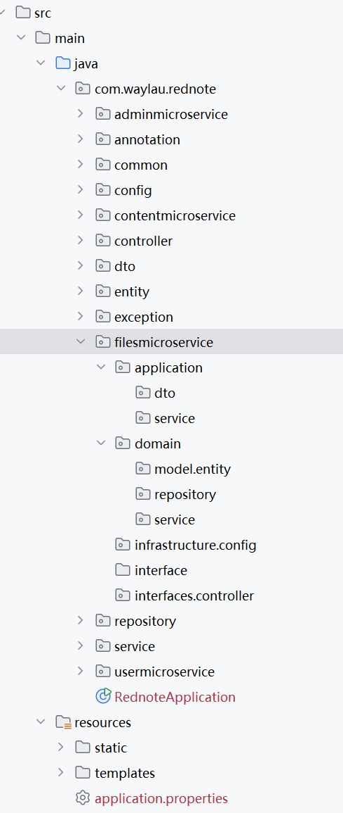
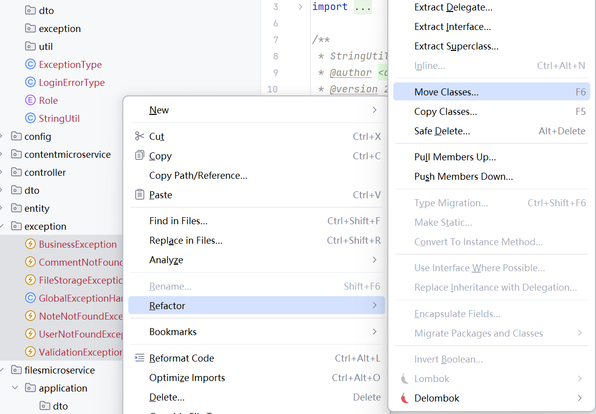
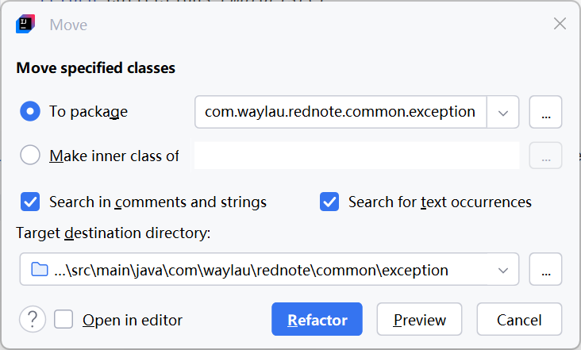
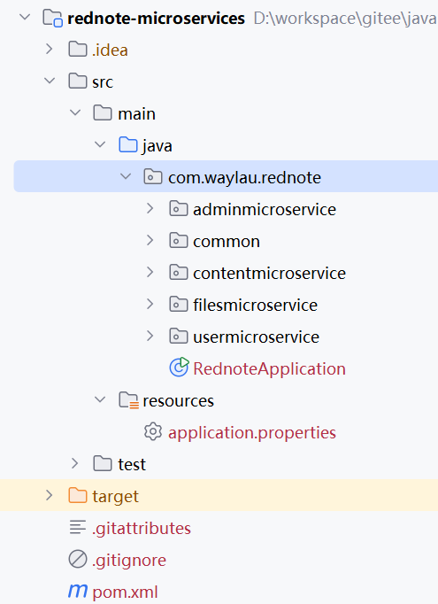
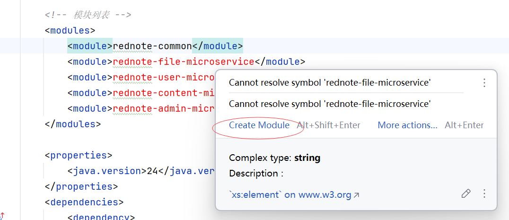
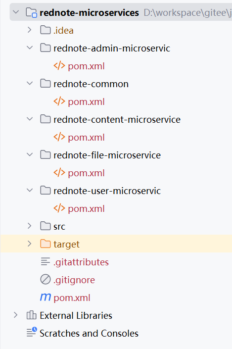
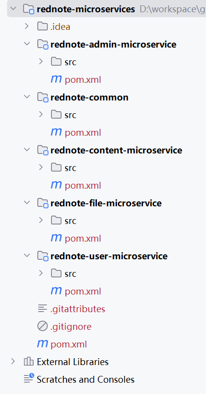

> 本页为原「Java 课程 21」全部 32 个分节的合订本；原分节链接会自动跳转到本页。


## 1.1 如何实现仿“小红书”项目微服务全栈架构改造

将仿“小红书”的单体应用转变为微服务架构需要对系统进行全面重构，涉及服务拆分、通信机制、数据管理、部署架构和治理体系等多个层面。以下是关键调整点和实施建议：


### 微服务拆分策略与服务边界划分

#### 1. 基于领域驱动设计（DDD）的服务拆分


- 文件领域(File Domain)
  - 文件服务(File Service)
- 用户领域(User Domain)
  - 用户服务(User Service)
  - 认证服务(Auth Service)
- 内容领域(Content Domain)
  - 笔记服务(Note Service)
  - 探索服务(Explore Service)
  - 点赞服务(Like Service)
  - 评论服务(Comment Service)
  - 日志服务(Log Service)  
- 管理领域(Admin Domain)
  - 管理服务(Admin Service)  


上述服务，为了跟微服务的“服务”作为区分，我们将领域作为微服务独立部署单元，简称为“领域微服务”，即文件领域微服务 (File Microservice)、用户领域微服务 (User Microservice)、内容领域微服务 (Content Microservice)、管理领域微服务 (Admin Microservice)。


#### 2. 微服务拆分步骤


全栈视角下的微服务拆分不是“一次性革命”，而是“渐进式演进”，尤其适合从单体系统迁移的场景。核心策略是“先拆分边缘服务，再拆分核心服务”，分阶段落地。


```
步骤1: 实现单体应用的前后端分离
步骤2: 开发 API 网关作为统一入口
步骤3: 拆分文件领域服务
步骤4: 拆分用户领域服务
步骤5: 拆分内容领域服务
步骤6: 拆分管理领域服务
```


#### 3. 服务间通信模式

```
同步通信: REST API (Feign Client)
异步通信: 消息队列 (Kafka)
```


### 数据管理策略

#### 1. 数据库拆分
```
用户领域数据库 - rednote_user_domain (t_user、t_user_seq)
内容领域数据库 - rednote_content_domain (t_note、note_images、note_topics、t_like、t_comment、t_comment_seq、t_like_seq、t_note_seq)
```

#### 2. 分布式事务解决方案
```java
// 使用 Seata 实现分布式事务
@GlobalTransactional
public void doSomething() {
    // ...执行微服务1

    // ...执行微服务2

    // ...执行微服务3
}
```


#### 3. 实体关联关系调整挑战

```
挑战:
- 无法直接使用JPA的`@ManyToOne`, `@OneToMany`等注解
- 跨服务查询性能下降
- 数据一致性保障困难

解决方案:
- 使用ID引用替代对象引用
- 实现服务间缓存机制
- 采用最终一致性模型
- 设计反规范化视图表
```


#### 4. 数据库迁移步骤

```
1. 为每个微服务创建独立数据库
2. 逐步迁移业务逻辑到新服务
3. 验证数据一致性
4. 完全切换到新服务
```


### 引入Spring Cloud微服务框架

引入

* API网关
* 服务调用与负载均衡
* 服务注册与发现
* 分布式配置管理
* 分布式事务功能


通过以上改造，系统将从单体架构转变为微服务架构，实现更好的可扩展性、可维护性和容错性。关键是要处理好服务边界划分、数据一致性保障和微服务治理体系建设。


## 2.1 基于DDD的微服务代码结构设计与Maven项目组织

在基于领域驱动设计(DDD)的微服务架构中，代码结构的组织需要同时考虑领域模型的内聚性和服务的自治性。以下是针对您的"小红书"项目的详细设计方案：


### DDD分层架构与服务封装原则

#### 1. 领域模型优先原则

```
领域模型是核心，服务围绕领域模型构建：
- 每个微服务内部遵循DDD分层架构
- 领域模型在Domain层定义
- 服务在Application层协调领域逻辑
```

#### 2. 微服务封装维度
```
建议按领域边界封装微服务：
- 文件领域微服务 (File Microservice)
- 用户领域微服务 (User Microservice)
- 内容领域微服务 (Content Microservice)
- 管理领域微服务 (Admin Microservice)
```


### Maven项目结构设计

#### 1. 多模块项目结构
```
rednote-microservices/
├── pom.xml (父项目)
├── rednote-common/               (公共模块)
│   ├── pom.xml
│   └── src/
│       ├── main/
│       │   ├── java/
│       │   │   └── com/example/rednote/common/
│       │   │       ├── exception/      (通用异常)
│       │   │       ├── util/           (通用工具类)
│       │   │       ├── dto/            (通用DTO)
│       │   │       └── config/         (通用配置)
│       │   └── resources/
│       │       └── application.properties     (公共配置)
│       └── test/
│           └── java/
│               └── com/example/rednote/common/
│                   └── util/           (工具类测试)
│
├── rednote-file-microservice/         (文件领域微服务)
│   ├── pom.xml
│   └── src/
│       ├── main/
│       │   ├── java/
│       │   │   └── com/example/rednote/filesmicroservice/
│       │   │       ├── Application.java (启动类)
│       │   │       ├── domain/         (领域层)
│       │   │       │   ├── model/      (领域模型)
│       │   │       │   │   ├── aggregate/ (聚合根)
│       │   │       │   │   ├── entity/   (实体)
│       │   │       │   │   └── valueobject/ (值对象)
│       │   │       │   ├── repository/ (领域仓储接口)
│       │   │       │   └── service/    (领域服务)
│       │   │       ├── application/    (应用层)
│       │   │       │   ├── service/    (应用服务)
│       │   │       │   └── dto/        (应用层DTO)
│       │   │       ├── infrastructure/ (基础设施层)
│       │   │       │   ├── repository/ (仓储实现)
│       │   │       │   ├── persistence/(持久化模型)
│       │   │       │   └── config/     (配置类)
│       │   │       └── interfaces/      (接口层)
│       │   │           ├── controller/ (控制器)
│       │   │           └── client/     (Feign客户端)
│       │   └── resources/
│       │       └── application.properties     (服务配置)
│       └── test/
│           └── java/
│               └── com/example/rednote/filesmicroservice/
│                   ├── domain/         (领域层测试)
│                   └── application/    (应用层测试)
│
├── rednote-user-microservice/         (用户领域微服务)
│   ├── pom.xml
│   └── src/
│       ├── main/
│       │   ├── java/
│       │   │   └── com/example/rednote/usermicroservice/
│       │   │       ├── Application.java
│       │   │       ├── domain/
│       │   │       │   ├── model/
│       │   │       │   ├── repository/
│       │   │       │   └── service/
│       │   │       ├── application/
│       │   │       │   ├── service/
│       │   │       │   └── dto/
│       │   │       ├── infrastructure/
│       │   │       │   ├── repository/
│       │   │       │   ├── persistence/
│       │   │       │   └── config/
│       │   │       └── interfaces/
│       │   │           ├── controller/
│       │   │           └── client/
│       │   └── resources/
│       │       └── application.properties
│       └── test/
│           └── java/
│               └── com/example/rednote/usermicroservice/
│
├── rednote-content-microservice/      (内容领域微服务)
│   ├── pom.xml
│   └── src/
│       ├── main/
│       │   ├── java/
│       │   │   └── com/example/rednote/contentmicroservice/
│       │   │       ├── Application.java
│       │   │       ├── domain/
│       │   │       │   ├── model/
│       │   │       │   ├── repository/
│       │   │       │   └── service/
│       │   │       ├── application/
│       │   │       │   ├── service/
│       │   │       │   └── dto/
│       │   │       ├── infrastructure/
│       │   │       │   ├── repository/
│       │   │       │   ├── persistence/
│       │   │       │   └── config/
│       │   │       └── interfaces/
│       │   │           ├── controller/
│       │   │           └── client/
│       │   └── resources/
│       │       └── application.properties
│       └── test/
│           └── java/
│               └── com/example/rednote/contentmicroservice/
│
└── rednote-admin-microservice/        (管理领域微服务)
    ├── pom.xml
    └── src/
        ├── main/
        │   ├── java/
        │   │   └── com/example/rednote/adminmicroservice/
        │   │       ├── Application.java
        │   │       ├── domain/
        │   │       │   ├── model/
        │   │       │   ├── repository/
        │   │       │   └── service/
        │   │       ├── application/
        │   │       │   ├── service/
        │   │       │   └── dto/
        │   │       ├── infrastructure/
        │   │       │   ├── repository/
        │   │       │   ├── persistence/
        │   │       │   └── config/
        │   │       └── interfaces/
        │   │           ├── controller/
        │   │           └── client/
        │   └── resources/
        │       └── application.properties
        └── test/
            └── java/
                └── com/example/rednote/adminmicroservice/
```


#### 2. 依赖原则
```
1. 上层可以依赖下层，下层不能依赖上层
2. 领域层不依赖基础设施层具体实现
3. 服务间通过接口层暴露的API通信
4. 避免循环依赖
```

#### 3. 领域模型完整性
```
- 每个微服务拥有自己完整的领域模型
- 领域模型不跨越服务边界
- 服务间通过DTO或事件进行协作
```

#### 4. 服务自治性
```
- 每个微服务拥有独立的数据库
- 避免服务间直接访问数据库
- 通过API或消息队列进行通信
```

#### 5. 渐进式迁移策略

```
1. 先拆分独立的领域服务 (如文件领域微服务)
2. 再拆分有依赖关系的服务 (如用户领域微服务)
3. 最后处理复杂的核心领域 (如内容领域微服务、管理领域微服务)
```


通过这种代码结构设计，您可以实现基于DDD的微服务架构，保持领域模型的完整性和服务的自治性，同时便于团队协作和系统维护。


## 2.2 实战基于DDD的微服务代码结构改造

### 按照DDD分层架构新建包名


1. 修改项目名“rednote”为“rednote-microservices”
2. 将原有项目的下创建按照DDD分层架构要求的包名。以文件领域微服务为例，包名结构如下图2-1所示。




### 按照DDD分层架构对代码进行重构


通过重构的方式，将原有项目的下移动到DDD分层架构的对应包名下。IntelliJ IDEA的重构功能如下图2-2所示。



选中目标路径，点击“Refactor”按钮将代码进行移动。




### 清理冗余代码和包

1. 原先废弃的代码和注释进行清理
2. 被移走代码后，空缺的包进行删除
3. 移除`src/main/resources`包下的static、templates目录。
4. 移除`spring-boot-starter-thymeleaf`、`thymeleaf-extras-springsecurity6`、`spring-session-data-redis`
5. 删除以下配置信息
6. 删除IndexController类、ErrorController类

```
# Thymeleaf 配置
spring.thymeleaf.cache=false
spring.thymeleaf.encoding=UTF-8

# 会话超时
server.servlet.session.timeout=10m

# 配置 Spring Session
## 控制会话数据同步到 Redis 的时机，分别是 ON_SAVE 和 IMMEDIATE.
spring.session.redis.flush-mode=on_save
## 会话存储的key的命名空间，可以区分多应用下的key
spring.session.redis.namespace=spring:session:rednote
```


最终，代码结构如下图2-4所示。




### 运行调测


重构理论上不应该修改现有的业务逻辑。因此，重构完成之后，应运行调测确保启动正常、功能完整。


## 2.3 基于DDD的Maven多模块化改造

Maven多模块项目允许你将一个大型项目拆分为多个子模块，每个模块可以独立开发、构建和部署。下面是一个完整的多模块项目配置示例。

### 项目结构


```
rednote-microservices/
├── pom.xml (父POM)
├── rednote-common/               (公共模块)
│   ├── pom.xml
│   └── src/
│── rednote-file-microservice/         (文件领域微服务模块)
│   ├── pom.xml
│   └── src/
├── rednote-user-microservice/         (用户领域微服务模块)
│   ├── pom.xml
│   └── src/
├── rednote-content-microservice/      (内容领域微服务模块)
│   ├── pom.xml
│   └── src/
└── rednote-admin-microservice/        (管理领域微服务模块)
    ├── pom.xml
    └── src/
```    

### 关键点说明

1. 父POM：
   - `packaging` 必须为 `pom`
   - 通过 `<modules>` 声明所有子模块
   - 使用 `<dependencyManagement>` 统一管理依赖版本
   - 使用 `<pluginManagement>` 统一管理插件配置

2. 子模块：
   - 必须声明父POM的坐标
   - 可以继承父POM的依赖管理和插件管理
   - 可以定义自己的依赖和插件
   - 可以通过 `${project.version}` 引用父POM的版本号

3. 构建命令：
   - 构建整个项目：`mvn clean install`
   - 构建特定模块：`mvn clean install -pl rednote-user-microservice`
   - 构建多个模块：`mvn clean install -pl rednote-common,rednote-file-microservice`
   - 构建并跳过测试：`mvn clean install -DskipTests`


### 父模块rednote-microservices

```xml
<?xml version="1.0" encoding="UTF-8"?>
<project xmlns="http://maven.apache.org/POM/4.0.0" xmlns:xsi="http://www.w3.org/2001/XMLSchema-instance"
	xsi:schemaLocation="http://maven.apache.org/POM/4.0.0 https://maven.apache.org/xsd/maven-4.0.0.xsd">
	<modelVersion>4.0.0</modelVersion>
	<parent>
		<groupId>org.springframework.boot</groupId>
		<artifactId>spring-boot-starter-parent</artifactId>
		<version>3.5.0</version>
		<relativePath/> <!-- lookup parent from repository -->
	</parent>
	<groupId>com.example</groupId>
	<artifactId>rednote-microservices</artifactId>
	<version>0.0.1-SNAPSHOT</version>
	<packaging>pom</packaging>  <!-- 父POM的packaging必须是pom -->
	<name>rednote-microservices</name>
	<description>RedNote. 仿“小红书”项目</description>
	<url/>
	<licenses>
		<license/>
	</licenses>
	<developers>
		<developer/>
	</developers>
	<scm>
		<connection/>
		<developerConnection/>
		<tag/>
		<url/>
	</scm>

	<!-- 模块列表 -->
	<modules>
		<module>rednote-common</module>
		<module>rednote-file-microservice</module>
		<module>rednote-user-microservice</module>
		<module>rednote-content-microservice</module>
		<module>rednote-admin-microservice</module>
	</modules>

	<properties>
		<java.version>24</java.version>
		<mysql-connector-j.version>9.3.0</mysql-connector-j.version>
		<jsonwebtoken.version>0.12.6</jsonwebtoken.version>
    <jakarta.persistence-api.version>3.1.0</jakarta.persistence-api.version>
	</properties>

	<dependencies>

		<dependency>
			<groupId>org.springframework.boot</groupId>
			<artifactId>spring-boot-starter-security</artifactId>
		</dependency>

		<dependency>
			<groupId>org.springframework.boot</groupId>
			<artifactId>spring-boot-starter-validation</artifactId>
		</dependency>
		<dependency>
			<groupId>org.springframework.boot</groupId>
			<artifactId>spring-boot-starter-web</artifactId>
		</dependency>

		<dependency>
			<groupId>org.projectlombok</groupId>
			<artifactId>lombok</artifactId>
			<optional>true</optional>
		</dependency>
		<dependency>
			<groupId>org.springframework.boot</groupId>
			<artifactId>spring-boot-starter-test</artifactId>
			<scope>test</scope>
		</dependency>
		<dependency>
			<groupId>org.springframework.security</groupId>
			<artifactId>spring-security-test</artifactId>
			<scope>test</scope>
		</dependency>
		<dependency>
			<groupId>org.springframework.boot</groupId>
			<artifactId>spring-boot-starter-data-redis</artifactId>
		</dependency>

		<dependency>
			<groupId>org.springframework.kafka</groupId>
			<artifactId>spring-kafka</artifactId>
		</dependency>

		<dependency>
			<groupId>io.jsonwebtoken</groupId>
			<artifactId>jjwt-api</artifactId>
			<version>${jsonwebtoken.version}</version>
		</dependency>
		<dependency>
			<groupId>io.jsonwebtoken</groupId>
			<artifactId>jjwt-impl</artifactId>
			<version>${jsonwebtoken.version}</version>
		</dependency>
		<dependency>
			<groupId>io.jsonwebtoken</groupId>
			<artifactId>jjwt-jackson</artifactId>
			<version>${jsonwebtoken.version}</version>
		</dependency>
	</dependencies>

	<build>
		<plugins>
			<plugin>
				<groupId>org.apache.maven.plugins</groupId>
				<artifactId>maven-compiler-plugin</artifactId>
				<configuration>
					<annotationProcessorPaths>
						<path>
							<groupId>org.projectlombok</groupId>
							<artifactId>lombok</artifactId>
						</path>
					</annotationProcessorPaths>
				</configuration>
			</plugin>
		</plugins>
	</build>

</project>
```


通过IntelliJ IDEA，在父POM中点击模块列表中的模块，可以自动创建子模块，如下图2-5所示。




最终，项目结构如下图2-6所示。




### 子模块rednote-common/pom.xml

```xml
<?xml version="1.0" encoding="UTF-8"?>
<project xmlns="http://maven.apache.org/POM/4.0.0"
         xmlns:xsi="http://www.w3.org/2001/XMLSchema-instance"
         xsi:schemaLocation="http://maven.apache.org/POM/4.0.0 http://maven.apache.org/xsd/maven-4.0.0.xsd">
    <parent>
        <groupId>com.example</groupId>
        <artifactId>rednote-microservices</artifactId>
        <version>0.0.1-SNAPSHOT</version>
    </parent>

    <modelVersion>4.0.0</modelVersion>
    <groupId>com.example</groupId>
    <artifactId>rednote-common</artifactId>
    <name>rednote-common</name>
    <packaging>jar</packaging>
    <description>公共模块</description>

    <!-- 子模块可以定义自己的依赖 -->
    <dependencies>
        <!--因移除了spring-boot-starter-data-jpa，因此需要手动添加-->
        <dependency>
            <groupId>jakarta.persistence</groupId>
            <artifactId>jakarta.persistence-api</artifactId>
            <version>${jakarta.persistence-api.version}</version>
        </dependency>

        <dependency>
            <groupId>org.springframework.boot</groupId>
            <artifactId>spring-boot-starter-security</artifactId>
        </dependency>

        <dependency>
            <groupId>org.springframework.security</groupId>
            <artifactId>spring-security-test</artifactId>
            <scope>test</scope>
        </dependency>

    </dependencies>
</project>
```

### 子模块rednote-file-microservice/pom.xml

```xml
<?xml version="1.0" encoding="UTF-8"?>
<project xmlns="http://maven.apache.org/POM/4.0.0"
         xmlns:xsi="http://www.w3.org/2001/XMLSchema-instance"
         xsi:schemaLocation="http://maven.apache.org/POM/4.0.0 http://maven.apache.org/xsd/maven-4.0.0.xsd">
    <parent>
        <groupId>com.example</groupId>
        <artifactId>rednote-microservices</artifactId>
        <version>0.0.1-SNAPSHOT</version>
    </parent>

    <modelVersion>4.0.0</modelVersion>
    <groupId>com.example</groupId>
    <artifactId>rednote-file-microservice</artifactId>
    <name>rednote-file-microservice</name>
    <packaging>jar</packaging>
    <description>文件领域微服务模块</description>

    <!-- 子模块可以定义自己的依赖 -->
    <dependencies>
        <!-- 依赖公共模块 -->
        <dependency>
            <groupId>com.example</groupId>
            <artifactId>rednote-common</artifactId>
            <version>${project.version}</version>
        </dependency>

        <dependency>
            <groupId>org.springframework.boot</groupId>
            <artifactId>spring-boot-starter-data-mongodb</artifactId>
        </dependency>
    </dependencies>

    <!-- 子模块可以定义自己的插件-->
    <build>
        <plugins>
            <plugin>
                <groupId>org.springframework.boot</groupId>
                <artifactId>spring-boot-maven-plugin</artifactId>
            </plugin>
        </plugins>
    </build>
</project>
```

### 子模块rednote-user-microservice/pom.xml

```xml
<?xml version="1.0" encoding="UTF-8"?>
<project xmlns="http://maven.apache.org/POM/4.0.0"
         xmlns:xsi="http://www.w3.org/2001/XMLSchema-instance"
         xsi:schemaLocation="http://maven.apache.org/POM/4.0.0 http://maven.apache.org/xsd/maven-4.0.0.xsd">
    <parent>
        <groupId>com.example</groupId>
        <artifactId>rednote-microservices</artifactId>
        <version>0.0.1-SNAPSHOT</version>
    </parent>

    <modelVersion>4.0.0</modelVersion>
    <groupId>com.example</groupId>
    <artifactId>rednote-user-microservice</artifactId>
    <name>rednote-user-microservice</name>
    <packaging>jar</packaging>
    <description>用户领域微服务模块</description>

    <!-- 子模块可以定义自己的依赖 -->
    <dependencies>
        <!-- 依赖公共模块 -->
        <dependency>
            <groupId>com.example</groupId>
            <artifactId>rednote-common</artifactId>
            <version>${project.version}</version>
        </dependency>

        <dependency>
            <groupId>org.springframework.boot</groupId>
            <artifactId>spring-boot-starter-data-jpa</artifactId>
        </dependency>
        <dependency>
            <groupId>com.mysql</groupId>
            <artifactId>mysql-connector-j</artifactId>
            <scope>runtime</scope>
            <version>${mysql-connector-j.version}</version>
        </dependency>
    </dependencies>

    <!-- 子模块可以定义自己的插件-->
    <build>
        <plugins>
            <plugin>
                <groupId>org.springframework.boot</groupId>
                <artifactId>spring-boot-maven-plugin</artifactId>
            </plugin>
        </plugins>
    </build>
</project>
```

### 子模块rednote-admin-microservice/pom.xml

```xml
<?xml version="1.0" encoding="UTF-8"?>
<project xmlns="http://maven.apache.org/POM/4.0.0"
         xmlns:xsi="http://www.w3.org/2001/XMLSchema-instance"
         xsi:schemaLocation="http://maven.apache.org/POM/4.0.0 http://maven.apache.org/xsd/maven-4.0.0.xsd">
    <parent>
        <groupId>com.example</groupId>
        <artifactId>rednote-microservices</artifactId>
        <version>0.0.1-SNAPSHOT</version>
    </parent>

    <modelVersion>4.0.0</modelVersion>
    <groupId>com.example</groupId>
    <artifactId>rednote-admin-microservice</artifactId>
    <name>rednote-admin-microservice</name>
    <packaging>jar</packaging>
    <description>管理领域微服务模块</description>

    <!-- 子模块可以定义自己的依赖 -->
    <dependencies>
        <!-- 依赖公共模块 -->
        <dependency>
            <groupId>com.example</groupId>
            <artifactId>rednote-common</artifactId>
            <version>${project.version}</version>
        </dependency>
    </dependencies>

    <!-- 子模块可以定义自己的插件-->
    <build>
        <plugins>
            <plugin>
                <groupId>org.springframework.boot</groupId>
                <artifactId>spring-boot-maven-plugin</artifactId>
            </plugin>
        </plugins>
    </build>
</project>
```

### 子模块rednote-content-microservice/pom.xml

```xml
<?xml version="1.0" encoding="UTF-8"?>
<project xmlns="http://maven.apache.org/POM/4.0.0"
         xmlns:xsi="http://www.w3.org/2001/XMLSchema-instance"
         xsi:schemaLocation="http://maven.apache.org/POM/4.0.0 http://maven.apache.org/xsd/maven-4.0.0.xsd">
    <parent>
        <groupId>com.example</groupId>
        <artifactId>rednote-microservices</artifactId>
        <version>0.0.1-SNAPSHOT</version>
    </parent>

    <modelVersion>4.0.0</modelVersion>
    <groupId>com.example</groupId>
    <artifactId>rednote-content-microservice</artifactId>
    <name>rednote-content-microservice</name>
    <packaging>jar</packaging>
    <description>内容领域微服务模块</description>

    <!-- 子模块可以定义自己的依赖 -->
    <dependencies>
        <!-- 依赖公共模块 -->
        <dependency>
            <groupId>com.example</groupId>
            <artifactId>rednote-common</artifactId>
            <version>${project.version}</version>
        </dependency>

        <dependency>
            <groupId>org.springframework.boot</groupId>
            <artifactId>spring-boot-starter-data-jpa</artifactId>
        </dependency>
        <dependency>
            <groupId>com.mysql</groupId>
            <artifactId>mysql-connector-j</artifactId>
            <scope>runtime</scope>
            <version>${mysql-connector-j.version}</version>
        </dependency>
    </dependencies>

    <!-- 子模块可以定义自己的插件-->
    <build>
        <plugins>
            <plugin>
                <groupId>org.springframework.boot</groupId>
                <artifactId>spring-boot-maven-plugin</artifactId>
            </plugin>
        </plugins>
    </build>
</project>
```


### 最佳实践

1. 将公共依赖和插件配置放在父POM中
2. 使用属性管理版本号，便于统一升级
3. 合理划分模块，避免循环依赖
4. 为每个模块定义清晰的职责
5. 考虑使用Maven的聚合和继承特性分离关注点

这样的多模块结构适合中大型项目，可以提高代码复用性、降低耦合度，并简化项目维护。


## 2.4 现有代码迁移至指定模块下

### 按照包名迁移至指定模块下


按照包名将代码整体迁移至与包名对应的指定模块。


### 领域微服务模块放置启动类


四个领域微服务下放置启动类RednoteApplication。


```java
import org.springframework.boot.SpringApplication;
import org.springframework.boot.autoconfigure.SpringBootApplication;

@SpringBootApplication
public class RednoteApplication {

	public static void main(String[] args) {
		SpringApplication.run(RednoteApplication.class, args);
	}

}
```


### 领域微服务模块放置应用配置


#### rednote-file-microservice

```
spring.application.name=rednote-file-microservice
server.port=9010


# 文件上传配置
file.upload-dir=/data/rednote
file.static-path-prefix=/uploads/

# 上传文件大小限制
spring.servlet.multipart.max-file-size=10MB
spring.servlet.multipart.max-request-size=10MB

# 配置内嵌的 tomcat 的最大吞吐量
server.tomcat.max-swallow-size = 100MB

# 配置 MongoDB
spring.data.mongodb.uri=mongodb://localhost:27017
spring.data.mongodb.grid-fs-database=rednote_files
spring.data.mongodb.database=rednote

# 配置 JWT
## 你的Base64编码密钥（至少256位）
app.jwtSecret=bQUBj9U7io0VXuhlaC9XmeaSGSwkqOlG4itHzIgUvOk=
## 24小时
app.jwtExpirationMs=86400000
```

#### rednote-user-microservice

```
spring.application.name=rednote-user-microservice
server.port=9020

# 数据库配置
spring.datasource.url=jdbc:mysql://localhost:3306/rednote
spring.datasource.username=root
spring.datasource.password=123456

## 启动时更新表结构，添加缺少的列，修改已有列类型等，但不会删除任何东西。
spring.jpa.properties.hibernate.hbm2ddl.auto=update
## 显示SQL
spring.jpa.show-sql=true

# 管理员配置
admin.username=admin
admin.password=admin123

# 配置 JWT
## 你的Base64编码密钥（至少256位）
app.jwtSecret=bQUBj9U7io0VXuhlaC9XmeaSGSwkqOlG4itHzIgUvOk=
## 24小时
app.jwtExpirationMs=86400000
```


#### rednote-content-microservice

```
spring.application.name=rednote-content-microservice
server.port=9030

# 数据库配置
spring.datasource.url=jdbc:mysql://localhost:3306/rednote
spring.datasource.username=root
spring.datasource.password=123456

## 启动时更新表结构，添加缺少的列，修改已有列类型等，但不会删除任何东西。
spring.jpa.properties.hibernate.hbm2ddl.auto=update
## 显示SQL
spring.jpa.show-sql=true

# 文件上传配置
file.upload-dir=/data/rednote
file.static-path-prefix=/uploads/

# 上传文件大小限制
spring.servlet.multipart.max-file-size=10MB
spring.servlet.multipart.max-request-size=10MB

# 配置内嵌的 tomcat 的最大吞吐量
server.tomcat.max-swallow-size = 100MB

# 配置 Spring Data Redis
spring.data.redis.host: localhost
spring.data.redis.port: 6379
spring.data.redis.password:

# 配置 Kafka
spring.kafka.bootstrap-servers=localhost:9092
spring.kafka.producer.key-serializer=org.apache.kafka.common.serialization.StringSerializer
spring.kafka.producer.value-serializer=org.springframework.kafka.support.serializer.JsonSerializer
spring.kafka.producer.retries=3
spring.kafka.producer.batch-size=16384
spring.kafka.producer.buffer-memory=33554432
spring.kafka.consumer.group-id=rednote-group
spring.kafka.consumer.auto-offset-reset=earliest
spring.kafka.consumer.key-deserializer=org.apache.kafka.common.serialization.StringDeserializer
spring.kafka.consumer.value-deserializer=org.springframework.kafka.support.serializer.JsonDeserializer
spring.kafka.consumer.properties.spring.json.trusted.packages=com.example.rednote.*

# 配置 JWT
## 你的Base64编码密钥（至少256位）
app.jwtSecret=bQUBj9U7io0VXuhlaC9XmeaSGSwkqOlG4itHzIgUvOk=
## 24小时
app.jwtExpirationMs=86400000
```


#### rednote-admin-microservice

```xml
spring.application.name=rednote-admin-microservice
server.port=9040

# 配置 Spring Data Redis
spring.data.redis.host: localhost
spring.data.redis.port: 6379
spring.data.redis.password:

# 配置 Kafka
spring.kafka.bootstrap-servers=localhost:9092
spring.kafka.producer.key-serializer=org.apache.kafka.common.serialization.StringSerializer
spring.kafka.producer.value-serializer=org.springframework.kafka.support.serializer.JsonSerializer
spring.kafka.producer.retries=3
spring.kafka.producer.batch-size=16384
spring.kafka.producer.buffer-memory=33554432
spring.kafka.consumer.group-id=rednote-group
spring.kafka.consumer.auto-offset-reset=earliest
spring.kafka.consumer.key-deserializer=org.apache.kafka.common.serialization.StringDeserializer
spring.kafka.consumer.value-deserializer=org.springframework.kafka.support.serializer.JsonDeserializer
spring.kafka.consumer.properties.spring.json.trusted.packages=com.example.rednote.*

# 配置 JWT
## 你的Base64编码密钥（至少256位）
app.jwtSecret=bQUBj9U7io0VXuhlaC9XmeaSGSwkqOlG4itHzIgUvOk=
## 24小时
app.jwtExpirationMs=86400000
```


最终，代码结构如下图2-7所示。




## 3.1 引入Spring Cloud微服务框架

### 添加Spring Cloud依赖管理

修改父模块pom.xml


```xml
<properties>
    <!--...为节约篇幅，此处省略非核心内容-->
    <spring-cloud.version>2025.0.0</spring-cloud.version>
</properties>

<!--...为节约篇幅，此处省略非核心内容-->
<dependencyManagement>
    <dependencies>
        <dependency>
            <groupId>org.springframework.cloud</groupId>
            <artifactId>spring-cloud-dependencies</artifactId>
            <version>${spring-cloud.version}</version>
            <type>pom</type>
            <scope>import</scope>
        </dependency>
    </dependencies>
</dependencyManagement>
```


### 添加Spring Cloud Alibaba依赖管理

修改父模块pom.xml


```xml
<properties>
    <!--...为节约篇幅，此处省略非核心内容-->
    <spring-cloud-alibaba.version>2025.0.0.0</spring-cloud-alibaba.version>
</properties>

<!--...为节约篇幅，此处省略非核心内容-->
<dependencyManagement>
    <dependencies>
			<dependency>
				<groupId>com.alibaba.cloud</groupId>
				<artifactId>spring-cloud-alibaba-dependencies</artifactId>
				<version>${spring-cloud-alibaba.version}</version>
				<type>pom</type>
				<scope>import</scope>
			</dependency>
		</dependencies>
</dependencyManagement>
```


## 3.2 API网关微服务的设计与实现方案

在微服务架构中，API网关是前端与后端服务的桥梁，负责请求路由、认证授权、流量控制等核心功能。针对您的"小红书"项目，引入API网关微服务需要从架构设计、技术选型、配置实现等多方面考虑。


### API网关的核心功能定位

#### 1. 核心职责
```
- 请求路由：将前端请求转发到对应的微服务
- 认证授权：统一校验用户身份和权限
- 流量控制：实现限流、熔断、降级等保护机制
- 协议转换：适配不同微服务的协议和接口格式
- 请求增强：添加请求头、参数校验、日志记录等
```

#### 2. 不建议在网关层实现的功能
```
- 复杂业务逻辑处理
- 数据持久化操作
- 与特定业务领域强相关的功能
```


### 创建新模块


修改父模块pom.xml：


```xml
<!-- 模块列表 -->
<modules>
	<!--...为节约篇幅，此处省略非核心内容-->
	<module>rednote-gateway-microservice</module>
</modules>
```

上述配置：

* 创建了新的模块rednote-gateway-microservice代表API网关领域微服务模块


修改自己的pom.xml：

```xml
<?xml version="1.0" encoding="UTF-8"?>
<project xmlns="http://maven.apache.org/POM/4.0.0"
         xmlns:xsi="http://www.w3.org/2001/XMLSchema-instance"
         xsi:schemaLocation="http://maven.apache.org/POM/4.0.0 http://maven.apache.org/xsd/maven-4.0.0.xsd">
    <parent>
        <groupId>com.example</groupId>
        <artifactId>rednote-microservices</artifactId>
        <version>0.0.1-SNAPSHOT</version>
    </parent>

    <modelVersion>4.0.0</modelVersion>
    <groupId>com.example</groupId>
    <artifactId>rednote-gateway-microservice</artifactId>
    <version>0.0.1-SNAPSHOT</version>
    <name>rednote-gateway-microservice</name>
    <packaging>jar</packaging>
    <description>API网关领域微服务模块</description>

    <!-- 子模块可以定义自己的依赖包 -->
    <dependencies>
    <!--...为节约篇幅，此处省略非核心内容-->
        <dependency>
            <groupId>org.springframework.cloud</groupId>
            <artifactId>spring-cloud-starter-gateway-server-webmvc</artifactId>
        </dependency>
    </dependencies>

    <!-- 子模块可以定义自己的插件 -->
    <build>
        <plugins>
            <plugin>
                <groupId>org.springframework.boot</groupId>
                <artifactId>spring-boot-maven-plugin</artifactId>
            </plugin>
        </plugins>
    </build>
</project>
```


上述配置：

* 引入了Spring Cloud Gateway

### 创建启动类

在`src/main/java/com/example/rednote/gatewaymicroservice`目录下创建启动类：


```java
package com.example.rednote.gatewaymicroservice;

import org.springframework.boot.SpringApplication;
import org.springframework.boot.autoconfigure.SpringBootApplication;

@SpringBootApplication
public class RednoteApplication {

	public static void main(String[] args) {
		SpringApplication.run(RednoteApplication.class, args);
	}

}
```

### 增加配置

在应用配置中添加如下配置：

```
spring.application.name=rednote-gateway-microservice
server.port=8080

# 配置 JWT
## 你的Base64编码密钥（至少256位）
app.jwtSecret=bQUBj9U7io0VXuhlaC9XmeaSGSwkqOlG4itHzIgUvOk=
## 24小时
app.jwtExpirationMs=86400000
```


### 路由配置

在应用配置中添加如下配置：

```
# 配置 Spring Cloud Gateway
spring.cloud.gateway.server.webmvc.enabled=true

## 路由配置
spring.cloud.gateway.mvc.routes[0].id=rednote-user-microservice
spring.cloud.gateway.mvc.routes[0].uri=lb://rednote-user-microservice
spring.cloud.gateway.mvc.routes[0].predicates[0]=Path=/user/**,/auth/**
spring.cloud.gateway.mvc.routes[1].id=rednote-content-microservice
spring.cloud.gateway.mvc.routes[1].uri=lb://rednote-content-microservice
spring.cloud.gateway.mvc.routes[1].predicates[0]=Path=/note/**,/explore/**,/comment/**,/like/**,/log/**
spring.cloud.gateway.mvc.routes[2].id=rednote-file-microservice
spring.cloud.gateway.mvc.routes[2].uri=lb://rednote-file-microservice
spring.cloud.gateway.mvc.routes[2].predicates[0]=Path=/file/**,/uploads/**
spring.cloud.gateway.mvc.routes[3].id=rednote-admin-microservice
spring.cloud.gateway.mvc.routes[3].uri=lb://rednote-admin-microservice
spring.cloud.gateway.mvc.routes[3].predicates[0]=Path=/admin/**
```


## 3.3 开启服务调用与负载均衡功能

spring-cloud-loadbalancer 是 Spring Cloud 提供的 客户端负载均衡器，用于在微服务架构中动态选择服务实例，实现请求的负载分发。它是 Netflix Ribbon 的替代方案（Ribbon 已停止维护），与 Spring Cloud Gateway、Feign、RestTemplate 等组件无缝集成，支持多种负载均衡策略。

### 添加依赖


修改父模块pom.xml


```xml
<dependencies>
  <!--...为节约篇幅，此处省略非核心内容-->
  <dependency>
		<groupId>org.springframework.cloud</groupId>
		<artifactId>spring-cloud-loadbalancer</artifactId>
	</dependency>
	<dependency>
		<groupId>org.springframework.cloud</groupId>
		<artifactId>spring-cloud-starter-openfeign</artifactId>
	</dependency>
</dependencies>
```


### 增加配置

在所有领域微服务应用配置中添加如下配置：

```
# 配置 Spring Cloud Loadbalancer
spring.cloud.loadbalancer.enabled=true
```


## 3.4 开启服务注册与发现功能

### 添加依赖


修改父模块pom.xml


```xml
<properties>
  <!--...为节约篇幅，此处省略非核心内容-->
	<nacos.version>3.1.1</nacos.version>
</properties>

<dependencies>
  <!--...为节约篇幅，此处省略非核心内容-->
  <dependency>
		<groupId>com.alibaba.cloud</groupId>
		<artifactId>spring-cloud-starter-alibaba-nacos-discovery</artifactId>
  </dependency>
</dependencies>

<dependencyManagement>
		<dependencies>
				<!--...为节约篇幅，此处省略非核心内容-->
				
				<!-- 强制指定 nacos-client 版本-->
				<dependency>
						<groupId>com.alibaba.nacos</groupId>
						<artifactId>nacos-client</artifactId>
						<version>${nacos.version}</version>
				</dependency>
		</dependencies>
</dependencyManagement>
```

### 启用功能

在所有领域微服务应用的RednoteApplication中添加`@EnableDiscoveryClient`：


```java
package com.example.rednote.filesmicroservice;

import org.springframework.boot.SpringApplication;
import org.springframework.boot.autoconfigure.SpringBootApplication;
import org.springframework.cloud.client.discovery.EnableDiscoveryClient;

@SpringBootApplication
@EnableDiscoveryClient
public class RednoteApplication {

	public static void main(String[] args) {
		SpringApplication.run(RednoteApplication.class, args);
	}

}
```

### 增加配置

在所有领域微服务应用配置中添加如下配置：

```
# 配置 Nacos
spring.cloud.loadbalancer.nacos.enabled=true
spring.cloud.nacos.discovery.server-addr=127.0.0.1:8848
management.endpoints.web.exposure.include=*
```


## 3.5 开启分布式配置管理

### 添加依赖


修改父模块pom.xml


```xml
<dependencies>
  <!--...为节约篇幅，此处省略非核心内容-->
  <dependency>
    <groupId>com.alibaba.cloud</groupId>
    <artifactId>spring-cloud-starter-alibaba-nacos-config</artifactId>
  </dependency>
</dependencies>
```


### 增加配置

在所有领域微服务应用配置中添加如下配置：

```
spring.cloud.nacos.config.server-addr=127.0.0.1:8848
```

并针对各个应用的应用名称不同，分别增加以下配置

```
spring.config.import[0]=nacos:rednote-file-microservice.properties?group=DEFAULT_GROUP
```

```
spring.config.import[0]=nacos:rednote-user-microservice.properties?group=DEFAULT_GROUP
```

```
spring.config.import[0]=nacos:rednote-content-microservice.properties?group=DEFAULT_GROUP
```

```
spring.config.import[0]=nacos:rednote-admin-microservice.properties?group=DEFAULT_GROUP
```

```
spring.config.import[0]=nacos:rednote-gateway-microservice.properties?group=DEFAULT_GROUP
```


## 3.6 开启分布式事务功能

### 添加依赖


修改父模块pom.xml


```xml
<dependencies>
  <!--...为节约篇幅，此处省略非核心内容-->
  <dependency>
    <groupId>com.alibaba.cloud</groupId>
    <artifactId>spring-cloud-starter-alibaba-seata</artifactId>
  </dependency>
</dependencies>
```


### 增加配置

在所有领域微服务应用配置中添加如下配置：

```
# 配置 Seata
seata.tx-service-group=rednote_tx_group
seata.service.vgroup-mapping.rednote_tx_group=default
seata.registry.type=nacos
seata.registry.nacos.server-addr=127.0.0.1:8848
seata.registry.nacos.namespace=public
seata.registry.nacos.cluster=default
```


## 4.1 新增文件上传接口

修改FileController，新增文件上传接口：

```java
/**
 * 上传文件
 *
 * @param file
 * @return
 */
@PostMapping(consumes = MediaType.MULTIPART_FORM_DATA_VALUE)
public ResponseEntity<String> uploadImage(@RequestPart("file") MultipartFile file) {
    String fileId = null;

    // 验证文件
    if (file != null && !file.isEmpty()) {
        // 处理文件上传
        fileId = gridFSStorageService.uploadImage(file);
    }

    return ResponseEntity.ok(fileId);
}
```

服务间调用使用 Feign 客户端，文件上传需要通过 multipart/form-data 格式传输，但 Feign 客户端默认不会自动设置该格式，也不会正确处理 MultipartFile 类型参数，导致服务端接收的请求不是 multipart 类型。Feign 客户端必须显式指定请求类型为 multipart/form-data，并使用 @RequestPart 注解接收文件。


## 4.2 新增文件删除接口

修改FileController，新增文件删除接口：

```java
/**
 * 删除文件
 *
 * @param fileId
 * @return
 */
@DeleteMapping("/{fileId}")
public ResponseEntity<String> deleteImage(@PathVariable String fileId) {
    // 验证文件是否存在
    GridFSFile file = gridFSStorageService.downloadImage(fileId);

    if (file == null) {
        return ResponseEntity.ok("文件不存在");
    }

    gridFSStorageService.deleteImage(fileId);

    return ResponseEntity.ok("文件删除成功");
}
```


## 5.1 修改用户控制器支持调用内容领域微服务

### 启用Feign


在用户领域微服务的Spring Boot启动类上添加`@EnableFeignClients`注解，并指定 Feign 客户端所在的包路径：：

```java
package com.example.rednote.usermicroservice;

import org.springframework.boot.SpringApplication;
import org.springframework.boot.autoconfigure.SpringBootApplication;
import org.springframework.cloud.client.discovery.EnableDiscoveryClient;
import org.springframework.cloud.openfeign.EnableFeignClients;

@SpringBootApplication(scanBasePackages = "com.example.rednote")
@EnableDiscoveryClient
@EnableFeignClients(basePackages = {"com.example.rednote.common.interfaces.client"})
public class RednoteApplication {

	public static void main(String[] args) {
		SpringApplication.run(RednoteApplication.class, args);
	}

}
```

同时，为了能够确保所有相关模块的组件、服务和配置都能被Spring容器正确加载，将scanBasePackages设置为顶层包“com.example.rednote”。


### 配置Feign客户端实现熔断降级


在公共模块下新建`src/main/java/com/example/rednote/common/interfaces/client/ContentServiceClient.java`，使用fallback实现熔断降级：


```java
package com.example.rednote.common.interfaces.client;

import com.example.rednote.common.dto.NotesWithUserDto;
import org.springframework.cloud.openfeign.FeignClient;
import org.springframework.http.ResponseEntity;
import org.springframework.web.bind.annotation.GetMapping;
import org.springframework.web.bind.annotation.PathVariable;
import org.springframework.web.bind.annotation.RequestParam;

/**
 * ContentServiceClient ContentService Feign Client
 *
 * @version 2025/07/21
 **/
@FeignClient(
        name = "rednote-content-microservice",
        fallback = ContentServiceClientFallback.class // 指定降级实现类
)
public interface ContentServiceClient {
    @GetMapping("/note/user/{userId}")
    ResponseEntity<NotesWithUserDto> getNotesWithUser(
            @PathVariable Long userId,
            @RequestParam(defaultValue = "1") int page,
            @RequestParam(defaultValue = "12") int size);
```


在公共模块下新建`src/main/java/com/example/rednote/common/interfaces/client/ContentServiceClientFallback.java`：


```java
package com.example.rednote.common.interfaces.client;

import com.example.rednote.common.dto.NotesWithUserDto;
import org.springframework.http.HttpStatus;
import org.springframework.http.ResponseEntity;
import org.springframework.stereotype.Component;

/**
 * ContentServiceClientFallback ContentServiceClient Fallback
 *
 * @version 2025/07/21
 **/
// 降级实现类
@Component
public class ContentServiceClientFallback implements ContentServiceClient {

    @Override
    public ResponseEntity<NotesWithUserDto> getNotesWithUser(Long userId, int page, int size) {
        return ResponseEntity.status(HttpStatus.SERVICE_UNAVAILABLE)
                .body(null);
    }
}
```

### 创建NotesWithUserDto类


在公共模块下新建`src/main/java/com/example/rednote/common/dto/NotesWithUserDto.java`：


```java
package com.example.rednote.common.dto;

import lombok.AllArgsConstructor;
import lombok.Getter;
import lombok.Setter;

import java.util.List;

/**
 * NotesWithUserDto NotesWithUser DTO
 *
 * @version 2025/07/29
 **/
@Getter
@Setter
@AllArgsConstructor
public class NotesWithUserDto {

    private UserDto user;
    private List<NoteExploreDto> noteList;
    private int currentPage;
    private int totalPages;

}
```

由于NotesWithUserDto依赖了NoteExploreDto，因此内容领域微服务模块的NoteExploreDto.java文件也要移到公共模块`src/main/java/com/example/rednote/common/dto/`下。


已过去之后，由于NoteExploreDto静态方法toExploreDto依赖了Note，因此会报错：

```java
public static NoteExploreDto toExploreDto(Note note, UserDto user) {
    NoteExploreDto dto = new NoteExploreDto();
    dto.noteId = note.getNoteId();
    dto.title = note.getTitle();
    dto.cover = note.getImages().get(0);
    dto.username = user.getUsername();
    dto.avatar = user.getAvatar();
    dto.userId = user.getUserId();
    dto.likeCount = note.getLikeCount();
    dto.isLiked = note.isLikedByUser(user.getUserId());

    return dto;
}
```

需要将上述方法进行重构，移动到NoteService中，代码如下：


```java
/**
 * 转为DTO
 *
 * @param note
 * @param user
 * @return
 */
NoteExploreDto toExploreDto(Note note, UserDto user);
```

NoteServiceImpl实现上述接口代码如下：


```java
@Override
public NoteExploreDto toExploreDto(Note note, UserDto user) {
    NoteExploreDto dto = new NoteExploreDto();
    dto.setNoteId(note.getNoteId());
    dto.setTitle(note.getTitle());
    dto.setCover(note.getImages().get(0));
    dto.setUsername(user.getUsername());
    dto.setAvatar(user.getAvatar());
    dto.setUserId(user.getUserId());
    dto.setLikeCount(note.getLikeCount());
    dto.setLiked(note.isLikedByUser(user.getUserId()));

    return dto;
}
```


涉及上述接口的相关类也要调整，比如ExploreController：

```java
@GetMapping("/note")
public ResponseEntity<NoteResponseDto> getNotesByCategory(
                                                            @RequestParam(defaultValue = "1") int page,
                                                            @RequestParam(required = false) String category,
                                                            @RequestParam(required = false) String query) {
    // ...为节约篇幅，此处省略非核心内容

    // 处理序列化问题
    List<NoteExploreDto> noteExploreDtoList = new ArrayList<>();
    for (Note note : notes.getContent()) {
        /*noteExploreDtoList.add(NoteExploreDto.toExploreDto(note, currentUser));*/
        noteExploreDtoList.add(noteService.toExploreDto(note, currentUser));
    }
    notesResponseDto.setNotes(noteExploreDtoList);

    return ResponseEntity.ok(notesResponseDto);
}
```


### 在Controller调用Feign客户端


修改UserController，在原调用NoteService地方改为用ContentServiceClient：


```java
@Autowired
//private NoteService noteService;
private ContentServiceClient contentServiceClient;

@GetMapping("/profile/{userId}")
public ResponseEntity<?> profileWithNotes(
        @PathVariable Long userId,
        @RequestParam(defaultValue = "1") int page,
        @RequestParam(defaultValue = "12") int size) {

    Optional<User> userOptional = userService.findByUserId(userId);

    if (!userOptional.isPresent()) {
        throw new UserNotFoundException("");
    }

    /*
    User user = userOptional.get();

    // 获取用户笔记列表（分页）
    Page<Note> notePage = noteService.getNotesByUser(userId, page - 1, size);

    // 转换为 DTO
    List<NoteExploreDto> noteExploreDtoList = notePage.map(note -> NoteExploreDto.toExploreDto(note, user)).getContent();

    Map<String, Object> map = new HashMap<>();
    map.put("user", user);
    map.put("noteList", noteExploreDtoList);
    map.put("currentPage", page);
    map.put("totalPages", notePage.getTotalPages());
    return ResponseEntity.ok(map);
    */

    ResponseEntity<NotesWithUserDto> notesWithUser = contentServiceClient.getNotesWithUser(userId, page, size);
    NotesWithUserDto notesWithUserDto = notesWithUser.getBody();
    return ResponseEntity.ok(notesWithUserDto);
}
```


### 在NoteController新增getNotesWithUser接口


```java
@Autowired
//private UserService userService;
private UserServiceClient userServiceClient;

@GetMapping("/user/{userId}")
public ResponseEntity<?> getNotesWithUser(
        @PathVariable Long userId,
        @RequestParam(defaultValue = "1") int page,
        @RequestParam(defaultValue = "12") int size) {
    ResponseEntity<UserDto> response = userServiceClient.findByUserId(userId);
    UserDto user = response.getBody();

    // 获取用户笔记列表（分页）
    Page<Note> notePage = noteService.getNotesByUser(userId, page - 1, size);

    // 转换为 DTO
    List<NoteExploreDto> noteExploreDtoList = notePage.map(note -> noteService.toExploreDto(note, user)).getContent();

    NotesWithUserDto dto = new NotesWithUserDto(user, noteExploreDtoList, page, notePage.getTotalPages());
    ResponseEntity<NotesWithUserDto> responseEntity = ResponseEntity.ok()
            .body(dto);
    return responseEntity;
}
```


### 新增用户领域微服务Feign客户端


在公共模块下新建`src/main/java/com/example/rednote/common/interfaces/client/UserServiceClient.java`，使用fallback实现熔断降级：


```java
package com.example.rednote.common.interfaces.client;

import com.example.rednote.common.dto.*;
import org.springframework.cloud.openfeign.FeignClient;
import org.springframework.http.ResponseEntity;
import org.springframework.web.bind.annotation.*;

/**
 * UserServiceClient UserService Feign Client
 *
 * @version 2025/07/21
 **/
@FeignClient(
        name = "rednote-user-microservice",
        fallback = UserServiceClientFallback.class // 指定降级实现类
)
public interface UserServiceClient {
    @GetMapping("/user/{userId}")
    ResponseEntity<UserDto> findByUserId(@PathVariable Long userId);
}
```


在公共模块下新建`src/main/java/com/example/rednote/common/interfaces/client/UserServiceClientFallback.java`：


```java
package com.example.rednote.common.interfaces.client;

import com.example.rednote.common.dto.*;
import org.springframework.http.HttpStatus;
import org.springframework.http.ResponseEntity;
import org.springframework.stereotype.Component;

/**
 * UserServiceClientFallback UserServiceClient Fallback
 *
 * @version 2025/07/21
 **/
// 降级实现类
@Component
public class UserServiceClientFallback implements UserServiceClient {

    @Override
    public ResponseEntity<UserDto> findByUserId(Long userId) {
        return ResponseEntity.status(HttpStatus.SERVICE_UNAVAILABLE)
                .body(null);
    }
}
```


### 在UserController新增findByUserId接口


```java
@GetMapping("/{userId}")
public ResponseEntity<UserDto> findByUserId(@PathVariable Long userId) {
    Optional<User> userOptional = userService.findByUserId(userId);

    if (!userOptional.isPresent()) {
        throw new UserNotFoundException("");
    }

    User user = userOptional.get();

    UserDto dto = new UserDto();
    dto.setUserId(user.getUserId());
    dto.setUsername(user.getUsername());
    dto.setPhone(user.getPhone());
    dto.setAvatar(user.getAvatar());
    dto.setBio(user.getBio());
    dto.setRole(user.getRole());

    // 返回响应
    return ResponseEntity.ok(dto);
}
```

在公共模块下新增`src/main/java/com/example/rednote/common/dto/UserDto.java`如下：


```java
package com.example.rednote.common.dto;

import com.example.rednote.common.Role;
import jakarta.persistence.EnumType;
import jakarta.persistence.Enumerated;
import lombok.*;

/**
 * UserDto User DTO 
 * @version 2025/07/21
**/
@Getter
@Setter
public class UserDto {
    /**
     * 用户ID
     */
    private Long userId;

    /**
     * 用户名
     */
    private String username;

    /**
     * 手机号
     */
    private String phone;

    /**
     * 头像
     */
    private String avatar;

    /**
     * 简介
     */
    private String bio;

    /**
     * 角色， 默认值设置为USER
     */
    @Enumerated(EnumType.STRING)
    private Role role = Role.USER;

}
```


## 5.2 修改用户控制器支持调用文件领域微服务

### 配置Feign客户端实现熔断降级


在公共模块下新建`src/main/java/com/example/rednote/common/interfaces/client/FileServiceClient.java`，使用fallback实现熔断降级：


```java
package com.example.rednote.common.interfaces.client;

import org.springframework.cloud.openfeign.FeignClient;
import org.springframework.http.MediaType;
import org.springframework.http.ResponseEntity;
import org.springframework.web.bind.annotation.*;
import org.springframework.web.multipart.MultipartFile;

/**
 * FileServiceClient FileService Feign Client
 *
 * @version 2025/07/21
 **/
@FeignClient(
        name = "rednote-file-microservice",
        fallback = FileServiceClientFallback.class // 指定降级实现类
)
public interface FileServiceClient {
    @PostMapping(value = "/file", consumes = MediaType.MULTIPART_FORM_DATA_VALUE)
    ResponseEntity<String> uploadImage(@RequestPart("file") MultipartFile file);

    @DeleteMapping("/file/{fileId}")
    ResponseEntity<String> deleteImage(@PathVariable String fileId);
}
```


在公共模块下新建`src/main/java/com/example/rednote/common/interfaces/client/FileServiceClientFallback.java`：


```java
package com.example.rednote.common.interfaces.client;

import com.example.rednote.common.dto.ErrorResponseDto;
import org.springframework.http.HttpStatus;
import org.springframework.http.ResponseEntity;
import org.springframework.stereotype.Component;
import org.springframework.web.multipart.MultipartFile;

/**
 * FileServiceClientFallback FileServiceClient Fallback
 *
 * @version 2025/07/21
 **/
// 降级实现类
@Component
class FileServiceClientFallback implements FileServiceClient {

    @Override
    public ResponseEntity<String> uploadImage(MultipartFile file) {
        return ResponseEntity.status(HttpStatus.SERVICE_UNAVAILABLE)
                .body(null);
    }

    @Override
    public ResponseEntity<String> deleteImage(String fileId) {
        return ResponseEntity.status(HttpStatus.SERVICE_UNAVAILABLE)
                .body(null);
    }
}
```


### 在Controller调用Feign客户端


修改UserController，在原调用GridFSStorageService地方改为用FileServiceClient：


```java
@Autowired
//private GridFSStorageService gridFSStorageService;
private FileServiceClient fileServiceClient;

@PostMapping("/edit")
public ResponseEntity<?> updateProfile(@RequestParam(required = true) String phone,
                                        @RequestParam(required = false) String bio,
                            @RequestParam(required = false, value = "avatarFile") MultipartFile file) {
    User currentUser = userService.getCurrentUser();
    String oldAvatar = currentUser.getAvatar();
    String fileUrl = null;
    Map<String, String> map = new HashMap<>();

    // 验证文件类型和大小
    if (file !=null && !file.isEmpty()) {
        // 验证文件类型
        String contentType = file.getContentType();
        if (!contentType.startsWith("image/")) {
            map.put("error", "请上传图片文件");
            return ResponseEntity.ok(map);
        }

        // 处理头像上传
        /*
        String fileId = gridFSStorageService.uploadImage(file);
        fileUrl = MongoConfig.STATIC_PATH_PREFIX + fileId;
        currentUser.setAvatar(fileUrl);

        // 删除旧头像照片
        if (oldAvatar !=null && !oldAvatar.isEmpty()) {
            String oldFileId = oldAvatar.substring(MongoConfig.STATIC_PATH_PREFIX.length());
            gridFSStorageService.deleteImage(oldFileId);
        }*/
        String fileId = fileServiceClient.uploadImage(file).getBody().toString();
        fileUrl = FileConstant.STATIC_PATH_PREFIX + fileId;
        currentUser.setAvatar(fileUrl);

        // 删除旧头像照片
        if (oldAvatar !=null && !oldAvatar.isEmpty()) {
            String oldFileId = oldAvatar.substring(FileConstant.STATIC_PATH_PREFIX.length());
            fileServiceClient.deleteImage(oldFileId);
        }
    }

    // 更新用户信息
    currentUser.setPhone(phone);
    currentUser.setBio(bio);

    userService.updateUser(currentUser);

    map.put("success", "个人信息更新成功");
    return ResponseEntity.ok(map);
}
```


### 修改常量

将MongoConfig的常量STATIC_PATH_PREFIX，移动到在公共模块下新类`src/main/java/com/example/rednote/common/constant/FileConstant.java`中：


```java
package com.example.rednote.common.constant;

/**
 * FileConstant 文件常量
 *
 * @version 2025/07/21
 **/
public class FileConstant {
    public static String STATIC_PATH_PREFIX = "/file/";
}
```


## 5.3 修改用户领域微服务的认证服务

### 认证相关的等类


将`rednote-common`模块下的CustomAuthenticationFailureHandler、CustomAuthenticationProvider、CustomUserDetails、JwtAuthenticationFilter、JwtTokenProvider、UserDetailsServiceImpl、WebSecurityConfig等类迁移到`rednote-user-microservice`模块下。

### 迁移实体及仓库等类

将`rednote-common`模块下的User、UserRepository等类迁移到`rednote-user-microservice`模块下。


## 5.4 针对用户领域微服务的数据库配置

### 初始化数据库和表

创建名为“rednote_user_domain”新的数据库：

```sql
CREATE DATABASE rednote_user_domain;
```

Seata 的 AT 模式需要通过 undo_log 表来实现分布式事务的回滚功能。因此，需要手动创建 undo_log 表。


```sql
CREATE TABLE `undo_log` (
  `id` bigint(20) NOT NULL AUTO_INCREMENT,
  `branch_id` bigint(20) NOT NULL,
  `xid` varchar(100) NOT NULL,
  `context` varchar(128) NOT NULL,
  `rollback_info` longblob NOT NULL,
  `log_status` int(11) NOT NULL,
  `log_created` datetime NOT NULL,
  `log_modified` datetime NOT NULL,
  PRIMARY KEY (`id`),
  UNIQUE KEY `ux_undo_log` (`xid`,`branch_id`)
) ENGINE=InnoDB AUTO_INCREMENT=1 DEFAULT CHARSET=utf8;
```


### 修改数据库配置


rednote改为rednote_user_domain

```
spring.datasource.url=jdbc:mysql://localhost:3306/rednote_user_domain
```

应用启动之后，会初始化t_user等表。

```
mysql> SHOW tables;
+-------------------------------+
| Tables_in_rednote_user_domain |
+-------------------------------+
| t_user                        |
| t_user_seq                    |
| undo_log                      |
+-------------------------------+
3 rows in set (0.019 sec)
```


### 同步数据

从rednote同步用户数据到rednote_user_domain：

```sql
-- 清空表数据
TRUNCATE TABLE rednote_user_domain.t_user;

-- 前提：确保目标库 rednote_user_domain 已存在 t_user 表，且表结构与源表一致
INSERT INTO rednote_user_domain.t_user 
(
  user_id, username, password, role, bio, phone, avatar
)
SELECT 
  user_id, username, password, role, bio, phone, avatar
FROM rednote.t_user
ON DUPLICATE KEY UPDATE 
  -- 当主键/唯一键冲突时，更新指定字段（按需调整）
  username = VALUES(username),
  password = VALUES(password),
  role = VALUES(role),
  bio = VALUES(bio),
  phone = VALUES(phone),
  avatar = VALUES(avatar);
```  


同步t_user_seq表：

```sql
-- 清空表数据
TRUNCATE TABLE rednote_user_domain.t_user_seq;

-- 前提：确保目标库 rednote_user_domain 已存在 t_user_seq 表，且表结构与源表一致
INSERT INTO rednote_user_domain.t_user_seq 
(
  next_val
)
SELECT 
  next_val
FROM rednote.t_user_seq;
```


### 删除多余的配置文件


将`rednote-common`模块下的resources目录删除。

### 移除Spring Boot DevTools

启动应用会报这个错：`ClassNotFoundException: com.example.rednote.common.config.WebMvcConfig$$SpringCGLIB$$0`

这个错误表明Seata在扫描业务Bean时试图加载一个不存在的CGLIB代理类。这是由于Seata与Spring Boot DevTools之间的兼容性问题导致的。

错误分析如下。

- 发生位置：Seata的`GlobalTransactionScanner`在扫描需要增强的业务Bean时
- 根本原因：Seata尝试加载由Spring CGLIB创建的代理类，但该类在类路径中不存在

解决方案排除DevTools重启类加载器影响。可以从父模块的pom.xml中移除DevTools依赖：

```xml
<!-- 暂时移除这段依赖 -->
<dependency>
    <groupId>org.springframework.boot</groupId>
    <artifactId>spring-boot-devtools</artifactId>
    <scope>runtime</scope>
    <optional>true</optional>
</dependency>
```


## 6.1 针对内容领域微服务的数据库配置

### 初始化数据库和表

创建名为“rednote_content_domain”新的数据库：

```sql
CREATE DATABASE rednote_content_domain;
```

Seata 的 AT 模式需要通过 undo_log 表来实现分布式事务的回滚功能。因此，需要手动创建 undo_log 表。

```sql
CREATE TABLE `undo_log` (
  `id` bigint(20) NOT NULL AUTO_INCREMENT,
  `branch_id` bigint(20) NOT NULL,
  `xid` varchar(100) NOT NULL,
  `context` varchar(128) NOT NULL,
  `rollback_info` longblob NOT NULL,
  `log_status` int(11) NOT NULL,
  `log_created` datetime NOT NULL,
  `log_modified` datetime NOT NULL,
  PRIMARY KEY (`id`),
  UNIQUE KEY `ux_undo_log` (`xid`,`branch_id`)
) ENGINE=InnoDB AUTO_INCREMENT=1 DEFAULT CHARSET=utf8;
```


### 修改数据库配置


rednote改为rednote_content_domain

```
spring.datasource.url=jdbc:mysql://localhost:3306/rednote_content_domain
```


### 修改实体

修改实体Note：

```java
/*@ManyToOne(fetch = FetchType.LAZY)
@JoinColumn(name = "user_id")
private User author;*/
private Long userId;

// 判断当前用户是否已点赞
/*@Transient
public boolean isLikedByUser(Long userId) {
    if (userId == null) {
        return false;
    }
    return likes.stream().anyMatch(like -> like.getUser().getUserId().equals(userId));
}*/
@Transient
public boolean isLikedByUser(Long userId) {
    if (userId == null) {
        return false;
    }
    return likes.stream().anyMatch(like -> like.getUserId().equals(userId));
}
```

修改实体Like：

```java
/*@ManyToOne(fetch = FetchType.LAZY)
@JoinColumn(name = "user_id", nullable = false)
private User user;*/
private Long userId;
```

修改实体Comment：

```java
/*@ManyToOne(fetch = FetchType.LAZY)
@JoinColumn(name = "user_id", nullable = false)
private User user;*/
private Long userId;
```


### 修改NoteDetailDto


```java
/*public static NoteDetailDto toNoteDetailDto(Note note, User user) {
    NoteDetailDto dto = new NoteDetailDto();
    dto.noteId = note.getNoteId();
    dto.title = note.getTitle();
    dto.content = note.getContent();
    dto.images = note.getImages();
    dto.category = note.getCategory();
    dto.topics = note.getTopics();
    dto.username = note.getAuthor().getUsername();
    dto.avatar = note.getAuthor().getAvatar();
    dto.userId = note.getAuthor().getUserId();
    dto.likeCount = note.getLikeCount();
    dto.isLiked = note.isLikedByUser(user.getUserId());

    return dto;
}*/
public static NoteDetailDto toNoteDetailDto(Note note, UserDto user) {
    NoteDetailDto dto = new NoteDetailDto();
    dto.noteId = note.getNoteId();
    dto.title = note.getTitle();
    dto.content = note.getContent();
    dto.images = note.getImages();
    dto.category = note.getCategory();
    dto.topics = note.getTopics();
    dto.username = user.getUsername();
    dto.avatar = user.getAvatar();
    dto.userId = user.getUserId();
    dto.likeCount = note.getLikeCount();
    dto.isLiked = note.isLikedByUser(user.getUserId());

    return dto;
}
```


### 修改仓库

修改NoteRepository


```java
/**
  * 根据作者的用户ID分页查询笔记
  *
  * @param userId
  * @param pageable
  * @return
  */
/*Page<Note> findByAuthorUserId(Long userId, Pageable pageable);*/
Page<Note> findByUserId(Long userId, Pageable pageable);
```


引用上述接口的地方一并更改，比如NoteServiceImpl。


修改LikeRepository


```java
/*Optional<Like> findByUserUserIdAndNoteNoteId(Long userId, Long noteId);*/
Optional<Like> findByUserIdAndNoteNoteId(Long userId, Long noteId);
```


引用上述接口的地方一并更改，比如LikeServiceImpl。


## 6.2 修改笔记控制器支持调用用户领域微服务

### 启用Feign和Sentinel


在用户领域微服务的Spring Boot启动类上添加`@EnableFeignClients`注解，并指定 Feign 客户端所在的包路径：：

```java
package com.example.rednote.contentmicroservice;

import org.springframework.boot.SpringApplication;
import org.springframework.boot.autoconfigure.SpringBootApplication;
import org.springframework.cloud.client.discovery.EnableDiscoveryClient;
import org.springframework.cloud.openfeign.EnableFeignClients;

@SpringBootApplication(scanBasePackages = "com.example.rednote")
@EnableDiscoveryClient
@EnableFeignClients(basePackages = {"com.example.rednote.common.interfaces.client"})
public class RednoteApplication {

	public static void main(String[] args) {
		SpringApplication.run(RednoteApplication.class, args);
	}

}
```

同时，为了能够确保所有相关模块的组件、服务和配置都能被Spring容器正确加载，将scanBasePackages设置为顶层包“com.example.rednote”。


### 用户领域微服务Feign客户端新增接口


在公共模块下`src/main/java/com/example/rednote/common/interfaces/client/UserServiceClient.java`下新增接口：


```java
public interface UserServiceClient {
    // ...为节约篇幅，此处省略非核心内容

    @GetMapping("/user/current")
    ResponseEntity<UserDto> getCurrentUser();

    @GetMapping("/user/username/{username}")
    ResponseEntity<UserDto> findByUsername(@PathVariable String username);
}
```


在公共模块下`src/main/java/com/example/rednote/common/interfaces/client/UserServiceClientFallback.java`下新增接口实现：


```java
@Component
public class UserServiceClientFallback implements UserServiceClient {

    // ...为节约篇幅，此处省略非核心内容

    @Override
    public ResponseEntity<UserDto> getCurrentUser() {
        return ResponseEntity.status(HttpStatus.SERVICE_UNAVAILABLE)
                .body(null);
    }

    @Override
    public ResponseEntity<UserDto> findByUsername(String username) {
        return ResponseEntity.status(HttpStatus.SERVICE_UNAVAILABLE)
                .body(null);
    }
}
```


### 在UserController新增接口


```java
@GetMapping("/current")
public ResponseEntity<UserDto> getCurrentUser() {
    User user = userService.getCurrentUser();

    UserDto dto = new UserDto();
    dto.setUserId(user.getUserId());
    dto.setUsername(user.getUsername());
    dto.setPhone(user.getPhone());
    dto.setAvatar(user.getAvatar());
    dto.setBio(user.getBio());
    dto.setRole(user.getRole());

    // 返回响应
    return ResponseEntity.ok(dto);
}

@GetMapping("/username/{username}")
public ResponseEntity<?> findByUsername(@PathVariable String username) {
    Optional<User> userOptional = userService.findByUsername(username);

    if (!userOptional.isPresent()) {
        throw new UserNotFoundException("");
    }

    User user = userOptional.get();

    UserDto dto = new UserDto();
    dto.setUserId(user.getUserId());
    dto.setUsername(user.getUsername());
    dto.setPhone(user.getPhone());
    dto.setAvatar(user.getAvatar());
    dto.setBio(user.getBio());
    dto.setRole(user.getRole());

    // 返回响应
    return ResponseEntity.ok(dto);
}
```

### 在NoteController调用用户领域微服务Feign客户端


修改NoteController，在原调用UserService地方改为用UserServiceClient：


```java
@PostMapping("/publish")
public ResponseEntity<?> publishNote(@Valid @ModelAttribute("note") NotePublishDto notePublishDto,
                          BindingResult bindingResult) {
    // 验证表单
    if (bindingResult.hasErrors()) {
        // 自定义错误响应
        Map<String, String> errors = new HashMap<>();
        bindingResult.getFieldErrors().forEach(error ->
                errors.put(error.getField(), error.getDefaultMessage())
        );
        return ResponseEntity.badRequest().body(errors);
    } else {
        // 获取当前用户
        /*User currentUser = userService.getCurrentUser();*/
        UserDto currentUser = userServiceClient.getCurrentUser().getBody();

        // 创建笔记
        noteService.createNote(notePublishDto, currentUser);

        // 返回成功响应
        return ResponseEntity.ok("笔记创建成功");
    }
}

@GetMapping("/{noteId}")
public ResponseEntity<?> getNote(@PathVariable Long noteId) {
    Optional<Note> noteOptional = noteService.findByNoteId(noteId);

    if (!noteOptional.isPresent()) {
        throw new NoteNotFoundException("");
    }

    Note note = noteOptional.get();
    /*User currentUser = userService.getCurrentUser();*/
    UserDto author = userServiceClient.findByUserId(note.getUserId()).getBody();

    return ResponseEntity.ok(NoteDetailDto.toNoteDetailDto(note, author));
}
```


## 6.3 修改笔记服务

### 修改createNote

修改NoteService的createNote接口：


```java
Note createNote(NotePublishDto notePublishDto, UserDto author);
```


修改NoteServiceImpl的createNote方法：


```java
@Autowired
//private GridFSStorageService gridFSStorageService;
private FileServiceClient fileServiceClient;

@Transactional
@Override
/*public Note createNote(NotePublishDto notePublishDto, User author) {
    // 递增
    redisTemplate.opsForValue().increment(NOTE_COUNT_KEY);

    Note note = new Note();

    // 字符串转为List
    note.setTopics(StringUtil.splitToList(notePublishDto.getTopics()," "));
    note.setTitle(notePublishDto.getTitle());
    note.setContent(notePublishDto.getContent());
    note.setCategory(notePublishDto.getCategory());
    note.setAuthor(author);

    // 处理图片上传
    if (notePublishDto.getImages() != null) {
        for (MultipartFile image : notePublishDto.getImages()) {
            if (!image.isEmpty()) {
                *//*String fileName = UUID.randomUUID() + "_" + image.getOriginalFilename();
                String fileUrl = fileStorageService.saveFile(image, fileName);*//*
                String fileId = gridFSStorageService.uploadImage(image);
                String fileUrl = MongoConfig.STATIC_PATH_PREFIX + fileId;
                note.getImages().add(fileUrl);
            }
        }
    }

    return noteRepository.save(note);
}*/
public Note createNote(NotePublishDto notePublishDto, UserDto author) {
    // 递增
    redisTemplate.opsForValue().increment(NOTE_COUNT_KEY);

    Note note = new Note();

    // 字符串转为List
    note.setTopics(StringUtil.splitToList(notePublishDto.getTopics()," "));
    note.setTitle(notePublishDto.getTitle());
    note.setContent(notePublishDto.getContent());
    note.setCategory(notePublishDto.getCategory());

    // 用户对象改为了用户ID
    note.setUserId(author.getUserId());

    // 处理图片上传
    if (notePublishDto.getImages() != null) {
        for (MultipartFile image : notePublishDto.getImages()) {
            if (!image.isEmpty()) {
                // 调用文件领域微服务客户端
                String fileId = fileServiceClient.uploadImage(image).getBody().toString();
                String fileUrl = FileConstant.STATIC_PATH_PREFIX + fileId;
                note.getImages().add(fileUrl);
            }
        }
    }

    return noteRepository.save(note);
}
```


### 修改deleteNote

修改NoteServiceImpl的deleteNote方法：


```java
@Override
@Transactional
/*public void deleteNote(Note note) {
    // 递增
    redisTemplate.opsForValue().decrement(NOTE_COUNT_KEY);

    // 注意：先删库再删文件。以防止删除文件异常时，方便回滚数据库

    // 删除笔记
    noteRepository.delete(note);

    // 删除所有关联图片
    for (String imageUri : note.getImages()) {
        // 删除旧头像照片
        *//*fileStorageService.deleteFile(imageUri);*//*
        String fileId = imageUri.substring(MongoConfig.STATIC_PATH_PREFIX.length());
        gridFSStorageService.deleteImage(fileId);
    }
}*/
public void deleteNote(Note note) {
    // 递增
    redisTemplate.opsForValue().decrement(NOTE_COUNT_KEY);

    // 注意：先删库再删文件。以防止删除文件异常时，方便回滚数据库

    // 删除笔记
    noteRepository.delete(note);

    // 删除所有关联图片
    for (String imageUri : note.getImages()) {
        // 删除旧头像照片
        /*fileStorageService.deleteFile(imageUri);*/
        String fileId = imageUri.substring(FileConstant.STATIC_PATH_PREFIX.length());
        fileServiceClient.deleteImage(fileId);
    }
}
```

### 修改isAuthor

修改NoteServiceImpl的isAuthor方法：


```java
@Autowired
private UserServiceClient userServiceClient;

@Override
/*public boolean isAuthor(Long noteId, String username) {
    Note note = noteRepository.findByNoteId(noteId)
            .orElseThrow(() -> new NoteNotFoundException(""));

    return note.getAuthor().getUsername().equals(username);
}*/
public boolean isAuthor(Long noteId, String username) {
    Note note = noteRepository.findByNoteId(noteId)
            .orElseThrow(() -> new NoteNotFoundException(""));

    UserDto userDto = userServiceClient.findByUsername(username).getBody();

    return note.getUserId().equals(userDto.getUserId());
}
```


### 修改toExploreDto

修改NoteServiceImpl的toExploreDto方法：


```java
@Override
public NoteExploreDto toExploreDto(Note note, UserDto user) {
    NoteExploreDto noteExploreDto = new NoteExploreDto();
    noteExploreDto.setNoteId(note.getNoteId());
    noteExploreDto.setTitle(note.getTitle());
    noteExploreDto.setCover(note.getImages().get(0));
    /*noteExploreDto.setUsername(note.getAuthor().getUsername());
    noteExploreDto.setAvatar(note.getAuthor().getAvatar());
    noteExploreDto.setUserId(note.getAuthor().getUserId());*/
    noteExploreDto.setUsername(user.getUsername());
    noteExploreDto.setAvatar(user.getAvatar());
    noteExploreDto.setUserId(user.getUserId());
    // 赋值isLiked、likeCount属性
    noteExploreDto.setLiked(note.isLikedByUser(user.getUserId()));
    noteExploreDto.setLikeCount(note.getLikeCount());

    return noteExploreDto;
}
```


## 6.4 修改点赞控制器支持调用用户领域微服务

### 在LikeController调用用户领域微服务Feign客户端


修改LikeController，在原调用UserService地方改为用UserServiceClient：


```java
@Autowired
//private UserService userService;
private UserServiceClient userServiceClient;

@PostMapping("/{noteId}")
public ResponseEntity<?> toggleLike(@PathVariable Long noteId) {
    /*User currentUser = userService.getCurrentUser();*/
    UserDto currentUser = userServiceClient.getCurrentUser().getBody();

    boolean isLiked = likeService.toggleLike(noteId, currentUser);
    long likeCount = likeService.getLikeCount(noteId);

    return ResponseEntity.ok(new LikeResponseDto(isLiked, likeCount));
}
```

### 修改点赞服务


修改LikeService的toggleLike接口：


```java
/**
 * 点赞/取消点赞
 *
 * @param noteId
 * @param user
 * @return
 */
/*boolean toggleLike(Long noteId, User user);*/
boolean toggleLike(Long noteId, UserDto user);
```


修改LikeServiceImpl的toggleLike方法：


```java
@Override
@Transactional
public boolean toggleLike(Long noteId, UserDto user) {
    // ...为节约篇幅，此处省略非核心内容
    } else {
        // ...为节约篇幅，此处省略非核心内容

        // 数据库增加数据
        Like like = new Like();

        // 将用户对象改为了用户ID
        /*like.setUser(user);*/
        like.setUserId(user.getUserId());
        like.setNote(note);
        likeRepository.save(like);
        return true;
    }
}
```


## 6.5 修改评论控制器支持调用用户领域微服务

### 在CommentController调用用户领域微服务Feign客户端


修改CommentController，在原调用UserService地方改为用UserServiceClient：


```java
@PostMapping("/{noteId}")
public ResponseEntity<?> createComment(
        @PathVariable Long noteId,
        @RequestBody String content) {

    // ...为节约篇幅，此处省略非核心内容

    /*User currentUser = userService.getCurrentUser();*/
    UserDto currentUser = userServiceClient.getCurrentUser().getBody();

    // ...为节约篇幅，此处省略非核心内容
}

@PostMapping("/{noteId}/reply/{parentId}")
public ResponseEntity<?> replyToComment(
        @PathVariable Long noteId,
        @PathVariable Long parentId,
        @RequestBody String content) {
    // ...为节约篇幅，此处省略非核心内容

    /*User currentUser = userService.getCurrentUser();*/
    UserDto currentUser = userServiceClient.getCurrentUser().getBody();

    // ...为节约篇幅，此处省略非核心内容
}

@DeleteMapping("/{commentId}")
public ResponseEntity<?> deleteComment(
        @PathVariable Long commentId) {
    // ...为节约篇幅，此处省略非核心内容

    /*User currentUser = userService.getCurrentUser();*/
    UserDto currentUser = userServiceClient.getCurrentUser().getBody();

    // 验证父评论属于指定笔记
    // 将用户对象改为了用户ID
    /*if (!comment.getUser().getUserId().equals(currentUser.getUserId())) {
        throw new CommentNotFoundException("无权删除此评论");
    }*/
    if (!comment.getUserId().equals(currentUser.getUserId())) {
        throw new CommentNotFoundException("无权删除此评论");
    }

    // ...为节约篇幅，此处省略非核心内容
}
```

### 修改评论服务


### 修改createComment

修改CommentService的createComment接口：


```java
/**
 * 创建评论
 *
 * @param note
 * @param user
 * @param content
 * @return
 */
/*Comment createComment(Note note, User user, String content);*/
Comment createComment(Note note, UserDto user, String content);
```


修改CommentServiceImpl的createComment方法：


```java
@Override
@Transactional
/*public Comment createComment(Note note, User user, String content) {
    // 递增
    redisTemplate.opsForValue().increment(COMMENT_COUNT_KEY);

    Comment comment = new Comment();
    comment.setContent(content);
    comment.setUser(user);
    comment.setNote(note);

    return commentRepository.save(comment);
}*/
public Comment createComment(Note note, UserDto user, String content) {
    // 递增
    redisTemplate.opsForValue().increment(COMMENT_COUNT_KEY);

    Comment comment = new Comment();
    comment.setContent(content);
    // 将用户对象改为用户ID
    comment.setUserId(user.getUserId());
    comment.setNote(note);

    return commentRepository.save(comment);
}
```


### 修改replyToComment

修改CommentService的replyToComment接口：


```java
/**
 * 回复评论
 *
 * @param note
 * @param parentComment
 * @param user
 * @param content
 * @return
 */
/*Comment replyToComment(Note note, Comment parentComment, User user, String content);*/
Comment replyToComment(Note note, Comment parentComment, UserDto user, String content);
```


修改CommentServiceImpl的replyToComment方法：


```java
@Override
@Transactional
/*public Comment replyToComment(Note note, Comment parentComment, User user, String content) {
    // 递增
    redisTemplate.opsForValue().increment(COMMENT_COUNT_KEY);

    Comment reply = new Comment();
    reply.setContent(content);
    reply.setUser(user);
    reply.setNote(note);
    reply.setParent(parentComment);

    parentComment.getReplies().add(reply);

    return commentRepository.save(reply);
}*/
public Comment replyToComment(Note note, Comment parentComment, UserDto user, String content) {
    // 递增
    redisTemplate.opsForValue().increment(COMMENT_COUNT_KEY);

    Comment reply = new Comment();
    reply.setContent(content);
    // 将用户对象改为用户ID
    reply.setUserId(user.getUserId());
    reply.setNote(note);
    reply.setParent(parentComment);

    parentComment.getReplies().add(reply);

    return commentRepository.save(reply);
}
```


## 6.6 修改首页笔记探索控制器支持调用用户领域微服务

### 在ExploreController调用用户领域微服务Feign客户端


修改ExploreController，在原调用UserService地方改为用UserServiceClient：


```java
@GetMapping("/note")
public ResponseEntity<NoteResponseDto> getNotesByCategory(
                              @RequestParam(defaultValue = "1") int page,
                              @RequestParam(required = false) String category,
                              @RequestParam(required = false) String query) {

    // ...为节约篇幅，此处省略非核心内容

    /*User currentUser = userService.getCurrentUser();*/

    List<NoteExploreDto> noteExploreDtoList = new ArrayList<>();
    for (Note note : notes.getContent()) {
        /*noteExploreDtoList.add(NoteExploreDto.toExploreDto(note, currentUser));*/
        UserDto author = userServiceClient.findByUserId(note.getUserId()).getBody();
        noteExploreDtoList.add(noteService.toExploreDto(note, author));
    }
    notesResponseDto.setNotes(noteExploreDtoList);

    ResponseEntity<NoteResponseDto> responseEntity = ResponseEntity.ok(notesResponseDto);
    return responseEntity;
}
```


## 6.7 重构CommentResponseDto中的toCommentResponseDto

CommentResponseDto中的toCommentResponseDto需要重构：

```java
public static CommentResponseDto toCommentResponseDto(Comment comment) {
    if (comment == null) {
        return null;
    }

    CommentResponseDto dto = new CommentResponseDto();
    dto.commentId = comment.getCommentId();
    dto.content = comment.getContent();
    dto.noteId = comment.getNote().getNoteId();
    dto.createdAt = comment.getCreatedAt();

    Comment parentComment = comment.getParent();
    if (parentComment != null) {
        dto.parentCommentId = parentComment.getCommentId();
        dto.parentCommentUsername = parentComment.getUser().getUsername();
    }

    List<Comment> replyList = comment.getReplies();
    if (replyList != null && !replyList.isEmpty()) {
        dto.replies = replyList.stream().map(c -> CommentResponseDto.toCommentResponseDto(c))
                .collect(Collectors.toList());
    }

    User user = comment.getUser();
    dto.username = user.getUsername();
    dto.avatar = user.getAvatar();
    dto.userId = user.getUserId();

    return dto;
}
```


因为依赖了User实体，改为服务的方法。


### 改造Comment实体

Comment实体冗余多一个字段username，以便将用户的名称保存下来，避免调用用户领域微服务来查询：

```java
private String username;
```


CommentServiceImpl修改：

```java
public Comment createComment(Note note, UserDto user, String content) {
    // ...为节约篇幅，此处省略非核心内容

    // 冗余username
    comment.setUsername(user.getUsername());

    return commentRepository.save(comment);
}

public Comment replyToComment(Note note, Comment parentComment, UserDto user, String content) {
    // ...为节约篇幅，此处省略非核心内容

    // 冗余username
    reply.setUsername(user.getUsername());
    parentComment.getReplies().add(reply);

    return commentRepository.save(reply);
}
```


### 将toCommentResponseDto移到到CommentService并调用用户领域微服务

CommentService新增如下接口：


```java
/**
 * 转为DTO
 * @param comment
 * @return
 */
CommentResponseDto toCommentResponseDto(Comment comment);
```

CommentServiceImpl新增如下方法：

```java
@Override
public CommentResponseDto toCommentResponseDto(Comment comment) {
    if (comment == null) {
        return null;
    }

    CommentResponseDto dto = new CommentResponseDto();
    dto.setCommentId(comment.getCommentId());
    dto.setContent(comment.getContent());
    dto.setNoteId(comment.getNote().getNoteId());
    dto.setCreatedAt(comment.getCreatedAt());

    Comment parentComment = comment.getParent();
    if (parentComment != null) {
        dto.setParentCommentId(parentComment.getCommentId());
        dto.setParentCommentUsername(parentComment.getUsername());
    }

    List<Comment> replyList = comment.getReplies();
    if (replyList != null && !replyList.isEmpty()) {
        dto.setReplies(replyList.stream().map(c -> toCommentResponseDto(c))
                .collect(Collectors.toList()));
    }

    UserDto userDto = (UserDto)userServiceClient.findByUserId(comment.getUserId()).getBody();
    dto.setUsername(userDto.getUsername());
    dto.setAvatar(userDto.getAvatar());
    dto.setUserId(userDto.getUserId());

    return dto;
}
```


### 修改评论控制器


将原先调用CommentResponseDto.toCommentResponseDto的地方全部改为commentService.toCommentResponseDto：

```java
@PostMapping("/{noteId}")
public ResponseEntity<?> createComment(
        @PathVariable Long noteId,
        @RequestBody String content) {
    // ...为节约篇幅，此处省略非核心内容

    // 转为DTO
    /*CommentResponseDto commentResponseDto = CommentResponseDto.toCommentResponseDto(comment);*/
    CommentResponseDto commentResponseDto = commentService.toCommentResponseDto(comment);

    return ResponseEntity.ok(commentResponseDto);
}

@GetMapping("/{noteId}")
public ResponseEntity<?> getComments(@PathVariable Long noteId) {
    // ...为节约篇幅，此处省略非核心内容

    // 转为DTO
    /*List<CommentResponseDto> commentResponseDtoList = comments.stream().map(c -> CommentResponseDto.toCommentResponseDto(c))
              .collect(Collectors.toList());*/
    List<CommentResponseDto> commentResponseDtoList = comments.stream().map(c -> commentService.toCommentResponseDto(c))
            .collect(Collectors.toList());

    return ResponseEntity.ok(commentResponseDtoList);
}

@PostMapping("/{noteId}/reply/{parentId}")
public ResponseEntity<?> replyToComment(
        @PathVariable Long noteId,
        @PathVariable Long parentId,
        @RequestBody String content) {

    // ...为节约篇幅，此处省略非核心内容

    // 转为DTO
    /*CommentResponseDto commentResponseDto = CommentResponseDto.toCommentResponseDto(reply);*/
    CommentResponseDto commentResponseDto = commentService.toCommentResponseDto(reply);

    return ResponseEntity.ok(commentResponseDto);
}
```


## 6.8 内容领域微服务数据同步

应用启动之后，会初始化t_note等表。

```
mysql> SHOW tables;
+----------------------------------+
| Tables_in_rednote_content_domain |
+----------------------------------+
| note_images                      |
| note_topics                      |
| t_comment                        |
| t_comment_seq                    |
| t_like                           |
| t_like_seq                       |
| t_note                           |
| t_note_seq                       |
| undo_log                         |
+----------------------------------+
9 rows in set (0.030 sec)
```


### 同步数据

从rednote同步用户数据到rednote_content_domain，主要涉及t_note、t_like、t_comment、note_topics、note_images、t_note_seq、t_like_seq、t_comment_seq等表。


同步t_note表：

```sql
-- 清空表数据
TRUNCATE TABLE rednote_content_domain.t_note;

-- 前提：确保目标库 rednote_content_domain 已存在 t_note 表，且表结构与源表一致
INSERT INTO rednote_content_domain.t_note 
(
  note_id, user_id, title, category, content, create_at, update_at
)
SELECT 
  note_id, user_id, title, category, content, create_at, update_at
FROM rednote.t_note;
```


同步t_like表：

```sql
-- 清空表数据
TRUNCATE TABLE rednote_content_domain.t_like;

-- 前提：确保目标库 rednote_content_domain 已存在 t_like 表，且表结构与源表一致
INSERT INTO rednote_content_domain.t_like 
(
  note_id, user_id, like_id, create_at
)
SELECT 
  note_id, user_id, like_id, create_at
FROM rednote.t_like;
```


同步t_comment表：

```sql
-- 清空表数据
TRUNCATE TABLE rednote_content_domain.t_comment;

-- 前提：确保目标库 rednote_content_domain 已存在 t_comment 表，且表结构与源表一致
INSERT INTO rednote_content_domain.t_comment 
(
  note_id, user_id, comment_id, content, create_at, parent_id
)
SELECT 
  note_id, user_id, comment_id, content, create_at, parent_id
FROM rednote.t_comment;
```


同步note_topics表：

```sql
-- 清空表数据
TRUNCATE TABLE rednote_content_domain.note_topics;

-- 前提：确保目标库 rednote_content_domain 已存在 note_topics 表，且表结构与源表一致
INSERT INTO rednote_content_domain.note_topics 
(
  note_note_id, topics
)
SELECT 
  note_note_id, topics
FROM rednote.note_topics;
```


同步note_images表：

```sql
-- 清空表数据
TRUNCATE TABLE rednote_content_domain.note_images;

-- 前提：确保目标库 rednote_content_domain 已存在 note_images 表，且表结构与源表一致
INSERT INTO rednote_content_domain.note_images 
(
  note_note_id, images
)
SELECT 
  note_note_id, images
FROM rednote.note_images;
```


同步t_note_seq表：

```sql
-- 清空表数据
TRUNCATE TABLE rednote_content_domain.t_note_seq;

-- 前提：确保目标库 rednote_content_domain 已存在 t_note_seq 表，且表结构与源表一致
INSERT INTO rednote_content_domain.t_note_seq 
(
  next_val
)
SELECT 
  next_val
FROM rednote.t_note_seq;
```

同步t_like_seq表：

```sql
-- 清空表数据
TRUNCATE TABLE rednote_content_domain.t_like_seq;

-- 前提：确保目标库 rednote_content_domain 已存在 t_like_seq 表，且表结构与源表一致
INSERT INTO rednote_content_domain.t_like_seq 
(
  next_val
)
SELECT 
  next_val
FROM rednote.t_like_seq;
```


同步t_comment_seq表：

```sql
-- 清空表数据
TRUNCATE TABLE rednote_content_domain.t_comment_seq;

-- 前提：确保目标库 rednote_content_domain 已存在 t_comment_seq 表，且表结构与源表一致
INSERT INTO rednote_content_domain.t_comment_seq 
(
  next_val
)
SELECT 
  next_val
FROM rednote.t_comment_seq;
```


## 7.1 修改后台管理界面控制器支持调用用户领域微服务

### 启用Feign和Sentinel


在用户领域微服务的Spring Boot启动类上添加`@EnableFeignClients`注解，并指定 Feign 客户端所在的包路径：：

```java
package com.example.rednote.adminmicroservice;

import org.springframework.boot.SpringApplication;
import org.springframework.boot.autoconfigure.SpringBootApplication;
import org.springframework.cloud.client.discovery.EnableDiscoveryClient;
import org.springframework.cloud.openfeign.EnableFeignClients;

@SpringBootApplication(scanBasePackages = "com.example.rednote")
@EnableDiscoveryClient
@EnableFeignClients(basePackages = {"com.example.rednote.common.interfaces.client"})
public class RednoteApplication {

	public static void main(String[] args) {
		SpringApplication.run(RednoteApplication.class, args);
	}

}
```

同时，为了能够确保所有相关模块的组件、服务和配置都能被Spring容器正确加载，将scanBasePackages设置为顶层包“com.example.rednote”。


### 用户领域微服务Feign客户端新增接口


在公共模块下`src/main/java/com/example/rednote/common/interfaces/client/UserServiceClient.java`下新增接口：


```java
public interface UserServiceClient {
    // ...为节约篇幅，此处省略非核心内容

    @GetMapping("/user")
    ResponseEntity<AllUsersDto> getAllUsers(@RequestParam(defaultValue = "1") int page);

    @PostMapping("/user/edit-by-admin")
    ResponseEntity<String> updateUserByAdmin(@RequestBody UserEditByAdminDto user);

    @DeleteMapping("/user/{userId}")
    ResponseEntity<DeleteResponseDto> deleteUser(@PathVariable Long userId);

    @GetMapping("/user/count")
    ResponseEntity<Long> countUsers();
}
```


新增`src/main/java/com/example/rednote/common/dto/AllUsersDto.java`如下：


```java
package com.example.rednote.common.dto;

import lombok.AllArgsConstructor;
import lombok.Getter;
import lombok.Setter;

import java.util.List;

/**
 * AllUsersDto
 *
 * @version 2025/07/29
 **/
@Getter
@Setter
@AllArgsConstructor
public class AllUsersDto {
    private List<UserEditByAdminDto> userList;
    private int currentPage;
    private int totalPages;

}
```

新增`src/main/java/com/example/rednote/common/dto/UserEditByAdminDto.java`如下：


```java
package com.example.rednote.common.dto;

import com.example.rednote.common.Role;
import jakarta.persistence.EnumType;
import jakarta.persistence.Enumerated;
import lombok.Getter;
import lombok.Setter;

/**
 * UserEditByAdminDto
 *
 * @version 2025/07/24
 **/
@Getter
@Setter
public class UserEditByAdminDto {
    /**
     * 用户ID
     */
    private Long userId;

    /**
     * 用户名
     */
    private String username;

    /**
     * 手机号
     */
    private String phone;

    /**
     * 密码
     */
    private String password;

    /**
     * 角色， 默认值设置为USER
     */
    @Enumerated(EnumType.STRING)
    private Role role = Role.USER;


}
```


在公共模块下`src/main/java/com/example/rednote/common/interfaces/client/UserServiceClientFallback.java`下新增接口实现：


```java
@Component
public class UserServiceClientFallback implements UserServiceClient {

    // ...为节约篇幅，此处省略非核心内容

    @Override
    public ResponseEntity<AllUsersDto> getAllUsers(int page) {
        return ResponseEntity.status(HttpStatus.SERVICE_UNAVAILABLE)
                .body(null);
    }

    @Override
    public ResponseEntity<String> updateUserByAdmin(UserEditByAdminDto user) {
        return ResponseEntity.status(HttpStatus.SERVICE_UNAVAILABLE)
                .body(null);
    }

    @Override
    public ResponseEntity<DeleteResponseDto> deleteUser(Long userId) {
        return ResponseEntity.status(HttpStatus.SERVICE_UNAVAILABLE)
                .body(null);
    }

    @Override
    public ResponseEntity<Long> countUsers() {
        return ResponseEntity.status(HttpStatus.SERVICE_UNAVAILABLE)
                .body(null);
    }
}
```


### 在UserController新增接口


```java
private static final int PAGE_SIZE = 10;

@GetMapping
public ResponseEntity<AllUsersDto> getAllUsers(@RequestParam(defaultValue = "1") int page) {
    Page<User> userPage = userService.getAllUsers(page, PAGE_SIZE);
    // 转换为 DTO
    List<UserEditByAdminDto> userDtoList = userPage.map(user -> {
        UserEditByAdminDto dto = new UserEditByAdminDto();
        dto.setUserId(user.getUserId());
        dto.setUsername(user.getUsername());
        dto.setPhone(user.getPhone());
        dto.setRole(user.getRole());

        return dto;
    }).getContent();

    AllUsersDto allUsersDto = new AllUsersDto(userDtoList, page, userPage.getTotalPages());

    return ResponseEntity.ok(allUsersDto);
}

@PostMapping("/edit-by-admin")
public ResponseEntity<String> updateUserByAdmin(@RequestBody UserEditByAdminDto user) {
    Optional<User> userOptional = userService.findByUserId(user.getUserId());

    if (!userOptional.isPresent()) {
        throw new UserNotFoundException("");
    }

    User oldUser = userOptional.get();

    userService.updateUserByAdmin(oldUser, user);

    return ResponseEntity.ok("更新成功");
}

@DeleteMapping("/{userId}")
public ResponseEntity<DeleteResponseDto> deleteUser(@PathVariable Long userId) {
    Optional<User> userOptional = userService.findByUserId(userId);

    if (!userOptional.isPresent()) {
        throw new UserNotFoundException("");
    }

    userService.deleteUser(userId);

    DeleteResponseDto response = new DeleteResponseDto();
    response.setMessage("用户删除成功");
    response.setRedirectUrl("/admin/user");

    return ResponseEntity.ok(response);
}

@GetMapping("/count")
public ResponseEntity<Long> countUsers() {
    long userCount = userService.countUsers();
    return ResponseEntity.ok(userCount);
}
```


### 修改用户服务


修改UserService的updateUserByAdmin接口：


```java
/**
 * 管理员更新用户
 *
 * @param oldUser
 * @param newUser
 */
/*void updateUserByAdmin(User oldUser, User newUser);*/
void updateUserByAdmin(User oldUser, UserEditByAdminDto newUser);
```


修改UserServiceImpl的updateUserByAdmin方法：


```java
@Override
/*public void updateUserByAdmin(User oldUser, User newUser) {

    // 更新基本信息
    oldUser.setPhone(newUser.getPhone());

    // 更新密码（如果有输入）
    if (newUser.getPassword() !=null && !newUser.getPassword().isEmpty()) {
        oldUser.setPassword(passwordEncoder.encode(newUser.getPassword()));
    }

    userRepository.save(oldUser);
}*/
public void updateUserByAdmin(User oldUser, UserEditByAdminDto newUser) {

    // 更新基本信息
    oldUser.setPhone(newUser.getPhone());

    // 更新密码（如果有输入）
    if (newUser.getPassword() !=null && !newUser.getPassword().isEmpty()) {
        oldUser.setPassword(passwordEncoder.encode(newUser.getPassword()));
    }

    userRepository.save(oldUser);
}
```


### 在AdminController调用用户领域微服务Feign客户端


修改AdminController，在原调用UserService地方改为用UserServiceClient：


```java
@GetMapping("/user")
/*public ResponseEntity<?> getUser(@RequestParam(defaultValue = "1") int page) {
    Page<User> userPage = userService.getAllUsers(page, PAGE_SIZE);

    Map<String, Object> map = new HashMap<>();
    map.put("userList", userPage.getContent());
    map.put("currentPage", page);
    map.put("totalPages", userPage.getTotalPages());

    return ResponseEntity.ok(map);
}*/
public ResponseEntity<?> getUser(@RequestParam(defaultValue = "1") int page) {
    ResponseEntity<AllUsersDto> responseEntity = userServiceClient.getAllUsers(page);
    return ResponseEntity.ok(responseEntity.getBody());
}

@GetMapping("/user/{userId}/edit")
/*public ResponseEntity<?> editUser(@PathVariable Long userId) {
    Optional<User> userOptional = userService.findByUserId(userId);

    if (!userOptional.isPresent()) {
        throw new UserNotFoundException("");
    }

    return ResponseEntity.ok(userOptional.get());
}*/
public ResponseEntity<UserDto> editUser(@PathVariable Long userId) {
    ResponseEntity<UserDto> responseEntity = userServiceClient.findByUserId(userId);
    return ResponseEntity.ok(responseEntity.getBody());
}

@PostMapping("/user")
/*public ResponseEntity<?> updateUser(@ModelAttribute User user) {
    Optional<User> userOptional = userService.findByUserId(user.getUserId());

    if (!userOptional.isPresent()) {
        throw new UserNotFoundException("");
    }

    User oldUser = userOptional.get();

    userService.updateUserByAdmin(oldUser, user);

    return ResponseEntity.ok("更新成功");
}*/
public ResponseEntity<?> updateUser(@ModelAttribute UserEditByAdminDto user) {
    ResponseEntity<?> responseEntity = userServiceClient.updateUserByAdmin(user);
    return ResponseEntity.ok(responseEntity.getBody());
}

@DeleteMapping("/user/{userId}")
/*public ResponseEntity<?> deleteUser(@PathVariable Long userId) {
    Optional<User> userOptional = userService.findByUserId(userId);

    if (!userOptional.isPresent()) {
        throw new UserNotFoundException("");
    }

    userService.deleteUser(userId);

    DeleteResponseDto response = new DeleteResponseDto();
    response.setMessage("用户删除成功");
    response.setRedirectUrl("/admin/user");

    return ResponseEntity.ok(response);
}*/
public ResponseEntity<?> deleteUser(@PathVariable Long userId) {
    ResponseEntity<DeleteResponseDto> responseEntity = userServiceClient.deleteUser(userId);
    return ResponseEntity.ok(responseEntity.getBody());
}
```


## 7.2 修改后台管理界面控制器支持调用内容领域微服务

### 内容领域微服务Feign客户端新增接口


在公共模块下`src/main/java/com/example/rednote/common/interfaces/client/ContentServiceClient.java`下新增接口：


```java
public interface ContentServiceClient {
    // ...为节约篇幅，此处省略非核心内容

    @GetMapping("/log/dashboard")
    ResponseEntity<AdminDashboardDto> dashboard();
}
```

新增`src/main/java/com/example/rednote/common/dto/AdminDashboardDto.java`如下：


```java
package com.example.rednote.common.dto;

import lombok.AllArgsConstructor;
import lombok.Getter;
import lombok.Setter;

import java.util.HashMap;
import java.util.List;
import java.util.Map;

/**
 * NotesWithUserDto NotesWithUser DTO
 *
 * @version 2025/07/29
 **/
@Getter
@Setter
@AllArgsConstructor
public class AdminDashboardDto {

    private long userCount;
    private long noteCount;
    private long commentCount;
    private List<NoteBrowseCountDto> noteBrowseCountDtoList;
    private List<NoteBrowseTimeDto> noteBrowseTimeDtoList;
}
```

AdminDashboardDto所依赖的NoteBrowseCountDto、NoteBrowseTimeDto一并移到公共模块下。


在公共模块下`src/main/java/com/example/rednote/common/interfaces/client/ContentServiceClientFallback.java`下新增接口实现：


```java
@Component
public class ContentServiceClientFallback implements ContentServiceClient {

    // ...为节约篇幅，此处省略非核心内容

    @Override
    public ResponseEntity<AdminDashboardDto> dashboard() {
        return ResponseEntity.status(HttpStatus.SERVICE_UNAVAILABLE)
                .body(null);
    }
}
```


### 调用Feign客户端

AdminController调用Feign客户端：

```java
@GetMapping("/dashboard")
/*public ResponseEntity<?> dashboard() {
    // 统计数据
    long userCount = userService.countUsers();
    long noteCount = noteService.countNotes();
    long commentCount = commentService.countComments();
    List<NoteBrowseCountDto> noteBrowseCountDtoList =  noteService.getNoteByBrowseCount(1, 10);
    List<NoteBrowseTimeDto> noteBrowseTimeDtoList =  noteService.getNoteByBrowseTime(1, 10);

    Map<String, Object> map = new HashMap<>();
    map.put("userCount", userCount);
    map.put("noteCount", noteCount);
    map.put("commentCount", commentCount);
    map.put("noteBrowseCountDtoList", noteBrowseCountDtoList);
    map.put("noteBrowseTimeDtoList", noteBrowseTimeDtoList);

    return ResponseEntity.ok(map);
}*/
public ResponseEntity<?> dashboard() {
    ResponseEntity<AdminDashboardDto> responseEntity = contentServiceClient.dashboard();
    return ResponseEntity.ok(responseEntity.getBody());
}
```

### 在LogController新增接口


```java
@Autowired
private UserServiceClient userServiceClient;

@Autowired
private NoteService noteService;

@Autowired
private CommentService commentService;

@GetMapping("/dashboard")
public ResponseEntity<AdminDashboardDto> dashboard() {
    // 统计数据
    long userCount = userServiceClient.countUsers().getBody();

    long noteCount = noteService.countNotes();
    long commentCount = commentService.countComments();
    List<NoteBrowseCountDto> noteBrowseCountDtoList =  noteService.getNoteByBrowseCount(1, 10);
    List<NoteBrowseTimeDto> noteBrowseTimeDtoList =  noteService.getNoteByBrowseTime(1, 10);

    AdminDashboardDto adminDashboardDto =
            new AdminDashboardDto(userCount, noteCount, commentCount, noteBrowseCountDtoList, noteBrowseTimeDtoList);

    return ResponseEntity.ok(adminDashboardDto);
}
```


## 7.3 启用全局事务管理

在以下方法上增加`@GlobalTransactional`事务。


NoteServiceImpl：

```java
/*@Transactional*/
@Override
@GlobalTransactional
public Note createNote(NotePublishDto notePublishDto, UserDto author) {
  // ...为节约篇幅，此处省略非核心内容
} 

/*@Transactional*/
@Override
@GlobalTransactional
public void deleteNote(Note note) {
  // ...为节约篇幅，此处省略非核心内容
} 
```

UserController：

```java
@PostMapping("/edit")
@GlobalTransactional
public ResponseEntity<?> updateProfile(@RequestParam(required = true) String phone,
                                        @RequestParam(required = false) String bio,
                            @RequestParam(required = false, value = "avatarFile") MultipartFile file) {
  // ...为节约篇幅，此处省略非核心内容
} 
```


对于标记了 `@GlobalTransactional` 的方法（协调远程调用和本地操作），可以省略 `@Transactional`，因为：

* `@GlobalTransactional` 已隐含了本地事务的管理能力（默认会创建本地事务）。
* 叠加使用不会报错，但属于冗余配置（`@GlobalTransactional` 优先级更高）。


## 7.4 采用令牌传递机制处理微服务之间的调用权限

在微服务架构中，OpenFeign客户端之间的调用权限处理需要兼顾安全性和易用性，通常采用“令牌传递”或“服务间认证”机制。

为什么认证过滤器中不能查库？

1. 性能损耗：每个请求都查库会导致数据库压力增大，尤其在高并发场景下。
2. 服务耦合：所有微服务都需要连接用户数据库，违背微服务“数据隔离”原则。
3. 可用性风险：若用户服务数据库故障，所有依赖它的服务都会受影响。


### 核心原则：JWT 自包含用户信息

JWT 的设计理念是自包含令牌，即令牌本身已包含足够的用户信息（如用户名、ID、权限），无需每次请求都查询数据库。因此：
- 查库逻辑仅需在用户登录时执行一次，用于验证用户身份并生成包含必要信息的 JWT。
- 后续所有请求通过解析 JWT 获取用户信息，不再查库。

因此在微服务架构中，需要移除 `JwtAuthenticationFilter` 中的 `UserDetailsService` 依赖后，用户信息的查询逻辑应放在认证阶段（登录时），而不是在每次请求的过滤器中。


### 查库逻辑的正确位置：登录接口（认证服务）

以用户服务为例，登录接口是查询用户信息的唯一时机，具体流程修改AuthController如下：


```java
@Autowired
private UserDetailsService userDetailsService;

@PostMapping("/login")
    public ResponseEntity<?> processLoginForm(@Valid @RequestBody UserLoginDto loginDto,
                                   BindingResult bindingResult) {
    // ...为节约篇幅，此处省略非核心内容

    /*
    // 认证用户
    Authentication authentication = authenticationManager.authenticate(
            new UsernamePasswordAuthenticationToken(
                    loginDto.getUsername(),
                    loginDto.getPassword()
            )
    );

    // 生成JWT
    String jwt = tokenProvider.generateToken(authentication);*/

    // 生成JWT
    // 1. 获取用户信息（从数据库获取）
    CustomUserDetails userDetails = (CustomUserDetails)userDetailsService.loadUserByUsername(loginDto.getUsername());

    // 2. 生成 JWT（包含用户ID、用户名、权限等信息）
    String jwt = tokenProvider.generateToken(userDetails);

    // 返回响应
    return ResponseEntity.ok(jwt);
}
```

关键：JWT 生成时已包含用户的核心信息（ID、权限等），后续请求无需再查库，直接解析 JWT 即可。


### 修改认证过滤器

修改JwtAuthenticationFilter如下：


```java
@Override
protected void doFilterInternal(HttpServletRequest request, HttpServletResponse response, FilterChain filterChain)
        throws IOException, ServletException {
    try {
        // 从请求头中获取JWT
        String jwt = getJwtFromRequest(request);

        if (jwt != null && tokenProvider.validateJwtToken(jwt)) {
            // 从JWT中获取用户名
            String username = tokenProvider.getUsernameFromJwtToken(jwt);

            // 加载用户信息
            /*UserDetails userDetails = userDetailsService.loadUserByUsername(username);*/

            // 1. 从JWT中获取用户信息

            Long userId = tokenProvider.getUserIdFromJwtToken(jwt); // 新增：解析用户ID
            Collection<? extends GrantedAuthority> authorities = tokenProvider.getAuthoritiesFromJwtToken(jwt); // 解析权限

            // 2. 构建用户信息（可自定义 UserDetails 实现）
            UserDetails userDetails = new CustomUserDetails(userId, username, "", authorities);

            // 创建认证对象
            UsernamePasswordAuthenticationToken authentication = new UsernamePasswordAuthenticationToken(
                    userDetails,
                    null,
                    userDetails.getAuthorities()
            );
            authentication.setDetails(new WebAuthenticationDetailsSource().buildDetails(request));

            // 设置认证到SecurityContext
            SecurityContextHolder.getContext().setAuthentication(authentication);

            // 关键：存储token到请求上下文（必须执行这一步）
            RequestAttributes attributes = RequestContextHolder.getRequestAttributes();
            if (attributes != null) {
                attributes.setAttribute("JWT_TOKEN", jwt, RequestAttributes.SCOPE_REQUEST);
                // 可临时打印日志验证是否存储成功
                logger.info("存储JWT_TOKEN到上下文");
            } else {
                logger.error("RequestAttributes为空，无法存储JWT_TOKEN");
            }
        }
    } catch (Exception e) {
        logger.error("无法设置用户认证: {}", e);
    }

    filterChain.doFilter(request, response);
}
```


修改JwtTokenProvider，增加如下方法：


```java
public String generateToken(CustomUserDetails userPrincipal) {
    // 提取权限字符串
    List<String> roles = userPrincipal.getAuthorities().stream()
            .map(GrantedAuthority::getAuthority)
            .collect(Collectors.toList());

    // 构建 JWT 声明
    Map<String, Object> newClaims = new HashMap<>();
    newClaims.put("userId", userPrincipal.getUserId());
    newClaims.put("roles", roles);

    return Jwts.builder()
            .claims(newClaims)
            .subject(userPrincipal.getUsername())
            .issuedAt(new Date())
            .expiration(new Date((new Date()).getTime() + jwtExpirationMs))
            .signWith(SignatureAlgorithm.HS256, jwtSecret)
            .compact();
}

// 从 JWT 中获取用户ID
public Long getUserIdFromJwtToken(String token) {
    Claims claims = Jwts.parser().setSigningKey(jwtSecret).build().parseClaimsJws(token).getBody();
    return claims.get("userId", Long.class);
}

// 从 JWT 中获取权限
public Collection<GrantedAuthority> getAuthoritiesFromJwtToken(String token) {
    Claims claims = Jwts.parser().setSigningKey(jwtSecret).build().parseClaimsJws(token).getBody();
    List<String> roles = claims.get("roles", List.class);

    return roles.stream()
            .map(SimpleGrantedAuthority::new)
            .collect(Collectors.toList());
}
```


### 服务间Feign调用传递令牌

使用了 UsernamePasswordAuthenticationToken 之后，Feign 拦截器只需稍作调整即可传递令牌。在公共模块下添加Feign令牌传递拦截器：

```java
package com.example.rednote.common.config;

import feign.RequestInterceptor;
import feign.RequestTemplate;
import org.springframework.security.authentication.UsernamePasswordAuthenticationToken;
import org.springframework.security.core.Authentication;
import org.springframework.security.core.context.SecurityContextHolder;
import org.springframework.stereotype.Component;
import org.springframework.web.context.request.RequestAttributes;
import org.springframework.web.context.request.RequestContextHolder;

/**
 * FeignTokenInterceptor Feign Token Interceptor
 *
 * @version 2025/07/28
 **/
@Component
public class FeignTokenInterceptor implements RequestInterceptor {
    @Override
    public void apply(RequestTemplate template) {
        Authentication authentication = SecurityContextHolder.getContext().getAuthentication();

        // 适配 UsernamePasswordAuthenticationToken
        if (authentication instanceof UsernamePasswordAuthenticationToken) {
            // RequestAttributes 存储令牌（推荐）
            RequestAttributes attributes = RequestContextHolder.getRequestAttributes();
            if (attributes != null) {
                String token = (String) attributes.getAttribute("JWT_TOKEN", RequestAttributes.SCOPE_REQUEST);
                if (token != null) {
                    template.header("Authorization", "Bearer " + token);
                }
            }
        }
    }
}
```


## 7.5 重构安全配置类

### 抽取公共安全配置，保留服务特定配置

#### 1. 公共模块：抽取通用安全逻辑

将各服务共有的安全配置（如JWT过滤器、密码加密、无状态会话等）抽取到公共模块的`src/main/java/com/example/rednote/common/config/BaseSecurityConfig.java`中：

```java
package com.example.rednote.common.config;

import org.springframework.context.annotation.Bean;
import org.springframework.security.config.annotation.web.builders.HttpSecurity;
import org.springframework.security.config.http.SessionCreationPolicy;
import org.springframework.security.crypto.bcrypt.BCryptPasswordEncoder;
import org.springframework.security.crypto.password.PasswordEncoder;
import org.springframework.security.web.authentication.UsernamePasswordAuthenticationFilter;

/**
 * BaseSecurityConfig 各服务共有的安全配置
 *
 * @version 2025/07/28
 **/
public abstract class BaseSecurityConfig {

    // 公共Bean：密码加密器（所有服务通用）
    @Bean
    public PasswordEncoder passwordEncoder() {
        return new BCryptPasswordEncoder();
    }

    // 公共过滤器：JWT认证过滤器（所有服务通用）
    @Bean
    public JwtAuthenticationFilter jwtAuthenticationFilter() {
        return new JwtAuthenticationFilter();
    }

    // 公共配置：无状态会话、禁用CSRF等（所有服务通用）
    protected void configureCommon(HttpSecurity http) throws Exception {
        http

                .authorizeHttpRequests(authorize -> authorize
                        // 允许指定资源的请求不需认证
                        .requestMatchers("/auth/login", "/login", "/auth/register", "/css/**", "/js/**", "/fonts/**", "/images/**", "/favicon.ico").permitAll()
                        .requestMatchers("/error").permitAll()
                        // 允许管理员角色访问
                        .requestMatchers("/admin/**").hasRole("ADMIN")
                        // 允许管理员或者普通用户角色访问
                        .requestMatchers("/user/**").hasAnyRole("USER", "ADMIN")
                        // 允许普通用户角色访问
                        .requestMatchers("/note/**").hasRole("USER")
                        // 允许普通用户角色访问
                        .requestMatchers("/explore/**").hasRole("USER")
                        // 允许普通用户角色访问
                        .requestMatchers("/like/**").hasRole("USER")
                        // 允许普通用户角色访问
                        .requestMatchers("/comment/**").hasRole("USER")
                        // 允许普通用户角色访问
                        /*.requestMatchers("/log/**").hasRole("USER")*/
                        .requestMatchers("/log/**").hasAnyRole("USER", "ADMIN")
                        /*// 允许管理员或者普通用户角色访问
                        .requestMatchers("/file/**").hasAnyRole("USER", "ADMIN")*/
                        // 允许匿名访问静态图片资源
                        .requestMatchers("/uploads/**").permitAll()
                        .requestMatchers("/file/**").permitAll()
                        // 其他请求需要认证
                        .anyRequest().authenticated()
                )
                // 禁用 CSRF
                .csrf(csrf -> csrf.disable())
                // 异常处理
                .exceptionHandling(exception -> exception
                        // 指定403错误页面
                        .accessDeniedPage("/error/403")
                )
                // 无状态会话
                .sessionManagement(session -> session
                        .sessionCreationPolicy(SessionCreationPolicy.STATELESS)
                )
                // 启用 JWT 认证过滤器
                .addFilterBefore(jwtAuthenticationFilter(), UsernamePasswordAuthenticationFilter.class)
        ;
    }

    // 抽象方法：留给子类实现服务特定的权限规则
    protected abstract void configureAuthorize(HttpSecurity http) throws Exception;
}
```


原来在`rednote-user-microservice`模块下的CustomAuthenticationFailureHandler.java、CustomAuthenticationProvider.java、CustomUserDetails.java、JwtAuthenticationFilter.java、JwtTokenProvider.java迁移到`rednote-common`模块下。


#### 2. 各领域微服务：继承基础配置，添加特定规则

用户领域服务继承公共配置，仅保留自身特有的权限规则：

```java
package com.example.rednote.usermicroservice.infrastructure.config;

import com.example.rednote.common.config.BaseSecurityConfig;
import com.example.rednote.common.config.CustomAuthenticationProvider;
import org.springframework.beans.factory.annotation.Autowired;
import org.springframework.context.annotation.Bean;
import org.springframework.context.annotation.Configuration;
import org.springframework.security.authentication.AuthenticationManager;
import org.springframework.security.authentication.AuthenticationProvider;
import org.springframework.security.config.annotation.authentication.configuration.AuthenticationConfiguration;
import org.springframework.security.config.annotation.method.configuration.EnableGlobalMethodSecurity;
import org.springframework.security.config.annotation.web.builders.HttpSecurity;
import org.springframework.security.config.annotation.web.configuration.EnableWebSecurity;
import org.springframework.security.core.userdetails.UserDetailsService;
import org.springframework.security.web.SecurityFilterChain;

/**
 * WebSecurityConfig 安全配置类
 *
 * @version 2025/05/30
 **/
@Configuration
@EnableWebSecurity
@EnableGlobalMethodSecurity(prePostEnabled = true) // 启用@PreAuthorize等注解
public class WebSecurityConfig extends BaseSecurityConfig {

    @Autowired
    private UserDetailsService userDetailsService;

    @Bean
    public SecurityFilterChain securedFilterChain(HttpSecurity http) throws Exception {
        // 1. 应用公共配置（无状态、JWT过滤器等）
        configureCommon(http);

        // 2. 配置用户服务特有的权限规则
        configureAuthorize(http);

        return http.build();
    }

    @Bean
    public AuthenticationProvider authenticationProvider() {
        return new CustomAuthenticationProvider(userDetailsService, passwordEncoder());
    }

    @Bean
    public AuthenticationManager authenticationManager(AuthenticationConfiguration configuration) throws Exception {
        return configuration.getAuthenticationManager();
    }

    @Override
    protected void configureAuthorize(HttpSecurity http) throws Exception {
    }

}
```

内容领域微服务、文件领域微服务、管理领域微服务也继承基础配置，自身的权限规则如果没有特殊配置，则可以置空：

```java
import com.example.rednote.common.config.BaseSecurityConfig;
import org.springframework.context.annotation.Bean;
import org.springframework.context.annotation.Configuration;
import org.springframework.security.config.annotation.method.configuration.EnableGlobalMethodSecurity;
import org.springframework.security.config.annotation.web.builders.HttpSecurity;
import org.springframework.security.config.annotation.web.configuration.EnableWebSecurity;
import org.springframework.security.web.SecurityFilterChain;

/**
 * WebSecurityConfig 安全配置类
 *
 * @version 2025/05/30
 **/
@Configuration
@EnableWebSecurity
@EnableGlobalMethodSecurity(prePostEnabled = true) // 启用@PreAuthorize等注解
public class WebSecurityConfig extends BaseSecurityConfig {

    @Bean
    public SecurityFilterChain securedFilterChain(HttpSecurity http) throws Exception {
        // 1. 应用公共配置（无状态、JWT过滤器等）
        configureCommon(http);

        // 2. 配置用户服务特有的权限规则
        configureAuthorize(http);

        return http.build();
    }

    @Override
    protected void configureAuthorize(HttpSecurity http) throws Exception {
        // 如果没有特殊配置，则可以置空
    }

}

```


### 总结：公共模块放“通用逻辑”，服务模块放“特定规则”
- 适合放公共模块的内容：  
  - JWT过滤器、密码加密器等通用组件。  
  - 无状态会话、禁用CSRF等通用配置。  
  - 抽象基类（如 `BaseSecurityConfig`）。

- 必须留在服务模块的内容：  
  - 服务特定的接口路径权限规则（如 `/admin/`、`/note/`）。  
  - 依赖服务特有Bean的配置（如用户服务的 `UserDetailsService`）。  
  - 服务独有的认证/授权逻辑（如管理服务的特殊权限校验）。

这种设计既避免了代码重复，又保留了各服务安全配置的灵活性，是微服务架构中安全配置的最佳实践。


## 7.6 Seata ShouldNeverHappenException异常解决

本文主要介绍在使用Apache Seata时产生ShouldNeverHappenException异常“Get table meta failed”问题的原因，及解决方案。


### 原因分析

日志输出如下：

```java
org.apache.seata.common.exception.ShouldNeverHappenException: [xid:172.28.192.1:8091:8872768934756659209] Get table meta failed, please check whether the table `t_note_seq` exists.
	at org.apache.seata.rm.datasource.sql.struct.cache.AbstractTableMetaCache.getTableMeta(AbstractTableMetaCache.java:77) ~[seata-all-2.1.0.jar:2.1.0]
	at org.apache.seata.rm.datasource.exec.BaseTransactionalExecutor.getTableMeta(BaseTransactionalExecutor.java:325) ~[seata-all-2.1.0.jar:2.1.0]
	at org.apache.seata.rm.datasource.exec.BaseTransactionalExecutor.getTableMeta(BaseTransactionalExecutor.java:310) ~[seata-all-2.1.0.jar:2.1.0]
```

断点调试过程中出现如下异常：

```bash
Caused by: org.apache.seata.common.exception.ShouldNeverHappenException: Could not found any index in the table: t_note_seq
	at org.apache.seata.rm.datasource.sql.struct.cache.MysqlTableMetaCache.resultSetMetaToSchema(MysqlTableMetaCache.java:186) ~[seata-all-2.1.0.jar:2.1.0]
	at org.apache.seata.rm.datasource.sql.struct.cache.MysqlTableMetaCache.fetchSchema(MysqlTableMetaCache.java:83) ~[seata-all-2.1.0.jar:2.1.0]
	... 192 common frames omitted
```


从错误信息和你的排查结果来看，Seata 在处理 `t_note_seq` 表时因未找到任何索引而抛出异常。这是因为 Seata 的 AT 模式需要通过表的索引（尤其是主键索引）来生成全局锁和 undo 日志，而序列表（`t_note_seq`）通常设计简单，可能未显式创建索引，导致 Seata 校验失败。


### 解决方案：为序列表添加索引

针对序列表的特性，最直接的解决方式是 为其添加主键索引（序列表通常只有一个字段，可直接将该字段设为主键）。

序列表 `t_note_seq` 是 Hibernate 自动生成的序列表（如使用 `@GeneratedValue(strategy = GenerationType.SEQUENCE)` 或者 `@GeneratedValue(strategy = GenerationType.AUTO)`），可在实体类中显式指定序列表的索引策略，或手动修改框架生成的表结构。

例如，Hibernate 生成的序列表 t_note_seq 默认可能无主键，


```bash
mysql> DESC  t_note_seq;
+----------+--------+------+-----+---------+-------+
| Field    | Type   | Null | Key | Default | Extra |
+----------+--------+------+-----+---------+-------+
| next_val | bigint | YES  |     | NULL    |       |
+----------+--------+------+-----+---------+-------+
1 row in set (0.041 sec)
```

需手动添加：

```sql
-- 针对 Hibernate 自动生成的序列表
ALTER TABLE t_note_seq ADD COLUMN id BIGINT AUTO_INCREMENT PRIMARY KEY; -- 新增主键列
```


其他的中间表也是类似处理：

```sql
-- 针对 Hibernate 自动生成的序列表
ALTER TABLE note_images ADD COLUMN id BIGINT AUTO_INCREMENT PRIMARY KEY; -- 新增主键列

ALTER TABLE note_topics ADD COLUMN id BIGINT AUTO_INCREMENT PRIMARY KEY; -- 新增主键列
```


### 为什么 Seata 要求表必须有索引？

Seata AT 模式的核心逻辑是通过 全局锁 保证分布式事务的隔离性，而全局锁的生成依赖表的索引：
1. 当执行 `INSERT/UPDATE/DELETE` 时，Seata 会解析 SQL 并提取 WHERE 条件中的索引字段。
2. 基于索引字段生成全局锁键（如 `表名:索引字段值`），用于防止并发冲突。
3. 若表无任何索引，Seata 无法生成有效的全局锁键，因此强制要求表必须有至少一个索引。


### 总结

解决 `Could not found any index in the table: t_note_seq` 错误的唯一方式是 为 `t_note_seq` 表添加索引：
1. 优先将序列字段（如 `next_val`）设为主键索引（最符合序列表的设计）。
2. 若有特殊需求，也可添加唯一索引或普通索引。
3. 确保索引添加后能被 Seata 识别（可通过 `SHOW INDEX` 验证）。

添加索引后，Seata 可正常解析表元数据，分布式事务即可顺利执行。


## 8.1 课程总结

* 如何实现仿“小红书”项目微服务全栈架构改造
* 如何基于DDD进行微服务代码结构设计
* 引入微服务框架
* 如何从全栈角度构造文件领域微服务
* 如何从全栈角度构造用户领域微服务
* 如何从全栈角度构造内容领域微服务
* 如何从全栈角度构造管理领域微服务
