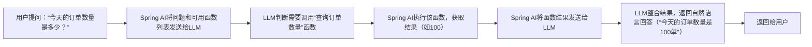

> 本页为原「Java 课程 22」全部 13 个分节的合订本；原分节链接会自动跳转到本页。


## 1.1 全球人工智能市场分析及应对

### 全球人工智能市场分析

2025年，全球人工智能市场在技术突破、应用落地和地缘博弈的多重驱动下，规模扩张、竞争重构与治理深化交织。下面从市场整体规模、区域竞争、企业动态、技术演进及治理框架几个维度聊聊。

#### 1. 市场整体规模与增长动力  
全球人工智能市场规模预计在未来十年保持年均19.1%的高速增长，2024年第三季度交易数量达1245笔，重回历史高位，融资规模显著提振。 中国生成式人工智能用户规模在2025年6月已达5.15亿人，普及率36.5%，反映需求侧强劲增长动能。 技术商业化进程加速，但盈利模式仍存争议，麦肯锡报告指出仅不足10%的企业通过AI部署实现利润提升，资本投入与回报的落差引发对“AI泡沫”的讨论。

#### 2. 区域竞争与战略路径  
美国在融资总额和技术研发上保持主导地位，占全球AI融资规模超70%，其战略聚焦于技术壁垒构建，如通过“星际之门”计划松绑监管以巩固领先优势，并推动闭源模式。 中国则以“人工智能+”行动为核心，通过开源合作策略深化场景应用，截至2025年8月，中国生成式AI服务备案数量达538款，应用登记263款，形成“技术支撑场景，场景反哺技术”的正向循环。 中美在芯片出口管制等领域的博弈加剧，促使欧洲、东南亚等地区采取“对冲平衡”战略，寻求主权AI发展路径。

#### 3. 企业竞争态势与创新焦点  
美国企业如OpenAI、Google、Anthropic在大模型领域持续突破，ChatGPT全球用户超51亿，月均下载量超2900万。 中国科技公司如阿里、字节跳动、幻方量化等在百模大战中快速迭代，通用大模型性能持续提升。 企业竞争从模型规模转向垂直场景落地，智能体、具身智能成为新焦点，例如人形机器人领域中国有效发明专利数量全球第二，优必选、达闼等企业推动技术转化。

#### 4. 关键技术演进与产业应用  
大语言模型打通技术到应用的闭环，推动AIGC在教育、医疗、金融等领域渗透。 智能算力成为基础设施，中国智能算力占比超30%，由阿里云、华为云等主导建设。 多模态智能体协作向通用人工智能演进，人机混合增强智能、类脑计算等前沿方向加速融合，智能汽车、可穿戴设备等产品形态创新频繁。

#### 5. 全球治理框架与挑战

AI治理呈现多元共治特征，2025年7月中国发布《人工智能全球治理行动计划》，8月联合国设立独立国际人工智能科学小组，推动安全标准与能力建设。 治理焦点集中于可控性、伦理风险及地缘平衡，非营利组织呼吁禁止超级智能开发，各国在监管尺度上存在分歧，但合作共识逐步形成。


### 全栈工程师的核心学习目标


* 理解Spring AI的核心设计理念，掌握其与 Spring 生态（Spring Boot/Spring Cloud）的整合逻辑。
* 熟练使用Spring AI调用主流大模型（OpenAI、通义千问、文心一言等）实现对话、生成、嵌入等 AI 功能。
* 掌握Spring AI Alibaba的本土化能力，整合阿里云AI服务（如通义千问、阿里云 OSS+AI 图片处理）到 Java 全栈项目。
* 能够在Java全栈项目（前后端分离）中落地端到端的AI功能（如智能客服、文本生成、图片识别等）


## 2.1 AI大模型与Java整合的行业现状

AI大模型与Java整合正处于从“零散API调用”到“企业级系统融合”的关键拐点，Java凭借企业级生态的稳定性与成熟工程化能力，成为大模型落地的核心载体，同时面临适配、合规与成本三大挑战，标准化框架与本土化适配是破局关键。下面从现状、典型场景、核心痛点、主流方案与演进趋势展开聊聊。


### 一、现状：Java与大模型的融合定位与数据概览
Java在企业级IT的根基与大模型的创新能力形成互补，当前融合呈现三大特征：
1.  企业刚需驱动融合：75%的企业AI应用需与现有Java系统集成，金融、电商、制造等核心领域尤甚；全球超1000万Java开发者中，能有效集成AI的不足15%，人才缺口显著。
2.  生产侧以Java为主，训练侧以Python为主：大模型训练以Python为主，而企业级推理服务、业务系统集成、高并发部署则由Java主导，形成“Python训练→Java推理”的主流分工，ONNX成为跨语言模型转换的核心桥梁。
3.  框架生态快速成熟：Spring AI、LangChain4J、JBoltAI等框架崛起，解决大模型调用标准化、上下文管理、向量数据库整合等问题，降低Java团队接入门槛。

### 二、典型行业场景：Java+大模型的落地价值
Java+大模型已在多领域规模化落地，核心场景如下：

| 行业 | 典型场景 | 技术实现 | 业务价值 |
| :--- | :--- | :--- | :--- |
| 电商 | 智能客服、商品文案生成 | Spring AI对接通义千问，实现多轮对话与批量文案生成 | 常规咨询处理率达85%，文案产出效率提升5–8倍 |


### 三、核心痛点：Java团队接入大模型的四大障碍
1.  接口碎片化，适配成本高：不同大模型（OpenAI、通义千问、文心一言）API格式、认证方式、参数体系差异大，手动封装需大量重复工作，切换模型时需修改业务代码，开发效率低。
2.  生态适配不足，合规风险高：国外框架早期对国内模型支持有限，数据跨境传输、国产化服务器适配、隐私合规等问题突出，增加企业部署成本与合规风险。
3.  系统耦合深，维护难度大：直接在业务代码中嵌入大模型调用逻辑，导致代码侵入性强、上下文管理复杂、故障排查困难，尤其在微服务架构中易引发连锁问题。
4.  技能断层，落地周期长：传统Java开发者缺乏提示词工程、向量数据库、多模态处理等AI技能，从零学习需4–6个月，且技术标准不统一，易埋下稳定性隐患。


### 四、主流集成模式与技术方案
Java与大模型的集成模式可分为三类，各有适用场景：
1.  API接口调用模式（主流）
    - 实现：Java通过RestTemplate/Feign调用大模型REST API，Spring AI提供统一ChatClient/EmbeddingClient接口，屏蔽底层差异。
    - 优势：开发快、无侵入，适合快速验证场景。
    - 不足：依赖网络，高并发下易出现超时，上下文管理需手动实现。
2.  嵌入式推理模式（边缘/私有部署）
    - 实现：将轻量化模型（如Llama 2、BERT）通过ONNX Runtime集成到Java应用，本地完成推理。
    - 优势：低延迟、数据不出本地，适合隐私敏感场景。
    - 不足：模型体积受限，推理性能依赖硬件。
3.  能力中台模式（企业级推荐）
    - 实现：搭建AI能力中台（Java微服务），统一封装大模型、向量数据库、提示词模板，提供标准化接口供业务系统调用。
    - 优势：解耦业务与AI，便于统一管控、限流、缓存与监控。
    - 不足：初期搭建成本高，适合中大型企业。


### 五、技术演进趋势：Java+大模型的未来方向
1.  标准化与无侵入成为主流：Spring AI的统一接口与自动配置能力快速普及，开发者可通过application.yml切换模型，无需修改业务代码。
2.  本土化适配加速：Spring AI Alibaba等框架深度整合阿里云AI服务，支持通义千问、视觉AI、语音AI等，解决国内模型适配与合规问题。
3.  AI-Native架构兴起：Java应用从传统三层架构向“AI+微服务”架构演进，大模型成为核心组件，支持智能路由、自动决策、动态提示词优化。
4.  性能优化持续突破：Java 21虚拟线程（Project Loom）使AI推理服务吞吐量提升5倍，ZGC垃圾回收器将延迟控制在1ms内，适配高并发场景。
5.  智能体（Agent）落地：Java团队通过框架快速开发AI Agent，实现大模型自动调用业务接口（如查询订单、扣减库存），驱动复杂业务流程闭环。


### 六、总结
Java与大模型的整合已从技术探索进入规模化落地阶段，核心价值在于利用Java的企业级生态优势，解决大模型在生产环境的稳定性、高并发与合规性问题。当前的核心矛盾是接口碎片化与技能断层，而Spring AI、Spring AI Alibaba等框架正成为破局关键，帮助Java团队低门槛接入AI能力。未来，随着标准化框架的普及与本土化适配的完善，Java+大模型将成为企业数字化转型的标配。

需要我基于这些现状，整理一份Java+Spring AI接入大模型的快速适配清单（含主流模型配置参数、依赖版本、常见坑与规避方案）吗？


## 2.2 Spring AI核心介绍

Spring AI是Spring官方推出的AI工程化框架，诞生于2023年，隶属于Spring生态体系，其核心目标是将Spring生态的“约定优于配置”“依赖注入”“模块化”等设计思想迁移到AI领域，解决Java项目整合AI大模型时的接口碎片化、生态耦合度低、工程化能力不足等痛点，让Java开发者能以熟悉的方式快速集成AI功能。

## 一、Spring AI的诞生背景与核心定位
### 1. 诞生背景：Java整合AI的痛点催生Spring AI
在Spring AI出现之前，Java开发者整合AI大模型主要面临以下问题：
- 接口不统一：OpenAI、通义千问、文心一言等大模型的API接口、参数、认证方式差异巨大，切换模型需重写大量代码。
- 与Spring生态脱节：原生SDK调用大模型时，无法利用Spring Boot的自动配置、依赖注入、配置化管理等能力，代码耦合度高。
- 工程化能力缺失：缺乏对提示词模板、上下文管理、函数调用、向量数据库的标准化支持，需手动封装大量工具类。
- 高并发适配难：直接调用大模型API时，难以结合Spring的异步处理、限流、缓存等能力，高并发场景下易出现性能问题。

Spring AI的出现，正是为了填补这一空白——将AI能力“Spring化”，让AI集成像使用Spring Boot开发接口一样简单。

### 2. 核心定位：AI能力的“Spring Boot”
Spring AI的核心定位可以概括为：
> 为Java生态提供标准化、工程化的AI集成框架，屏蔽不同AI服务的底层差异，让开发者以声明式、配置化的方式在Spring应用中集成AI功能（LLM对话、文本生成、嵌入计算、向量数据库交互等），并与Spring Boot、Spring Cloud、Spring Data等生态组件无缝协同。

简单来说，Spring AI就是AI领域的Spring Boot：它不生产AI模型，而是成为AI模型与Java应用之间的“桥梁”，并提供工程化的配套能力。

### 3. Spring AI的核心优势（对比原生SDK/第三方框架）
| 特性                | 原生大模型SDK（如OpenAI SDK） | LangChain4J（Java版LangChain） | Spring AI                          |
|---------------------|--------------------------------|---------------------------------|------------------------------------|
| Spring生态整合度    | 极低（无适配）| 中等（部分适配）| 极高（原生Spring生态，支持自动配置、依赖注入） |
| 统一接口支持        | 仅支持单一模型                | 支持多模型，但接口封装较复杂    | 极简统一接口（ChatClient/EmbeddingClient），切换模型仅改配置 |
| 配置化管理          | 硬编码API Key/参数            | 部分支持配置化                  | 完全支持Spring Boot配置化（application.yml） |
| 工程化能力          | 无（仅提供调用能力）| 中等（侧重AI逻辑编排）| 极高（整合缓存、异步、限流、监控等Spring能力） |
| 本土化模型支持      | 需手动适配国内模型            | 部分支持，需额外依赖            | 通过Spring AI Alibaba无缝支持通义千问等国内模型 |
| 学习成本            | 低，但适配成本高              | 高（需学习LangChain概念）| 低（Java开发者可直接复用Spring知识） |

## 二、Spring AI的核心设计理念
Spring AI延续了Spring生态的核心设计理念，同时结合AI场景做了针对性优化，核心理念包括：

### 1. 统一抽象（Unified Abstraction）
这是Spring AI最核心的设计理念。它为不同的AI服务提供标准化的接口，开发者面向接口编程，而非具体的模型实现。
- 例如：无论是调用OpenAI的GPT-3.5，还是通义千问的Qwen-7B，都使用同一个`ChatClient`接口，底层实现由框架自动适配。
- 价值：实现“一次编码，多模型适配”，切换模型时仅需修改配置文件，无需改动业务代码。

### 2. 约定优于配置（Convention Over Configuration）
Spring AI遵循Spring Boot的“约定优于配置”原则，提供大量默认配置，开发者只需少量配置即可快速启动AI功能。
- 例如：引入OpenAI依赖后，仅需在`application.yml`中配置API Key，框架会自动创建`ChatClient`实例，无需手动new对象。
- 价值：降低开发门槛，减少样板代码。

### 3. 模块化与可插拔（Modularity & Pluggability）
Spring AI采用模块化设计，核心功能与第三方集成解耦，开发者可按需引入依赖。
- 核心模块：`spring-ai-core`（核心抽象）、`spring-ai-chat`（对话功能）、`spring-ai-embedding`（嵌入计算）。
- 第三方模块：`spring-ai-openai`（OpenAI集成）、`spring-ai-milvus`（Milvus向量数据库集成）、`spring-ai-alibaba`（阿里云AI集成）。
- 价值：按需加载，减小应用体积，便于扩展。

### 4. 与Spring生态无缝协同（Seamless Spring Integration）
Spring AI深度整合Spring生态的核心组件，让AI功能能与现有业务系统自然融合：
- 与Spring Boot整合：支持自动配置、配置绑定、Actuator监控。
- 与Spring Cloud整合：支持微服务架构下的AI能力封装、服务发现、限流。
- 与Spring Data整合：支持向量数据库的Repository风格操作（如`VectorStoreRepository`）。
- 价值：AI功能可直接融入现有Java项目，无需重构系统。

## 三、Spring AI的生态体系与核心模块
Spring AI的生态体系分为核心层、集成层、应用层三个层次，每层包含不同的模块，共同构成完整的AI集成能力。

### 1. 核心层（Core Layer）：框架的基础能力
核心层是Spring AI的灵魂，提供标准化的抽象接口和基础工具，不依赖具体的AI服务，主要模块包括：
- spring-ai-core：核心模块，定义了`ChatClient`（对话客户端）、`EmbeddingClient`（嵌入客户端）、`Prompt`（提示词）、`Response`（响应）等核心接口，以及提示词模板、上下文管理等基础工具。
- spring-ai-context：上下文管理模块，支持多轮对话的上下文保存与加载（如基于Redis的上下文存储）。
- spring-ai-util：工具类模块，提供JSON解析、异常处理、参数校验等通用工具。

#### 核心接口示例（理解统一抽象）
```java
// 对话客户端核心接口：所有大模型的对话功能都实现此接口
public interface ChatClient {
    // 同步调用大模型，返回响应
    ChatResponse call(ChatRequest request);
    // 流式调用大模型，返回响应流（适配SSE）
    Flux<ChatResponse> stream(ChatRequest request);
}

// 嵌入客户端核心接口：所有大模型的嵌入计算都实现此接口
public interface EmbeddingClient {
    // 将文本转换为向量
    EmbeddingResponse embed(List<String> texts);
}
```

### 2. 集成层（Integration Layer）：对接外部AI服务与存储
集成层是核心层的具体实现，对接各类大模型、向量数据库、云AI服务，开发者可按需引入对应的依赖，主要包括：
- 大模型集成：`spring-ai-openai`（OpenAI/GPT）、`spring-ai-azure-openai`（Azure OpenAI）、`spring-ai-alibaba`（通义千问/阿里云AI）、`spring-ai-baidu`（文心一言）、`spring-ai-huggingface`（Hugging Face模型）。
- 向量数据库集成：`spring-ai-milvus`（Milvus）、`spring-ai-redis`（Redis Vector）、`spring-ai-pinecone`（Pinecone）、`spring-ai-weaviate`（Weaviate）。
- 数据处理集成：`spring-ai-tika`（文档解析）、`spring-ai-pdf`（PDF处理）、`spring-ai-image`（图片处理）。

### 3. 应用层（Application Layer）：高阶AI能力与场景化封装
应用层基于核心层和集成层，提供高阶的AI能力和场景化的封装，简化复杂AI场景的开发，主要包括：
- spring-ai-function-calling：函数调用模块，支持大模型自动触发Java方法调用（如查询数据库、调用第三方API）。
- spring-ai-retrieval-augmented-generation：RAG（检索增强生成）模块，封装“文档加载→嵌入生成→向量检索→大模型生成”的完整流程，快速实现语义搜索。
- spring-ai-spring-boot-starter：Spring Boot启动器，提供自动配置、健康检查、指标监控等能力。

## 四、Spring AI与Spring AI Alibaba的关系
在学习Spring AI时，很多开发者会混淆Spring AI与Spring AI Alibaba，这里明确两者的关系：
1. Spring AI：是核心框架，由Spring官方维护，主要支持国外主流大模型（OpenAI、Azure OpenAI）和通用向量数据库，是基础底座。
2. Spring AI Alibaba：是阿里云基于Spring AI扩展的本土化框架，由阿里云团队维护，核心是适配国内生态：
   - 集成阿里云AI服务：通义千问（Qwen）、阿里云视觉AI、语音AI、百炼平台。
   - 适配阿里云基础设施：OSS（文件存储）、RDS（数据库）、NAS（分布式存储）。
   - 解决本土化问题：数据合规、国产化服务器适配、阿里云AccessKey管理。
3. 关系总结：Spring AI Alibaba是Spring AI的“本土化插件”，依赖Spring AI的核心抽象，为国内开发者提供更贴合本土场景的AI集成能力。

## 五、快速体验：第一个Spring AI程序（核心概念落地）
为了让你直观感受Spring AI的核心能力，这里给出一个最简单的Spring AI demo，实现调用OpenAI的GPT-3.5进行对话：
### 1. 环境准备
- JDK 17+（Spring AI要求Spring Boot 3.x，需JDK 17+）
- Maven/Gradle
- OpenAI API Key（需注册OpenAI账号获取）

### 2. 引入依赖（pom.xml）
```xml
<dependencies>
    <!-- Spring Boot Starter Web -->
    <dependency>
        <groupId>org.springframework.boot</groupId>
        <artifactId>spring-boot-starter-web</artifactId>
    </dependency>
    <!-- Spring AI OpenAI依赖 -->
    <dependency>
        <groupId>org.springframework.ai</groupId>
        <artifactId>spring-ai-openai-spring-boot-starter</artifactId>
        <version>0.8.1</version> <!-- 请使用最新版本 -->
    </dependency>
</dependencies>
```

### 3. 配置OpenAI API Key（application.yml）
```yaml
spring:
  ai:
    openai:
      api-key: your-openai-api-key # 替换为你的OpenAI API Key
      chat:
        model: gpt-3.5-turbo # 默认模型
```

### 4. 编写业务代码
```java
import org.springframework.ai.chat.ChatClient;
import org.springframework.ai.chat.ChatResponse;
import org.springframework.ai.chat.prompt.Prompt;
import org.springframework.beans.factory.annotation.Autowired;
import org.springframework.web.bind.annotation.GetMapping;
import org.springframework.web.bind.annotation.RequestParam;
import org.springframework.web.bind.annotation.RestController;

@RestController
public class AiController {

    // 自动注入Spring AI创建的ChatClient实例（无需手动创建）
    @Autowired
    private ChatClient chatClient;

    @GetMapping("/ai/chat")
    public String chat(@RequestParam String message) {
        // 1. 构建提示词
        Prompt prompt = new Prompt(message);
        // 2. 调用大模型（统一接口，切换模型无需改代码）
        ChatResponse response = chatClient.call(prompt);
        // 3. 返回结果
        return response.getResult().getOutput().getContent();
    }
}
```

### 5. 测试
启动项目后，访问`http://localhost:8080/ai/chat?message=写一个Spring Boot的Hello World程序`，即可得到GPT-3.5返回的代码结果。

关键亮点：整个过程中，你没有写任何与OpenAI SDK相关的代码，仅通过依赖引入和配置，就实现了大模型调用，这正是Spring AI的核心价值。


### 总结
1. 核心定位：Spring AI是Spring官方的AI工程化框架，核心是为Java应用提供标准化、低耦合的AI集成能力，让AI功能的开发像Spring Boot接口开发一样简单。
2. 核心设计：基于统一抽象、约定优于配置、模块化的设计理念，深度整合Spring生态，实现“一次编码，多模型适配”。
3. 生态体系：分为核心层（基础抽象）、集成层（对接外部AI服务）、应用层（高阶AI能力），覆盖从简单对话到复杂RAG的全场景。
4. 本土化延伸：Spring AI Alibaba是Spring AI的本土化扩展，解决国内大模型（通义千问）、阿里云服务的集成问题，是国内开发者的首选。

这些知识点串起来，Spring AI 的整体轮廓就清楚了，后面看核心功能和实战开发会顺很多。


## 2.3 Spring AI Alibaba的本土化价值

Spring AI Alibaba是Spring AI的本土化扩展框架，核心价值在于以Spring生态为底座，深度适配国内模型与云基础设施，解决合规、网络、工程化三大本土痛点，同时提供Agent/工作流/可视化等生产级能力，让Java团队低门槛接入AI并快速落地。以下从六大本土化价值维度展开详解。


### 一、模型与服务的本土化无缝适配（核心价值）
解决国内模型接入的碎片化与合规难题，实现“一键直连+统一接口”，避免重复适配。
1.  全量支持本土主流模型
    - 原生对接阿里云通义千问（Qwen）、百炼平台、视觉/语音AI等，无需额外封装SDK。
    - 支持国内开源模型（如Llama 2中文微调版、通义开源系列）与Ollama本地部署，适配“数据不出境”场景。
    - 兼容Spring AI统一接口（ChatClient/EmbeddingClient），切换模型仅改application.yml配置，业务代码零改动。
2.  本土化认证与协议适配
    - 自动适配阿里云灵积平台（DashScope）签名机制与AK/SK认证，规避跨境API Key泄露风险。
3.  中文场景参数与提示词优化
    - 预置中文对话、文案生成、摘要等场景的Prompt模板，解决中文语义理解与输出质量问题。
    - 针对通义千问等模型的中文特性调优token计算、上下文窗口管理，提升生成效率与准确性。

### 二、阿里云生态深度协同（企业级价值）
与阿里云基础设施无缝集成，复用企业现有IT资产，降低部署与运维成本。
| 阿里云组件 | 整合能力 | 业务价值 |
| :--- | :--- | :--- |
| 百炼平台 | 统一模型管理、版本切换、计费管控 | 一键开通模型服务，无需自建模型推理集群 |
| Nacos | 配置中心/服务发现，管理AI服务参数与路由 | 支持AI服务动态扩容、灰度发布，适配微服务架构 |
| Higress网关 | AI请求限流、缓存、监控，WAF防护 | 保障高并发下AI服务稳定性，防止恶意请求 |
| OSS/RDS | 文档存储、向量数据持久化，RAG检索数据源 | 快速构建企业知识库，支持PDF/Word等多格式文档解析 |
| RAM权限体系 | 细粒度权限控制，API调用审计 | 满足等保三级合规要求，追溯AI操作日志 |

### 三、合规与安全的本土化保障（刚需价值）
解决国内数据安全、内容合规与隐私保护的核心痛点，符合《个人信息保护法》《生成式AI服务管理暂行办法》等要求。
1.  数据不出境与本地化部署
    - 支持模型推理服务部署在阿里云国内数据中心，数据全程不出境，规避跨境传输合规风险。
    - 适配国产硬件（如鲲鹏服务器）与操作系统，满足信创要求，提升系统安全性。
2.  全链路内容安全管控
    - 内置阿里云内容安全服务，自动检测生成内容中的敏感信息（政治、色情、暴力等），实时拦截违规输出。
    - 支持自定义敏感词库，适配金融、政务等行业的合规要求。
3.  可观测与审计能力
    - 集成Spring Boot Actuator与阿里云ARMS监控，实时监控AI请求QPS、延迟、错误率。
    - 记录模型调用日志、提示词与输出结果，支持审计追溯，满足监管要求。

### 四、工程化与开发效率提升（生产力价值）
贴合Java开发者习惯，提供Spring风格的开发体验与生产级工具链，降低AI集成门槛。
1.  Spring生态原生体验
    - 自动配置、依赖注入、声明式客户端，无需学习新开发范式，Java团队可快速上手。
    - 支持Spring Boot 4.x与虚拟线程（Project Loom），提升AI推理服务吞吐量5倍以上。
2.  高阶AI能力开箱即用
    - Agent框架：基于ReactAgent理念，支持工具调用、上下文管理、多轮对话，快速开发智能客服、代码生成等应用。
    - Graph工作流编排：以“节点+边”定义复杂AI流程（如“文档解析→向量生成→检索→生成”），支持可视化调试。
    - RAG检索增强：封装文档加载、嵌入生成、向量检索全流程，支持Milvus/Redis等向量数据库。
3.  可视化开发与调试工具
    - Spring AI Alibaba Studio：Web UI工具，支持模型交互调试、工作流可视化设计、知识库检索测试，提升开发效率。
    - 项目初始化平台：一键生成Spring AI Alibaba项目模板，包含依赖配置、示例代码，快速启动开发。

### 五、成本与性能的本土化优化（经济价值）
降低AI应用的开发、部署与运维成本，提升资源利用率。
1.  成本优化
    - 复用阿里云现有云资源，无需额外采购硬件，按调用量计费，降低初期投入。
    - 内置请求缓存机制，缓存高频AI请求（如常见问题回答），减少重复调用，降低API成本。
2.  性能优化
    - 针对国内网络环境优化HTTP连接复用、重试策略，减少请求超时率。
    - 支持模型推理服务本地部署（如通义千问轻量版），降低网络延迟，提升响应速度。
    - 适配Java虚拟线程与ZGC垃圾回收器，将AI服务延迟控制在1ms内，满足高并发场景需求。

### 六、本土化生态与社区支持（长期价值）
提供中文文档、本土化案例与技术支持，解决开发者学习与落地难题。
1.  中文生态资源
    - 完整中文文档、快速入门教程、视频课程，降低学习成本。
    - 国内社区活跃，阿里技术团队提供技术支持，快速响应问题反馈。
2.  行业最佳实践
    - 提供金融智能风控、电商智能客服、制造业设备诊断等本土化场景的参考代码与解决方案。
    - 与Spring Cloud Alibaba生态无缝协同，支持微服务架构下的AI能力集成，适配企业现有技术栈。


### 快速体验示例（通义千问调用）
1.  引入依赖
    ```xml
    <dependency>
        <groupId>com.alibaba.cloud</groupId>
        <artifactId>spring-ai-alibaba-dashscope-spring-boot-starter</artifactId>
        <version>0.1.0</version> <!-- 使用最新版本 -->
    </dependency>
    ```
2.  配置application.yml
    ```yaml
    spring:
      ai:
        alibaba:
          dashscope:
            api-key: 你的阿里云AK/SK
            chat:
              model: qwen-plus
    ```
3.  调用代码
    ```java
    @Autowired
    private ChatClient chatClient;

    public String chat(String message) {
        return chatClient.call(new Prompt(message)).getResult().getOutput().getContent();
    }
    ```


### 总结
Spring AI Alibaba的本土化价值核心在于“降低门槛、保障合规、提升效率”：通过统一接口适配本土模型、深度整合阿里云生态、提供合规安全保障、优化开发与运维成本，让Java团队无需重构现有技术栈，即可快速接入AI能力并实现规模化落地。对于国内企业而言，它是Spring AI生态中本土化适配最完善、工程化能力最强的选择，尤其适合金融、电商、政务等对合规与稳定性要求高的行业。

需要我基于这些价值，整理一份Spring AI Alibaba接入通义千问的快速落地清单（含依赖版本、配置参数、常见坑与规避方案、RAG最简实现步骤）吗？


## 3.1 Spring AI核心API与统一接口

Spring AI的统一接口是其最核心的竞争力，它通过抽象出通用的API层，屏蔽了不同大模型、向量数据库的底层差异，让Java开发者可以面向接口编程，无需关心具体的AI服务实现。这部分内容是Spring AI的“骨架”，掌握它就掌握了Spring AI的核心使用逻辑。

## 一、核心接口的设计思路：从“碎片化调用”到“标准化抽象”
在Spring AI出现之前，调用不同大模型的流程是这样的：
- 调用OpenAI：使用`OpenAIClient`，传入`OpenAIChatRequest`，处理`OpenAIChatResponse`。
- 调用通义千问：使用`DashScopeClient`，传入`DashScopeChatRequest`，处理`DashScopeChatResponse`。
- 问题：每个模型的请求参数、响应结构、认证方式都不同，代码耦合度高，切换模型需重写大量代码。

Spring AI的解决思路是：
1. 抽象核心能力：将AI服务的核心能力（对话、嵌入计算、文本补全）抽象为通用接口。
2. 统一请求/响应模型：定义标准化的`Request`/`Response`对象，适配所有模型的参数与返回值。
3. 实现层适配：不同AI服务的SDK由框架底层适配，开发者只需依赖接口即可。

简单来说，这个设计思路和Spring Data的`Repository`接口、Spring Cloud的`LoadBalancerClient`接口是一致的——接口定义行为，实现层处理具体细节。

## 二、Spring AI的核心接口体系
Spring AI的核心接口主要分为三大类，覆盖了大模型的主流使用场景：对话交互、文本嵌入、文本补全（已逐步融合到对话接口中）。还有配套的提示词、响应处理等辅助接口。

### 1. 核心接口一：`ChatClient`（对话客户端，最常用）
`ChatClient`是Spring AI中最核心的接口，用于与大语言模型（LLM）进行对话交互，支持同步调用、流式调用、多轮对话，适配所有支持对话的大模型（OpenAI GPT、通义千问、文心一言等）。

#### （1）`ChatClient`核心方法
```java
public interface ChatClient {
    // 同步调用：发送单个提示词，返回完整响应
    ChatResponse call(Prompt prompt);

    // 流式调用：返回响应流（适配SSE，前端实时展示）
    default Flux<ChatResponse> stream(Prompt prompt) {
        return Flux.empty();
    }

    // 简化方法：直接传入字符串提示词，返回响应内容（语法糖）
    default String call(String message) {
        return call(new Prompt(message)).getResult().getOutput().getContent();
    }
}
```

#### （2）关键参数说明
- `Prompt`：提示词对象，是向大模型发送的“请求体”，包含：
  - `List<Message>`：消息列表，支持多轮对话（如用户消息、助手消息、系统消息）。
  - `Map<String, Object>`：模型参数（如温度、最大令牌数、顶采样等）。
- `ChatResponse`：对话响应对象，是大模型返回的“响应体”，包含：
  - `List<ChatResult>`：响应结果列表（通常为单个结果）。
  - `Metadata`：响应元数据（如令牌使用量、模型版本、响应时间）。
- `ChatResult`：单个响应结果，包含`Generation`（生成的内容）和`Metadata`。

#### （3）消息类型（`Message`）
多轮对话的核心是消息类型的管理，Spring AI定义了标准化的消息类型：
| 消息类型          | 作用                                                                 |
|-------------------|----------------------------------------------------------------------|
| `UserMessage`     | 用户发送的消息（如“写一个Spring Boot接口”）|
| `AssistantMessage`| 大模型返回的消息（助手回复）|
| `SystemMessage`   | 系统提示词（如“你是一个Java开发助手，回答简洁明了”）|
| `ToolMessage`     | 工具调用的返回消息（函数调用时使用）|

### 2. 核心接口二：`EmbeddingClient`（嵌入客户端）
`EmbeddingClient`用于将文本转换为向量（Embedding），是实现语义搜索、RAG（检索增强生成）的核心接口，适配所有支持嵌入计算的模型（如OpenAI text-embedding-3-small、通义千问embedding-v1）。

#### （1）`EmbeddingClient`核心方法
```java
public interface EmbeddingClient {
    // 批量将文本转换为向量
    EmbeddingResponse embed(List<String> texts);

    // 简化方法：单个文本转换为向量（语法糖）
    default EmbeddingResponse embed(String text) {
        return embed(List.of(text));
    }

    // 计算两个文本的相似度（语法糖）
    default double similarity(String text1, String text2) {
        EmbeddingResponse response1 = embed(text1);
        EmbeddingResponse response2 = embed(text2);
        return cosineSimilarity(response1.getEmbeddings().get(0).getValues(), 
                                response2.getEmbeddings().get(0).getValues());
    }
}
```

#### （2）关键参数说明
- `EmbeddingResponse`：嵌入响应对象，包含：
  - `List<Embedding>`：向量列表，每个`Embedding`包含`List<Double>`类型的向量值。
  - `Metadata`：元数据（如令牌使用量、模型版本）。
- 相似度计算：框架内置了余弦相似度计算方法，可直接用于语义匹配。

### 3. 辅助接口：`PromptTemplate`（提示词模板）
`PromptTemplate`是提示词工程的核心工具，用于实现参数化提示词，避免硬编码提示词，提升代码复用性。

#### （1）核心用法
```java
// 定义模板（参数用{变量名}表示）
String template = "生成一篇关于{topic}的Java教程，字数{wordCount}字，风格{style}";
PromptTemplate promptTemplate = new PromptTemplate(template);

// 填充参数
Map<String, Object> params = Map.of(
    "topic", "Spring AI",
    "wordCount", 500,
    "style", "通俗易懂"
);
Prompt prompt = promptTemplate.create(params);

// 调用大模型
String response = chatClient.call(prompt);
```

## 三、统一接口的核心特性：“一次编码，多模型适配”
Spring AI的统一接口最核心的价值在于模型无关性，即切换大模型时，业务代码无需修改，仅需调整配置和依赖。以下通过OpenAI切换到通义千问的示例，展示这一特性。

### 步骤1：调用OpenAI（初始实现）
#### （1）引入依赖
```xml
<dependency>
    <groupId>org.springframework.ai</groupId>
    <artifactId>spring-ai-openai-spring-boot-starter</artifactId>
    <version>0.8.1</version>
</dependency>
```

#### （2）配置application.yml
```yaml
spring:
  ai:
    openai:
      api-key: your-openai-api-key
      chat:
        model: gpt-3.5-turbo
        temperature: 0.7 # 模型参数
```

#### （3）业务代码
```java
@RestController
public class AiController {
    @Autowired
    private ChatClient chatClient;

    @GetMapping("/ai/chat")
    public String chat(@RequestParam String message) {
        // 1. 构建系统提示词（多轮对话示例）
        List<Message> messages = List.of(
            new SystemMessage("你是一个Java开发助手，回答简洁明了"),
            new UserMessage(message)
        );
        Prompt prompt = new Prompt(messages);
        // 2. 调用大模型（统一接口）
        return chatClient.call(prompt).getResult().getOutput().getContent();
    }

    // 流式调用示例（SSE）
    @GetMapping(value = "/ai/stream", produces = MediaType.TEXT_EVENT_STREAM_VALUE)
    public Flux<String> stream(@RequestParam String message) {
        Prompt prompt = new Prompt(new UserMessage(message));
        return chatClient.stream(prompt)
                .map(response -> response.getResult().getOutput().getContent());
    }
}
```

### 步骤2：切换到通义千问（仅改配置和依赖，代码不变）
#### （1）替换依赖
```xml
<!-- 移除OpenAI依赖，引入Spring AI Alibaba通义千问依赖 -->
<dependency>
    <groupId>com.alibaba.cloud</groupId>
    <artifactId>spring-ai-alibaba-dashscope-spring-boot-starter</artifactId>
    <version>0.1.0</version>
</dependency>
```

#### （2）修改配置application.yml
```yaml
spring:
  ai:
    alibaba:
      dashscope:
        api-key: your-aliyun-dashscope-api-key # 阿里云通义千问API Key
        chat:
          model: qwen-plus # 通义千问模型
          temperature: 0.7 # 模型参数（与OpenAI一致，框架自动适配）
```

#### （3）业务代码：完全无需修改
启动项目后，访问相同的接口，即可调用通义千问模型，这就是统一接口的威力。

## 四、核心API的进阶使用场景
### 1. 多轮对话（上下文管理）
通过`List<Message>`维护对话上下文，实现连续的多轮交互：
```java
@GetMapping("/ai/multi-chat")
public String multiChat(@RequestParam String message, @RequestParam(required = false) String sessionId) {
    // 模拟从Redis中获取会话上下文（生产环境需用Redis/数据库存储）
    List<Message> messages = new ArrayList<>();
    // 初始系统消息
    messages.add(new SystemMessage("你是一个Java开发助手，回答简洁明了"));
    // 历史消息（模拟）
    messages.add(new UserMessage("什么是Spring AI？"));
    messages.add(new AssistantMessage("Spring AI是Spring官方的AI工程化框架..."));
    // 新的用户消息
    messages.add(new UserMessage(message));

    Prompt prompt = new Prompt(messages);
    return chatClient.call(prompt).getResult().getOutput().getContent();
}
```

### 2. 流式响应（SSE适配前端）
通过`stream`方法实现流式输出，前端可实时接收大模型的回复：
```java
@GetMapping(value = "/ai/stream-chat", produces = MediaType.TEXT_EVENT_STREAM_VALUE)
public Flux<String> streamChat(@RequestParam String message) {
    Prompt prompt = new Prompt(new UserMessage(message));
    return chatClient.stream(prompt)
            .map(response -> response.getResult().getOutput().getContent())
            .onErrorResume(e -> Flux.just("发生错误：" + e.getMessage()));
}
```

### 3. 嵌入计算与语义相似度
使用`EmbeddingClient`计算文本向量并判断相似度：
```java
@RestController
public class EmbeddingController {
    @Autowired
    private EmbeddingClient embeddingClient;

    @GetMapping("/ai/similarity")
    public double similarity(@RequestParam String text1, @RequestParam String text2) {
        // 直接调用框架内置的相似度计算方法
        return embeddingClient.similarity(text1, text2);
    }

    @GetMapping("/ai/embed")
    public List<Double> embed(@RequestParam String text) {
        // 获取文本的向量值
        return embeddingClient.embed(text)
                .getEmbeddings()
                .get(0)
                .getValues();
    }
}
```

## 五、统一接口的扩展：自定义客户端（进阶）
如果需要适配企业私有部署的大模型（如本地部署的Llama 2），可以实现`ChatClient`接口，自定义客户端：
```java
@Component
public class CustomLlmChatClient implements ChatClient {
    // 注入私有模型的SDK客户端
    @Autowired
    private CustomLlmClient customLlmClient;

    @Override
    public ChatResponse call(Prompt prompt) {
        // 1. 转换Spring AI的Prompt为私有模型的请求参数
        String promptText = prompt.getMessages().stream()
                .map(Message::getContent)
                .collect(Collectors.joining("\n"));
        // 2. 调用私有模型
        String responseText = customLlmClient.generate(promptText);
        // 3. 转换为Spring AI的ChatResponse返回
        Generation generation = new Generation(responseText);
        ChatResult chatResult = new ChatResult(generation);
        return new ChatResponse(List.of(chatResult));
    }

    // 实现流式调用（可选）
    @Override
    public Flux<ChatResponse> stream(Prompt prompt) {
        // 自定义流式处理逻辑
        return Flux.just(new ChatResponse(List.of(new ChatResult(new Generation("流式响应...")))));
    }
}
```
这样，业务代码可以直接注入`ChatClient`，无需关心是公有模型还是私有模型。


### 总结
1. 核心接口是Spring AI的灵魂：`ChatClient`（对话）和`EmbeddingClient`（嵌入）是最核心的两个接口，覆盖了大模型的主流使用场景，所有模型适配都基于这两个接口实现。
2. 统一接口的核心价值是“模型无关性”：切换大模型仅需修改依赖和配置，业务代码零改动，实现“一次编码，多模型适配”。
3. 配套工具提升开发效率：`PromptTemplate`（参数化提示词）、内置的相似度计算、流式响应等功能，简化了AI功能的开发。
4. 接口可扩展：支持自定义客户端，适配企业私有部署的大模型，满足个性化需求。

这些核心API和统一接口用熟了，Spring AI 的各类功能就能灵活调起来，后面做项目实战会顺手很多。


## 3.2 提示词工程与Spring AI的整合

提示词工程是Spring AI连接业务意图与大模型能力的核心纽带，其整合逻辑在于以模板化+结构化消息+可插拔增强的方式，解决提示词硬编码、上下文管理混乱、多轮对话失控、输出格式不可控四大问题，同时与Spring生态深度融合，实现“一次设计、多模型适配”。以下从核心组件、工程化实践、进阶技巧与实战示例展开详解。


## 一、核心整合组件：从“字符串拼接”到“可维护组件”
Spring AI提供了Prompt/Message/PromptTemplate/Advisor四大核心组件，构建提示词工程的完整能力链，彻底告别硬编码。

### 1. 基础单元：`Prompt`与`Message`（结构化对话的基石）
`Prompt`是向模型发送的请求载体，`Message`是对话的最小单元，两者结合实现“角色清晰、上下文可追溯”的对话结构。
| 组件 | 核心作用 | 关键类型/用法 |
| :--- | :--- | :--- |
| `Message` | 定义对话角色与内容 | 系统消息（SystemMessage）：设置模型身份/规则（如“你是Java高级工程师，回答简洁规范”）；用户消息（UserMessage）：承载用户查询；助手消息（AssistantMessage）：存储模型历史回复；工具消息（ToolMessage）：接收工具调用结果（配合Function Calling） |
| `Prompt` | 封装完整对话上下文 | 由`List<Message>`+模型参数（temperature、maxTokens）组成，支持多轮对话与参数化配置 |

示例：构建结构化Prompt
```java
List<Message> messages = List.of(
    new SystemMessage("你是Java代码生成助手，输出必须包含完整类注释和单元测试"),
    new UserMessage("生成一个Spring Boot Controller，实现用户查询接口"),
    new AssistantMessage("已生成Controller，是否需要补充分页功能？"),
    new UserMessage("是的，需要PageHelper分页")
);
Prompt prompt = new Prompt(messages, ChatOptions.builder().temperature(0.3).build());
```

### 2. 核心工具：`PromptTemplate`（提示词的“模板引擎”）
`PromptTemplate`是提示词工程的生产力核心，支持参数化填充、模板复用、版本管理，适配Spring Resource抽象，可从文件/配置中心加载模板，解决硬编码与维护难题。
#### 核心能力
- 参数占位符：用`{变量名}`定义动态参数，支持Map/Bean填充。
- 模板加载：支持classpath文件（如`prompt/gen-code.st`）、远程配置（Nacos/Apollo）。
- 类型安全：配合Spring的`ConversionService`实现参数自动类型转换。

#### 实战代码
```java
// 1. 从字符串创建模板（适合简单场景）
String templateStr = "生成{language}语言的{function}函数，参数为{params}，返回类型{returnType}";
PromptTemplate template = new PromptTemplate(templateStr);

// 2. 从文件加载模板（适合复杂场景，classpath:prompt/gen-code.st）
PromptTemplate fileTemplate = new PromptTemplate(new ClassPathResource("prompt/gen-code.st"));

// 3. 填充参数并生成Prompt
Map<String, Object> params = Map.of(
    "language", "Java",
    "function", "calculateSum",
    "params", "int a, int b",
    "returnType", "int"
);
Prompt prompt = template.create(params);
```

### 3. 增强机制：`PromptAdvisor`（可插拔的提示词增强）
`PromptAdvisor`是Spring AI的“提示词拦截器”，支持在调用模型前/后注入逻辑，实现日志审计、敏感词过滤、上下文增强、输出格式校验等功能，适配企业级合规与工程化要求。
示例：实现敏感词过滤Advisor
```java
@Component
public class SensitiveWordAdvisor implements PromptAdvisor {
    @Autowired
    private SensitiveWordFilter filter;

    @Override
    public Prompt advise(Prompt prompt) {
        // 过滤用户消息中的敏感词
        List<Message> filteredMessages = prompt.getMessages().stream()
            .map(msg -> {
                if (msg instanceof UserMessage) {
                    String filteredContent = filter.filter(msg.getContent());
                    return new UserMessage(filteredContent);
                }
                return msg;
            }).collect(Collectors.toList());
        return new Prompt(filteredMessages, prompt.getOptions());
    }
}
```
通过`@Order`注解控制Advisor执行顺序，轻松组合多增强逻辑。


## 二、工程化实践：提示词的“生命周期管理”
Spring AI将提示词工程融入Spring生态，实现模板化、可配置、可监控、可复用的全生命周期管理，适配企业级开发流程。

### 1. 模板管理：从“代码内嵌”到“配置化+版本化”
- 配置中心集成：将模板存储在Nacos/Apollo，支持动态更新，无需重启服务。
- 版本控制：通过文件名或配置前缀区分版本（如`prompt/gen-code-v1.st`），适配灰度发布。
- 多环境适配：通过`application-{profile}.yml`配置不同环境的模板参数，如开发环境用测试模型，生产环境用正式模型。

### 2. 上下文管理：多轮对话的“记忆机制”
多轮对话的核心是上下文维护，Spring AI提供两种管理方式：
1.  内存式上下文：适合短会话，用`List<Message>`存储历史消息，注意控制token上限（避免超出模型上下文窗口）。
2.  持久化上下文：适合长会话，将`Message`序列化为JSON存储在Redis，通过`sessionId`关联，示例：
```java
@Autowired
private StringRedisTemplate redisTemplate;

public Prompt buildMultiTurnPrompt(String sessionId, String userInput) {
    // 从Redis获取历史消息
    String historyJson = redisTemplate.opsForValue().get("ai:session:" + sessionId);
    List<Message> messages = historyJson == null ? new ArrayList<>() : 
        objectMapper.readValue(historyJson, new TypeReference<List<Message>>(){});
    
    // 添加新消息
    messages.add(new UserMessage(userInput));
    
    // 保存更新后的上下文
    redisTemplate.opsForValue().set("ai:session:" + sessionId, objectMapper.writeValueAsString(messages), 24, TimeUnit.HOURS);
    
    // 构建Prompt（设置maxTokens避免溢出）
    return new Prompt(messages, ChatOptions.builder().maxTokens(2048).build());
}
```

### 3. 输出格式控制：从“自由文本”到“结构化输出”
通过提示词+Spring AI的`EntityConverter`实现输出格式强约束，解决JSON/XML/CSV解析问题：
1.  提示词约束：在系统消息中明确格式要求，如“输出必须为JSON，包含code/message/data三个字段”。
2.  实体映射：用`@JsonIgnoreProperties`注解定义响应实体，框架自动解析JSON，示例：
```java
// 定义响应实体
@Data
@JsonIgnoreProperties(ignoreUnknown = true)
public class ApiResponse {
    private int code;
    private String message;
    private Object data;
}

// 解析响应
String jsonResponse = chatClient.call(prompt).getResult().getOutput().getContent();
ApiResponse response = objectMapper.readValue(jsonResponse, ApiResponse.class);
```


## 三、提示词工程的核心模式与Spring AI实现
Spring AI完美适配主流提示词工程模式，通过结构化消息+模板化+Advisor组合实现，大幅提升模型响应质量。
| 工程模式 | 核心逻辑 | Spring AI实现方式 | 适用场景 |
| :--- | :--- | :--- | :--- |
| 角色提示（Role Prompting） | 定义模型身份与行为规则 | SystemMessage设置角色，如“你是金融合规专家，禁止输出敏感信息” | 行业垂直场景（金融/医疗/政务） |
| 少样本学习（Few-Shot） | 提供2-3个示例引导模型 | 在UserMessage中加入示例，如“示例1：输入A→输出B；示例2：输入C→输出D” | 复杂格式生成（如SQL/代码） |
| 思维链（CoT） | 要求模型“逐步推理” | SystemMessage加入“请逐步分析问题，列出步骤后给出结论” | 逻辑推理（如算法题/故障排查） |
| ReAct（推理+工具调用） | 模型自主决定是否调用工具 | ToolMessage接收工具结果，配合Function Calling API实现“推理→调用→总结” | 复杂信息查询（如天气/股票/知识库检索） |
| RAG（检索增强生成） | 注入外部知识，减少幻觉 | 通过Advisor拦截Prompt，从向量数据库检索相关文档并追加到上下文 | 企业知识库问答/文档摘要 |

示例：CoT+少样本组合实现复杂计算
```java
List<Message> messages = List.of(
    new SystemMessage("你是数学老师，解决问题时请按步骤推理，先分析已知条件，再计算，最后总结答案。示例：\n问：2+3×4=？\n答：1. 先算乘法3×4=12；2. 再加2得14；3. 答案是14。"),
    new UserMessage("问：(5+2)×(8-3)=？")
);
Prompt prompt = new Prompt(messages);
String response = chatClient.call(prompt);
// 输出：1. 先算括号内5+2=7和8-3=5；2. 再算乘法7×5=35；3. 答案是35。
```


## 四、进阶实战：提示词工程与Spring AI Alibaba整合
结合Spring AI Alibaba，可进一步实现本土化提示词优化+阿里云生态协同，适配国内模型特性：
1.  中文提示词模板库：Spring AI Alibaba预置通义千问/Qwen的中文优化模板，如“生成电商商品标题，包含核心卖点+促销信息，不超过30字”。
2.  通义千问格式适配：自动适配通义千问的token计算与上下文窗口，避免因中文token溢出导致的响应截断。
3.  阿里云内容安全集成：通过Advisor调用阿里云内容安全API，实时检测提示词与响应中的敏感信息，符合《生成式AI服务管理暂行办法》。

示例：Spring AI Alibaba整合通义千问的提示词优化
```java
// 1. 引入Spring AI Alibaba依赖（pom.xml）
<dependency>
    <groupId>com.alibaba.cloud</groupId>
    <artifactId>spring-ai-alibaba-dashscope-spring-boot-starter</artifactId>
    <version>0.1.0</version>
</dependency>

// 2. 配置通义千问模型（application.yml）
spring:
  ai:
    alibaba:
      dashscope:
        api-key: 你的AK/SK
        chat:
          model: qwen-plus
          temperature: 0.5

// 3. 中文模板+少样本示例
String template = "生成{productType}的中文推广文案，风格{style}，字数{wordCount}字。示例：\n手机→轻薄长续航，追剧一整天→15字";
PromptTemplate promptTemplate = new PromptTemplate(template);
Prompt prompt = promptTemplate.create(Map.of(
    "productType", "智能手表",
    "style", "科技感",
    "wordCount", "20"
));

// 4. 调用模型（业务代码零改动）
String result = chatClient.call(prompt);
```


## 五、最佳实践与避坑指南
1.  模板复用优先：将通用提示词（如系统消息、格式要求）抽为公共模板，通过参数化适配不同场景。
2.  token管理：用Spring AI的`TokenCountEstimator`估算token数，避免超出模型上下文窗口（如GPT-3.5上限4096）。
3.  敏感词双校验：通过Advisor拦截输入+模型输出，配合阿里云内容安全服务，满足合规要求。
4.  多模型适配：同一模板通过配置切换模型（如OpenAI→通义千问），测试不同模型的响应质量，选择最优解。


### 总结
提示词工程与Spring AI的整合，本质是将“提示词”从开发过程中的“临时字符串”升级为“可维护、可复用、可监控”的企业级组件。通过PromptTemplate解决复用问题，Message解决上下文问题，Advisor解决增强问题，EntityConverter解决输出格式问题，再结合Spring AI Alibaba的本土化适配，让Java团队在合规、高效的前提下，充分释放大模型的能力。

需要我基于这些内容，整理一份提示词工程实战清单（含模板示例、多轮对话代码、输出格式约束模板、常见坑与规避方案）吗？


## 3.3 LLM核心功能实现

LLM的核心功能是Spring AI落地的核心场景，涵盖对话交互（单轮/多轮）、文本生成（代码/文案/文档）、函数调用（LLM调用业务接口）三大模块。Spring AI通过统一接口和工程化封装，让这些功能的实现变得标准化、低耦合，同时支持流式响应、上下文管理等企业级需求，还能通过Spring AI Alibaba适配国内大模型（如通义千问）。

## 一、功能一：对话交互（单轮/多轮）
对话交互是LLM最基础也最常用的功能，分为单轮对话（一次性提问回答）和多轮对话（保留上下文的连续交互），Spring AI的`ChatClient`接口提供了完整的实现方案，还支持流式响应（前端实时接收回复，如ChatGPT的打字机效果）。

### 1. 单轮对话（基础版）
单轮对话是最简化的交互模式，直接向模型发送问题并获取回答，适合简单的一次性查询场景（如“什么是Spring AI？”）。

#### 实现步骤
##### （1）基础代码（基于Spring AI + 通义千问）
```java
import org.springframework.ai.chat.ChatClient;
import org.springframework.ai.chat.prompt.Prompt;
import org.springframework.ai.chat.prompt.SystemMessage;
import org.springframework.ai.chat.prompt.UserMessage;
import org.springframework.beans.factory.annotation.Autowired;
import org.springframework.web.bind.annotation.GetMapping;
import org.springframework.web.bind.annotation.RequestParam;
import org.springframework.web.bind.annotation.RestController;

import java.util.List;

@RestController
public class ChatController {

    // 自动注入Spring AI的ChatClient（已适配通义千问）
    @Autowired
    private ChatClient chatClient;

    /**
     * 单轮对话接口
     * @param question 用户问题
     * @return 模型回答
     */
    @GetMapping("/ai/chat/single")
    public String singleChat(@RequestParam String question) {
        // 1. 构建Prompt：包含系统消息（定义模型角色）和用户消息（问题）
        Prompt prompt = new Prompt(List.of(
                new SystemMessage("你是一个专业的Java开发顾问，回答简洁明了，只讲核心要点"),
                new UserMessage(question)
        ));

        // 2. 调用ChatClient的同步方法，获取完整响应
        return chatClient.call(prompt).getResult().getOutput().getContent();
    }
}
```

##### （2）关键说明
- `SystemMessage`：用于定义模型的角色和行为规则，是提示词工程的核心，写好了回答质量会明显更好。
- 同步调用：`chatClient.call()`会等待模型返回完整结果后再响应，适合对实时性要求不高的场景。

### 2. 多轮对话（进阶版）
多轮对话需要维护上下文（历史消息），让模型能理解连续的对话逻辑（如“什么是Spring AI？”→“它和原生SDK的区别是什么？”）。Spring AI本身不存储上下文，需结合Redis/数据库实现持久化。

#### 实现步骤
##### （1）引入Redis依赖（用于存储上下文）
```xml
<dependency>
    <groupId>org.springframework.boot</groupId>
    <artifactId>spring-boot-starter-data-redis</artifactId>
</dependency>
```

##### （2）多轮对话代码
```java
import com.fasterxml.jackson.core.type.TypeReference;
import com.fasterxml.jackson.databind.ObjectMapper;
import org.springframework.ai.chat.ChatClient;
import org.springframework.ai.chat.prompt.Prompt;
import org.springframework.ai.chat.prompt.SystemMessage;
import org.springframework.ai.chat.messages.Message;
import org.springframework.ai.chat.messages.UserMessage;
import org.springframework.ai.chat.messages.AssistantMessage;
import org.springframework.beans.factory.annotation.Autowired;
import org.springframework.data.redis.core.StringRedisTemplate;
import org.springframework.web.bind.annotation.GetMapping;
import org.springframework.web.bind.annotation.RequestParam;
import org.springframework.web.bind.annotation.RestController;

import java.util.ArrayList;
import java.util.List;
import java.util.concurrent.TimeUnit;

@RestController
public class MultiChatController {

    @Autowired
    private ChatClient chatClient;
    @Autowired
    private StringRedisTemplate redisTemplate;
    @Autowired
    private ObjectMapper objectMapper; // Spring Boot自动配置的JSON工具

    // 上下文存储的Redis Key前缀
    private static final String SESSION_KEY_PREFIX = "ai:chat:session:";

    /**
     * 多轮对话接口
     * @param question 用户问题
     * @param sessionId 会话ID（前端传入，用于区分不同用户的对话）
     * @return 模型回答
     */
    @GetMapping("/ai/chat/multi")
    public String multiChat(@RequestParam String question, @RequestParam String sessionId) {
        // 1. 从Redis获取历史消息（上下文）
        String historyJson = redisTemplate.opsForValue().get(SESSION_KEY_PREFIX + sessionId);
        List<Message> messages = new ArrayList<>();

        // 2. 初始化或加载历史消息
        if (historyJson == null) {
            // 首次对话：添加系统消息
            messages.add(new SystemMessage("你是一个专业的Java开发顾问，回答简洁明了，只讲核心要点"));
        } else {
            // 非首次对话：加载历史消息
            try {
                messages = objectMapper.readValue(historyJson, new TypeReference<List<Message>>() {});
            } catch (Exception e) {
                // 解析失败时重新初始化
                messages.add(new SystemMessage("你是一个专业的Java开发顾问，回答简洁明了，只讲核心要点"));
            }
        }

        // 3. 添加新的用户消息
        messages.add(new UserMessage(question));

        // 4. 调用模型获取回答
        Prompt prompt = new Prompt(messages);
        String answer = chatClient.call(prompt).getResult().getOutput().getContent();

        // 5. 将模型回答添加到上下文（用于下一轮对话）
        messages.add(new AssistantMessage(answer));

        // 6. 将更新后的上下文保存到Redis（设置24小时过期）
        try {
            String newHistoryJson = objectMapper.writeValueAsString(messages);
            redisTemplate.opsForValue().set(SESSION_KEY_PREFIX + sessionId, newHistoryJson, 24, TimeUnit.HOURS);
        } catch (Exception e) {
            throw new RuntimeException("保存对话上下文失败", e);
        }

        return answer;
    }
}
```

##### （3）关键说明
- `sessionId`：由前端生成（如UUID），用于区分不同用户的对话，避免上下文混淆。
- 上下文持久化：使用Redis存储序列化后的`Message`列表，生产环境中可根据需求调整过期时间。
- token控制：生产环境中需添加token计数逻辑，当上下文的token数超过模型上限（如通义千问plus的8k token）时，删除最早的历史消息，避免模型报错。

### 3. 流式响应（企业级必备）
流式响应是指模型逐字返回结果，前端通过SSE（Server-Sent Events）实时接收并展示（如ChatGPT的打字机效果），提升用户体验。Spring AI的`chatClient.stream()`方法支持流式调用。

#### 实现步骤
##### （1）流式对话代码
```java
import org.springframework.ai.chat.ChatClient;
import org.springframework.ai.chat.prompt.Prompt;
import org.springframework.ai.chat.prompt.UserMessage;
import org.springframework.beans.factory.annotation.Autowired;
import org.springframework.http.MediaType;
import org.springframework.web.bind.annotation.GetMapping;
import org.springframework.web.bind.annotation.RequestParam;
import org.springframework.web.bind.annotation.RestController;
import reactor.core.publisher.Flux;

@RestController
public class StreamChatController {

    @Autowired
    private ChatClient chatClient;

    /**
     * 流式对话接口（SSE）
     * @param question 用户问题
     * @return 流式响应的字符串流
     */
    @GetMapping(value = "/ai/chat/stream", produces = MediaType.TEXT_EVENT_STREAM_VALUE)
    public Flux<String> streamChat(@RequestParam String question) {
        // 1. 构建Prompt
        Prompt prompt = new Prompt(new UserMessage(question));

        // 2. 调用流式方法，返回Flux<ChatResponse>
        return chatClient.stream(prompt)
                // 提取每个响应的内容
                .map(response -> response.getResult().getOutput().getContent())
                // 异常处理：返回错误信息
                .onErrorResume(e -> Flux.just("对话出错：" + e.getMessage()));
    }
}
```

##### （2）前端对接示例（Vue3）
```vue
<template>
  <div>
    <input v-model="question" placeholder="请输入问题" />
    <button @click="sendMessage">发送</button>
    <div>{{ answer }}</div>
  </div>
</template>

<script setup>
import { ref } from 'vue';

const question = ref('');
const answer = ref('');

const sendMessage = () => {
  answer.value = '';
  // 建立SSE连接
  const eventSource = new EventSource(`/ai/chat/stream?question=${encodeURIComponent(question.value)}`);
  // 接收流式数据
  eventSource.onmessage = (e) => {
    answer.value += e.data;
  };
  // 连接关闭
  eventSource.onerror = () => {
    eventSource.close();
  };
};
</script>
```

##### （3）关键说明
- `MediaType.TEXT_EVENT_STREAM_VALUE`：告诉浏览器这是SSE流响应。
- `Flux`：Spring WebFlux的响应式类型，支持异步流式处理，无需额外配置（Spring Boot已自动支持）。

## 二、功能二：文本生成（代码/文案/文档）
文本生成是LLM的核心能力之一，包括生成Java代码、电商商品文案、接口文档、测试用例等。Spring AI结合PromptTemplate（提示词模板）能实现参数化的文本生成，提升复用性。

### 1. 核心实现思路
1. 定义参数化提示词模板：将生成逻辑中的可变部分设为参数（如生成的语言、功能、字数）。
2. 填充参数并生成Prompt：使用`PromptTemplate`将参数填充到模板中。
3. 调用`ChatClient`获取生成结果：根据需求选择同步或流式调用。

### 2. 实战示例1：生成Spring Boot代码
```java
import org.springframework.ai.chat.ChatClient;
import org.springframework.ai.chat.prompt.Prompt;
import org.springframework.ai.chat.prompt.PromptTemplate;
import org.springframework.beans.factory.annotation.Autowired;
import org.springframework.web.bind.annotation.GetMapping;
import org.springframework.web.bind.annotation.RequestParam;
import org.springframework.web.bind.annotation.RestController;

import java.util.Map;

@RestController
public class CodeGenController {

    @Autowired
    private ChatClient chatClient;

    /**
     * 生成Spring Boot代码接口
     * @param function 接口功能（如“用户查询”）
     * @return 生成的代码
     */
    @GetMapping("/ai/gen/code")
    public String genCode(@RequestParam String function) {
        // 1. 定义代码生成模板（参数化）
        String template = """
                生成一个Spring Boot的RESTful API接口，实现{function}功能，要求：
                1. 包含Controller、Service、Mapper三层结构
                2. 使用MyBatis-Plus操作数据库
                3. 包含完整的注释和参数校验
                4. 返回JSON格式的响应
                """;

        // 2. 创建PromptTemplate并填充参数
        PromptTemplate promptTemplate = new PromptTemplate(template);
        Prompt prompt = promptTemplate.create(Map.of("function", function));

        // 3. 调用模型生成代码
        return chatClient.call(prompt).getResult().getOutput().getContent();
    }
}
```

### 3. 实战示例2：生成电商商品文案
```java
import org.springframework.ai.chat.ChatClient;
import org.springframework.ai.chat.prompt.Prompt;
import org.springframework.ai.chat.prompt.PromptTemplate;
import org.springframework.beans.factory.annotation.Autowired;
import org.springframework.web.bind.annotation.GetMapping;
import org.springframework.web.bind.annotation.RequestParam;
import org.springframework.web.bind.annotation.RestController;

import java.util.Map;

@RestController
public class CopyGenController {

    @Autowired
    private ChatClient chatClient;

    /**
     * 生成电商商品文案
     * @param productName 商品名称
     * @param keywords 核心卖点（如“轻薄、长续航”）
     * @param wordCount 字数限制
     * @return 生成的文案
     */
    @GetMapping("/ai/gen/copy")
    public String genCopy(
            @RequestParam String productName,
            @RequestParam String keywords,
            @RequestParam int wordCount) {

        // 1. 定义文案生成模板
        String template = """
                为{productName}生成电商商品详情页文案，要求：
                1. 突出核心卖点：{keywords}
                2. 字数控制在{wordCount}字左右
                3. 语言风格活泼，适合年轻用户
                4. 包含促销引导语
                """;

        // 2. 填充参数
        PromptTemplate promptTemplate = new PromptTemplate(template);
        Prompt prompt = promptTemplate.create(Map.of(
                "productName", productName,
                "keywords", keywords,
                "wordCount", wordCount
        ));

        // 3. 调用模型
        return chatClient.call(prompt).getResult().getOutput().getContent();
    }
}
```

### 4. 关键说明
- 模板复用：生产环境中可将模板存储在classpath文件或Nacos配置中心，避免硬编码，支持动态更新。
- 输出格式控制：在模板中明确要求模型返回特定格式（如Markdown、JSON），便于前端展示或后续处理。

## 三、功能三：函数调用（Function Calling）
函数调用是LLM的高阶能力，指模型能根据用户问题自动判断是否需要调用外部工具/业务接口（如查询数据库、调用天气API、查询订单数量），并将调用结果整合后返回给用户。这是实现AI Agent（智能体）的核心基础。

### 1. 函数调用的核心流程


### 2. 实现步骤（基于Spring AI + 通义千问）
#### （1）定义业务函数（如查询订单数量）
```java
import org.springframework.stereotype.Component;

// 订单服务：模拟查询订单数量
@Component
public class OrderService {

    /**
     * 查询指定日期的订单数量
     * @param date 日期（格式：yyyy-MM-dd）
     * @return 订单数量
     */
    public Integer getOrderCount(String date) {
        // 模拟数据库查询，生产环境中替换为真实业务逻辑
        if ("2025-12-20".equals(date)) {
            return 125;
        } else {
            return 0;
        }
    }
}
```

#### （2）注册函数并实现调用逻辑
```java
import org.springframework.ai.chat.ChatClient;
import org.springframework.ai.chat.ChatResponse;
import org.springframework.ai.chat.function.FunctionCallingOptions;
import org.springframework.ai.chat.prompt.Prompt;
import org.springframework.ai.chat.prompt.UserMessage;
import org.springframework.ai.chat.messages.Message;
import org.springframework.ai.chat.messages.ToolMessage;
import org.springframework.ai.function.FunctionCallback;
import org.springframework.ai.function.FunctionContext;
import org.springframework.ai.function.FunctionResult;
import org.springframework.beans.factory.annotation.Autowired;
import org.springframework.context.annotation.Bean;
import org.springframework.web.bind.annotation.GetMapping;
import org.springframework.web.bind.annotation.RequestParam;
import org.springframework.web.bind.annotation.RestController;

import java.util.List;
import java.util.Map;

@RestController
public class FunctionCallController {

    @Autowired
    private ChatClient chatClient;
    @Autowired
    private OrderService orderService;

    // 1. 注册函数回调：将业务函数封装为LLM可调用的函数
    @Bean
    public FunctionCallback orderCountFunction() {
        return new FunctionCallback() {
            // 函数名称：需唯一，LLM通过该名称调用
            @Override
            public String getName() {
                return "getOrderCount";
            }

            // 函数描述：告诉LLM该函数的作用和参数，关键！
            @Override
            public String getDescription() {
                return "查询指定日期的订单数量，参数为date（字符串，格式：yyyy-MM-dd）";
            }

            // 函数执行逻辑：调用业务方法并返回结果
            @Override
            public FunctionResult apply(FunctionContext context) {
                // 获取LLM传入的参数
                String date = context.getArguments().get("date").toString();
                // 调用业务方法
                Integer count = orderService.getOrderCount(date);
                // 返回结果（需封装为FunctionResult）
                return new FunctionResult(Map.of("count", count), context);
            }
        };
    }

    /**
     * 函数调用接口
     * @param question 用户问题
     * @return 整合后的回答
     */
    @GetMapping("/ai/function/call")
    public String functionCall(@RequestParam String question) {
        // 2. 构建用户消息
        Message userMessage = new UserMessage(question);

        // 3. 配置函数调用选项：启用函数调用并指定可用函数
        FunctionCallingOptions options = FunctionCallingOptions.builder()
                .functions("getOrderCount") // 指定可调用的函数名称
                .build();

        // 4. 第一次调用：让LLM判断是否需要调用函数
        Prompt prompt = new Prompt(List.of(userMessage), options.toChatOptions());
        ChatResponse response = chatClient.call(prompt);

        // 5. 处理响应：如果LLM要求调用函数，则执行并二次调用
        List<Message> messages = List.of(userMessage);
        if (response.getResult().getOutput().getToolCalls() != null && !response.getResult().getOutput().getToolCalls().isEmpty()) {
            // 遍历LLM要求调用的函数
            for (var toolCall : response.getResult().getOutput().getToolCalls()) {
                // 执行函数并获取结果
                FunctionCallback callback = this.orderCountFunction();
                FunctionContext context = new FunctionContext(toolCall.getName(), toolCall.getArguments());
                FunctionResult result = callback.apply(context);
                // 将函数结果封装为ToolMessage，添加到消息列表
                messages.add(new ToolMessage(result.getResult().toString(), toolCall.getId()));
            }

            // 6. 第二次调用：将函数结果发送给LLM，让其生成最终回答
            prompt = new Prompt(messages, options.toChatOptions());
            response = chatClient.call(prompt);
        }

        // 7. 返回最终结果
        return response.getResult().getOutput().getContent();
    }
}
```

### 3. 关键说明
- 函数注册：通过`FunctionCallback`接口封装业务函数，需明确函数名称、描述和参数，这是LLM能正确调用的关键。
- 两次调用：函数调用通常需要两次与LLM的交互：第一次让LLM判断是否调用函数，第二次将函数结果传给LLM生成最终回答。
- 多函数支持：可注册多个`FunctionCallback`（如查询天气、查询库存），LLM会根据用户问题自动选择合适的函数。

## 四、本土化适配：基于Spring AI Alibaba调用通义千问
以上所有功能都能无缝适配国内大模型（如通义千问），仅需替换依赖和配置，业务代码无需修改。

### 1. 引入Spring AI Alibaba依赖
```xml
<dependency>
    <groupId>com.alibaba.cloud</groupId>
    <artifactId>spring-ai-alibaba-dashscope-spring-boot-starter</artifactId>
    <version>0.1.0</version> <!-- 使用最新版本 -->
</dependency>
```

### 2. 配置通义千问API Key
```yaml
spring:
  ai:
    alibaba:
      dashscope:
        api-key: 你的阿里云DashScope API Key # 从阿里云百炼平台获取
        chat:
          model: qwen-plus # 通义千问模型（可选qwen-turbo/qwen-max等）
          temperature: 0.7 # 生成温度，值越大越随机
```

### 3. 业务代码无改动
直接使用之前的`ChatClient`注入和调用逻辑，Spring AI Alibaba会自动适配通义千问的API和参数。


### 总结
1. LLM核心功能分为三大类：对话交互（单轮/多轮/流式）、文本生成（代码/文案/文档）、函数调用（LLM调用业务接口），覆盖了大部分企业级AI场景。
2. Spring AI的实现逻辑标准化：通过`ChatClient`统一调用，结合`PromptTemplate`实现参数化提示词，结合Redis实现上下文管理，结合`FunctionCallback`实现函数调用。
3. 本土化适配无缝衔接：通过Spring AI Alibaba替换依赖和配置，即可将上述功能切换到通义千问等国内大模型，业务代码无需修改。
4. 企业级落地要点：需关注上下文的token控制、函数调用的异常处理、提示词模板的配置化管理，以及流式响应的前端对接。

这些功能的实现方式用熟了，在Java全栈项目里落地各类AI功能会顺手很多。


## 4.1 全量适配国内主流大模型（零代码切换）

Spring AI Alibaba的首要本土化能力是对国内大模型的无缝适配，基于Spring AI的`ChatClient`/`EmbeddingClient`统一接口，实现“一次编码，多国内模型切换”，无需针对不同模型的SDK重写代码。

### 1. 支持的核心国内模型
| 模型类型       | 具体模型                                                                 | 适用场景                     |
|----------------|--------------------------------------------------------------------------|------------------------------|
| 大语言模型（LLM） | 通义千问（Qwen-turbo/Qwen-plus/Qwen-max）、阿里云百炼定制模型             | 对话交互、文本生成、函数调用 |
| 嵌入模型（Embedding） | 通义千问Embedding-v1、阿里云百炼嵌入模型                                 | 语义搜索、RAG、相似度计算   |
| 多模态模型     | 通义千问VL（图文交互）、阿里云视觉大模型（文生图/图生文）                 | 图片识别、图文生成           |

### 2. 实战：调用通义千问大模型（仅需配置+依赖）
#### （1）引入依赖
```xml
<!-- Spring AI Alibaba核心依赖（通义千问/百炼平台） -->
<dependency>
    <groupId>com.alibaba.cloud</groupId>
    <artifactId>spring-ai-alibaba-dashscope-spring-boot-starter</artifactId>
    <version>0.1.0</version> <!-- 建议使用最新版本 -->
</dependency>
```

#### （2）配置阿里云API Key
```yaml
spring:
  ai:
    alibaba:
      dashscope:
        # 阿里云DashScope API Key（从阿里云百炼平台/灵积平台获取）
        api-key: your-aliyun-dashscope-api-key
        chat:
          # 通义千问模型版本（可选：qwen-turbo/qwen-plus/qwen-max/qwen-vl）
          model: qwen-plus
          # 生成温度（0-1，值越大越随机）
          temperature: 0.7
          # 上下文窗口大小（通义千问plus默认8k，max支持32k）
          max-tokens: 8192
        embedding:
          # 通义千问嵌入模型
          model: text-embedding-v1
```

#### （3）业务代码（与Spring AI完全一致，零改动）
```java
import org.springframework.ai.chat.ChatClient;
import org.springframework.ai.chat.embedding.EmbeddingClient;
import org.springframework.ai.chat.prompt.Prompt;
import org.springframework.beans.factory.annotation.Autowired;
import org.springframework.web.bind.annotation.GetMapping;
import org.springframework.web.bind.annotation.RequestParam;
import org.springframework.web.bind.annotation.RestController;

@RestController
public class QwenController {

    // 自动注入适配通义千问的ChatClient
    @Autowired
    private ChatClient chatClient;

    // 自动注入适配通义千问的EmbeddingClient
    @Autowired
    private EmbeddingClient embeddingClient;

    /**
     * 通义千问对话接口
     */
    @GetMapping("/ai/qwen/chat")
    public String chat(@RequestParam String message) {
        return chatClient.call(new Prompt(message)).getResult().getOutput().getContent();
    }

    /**
     * 通义千问嵌入计算（文本转向量）
     */
    @GetMapping("/ai/qwen/embed")
    public double similarity(@RequestParam String text1, @RequestParam String text2) {
        // 直接调用框架内置的相似度计算方法
        return embeddingClient.similarity(text1, text2);
    }
}
```

#### （4）关键说明
- 统一接口兼容：Spring AI Alibaba的`ChatClient`完全遵循Spring AI的核心抽象，因此之前基于Spring AI开发的代码（如对话、嵌入、函数调用）可以零改动迁移到通义千问。
- 模型参数适配：框架自动将Spring AI的标准参数（如`temperature`、`max-tokens`）转换为国内模型的对应参数，无需开发者关注参数差异。

### 3. 进阶：支持阿里云百炼定制模型
阿里云百炼平台允许企业基于通义千问微调专属模型（如金融行业模型、电商客服模型），Spring AI Alibaba可直接调用这些定制模型，仅需修改配置：
```yaml
spring:
  ai:
    alibaba:
      dashscope:
        api-key: your-api-key
        chat:
          # 替换为百炼定制模型的ID
          model: your-custom-model-id
          # 定制模型的专属参数（框架自动传递）
          parameters:
            top_p: 0.8
```


## 4.2 深度整合阿里云生态（复用企业现有资产）

Spring AI Alibaba的本土化能力不仅体现在模型适配，更在于与阿里云的云基础设施、企业服务无缝协同，让Java项目可以复用现有阿里云资源，降低AI功能的部署和运维成本。

### 1. 与阿里云核心组件的整合能力
| 阿里云组件       | 整合能力                                                                 | 业务价值                                                                 |
|------------------|--------------------------------------------------------------------------|--------------------------------------------------------------------------|
| 阿里云OSS        | 支持从OSS加载文档（PDF/Word/Markdown）用于RAG检索，生成的图片/文档自动存储到OSS | 无需额外开发文件存储逻辑，直接复用企业现有的OSS资源                     |
| 阿里云RDS/Redis  | RDS存储业务数据（如用户对话记录），Redis存储对话上下文、向量数据（Redis Vector） | 与企业现有数据库架构无缝衔接，无需重构数据存储体系                       |
| 阿里云Nacos      | 配置中心管理AI模型参数、提示词模板，服务发现实现AI微服务的注册与调用     | 支持AI服务的动态配置、灰度发布，适配微服务架构                           |
| 阿里云Sentinel   | 对AI接口进行限流、熔断、降级（如限制通义千问的调用频率，防止API费用超限） | 保障高并发下AI服务的稳定性，控制AI调用成本                               |
| 阿里云ARMS/日志服务 | 监控AI接口的QPS、响应时间、错误率，记录模型调用日志、提示词和输出结果     | 满足企业级可观测性要求，便于问题排查和审计                               |
| 阿里云RAM/访问控制 | 细粒度权限控制（如不同角色只能调用指定模型），API Key的安全存储与管理     | 符合等保三级合规要求，防止AI服务被非法调用                               |

### 2. 实战：整合阿里云OSS实现文档加载（RAG场景）
```java
import com.aliyun.oss.OSS;
import com.aliyun.oss.OSSClientBuilder;
import org.springframework.ai.document.Document;
import org.springframework.ai.reader.pdf.PdfDocumentReader;
import org.springframework.beans.factory.annotation.Value;
import org.springframework.web.bind.annotation.GetMapping;
import org.springframework.web.bind.annotation.RequestParam;
import org.springframework.web.bind.annotation.RestController;

import java.io.InputStream;
import java.util.List;

@RestController
public class OSSDocumentController {

    // 阿里云OSS配置（从application.yml读取）
    @Value("${aliyun.oss.endpoint}")
    private String endpoint;
    @Value("${aliyun.oss.access-key-id}")
    private String accessKeyId;
    @Value("${aliyun.oss.access-key-secret}")
    private String accessKeySecret;
    @Value("${aliyun.oss.bucket-name}")
    private String bucketName;

    /**
     * 从阿里云OSS加载PDF文档并解析（用于RAG检索）
     */
    @GetMapping("/ai/oss/load-document")
    public List<Document> loadDocument(@RequestParam String objectName) {
        // 1. 创建OSS客户端
        OSS ossClient = new OSSClientBuilder().build(endpoint, accessKeyId, accessKeySecret);
        // 2. 从OSS获取PDF文件的输入流
        InputStream inputStream = ossClient.getObject(bucketName, objectName).getObjectContent();
        // 3. 使用Spring AI的PdfDocumentReader解析文档
        PdfDocumentReader reader = new PdfDocumentReader(inputStream);
        List<Document> documents = reader.read();
        // 4. 关闭OSS客户端
        ossClient.shutdown();
        return documents;
    }
}
```


## 4.3 合规与安全的本土化保障（满足国内监管要求）

国内企业集成AI时，数据合规、内容安全、隐私保护是刚需，Spring AI Alibaba内置了一系列本土化的合规能力，符合《个人信息保护法》《生成式AI服务管理暂行办法》等国内法规要求。

### 1. 数据合规能力
- 数据不出境：所有模型调用均通过阿里云国内数据中心完成，数据全程在国内传输和处理，规避跨境数据传输的合规风险。
- 本地化部署支持：对于数据敏感度极高的行业（如金融、政务），支持通义千问轻量版、企业私有模型的本地部署，数据完全在企业内网流转。
- 国产软硬件适配：兼容鲲鹏服务器、麒麟操作系统等国产化环境，满足信创项目的要求。

### 2. 内容安全管控
- 内置阿里云内容安全服务：自动检测提示词（用户输入）和模型输出中的敏感信息（政治、色情、暴力、广告等），实时拦截违规内容。
- 自定义敏感词库：支持企业根据行业特性配置专属敏感词库（如金融行业的“非法集资”、医疗行业的“虚假疗效”）。
- 输出内容审计：记录所有模型生成的内容，支持审计追溯，满足监管部门的检查要求。

### 3. 实战：集成阿里云内容安全过滤
```java
import com.aliyuncs.DefaultAcsClient;
import com.aliyuncs.IAcsClient;
import com.aliyuncs.green.model.v20180509.TextScanRequest;
import com.aliyuncs.profile.DefaultProfile;
import org.springframework.beans.factory.annotation.Value;
import org.springframework.ai.chat.ChatClient;
import org.springframework.ai.chat.prompt.Prompt;
import org.springframework.beans.factory.annotation.Autowired;
import org.springframework.web.bind.annotation.GetMapping;
import org.springframework.web.bind.annotation.RequestParam;
import org.springframework.web.bind.annotation.RestController;

import java.util.HashMap;
import java.util.Map;

@RestController
public class ContentSafeController {

    @Autowired
    private ChatClient chatClient;

    // 阿里云内容安全配置
    @Value("${aliyun.green.access-key-id}")
    private String accessKeyId;
    @Value("${aliyun.green.access-key-secret}")
    private String accessKeySecret;

    /**
     * 带内容安全过滤的AI对话接口
     */
    @GetMapping("/ai/safe/chat")
    public String safeChat(@RequestParam String message) {
        // 1. 先过滤用户输入的敏感信息
        if (isContentUnsafe(message)) {
            return "你的输入包含敏感信息，请修改后重试";
        }

        // 2. 调用通义千问模型
        String response = chatClient.call(new Prompt(message)).getResult().getOutput().getContent();

        // 3. 过滤模型输出的敏感信息
        if (isContentUnsafe(response)) {
            return "生成的内容包含敏感信息，无法展示";
        }

        return response;
    }

    /**
     * 调用阿里云内容安全服务检测敏感信息
     */
    private boolean isContentUnsafe(String content) {
        try {
            // 初始化阿里云内容安全客户端
            DefaultProfile profile = DefaultProfile.getProfile("cn-hangzhou", accessKeyId, accessKeySecret);
            IAcsClient client = new DefaultAcsClient(profile);

            TextScanRequest request = new TextScanRequest();
            request.setSysBody(Map.of(
                    "scenes", new String[]{"antispam"},
                    "tasks", new Object[]{
                            Map.of(
                                    "content", content,
                                    "taskId", System.currentTimeMillis() + ""
                            )
                    }
            ));

            // 调用接口并获取结果
            Map<String, Object> result = client.getAcsResponse(request);
            // 简化处理：判断是否命中敏感信息（生产环境需根据实际返回值处理）
            return !"pass".equals(((Map<String, Object>) ((Map<String, Object>) result.get("data")).get("tasks")[0]).get("label"));
        } catch (Exception e) {
            // 异常时默认认为内容不安全
            return true;
        }
    }
}
```


## 4.4 集成阿里云本土化AI服务（超越大语言模型）

Spring AI Alibaba不仅支持大语言模型，还整合了阿里云的视觉AI、语音AI、自然语言处理（NLP）等本土化AI服务，让Java项目可以集成多模态的AI能力。

### 1. 支持的本土化AI服务
| AI服务类型       | 具体能力                                                                 | 实战场景                     |
|------------------|--------------------------------------------------------------------------|------------------------------|
| 视觉AI           | 图片识别（物体/场景/文字）、图片生成（文生图）、图片处理（裁剪/水印/修复） | 电商商品图片分析、智能海报生成 |
| 语音AI           | 语音转文字（ASR）、文字转语音（TTS）、语音合成                           | 智能客服语音交互、有声读物生成 |
| 自然语言处理（NLP） | 中文分词、情感分析、关键词提取、文本摘要                                 | 用户评论分析、新闻摘要生成   |
| 智能推荐         | 个性化商品推荐、内容推荐                                                 | 电商平台智能推荐             |

### 2. 实战：调用阿里云视觉AI实现图片生成（文生图）
```java
import com.aliyun.dashscope.aigc.imagesynthesis.ImageSynthesis;
import com.aliyun.dashscope.aigc.imagesynthesis.ImageSynthesisParam;
import com.aliyun.dashscope.aigc.imagesynthesis.ImageSynthesisResult;
import com.aliyun.dashscope.utils.Constants;
import org.springframework.beans.factory.annotation.Value;
import org.springframework.web.bind.annotation.GetMapping;
import org.springframework.web.bind.annotation.RequestParam;
import org.springframework.web.bind.annotation.RestController;

@RestController
public class ImageGenController {

    @Value("${spring.ai.alibaba.dashscope.api-key}")
    private String apiKey;

    /**
     * 调用阿里云视觉AI生成图片（文生图）
     */
    @GetMapping("/ai/image/gen")
    public String genImage(@RequestParam String prompt) {
        // 1. 配置阿里云图片生成客户端
        ImageSynthesis imageSynthesis = new ImageSynthesis();
        imageSynthesis.setApiKey(apiKey);

        // 2. 构建生成参数
        ImageSynthesisParam param = ImageSynthesisParam.builder()
                .model("wanx-v1") // 阿里云文生图模型
                .prompt(prompt) // 文本描述
                .size("1024x1024") // 图片尺寸
                .n(1) // 生成数量
                .build();

        // 3. 调用接口生成图片
        try {
            ImageSynthesisResult result = imageSynthesis.call(param);
            // 返回图片URL
            return result.getData().getImages().get(0).getImageUrl();
        } catch (Exception e) {
            return "图片生成失败：" + e.getMessage();
        }
    }
}
```


## 4.5 本土化工程化工具链（提升开发效率）

Spring AI Alibaba还提供了一系列本土化的工程化工具，贴合国内Java开发者的习惯，降低AI功能的开发和调试成本。

### 1. 本土化工具链能力
- 中文提示词模板库：预置电商、金融、教育等行业的中文提示词模板（如“生成电商商品标题”“金融合规审查提示词”），无需从零编写。
- 可视化调试工具：提供Spring AI Alibaba Studio（Web UI），支持模型交互调试、提示词模板管理、工作流可视化设计。
- 项目初始化模板：在阿里云开发者平台提供一键生成的Spring AI Alibaba项目模板，包含依赖配置、示例代码，快速启动开发。
- 中文文档与社区支持：提供完整的中文官方文档、视频教程，阿里云技术团队提供国内本地化的技术支持，快速响应问题。

### 2. 实战：使用中文提示词模板生成电商文案
```java
import org.springframework.ai.chat.ChatClient;
import org.springframework.ai.chat.prompt.Prompt;
import org.springframework.ai.chat.prompt.PromptTemplate;
import org.springframework.beans.factory.annotation.Autowired;
import org.springframework.core.io.ClassPathResource;
import org.springframework.web.bind.annotation.GetMapping;
import org.springframework.web.bind.annotation.RequestParam;
import org.springframework.web.bind.annotation.RestController;

import java.util.Map;

@RestController
public class TemplateController {

    @Autowired
    private ChatClient chatClient;

    /**
     * 使用中文模板生成电商商品文案
     */
    @GetMapping("/ai/gen/shop-copy")
    public String genShopCopy(
            @RequestParam String productName,
            @RequestParam String keywords) {
        // 1. 加载中文提示词模板（classpath:prompt/shop-copy.st）
        PromptTemplate template = new PromptTemplate(new ClassPathResource("prompt/shop-copy.st"));

        // 2. 填充参数
        Prompt prompt = template.create(Map.of(
                "productName", productName,
                "keywords", keywords
        ));

        // 3. 调用模型生成文案
        return chatClient.call(prompt).getResult().getOutput().getContent();
    }
}
```
模板文件（shop-copy.st）：
```
为{productName}生成电商商品详情页文案，要求：
1. 突出核心卖点：{keywords}
2. 语言风格活泼，适合年轻用户
3. 字数控制在200字左右
4. 包含促销引导语
```


### 总结
1. Spring AI Alibaba的本土化能力核心是“适配+整合+合规”：适配国内大模型（通义千问）、整合阿里云生态（OSS/Nacos/Sentinel）、保障国内合规要求（数据不出境、内容安全）。
2. 与Spring AI完全兼容：基于Spring AI的统一接口，业务代码无需修改，仅需替换依赖和配置即可切换到国内模型。
3. 能力覆盖全场景：不仅支持大语言模型，还集成了阿里云的视觉AI、语音AI等本土化服务，支持多模态AI功能。
4. 工程化工具链提升效率：中文模板库、可视化工具、中文文档降低了国内开发者的学习和开发成本。

这些本土化能力用熟了，在Java全栈项目里集成国内AI服务会顺很多，合规风险也能避开，阿里云的现有资源也能直接复用。


## 5.1 课程总结

### 全球人工智能市场分析及应对

2025年，全球人工智能市场在技术突破、应用落地和地缘博弈的多重驱动下，规模扩张、竞争重构与治理深化交织。

针对上述趋势：全栈工程师明确核心学习目标


* 理解Spring AI的核心设计理念，掌握其与 Spring 生态（Spring Boot/Spring Cloud）的整合逻辑。
* 熟练使用Spring AI调用主流大模型（OpenAI、通义千问、文心一言等）实现对话、生成、嵌入等 AI 功能。
* 掌握Spring AI Alibaba的本土化能力，整合阿里云AI服务（如通义千问、阿里云 OSS+AI 图片处理）到 Java 全栈项目。
* 能够在Java全栈项目（前后端分离）中落地端到端的AI功能（如智能客服、文本生成、图片识别等）

### AI与Spring AI基础认知

#### AI大模型与Java整合的行业现状


Java与大模型的整合已从技术探索进入规模化落地阶段，核心价值在于利用Java的企业级生态优势，解决大模型在生产环境的稳定性、高并发与合规性问题。当前的核心矛盾是接口碎片化与技能断层，而Spring AI、Spring AI Alibaba等框架正成为破局关键，帮助Java团队低门槛接入AI能力。未来，随着标准化框架的普及与本土化适配的完善，Java+大模型将成为企业数字化转型的标配。


#### Spring AI核心介绍
    
1. 核心定位：Spring AI是Spring官方的AI工程化框架，核心是为Java应用提供标准化、低耦合的AI集成能力，让AI功能的开发像Spring Boot接口开发一样简单。
2. 核心设计：基于统一抽象、约定优于配置、模块化的设计理念，深度整合Spring生态，实现“一次编码，多模型适配”。
3. 生态体系：分为核心层（基础抽象）、集成层（对接外部AI服务）、应用层（高阶AI能力），覆盖从简单对话到复杂RAG的全场景。
4. 本土化延伸：Spring AI Alibaba是Spring AI的本土化扩展，解决国内大模型（通义千问）、阿里云服务的集成问题，是国内开发者的首选。

#### Spring AI Alibaba的本土化价值


Spring AI Alibaba的本土化价值核心在于“降低门槛、保障合规、提升效率”：通过统一接口适配本土模型、深度整合阿里云生态、提供合规安全保障、优化开发与运维成本，让Java团队无需重构现有技术栈，即可快速接入AI能力并实现规模化落地。对于国内企业而言，它是Spring AI生态中本土化适配最完善、工程化能力最强的选择，尤其适合金融、电商、政务等对合规与稳定性要求高的行业。

### Spring AI核心功能深度掌握


#### Spring AI核心API与统一接口

1. 核心接口是Spring AI的灵魂：`ChatClient`（对话）和`EmbeddingClient`（嵌入）是最核心的两个接口，覆盖了大模型的主流使用场景，所有模型适配都基于这两个接口实现。
2. 统一接口的核心价值是“模型无关性”：切换大模型仅需修改依赖和配置，业务代码零改动，实现“一次编码，多模型适配”。
3. 配套工具提升开发效率：`PromptTemplate`（参数化提示词）、内置的相似度计算、流式响应等功能，简化了AI功能的开发。
4. 接口可扩展：支持自定义客户端，适配企业私有部署的大模型，满足个性化需求。


#### 提示词工程与Spring AI的整合

提示词工程与Spring AI的整合，本质是将“提示词”从开发过程中的“临时字符串”升级为“可维护、可复用、可监控”的企业级组件。通过PromptTemplate解决复用问题，Message解决上下文问题，Advisor解决增强问题，EntityConverter解决输出格式问题，再结合Spring AI Alibaba的本土化适配，让Java团队在合规、高效的前提下，充分释放大模型的能力。

#### LLM核心功能实现

1. LLM核心功能分为三大类：对话交互（单轮/多轮/流式）、文本生成（代码/文案/文档）、函数调用（LLM调用业务接口），覆盖了大部分企业级AI场景。
2. Spring AI的实现逻辑标准化：通过`ChatClient`统一调用，结合`PromptTemplate`实现参数化提示词，结合Redis实现上下文管理，结合`FunctionCallback`实现函数调用。
3. 本土化适配无缝衔接：通过Spring AI Alibaba替换依赖和配置，即可将上述功能切换到通义千问等国内大模型，业务代码无需修改。
4. 企业级落地要点：需关注上下文的token控制、函数调用的异常处理、提示词模板的配置化管理，以及流式响应的前端对接。


### Spring AI Alibaba本土化能力


1. Spring AI Alibaba的本土化能力核心是“适配+整合+合规”：适配国内大模型（通义千问）、整合阿里云生态（OSS/Nacos/Sentinel）、保障国内合规要求（数据不出境、内容安全）。
2. 与Spring AI完全兼容：基于Spring AI的统一接口，业务代码无需修改，仅需替换依赖和配置即可切换到国内模型。
3. 能力覆盖全场景：不仅支持大语言模型，还集成了阿里云的视觉AI、语音AI等本土化服务，支持多模态AI功能。
4. 工程化工具链提升效率：中文模板库、可视化工具、中文文档降低了国内开发者的学习和开发成本。
