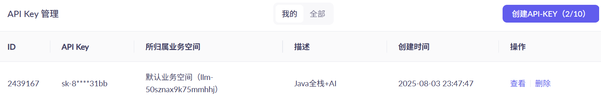
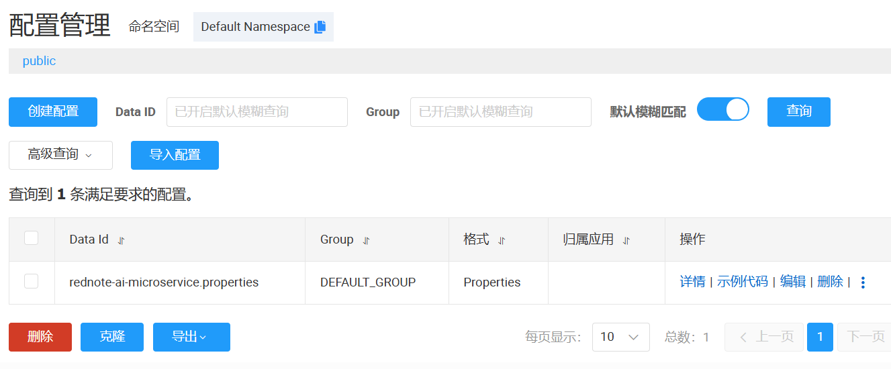
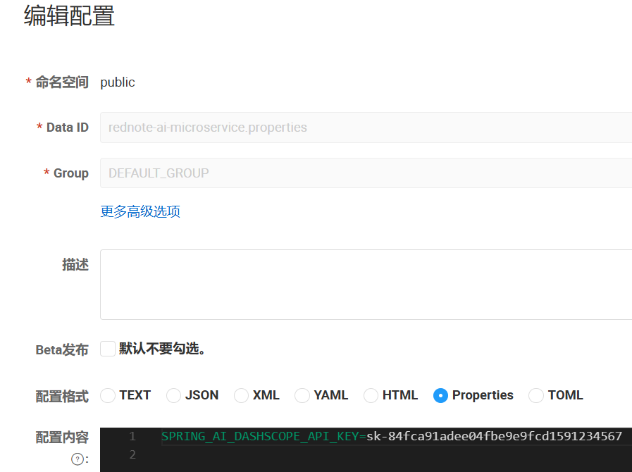
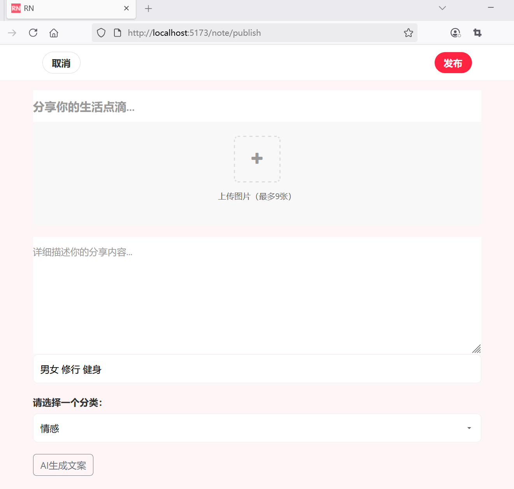
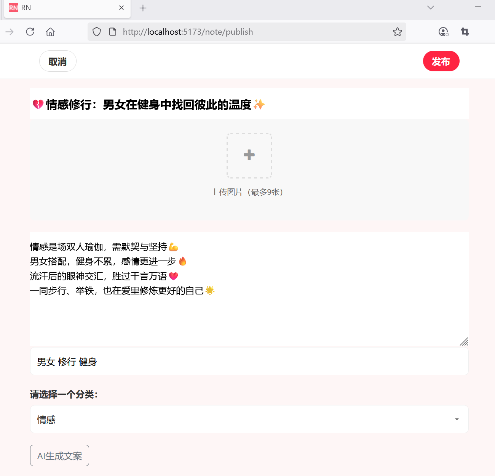
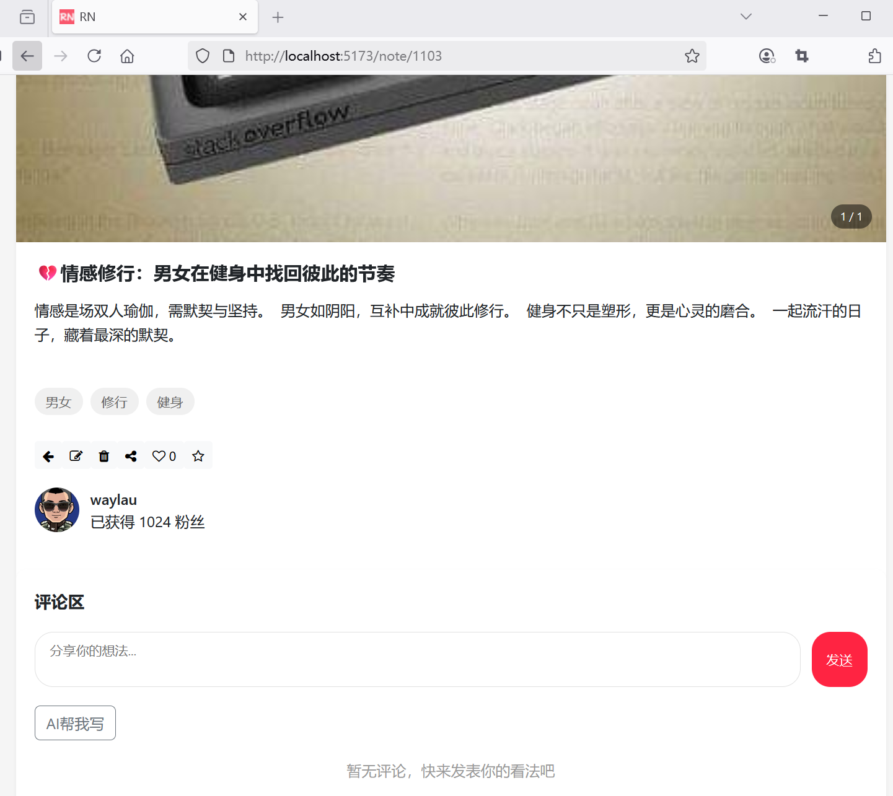
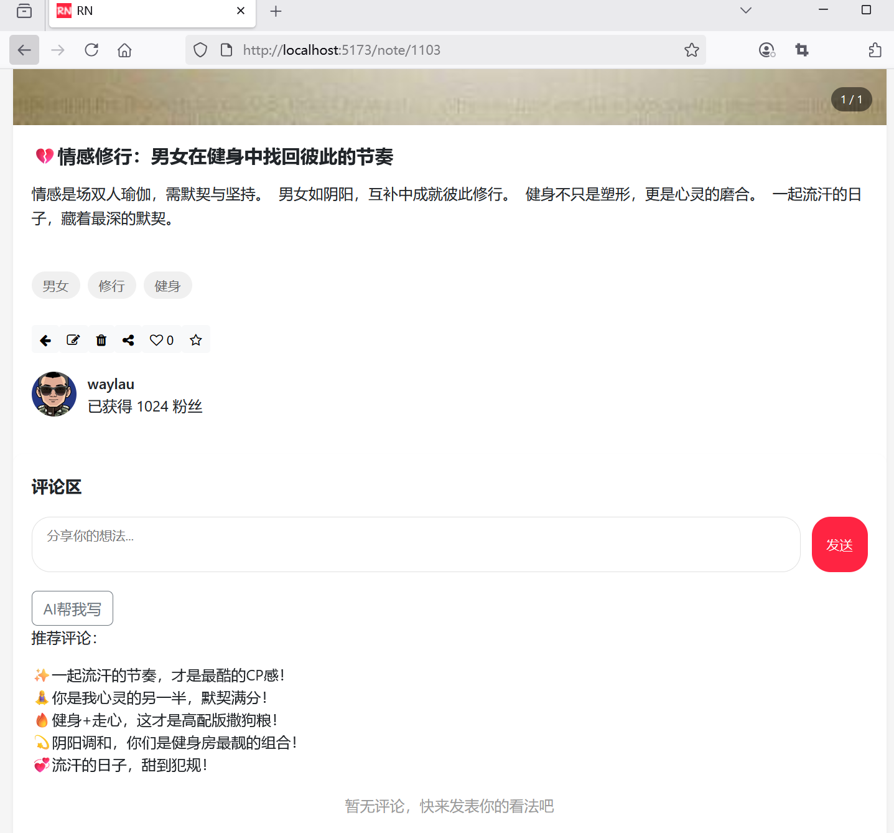
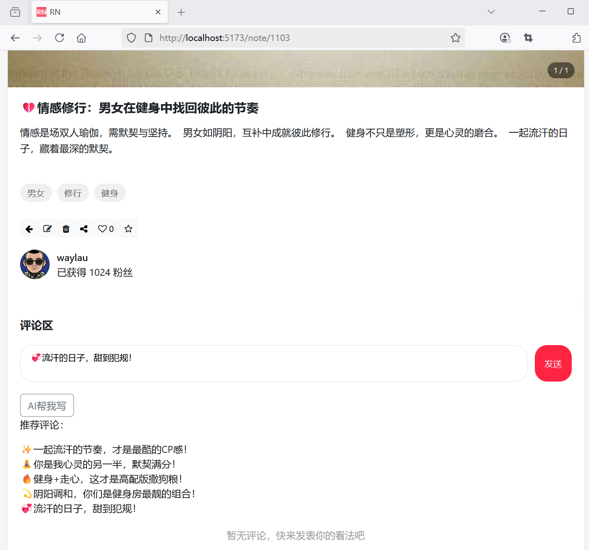
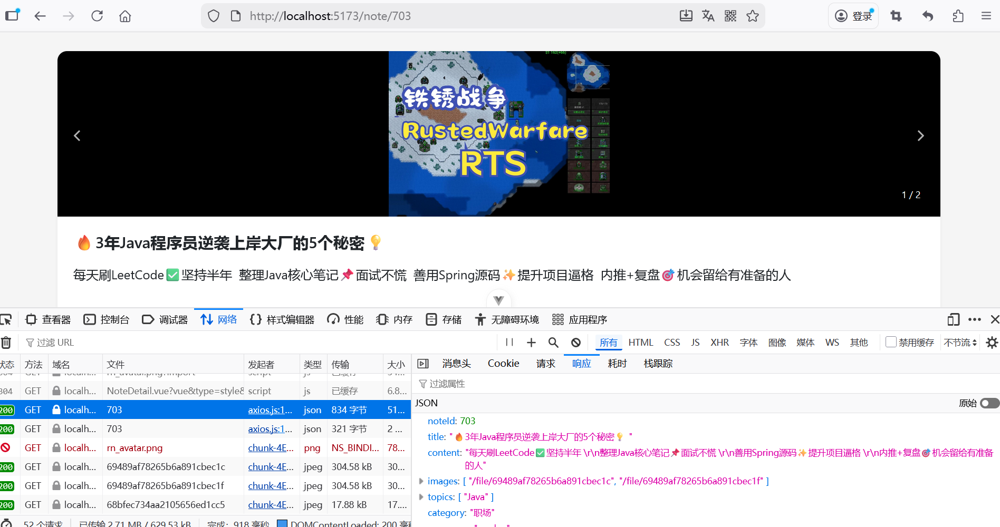
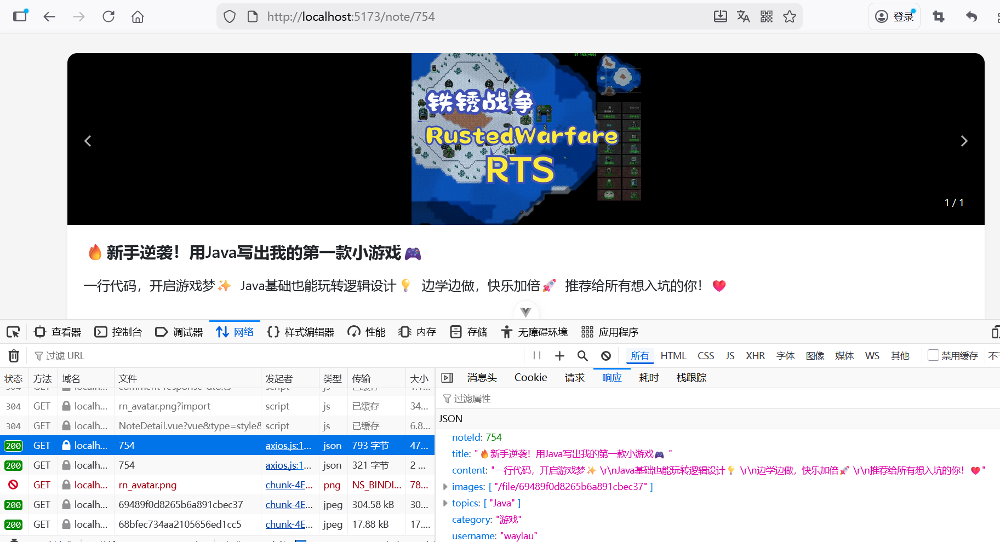

> 本页为原「Java 课程 23」全部 14 个分节的合订本；原分节链接会自动跳转到本页。


## 1.1 全栈工程师如何在仿“小红书”项目中融合AI技术

在仿“小红书”项目中融合AI技术，可以从内容创作、用户体验、社区运营等多个维度提升产品竞争力，同时保持“UGC（用户生成内容）+ 生活方式分享”的核心定位。以下是具体的实现思路和技术方案：


### 一、内容创作辅助：降低创作门槛，提升内容质量
#### 1. AI文案生成与优化
- 场景：用户发布笔记时，自动生成标题、标签或文案初稿。
- 实现：
  - 接入大语言模型（如GPT-3.5/4、讯飞星火、百度文心一言），通过API传递用户输入的关键词（如“周末探店”“穿搭分享”）或图片内容，生成符合小红书风格的文案。
  - 示例：用户上传一张咖啡探店图，AI生成“☕️隐藏在老巷子里的治愈系咖啡馆，提拉米苏绝了！”+ 标签#周末探店 #咖啡控。
  - 技术点：使用`LangChain`构建提示词模板（Prompt Template），限定输出风格（活泼、带emoji、短句）。

#### 2. 图片智能处理
- 场景：自动优化图片画质、风格化处理、智能裁剪。
- 实现：
  - 调用AI图像模型（如Stable Diffusion、Midjourney API、阿里云视觉智能），提供“滤镜推荐”（根据场景自动匹配ins风、复古风）、“智能修图”（去除背景杂物、增强光线）。
  - 对长图自动裁剪为小红书适配的3:4比例，或生成拼图布局建议。
  - 技术点：前端通过Canvas预览处理效果，后端异步调用图像API并缓存结果。

#### 3. 视频自动剪辑（针对短视频笔记）
- 场景：用户上传多段视频素材，自动生成卡点剪辑、添加字幕和背景音乐。
- 实现：
  - 使用AI视频处理工具（如剪映API、Pexels API），基于素材内容（如人脸识别、动作检测）自动拼接片段，匹配节奏音乐。
  - 自动识别语音生成字幕，并转换为小红书风格的花字样式。


### 二、智能推荐与搜索：精准匹配用户兴趣
#### 1. 个性化首页推荐
- 场景：基于用户行为和内容特征，动态推荐笔记。
- 实现：
  - 协同过滤：分析用户点赞、收藏、关注行为，推荐“相似用户喜欢的内容”。
  - 内容特征匹配：通过NLP提取笔记文本的关键词（如“油皮护肤”“租房改造”）、图片标签（如“美食”“旅行”），结合用户历史兴趣标签生成推荐列表。
  - 实时调整：使用强化学习（如DeepMind的DQN），根据用户实时反馈（如划过、停留时长）调整推荐策略。
  - 技术点：用Spark MLlib离线训练推荐模型，Flink实时更新用户特征，Redis缓存推荐结果。

#### 2. 语义化搜索
- 场景：用户搜索“适合油痘肌的平价护肤品”，返回更精准的笔记。
- 实现：
  - 基于大语言模型将搜索词转换为向量（Embedding），与笔记内容向量（文本+图片语义）进行余弦相似度匹配。
  - 支持模糊搜索和意图识别，例如用户搜索“夏天穿什么”，自动关联“穿搭”“防晒”“透气面料”等相关笔记。
  - 技术点：使用`Sentence-BERT`生成文本向量，`CLIP`模型处理图文跨模态搜索。


### 三、社区互动增强：提升用户参与感
#### 1. AI评论助手
- 场景：自动生成评论建议，或对用户评论进行智能回复。
- 实现：
  - 用户浏览笔记时，AI根据笔记内容推荐评论（如“求链接！”“这个地方具体在哪里呀？”），降低互动门槛。
  - 博主开启“AI自动回复”功能，对常见问题（如“价格多少”“教程有吗”）生成标准化回复，同时支持人工修改。

#### 2. 内容合规与安全
- 场景：自动检测违规内容（如低俗、广告、虚假信息）。
- 实现：
  - 接入AI内容审核API（如百度内容安全、阿里云绿网），实时检测文本、图片、视频中的违规信息。
  - 对疑似违规内容进行标记，由人工审核兜底，降低运营成本。
  - 技术点：前端上传时预校验，后端异步审核，违规内容自动隐藏并通知用户。


### 四、虚拟形象与互动创新
#### 1. AI虚拟博主（KOL）
- 场景：做一个平台专属虚拟博主，定期发布AI生成的内容。
- 实现：
  - 用数字人技术（如科大讯飞数字人、网易瑶台）生成虚拟形象，结合大语言模型生成符合人设的笔记（如“虚拟美妆博主”分享妆容教程）。
  - 虚拟博主可与用户互动（如评论区回复、直播带货），增强平台新鲜感。

#### 2. 个性化AI助手
- 场景：为用户提供专属“种草助手”，基于用户偏好推荐商品、地点、攻略。
- 实现：
  - 用户设置兴趣标签（如“学生党”“减脂期”），AI助手主动推送相关笔记，并回答具体问题（如“推荐100元以内的平价口红”）。
  - 技术点：用RAG（检索增强生成）技术，结合平台内的优质笔记内容生成精准回答。


### 五、技术架构与落地建议
1. 轻量化接入：初期优先使用成熟的AI API（如OpenAI、阿里云、百度智能云），降低自研成本，快速验证场景效果。
2. 数据闭环：收集用户对AI功能的反馈（如“文案是否满意”“推荐是否精准”），持续优化模型参数或提示词。
3. 平衡AI与UGC：AI作为辅助工具，核心仍需保留用户原创性，避免过度依赖AI导致内容同质化。
4. 合规性：明确标注AI生成内容（如“本文由AI辅助创作”），遵守数据隐私法规（如用户图片、文本仅用于功能优化，不泄露给第三方）。


### 六、典型功能流程示例（以“AI文案生成”为例）
1. 用户上传一张美食图片，点击“生成文案”按钮。
2. 前端将图片转为Base64，调用后端接口`/api/ai/generate-note`。
3. 后端调用图像识别API提取图片特征（如“火锅”“多人聚餐”），结合预设提示词（“生成活泼风格的小红书文案，带3个热门标签”）调用大语言模型。
4. 模型返回结果：“🍲 谁懂啊！这家老火锅的毛肚脆到离谱，人均才80+ 🔥 朋友聚会选这里准没错～ #火锅脑袋 #美食探店 #性价比餐厅”。
5. 用户可直接使用或修改后发布，系统记录该次AI使用数据用于后续优化。


通过上述方式，AI技术既能提升用户创作效率和体验，又能增强平台的个性化和运营能力，同时贴合小红书“年轻、潮流、生活方式”的核心定位。


## 2.1 AI文案生成与优化功能整体方案介绍

在原有仿“小红书”微服务项目中实现AI文案生成与优化功能，可通过“接入成熟AI接口+微服务适配改造”的方式快速落地，无需从零开发AI模型。以下是具体实现方案，包含技术选型、架构设计、核心代码和集成步骤。


### 一、功能规划与技术选型
#### 1. 核心功能
- 文案生成：用户上传图片/输入关键词后，自动生成符合小红书风格的笔记标题、正文和标签（如带emoji、短句、热门话题）。
- 文案优化：用户输入初稿后，AI进行润色（如调整语气、补充细节、添加话题标签）。
- 多场景适配：支持探店、穿搭、美妆、旅行等不同领域的风格定制。

#### 2. 技术选型（轻量化接入，适合非AI专业团队）
- AI接口：优先使用成熟大语言模型API（避免自研发成本）
  - 国内：百度文心一言、阿里通义千问、讯飞星火（支持中文语境，稳定性好）
  - 国外：OpenAI GPT-3.5/4（需科学上网，适合全球化需求）
- 微服务适配：
  - 新增AI服务模块（`rednote-ai-microservice`）：统一封装AI接口调用逻辑，避免业务服务与AI接口强耦合。
  - 缓存层：Redis缓存 AI生成结果（减少重复调用成本）。
  - 异步处理：使用Kafka处理长耗时的AI生成任务（如多段文案优化）。


### 二、架构设计（融入现有微服务架构）

#### 1. 整体架构图
```
用户端（rednote-ui）
       ↓
API网关（rednote-gateway-microservice）
       ↓
业务服务（rednote-content-microservice：笔记发布/编辑）
       ↓
AI服务（rednote-ai-microservice：文案生成/优化）
       ↓
第三方AI接口（文心一言/通义千问/OpenAI等）
```

#### 2. 核心模块职责

- rednote-ai-microservice：封装阿里云千问API调用逻辑，提供“生成评论建议”接口。
- rednote-content-microservice：接收笔记发布/编辑的用户请求，根据AI服务生成的文案发布笔记。


#### 3. 集成步骤总结

1. 注册第三方AI平台账号，获取API密钥（如百度文心一言）。  
2. 新建`rednote-ai-microservice`模块，实现AI接口封装和服务接口。  
3. 在业务服务（`rednote-content-microservice`）中调用AI服务，处理生成的文案。  
4. 前端添加“AI生成/优化”按钮，对接后端接口。  
5. 上线后根据用户反馈优化提示词模板和生成逻辑。

通过这种方式，无需深入AI理论，就能快速在现有微服务架构中集成AI文案功能，提升用户创作效率。


### 三、基础代码实现


#### 1. 引入Spring AI Alibaba依赖管理


修改父模块pom.xml


```xml
<properties>
    <!--...为节约篇幅，此处省略非核心内容-->
    <spring-ai.version>1.0.3</spring-ai.version>
    <spring-ai-alibaba.version>1.0.0.4</spring-ai-alibaba.version>
</properties>

<!--...为节约篇幅，此处省略非核心内容-->
<dependencyManagement>
    <dependencies>
        <!--...为节约篇幅，此处省略非核心内容-->
        <dependency>
            <groupId>org.springframework.ai</groupId>
            <artifactId>spring-ai-bom</artifactId>
            <version>${spring-ai.version}</version>
            <type>pom</type>
            <scope>import</scope>
        </dependency>
        <dependency>
            <groupId>com.alibaba.cloud.ai</groupId>
            <artifactId>spring-ai-alibaba-bom</artifactId>
            <version>${spring-ai-alibaba.version}</version>
            <type>pom</type>
            <scope>import</scope>
        </dependency>
    </dependencies>
</dependencyManagement>


<!-- 模块列表 -->
<modules>
    <!--...为节约篇幅，此处省略非核心内容-->
    <module>rednote-ai-microservice</module>
</modules>


```


#### 2. 新增AI领域微服务模块（`rednote-ai-microservice`）


```xml
<?xml version="1.0" encoding="UTF-8"?>
<project xmlns="http://maven.apache.org/POM/4.0.0"
         xmlns:xsi="http://www.w3.org/2001/XMLSchema-instance"
         xsi:schemaLocation="http://maven.apache.org/POM/4.0.0 http://maven.apache.org/xsd/maven-4.0.0.xsd">
    <parent>
        <groupId>com.example</groupId>
        <artifactId>rednote-microservices</artifactId>
        <version>0.0.1-SNAPSHOT</version>
    </parent>

    <modelVersion>4.0.0</modelVersion>
    <groupId>com.example</groupId>
    <artifactId>rednote-ai-microservice</artifactId>
    <name>rednote-ai-microservice</name>
    <packaging>jar</packaging>
    <description>AI领域微服务模块</description>

    <!-- 子模块可以定义自己的依赖 -->
    <dependencies>
        <!-- 依赖公共模块 -->
        <dependency>
            <groupId>com.example</groupId>
            <artifactId>rednote-common</artifactId>
            <version>${project.version}</version>
        </dependency>

        <dependency>
            <groupId>com.alibaba.cloud.ai</groupId>
            <artifactId>spring-ai-alibaba-starter-dashscope</artifactId>
        </dependency>
    </dependencies>

    <!-- 子模块可以定义自己的插件-->
    <build>
        <plugins>
            <plugin>
                <groupId>org.springframework.boot</groupId>
                <artifactId>spring-boot-maven-plugin</artifactId>
            </plugin>
        </plugins>
    </build>

</project>
```


#### 3. 应用启动类


```java
package com.example.rednote.aimicroservice;

import org.springframework.boot.SpringApplication;
import org.springframework.boot.autoconfigure.SpringBootApplication;
import org.springframework.cloud.client.discovery.EnableDiscoveryClient;
import org.springframework.cloud.openfeign.EnableFeignClients;

@SpringBootApplication(scanBasePackages = "com.example.rednote")
@EnableDiscoveryClient
@EnableFeignClients(basePackages = {"com.example.rednote.common.interfaces.client"})
public class RednoteApplication {

	public static void main(String[] args) {
		SpringApplication.run(RednoteApplication.class, args);
	}

}
```


#### 4. 应用配置


```java
spring.application.name=rednote-ai-microservice
server.port=9050

# 配置 JWT
## 你的Base64编码密钥（至少256位）
app.jwtSecret=bQUBj9U7io0VXuhlaC9XmeaSGSwkqOlG4itHzIgUvOk=
## 24小时
app.jwtExpirationMs=86400000

# 配置 Spring Cloud Loadbalancer
spring.cloud.loadbalancer.enabled=true

# 配置 Nacos
spring.cloud.loadbalancer.nacos.enabled=true
spring.cloud.nacos.discovery.server-addr=127.0.0.1:8848
management.endpoints.web.exposure.include=*
spring.cloud.nacos.config.server-addr=127.0.0.1:8848
spring.config.import[0]=nacos:rednote-ai-microservice.properties?group=DEFAULT_GROUP

# 配置 Seata
seata.tx-service-group=rednote_tx_group
seata.service.vgroup-mapping.rednote_tx_group=default
seata.registry.type=nacos
seata.registry.nacos.server-addr=127.0.0.1:8848
seata.registry.nacos.namespace=public
seata.registry.nacos.cluster=default
```


## 2.2 获取大模型API调用权限

本文以阿里云通义千问为例，引导完成大模型API调用。

### 注册阿里云账号


如果没有阿里云账号，需要先注册阿里云账号。访问<https://account.aliyun.com/register/qr_register.htm>


### 开通百炼的模型服务

前往百炼控制台<https://bailian.console.aliyun.com/console?tab=model#/model-market>，选择要使用的模型。如果页面顶部显示以下消息，需要开通百炼的模型服务，以获得免费额度。如果未显示该消息，则表示已经开通。


 
### 获取API Key

在控制台的左下角选择“密钥管理”，然后创建API Key，用于通过API调用大模型。
 


 

可以查看并复制该API Key。




 
有了该API Key之后，就能调用阿里云通义千问所提供的模型了。


建议把API Key配置到环境变量或者是配置中心，从而避免在代码里显式地配置API Key，降低泄漏风险。


### 把API Key配置配置中心

在Nacos配置中心针对rednote-ai-microservice模块，新增一个Data Id为rednote-ai-microservice.properties的配置，如下图所示。





在上述配置的配置内容里面，新增SPRING_AI_DASHSCOPE_API_KEY配置，其值为阿里云通义千问API Key，如下图所示。




### 应用配置


修改rednote-ai-microservice模块的配置文件，增加如下配置

```
# Spring AI配置
spring.ai.dashscope.api-key=${SPRING_AI_DASHSCOPE_API_KEY}
logging.level.org.springframework.ai=debug
logging.level.com.alibaba.dashscope.api=debug
logging.level.com.alibaba.cloud.ai.dashscope.chat=debug
```


## 2.3 定义AI文案生成服务接口

### 定义AI文案生成服务

定义AI文案生成服务接口`src/main/java/com/example/rednote/aimicroservice/application/service/AiCopywritingService.java`：

```java
package com.example.rednote.aimicroservice.application.service;

/**
 * AiCopywritingService AI文案生成服务
 *
 * @version 2025/08/03
 **/
public interface AiCopywritingService {
    /**
     * 生成文案
     *
     * @param prompt
     * @return
     */
    String generate(String prompt);

    /**
     * 构建提示词（复用前文逻辑）
     *
     * @param type
     * @param keywords
     * @return
     */
    String buildPrompt(String type, String keywords);
}
```


接口实现AiCopywritingServiceImpl如下：


```java
package com.example.rednote.aimicroservice.application.service;

import com.alibaba.cloud.ai.dashscope.chat.DashScopeChatOptions;
import org.springframework.ai.chat.client.ChatClient;
import org.springframework.ai.chat.client.advisor.SimpleLoggerAdvisor;
import org.springframework.ai.chat.model.ChatModel;
import org.springframework.ai.chat.model.ChatResponse;
import org.springframework.ai.chat.prompt.Prompt;
import org.springframework.stereotype.Service;

/**
 * AiCopywritingServiceImpl AI文案生成服务
 *
 * @version 2025/08/03
 **/
@Service
public class AiCopywritingServiceImpl implements AiCopywritingService {
    // 注入Spring AI 统一的ChatClient
    private final ChatClient chatClient;

    // 构造注入（无需手动创建客户端）
    public AiCopywritingServiceImpl(ChatModel chatModel) {
        // 构造时，可以设置 ChatClient 的参数
        // {@link org.springframework.ai.chat.client.ChatClient};
        this.chatClient = ChatClient.builder(chatModel)
                // 实现 Logger 的 Advisor
                .defaultAdvisors(
                        new SimpleLoggerAdvisor()
                )
                // 设置 ChatClient 中 ChatModel 的 Options 参数
                .defaultOptions(
                        DashScopeChatOptions.builder()
                                .withTopP(0.7)
                                .build()
                )
                .build();
    }

    // 生成文案
    @Override
    public String generate(String prompt) {
        // 1. 构建提示词
        Prompt aiPrompt = new Prompt(prompt);

        // 2. 调用AI模型
        ChatResponse response = chatClient.prompt(aiPrompt).call().chatResponse();

        // 3. 提取生成结果
        return response.getResult().getOutput().getText();
    }

    @Override
    public String buildPrompt(String type, String keywords) {
        return "请生成一篇小红书风格的" + type + "笔记文案，要求：" +
                "1. 标题吸引人，带emoji；" +
                "2. 正文分3-4行，每句不超过20字；" +
                "3. 结合关键词：" + keywords + "。";
    }
}
```


### 编写测试用例

新增测试用例`src/test/java/com/example/rednote/aimicroservice/application/service/AiCopywritingServiceTests.java`

```java
package com.example.rednote.aimicroservice.application.service;

import org.junit.jupiter.api.Test;
import org.springframework.beans.factory.annotation.Autowired;
import org.springframework.boot.test.context.SpringBootTest;
import static org.junit.jupiter.api.Assertions.assertNotNull;

@SpringBootTest
class AiCopywritingServiceTests {

    @Autowired
    private AiCopywritingService aiCopywritingService;

    @Test
    void testCopywriting() {
        // 1. 构建提示词
        String prompt = aiCopywritingService.buildPrompt("职场", "Java、开发、编程");

        // 2. 调用生成服务（已自动处理缓存、API调用、错误处理）
        String result = aiCopywritingService.generate(prompt);

        System.out.println(result);

        assertNotNull(result);
    }

}
```


运行测试，效果如下：

```
💻Java开发日常｜写给所有编程女孩的成长笔记✨

每天和bug斗智斗勇💪  
代码写得优雅，职场走得更稳🚀  
Java不止是编程，更是逻辑的艺术🎨  
认真敲下的每一行，都是未来的底气💼
```


## 2.4 实现AI文案生成服务控制器

### 编写控制器

```java
package com.example.rednote.aimicroservice.interfaces.controller;

import com.example.rednote.aimicroservice.application.service.AiCopywritingService;
import com.example.rednote.aimicroservice.application.dto.CopywritingRequestDto;
import com.example.rednote.aimicroservice.application.dto.CopywritingResponseDto;
import org.springframework.beans.factory.annotation.Autowired;
import org.springframework.http.ResponseEntity;
import org.springframework.web.bind.annotation.*;

/**
 * AiController AI文案生成控制器
 *
 * @version 2025/08/03
 **/
@RestController
@RequestMapping("/ai")
public class AiController {
    @Autowired
    private AiCopywritingService aiCopywritingService;

    @PostMapping("/copywriting")
    public ResponseEntity<CopywritingResponseDto> generateCopywriting(@RequestBody CopywritingRequestDto request) {
        // 1. 构建提示词
        String prompt = aiCopywritingService.buildPrompt(request.getType(), request.getKeywords());

        // 2. 调用生成服务（已自动处理缓存、API调用、错误处理）
        String result = aiCopywritingService.generate(prompt);

        // 3. 解析为DTO，用"\n\n"分割为标题和正文
        String[] textArray = result.split("\n\n");

        CopywritingResponseDto dto;
        if (textArray.length > 1) {
            // 如果包含"\n\n"，则识别为标题和正文
            dto = new CopywritingResponseDto(textArray[0], textArray[1]);
        } else {
            // 如果不包含"\n\n"，则没有标题仅有正文
            dto = new CopywritingResponseDto(null, result);
        }

        return ResponseEntity.ok(dto);
    }

}
```

需要处理返回数据格式不一致的问题，比如下面这种是有`\n\n`的，可以被识别为标题和正文两部分：

```
💔情感修行：男女在健身中找回彼此的节奏  \n\n情感是场双人瑜伽，需默契与坚持。  \n男女如阴阳，互补中成就彼此修行。  \n健身不只是塑形，更是心灵的磨合。  \n一起流汗的日子，藏着最深的默契。
```

下面这种是没有`\n\n`的，被识别为没有标题仅有正文部分：

```
💔✨情感修行：男女在健身中找回彼此  \n健身房里，汗水比言语更诚实  \n他举铁，她瑜伽，心却慢慢靠近  \n爱情不是躺赢，是共同流汗的坚持
```


### 编写请求DTO

CopywritingRequestDto类定义在`src/main/java/com/example/rednote/aimicroservice/application/dto/CopywritingRequestDto.java`:


```java
package com.example.rednote.aimicroservice.application.dto;

import lombok.AllArgsConstructor;
import lombok.Getter;
import lombok.Setter;

/**
 * CopywritingRequestDto AI文案生成请求DTO
 *
 * @version 2025/08/03
 **/
@Getter
@Setter
@AllArgsConstructor
public class CopywritingRequestDto {
    // 内容类型
    private String type;
    // 用户输入的关键词
    private String keywords;
}
```


### 编写响应DTO

CopywritingResponseDto类定义在`src/main/java/com/example/rednote/aimicroservice/application/dto/CopywritingResponseDto.java`:


```java
package com.example.rednote.aimicroservice.application.dto;

import lombok.AllArgsConstructor;
import lombok.Getter;
import lombok.Setter;

/**
 * CopywritingResponseDto AI文案生成响应DTO
 *
 * @version 2025/12/21
 **/
@Getter
@Setter
@AllArgsConstructor
public class CopywritingResponseDto {
    // 文案标题
    private String title;

    // 文案内容
    private String content;
}
```


## 2.5 调整安全及路由规则以支持对外提供AI服务

### 修改安全配置基类


1. 在 Spring Security 配置类中，进一步细化AI接口的访问权限
2. 允许管理员或者普通用户角色访问可以访问AI接口


修改公共模块下的BaseSecurityConfig如下：


```java
protected void configureCommon(HttpSecurity http) throws Exception {
    http

            .authorizeHttpRequests(authorize -> authorize
                    // ...为节约篇幅，此处省略非核心内容
                    
                    // 允许管理员或者普通用户角色访问
                    .requestMatchers("/ai/**").hasAnyRole("USER", "ADMIN")
                    // 其他请求需要认证
                    .anyRequest().authenticated()
            )
```


### 新增安全配置类


在AI领域微服务模块新增安全配置类`src/main/java/com/example/rednote/aimicroservice/infrastructure/config/WebSecurityConfig.java`：


```java
package com.example.rednote.aimicroservice.infrastructure.config;

import com.example.rednote.common.config.BaseSecurityConfig;
import org.springframework.context.annotation.Bean;
import org.springframework.context.annotation.Configuration;
import org.springframework.security.config.annotation.method.configuration.EnableGlobalMethodSecurity;
import org.springframework.security.config.annotation.web.builders.HttpSecurity;
import org.springframework.security.config.annotation.web.configuration.EnableWebSecurity;
import org.springframework.security.web.SecurityFilterChain;

/**
 * WebSecurityConfig 安全配置类
 *
 * @version 2025/08/04
 **/
@Configuration
@EnableWebSecurity
@EnableGlobalMethodSecurity(prePostEnabled = true) // 启用@PreAuthorize等注解
public class WebSecurityConfig extends BaseSecurityConfig {

    @Bean
    public SecurityFilterChain securedFilterChain(HttpSecurity http) throws Exception {
        // 1. 应用公共配置（无状态、JWT过滤器等）
        configureCommon(http);

        // 2. 配置用户服务特有的权限规则
        configureAuthorize(http);

        return http.build();
    }

    @Override
    protected void configureAuthorize(HttpSecurity http) throws Exception {
        // 如果没有特殊配置，则可以置空
    }

}
```


### 新增路由配置


修改API网关领域微服务模块的应用配置，增加如下路由配置

```
spring.cloud.gateway.mvc.routes[4].id=rednote-ai-microservice
spring.cloud.gateway.mvc.routes[4].uri=lb://rednote-ai-microservice
spring.cloud.gateway.mvc.routes[4].predicates[0]=Path=/ai/**
```


## 2.6 笔记发布界面适配调用AI文案生成服务功能

### 增加“AI生成文案”按钮

在发布笔记页面添加“AI生成文案”按钮：


```html
<!-- 内容区域 -->
<div class="content container">
    <!-- 笔记发布表单 -->
    <form id="noteForm" ref="noteFormRef" method="post" enctype="multipart/form-data" action="/note/publish">
        <!-- ...为节约篇幅，此处省略非核心内容 -->
    </form>

    <!-- AI生成文案 -->
    <button class="btn btn-outline-secondary" @click="generateByAI">AI生成文案</button>

</div>
```

### “AI生成文案”按钮点击事件处理、


```js
import { CopywritingRequestDto } from '@/dto/copywriting-request-dto';
import type { CopywritingResponseDto } from '@/dto/copywriting-response-dto';

// ...为节约篇幅，此处省略非核心内容

const generateByAI = async () => {
    if (note.value) {
        if (note.value.category && note.value.topics) {
            try {
                // 发送请求
                let copywritingRequestDto = new CopywritingRequestDto();
                copywritingRequestDto.type = note.value.category;
                copywritingRequestDto.keywords = note.value.topics;

                const response = await axios.post('/api/ai/copywriting', copywritingRequestDto);

                // 请求结果
                console.log('请求结果' + response);

                const copywritingResponseDto = response.data as CopywritingResponseDto;
                note.value.title = copywritingResponseDto.title;
                note.value.content = copywritingResponseDto.content;
            } catch (error) {
                // 处理错误响应
                const axiosError = error as AxiosError<ApiValidationError>;
                if (axiosError.response?.status === 400 && axiosError.response.data) {
                    // 绑定后端返回的错误信息
                    errors.value = axiosError.response.data;
                }
            }
        } else {
            alert(`调用AI服务请提供话题和分类`);
        }

    }
};
```


其中请求前后的数据分别用CopywritingRequestDto、CopywritingResponseDto类型表示。


### 新建DTO

新建`src\dto\copywriting-request-dto.ts`


```ts
export class CopywritingRequestDto {
  type: string = '';
  keywords: string = '';
}
```


新建`src\dto\copywriting-response-dto.ts`


```ts
export interface CopywritingResponseDto {
  title: string;
  content: string;
}
```


### 运行调测


“AI生成文案”按钮界面效果如下图2-6所示。




点击“AI生成文案”按钮之后，自动生成的文案效果如下图2-7所示。




## 3.1 AI实现评论助手功能方案介绍

在仿“小红书”微服务项目中集成阿里云千问实现AI评论助手功能，可通过“阿里云千问API + 微服务接口封装”的方式快速落地。该功能能为用户生成评论建议、自动回复常见问题，提升社区互动效率。以下是具体实现方案：


### 一、功能规划

AI评论助手核心功能：
1. 评论建议生成：用户浏览笔记时，AI根据笔记内容生成个性化评论（如“求链接！”“这个教程太实用了～”）。
2. 评论风格适配：支持“活泼”“简洁”“专业”等风格，贴合小红书社区调性。


### 二、技术方案设计
#### 1. 架构设计（融入现有微服务）
```
用户端（rednote-ui）
       ↓
API网关（rednote-gateway-microservice）
       ↓
业务服务（rednote-comment-microservice：评论发布）
       ↓
AI服务（rednote-ai-microservice：评论建议）
       ↓
第三方AI接口（文心一言/通义千问/OpenAI等）
```

#### 2. 核心模块职责


- rednote-ai-microservice：封装阿里云千问API调用逻辑，提供“生成评论建议”接口。
- rednote-comment-microservice：接收用户评论操作请求，根据AI服务生成评论建议进行评论。

### 三、具体实现步骤


参考前一章：AI文案生成。

### 四、优化与注意事项
1. 提示词优化：
   - 针对不同笔记类型（美食、穿搭、旅行）定制提示词，例如美食笔记强调“求店名”“价格”，穿搭笔记强调“链接”“显瘦”。
   - 示例：`"这条评论是关于美食探店笔记的，回复需包含可能的店名和人均价格信息..."`

2. 成本控制：
   - 缓存热门笔记的评论建议（如点赞1000+的笔记），减少重复调用。
   - 限制单用户每日AI评论生成次数（如10次/天）。

3. 失败降级：
   - 当API调用超时或失败时，返回预设的通用评论（如“内容太棒了，收藏了！”）。

4. 合规性：
   - 在AI生成的评论/回复前添加标识（如“[AI辅助]”），避免用户误解。


### 五、总结
通过封装阿里云千问API为微服务接口，可快速在现有项目中实现AI评论助手功能。核心步骤：
1. 开通阿里云千问API并获取密钥。
2. 新增`ai-microservice`模块，封装API调用逻辑和提示词工程。
3. 在评论服务中集成AI接口，提供前端调用能力。
4. 优化提示词和缓存策略，平衡效果与成本。

该方案无需自研AI模型，适合快速落地并提升社区互动体验。


## 3.2 定义AI评论生成服务接口

### 定义AI评论生成服务

定义AI评论生成服务接口`src/main/java/com/example/rednote/aimicroservice/application/service/AiCommentService.java`：

```java
package com.example.rednote.aimicroservice.application.service;

/**
 * AiCopywritingService AI评论生成服务
 *
 * @version 2025/08/03
 **/
public interface AiCommentService {
    /**
     * 生成评论建议
     *
     * @param prompt
     * @return
     */
    String generate(String prompt);

    /**
     * 构建提示词
     *
     * @param type
     * @param content
     * @return
     */
    String buildPrompt(String type, String content);
}
```


接口实现AiCommentServiceImpl如下：


```java
package com.example.rednote.aimicroservice.application.service;

import com.alibaba.cloud.ai.dashscope.chat.DashScopeChatOptions;
import org.springframework.ai.chat.client.ChatClient;
import org.springframework.ai.chat.client.advisor.SimpleLoggerAdvisor;
import org.springframework.ai.chat.model.ChatModel;
import org.springframework.ai.chat.model.ChatResponse;
import org.springframework.ai.chat.prompt.Prompt;
import org.springframework.stereotype.Service;

/**
 * AiCommentServiceImpl AI评论生成服务
 *
 * @version 2025/08/03
 **/
@Service
public class AiCommentServiceImpl implements AiCommentService {
    // 注入Spring AI 统一的ChatClient
    private final ChatClient chatClient;

    // 构造注入（无需手动创建客户端）
    public AiCommentServiceImpl(ChatModel chatModel) {
        // 构造时，可以设置 ChatClient 的参数
        // {@link org.springframework.ai.chat.client.ChatClient};
        this.chatClient = ChatClient.builder(chatModel)
                // 实现 Logger 的 Advisor
                .defaultAdvisors(
                        new SimpleLoggerAdvisor()
                )
                // 设置 ChatClient 中 ChatModel 的 Options 参数
                .defaultOptions(
                        DashScopeChatOptions.builder()
                                .withTopP(0.7)
                                .build()
                )
                .build();
    }

    // 生成评论
    @Override
    public String generate(String prompt) {
        // 1. 构建提示词
        Prompt aiPrompt = new Prompt(prompt);

        // 2. 调用AI模型
        ChatResponse response = chatClient.prompt(aiPrompt).call().chatResponse();

        // 3. 提取生成结果
        String text = response.getResult().getOutput().getText();

        return text;
    }

    @Override
    public String buildPrompt(String type, String content) {
        return "请为以下笔记生成" + type + "风格的评论建议，要求：" +
                "1. 笔记内容为：" + content   + "。" +
                "2. 每条评论不超过20字，带emoji，符合年轻人语气，不要重复。" +
                "3. 提供共3-5条评论。除了评论内容外，不要有其他多余的内容。评论条目前面不要加序号";
    }
}
```


### 编写测试用例

新增测试用例`src/test/java/com/example/rednote/aimicroservice/application/service/AiCommentServiceTests.java`

```java
package com.example.rednote.aimicroservice.application.service;

import org.junit.jupiter.api.Test;
import org.springframework.beans.factory.annotation.Autowired;
import org.springframework.boot.test.context.SpringBootTest;

import static org.junit.jupiter.api.Assertions.assertNotNull;

@SpringBootTest
class AiCommentServiceTests {

    @Autowired
    private AiCommentService aiCommentService;

    @Test
    void testComment() {
        // 1. 构建提示词
        String prompt = aiCommentService.buildPrompt("职场", "Java在企业级应用开发中占有不可替代的地位。");

        // 2. 调用生成服务（已自动处理缓存、API调用、错误处理）
        String result = aiCommentService.generate(prompt);

        System.out.println(result);

        assertNotNull(result);
    }

}
```


运行测试，效果如下：

```
Java稳如老狗，企业级开发还得靠它 🐶  
大厂都在用，Java真香警告！🔥  
后端王者，不服来辩 🙌  
想进名企？Java必须拿下 💪  
虽老但强，生态太成熟了 🌱
```


## 3.3 实现AI评论生成服务控制器

### 编写请求DTO

CommentSuggestionRequestDto类定义在`src/main/java/com/example/rednote/aimicroservice/application/dto/CommentSuggestionRequestDto.java`:


```java
package com.example.rednote.aimicroservice.application.dto;

import lombok.AllArgsConstructor;
import lombok.Getter;
import lombok.Setter;

/**
 * CommentSuggestionRequestDto AI评论生成请求DTO
 *
 * @version 2025/08/03
 **/
@Getter
@Setter
@AllArgsConstructor
public class CommentSuggestionRequestDto {
    // 内容类型
    private String type;
    // 内容
    private String content;
}
```


### 编写响应DTO

CommentSuggestionResponseDto类定义在`src/main/java/com/example/rednote/aimicroservice/application/dto/CommentSuggestionResponseDto.java`:


```java
package com.example.rednote.aimicroservice.application.dto;

import lombok.AllArgsConstructor;
import lombok.Getter;
import lombok.Setter;

/**
 * CommentSuggestionResponseDto AI评论生成响应DTO
 *
 * @version 2025/08/03
 **/
@Getter
@Setter
@AllArgsConstructor
public class CommentSuggestionResponseDto {
    private String[] commentSuggestions;
}
```

### 编写控制器


修改AiController，增加以下方法：


```java
import com.example.rednote.aimicroservice.application.dto.CommentSuggestionRequestDto;
import com.example.rednote.aimicroservice.application.dto.CommentSuggestionResponseDto;

// ...为节约篇幅，此处省略非核心内容

@Autowired
private AiCommentService aiCommentService;

@PostMapping("/comment")
public ResponseEntity<CommentSuggestionResponseDto> generateComment(@RequestBody CommentSuggestionRequestDto request) {
    // 1. 构建提示词
    String prompt = aiCommentService.buildPrompt(request.getType(), request.getContent());

    // 2. 调用生成服务（已自动处理缓存、API调用、错误处理）
    String result = aiCommentService.generate(prompt);

    // 3. 解析为DTO，用"\n"分割多条评论
    String[] textArray = result.split("\n");
    CommentSuggestionResponseDto dto = new CommentSuggestionResponseDto(textArray);

    return ResponseEntity.ok(dto);
}
```

需要处理返回数据，按照`\n`格式将评论列表进行分割比如：

```
✨情感和健身一样，坚持才有默契💪  \n情侣瑜伽太戳了，流汗也浪漫💞  \n健身修心，感情也在汗水里升华🔥  \n阴阳互补，一起修炼最甜的关系🧘‍♀️❤️  \n互相成就的感觉，大概就是爱情了💯
```


将会分割为5条评论：

```
✨情感和健身一样，坚持才有默契💪  
情侣瑜伽太戳了，流汗也浪漫💞  
健身修心，感情也在汗水里升华🔥  
阴阳互补，一起修炼最甜的关系🧘‍♀️❤️  
互相成就的感觉，大概就是爱情了💯
```


## 3.4 评论界面适配调用AI评论生成服务功能

### 增加“AI帮我写”按钮

在笔记评论页面添加“AI帮我写”按钮：


```html
<!-- 评论区 -->
<div class="comments-section">

    <!-- 评论输入框 -->

    <!-- ...为节约篇幅，此处省略非核心内容 -->

    <!-- AI帮我写按钮 -->
    <button class="btn btn-outline-secondary" @click="showSuggestions">AI帮我写</button>

    <!-- AI评论建议列表 -->
    <div class="suggestions" v-if="commentSuggestions.length > 0">
        <p>推荐评论：</p>
        <div v-for="s in commentSuggestions" :key="s" @click="useSuggestion(s)">
        {{ s }}
        </div>
    </div>

    <!-- ...为节约篇幅，此处省略非核心内容 -->

</div>
```

### “AI帮我写”按钮点击事件处理、


```js
import { CommentSuggestionRequestDto } from '@/dto/comment-suggestion-request-dto';
import type { CommentSuggestionResponseDto } from '@/dto/comment-suggestion-response-dto';

// ...为节约篇幅，此处省略非核心内容

// AI评论生成建议
const commentSuggestions = ref<Array<string>>([]);

const showSuggestions = async () => {
    if (note.value) {
        if (note.value.category && note.value.content) {
            try {
                // 发送请求
                let commentSuggestionRequestDto = new CommentSuggestionRequestDto();
                commentSuggestionRequestDto.type = note.value.category;
                commentSuggestionRequestDto.content = note.value.content;

                const response = await axios.post('/api/ai/comment', commentSuggestionRequestDto);

                // 请求结果
                console.log('请求结果' + response);

                const commentSuggestionResponseDto = response.data as CommentSuggestionResponseDto;
                commentSuggestions.value = commentSuggestionResponseDto.commentSuggestions;
            } catch (error) {
                // 处理错误响应
                alert(error);
            }
        } else {
            alert(`调用AI服务请提供话题和分类`);
        }

    }
};

 // 使用AI建议的评论
function useSuggestion(text: string) {
    newComment.value = text;
}
```


其中请求前后的数据分别用CommentSuggestionRequestDto、CommentSuggestionResponseDto类型表示。


### 新建DTO

新建`src\dto\comment-suggestion-request-dto.ts`


```ts
export class CommentSuggestionRequestDto {
  type: string = '';
  content: string = '';
}
```


新建`src\dto\comment-suggestion-response-dto.ts`


```ts
export interface CommentSuggestionResponseDto {
  commentSuggestions: string[];
}
```


### 运行调测


“AI帮我写”按钮界面效果如下图3-1所示。




点击“AI帮我写”按钮之后，自动生成的评论建议列表效果如下图3-2所示。




点击评论建议列表中的条目的效果如下图3-3所示。




## 3.5 AI辅助编程解决笔记发布时图片重复的问题

笔记发布时，发现插入一张图片，但最后查询笔记详情时是两张重复图片，如下图3-4所示。




### 问题排查


在`com/example/rednote/contentmicroservice/interfaces/controller/NoteController.java`中的publishNote方法添加了如下调试日志：

```java
@PostMapping("/publish")
public ResponseEntity<?> publishNote(@Valid @ModelAttribute("note") NotePublishDto notePublishDto,
                                      BindingResult bindingResult,
                                      HttpServletRequest request) {
    // 添加调试信息
    log.info("Content-Type: {}", request.getContentType());

    if (request instanceof MultipartHttpServletRequest) {
        MultipartHttpServletRequest multipartRequest = (MultipartHttpServletRequest) request;
        log.info("Multipart parameter names: {}", multipartRequest.getParameterNames());
        if (multipartRequest.getFileMap().containsKey("images")) {
            log.info("Number of 'images' files: {}", multipartRequest.getFiles("images").size());
        }
    }

    log.info("Images count: {}", notePublishDto.getImages().size());
    for (int i = 0; i < notePublishDto.getImages().size(); i++) {
        MultipartFile file = notePublishDto.getImages().get(i);
        log.info("Image {}: name={}, size={}", i, file.getOriginalFilename(), file.getSize());
    }

    // ...为节约篇幅，此处省略非核心内容

}    
```

运行结果如下：


```
2025-12-22T09:22:20.566+08:00  INFO 72768 --- [rednote-content-microservice] [nio-9030-exec-1] c.w.r.c.i.controller.NoteController      : Content-Type: multipart/form-data;boundary=----geckoformboundary31459ba76b56162cdb425fcc28c882d2;charset=UTF-8
2025-12-22T09:22:20.566+08:00  INFO 72768 --- [rednote-content-microservice] [nio-9030-exec-1] c.w.r.c.i.controller.NoteController      : Multipart parameter names: java.util.Collections$3@1401e564
2025-12-22T09:22:20.568+08:00  INFO 72768 --- [rednote-content-microservice] [nio-9030-exec-1] c.w.r.c.i.controller.NoteController      : Number of 'images' files: 2
2025-12-22T09:22:20.568+08:00  INFO 72768 --- [rednote-content-microservice] [nio-9030-exec-1] c.w.r.c.i.controller.NoteController      : Images count: 2
2025-12-22T09:22:20.569+08:00  INFO 72768 --- [rednote-content-microservice] [nio-9030-exec-1] c.w.r.c.i.controller.NoteController      : Image 0: name=939eefff8de5cdbde23d82afb3022fd90a783380.jpg, size=304190
2025-12-22T09:22:20.569+08:00  INFO 72768 --- [rednote-content-microservice] [nio-9030-exec-1] c.w.r.c.i.controller.NoteController      : Image 1: name=939eefff8de5cdbde23d82afb3022fd90a783380.jpg, size=304190
```


根据调试输出结果，问题已经明确了：前端确实发送了两个相同的文件，这不是后端的问题。从网络请求来看，发送了两个相同的文件。


从日志可以看出：

* 请求中有两个名为 images 的文件部分
* 两个文件具有完全相同的文件名和大小（304190字节）


### 问题原因

检查前端 HTML 表单结构，HTML 表单中已经包含了一个文件输入字段 images ，而 TypeScript 又额外添加了一次文件。

HTML 表单代码如下：

```html
<input type="file" id="imageUpload" name="images" multiple style="display: none;" accept="image/*"
          v:field="note.images" ref="imageUploadRef">
```

TypeScript 添加文件方式如下：


```ts
// 获取表单数据
const formData = new FormData(noteFormRef.value)


// 创建DataTransfer对象
const dataTransfer = new DataTransfer()

// 将选中的图片添加到DataTransfer对象中
for (let i = 0; i < selectedFiles.length; i++) {
  dataTransfer.items.add(selectedFiles[i])
}

// 将DataTransfer对象设置给表单数据
if (imageUploadRef.value && dataTransfer.files) {
  imageUploadRef.value.files = dataTransfer.files

  for (const file of imageUploadRef.value.files) {
    formData.append('images', file)
  }
}

// 调用API发布笔记
try {
  await axios.post(`/api/note/publish`, formData)

  // ...为节约篇幅，此处省略非核心内容
} catch (err) {
  // ...为节约篇幅，此处省略非核心内容
}
```

### 解决方法

```ts
// 获取表单数据
const formData = new FormData(noteFormRef.value)

/**
// 创建DataTransfer对象
const dataTransfer = new DataTransfer()

// 将选中的图片添加到DataTransfer对象中
for (let i = 0; i < selectedFiles.length; i++) {
  dataTransfer.items.add(selectedFiles[i])
}

// 将DataTransfer对象设置给表单数据
if (imageUploadRef.value && dataTransfer.files) {
  imageUploadRef.value.files = dataTransfer.files

  for (const file of imageUploadRef.value.files) {
    formData.append('images', file)
  }
}
*/

// 直接将选中的图片添加到表单数据中
// 移除之前可能存在的 images 数据
// 这里假设 selectedFiles 包含了所有需要上传的图片
console.info(`selectedFiles count: ${selectedFiles.length}`)

// 删除已有的图片数据
formData.delete('images')

for (let i = 0; i < selectedFiles.length; i++) {
  formData.append('images', selectedFiles[i])
}

// 调用API发布笔记
try {
  await axios.post(`/api/note/publish`, formData)

  // ...为节约篇幅，此处省略非核心内容
} catch (err) {
  // ...为节约篇幅，此处省略非核心内容
}
```


验证问题已经解决，图片不会重复了，如下图3-5所示。




## 3.6 解决首页跳转到笔记详情页不显示图片的问题

修改`src\views\Explore.vue`的跳转到笔记详情页方式如下：

```html
<!-- 点击跳转到笔记详情页 -->

<a :href="`/note/${note.noteId}`"> 
<!--<a href="#" @click="goNoteDetail(note.noteId)">  -->
  
</a>
```


## 4.1 课程总结

### 1.课程介绍

1-1 全栈工程师如何在仿“小红书”项目各种融合AI技术

### 2.如何实现AI文案生成与优化功能

2-1 AI文案生成与优化功能整体方案介绍

2-2 获取大模型API调用权限

2-3 定义AI文案生成服务接口

2-4 实现AI文案生成服务控制器

2-5 调整安全及路由规则以支持对外提供AI服务

2-6 笔记发布界面适配调用AI文案生成服务功能

### 3.如何使用AI实现评论助手

3-1 AI实现评论助手功能方案介绍

3-2 定义AI评论生成服务接口

3-3 实现AI评论生成服务控制器

3-4 评论界面适配调用AI评论生成服务功能
