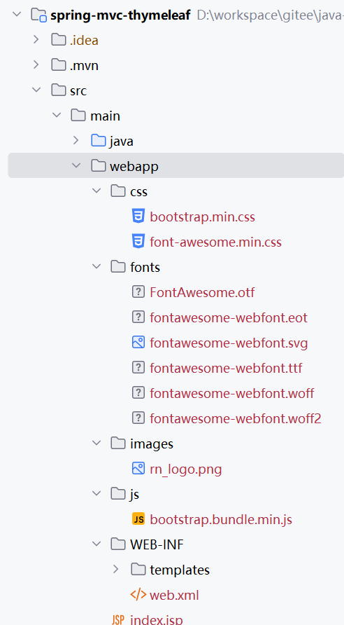
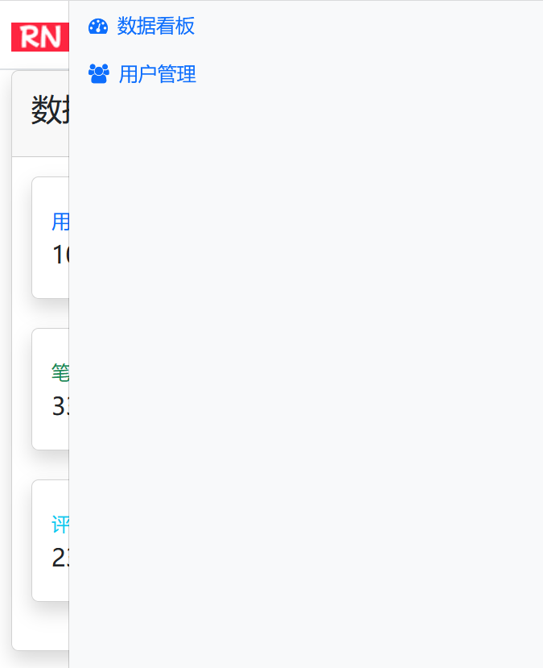
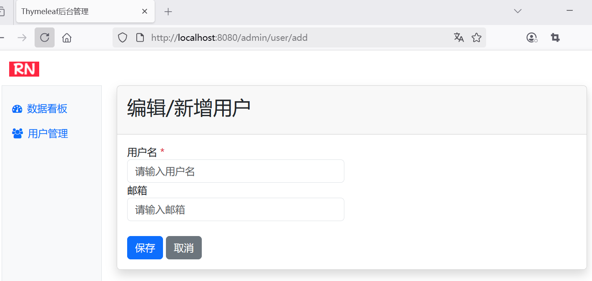

> 本页为原「Java 课程 4」全部 13 个分节的合订本；原分节链接会自动跳转到本页。


## 1.1 单体项目中全栈工程师如何快速构建视图？

* 构建全栈视图开发能力矩阵
* 实现前后端数据交互标准化-Thymeleaf模板引擎基础
* 复杂业务逻辑下的视图优化-Thymeleaf高级用法
* 全栈视图实战：Spring MVC整合Thymeleaf构建响应式视图


## 2.1 单体全栈开发必知的视图方案，带领实现前后端无缝协作

对于动态 HTML 内容的展示，模板引擎必不可少。Java 主要通过 Servlet 来支持动态内容的请求和响应。Spring MVC 支持 Thymeleaf 、FreeMarker 和 JSP 等多种技术。对于 Spring Boot 而言，它支持 FreeMarker、Groovy、Thymeleaf、Mustache 等引擎的自动配置功能。

实际上，Java 模板引擎品种繁多，各有各的优势和缺点。


### 关于性能

模板引擎的性能，是很多用户选择模板引擎的重要参考指标。Jeroen Reijn 对各个 Java 模板引擎做了性能分析，并将结果发表在了其个人网站上（<https://github.com/jreijn/spring-comparing-template-engines>）。让我们一起来看下性能指标的对比数据。

Jeroen Reijn 选取了以下模板作为测试的版本，这些模板引擎都是结合 Spring MVC 来工作：

* JSP + [JSTL](https://jstl.java.net/) - v1.2
* [Freemarker](http://www.freemarker.org/) - v2.3.28.RELEASE
* [Velocity](http://velocity.apache.org/) - v2.3
* [Velocity Tools](http://velocity.apache.org/tools/) - v3.1
* [Thymeleaf](http://www.thymeleaf.org/) - v3.0.11.RELEASE
* Mustache - Based on [JMustache](https://github.com/samskivert/jmustache) - v1.15
* [Scalate](http://scalate.fusesource.org/)  - v1.9.8
* [Jade4j](https://github.com/neuland/jade4j) - v1.3.1
* [HTTL](http://httl.github.io/en/) - v1.0.11
* [Pebble](https://pebbletemplates.io/) - v3.1.6
* [Handlebars](http://jknack.github.io/handlebars.java/) - v4.3.1
* [chunk](http://www.x5software.com/chunk/) - v3.6.2
* [HtmlFlow](https://github.com/xmlet/HtmlFlow/) - v4.0
* [Trimou](http://trimou.org/) - v2.5.1.Final
* [Rocker](https://github.com/fizzed/rocker/) - v1.3.0
* [Ickenham](https://github.com/enpassant/ickenham) - v1.5.0
* [Rythm](http://rythmengine.org/) - v1.4.1
* [Groovy Templates](https://groovy.apache.org/) - v2.5.6
* [Liqp - Jekyll](https://github.com/bkiers/Liqp) - v0.8.5.3
* [kolinx.html](https://github.com/Kotlin/kotlinx.html) - v1.8.22


在处理 25000 个并发级别为 25 的请求所需的总时间，测试结果如下所示（数值越小越好）：


```
Jade4j                  567.7   seconds
Handlebars              147.7   seconds
Scalate - Scaml          33.33  seconds
Pebble                   27.92  seconds
HTTL                     24.61  seconds
Thymeleaf                24.09  seconds
Velocity                 23.07  seconds
Freemarker               11.80  seconds
jTwig                    10.95  seconds
Mustache (JMustache)      8.836 seconds
JSP                       7.888 seconds
```

从测试结果中我们看到，JSP 的性能是最高的，而 jTwig 和 Thymeleaf 相对较差。


## 2.2 单体全栈工程师如何做Java模板引擎选型

### 为什么选择 Thymeleaf 而不是 JSP

既然，JSP 是公认的性能最好的模板引擎，为什么这些年来新的模板引擎层出不穷？为什么我们在实际项目中，反而更加推荐使用性能较差的 Thymeleaf？

其实，对于开发者而言，除了从性能来考量一门语言或者一个工具之外，我们还要考虑人的因素，即开发人员本身的开发效率。这就好比是用汇编语言和 Java 语言做比较，很显然，汇编语言在程序处理的性能上肯定会比 Java 高很多，但从开发人员的角度来看，显然 Java 语言更加符合面向对象的思维，更加容易被开发人员所掌握，并且能够最快的实现功能，推出产品。所以在衡量一款工具的优劣的时候，往往需要从整体来看。


我们来对比下 JSP 的代码以及 Thymeleaf 的代码。下面是 JSP 编写的页面代码：

```jsp
<%@ taglib prefix="sf" uri="http://www.springframework.org/tags/form" %>
<%@ taglib prefix="s" uri="http://www.springframework.org/tags" %>
<%@ taglib prefix="c" uri="http://java.sun.com/jsp/jstl/core" %>
<%@ page contentType="text/html; charset=UTF-8" pageEncoding="UTF-8"%>
<!DOCTYPE html>

<html>

  <head>
    <title>Spring MVC view layer: Thymeleaf vs. JSP</title>
    <meta http-equiv="Content-Type" content="text/html; charset=UTF-8" />
    <link rel="stylesheet" type="text/css" media="all" href="<s:url value='/css/thvsjsp.css' />"/>
  </head>

  <body>

    <h2>This is a JSP</h2>

    <s:url var="formUrl" value="/subscribejsp" />
    <sf:form modelAttribute="subscription" action="${formUrl}">

      <fieldset>

        <div>
          <label for="email"><s:message code="subscription.email" />: </label>
          <sf:input path="email" />
        </div>
        <div>
          <label><s:message code="subscription.type" />: </label>
          <ul>
            <c:forEach var="type" items="${allTypes}" varStatus="typeStatus">
              <li>
                <sf:radiobutton path="subscriptionType" value="${type}" />
                <label for="subscriptionType${typeStatus.count}">
                  <s:message code="subscriptionType.${type}" />
                </label>
              </li>
            </c:forEach>
          </ul>
        </div>

        <div class="submit">
          <button type="submit" name="save"><s:message code="subscription.submit" /></button>
        </div>

      </fieldset>

    </sf:form>

  </body>

</html>
```

实现相同的功能，我们采用 Thymeleaf 来实现，是下面这个样子：

```html
<!DOCTYPE html>

<html xmlns:th="http://www.thymeleaf.org">

  <head>
    <title>Spring MVC view layer: Thymeleaf vs. JSP</title>
    <meta http-equiv="Content-Type" content="text/html; charset=UTF-8" />
    <link rel="stylesheet" type="text/css" media="all"
      href="../../css/thvsjsp.css" th:href="@{/css/thvsjsp.css}"/>
  </head>

  <body>

    <h2>This is a Thymeleaf template</h2>

    <form action="#" th:object="${subscription}" th:action="@{/subscribeth}">

      <fieldset>

        <div>
          <label for="email" th:text="#{subscription.email}">Email: </label>
          <input type="text" th:field="*{email}" />
        </div>
        <div>
          <label th:text="#{subscription.type}">Type: </label>
          <ul>
            <li th:each="type : ${allTypes}">
              <input type="radio" th:field="*{subscriptionType}" th:value="${type}" />
              <label th:for="${#ids.prev('subscriptionType')}"
                th:text="#{|subscriptionType.${type}|}">First type</label>
            </li>
            <li th:remove="all"><input type="radio" /> <label>Second Type</label></li>
          </ul>
        </div>

        <div class="submit">
          <button type="submit" name="save" th:text="#{subscription.submit}">Subscribe me!</button>
        </div>

      </fieldset>

    </form>

  </body>

</html>
```

对比 JSP 的代码以及 Thymeleaf 的代码可以看出：

* Thymeleaf 比 JSP 的代码更加接近 HTML，没有奇怪的标签，只是增加了一些有意义的属性。
* Thymeleaf 支持 HTML5 标准；JSP 如果要支持 HTML5 标准，需要新版的 Spring 框架来支持。
* JSP 需要部署到 Servlet 开发服务器上，并启动服务器。如果服务器不启动，JSP 页面不会渲染；而 Thymeleaf 即使不部署，也能直接在浏览器中打开它。


虽然，Thymeleaf 的性能不是最好的，但由于 Thymeleaf “原型即页面”的特点，非常适用于快速开发，符合 Spring Boot 开箱即用的原则。所谓“原型即页面”是指，Thymeleaf 页面，可以无需部署到 Servlet 开发服务器上，直接通过浏览器就能打开它。这种特点非常适合用于系统的界面原型设计。前端开发人员或者美工将原型设计好之后，提交给 Java 开发人员，只需要在原型的基础上，增加少量的 Thymeleaf 表达式语句，就能转化为系统的页面了。

界面的设计与实现相分离，这就是 Thymeleaf 广为流行的原因了。

### 什么是 Thymeleaf

Thymeleaf 是面向 Web 和独立环境的现代服务器端 Java 模板引擎，能够处理 HTML、XML、JavaScript、CSS 甚至纯文本。类似的产品还有JSP 、Freemarker等。


Thymeleaf 的主要目标是提供一个优雅和高度可维护的创建模板的方式。为了实现这一点，它建立在自然模板（Natural Templates）的概念上，将其逻辑注入到模板文件中，不会影响模板被用作设计原型。这改善了设计的沟通，弥合了设计和开发团队之间的差距。

Thymeleaf 的设计从一开始就遵从 Web 标准，特别是 HTML5，这样就能创建完全符合验证的模板。

Thymeleaf 的语法优雅易懂。Thymeleaf 使用 OGNL（Object-Graph Navigation Language），它是一种功能强大的表达式语言，通过它简单一致的表达式语法，可以存取对象的任意属性，调用对象的方法，遍历整个对象的结构图，实现字段类型转化等功能。它使用相同的表达式去存取对象的属性。这样可以更好的取得数据。在与 Spring 应用集成过程中使用 SpringEL，而 OGNL 与 SpringEL 在语法上都极其类似。

Thymeleaf 3 使用一个名为 AttoParser 2 （<http://www.attoparser.org>）的新解析器。AttoParser 是一个新的、基于事件（不符合SAX标准）的解析器，由 Thymeleaf 的作者开发，符合 Thymeleaf 的风格。

### Thymeleaf 处理模版

Thymeleaf 能处理以下 6 种类型的模版，我们称之为模版模式（Template Mode）:

 * HTML
 * XML
 * TEXT
 * JAVASCRIPT
 * CSS
 * RAW
 
其中包含有两种标记模板模式（HTML 和 XML），三种文本模板模式（TEXT、JAVASCRIPT 和C SS）和一个无操作模板模式（RAW）。
 
HTML 模板模式将允许任何类型的 HTML 输入，包括 HTML5、HTML4 和 XHTML。将不执行验证或对格式进行严格检查，这样就能尽可能的将模板代码/结构进行输出。

XML 模板模式将允许 XML 输入。在这种情况下，代码预期格式是良好的，不存在未关闭的标签和没有引用的属性等。如果找到未符合 XML 格式要求，解析器将抛出异常。请注意，该模式不会针对 DTD 或 XML 架构去执行验证。

TEXT 模板模式将允许对非标记性质的模板使用特殊语法。此类模板的示例可能是文本电子邮件或模板文档。请注意，HTML 或 XML 模板也可以作为 TEXT 处理，在这种情况下，它们将不会被解析为标记，并且每个标签 DOCTYPE、注释等将被视为纯文本。

JAVASCRIPT 模板模式将允许在 Thymeleaf 应用程序中处理 JavaScript 文件。这意味着能够使用 JavaScript 文件中的模型数据与 HTML 文件中可以完成的方式相同，但可以使用特定于 JavaScript 的集成，例如专门的转义或自然脚本（natural scripting）。 JAVASCRIPT 模板模式被认为是文本模式，因此使用与 TEXT 模板模式相同的特殊语法。

CSS 模板模式将允许处理涉及 Thymeleaf 应用程序的 CSS 文件。与 JAVASCRIPT 模式类似，CSS 模板模式也是文本模式，并使用 TEXT 模板模式下的特殊处理语法。

RAW 模板模式根本不会处理模板。它用于将未经修改的资源（文件、URL 响应等）插入正在处理的模板中。例如，HTML 格式的外部不受控制的资源可以包含在应用程序模板中，这些资源可能包含的任何 Thymeleaf 代码将不会被执行。

### 标准方言

Thymeleaf 是一个非常可扩展的模板引擎，实际上它更像是一个模板引擎框架（template engine framework），允许您定义和自定义您的模板。

将一些逻辑应用于标记工件（例如标签、某些文本、注释或只有占位符）的一个对象被称为处理器（processor）。方言（dialect）通常包括这些处理器的集合以及一些额外的工件。Thymeleaf 的核心库提供了一种称为标准方言（Standard Dialect）的方言，提供给用户开箱即用的功能。

当然，如果用户希望在利用库的高级功能的同时定义自己的处理逻辑，用户也可以创建自己的方言（甚至扩展标准的方言），也可以将 Thymeleaf 配置为同时使用几种方言。

> 官方的 thymeleaf-spring3 和 thymeleaf-spring4 集成包都定义了一种称为“SpringStandard Dialect”的方言，与标准方言大致相同，但是对于 Spring 框架中的某些功能则更加友好，例如， 想通过使用 Spring Expression Language 或 SpringEL 而不是 OGNL。所以如果你是一个 Spring MVC 用户，这里的所有东西都能够在你的 Spring 应用程序中使用。

标准方言的大多数处理器是属性处理器。这样，即使在处理之前，浏览器也可以正确地显示 HTML 模板文件，因为它们将简单地忽略其他属性。对比 JSP，在浏览器中会直接显示的代码片断：

```html
<form:inputText name="userName" value="${user.name}" />
```

Thymeleaf 标准方言将允许我们实现与以下功能相同的功能：:

```html
<input type="text" name="userName" value="James Carrot" th:value="${user.name}" />
```
 
浏览器会忽略 `th:value`，直接显示 `value` 里写死的静态值（这里是“James Carrot”），所以原型文件双击就能打开看效果；真正由模板渲染时，`${user.name}` 的求值结果会把这个静态值替换掉。

这有助于您的设计师和开发人员处理相同的模板文件，并减少将静态原型转换为工作模板文件所需的工作量。这样的功能是称为“自然模板(Natural Templating)”的功能。

有关 Thymeleaf 标准方言的内容，会在下一章节详细讲述。


## 3.1 全面掌握Thymeleaf标准方言精要：破除前后端协作的80%沟通障碍

Thymeleaf 的可扩展性很强，它允许你自定义你自己的模板属性集（或事件标签）、表达式、语法及应用逻辑。它更像一个模板引擎框架（template engine framework），你可以方便的基于该引擎，来自定义自己的模板。

当然，Thymeleaf 的优秀之处并不仅限于此。秉着“开箱即用”的原则，Thymeleaf 提供了满足大多数使用情况的默认实现——标准方言（standard dialects），涵盖了命名为 Standard 和  SpringStandard 两种方言。在模板中，你可以很容易的识别出这些被使用的标准方言，因为他们都以`th`属性开头，如

```xml
<span th:text="...">  
```

Standard 和 SpringStandard 方言在用法上几乎相同，不同之处在于 SpringStandard 包括了 Spring MVC 集成的具体特征（比如用 Spring Expression Language 来替代 OGNL）。

通常，我们在谈论 Thymeleaf 的标准方言时，一般引用的是 Standard， 而不涉及特例。

本章节的内容，大多引用自开源书《Thymeleaf 教程》，有兴趣的读者朋友可以自行参阅。

### Thymeleaf 标准表达式语法

大多数 Thymeleaf 属性允许设值或者包含表达式（expressions），因为它们使用的方言的关系，我们称之为标准表达式（Standard Expressions）。这些标准表达式语法主要包括：

* 简单表达式：
	* Variable expressions（变量表达式）`${...}` 
	* Selection expressions（选择表达式）`*{...}`
	* Message (i18n) expressions（消息表达式） `#{...}` 
	* Link (URL) expressions（链接表达式）`@{...}`
	* Fragment expressions（分段表达式）`~{...}`
* 字面量:
	* 文本：`'one text'`、`'Another one!'`等；
	* 数值：0、34、3.0、12.3等；
	* 布尔：true、false
	* Null：null
	* Literal token（字面标记）: one、sometext、 main等；
* 文本操作:
	* 字符串拼接：`+`
	* 文本替换：`|The name is ${name}|`
* 算术操作:
	* 二元运算符：`+`、`-`、 `*`、`/`、`%`
	* 减号（单目运算符）：`-`
* 布尔操作：
	* 二元运算符：`and`、`or`
	* 布尔否定（一元运算符）：`!`、`not`
* 比较和等价：
	* 比较：`>`、`<`、`>=`、`<=`（`gt`、`lt`、`ge`、`le`）
	* 等价:`==`、`!=`（`eq`、`ne`）
* 条件运算符：
	* If-then：`(if) ? (then)`
	* If-then-else：`(if) ? (then) : (else)`
	* Default：`(value) ?: (defaultvalue)`
* 特殊标记：
	* No-Operation（无操作）：`_`
	
	
下面的这个示例，涵盖了上述大部分表达式：

```
'User is of type ' + (${user.isAdmin()} ? 'Administrator' : (${user.type} ?: 'Unknown'))
```
	
### 消息表达式（Message (i18n) expressions）

消息表达式（通常称为文本外化、国际化或i18n）允许我们从外部源（`.properties`文件）检索特定于语言环境的消息，通过 key 引用它们（可选）应用一组参数。

在 Spring 应用程序中，这将自动与 Spring 的 MessageSource 机制集成。

```
#{main.title}

#{message.entrycreated(${entryId})}
```

在模版中的应用如下：

```html
<table>
  ...
  <th th:text="#{header.address.city}">...</th>
  <th th:text="#{header.address.country}">...</th>
  ...
</table>
```

请注意，如果希望消息 key 由上下文变量的值确定，或者要将变量指定为参数，则可以在消息表达式中使用变量表达式：

```
#{${config.adminWelcomeKey}(${session.user.name})}
```

### 变量表达式（Variable expressions）

变量表达式可以是 OGNL 表达式或者是 Spring EL，如果集成了 Spring 的话，可以在上下文变量（context variables ）中执行。


> 有关OGNL语法和功能的详细信息，请阅读《OGNL语言指南》（<http://commons.apache.org/proper/commons-ognl/>）。
> 在 Spring MVC 启用的应用程序中，OGNL 将被替换为 SpringEL，但其语法与 OGNL 非常相似（实际上，在大多数常见情况下完全相同）。

在 Spring 术语中，变量表达式也称为模型属性（model attributes）。 他们看起来像这样：

```
${session.user.name}
```

他们作为属性值或作为属性的一部分：

```html
<span th:text="${book.author.name}">
```

上面的表达式在在 OGNL 和 SpringEL 中等价于：

```
((Book)context.getVariable("book")).getAuthor().getName()
```

这些变量表达式不仅涉及输出，还包括更复杂的处理，如条件判断、迭代等：


```html
<li th:each="book : ${books}">
```

这里`${books}`从上下文中选择名为`books`的变量，并将其评估为可在`th:each`循环中使用的迭代器（iterable）。

更多 OGNL 的功能有：

```java
/*
 * 使用点(.)来访问属性，等价于调用属性的  getter 
 */
${person.father.name}

/*
 * 访问属性也可以使用([])块
 */
${person['father']['name']}

/*
 * 如果对象是一个map，则点和块语法等价于调用其get(...)方法
 */
${countriesByCode.ES}
${personsByName['Stephen Zucchini'].age}

/*
 * 在块语法中，也可以通过索引来访问数组或者集合
 */
${personsArray[0].name}

/*
 * 可以调用方法，同时也支持参数
 */
${person.createCompleteName()}
${person.createCompleteNameWithSeparator('-')}
```

### 表达式基本对象（Expression Basic Objects）

当对上下文变量评估 OGNL 表达式时，某些对象可用于表达式以获得更高的灵活性。 这些对象将被引用（按照 OGNL 标准），从`＃`符号开始：

* `#ctx`：上下文对象。
* `#vars`：上下文变量。
* `#locale`：上下文区域设置。
* `#request`:HttpServletRequest 对象(仅在 Web 上下文中）。
* `#response`：HttpServletResponse 对象(仅在 Web 上下文中）。
* `#session`:HttpSession对象(仅在 Web 上下文中）。
* `#servletContext`:ServletContext对象(仅在 Web 上下文中）。

所以我们可以这样做：

```html
Established locale country: <span th:text="${#locale.country}">US</span>.
```

有关“表达式基本对象”的完整内容可以参考后续“4.6 Thymeleaf 表达式基本对象”章节的内容。


### 表达式工具对象（Expression Utility Objects）

除了上面这些基本的对象之外，Thymeleaf 将为我们提供一组工具对象，这些对象将帮助我们在表达式中执行常见任务：

 * `#execInfo`: 模版执行的信息
 * `#messages`: 在变量内获取外部消息的方法 表达式，与使用`＃{...}`语法获得的方式相同。.
 * `#uris`: 用于转义 URL/URI 部分的方法
 * `#conversions`: 执行已配置的 *conversion service*
 * `#dates`: `java.util.Date`对象的方法，比如格式化，组件提取等
 * `#calendars`:类似于`＃dates`，但是对应于`java.util.Calendar`对象
 * `#numbers`: 格式化数字对象的方法。
 * `#strings`: `String`对象的方法，包括 contains、startsWith、prepending/appending等
    等等
 * `#objects`: 对象通常的方法
 * `#bools`: 布尔判断的方法
 * `#arrays`: array 方法
 * `#lists`: list 方法
 * `#sets`: set 方法
 * `#maps`: map 方法
 * `#aggregates`:在数组或集合上创建聚合的方法
 * `#ids`: 用于处理可能重复的id属性的方法（例如，作为迭代的结果）。

下面是一个格式化日期的例子：

```html
<p>
  Today is: <span th:text="${#calendars.format(today,'dd MMMM yyyy')}">13 May 2011</span>
</p>
```

有关表达式工具对象的完整内容可以参考本书后面的“附录C：Thymeleaf 表达式工具对象”章节部分。


### 选择表达式（Selection expressions）

选择表达式与变量表达式很像，区别在于它们是在当前选择的对象而不是整个上下文变量映射上执行。他们看起来像这样：


```
*{customer.name}
```

它们所作用的对象由`th:object`属性指定：

```html
<div th:object="${book}">
  ...
  <span th:text="*{title}">...</span>
  ...
</div>
```

这等价于：

```
{
  // th:object="${book}"
  final Book selection = (Book) context.getVariable("book");
  // th:text="*{title}"
  output(selection.getTitle());
}
```

### 链接表达式（Link (URL) expressions）


链接表达式旨在构建URL并向其添加有用的上下文和会话信息（通常称为URL重写的过程）。

因此，对于部署在Web服务器的`/myapp`上下文中的 Web 应用程序，可以使用以下表达式：

```html
<a th:href="@{/order/list}">...</a>
```

可以转成：

```html
<a href="/myapp/order/list">...</a>
```

cookie 没有启用下，如果我们需要保持会话，可以这样：

```html
<a href="/myapp/order/list;jsessionid=23fa31abd41ea093">...</a>
```

URL 是可以携带参数的：

```html
<a th:href="@{/order/details(id=${orderId},type=${orderType})}">...</a>
```

最终的结果如下：

```html
<a href="/myapp/order/details?id=23&amp;type=online">...</a>
```


链接表达式可以是相对的，在这种情况下，应用程序上下文将不会作为 URL 的前缀：

```html
<a th:href="@{../documents/report}">...</a>
```

也可以是服务器相对（同样，没有应用程序上下文前缀）：

```html
<a th:href="@{~/contents/main}">...</a>
```

可以是和协议相对（就像绝对 URL，但浏览器将使用在显示的页面中使用的相同的 HTTP 或 HTTPS 协议）：

```html
<a th:href="@{//static.mycompany.com/res/initial}">...</a>
```

当然，Link 表达式可以是绝对的：

```html
<a th:href="@{http://www.mycompany.com/main}">...</a>
```


*在绝对（或协议相对）的URL等里面，Thymeleaf 链接表达式添加的是什么值？*

*答案是，可能是由响应过滤器定义的 URL 重写。在基于 Servlet 的 Web 应用程序中，对于每个输出的 URL（上下文相对、相对、绝对...）Thymeleaf 将总是在显示URL 之前调用`HttpServletResponse.encodeUrl(...)`机制。 这意味着过滤器可以通过包装 HttpServletResponse 对象（通常使用的机制）来为应用程序执行定制的 URL 重写。*


### 分段表达式（Fragment expressions）

分段表达式是 Thymeleaf 3.x 版本新增的内容。

分段段表达式是一种表示标记片段并将其移动到模板周围的简单方法。 正是由于这些表达式，片段可以被复制，或者作为参数传递给其他模板等等。

最常见的用法是使用`th:insert`或`th:replace:`插入片段：

```html
<div th:insert="~{commons :: main}">...</div>
```

但是它们可以在任何地方使用，就像任何其他变量一样：

```html
<div th:with="frag=~{footer :: #main/text()}">
  <p th:insert="${frag}">
</div>
```

分段表达式是可以有参数的。


### 字面量（Literals）
 
Thymeleaf 有一组可用的字面量和操作。 

#### 本文

文本文字只是在单引号之间指定的字符串。 他们可以包含任何字符，但您应该避免其中的任何单引号使用`\'`。
 

```html
<p>
  Now you are looking at a <span th:text="'working web application'">template file</span>.
</p>
```

#### 数字

数字文字就是数字。

```html
<p>The year is <span th:text="2013">1492</span>.</p>
<p>In two years, it will be <span th:text="2013 + 2">1494</span>.</p>
```


#### 布尔

布尔文字为“true”和“false”。 例如：:

```html
<div th:if="${user.isAdmin()} == false"> ...
```

在这个例子中，`== false`写在大括号之外，Thymeleaf 会做处理。如果是写在大括号内，那就是由 OGNL/SpringEL 引擎负责处理：


```html
<div th:if="${user.isAdmin() == false}"> ...
```


#### null

`null` 字面量使用如下：

```html
<div th:if="${variable.something} == null"> ...
```


#### 字面量标记

数字、布尔和 null 字面实际上是“字面量标记(literal tokens)”的特殊情况。

这些标记允许在标准表达式中进行一点简化。他们工作与文本文字（`'...'`）完全相同，但只允许使用字母（`A-Z`）和（`a-z`）、数字（0-9），括号（`[`和`]`），点（`.`），连字符（`-`）和下划线（`_`），所以是没有空白，没有逗号等情况。

标记不需任何引号。所以我们可以这样做：


```html
<div th:class="content">...</div>
```

用来代替:

```html
<div th:class="'content'">...</div>
```

#### 附加文本

无论是文字，还是评估变量或消息表达式的结果，都可以使用　`+` 操作符轻松地附加文本：
　

```html
<span th:text="'The name of the user is ' + ${user.name}">
```

#### 字面量替换

字面量替换允许容易地格式化包含变量值的字符串，而不需要使用 `'...' + '...'`附加文字。

这些替换必须被(`|`)包围，如：


```html
<span th:text="|Welcome to our application, ${user.name}!|">
```

其等价于：

```html
<span th:text="'Welcome to our application, ' + ${user.name} + '!'">
```

字面量替换可以与其他类型的表达式相结合：


```html
<span th:text="${onevar} + ' ' + |${twovar}, ${threevar}|">
```

>　 `|...|` 字面量替换只允许使用变量/消息表达式(`${...}`, `*{...}`, `#{...}`)，
> 其他字面量  (`'...'`)、布尔/数字标记、条件表达式等是不允许的。

### 算术运算

支持算术运算：`+`, `-`, `*`, `/` 和 `%`。


```html
<div th:with="isEven=(${prodStat.count} % 2 == 0)">
```

请注意，这些运算符也可以在 OGNL 变量表达式本身中应用（在这种情况下将由 OGNL 执行，而不是 Thymeleaf 标准表达式引擎）：


```html
<div th:with="isEven=${prodStat.count % 2 == 0}">
```

请注意，其中一些运算符存在文本别名：`div` (`/`)、 `mod` (`%`)。

### 比较与相等

表达式中的值可以与`>`, `<`, `>=` 和 `<=` 号进行比较，并且可以使用`==` 和 `!=` 运算符来检查是否相等。 请注意， `<` 和 `>`符号不应该在XML属性值中使用，因此它们应被替换为`&lt;` 和`&gt;`。

```html
<div th:if="${prodStat.count} &gt; 1">
<span th:text="'Execution mode is ' + ( (${execMode} == 'dev')? 'Development' : 'Production')">
```


一个更简单的替代方案可能是使用一些这些运算符存在的文本别名：`gt` (`>`), `lt` (`<`), `ge` (`>=`), `le` (`<=`), `not` (`!`). `eq` (`==`), `neq`/`ne` (`!=`)


### 条件表达式

条件表达式仅用于评估两个表达式中的一个，这取决于评估条件（本身就是另一个表达式）的结果。

我们来看一个示例 `th:class` 片段 ：

```html
<tr th:class="${row.even}? 'even' : 'odd'">
  ...
</tr>
```

条件表达式（condition、then 和 else）的所有三个部分都是自己的表达式，这意味着它们可以是变量(`${...}`, `*{...}`)，消息 (`#{...}`) ，(`@{...}`) 或字面量(`'...'`)。

条件表达式也可以使用括号嵌套：


```html
<tr th:class="${row.even}? (${row.first}? 'first' : 'even') : 'odd'">
  ...
</tr>
```

else 表达式也可以省略，在这种情况下，如果条件为 false，则返回 null 值：

```html
<tr th:class="${row.even}? 'alt'">
  ...
</tr>
```

### 默认表达式（Elvis operator）
 

默认表达式(default expression)是一种特殊的条件值，没有 then 部分。它相当于某些语言中的“Elvis operator”，比如 Groovy。指定两个表达式，如果第一个不是 null，则使用第二个。

查看如下示例：

```html
<div th:object="${session.user}">
  ...
  <p>Age: <span th:text="*{age}?: '(no age specified)'">27</span>.</p>
</div>
```


这相当于：

```html
<p>Age: <span th:text="*{age != null}? *{age} : '(no age specified)'">27</span>.</p>
```


与条件表达式一样，它们之间可以包含嵌套表达式：


```html
<p>
  Name: 
  <span th:text="*{firstName}?: (*{admin}? 'Admin' : #{default.username})">Sebastian</span>
</p>
```


### 无操作标记

无操作标记由下划线符号（`_`）表示。表示什么也不做，这允许开发人员使用原型中的文本默认值。 例如，：

```html
<span th:text="${user.name} ?: 'no user authenticated'">...</span>
```

我们可以直接使用“no user authenticated”作为原型文本，这样代码从设计的角度来看起来很简洁：

```html
<span th:text="${user.name} ?: _">no user authenticated</span>
```

### 数据转换及格式化

Thymeleaf 的双大括号为变量表达式（`$ {...}`）和选择表达式（`* {...}`）提供了数据*转换服务*： 

它看上去是这样的：

```html
<td th:text="${{user.lastAccessDate}}">...</td>
```

注意到 `$ {{...}}` 里面的双括号吗，这意味着 Thymeleaf 可以通过转换服务将结果转换为`String`。

假设`user.lastAccessDate`类型为`java.util.Calendar`，如果转换服务（IStandardConversionService 接口的实现）已经被注册并且包含有效的`Calendar - > String`的转换，则它将被应用。

IStandardConversionService，其默认实现类为 StandardConversionService，只需在转换为“String”的任何对象上执行`.toString()`。 

### 表达式预处理

表达式预处理（expression preprocessing），它被定义在下划线`_`之间：

```
#{selection.__${sel.code}__}
```

我们看到的变量表达式`${sel.code}`将先被执行，假如结果是`"ALL"`，那么_之间的值`"ALL"`将被看做表达式的一部分被执行，在这里会变成`selection.ALL`。


## 3.2 快速掌握属性绑定黑科技：多种场景破解模板硬编码困局

### 设置任意属性值

`th:attr` 用于设置任意属性：
 
```html
<form action="subscribe.html" th:attr="action=@{/subscribe}">
  <fieldset>
    <input type="text" name="email" />
    <input type="submit" value="Subscribe!" th:attr="value=#{subscribe.submit}"/>
  </fieldset>
</form>
```

`th:attr`会将表达式的结果，设置到相应的属性中去。上面模板结果如下：

```html
<form action="/gtvg/subscribe">
  <fieldset>
    <input type="text" name="email" />
    <input type="submit" value="¡Suscríbe!"/>
  </fieldset>
</form>
```

我们也能同时设置多个属性值：

```html

```

输出如下:

```html

```

### 设置值到指定的属性

使用 `th:attr` 来设置属性的好处是，我们可以设置任意命名的属性，这样方便自定义自己的属性。但是，缺点也很明显，如果使用任何属性，都是采用自定义的方式，那么，属性的维护有时就会变得很困难。考虑下面的示例：

```html
<input type="submit" value="Subscribe!" th:attr="value=#{subscribe.submit}"/>
```

上面可以指定了一个自定义属性`value`的值，这在语法上完全没有问题，但这并不是最佳的方式。因为，Thymeleaf 已经提供了属性名为`value`的属性。通常，你将使用其他的`th：*`属性设置 Thymeleaf 特定的标签属性（而不仅仅是像`th:attr`”`这样的任意属性）。

例如，要设置`value`属性，我们可以使用`th:value`：

```html
<input type="submit" value="Subscribe!" th:value="#{subscribe.submit}"/>
```

要设置 `action` 属性，使用`th:action`：
 

```html
<form action="subscribe.html" th:action="@{/subscribe}">
```

Thymeleaf 提供了很多属性，每个都针对特定的 HTML5 属性，比如`th:abbr`、`th:action`、`th:background`、`th:form`、`th:height`、`th:style`等等。


### 同时设置多个值


`th:alt-title` 和 `th:lang-xmllang` 是两个特殊的属性，可以同时设置同一个值到两个属性：

 * `th:alt-title` 用于设置 `alt` 和 `title`
 * `th:lang-xmllang` 用于设置 `lang` 和 `xml:lang`

观察下面的示例：

```html

```

这个例子等价于:

```html

```

两者最终的结果都是：

```html

```


### 附加和添加前缀


`th:attrappend` 和 `th:attrprepend` 用于附加和添加前缀属性。例如：


```html
<input type="button" value="Do it!" class="btn" th:attrappend="class=${' ' + cssStyle}" />
```

执行模版， `cssStyle` 变量设置为 `"warning"`时，输出如下：

```html
<input type="button" value="Do it!" class="btn warning" />
```

同时，有 `th:classappend` 和 `th:styleappend` 用于设置 CSS 的 class 和 style。例如：

```html
<tr th:each="prod : ${prods}" class="row" th:classappend="${prodStat.odd}? 'odd'">
```


### 固定值布尔属性

HTML具有布尔属性的概念，没有值的属性意味着该值为“true”。 在XHTML中，这些属性只取一个值，即它本身。

例如，属性`checked`的用法:

```html
<input type="checkbox" name="option2" checked /> <!-- HTML -->
<input type="checkbox" name="option1" checked="checked" /> <!-- XHTML -->
```


标准方言包括允许您通过评估条件来设置这些属性，如果评估为true，则该属性将被设置为其固定值，如果评估为false，则不会设置该属性：

```html
<input type="checkbox" name="active" th:checked="${user.active}" />
```

标准方言中存在以下固定值布尔属性：


<div class="table-scroller">
<table>
<tbody>
<tr class="odd">
<td style="text-align: left;"><code>th:async</code></td>
<td style="text-align: left;"><code>th:autofocus</code></td>
<td style="text-align: left;"><code>th:autoplay</code></td>
</tr>
<tr class="even">
<td style="text-align: left;"><code>th:checked</code></td>
<td style="text-align: left;"><code>th:controls</code></td>
<td style="text-align: left;"><code>th:declare</code></td>
</tr>
<tr class="odd">
<td style="text-align: left;"><code>th:default</code></td>
<td style="text-align: left;"><code>th:defer</code></td>
<td style="text-align: left;"><code>th:disabled</code></td>
</tr>
<tr class="even">
<td style="text-align: left;"><code>th:formnovalidate</code></td>
<td style="text-align: left;"><code>th:hidden</code></td>
<td style="text-align: left;"><code>th:ismap</code></td>
</tr>
<tr class="odd">
<td style="text-align: left;"><code>th:loop</code></td>
<td style="text-align: left;"><code>th:multiple</code></td>
<td style="text-align: left;"><code>th:novalidate</code></td>
</tr>
<tr class="even">
<td style="text-align: left;"><code>th:nowrap</code></td>
<td style="text-align: left;"><code>th:open</code></td>
<td style="text-align: left;"><code>th:pubdate</code></td>
</tr>
<tr class="odd">
<td style="text-align: left;"><code>th:readonly</code></td>
<td style="text-align: left;"><code>th:required</code></td>
<td style="text-align: left;"><code>th:reversed</code></td>
</tr>
<tr class="even">
<td style="text-align: left;"><code>th:scoped</code></td>
<td style="text-align: left;"><code>th:seamless</code></td>
<td style="text-align: left;"><code>th:selected</code></td>
</tr>
</tbody>
</table>
</div>

### 默认属性处理器

Thymeleaf 提供“默认属性处理器（default attribute processor）”，当标准方言没有提供的属性时，也可以设置其属性。比如：

```html
<span th:whatever="${user.name}">...</span>
```

`th:whatever` 并不是标准方言中提供的属性，但仍然可以正确对属性进行赋值。最终输出如下:

```html
<span whatever="John Apricot">...</span>
```

默认属性处理器与`th:attr`设置任意属性，有着异曲同工之妙。

### 支持对 HTML5 友好的属性及元素名称

`data-{prefix}-{name}` 语法是 HTML5 中编写自定义属性的标准方式，不需要开发人员使用任何命名空间的名字（如`th：*`）。
Thymeleaf 支持种语法自动提供给所有的方言（而不只是标准方言）。

考虑下面的例子：

```html	
<table>
    <tr data-th-each="user : ${users}">
        <td data-th-text="${user.login}">...</td>
        <td data-th-text="${user.name}">...</td>
    </tr>
</table>
```

其实完全等价于：

```html	
<table>
    <tr th:each="user : ${users}">
        <td th:each="${user.login}">...</td>
        <td th:each="${user.name}">...</td>
    </tr>
</table>
```

如果你是一个对 HTML5 语法有“强迫症”的开发人员，那么你可以放心的使用`data-{prefix}-{name}` 语法来使用 Thymeleaf 元素。


## 3.3 快速掌握Thymeleaf迭代与条件：复杂业务场景下的视图逻辑优化

本章节将介绍 Thymeleaf 迭代器与条件语句。这两者在实际开发中经常被使用。

### 迭代器

迭代器是程序中常见的设计模式，是可在容器上遍访元素的接口。

#### 基本的迭代


Thymeleaf 的`th:each`将循环 array 或 list 中的元素并重复打印一组标签，语法相当于 Java foreach 表达式：

```
<li th:each="book : ${books}" th:text="${book.title}">En las Orillas del Sar</li>
```

可以使用`th：each`属性进行遍历的对象包括：

* 任何实现`java.util.Iterable`的对象；
* 任何实现`java.util.Enumeration`的对象；
* 任何实现`java.util.Iterator`的对象，其值将被迭代器返回，而不需要在内存中缓存所有的值；
* 任何实现`java.util.Map`的对象。 迭代映射时，迭代变量 将是`java.util.Map.Entry`类；
* 任何数组；
* 任何其他对象将被视为包含对象本身的单值列表。

#### 状态变量

Thymeleaf 提供“状态变量（status variable）”来跟踪迭代器的状态。

`th:each`属性中，定义了如下状态变量：

 * `index` 属性是当前“迭代器索引（iteration index）”，从0开始；
 * `count` 属性是当前“迭代器索引（iteration index）”，从1开始；
 * `size` 属性是迭代器元素的总数；
 * `current` 是当前“迭代变量（iter variable）”；
 * `even/odd` 判断当前迭代器是否是 even 或 odd；
 * `first` 判断当前迭代器是否是第一个；
 * `last` 判断当前迭代器是否是最后。
 

看下面的例子：

```html
<table>
  <tr>
    <th>NAME</th>
    <th>PRICE</th>
    <th>IN STOCK</th>
  </tr>
  <tr th:each="prod,iterStat : ${prods}" th:class="${iterStat.odd}? 'odd'">
    <td th:text="${prod.name}">Onions</td>
    <td th:text="${prod.price}">2.41</td>
    <td th:text="${prod.inStock}? #{true} : #{false}">yes</td>
  </tr>
</table>
```

状态变量（在本示例中为“iterStat”）在`th：each`中定义了。 

我们来看看模板的处理后的结果：

```html
<!DOCTYPE html>

<html>

  <head>
    <title>Good Thymes Virtual Grocery</title>
    <meta content="text/html; charset=UTF-8" http-equiv="Content-Type"/>
    <link rel="stylesheet" type="text/css" media="all" href="/gtvg/css/gtvg.css" />
  </head>

  <body>

    <h1>Product list</h1>
  
    <table>
      <tr>
        <th>NAME</th>
        <th>PRICE</th>
        <th>IN STOCK</th>
      </tr>
      <tr class="odd">
        <td>Fresh Sweet Basil</td>
        <td>4.99</td>
        <td>yes</td>
      </tr>
      <tr>
        <td>Italian Tomato</td>
        <td>1.25</td>
        <td>no</td>
      </tr>
      <tr class="odd">
        <td>Yellow Bell Pepper</td>
        <td>2.50</td>
        <td>yes</td>
      </tr>
      <tr>
        <td>Old Cheddar</td>
        <td>18.75</td>
        <td>yes</td>
      </tr>
    </table>
  
    <p>
      <a href="/gtvg/" shape="rect">Return to home</a>
    </p>

  </body>
  
</html>
```

请注意，我们的迭代状态变量已经运行良好，建立只有奇数行具有 “odd” CSS 类。

如果您没有明确设置状态变量，则 Thymeleaf 将始终创建一个状态变量，可以通过后缀“Stat”获取到迭代变量的名称：

```html
<table>
  <tr>
    <th>NAME</th>
    <th>PRICE</th>
    <th>IN STOCK</th>
  </tr>
  <tr th:each="prod : ${prods}" th:class="${prodStat.odd}? 'odd'">
    <td th:text="${prod.name}">Onions</td>
    <td th:text="${prod.price}">2.41</td>
    <td th:text="${prod.inStock}? #{true} : #{false}">yes</td>
  </tr>
</table>
```

### 条件语句

条件语句是用来判断给定的条件是否满足，并根据判断的结果决定执行的语句。

#### if 和 unless

`th:if`属性用法如下：

```html
<a href="comments.html"
   th:href="@{/product/comments(prodId=${prod.id})}" 
   th:if="${not #lists.isEmpty(prod.comments)}">view</a>
```


请注意，`th:if` 属性不仅是将评估布尔条件。它的功能有点超出这一点，它将按照这些规则评估指定的表达式：

* 如果值不为 null：
	* 如果值为布尔值，则为true
	* 如果值是数字，并且不为零
	* 如果值是一个字符且不为零
	* 如果值是字符串，而不是“false”，“off”或“no”
	* 如果值不是布尔值，数字，字符或字符串
* 如果值为null，则`th:if`将为 false

另外，`th:if`有一个相反的属性`th:unless`，前面的例子改为：


```html
<a href="comments.html"
   th:href="@{/comments(prodId=${prod.id})}" 
   th:unless="${#lists.isEmpty(prod.comments)}">view</a>
```

#### switch 语句

switch 语句使用`th:switch` 与 `th:case` 属性集合来实现：

```html
<div th:switch="${user.role}">
  <p th:case="'admin'">User is an administrator</p>
  <p th:case="#{roles.manager}">User is a manager</p>
</div>
```

请注意，只要一个`th:case`属性被评估为 true，每个其他同一个 switch 语句中的`th:case`属性将被评估为 false。

用 `th:case="*"`来设置默认选项：

```html
<div th:switch="${user.role}">
  <p th:case="'admin'">User is an administrator</p>
  <p th:case="#{roles.manager}">User is a manager</p>
  <p th:case="*">User is some other thing</p>
</div>
```


## 4.1 掌握Thymeleaf模板片段，解决页面重复开发痛点

本章节将介绍如何来使用 Thymeleaf 模板片段。

Thymeleaf 模板片段的目的，就是让模板片段可以在多个页面实现重用，从而减少了代码量，也使整个页面更加的“模块化”。

### 定义和引用片段

在我们的模板中，我们经常需要从其他模板中添加 HTML 页面片段，如页脚、标题、菜单等，这些页面片段由于在各个页面都会被引用到，所以设置为页面片段，从而实现页面片段的重用。

为了做到这一点，Thymeleaf 需要我们来定义这些“片段”，可以使用`th:fragment`属性来完成。

我们定义了`/WEB-INF/templates/footer.html`页面作为例子。

```html
<!DOCTYPE html>

<html xmlns:th="http://www.thymeleaf.org">

  <body>
  
    <div th:fragment="copy">
      &copy; 2017 <a href=""></a>
    </div>
  
  </body>
  
</html>
```

如果，我们想引用这个 `copy` 代码片段，我们可以用 `th:insert` 或 `th:replace` 属性（`th:include` 也是可以实现类似功能，但自 Thymeleaf 3.0 以来就不再推荐使用了）:


```html
<body>

  ...

  <div th:insert="~{footer :: copy}"></div>
  
</body>
```

注意`th：insert`需要一个“片段表达式（`〜{...}`）”。 在上面的例子中，“片段表达式（`〜{`，`}`）”是完全可选，所以上面的代码将等效于：


```html
<body>

  ...

  <div th:insert="footer :: copy"></div>
  
</body>
```

### Thymeleaf 片段规范语法

以下是 Thymeleaf 片段规范语法：

 * `"~{templatename::selector}"` 名为`templatename`的模板上的指定标记选择器。 `selector`可以只是一个片段名；
 * `"~{templatename}"` ： 包含完整的模版 `templatename`；
 * `~{::selector}"` 或 `"~{this::selector}"` ： 是指相同模版中的代码片段。
   
### 不使用 `th:fragment`

 不使用 `th:fragment`也可以引用HTML片段，比如：
 

```html
...
<div id="copy-section">
  &copy; 2017 <a href=""></a>
</div>
...
```

通过 id 也可以引用到页面片段:

```html
<body>

  ...

  <div th:insert="~{footer :: #copy-section}"></div>
  
</body>
```

### `th:insert`、 `th:replace` 、`th:include`三者区别

`th:insert`、 `th:replace` 、`th:include`三者都能实现片段的引用，但在最终的实现效果上还是存在差异。其中：

* `th：insert`是最简单的，它将简单地插入指定的片段作为正文的主标签；
* `th：replace`用指定实际片段来替换其主标签；
* `th：include`类似于`th：insert`，但不是插入片段它只插入此片段的“内容”。

所以考虑下面的例子：


```html
<footer th:fragment="copy">
  &copy; 2017 <a href=""></a>
</footer>
```

三种方式同时引用该片段：

```html
<body>

  ...

  <div th:insert="footer :: copy"></div>

  <div th:replace="footer :: copy"></div>

  <div th:include="footer :: copy"></div>
  
</body>
```

结果为：

```html
<body>

  ...

  <div>
    <footer>
      &copy; 2017 <a href=""></a>
    </footer>
  </div>

  <footer>
    &copy; 2017 <a href=""></a>
  </footer>

  <div>
    &copy; 2017 <a href=""></a>
  </div>
  
</body>
```


## 4.2 深度解析Thymeleaf表达式基本对象

在 Thymeleaf 中，一些对象和变量 map 总是可以被调用，这些对象被称为“表达式基本对象”，让我们一起来看看他们。


### 基本对象

 * \#ctx : 上下文对象。是 `org.thymeleaf.context.IContext` 或者`org.thymeleaf.context.IWebContext` 的实现，取决于我们的环境是 (桌面程序的或者是 web 程序)。

注意`＃vars`和`＃root`是同一个对象的同义词，但建议使用`＃ctx`。

```java
${#ctx.locale}
${#ctx.variableNames}

${#ctx.request}
${#ctx.response}
${#ctx.session}
${#ctx.servletContext}
```

 * \#locale : 直接访问与`java.util.Locale`关联的当前的请求。                

```java
${#locale}
```


### Web 上下文命名空间用于 request/session 属性等

Thymeleaf 在 web 环境中，有一系列的快捷方式用于访问请求参数、会话属性等应用属性。注意，这些不是“上下文对象（context objects）”，但有 map 添加到上下文作为变量，这样我们就能访问它们而无需`#`。它们类似于“命名空间（namespaces）”。

 * param : 用于检索请求参数。 `${param.foo}`是一个使用`foo`请求参数的值`String[]` ，所以`${param.foo[0]}` 将会通常用于获取第一个值。

```java
${param.foo}
${param.size()}
${param.isEmpty()}
${param.containsKey('foo')}
...
```

 * session : 用于检索会话属性。

```java
${session.foo} 
${session.size()}
${session.isEmpty()}
${session.containsKey('foo')}
...
```

 * application : 用于检索应用及上下文属性。

```java
${application.foo} 
${application.size()}
${application.isEmpty()}
${application.containsKey('foo')}
...
```

注意没有必要指定访问请求属性的命名空间，因为所有请求属性都会自动添加到上下文中作为上下文根中的变量：


```java
${myRequestAttribute}
```


### Web 上下文对象

在 web 环境，下列对象可以直接访问（注意它们是对象，而非 map 或者是命名空间）:

 * \#request : 直接访问与当前请求关联的 `javax.servlet.http.HttpServletRequest`对象。

```java
${#request.getAttribute('foo')}
${#request.getParameter('foo')}
${#request.getContextPath()}
${#request.getRequestName()}
...
```

 * \#session : 直接访问与当前请求关联的 `javax.servlet.http.HttpSession`对象。
 
```java
${#session.getAttribute('foo')}
${#session.id}
${#session.lastAccessedTime}
...
```

 * \#servletContext : 直接访问与当前请求关联的 `javax.servlet.ServletContext`对象。


```java
${#servletContext.getAttribute('foo')}
${#servletContext.contextPath}
...
```


## 5.1 实现数据看板控制器，深入理解模型数据绑定

通过实际案例，来深入理解重定向及模板片段开发功能。


### 项目初始化


执行以下命令进行初始化项目原型：


```
mvn archetype:generate -DgroupId=com.example.spring.mvc -DartifactId=spring-mvc-thymeleaf -DarchetypeArtifactId=maven-archetype-webapp -DarchetypeVersion=1.5 -DinteractiveMode=false
```

此时会创建一个名为“spring-mvc-thymeleaf”的Web应用程序。


在 `pom.xml` 中添加必要的依赖，包括 Servlet API、JSON 处理库（如 Jackson）、Spring MVC、内嵌Tomcat、Thymeleaf等：
```xml
<dependencyManagement>
  <dependencies>
    <dependency>
      <groupId>org.springframework</groupId>
      <artifactId>spring-framework-bom</artifactId>
      <version>6.2.9</version>
      <type>pom</type>
      <scope>import</scope>
    </dependency>

    <!-- ...为节约篇幅，此处省略非核心内容 -->
  </dependencies>
</dependencyManagement>

<dependencies>
    <!-- Servlet API -->
    <dependency>
        <groupId>jakarta.servlet</groupId>
        <artifactId>jakarta.servlet-api</artifactId>
        <version>6.1.0</version>
        <scope>provided</scope>
    </dependency>
    <!-- Jackson JSON 处理库 -->
    <dependency>
        <groupId>com.fasterxml.jackson.core</groupId>
        <artifactId>jackson-databind</artifactId>
        <version>2.19.2</version>
    </dependency>
    <!-- Spring MVC -->
    <dependency>
        <groupId>org.springframework</groupId>
        <artifactId>spring-webmvc</artifactId>
    </dependency>
    <!-- Tomcat Embed -->
    <dependency>
      <groupId>org.apache.tomcat.embed</groupId>
      <artifactId>tomcat-embed-core</artifactId>
      <version>11.0.10</version>
    </dependency>
    <dependency>
      <groupId>org.apache.tomcat.embed</groupId>
      <artifactId>tomcat-embed-jasper</artifactId>
      <version>11.0.10</version>
    </dependency>
		<!-- Thymeleaf -->
    <dependency>
      <groupId>org.thymeleaf</groupId>
      <artifactId>thymeleaf</artifactId>
      <version>3.1.3.RELEASE</version>
    </dependency>
    <dependency>
      <groupId>org.thymeleaf</groupId>
      <artifactId>thymeleaf-spring6</artifactId>
      <version>3.1.3.RELEASE</version>
    </dependency>

    <!-- ...为节约篇幅，此处省略非核心内容 -->
</dependencies>
```

使用maven-shade-plugin，在pom.xml中添加如下内容：


```xml
<build>
    <finalName>spring-mvc-thymeleaf</finalName>
    <plugins>
      <plugin>
        <groupId>org.apache.maven.plugins</groupId>
        <artifactId>maven-shade-plugin</artifactId>
        <version>3.6.0</version>
        <configuration>
          <createDependencyReducedPom>true</createDependencyReducedPom>
          <filters>
            <filter>
              <artifact>*:*</artifact>
              <excludes>
                <exclude>module-info.class</exclude>
                <exclude>META-INF/*.SF</exclude>
                <exclude>META-INF/*.DSA</exclude>
                <exclude>META-INF/*.RSA</exclude>
              </excludes>
            </filter>
          </filters>
        </configuration>
        <executions>
          <execution>
            <phase>package</phase>
            <goals>
              <goal>shade</goal>
            </goals>
            <configuration>
              <transformers>
                <!-- 设置主类 -->
                <transformer implementation="org.apache.maven.plugins.shade.resource.ManifestResourceTransformer">
                  <mainClass>com.example.spring.mvc.App</mainClass>
                </transformer>
              </transformers>
            </configuration>
          </execution>
        </executions>
      </plugin>
    </plugins>
</build>    
```


修改打包的格式为jar：

```xml
<!--<packaging>war</packaging>-->
<packaging>jar</packaging>
```


### 创建数据模型

和之前一样，创建一个简单的 `User` 类作为数据模型：


```java
package com.example.spring.mvc.model;

/**
 * User 用户模型
 *
 * @version 2025/08/08
 **/
public class User {
    private Long id;
    private String name;
    private String email;

    public User() {
    }

    public User(Long id, String name, String email) {
        this.id = id;
        this.name = name;
        this.email = email;
    }

    // Getters and Setters
    public Long getId() {
        return id;
    }

    public void setId(Long id) {
        this.id = id;
    }

    public String getName() {
        return name;
    }

    public void setName(String name) {
        this.name = name;
    }

    public String getEmail() {
        return email;
    }

    public void setEmail(String email) {
        this.email = email;
    }
}
```


### Spring MVC 配置


创建 Spring MVC 的配置类，配置组件扫描、消息转换器、试图解析器等：

```java
package com.example.spring.mvc.config;

import org.springframework.beans.BeansException;
import org.springframework.context.ApplicationContext;
import org.springframework.context.ApplicationContextAware;
import org.springframework.context.annotation.Bean;
import org.springframework.context.annotation.ComponentScan;
import org.springframework.context.annotation.Configuration;
import org.springframework.http.converter.json.MappingJackson2HttpMessageConverter;
import org.springframework.web.servlet.config.annotation.EnableWebMvc;
import org.springframework.web.servlet.config.annotation.ResourceHandlerRegistry;
import org.springframework.web.servlet.config.annotation.WebMvcConfigurer;
import org.thymeleaf.spring6.SpringTemplateEngine;
import org.thymeleaf.spring6.templateresolver.SpringResourceTemplateResolver;
import org.thymeleaf.spring6.view.ThymeleafViewResolver;
import org.thymeleaf.templatemode.TemplateMode;

/**
 * WebConfig Web配置
 *
 * @version 2025/08/11
 **/
@Configuration
@EnableWebMvc
@ComponentScan(basePackages = "com.example.spring.mvc")
public class WebConfig implements WebMvcConfigurer, ApplicationContextAware {
    private ApplicationContext applicationContext;

    /**
     * 设置上下文
     *
     * @param applicationContext
     * @throws BeansException
     */
    @Override
    public void setApplicationContext(ApplicationContext applicationContext) throws BeansException {
        this.applicationContext = applicationContext;
    }

    /**
     * 设置静态资源
     *
     * @param registry
     */
    @Override
    public void addResourceHandlers(ResourceHandlerRegistry registry) {
        WebMvcConfigurer.super.addResourceHandlers(registry);
        registry.addResourceHandler("/images/**").addResourceLocations("/images/");
        registry.addResourceHandler("/css/**").addResourceLocations("/css/");
        registry.addResourceHandler("/js/**").addResourceLocations("/js/");
        registry.addResourceHandler("/fonts/**").addResourceLocations("/fonts/");
    }

    @Bean
    public MappingJackson2HttpMessageConverter mappingJackson2HttpMessageConverter() {
        return new MappingJackson2HttpMessageConverter();
    }

    @Bean
    public SpringResourceTemplateResolver stringResourceTemplateResolver() {
        SpringResourceTemplateResolver stringResourceTemplateResolver = new SpringResourceTemplateResolver();
        stringResourceTemplateResolver.setApplicationContext(this.applicationContext);
        stringResourceTemplateResolver.setPrefix("/WEB-INF/templates/");
        stringResourceTemplateResolver.setSuffix(".html");

        // 默认是HTML
        stringResourceTemplateResolver.setTemplateMode(TemplateMode.HTML);

        // 启用Template缓存，默认是true
        stringResourceTemplateResolver.setCacheable(true);

        return stringResourceTemplateResolver;
    }

    @Bean
    public SpringTemplateEngine springTemplateEngine() {
        // SpringTemplateEngine自动应用SpringStandardDialect，并启用Spring自己的MessageSource消息解析机制
        SpringTemplateEngine springTemplateEngine = new SpringTemplateEngine();
        springTemplateEngine.setTemplateResolver(stringResourceTemplateResolver());

        // 在Spring 4.2.4或更新版本中启用SpringEL编译器可以在大多数情况下加快执行速度，
        // 但在一个模板中的表达式跨不同数据类型重用的特定情况下可能不兼容，
        // 因此为了更安全的向后兼容性，默认情况下此标志为false。
        springTemplateEngine.setEnableSpringELCompiler(true);

        return springTemplateEngine;
    }

    @Bean
    public ThymeleafViewResolver thymeleafViewResolver() {
        ThymeleafViewResolver thymeleafViewResolver = new ThymeleafViewResolver();
        thymeleafViewResolver.setTemplateEngine(springTemplateEngine());

        // 设置字符集
        thymeleafViewResolver.setCharacterEncoding("UTF-8");

        return thymeleafViewResolver;
    }
}
```


在`src/main/webapp`目录下，新建images、css、js、fonts等目录，将静态资源按照类别分别放置到上述目录，比如Bootstrap、Font Awesome及应用中的图片资源。

在`src/main/webapp/WEB-INF`目录下，新建`templates`目录，用于放置Thymeleaf模板页面。

最终应用目录结构如图5-1 所示：



### Web应用初始化

创建一个 `WebInitializer` 类来初始化 Spring MVC 应用：


```java
package com.example.spring.mvc.config;

import jakarta.servlet.ServletContext;
import jakarta.servlet.ServletException;
import jakarta.servlet.ServletRegistration;
import org.springframework.web.WebApplicationInitializer;
import org.springframework.web.context.ContextLoaderListener;
import org.springframework.web.context.support.AnnotationConfigWebApplicationContext;
import org.springframework.web.servlet.DispatcherServlet;

/**
 * WebInitializer Web应用初始化
 *
 * @version 2025/08/10
 **/
public class WebInitializer implements WebApplicationInitializer {
    @Override
    public void onStartup(ServletContext servletContext) throws ServletException {
        AnnotationConfigWebApplicationContext rootContext = new AnnotationConfigWebApplicationContext();
        rootContext.register(WebConfig.class);

        servletContext.addListener(new ContextLoaderListener(rootContext));

        AnnotationConfigWebApplicationContext dispatcherContext = new AnnotationConfigWebApplicationContext();
        dispatcherContext.register(WebConfig.class);

        ServletRegistration.Dynamic dispatcher = servletContext.addServlet("dispatcher", new DispatcherServlet(dispatcherContext));
        dispatcher.setLoadOnStartup(1);
        dispatcher.addMapping("/");
    }
}
```

### Web应用程序入口

使用Tomcat作为内嵌Servlet容器启动：


```java
package com.example.spring.mvc;

import org.apache.catalina.LifecycleException;
import org.apache.catalina.startup.Tomcat;

import java.io.File;

/**
 * App Web应用程序入口
 *
 * @version 2025/08/10
 **/
public class App {
    public static void main(String[] args) throws LifecycleException {
        // 创建Tomcat启动器
        Tomcat tomcat = new Tomcat();

        // 设置基础目录，许多其他位置（比如工作目录）的默认设置都是从基础目录派生出来的
        // 可以自定义目录，或者是使用缓存目录 System.getProperty("java.io.tmpdir")
        File baseDir = new File("/data/tomcat-embed");
        tomcat.setBaseDir(baseDir.getAbsolutePath());

        // 设置默认HTTP连接器端口号
        tomcat.setPort(8080);

        // 添加Web应用程序，这相当于将Web应用程序添加到主机的appBase（通常是Tomcat的webapps目录）。
        // contextPath - 要使用的上下文映射，""表示根上下文；
        // docBase - 上下文的基本目录，用于静态文件。必须存在且为绝对路径。
        String contextPath = "";
        String docBase = new File("src/main/webapp").getAbsolutePath();
        tomcat.addWebapp(contextPath, docBase);

        // 启动Tomcat
        tomcat.start();

        // 获取默认HTTP连接器
        tomcat.getConnector();
    }
}
```


### 创建控制器


创建一个控制器类来处理 HTTP 请求：

```java
package com.example.spring.mvc.controller;

import com.example.spring.mvc.model.User;
import org.springframework.http.ResponseEntity;
import org.springframework.stereotype.Controller;
import org.springframework.ui.Model;
import org.springframework.web.bind.annotation.*;

import java.util.*;
import java.util.concurrent.ConcurrentHashMap;
import java.util.concurrent.atomic.AtomicLong;

/**
 * AdminController 后台管理控制器
 *
 * @version 2025/08/10
 **/
@Controller
@RequestMapping("/admin")
public class AdminController {

    // 用户存储
    private final ConcurrentHashMap<Long, User> users = new ConcurrentHashMap<>();
    private final AtomicLong counter = new AtomicLong(1);

    public AdminController() {
        // 初始化测试数据
        Long id1 = counter.getAndIncrement();
        users.put(id1, new User(id1, "John", "john@example.com"));

        Long id2 = counter.getAndIncrement();
        users.put(id2, new User(id2, "Smith", "smith@example.com"));
    }

    @GetMapping()
    public String goToAdmin() {
        return "redirect:/admin/dashboard";
    }

    @GetMapping("/dashboard")
    public String dashboard(Model model) {
        // 统计数据
        long userCount = generateRandomInt(1, 100);
        long noteCount = generateRandomInt(1, 100);
        long commentCount = generateRandomInt(1, 100);

        model.addAttribute("userCount", userCount);
        model.addAttribute("noteCount", noteCount);
        model.addAttribute("commentCount", commentCount);

        model.addAttribute("contentFragment", "admin-dashboard");

        return "admin";
    }

    private int generateRandomInt(int min, int max) {
        return (int)(Math.random() * (max - min)) + min;
    }
}
```

其中，

* 使用ConcurrentHashMap来存储用户数据。
* 当访问“/admin”路径时，会重定向到“/admin/dashboard”


## 5.2 实现数据看板模板页面，深入理解重定向及模板片段开发

### 编写模板


#### 编写可重用的admin.html主模板

在`src/main/webapp/WEB-INF/templates`目录下新建admin.html主模板，实现了：

* 导航栏
* 菜单
* 内容区域

```html
<!DOCTYPE html>
<html lang="en" xmlns:th="http://www.thymeleaf.org">

<head>
    <meta charset="UTF-8">
    <meta name="viewport" content="width=device-width, initial-scale=1.0">
    <title>Thymeleaf后台管理</title>
    <!-- 引入 Bootstrap CSS -->
    <link href="https://cdn.jsdelivr.net/npm/bootstrap@5.3.6/dist/css/bootstrap.min.css"
        th:href="@{/css/bootstrap.min.css}" rel="stylesheet">
    <!-- 引入 Font Awesome -->
    <link href="https://cdn.jsdelivr.net/npm/font-awesome@4.7.0/css/font-awesome.min.css"
        th:href="@{/css/font-awesome.min.css}" rel="stylesheet">
</head>

<header class="navbar navbar-expand-lg">
    <div class="container">
        <a class="navbar-brand" href="#"></a>
        <button class="navbar-toggler" type="button" data-bs-toggle="collapse" data-bs-target="#sidebarMenu"
            aria-controls="navbarNav" aria-expanded="false" aria-label="Toggle navigation"> <span
                class="navbar-toggler-icon"></span> </button>
    </div>
</header>

<body>
    <div class="container">
        <div class="row">
            <div class="sidebar border border-right col-md-3 col-lg-2 p-0 bg-body-tertiary">
                <div class="offcanvas-md offcanvas-end bg-body-tertiary" tabindex="-1" id="sidebarMenu"
                    aria-labelledby="sidebarMenuLabel">

                    <div class="offcanvas-body d-md-flex flex-column p-0 pt-lg-3 overflow-y-auto">
                        <ul class="nav flex-column">
                            <li class="nav-item">
                                <a class="nav-link d-flex align-items-center gap-2 active" aria-current="page"
                                    href="/admin/dashboard" th:href="@{/admin/dashboard}">
                                    <i class="fa fa-tachometer"></i> 数据看板
                                </a>
                            </li>
                            <li class="nav-item">
                                <a class="nav-link d-flex align-items-center gap-2" href="/admin/user"
                                    th:href="@{/admin/user}">
                                    <i class="fa fa-users"></i> 用户管理
                                </a>
                            </li>
                        </ul>
                    </div>
                </div>
            </div>
            <main class="col-md-9 ms-sm-auto col-lg-10 px-md-4">
                <!-- 内容区域 -->
                <div th:replace="~{${contentFragment}}"></div>
            </main>
        </div>
    </div>
    <!-- Bootstrap JS -->
    <script src="https://cdn.jsdelivr.net/npm/bootstrap@5.3.6/dist/js/bootstrap.bundle.min.js"
        th:src="@{/js/bootstrap.bundle.min.js}"></script>

</body>

</html>
```

其中，菜单可以跳转到不同的子功能的页面。子功能的页面内容区域通过`th:replace="~{${contentFragment}}"`来实现动态替换不同的HTML片段。

#### 编写数据看板子功能页面

在`src/main/webapp/WEB-INF/templates`目录下新建admin-dashboard.html，实现数据看板功能。


```html
<!DOCTYPE html>
<html lang="en" xmlns:th="http://www.thymeleaf.org">

<body>
    <!-- 定义片段 -->
    <div th:fragment="admin-dashboard">
        <div class="card shadow mb-4">
            <div class="card-header py-3">
                <h2>数据看板</h2>
            </div>
            <div class="card-body">
                <!-- 统计卡片 -->
                <div class="col-xl-3 col-md-6 mb-4">
                    <div class="card border-left-primary shadow h-100 py-2">
                        <div class="card-body">
                            <div class="row no-gutters align-items-center">
                                <div class="col mr-2">
                                    <div class="text-xs font-weight-bold text-primary text-uppercase mb-1">用户总数</div>
                                    <div class="h5 mb-0 font-weight-bold text-gray-800" th:text="${userCount}">0</div>
                                </div>
                                <div class="col-auto">
                                    <i class="fa fa-users fa-2x text-gray-300"></i>
                                </div>
                            </div>
                        </div>
                    </div>
                </div>

                <div class="col-xl-3 col-md-6 mb-4">
                    <div class="card border-left-success shadow h-100 py-2">
                        <div class="card-body">
                            <div class="row no-gutters align-items-center">
                                <div class="col mr-2">
                                    <div class="text-xs font-weight-bold text-success text-uppercase mb-1">笔记总数</div>
                                    <div class="h5 mb-0 font-weight-bold text-gray-800" th:text="${noteCount}">0</div>
                                </div>
                                <div class="col-auto">
                                    <i class="fa fa-file-text fa-2x text-gray-300"></i>
                                </div>
                            </div>
                        </div>
                    </div>
                </div>

                <div class="col-xl-3 col-md-6 mb-4">
                    <div class="card border-left-info shadow h-100 py-2">
                        <div class="card-body">
                            <div class="row no-gutters align-items-center">
                                <div class="col mr-2">
                                    <div class="text-xs font-weight-bold text-info text-uppercase mb-1">评论总数</div>
                                    <div class="h5 mb-0 font-weight-bold text-gray-800" th:text="${commentCount}">0
                                    </div>
                                </div>
                                <div class="col-auto">
                                    <i class="fa fa-comments fa-2x text-gray-300"></i>
                                </div>
                            </div>
                        </div>
                    </div>
                </div>
            </div>
        </div>
    </div>
</body>

</html>
```
 


### 运行调测

使用 Maven 打包项目：

```bash
mvn clean package
```

生成了spring-mvc-thymeleaf.jar文件。该JAR文件可以直接通过以下方式启动：

```bash
java -jar spring-mvc-thymeleaf.jar
```


如下图5-2所示，是账号admin访问`/admin`页面路径的效果，重定向到了`/admin/dashboard`页面。


admin.html模版采用了响应式的布局，即便在移动设备上，也能能有很好的适配。如下图5-3所示，是在移动设备上访问`/admin`页面的效果。


点击右上角的按钮，也可以展示完整菜单，如下图5-4所示




## 5.3 -3 实现用户管理控制器，掌握多种视图解析方式

### 修改控制器


修改AdminController控制器类，增加如下方法：

```java
@GetMapping("/user")
public String getUsers(Model model) {
    model.addAttribute("users", new ArrayList<>(users.values()));
    model.addAttribute("contentFragment", "admin-user");

    return "admin";
}

@GetMapping("/user/{id}/edit")
public String editUser(@PathVariable(name = "id", required = true) Long id, Model model) {
    User user = users.get(id);

    model.addAttribute("user", user);
    model.addAttribute("contentFragment", "admin-user-edit");

    return "admin";
}

@PostMapping("/user")
public String updateUser(@ModelAttribute User user) {
    // 更新或者新增
    if (user.getId() == null) {
        Long id = counter.getAndIncrement();
        user.setId(id);
    }

    users.put(user.getId(), user);

    return "redirect:/admin/user";
}

@DeleteMapping("/user/{id}")
public ResponseEntity<?> deleteUser(@PathVariable(name = "id", required = true) Long id) {
    users.remove(id);

    Map<String, String> response = new HashMap<>();
    response.put("message", "用户删除成功");
    response.put("redirectUrl", "/admin/user");

    return ResponseEntity.ok(response);
}

@GetMapping("/user/add")
public String addUser(Model model) {
    model.addAttribute("user", new User());
    model.addAttribute("contentFragment", "admin-user-edit");

    return "admin";
}
```


## 5.4 实现用户管理模板页面，深入理解标准方言

### 编写模板


#### 编写用户管理页面

在`src/main/webapp/WEB-INF/templates`目录下新建admin-user.html模板，实现了用户管理功能。

```html
<!DOCTYPE html>
<html lang="en" xmlns:th="http://www.thymeleaf.org">
<body>
    <!--定义片段-->
    <div th:fragment="admin-user">
        <div class="card shadow mb-4">
            <div class="card-header py-3">
                <h2>用户列表</h2>
            </div>
            <div class="card-body">
                <div class="table-responsive small">
                    <table class="table table-striped table-sm">
                        <thead>
                        <tr>
                            <th>ID</th>
                            <th>用户名</th>
                            <th>邮箱</th>
                            <th>操作</th>
                        </tr>
                        </thead>
                        <tbody>
                        <tr th:each="user : ${users}">
                            <td th:text="${user.id}">1</td>
                            <td th:text="${user.name}">Way</td>
                            <td th:text="${user.email}">wayat</td>
                            <td>
                                <button class="btn btn-sm btn-light"
                                    th:onclick="editUser([[${user.id}]])">
                                    编辑
                                </button>
                                <button class="btn btn-sm btn-danger"
                                    th:onclick="deleteUser([[${user.id}]])">
                                    删除
                                </button>
                            </td>
                        </tr>
                        </tbody>
                    </table>
                </div>


                <button class="btn btn-sm btn-primary"
                        th:onclick="addUser()">添加</button>
            </div>

        </div>

        <script th:inline="javascript">
            // 编辑用户
            function editUser(id) {
                // 重定向到编辑页面
                window.location.href = `/admin/user/${id}/edit`;
            }

            // 添加用户
            function addUser() {
                // 重定向到编辑页面
                window.location.href = `/admin/user/add`;
            }

            // 删除用户
            function deleteUser(id) {
                fetch(`/admin/user/${id}`, {
                    method: 'DELETE'
                })
                .then(response => {
                    if (response.ok) {
                        response.json().then(data => {
                            // 从响应中提取消息
                            alert(data.message || '删除成功');

                            // 从响应中提取URL
                            window.location.href = data.redirectUrl;
                        });
                    } else {
                        response.json().then(data => {
                            // 从响应中提取消息
                            alert(data.message || '删除失败');
                        });
                    }
                })
                .catch(error => {
                    console.error('Error: ', error);
                    alert('删除失败，请稍后再试');
                });
            }
        </script>
    </div>

</body>
</html>
```


#### 编写用户编辑页面

在`src/main/webapp/WEB-INF/templates`目录下新建admin-user-edit.html，实现用户编辑页面功能。


```html
<!DOCTYPE html>
<html lang="en" xmlns:th="http://www.thymeleaf.org">
<body>
<!--定义片段-->
<div th:fragment="admin-user-edit">
    <div class="card shadow mb-4">
        <div class="card-header py-3">
            <h2>编辑/新增用户</h2>
        </div>
        <div class="card-body">
            <form th:action="@{/admin/user}" method="post" th:object="${user}">
                <!--隐藏ID字段-->
                <input type="hidden" th:field="*{id}">

                <div class="row">
                    <div class="col-lg-6">
                        <div class="form-group">
                            <label for="name">用户名 <span class="text-danger">*</span></label>
                            <input type="text" id="name" th:field="*{name}" class="form-control"
                                   placeholder="请输入用户名"/>
                        </div>

                        <div class="form-group">
                            <label for="email">用户名 <span class="text-danger">*</span></label>
                            <input type="text" id="email" th:field="*{email}" class="form-control"
                                   placeholder="请输入邮箱"/>
                        </div>
                    </div>
                </div>

                <div class="mt-4">
                    <button type="submit" class="btn btn-primary mr-2">保存</button>
                    <button type="button" class="btn btn-secondary mr-2" th:onclick="history.back()">取消</button>
                </div>
            </form>
        </div>
    </div>
</div>
</body>
</html>
```
 


### 运行调测

使用 Maven 打包项目：

```bash
mvn clean package
```

生成了spring-mvc-thymeleaf.jar文件。该JAR文件可以直接通过以下方式启动：

```bash
java -jar spring-mvc-thymeleaf.jar
```


如下图5-5所示，是账号admin访问`/admin/user`页面路径的效果。


如下图5-6所示的是用户编辑页面。




用户管理页面采用了响应式的布局，即便在移动设备上，也能能有很好的适配。如下图5-7所示，是在移动设备上访问`/admin`页面的效果。


## 6.1 课程总结

* 构建全栈视图开发能力矩阵
* 实现前后端数据交互标准化-Thymeleaf模板引擎基础
* 复杂业务逻辑下的视图优化-Thymeleaf高级用法
* 全栈视图实战：Spring MVC整合Thymeleaf构建响应式视图
