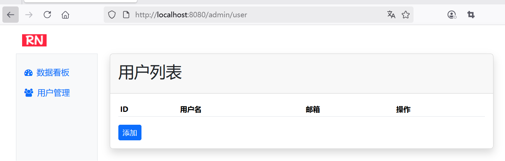
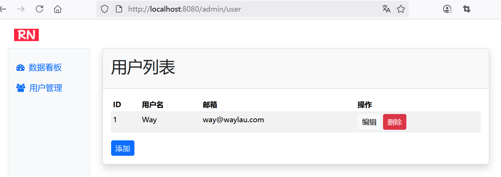
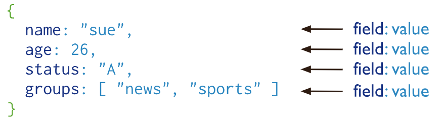
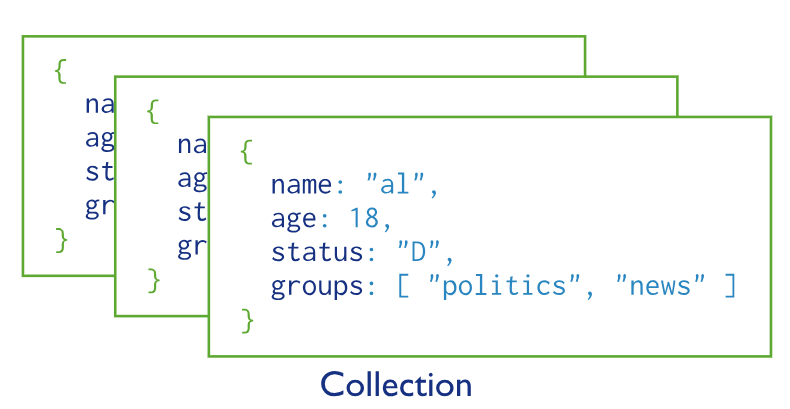
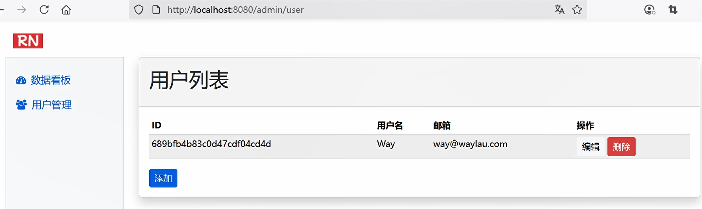

> 本页为原「Java 课程 5」全部 10 个分节的合订本；原分节链接会自动跳转到本页。


## 1.1 课程介绍

* Java全栈后端必备数据库主流框架深度对比、选型；
* Spring Data JPA处理关系型数据库，基础、高级、实战；
* Spring Data MongoDB处理非关系型数据库，基础、高级、实战；


## 2.1 全栈数据层主流框架深度解析：解决选型迷茫与开发效率痛点

在Java项目中与数据库SQL解耦能增强代码的可维护性、可移植性和可测试性，以下是几种常见的实现方式及针对数据库SQL解耦的方案。


### 常用数据库SQL解耦技术

常用数据库SQL解耦技术包括 Hibernate、Spring Data JPA、MyBatis等。其中， Hibernate、Spring Data JPA是真正完全的解耦技术， MyBatis 只是半解耦技术。

#### Hibernate 优势

###### 1. 提高开发效率
- 减少重复代码：Hibernate 提供了对象与数据库表之间的映射机制，使得开发者可以使用面向对象的方式操作数据库，无需编写大量的 SQL 语句。例如，开发者只需定义好 Java 对象及其属性，Hibernate 就能自动将对象的操作转换为相应的 SQL 操作，大大减少了数据访问层的代码量。
- 快速开发：在开发过程中，使用 Hibernate 可以快速搭建起数据持久层，尤其对于一些简单的增删改查操作，开发速度会明显加快。比如在一个小型的 Web 应用中，开发者可以在短时间内完成数据库的基本操作功能。

###### 2. 数据库无关性
- 支持多种数据库：Hibernate 可以与多种不同的数据库进行交互，如 MySQL、Oracle、SQL Server 等。开发者在开发过程中可以使用统一的 Java 代码进行数据库操作，而无需针对不同的数据库编写不同的 SQL 语句。当需要更换数据库时，只需要修改 Hibernate 的配置文件即可，提高了系统的可移植性。
- 屏蔽数据库差异：不同的数据库在 SQL 语法和特性上可能存在一些差异，Hibernate 会自动处理这些差异，使得开发者无需关注这些细节。例如，在处理日期和时间类型时，不同数据库的处理方式可能不同，Hibernate 会将这些差异进行统一封装。

###### 3. 事务管理方便
- 集成事务管理：Hibernate 与 Java 的事务管理机制集成良好，支持声明式事务和编程式事务。开发者可以很方便地管理数据库事务，确保数据的一致性和完整性。例如，在一个业务逻辑中涉及多个数据库操作，开发者可以将这些操作放在一个事务中，若其中一个操作失败，整个事务会回滚，保证数据的正确性。

###### 4. 缓存机制
- 一级缓存和二级缓存：Hibernate 提供了一级缓存（Session 级别的缓存）和二级缓存（SessionFactory 级别的缓存）机制。一级缓存可以在同一个 Session 中缓存查询结果，避免重复查询数据库；二级缓存可以在多个 Session 之间共享缓存数据，减少数据库的访问次数，提高系统的性能。例如，在一个高并发的系统中，对于一些经常访问的数据，可以使用二级缓存来提高系统的响应速度。

#### Hibernate 劣势
###### 1. 性能问题
- 生成复杂 SQL：在处理复杂查询时，Hibernate 自动生成的 SQL 语句可能会比较复杂，执行效率较低。例如，在进行多表关联查询时，Hibernate 可能会生成一些不必要的子查询或连接，导致数据库的性能下降。
- 缓存管理复杂：虽然 Hibernate 的缓存机制可以提高性能，但缓存的管理和维护比较复杂。如果缓存配置不当，可能会导致数据不一致的问题。例如，当数据发生更新时，如果没有及时更新缓存，就会导致查询到的数据不是最新的。

###### 2. 学习成本较高
- 概念和配置复杂：Hibernate 有很多复杂的概念和配置选项，如映射文件、查询语言（HQL）、缓存配置等。对于初学者来说，需要花费较多的时间来学习和掌握这些知识。例如，理解 Hibernate 的延迟加载、级联操作等概念需要一定的时间和实践经验。

###### 3. 对 SQL 控制能力有限
- 难以进行精细化优化：在一些对 SQL 性能要求极高的场景下，Hibernate 的自动生成 SQL 机制可能无法满足需求。开发者很难对生成的 SQL 语句进行精细化的优化，因为 Hibernate 会将对象操作转换为 SQL 语句，开发者无法直接控制 SQL 的执行过程。例如，在处理一些复杂的业务逻辑时，可能需要编写高效的 SQL 语句来提高性能，但使用 Hibernate 可能无法实现。

#### Spring Data JPA 优势
###### 1. 简化数据访问层开发
- 减少样板代码：Spring Data JPA 基于 JPA 标准，通过定义简单的接口，就能自动实现基本的增删改查（CRUD）操作，无需开发者编写大量重复的 SQL 语句和数据访问逻辑代码。例如，只需定义一个继承自 `JpaRepository` 的接口，就能直接使用 `save`、`findAll`、`findById` 等方法。
- 自动方法解析：Spring Data JPA 可以根据方法名自动解析并生成对应的查询语句。比如，定义一个名为 `findByUsername` 的方法，Spring Data JPA 会自动根据 `username` 字段进行查询。


###### 2. 与 Spring 框架无缝集成
- 利用 Spring 特性：由于是 Spring 框架的一部分，Spring Data JPA 可以充分利用 Spring 的依赖注入、事务管理等特性。开发者可以轻松地将数据访问层的组件注入到服务层，并且通过 Spring 的声明式事务管理来管理数据库事务。
- 简化配置：借助 Spring Boot 的自动配置功能，Spring Data JPA 的配置变得非常简单。开发者只需要添加相应的依赖，Spring Boot 就能自动配置数据源、JPA 实体管理器等，减少了配置文件的编写量。

###### 3. 支持复杂查询
- 自定义查询：除了自动生成的查询方法，Spring Data JPA 还支持使用 `@Query` 注解编写自定义的 JPQL（Java Persistence Query Language）或 SQL 查询。这使得开发者能够处理复杂的查询需求，同时保持代码的简洁性。
- 分页和排序：Spring Data JPA 提供了对分页和排序的支持，开发者可以方便地实现数据的分页查询和排序功能，无需手动编写复杂的 SQL 语句。

###### 4. 提高开发效率和可维护性
- 标准化开发：Spring Data JPA 遵循 JPA 标准，使得不同数据库之间的切换更加容易，提高了代码的可移植性。同时，它提供了统一的接口和方法命名规范，使得代码结构更加清晰，易于维护和理解。

#### Spring Data JPA 劣势
###### 1. 性能问题
- 自动生成 SQL 不够优化：在某些复杂查询场景下，Spring Data JPA 自动生成的 SQL 语句可能不够优化，导致性能下降。例如，在处理多表关联查询时，可能会生成一些不必要的子查询或连接，影响查询效率。
- 缓存管理复杂：虽然 JPA 提供了缓存机制，但 Spring Data JPA 的缓存管理相对复杂。如果配置不当，可能会导致数据不一致或缓存命中率低的问题，进而影响系统性能。

###### 2. 学习成本
- JPA 规范学习：要熟练使用 Spring Data JPA，开发者需要了解 JPA 规范，包括实体映射、关系映射、查询语言等知识。对于初学者来说，学习这些知识需要花费一定的时间和精力。
- 复杂查询处理难度：当遇到非常复杂的查询需求时，使用 Spring Data JPA 的自定义查询可能会变得复杂，需要开发者对 JPQL 或 SQL 有深入的理解，并且要熟悉 Spring Data JPA 的注解和方法使用。

###### 3. 灵活性受限
- 对数据库特性支持不足：Spring Data JPA 主要基于 JPA 标准，对于一些特定数据库的高级特性（如特定的函数、存储过程等）支持可能不够完善。在需要使用这些特性时，开发者可能需要编写额外的代码或采用其他方式来实现。
- 难以控制 SQL 细节：虽然可以使用 `@Query` 注解编写自定义查询，但在某些情况下，开发者仍然难以对生成的 SQL 语句进行精细的控制，无法满足一些对 SQL 执行细节有严格要求的场景。 


#### MyBatis 优势
###### 1. SQL 控制灵活
- 直接编写 SQL：MyBatis 允许开发者直接编写 SQL 语句，这对于复杂的查询、存储过程调用以及对 SQL 性能有严格要求的场景非常有利。开发者可以根据具体需求对 SQL 进行优化，以达到最佳的性能表现。例如，在处理涉及多表连接、复杂条件筛选的查询时，开发者能够手动编写高效的 SQL 语句。
- 动态 SQL 支持：MyBatis 提供了强大的动态 SQL 功能，通过 `<if>`、`<choose>`、`<when>`、`<otherwise>`、`<where>`、`<set>`、`<foreach>` 等标签，可以根据不同的条件动态生成 SQL 语句。这使得 SQL 语句可以根据传入的参数灵活变化，提高了代码的复用性和灵活性。比如在一个查询方法中，根据用户传入的不同参数，动态决定是否添加某个查询条件。

###### 2. 学习成本低
- 简单易上手：MyBatis 的配置和使用相对简单，它的核心就是 SQL 语句的编写和映射关系的配置。对于有一定 SQL 基础的开发者来说，很容易上手并快速应用到项目中。与一些复杂的 ORM 框架相比，MyBatis 的学习曲线较为平缓。
- 轻量级框架：MyBatis 是一个轻量级的框架，不依赖于过多的第三方库，对系统资源的占用较少。它的设计理念简洁明了，主要专注于 SQL 与对象之间的映射，使得开发者能够更专注于业务逻辑和 SQL 优化。

###### 3. 易于与现有项目集成
- 与 Spring 集成良好：MyBatis 可以很好地与 Spring 框架集成，借助 Spring 的依赖注入、事务管理等功能，进一步简化开发过程。在 Spring 项目中使用 MyBatis 时，可以方便地进行数据源配置、事务管理等操作，提高开发效率。
- 对现有数据库结构兼容性强：MyBatis 对现有数据库结构的兼容性较好，不需要对数据库表结构进行大规模的修改或重构。它可以直接基于现有的数据库表进行映射配置，适合于对已有系统进行改造和维护的项目。

###### 4. 性能优化方便
- 可针对性优化 SQL：由于开发者可以直接控制 SQL 语句，因此可以针对具体的业务场景和性能瓶颈进行有针对性的优化。例如，通过合理使用索引、优化查询语句结构、避免全表扫描等方式，提高数据库的查询性能。
- 一级缓存和二级缓存机制：MyBatis 也提供了一级缓存（SqlSession 级别）和二级缓存（Mapper 级别）机制，可以在一定程度上减少数据库的访问次数，提高系统的性能。开发者可以根据实际需求选择是否开启缓存以及如何配置缓存策略。

#### MyBatis 劣势
###### 1. 数据库移植性较差
- SQL 依赖数据库特性：由于开发者直接编写 SQL 语句，而不同的数据库在 SQL 语法和特性上存在一定的差异，因此当需要将项目从一个数据库迁移到另一个数据库时，可能需要对 SQL 语句进行大量的修改。例如，Oracle 和 MySQL 在日期函数、分页查询等方面的语法不同，迁移时需要调整相应的 SQL 语句。
###### 2. 代码维护成本较高
- SQL 分散在多处：在 MyBatis 项目中，SQL 语句通常分散在多个 XML 文件或注解中，当项目规模较大时，查找和维护这些 SQL 语句会变得比较困难。特别是当业务逻辑发生变化时，需要同时修改 Java 代码和对应的 SQL 语句，增加了代码的维护成本。
###### 3. 缺乏高级 ORM 功能
- 对象关系映射功能相对薄弱：与一些全功能的 ORM 框架相比，MyBatis 的对象关系映射功能相对薄弱。例如，在处理复杂的对象关系（如继承、多态等）时，需要开发者手动编写更多的代码来实现，不够便捷和高效。
###### 4. 对开发人员要求较高
- 需要具备 SQL 技能：MyBatis 的使用需要开发者具备一定的 SQL 技能，能够编写高效、正确的 SQL 语句。如果开发人员的 SQL 水平不高，可能会导致生成的 SQL 语句性能低下，影响系统的整体性能。 


#### MyBatis 在国内接受度高的方面及原因

###### 1. 复杂业务场景和性能要求高的项目

- SQL 控制能力不足：在一些复杂的业务场景中，可能需要编写非常复杂和高效的 SQL 语句来满足性能要求。JPA 虽然提供了 JPQL（Java Persistence Query Language）和本地 SQL 查询等方式，但在对 SQL 细节的控制上不如直接编写 SQL 灵活。例如，在处理一些涉及大量数据的复杂查询和报表生成时，开发者可能更倾向于使用 MyBatis 等可以直接编写和优化 SQL 的框架。
- 性能问题：JPA 自动生成的 SQL 语句在某些情况下可能不够优化，尤其是在处理多表关联查询时，可能会产生过多的数据库交互和性能开销。对于一些对性能要求极高的项目，如高并发的互联网应用、实时数据处理系统等，JPA 可能无法满足性能需求。

###### 2. 已有技术栈和开发习惯的影响

- 已有框架的使用惯性：国内很多开发团队已经在长期的项目开发中形成了自己的技术栈和开发习惯，例如使用 MyBatis 进行数据持久化。更换为 JPA 需要团队成员重新学习和适应新的框架，这可能会带来一定的学习成本和时间成本。而且，一些团队可能对现有的框架已经有了深入的了解和丰富的优化经验，不愿意轻易更换技术栈。 
- 开发文化偏好：不同国家和地区有不同的开发文化和习惯。国外开发者更倾向于使用遵循特定设计模式和标准的框架，而国内的开发者则没有这种倾向性。MyBatis 的使用方式更契合国内开发者的开发文化。


## 2.2 为何我们的全栈项目选择Spring Data？

Spring Data JPA 是更大的 Spring Data 家族（<http://projects.spring.io/spring-data>）的一部分，使得轻松实现基于 JPA 的存储库变得更容易。该模块用于处理对基于 JPA 的数据访问层的增强支持。它使得更容易构建基于使用 Spring 数据访问技术栈的应用程序。

通过在上一章节的学习，我们知道了 JPA 是一套规范，这样在使用不同 ORM 实现的时候，可以只需要关注 JPA 里面的 API ，而无需关注具体的实现。但同时，JPA 也提供了 EntityManager 接口，来管理实体。

然而，Spring Data JPA 对于 JPA 的支持则是更近一步。使用 Spring Data JPA 开发者无需过多关注 EntityManager 的创建、事务处理等 JPA 相关的处理，这基本上也是作为一个开发框架而言所能做到的极限了，甚至 Spring Data JPA 让你连实现持久层业务逻辑的工作都省了，唯一要做的，就只是声明持久层的接口，其他都交给 Spring Data JPA 来帮你完成！

Spring Data JPA 就是这么强大，让你的数据持久层开发工作简化只需声明一个接口。比如，你声明了一个 findUserById() 这样一个方法声明，Spring Data JPA 就能能判断出这是根据给定条件的 ID 查询出满足条件的 User 对象，而其中的实现过程开发者无需关心，这一切都交予 Spring Data JPA 来完成。 


### Spring Data 是什么

Spring Data 是一个用于简化数据库访问，并支持云服务的开源框架。其主要目标是使得对数据的访问变得方便快捷，并支持 map-reduce 框架和云计算数据服务。Spring Data 包含多个子项目：

* Spring Data Commons - 提供共享的基础框架，适合各个子项目使用，支持跨数据库持久化；
* Spring Data JPA - 简化创建 JPA 数据访问层和跨存储的持久层功能；
* Spring Data Hadoop - 基于 Spring 的 Hadoop 作业配置和一个 POJO 编程模型的 MapReduce 作业；
* Spring Data KeyValue  - 集成了 Redis 和 Riak ，提供多个常用场景下的简单封装；
* Spring Data JDBC Extensions - 支持 Oracle RAD、高级队列和高级数据类型；
* ......

还有一些其他子项目，比如 Spring Data 家族中的 Spring Data Elasticsearch（<http://projects.spring.io/spring-data-elasticsearch/>）、Spring Data Mongodb（<http://projects.spring.io/spring-data-mongodb/>）等，这些都是针对  Elasticsearch、Mongodb 等NoSQL提供了数据访问层框架。

简言之，Spring Data 旨在统一包括数据库系统和NoSQL数据存储在内不同持久化存储的访问方式，让开发者通过统一的接口进行功能的实现。

### Spring Data JPA 特性

Spring Data JPA 是对 JPA 规范的实现。
 
对于普通开发者而言，自己实现应用程序的数据访问层是一件极其繁琐的过程。开发者必须编写太多的样板代码来执行简单查询、分页和审计。Spring Data JPA 旨在通过将努力减少到实际需要的量来显着改进数据访问层的实现。 作为开发人员，只需要编写存储库的接口，包括自定义查询方法，而这些接口的实现，Spring Data JPA 将会自动提供。

Spring Data JPA 包含如下特征：

* 基于 Spring 和 JPA 来构建复杂的存储库；
* 支持 Querydsl （<http://www.querydsl.com>） 谓词，因此支持类型安全的 JPA 查询；
* 域类的透明审计；
* 具备分页支持、动态查询执行、集成自定义数据访问代码的能力；
* 在引导时验证`@Query`带注释的查询；
* 支持基于 XML 的实体映射；
* 通过引入`@EnableJpaRepositories` 来实现基于 JavaConfig 的存储库配置。


### 如何使用 Spring Data JPA

在项目中使用`spring-data-jpa`的推荐方法是使用依赖关系管理系统：

```groovy
<dependency>
    <groupId>org.springframework.data</groupId>
    <artifactId>spring-data-jpa</artifactId>
    <version>3.5.2</version>
</dependency
```


在代码中，我们只需声明继承自 Spring Data JPA 中的接口：

```java
import org.springframework.data.jpa.repository.JpaRepository;
...

public interface UserRepository extends JpaRepository<User, Long>{

	  List<User> findByNameLike(String name);

}
```

在这里例子中，我们的代码，继承自了 Spring Data JPA 中的 JpaRepository 接口，而后声明相关的方法即可。
比如声明 findByNameLike，就能自动实现通过名称来模糊查询的方法。

### 核心概念

 Spring Data 存储库抽象中的中央接口是`Repository`。 它将域类以及域类的id类型作为类型参数进行管理。此接口主要作为标记接口捕获要使用的类型，并帮助您发现扩展此接口。 而`CrudRepository`为受管理的实体类提供复杂的 CRUD 功能。

```java
public interface CrudRepository<T, ID extends Serializable>
	extends Repository<T, ID> {
	
	<S extends T> S save(S entity);  //（1）
	
	T findOne(ID primaryKey);       //（2）
	
	Iterable<T> findAll();          //（3）
	
	Long count();                   //（4）
	
	void delete(T entity);          //（5）
	
	boolean exists(ID primaryKey);  //（6）
	
	// 省略更多方法...
}
```

CrudRepository 接口中的方法含义如下：

* （1）保存给定实体。
* （2）返回由给定id标识的实体。
* （3）返回所有实体。
* （4）返回实体的数量。
* （5）删除给定的实体。
* （6）指示是否存在具有给定 ID 的实体。

同时还提供其他特定的持久化技术的抽象，比如 `JpaRepository`或`MongoRepository`，这些接口扩展了`CrudRepository`。


在 `CrudRepository` 的顶部有一个`PagingAndSortingRepository`抽象，它增加了额外的方法来简化对实体的分页访问：

```java
public interface PagingAndSortingRepository<T, ID extends Serializable>
  extends CrudRepository<T, ID> {

  Iterable<T> findAll(Sort sort);

  Page<T> findAll(Pageable pageable);
}
```


比如，想访问用户的第二页的页面大小为20，你可以简单地做这样的事情：

```java
PagingAndSortingRepository<User, Long> repository = // … 获取 bean
Page<User> users = repository.findAll(new PageRequest(1, 20));
```


除了查询方法之外，还可以使用计数和删除查询。

派生计数查询：

```java
public interface UserRepository extends CrudRepository<User, Long> {

  Long countByLastname(String lastname);
}
```

派生删除查询：

```java
public interface UserRepository extends CrudRepository<User, Long> {

  Long deleteByLastname(String lastname);

  List<User> removeByLastname(String lastname);

}
```


## 3.1 快速实现Spring Data基础：掌握全栈思想下的数据库操作

### 查询方法

对于底层数据存储的管理，我们通常使用标准 CRUD 功能的资源库来实现。使用 Spring Data 声明这些查询将会变得简单，只需要四步过程：

#### 1. 声明扩展`Repository`或其子接口之一的接口

声明接口，并输入将处理的域类和ID类型。

```java
interface PersonRepository extends Repository<Person, Long> { … }
```

#### 2. 在接口上声明查询方法

```java
interface PersonRepository extends Repository<Person, Long> {
  List<Person> findByLastname(String lastname);
}
```

#### 3. 为这些接口创建代理实例

可以通过 JavaConfig 的方式：


```java
@Configuration
@EnableJpaRepositories(basePackages = "com.example.repositories")
public class JpaConfig {
}
```

或通过 XML 配置方式：


```xml
<?xml version="1.0" encoding="UTF-8"?>
<beans xmlns="http://www.springframework.org/schema/beans"
   xmlns:xsi="http://www.w3.org/2001/XMLSchema-instance"
   xmlns:jpa="http://www.springframework.org/schema/data/jpa"
   xsi:schemaLocation="http://www.springframework.org/schema/beans
     http://www.springframework.org/schema/beans/spring-beans.xsd
     http://www.springframework.org/schema/data/jpa
     http://www.springframework.org/schema/data/jpa/spring-jpa.xsd">

   <jpa:repositories base-package="com.example.repositories"/>

</beans>
```


在此示例中使用了 JPA 命名空间。如果您使用任何其他存储库的存储库抽象，则需要将其更改为您的存储模块的相应命名空间声。

另外，请注意，JavaConfig 变量不会明确配置包，因为默认情况下使用注释类的包。如果要自定义要扫描的程序包，请使用数据存储特定存储库的`@Enable…`注解。例如：

```
@EnableJpaRepositories(basePackages = "com.example.repositories.jpa")
@EnableMongoRepositories(basePackages = "com.example.repositories.mongo")
interface Configuration { }
```


#### 4. 获取注入的存储库实例并使用它


```java
public class SomeClient {

  @Autowired
  private PersonRepository repository;

  public void doSomething() {
    List<Person> persons = repository.findByLastname("Lau");
  }
}
```


### 定义资源库的接口

首先需要定义实体类的接口，接口必须继承资源库并且输入实体类型和ID类型，如果需要用到 CRUD 方法，可以使用`CrudRepository`来替代`Repository`.

#### 自定义接口

通常，您的存储库接口将会扩展`Repository`、 `CrudRepository`或`PagingAndSortingRepository`。 另外，如果你不想继承 Spring Data 接口，还可以接口`@RepositoryDefinition`。 扩展`CrudRepository`，将会公开一套完整的方法来操作您的实体。 如果你喜欢其中的方法来调用，你也可以简单地复制`CrudRepository`中的部分方法到你的 repository。

> 这允许您自定义数据库的功能的抽象。

下面是一个有选择地公开 CRUD 方法的例子：

```java
@NoRepositoryBean
interface MyBaseRepository<T, ID extends Serializable> extends Repository<T, ID> {

  T findOne(ID id);

  T save(T entity);
}

interface UserRepository extends MyBaseRepository<User, Long> {
  User findByEmailAddress(EmailAddress emailAddress);
}
```

第一步你定义了一个公共基础的接口 `findOne(…)`和`save(...)`方法,这些方法将会引入到你选择的 Spring Data 的实现类中，例如 `SimpleJpaRepository`，因为他们匹配`CrudRepository`的方法签名，所以`UserRepository`将会具备`save(...)`的功能和`findOne(…)`的功能，当然也具备`findByEmailAddress`的功能。

> 注意，如果中间的资源库接口添加了`@NoRepositoryBean`注解，这样运行时，Spring Data 将不会创建拥有该注解的实例。

#### 使用 Spring Data 多模块来创建资源库

使用单个 Spring Data 模块在应用中是非常简单，但有时候我们需要多个 Spring Data 模块，比如：需要定义的资源库需要去区分两种不同的持久化技术，如果在 classpath 中发现多个资源库时， Spring Data 会进行严格的配置限制，确保每资源库或者实体决定绑定哪个 Spring Data 模块：

* 如果资源库定义了继承特定的资源库，那么他是一个特定的 Spring Data 模块;
* 如果实体注解了一个特定的声明，它是一个特定的 Spring Data 模块。Spring Data 模块可以接纳第三方的声明，例如JPA 的`@Entity`，或者提供来自 Spring Data MonggoDB/Spring Data Elasticsearch 的 `@Document` 。

下面是自定义特定模块接口的资源库：

```java
interface MyRepository extends JpaRepository<User, Long> { }

@NoRepositoryBean
interface MyBaseRepository<T, ID extends Serializable> extends JpaRepository<T, ID> {
  …
}

interface UserRepository extends MyBaseRepository<User, Long> {
  …
}
```

`MyRepository` 和  `UserRepository` 继承于 `JpaRepository`在这个层级中是对 Spring Data JPA 模块的合法替代。

使用一般的接口定义的资源库：

```java
interface AmbiguousRepository extends Repository<User, Long> {
 …
}

@NoRepositoryBean
interface MyBaseRepository<T, ID extends Serializable> extends CrudRepository<T, ID> {
  …
}

interface AmbiguousUserRepository extends MyBaseRepository<User, Long> {
  …
}
```

`AmbiguousRepository`和`AmbiguousUserRepository` 仅在他们的层级来继承`Repository`和`CrudRepostory`。当它们使用单个 Spring Data 模块的时候是完美的，但是如果使用多模块 Spring Data 时， Spring 将无法区分每个资源库的范围。


下面例子是使用实体类注解来定义资源库的使用范围：

```java
nterface PersonRepository extends Repository<Person, Long> {
 …
}

@Entity
public class Person {
  …
}

interface UserRepository extends Repository<User, Long> {
 …
}

@Document
public class User {
  …
}
```

`PersonRepository`所引用的`Person`使用了`@Entity` 注解，所以这个仓库清晰的使用了Sping Data JPA。 `UserRepository`所引用的`User`声明了`@Document`，表明这个仓库将使用 Spring Data MongoDB 模块。

下面是使用混合的注解来定义资源库的例子：

```java
interface JpaPersonRepository extends Repository<Person, Long> {
 …
}

interface MongoDBPersonRepository extends Repository<Person, Long> {
 …
}

@Entity
@Document
public class Person {
  …
}
```

这个例子中实体类`Person` 使用了 JPA 和 Spring Data MongoDB 两种 注解，表明这个实体类既可以用于`JpaPersonRepository`也可以用于`MongoDBPersonRepository`，Spring Data 因不能区分类型而导致未定义的行为。

在同一个域类型上使用多个持久化技术特定的注释可以跨多个持久性技术重用域类型，但是 Spring Data 不再能够确定一个唯一的模块来绑定存储库。

最后一种方法来区分不同的仓库类型，使用包路径来判断。不同的包路径下的仓库使用不同的仓库类型，通过在配置类 Configuration 中声明注解来实现，也可以通过 XML 配置来定义。

通过注解来实现不同包路下使用不同的仓库：

```java
@EnableJpaRepositories(basePackages = "com.example.repositories.jpa")
@EnableMongoRepositories(basePackages = "com.example.repositories.mongo")
interface Configuration { }
```


### 定义查询方法

资源库代理有两种方法去查询，可以是根据方法名或者自定义查询。可用的选项取决于实际的存储。但不管如何，必须要有一个策略来决定创建什么实际查询。 让我们来看看可用的选项。

#### 查询查找策略

以下策略可供查询库基础设施来解决。您可以配置策略名称空间通过 `query-lookup-strategy`属性的XML配置或通过`queryLookupStrategy`启用的属性`${store}`库注释的Java配置。一些策略可能不支持特定的数据存储。

* `CREATE` 尝试从查询方法名构造一个特定于存储的查询。一般的方法是从方法名中删除一组已知的前缀，并解析方法的其余部分。
* `USE_DECLARED_QUERY`尝试查找已声明的查询，如果找不到则抛出异常。查询可以在某处通过注释定义，也可以通过其他方式声明。
* `CREATE_IF_NOT_FOUND`，（默认）结合了`CREATE`和`USE_DECLARED_QUERY`。它首先查找已声明的查询，如果没有找到已声明的查询，则创建一个基于自定义方法名称的查询。这是默认的查找策略，因此，如果您没有显式配置任何内容，则使用该策略。它允许通过方法名快速定义查询，也可以根据需要通过引入声明查询来自定义调优这些查询。


#### 创建查询

内置到 Spring Data 存储库基础结构中的查询构建器机制对于在存储库的实体上构建约束查询很有用。 机制剥离前缀`find…By`、`read…By`、`query…By`、`count…By`和`get…By`从该方法开始解析其余部分。 引入子句可以包含其他表达式，例如在要创建的查询上设置不同标志的区别。 但是，第一个`By`作为分隔符指示实际标准的开始。在非常基本的层次上，你可以定义实体属性的条件，并将它们与`And`和`Or`连接。

下面是根据方法名创建查询的例子:

```java
public interface PersonRepository extends Repository<User, Long> {

  List<Person> findByEmailAddressAndLastname(EmailAddress emailAddress, String lastname);

  // 启用 distinct 标志
  List<Person> findDistinctPeopleByLastnameOrFirstname(String lastname, String firstname);
  List<Person> findPeopleDistinctByLastnameOrFirstname(String lastname, String firstname);

  // 给独立的属性启用 ignore case
  List<Person> findByLastnameIgnoreCase(String lastname);

  // 给所有合适的属性启用 ignore case
  List<Person> findByLastnameAndFirstnameAllIgnoreCase(String lastname, String firstname);

  // 启用 ORDER BY
  List<Person> findByLastnameOrderByFirstnameAsc(String lastname);
  List<Person> findByLastnameOrderByFirstnameDesc(String lastname);
}
```

实际结果的解析方法取决于你的持久化存储所创建的查询。有一些要注意的事情：

* 表达式通常是可以在运算符组合的属性上进行遍历。您可以组合属性表达式 `AND`和`OR`。您还获得对诸如`Between`，`LessThan`，`GreaterThan`之间的运算符的支持，对于属性表达式。受支持的操作符可能因数据存储方式而异。
* 方法解析器支持为单个属性设置 IgnoreCase 标志（例如`findByLastnameIgnoreCase(...)`）也可以是所有属性（通常为 String 实例，例如`findByLastnameAndFirstnameAllIgnoreCase(...)`）。是否支持 ignore case 写取决于具体的存储方式。
* 您可以通过将`OrderBy`子句附加到引用属性的查询方法并提供排序方向（`Asc`或`Desc`）来应用静态排序。 

#### 属性表达式

属性表达式只能引用的受管理实体的直接属性，如前面的示例所示。  在查询创建时，您已经确保已解析的属性是受管域类的属性。 但是，您也可以通过遍历嵌套属性来定义约束。 假设一个 `Person` 有一个带有 `ZipCode` 的 `Address`。 在这种情况下，方法名称为

```java
List<Person> findByAddressZipCode(ZipCode zipCode);
```

解析算法从解释整个部分（`AddressZipCode`）作为属性开始，并检查域类中具有该名称（未资本化）的属性。如果算法成功，它使用该属性。如果不是，算法将来自右侧的骆驼情形部分的源分割成头部和尾部，并且尝试找到相应的属性，在我们的示例中，`AddressZip`和`Code`。如果算法找到具有该头部的属性，则它采用尾部并继续从那里构建树，以刚才描述的方式分割尾部。如果第一个分割不匹配，算法将分割点移动到左边（`Address`，`ZipCode`），然后继续。

虽然这应该适用于大多数情况下，算法可能选择错误的属性。假设`Person`类也有一个`addressZip`属性。该算法将在第一个分割循环中匹配，并且基本上选择错误的属性，最后失败（因为`addressZip`的类型可能没有` code`属性）。

要解决这种模糊性，您可以在方法名称中使用下划线`_`手动定义遍历点。所以我们的方法名称最终会这样：

```java
List<Person> findByAddress_ZipCode(ZipCode zipCode);
```

由于我们将下划线`_`视为保留字符，我们强烈建议遵循标准 Java 命名约定（即不在属性名称中使用下划线，而是使用驼峰案例）。

#### 特殊参数处理

要处理查询中的参数，您只需定义方法参数，如上面的示例中所示。基础设施还会识别某些特定类型，如 Pageable 和 Sort，以动态地对查询应用进行分页和排序。

下面使用 `Pageable`、`Slice` 和 `Sort`来查询

```java
Page<User> findByLastname(String lastname, Pageable pageable);

Slice<User> findByLastname(String lastname, Pageable pageable);

List<User> findByLastname(String lastname, Sort sort);

List<User> findByLastname(String lastname, Pageable pageable);
```

第一个方法允许在你的查询方法的静态定义查询中通过一个`org.springframework.data.domain.Pageable`实例来动态的添加分页。分页类知道元素的总数和可用页数。它通过基础库来触发一个统计查询计算所有的总数。由于这个查询可能对存储库消耗巨大，可以使用 `Slice` 来替代。`Slice` 仅仅知道是否有下一个`Slice`可用，这对查询大数据已经足够了。

排序选项和分页的处理方式一样。如果你需要排序，简单的添加一个`org.springframework.data.domain.Sort`参数到你的方法即可。也正如你所见，简单的返回一个列表也是可以的，在这种情况下，将不会创建构建实际页面实例所需的附加元数据（这反过来意味着将不必发出额外的计数查询），而是简单地限制查询以仅查找给定范围实体。

> 要找出在你的查询中有多少页，你需要触发一个额外的计数查询。按照默认来说这个查询可以从你实际触发查询中衍生出来


#### 限制查询结果

查询方法的结果可以通过关键字 `first` 或 `top` 来限制，它们可以互换使用。 可选的数字值可以追加到 top/first，以指定要返回的最大结果大小。 如果省略该数字，则假定结果大小为1。

下面示例用`Top`和`First`查询限制结果大小 ：

``` java
User findFirstByOrderByLastnameAsc();

User findTopByOrderByAgeDesc();

Page<User> queryFirst10ByLastname(String lastname, Pageable pageable);

Slice<User> findTop3ByLastname(String lastname, Pageable pageable);

List<User> findFirst10ByLastname(String lastname, Sort sort);

List<User> findTop10ByLastname(String lastname, Pageable pageable);
```

限制表达式也支持 `Distinct` 关键字。对于限制查询的结果集定义到一个实例中包装这个结果到一个`Optional`中也是被支持的。

如果分页或者切片被应用到一个限制查询分页(计算多少页可用)则它也能应用于限制结果。

> 要注意结合通过 Sort 参数动态排序的限制结果容许表达查询的方法为“K”最小的，以及“K”最大的元素。

#### 流查询结果

可以通过使用Java 8 `Stream<T>`作为返回类型来递增地处理查询方法的结果。 不是简单地将查询结果包装在`Stream`数据存储中，而是使用特定方法来执行流传输。


下面例子是以Java 8 `Stream<T>`来进行查询的流处理结果：

```java
@Query("select u from User u")
Stream<User> findAllByCustomQueryAndStream();

Stream<User> readAllByFirstnameNotNull();

@Query("select u from User u")
Stream<User> streamAllPaged(Pageable pageable);
```

> 一个数据流可能包裹底层数据存储特定资源，因此在使用后必须关闭。 你也可以使用close()方法或者使用 try-with-resources 语句<sup>[2]</sup>来关闭数据流。

在try-with-resources 块中操作一个Stream`Stream<T>`的例子：

```java
try (Stream<User> stream = repository.findAllByCustomQueryAndStream()) {
  stream.forEach(…);
}
```

> 当前不是所有的 Spring Data 模块都支持 `Stream<T>`作为返回类型


#### 异步查询结果

可以使用 Spring 的异步方法执行能力来异步地执行存储库查询。 这意味着该方法将在调用时立即返回，并且实际的查询执行将在已经提交到 Spring 任务执行器的任务中发生。

```java
@Async
Future<User> findByFirstname(String firstname);              // (1)

@Async
CompletableFuture<User> findOneByFirstname(String firstname);  // (2)

@Async
ListenableFuture<User> findOneByLastname(String lastname);    // (3)
```

- (1) 使用 `java.util.concurrent.Future` 作为返回类型；
- (2) 使用  Java 8 `java.util.concurrent.CompletableFuture`作为返回类型；
- (3) 使用  `org.springframework.util.concurrent.ListenableFuture`作为返回类型。


### 创建资源实例

为存储库接口创建实例以及定义 bean 的方式有两种。 一种方法是 Spring 命名空间；另外一种是 Java Config 配置方式，该配置方式也是推荐的方式。


#### XML配置

每个 Spring Data 模块都包含一个资源库元素，您可以简单地定义 Spring 所要扫描的基础包。

通过 XML 来配置 Spring Data 资源库的例子：

```xml
<?xml version="1.0" encoding="UTF-8"?>
<beans:beans xmlns:beans="http://www.springframework.org/schema/beans"
  xmlns:xsi="http://www.w3.org/2001/XMLSchema-instance"
  xmlns="http://www.springframework.org/schema/data/jpa"
  xsi:schemaLocation="http://www.springframework.org/schema/beans
    http://www.springframework.org/schema/beans/spring-beans.xsd
    http://www.springframework.org/schema/data/jpa
    http://www.springframework.org/schema/data/jpa/spring-jpa.xsd">

  <repositories base-package="com.example.repositories" />

</beans:beans>
```

在示例中，指示 Spring 扫描`com.example.repositories`及其所有子包以扩展 `Repository`或其子接口之一。 对于找到的每个接口，基础结构注册持久化技术特定的`FactoryBean`以创建处理查询方法的调用的适当代理。 每个 bean 都注册在从接口名派生的bean名称下，因此`UserRepository`的接口将注册在`userRepository`下。 `base-package`属性允许使用通配符，以便您可以定义扫描包的模式。


#### 使用过滤器

可以使用 `<include-filter />`或`<exclude-filter />` 来进行相关的过滤：


```xml
<repositories base-package="com.example.repositories">
  <context:exclude-filter type="regex" expression=".*SomeRepository" />
</repositories>
```

#### JavaConfig 方式


可以在JavaConfig 类上使用`@Enable${store}Repositories`注解，来实现来触发存储库基础结构，示例配置如下所示：


```java
@Configuration
@EnableJpaRepositories("com.example.repositories")
class ApplicationConfiguration {

  @Bean
  public EntityManagerFactory entityManagerFactory() {
    // …
  }
}
```

> 该示例使用 JPA 特定的注释，您可以根据实际使用的存储模块更改它。 这同样适用于 EntityManagerFactory bean 的定义。 


#### 独立使用

您还可以使用 Spring 容器之外的存储库基础结构，例如 在 CDI 环境中。 你仍然需要在你的类路径中有一些 Spring 库，但一般来说你可以通过编程方式设置存储库。 提供存储库支持的 Spring Data 模块提供了一个持久化技术特定的 RepositoryFactory，您可以使用如下。

下面是例子：

```java
RepositoryFactorySupport factory = // … 在这里实例化工厂
UserRepository repository = factory.getRepository(UserRepository.class);
```


## 3.2 进阶掌握Spring Data高级特性，斩获自定义实现的秘籍

### Spring Data 自定义实现


通常有必要为几个存储库方法提供自定义实现。 Spring 数据存储库很容易允许您提供自定义存储库代码，并将其与通用 CRUD 抽象和查询方法功能集成。

#### 向单个存储库添加自定义行为

要使用自定义功能丰富存储库，您首先需要定义自定义功能的接口和实现。 使用您提供的存储库接口来扩展自定义接口。

自定义资源库方法的接口：

```java
interface UserRepositoryCustom {
  public void someCustomMethod(User user);
}
```

自定义资源库方法接口的实现：

```java
class UserRepositoryImpl implements UserRepositoryCustom {

  public void someCustomMethod(User user) {
    // 自定义实现
  }
}
```

实现本身不依赖于 Spring Data，可以是普通的 Spring bean。 因此，您可以使用标准依赖注入行为来注入其他 bean 的引用，如JdbcTemplate 等方面。

```java
interface UserRepository extends CrudRepository<User, Long>, UserRepositoryCustom {

  // 此处用于声明查询方法
}
```

让您的标准存储库接口扩展自定义接口。这样做就能结合 CRUD 和自定义的功能。

如果使用命名空间配置，存储库基础架构尝试通过扫描我们发现存储库的包下面的类来自动检测自定义实现。这些类需要遵循将命名空间元素的属性`repository-impl-postfix`附加到找到的库的命名约定接口名称。此后缀默认为`Impl`。

配置示例:

```xml
<repositories base-package="com.example.repository" />

<repositories base-package="com.example.repository" repository-impl-postfix="FooBar" />
```


第一个配置示例将尝试查找类`com.example.repository.UserRepositoryImpl`作为自定义存储库实现，而第二个示例将尝试查找`com.example.repository.UserRepositoryFooBar`。


如果您的自定义实现仅使用基于注解的配置和自动装配，那么刚刚所示的方法将很有效，因为它将被视为任何其他Spring bean。如果你的自定义实现bean需要特殊的装配，你只需声明 bean 并命名它刚才描述的约定。基础设施然后将通过名称而不是创建一个自身来引用手动定义的 bean 定义。

自定义实现的手动装配的例子：

```xml
<repositories base-package="com.example.repository" />

<beans:bean id="userRepositoryImpl" class="…">
  <!-- 更多配置 -->
</beans:bean>
```


#### 向所有存储库添加自定义行为

当您要向所有的存储库接口添加单个方法时，上述方法是不可行的。 要向所有存储库添加自定义行为，您首先添加一个中间接口来声明共享行为。

声明自定义共享行为的接口：

```java
@NoRepositoryBean
public interface MyRepository<T, ID extends Serializable>
  extends PagingAndSortingRepository<T, ID> {

  void sharedCustomMethod(ID id);
}
```

现在，您的各个存储库接口将扩展此中间接口，而不是`Repository`接口，以包含已声明的功能。 接下来，创建中间接口的实现，以扩展持久性技术特定的存储库基类。 这个类将作为存储库代理的自定义基类。

自定义存储库基类的例子:


```java
public class MyRepositoryImpl<T, ID extends Serializable>
  extends SimpleJpaRepository<T, ID> implements MyRepository<T, ID> {

  private final EntityManager entityManager;

  public MyRepositoryImpl(JpaEntityInformation entityInformation,
                          EntityManager entityManager) {
    super(entityInformation, entityManager);

    this.entityManager = entityManager;
  }

  public void sharedCustomMethod(ID id) {
    // ...
  }
}
```

> 类需要具有特定于存储库的工厂实现使用的超类的构造函数。如果存储库基类具有多个构造函数，则覆盖采用 EntityInformation 加上特定于存储库的基础结构对象（例如 EntityManager 或模板类）的类。


Spring `<repositories />`命名空间的默认行为是为`base-package`下的所有接口提供一个实现。这意味着如果保持在它的当前状态，`MyRepository`的实现实例将由 Spring 创建。这当然不是所期望的，因为它只是作为`Repository`和要为每个实体定义的实际存储库接口之间的中介。要排除将`Repository`从实例化为存储库实例的接口，可以使用`@NoRepositoryBean`（如上所示）对其进行注释，或将其移动到已配置的`base-package`之外。

最后一步是使 Spring Data 基础结构感知自定义的存储库基类。在 JavaConfig 中，这是通过使用`@Enable…Repositories`的 repositoryBaseClass 属性来实现的：

下面例子是使用 JavaConfig 配置自定义存储库基类：

```java
@Configuration
@EnableJpaRepositories(repositoryBaseClass = MyRepositoryImpl.class)
class ApplicationConfiguration { … }
```

相应的属性在 XML 命名空间中可用:

```xml
<repositories base-package="com.acme.repository"
     base-class="….MyRepositoryImpl" />
```

### 从聚合根（aggregate root）发布事件


Spring Data 提供了`@DomainEvents`用来发布领域事件（domain event）。用法如下：

 
```java
class AnAggregateRoot {

    @DomainEvents 
    Collection<Object> domainEvents() {
        // … 返回你想在这里发布的事件
    }

    @AfterDomainEventsPublication 
    void callbackMethod() {
       // … 清理邻域事件列表
    }
}
```


## 3.3 实战：快速掌握Spring Data JPA企业级应用开发

如果读者朋友对课程4的内容还有印象的话，应该还记得，我们用 Thymeleaf 实现了一个最简单的“后台管理”功能。为了简便，我们并没有使用数据库管理系统，而是将数据直接保存在了内存中，这样导致的后果是只要应用重启，数据就会丢失。接下来通过 JPA 来将数据存储到关系型数据库中，这样就实现了数据的持久化。

我们在 `spring-mvc-thymeleaf` 项目的基础上复制出一个新项目`spring-data-jpa-h2`，来实现 JPA 功能。


### 如何使用 Spring Data JPA

在 `pom.xml` 中添加必要的依赖，包括Spring Data JPA、Hibernate、H2数据库等：


```xml
<dependencies>
    <!-- Spring Data JPA -->
    <dependency>
      <groupId>org.springframework.data</groupId>
      <artifactId>spring-data-jpa</artifactId>
      <version>3.5.2</version>
    </dependency>
    <!-- Hibernate -->
    <dependency>
      <groupId>org.hibernate.orm</groupId>
      <artifactId>hibernate-core</artifactId>
      <version>7.1.0.Final</version>
    </dependency>
    <!-- H2数据库 -->
    <dependency>
        <groupId>com.h2database</groupId>
        <artifactId>h2</artifactId>
        <version>2.3.232</version>
        <scope>runtime</scope>
    </dependency>

    <!-- ...为节约篇幅，此处省略非核心内容 -->
</dependencies>
```


### 定义实体


修改 User 类，参考 JPA 的规范，将其修改成为实体：

* User 类上增加了`@Entity`注解，以标识其为实体；
* `@Table`指明该类映射的表名为“users”；
* `@Id`标识id 字段为主键；
* `@GeneratedValue(strategy=GenerationType.IDENTITY)`标识 id 字段，以说使用数据库的自增长字段为新增加的实体的标识。这种情况下需要数据库提供对自增长字段的支持，一般的数据库如 HSQL、SQL Server、MySQL、DB2、Derby 等数据库都能够提供这种支持。


```java
package com.example.spring.mvc.model;

import jakarta.persistence.*;

/**
 * User 用户模型
 *
 * @version 2025/08/08
 **/
// 实体
@Entity
@Table(name = "users")
public class User {
    // 主键
    @Id
    // 自增长策略
    @GeneratedValue(strategy = GenerationType.IDENTITY)
    // 实体唯一标识
    private Long id;
    private String name;
    private String email;

	// ...为节约篇幅，此处省略非核心内容
}
```

### 新增资源库

新增用户资源库的接口，继承自`CrudRepository`：

```java
package com.example.spring.mvc.repository;

import com.example.spring.mvc.model.User;
import org.springframework.data.repository.CrudRepository;

/**
 * UserRepository 用户资源库
 *
 * @version 2025/08/13
 **/
public interface UserRepository extends CrudRepository<User, Long> {
}
```
 
由于，Spring Data JPA 已经帮我们做了实现，所以，我们自己不需要做任何实现，甚至都无需在 UserRepository 里面定义任何的方法。


### 修改控制器

AdminController也要做一些调整，将原来用户存储ConcurrentHashMap实现的方法，全部换成 JPA 的默认实现：

```java
package com.example.spring.mvc.controller;

import com.example.spring.mvc.model.User;
import com.example.spring.mvc.repository.UserRepository;
import org.springframework.beans.factory.annotation.Autowired;
import org.springframework.http.ResponseEntity;
import org.springframework.stereotype.Controller;
import org.springframework.ui.Model;
import org.springframework.web.bind.annotation.*;

import java.util.ArrayList;
import java.util.HashMap;
import java.util.Map;
import java.util.Optional;
import java.util.concurrent.ConcurrentHashMap;
import java.util.concurrent.atomic.AtomicLong;

/**
 * AdminController 后台管理控制器
 *
 * @version 2025/08/11
 **/
@Controller
@RequestMapping("/admin")
public class AdminController {
    // 用户存储
    /*private final ConcurrentHashMap<Long, User> users = new ConcurrentHashMap<>();
    private final AtomicLong counter = new AtomicLong(1);

    public AdminController() {
        // 初始化测试数据
        Long id1 = counter.getAndIncrement();
        users.put(id1, new User(id1, "John", "john@example.com"));

        Long id2 = counter.getAndIncrement();
        users.put(id2, new User(id2, "Smith", "smith@example.com"));
    }*/
    @Autowired
    private UserRepository userRepository;

    @GetMapping
    public String goToAdmin() {
        return "redirect:/admin/dashboard";
    }

    @GetMapping("/dashboard")
    public String dashboard(Model model) {
        // 统计数据
        long userCount = generateRandomInt(1, 100);
        long noteCount = generateRandomInt(1, 100);
        long commentCount = generateRandomInt(1, 100);

        model.addAttribute("userCount", userCount);
        model.addAttribute("noteCount", noteCount);
        model.addAttribute("commentCount", commentCount);

        model.addAttribute("contentFragment", "admin-dashboard");

        return "admin";
    }

    private int generateRandomInt(int min, int max) {
        return (int) (Math.random() * (max - min)) + min;
    }

    @GetMapping("/user")
    public String getUsers(Model model) {
        /*model.addAttribute("users", new ArrayList<>(users.values()));*/
        model.addAttribute("users", userRepository.findAll());
        model.addAttribute("contentFragment", "admin-user");

        return "admin";
    }

    @GetMapping("user/{id}/edit")
    public String editUser(@PathVariable(name = "id", required = true) Long id, Model model) {
        /*User user = users.get(id);*/
        Optional<User> optionalUser = userRepository.findById(id);
        User user = optionalUser.get();

        model.addAttribute("user", user);
        model.addAttribute("contentFragment", "admin-user-edit");

        return "admin";
    }

    @PostMapping("/user")
    public String updateUser(@ModelAttribute User user) {
        // 更新或者新增
        /*if (user.getId() == null) {
            Long id = counter.getAndIncrement();
            user.setId(id);
        }

        users.put(user.getId(), user);*/
        userRepository.save(user);

        return "redirect:/admin/user";
    }

    @DeleteMapping("/user/{id}")
    public ResponseEntity<?> deleteUser(@PathVariable(name = "id", required = true) Long id) {
        /*users.remove(id);*/
        userRepository.deleteById(id);

        Map<String, String> response = new HashMap<>();
        response.put("message", "用户删除成功");
        response.put("redirectUrl", "/admin/user");

        return ResponseEntity.ok(response);
    }

    @GetMapping("/user/add")
    public String addUser(Model model) {
        model.addAttribute("user", new User());
        model.addAttribute("contentFragment", "admin-user-edit");

        return "admin";
    }

}
```


### 新增配置文件

新增应用的配置文件`src/main/java/com/example/spring/mvc/config/JpaConfig.java`，用于配置JPA相关的配置内容：

```java
package com.example.spring.mvc.config;

import jakarta.persistence.EntityManagerFactory;
import org.springframework.context.annotation.Bean;
import org.springframework.context.annotation.Configuration;
import org.springframework.data.jpa.repository.config.EnableJpaRepositories;
import org.springframework.jdbc.datasource.embedded.EmbeddedDatabaseBuilder;
import org.springframework.jdbc.datasource.embedded.EmbeddedDatabaseType;
import org.springframework.orm.jpa.JpaTransactionManager;
import org.springframework.orm.jpa.JpaVendorAdapter;
import org.springframework.orm.jpa.LocalContainerEntityManagerFactoryBean;
import org.springframework.orm.jpa.vendor.Database;
import org.springframework.orm.jpa.vendor.HibernateJpaVendorAdapter;
import org.springframework.transaction.annotation.EnableTransactionManagement;

import javax.sql.DataSource;

/**
 * JpaConfig JPA配置
 *
 * @version 2025/08/13
 **/
@Configuration
// 启用JPA资源库
@EnableJpaRepositories(basePackages = "com.example.spring.mvc.repository")
// 开启事务管理
@EnableTransactionManagement
public class JpaConfig {

    // 定义数据源
    @Bean
    public DataSource dataSource() {
        return new EmbeddedDatabaseBuilder()
                .setType(EmbeddedDatabaseType.H2)
                .setName("testdb")
                .build();
    }

    // 定义JPA事务管理器
    @Bean("transactionManager")
    public JpaTransactionManager jpaTransactionManager(EntityManagerFactory entityManagerFactory) {
        return new JpaTransactionManager(entityManagerFactory);
    }

    // 定义JPA供应商适配器
    @Bean
    public JpaVendorAdapter jpaVendorAdapter() {
        HibernateJpaVendorAdapter hibernateJpaVendorAdapter = new HibernateJpaVendorAdapter();
        hibernateJpaVendorAdapter.setDatabase(Database.H2);

        // 自动生成DDL
        hibernateJpaVendorAdapter.setGenerateDdl(true);

        // 显示SQL
        hibernateJpaVendorAdapter.setShowSql(true);

        return hibernateJpaVendorAdapter;
    }

    // 定义实体管理器工厂
    @Bean("entityManagerFactory")
    public LocalContainerEntityManagerFactoryBean localContainerEntityManagerFactoryBean() {
        LocalContainerEntityManagerFactoryBean localContainerEntityManagerFactoryBean =
                new LocalContainerEntityManagerFactoryBean();
        localContainerEntityManagerFactoryBean.setDataSource(dataSource());
        localContainerEntityManagerFactoryBean.setJpaVendorAdapter(jpaVendorAdapter());

        // 设置实体类包路径
        localContainerEntityManagerFactoryBean.setPackagesToScan("com.example.spring.mvc.model");

        return localContainerEntityManagerFactoryBean;
    }
}
```

在配置文件中，我们定义了事务管理、DataSource、PlatformTransactionManager、EntityManagerFactory等。


### 运行查看效果

启动项目，可用在控制台可以看到 Hibernate 的执行情况：

```
Hibernate: create table users (id bigint generated by default as identity, email varchar(255), name varchar(255), primary key (id))
```

可用发现，Hibernate 并会自动在数据库中创建表 `users`。


浏览器访问  <http://localhost:8080/admin/user> 可以看到项目的运行效果。图3-1是访问用户管理界面效果。





图3-2是添加用户后的界面效果。





## 4.1 Spring Data MongoDB快速入门：掌握非关系型数据库开发

MongoDB （<https://www.mongodb.com/>）是一个介于关系型数据库和非关系型数据库之间的产品，是非关系型数据库当中功能最丰富，最像关系型数据库的，旨在为 WEB 应用提供可扩展的高性能数据存储解决方案。它支持的数据结构非常松散，是类似 JSON 的 BSON 格式，因此可以存储比较复杂的数据类型。MongoDB 最大的特点是他支持的查询语言非常强大，其语法有点类似于面向对象的查询语言，几乎可以实现类似关系型数据库单表查询的绝大部分功能，而且还支持对数据建立索引。

本文不会对 MongoDB 的概念、基本用法做过多的介绍，有兴趣的朋友可自行查阅其他文献，比如《分布式系统常用技术及案例分析》一书，对 MongoDB 方面也有所着墨。 

### MongoDB 特点

MongoDB Server 是用 C++ 编写的、开源的、面向文档的数据库（Document Database），它的特点是高性能、高可用性，以及可以实现自动化扩展，存储数据非常方便。其主要功能特性如下：

MongoDB 将数据存储为一个文档，数据结构由 field-value（字段-值）对组成。MongoDB 文档类似于 JSON 对象。字段的值可以包含其他文档、数组及文档数组。



使用文档的优点是：

* 文档（即对象），在许多编程语言里，可以对应于原生数据类型。
* 嵌入式文档和数组可以减少昂贵的连接操作。
* 动态模式支持流畅的多态性。

MongoDB 的特点是高性能、易部署、易使用，存储数据非常方便。主要功能特性有：

#### 1. 高性能

MongoDB 中提供高性能的数据持久化。尤其是：

* 对于嵌入式数据模型支持，减少了数据库系统的 I/O 活动。
* 支持索引，用于快速查询。其索引对象可以是嵌入文档或数组的 key。

#### 2. 丰富的查询语言

MongoDB 支持丰富的查询语言，包括读取和写入操作（CRUD）以及：

* 数据聚合
* 文本搜索和[地理空间查询

#### 3. 高可用

MongoDB 的复制设备，被称为 replica set，提供了：

* 自动故障转移
* 数据冗余

replica set 是一组保存相同数据集合的 MongoDB 服务器，提供了数据冗余并提高了数据的可用性。

#### 4. 横向扩展

MongoDB 的提供水平横向扩展作为其核心功能部分：

* 将数据分片到一组计算机集群上；
* tag aware sharding （标签意识分片）允许将数据传给到特定的碎片，比如在分片时考虑碎片的地理分布。


### MongoDB 核心概念

以下是 MongoDB 的核心概念。

#### 数据库和集合


MongoDB 存储 BSON 文档（即数据记录）在集合（collection）里面，而集合是在数据库（database）里面。





在 MongoDB，数据库保存文档的集合。

选择要使用的数据库，使用 mongo shell  的`use <db>`语句，示例如下：

```
use myDB
```


#### Capped Collection（限制集合）

Capped Collection（限制集合）是固定大小的集合，用于支持基于文档插入顺序的高吞吐率的插入和检索操作。Capped Collection 工作原理在某种程度上类似于 circular buffer（循环缓冲区）：一旦一个文档填满分配给它的空间，他将通过在 Capped Collection 中重写老文档来给新文档让出空间。

查阅`createCollection()`（网址<https://docs.mongodb.com/manual/reference/method/db.createCollection/#db.createCollection>） 或者 `create`（网址<https://docs.mongodb.com/manual/reference/command/create/#dbcmd.create>）了解关于创建 Capped Collection 的更多信息。

 
###### 插入顺序

Capped Collection 能够保留插入顺序。因此，查询是按照文档的插入顺序而不是使用索引确定插入位置，这样的话可以提高增添数据的效率，所以 Capped Collection 可以支持更高的插入吞吐。

###### 最旧文档的自动删除

为了为新文档腾出空间，在不需要脚本或显式删除操作的前提下，Capped Collection 会自动删除集合中最旧的文档。

###### `_id`索引

Capped Collection 有一个 `_id` 字段并且默认在 `_id` 字段上创建索引。
 

###### 更新

如果您打算更新 Capped Collection 中的文档，创建一个索引就可以保证这些更新操作不需要进行集合扫描。

###### 文档大小

在 MongoDB 3.2 版之后，如果一个更新或替换操作改变了文档大小，操作将会失败。

###### 文档删除

您不能从一个 Capped Collection 中删除文档，为了从一个集合中删除所有文档，使用 `drop()` 方法来删除集合然后重新创建 Capped Collection。

###### 分片（Sharding）

你不能对 Capped Collection 进行分片。

###### 查询效率

用自然顺序检索集合中大部分最近插入的元素。这类似于在查询日志文件的尾部内容。

聚合 `$out`

聚合管道操作器 `$out`不能将结果写入 Capped Collection。

###### 创建 Capped Collection

您必须使用 `db.createCollection()` 方法显示创建 Capped Collection，在 mongo shell 的 `create` 命令中可以查看帮助信息。当创建 Capped Collection 时，您必须指定以字节为单位的最大集合大小，而 MongoDB 将会预先分配集合。Capped Collection 的大小包括内部消耗的一小部分空间。

```
db.createCollection( "log", { capped: true, size: 100000 } )
```

如果 `size` 字段小于或等于4096，该集合将会有4096字节。否则的话，MongoDB 将会在给定大小的基础上增加为256的整数倍。

另外，你可以为集合指定最大文档数量，使用 `max` 字段，用法如下：

```
db.createCollection("log", { capped : true, size : 5242880, max : 5000 } )
```

`size` 参数始终是必需的，即使你指定的文件`max`数量。如果集合达到最大数量的限制，在没有达到最大文档计数之前，MongoDB 将删除旧文档。

###### 查询 Capped Collection

如果你在 Capped Collection 上执行一个没有指定排序的`find()`方法，MongoDB 将保证结果的顺序是和插入顺序相同。

若想实现用同插入相反的顺序来检索文档，使用`find()`连同`sort()`的方法，及将`$natural`参数设置为 -1 ，就像下面的例子：

```
db.cappedCollection.find().sort( { $natural: -1 } )
```

#### Document（文档）

MongoDB 将数据的记录作为 BSON 文档进行存储的。BSON 是 JSON 文档的二进制表示，但拥有比 JSON 更多的数据类型。如果想了解 BSON 规范的相关内容，可以参阅 <http://bsonspec.org/>，或者 <https://docs.mongodb.com/manual/reference/bson-types/>。


#### 文档的结构

MongoDB  文档由 field value（字段/值）对组成，如下所示：

```bson
{
   field1: value1,
   field2: value2,
   field3: value3,
   ...
   fieldN: valueN
}
```

字段的值可以是任意 BSON 数据类型，包括其他文档、数组及文档数组。
例如，下面的文档包含不同类型的值：

```
var mydoc = {
               _id: ObjectId("5099803df3f4948bd2f98391"),
               name: { first: "Alan", last: "Turing" },
               birth: new Date('Jun 23, 1912'),
               death: new Date('Jun 07, 1954'),
               contribs: [ "Turing machine", "Turing test", "Turingery" ],
               views : NumberLong(1250000)
            }            
```

上面字段，分别包括了以下数据类型：

* `_id` 是一个  ObjectId；
* name 是一个嵌入式的文档，包含了字段的 first 和  last；
* birth 和 death 保存的是 Date 类型的值；
* contribs 保存的是 string 的 array；
* views  保存的是 NumberLong 类型的值。

###### 字段名称

字段名称是字符串。文档中对于字段名称有如下限制：

* 字段名称`_id`被保留用于作为主键；其值必须是集合中唯一的，是不可变的，并且可以是除 array 以外的任何类型；
* 该字段名称不能以美元符号`$`字符开头；
* 字段名称不能包含点`.`字符；
* 字段名称不能包含空（null）字符。

BSON 文档可能有多个字段可以具有相同名称。大多数的 MongoDB 接口，用来代表一个 MongoDB 结构（例如，hash table），不支持重复的字段名称。如果你需要操纵包含具有相同名称的多个字段的文档，请参阅 MongoDB 驱动程序的相关内容，见 <https://docs.mongodb.com/manual/applications/drivers/>。

内部 MongoDB 的进程创建一些文件可能有重复的字段，但是 MongoDB  进程不会不断增加重复字段到现有用户的文档。

###### 字段值限制

索引的集合，其值受到字段值 Maximum Index Key Length 的限制。详情可以参阅 <https://docs.mongodb.com/manual/reference/limits/#Index-Key-Limit>。


## 4.2 快速掌握Spring Data MongoDB高级特性：让非结构化数据管理如臂使指

Spring Data MongoDB 为 Java 开发者提供了便捷的方式来与 MongoDB 数据库进行交互，其高级特性能够显著提升开发效率和应用性能。下面将详细介绍 Spring Data MongoDB 的一些高级特性以及如何快速掌握它们。

### 1. 复杂查询
Spring Data MongoDB 支持丰富的查询操作，除了基本的等值查询外，还能进行范围查询、模糊查询等。

#### 1.1 范围查询
假设我们有一个 `Product` 类表示商品信息，包含 `price` 属性。我们可以使用 `Query` 对象进行价格范围查询。
```java
import org.springframework.beans.factory.annotation.Autowired;
import org.springframework.data.mongodb.core.MongoTemplate;
import org.springframework.data.mongodb.core.query.Criteria;
import org.springframework.data.mongodb.core.query.Query;
import org.springframework.stereotype.Service;

import java.util.List;

@Service
public class ProductService {
    @Autowired
    private MongoTemplate mongoTemplate;

    public List<Product> findProductsByPriceRange(double minPrice, double maxPrice) {
        Query query = new Query();
        query.addCriteria(Criteria.where("price").gte(minPrice).lte(maxPrice));
        return mongoTemplate.find(query, Product.class);
    }
}
```
上述代码中，`gte` 表示大于等于，`lte` 表示小于等于，通过 `addCriteria` 方法将条件添加到查询对象中。

#### 1.2 模糊查询
若要根据商品名称进行模糊查询，可以使用正则表达式。
```java
public List<Product> findProductsByName(String name) {
    Query query = new Query();
    query.addCriteria(Criteria.where("name").regex(name, "i")); // "i" 表示不区分大小写
    return mongoTemplate.find(query, Product.class);
}
```

### 2. 聚合操作
聚合操作允许我们对数据进行分组、统计等复杂计算。

#### 2.1 分组统计
假设我们要统计每个类别下商品的数量，可以使用聚合管道。
```java
import org.springframework.data.mongodb.core.aggregation.Aggregation;
import org.springframework.data.mongodb.core.aggregation.AggregationResults;
import org.springframework.data.mongodb.core.aggregation.GroupOperation;
import org.springframework.data.mongodb.core.aggregation.MatchOperation;

import java.util.List;

public List<CategoryCount> countProductsByCategory() {
    MatchOperation match = Aggregation.match(Criteria.where("price").gte(0)); // 可选的过滤条件
    GroupOperation group = Aggregation.group("category").count().as("count");
    Aggregation aggregation = Aggregation.newAggregation(match, group);
    AggregationResults<CategoryCount> results = mongoTemplate.aggregate(aggregation, "products", CategoryCount.class);
    return results.getMappedResults();
}
```
上述代码中，`MatchOperation` 用于过滤数据，`GroupOperation` 用于分组并统计数量，最后通过 `Aggregation` 对象执行聚合操作。

### 3. 索引管理
合理的索引可以提高查询性能，Spring Data MongoDB 支持在实体类上使用注解来创建索引。

#### 3.1 单字段索引
在 `Product` 类的 `price` 属性上创建索引。
```java
import org.springframework.data.mongodb.core.index.Indexed;
import org.springframework.data.mongodb.core.mapping.Document;

@Document(collection = "products")
public class Product {
    @Indexed
    private double price;
    // 其他属性和方法
}
```
#### 3.2 复合索引
若需要在多个字段上创建复合索引，可以使用 `CompoundIndex` 注解。
```java
import org.springframework.data.mongodb.core.index.CompoundIndex;
import org.springframework.data.mongodb.core.index.CompoundIndexes;
import org.springframework.data.mongodb.core.mapping.Document;

@Document(collection = "products")
@CompoundIndexes({
    @CompoundIndex(name = "price_name_idx", def = "{'price': 1, 'name': -1}")
})
public class Product {
    // 属性和方法
}
```
上述代码中，`def` 属性定义了索引的字段和排序规则，`1` 表示升序，`-1` 表示降序。

### 4. 事务管理
从 MongoDB 4.0 开始支持多文档事务，Spring Data MongoDB 也提供了对事务的支持。

#### 4.1 开启事务
在配置类中配置事务管理器。
```java
import org.springframework.context.annotation.Bean;
import org.springframework.context.annotation.Configuration;
import org.springframework.data.mongodb.MongoDatabaseFactory;
import org.springframework.data.mongodb.MongoTransactionManager;

@Configuration
public class MongoConfig {
    @Bean
    public MongoTransactionManager transactionManager(MongoDatabaseFactory dbFactory) {
        return new MongoTransactionManager(dbFactory);
    }
}
```
#### 4.2 使用事务
在服务方法上使用 `@Transactional` 注解开启事务。
```java
import org.springframework.stereotype.Service;
import org.springframework.transaction.annotation.Transactional;

@Service
public class ProductService {
    @Autowired
    private MongoTemplate mongoTemplate;

    @Transactional
    public void updateProduct(Product product) {
        // 执行多个数据库操作
        mongoTemplate.save(product);
        // 其他操作
    }
}
```

### 5. 异步操作
Spring Data MongoDB 支持异步操作，能够提高应用的并发性能。

#### 5.1 异步查询
```java
import org.springframework.data.mongodb.repository.AsyncMongoRepository;

public interface ProductRepository extends AsyncMongoRepository<Product, String> {
    // 异步查询方法
}
```
通过继承 `AsyncMongoRepository` 接口，可以定义异步查询方法。

通过学习和实践上述高级特性，你可以快速掌握 Spring Data MongoDB 的强大功能，从而更高效地开发基于 MongoDB 的 Java 应用。


## 4.3 实战：快速掌握Spring Data MongoDB企业级应用开发

我们在 `spring-mvc-thymeleaf` 项目的基础上复制出一个新项目`spring-data-mongodb`，来实现关于 Spring Data MongoDB 企业级实战应用的功能演示。


### 如何使用 Spring Data JPA

在 `pom.xml` 中添加必要的依赖，包括Spring Data JPA、H2数据库等：


```xml
<dependencies>
    <!-- Spring Data MongoDB -->
    <dependency>
        <groupId>org.springframework.data</groupId>
        <artifactId>spring-data-mongodb</artifactId>
        <version>4.5.2</version>
    </dependency>
     <!-- MongoDB Driver -->
    <dependency>
        <groupId>org.mongodb</groupId>
        <artifactId>mongodb-driver-sync</artifactId>
      <version>5.5.1</version>
    </dependency>

    <!-- ...为节约篇幅，此处省略非核心内容 -->
</dependencies>
```


### 定义实体


修改 User 类，将其修改成为实体：

* User 类上增加了`@Document`注解，以标识其为MongoDB的文档。该类映射的文档名为“users”；
* `@Id`标识id字段为主键，注意它与JPA里面的`@Id`是不同的注解。其次，id类型只能是String，不能是Long。


```java
package com.example.spring.mvc.model;

import org.springframework.data.annotation.Id;
import org.springframework.data.mongodb.core.mapping.Document;

/**
 * User 用户模型
 *
 * @version 2025/08/11
 **/
// 定义MongoDB的集合
@Document(collection = "users")
public class User {
    // 主键
    @Id
    // 实体唯一标识
    private String id;
    private String name;
    private String email;

    public User() {
    }

    public User(String id, String name, String email) {
        this.id = id;
        this.name = name;
        this.email = email;
    }

    // Getter、Setter方法
    public String getName() {
        return name;
    }

    public void setName(String name) {
        this.name = name;
    }

    public String getId() {
        return id;
    }

    public void setId(String id) {
        this.id = id;
    }

    public String getEmail() {
        return email;
    }

    public void setEmail(String email) {
        this.email = email;
    }
}
```

### 新增资源库

新增用户资源库的接口，继承自`CrudRepository`：

```java
package com.example.spring.mvc.repository;

import com.example.spring.mvc.model.User;
import org.springframework.data.repository.CrudRepository;

/**
 * UserRepository 用户资源库
 *
 * @version 2025/08/13
 **/
public interface UserRepository extends CrudRepository<User, String> {
}
```
 
由于，Spring Data MongoDB 已经帮我们做了实现，所以，我们自己不需要做任何实现，甚至都无需在 UserRepository 里面定义任何的方法。


### 修改控制器

AdminController也要做一些调整，将原来用户存储ConcurrentHashMap实现的方法，全部换成 JPA 的默认实现：

```java
package com.example.spring.mvc.controller;

import com.example.spring.mvc.model.User;
import com.example.spring.mvc.repository.UserRepository;
import org.springframework.beans.factory.annotation.Autowired;
import org.springframework.http.ResponseEntity;
import org.springframework.stereotype.Controller;
import org.springframework.ui.Model;
import org.springframework.web.bind.annotation.*;

import java.util.*;
import java.util.concurrent.ConcurrentHashMap;
import java.util.concurrent.atomic.AtomicLong;

/**
 * AdminController 后台管理控制器
 *
 * @version 2025/08/10
 **/
@Controller
@RequestMapping("/admin")
public class AdminController {

    // 用户存储
    /*private final ConcurrentHashMap<Long, User> users = new ConcurrentHashMap<>();
    private final AtomicLong counter = new AtomicLong(1);

    public AdminController() {
        // 初始化测试数据
        Long id1 = counter.getAndIncrement();
        users.put(id1, new User(id1, "John", "john@example.com"));

        Long id2 = counter.getAndIncrement();
        users.put(id2, new User(id2, "Smith", "smith@example.com"));
    }*/

    @Autowired
    private UserRepository userRepository;

    @GetMapping()
    public String goToAdmin() {
        return "redirect:/admin/dashboard";
    }

    @GetMapping("/dashboard")
    public String dashboard(Model model) {
        // 统计数据
        long userCount = generateRandomInt(1, 100);
        long noteCount = generateRandomInt(1, 100);
        long commentCount = generateRandomInt(1, 100);

        model.addAttribute("userCount", userCount);
        model.addAttribute("noteCount", noteCount);
        model.addAttribute("commentCount", commentCount);

        model.addAttribute("contentFragment", "admin-dashboard");

        return "admin";
    }

    private int generateRandomInt(int min, int max) {
        return (int) (Math.random() * (max - min)) + min;
    }

    @GetMapping("/user")
    public String getUsers(Model model) {
        /*model.addAttribute("users", new ArrayList<>(users.values()));*/
        model.addAttribute("users", userRepository.findAll());
        model.addAttribute("contentFragment", "admin-user");

        return "admin";
    }

    @GetMapping("/user/{id}/edit")
    /*public String editUser(@PathVariable(name = "id", required = true) Long id, Model model) {*/
    public String editUser(@PathVariable(name = "id", required = true) String id, Model model) {
        /*User user = users.get(id);*/

        Optional<User> userOptional = userRepository.findById(id);
        User user = userOptional.get();

        model.addAttribute("user", user);
        model.addAttribute("contentFragment", "admin-user-edit");

        return "admin";
    }

    @PostMapping("/user")
    public String updateUser(@ModelAttribute User user) {
        /*if (user.getId() == null) {
            Long id = counter.getAndIncrement();
            user.setId(id);
        }

        users.put(user.getId(), user);*/

        // 只有User的id是null时，才能被MongoDB自动生成_id
        // 需要处理前端传过来的“”，统一处理成null
        if ("".equals(user.getId())) {
            user.setId(null);
        }

        userRepository.save(user);

        return "redirect:/admin/user";
    }

    @DeleteMapping("/user/{id}")
    /*public ResponseEntity<?> deleteUser(@PathVariable(name = "id", required = true) Long id) {*/
    public ResponseEntity<?> deleteUser(@PathVariable(name = "id", required = true) String id) {
        /*users.remove(id);*/

        userRepository.deleteById(id);

        Map<String, String> response = new HashMap<>();
        response.put("message", "用户删除成功");
        response.put("redirectUrl", "/admin/user");

        return ResponseEntity.ok(response);
    }

    @GetMapping("/user/add")
    public String addUser(Model model) {
        model.addAttribute("user", new User());
        model.addAttribute("contentFragment", "admin-user-edit");

        return "admin";
    }

}
```


### 新增配置类


新增配置类`src/main/java/com/example/spring/mvc/config/MongoDBConfig.java`，配置内容如下：

```java
package com.example.spring.mvc.config;

import com.mongodb.client.MongoClient;
import com.mongodb.client.MongoClients;
import org.springframework.context.annotation.Bean;
import org.springframework.context.annotation.Configuration;
import org.springframework.data.mongodb.config.AbstractMongoClientConfiguration;
import org.springframework.data.mongodb.repository.config.EnableMongoRepositories;

/**
 * MongoDBConfig MongoDB配置
 *
 * @version 2025/08/13
 **/
@Configuration
// 启用MongoDB资源库
@EnableMongoRepositories(basePackages = "com.example.spring.mvc.repository")
public class MongoDBConfig extends AbstractMongoClientConfiguration {
    @Override
    protected String getDatabaseName() {
        return "springdata";
    }

    @Override
    @Bean
    public MongoClient mongoClient() {
        // 连接MongoDB服务器（默认是在localhost:27017）
        return MongoClients.create("mongodb://localhost:27017");
    }
}
```

在配置文件中，我们启用了MongoDB资源库功能，定义了数据库名称、MongoClient等。


### 运行查看效果


首先，确保MongoDB服务器已启动。启动命令参考如下：

```

D:\dev\database\mongodb-win32-x86_64-windows-8.0.11\bin\mongod.exe --config "D:\dev\database\mongodb-win32-x86_64-windows-8.0.11\bin\mongod.cfg"
```

其中，mongod.cfg为MongoDB服务器的配置文件。


其次，启动项目，浏览器访问  <http://localhost:8080/admin/user> 可以看到项目的运行效果。图4-3是访问用户管理界面效果。


图4-4是添加用户后的界面效果。





## 5.1 课程总结

* Java全栈后端必备数据库主流框架深度对比、选型；
* Spring Data JPA处理关系型数据库，基础、高级、实战；
* Spring Data MongoDB处理非关系型数据库，基础、高级、实战；
