> 本页为原「Java 课程 6」全部 11 个分节的合订本；原分节链接会自动跳转到本页。


## 1.1 全栈权限控制方法论：全面掌握从设计到落地的完整体系

* 理解什么是角色权限设计？为什么需要角色权限设计？
* 介绍Spring Security基础，包括核心原理、安全防护。
* 介绍Spring Security进阶，包括高层架构、认证架构、授权架构以及配置。
* 通过实战案例，来理解基于Spring Security如何来构建全栈后端安全架构体系。


## 2.1 角色权限设计，实现系统级权限颗粒度控制

聊聊权限管理中角色的概念，以及基于角色的机制来进行权限管理。 

### 什么是角色

当说到程序的权限管理时，人们往往想到角色这一概念。角色是代表一系列行为或责任的实体，用于限定你在软件系统中能做什么、不能做什么。用户帐号往往与角色相关联，因此，一个用户在软件系统中能“做”什么取决于与之关联的具有什么样的角色。

例如，一个用户以关联了”项目管理员”角色的帐号登录系统，那这个用户就可以做项目管理员能做的所有事情，如列出项目中的应用、管理项目组成员、产生项目报表等。

从这个意义上来说，角色更多的是一种行为的概念：它表示用户能在系统中进行的操作。

### 基于角色的访问控制

既然角色代表了可执行的操作这一概念，一个合乎逻辑的做法是在软件开发中使用角色来控制对软件功能和数据的访问。这种权限控制方法就叫基于角色的访问控制(Role-Based Access Control)，或简称为 RBAC。

有两种正在实践中使用的 RBAC 访问控制方式：隐式的方式和显示的方式。

#### 隐式访问控制（Implicit Access Control）

前面提到，角色代表一系列的可执行的操作。但我们如何知道一个角色到底关联了哪些可执行的操作呢？

答案是，目前的大多数的应用，你并能不明确的知道一个角色到底关联了哪些可执行操作。可能你心里是清楚的（你知道一个有”管理员”角色的用户可以锁定用户帐号、进行系统配置；一个关联了“消费者”这一角色的用户可在网站上进行商品选购），但这些系统并没有明确定义一个角色到底包含了哪些可执行的行为。

拿”项目管理员”来说，系统中并没有对“项目管理员”能进行什么样的操作进行明确定义，它仅是一个字符串名词。开发人员通常将这个名词写在程序里以进行访问控制。例如，判断一个用户是否能查看项目报表，程序员可能会进行如下编码：

```java
if (user.hasRole("Project Manager") ) {

    // 显示报表按钮
} else {

    // 不显示按钮
}
```

在上面的示例代表中，开发人员判断用户是否有“项目管理员”角色来决定是否显示查看项目报表按钮。请注意上面的代码，它并没有明确语句来定义”项目管理员”这一角色到底包含哪些可执行的行为，它只是假设一个关联了项目管理员角色的用户可查看项目报表，而开发人员也是基于这一假设来写 if/else 语句。这种方式就是基于角色的隐式访问控制。

#### 脆弱的权限策略

像上面的权限访问控制是非常脆弱的。一个极小的权限方面的需求的变动都可能导致上面的代码需要重新修改。

举例来说，假如某一天这个开发团队被告知：“哦，顺便说一下，我们需要一个‘部门管理员’角色，他们也可以查看项目报表。请做到这一点。”于是，之前的隐式访问控制的代码被修改成了如下的样子：

```java
if (user.hasRole("Project Manager") || user.hasRole("Department Manager") ) {

    // 显示报表按钮
} else {

    // 不显示按钮
}
```

随后，开发人员需要更新他的测试用例、重新编译系统，还可能需要重走软件质量控制（QA）流程，然后再重新部署上线。这一切仅仅是因为一个微小的权限方面的需求变动！

后面如果需求方又回来告诉你说我们又有另一个角色可查看报表，或是前面关于“部门管理员可查看报表”的需求不再需要了，怎么办？

如果需求方要求动态地创建、删除角色以便他们自己配置角色，又该如何应对呢？

像上面的情况，这种隐式的（静态字符串）形式的基于角色的访问控制方式难以满足需求。理想的情况是如果权限需求变动不需要修改任何代码。怎样才能做到这一点呢？

#### 显式访问控制（Explicit Access Control）

从上面的例子我们看到，当权限需求发生变动时，隐式的权限访问控制方式会给程序开发带来沉重的负担。如果能有一种方式在权限需求发生变化时不需要去修改代码就能满足需求那就好了。理想的情况是，即使是正在运行的系统，你也可以修改权限策略却又不影响最终用户的使用。当你发现某些错误的或危险的安全策略时，你可以迅速地修改策略配置，同时你的系统还能正常使用，而不需要重构代码重新部署系统。

怎样才能达到上面的理想效果呢？实际上，我们可以通过显式的（明确的）界定我们在应用中能做的操作来进行。

回顾上面隐式的权限控制的例子，思考一下这些代码最终的目的，想一下它们最终是要做什么样的控制。从根本上说，这些代码最终是在保护资源（项目报表），是要界定一个用户能对这些资源进行什么样的操作（查看/修改）。当我们将权限访问控制分解到这种最原始的层次，我们就可以用一种更细粒度、更富有弹性的方式来表达权限控制策略。

我们可以修改上面的代码块，以基于资源的语义来更有效地进行权限访问控制：

```java
if (user.isPermitted("projectReport:view:12345")) {
    
    // 显示报表按钮
} else {
    
    // 不显示按钮
}
```

上面的例子中，我们可明确地看到我们是在控制什么。不要太在意冒号分隔的语法，这仅是一个例子，重点是上面的语句明确地表示了“如果当前用户允许查看编号为12345的项目报表，则显示项目报表按钮”。也就是说，我们明确地说明了一个用户帐号可对一个的资源实例进行的具体的操作。

### 哪种方式更好

上面最后的示例代码块与前面的代码的主要区别在于，最后的代码块是基于什么是受保护的， 而不是谁可能有能力做什么。看似简单的区别，但后者对系统开发及部署有着深刻的影响。显示访问控制方式与隐示访问控制方式相比，具有以下优势：

* 更少的代码重构：我们是基于系统的功能（系统的资源及对资源的操作）来进行权限控制，而相应来说，系统的功能需求一旦确定下来后，一段时间内对它的改动相应还是比较少的。只是当系统的功能需求改变时，才会涉及到权限代码的改变。例如上面提到的查看项目报表的功能，显式的权限控制方式不会像传统隐式的 RBAC 权限控制那样因不同的用户/角色要进行这个操作就需要重构代码；只要这个功能存在，显式的方式的权限控制代码是不需要改变的。
* 资源和操作更直观：保护资源对象、控制对资源对象的操作，这样的权限控制方式更符合人们的思想习惯。正因为符合这种直观的思维方式，面向对象的编辑思想及 REST 通信模型变得非常成功。
* 安全模型更有弹性：上面的示例代码中没有写死哪些用户、组或角色可对资源进行什么操作。这意味着它可支持任何安全模型的设计。例如，可以将操作（权限）直接分配给用户 ，或者他们可以被分配到一个角色，然后再将角色与用户关联，或者将多个角色关联到组（group）上，等等。你完全可以根据应用的特点定制权限模型。
* 外部安全策略管理：由于源代码只反映资源和行为，而不是用户、组和角色，这样资源/行为与用户、组、角色的关联可以通过外部的模块或专用工具或管理控制台来完成。这意味着在权限需求变化时，开发人员并不需要花费时间来修改代码，业务分析师甚至最终用户就可以通过相应的管理工具修改权限策略配置。
* 运行时做修改：因为基于资源的权限控制代码并不依赖于行为的主体（如组、角色、用户），你并没有将行为的主体的字符名词写在代码中，所以你甚至可以在程序运行的时候通过修改主体能对资源进行的操作这样一些方式，通过配置的方式就可应对权限方面需求的变动，再也不需要像隐式的 RBAC 方式那样需要重构代码。

显示访问控制方式更适合于当前的软件应用。

### 真实的案例

不管是隐式访问控制，还是显示隐式访问控制，他们都有其合适的场景。庆幸的是，在 Java 平台，都有很多现成的现代权限管理框架可供选择，有 Apache Shiro（<http://shiro.apache.org/>） 和 Spring Security（<http://projects.spring.io/spring-security/>）。一个是以简洁好用而被业界广泛应用，而另一个则以功能强大而著称。

关于这两个框架的用法，读者朋友也可以参考《Apache Shiro 1.2.x 参考手册》以及《Spring Security 教程》。在后续章节中，这个系列主要介绍 Spring Security 框架的应用。


## 3.1 Spring Security核心原理解读：快速掌握企业级权限管理解决方案

Spring Security 是 Spring 生态中用于实现企业级安全控制的框架，它提供了完整的认证（Authentication）和授权（Authorization）解决方案。以下是其核心原理的深度解读及企业级应用实践：

### Spring Security 概述
 
Spring Security 为基于 Java EE 的企业软件应用程序提供全面的安全服务。特别是使用 Spring 框架构建的项目，可以更好的使用 Spring Security 来加快构建的速度。

Spring Security 的出现有有很多原因，但主要是基于 Java EE 的 Servlet 规范或 EJB 规范的缺乏对企业应用的安全性方面的支持。而使用 Spring Security 就能克服这些问题，并带来了数十个其他有用的可自定义的安全功能。

在 Java 领域，另外一个值得关注的安全框架是 Apache Shiro。但与 Apache Shiro 相比，Spring Security 的功能更加强大，与 Spring 的兼容性也更加好。

### Spring Security 的认证模型

在应用程序安全性的两个主要领域是认证（authentication）与授权（authorization）。

* 认证：“认证”是建立主体 （principal）的过程。“主体”通常是指可以在您的应用程序中执行操作的用户、设备或其他系统；
* 授权：或称为“访问控制（access-control），“授权”是指决定是否允许主体在应用程序中执行操作。为了到达需要授权决定的点，认证过程已经建立了主体的身份。这些概念是常见的，并不是特定于 Spring Security。

在认证级别，Spring Security 支持各种各样的认证模型。这些认证模型中的大多数由第三方提供，或者由诸如因特网工程任务组的相关标准机构开发。Spring Security 自己也提供了一组认证功能。具体来说，Spring Security 目前支持以下所有这些技术的身份验证集成：

* HTTP BASIC 认证头（基于IETF RFC的标准）
* HTTP Digest 认证头（基于IETF RFC的标准）
* HTTP X.509 客户端证书交换（基于IETF RFC的标准）
* LDAP（一种非常常见的跨平台身份验证需求，特别是在大型环境中）
* 基于表单的身份验证（用于简单的用户界面需求）
* OpenID 身份验证
* 基于预先建立的请求头的验证（例如 Computer Associates Siteminder）
* Jasig Central Authentication Service，也称为 CAS，这是一个流行的开源单点登录系统
* 远程方法调用（RMI）和 HttpInvoker（Spring 远程协议）的透明认证上下文传播
* 自动“remember-me”身份验证（所以您可以勾选一个框，以避免在预定时间段内重新验证）
* 匿名身份验证（允许每个未经身份验证的调用，来自动承担特定的安全身份）
* Run-as 身份验证（如果一个调用应使用不同的安全身份继续运行，这是有用的）
* Java认证和授权服务（Java Authentication and Authorization Service，JAAS）
* Java EE 容器认证（因此，如果需要，仍然可以使用容器管理身份验证）
* Kerberos
* Java Open Source Single Sign-On（JOSSO）*
* OpenNMS Network Management Platform *
* AppFuse *
* AndroMDA *
* Mule ESB *
* Direct Web Request （DWR）*
* Grails *
* Tapestry *
* JTrac *
* Jasypt *
* Roller  *
* Elastic Path *
* Atlassian Crowd *
* 自己创建的认证系统

（其中加*是指由第三方提供，由 Spring Security 来集成）

许多独立软件供应商（ISV）选择采用 Spring Security，都是出于这种灵活的认证模型。这样，他们可以快速地将他们的解决方案与他们的最终客户需要进行组合，从而避免了进行大量的工作或者要求变更。如果上述认证机制都不符合您的需求，Spring Security 作为一个开放平台，也可以基于它很容易就实现自己的认证机制。

如果不考虑上述认证机制，Spring Security 还提供了一组深层次的授权功能。有三个主要领域：

* 对 Web 请求进行授权
* 授权某个方法是否可以被调用
* 授权访问单个领域对象实例


### 核心架构与过滤器链
Spring Security 的核心是基于 Servlet 过滤器的责任链模式，主要包含以下组件：

#### 1. 过滤器链（FilterChain）
Spring Security 通过一系列过滤器拦截 HTTP 请求，每个过滤器负责特定的安全功能：
- UsernamePasswordAuthenticationFilter：处理表单登录认证。
- BasicAuthenticationFilter：处理 HTTP Basic 认证。
- FilterSecurityInterceptor：最终的授权过滤器，决定是否允许访问资源。
- ExceptionTranslationFilter：处理认证/授权异常，如重定向到登录页。

#### 2. 认证管理器（AuthenticationManager）
负责验证用户身份，默认实现为 `ProviderManager`，它委托给多个 `AuthenticationProvider` 处理不同类型的认证（如表单、OAuth2 等）。

#### 3. 安全上下文（SecurityContext）
存储当前用户的认证信息，默认保存在 `ThreadLocal` 中，确保线程安全。用户登录成功后，认证信息会存入 `SecurityContextHolder`。


### 认证流程详解
用户登录时的核心认证流程：
1. 请求拦截：过滤器拦截登录请求（如 `/login`）。
2. 封装凭证：将用户名/密码封装为 `UsernamePasswordAuthenticationToken`。
3. 提交认证：调用 `AuthenticationManager` 的 `authenticate()` 方法。
4. 验证逻辑：
   - `AuthenticationProvider` 验证凭证（如查询数据库）。
   - 若验证成功，返回包含用户权限的 `Authentication` 对象。
5. 保存上下文：将认证成功的 `Authentication` 存入 `SecurityContextHolder`。

```java
// 手动认证示例
Authentication authentication = authenticationManager.authenticate(
    new UsernamePasswordAuthenticationToken("user", "password")
);
SecurityContextHolder.getContext().setAuthentication(authentication);
```


### 授权机制与访问控制
授权是指确定用户是否有权限访问特定资源，Spring Security 提供两种主要方式：

#### 1. 基于 URL 的权限控制
通过 `HttpSecurity` 配置，限制 URL 访问权限：
```java
@Configuration
@EnableWebSecurity
public class SecurityConfig {

    @Bean
    public SecurityFilterChain filterChain(HttpSecurity http) throws Exception {
        http
            .authorizeHttpRequests(authorize -> authorize
                // 公共资源，无需认证
                .requestMatchers("/public/**").permitAll()
                  // 需要 ADMIN 角色
                .requestMatchers("/admin/**").hasRole("ADMIN")
                 // 其他请求需要认证
                .anyRequest().authenticated()
            )
            // 启用表单登录
            .formLogin(formLogin -> formLogin
                .loginPage("/login")
                .permitAll()
            );

        return http.build();
    }
}
```

#### 2. 基于方法的权限控制
使用 `@PreAuthorize`、`@PostAuthorize` 注解控制方法访问：
```java
@Service
public class UserService {
    @PreAuthorize("hasRole('ADMIN')")
    public void deleteUser(String userId) {
        // 删除用户逻辑
    }
}
```


### 用户详情服务（UserDetailsService）
自定义用户认证逻辑的核心接口，需实现 `loadUserByUsername()` 方法：
```java
@Service
public class CustomUserDetailsService implements UserDetailsService {
    @Override
    public UserDetails loadUserByUsername(String username) throws UsernameNotFoundException {
        // 从数据库查询用户信息
        User user = userRepository.findByUsername(username);
        if (user == null) {
            throw new UsernameNotFoundException("User not found");
        }
        // 返回 Spring Security 的 UserDetails 对象
        return new org.springframework.security.core.userdetails.User(
            user.getUsername(),
            user.getPassword(),
            mapRolesToAuthorities(user.getRoles())
        );
    }
}
```


### 总结
Spring Security 通过过滤器链、认证管理器和安全上下文提供了强大的安全防护体系。企业级应用中，需结合自定义用户服务、权限控制、会话管理和 OAuth2.0 等特性，构建多层次的安全防线。理解其核心原理后，可根据业务需求灵活配置，实现细粒度的权限管理。


## 3.2 安全防护升级：攻克系统安全薄弱痛点，构建零信任安全架构

### 密码加密
使用 `PasswordEncoder` 加密密码，避免明文存储：
```java
@Bean
public PasswordEncoder passwordEncoder() {
    return new BCryptPasswordEncoder();
}

// 加密示例
String encodedPassword = passwordEncoder.encode("rawPassword");
```


### 会话管理
```java
@Bean
public SecurityFilterChain filterChain(HttpSecurity http) {
    http
        .sessionManagement(session -> session
            // 限制单用户登录次数
            .maximumSessions(1)
            // 阻止第二次登录
            .maxSessionsPreventsLogin(true)
        );
    return http.build();
}        
```

### CSRF 防护
默认启用，需在表单中添加 CSRF Token：
```html
<form action="/login" method="post">
    <input type="hidden" name="${_csrf.parameterName}" value="${_csrf.token}">
    <!-- 其他表单字段 -->
</form>
```

### CORS 配置
```java
@Bean
public SecurityFilterChain apiFilterChain(HttpSecurity http) throws Exception {
    http
        .securityMatcher("/api/**")
        .cors((cors) -> cors
            .configurationSource(apiConfigurationSource())
        )
        ...
    return http.build();
}

UrlBasedCorsConfigurationSource apiConfigurationSource() {
    CorsConfiguration configuration = new CorsConfiguration();
    configuration.setAllowedOrigins(Arrays.asList("https://api.example.com"));
    configuration.setAllowedMethods(Arrays.asList("GET","POST"));
    UrlBasedCorsConfigurationSource source = new UrlBasedCorsConfigurationSource();
    source.registerCorsConfiguration("/**", configuration);
    return source;
}
```


### 与 OAuth2.0 集成
Spring Security 5 后支持 OAuth2.0 协议，可作为资源服务器或客户端。


以下配置示例是作为OAuth2资源服务器：

```java
@Bean
public SecurityFilterChain securityFilterChain(HttpSecurity http) throws Exception {
    http
        .authorizeHttpRequests((authorize) -> authorize
            .anyRequest().authenticated()
        )
        .oauth2ResourceServer((oauth2) -> oauth2
            .jwt(Customizer.withDefaults())
        );
    return http.build();
}
```


以下配置示例是作为OAuth2客户端：

```java
@Bean
public SecurityFilterChain securityFilterChain(HttpSecurity http) throws Exception {
    http
        // ...
        .oauth2Login(Customizer.withDefaults());
    return http.build();
}
```


## 4.1 Spring Security高层架构深度解析

基于Servlet的应用程序中Spring Security的高层架构。


### 过滤器回顾
Spring Security对Servlet的支持基于Servlet过滤器，因此，首先了解过滤器的一般作用会很有帮助。下图展示了单个HTTP请求的处理器的典型分层结构。


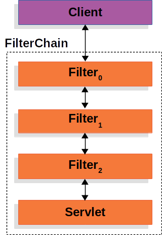


客户端向应用程序发送请求，容器基于请求URI的路径创建一个`FilterChain`，其中包含应该处理`HttpServletRequest`的`Filter`实例和`Servlet`。在Spring MVC应用程序中，该`Servlet`是`DispatcherServlet`的实例。最多只能有一个`Servlet`处理单个`HttpServletRequest`和`HttpServletResponse`。但是，可以使用多个`Filter`来实现以下功能：
- 阻止下游的`Filter`实例或`Servlet`被调用。在这种情况下，`Filter`通常会写入`HttpServletResponse`。
- 修改下游`Filter`实例和`Servlet`所使用的`HttpServletRequest`或`HttpServletResponse`。

`Filter`的强大之处在于传递给它的`FilterChain`。

#### FilterChain使用示例


```java
@Override
public void doFilter(ServletRequest request, ServletResponse response,
		FilterChain chain) throws IOException, ServletException {
	// 在应用程序的其他部分处理之前执行某些操作
	chain.doFilter(request, response); // 调用应用程序的其他部分
	// 在应用程序的其他部分处理之后执行某些操作
}
```

由于一个`Filter`仅影响下游的`Filter`实例和`Servlet`，因此每个`Filter`的调用顺序极为重要。

### DelegatingFilterProxy

Spring提供了一个名为`DelegatingFilterProxy`的`Filter`实现，它允许在Servlet容器的生命周期和Spring的`ApplicationContext`之间架起桥梁。Servlet容器允许通过其自身的标准注册`Filter`实例，但它并不知道Spring定义的Bean。你可以通过标准的Servlet容器机制注册`DelegatingFilterProxy`，但将所有工作委托给实现了`Filter`的Spring Bean。

下图展示了`DelegatingFilterProxy`在`Filter`实例和`FilterChain`中的位置。

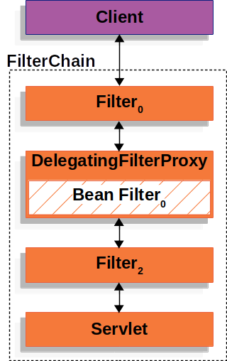


`DelegatingFilterProxy`从`ApplicationContext`中查找Bean Filter0，然后调用Bean Filter0。下面的代码展示了`DelegatingFilterProxy`的伪代码：

#### DelegatingFilterProxy伪代码

```java
public void doFilter(ServletRequest request, ServletResponse response, FilterChain chain) {
	Filter delegate = getFilterBean(someBeanName);  // (1)
	delegate.doFilter(request, response);  // (2)
}
```


* (1)惰性获取注册为Spring Bean的Filter。在DelegatingFilterProxy的示例中，`delegate`是Bean Filter0的实例。 
* (2)将工作委托给Spring Bean。 

`DelegatingFilterProxy`的另一个好处是，它允许延迟查找`Filter` bean实例。这一点很重要，因为容器需要在启动之前注册`Filter`实例。然而，Spring通常使用`ContextLoaderListener`来加载Spring Bean，而这要在需要注册`Filter`实例之后才会进行。

### FilterChainProxy

Spring Security对Servlet的支持包含在`FilterChainProxy`中。`FilterChainProxy`是Spring Security提供的一个特殊`Filter`，它允许通过`SecurityFilterChain`委托给多个`Filter`实例。由于`FilterChainProxy`是一个Bean，它通常被包装在DelegatingFilterProxy中。

下图展示了`FilterChainProxy`的作用。

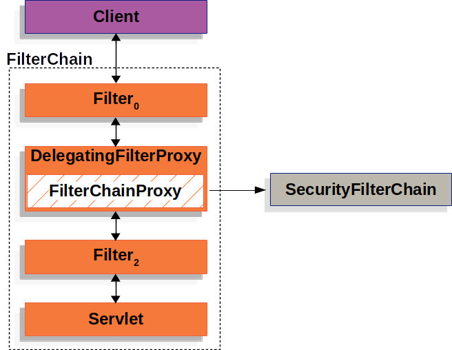


### SecurityFilterChain

`SecurityFilterChain`被FilterChainProxy用来确定对于当前请求应该调用哪些Spring Security`Filter`实例。

下图展示了`SecurityFilterChain`的作用。

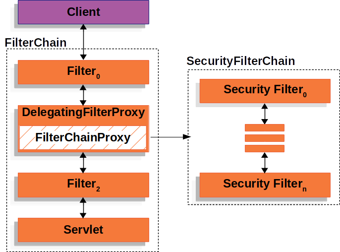


`SecurityFilterChain`中的安全过滤器通常是Bean，但它们是注册到`FilterChainProxy`而不是DelegatingFilterProxy。与直接注册到Servlet容器或DelegatingFilterProxy相比，`FilterChainProxy`提供了许多优势。首先，它为Spring Security的所有Servlet支持提供了一个起点。因此，如果你尝试排查Spring Security的Servlet支持问题，在`FilterChainProxy`中添加一个调试点会是一个很好的开始。

其次，由于`FilterChainProxy`是Spring Security使用的核心，它可以执行一些必不可少的任务。例如，它会清除`SecurityContext`以避免内存泄漏。它还会应用Spring Security的`HttpFirewall`来保护应用程序免受某些类型的攻击。

在确定何时应该调用`SecurityFilterChain`方面，它提供了更大的灵活性。在Servlet容器中，`Filter`实例仅根据URL被调用。然而，`FilterChainProxy`可以通过使用`RequestMatcher`接口，根据`HttpServletRequest`中的任何内容来确定是否调用。

下图展示了多个`SecurityFilterChain`实例：


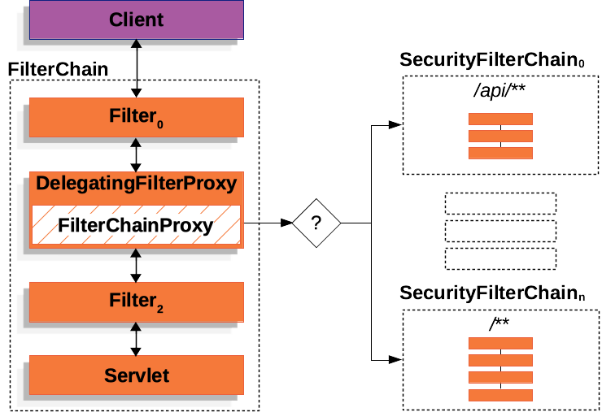


在“多个SecurityFilterChain”图中，`FilterChainProxy`决定应该使用哪个`SecurityFilterChain`。只有第一个匹配的`SecurityFilterChain`会被调用。如果请求的URL是`/api/messages/`，它首先会与`SecurityFilterChain0`的`/api/`模式匹配，因此只有`SecurityFilterChain0`会被调用，即使它也与`SecurityFilterChainn`匹配。如果请求的URL是`/messages/`，它与`SecurityFilterChain0`的`/api/`模式不匹配，因此`FilterChainProxy`会继续尝试每个`SecurityFilterChain`。假设没有其他`SecurityFilterChain`实例匹配，则会调用`SecurityFilterChainn`。

注意，`SecurityFilterChain0`仅配置了三个安全`Filter`实例。而`SecurityFilterChainn`配置了四个安全`Filter`实例。每个`SecurityFilterChain`都可以是独特的，并且可以独立配置。实际上，如果应用程序希望Spring Security忽略某些请求，`SecurityFilterChain`可以没有安全`Filter`实例。

### 安全过滤器
安全过滤器通过SecurityFilterChain API插入到FilterChainProxy中。这些过滤器可用于多种不同的目的，如漏洞防护、认证、授权等。过滤器按照特定的顺序执行，以确保它们在正确的时间被调用，例如，执行认证的`Filter`应该在执行授权的`Filter`之前被调用。通常情况下，没有必要了解Spring Security的`Filter`的顺序。但是，在某些时候，了解顺序是有益的，如果你想知道它们的顺序，可以查看`FilterOrderRegistration`代码。

这些安全过滤器通常使用`HttpSecurity`实例来声明。为了举例说明上面的内容，让我们考虑以下安全配置：


```java
@Configuration
@EnableWebSecurity
public class SecurityConfig {

    @Bean
    public SecurityFilterChain filterChain(HttpSecurity http) throws Exception {
        http
            .csrf(Customizer.withDefaults())
            .httpBasic(Customizer.withDefaults())
            .formLogin(Customizer.withDefaults())
            .authorizeHttpRequests(authorize -> authorize
                .anyRequest().authenticated()
            );

        return http.build();
    }

}
```


上述配置将产生以下`Filter`顺序：

| 过滤器 | 由以下方式添加 |
| ---- | ---- |
| CsrfFilter | `HttpSecurity#csrf` |
| BasicAuthenticationFilter | `HttpSecurity#httpBasic` |
| UsernamePasswordAuthenticationFilter | `HttpSecurity#formLogin` |
| AuthorizationFilter | `HttpSecurity#authorizeHttpRequests` |

调用顺序是：`CsrfFilter`先防止CSRF攻击，然后认证过滤器认证请求，最后`AuthorizationFilter`授权请求。

可能还有其他未在上面列出的`Filter`实例。如果你想查看针对特定请求调用的过滤器列表，可以将它们打印出来。

#### 打印安全过滤器
通常，查看针对特定请求调用的安全`Filter`列表是很有用的。例如，你想确保你添加的过滤器在安全过滤器列表中。

过滤器列表在应用程序启动时以DEBUG级别打印，因此你可以在控制台输出中看到类似以下的内容：

```
2025-08-14T08:55:22.321-03:00  DEBUG 76975 --- [           main] o.s.s.web.DefaultSecurityFilterChain     : Will secure any request with [ DisableEncodeUrlFilter, WebAsyncManagerIntegrationFilter, SecurityContextHolderFilter, HeaderWriterFilter, CsrfFilter, LogoutFilter, UsernamePasswordAuthenticationFilter, DefaultLoginPageGeneratingFilter, DefaultLogoutPageGeneratingFilter, BasicAuthenticationFilter, RequestCacheAwareFilter, SecurityContextHolderAwareRequestFilter, AnonymousAuthenticationFilter, ExceptionTranslationFilter, AuthorizationFilter]
```

这将让你很好地了解每个过滤器链配置的安全过滤器。

但这还不是全部，你还可以配置应用程序，为每个请求打印每个单独过滤器的调用情况。这有助于查看你添加的过滤器是否针对特定请求被调用，或者检查异常来自何处。要做到这一点，你可以配置应用程序来记录安全事件。

### 向过滤器链添加过滤器
大多数情况下，默认的安全过滤器足以为你的应用程序提供安全性。但是，有时你可能希望向SecurityFilterChain添加自定义的`Filter`。

`HttpSecurity`提供了三种添加过滤器的方法：
- `#addFilterBefore(Filter, Class<?>)` 在另一个过滤器之前添加你的过滤器
- `#addFilterAfter(Filter, Class<?>)` 在另一个过滤器之后添加你的过滤器
- `#addFilterAt(Filter, Class<?>)` 用你的过滤器替换另一个过滤器

#### 添加自定义过滤器
如果你要创建自己的过滤器，你需要确定它在过滤器链中的位置。请查看过滤器链中发生的以下关键事件：
- 从会话中加载`SecurityContext`
- 保护请求免受常见漏洞攻击；安全头、CORS、CSRF
- 认证请求
- 授权请求

考虑你需要哪些事件已经发生来确定你的过滤器的位置。以下是一个经验法则：

| 如果你的过滤器是 | 那么将其放置在之后 | 因为这些事件已经发生 |
| ---- | ---- | ---- |
| 漏洞防护过滤器 | SecurityContextHolderFilter | 1 |
| 认证过滤器 | LogoutFilter | 1、2 |
| 授权过滤器 | AnonymousAuthenticationFilter | 1、2、3 |

最常见的是，应用程序添加自定义认证。这意味着它们应该被放置在`LogoutFilter`之后。

例如，假设你想添加一个`Filter`，它获取租户ID头并检查当前用户是否有权访问该租户。

首先，让我们创建这个`Filter`：

```java
import java.io.IOException;
import jakarta.servlet.Filter;
import jakarta.servlet.FilterChain;
import jakarta.servlet.ServletException;
import jakarta.servlet.ServletRequest;
import jakarta.servlet.ServletResponse;
import jakarta.servlet.http.HttpServletRequest;
import jakarta.servlet.http.HttpServletResponse;

import org.springframework.security.access.AccessDeniedException;

public class TenantFilter implements Filter {

    @Override
    public void doFilter(ServletRequest servletRequest, ServletResponse servletResponse, FilterChain filterChain) throws IOException, ServletException {
        HttpServletRequest request = (HttpServletRequest) servletRequest;
        HttpServletResponse response = (HttpServletResponse) servletResponse;

        String tenantId = request.getHeader("X-Tenant-Id");  // (1)
        boolean hasAccess = isUserAllowed(tenantId);  // (2)
        if (hasAccess) {
            filterChain.doFilter(request, response);  // (3)
            return;
        }
        throw new AccessDeniedException("Access denied");  // (4)
    }

}
```

上面的示例代码做了以下事情：

* (1)从请求头中获取租户ID。
* (2)检查当前用户是否有权访问该租户ID。 
* (3)如果用户有权限，则调用链中的其余过滤器。
* (4)如果用户没有权限，则抛出`AccessDeniedException`。

你可以扩展OncePerRequestFilter而不是实现`Filter`，OncePerRequestFilter是仅为每个请求调用一次的过滤器的基类，并提供了带有`HttpServletRequest`和`HttpServletResponse`参数的`doFilterInternal`方法。

现在，你需要将过滤器添加到SecurityFilterChain。前面的描述已经给了我们关于在哪里添加过滤器的线索，因为我们需要知道当前用户，所以需要将它添加在认证过滤器之后。

根据经验法则，将其添加在`AnonymousAuthenticationFilter`之后，它是链中最后一个认证过滤器，如下所示：


```java
@Bean
SecurityFilterChain filterChain(HttpSecurity http) throws Exception {
    http
        // ...
        .addFilterAfter(new TenantFilter(), AnonymousAuthenticationFilter.class);  // (1)
    return http.build();
}
```


1. 使用`HttpSecurity#addFilterAfter`在`AnonymousAuthenticationFilter`之后添加`TenantFilter`。

通过将过滤器添加在`AnonymousAuthenticationFilter`之后，我们确保`TenantFilter`在认证过滤器之后被调用。

这样，`TenantFilter`将在过滤器链中被调用，并检查当前用户是否有权访问租户ID。

#### 将过滤器声明为Bean
当你将`Filter`声明为Spring bean时，无论是通过用`@Component`注解它，还是在你的配置中将它声明为bean，Spring Boot都会自动将它注册到嵌入式容器。这可能导致过滤器被调用两次，一次由容器调用，一次由Spring Security调用，而且顺序不同。

因此，过滤器通常不是Spring bean。

但是，如果你的过滤器需要是Spring bean（例如，为了利用依赖注入），你可以通过声明一个`FilterRegistrationBean` bean并将其`enabled`属性设置为`false`，来告诉Spring Boot不要将它注册到容器：

```java
@Bean
public FilterRegistrationBean<TenantFilter> tenantFilterRegistration(TenantFilter filter) {
    FilterRegistrationBean<TenantFilter> registration = new FilterRegistrationBean<>(filter);
    registration.setEnabled(false);
    return registration;
}
```

这使得只有`HttpSecurity`会添加它。

### 自定义Spring Security过滤器
通常，你可以使用过滤器的DSL方法来配置Spring Security的过滤器。例如，添加`BasicAuthenticationFilter`的最简单方法是让DSL来做：


```java
@Bean
SecurityFilterChain filterChain(HttpSecurity http) throws Exception {
	http
		.httpBasic(Customizer.withDefaults())
        // ...

	return http.build();
}
```


然而，如果你想自己构造一个Spring Security过滤器，你可以使用`addFilterAt`在DSL中指定它，如下所示：


```java
@Bean
SecurityFilterChain filterChain(HttpSecurity http) throws Exception {
	BasicAuthenticationFilter basic = new BasicAuthenticationFilter();
	// ... 配置

	http
		// ...
		.addFilterAt(basic, BasicAuthenticationFilter.class);

	return http.build();
}
```


注意，如果该过滤器已经被添加，Spring Security将抛出异常。例如，调用`HttpSecurity#httpBasic`会为你添加一个`BasicAuthenticationFilter`。因此，以下配置会失败，因为有两个调用都试图添加`BasicAuthenticationFilter`：


```java
@Bean
SecurityFilterChain filterChain(HttpSecurity http) throws Exception {
	BasicAuthenticationFilter basic = new BasicAuthenticationFilter();
	// ... 配置

	http
		.httpBasic(Customizer.withDefaults())
		// ... 哦不！BasicAuthenticationFilter被添加了两次！
		.addFilterAt(basic, BasicAuthenticationFilter.class);

	return http.build();
}
```

在本例中，删除对httpBasic的调用，因为您正在自己构造BasicAuthenticationFilter。


## 4.2 Spring Security认证架构深度解析

Spring Security 在 Servlet 认证中使用的主要架构组件。


- SecurityContextHolder：Spring Security 用于存储已认证用户详细信息的地方。
- SecurityContext：从 `SecurityContextHolder` 中获取，包含当前已认证用户的 `Authentication`。
- Authentication：既可以作为 `AuthenticationManager` 的输入，提供用户用于认证的凭据，也可以是来自 `SecurityContext` 的当前用户。
- GrantedAuthority：授予 `Authentication` 中主体的权限（即角色、范围等）。
- AuthenticationManager：定义 Spring Security 的过滤器如何执行认证的 API。
- ProviderManager：`AuthenticationManager` 最常见的实现。
- AuthenticationProvider：被 `ProviderManager` 用于执行特定类型的认证。
- 使用 `AuthenticationEntryPoint` 请求凭据：用于从客户端请求凭据（例如，重定向到登录页面、发送 `WWW-Authenticate` 响应等）。
- AbstractAuthenticationProcessingFilter：用于认证的基础 `Filter`。这也很好地展示了认证的高层流程以及各组件如何协同工作。


### SecurityContextHolder
Spring Security 认证模型的核心是 `SecurityContextHolder`，它包含了 SecurityContext。下图展示了`SecurityContextHolder`、`SecurityContext`、`Authentication`、`Principal`、`Credentials`、`Authorities` 之间的关联关系。


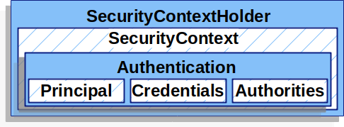


`SecurityContextHolder` 是 Spring Security 存储已认证用户详细信息的地方。Spring Security 并不关心 `SecurityContextHolder` 是如何被填充的。如果它包含值，就会将其用作当前已认证的用户。

指示用户已认证的最简单方法是直接设置 `SecurityContextHolder`：


```java
SecurityContext context = SecurityContextHolder.createEmptyContext();  // (1)
Authentication authentication =
    new TestingAuthenticationToken("username", "password", "ROLE_USER");  // (2)
context.setAuthentication(authentication);
SecurityContextHolder.setContext(context);  // (3)
```

* (1)我们首先创建一个空的 `SecurityContext`。您应该创建一个新的 `SecurityContext` 实例，而不是使用 `SecurityContextHolder.getContext().setAuthentication(authentication)`，以避免多线程间的竞争条件。 
* (2)接下来，我们创建一个新的 `Authentication` 对象。Spring Security 并不关心 `SecurityContext` 上设置的是哪种 `Authentication` 实现。这里，我们使用 `TestingAuthenticationToken`，因为它非常简单。更常见的生产场景是 `UsernamePasswordAuthenticationToken(userDetails, password, authorities)`。
* (3)最后，我们将 `SecurityContext` 设置到 `SecurityContextHolder` 上。Spring Security 使用此信息进行授权。


要获取已认证主体的信息，可以访问 `SecurityContextHolder`：


```java
SecurityContext context = SecurityContextHolder.getContext();
Authentication authentication = context.getAuthentication();
String username = authentication.getName();
Object principal = authentication.getPrincipal();
Collection<? extends GrantedAuthority> authorities = authentication.getAuthorities();
```


默认情况下，`SecurityContextHolder` 使用 `ThreadLocal` 来存储这些细节，这意味着 `SecurityContext` 对于同一线程中的方法始终可用，即使 `SecurityContext` 没有作为参数显式地在这些方法之间传递。如果您注意在当前主体的请求处理完毕后清理线程，以这种方式使用 `ThreadLocal` 是相当安全的。Spring Security 的 `FilterChainProxy` 确保 `SecurityContext` 始终会被清理。

有些应用程序由于其处理线程的特定方式，并不完全适合使用 `ThreadLocal`。例如，Swing 客户端可能希望 Java 虚拟机中的所有线程都使用相同的安全上下文。您可以在启动时为 `SecurityContextHolder` 配置一个策略，以指定您希望如何存储上下文。对于独立应用程序，您可以使用 `SecurityContextHolder.MODE_GLOBAL` 策略。其他应用程序可能希望由安全线程生成的线程也承担相同的安全标识。您可以通过使用 `SecurityContextHolder.MODE_INHERITABLETHREADLOCAL` 来实现这一点。您可以通过两种方式从默认的 `SecurityContextHolder.MODE_THREADLOCAL` 更改模式：第一种是设置系统属性，第二种是调用 `SecurityContextHolder` 上的静态方法。大多数应用程序不需要从默认值更改。


### SecurityContext
`SecurityContext` 从 `SecurityContextHolder` 中获取，它包含一个 `Authentication` 对象。


### Authentication
`Authentication` 接口在 Spring Security 中有两个主要用途：
1. 作为 `AuthenticationManager` 的输入，提供用户为进行认证而提供的凭据。在这种情况下，`isAuthenticated()` 返回 `false`。
2. 表示当前已认证的用户。您可以从 `SecurityContext` 中获取当前的 `Authentication`。

`Authentication` 包含：
- `principal`：标识用户。当使用用户名/密码进行认证时，这通常是 `UserDetails` 的实例。
- `credentials`：通常是密码。在许多情况下，用户认证后会清除此信息，以确保其不会被泄露。
- `authorities`：`GrantedAuthority` 实例是授予用户的高级权限。例如角色和范围。


### GrantedAuthority
`GrantedAuthority` 实例是授予用户的高级权限，例如角色和范围。

您可以从 `Authentication.getAuthorities()` 方法获取 `GrantedAuthority` 实例，该方法提供 `GrantedAuthority` 对象的集合。显然，`GrantedAuthority` 是授予主体的权限。此类权限通常是“角色”，例如 `ROLE_ADMINISTRATOR` 或 `ROLE_HR_SUPERVISOR`。这些角色稍后会配置用于 Web 授权、方法授权和域对象授权。Spring Security 的其他部分会解释这些权限并期望它们存在。当使用基于用户名/密码的认证时，`GrantedAuthority` 实例通常由 `UserDetailsService` 加载。

通常，`GrantedAuthority` 对象是应用程序范围的权限，它们不特定于给定的域对象。因此，您不太可能有一个 `GrantedAuthority` 来表示对编号为 54 的 `Employee` 对象的权限，因为如果有数千个这样的权限，您很快就会耗尽内存（或者至少会导致应用程序在认证用户时花费很长时间）。当然，Spring Security 明确设计用于处理这一常见需求，但您应该使用该项目的域对象安全功能来实现此目的。


### AuthenticationManager
`AuthenticationManager` 是定义 Spring Security 的过滤器如何执行认证的 API。返回的 `Authentication` 随后由调用 `AuthenticationManager` 的控制器（即 Spring Security 的 `Filters` 实例）设置到 `SecurityContextHolder` 上。如果您不与 Spring Security 的 `Filters` 实例集成，您可以直接设置 `SecurityContextHolder`，而不需要使用 `AuthenticationManager`。

虽然 `AuthenticationManager` 的实现可以是任何形式，但最常见的实现是 `ProviderManager`。


### ProviderManager
`ProviderManager` 是 `AuthenticationManager` 最常用的实现。`ProviderManager` 委托给 `AuthenticationProvider` 实例的列表。每个 `AuthenticationProvider` 都有机会表明认证应该成功、失败，或者表明它无法做出决定并允许下游的 `AuthenticationProvider` 来决定。如果配置的 `AuthenticationProvider` 实例都不能进行认证，则认证失败，并抛出 `ProviderNotFoundException`，这是一种特殊的 `AuthenticationException`，表明 `ProviderManager` 未配置为支持传入的 `Authentication` 类型。


在实际应用中，每个 `AuthenticationProvider` 都知道如何执行特定类型的认证。例如，一个 `AuthenticationProvider` 可能能够验证用户名/密码，而另一个可能能够认证 SAML 断言。这使得每个 `AuthenticationProvider` 可以执行非常特定类型的认证，同时支持多种认证类型，并且只暴露一个 `AuthenticationManager` bean。

`ProviderManager` 还允许配置一个可选的父 `AuthenticationManager`，如果没有 `AuthenticationProvider` 能够进行认证，就会咨询该父 `AuthenticationManager`。父级可以是任何类型的 `AuthenticationManager`，但它通常是 `ProviderManager` 的实例。


实际上，多个 `ProviderManager` 实例可能共享同一个父 `AuthenticationManager`。这在存在多个 `SecurityFilterChain` 实例的场景中比较常见，这些实例有一些共同的认证（共享的父 `AuthenticationManager`），但也有不同的认证机制（不同的 `ProviderManager` 实例）。


默认情况下，`ProviderManager` 会尝试从成功认证请求返回的 `Authentication` 对象中清除任何敏感的凭据信息。这可以防止密码等信息在 `HttpSession` 中保留的时间超过必要。

`CredentialsContainer` 接口在认证过程中起着关键作用。它允许在不再需要凭据信息时擦除它们，从而通过确保敏感数据不会保留超过必要的时间来增强安全性。

当您使用用户对象的缓存时（例如，为了提高无状态应用程序的性能），这可能会导致问题。如果 `Authentication` 包含对缓存中对象（例如 `UserDetails` 实例）的引用，并且该对象的凭据被移除，那么就无法再根据缓存的值进行认证了。如果您使用缓存，需要考虑到这一点。一个明显的解决方案是首先复制对象，要么在缓存实现中，要么在创建返回的 `Authentication` 对象的 `AuthenticationProvider` 中。或者，您可以禁用 `ProviderManager` 上的 `eraseCredentialsAfterAuthentication` 属性。请参阅 `ProviderManager` 类的 Javadoc。


### AuthenticationProvider
您可以将多个 `AuthenticationProvider` 实例注入到 `ProviderManager` 中。每个 `AuthenticationProvider` 执行特定类型的认证。例如，`DaoAuthenticationProvider` 支持基于用户名/密码的认证，而 `JwtAuthenticationProvider` 支持认证 JWT 令牌。


### 使用 `AuthenticationEntryPoint` 请求凭据
`AuthenticationEntryPoint` 用于发送一个 HTTP 响应，以从客户端请求凭据。

有时，客户端会主动包含凭据（例如用户名和密码）来请求资源。在这些情况下，Spring Security 不需要提供从客户端请求凭据的 HTTP 响应，因为凭据已经包含在内了。

在其他情况下，客户端对其无权访问的资源发出未认证的请求。在这种情况下，`AuthenticationEntryPoint` 的实现会被用于从客户端请求凭据。`AuthenticationEntryPoint` 实现可能会执行重定向到登录页面、响应 `WWW-Authenticate` 头或采取其他操作。


### AbstractAuthenticationProcessingFilter
`AbstractAuthenticationProcessingFilter` 用作认证用户凭据的基础 `Filter`。在凭据能够被认证之前，Spring Security 通常会使用 `AuthenticationEntryPoint` 来请求凭据。

接下来，`AbstractAuthenticationProcessingFilter` 可以认证提交给它的任何认证请求。

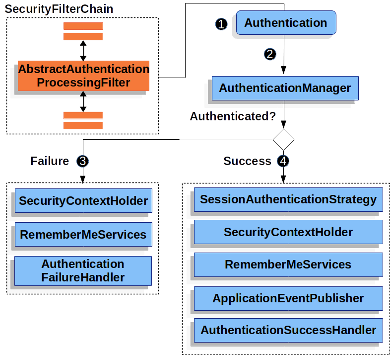


1. 当用户提交其凭据时，`AbstractAuthenticationProcessingFilter` 从 `HttpServletRequest` 创建一个要认证的 `Authentication`。创建的 `Authentication` 类型取决于 `AbstractAuthenticationProcessingFilter` 的子类。例如，`UsernamePasswordAuthenticationFilter` 从 `HttpServletRequest` 中提交的用户名和密码创建一个 `UsernamePasswordAuthenticationToken`。
2. 接下来，`Authentication` 被传递到 `AuthenticationManager` 进行认证。
3. 如果认证失败：
     - `SecurityContextHolder` 被清空。
     - 调用 `RememberMeServices.loginFail`。如果未配置“记住我”功能，这将是一个空操作。请参阅 rememberme 包。
     - 调用 `AuthenticationFailureHandler`。请参阅 `AuthenticationFailureHandler` 接口。
4. 如果认证成功：
     - 通知 `SessionAuthenticationStrategy` 有新的登录。请参阅 `SessionAuthenticationStrategy` 接口。
     - 将 `Authentication` 设置到 `SecurityContextHolder` 上。之后，如果您需要保存 `SecurityContext` 以便在未来的请求中自动设置它，必须显式调用 `SecurityContextRepository#saveContext`。请参阅 `SecurityContextHolderFilter` 类。
     - 调用 `RememberMeServices.loginSuccess`。如果未配置“记住我”功能，这将是一个空操作。请参阅 rememberme 包。
     - `ApplicationEventPublisher` 发布 `InteractiveAuthenticationSuccessEvent`。
     - 调用 `AuthenticationSuccessHandler`。请参阅 `AuthenticationSuccessHandler` 接口。


## 4.3 Spring Security授权架构深度解析

适用于授权的Spring Security架构。

### 权限（Authorities）

认证（Authentication）章节讨论了所有的`Authentication`实现是如何存储`GrantedAuthority`对象列表的。这些对象代表已授予给主体（principal）的权限。`GrantedAuthority`对象由`AuthenticationManager`插入到`Authentication`对象中，随后在做出授权决策时由`AccessDecisionManager`实例读取。

`GrantedAuthority`接口只有一个方法：
```java
String getAuthority();
```

此方法被`AuthorizationManager`实例用来获取`GrantedAuthority`的精确字符串表示。通过以字符串形式返回表示，大多数`AuthorizationManager`实现都能轻松“读取”`GrantedAuthority`。如果`GrantedAuthority`无法精确地表示为字符串，则该`GrantedAuthority`被视为“复杂的”，且`getAuthority()`必须返回`null`。

复杂`GrantedAuthority`的一个示例是存储适用于不同客户账号的操作列表和权限阈值的实现。将这种复杂的`GrantedAuthority`表示为字符串会相当困难。因此，`getAuthority()`方法应返回`null`。这向任何`AuthorizationManager`表明，它需要支持特定的`GrantedAuthority`实现才能理解其内容。

Spring Security包含一个具体的`GrantedAuthority`实现：`SimpleGrantedAuthority`。此实现允许将任何用户指定的字符串转换为`GrantedAuthority`。安全架构中包含的所有`AuthenticationProvider`实例都使用`SimpleGrantedAuthority`来填充`Authentication`对象。

默认情况下，基于角色的授权规则包含`ROLE_`作为前缀。这意味着，如果有一个授权规则要求安全上下文具有“USER”角色，Spring Security默认会查找`GrantedAuthority#getAuthority`返回“ROLE_USER”的权限。

你可以使用`GrantedAuthorityDefaults`自定义此前缀。`GrantedAuthorityDefaults`的存在是为了允许自定义用于基于角色的授权规则的前缀。

你可以通过暴露一个`GrantedAuthorityDefaults` bean来配置授权规则使用不同的前缀，如下所示：

#### 自定义MethodSecurityExpressionHandler


```java
@Bean
static GrantedAuthorityDefaults grantedAuthorityDefaults() {
    return new GrantedAuthorityDefaults("MYPREFIX_");
}
```


你需要使用静态方法暴露`GrantedAuthorityDefaults`，以确保Spring在初始化Spring Security的方法安全`@Configuration`类之前发布它。

### 调用处理（Invocation Handling）
Spring Security提供了拦截器，用于控制对安全对象（如方法调用或Web请求）的访问。`AuthorizationManager`实例会做出调用是否被允许继续的调用前决策，以及关于是否可以返回给定值的调用后决策。

### 授权管理器（AuthorizationManager）

`AuthorizationManager`取代了`AccessDecisionManager`和`AccessDecisionVoter`。

建议自定义`AccessDecisionManager`或`AccessDecisionVoter`的应用程序改为使用`AuthorizationManager`。

`AuthorizationManager`由Spring Security的基于请求、基于方法和基于消息的授权组件调用，负责做出最终的访问控制决策。`AuthorizationManager`接口包含两个方法：

```java
AuthorizationDecision check(Supplier<Authentication> authentication, Object secureObject);

default void verify(Supplier<Authentication> authentication, Object secureObject)
        throws AccessDeniedException {
    // ...
}
```

`AuthorizationManager`的`check`方法会接收做出授权决策所需的所有相关信息。特别是，传递安全对象（secure Object）使得可以检查包含在实际安全对象调用中的那些参数。例如，假设安全对象是`MethodInvocation`。查询`MethodInvocation`以获取任何`Customer`参数会很容易，然后在`AuthorizationManager`中实现某种安全逻辑以确保主体被允许对该客户进行操作。如果允许访问，实现应返回肯定的`AuthorizationDecision`；如果拒绝访问，返回否定的`AuthorizationDecision`；如果放弃做出决策，则返回`null`的`AuthorizationDecision`。

`verify`方法调用`check`，并在出现否定的`AuthorizationDecision`时抛出`AccessDeniedException`。

### 基于委托的AuthorizationManager实现
尽管用户可以实现自己的`AuthorizationManager`来控制授权的所有方面，但Spring Security附带了一个委托`AuthorizationManager`，它可以与各个`AuthorizationManager`协作。

`RequestMatcherDelegatingAuthorizationManager`会将请求与最合适的委托`AuthorizationManager`进行匹配。对于方法安全，你可以使用`AuthorizationManagerBeforeMethodInterceptor`和`AuthorizationManagerAfterMethodInterceptor`。

以下展示了AuthorizationManager的相关实现类：

```
AuthorizationManager
├── RequestMatcherDelegatingAuthorizationManager
├── PreAuthorizeAuthorizationManager
├── Authority AuthorizationManager
├── PostAuthorizeAuthorizationManager
├── AuthenticatedAuthorizationManager
├── SecuredAuthorizationManager
└── Jsr250AuthorizationManager
```


使用这种方法，可以轮询`AuthorizationManager`实现的组合以做出授权决策。

#### AuthorityAuthorizationManager
Spring Security提供的最常见的`AuthorizationManager`是`AuthorityAuthorizationManager`。它配置有一组要在当前`Authentication`上查找的权限。如果`Authentication`包含任何已配置的权限，它将返回肯定的`AuthorizationDecision`。否则，它将返回否定的`AuthorizationDecision`。

#### AuthenticatedAuthorizationManager
另一个管理器是`AuthenticatedAuthorizationManager`。它可用于区分匿名用户、完全认证用户和通过“记住我”功能认证的用户。许多网站允许在“记住我”认证下进行某些有限的访问，但要求用户通过登录来确认其身份以获得完全访问权限。

#### AuthorizationManagers
`AuthorizationManagers`中还有有用的静态工厂，用于将各个`AuthorizationManager`组合成更复杂的表达式。

#### 自定义授权管理器
显然，你也可以实现自定义的`AuthorizationManager`，并且可以在其中放入几乎任何你想要的访问控制逻辑。它可能特定于你的应用程序（与业务逻辑相关），或者可能实现某些安全管理逻辑。例如，你可以创建一个可以查询Open Policy Agent或你自己的授权数据库的实现。


### 适配AccessDecisionManager和AccessDecisionVoters
在`AuthorizationManager`之前，Spring Security提供了`AccessDecisionManager`和`AccessDecisionVoter`。

在某些情况下，例如迁移较旧的应用程序时，可能希望引入一个调用`AccessDecisionManager`或`AccessDecisionVoter`的`AuthorizationManager`。

要调用现有的`AccessDecisionManager`，你可以这样做：


```java
@Component
public class AccessDecisionManagerAuthorizationManagerAdapter implements AuthorizationManager {
    private final AccessDecisionManager accessDecisionManager;
    private final SecurityMetadataSource securityMetadataSource;

    @Override
    public AuthorizationDecision check(Supplier<Authentication> authentication, Object object) {
        try {
            Collection<ConfigAttribute> attributes = this.securityMetadataSource.getAttributes(object);
            this.accessDecisionManager.decide(authentication.get(), object, attributes);
            return new AuthorizationDecision(true);
        } catch (AccessDeniedException ex) {
            return new AuthorizationDecision(false);
        }
    }

    @Override
    public void verify(Supplier<Authentication> authentication, Object object) {
        Collection<ConfigAttribute> attributes = this.securityMetadataSource.getAttributes(object);
        this.accessDecisionManager.decide(authentication.get(), object, attributes);
    }
}
```

然后将其连接到你的`SecurityFilterChain`中。

或者，要仅调用`AccessDecisionVoter`，你可以这样做：


```java
@Component
public class AccessDecisionVoterAuthorizationManagerAdapter implements AuthorizationManager {
    private final AccessDecisionVoter accessDecisionVoter;
    private final SecurityMetadataSource securityMetadataSource;

    @Override
    public AuthorizationDecision check(Supplier<Authentication> authentication, Object object) {
        Collection<ConfigAttribute> attributes = this.securityMetadataSource.getAttributes(object);
        int decision = this.accessDecisionVoter.vote(authentication.get(), object, attributes);
        switch (decision) {
        case ACCESS_GRANTED:
            return new AuthorizationDecision(true);
        case ACCESS_DENIED:
            return new AuthorizationDecision(false);
        }
        return null;
    }
}
```

然后将其连接到你的`SecurityFilterChain`中。

### 角色层次结构（Hierarchical Roles）
应用程序中的特定角色应自动“包含”其他角色是一个常见需求。例如，在一个具有“admin”（管理员）和“user”（用户）角色概念的应用程序中，你可能希望管理员能够执行普通用户可以执行的所有操作。要实现这一点，你可以确保所有管理员用户也被分配“user”角色。或者，你可以修改每个需要“user”角色的访问约束，使其也包含“admin”角色。如果你的应用程序中有很多不同的角色，这可能会变得相当复杂。

使用角色层次结构允许你配置哪些角色（或权限）应包含其他角色。这在基于过滤器的授权中通过`HttpSecurity#authorizeHttpRequests`支持，在基于方法的授权中通过用于pre-post注解的`DefaultMethodSecurityExpressionHandler`、用于`@Secured`的`SecuredAuthorizationManager`以及用于JSR-250注解的`Jsr250AuthorizationManager`支持。你可以通过以下方式一次性配置所有这些的行为：

#### 角色层次结构配置

```java
@Bean
static RoleHierarchy roleHierarchy() {
    return RoleHierarchyImpl.withDefaultRolePrefix()
        .role("ADMIN").implies("STAFF")
        .role("STAFF").implies("USER")
        .role("USER").implies("GUEST")
        .build();
}

// 并且，如果使用pre-post方法安全，还需添加

@Bean
static MethodSecurityExpressionHandler methodSecurityExpressionHandler(RoleHierarchy roleHierarchy) {
    DefaultMethodSecurityExpressionHandler expressionHandler = new DefaultMethodSecurityExpressionHandler();
    expressionHandler.setRoleHierarchy(roleHierarchy);
    return expressionHandler;
}
```


这里我们有四个角色处于`ROLE_ADMIN ⇒ ROLE_STAFF ⇒ ROLE_USER ⇒ ROLE_GUEST`的层次结构中。当针对任何基于过滤器或方法的规则评估安全约束时，使用`ROLE_ADMIN`认证的用户将表现得好像他们拥有所有四个角色一样。`⇒`符号可以被理解为“包含”的意思。

角色层次结构提供了一种方便的方式来简化应用程序的访问控制配置数据和/或减少需要分配给用户的权限数量。对于更复杂的需求，你可能希望在应用程序所需的特定访问权限与分配给用户的角色之间定义逻辑映射，并在加载用户信息时在两者之间进行转换。


## 4.4 深入理解Spring Security的配置

通过一些示例应用程序来演示Spring Security配置的使用，以便更好的理解配置的使用原理。

### 入门级Web安全配置

第一步是创建我们的Spring Security配置。该配置会创建一个名为`springSecurityFilterChain`的Servlet过滤器，它负责应用程序内的所有安全工作（保护应用程序URL、验证提交的用户名和密码、重定向到登录表单等）。以下示例展示了Spring Security配置的最基本示例：

```java
import org.springframework.beans.factory.annotation.Autowired;
import org.springframework.context.annotation.*;
import org.springframework.security.config.annotation.authentication.builders.*;
import org.springframework.security.config.annotation.web.configuration.*;

@Configuration
@EnableWebSecurity
public class WebSecurityConfig {

    @Bean
    public UserDetailsService userDetailsService() {
        InMemoryUserDetailsManager manager = new InMemoryUserDetailsManager();
        manager.createUser(User.withDefaultPasswordEncoder().username("user").password("password").roles("USER").build());
        return manager;
    }
}
```

这个配置并不复杂或详尽，但它能完成很多工作：
- 要求对应用程序中的每个URL进行身份验证
- 为你生成登录表单
- 允许用户名为`user`、密码为`password`的用户通过基于表单的身份验证进行认证
- 允许用户注销
- 防止CSRF攻击
- 防止会话固定攻击
- 安全头集成：
    - 用于安全请求的HTTP严格传输安全
    - X-Content-Type-Options集成
    - 缓存控制（稍后可在应用程序中覆盖以允许缓存静态资源）
    - X-XSS-Protection集成
    - X-Frame-Options集成以帮助防止点击劫持
- 与以下Servlet API方法集成：
    - `HttpServletRequest#getRemoteUser()`
    - `HttpServletRequest#getUserPrincipal()`
    - `HttpServletRequest#isUserInRole(java.lang.String)`
    - `HttpServletRequest#login(java.lang.String, java.lang.String)`
    - `HttpServletRequest#logout()`


### AbstractSecurityWebApplicationInitializer

下一步是将`springSecurityFilterChain`注册到WAR文件中。在Servlet 3.0+环境中，可以借助Spring的`WebApplicationInitializer`支持通过Java配置来完成。毫不奇怪，Spring Security提供了一个基类（`AbstractSecurityWebApplicationInitializer`），以确保`springSecurityFilterChain`被自动注册。我们使用`AbstractSecurityWebApplicationInitializer`的方式取决于我们是否已经在使用Spring，或者Spring Security是否是应用程序中唯一的Spring组件。


#### 结合Spring MVC使用AbstractSecurityWebApplicationInitializer

如果我们在应用程序的其他地方使用Spring，可能已经有一个`WebApplicationInitializer`在加载我们的Spring配置。如果使用前面的配置，会出现错误。相反，我们应该将Spring Security注册到现有的`ApplicationContext`中。例如，如果我们使用Spring MVC，我们的`SecurityWebApplicationInitializer`可能如下所示：

```java
import org.springframework.security.web.context.*;
public class SecurityWebApplicationInitializer
        extends AbstractSecurityWebApplicationInitializer {

}
```

这只会为应用程序中的每个URL注册`springSecurityFilterChain`。之后，我们需要确保`WebSecurityConfig`在我们现有的`ApplicationInitializer`中被加载。例如，如果我们使用Spring MVC，它会被添加到`getServletConfigClasses()`中：

```java
public class MvcWebApplicationInitializer extends
        AbstractAnnotationConfigDispatcherServletInitializer {

    @Override
    protected Class<?>[] getServletConfigClasses() {
        return new Class[] { WebSecurityConfig.class, WebMvcConfig.class };
    }

    // ... 其他重写方法 ...

}
```

原因是Spring Security需要能够检查一些Spring MVC配置，以便适当地配置底层请求匹配器，因此它们需要位于同一个应用程序上下文中。将Spring Security放在`getRootConfigClasses`中会将其放入父应用程序上下文，而父应用程序上下文可能无法找到Spring MVC的`HandlerMappingIntrospector`。


#### 为多个Spring MVC调度器配置

如果需要，可以将任何与Spring MVC无关的Spring Security配置放在不同的配置类中，如下所示：

```java
public class MvcWebApplicationInitializer extends
        AbstractAnnotationConfigDispatcherServletInitializer {

    @Override
    protected Class<?>[] getRootConfigClasses() {
        return new Class[] { NonWebSecurityConfig.class };
    }

    @Override
    protected Class<?>[] getServletConfigClasses() {
        return new Class[] { WebSecurityConfig.class, WebMvcConfig.class };
    }

    // ... 其他重写方法 ...

}
```

如果你有多个`AbstractAnnotationConfigDispatcherServletInitializer`实例，并且不想在两个实例中重复通用的安全配置，这会很有帮助。


### HttpSecurity

到目前为止，我们的`WebSecurityConfig`只包含关于如何认证用户的信息。Spring Security如何知道我们要求所有用户都进行认证？Spring Security如何知道我们想要支持基于表单的认证？实际上，有一个名为`SecurityFilterChain`的配置类在幕后被调用。它使用以下默认实现进行配置：

```java
@Bean
public SecurityFilterChain filterChain(HttpSecurity http) throws Exception {
    http
        .authorizeHttpRequests(authorize -> authorize
            .anyRequest().authenticated()
        )
        .formLogin(Customizer.withDefaults())
        .httpBasic(Customizer.withDefaults());
    return http.build();
}
```

默认配置（如前面的示例所示）：
- 确保对我们应用程序的任何请求都要求用户进行认证
- 允许用户通过基于表单的登录进行认证
- 允许用户通过HTTP基本认证进行认证


### 多个HttpSecurity实例

为了有效地管理应用程序中的安全性（其中某些区域需要不同的保护），我们可以采用多个过滤器链以及`securityMatcher` DSL方法。这种方法允许我们为应用程序的特定部分定义不同的安全配置，增强整体应用程序的安全性和控制性。

我们可以配置多个`HttpSecurity`实例，就像在XML中可以有多个`<http>`块一样。关键是注册多个`SecurityFilterChain` `@Bean`。以下示例对以`/api/`开头的URL有不同的配置：

```java
@Configuration
@EnableWebSecurity
public class MultiHttpSecurityConfig {
    @Bean                                                              // (1)
    public UserDetailsService userDetailsService() throws Exception {
        UserBuilder users = User.withDefaultPasswordEncoder();
        InMemoryUserDetailsManager manager = new InMemoryUserDetailsManager();
        manager.createUser(users.username("user").password("password").roles("USER").build());
        manager.createUser(users.username("admin").password("password").roles("USER","ADMIN").build());
        return manager;
    }

    @Bean
    @Order(1)                                                         // (2)
    public SecurityFilterChain apiFilterChain(HttpSecurity http) throws Exception {
        http
            .securityMatcher("/api/**")                               // (3)
            .authorizeHttpRequests(authorize -> authorize
                .anyRequest().hasRole("ADMIN")
            )
            .httpBasic(Customizer.withDefaults());
        return http.build();
    }

    @Bean                                                             // (4)
    public SecurityFilterChain formLoginFilterChain(HttpSecurity http) throws Exception {
        http
            .authorizeHttpRequests(authorize -> authorize
                .anyRequest().authenticated()
            )
            .formLogin(Customizer.withDefaults());
        return http.build();
    }
}
```


* (1)像往常一样配置认证。
* (2)创建一个`SecurityFilterChain`实例，其中包含`@Order`以指定应首先考虑哪个`SecurityFilterChain`。 
* (3) `http.securityMatcher()`表示此`HttpSecurity`仅适用于以`/api/`开头的URL。
* (4)创建另一个`SecurityFilterChain`实例。如果URL不是以`/api/`开头，则使用此配置。由于此配置的`@Order`值在1之后（没有`@Order`默认为最后），因此它会在`apiFilterChain`之后被考虑。 


### 选择`securityMatcher`还是`requestMatchers`

一个常见的问题是：`http.securityMatcher()`方法与用于请求授权的`requestMatchers()`（即在`http.authorizeHttpRequests()`内部）有什么区别？

要回答这个问题，有助于理解的是，每个用于构建`SecurityFilterChain`的`HttpSecurity`实例都包含一个`RequestMatcher`来匹配传入的请求。如果一个请求与具有更高优先级的`SecurityFilterChain`（例如`@Order(1)`）不匹配，则可以尝试与具有更低优先级的过滤器链（例如没有`@Order`）进行匹配。

多个过滤器链的匹配逻辑由`FilterChainProxy`执行。

默认的`RequestMatcher`匹配任何请求，以确保Spring Security默认保护所有请求。

指定`securityMatcher`会覆盖此默认值。

如果没有过滤器链匹配特定请求，则该请求不受Spring Security保护。

以下示例演示了一个仅保护以`/secured/`开头的请求的单个过滤器链：

```java
@Configuration
@EnableWebSecurity
public class PartialSecurityConfig {

    @Bean
    public UserDetailsService userDetailsService() throws Exception {
        // ...
    }

    @Bean
    public SecurityFilterChain securedFilterChain(HttpSecurity http) throws Exception {
        http
            .securityMatcher("/secured/**")                           // (1)
            .authorizeHttpRequests(authorize -> authorize
                .requestMatchers("/secured/user").hasRole("USER")     // (2)
                .requestMatchers("/secured/admin").hasRole("ADMIN")   // (3)
                .anyRequest().authenticated()                         // (4)
            )
            .httpBasic(Customizer.withDefaults())
            .formLogin(Customizer.withDefaults());
        return http.build();
    }
}
```


* (1)以`/secured/`开头的请求将受到保护，但任何其他请求都不受保护。
* (2)对`/secured/user`的请求需要`ROLE_USER`权限。
* (3)对`/secured/admin`的请求需要`ROLE_ADMIN`权限。
* (4)任何其他请求（例如`/secured/other`）只需要一个已认证的用户。


建议提供一个不指定任何`securityMatcher`的`SecurityFilterChain`，以确保整个应用程序都受到保护，如前面的示例所示。

请注意，`requestMatchers`方法仅适用于单个授权规则。其中列出的每个请求还必须与用于创建`SecurityFilterChain`的这个特定`HttpSecurity`实例的整体`securityMatcher`匹配。在此示例中使用`anyRequest()`匹配此特定`SecurityFilterChain`中的所有其他请求（必须以`/secured/`开头）。

有关`requestMatchers`的更多信息，请参见[Authorize HttpServletRequests](https://docs.spring.io/spring-security/reference/servlet/authorization/authorize-http-requests.html)。


### `SecurityFilterChain`端点

`SecurityFilterChain`中的几个过滤器直接提供端点，例如由`http.formLogin()`设置的`UsernamePasswordAuthenticationFilter`提供`POST /login`端点。在上面的示例中，`/login`端点与`http.securityMatcher("/secured/**")`不匹配，因此该应用程序不会有任何`GET /login`或`POST /login`端点。此类请求将返回`404 Not Found`。这通常会让用户感到惊讶。

指定`http.securityMatcher()`会影响该`SecurityFilterChain`匹配的请求。但是，它不会自动影响过滤器链提供的端点。在这种情况下，你可能需要自定义你希望过滤器链提供的任何端点的URL。

以下示例演示了一个配置，该配置保护以`/secured/`开头的请求并拒绝所有其他请求，同时还自定义`SecurityFilterChain`提供的端点：

```java
@Configuration
@EnableWebSecurity
public class SecuredSecurityConfig {

    @Bean
    public UserDetailsService userDetailsService() throws Exception {
        // ...
    }

    @Bean
    @Order(1)
    public SecurityFilterChain securedFilterChain(HttpSecurity http) throws Exception {
        http
            .securityMatcher("/secured/**")                           // (1)
            .authorizeHttpRequests(authorize -> authorize
                .anyRequest().authenticated()                         // (2)
            )
            .formLogin(formLogin -> formLogin                         // (3)
                .loginPage("/secured/login")
                .loginProcessingUrl("/secured/login")
                .permitAll()
            )
            .logout(logout -> logout                                  // (4)
                .logoutUrl("/secured/logout")
                .logoutSuccessUrl("/secured/login?logout")
                .permitAll()
            )
            .formLogin(Customizer.withDefaults());
        return http.build();
    }

    @Bean
    public SecurityFilterChain defaultFilterChain(HttpSecurity http) throws Exception {
        http
            .authorizeHttpRequests(authorize -> authorize
                .anyRequest().denyAll()                               // (5)
            );
        return http.build();
    }
}
```


* (1)以`/secured/`开头的请求将受到此过滤器链的保护。 
* (2)以`/secured/`开头的请求需要一个已认证的用户。 
* (3)自定义表单登录，为URL添加`/secured/`前缀。 
* (4)自定义注销，为URL添加`/secured/`前缀。 
* (5)所有其他请求都将被拒绝。 


此示例自定义了登录和注销页面，这会禁用Spring Security生成的页面。你必须为`GET /secured/login`和`GET /secured/logout`提供自己的自定义端点。请注意，Spring Security仍然为你提供`POST /secured/login`和`POST /secured/logout`端点。


### 实际示例

以下示例演示了一个更贴近实际的配置，将所有这些元素组合在一起：

```java
@Configuration
@EnableWebSecurity
public class BankingSecurityConfig {

    @Bean                                                               // (1)
    public UserDetailsService userDetailsService() {
        UserBuilder users = User.withDefaultPasswordEncoder();
        InMemoryUserDetailsManager manager = new InMemoryUserDetailsManager();
        manager.createUser(users.username("user1").password("password").roles("USER", "VIEW_BALANCE").build());
        manager.createUser(users.username("user2").password("password").roles("USER").build());
        manager.createUser(users.username("admin").password("password").roles("ADMIN").build());
        return manager;
    }

    @Bean
    @Order(1)                                                          // (2)
    public SecurityFilterChain approvalsSecurityFilterChain(HttpSecurity http) throws Exception {
        String[] approvalsPaths = { "/accounts/approvals/**", "/loans/approvals/**", "/credit-cards/approvals/**" };
        http
            .securityMatcher(approvalsPaths)
            .authorizeHttpRequests(authorize -> authorize
                .anyRequest().hasRole("ADMIN")
            )
            .httpBasic(Customizer.withDefaults());
        return http.build();
    }

    @Bean
    @Order(2)                                                          // (3)
    public SecurityFilterChain bankingSecurityFilterChain(HttpSecurity http) throws Exception {
        String[] bankingPaths = { "/accounts/**", "/loans/**", "/credit-cards/**", "/balances/**" };
        String[] viewBalancePaths = { "/balances/**" };
        http
            .securityMatcher(bankingPaths)
            .authorizeHttpRequests(authorize -> authorize
                .requestMatchers(viewBalancePaths).hasRole("VIEW_BALANCE")
                .anyRequest().hasRole("USER")
            );
        return http.build();
    }

    @Bean                                                              // (4)
    public SecurityFilterChain defaultSecurityFilterChain(HttpSecurity http) throws Exception {
        String[] allowedPaths = { "/", "/user-login", "/user-logout", "/notices", "/contact", "/register" };
        http
            .authorizeHttpRequests(authorize -> authorize
                .requestMatchers(allowedPaths).permitAll()
                .anyRequest().authenticated()
            )
            .formLogin(formLogin -> formLogin
                .loginPage("/user-login")
                .loginProcessingUrl("/user-login")
            )
            .logout(logout -> logout
                .logoutUrl("/user-logout")
                .logoutSuccessUrl("/?logout")
            );
        return http.build();
    }
}
```


* (1)首先配置认证设置。 
* (2)定义一个带有`@Order(1)`的`SecurityFilterChain`实例，这意味着该过滤器链将具有最高优先级。此过滤器链仅适用于以`/accounts/approvals/`、`/loans/approvals/`或`/credit-cards/approvals/`开头的请求。对此过滤器链的请求需要`ROLE_ADMIN`权限，并允许HTTP基本认证。


## 5.1 开箱即用，极简化Spring Security安全配置

我们在 `spring-data-jpa-h2` 项目的基础上复制出一个新项目`c`，来实现 Spring Security 功能。


### 如何使用 Spring Security

在 `pom.xml` 中添加必要的依赖，包括Spring Security等：


```xml
<dependencyManagement>
	<dependencies>
		<dependency>
			<groupId>org.springframework.security</groupId>
			<artifactId>spring-security-bom</artifactId>
			<version>6.5.2</version>
			<type>pom</type>
			<scope>import</scope>
		</dependency>

    <!-- ...为节约篇幅，此处省略非核心内容 -->
	</dependencies>
</dependencyManagement>

<dependencies>
    <!-- Spring Security -->
    <dependency>
        <groupId>org.springframework.security</groupId>
        <artifactId>spring-security-web</artifactId>
    </dependency>
    <dependency>
        <groupId>org.springframework.security</groupId>
        <artifactId>spring-security-config</artifactId>
    </dependency>

    <!-- ...为节约篇幅，此处省略非核心内容 -->
</dependencies>
```

### 创建安全配置类


```java
package com.example.spring.mvc.config;

import org.springframework.context.annotation.Bean;
import org.springframework.context.annotation.Configuration;
import org.springframework.security.config.Customizer;
import org.springframework.security.config.annotation.web.builders.HttpSecurity;
import org.springframework.security.config.annotation.web.configuration.EnableWebSecurity;
import org.springframework.security.core.userdetails.User;
import org.springframework.security.core.userdetails.UserDetailsService;
import org.springframework.security.provisioning.InMemoryUserDetailsManager;
import org.springframework.security.web.SecurityFilterChain;

/**
 * WebSecurityConfig 安全配置
 *
 * @version 2025/08/14
 **/
@Configuration
// 启用Spring Security安全配置功能
@EnableWebSecurity
public class WebSecurityConfig {
    // 在内存中存储认证用户信息
    @Bean
    public UserDetailsService userDetailsService() {
        // 初始化2个认证用户信息，分别代表两个角色
        User.UserBuilder users = User.builder();
        InMemoryUserDetailsManager manager = new InMemoryUserDetailsManager();
        manager.createUser(users.username("user").password("{noop}123456").roles("USER").build());
        manager.createUser(users.username("admin").password("{noop}admin123").roles("ADMIN").build());

        return manager;
    }

    // 配置安全过滤器链
    @Bean
    public SecurityFilterChain securityFilterChain(HttpSecurity http) throws Exception {
        http
                .authorizeHttpRequests(authorize -> authorize
                        // 允许访问登录界面和静态资源
                        .requestMatchers("/login", "/css/**", "/js/**", "/fonts/**", "/images/**").permitAll()
                        // 允许USER和ADMIN角色访问
                        .requestMatchers("/admin", "/admin/dashborad").hasAnyRole("USER", "ADMIN")
                        // 允许ADMIN角色访问
                        .requestMatchers("/admin/user").hasRole("ADMIN")
                        // 其他请求需要认证
                        .anyRequest().authenticated()
                )
                .httpBasic(Customizer.withDefaults())
                .formLogin(Customizer.withDefaults());

        return http.build();
    }
}
```

其中密码加了`{noop}`前缀表明密码是以明文方式存储。

### WebInitializer启动器注册springSecurityFilterChain


修改WebInitializer启动器注册springSecurityFilterChain：


```java
import jakarta.servlet.FilterRegistration;
import jakarta.servlet.ServletRegistration;
import org.springframework.web.filter.DelegatingFilterProxy;

// ...为节约篇幅，此处省略非核心内容

/**
 * WebInitializer Web应用初始化
 *
 * @version 2025/08/11
 **/
public class WebInitializer implements WebApplicationInitializer {
    @Override
    public void onStartup(ServletContext servletContext) throws ServletException {
        // ...为节约篇幅，此处省略非核心内容

        // 增加springSecurityFilterChain
        FilterRegistration.Dynamic springSecurityFilterChain =
                servletContext.addFilter("springSecurityFilterChain", new DelegatingFilterProxy("springSecurityFilterChain"));
        springSecurityFilterChain.addMappingForUrlPatterns(null, false, "/*");
    }
}
```


### 运行查看效果

启动项目，浏览器访问  <http://localhost:8080/admin> 可以看到项目会重定向到登录界面，界面效果如下图5-1所示。


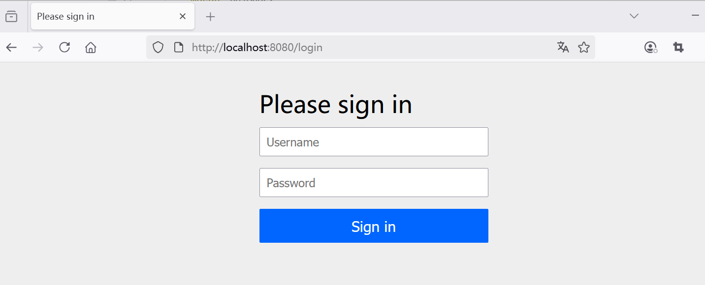


先尝试使用角色为USER的账号user进行登录，可以看到能否正常访问数据看板功能页面，界面效果如下图5-2所示。


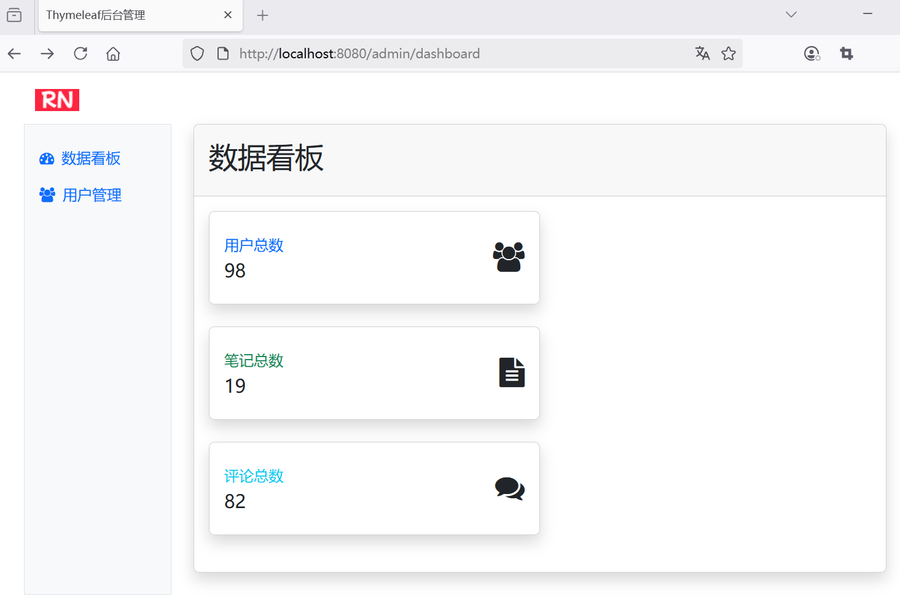

但如果试图访问用户管理功能页面，则会提示“Forbidden”。意味着没有权限，界面效果如下图5-3所示。


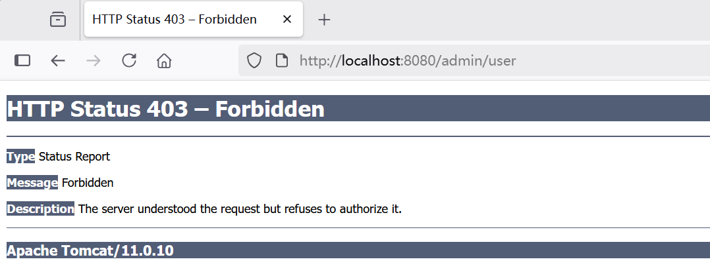


关闭浏览器，尝试使用角色为ADMIN的账号admin进行登录，可以看到能否正常访问用户管理功能页面，界面效果如下图5-4所示。


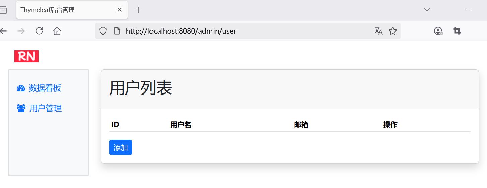

证明安全认证和授权功能已经起效了。


## 5.2 持续优化，构建更富人性化的安全防护体系

上一节，基本上已经实现了Spring Security安全配置，能够对访问资源进行了安全拦截和授权校验。

接下来优化以下内容：

* 自定义登录界面
* 如果没有权限，则提示的信息更加友好；
* 为了方便切换用户，提供注销的功能。


### 自定义登录界面


在`src/main/webapp/WEB-INF/templates`目录下新建登录界面login-form.html：


```html
<!DOCTYPE html>
<html lang="en" xmlns:th="http://www.thymeleaf.org">

<head>
    <meta charset="UTF-8">
    <meta name="viewport" content="width=device-width, initial-scale=1.0">
    <title>登录</title>
    <!-- 引入 Bootstrap CSS -->
    <link href="https://cdn.jsdelivr.net/npm/bootstrap@5.3.6/dist/css/bootstrap.min.css"
          th:href="@{/css/bootstrap.min.css}" rel="stylesheet">
    <!-- 引入 Font Awesome -->
    <link href="https://cdn.jsdelivr.net/npm/font-awesome@4.7.0/css/font-awesome.min.css"
          th:href="@{/css/font-awesome.min.css}" rel="stylesheet">
</head>
<body>
<div class="container">
    <!-- Logo -->
    

    <!-- 表单标题 -->
    <h2>欢迎登录</h2>

    <!-- 登录表单 -->
    <form action="/login" th:action="@{/login}" method="post">
        <!-- 用户名 -->
        <div class="mb-3">
            <input type="text" class="form-control" name="username" placeholder="请输入用户名" required>
        </div>

        <!-- 密码 -->
        <div class="mb-3">
            <input type="password" class="form-control" name="password" placeholder="请输入密码" required>
        </div>

        <!-- 登录按钮 -->
        <button class="btn btn-primary" type="submit">登录</button>
    </form>
</div>
<!-- Bootstrap JS -->
<script src="https://cdn.jsdelivr.net/npm/bootstrap@5.3.6/dist/js/bootstrap.bundle.min.js"
        th:src="@{/js/bootstrap.bundle.min.js}"></script>

</body>

</html>
```

登录请求接口`/login`是由Spring Security提供的。

### 登录控制器实现

新增LoginController，用于显示登录表单：

```java
package com.example.spring.mvc.controller;

import org.springframework.stereotype.Controller;
import org.springframework.web.bind.annotation.*;

/**
 * LoginController 登录控制器
 *
 * @version 2025/08/13
 **/
@Controller
@RequestMapping("/login")
public class LoginController {
    /**
     * 显示登录表单
     */
    @GetMapping
    public String showLoginForm() {
        return "login-form";
    }

}
```


### 设置登录界面及重定向界面


```java
@Bean
public SecurityFilterChain securityFilterChain(HttpSecurity http) throws Exception {
    http
            // ...为节约篇幅，此处省略非核心内容

            /*.formLogin(withDefaults())*/
            .formLogin(form -> form
                    // 登录表单的页面
                    .loginPage("/login")
                    // 自定义执行登录的地址
                    .loginProcessingUrl("/login")
                    // 登录成功后跳转的页面
                    .defaultSuccessUrl("/admin")
                    .permitAll());
    return http.build();
}
```

自定义登录界面效果如下图所示。


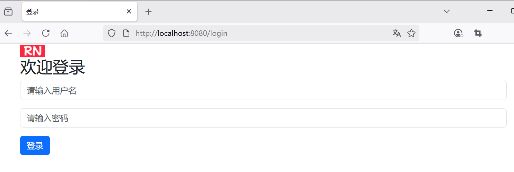

登录成功之后，会重定向到`/admin`路径。


### 错误页面实现

下面是一个403错误页面。这个页面会在用户访问受保护资源而权限不足时显示，提供友好的提示和操作按钮。


403-error.html页面放置在`src/main/webapp/WEB-INF/templates`目录下，内容如下：


```html
<!DOCTYPE html>
<html lang="en" xmlns:th="http://www.thymeleaf.org">

<head>
    <meta charset="UTF-8">
    <meta name="viewport" content="width=device-width, initial-scale=1.0">
    <title>权限不足</title>
    <!-- 引入 Bootstrap CSS -->
    <link href="https://cdn.jsdelivr.net/npm/bootstrap@5.3.6/dist/css/bootstrap.min.css"
          th:href="@{/css/bootstrap.min.css}" rel="stylesheet">
    <!-- 引入 Font Awesome -->
    <link href="https://cdn.jsdelivr.net/npm/font-awesome@4.7.0/css/font-awesome.min.css"
          th:href="@{/css/font-awesome.min.css}" rel="stylesheet">
</head>
<body>
<div class="container">
    <!-- 错误图片 -->
    <div>
        <i class="fa fa-lock fa-5x text-danger"></i>
    </div>

    <!-- 错误标题 -->
    <h2>访问受限</h2>

    <!-- 错误信息 -->
    <p>
        你没有权限访问该页面。<br>
        请检查你的权限或者联系管理员。
    </p>

    <!-- 前往登录的链接 -->
    <div>
        <a href="/login" th:ref="@{/login}">前往登录</a>
    </div>
</div>
<!-- Bootstrap JS -->
<script src="https://cdn.jsdelivr.net/npm/bootstrap@5.3.6/dist/js/bootstrap.bundle.min.js"
        th:src="@{/js/bootstrap.bundle.min.js}"></script>

</body>

</html>
```


### 403错误页面集成到 Spring Security

要将此403错误页面集成到 Spring Security 中，需要在安全配置中添加以下内容：

```java
@Bean
public SecurityFilterChain securityFilterChain(HttpSecurity http) throws Exception {
    http

            // ...为节约篇幅，此处省略非核心内容

            // 异常处理
            .exceptionHandling(exception -> exception
                    // 指定403错误页面
                    .accessDeniedPage("/403")
            )
    ;
    return http.build();
}
```

### 错误控制器来处理 403 错误请求

同时，需要添加一个错误控制器来处理 `/403` 请求：

```java
package com.example.spring.mvc.controller;

import org.springframework.stereotype.Controller;
import org.springframework.web.bind.annotation.GetMapping;
import org.springframework.web.bind.annotation.RequestMapping;

/**
 * ErrorController 错误控制器
 *
 * @version 2025/08/13
 **/
@Controller
@RequestMapping("/403")
public class ErrorController {

    @GetMapping
    public String accessDenied() {
        // 返回403错误页面
        return "403-error";
    }
}
```

这样，当用户访问受保护资源而权限不足时，就会显示这个精心设计的403错误页面，如下图5-6所示。


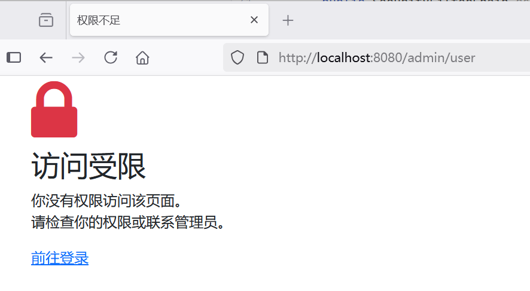


### 为了方便切换用户，提供注销的功能


### 配置`SecurityFilterChain`


修改SecurityConfig，增加退出登录相关配置：

```java
@Bean
public SecurityFilterChain securityFilterChain(HttpSecurity http) throws Exception {
    http

          // ...为节约篇幅，此处省略非核心内容

          // 注销  
          .logout(logout -> logout
                        // 清除会话
                        .invalidateHttpSession(true)
                        // 清除认证信息
                        .clearAuthentication(true)
                        // 用户访问此URL时，交由Spring Security自动处理退出逻辑
                        .logoutUrl("/logout")
                        // 注销成功后跳转的URL
                        .logoutSuccessUrl("/login")
                        // 删除会话Cookie
                        .deleteCookies("JSESSIONID")
                )
        ;

    return http.build();
}
```

关键配置说明：

- `invalidateHttpSession(true)`：清除会话。
- `clearAuthentication("/logout")`：清除认证信息。
- `logoutUrl("/logout")`：指定触发退出登录的URL。用户访问此URL时，Spring Security会自动处理退出逻辑。
- `logoutSuccessUrl("/login")`：退出成功后重定向的URL。
- `deleteCookies("JSESSIONID")`：删除客户端Cookie中的会话ID。`JSESSIONID`是Tomcat默认的会话Cookie名称，根据实际使用的服务器可能不同。


### 创建退出登录的链接

修改admin.html页面，添加一个退出登录的按钮：

```html
<header class="navbar navbar-expand-lg">
    <div class="container">
        <!--...为节约篇幅，此处省略非核心内容-->

        <!--注销-->
        <form action="/logout" th:action="@{/logout}" method="post">
            <button class="btn btn-light" type="submit">退出登录</button>
        </form>

        <!--...为节约篇幅，此处省略非核心内容-->
    </div>
</header>
```

退出登录的按钮效果如下图5-7所示。

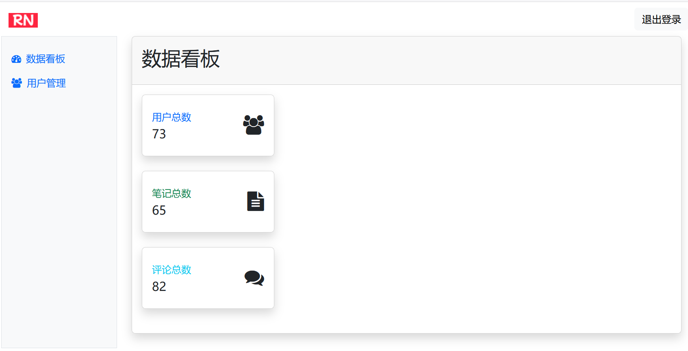


成功注销之后，会重定向到登录界面，效果如下图5-8所示。

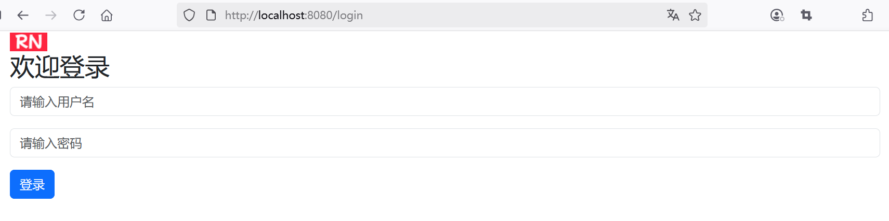


## 6.1 课程总结

* 理解什么是角色权限设计？为什么需要角色权限设计？
* 介绍Spring Security基础，包括核心原理、安全防护。
* 介绍Spring Security进阶，包括高层架构、认证架构、授权架构以及配置。
* 通过实战案例，来理解基于Spring Security如何来构建全栈后端安全架构体系。
