> 本页为原「Java 课程 7」全部 7 个分节的合订本；原分节链接会自动跳转到本页。


## 1.1 单体项目下的全栈工程师如何考虑前端样式？

在单体项目（Monolithic Application）中，全栈工程师需要兼顾前后端开发，前端样式的选择需平衡开发效率、维护成本、响应式支持及团队技术栈。以下是关于前端样式设计的考量及选择 Bootstrap 的原因分析：


### 单体项目下前端样式的核心考量
1. 开发效率优先  
   - 单体项目通常迭代快，需快速验证业务逻辑，前端样式应尽量减少重复劳动。
   - 避免从零编写CSS，优先选择成熟的UI框架或工具库。

2. 响应式与跨设备兼容  
   - 项目需适配不同屏幕（PC/平板/手机），响应式设计是基础需求。
   - 需处理浏览器兼容性问题（如旧版IE、移动端触控等）。

3. 一致性维护  
   - 避免样式碎片化，确保按钮、表单、布局等组件风格统一。
   - 全栈工程师可能同时负责前后端，需降低样式管理的认知负担。

4. 与后端集成  
   - 单体项目中前后端耦合度较高，样式需与后端渲染逻辑（如模板引擎）兼容。
   - 例如，Bootstrap的栅格系统可与后端动态生成的HTML无缝结合。

5. 长期维护成本  
   - 选择有活跃社区支持的框架，避免未来升级困难或技术债务。


### 为何选择 Bootstrap？
1. 开箱即用的响应式设计  
   - Bootstrap 提供基于 12列栅格系统 的布局方案，通过简单的类名（如 `container`, `row`, `col-md-6`）快速构建响应式页面。
   - 示例：
     ```html
     <div class="container">
       <div class="row">
         <div class="col-md-6">左侧内容</div>
         <div class="col-md-6">右侧内容</div>
       </div>
     </div>
     ```

2. 丰富的预定义组件  
   - 包含按钮、表单、导航栏、卡片等常用组件，直接通过类名调用，减少自定义CSS。
   - 示例：
     ```html
     <button class="btn btn-primary">主要按钮</button>
     <nav class="navbar navbar-dark bg-dark">...</nav>
     ```

3. 低学习成本  
   - 文档完善，类名语义化强，全栈工程师可快速上手，无需深入CSS细节。
   - 与后端模板（如Thymeleaf）结合时，直接嵌入HTML片段即可。

4. 浏览器兼容性  
   - 支持主流浏览器（包括IE10+），减少兼容性问题。

5. 定制化能力  
   - 通过 Sass变量覆盖 或 CSS覆盖 调整主题色、间距等，适应项目需求。
   - 示例（修改主题色）：
     ```scss
     // 覆盖Bootstrap变量
     $primary: #ff5722;
     @import "bootstrap/scss/bootstrap";
     ```

6. 生态与扩展性  
   - 插件丰富（如数据表格、日期选择器），可通过jQuery或纯JS扩展功能。
   - 与React/Vue等框架的集成方案成熟（如 `react-bootstrap`、`bootstrap-vue`）。


### 总结
在单体项目中，Bootstrap 是全栈工程师的“安全选择”：  
- 快速启动：通过预定义组件和栅格系统缩短开发周期。  
- 降低风险：成熟的社区和兼容性保障减少技术债务。  
- 平衡效率与控制：在保持开发速度的同时，提供足够的定制空间。  

若项目未来可能扩展为微前端或需要更独特的设计，可逐步引入更灵活的方案（如Tailwind或设计系统）。但对于大多数单体应用，Bootstrap仍是兼顾效率与可靠性的优选。


## 2.1 快速掌握Bootstrap核心概念：告别前端开发选型焦虑

### 一、Bootstrap 概述  
#### 1. 什么是 Bootstrap？  
Bootstrap 是一个基于 HTML、CSS 和 JavaScript 的 开源前端框架，用于快速开发响应式、移动优先的 Web 项目。它提供了一套标准化的组件库（如按钮、导航栏、表单等）和响应式网格系统，帮助开发者简化页面布局和样式设计，提高开发效率。  

#### 2. 核心特点  
- 响应式设计：自动适配不同屏幕尺寸（手机、平板、桌面），无需手动编写复杂媒体查询。  
- 移动优先：优先针对移动端布局，再逐步适配更大屏幕，符合现代用户访问习惯。  
- 丰富的组件库：包含按钮、导航、模态框、表单、表格等数十种可复用组件，支持自定义样式。  
- 插件系统：基于 jQuery 的交互功能（如轮播图、选项卡、提示框等），方便实现动态效果。  
- 轻量且灵活：支持自定义组件和样式，可按需引入核心模块，减少文件体积。  

#### 3. 版本演进  
- Bootstrap 5（当前稳定版）：移除 jQuery 依赖，全面支持原生 JavaScript，增强了自定义属性和 CSS 变量，优化了网格系统和可访问性。  
- Bootstrap 4：奠定响应式和移动优先的基础，引入 Flexbox 布局。  


### 二、环境搭建  
以下是在项目中使用 Bootstrap 的三种主流方式，可根据需求选择：  


#### 1. 方式一：CDN 引入（推荐新手）  
通过内容分发网络（CDN）直接加载 Bootstrap 的 CSS 和 JS 文件，无需本地安装，适合快速原型开发。  

步骤：  
1. 在 HTML 的 `<head>` 标签中引入 Bootstrap CSS：  
   ```html  
   <link href="https://cdn.jsdelivr.net/npm/bootstrap@5.3.6/dist/css/bootstrap.min.css" rel="stylesheet">  
   ```  
2. 在 HTML 的末尾（`</body>` 标签前）引入 Bootstrap JS 和依赖项（Bootstrap 5 已内置 Popper，无需单独引入 jQuery）：  
   ```html  
   <script src="https://cdn.jsdelivr.net/npm/bootstrap@5.3.6/dist/js/bootstrap.bundle.min.js"></script>  
   ```  
优势：无需配置环境，直接使用；自动获取最新版本。  
注意：若需使用旧版（如 Bootstrap 4），只需修改 CDN 路径中的版本号（如 `bootstrap@4.6.2`）。  


#### 2. 方式二：本地文件引入  
下载 Bootstrap 源文件到本地项目，适合没有网络或需要离线开发的场景。  

步骤：  
1. 访问 [Bootstrap 官网下载页](https://getbootstrap.com/docs/5.3/getting-started/download/)，选择预编译版本（包含编译好的 CSS/JS 文件）或源代码。  
2. 解压下载的文件，将 `dist` 目录中的 `css/` 和 `js/` 文件夹复制到项目静态资源目录（如 `static/` 或 `assets/`）。  
3. 在 HTML 中引入本地文件：  
   ```html  
   <link rel="stylesheet" href="static/css/bootstrap.min.css">  
   <script src="static/js/bootstrap.bundle.min.js"></script>  
   ```  


#### 3. 方式三：通过包管理器安装（适用于构建工具项目）  
如果使用 npm 或 yarn 管理项目依赖（如配合 Webpack、Vite 等构建工具），可通过命令行安装。  

步骤：  
1. 初始化项目（若未初始化）：  
   ```bash  
   npm init -y  # 或 yarn init -y  
   ```  
2. 安装 Bootstrap（以 npm 为例）：  
   ```bash  
   npm install bootstrap  
   ```  
3. 在项目中按需引入：  
   - CSS 引入（在主样式文件中）：  
     ```css  
     @import 'bootstrap/dist/css/bootstrap.min.css';  
     ```  
   - JS 引入（在主 JavaScript 文件中）：  
     ```js  
     import 'bootstrap/dist/js/bootstrap.bundle.min.js';  
     ```  
   - 按需引入单个组件（如只使用按钮和模态框）：  
     ```js  
     import { Button, Modal } from 'bootstrap';  
     ```  


### 环境验证：第一个 Bootstrap 页面  
创建一个简单的 HTML 文件，验证环境是否搭建成功：  
```html  
<!DOCTYPE html>  
<html lang="zh-CN">  
<head>  
  <meta charset="UTF-8">  
  <meta name="viewport" content="width=device-width, initial-scale=1.0">  
  <title>Bootstrap 入门示例</title>  
  <!-- 引入 Bootstrap CSS -->  
  <link href="https://cdn.jsdelivr.net/npm/bootstrap@5.3.6/dist/css/bootstrap.min.css" rel="stylesheet">  
</head>  
<body>  
  <!-- Bootstrap 组件示例：响应式按钮 -->  
  <div class="container mt-4">  
    <button class="btn btn-primary btn-lg">点击我</button>  
    <p class="mt-3">在小屏幕设备上查看按钮是否自动适配</p>  
  </div>  

  <!-- 引入 Bootstrap JS -->  
  <script src="https://cdn.jsdelivr.net/npm/bootstrap@5.3.6/dist/js/bootstrap.bundle.min.js"></script>  
</body>  
</html>  
```  
将上述代码保存为 `index.html`，用浏览器打开，应看到一个带蓝色样式的响应式按钮，缩放浏览器窗口时布局会自动调整。  


### 总结  
- 新手推荐：直接使用 CDN 引入，快速体验组件效果。  
- 项目开发：本地文件引入，或者是通过结合 npm + 构建工具（如 Webpack），实现模块化开发和按需加载。  
- 核心概念：后续学习可重点关注 网格系统（Grid）、响应式工具类 和 组件文档（[官方文档](https://getbootstrap.com/docs/5.3/components/buttons/) 提供详细示例）。


## 3.1 Bootstrap快速上手：了解常用组件的用法

Bootstrap 是一个功能强大的前端框架，提供了丰富的 UI 组件和响应式布局系统。下面重点介绍 Bootstrap 中常用的组件和布局功能。


### 按钮（Button）

Bootstrap 提供了多种样式的按钮，支持不同颜色、尺寸和状态。

#### 基本用法

```html
<button type="button" class="btn btn-primary">Primary</button>
<button type="button" class="btn btn-secondary">Secondary</button>
<button type="button" class="btn btn-success">Success</button>
<button type="button" class="btn btn-danger">Danger</button>
<button type="button" class="btn btn-warning">Warning</button>
<button type="button" class="btn btn-info">Info</button>
<button type="button" class="btn btn-light">Light</button>
<button type="button" class="btn btn-dark">Dark</button>
<button type="button" class="btn btn-link">Link</button>
```


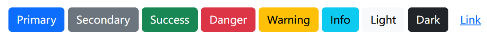

#### 按钮尺寸

```html
<button type="button" class="btn btn-primary btn-lg">Large button</button>
<button type="button" class="btn btn-primary">Default button</button>
<button type="button" class="btn btn-primary btn-sm">Small button</button>
```


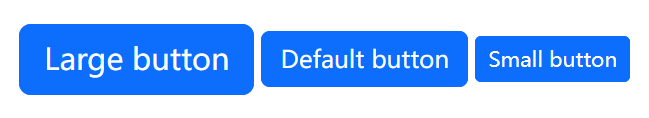

#### 按钮状态


```html
<button type="button" class="btn btn-primary" disabled>Disabled button</button>
<button type="button" class="btn btn-primary active">Active button</button>
```


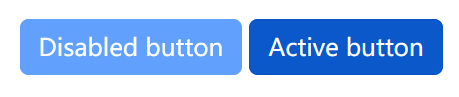


### 告警（Alert）

为典型的用户操作提供上下文反馈消息，并提供少量可用和灵活的警报消息。

#### 基本用法

```html
<div class="alert alert-primary" role="alert">
  A simple primary alert—check it out!
</div>
<div class="alert alert-secondary" role="alert">
  A simple secondary alert—check it out!
</div>
<div class="alert alert-success" role="alert">
  A simple success alert—check it out!
</div>
<div class="alert alert-danger" role="alert">
  A simple danger alert—check it out!
</div>
<div class="alert alert-warning" role="alert">
  A simple warning alert—check it out!
</div>
<div class="alert alert-info" role="alert">
  A simple info alert—check it out!
</div>
<div class="alert alert-light" role="alert">
  A simple light alert—check it out!
</div>
<div class="alert alert-dark" role="alert">
  A simple dark alert—check it out!
</div>
```


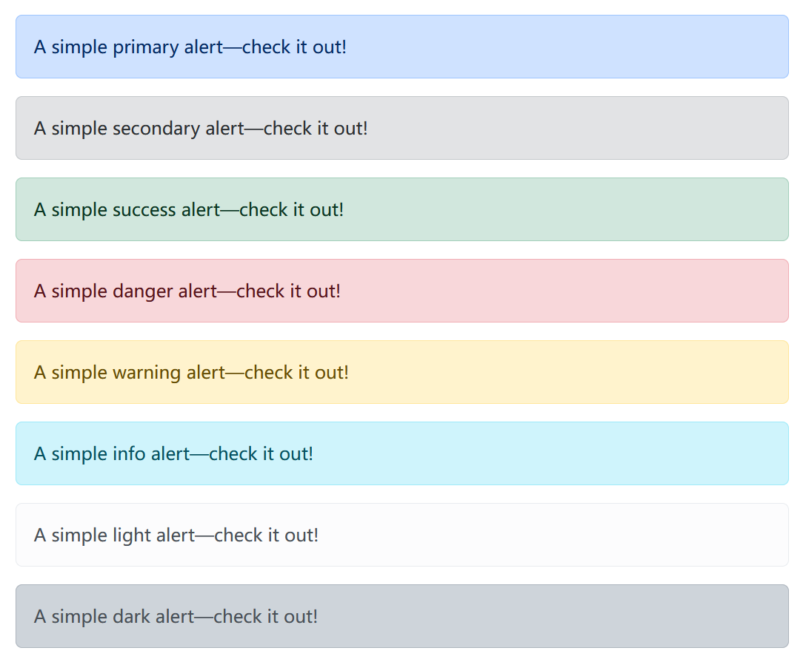


#### 链接


使用`.alert-link`实用程序类可以在任何警报中快速提供匹配的彩色链接


```html
<div class="alert alert-primary" role="alert">
  A simple primary alert with <a href="#" class="alert-link">an example link</a>. Give it a click if you like.
</div>
<div class="alert alert-secondary" role="alert">
  A simple secondary alert with <a href="#" class="alert-link">an example link</a>. Give it a click if you like.
</div>
<div class="alert alert-success" role="alert">
  A simple success alert with <a href="#" class="alert-link">an example link</a>. Give it a click if you like.
</div>
<div class="alert alert-danger" role="alert">
  A simple danger alert with <a href="#" class="alert-link">an example link</a>. Give it a click if you like.
</div>
<div class="alert alert-warning" role="alert">
  A simple warning alert with <a href="#" class="alert-link">an example link</a>. Give it a click if you like.
</div>
<div class="alert alert-info" role="alert">
  A simple info alert with <a href="#" class="alert-link">an example link</a>. Give it a click if you like.
</div>
<div class="alert alert-light" role="alert">
  A simple light alert with <a href="#" class="alert-link">an example link</a>. Give it a click if you like.
</div>
<div class="alert alert-dark" role="alert">
  A simple dark alert with <a href="#" class="alert-link">an example link</a>. Give it a click if you like.
</div>
</di>
```

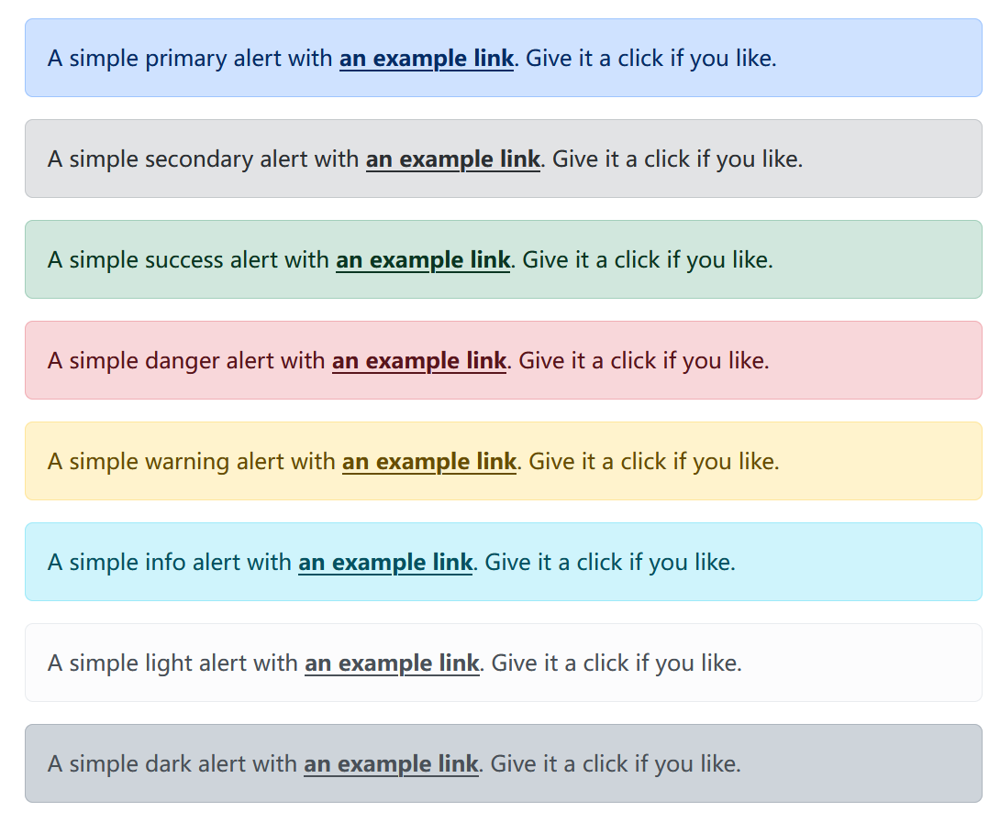


#### 图标


使用图标来创建带有图标的警报。

```html
<svg xmlns="http://www.w3.org/2000/svg" class="d-none">
  <symbol id="check-circle-fill" viewBox="0 0 16 16">
    <path
      d="M16 8A8 8 0 1 1 0 8a8 8 0 0 1 16 0zm-3.97-3.03a.75.75 0 0 0-1.08.022L7.477 9.417 5.384 7.323a.75.75 0 0 0-1.06 1.06L6.97 11.03a.75.75 0 0 0 1.079-.02l3.992-4.99a.75.75 0 0 0-.01-1.05z" />
  </symbol>
  <symbol id="info-fill" viewBox="0 0 16 16">
    <path
      d="M8 16A8 8 0 1 0 8 0a8 8 0 0 0 0 16zm.93-9.412-1 4.705c-.07.34.029.533.304.533.194 0 .487-.07.686-.246l-.088.416c-.287.346-.92.598-1.465.598-.703 0-1.002-.422-.808-1.319l.738-3.468c.064-.293.006-.399-.287-.47l-.451-.081.082-.381 2.29-.287zM8 5.5a1 1 0 1 1 0-2 1 1 0 0 1 0 2z" />
  </symbol>
  <symbol id="exclamation-triangle-fill" viewBox="0 0 16 16">
    <path
      d="M8.982 1.566a1.13 1.13 0 0 0-1.96 0L.165 13.233c-.457.778.091 1.767.98 1.767h13.713c.889 0 1.438-.99.98-1.767L8.982 1.566zM8 5c.535 0 .954.462.9.995l-.35 3.507a.552.552 0 0 1-1.1 0L7.1 5.995A.905.905 0 0 1 8 5zm.002 6a1 1 0 1 1 0 2 1 1 0 0 1 0-2z" />
  </symbol>
</svg>

<div class="alert alert-primary d-flex align-items-center" role="alert">
  <svg class="bi flex-shrink-0 me-2" role="img" aria-label="Info:">
    <use xlink:href="#info-fill" />
  </svg>
  <div>
    An example alert with an icon
  </div>
</div>
<div class="alert alert-success d-flex align-items-center" role="alert">
  <svg class="bi flex-shrink-0 me-2" role="img" aria-label="Success:">
    <use xlink:href="#check-circle-fill" />
  </svg>
  <div>
    An example success alert with an icon
  </div>
</div>
<div class="alert alert-warning d-flex align-items-center" role="alert">
  <svg class="bi flex-shrink-0 me-2" role="img" aria-label="Warning:">
    <use xlink:href="#exclamation-triangle-fill" />
  </svg>
  <div>
    An example warning alert with an icon
  </div>
</div>
<div class="alert alert-danger d-flex align-items-center" role="alert">
  <svg class="bi flex-shrink-0 me-2" role="img" aria-label="Danger:">
    <use xlink:href="#exclamation-triangle-fill" />
  </svg>
  <div>
    An example danger alert with an icon
  </div>
</div>
```

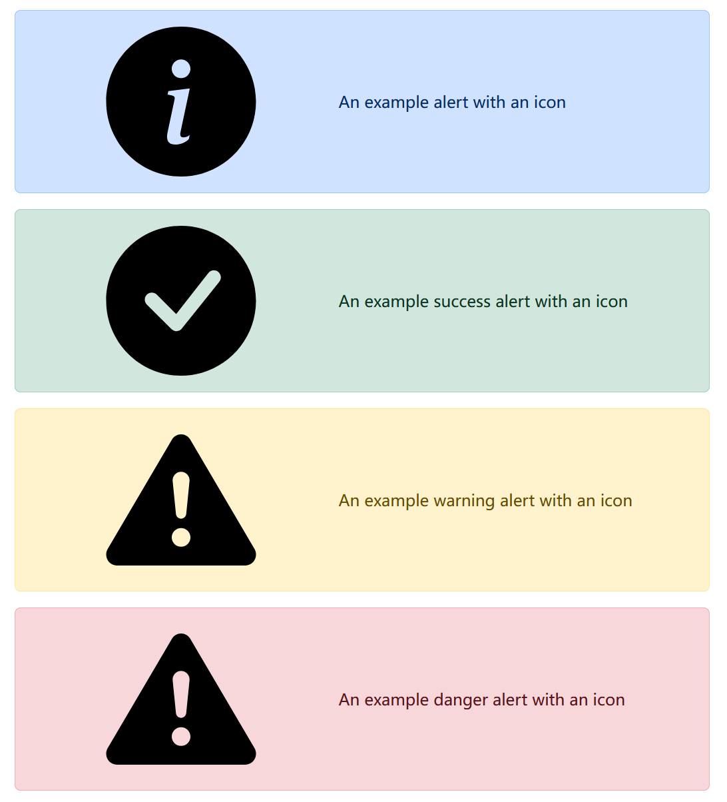


### 徽章（Badge）

徽章可以作为小计数器和标签组件。


#### 基本用法

徽章通过使用相对字体大小和单位来缩放以匹配直接父元素的大小。从v5开始，徽章不再具有链接的焦点或悬停样式。

```html
<h1>Example heading <span class="badge text-bg-secondary">New</span></h1>
<h2>Example heading <span class="badge text-bg-secondary">New</span></h2>
<h3>Example heading <span class="badge text-bg-secondary">New</span></h3>
<h4>Example heading <span class="badge text-bg-secondary">New</span></h4>
<h5>Example heading <span class="badge text-bg-secondary">New</span></h5>
<h6>Example heading <span class="badge text-bg-secondary">New</span></h6>
```


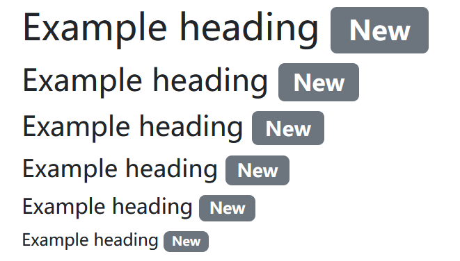


#### 用作链接或按钮的一部分

徽章可以用作链接或按钮的一部分，以提供计数器。


```html
<button type="button" class="btn btn-primary">
  Notifications <span class="badge text-bg-secondary">4</span>
</button>
```

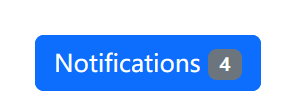


#### 定位

将徽章放置在链接或按钮的角落。


```html
<button type="button" class="btn btn-primary position-relative">
  Inbox
  <span class="position-absolute top-0 start-100 translate-middle badge rounded-pill bg-danger">
    99+
    <span class="visually-hidden">unread messages</span>
  </span>
</button>

<br>
<br>

<button type="button" class="btn btn-primary position-relative">
  Profile
  <span class="position-absolute top-0 start-100 translate-middle p-2 bg-danger border border-light rounded-circle">
    <span class="visually-hidden">New alerts</span>
  </span>
</button>
```

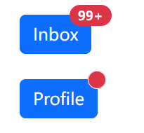


### 卡片（Card）

Bootstrap的卡片提供了一个灵活的、可扩展的内容容器，具有多个变体和选项。


```html
<div class="card" style="width: 18rem;">
  
  <div class="card-body">
    <h5 class="card-title">Card title</h5>
    <p class="card-text">Some quick example text to build on the card title and make up the bulk of the card’s
      content.</p>
    <a href="#" class="btn btn-primary">Go somewhere</a>
  </div>
</div>
```

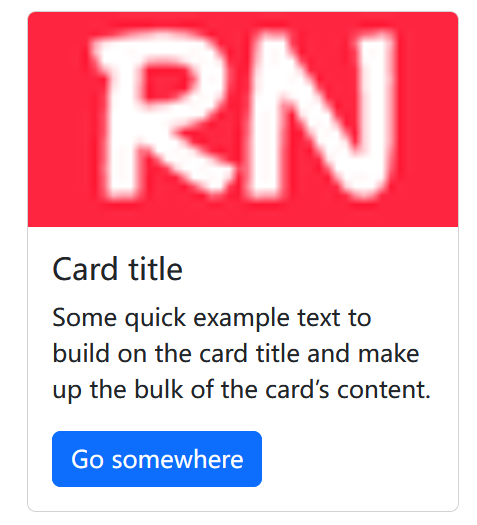

### Collapse


Collapse用于切换项目中内容的可见性。其工作原理是，按钮或锚点用作触发器，将其映射到所切换的特定元素。折叠一个元素将使其高度从当前值变为0。


点击下面的按钮，通过类的改变来显示和隐藏另一个元素：

* `.collapse`隐藏内容
* `.collapsing`在过渡期间应用
* `.collapse.show`显示内容


通常，建议使用带有data-bs-target属性的`<button>`。虽然不建议，但也可以使用带有href属性的`<a>`链接（以及`role="button"`）。在这两种情况下，都需要`data-bs-toggle="collapse"`。

```html
<p class="d-inline-flex gap-1">
  <a class="btn btn-primary" data-bs-toggle="collapse" href="#collapseExample" role="button" aria-expanded="false"
    aria-controls="collapseExample">
    Link with href
  </a>
  <button class="btn btn-primary" type="button" data-bs-toggle="collapse" data-bs-target="#collapseExample"
    aria-expanded="false" aria-controls="collapseExample">
    Button with data-bs-target
  </button>
</p>
<div class="collapse" id="collapseExample">
  <div class="card card-body">
    Some placeholder content for the collapse component. This panel is hidden by default but revealed when the user
    activates the relevant trigger.
  </div>
</div>
```

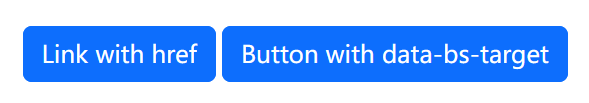


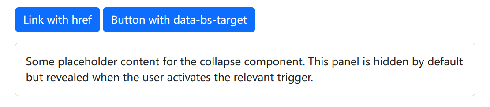


### 下拉（Dropdown）

使用Bootstrap下拉切换上下文覆盖以显示链接列表和更多内容。

```html
<div class="dropdown">
  <button class="btn btn-secondary dropdown-toggle" type="button" data-bs-toggle="dropdown" aria-expanded="false">
    Dropdown button
  </button>
  <ul class="dropdown-menu">
    <li><a class="dropdown-item" href="#">Action</a></li>
    <li><a class="dropdown-item" href="#">Another action</a></li>
    <li><a class="dropdown-item" href="#">Something else here</a></li>
  </ul>
</div>
```


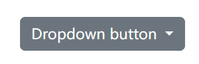


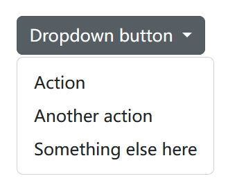

### 列表组（List group）


列表组是显示一系列内容的灵活而强大的组件。修改和扩展它们以支持其中的任何内容。


#### 基本用法


```html
<ul class="list-group">
  <li class="list-group-item">An item</li>
  <li class="list-group-item">A second item</li>
  <li class="list-group-item">A third item</li>
  <li class="list-group-item">A fourth item</li>
  <li class="list-group-item">And a fifth one</li>
</ul>
```

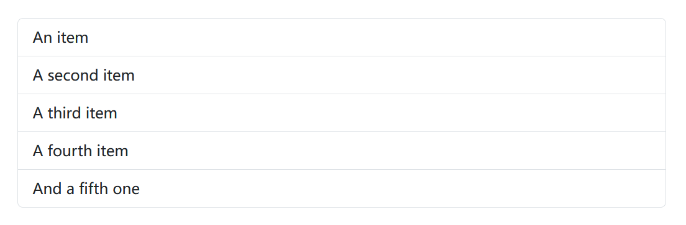

#### 编号


添加`.list-group-numbered`修饰符类（并可选择使用`<ol>`元素）来选择编号列表组项。


```html
<ol class="list-group list-group-numbered">
  <li class="list-group-item">A list item</li>
  <li class="list-group-item">A list item</li>
  <li class="list-group-item">A list item</li>
</ol>
```
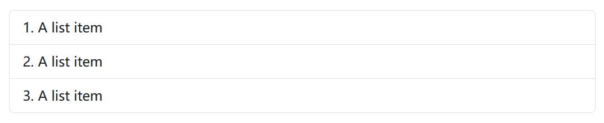


#### 带徽章


向任何列表组项添加徽章，以显示未读计数、活动等。


```html
<ul class="list-group">
  <li class="list-group-item d-flex justify-content-between align-items-center">
    A list item
    <span class="badge text-bg-primary rounded-pill">14</span>
  </li>
  <li class="list-group-item d-flex justify-content-between align-items-center">
    A second list item
    <span class="badge text-bg-primary rounded-pill">2</span>
  </li>
  <li class="list-group-item d-flex justify-content-between align-items-center">
    A third list item
    <span class="badge text-bg-primary rounded-pill">1</span>
  </li>
</ul>
```
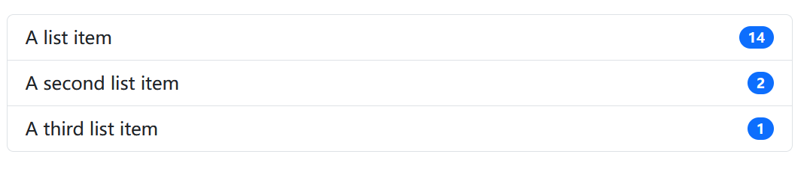


### 导航条（Navbar）

Bootstrap强大的、响应式导航页头、导航栏，能对品牌，导航等的进行支持。

```html
<nav class="navbar navbar-expand-lg bg-body-tertiary">
  <div class="container-fluid">
    <a class="navbar-brand" href="#">Navbar</a>
    <button class="navbar-toggler" type="button" data-bs-toggle="collapse" data-bs-target="#navbarSupportedContent"
      aria-controls="navbarSupportedContent" aria-expanded="false" aria-label="Toggle navigation">
      <span class="navbar-toggler-icon"></span>
    </button>
    <div class="collapse navbar-collapse" id="navbarSupportedContent">
      <ul class="navbar-nav me-auto mb-2 mb-lg-0">
        <li class="nav-item">
          <a class="nav-link active" aria-current="page" href="#">Home</a>
        </li>
        <li class="nav-item">
          <a class="nav-link" href="#">Link</a>
        </li>
        <li class="nav-item dropdown">
          <a class="nav-link dropdown-toggle" href="#" role="button" data-bs-toggle="dropdown"
            aria-expanded="false">
            Dropdown
          </a>
          <ul class="dropdown-menu">
            <li><a class="dropdown-item" href="#">Action</a></li>
            <li><a class="dropdown-item" href="#">Another action</a></li>
            <li>
              <hr class="dropdown-divider">
            </li>
            <li><a class="dropdown-item" href="#">Something else here</a></li>
          </ul>
        </li>
        <li class="nav-item">
          <a class="nav-link disabled" aria-disabled="true">Disabled</a>
        </li>
      </ul>
      <form class="d-flex" role="search">
        <input class="form-control me-2" type="search" placeholder="Search" aria-label="Search" />
        <button class="btn btn-outline-success" type="submit">Search</button>
      </form>
    </div>
  </div>
</nav>
```


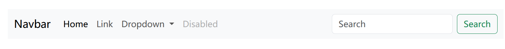


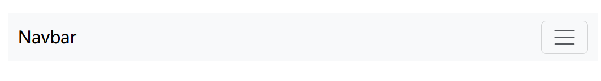


### 分页（Pagination）

分页以指示跨多个页面存在一系列相关内容。


#### 基本用法


```html
<nav aria-label="Page navigation example">
  <ul class="pagination">
    <li class="page-item"><a class="page-link" href="#">Previous</a></li>
    <li class="page-item"><a class="page-link" href="#">1</a></li>
    <li class="page-item"><a class="page-link" href="#">2</a></li>
    <li class="page-item"><a class="page-link" href="#">3</a></li>
    <li class="page-item"><a class="page-link" href="#">Next</a></li>
  </ul>
</nav>
```

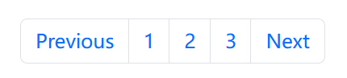


#### 图标


```html
<nav aria-label="Page navigation example">
  <ul class="pagination">
    <li class="page-item">
      <a class="page-link" href="#" aria-label="Previous">
        <span aria-hidden="true">&laquo;</span>
      </a>
    </li>
    <li class="page-item"><a class="page-link" href="#">1</a></li>
    <li class="page-item"><a class="page-link" href="#">2</a></li>
    <li class="page-item"><a class="page-link" href="#">3</a></li>
    <li class="page-item">
      <a class="page-link" href="#" aria-label="Next">
        <span aria-hidden="true">&raquo;</span>
      </a>
    </li>
  </ul>
</nav>
```


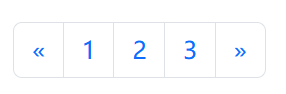


## 3.2 Bootstrap进阶：熟悉常用布局的用法

### 断点（Breakpoint）


断点是可自定义的宽度，它决定了你的响应式布局在Bootstrap中跨设备或视口大小的行为。

#### 核心概念

* 断点是响应式设计的基石。使用它们来控制何时可以根据特定的视口或设备尺寸调整布局。
* 使用媒体查询通过断点来构建CSS。媒体查询是CSS的一个特性，它允许您根据一组浏览器和操作系统参数有条件地应用样式。我们最常在媒体查询中使用最小宽度。
* 移动优先，响应式设计是目标。Bootstrap的CSS旨在应用最少的样式，使布局在最小的断点上工作，然后在样式上进行分层，以调整设计以适应更大的设备。这优化了你的CSS，改善了渲染时间，并为你的访问者提供了一个很好的体验。


#### 可用断点

Bootstrap包括六个默认断点，有时称为网格层，用于响应式构建。如果您使用的是源Sass文件，则可以自定义这些断点。

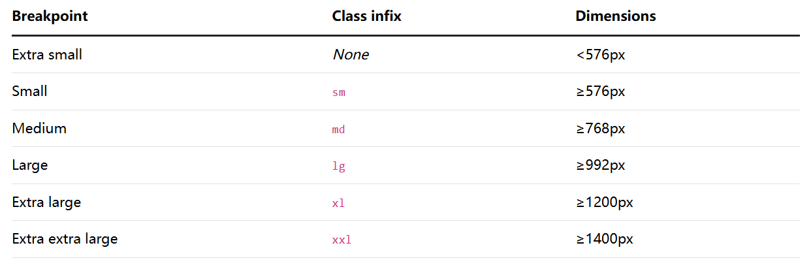


### 容器（Container）

容器是Bootstrap的基本构建块，它可以在给定的设备或视口中包含、填充和对齐内容。


#### 基本原理

容器是Bootstrap中最基本的布局元素，在使用默认网格系统时是必需的。容器用于容纳、填充和（有时）居中其中的内容。虽然容器可以嵌套，但大多数布局不需要嵌套容器。

Bootstrap带有三种不同的容器：
* `.container`，在每个响应断点处设置最大宽度
* `.container-{breakpoint}`，宽度：100%，直到指定的断点
* `.container-fluid`，在所有断点处宽度为100%


下表说明了每个容器的最大宽度如何在每个断点上与原始的 `.container`和`.container-fluid`进行比较。

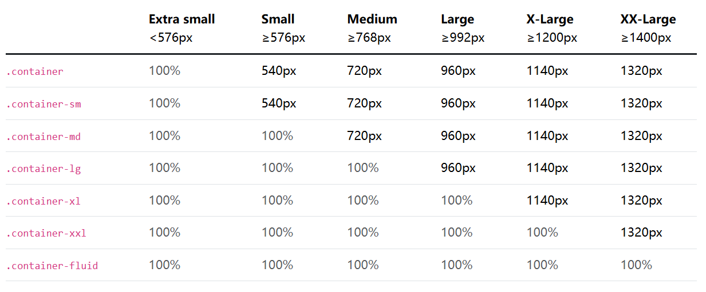


### 网格系统（Grid）

Bootstrap 的网格系统基于 12 列布局，支持响应式设计。

```html
<div class="container">
  <div class="row">
    <div class="col-md-4">.col-md-4</div>
    <div class="col-md-4">.col-md-4</div>
    <div class="col-md-4">.col-md-4</div>
  </div>
</div>

<br>
<br>
<div class="container">
  <div class="row">
    <div class="col-sm-12 col-md-6 col-lg-4">.col-sm-12 .col-md-6 .col-lg-4</div>
    <div class="col-sm-12 col-md-6 col-lg-4">.col-sm-12 .col-md-6 .col-lg-4</div>
    <div class="col-sm-12 col-md-12 col-lg-4">.col-sm-12 .col-md-12 .col-lg-4</div>
  </div>
</div>
```

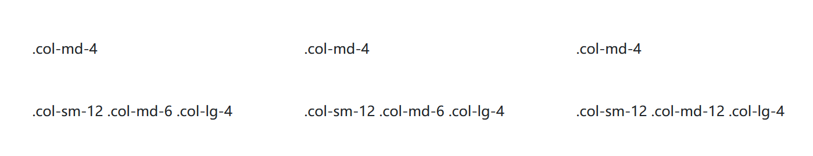


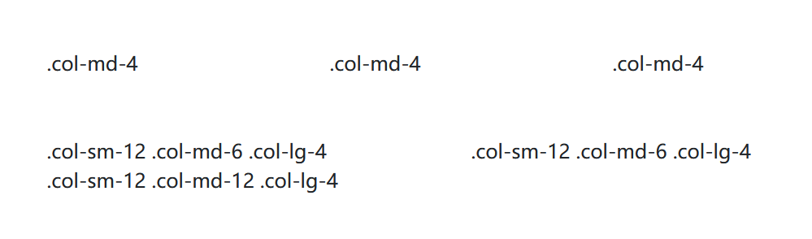


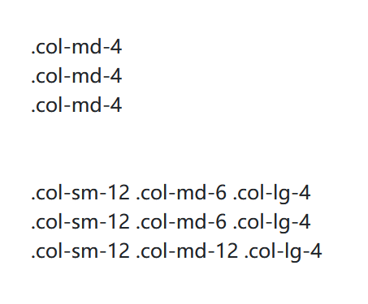


### 列（Column）

了解如何通过一些用于对齐、排序和偏移的选项来修改列，这要归功于我们的弹性盒网格系统。还会了解如何使用列类来管理非网格元素的宽度。


#### 工作原理

列建立在网格的弹性盒（Flexbox）架构之上。弹性盒意味着我们可以选择更改单个列以及在行级别修改列组。你可以选择列如何拉伸、收缩或进行其他更改。

在构建网格布局时，所有内容都放在列中。Bootstrap 网格的层次结构是从容器到行，再到列，最后到你的内容。在极少数情况下，你可能会将内容和列结合起来，但要注意这可能会产生意想不到的后果。

Bootstrap 包含用于创建快速、响应式布局的预定义类。每个网格层有六个断点和十二个列，我们已经为你构建了数十个类来创建你想要的布局。如果需要，你可以通过 Sass 禁用它。

#### 对齐

使用弹性盒对齐工具类来垂直和水平对齐列。

#### 垂直对齐

使用任何响应式 `align-items-*` 类更改垂直对齐方式。

```html
<div class="container text-center">
  <div class="row align-items-start">
    <div class="col">
      One of three columns
    </div>
    <div class="col">
      One of three columns
    </div>
    <div class="col">
      One of three columns
    </div>
  </div>
</div>
```

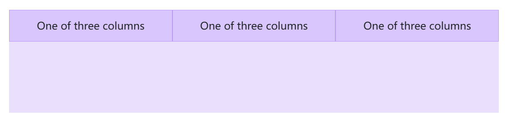

```html
<div class="container text-center">
  <div class="row align-items-center">
    <div class="col">
      One of three columns
    </div>
    <div class="col">
      One of three columns
    </div>
    <div class="col">
      One of three columns
    </div>
  </div>
</div>
```


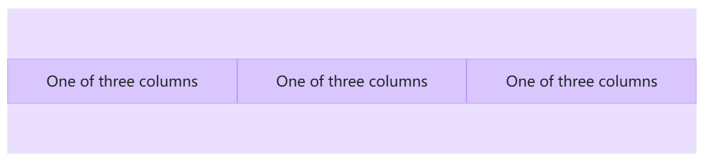

```html
<div class="container text-center">
  <div class="row align-items-end">
    <div class="col">
      One of three columns
    </div>
    <div class="col">
      One of three columns
    </div>
    <div class="col">
      One of three columns
    </div>
  </div>
</div>
```


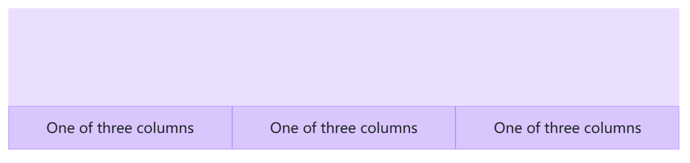

或者，使用任何响应式 `.align-self-*` 类分别更改每个列的对齐方式。

```html
<div class="container text-center">
  <div class="row">
    <div class="col align-self-start">
      One of three columns
    </div>
    <div class="col align-self-center">
      One of three columns
    </div>
    <div class="col align-self-end">
      One of three columns
    </div>
  </div>
</div>
```

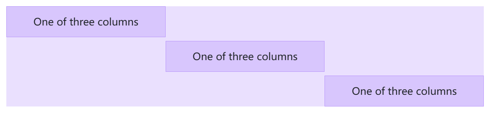

### 水平对齐

使用任何响应式 `justify-content-*` 类更改水平对齐方式。

```html
<div class="container text-center">
  <div class="row justify-content-start">
    <div class="col-4">
      One of two columns
    </div>
    <div class="col-4">
      One of two columns
    </div>
  </div>
  <div class="row justify-content-center">
    <div class="col-4">
      One of two columns
    </div>
    <div class="col-4">
      One of two columns
    </div>
  </div>
  <div class="row justify-content-end">
    <div class="col-4">
      One of two columns
    </div>
    <div class="col-4">
      One of two columns
    </div>
  </div>
  <div class="row justify-content-around">
    <div class="col-4">
      One of two columns
    </div>
    <div class="col-4">
      One of two columns
    </div>
  </div>
  <div class="row justify-content-between">
    <div class="col-4">
      One of two columns
    </div>
    <div class="col-4">
      One of two columns
    </div>
  </div>
  <div class="row justify-content-evenly">
    <div class="col-4">
      One of two columns
    </div>
    <div class="col-4">
      One of two columns
    </div>
  </div>
</div>
```


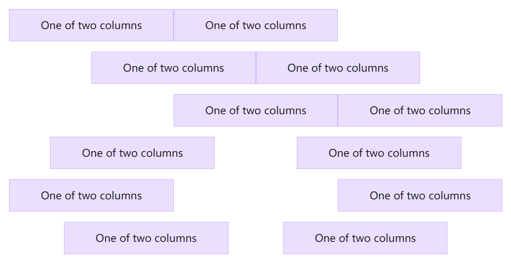


## 4.1 Bootstrap表格组件：快速掌握复杂数据场景下的高效呈现

Bootstrap 表格支持多种样式和功能，包括条纹、边框、悬停效果等。

### 基本表格

```html
<table class="table">
  <thead>
    <tr>
      <th scope="col">#</th>
      <th scope="col">First</th>
      <th scope="col">Last</th>
      <th scope="col">Handle</th>
    </tr>
  </thead>
  <tbody>
    <tr>
      <th scope="row">1</th>
      <td>Mark</td>
      <td>Otto</td>
      <td>@mdo</td>
    </tr>
    <tr>
      <th scope="row">2</th>
      <td>Jacob</td>
      <td>Thornton</td>
      <td>@fat</td>
    </tr>
    <tr>
      <th scope="row">3</th>
      <td>John</td>
      <td>Doe</td>
      <td>@social</td>
    </tr>
  </tbody>
</table>
```

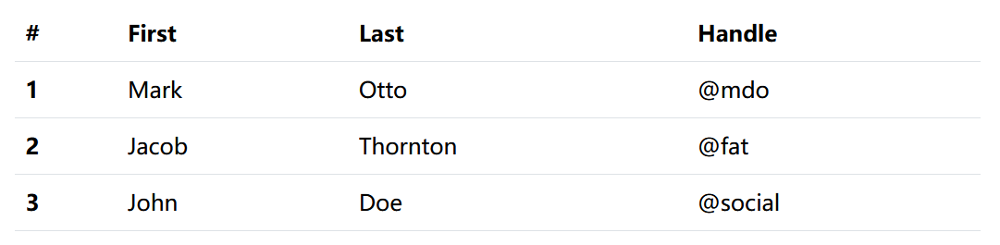


### 上色

使用上下文类为表格、表格行或单个单元格上色。


```html
<table class="table table-primary">
  <thead>
    <tr class="table-secondary">
      <th scope="col">#</th>
      <th scope="col">First</th>
      <th scope="col">Last</th>
      <th scope="col">Handle</th>
    </tr>
  </thead>
  <tbody>
    <tr>
      <th scope="row">1</th>
      <td>Mark</td>
      <td>Otto</td>
      <td class="table-warning">@mdo</td>
    </tr>
    <tr>
      <th scope="row">2</th>
      <td>Jacob</td>
      <td>Thornton</td>
      <td class="table-info">@fat</td>
    </tr>
    <tr>
      <th scope="row">3</th>
      <td>John</td>
      <td>Doe</td>
      <td class="table-danger">@social</td>
    </tr>
  </tbody>
</table>
```


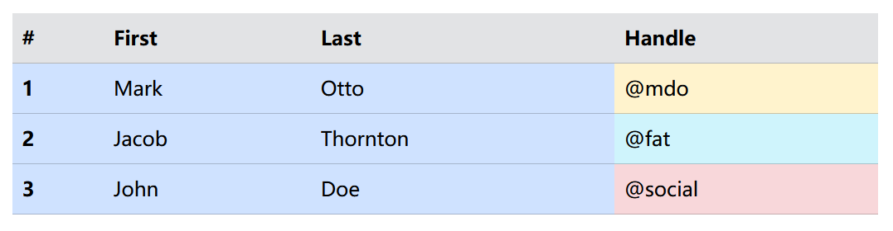

### 条纹行

使用`.table-striped`将斑马条纹添加到`<tbody>`中的任何表行。


```html
<table class="table table-striped">
  <thead>
    <tr>
      <th scope="col">#</th>
      <th scope="col">First</th>
      <th scope="col">Last</th>
      <th scope="col">Handle</th>
    </tr>
  </thead>
  <tbody>
    <tr>
      <th scope="row">1</th>
      <td>Mark</td>
      <td>Otto</td>
      <td>@mdo</td>
    </tr>
    <tr>
      <th scope="row">2</th>
      <td>Jacob</td>
      <td>Thornton</td>
      <td>@fat</td>
    </tr>
    <tr>
      <th scope="row">3</th>
      <td>John</td>
      <td>Doe</td>
      <td>@social</td>
    </tr>
  </tbody>
</table>
```


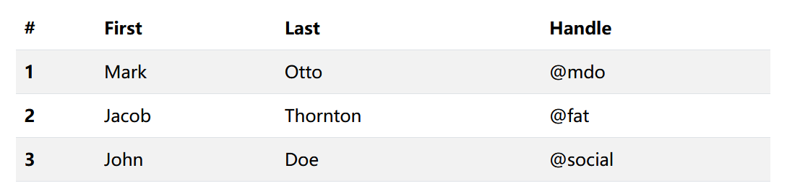


### 条纹柱


使用`.table-striped-columns`为任何表列添加斑马条纹。


```html
<table class="table table-striped-columns">
  <thead>
    <tr>
      <th scope="col">#</th>
      <th scope="col">First</th>
      <th scope="col">Last</th>
      <th scope="col">Handle</th>
    </tr>
  </thead>
  <tbody>
    <tr>
      <th scope="row">1</th>
      <td>Mark</td>
      <td>Otto</td>
      <td>@mdo</td>
    </tr>
    <tr>
      <th scope="row">2</th>
      <td>Jacob</td>
      <td>Thornton</td>
      <td>@fat</td>
    </tr>
    <tr>
      <th scope="row">3</th>
      <td>John</td>
      <td>Doe</td>
      <td>@social</td>
    </tr>
  </tbody>
</table>
```


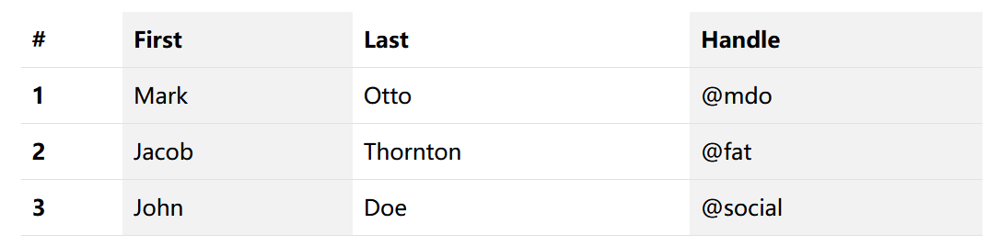


### 可悬浮行

添加`.table-hover`以在`<tbody>`中的表行上启用悬停状态。

```html
<table class="table table-hover">
  <thead>
    <tr>
      <th scope="col">#</th>
      <th scope="col">First</th>
      <th scope="col">Last</th>
      <th scope="col">Handle</th>
    </tr>
  </thead>
  <tbody>
    <tr>
      <th scope="row">1</th>
      <td>Mark</td>
      <td>Otto</td>
      <td>@mdo</td>
    </tr>
    <tr>
      <th scope="row">2</th>
      <td>Jacob</td>
      <td>Thornton</td>
      <td>@fat</td>
    </tr>
    <tr>
      <th scope="row">3</th>
      <td>John</td>
      <td>Doe</td>
      <td>@social</td>
    </tr>
  </tbody>
</table>
```

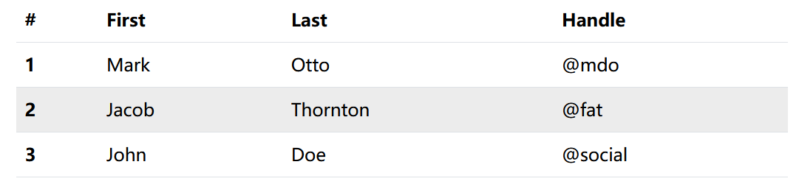


## 4.2 Bootstrap表单组件：实现用户体验与业务逻辑的完美平衡

表单（Form）用于创建各种表单的表单控件样式、布局选项和自定义组件的示例和使用指南。


### 表单控件（Form control）

为文本表单控件（如`<input>`和`<textarea>`）提供一个升级，使其具有自定义样式、大小、焦点状态等。


#### 基本用法

表单控件使用Sass和CSS变量的混合样式，允许它们适应颜色模式并支持任何自定义方法。

```html
<div class="mb-3">
  <label for="exampleFormControlInput1" class="form-label">Email address</label>
  <input type="email" class="form-control" id="exampleFormControlInput1" placeholder="name@example.com">
</div>
<div class="mb-3">
  <label for="exampleFormControlTextarea1" class="form-label">Example textarea</label>
  <textarea class="form-control" id="exampleFormControlTextarea1" rows="3"></textarea>
</div>
```


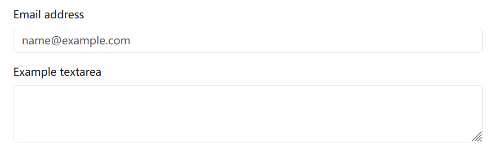


#### 大小
使用`.form-control-lg`和`.form-control-sm`类设置高度。

```html
<input class="form-control form-control-lg" type="text" placeholder=".form-control-lg"
  aria-label=".form-control-lg example">
<input class="form-control" type="text" placeholder="Default input" aria-label="default input example">
<input class="form-control form-control-sm" type="text" placeholder=".form-control-sm"
  aria-label=".form-control-sm example">
```


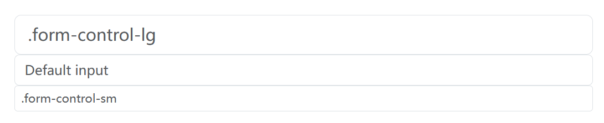

#### 表单文本

可以使用`.form-text`创建块级或内联级表单文本。


输入下面的表单文本可以使用`.form-text`样式。如果使用块级元素，则添加顶部边距，以便与上面的输入保持距离。


```html
<label for="inputPassword5" class="form-label">Password</label>
<input type="password" id="inputPassword5" class="form-control" aria-describedby="passwordHelpBlock">
<div id="passwordHelpBlock" class="form-text">
  Your password must be 8-20 characters long, contain letters and numbers, and must not contain spaces, special
  characters, or emoji.
</div>
```


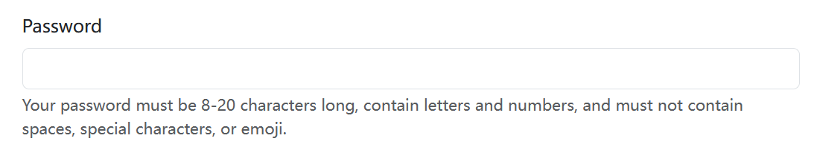


#### 禁用

在输入上添加disabled的布尔属性，使其呈现灰色外观，删除指针事件，并防止聚焦。

```html
<input class="form-control" type="text" placeholder="Disabled input" aria-label="Disabled input example" disabled>
<input class="form-control" type="text" value="Disabled readonly input" aria-label="Disabled input example" disabled
  readonly>
```


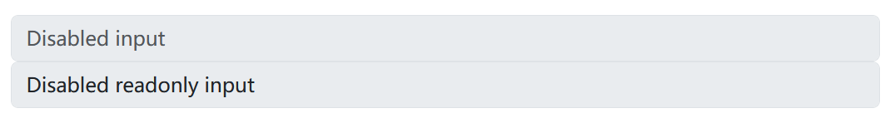


#### 只读

在输入上添加readonly布尔属性，以防止修改输入的值。只读输入仍然可以聚焦和选择，而禁用输入则不能。

```html
<div class="mb-3 row">
  <label for="staticEmail" class="col-sm-2 col-form-label">Email</label>
  <div class="col-sm-10">
    <input type="text" readonly class="form-control-plaintext" id="staticEmail" value="email@example.com">
  </div>
</div>
<div class="mb-3 row">
  <label for="inputPassword" class="col-sm-2 col-form-label">Password</label>
  <div class="col-sm-10">
    <input type="password" class="form-control" id="inputPassword">
  </div>
</div>
```


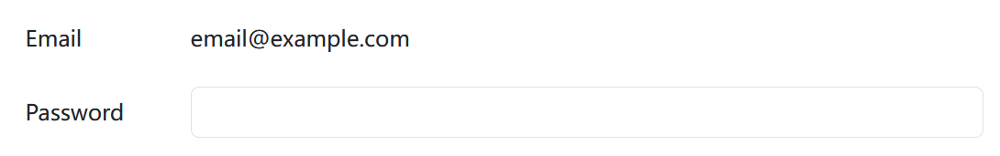

#### 文件


```html
<div class="mb-3">
  <label for="formFile" class="form-label">Default file input example</label>
  <input class="form-control" type="file" id="formFile">
</div>
<div class="mb-3">
  <label for="formFileMultiple" class="form-label">Multiple files input example</label>
  <input class="form-control" type="file" id="formFileMultiple" multiple>
</div>
<div class="mb-3">
  <label for="formFileDisabled" class="form-label">Disabled file input example</label>
  <input class="form-control" type="file" id="formFileDisabled" disabled>
</div>
<div class="mb-3">
  <label for="formFileSm" class="form-label">Small file input example</label>
  <input class="form-control form-control-sm" id="formFileSm" type="file">
</div>
<div>
  <label for="formFileLg" class="form-label">Large file input example</label>
  <input class="form-control form-control-lg" id="formFileLg" type="file">
</div>
```

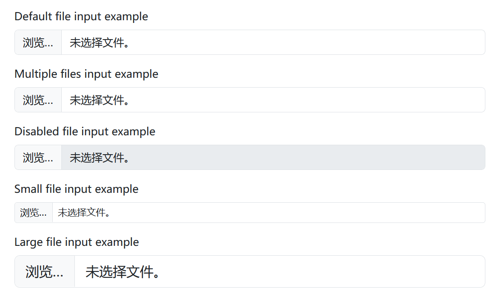

#### 颜色


设置`type="color"`，并将`.form-control-color`添加到`<input>`，实现颜色选择。


```html
<label for="exampleColorInput" class="form-label">Color picker</label>
<input type="color" class="form-control form-control-color" id="exampleColorInput" value="#563d7c"
  title="Choose your color">
```

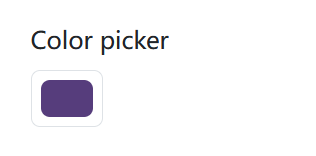

弹出的颜色选择器，取决于平台。比如，以下是Windows平台的颜色选择器。

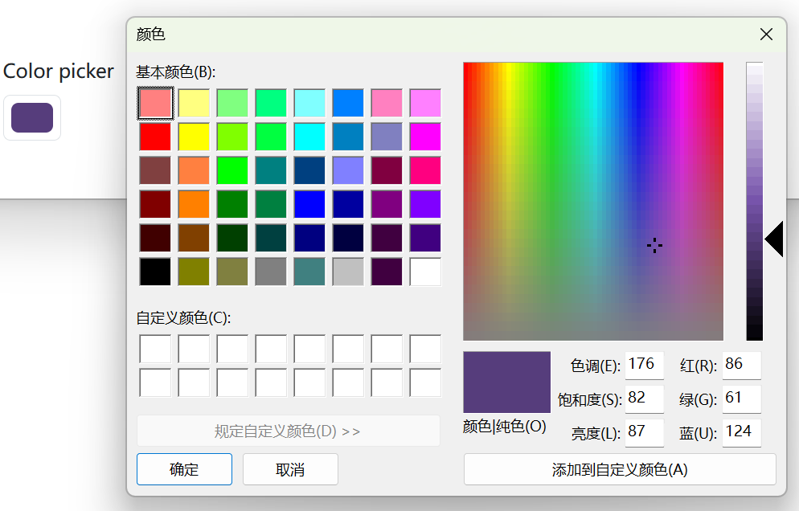

#### 数据列

数据允许创建一组`<option>`，这些`<option>`可以在`<input>`中访问（并自动完成）。这些元素类似于`<select>`元素，但是有更多的菜单样式限制和差异。虽然大多数浏览器和操作系统都包括对`<datalist>`元素的一些支持，但它们的样式充其量是不一致的。

```html
<label for="exampleDataList" class="form-label">Datalist example</label>
<input class="form-control" list="datalistOptions" id="exampleDataList" placeholder="Type to search...">
<datalist id="datalistOptions">
  <option value="San Francisco">
  <option value="New York">
  <option value="Seattle">
  <option value="Los Angeles">
  <option value="Chicago">
</datalist>
```

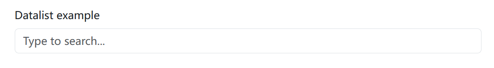


点击输入框，可以展示数据列表，并可以选择数据项。


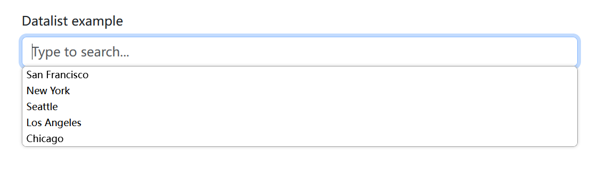


### Checkbox


Bootstrap使用我们完全重写的检查组件创建一致的跨浏览器和跨设备的Checkbox。


#### 基本用法


```html
<div class="form-check">
  <input class="form-check-input" type="checkbox" value="" id="checkDefault">
  <label class="form-check-label" for="checkDefault">
    Default checkbox
  </label>
</div>
<div class="form-check">
  <input class="form-check-input" type="checkbox" value="" id="checkChecked" checked>
  <label class="form-check-label" for="checkChecked">
    Checked checkbox
  </label>
</div>
```

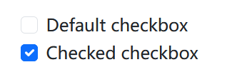


#### 禁用

添加disabled属性和关联的`<label>`将自动使用较浅的颜色进行样式匹配，以帮助指示输入的状态。


```html
<div class="form-check">
  <input class="form-check-input" type="checkbox" value="" id="checkIndeterminateDisabled" disabled>
  <label class="form-check-label" for="checkIndeterminateDisabled">
    Disabled indeterminate checkbox
  </label>
</div>
<div class="form-check">
  <input class="form-check-input" type="checkbox" value="" id="checkDisabled" disabled>
  <label class="form-check-label" for="checkDisabled">
    Disabled checkbox
  </label>
</div>
<div class="form-check">
  <input class="form-check-input" type="checkbox" value="" id="checkCheckedDisabled" checked disabled>
  <label class="form-check-label" for="checkCheckedDisabled">
    Disabled checked checkbox
  </label>
</div>
```

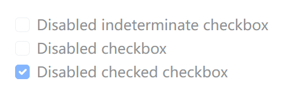


### Radio


Bootstrap使用我们完全重写的检查组件创建一致的跨浏览器和跨设备的Radio。


#### 基本用法


```html
<div class="form-check">
  <input class="form-check-input" type="radio" name="radioDefault" id="radioDefault1">
  <label class="form-check-label" for="radioDefault1">
    Default radio
  </label>
</div>
<div class="form-check">
  <input class="form-check-input" type="radio" name="radioDefault" id="radioDefault2" checked>
  <label class="form-check-label" for="radioDefault2">
    Default checked radio
  </label>
</div>
```


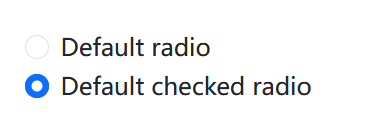


#### 禁用

添加disabled属性和关联的`<label>`将自动使用较浅的颜色进行样式匹配，以帮助指示输入的状态。


```html
<div class="form-check">
  <input class="form-check-input" type="radio" name="radioDisabled" id="radioDisabled" disabled>
  <label class="form-check-label" for="radioDisabled">
    Disabled radio
  </label>
</div>
<div class="form-check">
  <input class="form-check-input" type="radio" name="radioDisabled" id="radioCheckedDisabled" checked disabled>
  <label class="form-check-label" for="radioCheckedDisabled">
    Disabled checked radio
  </label>
</div>
```

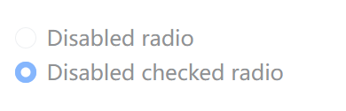

### Switch

Switch具有自定义checkbox的标记，但使用`.form-switch`类来呈现切换开关。考虑使用`role="switch"`来更准确地将控件的性质传达给支持此角色的辅助技术。在旧的辅助技术中，它只是作为一个常规的复选框作为备用。交换机也支持disabled属性。


```html
<div class="form-check form-switch">
  <input class="form-check-input" type="checkbox" role="switch" id="switchCheckDefault">
  <label class="form-check-label" for="switchCheckDefault">Default switch checkbox input</label>
</div>
<div class="form-check form-switch">
  <input class="form-check-input" type="checkbox" role="switch" id="switchCheckChecked" checked>
  <label class="form-check-label" for="switchCheckChecked">Checked switch checkbox input</label>
</div>
<div class="form-check form-switch">
  <input class="form-check-input" type="checkbox" role="switch" id="switchCheckDisabled" disabled>
  <label class="form-check-label" for="switchCheckDisabled">Disabled switch checkbox input</label>
</div>
<div class="form-check form-switch">
  <input class="form-check-input" type="checkbox" role="switch" id="switchCheckCheckedDisabled" checked disabled>
  <label class="form-check-label" for="switchCheckCheckedDisabled">Disabled checked switch checkbox input</label>
</div>
```

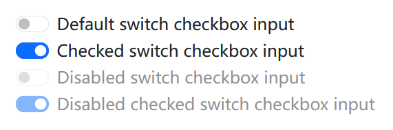


### 输入组（Input group）

通过在文本输入、自定义选择和自定义文件输入的两侧添加文本、按钮或按钮组，轻松扩展表单控件。


#### 基本用法


在输入的两侧放置一个附加组件或按钮。也可以在输入的两侧放置一个。记住在输入组之外放置`<label>`。


```html
<div class="input-group mb-3">
  <span class="input-group-text" id="basic-addon1">@</span>
  <input type="text" class="form-control" placeholder="Username" aria-label="Username" aria-describedby="basic-addon1">
</div>

<div class="input-group mb-3">
  <input type="text" class="form-control" placeholder="Recipient’s username" aria-label="Recipient’s username" aria-describedby="basic-addon2">
  <span class="input-group-text" id="basic-addon2">@example.com</span>
</div>

<div class="mb-3">
  <label for="basic-url" class="form-label">Your vanity URL</label>
  <div class="input-group">
    <span class="input-group-text" id="basic-addon3">https://example.com/users/</span>
    <input type="text" class="form-control" id="basic-url" aria-describedby="basic-addon3 basic-addon4">
  </div>
  <div class="form-text" id="basic-addon4">Example help text goes outside the input group.</div>
</div>

<div class="input-group mb-3">
  <span class="input-group-text">$</span>
  <input type="text" class="form-control" aria-label="Amount (to the nearest dollar)">
  <span class="input-group-text">.00</span>
</div>

<div class="input-group mb-3">
  <input type="text" class="form-control" placeholder="Username" aria-label="Username">
  <span class="input-group-text">@</span>
  <input type="text" class="form-control" placeholder="Server" aria-label="Server">
</div>

<div class="input-group">
  <span class="input-group-text">With textarea</span>
  <textarea class="form-control" aria-label="With textarea"></textarea>
</div>
```

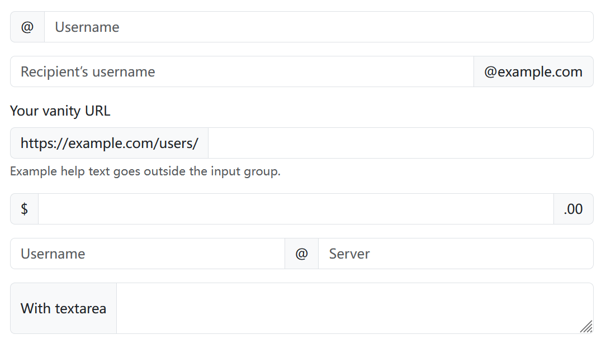


#### 大小

将相对表单大小类添加到`.input-group`本身，其中的内容将自动调整大小—无需在每个元素上重复表单控件大小类。
不支持单个输入组元素的大小调整。


```html
<div class="input-group input-group-sm mb-3">
  <span class="input-group-text" id="inputGroup-sizing-sm">Small</span>
  <input type="text" class="form-control" aria-label="Sizing example input" aria-describedby="inputGroup-sizing-sm">
</div>

<div class="input-group mb-3">
  <span class="input-group-text" id="inputGroup-sizing-default">Default</span>
  <input type="text" class="form-control" aria-label="Sizing example input" aria-describedby="inputGroup-sizing-default">
</div>

<div class="input-group input-group-lg">
  <span class="input-group-text" id="inputGroup-sizing-lg">Large</span>
  <input type="text" class="form-control" aria-label="Sizing example input" aria-describedby="inputGroup-sizing-lg">
</div>
```


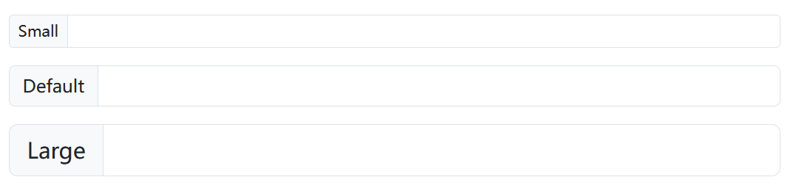


## 5.1 课程总结

* 单体项目下的全栈工程师如何考虑前端样式？为什么选择Bootstrap？
* 介绍Bootstrap核心概念；
* Bootstrap基础用法，包括常用组件、常用布局的用法；
* 介绍Bootstrap高级开发，包括表格组件、表单组件的用法。
