> 本页为原「Java 课程 8」全部 135 个分节的合订本；原分节链接会自动跳转到本页。


## 1.1 全栈工程师如何开发仿“小红书”单体项目？

* 评估现状：人少、项目急。
* 围绕Java+AI技术栈快速交付。
* 项目需求分析与架构设计。
* Spring Boot简化Spring项目搭建
* 全栈下的用户模块注册功能实现
* 全栈下的用户模块登录功能实现
* 全栈下的用户模块信息管理功能实现
* 全栈下的笔记模块发布功能实现
* 全栈下的笔记模块列表展示功能实现
* 全栈下的笔记模块笔记详情功能实现
* 全栈下的笔记模块编辑、删除功能实现
* 全栈下的首页模块笔记探索功能实现
* 全栈下的首页模块搜索及瀑布流实现
* 全栈下的点赞模块实现
* 全栈下的评论模块实现
* 全栈下的后台管理模块实现


## 2.1 基于全栈的角度进行项目需求分析与架构设计

### 需求分析


* 用户模块
  * 注册功能
  * 登录功能
  * 信息管理：修改个人资料、修改密码、分页展示笔记
* 笔记模块
  * 发布功能
  * 查询功能
  * 编辑功能
  * 删除功能
* 文件服务器
  * 上传图片
  * 删除图片
* 首页模块
  * 瀑布流展示笔记
  * 搜索笔记
* 点赞模块
  * 执行点赞
  * 取消点赞
* 评论模块
  * 增加评论
  * 删除评论
  * 回复评论
  * 删除回复
* 后台管理模块
  * 数据看板
  * 用户管理


### 架构设计


三层架构。

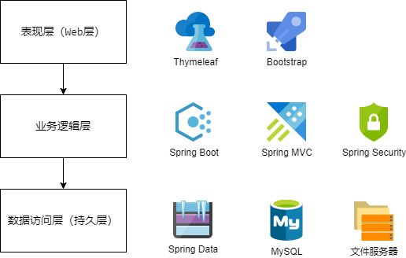


## 2.2 如何让AI成为你的贴身编程导师？

全球人工智能市场正快速发展，中美作为主要引领者，推动技术、产品和应用的多轮驱动。大语言模型（包括多模态大模型）的崛起提升了AI能力和使用时间，而中国在应用场景方面展现了显著优势。Java程序员应如何把握时代机遇？


### 全球AI市场


如下图2-2所示，全球AI产业在技术、产品与应用多轮驱动推动市场不断发展，其中，中美是产业引领者。


* 全球人工智能市场规模正在持续扩大，预计到2027年将迎来普适AI的时代，届时AI软件市场规模将达到1569亿美元，2028年将超2154亿美元。
* 大型模型正在推动AI能力的提升与边界的扩展，能力水平不断提高，AI使用时间也不断增加。
* 美国和中国已成为主要竞争主体，而国内在应用场景方面具备显著优势。


### 中国AI产业

如下图2-3所示，国内AI产业应用正在从百模大战向应用驱动转型，推动AI应用生态的发展。

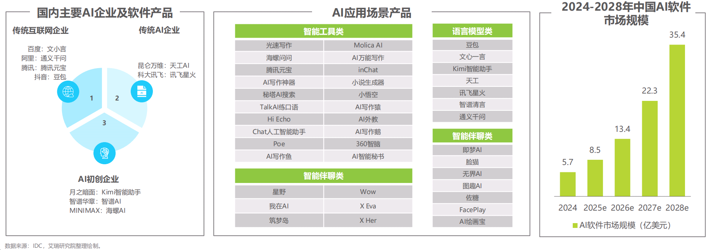


* 中国AI产业正处于快速发展的阶段，国内AI应用场景日益丰富，尤其是面向消费者（To C）的市场迅速崛起。目前国内形成了传统互联网企业、传统AI企业和初创企业为代表的三个不同背景企业组成的产业生态。
* 本土化大模型的加速落地，显著推动了AI应用的爆发和市场规模增长，预计2028年中国AI软件市场规模将达到35.4亿美元。

### 处于AI时代的浪巅，Java程序员应躬身入局

要让AI成为你的贴身Java编程导师，让AI成为你的利用工具。关键在于构建高效的互动模式，充分利用AI的知识储备和即时反馈能力。以下是具体方法：

### 1. 明确学习目标，定向提问
- 基础学习：针对语法细节提问，例如："Java中==和equals()的区别是什么？请用代码示例说明"
- 进阶提升：聚焦设计模式、性能优化等，例如："如何用工厂模式重构这段Java代码？"
- 项目实践：带着具体问题求助，例如："我的Spring Boot项目启动时报错'No qualifying bean'，可能的原因有哪些？"

### 2. 善用代码交互功能
- 直接提供代码片段，让AI分析问题："这段多线程代码有线程安全问题吗？如何修复？"
- 要求AI生成示例代码并解释："请写一个Java 8 Stream API处理集合的例子，并逐行解释"
- 对比不同实现方案："用for循环和递归两种方式实现斐波那契数列，各有什么优劣？"

### 3. 模拟实战场景
- 让AI扮演面试官："请出5道Java并发编程的面试题，并给出参考答案"
- 模拟项目需求："我需要开发一个简单的图书管理系统，用Java实现，该如何设计类结构？"
- 代码评审："这是我写的用户登录功能代码，请从安全性和可读性角度点评并优化"

### 4. 建立知识体系
- 要求AI梳理知识框架："请帮我整理Java集合框架的核心接口和实现类的关系"
- 关联前后知识："之前学了ArrayList，它和LinkedList的底层实现有什么不同？"
- 查漏补缺："除了try-catch-finally，Java还有哪些异常处理方式？"

### 5. 利用AI的迭代指导
- 逐步深入：从"什么是泛型"到"如何实现泛型擦除的绕过"
- 跟踪学习进度："基于我之前问的关于HashMap的问题，现在该学习哪些相关知识点？"
- 错题复盘："我在这个Java考试题上答错了，能帮我分析错误原因吗？"

通过这种有针对性的互动，AI可以成为随叫随到的导师，既解决即时问题，又能帮助构建系统的Java知识体系，同时培养独立编程思维。关键是要主动思考、明确问题，并结合实践不断验证和深化理解。

### 6. 利用AI辅助编程工具


利用AI辅助编程工具：

1. CodeGeeX
2. 通义灵码


## 2.3 AI辅助编程工具CodeGeeX安装及使用

CodeGeeX是一款北京智谱华章科技股份有限公司出品的基于大模型的全能的智能编程助手。它可以实现代码的生成与补全、自动添加注释、代码翻译以及智能问答等功能，能够帮助开发者显著提高工作效率。CodeGeeX支持Python、Java、C++、JavaScript、Go等数十种常见编程语言，并适配Visual Studio Code及IntelliJ IDEA、PyCharm、GoLand等JetBrains IDE。CodeGeeX插件对个人用户完全免费，同时也提供面向企业的CodeGeeX私有化部署服务。

### 一、CodeGeeX 核心功能
1. 智能代码生成：根据注释或代码上下文生成完整函数、类或代码块，支持多种编程场景
2. 实时代码补全：在编写过程中提供上下文相关的代码建议，减少重复编码
3. 代码解释：对已有代码进行逐行或整体解释，帮助理解复杂逻辑
4. 代码翻译：在不同编程语言间进行代码转换（如Java转Python）
5. 调试与优化：识别代码潜在问题并提供优化建议，支持单元测试生成


### 二、安装方法（以IntelliJ IDEA为例）
1. 打开IntelliJ IDEA，进入`File > Settings > Plugins`
2. 在搜索框输入"CodeGeeX"，找到对应的插件
3. 点击"Install"安装，等待安装完成后重启IDE，如下图2-4所示
4. 首次使用需在IDE右侧的CodeGeeX面板中完成账号注册或登录（支持GitHub、微信等方式）


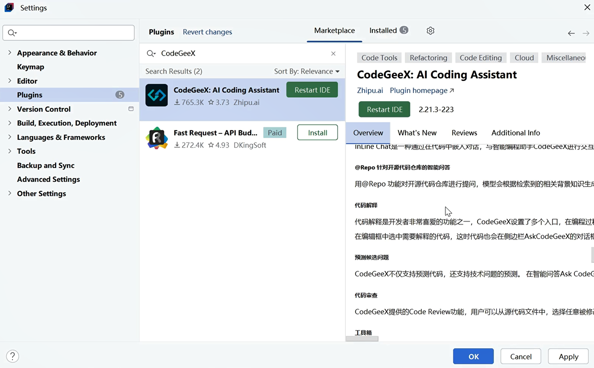


### 三、基本使用方法
1. 代码生成：
   - 编写注释描述需要实现的功能，如：
     ```java
     // 实现一个Java方法，计算两个整数的最大公约数
     ```
   - 按下快捷键（默认`Alt+\`），CodeGeeX会自动生成对应的实现代码

2. 代码补全：
   - 在编写代码时，工具会自动提示可能的代码续写
   - 例如输入`public static int gcd(`，会自动补全参数和可能的实现逻辑

3. 代码解释：
   - 选中需要解释的代码段
   - 右键选择"CodeGeeX > 解释代码"，会生成详细的代码说明

4. 跨语言转换：
   - 选中Java代码
   - 右键选择"CodeGeeX > 代码翻译"，选择目标语言（如Python），即可得到转换后的代码

5. 集成使用技巧：
   - 配合Spring Boot开发时，可通过注释快速生成Controller、Service等层代码
   - 调试时，选中报错代码，使用"优化建议"功能获取修复方案
   - 在重构时，利用"代码简化"功能优化冗余代码

### 四、优势特点
- 对中文注释支持友好，更符合国内开发者习惯
- 模型针对多编程语言优化，尤其在Java企业级开发场景表现出色
- 可离线使用（部分功能），保护代码隐私
- 持续更新迭代，不断优化对新框架和语法的支持

通过合理使用CodeGeeX，Java开发者可以将更多精力集中在业务逻辑设计上，减少重复劳动，提升代码质量和开发效率。


## 2.4 AI辅助编程工具通义灵码安装及使用

通义灵码是阿里巴巴达摩院研发的AI辅助编程工具，专注于提升开发者的编码效率，尤其在Java、Python等主流编程语言以及云原生、微服务等企业级开发场景中表现出色。它能通过理解代码上下文和业务意图，提供实时补全、代码生成、智能推荐等功能，同时对阿里系技术栈（如Spring Cloud Alibaba、Dubbo等）有深度适配。


### 一、通义灵码核心功能
1. 智能代码补全：根据当前编码上下文，实时提供函数、变量、语句等补全建议，支持整行或多行间的连续补全。
2. 代码生成：通过自然语言注释或不完整代码片段，生成完整的函数、类、甚至模块代码（如自动生成Spring Boot的Controller、Service层代码）。
3. 阿里技术栈适配：针对阿里云、钉钉开发、支付宝生态等场景提供专属代码模板和最佳实践建议。
4. 代码优化与重构：识别冗余代码、性能问题或不符合编码规范的片段，提供优化方案和重构建议。
5. 文档生成：自动为类、方法生成注释文档，支持JavaDoc、Python Docstring等规范。
6. 跨语言转换：支持Java与其他语言（如Python、Go）的代码互转，便于多语言项目协作。


### 二、安装方法（以IntelliJ IDEA为例）
1. 打开IntelliJ IDEA，进入 `File > Settings > Plugins`。
2. 在插件市场搜索“通义灵码”（或“Tongyi Lingma”），找到对应插件。
3. 点击“Install”安装，等待安装完成后就可以直接使用，无需重启IDE，如下图2-5所示
4. 首次使用需登录：在IDE右侧的“通义灵码”面板中，选择“登录”，支持阿里云账号、淘宝账号或钉钉扫码登录（需完成实名认证）。

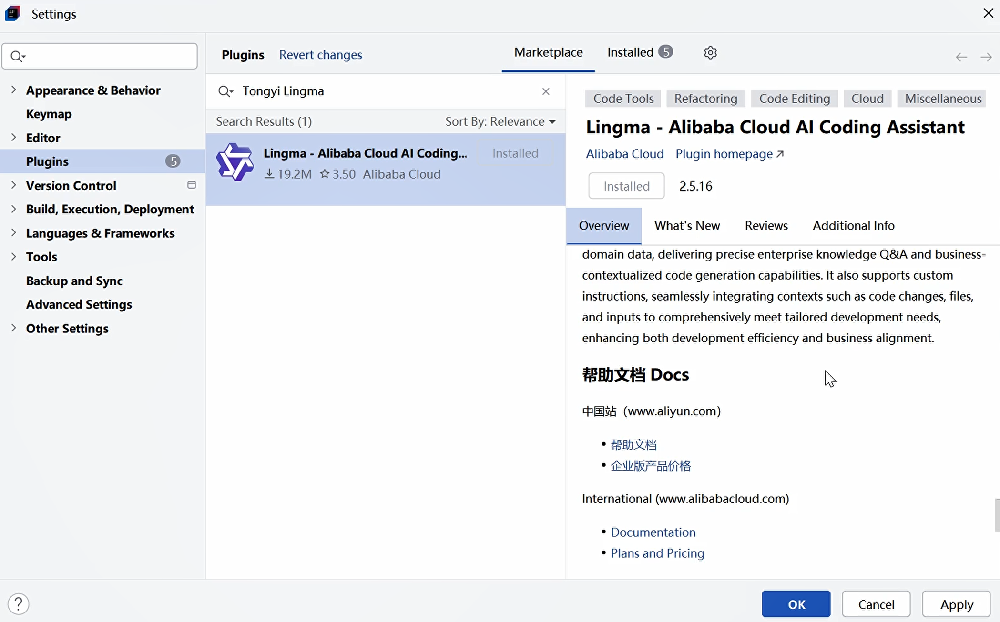


### 三、基本使用方法
#### 1. 实时代码补全
- 编写代码时，工具会自动在光标处显示补全建议，按 `Tab` 键即可采纳。
- 示例（Java）：输入 `public List<String> getUserNames(` 时，会自动补全参数列表、返回逻辑甚至异常处理代码。

#### 2. 通过注释生成代码
- 编写自然语言注释描述功能，按下 `Alt + \`（默认快捷键）触发生成。
  ```java
  // 功能：从数据库查询指定用户ID的订单列表，按创建时间倒序排列
  // 参数：userId - 用户ID；pageNum - 页码；pageSize - 每页条数
  // 返回：分页后的订单列表
  public Page<Order> getUserOrders(Long userId, int pageNum, int pageSize) {
      // 按下Alt+\后，通义灵码会生成基于MyBatis或JPA的实现代码
  }
  ```

#### 3. 代码优化与解释
- 选中需要优化的代码段，右键选择“通义灵码 > 优化代码”，工具会给出简化、性能提升或规范调整建议。
- 选择“解释代码”可获取代码逻辑的逐行说明，适合理解复杂逻辑或第三方库代码。

#### 4. 适配阿里技术栈的专属功能
- 在Spring Cloud Alibaba项目中，输入 `@DubboService` 后，会自动补全服务暴露的配置模板。
- 开发阿里云OSS相关功能时，可通过注释快速生成文件上传、下载的完整代码（包含签名验证、异常处理）。


### 四、使用技巧
- 自定义快捷键：进入 `Settings > Keymap > 通义灵码` 可修改生成、补全的触发快捷键，适配个人编码习惯。
- 隐私保护：支持本地模式（部分功能），敏感代码可在本地处理，避免上传云端。
- 项目适配：首次打开项目时，工具会自动分析技术栈（如识别是Spring Boot还是Dubbo项目），后续建议会更精准。

通义灵码尤其适合Java开发者在企业级应用开发中提升效率，其对国内技术生态的深度适配和中文语境的理解能力，能有效减少“重复编码”和“查文档”的时间成本。


## 3.1 Spring Boot概述

### 一、什么是 Spring Boot？
Spring Boot 是由 Pivotal 团队开发的开源框架，基于 Spring 框架构建，旨在简化 Spring 应用的初始搭建和开发过程。它通过“自动配置（Auto-configuration）”和“起步依赖（Starter Dependencies）”等特性，大幅减少了传统 Spring 项目的样板代码和配置工作量，让开发者可以更专注于业务逻辑实现。

核心目标：  
- 快速创建独立运行的 Spring 应用（可直接通过 `java -jar` 启动）。  
- 简化配置，减少 XML 或 Java 配置的样板代码。  
- 集成主流技术栈（如 Web、数据库、消息中间件等），实现“开箱即用”。  
- 内置服务器（如 Tomcat、Jetty），方便部署和测试。


### 二、核心特性
1. 自动配置（Auto-configuration）  
   Spring Boot 会根据项目引入的依赖（如 `spring-boot-starter-web`），自动为应用配置对应的 Bean（如 Tomcat 服务器、Spring MVC 组件等），避免手动编写大量配置类。  
   - 示例：引入 `spring-boot-starter-jdbc` 后，会自动配置数据库连接池和 `JdbcTemplate`。  
   - 可通过 `@Conditional` 注解实现条件化配置，确保仅在需要时加载特定 Bean。

2. 起步依赖（Starter Dependencies）  
   通过“一站式”依赖管理，简化 Maven/Gradle 配置。每个 Starter 对应一类功能（如 Web、数据访问、安全等），开发者只需引入对应的 Starter，无需手动管理复杂的依赖关系。  
   - 常见 Starter：  
     - `spring-boot-starter-web`：Web 开发（含 Spring MVC、Tomcat 等）。  
     - `spring-boot-starter-data-jpa`：JPA 数据访问。  
     - `spring-boot-starter-security`：安全认证。  

3. Actuator（应用监控）  
   内置监控端点，可实时查看应用运行状态（如健康检查、性能指标、环境变量等），方便调试和运维。  
   - 端点示例：  
     - `/health`：检查应用健康状态。  
     - `/metrics`：查看性能指标（如内存、CPU 使用率）。  
     - `/env`：查看环境变量和配置属性。  

4. 嵌入式服务器  
   支持嵌入式 Tomcat、Jetty 或 Undertow，无需手动部署 WAR 包，直接通过可执行 JAR 运行应用。  
   - 示例启动命令：  
     ```bash
     java -jar my-spring-boot-app.jar
     ```

5. 生产级特性  
   - 支持配置文件（`application.properties`/`application.yml`），可轻松实现不同环境（开发、测试、生产）的配置管理。  
   - 集成日志系统（默认使用 Logback，可切换为 Log4j 2）。  
   - 支持外部化配置（如从环境变量、命令行参数读取配置）。  


### 三、Spring Boot 与传统 Spring 的对比
| 特性         | 传统 Spring                | Spring Boot                  |
|------------------|--------------------------------|----------------------------------|
| 配置方式     | 大量 XML 或 Java 配置类       | 自动配置 + 少量自定义配置        |
| 依赖管理     | 手动管理依赖版本和冲突        | Starter 自动管理依赖传递        |
| 部署方式     | 需部署到外部服务器（如 Tomcat）| 内置服务器，直接运行 JAR/WAR     |
| 开发效率     | 样板代码多，启动流程复杂      | 快速启动，专注业务逻辑          |
| 监控与运维   | 需集成第三方工具（如 Micrometer）| 内置 Actuator，开箱即用         |


### 四、应用场景
Spring Boot 适用于 各类 Java 企业级应用，尤其适合：  
- 快速原型开发：无需复杂配置即可搭建项目骨架。  
- 微服务架构：Spring Cloud 基于 Spring Boot 构建，方便实现服务治理、分布式配置等功能。  
- 中小型项目：简化开发流程，减少维护成本。  
- 云原生应用：支持容器化部署（如 Docker、Kubernetes），适配云环境。  


### 五、核心模块
Spring Boot 中有多个模块，以下是快速概览：


#### 1. spring-boot  
核心库，提供支持 Spring Boot 其他部分的功能，包括：  
- SpringApplication 类：提供静态便捷方法，用于编写独立的 Spring 应用程序。其主要职责是创建并刷新合适的 Spring 应用上下文（ApplicationContext）。  
- 嵌入式 Web 应用：可选择容器（Tomcat、Jetty 或 Undertow）。  
- 一流的外部化配置支持。  
- 便捷的应用上下文初始化器：包括对合理日志默认值的支持。  


#### 2. spring-boot-autoconfigure  
Spring Boot 可根据类路径内容自动配置典型应用的大部分内容。单个 `@EnableAutoConfiguration` 注解会触发 Spring 上下文的自动配置。  
自动配置会尝试推断用户可能需要的 Bean。例如，如果 HSQLDB 在类路径上，且用户未配置任何数据库连接，则系统可能会自动配置一个内存数据库。当用户开始定义自己的 Bean 时，自动配置会自动退出。  


#### 3. spring-boot-starters  
Starter 是一组便捷的依赖描述符，可包含在应用程序中。它们为所需的所有 Spring 及相关技术提供“一站式”依赖管理，无需搜索示例代码或复制粘贴大量依赖描述符。例如，如果想使用 Spring 和 JPA 进行数据库访问，只需在项目中包含 `spring-boot-starter-data-jpa` 依赖即可。  


#### 4. spring-boot-actuator  
Actuator 端点用于监控和与应用程序交互。Spring Boot Actuator 提供端点所需的基础设施，包含对端点的注解支持。该模块提供了许多端点，例如 `HealthEndpoint`、`EnvironmentEndpoint`、`BeansEndpoint` 等。  


#### 5. spring-boot-actuator-autoconfigure  
该模块基于类路径内容和一组属性为 Actuator 端点提供自动配置。例如，如果 Micrometer 在类路径上，它会自动配置 `MetricsEndpoint`。它包含通过 HTTP 或 JMX 暴露端点的配置。与 Spring Boot 自动配置类似，当用户开始定义自己的 Bean 时，此配置会自动退出。  


#### 6. spring-boot-test  
该模块包含测试应用程序时有用的核心工具和注解。  


#### 7. spring-boot-test-autoconfigure  
与其他 Spring Boot 自动配置模块类似，`spring-boot-test-autoconfigure` 基于类路径为测试提供自动配置。它包含许多注解，可自动配置需要测试的应用程序部分。  


#### 8. spring-boot-loader  
Spring Boot Loader 提供了核心技术，允许将应用程序构建为单个可通过 `java -jar` 启动的 JAR 文件。通常无需直接使用 `spring-boot-loader`，而是通过 Gradle 或 Maven 插件间接使用。  


#### 9. spring-boot-devtools  
`spring-boot-devtools` 模块提供额外的开发时功能（如自动重启），以实现更流畅的应用程序开发体验。在运行完整打包的应用程序时，开发工具会自动禁用。


### 六、总结
Spring Boot 通过“约定大于配置”的理念，大幅降低了 Spring 开发的门槛，成为现代 Java 开发的事实标准。其核心优势在于快速开发、低配置成本和高可扩展性，尤其适合微服务和云原生场景。掌握 Spring Boot 是学习 Spring Cloud、分布式系统等进阶技术的基础。


## 3.2 实战：基于Spring Boot初始化仿“小红书”单体项目

### 初始化项目


通过 Spring Initializr（<https://start.spring.io/>）在线生成项目（选择 Java 版本、Starter 等）， 如下图3-1所示。  


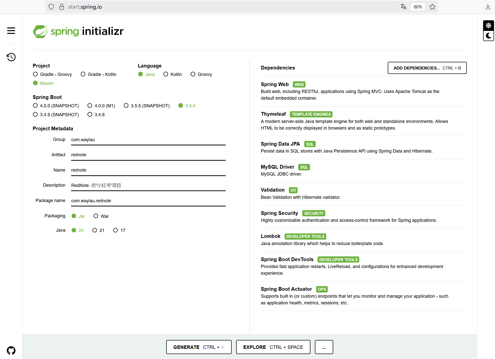


添加如下Starter：
 
* Spring Web
* Thymeleaf
* Spring Data JPA
* MySQL Driver
* Validation
* Spring Security
* Lombok
* Spring Boot Devtools
* Spring Boot Actuator 

最终自动生成如下图3-2所示的目录结构。  

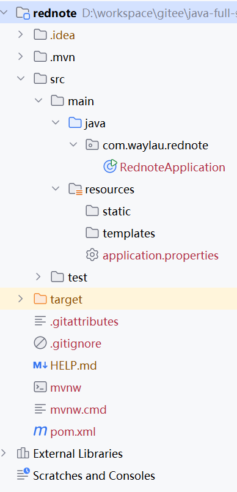


注：除了src目录下的文件及pom.xml文件，其他文件可以删除。

其中，pom.xml文件内容如下：

```xml
<?xml version="1.0" encoding="UTF-8"?>
<project xmlns="http://maven.apache.org/POM/4.0.0" xmlns:xsi="http://www.w3.org/2001/XMLSchema-instance"
	xsi:schemaLocation="http://maven.apache.org/POM/4.0.0 https://maven.apache.org/xsd/maven-4.0.0.xsd">
	<modelVersion>4.0.0</modelVersion>
	<parent>
		<groupId>org.springframework.boot</groupId>
		<artifactId>spring-boot-starter-parent</artifactId>
		<version>3.5.4</version>
		<relativePath/> <!-- lookup parent from repository -->
	</parent>
	<groupId>com.example</groupId>
	<artifactId>rednote</artifactId>
	<version>0.0.1-SNAPSHOT</version>
	<name>rednote</name>
	<description>RedNote. 仿“小红书”项目</description>
	<url/>
	<licenses>
		<license/>
	</licenses>
	<developers>
		<developer/>
	</developers>
	<scm>
		<connection/>
		<developerConnection/>
		<tag/>
		<url/>
	</scm>
	<properties>
		<java.version>24</java.version>
	</properties>
	<dependencies>
		<dependency>
			<groupId>org.springframework.boot</groupId>
			<artifactId>spring-boot-starter-actuator</artifactId>
		</dependency>
		<dependency>
			<groupId>org.springframework.boot</groupId>
			<artifactId>spring-boot-starter-data-jpa</artifactId>
		</dependency>
		<dependency>
			<groupId>org.springframework.boot</groupId>
			<artifactId>spring-boot-starter-security</artifactId>
		</dependency>
		<dependency>
			<groupId>org.springframework.boot</groupId>
			<artifactId>spring-boot-starter-thymeleaf</artifactId>
		</dependency>
		<dependency>
			<groupId>org.springframework.boot</groupId>
			<artifactId>spring-boot-starter-validation</artifactId>
		</dependency>
		<dependency>
			<groupId>org.springframework.boot</groupId>
			<artifactId>spring-boot-starter-web</artifactId>
		</dependency>
		<dependency>
			<groupId>org.thymeleaf.extras</groupId>
			<artifactId>thymeleaf-extras-springsecurity6</artifactId>
		</dependency>

		<dependency>
			<groupId>org.springframework.boot</groupId>
			<artifactId>spring-boot-devtools</artifactId>
			<scope>runtime</scope>
			<optional>true</optional>
		</dependency>
		<dependency>
			<groupId>com.mysql</groupId>
			<artifactId>mysql-connector-j</artifactId>
			<scope>runtime</scope>
		</dependency>
		<dependency>
			<groupId>org.projectlombok</groupId>
			<artifactId>lombok</artifactId>
			<optional>true</optional>
		</dependency>
		<dependency>
			<groupId>org.springframework.boot</groupId>
			<artifactId>spring-boot-starter-test</artifactId>
			<scope>test</scope>
		</dependency>
		<dependency>
			<groupId>org.springframework.security</groupId>
			<artifactId>spring-security-test</artifactId>
			<scope>test</scope>
		</dependency>
	</dependencies>

	<build>
		<plugins>
			<plugin>
				<groupId>org.apache.maven.plugins</groupId>
				<artifactId>maven-compiler-plugin</artifactId>
				<configuration>
					<annotationProcessorPaths>
						<path>
							<groupId>org.projectlombok</groupId>
							<artifactId>lombok</artifactId>
						</path>
					</annotationProcessorPaths>
				</configuration>
			</plugin>
			<plugin>
				<groupId>org.springframework.boot</groupId>
				<artifactId>spring-boot-maven-plugin</artifactId>
				<configuration>
					<excludes>
						<exclude>
							<groupId>org.projectlombok</groupId>
							<artifactId>lombok</artifactId>
						</exclude>
					</excludes>
				</configuration>
			</plugin>
		</plugins>
	</build>

</project>
```


带有 `@SpringBootApplication` 注解的主类（启动类）RednoteApplication代码如下：  

```java
package com.example.rednote;

import org.springframework.boot.SpringApplication;
import org.springframework.boot.autoconfigure.SpringBootApplication;

@SpringBootApplication
public class RednoteApplication {

	public static void main(String[] args) {
		SpringApplication.run(RednoteApplication.class, args);
	}

}
```

应用配置文件application.properties内容如下：

```
spring.application.name=rednote
```


## 3.3 实战：AI辅助编程自动创建数据库连接配置

上一节所初始化的应用，因为缺乏数据库的配置，因而无法正常启动。本节将来通过AI辅助编程工具的帮助下，来生成配置文件。


### 初始化数据库

首先启动MySQL数据库服务器。

其次，通过MySQL客户端创建名为“rednote”新的数据库：

```
mysql> CREATE DATABASE rednote;
Query OK, 1 row affected (0.19 sec)
```


### 设置数据库链接


当我们试图在应用配置文件application.properties里面写下“# 数据库配置”注释的时候，AI辅助编程工具（以通义灵码为例）会自动提醒，生成推荐的配置信息，界面如下。


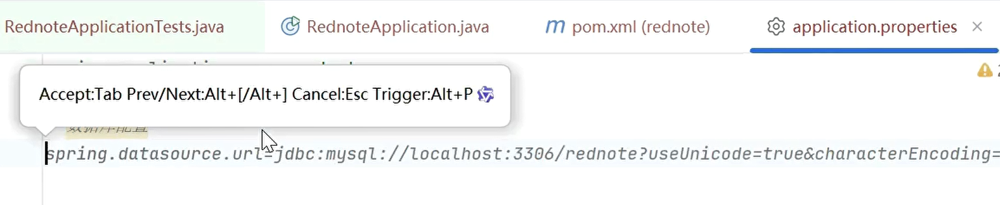

此时，只需要点击“Tab”按键，即可接收建议，形成正式的配置文件，界面如下。


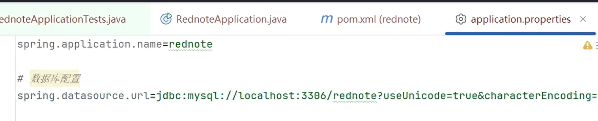


其他配置也如法炮制。当然，也要注意甄别AI辅助编程提供的数据库信息是否准确，如果不准确则需要修正。比如数据库的密码，AI辅助编程工具是没法“猜对”的。

最终，应用配置如下：

```
spring.application.name=rednote

# 数据库配置
spring.datasource.url=jdbc:mysql://localhost:3306/rednote?useUnicode=true&characterEncoding=utf-8&zeroDateTimeBehavior=convertToNull&transformedBitIsBoolean=true&allowMultiQueries=true&useSSL=false&allowPublicKeyRetrieval=true&useJDBCCompliantTimezoneShift=true&useLegacyDatetimeCode=
spring.datasource.username=root
spring.datasource.password=123456
```


### 运行应用

可以在IDE中直接启动主类（`main` 方法），或者通过Maven打包后通过命令行运行：

```bash
mvn package
java -jar target/rednote-0.0.1-SNAPSHOT.jar
```

应用启动之后，访问浏览器地址：<http://localhost:8080>，如果能看到如下图3-5所示的界面，则证明应用启动正常。


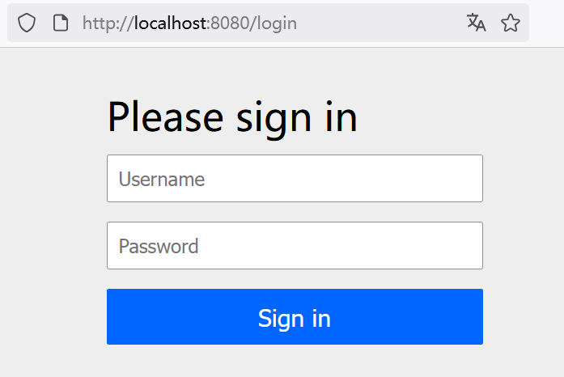


## 4.1 模块功能概述

### 用户模块概述

用户模块，包括注册、登录、信息管理等功能。

具体的设计涉及：

1. 表结构（实体）设计
2. 后台接口设计
3. 前台页面设计

### 注册表单页面功能概述

这个注册表单页面具有以下特点：

1. 视觉风格：采用小红书的红色主色调，结合圆润的边角设计和简洁的布局，符合小红书的品牌形象。

2. 功能完整：
   - 包含用户名、手机号、验证码、密码等必填字段
   - 实现了基本的前端表单验证（如手机号格式、密码强度等）
   - 提供获取验证码的倒计时功能
   - 支持多种社交登录方式

3. 交互体验：
   - 表单元素使用圆角设计，增强视觉舒适度
   - 输入框有明确的焦点状态和错误提示
   - 按钮有悬停和点击反馈效果
   - 验证码按钮有倒计时功能，防止重复点击

4. 响应式设计：使用 Bootstrap 的响应式布局，确保在不同设备上都有良好的显示效果。


## 4.2 使用Bootstrap、Font Awesome以及Thymeleaf轻松实现注册表单页面

1. 引入 Bootstrap 和 Font Awesome 样式和脚本
2. 使用 Bootstrap 的表单组件（Form、Input、Button 等）创建注册表单
3. 设计表单布局，包括用户名、密码、确认密码、手机号等输入框和注册按钮
4. 添加表单验证规则，如用户名长度、密码强度、手机号格式等
5. 在 Thymeleaf 模板中配置静态资源路径


### 关键技术点说明

1. Thymeleaf 表单绑定：
   - `th:object="${user}"`：绑定表单对象
   - `th:field="*{property}"`：绑定表单字段，自动生成 `id` 和 `name` 属性

2. 错误显示机制：
   - `th:if="${#fields.hasErrors('fieldName')}"`：判断字段是否有错误
   - `th:errors="*{fieldName}"`：显示对应字段的错误信息
   - `th:errorclass="is-invalid"`：当字段有错误时添加 Bootstrap 的错误样式类

3. Bootstrap 样式集成：
   - `is-invalid`：为输入框添加红色边框
   - `invalid-feedback`：显示错误消息的容器


### 借助 Bootstrap 生成小红书风格注册表单实现方案


在`src/main/resources/templates`目录下创建 registration-form.html 文件，内容如下： 


```html
<!DOCTYPE html>

<html lang="en">
<head>
    <meta charset="UTF-8">
    <meta name="viewport" content="width=device-width, initial-scale=1.0">
    <title>RN - 注册</title>
    <!-- 引入 Bootstrap CSS -->
    <link href="https://cdn.jsdelivr.net/npm/bootstrap@5.3.6/dist/css/bootstrap.min.css" rel="stylesheet">
    <!-- 引入 Font Awesome -->
    <link href="https://cdn.jsdelivr.net/npm/font-awesome@4.7.0/css/font-awesome.min.css" rel="stylesheet">
    <!-- 自定义样式 -->
    <style>
        body {
            background-color: #fef6f6;
            font-family: -apple-system, BlinkMacSystemFont, "Segoe UI", Roboto, Helvetica, Arial, sans-serif;
        }

        .form-container {
            background-color: white;
            border-radius: 16px;
            box-shadow: 0 4px 20px rgba(0, 0, 0, 0.05);
            padding: 32px;
            max-width: 400px;
            margin: 0 auto;
        }

        .logo {
            text-align: center;
            margin-bottom: 32px;
        }

        .logo img {
            width: 64px;
            height: 64px;
        }

        .form-title {
            font-size: 24px;
            font-weight: 700;
            color: #333;
            margin-bottom: 24px;
            text-align: center;
        }

        .form-control {
            border-radius: 12px;
            border: 1px solid #e8e8e8;
            padding: 12px 16px;
            height: auto;
            font-size: 14px;
        }

        .form-control:focus {
            border-color: #ff2442;
            box-shadow: 0 0 0 2px rgba(255, 36, 66, 0.1);
        }

        .btn-primary {
            background-color: #ff2442;
            border-color: #ff2442;
            border-radius: 12px;
            padding: 12px;
            font-size: 16px;
            font-weight: 600;
            transition: all 0.3s ease;
        }

        .btn-primary:hover,
        .btn-primary:focus {
            background-color: #e61e3a;
            border-color: #e61e3a;
            box-shadow: 0 4px 12px rgba(255, 36, 66, 0.2);
        }

        .btn-outline-secondary {
            border-radius: 12px;
            padding: 12px;
            font-size: 14px;
            color: #666;
            border-color: #e8e8e8;
        }

        .btn-outline-secondary:hover {
            background-color: #f8f8f8;
            border-color: #ddd;
        }

        .form-footer {
            text-align: center;
            margin-top: 24px;
            font-size: 14px;
            color: #666;
        }

        .form-footer a {
            color: #ff2442;
            text-decoration: none;
        }

        .form-footer a:hover {
            text-decoration: underline;
        }

        .divider {
            display: flex;
            align-items: center;
            margin: 24px 0;
            color: #999;
            font-size: 14px;
        }

        .divider::before,
        .divider::after {
            content: '';
            flex: 1;
            border-bottom: 1px solid #e8e8e8;
        }

        .divider::before {
            margin-right: 16px;
        }

        .divider::after {
            margin-left: 16px;
        }

        .social-login {
            display: flex;
            justify-content: center;
            gap: 24px;
            margin-top: 24px;
        }

        .social-btn {
            width: 48px;
            height: 48px;
            border-radius: 50%;
            display: flex;
            align-items: center;
            justify-content: center;
            border: 1px solid #e8e8e8;
            transition: all 0.3s ease;
        }

        .social-btn:hover {
            background-color: #f8f8f8;
            transform: translateY(-2px);
        }

        .social-btn i {
            font-size: 20px;
            color: #666;
        }

        .policy {
            font-size: 12px;
            color: #999;
            text-align: center;
            margin-top: 16px;
        }

        .policy a {
            color: #999;
            text-decoration: underline;
        }

        .error-message {
            color: #ff2442;
            font-size: 12px;
            margin-top: 4px;
            /* display: none; */
        }
    </style>
</head>
<body class="d-flex align-items-center min-vh-100 py-4">
<div class="container">
    <div class="form-container">
        <!-- Logo -->
        <div class="logo">
            <!-- Logo图片 -->
            
        </div>

        <!-- 表单标题 -->
        <h2 class="form-title">欢迎注册RN</h2>

        <!-- 注册表单 -->
        <form id="registrationForm" method="post">
            <!-- 用户名 -->
            <div class="mb-3">
                <input type="text" class="form-control" id="username" placeholder="请设置用户名" required>-
                <div class="error-message" id="usernameError"></div>
            </div>

            <!-- 手机号 -->
            <div class="mb-3">
                <input type="tel" class="form-control" id="phone" placeholder="请输入手机号" required>
                <div class="error-message" id="phoneError"></div>
            </div>

            <!-- 验证码 -->
            <div class="mb-3">
                <div class="input-group">
                    <input type="text" class="form-control" id="verificationCode" placeholder="请输入验证码" required>
                    <button type="button" class="btn btn-outline-secondary" id="getCodeBtn">获取验证码</button>
                </div>
                <div class="error-message" id="codeError"></div>
            </div>

            <!-- 密码 -->
            <div class="mb-3">
                <input type="password" class="form-control" id="password" placeholder="请设置密码" required>
                <div class="error-message" id="passwordError"></div>
            </div>

            <!-- 注册按钮 -->
            <button class="btn btn-primary w-100">立即注册</button>
        </form>
        
        <!-- 已有账号 -->
        <div class="form-footer">
            已有账号？<a href="#">立即登录</a>
        </div>

        <!-- 其他登录方式 -->
        <div class="divider">
            <span>其他登录方式</span>
        </div>

        <!-- 社交登录 -->
        <div class="social-login">
            <a href="#" class="social-btn">
                <i class="fa fa-weixin"></i>
            </a>
            <a href="#" class="social-btn">
                <i class="fa fa-weibo"></i>
            </a>
            <a href="#" class="social-btn">
                <i class="fa fa-qq"></i>
            </a>
        </div>

        <!-- 用户协议、隐藏政策 -->
        <div class="policy">
            注册即表示同意<a href="#">用户协议</a>和<a href="#">隐藏政策</a>
        </div>
    </div>
</div>

<!-- Bootstrap JS -->
<script src="https://cdn.jsdelivr.net/npm/bootstrap@5.3.6/dist/js/bootstrap.bundle.min.js"></script>
<!-- ...以下省略表单验证逻辑 -->

</body>
</html>
```


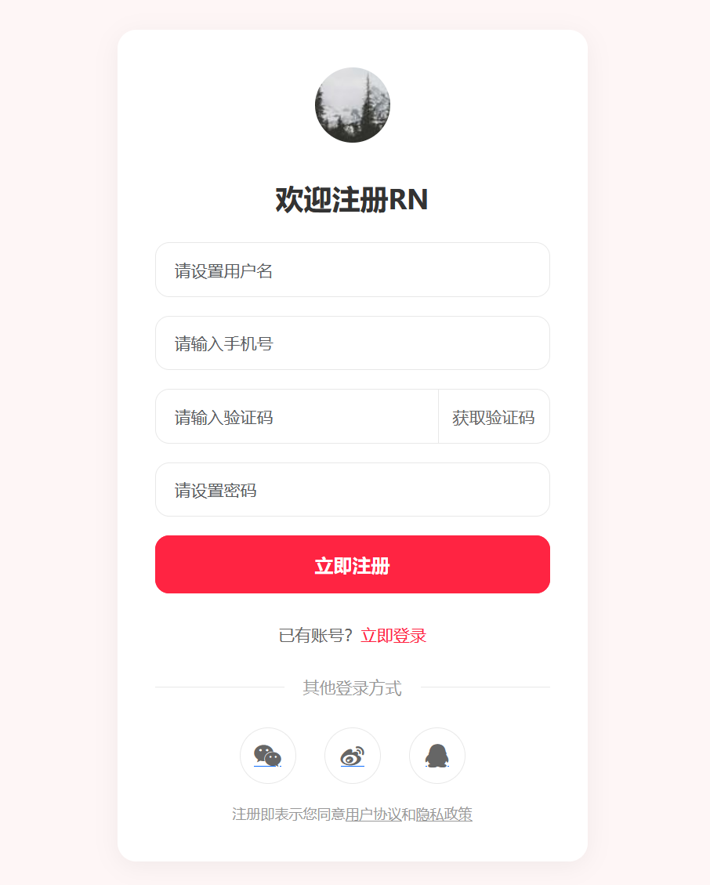


### 使用 Thymeleaf 模拟引擎


```html
<!DOCTYPE html>
<!-- 引入 Thymeleaf -->
<!--<html lang="en">-->
<html lang="en" xmlns:th="http://www.thymeleaf.org">
<head>
    <meta charset="UTF-8">
    <meta name="viewport" content="width=device-width, initial-scale=1.0">
    <title>RN - 注册</title>
    <!-- 引入 Bootstrap CSS -->
    <!--<link href="https://cdn.jsdelivr.net/npm/bootstrap@5.3.6/dist/css/bootstrap.min.css" rel="stylesheet">-->
    <link href="https://cdn.jsdelivr.net/npm/bootstrap@5.3.6/dist/css/bootstrap.min.css" th:href="@{/css/bootstrap.min.css}" rel="stylesheet">
    <!-- 引入 Font Awesome -->
    <!--<link href="https://cdn.jsdelivr.net/npm/font-awesome@4.7.0/css/font-awesome.min.css" rel="stylesheet">-->
    <link href="https://cdn.jsdelivr.net/npm/font-awesome@4.7.0/css/font-awesome.min.css" th:href="@{/css/font-awesome.min.css}" rel="stylesheet">
    <!-- 自定义样式 -->
    <!-- ...为节约篇幅，此处省略非核心内容 -->
</head>
<body class="d-flex align-items-center min-vh-100 py-4">
<div class="container">
    <div class="form-container">
        <!-- Logo -->
        <div class="logo">
            <!-- Logo图片 -->
            <!-- -->
            
        </div>

        <!-- 表单标题 -->
        <h2 class="form-title">欢迎注册RN</h2>

        <!-- 注册表单 -->
        <!--<form id="registrationForm" method="post">-->
        <form id="registrationForm" th:action="@{/auth/register}" th:object="${user}" method="post">
            <!-- 用户名 -->
            <div class="mb-3">
                <!-- <input type="text" class="form-control" id="username" placeholder="请设置用户名" required>-->
                <input type="text" class="form-control" id="username" placeholder="请设置用户名" th:field="*{username}" required>
                <!--<div class="error-message" id="usernameError">用户名长度应为4-20个字符</div>-->
                <div class="error-message" id="usernameError" th:errors="*{username}"></div>
            </div>

            <!-- 手机号 -->
            <div class="mb-3">
                <!-- <input type="tel" class="form-control" id="phone" placeholder="请输入手机号" required>-->
                <input type="tel" class="form-control" id="phone" name="phone" placeholder="请输入手机号" th:field="*{phone}" required>
                <!--<div class="error-message" id="phoneError">请输入正确的手机号</div>-->
                <div class="error-message" id="phoneError" th:errors="*{phone}"></div>
            </div>

            <!-- 验证码 -->
            <div class="mb-3">
                <div class="input-group">
                    <!-- <input type="text" class="form-control" id="verificationCode" placeholder="请输入验证码" required>-->
                    <input type="text" class="form-control" id="verificationCode" name="verificationCode" placeholder="请输入验证码" th:field="*{verificationCode}" required>
                    <button type="button" class="btn btn-outline-secondary" id="getCodeBtn">获取验证码</button>
                </div>
                <!--<div class="error-message" id="codeError">验证码不正确</div>-->
                <div class="error-message" id="codeError"
                     th:errors="*{verificationCode}"></div>
            </div>

            <!-- 密码 -->
            <div class="mb-3">
                <!-- <input type="password" class="form-control" id="password" placeholder="请设置密码" required>-->
                <input type="password" class="form-control" id="password" name="password" placeholder="请设置密码" th:field="*{password}" required>
                <!--<div class="error-message" id="passwordError">密码长度应为8-20个字符，包含字母和数字</div>-->
                <div class="error-message" id="passwordError"
                     th:errors="*{password}"></div>
            </div>

            <!-- 注册按钮 -->
            <button class="btn btn-primary w-100">立即注册</button>
        </form>
        
        <!-- ...为节约篇幅，此处省略非核心内容 -->
    </div>
</div>

<!-- Bootstrap JS -->
<!--<script src="https://cdn.jsdelivr.net/npm/bootstrap@5.3.6/dist/js/bootstrap.bundle.min.js"></script>-->
<script src="https://cdn.jsdelivr.net/npm/bootstrap@5.3.6/dist/js/bootstrap.bundle.min.js" th:src="@{/js/bootstrap.bundle.min.js}"></script>


<script>
//...TODO -->
</script>
</body>
</html>
```


上述改动点

1. CSS、JS、字体文件、图片等都放在了`src/main/resources/static`目录（如下图4-3所示），以进一步优化减少网络请求。
2. 引入了 Thymeleaf 模拟引擎，与后台模型做绑定。


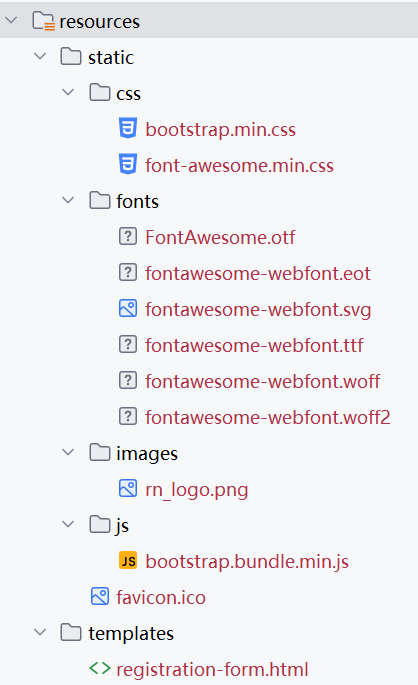


## 4.3 AI加持下快速实现表单输入校验及验证码的获取

### 实现表单验证逻辑

```js
<!-- 表单验证逻辑 -->
<script>
// 表单验证逻辑
document.getElementById('registrationForm').addEventListener('submit', function (event) {
    // 阻止表单提交
    event.preventDefault();

    // 验证用户名，用户名长度应为4-20个字符
    const username = document.getElementById('username').value;
    if (username.length < 4 || username.length > 20) {
        document.getElementById('usernameError').textContent = '用户名长度应为4-20个字符';
    } else {
        document.getElementById('usernameError').textContent = '';
    }

    // 验证手机号，手机号长度应为11个字符, 手机号格式为数字
    const phone = document.getElementById('phone').value;
    if (!/^[0-9]+$/.test(phone)) {
        document.getElementById('phoneError').textContent = '手机号格式为数字';
    } else {
        document.getElementById('phoneError').textContent = '';
    }
    if (phone.length !== 11) {
        document.getElementById('phoneError').textContent = '手机号长度应为11个字符';
    } else {
        document.getElementById('phoneError').textContent = '';
    }

    // 验证验证码，验证码长度应为6个字符, 验证码格式为数字
    const verificationCode = document.getElementById('verificationCode').value;
    if (!/^[0-9]+$/.test(verificationCode)) {
        document.getElementById('verificationCodeError').textContent = '验证码格式为数字';
    } else {
        document.getElementById('verificationCodeError').textContent = '';
    }
    if (verificationCode.length !== 6) {
        document.getElementById('verificationCodeError').textContent = '验证码长度应为6个字符';
    }

    // 验证密码，密码长度应为8-20个字符，密码格式为数字、字母
    const password = document.getElementById('password').value;
    if (!/^[0-9a-zA-Z]+$/.test(password)) {
        document.getElementById('passwordError').textContent = '密码格式为数字、字母';
    } else {
        document.getElementById('passwordError').textContent = '';
    }
    if (password.length < 8 || password.length > 20) {
        document.getElementById('passwordError').textContent = '密码长度应为8-20个字符';
    } else {
        document.getElementById('passwordError').textContent = '';
    }

    // 所有验证通过，提交表单
    this.submit();
});
</script>
```

注册表单校验效果如下图4-2所示。

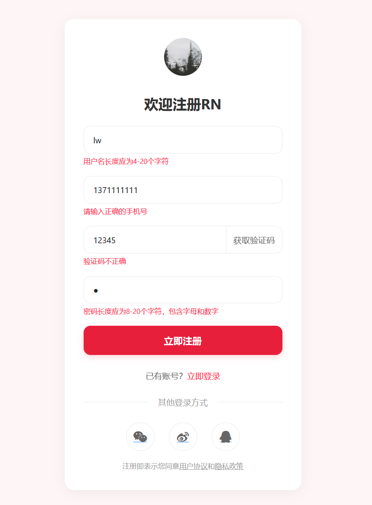


你可以根据实际需求进一步调整样式或添加更多功能，如密码强度指示器、图形验证码等。


### 实现获取验证码倒计时


```js
// 获取验证码倒计时
let countdown = 60;
let timer;
document.getElementById('getCodeBtn').addEventListener('click', function () {
    if (countdown === 60) {
        timer = setInterval(function () {
            countdown--;
            document.getElementById('getCodeBtn').textContent = countdown + '秒后重新获取';
            if (countdown === 0) {
                clearInterval(timer);
                countdown = 60;
                document.getElementById('getCodeBtn').textContent = '获取验证码';
            } else {
                document.getElementById('getCodeBtn').disabled = true;
            }
        }, 1000)
    }
})
```


### 国内CDN加速


国外的CDN服务器在国内可能访问比较慢，可以替换为国内的地址以提升访问速度。


```html
<!-- 引入 Bootstrap CSS -->
<!--<link href="https://cdn.jsdelivr.net/npm/bootstrap@5.3.6/dist/css/bootstrap.min.css"
        th:href="@{/css/bootstrap.min.css}" rel="stylesheet">-->
<!-- 替换为BootCDN -->
<link href="https://cdn.bootcdn.net/ajax/libs/bootstrap/5.3.6/css/bootstrap.min.css" 
    th:href="@{/css/bootstrap.min.css}" rel="stylesheet">

<!-- 引入 Font Awesome -->
<!--<link href="https://cdn.jsdelivr.net/npm/font-awesome@4.7.0/css/font-awesome.min.css"
        th:href="@{/css/font-awesome.min.css}" rel="stylesheet">-->
<!-- 替换为BootCDN -->
<link href="https://cdn.bootcdn.net/ajax/libs/font-awesome/4.7.0/css/font-awesome.min.css" 
    th:href="@{/css/font-awesome.min.css}" rel="stylesheet">

<!-- Bootstrap JS -->
<!--<script src="https://cdn.jsdelivr.net/npm/bootstrap@5.3.6/dist/js/bootstrap.bundle.min.js"
        th:src="@{/js/bootstrap.bundle.min.js}"></script>-->
<!-- 替换为BootCDN -->
<script src="https://cdn.bootcdn.net/ajax/libs/bootstrap/5.3.6/js/bootstrap.bundle.min.js" 
    th:src="@{/js/bootstrap.bundle.min.js}"></script>
```


## 4.4 创建一个Spring MVC控制器类处理注册请求的方法

### 实现说明

1. 控制器功能：
   - `showRegistrationForm`：显示注册表单页面
   - `processRegistrationForm`：处理注册请求，包含表单验证和业务逻辑
   - `showLoginForm`：显示登录页面

2. 表单验证：
   - 使用 JSR-303 注解（如 `@NotBlank`, `@Size`, `@Pattern`）进行字段验证
   - 检查手机号和用户名是否已存在
   - 验证失败时返回错误信息到表单页面

3. 业务逻辑：
   - 密码加密存储（使用 Spring Security 的 `PasswordEncoder`）
   - 用户信息持久化到数据库
   - 注册成功后重定向到登录页面

4. 依赖关系：
   - 需要 `UserRepository` 接口实现数据库操作
   - 需要 `PasswordEncoder` Bean 进行密码加密
   - 需要 `User` 实体类映射数据库表

实际项目中，你还需要添加短信验证码服务、密码加密配置、数据库配置等相关功能。这个控制器提供了基本的注册流程框架，可以根据具体需求进行扩展。

### Spring MVC 注册控制器实现

以下是一个处理用户注册请求的 Spring MVC 控制器类 AuthController，包含用户注册的基本逻辑和表单验证：

```java
package com.example.rednote.controller;

import com.example.rednote.dto.UserRegistrationDto;
import com.example.rednote.service.UserService;
import jakarta.validation.Valid;
import org.springframework.beans.factory.annotation.Autowired;
import org.springframework.stereotype.Controller;
import org.springframework.ui.Model;
import org.springframework.validation.BindingResult;
import org.springframework.web.bind.annotation.GetMapping;
import org.springframework.web.bind.annotation.ModelAttribute;
import org.springframework.web.bind.annotation.PostMapping;
import org.springframework.web.bind.annotation.RequestMapping;

/**
 * AuthController 认证控制器
 *
 * @version 2025/08/16
 **/
@Controller
@RequestMapping("/auth")
public class AuthController {

    @Autowired
    private UserService userService;

    /**
     * 显示注册表单页面
     */
    @GetMapping("/register")
    public String showRegistrationForm(Model model) {
        model.addAttribute("user", new UserRegistrationDto());
        return "registration-form";
    }

    /**
     * 处理注册表单提交
     */
    @PostMapping("/register")
    public String processRegistrationForm(@Valid @ModelAttribute("user") UserRegistrationDto registrationDto,
                                          BindingResult bindingResult,
                                          Model model) {
        // 检查用户名是否已存在
        if (userService.existsByUsername(registrationDto.getUsername())) {
            bindingResult.rejectValue("username", null, "该用户名已被使用");
        }

        // 检查手机号是否已注册
        if (userService.existsByPhone(registrationDto.getPhone())) {
            bindingResult.rejectValue("phone", null, "该手机号已被注册");
        }

        // 检查手机验证码是否校验通过
        if (!userService.verifyCode(registrationDto.getPhone(), registrationDto.getVerificationCode())) {
            bindingResult.rejectValue("verificationCode", null, "验证码不正确");
        }

        // 检查用户名、手机号、验证码是否通过
        // 如果有错误，则返回注册页面
        if (bindingResult.hasErrors()) {
            model.addAttribute("user", registrationDto);
            return "registration-form";
        }

        // 注册用户
        userService.registerUser(registrationDto);

        // 注册成功，跳转到登录页面
        return "redirect:/auth/login";
    }

    /**
     * 显示登录页面
     */
    @GetMapping("/login")
    public String showLoginForm() {
        return "login";
    }
}
```


在 Spring MVC 中，BindingResult 用于存储表单验证的错误信息。


### 相关支持类

#### 1. 用户注册 DTO
```java
package com.example.rednote.dto;

import jakarta.validation.constraints.NotBlank;
import jakarta.validation.constraints.Pattern;
import jakarta.validation.constraints.Size;
import lombok.Getter;
import lombok.Setter;

/**
 * UserRegistrationDto 用户注册DTO
 *
 * @version 2025/08/16
 **/
@Getter
@Setter
public class UserRegistrationDto {
    @NotBlank(message = "用户名不能为空")
    @Size(min = 4, max = 20, message = "用户名长度应为4-20个字符")
    private String username;

    @NotBlank(message = "手机号不能为空")
    @Size(min = 11, max = 11, message = "手机号长度应为11个字符")
    @Pattern(regexp = "^[1][3,4,5,7,8][0-9]{9}$", message = "手机号格式不正确")
    private String phone;

    @NotBlank(message = "验证码不能为空")
    @Size(min = 6, max = 6, message = "验证码长度应为6个字符")
    @Pattern(regexp = "^[0-9]{6}$", message = "验证码格式不正确")
    private String verificationCode;

    @NotBlank(message = "密码不能为空")
    @Size(min = 8, max = 20, message = "密码长度应为8-20个字符")
    @Pattern(regexp = "^[a-zA-Z0-9_]{8,20}$", message = "密码格式不正确")
    private String password;
}
```

#### 2. 用户服务接口
```java
package com.example.rednote.service;

import com.example.rednote.dto.UserRegistrationDto;
import jakarta.validation.Valid;
import jakarta.validation.constraints.NotBlank;
import jakarta.validation.constraints.Pattern;
import jakarta.validation.constraints.Size;

/**
 * UserService 用户服务
 *
 * @version 2025/08/16
 **/
public interface UserService {
    /**
     * 检查用户名是否已存在
     */
    boolean existsByUsername(@NotBlank(message = "用户名不能为空") @Size(min = 4, max = 20, message = "用户名长度应为4-20个字符") String username);

    /**
     * 检查手机号是否已注册
     */
    boolean existsByPhone(@NotBlank(message = "手机号不能为空") @Size(min = 11, max = 11, message = "手机号长度应为11个字符") @Pattern(regexp = "^[1][3,4,5,7,8][0-9]{8}$", message = "手机号格式不正确") String phone);

    /**
     * 验证短信验证码
     */
    boolean verifyCode(@NotBlank(message = "手机号不能为空") @Size(min = 11, max = 11, message = "手机号长度应为11个字符") @Pattern(regexp = "^[1][3,4,5,7,8][0-9]{9}$", message = "手机号格式不正确") String phone, @NotBlank(message = "验证码不能为空") @Size(min = 6, max = 6, message = "验证码长度应为6个字符") @Pattern(regexp = "^[0-9]{6}$", message = "验证码格式不正确") String verificationCode);

    /**
     * 注册新用户
     */
    void registerUser(@Valid UserRegistrationDto registrationDto);
}
```


## 4.5 掌握Repository设计模式来实现UserRepository

本节内容：

1. 用户表结构设计
2. 创建用户实体类，使用 `@Entity`、`@Table` 等注解映射到用户表
3. 创建继承自 Repository 的UserRepository接口，用于操作用户表

### 用户实体


```java
package com.example.rednote.entity;

import jakarta.persistence.Entity;
import jakarta.persistence.GenerationType;
import jakarta.persistence.Table;
import lombok.AllArgsConstructor;
import lombok.Data;
import lombok.NoArgsConstructor;

/**
 * User 用户实体
 *
 * @version 2025/08/16
 **/
@Entity
@Table(name = "t_user")
// @Data集合了@Getter @Setter @ToString @EqualsAndHashCode
@Data
// 无参构造器
@NoArgsConstructor
// 包含所有参数的构造器
@AllArgsConstructor
public class User {
    /**
     * 用户ID
     */
    @jakarta.persistence.Id
    @jakarta.persistence.GeneratedValue(strategy = GenerationType.AUTO)
    private Long userId;

    /**
     * 用户名
     */
    private String username;

    /**
     * 密码
     */
    private String password;

    /**
     * 手机号
     */
    private String phone;
}
```


‌GenerationType ‌是 Java Persistence API （JPA）中的一个枚举类型，用于指定数据库中自动生成主键值的策略。它包含了以下四种类型：

* AUTO ‌：由持久化提供者自动选择生成策略，默认为此选项。根据底层数据库的支持情况，可能会选择 IDENTITY 、 SEQUENCE 或 TABLE 。
* IDENTITY ‌：使用数据库的自增长特性生成主键值。适用于支持自增长列的数据库，如 MySQL 、 SQL Server 等。
* SEQUENCE ‌：使用数据库的序列生成主键值。适用于支持序列的数据库，如 Oracle 、 PostgreSQL 等。
* TABLE ‌：使用一个特定的数据库表来生成主键值。它会创建一个表来保存生成的主键值，并通过表中的行锁来保证唯一性。适用于不支持自增长列或序列的数据库‌


这些类型可以通过在实体类的主键字段上使用`@GeneratedValue`注解来指定。


### 用户资源库


```java
package com.example.rednote.repository;

import com.example.rednote.entity.User;
import org.springframework.data.repository.Repository;

import java.util.Optional;

/**
 * UserRepository 用户资源库
 *
 * @version 2025/08/16
 **/
public interface UserRepository extends Repository<User, Long> {
    /**
     * 保存用户
     *
     * @param user
     * @return
     */
    User save(User user);

    /**
     * 根据手机号查找用户
     *
     * @param phone
     * @return
     */
    Optional<User> findByPhone(String phone);

    /**
     * 根据用户名查找用户
     *
     * @param username
     * @return
     */
    Optional<User> findByUsername(String username);
}
```


## 4.6 实现UserServiceImpl服务，调用UserRepository接口方法

### 用户服务实现


```java
package com.example.rednote.service.impl;

import com.example.rednote.dto.UserRegistrationDto;
import com.example.rednote.entity.User;
import com.example.rednote.repository.UserRepository;
import com.example.rednote.service.UserService;
import org.springframework.beans.factory.annotation.Autowired;
import org.springframework.stereotype.Service;

/**
 * UserServiceImpl 用户服务
 *
 * @version 2025/08/16
 **/
@Service
public class UserServiceImpl implements UserService {
    @Autowired
    private UserRepository userRepository;

    @Override
    public boolean existsByUsername(String username) {
        return userRepository.findByUsername(username).isPresent();
    }

    @Override
    public boolean existsByPhone(String phone) {
        return userRepository.findByPhone(phone).isPresent();
    }

    @Override
    public boolean verifyCode(String phone, String verificationCode) {
        // 实际项目中会验证验证码逻辑。
        // 模拟验证码校验成功。简化处理，仅返回true
        return true;
    }

    @Override
    public void registerUser(UserRegistrationDto registrationDto) {
        // 创建新用户
        User user = new User();
        user.setUsername(registrationDto.getUsername());
        user.setPassword(registrationDto.getPassword());
        user.setPhone(registrationDto.getPhone());

        // 保存用户
        userRepository.save(user);
    }
}
```


## 4.7 创建Spring Security配置类，允许任何请求都不需要授权

创建Spring Security配置类，允许任何请求都不需要授权。

```java
package com.example.rednote.config;

import org.springframework.context.annotation.Bean;
import org.springframework.context.annotation.Configuration;
import org.springframework.security.config.annotation.web.builders.HttpSecurity;
import org.springframework.security.config.annotation.web.configuration.EnableWebSecurity;
import org.springframework.security.web.SecurityFilterChain;

import static org.springframework.security.config.Customizer.withDefaults;

/**
 * WebSecurityConfig 安全配置
 *
 * @version 2025/08/16
 **/
@Configuration
@EnableWebSecurity
public class WebSecurityConfig {

    // 添加安全过滤器链
    @Bean
    public SecurityFilterChain filterChain(HttpSecurity http) throws Exception {
        http
                // 禁用CSRF防护
                .csrf(csrf -> csrf.disable())
                .authorizeHttpRequests(authorize -> authorize
                        // 允许所有请求不需要授权
                        .anyRequest().permitAll()
                )
                .formLogin(Customizer.withDefaults());

        return http.build();
    }
}
```


## 4.8 增加应用配实现表结构自动更新

### 修改应用配置

在 application.properties 文件种，增加如下配置，以便于开发、测试：

```
## 每次运行程序，没有表会新建表，表内有数据会清空
spring.jpa.properties.hibernate.hbm2ddl.auto=create
## 显示SQL
spring.jpa.show-sql=true

# Thymeleaf配置
spring.thymeleaf.cache=false
spring.thymeleaf.mode=HTML5
spring.thymeleaf.encoding=UTF-8

# Spring Boot Devtools
spring.devtools.restart.enabled=true
spring.devtools.livereload.enabled=true
```

当希望每次修改代码之后想重启应用，在上述配置基础上，IntelliJ IDEA执行构建项目（Build -> Build Project）会触发自动重启。


#### 可选值及含义

`spring.jpa.properties.hibernate.hbm2ddl.auto` 是 Spring Boot 中用于配置 Hibernate 自动生成或更新数据库表结构的属性。它通过 Hibernate 的 `hbm2ddl` 工具在应用程序启动时自动执行 DDL（数据定义语言）操作，如创建、更新或验证数据库表结构。


1. `none`  
   - 作用：禁用自动 DDL 操作。  
   - 适用场景：完全手动管理数据库结构（如使用 Flyway/Liquibase）。

2. `create`  
   - 作用：启动时删除并重新创建所有表（基于实体类映射）。  
   - 数据丢失：原有数据会被清空。  
   - 适用场景：仅用于开发/测试环境，尤其是内存数据库（如 H2）。

3. `create-drop`  
   - 作用：与 `create` 类似，但在应用关闭时删除所有表。  
   - 适用场景：临时测试或演示环境。

4. `update`  
   - 作用：Hibernate 会对比实体类与现有表结构，仅执行必要的变更（如添加列）。  
   - 限制：不会删除未使用的列或表，复杂变更可能需手动处理。  
   - 风险：生产环境慎用，可能导致数据丢失或结构不一致。

5. `validate`  
   - 作用：仅验证实体类与表结构是否匹配，不执行任何变更。  
   - 适用场景：生产环境，确保部署前结构一致。


#### 注意事项：
1. 生产环境风险  
   - `create`/`create-drop`/`update` 可能导致数据丢失，生产环境建议使用数据库迁移工具（如 Flyway）。
   
2. 与 `spring.jpa.hibernate.ddl-auto` 的关系  
   - 在 Spring Boot 中，`spring.jpa.hibernate.ddl-auto` 是更简洁的等效配置（底层同样设置 `hbm2ddl.auto`）。

3. Hibernate 版本差异  
   - 不同 Hibernate 版本对 `update` 的支持可能不同，复杂变更建议手动编写 SQL。

4. 日志调试  
   - 启用 Hibernate SQL 日志可查看生成的 DDL 语句：
     ```properties
     spring.jpa.show-sql=true
     logging.level.org.hibernate.SQL=DEBUG
     logging.level.org.hibernate.type.descriptor.sql.BasicBinder=TRACE
     ```


#### 总结
- 开发环境：`update` 或 `create-drop`（方便快速迭代）。  
- 生产环境：`validate` 或 `none`（结合迁移工具）。  
- 关键原则：始终备份数据，避免在生产环境使用破坏性操作。


### 表单提交数据校验改为后台校验


因为已经有后台校验，所以可以把前台校验的内容注释掉：


```js
// 表单验证逻辑
document.getElementById('registrationForm').addEventListener('submit', function (event) {
    // 阻止表单提交
    event.preventDefault();

    /*
    // 验证用户名，用户名长度应为4-20个字符
    const username = document.getElementById('username').value;
    if (username.length < 4 || username.length > 20) {
        document.getElementById('usernameError').textContent = '用户名长度应为4-20个字符';
    } else {
        document.getElementById('usernameError').textContent = '';
    }

    // 验证手机号，手机号长度应为11个字符, 手机号格式为数字
    const phone = document.getElementById('phone').value;
    if (!/^[0-9]+$/.test(phone)) {
        document.getElementById('phoneError').textContent = '手机号格式为数字';
    } else {
        document.getElementById('phoneError').textContent = '';
    }
    if (phone.length !== 11) {
        document.getElementById('phoneError').textContent = '手机号长度应为11个字符';
    } else {
        document.getElementById('phoneError').textContent = '';
    }

    // 验证验证码，验证码长度应为6个字符, 验证码格式为数字
    const verificationCode = document.getElementById('verificationCode').value;
    if (!/^[0-9]+$/.test(verificationCode)) {
        document.getElementById('verificationCodeError').textContent = '验证码格式为数字';
    } else {
        document.getElementById('verificationCodeError').textContent = '';
    }
    if (verificationCode.length !== 6) {
        document.getElementById('verificationCodeError').textContent = '验证码长度应为6个字符';
    }

    // 验证密码，密码长度应为8-20个字符，密码格式为数字、字母
    const password = document.getElementById('password').value;
    if (!/^[0-9a-zA-Z]+$/.test(password)) {
        document.getElementById('passwordError').textContent = '密码格式为数字、字母';
    } else {
        document.getElementById('passwordError').textContent = '';
    }
    if (password.length < 8 || password.length > 20) {
        document.getElementById('passwordError').textContent = '密码长度应为8-20个字符';
    } else {
        document.getElementById('passwordError').textContent = '';
    }
    */
    // 所有验证通过，提交表单
    this.submit();
});
```

### 运行应用进行测试


访问浏览器地址：<http://localhost:8080/auth/register>，开源看到如下注册界面。


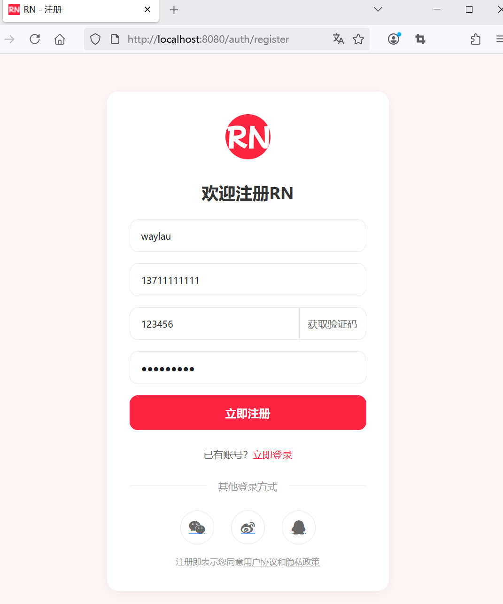


点击“立即注册”按钮，可以在应用控制台日志里面看到如下SQL语句的执行：

```sql
Hibernate: select u1_0.user_id,u1_0.password,u1_0.phone,u1_0.username from t_user u1_0 where u1_0.username=?
Hibernate: select u1_0.user_id,u1_0.password,u1_0.phone,u1_0.username from t_user u1_0 where u1_0.phone=?
Hibernate: select next_val as id_val from t_user_seq for update
Hibernate: update t_user_seq set next_val= ? where next_val=?
Hibernate: insert into t_user (password,phone,username,user_id) values (?,?,?,?)
```


通过MySQL客户端工具，查询数据库用户表的数据，则可以看到查询内容如下：


```
mysql> SELECT * FROM t_user;
+---------+------------+-------------+----------+
| user_id | password   | phone       | username |
+---------+------------+-------------+----------+
|       1 | 12345qwert | 13711111111 | user     |
+---------+------------+-------------+----------+
1 row in set (0.017 sec)
```


因此，验证用户注册的数据已经能完整记录进数据库了。


我们可以将相同的数据再注册一遍，以验证数据校验功能是否生效。


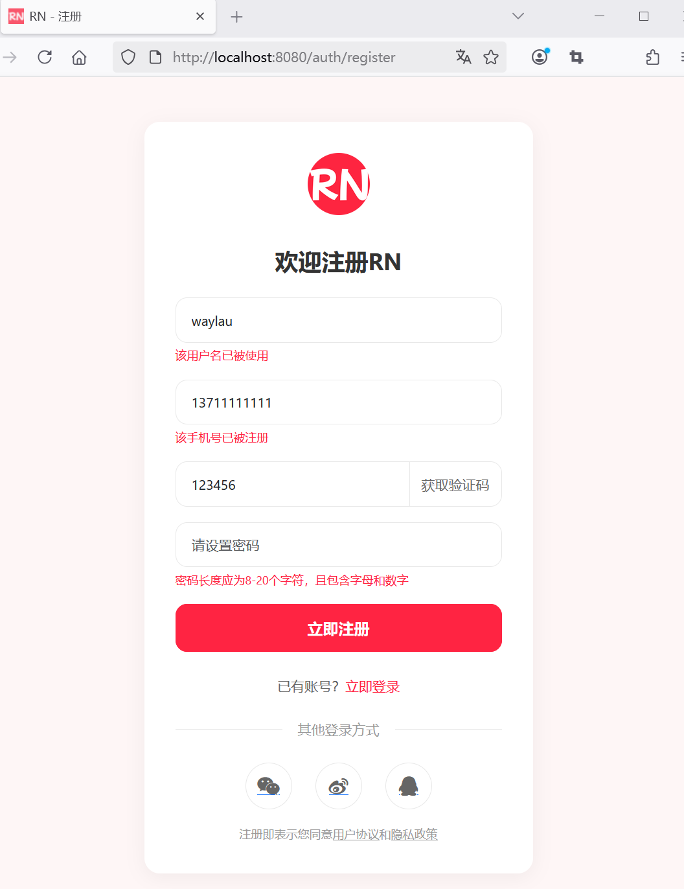

如上图4-5所示，相同数据不允许再此注册，从而证明数据校验功能是生效的。


## 4.9 使用BCryptPasswordEncoder对用户密码进行加密和验证

`BCryptPasswordEncoder` 是 Spring Security 提供的一个强大密码加密工具，它使用 BCrypt 哈希算法对密码进行加密，具有自动生成盐值、自适应迭代因子等安全特性。以下是具体实现方法：


### 配置 BCryptPasswordEncoder Bean

在安全配置类种，注册 `BCryptPasswordEncoder` Bean：
```java
package com.example.rednote.config;

// ...为节约篇幅，此处省略非核心内容

import org.springframework.context.annotation.Bean;
import org.springframework.context.annotation.Configuration;
import org.springframework.security.crypto.bcrypt.BCryptPasswordEncoder;
import org.springframework.security.crypto.password.PasswordEncoder;

/**
 * WebSecurityConfig 安全配置类
 * @version 2025/05/30
**/
@Configuration
@EnableWebSecurity
public class WebSecurityConfig {
    // ...为节约篇幅，此处省略非核心内容

    @Bean
    public PasswordEncoder passwordEncoder() {
        return new BCryptPasswordEncoder(); // 默认强度为10
        // 或指定强度：new BCryptPasswordEncoder(12)
    }
}

```


### 在服务层使用密码加密

修改UserServiceImpl，在用户注册时加密密码：

```java
@Override
public User registerUser(UserRegistrationDto registrationDto) {
    // 创建新用户
    User user = new User();
    user.setUsername(registrationDto.getUsername());
    user.setPhone(registrationDto.getPhone());

    // 加密密码
    // user.setPassword(registrationDto.getPassword());
    String encodedPassword = passwordEncoder.encode(registrationDto.getPassword());
    user.setPassword(encodedPassword);

    // 保存用户
    return userRepository.save(user);
}
```

### 允许调试


启动应用后，在应用里面执行注册。

注册完成之后，通过MySQL客户端工具，查询数据库用户表的数据，则可以看到查询内容如下：


```
mysql> SELECT * FROM t_user;
+---------+--------------------------------------------------------------+-------------+----------+
| user_id | password                                                     | phone       | username |
+---------+--------------------------------------------------------------+-------------+----------+
|       1 | $2a$10$596iAK4CnjYZJBfssZS16uZ0vfXqer6YNnutih8MlX0wvScEF8Cby | 13711111111 | user     |
+---------+--------------------------------------------------------------+-------------+----------+
1 row in set (0.019 sec)
```

可以看到，明文输入的密码“12345qwert”被加密为密文“$2a$10$596iAK4CnjYZJBfssZS16uZ0vfXqer6YNnutih8MlX0wvScEF8Cby”保存进了数据库。


### 注意事项

1. 盐值自动生成：
   - BCrypt 会自动生成随机盐值，并将其包含在加密后的密码字符串中
   - 无需手动管理盐值，相同密码每次加密结果都不同

2. 密码强度：
   - 默认强度为 10，数值越大加密越慢但安全性更高
   - 可通过 `new BCryptPasswordEncoder(12)` 指定强度

3. 存储要求：
   - 加密后的密码长度固定为 60 个字符
   - 数据库字段应设置为 `VARCHAR(60)` 或更大

4. 安全建议：
   - 永远不要存储明文密码
   - 使用 HTTPS 保护密码传输
   - 定期升级 BCrypt 强度


通过 `BCryptPasswordEncoder`，你可以轻松实现安全的密码加密和验证机制，保护用户账户安全。


## 4.10 善用AI，掌握校验、数据库操作、加密及性能优化技巧

### 校验技巧

1. 前端校验不可信，改为后端校验
2. 使用Validation简化校验
3. 善用AI，但不要迷信AI

### 数据库操作技巧

1. JPA简化数据库操作
2. 开发环境：通常使用create-drop或create、update，以便每次启动应用时都有最新的数据库结构。
3. 测试环境：使用create-drop或create，确保每次测试都是在一个干净的环境中。
4. 生产环境：通常使用none或validate，以避免在生产数据库中不小心更改表结构或数据。
5. 开发、测试时可以打印SQL，以便于观察数据SQL的执行情况

### 加密技巧

1. 盐值自动生成：
   - BCrypt 会自动生成随机盐值，并将其包含在加密后的密码字符串中
   - 无需手动管理盐值，相同密码每次加密结果都不同

2. 密码强度：
   - 默认强度为 10，数值越大加密越慢但安全性更高
   - 可通过 `new BCryptPasswordEncoder(12)` 指定强度

3. 存储要求：
   - 加密后的密码长度固定为 60 个字符
   - 数据库字段应设置为 `VARCHAR(60)` 或更大

4. 安全建议：
   - 永远不要存储明文密码
   - 使用 HTTPS 保护密码传输
   - 定期升级 BCrypt 强度

### 前端性能优化

1. 使用压缩后的CSS、JS文件
2. LOGO等图片尺寸尽可能压缩到合适的最新尺寸。比如一张`300*300`分辨率的图片，占用的体积是7.97KB，经过压缩，将尺寸调整为`64*64`分辨率，则占用的体积为783B，仅原来的十分之一。


## 5.1 登录功能概述

基于 Bootstrap 和 Thymeleaf 实现的仿小红书登录表单。这个表单采用了小红书的品牌风格，包括红色主色调、简洁的布局和现代化的交互效果。


    


这个登录表单具有以下特点：

1. 视觉风格：
   - 采用小红书标志性的红色作为主色调
   - 圆润的边角设计和简洁的布局
   - 清晰的视觉层次和留白

2. 功能特点：
   - 支持用户名登录
   - 密码可见性切换功能
   - 记住我选项
   - 社交账号快速登录
   - 错误提示和表单验证

3. 交互体验：
   - 输入框焦点状态变化
   - 密码显示/隐藏切换动画
   - 按钮悬停效果
   - 平滑的错误提示展示

4. 响应式设计：
   - 使用 Bootstrap 的响应式布局
   - 在不同设备上都能良好展示

表单集成了 Thymeleaf 的错误处理机制，可以显示服务器端返回的登录错误信息。你可以根据实际需求进一步调整样式或添加更多功能。


## 5.2 使用Bootstrap、Font Awesome以及Thymeleaf轻松实现登录表单

可以在注册表单的基础上，进行代码的复用。


### 登录表单实现方案


创建login-form.html：

```html
<!DOCTYPE html>
<html lang="en" xmlns:th="http://www.thymeleaf.org">
<head>
    <meta charset="UTF-8">
    <meta name="viewport" content="width=device-width, initial-scale=1.0">
    <title>RN - 登录</title>
    <!-- 引入 Bootstrap CSS -->
    <link href="https://cdn.jsdelivr.net/npm/bootstrap@5.3.6/dist/css/bootstrap.min.css" th:href="@{/css/bootstrap.min.css}" rel="stylesheet">
    <!-- 引入 Font Awesome -->
    <link href="https://cdn.jsdelivr.net/npm/font-awesome@4.7.0/css/font-awesome.min.css" th:href="@{/css/font-awesome.min.css}" rel="stylesheet">
    <!-- 自定义样式 -->
    <style>
        body {
            background-color: #fef6f6;
            font-family: -apple-system, BlinkMacSystemFont, "Segoe UI", Roboto, Helvetica, Arial, sans-serif;
        }

        .form-container {
            background-color: white;
            border-radius: 16px;
            box-shadow: 0 4px 20px rgba(0, 0, 0, 0.05);
            padding: 32px;
            max-width: 400px;
            margin: 0 auto;
        }

        .logo {
            text-align: center;
            margin-bottom: 32px;
        }

        .logo img {
            width: 64px;
            height: 64px;
        }

        .form-title {
            font-size: 24px;
            font-weight: 700;
            color: #333;
            margin-bottom: 24px;
            text-align: center;
        }

        .form-control {
            border-radius: 12px;
            border: 1px solid #e8e8e8;
            padding: 12px 16px;
            height: auto;
            font-size: 14px;
        }

        .form-control:focus {
            border-color: #ff2442;
            box-shadow: 0 0 0 2px rgba(255, 36, 66, 0.1);
        }

        .btn-primary {
            background-color: #ff2442;
            border-color: #ff2442;
            border-radius: 12px;
            padding: 12px;
            font-size: 16px;
            font-weight: 600;
            transition: all 0.3s ease;
        }

        .btn-primary:hover,
        .btn-primary:focus {
            background-color: #e61e3a;
            border-color: #e61e3a;
            box-shadow: 0 4px 12px rgba(255, 36, 66, 0.2);
        }

        .btn-outline-secondary {
            border-radius: 12px;
            padding: 12px;
            font-size: 14px;
            color: #666;
            border-color: #e8e8e8;
        }

        .btn-outline-secondary:hover {
            background-color: #f8f8f8;
            border-color: #ddd;
        }

        .form-footer {
            text-align: center;
            margin-top: 24px;
            font-size: 14px;
            color: #666;
        }

        .form-footer a {
            color: #ff2442;
            text-decoration: none;
        }

        .form-footer a:hover {
            text-decoration: underline;
        }

        .divider {
            display: flex;
            align-items: center;
            margin: 24px 0;
            color: #999;
            font-size: 14px;
        }

        .divider::before,
        .divider::after {
            content: '';
            flex: 1;
            border-bottom: 1px solid #e8e8e8;
        }

        .divider::before {
            margin-right: 16px;
        }

        .divider::after {
            margin-left: 16px;
        }

        .social-login {
            display: flex;
            justify-content: center;
            gap: 24px;
            margin-top: 24px;
        }

        .social-btn {
            width: 48px;
            height: 48px;
            border-radius: 50%;
            display: flex;
            align-items: center;
            justify-content: center;
            border: 1px solid #e8e8e8;
            transition: all 0.3s ease;
        }

        .social-btn:hover {
            background-color: #f8f8f8;
            transform: translateY(-2px);
        }

        .social-btn i {
            font-size: 20px;
            color: #666;
        }

        .policy {
            font-size: 12px;
            color: #999;
            text-align: center;
            margin-top: 16px;
        }

        .policy a {
            color: #999;
            text-decoration: underline;
        }

        .error-message {
            color: #ff2442;
            font-size: 12px;
            margin-top: 4px;
        }
    </style>
</head>
<body class="d-flex align-items-center min-vh-100 py-4">
<div class="container">
    <div class="form-container">
        <!-- Logo -->
        <div class="logo">
            
        </div>

        <!-- 表单标题 -->
        <h2 class="form-title">欢迎登录RN</h2>

        <!-- 注册表单 -->
        <form id="loginForm" th:action="@{/auth/login}" th:object="${user}" method="post">
            <!-- 用户名输入框 -->
            <div class="mb-3">
                <input type="text" class="form-control" id="username" name="username" th:field="*{username}"
                       placeholder="请输入用户名" required>
                <div class="error-message" id="usernameError" th:errors="*{username}"></div>
            </div>

            <!-- 密码输入框 -->
            <div class="mb-3">
                <div class="input-group">
                    <input type="password" class="form-control" id="password" name="password" th:field="*{password}"
                           placeholder="请设置密码" required>
                    <!-- 切换密码显示模式 -->
                    <button type="button" class="btn btn-outline-secondary" id="togglePassword">
                        <i class="fa fa-eye-slash"></i>
                    </button>
                </div>

                <div class="error-message" id="passwordError" th:errors="*{password}"></div>
            </div>

            <!-- 记住我 -->
            <div class="form-check mb-3">
                <input type="checkbox" class="form-check-input" id="rememberMe">
                <label class="form-check-label" for="rememberMe">记住我</label>
            </div>

            <!--登录按钮 -->
            <button class="btn btn-primary w-100">登录</button>
        </form>


    </div>
    <!-- 忘记密码 -->
    <div class="form-footer">
        <a href="#">忘记密码</a>
    </div>

    <!-- 其他登录方式 -->
    <div class="divider">
        <span>其他登录方式</span>
    </div>

    <!-- 社交登录 -->
    <div class="social-login">
        <a href="#" class="social-btn">
            <i class="fa fa-weixin"></i>
        </a>
        <a href="#" class="social-btn">
            <i class="fa fa-weibo"></i>
        </a>
        <a href="#" class="social-btn">
            <i class="fa fa-qq"></i>
        </a>
    </div>

    <!-- 注册链接 -->
    <div class="form-footer">
        还没有账号？ <a href="/auth/register" th:href="@{/auth/register}">立即注册</a>
    </div>

    <!-- 用户协议、隐藏政策 -->
    <div class="policy">
        注册即表示同意<a href="#">用户协议</a>和<a href="#">隐藏政策</a>
    </div>
</div>

<!-- Bootstrap JS -->
<script src="https://cdn.jsdelivr.net/npm/bootstrap@5.3.6/dist/js/bootstrap.bundle.min.js" th:src="@{/js/bootstrap.bundle.min.js}"></script>


<!-- TODO 表单交互逻辑 -->

</body>
</html>
```


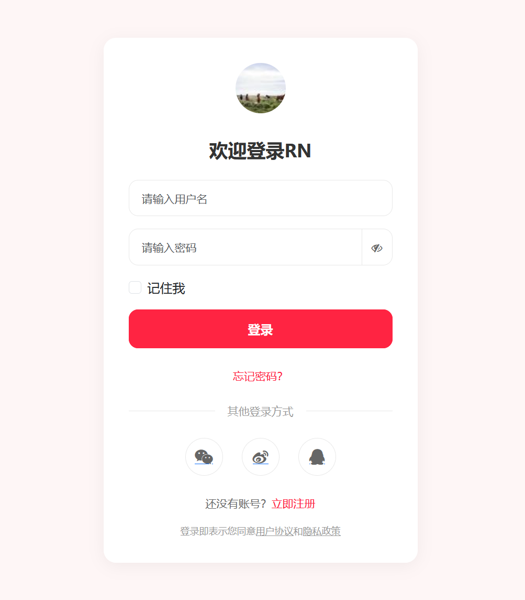


### 实现表单验证逻辑

```html
<!-- 表单交互逻辑 -->
<script>
// 表单验证逻辑
document.getElementById('loginForm').addEventListener('submit', function (event) {
    // 阻止表单提交
    event.preventDefault();

    // 验证用户名，用户名长度应为4-20个字符
    const username = document.getElementById('username').value;
    if (username.length < 4 || username.length > 20) {
        document.getElementById('usernameError').textContent = '用户名长度应为4-20个字符';
    } else {
        document.getElementById('usernameError').textContent = '';
    }

    // 验证密码，密码长度应为8-20个字符，密码格式为数字、字母
    const password = document.getElementById('password').value;
    if (!/^[0-9a-zA-Z]+$/.test(password)) {
        document.getElementById('passwordError').textContent = '密码格式为数字、字母';
    } else {
        document.getElementById('passwordError').textContent = '';
    }
    if (password.length < 8 || password.length > 20) {
        document.getElementById('passwordError').textContent = '密码长度应为8-20个字符';
    } else {
        document.getElementById('passwordError').textContent = '';
    }

    // 所有验证通过，提交表单
    this.submit();
});
</script>
```


登录表单校验效果如下图5-2所示。

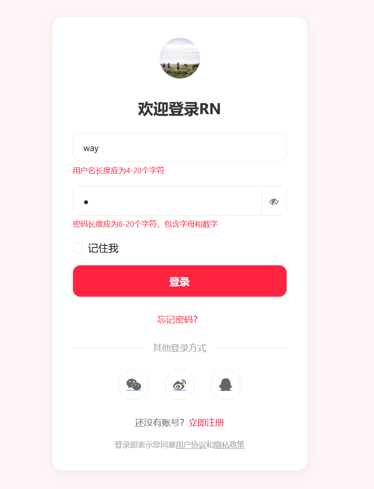


### 实现密码显示/隐藏切换


```html
<!-- 表单交互逻辑 -->
<script>
// ...为节约篇幅，此处省略非核心内容

// 切换密码显示模式
document.getElementById('togglePassword').addEventListener('click', function () {
    // 获取密码输入框
    const passwordInput = document.getElementById('password');

    if (passwordInput.type === 'password') {
        // 切换为明文模式
        passwordInput.type = 'text';
        this.querySelector('i').classList.remove('fa-eye-slash');
        this.querySelector('i').classList.add('fa-eye');
    } else {
        // 切换为密文模式
        passwordInput.type = 'password';
        this.querySelector('i').classList.remove('fa-eye');
        this.querySelector('i').classList.add('fa-eye-slash');
    }
})
</script>
```

密码显示/隐藏切换效果如下图5-2所示。

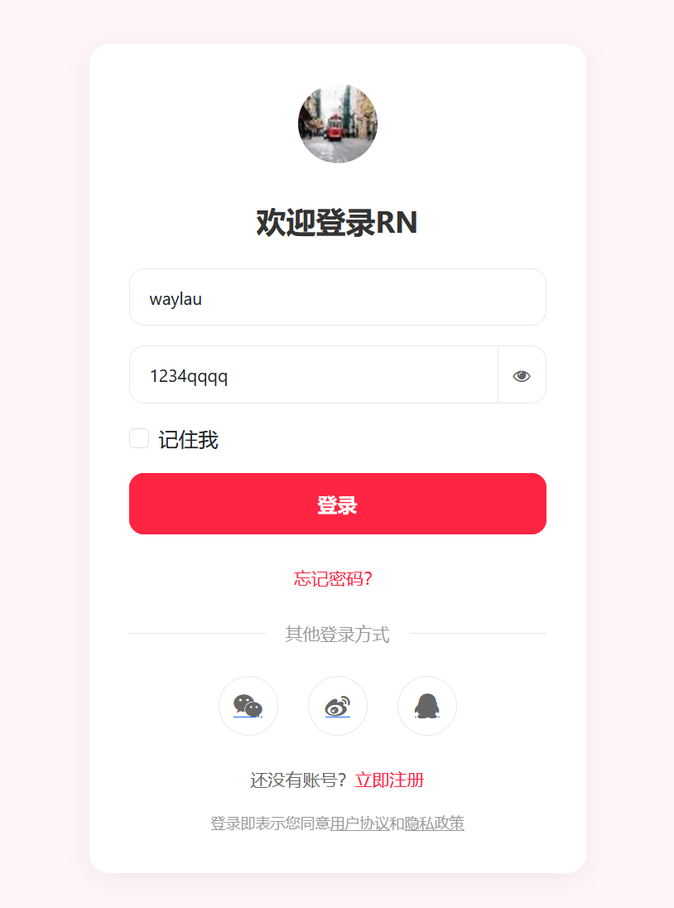


## 5.3 创建控制器方法来处理登录请求

### 实现说明

1. 控制器功能：
   - `showLoginForm`：显示登录表单，处理登录错误消息
   - `processLoginForm`：处理登录请求，验证用户名和密码（简化示例）


2. 表单验证：
   - 使用 `@ModelAttribute` 获取表单参数
   - 实际项目中可使用 `@Valid` 和 `BindingResult` 进行更复杂的表单验证

3. 登录处理：
   - 示例中使用简单的用户名密码比对
   - 实际项目中应使用 Spring Security 进行安全认证
   - 密码应使用 BCrypt 等强哈希算法加密存储

4. 错误处理：
   - 登录失败时通过重定向传递错误参数
   - 登录页面根据错误参数显示相应错误信息

5. 安全建议：
   - 永远不要明文存储密码
   - 使用 HTTPS 保护登录过程
   - 实现密码加密和盐值处理
   - 添加 CSRF 保护（Spring Security 默认启用）

在实际项目中，建议使用 Spring Security 处理认证和授权，这样可以获得更完善的安全功能，包括密码加密、会话管理、CSRF 保护等。上面的自定义控制器示例仅适用于简单场景或学习目的。

### Spring MVC 登录控制器实现

修改AuthController，增加如下代码，用于处理表单验证、用户认证和登录失败等场景：

```java
/**
 * 显示登录页面
 */
@GetMapping("/login")
public String showLoginForm(Model model) {
   model.addAttribute("user", new UserLoginDto());
   return "login-form";
}

/**
 * 处理登录表单的提交
 */
@PostMapping("/login")
public String processLoginForm(@Valid @ModelAttribute("user") UserLoginDto loginDto,
                              BindingResult bindingResult,
                              Model model) {
   // 检查用户名是否存在
   if (!userService.existsByUsername(loginDto.getUsername())) {
      bindingResult.rejectValue("username", null, "该用户名未注册");

      model.addAttribute("user", loginDto);
      return "login-form";
   }

   // 检查密码是否正确
   if (!userService.verifyPassword(loginDto.getUsername(), loginDto.getPassword())) {
      bindingResult.rejectValue("password", null, "密码错误");

      model.addAttribute("user", loginDto);
      return "login-form";
   }

   // 登录成功，重定向到首页或
   return "redirect:/";
}
```

检查用户名是否已存在：

1. UserRepository接口中添加根据用户名查询用户的方法
2. 在控制器的登录处理方法中，调用UserRepository接口的查询方法，从数据库中获取用户信息
3. 处理查询结果，若用户不存在则返回登录失败信息


### 相关支持类

#### 1. 用户登录 DTO
```java
package com.example.rednote.dto;

import jakarta.validation.constraints.NotBlank;
import jakarta.validation.constraints.Pattern;
import jakarta.validation.constraints.Size;
import lombok.Getter;
import lombok.Setter;

/**
 * UserLoginDto 用户登录DTO
 *
 * @version 2025/08/16
 **/
@Getter
@Setter
public class UserLoginDto {
    @NotBlank(message = "用户名不能为空")
    @Size(min = 4, max = 20, message = "用户名长度应为4-20个字符")
    private String username;

    @NotBlank(message = "密码不能为空")
    @Size(min = 8, max = 20, message = "密码长度应为8-20个字符")
    @Pattern(regexp = "^[a-zA-Z0-9_]{8,20}$", message = "密码格式不正确")
    private String password;

    private boolean rememberMe;
}
```

#### 2. 用户服务接口

在UserService中增加如下接口用于验证密码：


```java
/**
 * 验证密码
 */
boolean verifyPassword(@NotBlank(message = "用户名不能为空") @Size(min = 4, max = 20, message = "用户名长度应为4-20个字符") String username, @NotBlank(message = "密码不能为空") @Size(min = 8, max = 20, message = "密码长度应为8-20个字符") @Pattern(regexp = "^[a-zA-Z0-9_]{8,20}$", message = "密码格式不正确") String password);
```


## 5.4 校验用户输入的密码是否正确

### 代码实现

```java
@Override
public boolean verifyPassword(String username, String password) {
    boolean isMatch = false;

    // 获取已有加密密码
    if(userRepository.findByUsername(username).isPresent()) {
        User user = userRepository.findByUsername(username).get();
        String encodedPassword = user.getPassword();

        // 验证密码是否与加密后的密码匹配
        isMatch = passwordEncoder.matches(password, encodedPassword);
    }

    return isMatch;
}
```


PasswordEncoder的matches方法用于验证用户输入的密码是否与存储在数据库中的加密密码匹配。‌

#### matches方法的作用

matches方法的主要作用是比较用户输入的未加密密码与数据库中存储的加密密码是否一致。该方法接受两个参数：未加密的原始密码（rawPassword）和加密后的密码（encodedPassword），返回一个布尔值，表示两者是否匹配。如果匹配成功，返回true；否则，返回false‌。

#### matches方法的实现原理

在验证密码时，matches方法会使用与加密密码时相同的算法对用户输入的未加密密码进行处理，生成一个临时的加密密码。然后，将这个临时加密密码与数据库中存储的加密密码进行比较。如果两者相同，说明用户输入的密码正确‌。


### 输入校验改为后端验证

修改login-form.html，将前端校验的代码注释掉：

```js
/*
// 表单提交处理
const loginForm = document.getElementById('loginForm');
loginForm.addEventListener('submit', function(e) {
    // 实际项目中会有更多前端验证逻辑
    if (!validateForm()) {
        e.preventDefault();
    }

    loginForm.submit();
});

function validateForm() {
    let isValid = true;

    // 验证用户名
    const username = document.getElementById('username').value;
    if (username.length < 4 || username.length > 20) {
        document.getElementById('usernameError').textContent = '用户名长度应为4-20个字符';
        isValid = false;
    } else {
        document.getElementById('usernameError').textContent = '';
    }

    // 验证密码
    const password = document.getElementById('password').value;
    const passwordRegex = /^(?=.*[A-Za-z])(?=.*\d)[A-Za-z\d]{8,20}$/;
    if (!passwordRegex.test(password)) {
        document.getElementById('passwordError').textContent = '密码长度应为8-20个字符，包含字母和数字';
        isValid = false;
    } else {
        document.getElementById('passwordError').textContent = '';
    }


    return isValid;
}
*/
```


## 5.5 调整安全规则以支持自定义登录界面及失败处理器

1. 在 WebSecurityConfigurerAdapter 配置类中，调整安全规则以支持登录功能
2. 在 配置登录页面的访问权限，允许匿名访问
3. 自定义失败处理器

### Spring Security 配置优化

为了支持完整的登录功能，需要对 Spring Security 配置进行调整。以下是一个优化后的安全配置类，包含登录、注册、权限控制、启用 CSRF 保护等功能：

```java
package com.example.rednote.config;

import org.springframework.context.annotation.Bean;
import org.springframework.context.annotation.Configuration;
import org.springframework.security.config.Customizer;
import org.springframework.security.config.annotation.web.builders.HttpSecurity;
import org.springframework.security.config.annotation.web.configuration.EnableWebSecurity;
import org.springframework.security.crypto.bcrypt.BCryptPasswordEncoder;
import org.springframework.security.crypto.password.PasswordEncoder;
import org.springframework.security.web.SecurityFilterChain;

/**
 * WebSecurityConfig 安全配置
 *
 * @version 2025/08/16
 **/
@Configuration
@EnableWebSecurity
public class WebSecurityConfig {

    // 添加安全过滤器链
    @Bean
    public SecurityFilterChain filterChain(HttpSecurity http) throws Exception {
        http
                // 启用CSRF防护
                .csrf(Customizer.withDefaults())
                .authorizeHttpRequests(authorize -> authorize
                        // 允许指定资源的请求不需要认证
                        .requestMatchers("/auth/register", "/auth/login", "/css/**", "/js/**", "/fonts/**", "/images/**", "/favicon.ico").permitAll()
                        // 其他请求需求认证
                        .anyRequest().authenticated()
                )
                .formLogin(form -> form
                        // 指定登录页面
                        .loginPage("/auth/login")
                        // 指定执行登录的地址
                        .loginProcessingUrl("/auth/login")
                        // 自定义失败处理器
                        .failureHandler(authenticationFailureHandler())
                        // 指定登录成功后跳转的页面
                        .defaultSuccessUrl("/")
                        .permitAll()
                );

        return http.build();
    }

    // 注册 BCryptPasswordEncoder Bean
    @Bean
    public PasswordEncoder passwordEncoder() {
        // 构造函数可以指定密码的强度，默认是10
        return new BCryptPasswordEncoder(10);
    }

    @Bean
    public CustomAuthenticationFailureHandler authenticationFailureHandler() {
        return new CustomAuthenticationFailureHandler();
    }
}
```

上述代码

*  `requestMatchers("/auth/login", "/auth/register", "/css/", "/js/", "/fonts/", "/images/", "/favicon.ico").permitAll()`，允许指定资源的请求不需认证，包括静态资源、登录页面及注册页面
* formLogin用于自定义表单。failureHandler用于指定登录失败的处理器。
* csrf用于启动启用CSRF防护。


### 登录失败的处理器

需要配置用户认证服务来验证用户身份。以下是一个从数据库加载用户的示例：

```java
package com.example.rednote.config;

import com.example.rednote.common.ExceptionType;
import com.example.rednote.common.LoginErrorType;
import jakarta.servlet.ServletException;
import jakarta.servlet.http.HttpServletRequest;
import jakarta.servlet.http.HttpServletResponse;
import org.slf4j.Logger;
import org.slf4j.LoggerFactory;
import org.springframework.security.core.AuthenticationException;
import org.springframework.security.web.authentication.AuthenticationFailureHandler;

import java.io.IOException;

/**
 * CustomAuthenticationFailureHandler 自定义的AuthenticationFailureHandler
 *
 * @version 2025/08/17
 **/
public class CustomAuthenticationFailureHandler implements AuthenticationFailureHandler {
    private static final Logger log = LoggerFactory.getLogger(CustomAuthenticationFailureHandler.class);

    @Override
    public void onAuthenticationFailure(HttpServletRequest request, HttpServletResponse response, AuthenticationException exception) throws IOException, ServletException {
        // 添加自定义的逻辑，比如日志记录、设置错误消息等
        String exceptionMessage = exception.getMessage();
        log.error("Authentication failed: {}", exceptionMessage);

        if (exceptionMessage.contains(ExceptionType.USERNAME_NOT_FOUND)) {
            // 处理用户名不存在的情况
            response.sendRedirect("/auth/login?error=" + LoginErrorType.USERNAME_NOT_FOUND);
        } else if (exceptionMessage.contains(ExceptionType.INCORRECT_PASSWORD)) {
            // 处理密码错误情况
            response.sendRedirect("/auth/login?error=" + LoginErrorType.INCORRECT_PASSWORD);
        } else {
            // 处理其他异常情况
            response.sendRedirect("/auth/login?error=unknown");
        }
    }
}
```


失败跳转到`/auth/login`，会根据不同的异常类型，返回不同的错误参数。


新增`src/main/java/com/example/rednote/common/ExceptionType.java`如下：


```java
package com.example.rednote.common;

/**
 * ExceptionType 异常类型
 *
 * @version 2025/08/17
 **/
public class ExceptionType {
    public static final String USERNAME_NOT_FOUND = "Username not found";
    public static final String INCORRECT_PASSWORD = "Incorrect password";
}
```


新增`src/main/java/com/example/rednote/common/LoginErrorType.java`如下：


```java
package com.example.rednote.common;

/**
 * LoginErrorType 登录错误类型
 *
 * @version 2025/08/17
 **/
public class LoginErrorType {
    public static final String USERNAME_NOT_FOUND = "usernameNotFound";
    public static final String INCORRECT_PASSWORD = "incorrectPassword";
}
```


## 5.6 实现登录信息的验证

1. 实现 UserDetailsService 接口，从数据库中加载用户信息并封装成 UserDetails 对象
2. 使用 BCryptPasswordEncoder 对用户输入的密码和数据库中存储的加密密码进行比对
3. 若认证成功，将用户信息存入 Spring Security 的上下文；若失败，返回相应的错误信息


### 实现 UserDetailsService 接口

原有的登录处理是在`@PostMapping("/login") public String processLogin() `方法中处理，但使用了formLogin自定义表单之后，实际的登录处理逻辑改为了的 UserDetailsService 接口实现类处理。

```java
package com.example.rednote.config;

import com.example.rednote.common.ExceptionType;
import com.example.rednote.entity.User;
import com.example.rednote.repository.UserRepository;
import org.springframework.beans.factory.annotation.Autowired;
import org.springframework.security.core.userdetails.UserDetails;
import org.springframework.security.core.userdetails.UserDetailsService;
import org.springframework.security.core.userdetails.UsernameNotFoundException;
import org.springframework.stereotype.Service;

import java.util.Collections;
import java.util.Optional;

/**
 * UserDetailsServiceImpl UserDetailsService实现
 *
 * @version 2025/08/17
 **/
@Service
public class UserDetailsServiceImpl implements UserDetailsService {
    @Autowired
    private UserRepository userRepository;

    @Override
    public UserDetails loadUserByUsername(String username) throws UsernameNotFoundException {
        // 根据用户名查询用户，判定用户是否存在
        Optional<User> optionalUser = userRepository.findByUsername(username);
        if (!optionalUser.isPresent()) {
            // 抛出用户不存在的异常
            throw new UsernameNotFoundException(ExceptionType.USERNAME_NOT_FOUND);
        }

        User user = optionalUser.get();

        // 将User转为UserDetails对象
        return org.springframework.security.core.userdetails.User
                .withUsername(user.getUsername())
                .password(user.getPassword())
                .disabled(false)
                .authorities(Collections.emptyList())
                .build();
    }
}
```


### 自定义 AuthenticationProvider

自定义 AuthenticationProvider，用于处理在登录失败时，区分区分是用户名不存在还是密码错误引发的异常。

```java
package com.example.rednote.config;

import com.example.rednote.common.ExceptionType;
import org.springframework.security.authentication.AuthenticationProvider;
import org.springframework.security.authentication.BadCredentialsException;
import org.springframework.security.authentication.UsernamePasswordAuthenticationToken;
import org.springframework.security.core.Authentication;
import org.springframework.security.core.AuthenticationException;
import org.springframework.security.core.userdetails.UserDetails;
import org.springframework.security.core.userdetails.UserDetailsService;
import org.springframework.security.crypto.password.PasswordEncoder;

/**
 * CustomAuthenticationProvider 自定义AuthenticationProvider
 *
 * @version 2025/08/17
 **/
public class CustomAuthenticationProvider implements AuthenticationProvider {

    private final UserDetailsService userDetailsService;
    private final PasswordEncoder passwordEncoder;

    public CustomAuthenticationProvider(UserDetailsService userDetailsService, PasswordEncoder passwordEncoder) {
        this.userDetailsService = userDetailsService;
        this.passwordEncoder = passwordEncoder;
    }

    @Override
    public Authentication authenticate(Authentication authentication) throws AuthenticationException {
        String username = authentication.getName();
        String password = (String) authentication.getCredentials();

        UserDetails userDetails = userDetailsService.loadUserByUsername(username);

        // 用户不存在则抛出异常
        if (userDetails == null) {
            throw new BadCredentialsException(ExceptionType.USERNAME_NOT_FOUND);
        }

        // 密码不匹配则抛出异常
        if (!passwordEncoder.matches(password, userDetails.getPassword())) {
            throw new BadCredentialsException(ExceptionType.INCORRECT_PASSWORD);
        }

        return new UsernamePasswordAuthenticationToken(userDetails, password, userDetails.getAuthorities());
    }

    @Override
    public boolean supports(Class<?> authentication) {
        return authentication.equals(UsernamePasswordAuthenticationToken.class);
    }
}
```


### 修改WebSecurityConfig注入AuthenticationProvider


```java
package com.example.rednote.config;

import org.springframework.beans.factory.annotation.Autowired;
import org.springframework.context.annotation.Bean;
import org.springframework.context.annotation.Configuration;
import org.springframework.security.config.Customizer;
import org.springframework.security.config.annotation.web.builders.HttpSecurity;
import org.springframework.security.config.annotation.web.configuration.EnableWebSecurity;
import org.springframework.security.core.userdetails.UserDetailsService;
import org.springframework.security.crypto.bcrypt.BCryptPasswordEncoder;
import org.springframework.security.crypto.password.PasswordEncoder;
import org.springframework.security.web.SecurityFilterChain;

/**
 * WebSecurityConfig 安全配置
 *
 * @version 2025/08/16
 **/
@Configuration
@EnableWebSecurity
public class WebSecurityConfig {

    @Autowired
    private UserDetailsService userDetailsService;
    
    // ...为节约篇幅，此处省略非核心内容

    @Bean
    public CustomAuthenticationProvider authenticationProvider() {
        return new CustomAuthenticationProvider(userDetailsService, passwordEncoder());
    }
}
```


### 错误信息在登录界面展示


登录失败之后，会重定向到`/auth/login`，并会携带错误信息，因此需要修改`@GetMapping("/login")public String showLoginForm()`方法如下：


```java
/**
 * 显示登录页面
 */
@GetMapping("/login")
public String showLoginForm(Model model,
                            @RequestParam(required = false) String error,
                            @Valid @ModelAttribute("user") UserLoginDto loginDto,
                            BindingResult bindingResult) {
    /*model.addAttribute("user", new UserLoginDto());*/
    model.addAttribute("user", loginDto);

    // 处理用户名未注册的错误
    if (LoginErrorType.USERNAME_NOT_FOUND.equals(error)) {
        bindingResult.rejectValue("username", null, "该用户名未注册");

        return "login-form";
    }

    // 处理密码错误
    if (LoginErrorType.INCORRECT_PASSWORD.equals(error)) {
        bindingResult.rejectValue("password", null, "密码错误");

        return "login-form";
    }

    return "login-form";
}
```


上述代码：


* 请求error用于指示不同的错误类型
* 通过BindingResult将错误信息返回给了前台展示。

### 初始化首页


为了验证访问首页是否会被权限拦截，在`src/main/resources/templates`目录下创建index.html文件，内容如下：


```html
<!DOCTYPE html>
<html lang="en">
<head>
    <meta charset="UTF-8">
    <meta name="viewport" content="width=device-width, initial-scale=1.0">
    <title>RN - 首页</title>
</head>
<body>
<h1>这是首页</h1>
</body>
</html>
```


### 运行测试

首先，访问首页地址：<http://localhost:8080>。此时，权限系统发挥作用，页面被重定向到了登录界面，如下5-4图所示。


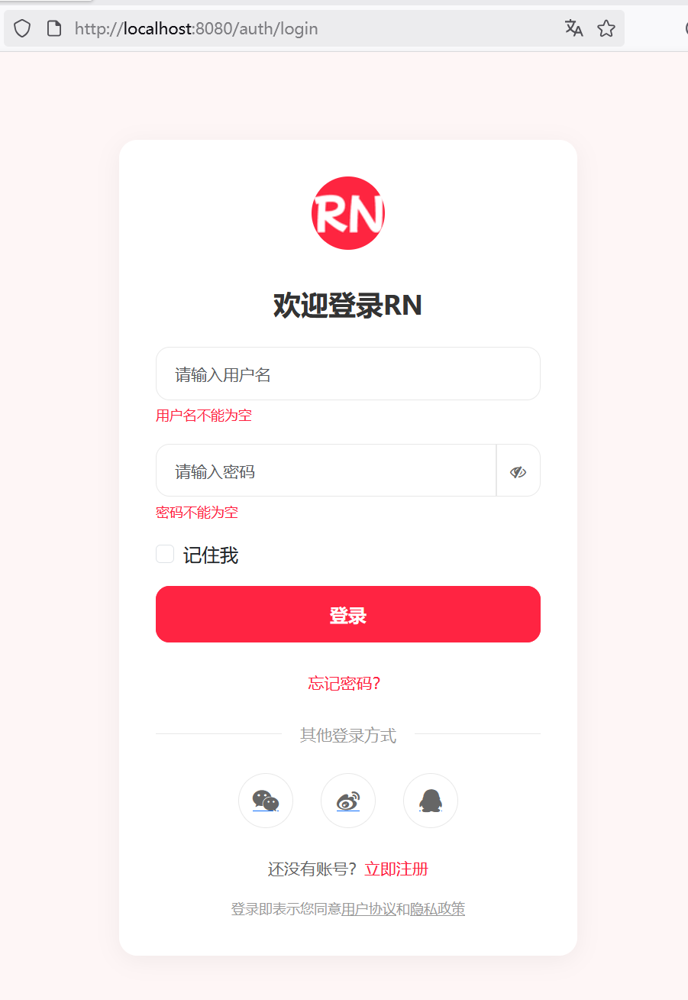


先输入一个未注册的用户名进行登录，如下5-5图所示，界面给出了错误提示“该用户名未注册”。


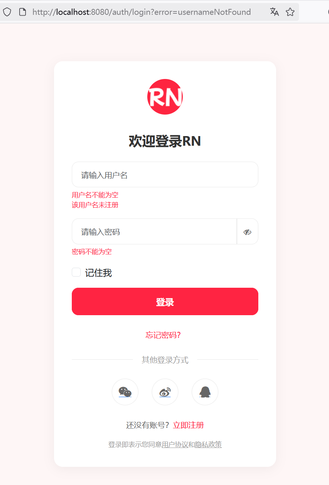


接着，输入一个已注册的用户名进行登录，但是输入错误的密码，如下5-6图所示，界面给出了错误提示“密码错误”。


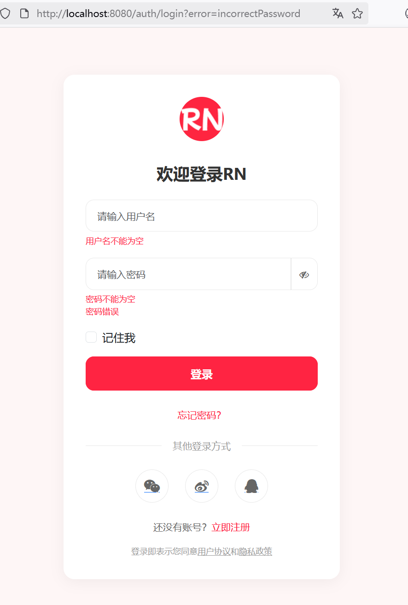


最终，输入正确的用户名和密码进行登录，如下5-7图所示，界面重定向到了首页。


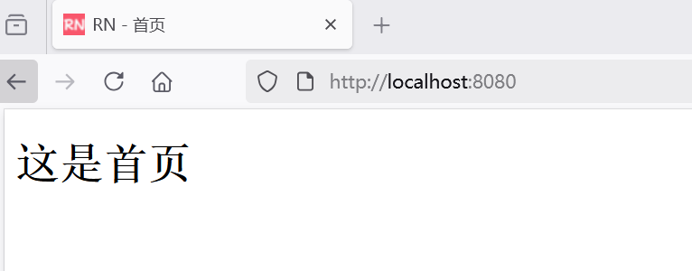


## 5.7 掌握按照角色权限控制的实现技巧

本节示例将展示如何使用 Spring Security 实现细粒度的权限控制。

1. 根据用户角色配置不同的访问权限
2. 使用 @PreAuthorize 注解或 hasRole 方法进行细粒度的权限控制
3. 错误控制器来处理 403 错误请求

分离关注点：将管理员账号与普通用户分离存储

### 初始化后台管理界面

admin.html：

```html
<!DOCTYPE html>
<html lang="en" xmlns:th="http://www.thymeleaf.org">
<head>
    <meta charset="UTF-8">
    <meta name="viewport" content="width=device-width, initial-scale=1.0">
    <title>RN - 后台管理</title>
</head>
<body>
<body>

<h1>这是后台管理</h1>

</body>
</body>
</html>
```


当访问地址：<http://localhost:8080/admin>，会跳转到登录界面执行登录，登录成功后会重定向到后台管理界面，如下图5-8所示。


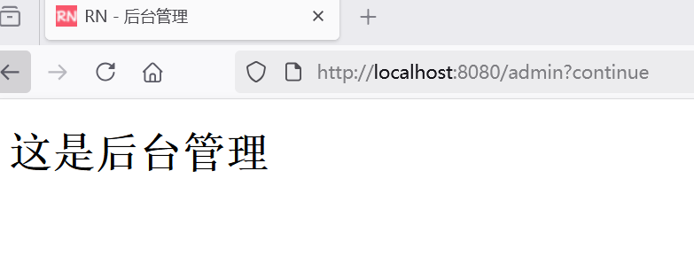


我们希望后台管理界面只允许管理员登录，而如果是普通用户登录的，则不允许访问。如何实现?


### 根据用户角色配置不同的访问权限


修改WebSecurityConfig，在authorizeHttpRequests中增加如下配置：

```java
@Bean
public SecurityFilterChain filterChain(HttpSecurity http) throws Exception {
    http
            // 启用CSRF防护
            .csrf(Customizer.withDefaults())
            .authorizeHttpRequests(authorize -> authorize
                    // 允许指定资源的请求不需要认证
                    .requestMatchers("/auth/register", "/auth/login", "/css/**", "/js/**", "/fonts/**", "/images/**", "/favicon.ico").permitAll()
                    .requestMatchers("/error/**").permitAll()
                    // 允许ADMIN角色的用户访问 /admin/** 的资源
                    .requestMatchers("/admin/**").hasRole("ADMIN")
                    // 允许ADMIN、USER角色的用户访问 /user/** 的资源
                    .requestMatchers("/user/**").hasAnyRole("ADMIN", "USER")
                    // 其他请求需求认证
                    .anyRequest().authenticated()
            )
            // ...为节约篇幅，此处省略非核心内容
    ;
    return http.build();
}
```

上述代码

* `/admin/**"`资源允许ADMIN角色访问
* `/user/**"`资源允许ADMIN或者USER角色访问


当访问地址：<http://localhost:8080/admin>，会跳转到登录界面执行登录，使用普通用户登录成功后会看到如下错误界面，如下图5-9所示。


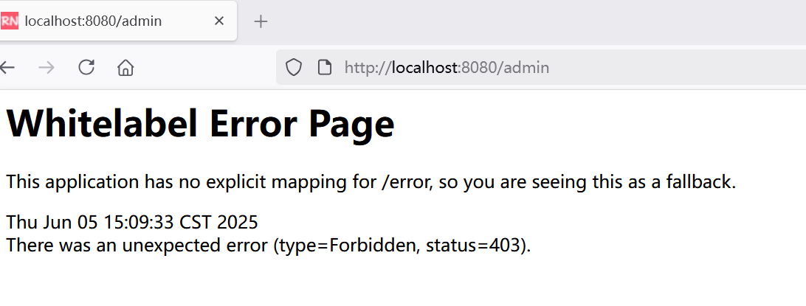


从上述报错信息“status=403”可以获知，是没有权限。

那么如何能够更加友好地提示“没有权限访问”呢？


### 仿小红书403错误页面实现

下面是一个基于 Spring Security 6.5、Thymeleaf 和 Bootstrap 实现的仿小红书风格的 403 错误页面。这个页面会在用户访问受保护资源而权限不足时显示，提供友好的提示和操作按钮。


403-error.html页面放置在`src/main/resources/templates`目录下，内容如下：


```html
<!DOCTYPE html>
<html lang="en" xmlns:th="http://www.thymeleaf.org">

<head>
    <meta charset="UTF-8">
    <meta name="viewport" content="width=device-width, initial-scale=1.0">
    <title>RN - 权限不足</title>
    <!-- 引入 Bootstrap CSS -->
    <!--<link href="https://cdn.jsdelivr.net/npm/bootstrap@5.3.6/dist/css/bootstrap.min.css"
          th:href="@{/css/bootstrap.min.css}" rel="stylesheet">-->
    <!-- 替换为BootCDN -->
    <link href="https://cdn.bootcdn.net/ajax/libs/bootstrap/5.3.6/css/bootstrap.min.css"
          th:href="@{/css/bootstrap.min.css}" rel="stylesheet">

    <!-- 引入 Font Awesome -->
    <!--<link href="https://cdn.jsdelivr.net/npm/font-awesome@4.7.0/css/font-awesome.min.css"
          th:href="@{/css/font-awesome.min.css}" rel="stylesheet">-->
    <!-- 替换为BootCDN -->
    <link href="https://cdn.bootcdn.net/ajax/libs/font-awesome/4.7.0/css/font-awesome.min.css"
          th:href="@{/css/font-awesome.min.css}" rel="stylesheet">

    <!-- 自定义样式-->
    <style>
        body {
            background-color: #fef6f6;
            font-family: -apple-system, BlinkMacSystemFont, "Segoe UI", Roboto, Helvetica, Arial, sans-serif;
        }

        .error-container {
            max-width: 400px;
            margin: 0 auto;
            padding: 40px 20px;
            text-align: center;
        }

        .error-icon {
            font-size: 80px;
            color: #ff2442;
            margin-bottom: 20px;
        }

        .error-title {
            font-size: 24px;
            font-weight: 700;
            color: #333;
            margin-bottom: 10px;
        }

        .error-message {
            font-size: 16px;
            color: #666;
            margin-bottom: 30px;
        }

        .btn-primary {
            background-color: #ff2442;
            border-color: #ff2442;
            border-radius: 12px;
            padding: 12px;
            font-size: 16px;
            font-weight: 600;
            transition: all 0.3s ease;
            width: 100%;
        }

        .btn-primary:hover,
        .btn-primary:focus {
            background-color: #e61e3a;
            border-color: #e61e3a;
            box-shadow: 0 4px 12px rgba(255, 36, 66, 0.2);
        }

        .back-home {
            margin-top: 20px;
            font-size: 14px;
            color: #999;
        }

        .back-home a {
            color: #ff2442;
            text-decoration: none;
        }

        .back-home a:hover {
            text-decoration: underline;
        }

        .error-image {
            width: 200px;
            height: 200px;
            margin: 0 auto 30px;
            background-color: #fff;
            border-radius: 50%;
            display: flex;
            align-items: center;
            justify-content: center;
            box-shadow: 0 4px 20px rgba(0, 0, 0, 0.05);
        }

        .error-image img {
            width: 120px;
            height: 120px;
        }
    </style>
</head>
<body class="d-flex align-items-center min-vh-100 py-4">
<div class="container">
    <div class="error-container">
        <!-- 错误图标 -->
        <div class="error-image">
            <i class="fa fa-lock fa-5x text-danger"></i>
        </div>

        <!-- 错误标题 -->
        <h2 class="error-title">访问受限</h2>

        <!-- 错误信息 -->
        <p class="error-message">
            你没有权限访问此页面。<br>
            请检查你的权限或联系管理员。
        </p>

        <!-- 返回按钮 -->
        <button class="btn btn-primary" onclick="goBack()">返回上一页</button>

        <!-- 跳转到首页 -->
        <p class="back-home">
            <a href="/" th:href="@{/}">返回RN首页</a>
        </p>
    </div>
</div>

<!-- Bootstrap JS -->
<!--<script src="https://cdn.jsdelivr.net/npm/bootstrap@5.3.6/dist/js/bootstrap.bundle.min.js"
        th:src="@{/js/bootstrap.bundle.min.js}"></script>-->
<!-- 替换为BootCDN -->
<script src="https://cdn.bootcdn.net/ajax/libs/bootstrap/5.3.6/js/bootstrap.bundle.min.js"
        th:src="@{/js/bootstrap.bundle.min.js}"></script>

<script>
    // 返回按钮点击事件
    function goBack() {
        window.history.back();
    }
</script>
</body>
</html>
```


这个 403 错误页面具有以下特点：

1. 视觉风格：
   - 采用小红书标志性的红色作为主色调
   - 圆润的边角设计和简洁的布局
   - 清晰的视觉层次和留白

2. 功能特点：
   - 明确的错误提示信息
   - 返回上一页按钮
   - 返回首页链接
   - 响应式设计，适配各种设备

3. 交互体验：
   - 按钮悬停效果
   - 返回上一页的 JavaScript 功能
   - 平滑的视觉过渡

###  403 错误页面集成到 Spring Security

要将此 403 错误页面集成到 Spring Security 中，需要在安全配置中添加以下内容：

```java
@Bean
public SecurityFilterChain filterChain(HttpSecurity http) throws Exception {
    http
            // 启用CSRF防护
            .csrf(Customizer.withDefaults())
            .authorizeHttpRequests(authorize -> authorize
                     // ...为节约篇幅，此处省略非核心内容
                    .requestMatchers("/error/**").permitAll()
                     
                    // ...为节约篇幅，此处省略非核心内容
             )

            // 异常处理
            .exceptionHandling(exception -> exception
                    // 指定403错误页面
                    .accessDeniedPage("/error/403")
            )
    ;
    return http.build();
}
```

### 错误控制器来处理 403 错误请求

同时，需要添加一个错误控制器来处理 `/error/403` 请求：

```java
package com.example.rednote.controller;

import org.springframework.stereotype.Controller;
import org.springframework.web.bind.annotation.GetMapping;
import org.springframework.web.bind.annotation.RequestMapping;

/**
 * ErrorController 错误控制器
 *
 * @version 2025/08/17
 **/
@Controller
@RequestMapping("/error")
public class ErrorController {
    /**
     * 返回403错误页面
     */
    @GetMapping("/403")
    public String accessDenied() {
        return "403-error";
    }
}
```

这样，当用户访问受保护资源而权限不足时，就会显示这个精心设计的 403 错误页面，如下图5-10所示。


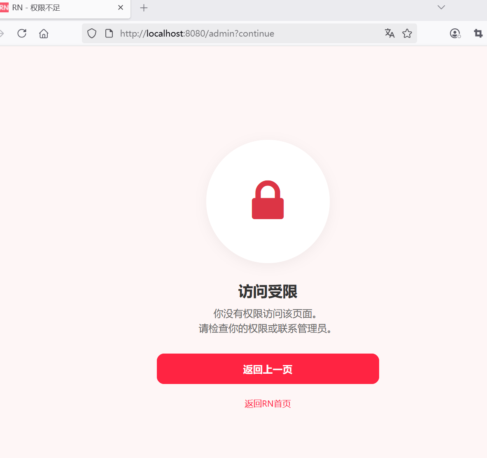


## 5.8 掌握Spring Security的会话管理机制

Spring Security 提供了强大而灵活的会话管理功能，包括会话超时控制、并发会话管理、会话固定攻击防护等特性。下面我将详细介绍这些功能及其实现方式。

包括

1. 介绍 Spring Security 的会话管理机制，会话超时、并发会话控制等
2. 在配置类中设置会话管理的相关参数
3. 在前端页面中显示用户的登录状态，显示用户名、提供退出登录按钮
4. 使用 Thymeleaf 的表达式获取 Spring Security 上下文中的用户信息


### Spring Security 会话管理机制详解

#### 会话创建策略
Spring Security 提供四种会话创建策略：
- `ALWAYS`：始终创建会话
- `NEVER`：从不主动创建会话，但会使用已存在的会话
- `IF_REQUIRED`：默认策略，仅在需要时创建会话
- `STATELESS`：无状态会话，不使用任何会话存储

#### 会话超时
- 可通过 `server.servlet.session.timeout` 配置全局会话超时时间
- 也可在 Security 配置中单独设置安全会话超时

#### 并发会话控制
- 限制同一用户的并发登录数量
- 当达到最大登录数时，可以选择阻止新登录或踢掉旧会话
- 可配置会话过期后的跳转页面

#### 会话固定攻击防护
- 自动检测并防止会话固定攻击
- 默认策略是在用户登录后创建新会话


### 会话管理配置示例

修改SecurityConfig，增加会话管理相关配置：

```java
import org.springframework.security.config.http.SessionCreationPolicy;
import org.springframework.security.core.session.SessionRegistry;
import org.springframework.security.core.session.SessionRegistryImpl;

@Bean
public SecurityFilterChain filterChain(HttpSecurity http) throws Exception {
    http

          // ...为节约篇幅，此处省略非核心内容

          // 会话管理
          .sessionManagement(session -> session
                    // 会话创建策略
                    .sessionCreationPolicy(SessionCreationPolicy.IF_REQUIRED)
                    // 访问无效会话时，重定向到指定URL
                    .invalidSessionUrl("/auth/login?error=" + SESSION_INVALID)
                    // 同一用户最大会话数
                    .maximumSessions(1)
                    // 访问过期会话时，重定向到指定URL
                    .expiredUrl("/auth/login?error=" + SESSION_EXPIRED)
                    // false表示允许新登录，踢掉旧会话，旧会话会过期
                    .maxSessionsPreventsLogin(false)
                    // 会话注册表
                    .sessionRegistry(sessionRegistry())
            )
    ;

    return http.build();
}

// 会话注册表 Bean
@Bean
public SessionRegistry sessionRegistry() {
    return new SessionRegistryImpl();
}
```

其中，

* `invalidSessionUrl` 和 `expiredUrl` 是用于处理会话（Session）相关问题的两个不同配置项，它们分别针对不同的会话失效场景，被重定向到指定的URL。
* `SessionRegistry` 是 Spring Security 中一个核心接口，用于跟踪和管理用户会话。它在并发会话控制、会话信息查询和用户状态监控等场景中发挥着重要作用。


### SessionRegistry 详解

#### 核心接口定义
```java
public interface SessionRegistry {
    // 获取所有已登录用户的 Principal
    List<Object> getAllPrincipals();
    
    // 获取特定用户的所有活动会话
    List<SessionInformation> getAllSessions(Object principal, boolean includeExpiredSessions);
    
    // 根据会话 ID 获取会话信息
    SessionInformation getSessionInformation(String sessionId);
    
    // 当会话被创建时调用
    void registerNewSession(String sessionId, Object principal);
    
    // 当会话被销毁时调用
    void removeSessionInformation(String sessionId);
    
    // 刷新特定会话的最后访问时间
    void refreshLastRequest(String sessionId);
}
```

#### 主要实现类

- `SessionRegistryImpl`：默认的内存实现，适用于单节点应用
- 在分布式环境中，需要自定义实现（如基于 Redis 或数据库）


`SessionRegistryImpl` 内部维护两个核心数据结构：
- `ConcurrentHashMap<Object, Set<String>> principals`：
  - 键：用户的 Principal 对象（通常是 `UserDetails`）
  - 值：该用户的所有活动会话 ID 集合

- `ConcurrentHashMap<String, SessionInformation>` sessionIds：
  - 键：会话 ID
  - 值：对应的 `SessionInformation` 对象，包含：
    - 会话 ID
    - 用户 Principal
    - 创建时间
    - 最后访问时间
    - 是否过期标志

####  工作流程

1. 用户登录时，`registerNewSession()` 被调用，记录会话信息
2. 每次请求时，`refreshLastRequest()` 被调用，更新最后访问时间
3. 会话过期或用户注销时，`removeSessionInformation()` 被调用
4. 通过 `getAllSessions()` 可以获取特定用户的所有会话，实现并发控制

 
### `invalidSessionUrl` 和 `expiredUrl` 的区别


在Spring Security中，`invalidSessionUrl` 和 `expiredUrl` 是用于处理会话（Session）相关问题的两个不同配置项，它们分别针对不同的会话失效场景：

#### 1. `invalidSessionUrl`
- 作用：当用户尝试访问一个无效的会话时，会被重定向到指定的URL。
- 触发场景：
  - 用户手动删除了Cookie中的`JSESSIONID`（或其他会话标识符）。
  - 会话因某些原因被标记为无效（如服务器重启后未持久化的会话丢失）。


#### 2. `expiredUrl`
- 作用：当会话超时（即会话过期）时，用户会被重定向到指定的URL。
- 触发场景：
  - 会话配置了超时时间（如通过`server.servlet.session.timeout`），且用户在超时时间内未与服务器交互。


通过合理配置这两个选项，可以为用户提供更清晰的会话失效提示（如区分“会话超时”和“会话无效”）。


### 会话超时配置


在 `application.properties` 中设置全局会话超时时间：


```properties
# 10分钟超时
server.servlet.session.timeout=10m  
```

### 错误信息提示


会话过期或者会话失效场景，被重定向到登录界面。为了能更好的区分这两种场景，需要做错误信息提示：

```java
@GetMapping("/login")
public String showLoginForm(Model model,
                            @RequestParam(required = false) String error,
                            @Valid @ModelAttribute("user") UserLoginDto loginDto,
                            BindingResult bindingResult) {
    // ...为节约篇幅，此处省略非核心内容

    // 处理会话失效
    if (LoginErrorType.SESSION_INVALID.equals(error)) {
        bindingResult.rejectValue("username", null, "会话失效");

        return "login-form";
    }

    // 处理会话过期
    if (LoginErrorType.SESSION_EXPIRED.equals(error)) {
        bindingResult.rejectValue("username", null, "会话过期");

        return "login-form";
    }

    return "login-form";
}
```

在LoginErrorType中增加这两类常量


```java
public class LoginErrorType {
    // ...为节约篇幅，此处省略非核心内容

    public static final String SESSION_INVALID = "sessionInvalid";
    public static final String SESSION_EXPIRED = "sessionExpired";
}
```

### 使用 Thymeleaf 获取用户信息

Thymeleaf 提供了 `sec` 命名空间来方便地访问 Spring Security 上下文：


```html
<html lang="en" xmlns:th="http://www.thymeleaf.org"
    xmlns:sec="http://www.thymeleaf.org/extras/spring-security">
```

#### 获取用户名
```html
<span sec:authentication="name">用户名</span>
```

#### 获取用户角色
```html
<div sec:authorize="hasRole('ADMIN')">
    这部分内容只有管理员能看到
</div>

<div sec:authorize="hasAnyRole('ADMIN', 'USER')">
    这部分内容管理员和普通用户能看到
</div>
```


#### 判断用户是否已登录
```html
<div sec:authorize="isAuthenticated()">
    欢迎回来，<span sec:authentication="name">用户名</span>
</div>
```

#### 完整示例：显示用户信息卡片


修改index.html内容如下：

```html
<!DOCTYPE html>
<html lang="en" xmlns:th="http://www.thymeleaf.org"
      xmlns:sec="http://www.thymeleaf.org/extras/spring-security">
<head>
    <meta charset="UTF-8">
    <meta name="viewport" content="width=device-width, initial-scale=1.0">
    <title>RN - 首页</title>
</head>
<body>
<h1>这是首页</h1>

<!-- 登录用户信息 -->
<div class="card" sec:authorize="isAuthenticated()">
    <div class="card-header">
        用户信息
    </div>
    <div class="card-body">
        <dive class="row">
            <div class="col-md-9">
                <h5 class="card-title" sec:authentication="name"></h5>
                <p class="card-text">角色： <span sec:authentication="principal.authorities">[角色]</span></p>
            </div>
        </dive>
    </div>

    <div sec:authorize="hasRole('ADMIN')">
        这部分内容只有管理员能看到
    </div>

    <div sec:authorize="hasAnyRole('ADMIN', 'USER')">
        这部分内容管理员和普通用户能看到
    </div>
</div>
</body>
</html>
```


登录之后访问首页，效果如下图5-11所示。


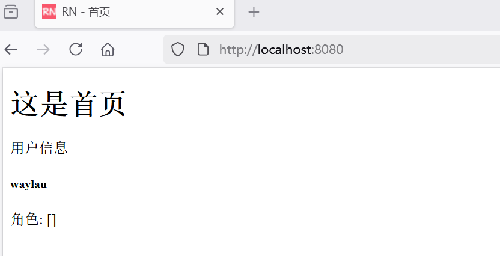


等到会话失效之后，再次登录首页，效果如下图5-12所示，被重定向了到登录界面。


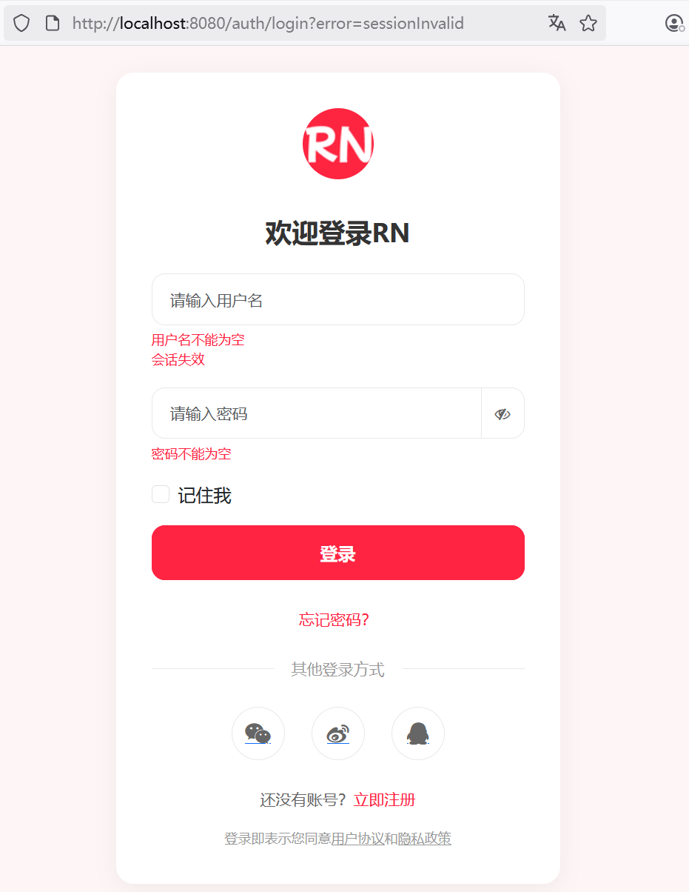


如下图5-13所示是会话过期的被重定向了到登录界面的效果。


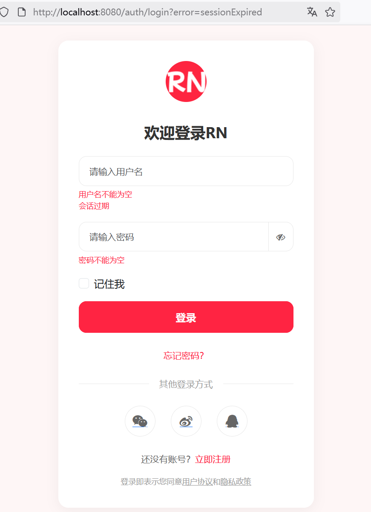


注：`invalidSessionUrl` 和 `expiredUrl` 同时配置时，会话过期的场景也可能被会话失效所覆盖。调测`expiredUrl`时，可以先去除掉`invalidSessionUrl` 配置。


### 关键配置总结

1. 会话超时配置：
   - 在 `application.properties` 中设置全局超时
   - 通过 `invalidSessionUrl` 设置会话失效跳转页面

2. 并发会话控制：
   - 使用 `maximumSessions()` 设置最大会话数
   - 通过 `expiredUrl()` 设置会话过期跳转页面
   - 配置 `sessionRegistry()` 跟踪会话

3. 前端集成：
   - 使用 `sec:authorize` 判断权限
   - 通过 `sec:authentication` 获取用户信息


通过这些配置，你可以实现一个安全且用户体验良好的会话管理系统，包括会话超时提醒、并发登录控制和用户状态显示等功能。


## 5.9 掌握退出登录的实现技巧

在Spring Security中，退出登录（Logout）功能可以通过配置`HttpSecurity`的`logout`方法来实现。以下是一个基于Spring Security 6.5的完整示例，展示如何配置退出登录功能。


### 配置`SecurityFilterChain`


修改SecurityConfig，增加退出登录相关配置：

```java
@Bean
public SecurityFilterChain filterChain(HttpSecurity http) throws Exception {
    http

          // ...为节约篇幅，此处省略非核心内容

          // 注销
            .logout(logout -> logout
                    // 清理会话
                    .invalidateHttpSession( true)
                    // 清理认证信息
                    .clearAuthentication(true)
                    // 用户访问此URL时，交由Spring Security处理注销逻辑
                    .logoutUrl("/logout")
                    // 注销成功后，重定向到指定URL
                    .logoutSuccessUrl("/auth/login?error=" + LOGOUT)
                    // 删除会话Cookie
                    .deleteCookies("JSESSIONID")

            )
        )

    return http.build();
}
```

关键配置说明：

- `invalidateHttpSession(true)`：清除会话。
- `clearAuthentication("/logout")`：清除认证信息。
- `logoutUrl("/logout")`：指定触发退出登录的URL。用户访问此URL时，Spring Security会自动处理退出逻辑。
- `logoutSuccessUrl("/auth/login?error=logout")`：退出成功后重定向的URL。通常用于显示退出成功的提示信息。
- `deleteCookies("JSESSIONID")`：删除客户端Cookie中的会话ID。`JSESSIONID`是Tomcat默认的会话Cookie名称，根据实际使用的服务器可能不同。


### 创建退出登录的链接

修改Index.html页面，添加一个退出登录的按钮：

```html
<!-- 注销 -->
<form action="/logout" th:action="@{/logout}" method="post">
    <button type="submit" class="btn btn-outline-success">退出</button>
</form>
```

### 处理退出成功后的页面

退出登录之后，被重定向到登录界面，需要做错误信息提示：

```java
@GetMapping("/login")
public String showLoginForm(Model model,
                            @RequestParam(required = false) String error,
                            @Valid @ModelAttribute("user") UserLoginDto loginDto,
                            BindingResult bindingResult) {
    // ...为节约篇幅，此处省略非核心内容

    // 检查用户是否已注销
    if (LoginErrorType.LOGOUT.equals(error)) {
        bindingResult.rejectValue("username", null, "已注销");
        return "login-form";
    }

    return "login-form";
}
```

在LoginErrorType中增加LOGOUT常量：


```java
public class LoginErrorType {
    // ...为节约篇幅，此处省略非核心内容

    public static final String LOGOUT = "logout";
}
```

### 完整流程

1. 用户访问受保护的资源（如`/`），需要登录。
2. 用户登录成功后，访问主页或其他受保护页面。
3. 用户点击退出登录链接（`/logout`）。
4. Spring Security处理退出逻辑：
   - 使会话无效。
   - 删除会话Cookie。
   - 重定向到`/auth/login?error=logout`页面。


登录之后访问首页，效果如下图5-14所示。


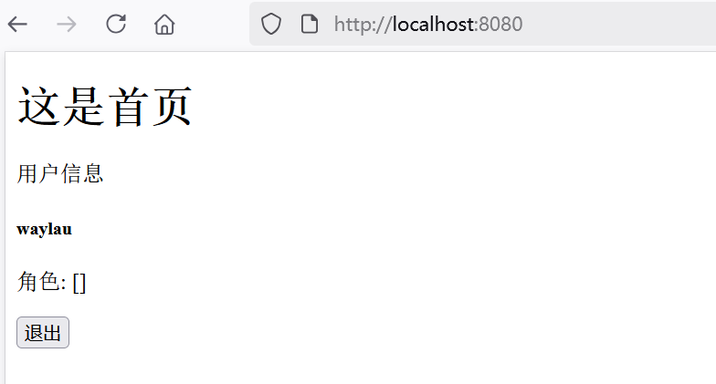


如下图5-15所示是退出登录后被重定向了到登录界面的效果。


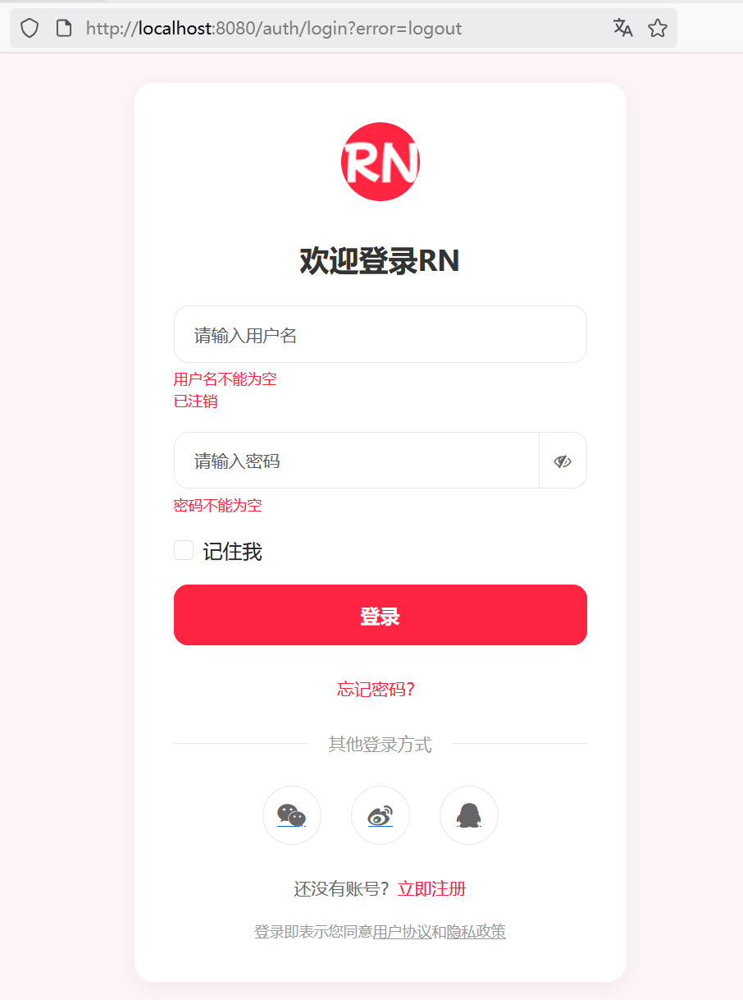


## 5.10 实现“记住我”浏览器重启后无需再次登录

在Spring Security中，“记住我”（Remember-Me）功能允许用户在关闭浏览器后重新访问网站时自动登录，而无需重新输入用户名和密码。这是通过在客户端存储一个持久化的令牌（通常是一个Cookie）来实现的，如下图。


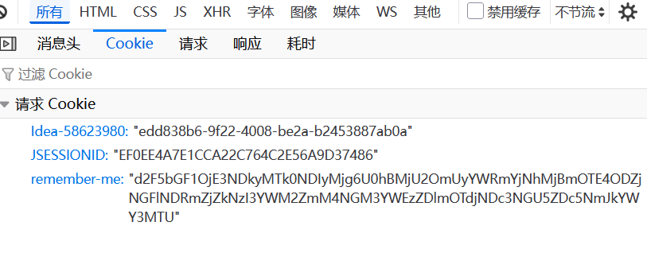


以下是一个基于Spring Security 6.5的“记住我”功能示例：

### 配置`SecurityFilterChain`

首先，配置`HttpSecurity`以启用“记住我”功能。修改SecurityConfig，增加退出登录相关配置：

```java
@Bean
public SecurityFilterChain filterChain(HttpSecurity http) throws Exception {
    http

          // ...为节约篇幅，此处省略非核心内容

          // 记住我
        .rememberMe(rememberMe -> rememberMe
                // 设置记住我令牌的有效期（秒），默认是2周。以下设置1周
                .tokenValiditySeconds(60 * 60 * 24 * 7)
                // 设置用于签名令牌的密钥
                .key("rnRememberMeKey")
        )

    ;

    return http.build();
}
```

关键配置说明

- `tokenValiditySeconds(86400)`：设置“记住我”令牌的有效期（以秒为单位）。在此示例中设置为24小时（86400秒）。
- `key("rnRememberMeKey")`：用于签名令牌的密钥。应确保此密钥是唯一的且保密的。

### 确保登录表单有“记住我”复选框

在登录页面中，需要有一个“记住我”复选框：

```html
<!-- 记住我 -->
<div class="form-check mb-3">
    <input type="checkbox" class="form-check-input" id="rememberMe" name="remember-me">
    <label class="form-check-label" for="rememberMe">记住我</label>
</div>
```


注意，复选框是name必须是“remember-me”。

### 注意事项

- 安全性：确保“记住我”令牌的密钥（`key`）是唯一的且保密的。


## 5.11 安全经验总结及性能优化技巧

### 经验总结

1. 登录处理：
   - 示例中使用简单的用户名密码比对
   - 实际项目中应使用 Spring Security 进行安全认证
   - 密码应使用 BCrypt 等强哈希算法加密存储

2. 错误处理：
   - 登录失败时通过重定向传递错误参数
   - 登录页面根据错误参数显示相应错误信息

3. 安全处理：
   - 永远不要明文存储密码
   - 实现密码加密和盐值处理
   - 添加 CSRF 保护（Spring Security 默认启用）

4. 会话超时配置：
   - 在 `application.properties` 中设置全局超时

5. 合理配置最大会话数：
   - 根据业务需求设置 `maximumSessions`
   - 考虑是否允许新登录踢掉旧会话（`maxSessionsPreventsLogin`）

### 优化建议


1. 安全建议：
   - 使用 HTTPS 保护登录过程

2. 监控会话使用情况：
   - 通过 SessionRegistry 实现会话监控仪表盘
   - 定期清理过期会话数据

3. 分布式环境处理：
   - 使用 Redis 或其他分布式存储实现 SessionRegistry
   - 考虑会话序列化和反序列化问题

4. 性能优化：
   - 在高并发场景下，注意 SessionRegistry 实现的线程安全性
   - 避免频繁查询 SessionRegistry，考虑缓存策略


## 6.1 用户信息管理功能概述

- 项目回顾：简要回顾仿“小红书”项目的注册与登录功能，点明用户信息管理功能是在其基础上的重要延伸。
- 功能重要性：阐述用户信息管理功能对于完善用户体验、维护系统数据完整性的重要意义。
- 技术栈说明：再次强调 Spring MVC、Thymeleaf、Spring Data、Spring Security、Bootstrap 在该功能实现中的具体作用。


下面我将实现一个基于 Spring MVC、Thymeleaf、Spring Data、Spring Security 和 Bootstrap 的小红书风格用户信息管理功能。用户信息管理功能将包含个人信息管理、密码修改等核心功能。


### 功能亮点

1. 用户信息管理：
   - 完整的用户信息展示和编辑功能
   - 密码修改功能带旧密码验证
   - 用户头像上传

2. 安全特性：
   - 密码加密存储（BCrypt）
   - 基于角色的访问控制

3. 小红书风格：
   - 采用小红书标志性的红色调
   - 简洁明了的界面设计
   - 响应式布局适配各种设备

4. 用户体验优化：
   - 表单验证和错误提示
   - 操作成功/失败的反馈信息

这个实现提供了一个基础的用户信息管理系统，你可以根据需要进一步扩展功能，如社交绑定、隐私设置等功能。


## 6.2 使用Bootstrap响应式设计实现用户信息展示页面

1. 借助 Bootstrap 的各类组件（如Card、Form等）设计用户信息展示页面
2. 为编辑按钮添加点击事件，实现信息编辑与展示状态的切换
3. 提供友好的确认和提示信息
4. 响应式设计适配移动端

### 设计用户信息展示视图模板

在`src/main/resources/templates`目录下新建user-profile.html文件：


```html
<!DOCTYPE html>
<html lang="en" xmlns:th="http://www.thymeleaf.org"
      xmlns:sec="http://www.thymeleaf.org/extras/spring-security">
<head>
    <meta charset="UTF-8">
    <meta name="viewport" content="width=device-width, initial-scale=1.0">
    <title>RN - 个人资料</title>
    <!-- 引入 Bootstrap CSS -->
    <link href="https://cdn.bootcdn.net/ajax/libs/bootstrap/5.3.6/css/bootstrap.min.css"
          th:href="@{/css/bootstrap.min.css}" rel="stylesheet">

    <!-- 引入 Font Awesome -->
    <link href="https://cdn.bootcdn.net/ajax/libs/font-awesome/4.7.0/css/font-awesome.min.css"
          th:href="@{/css/font-awesome.min.css}" rel="stylesheet">

          <style>
    /* 小红书风格 */
    * {
        font-family: "PingFang SC", "Hiragino Sans GB", "Microsoft YaHei", sans-serif;
        box-sizing: border-box;
        margin: 0;
        padding: 0;
    }

    body {
        background-color: #f5f5f5;
    }

    /* 顶部导航栏 */
    .header {
        position: sticky;
        top: 0;
        background-color: white;
        padding: 16px;
        box-shadow: 0 1px 2px rgba(0, 0, 0, 0.05);
    }

    .user-info {
        display: flex;
        align-items: center;
        gap: 12px;
    }

    .user-avatar {
        width: 48px;
        height: 48px;
        border-radius: 50%;
        background-color: #f0f0f0;
    }

    .user-name {
        font-size: 16px;
        font-weight: 600;
        color: #333;
    }

    .user-meta {
        font-size: 12px;
        color: #666;
    }

    .action-btn {
        margin-left: auto;
        font-size: 14px;
        color: #ff2442;
    }
</style>
</head>
<body>
<!-- 导航栏 -->
<nav class="navbar navbar-expand-lg navbar-light bg-light">
    <div class="container">
        <a class="navbar-brand" href="/" th:href="@{/}">
            
        </a>
        <button class="navbar-toggler" type="button" data-bs-toggle="collapse" data-bs-target="#navbarNav"
                aria-controls="navbarNav" aria-expanded="false" aria-label="Toggle navigation">
            <span class="navbar-toggler-icon"></span>
        </button>
        <div class="collapse navbar-collapse" id="navbarNav">
            <ul class="navbar-nav ms-auto">
                <li class="nav-item">
                    <a class="nav-link" href="#" sec:authentication="name">
                        [[${#authentication.name}]]
                    </a>
                </li>
                <li class="nav-item">
                    <a class="nav-link" href="/user/profile" th:href="@{/user/profile}">个人资料</a>
                </li>
                <li class="nav-item">
                    <!-- 注销 -->
                    <form action="/logout" th:action="@{/logout}" method="post">
                        <button type="submit" class="nav-link">退出登录</button>
                    </form>
                </li>
            </ul>
        </div>
    </div>
</nav>

<!-- 主体部分 -->
<div class="container mt-5">
    <div class="row justify-content-center">
        <div class="col-md-8">
            <div class="card">
                <div class="card-header">
                    个人资料
                </div>
                <div class="card-body">
                    <div class="row">
                        <div class="col-md-4 text-center">
                            
                            <p class="mt-3">[[${user.username}]]</p>
                            <a href="/user/edit" th:href="@{/user/edit}" class="btn btn-primary btn-sm">编辑资料</a>
                        </div>

                        <div class="col-md-8">
                            <dive class="mb-3">
                                <label class="form-label">手机号</label>
                                <p class="form-control-plaintext">[[${user.phone}]]</p>
                            </dive>
                            <dive class="mb-3">
                                <label class="form-label">个人简介</label>
                                <p class="form-control-plaintext">[[${user.bio ?: '这家伙很懒，什么都没写'}]]</p>
                            </dive>

                            <a href="/user/change-password" th:href="@{/user/change-password}"
                               class="btn btn-outline-secondary">修改密码</a>
                        </div>
                    </div>
                </div>
            </div>
        </div>
    </div>
</div>

<!-- Bootstrap JS -->
<script src="https://cdn.bootcdn.net/ajax/libs/bootstrap/5.3.6/js/bootstrap.bundle.min.js"
        th:src="@{/js/bootstrap.bundle.min.js}"></script>

</body>
</html>
```


## 6.3 使用Spring MVC控制器将后端用户信息绑定到前端页面进行显示

1. 创建处理用户信息管理请求的控制器类
2. 定义不同请求方法对应的处理方法
3. 将不同的请求路径映射到相应的处理方法
4. 接收前端传来的用户信息参数，进行必要的格式校验
5. 根据业务逻辑处理结果，返回合适的响应信息


### 更新User实体

增加了以下字段：

```java
/**
  * 头像
  */
private String avatar;

/**
  * 简介
  */
private String bio;
```


### 新建用户控制器 UserController

```java
package com.example.rednote.controller;

import com.example.rednote.entity.User;
import com.example.rednote.service.UserService;
import org.springframework.beans.factory.annotation.Autowired;
import org.springframework.stereotype.Controller;
import org.springframework.ui.Model;
import org.springframework.web.bind.annotation.GetMapping;
import org.springframework.web.bind.annotation.RequestMapping;

/**
 * UserController 用户控制器
 *
 * @version 2025/08/17
 **/
@Controller
@RequestMapping("/user")
public class UserController {

    @Autowired
    private UserService userService;

    @GetMapping("/profile")
    public String profile(Model model) {
        // 获取当前用户信息
        User user = userService.getCurrentUser();

        model.addAttribute("user", user);

        return "user-profile";
    }
}
```

其中，需要UserService提供新的接口getCurrentUser()来获取当前用户的信息。


```java
/**
  * 获取当前用户
  */
User getCurrentUser();
```

接着，将该用户信息绑定到模型，并通过前端页面user-profile.html进行显示。


访问地址：<http://localhost:8080/user/profile>，可以看到如下图6-1所示的界面。


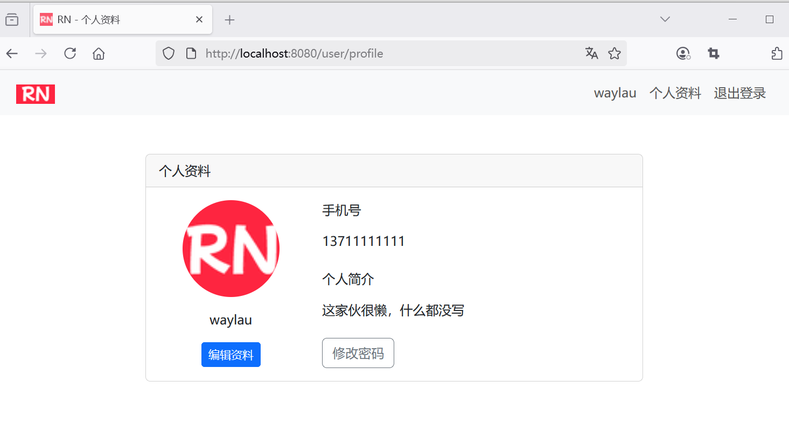


## 6.4 从Spring Security中获取当前认证信息

在控制器方法中，从 Spring Security 的上下文获取当前登录用户的信息

### 在UserServiceImpl中实现getCurrentUser()

getCurrentUser()实现如下：

```java
@Override
public User getCurrentUser() {
    // 从安全上下文中获取认证信息
    Authentication authentication = SecurityContextHolder.getContext().getAuthentication();
    if (authentication != null && authentication.isAuthenticated()) {
        // 获取当前用户名
        String username = authentication.getName();
        // 根据用户名查询用户
        Optional<User> optionalUser = userRepository.findByUsername(username);
        if (optionalUser.isPresent()) {
            return optionalUser.get();
        }
    }

    throw new UsernameNotFoundException(ExceptionType.USERNAME_NOT_FOUND);
}
```


### `SecurityContextHolder.getContext().getAuthentication()` 详解

`SecurityContextHolder.getContext().getAuthentication()` 是 Spring Security 中获取当前认证信息的核心方法。这个方法链涉及三个主要组件：`SecurityContextHolder`、`SecurityContext` 和 `Authentication`，下面我将深入解析它们的工作原理和使用场景。


工作流程如下：

1. 用户登录：
   - 用户提交凭证（用户名/密码）
   - `AuthenticationProvider` 验证凭证
   - 验证成功后，创建已认证的 `Authentication` 对象
   - 通过 `SecurityContextHolder.getContext().setAuthentication(auth)` 设置认证信息

2. 请求处理：
   - 每个请求通过 `SecurityContextPersistenceFilter` 从 Session 或其他存储中恢复安全上下文
   - 安全上下文被设置到当前线程的 `SecurityContextHolder`
   - 在整个请求处理过程中，可以随时通过 `SecurityContextHolder.getContext().getAuthentication()` 获取当前用户信息
   - 请求处理完毕后，安全上下文可能被持久化到 Session 中

3. 请求结束：
   - `SecurityContextPersistenceFilter` 清除当前线程的安全上下文（防止线程池复用导致的安全问题）


### 核心组件解析

#### 1. SecurityContextHolder
- 作用：存储当前线程的安全上下文（`SecurityContext`）
- 实现方式：
  - ThreadLocal：默认模式，每个线程独立存储安全上下文（最常用）
  - InheritableThreadLocal：子线程可以继承父线程的安全上下文
  - 全局模式：所有线程共享同一个安全上下文（极少使用）
- 关键方法：
  ```java
  SecurityContext context = SecurityContextHolder.getContext(); // 获取当前安全上下文
  SecurityContextHolder.setContext(context); // 设置安全上下文
  SecurityContextHolder.clearContext(); // 清除安全上下文
  ```

#### 2. SecurityContext
- 作用：存储当前认证信息（`Authentication` 对象）的容器
- 关键方法：
  ```java
  Authentication authentication = context.getAuthentication(); // 获取认证对象
  context.setAuthentication(authentication); // 设置认证对象
  ```

#### 3. Authentication
- 作用：表示当前用户的认证信息
- 核心属性：
  ```java
  principal // 用户身份（通常是 UserDetails 实现）
  credentials // 凭证（通常是密码，认证后会被清除）
  authorities // 用户权限（GrantedAuthority 集合）
  authenticated // 是否已认证的标志
  ```


## 6.5 调整安全配置类细化用户信息管理页面的访问权限

1. 在 Spring Security 配置类中，进一步细化用户信息管理页面的访问权限
2. 确保只有已登录用户可以访问自己的信息管理页面
3. 验证用户请求的信息是否与当前登录用户的身份匹配，防止越权操作


假设所有的用户都是USER角色：

```java
import org.springframework.security.core.authority.SimpleGrantedAuthority;

//  ...为节约篇幅，此处省略非核心内容


@Service
public class UserDetailsServiceImpl implements UserDetailsService {
    @Autowired
    private UserRepository userRepository;

    @Override
    public UserDetails loadUserByUsername(String username) throws UsernameNotFoundException {
        //  ...为节约篇幅，此处省略非核心内容

        // 将User转为UserDetails对象
        return org.springframework.security.core.userdetails.User
                .withUsername(user.getUsername())
                .password(user.getPassword())
                .disabled(false)
                // 设置所有的数据库里面的用户都是USER角色
                /*.authorities(Collections.emptyList())*/
                .authorities(new SimpleGrantedAuthority("ROLE_USER"))
                .build();
    }
}
```


## 6.6 实现用户基本信息的编辑页面

在`src/main/resources/templates`目录下新建user-profile-edit.html文件：

```html
<!DOCTYPE html>
<html  lang="en" xmlns:th="http://www.thymeleaf.org"
       xmlns:sec="http://www.thymeleaf.org/extras/spring-security">
<head>
    <meta charset="UTF-8">
    <meta name="viewport" content="width=device-width, initial-scale=1.0">
    <title>RN - 个人资料编辑</title>
    <!-- 引入 Bootstrap CSS -->
    <link href="https://cdn.jsdelivr.net/npm/bootstrap@5.3.6/dist/css/bootstrap.min.css" th:href="@{/css/bootstrap.min.css}" rel="stylesheet">
    <!-- 引入 Font Awesome -->
    <link href="https://cdn.jsdelivr.net/npm/font-awesome@4.7.0/css/font-awesome.min.css" th:href="@{/css/font-awesome.min.css}" rel="stylesheet">
    <!-- 自定义样式 -->
    <style>
        .profile-container {
            max-width: 800px;
            margin: 0 auto;
            padding: 32px;
        }

        .profile-header {
            text-align: center;
            margin-bottom: 32px;
        }

        .profile-avatar {
            width: 120px;
            height: 120px;
            border-radius: 50%;
            margin: 0 auto 20px;
            position: relative;
        }

        .profile-avatar img {
            width: 100%;
            height: 100%;
            object-fit: cover;
            border: 4px solid white;
            box-shadow: 0 2px 8px rgba(0, 0, 0, 0.1);
        }

        .avatar-upload {
            position: absolute;
            bottom: 0;
            left: 50%;
            transform: translateX(-50%);
            background-color: #ff2442;
            color: white;
            padding: 4px 12px;
            border-radius: 20px;
            cursor: pointer;
            font-size: 12px;
            transition: background-color 0.3s;
        }

        .avatar-upload:hover {
            background-color: #e61e3a;
        }

        .form-group {
            margin-bottom: 24px;
        }

        .form-label {
            font-weight: 600;
            color: #333;
        }

        .form-control {
            border-radius: 12px;
            border: 1px solid #e8e8e8;
            padding: 12px 16px;
        }

        .form-control:focus {
            border-color: #ff2442;
            box-shadow: 0 0 0 2px rgba(255, 36, 66, 0.1);
        }

        .btn-primary {
            background-color: #ff2442;
            border-color: #ff2442;
            border-radius: 24px;
            padding: 12px 48px;
            font-weight: 600;
            width: 100%;
        }

        .btn-primary:hover {
            background-color: #e61e3a;
            box-shadow: 0 4px 12px rgba(255, 36, 66, 0.2);
        }

        .error-message {
            color: #ff2442;
            font-size: 12px;
            margin-top: 4px;
        }
    </style>
</head>
<body>
<!-- 导航栏 -->
<nav class="navbar navbar-expand-lg navbar-light bg-light">
    <div class="container">
        <a class="navbar-brand" href="/" th:href="@{/}">
            
        </a>
        <button class="navbar-toggler" type="button" data-bs-toggle="collapse" data-bs-target="#navbarNav"
                aria-controls="navbarNav" aria-expanded="false" aria-label="Toggle navigation">
            <span class="navbar-toggler-icon"></span>
        </button>
        <div class="collapse navbar-collapse" id="navbarNav">
            <ul class="navbar-nav ms-auto">
                <li class="nav-item">
                    <a class="nav-link" href="#" sec:authentication="name">
                        [[${#authentication.name}]]
                    </a>
                </li>
                <li class="nav-item">
                    <a class="nav-link" href="/user/profile" th:href="@{/user/profile}">个人资料</a>
                </li>
                <li class="nav-item">
                    <!-- 注销 -->
                    <form action="/logout" th:action="@{/logout}" method="post">
                        <button type="submit" class="nav-link">退出登录</button>
                    </form>
                </li>
            </ul>
        </div>
    </div>
</nav>

<!-- 主体部分 -->
<div class="profile-container">
    <!-- 编辑标题 -->
    <div class="profile-header">
        <h2 class="text-center">编辑个人资料</h2>
        <p>请填写或者更新你的个人信息</p>
    </div>

    <!-- 编辑表单 -->
    <form action="/user/edit" th:action="@{/user/edit}" method="post" th:object="${user}" enctype="multipart/form-data">
        <!-- 头像 -->
        <div class="form-group position-relative">
            <div class="profile-avatar">
                
                <div class="avatar-upload">
                    <label>更换头像</label>
                </div>
            </div>
            <div class="error-message" th:if="${#fields.hasErrors('avatar')}" th:errors="*{avatar}">
                头像格式错误（支持JPG/PNG，最大10MB）
            </div>
        </div>

        <!-- 用户名（不可编辑） -->
        <div class="form-group">
            <label class="form-label">用户名</label>
            <input type="text" class="form-control" th:value="${user.username}" disabled>
        </div>

        <!-- 手机号 -->
        <div class="form-group">
            <label class="form-label">手机号</label>
            <input type="tel" class="form-control" th:field="*{phone}" placeholder="请输入手机号">
            <div class="error-message" th:if="${#fields.hasErrors('phone')}" th:errors="*{phone}">
                请输入有效的手机号
            </div>
        </div>

        <!-- 个人简介 -->
        <div class="form-group">
            <label class="form-label">个人简介</label>
            <textarea class="form-control" th:field="*{bio}" rows="3" placeholder="请输入个人简介（最多255字）"></textarea>
            <div class="error-message" th:if="${#fields.hasErrors('bio')}" th:errors="*{bio}">
                个人简介最多255字
            </div>
        </div>

        <!-- 提交按钮 -->
        <button type="submit" class="btn btn-primary">保存修改</button>
    </form>

    <!-- 操作反馈 -->
    <div th:if="${success}" class="alert alert-success mt-3">
        [[${success}]]
    </div>
    <div th:if="${error}" class="alert alert-danger mt-3">
        [[${error}]]
    </div>
</div>

<!-- Bootstrap JS -->
<script src="https://cdn.jsdelivr.net/npm/bootstrap@5.3.6/dist/js/bootstrap.bundle.min.js" th:src="@{/js/bootstrap.bundle.min.js}"></script>

</body>
</html>
```


其中，更换头像的功能在后续的课程中还做介绍。


## 6.7 用户对可编辑信息进行修改，并将修改后的数据保存到数据库

### 修改用户控制器UserController


新增对编辑的页面处理：

```java
package com.example.rednote.controller;

// ...为节约篇幅，此处省略非核心内容

import org.springframework.web.servlet.mvc.support.RedirectAttributes;

/**
 * UserController 用户控制器
 *
 * @version 2025/06/05
 **/
@Controller
@RequestMapping("/user")
public class UserController {

    // ...为节约篇幅，此处省略非核心内容

    @GetMapping("/edit")
    public String editProfile(Model model) {
        User user = userService.getCurrentUser();

        model.addAttribute("user", user);

        return "user-profile-edit";
    }


    @PostMapping("/edit")
    public String updateProfile(@ModelAttribute User user, RedirectAttributes redirectAttributes) {
        User currentUser = userService.getCurrentUser();

        // 更新用户信息
        currentUser.setPhone(user.getPhone());
        currentUser.setAvatar(user.getAvatar());
        currentUser.setBio(user.getBio());

        // 修改内容保存到数据库
        userService.updateUser(currentUser);

        // 重定向到指定页面，并传递参数
        redirectAttributes.addFlashAttribute("success", "个人信息更新成功");

        return "redirect:/user/profile";
    }

}
```

其中：

* `userService.updateUser()`接口用于将修改后的数据保存到数据库；
* `redirectAttributes.addFlashAttribute()`重定向到页面时，传递消息。


### 修改后的数据保存到数据库


修改UserService，增加如下接口：

```java
/**
* 更新用户
*/
User updateUser(User currentUser);
```


修改UserServiceImpl，增加如下方法：


```java
@Override
public User updateUser(User user) {
    return userRepository.save(user);
}
```


### 运行调测


用户信息编辑页面如下：


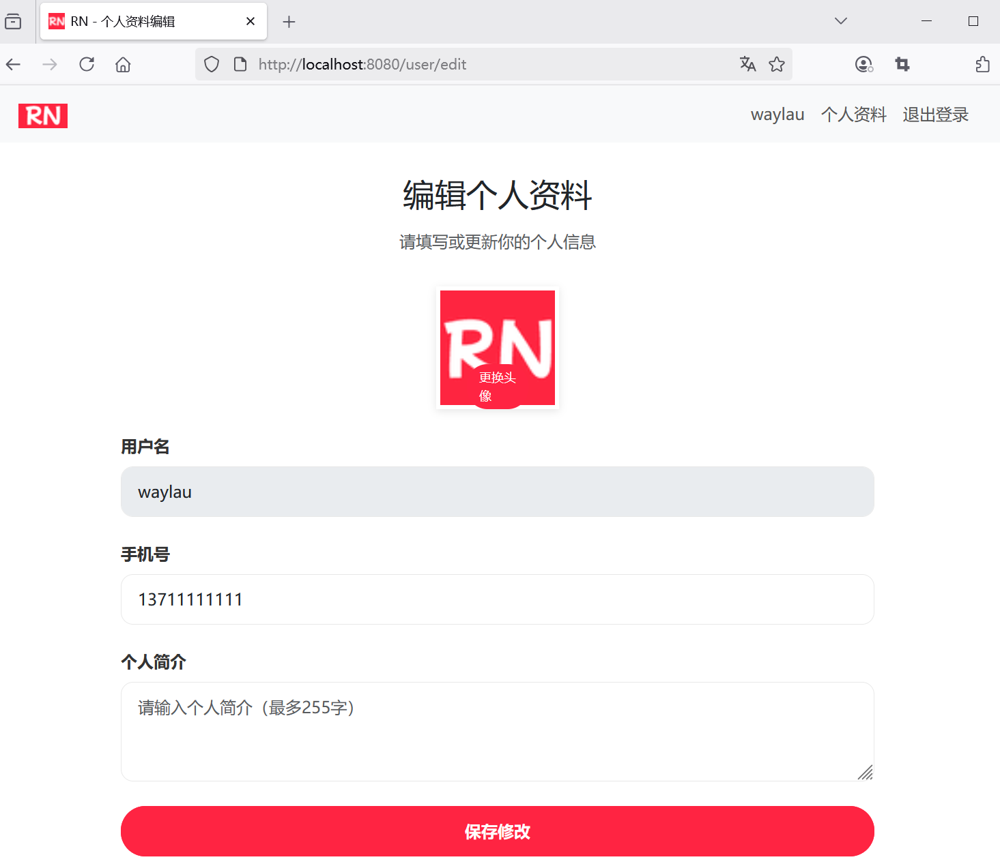


用户信息更新完成之后的页面如下：


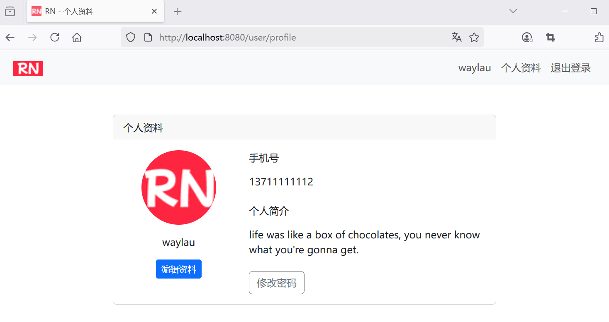


## 6.8 RedirectAttributes深入解析，Spring MVC重定向数据传递的核心工具

在 Spring MVC 开发中，重定向（Redirect）是一种常见的页面跳转方式。但直接重定向会导致请求参数丢失，`RedirectAttributes` 正是为解决这一问题而生的核心工具。它提供了一种安全、灵活的方式，在重定向过程中传递数据，并且能自动处理数据的存储与清理。本文将从原理、用法、最佳实践等方面深入解析这一组件。


### 一、核心作用与原理
#### 1. 作用
- 跨请求传递数据：在重定向场景下（如 `return "redirect:/target"`），传递临时数据（如提示信息、表单参数）。
- 支持闪存（Flash）机制：数据仅在一次请求中有效，使用后自动清除，避免数据泄漏或冗余。
- 兼容 URL 编码参数：可将数据直接附加到 URL 中（适用于非敏感数据）。

#### 2. 实现原理
- 基于 Session 的闪存存储：数据会被临时存储在 Session 中，重定向后取出并立即清除。
- 两种数据存储方式：
  - 闪存属性（Flash Attributes）：通过 `addFlashAttribute()` 存储，适用于敏感或较大的数据（如错误信息）。
  - URL 参数：通过 `.addAttribute()` 存储，数据会被编码到 URL 中（如 `?key=value`）。


### 二、核心方法与使用场景
#### 1. 关键方法列表
| 方法签名                          | 作用描述                                                                 |
|-----------------------------------|--------------------------------------------------------------------------|
| `addAttribute(String key, Object value)` | 将数据作为 URL 参数传递（直接拼接在 URL 中），适用于非敏感数据。         |
| `addFlashAttribute(String key, Object value)` | 将数据存入 Session（闪存），重定向后取出并清除，适用于敏感或临时数据。 |
| `getAttribute(String name)`       | 获取指定名称的属性（通常在重定向目标中使用）。                           |
| `getFlashAttributes()`            | 获取所有闪存属性（自动清除已读取的数据）。                               |
| `mergeAttributes(Map<String, ?> attributes)` | 合并外部属性到当前 `RedirectAttributes` 中。                            |

#### 2. 典型使用场景

##### 场景 1：重定向时传递成功/错误消息（推荐使用闪存）
```java
@PostMapping("/user/save")
public String saveUser(@Valid UserForm form, BindingResult result, RedirectAttributes redirectAttributes) {
    if (result.hasErrors()) {
        // 重定向回表单页，传递错误消息（闪存存储）
        redirectAttributes.addFlashAttribute("error", "表单填写有误，请检查！");
        return "redirect:/user/form";
    }
    userService.save(form);
    // 重定向到列表页，传递成功消息（闪存存储）
    redirectAttributes.addFlashAttribute("success", "用户保存成功！");
    return "redirect:/user/list";
}
```
- 在目标页面中获取消息（Thymeleaf 示例）：
  ```html
  <div th:if="${success}" class="alert alert-success" th:text="${success}"></div>
  <div th:if="${error}" class="alert alert-danger" th:text="${error}"></div>
  ```

##### 场景 2：重定向时携带查询参数（URL 参数方式）
```java
@GetMapping("/user/delete/{id}")
public String deleteUser(@PathVariable Long id, RedirectAttributes redirectAttributes) {
    userService.delete(id);
    // 重定向到列表页，并携带当前页码（URL 参数）
    redirectAttributes.addAttribute("page", 1); // 生成 ?page=1
    return "redirect:/user/list";
}
```
- 目标 URL 效果：`/user/list?page=1`
- 在目标控制器中接收参数：
  ```java
  @GetMapping("/user/list")
  public String listUsers(@RequestParam(defaultValue = "1") int page, Model model) {
      // ...
  }
  ```

##### 场景 3：组合使用闪存与 URL 参数
```java
@PostMapping("/user/update")
public String updateUser(@Valid UserForm form, BindingResult result, RedirectAttributes redirectAttributes) {
    if (result.hasErrors()) {
        // 传递错误消息（闪存）+ 保留原始表单参数（URL 参数）
        redirectAttributes.addFlashAttribute("error", "更新失败，请检查！");
        redirectAttributes.addAttribute("id", form.getId()); // 回传 ID 到 URL
        return "redirect:/user/edit";
    }
    userService.update(form);
    return "redirect:/user/detail/" + form.getId();
}
```


### 三、与 Model、Session 的区别
| 特性                | Model                          | RedirectAttributes         | Session                      |
|---------------------|--------------------------------|----------------------------|------------------------------|
| 作用范围        | 当前请求（Request）            | 重定向前后两次请求         | 跨会话（Session）            |
| 数据持久化      | 仅在当前请求有效               | 基于 Session 临时存储       | 直到手动清除或 Session 过期  |
| 适用场景        | 渲染视图时传递数据             | 重定向时传递临时数据       | 跨请求长期存储数据           |
| 安全性          | 无特殊处理                     | 闪存数据自动清除           | 需手动管理清除，存在泄漏风险 |
| URL 可见性      | 不可见                         | `addAttribute` 可见         | 不可见                       |


### 四、最佳实践与注意事项
#### 1. 优先使用闪存传递敏感数据
- 避免通过 `addAttribute()` 传递密码、手机号等敏感信息，防止 URL 被拦截或日志泄漏。
- 正确示例：
  ```java
  redirectAttributes.addFlashAttribute("error", "密码错误"); // 安全
  // redirectAttributes.addAttribute("password", "123"); // 危险！绝不允许
  ```

#### 2. 合理处理数据清除
- 闪存数据在读取后会自动清除，无需手动操作。
- 若需在重定向目标中多次使用同一数据，需重新存储（但不建议，违背闪存“单次使用”原则）。

#### 3. 结合 `@ControllerAdvice` 统一处理消息
```java
@ControllerAdvice
public class GlobalMessageHandler {

    @ModelAttribute
    public void addMessages(Model model, HttpServletRequest request) {
        // 从闪存中获取消息并放入 Model，供所有视图使用
        FlashMap inputFlashMap = RequestContextUtils.getInputFlashMap(request);
        if (inputFlashMap != null) {
            model.mergeAttributes(inputFlashMap);
        }
    }
}
```
- 无需在每个控制器中手动传递消息，全局统一处理。

#### 4. 处理重定向循环（Redirect Loop）
- 避免在重定向目标中再次使用 `RedirectAttributes` 导致循环重定向。
- 检查逻辑是否存在递归重定向（如保存失败后反复重定向到同一页面）。

#### 5. 在测试中模拟闪存数据
```java
@SpringBootTest(webEnvironment = WebEnvironment.RANDOM_PORT)
public class UserControllerTest {

    @Autowired
    private TestRestTemplate restTemplate;

    @Test
    public void testSaveUserWithError() {
        // 模拟表单提交失败
        UserForm form = new UserForm();
        ResponseEntity<String> response = restTemplate.postForEntity(
            "/user/save", form, String.class);
        
        // 断言重定向到 /user/form
        assertThat(response.getHeaders().getLocation().getPath()).isEqualTo("/user/form");
        
        // 从 Session 中获取闪存属性（需手动获取，测试时需配置 Session 管理）
        MockHttpSession session = (MockHttpSession) request.getSession();
        Map<String, Object> flashAttributes = (Map<String, Object>) 
            session.getAttribute(FlashMapManager.FLASH_ATTRS_SESSION_ATTRIBUTE);
        assertThat(flashAttributes.get("error")).isEqualTo("表单填写有误，请检查！");
    }
}
```


### 五、源码视角：关键实现类
1. `RedirectAttributesModelMap`  
   - 实现 `RedirectAttributes` 接口的核心类，继承自 `LinkedHashMap`，同时支持闪存属性和 URL 参数。
   - 内部维护两个存储区域：
     - `attributes`：用于 URL 参数的普通属性。
     - `flashAttributes`：用于闪存的临时属性（基于 Session 存储）。

2. `FlashMapManager`  
   - 负责管理闪存属性的存储与迁移，在请求处理前后自动将闪存数据写入/读取 Session。


### 六、扩展应用：与 Spring Security 结合
在登录场景中，常使用 `RedirectAttributes` 传递认证相关消息：
```java
@Controller
public class AuthController {

    @GetMapping("/login")
    public String loginPage(@RequestParam(required = false) String error, Model model) {
        if (error != null) {
            model.addAttribute("error", "用户名或密码错误");
        }
        return "login";
    }

    @PostMapping("/login")
    public String handleLogin(@Valid UserLoginForm form, BindingResult result, 
                              RedirectAttributes redirectAttributes) {
        if (result.hasErrors()) {
            redirectAttributes.addFlashAttribute("error", "表单填写有误");
            return "redirect:/login";
        }
        // 认证逻辑...
        return "redirect:/home";
    }
}
```


### 总结
`RedirectAttributes` 是 Spring MVC 重定向场景下的核心工具，通过灵活运用 `addAttribute()` 和 `addFlashAttribute()`，可以安全高效地实现跨请求数据传递。其核心优势在于：
- 临时存储：数据仅在重定向前后有效，自动清理避免泄漏。
- 场景适配：URL 参数适合公开数据，闪存适合敏感或非公开数据。
- 与视图解耦：无需依赖 Session 或复杂的参数拼接，简化开发流程。

在实际开发中，应根据数据敏感性和使用场景选择合适的传递方式，并结合全局异常处理、测试框架等提升开发效率与代码健壮性。


## 6.9 设计密码修改表单，对新密码进行强度校验和确认匹配

1. 设计密码修改表单，包含原密码、新密码和确认新密码输入框
2. 验证原密码的正确性，对新密码进行强度校验和确认匹配


### 设计密码修改表单


在`src/main/resources/templates`目录下新建user-change-password.html文件：

```html
<!DOCTYPE html>
<html lang="en" xmlns:th="http://www.thymeleaf.org"
      xmlns:sec="http://www.thymeleaf.org/extras/spring-security">
<head>
    <meta charset="UTF-8">
    <meta name="viewport" content="width=device-width, initial-scale=1.0">
    <title>RN - 修改密码</title>
    <!-- 引入 Bootstrap CSS -->
    <link href="https://cdn.bootcdn.net/ajax/libs/bootstrap/5.3.6/css/bootstrap.min.css"
          th:href="@{/css/bootstrap.min.css}" rel="stylesheet">

    <!-- 引入 Font Awesome -->
    <link href="https://cdn.bootcdn.net/ajax/libs/font-awesome/4.7.0/css/font-awesome.min.css"
          th:href="@{/css/font-awesome.min.css}" rel="stylesheet">

    <!-- 自定义样式 -->
    <style>
        .password-container {
            max-width: 500px;
            margin: 0 auto;
            padding: 32px;
        }

        .password-card {
            border-radius: 16px;
            box-shadow: 0 4px 20px rgba(0, 0, 0, 0.08);
            border: none;
        }

        .card-header {
            background-color: white;
            border-bottom: none;
            padding: 32px 32px 0;
        }

        .card-body {
            padding: 32px;
        }

        .form-group {
            margin-bottom: 24px;
        }

        .form-label {
            font-weight: 600;
            color: #333;
            margin-bottom: 8px;
        }

        .form-control {
            border-radius: 12px;
            border: 1px solid #e8e8e8;
            padding: 12px 16px;
            height: 48px;
        }

        .form-control:focus {
            border-color: #ff2442;
            box-shadow: 0 0 0 2px rgba(255, 36, 66, 0.1);
        }

        .btn-primary {
            background-color: #ff2442;
            border-color: #ff2442;
            border-radius: 24px;
            padding: 12px 48px;
            font-weight: 600;
            height: 48px;
            width: 100%;
            transition: all 0.3s ease;
        }

        .btn-primary:hover {
            background-color: #e61e3a;
            box-shadow: 0 4px 12px rgba(255, 36, 66, 0.2);
        }

        .error-message {
            color: #ff2442;
            font-size: 12px;
            margin-top: 4px;
        }

        .back-link {
            display: block;
            text-align: center;
            margin-top: 24px;
            color: #999;
            font-size: 14px;
        }

        .back-link:hover {
            color: #ff2442;
        }
    </style>
</head>
<body>
<!-- 导航栏 -->
<nav class="navbar navbar-expand-lg navbar-light bg-light">
    <div class="container">
        <a class="navbar-brand" href="/" th:href="@{/}">
            
        </a>
        <button class="navbar-toggler" type="button" data-bs-toggle="collapse" data-bs-target="#navbarNav"
                aria-controls="navbarNav" aria-expanded="false" aria-label="Toggle navigation">
            <span class="navbar-toggler-icon"></span>
        </button>
        <div class="collapse navbar-collapse" id="navbarNav">
            <ul class="navbar-nav ms-auto">
                <li class="nav-item">
                    <a class="nav-link" href="#" sec:authentication="name">
                        [[${#authentication.name}]]
                    </a>
                </li>
                <li class="nav-item">
                    <a class="nav-link" href="/user/profile" th:href="@{/user/profile}">个人资料</a>
                </li>
                <li class="nav-item">
                    <!-- 注销 -->
                    <form action="/logout" th:action="@{/logout}" method="post">
                        <button type="submit" class="nav-link">退出登录</button>
                    </form>
                </li>
            </ul>
        </div>
    </div>
</nav>

<!-- 主体部分 -->
<div class="password-container">
    <div class="card password-card">
        <!-- 编辑标题 -->
        <div class="card-header">
            <h2 class="text-center">修改密码</h2>
            <p>请输入当前密码和新密码</p>
        </div>

        <div class="card-body">
            <form action="/user/change-password" th:action="@{/user/change-password}" method="post">
                <!-- 当前密码 -->
                <div class="form-group">
                    <label for="oldPassword" class="form-label">当前密码</label>
                    <input type="password" class="form-control" id="oldPassword" name="oldPassword" required/>
                </div>

                <!-- 新密码 -->
                <div class="form-group">
                    <label for="newPassword" class="form-label">新密码</label>
                    <input type="password" class="form-control" id="newPassword" name="newPassword" required/>
                    <div class="error-message" id="newPasswordError"></div>
                </div>

                <!-- 确认密码 -->
                <div class="form-group">
                    <label for="confirmPassword" class="form-label">确认密码</label>
                    <input type="password" class="form-control" id="confirmPassword" name="confirmPassword" required/>
                    <div class="error-message" id="confirmPasswordError"></div>
                </div>

                <!-- 提交按钮 -->
                <button type="submit" class="btn btn-primary">确认修改</button>
            </form>

            <!-- 返回个人资料 -->
            <a href="/user/profile" th:href="@{/user/profile}" class="back-link">返回个人资料</a>
        </div>
    </div>

    <!-- 操作反馈 -->
    <div th:if="${success}" class="alert alert-success mt-3" role="alert">
        [[${success}]]
    </div>
    <div th:if="${error}" class="alert alert-danger mt-3" role="alert">
        [[${error}]]
    </div>
</div>

<!-- Bootstrap JS -->
<script src="https://cdn.bootcdn.net/ajax/libs/bootstrap/5.3.6/js/bootstrap.bundle.min.js"
        th:src="@{/js/bootstrap.bundle.min.js}"></script>

<!-- TODO 密码校验 -->
</body>
</html>
```
### 密码校验


验证原密码的正确性，对新密码进行强度校验和确认匹配：

```html
<script>
    // 密码验证，验证两次输入的密码是否一致
    document.querySelector('#confirmPassword').addEventListener('input', function () {
        const newPassword = document.querySelector('#newPassword').value;
        const confirmPasswordError = document.querySelector('#confirmPasswordError');

        if (this.value !== newPassword) {
            confirmPasswordError.textContent = '两次输入的密码不一致';
        } else {
            confirmPasswordError.textContent = '';
        }
    });

    // 密码强度验证
    document.querySelector('#newPassword').addEventListener('input', function () {
        const newPassword = this.value;
        const errorMessage = document.querySelector('#newPasswordError');

        // 密码长度至少8位
        if (newPassword.length < 8) {
            errorMessage.textContent = '密码长度至少8位';
            return;
        }

        // 密码必须包含字母和数字
        if (!/[a-zA-Z]/.test(newPassword) || !/[0-9]/.test(newPassword)) {
            errorMessage.textContent = '密码必须包含字母和数字';
            return;
        }

        errorMessage.textContent = '';
    })
</script>
```


## 6.10 使用BCryptPasswordEncoder对新密码进行加密并更新到数据库

### 修改用户控制器UserController


新增对修改密码页面处理：

```java
package com.example.rednote.controller;

// ...为节约篇幅，此处省略非核心内容

@Controller
@RequestMapping("/user")
public class UserController {

    // ...为节约篇幅，此处省略非核心内容

    @GetMapping("/change-password")
    public String changePasswordForm() {
        return "user-change-password";
    }

    @PostMapping("/change-password")
    public String changePassword(@RequestParam String oldPassword, @RequestParam String newPassword, @RequestParam String confirmPassword, RedirectAttributes redirectAttributes) {
        // 密码验证，验证两次输入的密码是否一致
        if (!newPassword.equals(confirmPassword)) {
            redirectAttributes.addFlashAttribute("error", "两次输入的密码不一致");
            return "redirect:/user/change-password";
        }

        // 密码旧密码是否正确
        if (!userService.verifyPassword(userService.getCurrentUser().getUsername(), oldPassword)) {
            redirectAttributes.addFlashAttribute("error", "旧密码错误");
            return "redirect:/user/change-password";
        }

        // 新密码强度验证
        if (!newPassword.matches("^[a-zA-Z0-9_]{8,20}$")) {
            redirectAttributes.addFlashAttribute("error", "新密码强度不够");
            return "redirect:/user/change-password";
        }

        // 更新密码到数据库
        userService.changePassword(userService.getCurrentUser().getUsername(), newPassword);
        redirectAttributes.addFlashAttribute("success", "密码修改成功");

        return "redirect:/user/change-password";
    }
}
```

其中：

* `userService.changePassword()`接口用于将修改后的密码保存到数据库；
* `redirectAttributes.addFlashAttribute()`重定向到页面时，传递消息。


### 修改后的密码保存到数据库


修改UserService，增加如下接口：

```java

/**
* 修改密码
*/
void changePassword(String username, String newPassword);
```


修改UserServiceImpl，增加如下方法：


```java
@Override
public void changePassword(String username, String newPassword) {
    User user = userRepository.findByUsername(username)
            .orElseThrow(() -> new UsernameNotFoundException(ExceptionType.USERNAME_NOT_FOUND));

    // 加密密码
    String encodedPassword = passwordEncoder.encode(newPassword);
    user.setPassword(encodedPassword);

    userRepository.save(user);
}
```


新密码需要通过 BCryptPasswordEncoder 加密后存储。


### 运行调测


用户修改密码页面如下：


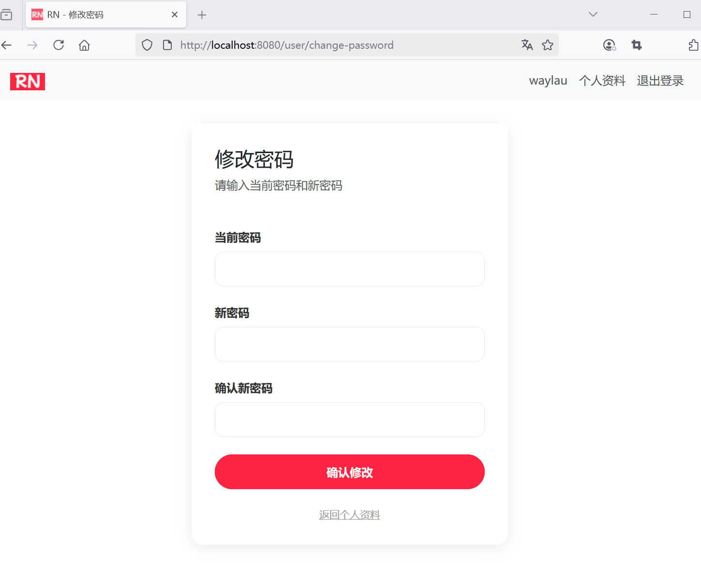


用户修改密码完成之后的页面如下：


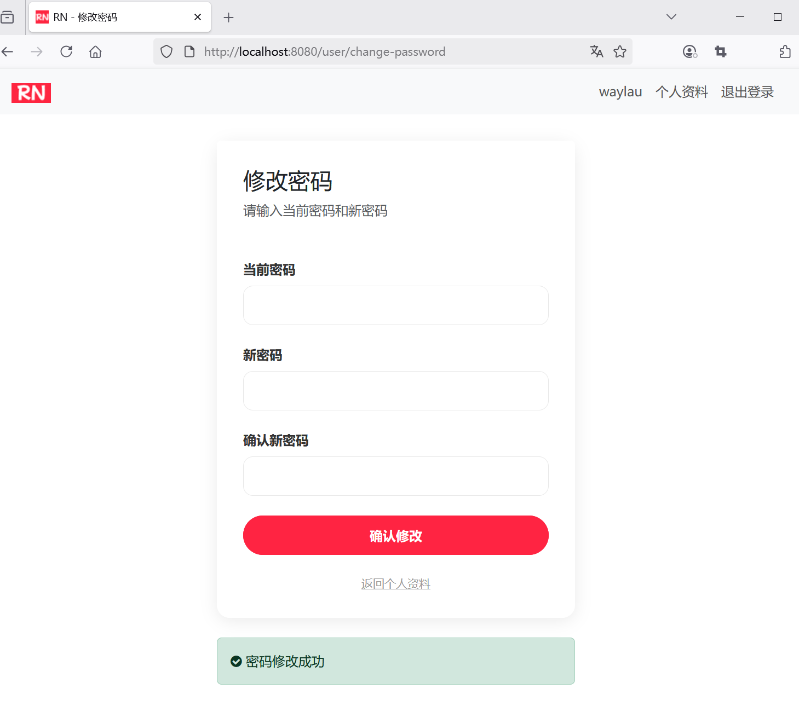


用户修改密码失败之后的页面如下：


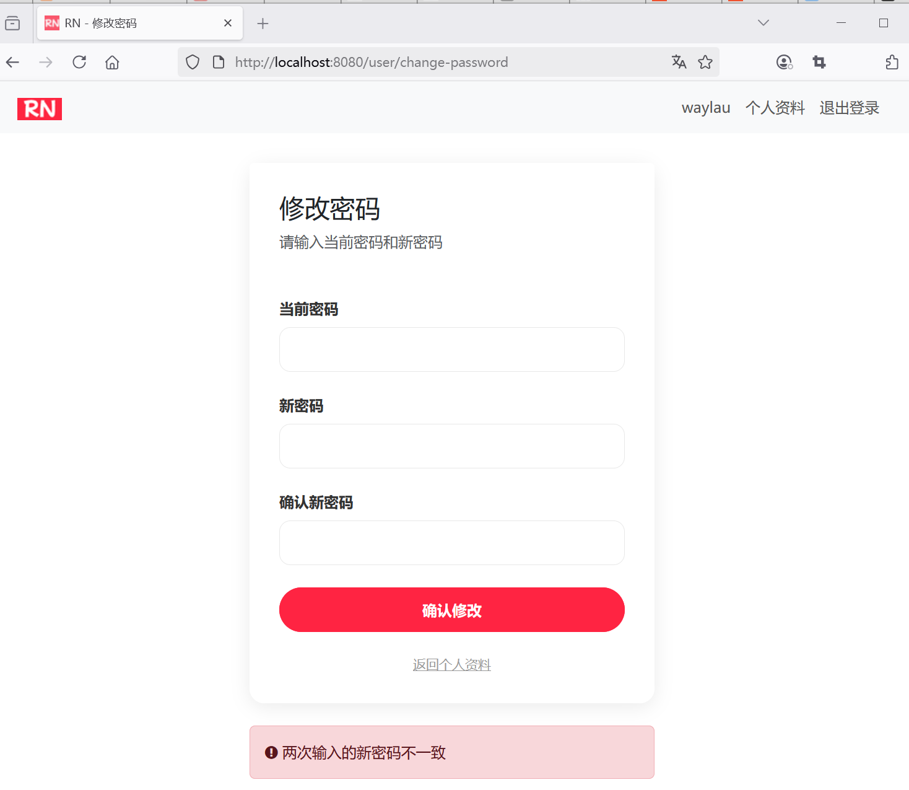


## 6.11 Spring MVC实现头像图片上传

在 Spring MVC 中实现头像上传功能，需要处理文件接收、存储、安全验证和 URL 管理等多个环节。下面我将详细介绍实现步骤和最佳实践。

文件上传配置：

* 表单使用 enctype="multipart/form-data"
* 需要在控制器中处理 MultipartFile 参数


### 静态资源映射配置

新增Spring MVC的配置文件WebMvcConfig.java，用于映射文件上传目录到URL路径：


```java
package com.example.rednote.config;

import org.springframework.beans.factory.annotation.Value;
import org.springframework.context.annotation.Configuration;
import org.springframework.web.servlet.config.annotation.ResourceHandlerRegistry;
import org.springframework.web.servlet.config.annotation.WebMvcConfigurer;

/**
 * WebMvcConfig MVC配置
 *
 * @version 2025/08/18
 **/
@Configuration
public class WebMvcConfig implements WebMvcConfigurer {
    // 文件存储根路径，可以配置在应用配置文件中
    @Value("${file.upload-dir:./rednote}")
    private String uploadDir;

    // 静态资源访问路径前缀，可以配置在应用配置文件中
    @Value("${file.static-path-prefix:/uploads/}")
    private String staticPathPrefix;

    // 添加资源处理器
    @Override
    public void addResourceHandlers(ResourceHandlerRegistry registry) {
        registry.addResourceHandler("/uploads/**")
                .addResourceLocations("file:" + uploadDir + staticPathPrefix);
    }
}
```


### 控制器实现

修改UserController控制器，增加对头像上传的处理：

```java
import org.springframework.transaction.annotation.Transactional;

// ...为节约篇幅，此处省略非核心内容

@Autowired
private FileStorageService fileStorageService;

@Transactional
@PostMapping("/edit")
public String updateProfile(@ModelAttribute User user, RedirectAttributes redirectAttributes,
                            @RequestParam("avatarFile") MultipartFile avatarFile) {
    User currentUser = userService.getCurrentUser();
    String oldAvatar = currentUser.getAvatar();

    // 验证文件类型和大小
    if (avatarFile != null && !avatarFile.isEmpty()) {
        // 验证文件类型
        String contentType = avatarFile.getContentType();
        if (!contentType.startsWith("image/")) {
            redirectAttributes.addFlashAttribute("error", "请上传图片文件");

            return "redirect:/user/edit";
        }

        // 文件名
        String fileName = avatarFile.getOriginalFilename();

        // 处理文件上传
        String fileUrl = fileStorageService.saveFile(avatarFile, fileName);
        currentUser.setAvatar(fileUrl);

        // 删除旧头像文件
        fileStorageService.deleteFile(oldAvatar);
    }

    // 更新用户信息
    currentUser.setPhone(user.getPhone());
    /*currentUser.setAvatar(user.getAvatar());*/
    currentUser.setBio(user.getBio());

    // 修改内容保存到数据库
    userService.updateUser(currentUser);

    // 重定向到指定页面，并传递参数
    redirectAttributes.addFlashAttribute("success", "个人信息更新成功");

    return "redirect:/user/profile";
}
```

其中

* MultipartFile用于处理头像文件
* FileStorageService.saveFile()用于保存文件
* FileStorageService.deleteFile()用于删除文件


### 文件存储服务接口


接口如下：


```java
package com.example.rednote.service;

import org.springframework.web.multipart.MultipartFile;

/**
 * FileStorageService 文件存储服务
 *
 * @version 2025/06/07
 **/
public interface FileStorageService {

    /**
     * 保存文件
     *
     * @param file     上传的文件
     * @param fileName 文件名
     * @return 文件访问路径
     */
    String saveFile(MultipartFile file, String fileName);

    /**
     * 删除文件
     *
     * @param filePath 文件路径
     */
    void deleteFile(String filePath);

}
```


## 6.12 实现文件存储服务器

### 文件存储服务实现

实现如下：

```java
package com.example.rednote.service.impl;

import com.example.rednote.exception.FileStorageException;
import com.example.rednote.service.FileStorageService;
import org.springframework.beans.factory.annotation.Value;
import org.springframework.stereotype.Service;
import org.springframework.web.multipart.MultipartFile;

import java.io.InputStream;
import java.nio.file.Files;
import java.nio.file.Path;
import java.nio.file.Paths;
import java.nio.file.StandardCopyOption;
import java.time.LocalDate;
import java.util.UUID;

/**
 * FileStorageServiceImpl 文件存储服务
 *
 * @version 2025/08/18
 **/
@Service
public class FileStorageServiceImpl implements FileStorageService {

    // 文件存储根路径，可以配置在应用配置文件中
    @Value("${file.upload-dir:/data/rednote}")
    private String uploadDir;

    // 静态资源访问路径前缀，可以配置在应用配置文件中
    @Value("${file.static-path-prefix:/uploads/}")
    private String staticPathPrefix;

    @Override
    public String saveFile(MultipartFile file, String filename) {
        // 确保文件名唯一
        String uniqueFileName = UUID.randomUUID() + "_" + filename;

        // 生成文件存储路径，按照日期分目录，提高文件系统的性能
        String subDir = LocalDate.now().toString();
        Path uploadPath = Paths.get(uploadDir + staticPathPrefix + subDir);

        try {
            // 创建目录（如果不存在）
            if (!Files.exists(uploadPath)) {
                Files.createDirectories(uploadPath);
            }

            // 拷贝文件。使用完后释放资源
            try (InputStream inputStream = file.getInputStream()) {
                Files.copy(inputStream, uploadPath.resolve(uniqueFileName), StandardCopyOption.REPLACE_EXISTING);
            }
        } catch (Exception e) {
            // 抛出自定义运行时异常
            throw new FileStorageException("文件上传失败：" + filename, e);
        }

        // 返回可访问的URL路径
        return staticPathPrefix + subDir + "/" + uniqueFileName;
    }

    @Override
    public void deleteFile(String filePath) {
        // 判定文件路径是否为空
        if (filePath == null || filePath.isEmpty()) {
            return;
        }

        // 安全检查，确保路径在上传目录内
        Path fullPath = Paths.get(uploadDir + filePath).normalize();

        try {
            // 删除文件
            Files.deleteIfExists(fullPath);
        } catch (Exception e) {
            // 抛出自定义运行时异常
            throw new FileStorageException("文件删除失败：" + filePath, e);
        }
    }
}
```


### 在视图中显示头像上传功能

修改user-profile-edit.html:

```html
<div class="avatar-upload">
    <!-- 文件上传 --->
    <input type="file" id="avatarFile" name="avatarFile" accept="image/*" class="d-none"></input>
    <label for="avatarFile">更换头像</label>
</div>
```


### 异常处理

#### 1. 自定义文件存储异常


```java
package com.example.rednote.exception;

/**
 * FileStorageException 文件存储异常
 *
 * @version 2025/06/07
 **/
public class FileStorageException extends ValidationException {
    public FileStorageException(String message) {
        super("文件存储异常. " + message);
    }

    public FileStorageException(String message, Throwable cause) {
        super("文件存储异常. " + message, cause);
    }
}
```

#### 2. 自定义验证相关异常

```java
package com.example.rednote.exception;

/**
 * ValidationException 验证相关异常
 *
 * @version 2025/06/07
 **/
public class ValidationException extends BusinessException {
    public ValidationException(String message) {
        super(message);
    }

    public ValidationException(String message, Throwable cause) {
        super(message, cause);
    }
}
```

#### 3. 自定义基础业务异常

```java
package com.example.rednote.exception;

/**
 * BusinessException 基础业务异常
 *
 * @version 2025/06/07
 **/
public class BusinessException extends RuntimeException {
    public BusinessException(String message) {
        super(message);
    }

    public BusinessException(String message, Throwable cause) {
        super(message, cause);
    }
}
```

### 应用配置


```
# 文件上传配置
file.upload-dir=/data/rednote
file.static-path-prefix=/uploads/

# 上传文件大小限制
spring.servlet.multipart.max-file-size=10MB
spring.servlet.multipart.max-request-size=10MB
```


### 运行调测


点击“更换头像”按钮，会弹出文件上传选取框如下：


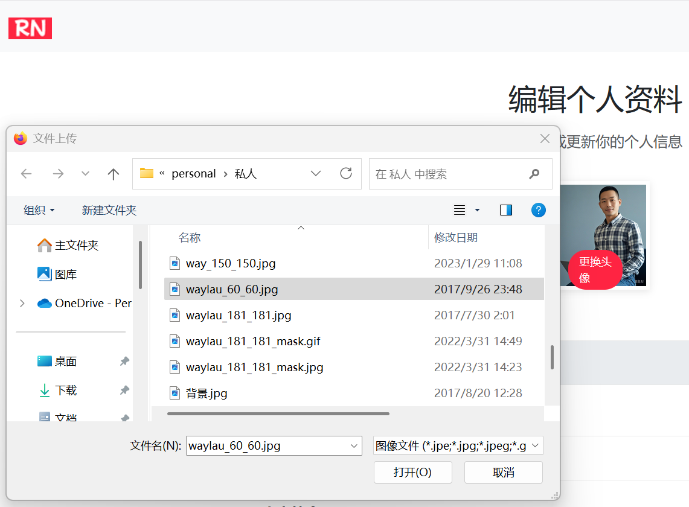


头像更新之后，会重定向到用户信息展示页面，可以看到头像更新后的图片，如下：


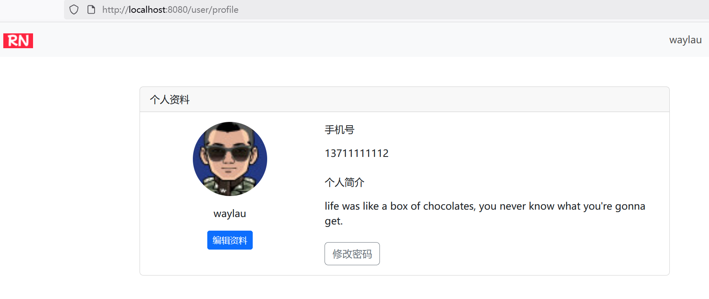

头像图片会存储在指定目录下，如下：

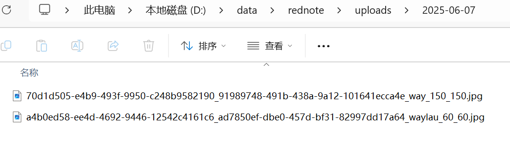


### 总结

实现 Spring MVC 文件上传需要关注以下关键点：
1. 配置 MultipartResolver 处理文件上传请求
2. 安全验证：类型检查、大小限制、路径验证
3. 文件存储策略：本地存储或云存储
4. 数据库关联：保存文件路径到数据库
5. 静态资源映射：确保文件可被访问
6. 异常处理：完善的错误处理机制

通过以上步骤，你可以实现一个安全、高效的头像上传功能，同时支持本地存储和云存储方案，满足不同规模应用的需求。


## 6.13 经验总结及优化建议

### 前端用户信息管理页面搭建
- Bootstrap 组件运用
    - 借助 Bootstrap 的各类组件（如 `Card`、`Form`等）设计用户信息展示与编辑页面。
    - 合理布局页面元素，包括基本信息展示区、编辑表单区等。
- 页面交互设计
    - 为编辑按钮添加点击事件，实现信息编辑与展示状态的切换。
    - 提供友好的确认和提示信息。
- 数据绑定与显示
    - 使用 Thymeleaf 的表达式将后端传来的用户信息绑定到前端页面进行显示。
    - 确保信息展示的格式规范、清晰。

### Spring MVC 处理用户信息请求
- 控制器设计
    - 创建处理用户信息管理请求的控制器类，使用 `@Controller` 注解。
    - 定义不同请求方法（如 `GET` 获取信息、`POST` 保存信息）对应的处理方法。
- 请求映射与参数接收
    - 使用 `@RequestMapping` 或其派生注解将不同的请求路径映射到相应的处理方法。
    - 准确接收前端传来的用户信息参数，进行必要的格式校验。
    - `RedirectAttributes.addFlashAttribute()`重定向到页面时，传递消息。
- 响应处理
    - 根据业务逻辑处理结果，返回合适的响应信息，如成功提示、错误信息等。
    - 支持 HTML 页面响应。

### Spring Data JPA 进行用户信息持久化操作
- 实体类关联与扩展
    - 检查并完善用户实体类，确保包含所有需要管理的用户信息字段。

- Repository 接口方法实现
    - 在用户 Repository 接口中添加用于更新、查询用户信息的方法。
    - 利用 Spring Data JPA 的方法命名规则或自定义查询语句实现这些功能。


### Spring Security 权限控制与用户身份验证
- 权限配置调整
    - 在 Spring Security 配置类中，进一步细化用户信息管理页面的访问权限。
    - 确保只有已登录用户可以访问自己的信息管理页面。
- 用户身份验证与信息匹配
    - 在控制器方法中，从 Spring Security 的上下文获取当前登录用户的信息。
    - 验证用户请求的信息是否与当前登录用户的身份匹配，防止越权操作。

### 用户信息管理功能实现
- 基本信息查看与编辑
    - 实现用户基本信息（如昵称、头像、联系方式等）的查看功能。
    - 允许用户对可编辑信息进行修改，并将修改后的数据保存到数据库。
- 密码修改功能
    - 设计密码修改表单，包含原密码、新密码和确认新密码输入框。
    - 验证原密码的正确性，对新密码进行强度校验和确认匹配。
    - 使用 `BCryptPasswordEncoder` 对新密码进行加密并更新到数据库。


### 错误处理与性能优化建议

- 全局异常处理增强
    - 扩展全局异常处理器，处理用户信息管理过程中可能出现的异常，如数据库操作异常、权限验证异常等。
    - 返回清晰易懂的错误信息给用户。
- 性能优化策略
    - 对数据库查询进行优化，如使用索引、分页查询等。
    - 优化前端页面的加载速度，如异步加载数据、缓存常用信息。
- 拓展建议：
    - 提出一些可拓展的功能方向，如用户信息备份与恢复、多语言支持的信息展示等。


## 7.1 笔记模块功能概述

仿“小红书”单体项目笔记模块，围绕“用户生成内容（UGC）”核心，聚焦笔记的全生命周期管理，涵盖内容创作、发布、展示、互动等核心功能，同时兼顾用户体验与系统稳定性。以下是整体功能概述总结：


### 核心功能模块
#### 1. 笔记基础管理
- 创建与发布：支持用户上传图文内容（标题、正文、话题、分类），提供富文本编辑（换行、emoji），发布时自动关联用户信息（作者ID、昵称、头像）。
- 修改与删除：作者可编辑已发布笔记的内容（标题、正文、话题、分类），或彻底删除笔记（删除后不可恢复，同时清理关联互动数据）。


#### 2. 内容展示与检索
- 首页推荐：基于用户兴趣标签（如“美食”“穿搭”）和热门度（点赞、评论数），展示个性化笔记列表，支持下拉刷新和分页加载。
- 详情页展示：完整呈现笔记内容（标题、正文、图片组、发布时间），关联显示作者信息、互动数据（点赞数、评论数）。
- 检索功能：支持按关键词（话题、分类）搜索笔记，结果按相关性排序，支持筛选（如“最新发布”）。


#### 3. 多媒体处理
- 图片上传与展示：支持多图上传。
- 图片存储：本地文件系统私有化部署，通过URL路径访问，确保图片加载速度。


#### 4. 标签与分类体系
- 话题标签：用户可手动添加话题，单篇笔记可以添加多个话题，话题关联笔记用于搜索。
- 分类管理：预设一级分类（如“美食”“旅行”“美妆”），用户发布时选择对应分类，用于内容归类和精准推荐。


### 5. 技术实现亮点

1. 数据模型设计：核心实体包括`Note`（笔记基本信息），通过外键关联保证数据一致性。
2. 前端交互优化：采用异步加载（AJAX）实现点赞、收藏等操作的实时反馈，图片懒加载减少初始加载时间，提升页面流畅度。
3. 扩展性预留：模块内部通过接口隔离业务逻辑（如`NoteService`、`CommentService`），为后续拆分微服务、集成AI功能（如AI文案生成、AI评论助）预留扩展点。


### 业务价值

该笔记模块作为仿“小红书”项目的核心内容载体，实现了用户“记录生活、分享体验”的核心需求，通过话题标签和分类体系实现内容聚合，为平台构建了UGC社区的基础生态。同时，功能设计贴合小红书“年轻、潮流、生活化”的产品调性，为后续迭代（AI辅助创作）奠定了基础。


## 7.2 笔记发布功能概述

笔记模块的发布功能界面包含了内容编辑器、图片上传、话题、分类等核心功能，整体风格与交互体验都尽量贴近小红书平台。


    


### 界面功能亮点

1. 小红书风格设计：
   - 采用小红书标志性的红色调
   - 简洁明快的界面布局
   - 精心设计的卡片、按钮和交互元素

2. 完整的笔记发布功能：
   - 标题和内容编辑器
   - 支持多图上传与预览
   - 支持多话题输入
   - 分类选择

3. 丰富的交互体验：
   - 图片上传预览和删除功能
   - 快速输入多个话题
   - 发布成功反馈
   - 表单验证和错误提示

4. 响应式设计：
   - 适配手机、平板和桌面设备
   - 在不同屏幕尺寸下保持良好的用户体验

5. 前端交互逻辑：
   - 使用纯 JavaScript 实现所有交互功能
   - 无额外依赖，保证加载速度


## 7.3 使用Bootstrap、Font Awesome以及Thymeleaf构建笔记发布表单界面

### 页面设计


新增note-publish.html


```html
<!DOCTYPE html>
<html lang="en" xmlns:th="http://www.thymeleaf.org">
<head>
    <meta charset="UTF-8">
    <meta name="viewport" content="width=device-width, initial-scale=1.0">
    <title>RN - 笔记发布</title>
    <!-- 引入 Bootstrap CSS -->
    <link href="https://cdn.bootcdn.net/ajax/libs/bootstrap/5.3.6/css/bootstrap.min.css"
          th:href="@{/css/bootstrap.min.css}" rel="stylesheet">

    <!-- 引入 Font Awesome -->
    <link href="https://cdn.bootcdn.net/ajax/libs/font-awesome/4.7.0/css/font-awesome.min.css"
          th:href="@{/css/font-awesome.min.css}" rel="stylesheet">

    <!-- 自定义样式 -->
    <style>
        /* 基础样式 */
        body {
            background-color: #fef6f6;
            font-family: -apple-system, BlinkMacSystemFont, "Segoe UI", Roboto, Helvetica, Arial, sans-serif;
        }

        .container {
            max-width: 768px;
            margin: 0 auto;
            padding: 0 16px;
        }

        /* 顶部导航栏 */
        .header {
            background-color: white;
            border-bottom: 1px solid #eee;
            padding: 12px 0;
            position: sticky;
            top: 0;
            z-index: 100;
        }

        .header .btn {
            padding: 6px 16px;
            border-radius: 20px;
            font-weight: 600;
        }

        .btn-cancel {
            color: #333;
            border: 1px solid #ddd;
        }

        .btn-publish {
            background-color: #ff2442;
            color: white;
            border: none;
        }

        .btn-publish:hover {
            background-color: #e61e3a;
        }

        /* 内容区域 */
        .content {
            padding: 16px 0;
        }

        /* 标题输入框 */
        .note-title {
            border: none;
            width: 100%;
            font-size: 20px;
            font-weight: 600;
            padding: 12px 0;
            outline: none;
        }

        .note-title::placeholder {
            color: #999;
        }

        /* 图片上传区域 */
        .image-upload {
            background-color: #f8f8f8;
            border-radius: 8px;
            padding: 24px 0;
            text-align: center;
            margin-bottom: 20px;
        }

        .image-upload .upload-btn {
            width: 80px;
            height: 80px;
            border: 2px dashed #ddd;
            border-radius: 8px;
            margin: 0 auto;
            display: flex;
            align-items: center;
            justify-content: center;
            cursor: pointer;
            transition: all 0.3s;
        }

        .image-upload .upload-btn:hover {
            border-color: #ff2442;
        }

        .image-upload .upload-btn i {
            font-size: 24px;
            color: #999;
        }

        .image-upload p {
            margin-top: 12px;
            color: #666;
            font-size: 14px;
        }

        /* 已上传图片展示 */
        .uploaded-images {
            display: flex;
            flex-wrap: wrap;
            gap: 8px;
            margin-top: 16px;
        }

        .uploaded-image {
            width: 80px;
            height: 80px;
            border-radius: 8px;
            overflow: hidden;
            position: relative;
        }

        .uploaded-image img {
            width: 100%;
            height: 100%;
            object-fit: cover;
        }

        .uploaded-image .delete-btn {
            position: absolute;
            top: 4px;
            right: 4px;
            width: 20px;
            height: 20px;
            background-color: rgba(0, 0, 0, 0.6);
            color: white;
            border-radius: 50%;
            display: flex;
            align-items: center;
            justify-content: center;
            cursor: pointer;
            font-size: 12px;
        }

        /* 笔记内容编辑器 */
        .note-content {
            width: 100%;
            min-height: 200px;
            border: none;
            outline: none;
            font-size: 16px;
            line-height: 1.6;
            padding: 12px 0;
        }

        .note-content::placeholder {
            color: #999;
        }

        /* 话题选择 */
        .topic-input {
            position: relative;
            margin-bottom: 20px;
        }

        .topic-input input {
            width: 100%;
            padding: 12px;
            border: 1px solid #eee;
            border-radius: 8px;
            outline: none;
        }

        /* 分类选择 */
        .category-selector {
            margin-bottom: 20px;
        }

        .category-input i {
            color: #ff2442;
        }

        /* 添加到 style 标签中 */
        .category-selector select {
            width: 100%;
            padding: 12px;
            border: 1px solid #eee;
            border-radius: 8px;
            background-color: white;
            appearance: none;
            -webkit-appearance: none;
            background-image: url("data:image/svg+xml,%3Csvg xmlns='http://www.w3.org/2000/svg' viewBox='0 0 24 24' fill='%23666'%3E%3Cpath d='M7 10l5 5 5-5z'/%3E%3C/svg%3E");
            background-repeat: no-repeat;
            background-position: right 12px center;
            background-size: 16px;
            cursor: pointer;
        }

        .category-selector select:focus {
            outline: none;
            border-color: #ff2442;
            box-shadow: 0 0 0 2px rgba(255, 36, 66, 0.1);
        }

        .form-label {
            font-weight: 600;
            color: #333;
        }

        .error-message {
            color: #ff2442;
            font-size: 12px;
            margin-top: 4px;
        }
    </style>
</head>
<body>
<!-- 操作栏 -->
<div class="header">
    <div class="container">
        <div class="d-flex justify-content-between align-items-center">
            <button class="btn btn-cancel" id="cancelPublishBtn">
                取消
            </button>
            <button class="btn btn-publish" id="publishNoteBtn">
                发布
            </button>
        </div>
    </div>
</div>

<!-- 主体部分 -->
<div class="container content">
    <form id="noteForm" method="post" action="/note/publish" th:object="${note}"
          th:action="@{/note/publish}" enctype="multipart/form-data">
        <!-- 标题输入框 -->
        <input type="text" class="note-title" id="title" name="title"
               th:field="*{title}" placeholder="分享你的生活点滴...">
        <div class="error-message" th:if="${#fields.hasErrors('title')}" th:errors="*{title}">
        </div>
        
        <!-- 图片上传区域 -->
        <div class="image-upload">
            <!-- 图片选取上传按钮 -->
            <div class="upload-btn" onclick="document.getElementById('imageUpload').click()">
                <i class="fa fa-plus"></i>
            </div>
            <p>上传图片（最多9张）</p>
            <input type="file" id="imageUpload" name="images" multiple="multiple" style="display: none;"
                   accept="image/*" th:field="*{images}">

            <!-- 已上传图片预览 -->
            <div class="uploaded-images" id="uploadedImages"></div>

            <!-- 错误消息 -->
            <div class="error-message" th:if="${#fields.hasErrors('images')}" th:errors="*{images}">
            </div>
        </div>

        <!-- 笔记内容 -->
        <textarea class="note-content" id="content" name="content"
                  th:field="*{content}" placeholder="详细描述你的分享内容..."></textarea>
        <div class="error-message" th:if="${#fields.hasErrors('content')}" th:errors="*{content}">
        </div>

        <!-- 话题 -->
        <div class="topic-input">
            <input type="text" class="form-control" id="topicInput" name="topics"
                   th:field="*{topics}" placeholder="添加话题，多个话题用空格隔开">
        </div>

        <!-- 分类 -->
        <div class="category-selector">
            <label for="categorySelect" class="form-label">请选择一个分类：</label>
            <select class="form-control" id="categorySelect" name="category"
                    th:field="*{category}">
                <option value="穿搭">穿搭</option>
                <option value="美食">美食</option>
                <option value="彩妆">彩妆</option>
                <option value="影视">影视</option>
                <option value="职场">职场</option>
                <option value="情感">情感</option>
                <option value="家居">家居</option>
                <option value="游戏">游戏</option>
                <option value="旅行">旅行</option>
                <option value="健身">健身</option>
            </select>
            <div class="error-message" th:if="${#fields.hasErrors('category')}" th:errors="*{category}">
            </div>
        </div>
    </form>
</div>

<!-- Bootstrap JS -->
<script src="https://cdn.bootcdn.net/ajax/libs/bootstrap/5.3.6/js/bootstrap.bundle.min.js"
        th:src="@{/js/bootstrap.bundle.min.js}"></script>

</body>
</html>
```


笔记发布界面效果如下图7-1所示:


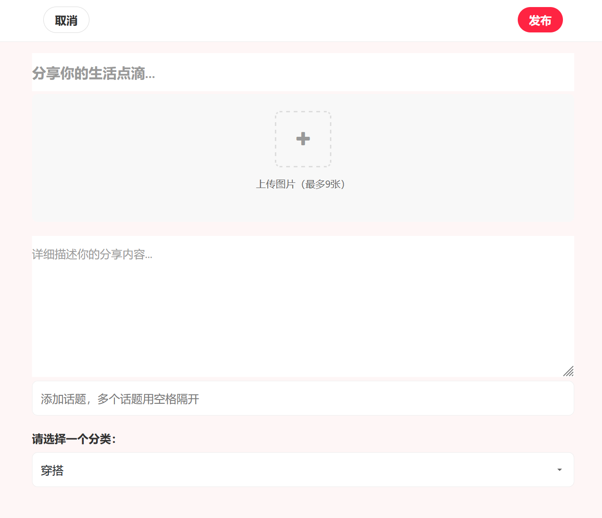


### 笔记发布表单的校验


```js
<script>
    // 笔记发布表单的校验
    // 在发布按钮上设置点击事件
    document.getElementById("publishNoteBtn").addEventListener("click", function (event) {
        // 获取笔记标题
        const title = document.getElementById("title").value;
        if (title.trim() === "") {
            alert("请输入笔记标题");
            return;
        }

        // 获取笔记内容
        const content = document.getElementById("content").value;
        if (content.trim() === "") {
            alert("请输入笔记内容");
            return;
        }

        // 提交表单
        document.getElementById("noteForm").submit();
    })
</script>
```


## 7.4 攻克多图选择及多次选择的难点

本节实现

1. 为图片上传组件添加预览功能，让用户可以实时看到上传的图片
2. 实现图片的动态添加和删除功能，提升用户体验
3. 设计提交按钮，并添加点击事件，在提交前进行表单验证

### 图片预览、多图选择及多次选择

在 HTML 中，`<input type="file" multiple>` 允许用户一次选择多个文件。然而，这个功能本身并不支持“多次选择”同一个文件输入框中的文件。用户每次点击文件选择对话框时，只能选择一组新的文件，这些文件会替换之前选择的文件。

如果你希望实现多次选择文件的功能（即用户可以选择文件多次，并将所有选择的文件累积到一个列表中），你需要使用 JavaScript 来实现这个功能。以下是一个简单的实现方案：


```js
<script>
    // ...为节约篇幅，此处省略非核心内容

    // 收集选择的文件
    let selectedFiles = [];

    // 监听文件的选择
    document.getElementById("imageUpload").addEventListener("change", function (event) {
        // 获取选择的文件
        const files = Array.from(event.target.files);

        // 添加到已收集的选择数组里面去
        selectedFiles = selectedFiles.concat(files);

        // 更新文件列表显示
        updateFileList();
    })


    // 获取已上传图片预览的 DOM 元素
    const uploadedImages = document.getElementById("uploadedImages");

    // 更新文件列表显示
    function updateFileList() {
        // 清空图片预览
        uploadedImages.innerHTML = "";

        // 生成图片预览
        for (let i = 0; i < selectedFiles.length; i++) {
            const fileItem = document.createElement("div");
            fileItem.className = "uploaded-image";

            const deleteBtn = document.createElement("div");
            deleteBtn.className = "delete-btn";
            deleteBtn.onclick = () => deleteFile(i);
            fileItem.appendChild(deleteBtn);

            const deleteBtnIcon = document.createElement("i");
            deleteBtnIcon.className = "fa fa-times";
            deleteBtn.appendChild(deleteBtnIcon);

            const imagePreview = document.createElement("img");
            imagePreview.className = "preview-img";
            imagePreview.alt = "预览";
            fileItem.appendChild(imagePreview);

            const reader = new FileReader();
            reader.onload = function (e) {
                imagePreview.src = e.target.result;
            }
            reader.readAsDataURL(selectedFiles[i]);

            uploadedImages.appendChild(fileItem);
        }
    }

    // 删除预览文件
    function deleteFile(i) {
        selectedFiles.splice(i, 1);
        updateFileList();
    }

    // 取消发布的事件处理
    document.getElementById("cancelPublishBtn").addEventListener("click", function (event) {
        // 用户确认是否取消发布
        if (confirm("确定要取消发布吗？所有内容将不会被保存")) {
            window.history.back();
        }
    })
});

</script>
```


上述代码：

* 可以通过使用 FileReader 来实现图片的预览功能。FileReader 允许我们读取文件的内容，并将其转换为 Data URL，这样我们就可以直接在  标签中显示图片
* updateFileList 函数现在为每个文件项添加了一个删除按钮。
* deleteFile 函数用于从 selectedFiles 数组中删除指定索引的文件，并更新文件列表显示。


### 如何将文件数组赋值给 `<form>`？


在 JavaScript 中，`<form>` 元素不能直接接收文件数组作为其内容。文件数组通常是指用户通过 `<input type="file">` 元素选择的文件列表，这些文件需要以特定的方式添加到表单中，以便在提交表单时能够上传到服务器。

如果你希望将文件数组的内容上传到服务器，通常需要使用 FormData 对象来构建表单数据，然后通过 POST 请求发送这些数据。

如果你需要模拟文件选择或拖放操作，可以使用 DataTransfer 对象来构建一个文件列表，然后通过编程的方式将其赋值给一个 `<input type="file">` 元素。


以下示例展示了如何将将文件数组赋值给 `<form>`：

```js
// 在发布按钮上设置点击事件
document.getElementById("publishNoteBtn").addEventListener("click", function (event) {
    // ...为节约篇幅，此处省略非核心内容

    // 将收集到的图片上传，需要创建DataTransfer对象
    const dataTransfer = new DataTransfer();
    for (let i = 0; i < selectedFiles.length; i++) {
        // 将文件添加到DataTransfer对象中
        dataTransfer.items.add(selectedFiles[i]);
    }

    // 将DataTransfer对象设置给上传文件的input元素
    document.getElementById("imageUpload").files = dataTransfer.files;

    // 提交表单
    document.getElementById("noteForm").submit();
})
```


## 7.5 掌握自定义校验器处理复杂数据类型

基于之前的笔记发布界面，我将补充完整的后端接口实现，包括表单处理、图片上传和安全校验。以下是核心代码实现：


### DTO 对象

```java
package com.example.rednote.dto;

import jakarta.validation.constraints.NotEmpty;
import jakarta.validation.constraints.Size;
import lombok.Getter;
import lombok.Setter;
import org.springframework.web.multipart.MultipartFile;

import java.util.List;

/**
 * NotePublishDto 笔记发布DTO
 *
 * @version 2025/08/18
 **/
@Getter
@Setter
public class NotePublishDto {
    @NotEmpty(message = "标题不能为空")
    @Size(max = 60, message = "标题长度不能超过60个字符")
    private String title;

    @NotEmpty(message = "内容不能为空")
    @Size(max = 900, message = "内容长度不能超过900个字符")
    private String content;

    private String topics;

    @NotEmpty(message = "分类不能为空")
    private String category;

    @NotEmpty(message = "图片不能为空")
    @Size(min = 1, max = 9, message = "上传图片最多9张")
    private List<MultipartFile> images;
}
```

`List<MultipartFile>`用于接收前端传过来的图片数组。由于`List<MultipartFile>`的校验较为复杂，因此需要自定义校验器。


### 支持对集合中每个元素的验证


在使用 jakarta.validation 来验证 `List<MultipartFile>` 中的每个 MultipartFile 是否为空时，你可以创建一个自定义验证器。由于 jakarta.validation 本身不直接支持对集合中每个元素的验证，你需要实现一个自定义的验证注解和对应的验证器。

以下是一个完整的实现步骤。

#### 1. 创建自定义验证注解

首先，创建一个自定义注解来标记需要验证的字段：

```java
package com.example.rednote.annotation;

import jakarta.validation.Constraint;
import jakarta.validation.Payload;

import java.lang.annotation.*;

/**
 * NotEmptyMultipartFileList 验证 List<MultipartFile> 中的每个 MultipartFile 是否为空
 *
 * @version 2025/08/18
 **/
@Documented
@Constraint(validatedBy = NotEmptyMultipartFileListValidator.class)
@Target({ElementType.FIELD, ElementType.PARAMETER})
@Retention(RetentionPolicy.RUNTIME)
public @interface NotEmptyMultipartFileList {
    String message() default "文件列表不能包含空文件";

    Class<?>[] groups() default {};

    Class<? extends Payload>[] payload() default {};
}
```

#### 2. 实现自定义验证器

接下来，实现一个验证器来检查 `List<MultipartFile>` 中的每个文件是否为空：


```java
package com.example.rednote.annotation;

import jakarta.validation.ConstraintValidator;
import jakarta.validation.ConstraintValidatorContext;
import org.springframework.web.multipart.MultipartFile;

import java.util.List;

/**
 * NotEmptyMultipartFileListValidator 自定义验证器来检查 List<MultipartFile> 中的每个文件是否为空
 *
 * @version 2025/08/18
 **/
public class NotEmptyMultipartFileListValidator implements ConstraintValidator<NotEmptyMultipartFileList, List<MultipartFile>> {
    @Override
    public boolean isValid(List<MultipartFile> multipartFiles, ConstraintValidatorContext constraintValidatorContext) {
        if (multipartFiles != null && !multipartFiles.isEmpty()) {
            for (MultipartFile multipartFile : multipartFiles) {
                if (multipartFile.isEmpty()) {
                    return false;
                }
            }

            return true;
        }

        return false;
    }
}
```

### 在DTO中使用自定义校验器注解

现在，你可以在DTO中使用这个自定义注解来验证文件列表：


```java
import com.example.rednote.annotation.NotEmptyMultipartFileList;

// ...为节约篇幅，此处省略非核心内容

@Getter
@Setter
public class NotePublishDto {
    // ...为节约篇幅，此处省略非核心内容

    /*@NotEmpty(message = "图片不能为空")*/
    // 添加自定义的验证器注解
    @NotEmptyMultipartFileList(message = "图片不能为空")
    @Size(min = 1, max = 9, message = "上传图片最多9张")
    private List<MultipartFile> images;
 
}
```

### 在控制器中使用`@Valid`注解


在控制器中使用`@Valid`注解，实现对DTO对象的自动校验：

```java
package com.example.rednote.controller;

import com.example.rednote.dto.NotePublishDto;
import com.example.rednote.entity.User;
import com.example.rednote.service.UserService;
import jakarta.validation.Valid;
import org.springframework.beans.factory.annotation.Autowired;
import org.springframework.stereotype.Controller;
import org.springframework.ui.Model;
import org.springframework.validation.BindingResult;
import org.springframework.web.bind.annotation.GetMapping;
import org.springframework.web.bind.annotation.ModelAttribute;
import org.springframework.web.bind.annotation.PostMapping;
import org.springframework.web.bind.annotation.RequestMapping;

/**
 * NoteController 笔记控制器 
 * @version 2025/08/18
**/
@Controller
@RequestMapping("/note")
public class NoteController {

    @Autowired
    private UserService userService;

    /**
     * 显示笔记发布页面
     */
    @GetMapping("/publish")
    public String showPublishForm(Model model) {
        model.addAttribute("note", new NotePublishDto());
        return "note-publish";
    }

    /**
     * 处理笔记发布请求
     */
    @PostMapping("/publish")
    public String publishNote(@Valid @ModelAttribute("note") NotePublishDto notePublishDto,
                              BindingResult bindingResult,
                              Model model){
        // 验证表单
        if (bindingResult.hasErrors()) {
            model.addAttribute("note", notePublishDto);
            return "note-publish";
        } else {
            // TODO 通过笔记服务创建笔记

            // 显示笔记发布成功页面
            return "note-publish-success";
        }

    }
}

```

上述代码

* 校验失败，则返回note-publish.html
* 校验成功，则返回note-publish-success.html


## 7.6 笔记发布成功的界面设计

笔记发布可能成功或者失败：

* 校验失败，则返回note-publish.html
* 校验成功，则返回note-publish-success.html

note-publish-success.html内容如下：


```html
<!DOCTYPE html>
<html lang="en" xmlns:th="http://www.thymeleaf.org">
<head>
    <meta charset="UTF-8">
    <meta name="viewport" content="width=device-width, initial-scale=1.0">
    <title>RN - 笔记发布成功</title>
    <!-- 引入 Bootstrap CSS -->
    <link href="https://cdn.bootcdn.net/ajax/libs/bootstrap/5.3.6/css/bootstrap.min.css"
          th:href="@{/css/bootstrap.min.css}" rel="stylesheet">

    <!-- 引入 Font Awesome -->
    <link href="https://cdn.bootcdn.net/ajax/libs/font-awesome/4.7.0/css/font-awesome.min.css"
          th:href="@{/css/font-awesome.min.css}" rel="stylesheet">

    <!-- 自定义样式 -->
    <style>
        /* 全局样式 */
        * {
            font-family: -apple-system, BlinkMacSystemFont, "Segoe UI", Roboto, "Helvetica Neue", Arial, sans-serif;
            box-sizing: border-box;
        }

        body {
            background-color: #f5f5f5;
            margin: 0;
            padding: 0;
            display: flex;
            justify-content: center;
            align-items: center;
            min-height: 100vh;
            background-image: linear-gradient(135deg, #ffecd2 0%, #fcb69f 100%);
        }

        /* 发布成功弹窗 */
        .success-modal {
            position: fixed;
            top: 0;
            left: 0;
            width: 100%;
            height: 100%;
            display: flex;
            justify-content: center;
            align-items: center;
            z-index: 1000;
        }

        .success-content {
            background-color: white;
            border-radius: 24px;
            padding: 48px 32px;
            text-align: center;
            box-shadow: 0 12px 32px rgba(255, 36, 66, 0.15);
            animation: fadeInUp 0.5s ease-out;
        }

        /* 动画效果 */
        @keyframes fadeInUp {
            from {
                opacity: 0;
                transform: translateY(20px);
            }
            to {
                opacity: 1;
                transform: translateY(0);
            }
        }

        /* 图标样式 */
        .success-icon {
            width: 80px;
            height: 80px;
            background-color: #ff2442;
            border-radius: 50%;
            display: flex;
            justify-content: center;
            align-items: center;
            margin: 0 auto 24px;
        }

        .success-icon i {
            font-size: 36px;
            color: white;
            animation: bounce 1.5s infinite;
        }

        @keyframes bounce {
            0%, 100% { transform: translateY(0); }
            50% { transform: translateY(-8px); }
        }

        /* 标题与文案 */
        .success-title {
            font-size: 24px;
            font-weight: 600;
            color: #333;
            margin-bottom: 12px;
        }

        .success-desc {
            font-size: 16px;
            color: #666;
            margin-bottom: 32px;
        }

        /* 操作按钮 */
        .btn-group {
            display: flex;
            gap: 16px;
            justify-content: center;
        }

        .btn-view {
            background-color: #ff2442;
            color: white;
            padding: 12px 32px;
            border: none;
            border-radius: 24px;
            font-weight: 600;
            cursor: pointer;
            transition: transform 0.2s;
        }

        .btn-view:hover {
            transform: translateY(-2px);
            box-shadow: 0 4px 12px rgba(255, 36, 66, 0.2);
        }

        .btn-continue {
            background-color: white;
            color: #666;
            padding: 12px 32px;
            border: 2px solid #ff2442;
            border-radius: 24px;
            font-weight: 600;
            cursor: pointer;
        }

    </style>
</head>
<body>

<div class="success-modal">
    <div class="success-content">
        <div class="success-icon">
            <i class="fa fa-check"></i>
        </div>

        <h2 class="success-title">发布成功！</h2>
        <p class="success-desc">
            你的笔记已被推荐到首页，快去看看有没有新互动吧~
        </p>

        <div class="btn-group">
            <button class="btn-view" onclick="goToNote()">查看笔记</button>
            <button class="btn-continue" onclick="continuePublish()">继续发布</button>
        </div>
    </div>
</div>

<!-- Bootstrap JS -->
<script src="https://cdn.bootcdn.net/ajax/libs/bootstrap/5.3.6/js/bootstrap.bundle.min.js"
        th:src="@{/js/bootstrap.bundle.min.js}"></script>

<script>
    // 跳转到笔记详情页面
    function goToNote() {
        // TODO 跳转到笔记详情页面，替换为实际笔记ID
        window.location.href = '/note/1234';
    }

    // 继续发布
    function continuePublish() {
        window.history.back();
    }
</script>

</body>
</html>
```


## 7.7 掌握Repository设计模式来实现笔记保存

1. 笔记表结构设计
2. 创建笔记实体类，使用 `@Entity`、`@Table` 等注解映射到数据库表
3. 处理笔记实体类与用户实体类的关联关系，确保笔记与发布用户的对应
4. 创建笔记 Repository 接口NoteRepository
5. 配置笔记发布页面的访问权限，确保只有已登录用户可以访问笔记发布页面并发布笔记
6. 在控制器方法中，从 Spring Security 的上下文获取当前登录用户的信息
7. 将笔记的作者信息设置为当前登录用户，并进行必要的权限验证，防止非法发布


### 定义实体


```java
package com.example.rednote.entity;

import jakarta.persistence.*;
import lombok.AllArgsConstructor;
import lombok.Data;
import lombok.NoArgsConstructor;

import java.time.LocalDateTime;
import java.util.ArrayList;
import java.util.List;

/**
 * Note 笔记实体
 *
 * @version 2025/08/18
 **/
@Entity
@Table(name = "t_note")
// @Data集合了@Getter @Setter @ToString @EqualsAndHashCode
@Data
// 无参构造器
@NoArgsConstructor
// 包含所有参数的构造器
@AllArgsConstructor
public class Note {
    @Id
    @GeneratedValue(strategy = GenerationType.AUTO)
    private Long noteId;

    private String title;

    private String content;

    @ElementCollection
    private List<String> topics = new ArrayList<>();

    @ElementCollection
    private List<String> images = new ArrayList<>();

    private String category;

    @ManyToOne(fetch = FetchType.LAZY)
    @JoinColumn(name = "user_id")
    private User author;

    @Column(updatable = false)
    private LocalDateTime createAt = LocalDateTime.now();

    private LocalDateTime updateAt = LocalDateTime.now();
}
```


### 实现NoteRepository


```java
package com.example.rednote.repository;

import com.example.rednote.entity.Note;
import com.example.rednote.entity.User;
import org.springframework.data.repository.Repository;

import java.util.Optional;

/**
 * NoteRepository 笔记仓库
 *
 * @version 2025/06/09
 **/
public interface NoteRepository extends Repository<Note, Long> {

    /**
     * 保存笔记
     *
     * @param note
     * @return
     */
    Note save(Note note);

}
```


### 3. 服务层实现


接口如下：


```java
package com.example.rednote.service;

import com.example.rednote.dto.NotePublishDto;
import com.example.rednote.entity.Note;
import com.example.rednote.entity.User;


/**
 * NoteService 笔记服务
 *
 * @version 2025/06/08
 **/
public interface NoteService {
    /**
     * 创建笔记
     *
     * @param notePublishDto
     * @param author
     * @return
     */
    Note createNote(NotePublishDto notePublishDto, User author);

}
```


实现如下：


```java
package com.example.rednote.service.impl;

import com.example.rednote.common.StringUtil;
import com.example.rednote.dto.NotePublishDto;
import com.example.rednote.entity.Note;
import com.example.rednote.entity.User;
import com.example.rednote.repository.NoteRepository;
import com.example.rednote.service.FileStorageService;
import com.example.rednote.service.NoteService;
import org.springframework.beans.factory.annotation.Autowired;
import org.springframework.stereotype.Service;
import org.springframework.transaction.annotation.Transactional;
import org.springframework.web.multipart.MultipartFile;

import java.util.List;

/**
 * NoteServiceImpl 笔记服务
 *
 * @version 2025/08/18
 **/
@Service
public class NoteServiceImpl implements NoteService {
    @Autowired
    private NoteRepository noteRepository;

    @Autowired
    private FileStorageService fileStorageService;

    @Transactional
    @Override
    public Note createNote(NotePublishDto notePublishDto, User author) {
        Note note = new Note();

        note.setTitle(notePublishDto.getTitle());
        note.setContent(notePublishDto.getContent());
        note.setCategory(notePublishDto.getCategory());
        note.setAuthor(author);

        // 话题字符串转为List
        note.setTopics(StringUtil.splitToList(notePublishDto.getTopics(), " "));

        // 处理图片上传
        List<MultipartFile> images = notePublishDto.getImages();
        if (images != null) {
            for (MultipartFile image : images) {
                if (!image.isEmpty()) {
                    String fileName = image.getOriginalFilename();
                    String fileUrl = fileStorageService.saveFile(image, fileName);
                    note.getImages().add(fileUrl);
                }

            }
        }

        return noteRepository.save(note);
    }
}
```

这里主要注意：

1. 前端传入的topics是空格间隔的字符串，因此需要通过StringUtil.splitToList()工具将主题转为List结构。
2. 前端传入的`List<MultipartFile> images`，需要通过遍历的方式处理列表中的每个文件。最终，文件通过FileStorageService.saveFile()实现存储。
3. 笔记Note对象，通过NoteRepository.save()保存入库。
4. `@Transactional`确保笔记和图片的原子性操作，失败时自动回滚。


StringUtil工具类如下：

```java
package com.example.rednote.common;

import java.util.Arrays;
import java.util.Collections;
import java.util.List;

/**
 * StringUtil 字符串工具类
 *
 * @version 2025/08/18
 **/
public class StringUtil {
    // 字符串转为List
    public static List<String> splitToList(String source, String regex) {
        if (source == null) {
            return null;
        }

        if (source.isEmpty()) {
            return Collections.emptyList();
        }

        return Arrays.asList(source.split(regex));
    }
}
```


### 安全配置增强

确保 Spring Security 配置允许用户访问`/note/**`路径下的资源：

```java
@Bean
public SecurityFilterChain filterChain(HttpSecurity http) throws Exception {
    http

            .authorizeHttpRequests(authorize -> authorize
                    // ...为节约篇幅，此处省略非核心内容
                    
                    // 允许普通用户角色访问
                    .requestMatchers("/note/**").hasRole("USER")
                    // 其他请求需要认证
                    .anyRequest().authenticated()
            )
            // ...为节约篇幅，此处省略非核心内容
```


### 修改笔记控制器


通过笔记服务创建笔记：


```java
@PostMapping("/publish")
public String publishNote(@Valid @ModelAttribute("note") NotePublishDto notePublishDto,
                            BindingResult bindingResult,
                            Model model){
    // 验证表单
    if (bindingResult.hasErrors()) {
        model.addAttribute("note", notePublishDto);
        return "note-publish";
    } else {
        // 获取当前用户信息
        User user = userService.getCurrentUser();

        // 通过笔记服务创建笔记
        noteService.createNote(notePublishDto, user);

        // 显示笔记发布成功页面
        return "note-publish-success";
    }
}
```


### 修改应用配置

为了便于保存测试数据，将以下配置create改为update：


```
## create:每次运行程序，没有表会新建表，表内有数据会清空
## update:启动时更新表结构，添加缺少的列，修改已有列类型等，但不会删除任何东西。
spring.jpa.properties.hibernate.hbm2ddl.auto=update
```

### 运行调测


访问笔记发布界面地址：<http://localhost:8080/note/publish>，效果如下图7-2所示:


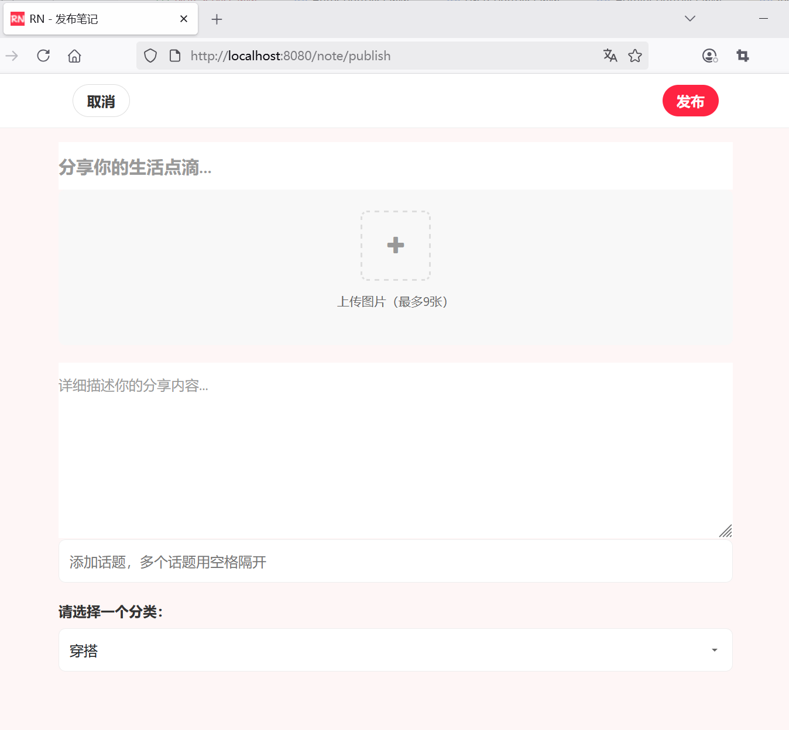


下图7-3展示的是校验提示信息:


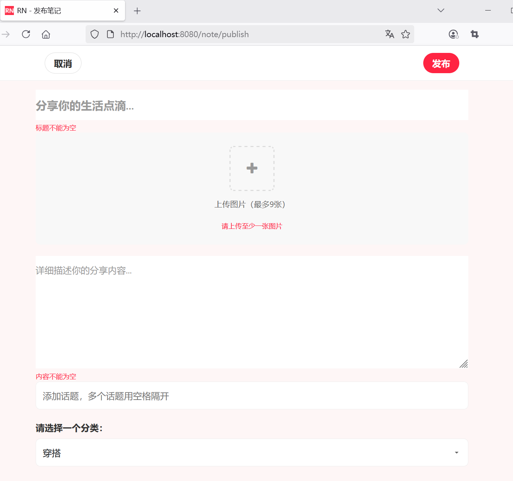


下图7-4展示填写笔记内容的效果展示:


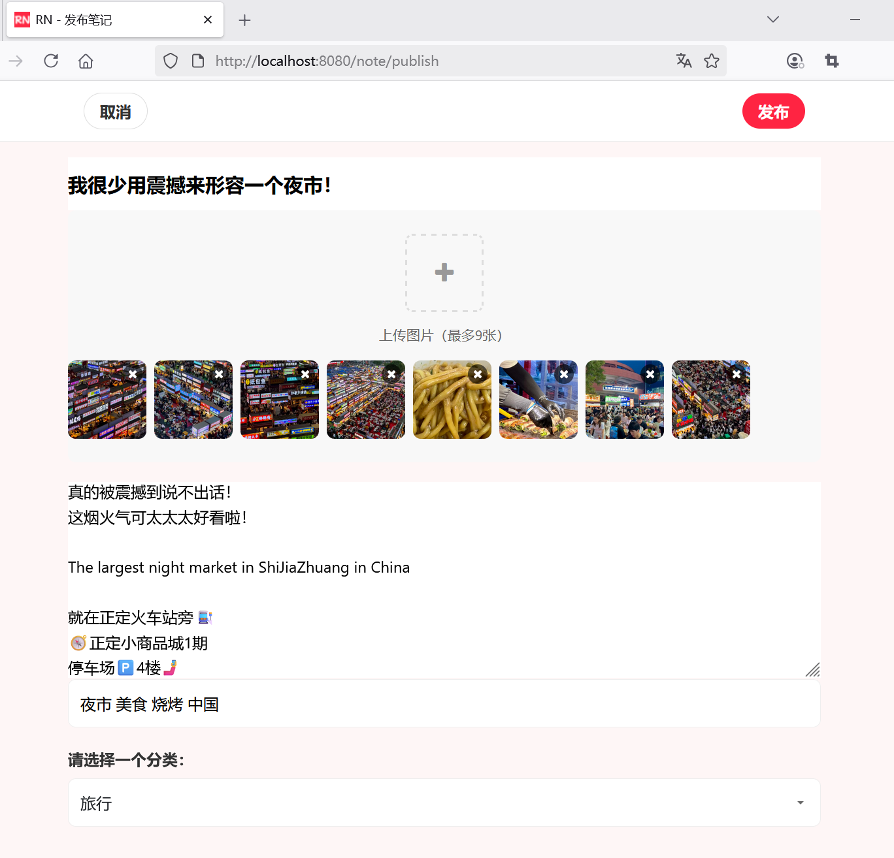


下图7-5展示的是笔记发布成功的效果展示:


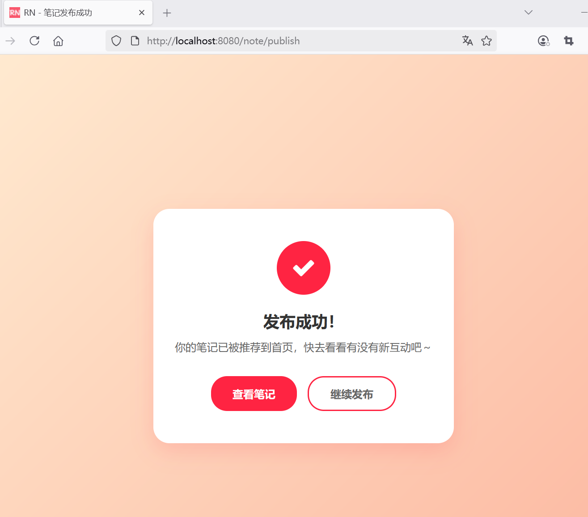


## 7.8 定义全局异常处理器，处理笔记发布过程中可能出现的异常

如果你的文件过多，体积过大，则可能遇到如下异常：

```
2025-06-09T16:03:39.448+08:00  WARN 36316 --- [rednote] [nio-8080-exec-7] .w.s.m.s.DefaultHandlerExceptionResolver : Resolved [org.springframework.web.multipart.MaxUploadSizeExceededException: Maximum upload size exceeded]
```

这个异常表示上传的文件大小超过了配置的限制。除了调整文件上传的最大大小限制配置`spring.servlet.multipart.max-file-size`和`spring.servlet.multipart.max-request-size`之外，还需要定义全局异常处理器，处理笔记发布过程中可能出现的异常。


 
### 配置全局异常处理


为了处理验证失败的情况，你可以配置一个全局异常处理器：

```java
package com.example.rednote.exception;

import org.slf4j.Logger;
import org.slf4j.LoggerFactory;
import org.springframework.ui.Model;
import org.springframework.web.bind.annotation.ControllerAdvice;
import org.springframework.web.bind.annotation.ExceptionHandler;
import org.springframework.web.multipart.MaxUploadSizeExceededException;


/**
 * GlobalExceptionHandler 全局异常处理
 *
 * @version 2025/08/18
 **/
@ControllerAdvice
public class GlobalExceptionHandler {
    private static final Logger log = LoggerFactory.getLogger(GlobalExceptionHandler.class);

    @ExceptionHandler(MaxUploadSizeExceededException.class)
    public String handleMaxSizeException(MaxUploadSizeExceededException exc, Model model) {
        log.error("服务器异常：{}", exc.getMessage(), exc);

        model.addAttribute("errorCode", 400);
        model.addAttribute("errorMessage", "服务器异常：" + exc.getMessage());

        return "400-error";
    }
}
```

在 Spring MVC 中，`@ControllerAdvice` 通常用于全局处理控制器层的异常或进行一些全局的数据预处理。
`@ExceptionHandler`用于捕获特定类型的异常，并返回相应的视图。

### 使用 Thymeleaf 实现错误页面

当采用 Thymeleaf 技术时，我们可以创建专门的错误页面模板，并通过 Spring MVC 的错误处理机制将异常信息传递给这些模板。以下是完整的实现方案：


在 `src/main/resources/templates` 目录下创建错误页面400-error.html（可以复用403-error.html代码）：

```html
<!DOCTYPE html>
<html lang="en" xmlns:th="http://www.thymeleaf.org">

<head>
    <meta charset="UTF-8">
    <meta name="viewport" content="width=device-width, initial-scale=1.0">
    <title>RN - 服务器异常</title>
    <!-- 引入 Bootstrap CSS -->
    <link href="https://cdn.bootcdn.net/ajax/libs/bootstrap/5.3.6/css/bootstrap.min.css"
          th:href="@{/css/bootstrap.min.css}" rel="stylesheet">

    <!-- 引入 Font Awesome -->
    <link href="https://cdn.bootcdn.net/ajax/libs/font-awesome/4.7.0/css/font-awesome.min.css"
          th:href="@{/css/font-awesome.min.css}" rel="stylesheet">

    <!-- 自定义样式-->
    <style>
        body {
            background-color: #fef6f6;
            font-family: -apple-system, BlinkMacSystemFont, "Segoe UI", Roboto, Helvetica, Arial, sans-serif;
        }

        .error-container {
            max-width: 400px;
            margin: 0 auto;
            padding: 40px 20px;
            text-align: center;
        }

        .error-icon {
            font-size: 80px;
            color: #ff2442;
            margin-bottom: 20px;
        }

        .error-title {
            font-size: 24px;
            font-weight: 700;
            color: #333;
            margin-bottom: 10px;
        }

        .error-message {
            font-size: 16px;
            color: #666;
            margin-bottom: 30px;
        }

        .btn-primary {
            background-color: #ff2442;
            border-color: #ff2442;
            border-radius: 12px;
            padding: 12px;
            font-size: 16px;
            font-weight: 600;
            transition: all 0.3s ease;
            width: 100%;
        }

        .btn-primary:hover,
        .btn-primary:focus {
            background-color: #e61e3a;
            border-color: #e61e3a;
            box-shadow: 0 4px 12px rgba(255, 36, 66, 0.2);
        }

        .back-home {
            margin-top: 20px;
            font-size: 14px;
            color: #999;
        }

        .back-home a {
            color: #ff2442;
            text-decoration: none;
        }

        .back-home a:hover {
            text-decoration: underline;
        }

        .error-image {
            width: 200px;
            height: 200px;
            margin: 0 auto 30px;
            background-color: #fff;
            border-radius: 50%;
            display: flex;
            align-items: center;
            justify-content: center;
            box-shadow: 0 4px 20px rgba(0, 0, 0, 0.05);
        }

        .error-image img {
            width: 120px;
            height: 120px;
        }
    </style>
</head>
<body class="d-flex align-items-center min-vh-100 py-4">
<div class="container">
    <div class="error-container">
        <!-- 错误图标 -->
        <div class="error-image">
            <i class="fa fa-lock fa-5x text-danger"></i>
        </div>

        <!-- 错误标题 -->
        <h2 class="error-code" th:text="${errorCode}">400</h2>
        <h2 class="error-title">服务器内部错误</h2>

        <!-- 错误信息 -->
        <p class="error-message" th:text="${errorMessage}">
            服务器遇到了问题，请稍后再试。
        </p>
        <div class="error-details">
            <p>
                如果问题持续存在，请联系管理员。
            </p>
        </div>

        <!-- 返回按钮 -->
        <button class="btn btn-primary" onclick="goBack()">返回上一页</button>

        <!-- 跳转到首页 -->
        <p class="back-home">
            <a href="/" th:href="@{/}">返回RN首页</a>
        </p>
    </div>
</div>

<!-- Bootstrap JS -->
<script src="https://cdn.bootcdn.net/ajax/libs/bootstrap/5.3.6/js/bootstrap.bundle.min.js"
        th:src="@{/js/bootstrap.bundle.min.js}"></script>

<script>
    // 返回按钮点击事件
    function goBack() {
        window.history.back();
    }
</script>
</body>
</html>
```


### 未跳转到指定的错误页面？

虽然配置了全局异常处理，但也可能未跳转到未跳转到指定的错误页面400-error.html，具体界面显示如下：


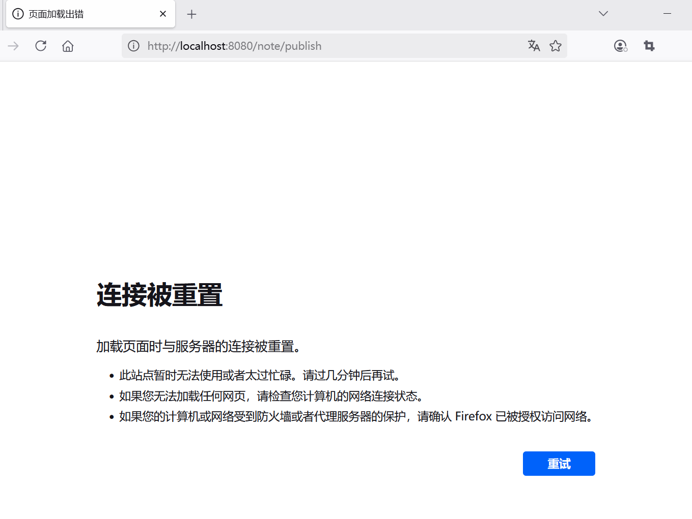


观察控制台日志，可以看到报错信息：


```
Caused by: org.apache.tomcat.util.http.fileupload.impl.SizeLimitExceededException: the request was rejected because its size (10692204) exceeds the configured maximum (10485760)
	at org.apache.tomcat.util.http.fileupload.impl.FileItemIteratorImpl.init(FileItemIteratorImpl.java:161) ~[tomcat-embed-core-10.1.41.jar:10.1.41]
	at org.apache.tomcat.util.http.fileupload.impl.FileItemIteratorImpl.getMultiPartStream(FileItemIteratorImpl.java:205) ~[tomcat-embed-core-10.1.41.jar:10.1.41]
	at org.apache.tomcat.util.http.fileupload.impl.FileItemIteratorImpl.findNextItem(FileItemIteratorImpl.java:224) ~[tomcat-embed-core-10.1.41.jar:10.1.41]
	at org.apache.tomcat.util.http.fileupload.impl.FileItemIteratorImpl.<init>(FileItemIteratorImpl.java:142) ~[tomcat-embed-core-10.1.41.jar:10.1.41]
	at org.apache.tomcat.util.http.fileupload.FileUploadBase.getItemIterator(FileUploadBase.java:252) ~[tomcat-embed-core-10.1.41.jar:10.1.41]
	at org.apache.tomcat.util.http.fileupload.FileUploadBase.parseRequest(FileUploadBase.java:276) ~[tomcat-embed-core-10.1.41.jar:10.1.41]
	at org.apache.catalina.connector.Request.parseParts(Request.java:2584) ~[tomcat-embed-core-10.1.41.jar:10.1.41]
	... 68 common frames omitted
```


当上传文件超 Tomcat 的大小限制后会先于 Controller 触发异常，所以这时我们的异常处理类无法捕获 Controller 层的异常。

增设如下应用配置即可：

```
# 配置内嵌的 tomcat 的最大吞吐量
server.tomcat.max-swallow-size = 100MB
```

注意上面最重要的是要配置内嵌的 tomcat 的最大吞吐量即 max-swallow-size，可以设置 -1 不限制，也可以设置一下比较大的数字这里微酷设置 100M。
这样当上传文件超大小限制后就可以被全局异常处理类捕获了，具体界面显示如下：


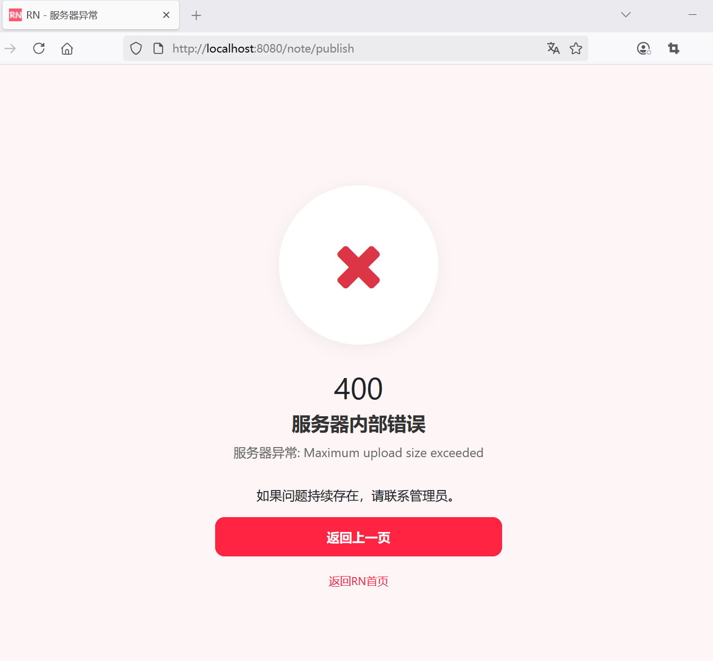


## 7.9 安全特性、异常处理、事务管理经验总结及扩展

1. 完整的表单处理：
   - 支持多文件上传
   - 自动关联当前用户
   - 表单数据验证

2. 图片管理：
   - 文件上传和存储服务
   - 自动生成唯一文件名
   - 图片路径管理和安全访问

3. 安全特性：
   - 用户认证和权限控制
   - 文件路径安全校验

4. 异常处理：
   - 统一的异常处理机制
   - 友好的错误信息返回

5. 事务管理：
   - 确保笔记和图片的原子性操作
   - 失败时自动回滚

这个实现提供了一个完整的笔记发布功能，从前端表单到后端处理都进行了详细实现。你可以根据需要进一步扩展功能，如添加图片压缩、水印、笔记审核等功能。


## 8.1 笔记列表展示功能概述

本章是基于 Spring Security 6.5、Thymeleaf 和 Bootstrap 实现的笔记列表展示界面。该方案包含完整的安全认证、笔记列表展示、分页功能和响应式设计。


 
这个笔记列表展示界面具有以下特点。

### 安全认证

* 使用 Spring Security 保护笔记页面
* 自动获取当前登录用户
* 支持用户注销功能

### 视觉设计

* 采用小红书风格的红色调
* 卡片式布局展示笔记
* 悬停效果和微动画提升交互体验


### 功能特性


* 分页显示笔记列表
* 支持笔记查看
* 空状态提示与快速创建按钮

### 响应式设计


* 在移动设备上自动调整布局
* 适配不同屏幕尺寸的显示效果

### 安全防护


* CSRF 保护
* 权限验证
* 数据访问控制


## 8.2 控制器来处理笔记列表查询请求及重定向

我们需要在原有的用户信息管理页面展示该用户发布的笔记列表。因此，需要修改用户控制器UserController以实现相关功能。


### 控制器处理用户笔记列表数据展示

新增方法如下，以获取用户笔记列表数据并在界面上展示。


```java
import org.springframework.web.bind.annotation.PathVariable

// ...为节约篇幅，此处省略非核心内容

@Controller
@RequestMapping("/user")
public class UserController {
      
    // ...为节约篇幅，此处省略非核心内容

    @Autowired
    private UserService userService;

    @Autowired
    private NoteService noteService;

    @GetMapping("/profile/{userId}")
    public String profileWithNotes(Model model,
                                   @PathVariable Long userId,
                                   @RequestParam(defaultValue = "1") int page,
                                   @RequestParam(defaultValue = "12") int size) {
        // 获取当前用户信息
        Optional<User> optionalUser = userService.findByUserId(userId);

        // 判断用户是否存在
        if (!optionalUser.isPresent()) {
            throw new UserNotFoundException("");
        }

        User user = optionalUser.get();
        model.addAttribute("user", user);

        // 获取用户笔记列表数据
        Page<Note> notePage = noteService.getNotesByUser(userId, page - 1, size);

        // 添加笔记列表数据到模型中
        model.addAttribute("notePage", notePage);
        model.addAttribute("currentPage", page);
        model.addAttribute("totalPages", notePage.getTotalPages());

        return "user-profile";
    }
}    
```


上述代码

* 通过`@PathVariable`传递参数，获取到所需要查询的用户的ID。
* page、size参数用于分页查询，分别指要查询的页面页码及该页码数据量。
* 当访问`/user/profile/{userId}`路径时，如果正常处理，会返回user-profile.html模板页面。
* 如果传入的userId不存在，则会抛出UserNotFoundException异常。


### UserNotFoundException异常


新增UserNotFoundException用于表示用户不存在异常：


```java
package com.example.rednote.exception;

/**
 * UserNotFoundException 用户不存在异常
 *
 * @version 2025/06/07
 **/
public class UserNotFoundException extends ValidationException {
    public UserNotFoundException(String message) {
        super("用户不存在异常. " + message);
    }

    public UserNotFoundException(String message, Throwable cause) {
        super("用户不存在异常. " + message, cause);
    }
}
```

### 用户信息管理页面重定向


原有的访问用户信息管理页面的路径是`/user/profile`，用来表示展示用户自己的信息。现在对改控制器做修改，以便重定向到`/user/profile/{userId}`路径：


```java
@GetMapping("/profile")
public String profile(Model model) {
    // 获取当前用户信息
    User user = userService.getCurrentUser();

    /*model.addAttribute("user", user);

    return "user-profile";*/

    // 重定向
    return "redirect:/user/profile/" + user.getUserId();
}
```

这样，`/user/profile/{userId}`接口就能处理包括自己在内的所有人的用户信息展示了。


## 8.3 实现笔记的分页查询、排序等功能

### 根据用户ID查询用户

修改UserRepository，增加接口如下：


```java
public interface UserRepository extends Repository<User, Long> {

    // ...为节约篇幅，此处省略非核心内容

    /**
     * 根据用户ID查询用户
     *
     * @param userId
     * @return
     */
    Optional<User> findByUserId(Long userId);
}
```

修改UserService，增加接口如下：


```java
public interface UserService {

    // ...为节约篇幅，此处省略非核心内容

    /**
     * 根据用户ID查询用户
     *
     * @param userId
     * @return
     */
    Optional<User> findByUserId(Long userId);
}
```

修改UserServiceImpl，实现如下接口：


```java
@Service
public class UserServiceImpl implements UserService {

    // ...为节约篇幅，此处省略非核心内容

    @Override
    public Optional<User> findByUserId(Long userId) {
        return userRepository.findByUserId(userId);
    }
}
```


### 根据作者的用户ID分页查询笔记

修改UserRepository，增加接口如下：


```java
import org.springframework.data.domain.Page;
import org.springframework.data.domain.Pageable;

// ...为节约篇幅，此处省略非核心内容

public interface NoteRepository extends Repository<Note, Long> {

    // ...为节约篇幅，此处省略非核心内容

    /**
     * 根据作者的用户ID分页查询笔记
     *
     * @param userId
     * @param pageable
     * @return
     */
    Page<Note> findByAuthorUserId(Long userId, Pageable pageable);
}
```


Note实体类中没有直接名为userId的属性，在Note实体中，用户关联是通过User对象（author字段）实现的，而非直接的userId字段，因此不能在NoteRepository中定义了findByUserId方法。但可以使用author.userId代替userId，因此接口名称为`findByAuthorUserId`。


修改NoteService，增加接口如下：


```java
public interface NoteService {

    // ...为节约篇幅，此处省略非核心内容

    /**
     * 根据作者的用户ID分页查询笔记
     *
     * @param userId
     * @param page
     * @param size
     * @return
     */
    Page<Note> getNotesByUser(Long userId, int page, int size);
}
```

修改UserServiceImpl，实现如下接口：


```java
@Service
public class NoteServiceImpl implements NoteService {

    // ...为节约篇幅，此处省略非核心内容

    @Override
    public Page<Note> getNotesByUser(Long userId, int page, int size) {
        // 分页查询的笔记列表结果按照创建时间降序排序
        Pageable pageable = PageRequest.of(page, size, Sort.by(Sort.Direction.DESC, "createAt"));
        return noteRepository.findByAuthorUserId(userId, pageable);
    }
}
```


* `Sort.by(Sort.Direction.DESC, "createAt")`是指定按照Note的createdAt字段排序。
* descending()是降序排序。
* 上述两个条件组合就是按照按照Note的createdAt字段降序排序。


### Spring Data JPA 中 Page 和 Pageable 的用法详解

在Spring Data JPA中，`Pageable` 和 `Page` 是Spring Data JPA中处理分页查询的核心组件，掌握它们的用法对于构建高效、可维护的后端服务至关重要。合理使用分页技术不仅能提升系统性能，还能显著改善用户体验。


#### 1. Pageable：分页查询请求
`Pageable` 是一个接口，用于封装分页查询的参数，包括：
- 页码（从0开始）
- 每页大小
- 排序规则

常用实现类：`PageRequest`

#### 2. Page：分页查询结果
`Page` 是一个接口，代表分页查询的结果，包含：
- 当前页数据列表
- 总页数
- 总记录数
- 当前页码
- 每页大小
- 是否有下一页/上一页


#### 3. 性能考虑

1. 避免大数据量下的性能问题：
   - 对于超大数据集，使用 `Slice` 代替 `Page`（不计算总页数）
   - 合理设置每页大小，避免一次查询过多数据

2. 排序字段优化：
   - 经常用于排序的字段应添加索引
   - 复合排序（多字段排序）需确保索引顺序与查询一致

3. 缓存分页结果：
   - 对于静态数据或变化不频繁的数据，考虑缓存分页结果


#### 4. 常见问题与解决方案

| 问题描述 | 解决方案 |
|---------|---------|
| 页码从0开始不习惯 | 在前端模板中+1显示（如示例中的 `th:text="${pageNum + 1}"`） |
| 大数据量查询慢 | 使用 `Slice` 接口，避免计算总记录数 |
| 排序字段无索引 | 为排序字段添加数据库索引 |
| 分页参数被篡改 | 在控制器中添加参数校验，限制每页最大数量 |


## 8.4 使用分页及网格组件设计笔记列表展示界面

修改user-profile.html，在原有的代码基础上，增加如下代码。


### 笔记列表区域

```html
<style>

    /* ...为节约篇幅，此处省略非核心内容 */
    

    /* 笔记列表 */
    .note-grid {
        display: grid;
        grid-template-columns: repeat(auto-fill, minmax(180px, 1fr));
        gap: 16px;
        padding: 16px;
    }

    .note-card {
        background-color: white;
        border-radius: 12px;
        overflow: hidden;
        box-shadow: 0 2px 4px rgba(0, 0, 0, 0.03);
        transition: transform 0.2s;
    }

    .note-card:hover {
        transform: translateY(-2px);
        box-shadow: 0 4px 8px rgba(0, 0, 0, 0.05);
    }

    .note-image {
        width: 100%;
        height: 180px;
        object-fit: cover;
    }

    .note-content {
        padding: 12px;
    }

    .note-title {
        font-size: 14px;
        font-weight: 500;
        line-height: 1.4;
        overflow: hidden;
        display: -webkit-box;
        -webkit-line-clamp: 2;
        -webkit-box-orient: vertical;
        color: #333;
        margin-bottom: 8px;
    }

    .note-meta {
        display: flex;
        justify-content: space-between;
        font-size: 12px;
        color: #999;
    }

    /* 空状态提示 */
    .empty-state {
        padding: 48px;
        text-align: center;
    }

    .empty-icon {
        font-size: 48px;
        color: #e0e0e0;
        margin-bottom: 16px;
    }

    .empty-text {
        color: #999;
        margin-bottom: 24px;
    }

    .create-note-btn {
        background-color: #ff2442;
        color: white;
        padding: 10px 24px;
        border-radius: 24px;
        font-weight: 500;
    }
</style>

<div class="container mt-5">
    <div class="row justify-content-center">
      
        <!-- 用户个人信息 -->

        <!-- ...为节约篇幅，此处省略非核心内容-->
 
        <!-- 笔记列表 -->
        <div class="col-md-8">
            <!-- 空状态提示 -->
            <div class="empty-state" th:if="${notePage.empty}">
                <div class="empty-icon">
                    <i class="fa fa-file-o"></i>
                </div>
                <div class="empty-text">
                    还没有发布任何笔记
                </div>
                <a href="/note/publish" th:href="@{/note/publish}" class="create-note-btn">
                    <i class="fa fa-plus"></i>
                    发布第一篇笔记
                </a>
            </div>

            <!-- 非空状态提示 -->
            <div class="note-grid" th:if="${!notePage.empty}">
                <!-- 循环遍历笔记列表生成笔记卡片 -->
                <div class="note-card" th:each="note : ${notePage.content}">
                    <a th:href="@{/note/{noteId}(noteId=${note.noteId})}">
                        
                    </a>
                    <div class="note-content">
                        <dive class="note-title">
                            [[${note.title}]]
                        </dive>
                    </div>
                </div>
            </div>
        </div>

        <!-- TODO 分页导航 -->
    </div>
</div>
```


上述页面考虑了两种场景。如果该用户发布过笔记，则界面效果如下图8-1所示。


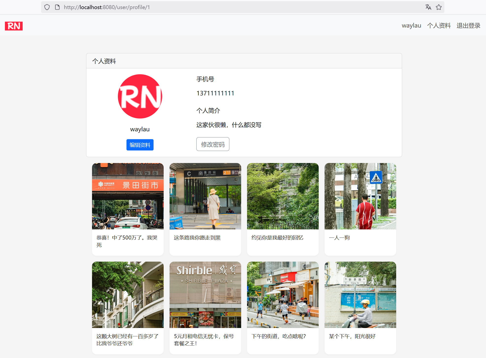


点击上述笔记封面，可以跳转到该笔记的详情页面（后续实现）。


如果该用户没有发布过笔记，则界面效果如下图8-2所示。


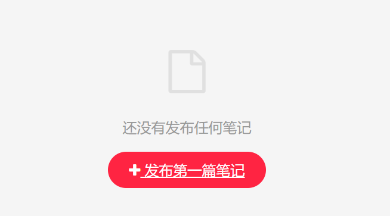


点击上述“发布第一篇笔记”按钮，可以跳转到笔记的发布页面。


### 分页组件

```html
<style>
/* ...为节约篇幅，此处省略非核心内容*/

/* 分页组件 */
.pagination {
    padding: 24px;
    display: flex;
    justify-content: center;
    gap: 8px;
    font-size: 14px;
}

.page-btn {
    padding: 6px 12px;
    border-radius: 4px;
    color: #666;
    text-decoration: none;
}

.page-btn.active {
    background-color: #ff2442;
    color: white;
    font-weight: 500;
}
</style>

<!-- 分页导航 -->
<div class="col-md-8">
    <div class="pagination" th:if="${totalPages > 0}">
        <a class="page-btn" th:if="${currentPage > 1}"
            th:href="@{/user/profile/{userId}(userId=${user.userId},page=${currentPage - 1})}">«</a>

        <a class="page-btn" th:each="pageNum : ${#numbers.sequence(1, totalPages)}"
            th:href="@{/user/profile/{userId}(userId=${user.userId},page=${pageNum})}"
            th:classappend="${pageNum == currentPage} ? ' active'">[[${pageNum}]]</a>

        <a class="page-btn" th:if="${currentPage < totalPages}"
            th:href="@{/user/profile/{userId}(userId=${user.userId},page=${currentPage + 1})}">»</a>

    </div>
</div>
```


界面效果如下图8-3所示。


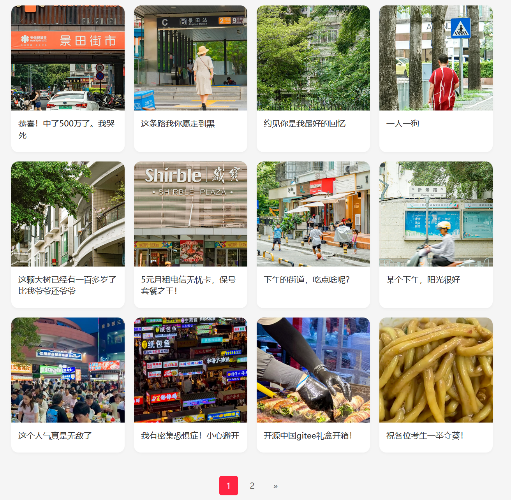


## 8.5 区用户信息展示分自己视角和访客视角的技巧

因为用户信息展示区包括了对用户个人信息的操作（编辑资料和修改密码），因此，需要调整原有的用户信息展示界面，以区分自己视角和访客视角。

* 自己视角：可以看到“编辑资料”按钮和“修改密码”按钮。
* 访客视角：看不到“编辑资料”按钮和“修改密码”按钮。


### 用户个人信息


用户个人信息代码调整如下：

```html
<!-- 用户个人信息 -->
<div class="col-md-8">
    <!--<div class="card">-->
        <!--<div class="card-header">
            个人资料
        </div>-->
        <!--<div class="card-body">-->
            <div class="row">
                <div class="col-md-4 text-center">
                    
                    <p class="mt-3">[[${user.username}]]</p>

                    <!-- 仅作者自己可见 -->
                    <div th:if="${#authentication.name == user.username}">
                        <a href="/user/edit" th:href="@{/user/edit}" class="btn btn-primary btn-sm">编辑资料</a>
                    </div>

                </div>

                <div class="col-md-8">
                    <dive class="mb-3">
                        <!--<label class="form-label">手机号</label>
                        <p class="form-control-plaintext">[[${user.phone}]]</p>-->
                        <label class="form-label">RN号：[[${user.userId}]]</label>
                    </dive>
                    <dive class="mb-3">
                        <!--<label class="form-label">个人简介</label>-->
                        <p class="form-control-plaintext">[[${user.bio ?: '这家伙很懒，什么都没写'}]]</p>
                    </dive>

                    <!-- 仅作者自己可见 -->
                    <div th:if="${#authentication.name == user.username}">
                        <a href="/user/change-password" th:href="@{/user/change-password}"
                            class="btn btn-outline-secondary">修改密码</a>
                    </div>
                </div>
            </div>
        <!--</div>
    </div>-->
</div>
```

上述代码：


* 删除了一些多余的组件，比如标题“个人资料”以及Card组件，让整个页面看起来更加符合有互联网应用的风格。
* 为了保护个人隐私，去除了手机号的展示，改为展示RN号（也就是用户ID）。
* 设置认证校验，仅用户自己可以看到自己主页的“编辑资料”按钮和“修改密码”按钮。


如果是自己的视角，界面效果如下图8-4所示。


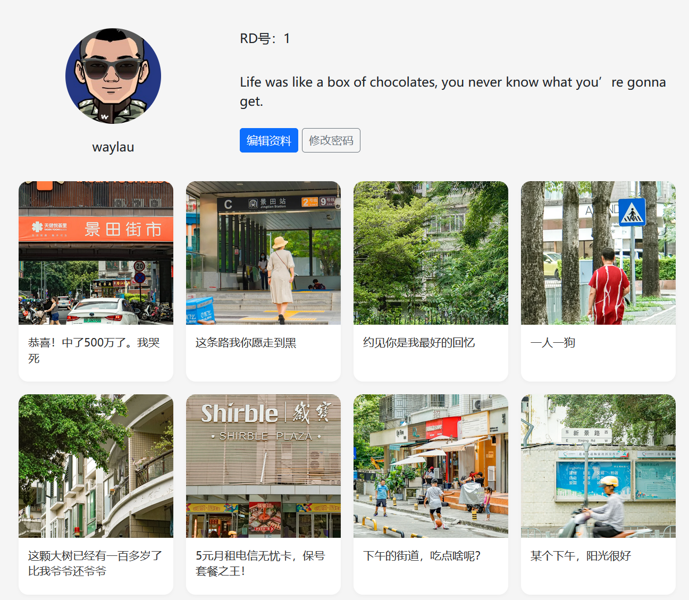


如果是访客的视角，界面效果如下图8-5所示。


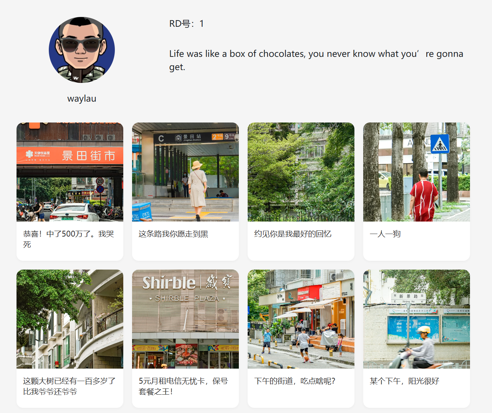


## 8.6 笔记列表展示区分自己视角和访客视角的技巧

因为笔记列表包括了对笔记发布的操作，因此，需要调整原有的笔记列表展示界面，以区分自己视角和访客视角。

* 自己视角：可以看到“发布第一篇笔记按钮。
* 访客视角：看不到“发布第一篇笔记”按钮。


### 修改笔记列表展示区域中对于空状态的处理


笔记列表展示区域中对于空状态代码调整如下：

```html
<!-- 空状态提示 -->
<div th:if="${notePage.empty}" class="empty-state">
    <div class="empty-icon"><i class="fa fa-file-o"></i></div>
    <div class="empty-text">还没有发布任何笔记</div>
    <a th:if="${#authentication.name == user.username}" th:href="@{/note/publish}" class="create-note-btn">
        <i class="fa fa-plus"></i> 发布第一篇笔记
    </a>
</div>
```


如果是自己的视角，界面效果如下图8-6所示。


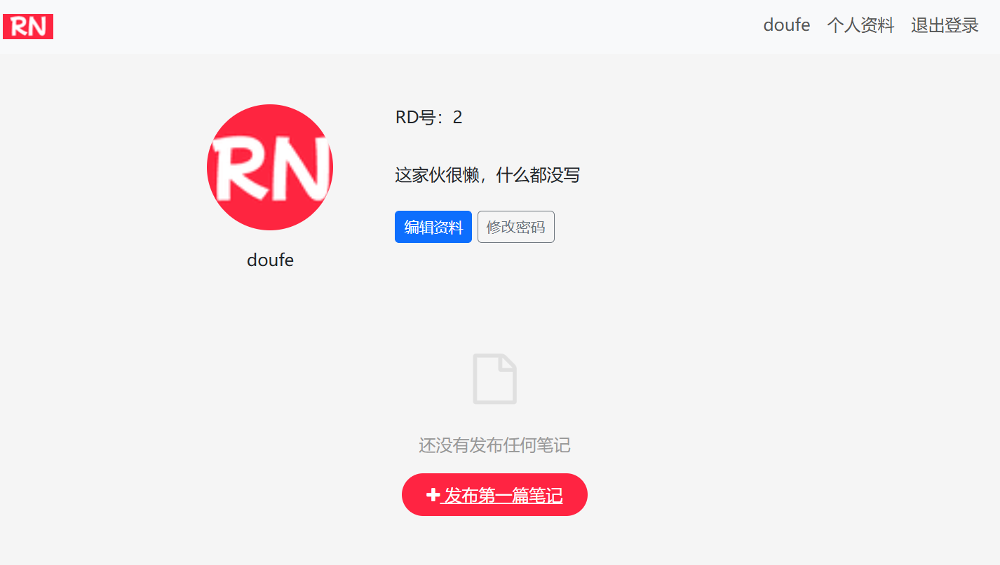


如果是访客的视角，界面效果如下图8-7所示。


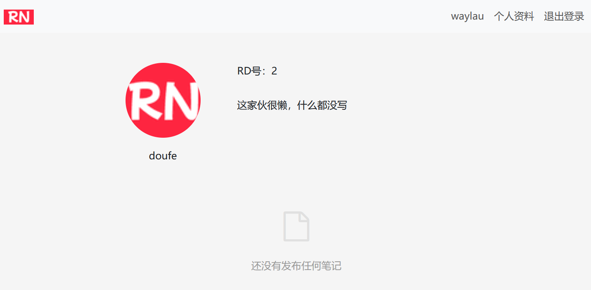


## 8.7 扩展统一异常处理UserNotFoundException

扩展统一异常处理，修改GlobalExceptionHandler，增加了对UserNotFoundException异常的处理：


```java
@ControllerAdvice
public class GlobalExceptionHandler {
    private static final Logger logger = LoggerFactory.getLogger(GlobalExceptionHandler.class);

    // ...为节约篇幅，此处省略非核心内容

    // 用户不存在异常
    @ExceptionHandler(UserNotFoundException.class)
    public String handleUserNotFoundException(UserNotFoundException ex, Model model) {
        logger.error("用户不存在异常: {}", ex.getMessage(), ex);
        model.addAttribute("errorCode", 404);
        model.addAttribute("errorMessage", "异常信息: " + ex.getMessage());
        return "400-error";
    }

}
```


当我们试图访问一个不存在的用户时，比如：<http://localhost:8080/user/profile/100000>。用户ID为100000的用户不存在，则会跳转到如下界面：


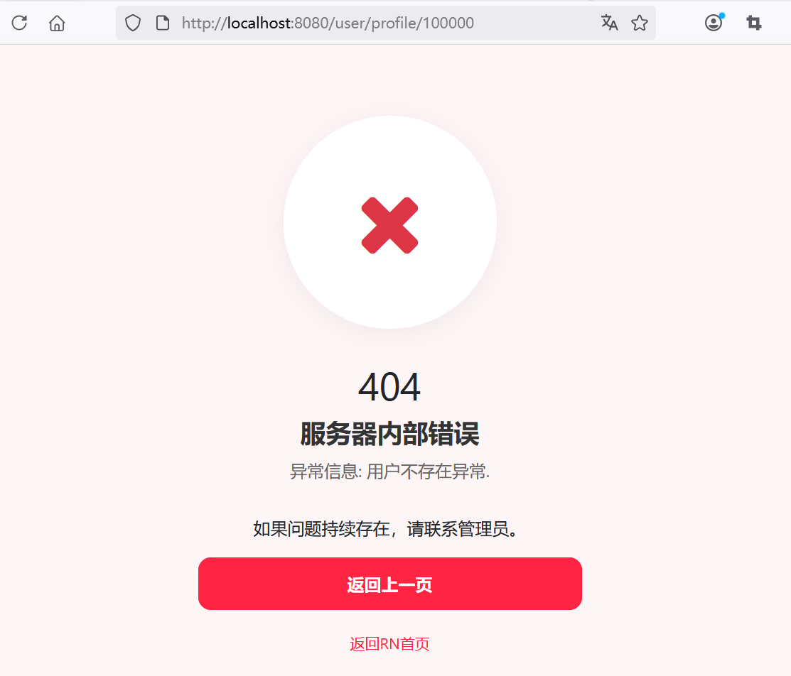


## 8.8 性能优化及扩展建议

### 性能考虑

1. 避免大数据量下的性能问题：
   - 对于超大数据集，使用 `Slice` 代替 `Page`（不计算总页数）
   - 合理设置每页大小，避免一次查询过多数据

2. 排序字段优化：
   - 经常用于排序的字段应添加索引
   - 复合排序（多字段排序）需确保索引顺序与查询一致

3. 缓存分页结果：
   - 对于静态数据或变化不频繁的数据，考虑缓存分页结果

### 常见问题与解决方案

| 问题描述 | 解决方案 |
|---------|---------|
| 页码从0开始不习惯 | 在前端模板中+1显示（如示例中的 `th:text="${pageNum + 1}"`） |
| 大数据量查询慢 | 使用 `Slice` 接口，避免计算总记录数 |
| 排序字段无索引 | 为排序字段添加数据库索引 |
| 分页参数被篡改 | 在控制器中添加参数校验，限制每页最大数量 |


### 扩展建议

* 添加笔记分类筛选功能
* 实现笔记搜索功能
* 添加笔记状态（草稿 / 已发布）管理
* 增加批量操作功能
* 添加笔记排序选项


## 9.1 笔记详情功能概述

### 核心功能与设计特点

1. 视觉风格：
   - 采用小红书标志性的红色作为主色调
   - 卡片式设计与圆角元素，营造现代感
   - 分层设计，通过阴影和间距创造视觉层次感

2. 内容展示：
   - 顶部大图展示笔记主图，支持多图浏览指示器
   - 清晰的标题、正文和标签布局
   - 作者信息区域包含头像、用户名和关注按钮

3. 互动功能：
   - 点赞、评论、收藏和分享按钮
   - 实时交互反馈
   - 评论区支持输入和展示

4. 响应式设计：
   - 适配不同屏幕尺寸
   - 提升移动端操作便捷性

5. 动态交互：
   - 关注按钮状态切换
   - 互动按钮的点击效果
   - 评论区的回复功能


## 9.2 使用Bootstrap、Font Awesome以及Thymeleaf轻松实现笔记详情界面

### 界面设计与实现


新建note-detail.html：

```html
<!DOCTYPE html>
<html lang="en" xmlns:th="http://www.thymeleaf.org"
      xmlns:sec="http://www.thymeleaf.org/extras/spring-security">
<head>
    <meta charset="UTF-8">
    <meta name="viewport" content="width=device-width, initial-scale=1.0">
    <title>RN - 笔记详情</title>
    <!-- 引入 Bootstrap CSS -->
    <link href="https://cdn.bootcdn.net/ajax/libs/bootstrap/5.3.6/css/bootstrap.min.css"
          th:href="@{/css/bootstrap.min.css}" rel="stylesheet">

    <!-- 引入 Font Awesome -->
    <link href="https://cdn.bootcdn.net/ajax/libs/font-awesome/4.7.0/css/font-awesome.min.css"
          th:href="@{/css/font-awesome.min.css}" rel="stylesheet">

    <!-- 自定义样式 -->
    <style>
        /* 全局样式 */
        body {
            font-family: -apple-system, BlinkMacSystemFont, "Segoe UI", Roboto, "Helvetica Neue", Arial, sans-serif;
            background-color: #f5f5f5;
        }

        /* 笔记内容区 */
        .note-container {
            background-color: white;
            margin-bottom: 20px;
            border-radius: 12px;
            overflow: hidden;
            box-shadow: 0 2px 4px rgba(0, 0, 0, 0.05);
        }

        .note-images {
            position: relative;
            background-color: #000;
        }

        .note-image {
            width: 100%;
            max-height: 60vh;
            object-fit: contain;
        }

        .note-content {
            padding: 20px;
        }

        .note-title {
            font-size: 20px;
            font-weight: 600;
            margin-bottom: 16px;
        }

        .note-text {
            font-size: 16px;
            line-height: 1.6;
            margin-bottom: 20px;
        }

        .note-tags {
            margin-bottom: 20px;
        }

        .tag {
            display: inline-block;
            background-color: #f0f0f0;
            color: #666;
            padding: 4px 12px;
            border-radius: 16px;
            font-size: 14px;
            margin-right: 8px;
            margin-bottom: 8px;
        }

        .note-action-bar {
            margin-bottom: 20px;
        }

        /* 作者信息 */
        .author-info {
            display: flex;
            align-items: center;
            margin-bottom: 20px;
        }

        .author-avatar {
            width: 48px;
            height: 48px;
            border-radius: 50%;
            margin-right: 12px;
        }

        .author-name {
            font-size: 16px;
            font-weight: 600;
        }

        .author-follow {
            margin-left: auto;
            background-color: #ff2442;
            color: white;
            padding: 6px 16px;
            border-radius: 20px;
            font-size: 14px;
            cursor: pointer;
        }

        .author-follow.following {
            background-color: #f0f0f0;
            color: #666;
        }

         /* 评论区（第一部分）*/
        .comments-section {
            background-color: white;
            border-radius: 12px;
            overflow: hidden;
            box-shadow: 0 2px 4px rgba(0, 0, 0, 0.05);
            padding: 20px;
        }

        .comments-header {
            display: flex;
            justify-content: space-between;
            align-items: center;
            margin-bottom: 20px;
        }

        .comments-title {
            font-size: 18px;
            font-weight: 600;
        }

        .comment-avatar {
            width: 36px;
            height: 36px;
            border-radius: 50%;
            margin-right: 12px;
        }

        .comment-input {
            display: flex;
            margin-bottom: 20px;
        }

        .comment-textarea {
            flex-grow: 1;
            border: 1px solid #e0e0e0;
            border-radius: 20px;
            padding: 8px 16px;
            font-size: 14px;
            resize: none;
            outline: none;
        }

        .comment-btn {
            margin-left: 12px;
            background-color: #ff2442;
            color: white;
            padding: 8px 16px;
            border-radius: 20px;
            font-size: 14px;
            cursor: pointer;
            display: flex;
            justify-content: center;
            align-items: center;
        }

        .comment-item {
            padding: 10px 0;
            border-bottom: 1px solid #f5f5f5;
        }

        .comment-header {
            display: flex;
            align-items: center;
            margin-bottom: 5px;
        }

    </style>
</head>
<body>
<!-- 主内容区 -->
<main class="container py-4 main-content">
    <!-- 笔记内容 -->
    <div class="note-container">
        <!-- 笔记图片 -->
        <div class="note-images">
            
        </div>

        <!-- 笔记内容区 -->
        <div class="note-content">
            <!-- 标题 -->
            <h1 class="note-title" th:text="${note.title}">分享我超爱的夏日穿搭，清爽又时尚</h1>

            <!-- 内容 -->
            <p class="note-text" th:text="${note.content}">
                夏天到了，又到了可以尽情展现个性穿搭的季节啦！<br><br>
            </p>

            <!-- 话题 -->
            <div class="note-tags">
                <span class="tag" th:each="topic : ${note.topics}" th:text="${topic}">
                </span>
            </div>

            <!-- 操作栏 -->
            <div class="note-action-bar">
                <!-- 返回 -->
                <button class="btn btn-light btn-sm" onclick="history.back()">
                    <i class="fa fa-arrow-left"></i>
                </button>
                <!-- 编辑 -->
                <button class="btn btn-light btn-sm" th:if="${#authentication.name == note.author.username}">
                    <i class="fa fa-edit"></i>
                </button>
                <!-- 删除 -->
                <button class="btn btn-light btn-sm" th:if="${#authentication.name == note.author.username}">
                    <i class="fa fa-trash"></i>
                </button>
                <!-- 分享 -->
                <button class="btn btn-light btn-sm">
                    <i class="fa fa-share-alt"></i>
                </button>
                <!-- 点赞 -->
                <button class="btn btn-light btn-sm">
                    <i class="fa fa-heart-o"></i>
                </button>
                <!-- 收藏 -->
                <button class="btn btn-light btn-sm">
                    <i class="fa fa-star-o"></i>
                </button>
            </div>

            <!-- 作者信息 -->
            <div class="author-info">
                
                <div>
                    <div class="author-name" th:text="${note.author.username}">
                        user
                    </div>
                    <div class="author-meta">
                        已获得 1024 粉丝
                    </div>
                </div>
                <div class="author-follow" th:if="${#authentication.name != note.author.username}">
                    + 关注
                </div>
            </div>
        </div>

        <!-- 评论区 -->
        <div class="comments-section">
            <div class="comments-header">
                <div class="comments-title">
                    评论区
                </div>
            </div>

            <!-- 评论输入框 -->
            <div class="comment-input">
                
                <textarea class="comment-textarea" placeholder="分享你的想法..."></textarea>
                <div class="comment-btn">
                    发送
                </div>
            </div>
        </div>
    </div>
</main>

<!-- Bootstrap JS -->
<script src="https://cdn.bootcdn.net/ajax/libs/bootstrap/5.3.6/js/bootstrap.bundle.min.js"
        th:src="@{/js/bootstrap.bundle.min.js}"></script>

</body>
</html>
```


## 9.3 控制器来处理笔记详情查询请求

在原有的NoteController基础上，增加方法以实现相关功能。


### 控制器处理用户笔记详情展示

新增方法如下。


```java
import com.example.rednote.exception.NoteNotFoundException;
import java.util.Optional;

// ...为节约篇幅，此处省略非核心内容


@Controller
@RequestMapping("/note")
public class NoteController {
    @Autowired
    private NoteService noteService;

    // ...为节约篇幅，此处省略非核心内容

    /**
     * 显示笔记详情页面
     */
    @GetMapping("/{noteId}")
    public String showNoteDetail(@PathVariable Long noteId, Model model) {
        // 查询指定noteId的笔记
        Optional<Note>  optionalNote = noteService.findNoteById(noteId);

        // 判定笔记是否存在，不存在则抛出异常
        if (!optionalNote.isPresent()) {
            throw new NoteNotFoundException("");
        }

        Note note = optionalNote.get();
        model.addAttribute("note", note);

        return "note-detail";
    }
}    
```


上述代码

* 通过`@PathVariable`传递参数，获取到所需要查询的笔记的ID。
* 当访问`/note/{noteId}`路径时，如果正常处理，会返回note-detail.html模板页面。
* 如果传入的noteId不存在，则会抛出NoteNotFoundException异常。


### NoteNotFoundException异常


新增NoteNotFoundException用于表示用户不存在异常：


```java
package com.example.rednote.exception;

/**
 * NoteNotFoundException 笔记不存在异常
 *
 * @version 2025/06/11
 **/
public class NoteNotFoundException extends ValidationException {
    public NoteNotFoundException(String message) {
        super("笔记不存在异常. " + message);
    }

    public NoteNotFoundException(String message, Throwable cause) {
        super("笔记不存在异常. " + message, cause);
    }
}
```


## 9.4 高效实现查询笔记详情的方法

### 修改NoteRepository

修改NoteRepository，增加接口如下：


```java
public interface NoteRepository extends Repository<Note, Long> {

    // ...为节约篇幅，此处省略非核心内容

    /**
     * 根据笔记ID查询笔记
     *
     * @param noteId
     * @return
     */
    Optional<Note> findByNoteId(Long noteId);
}
```


### 修改服务接口

修改NoteService，增加接口如下：


```java
public interface NoteService {

    // ...为节约篇幅，此处省略非核心内容

    /**
     * 根据笔记ID查询笔记
     *
     * @param noteId
     * @return
     */
    Optional<Note> findByNoteId(Long noteId);
}
```

修改NoteServiceImpl，实现如下接口：


```java
@Service
public class NoteServiceImpl implements NoteService {

    // ...为节约篇幅，此处省略非核心内容

    @Override
    public Optional<Note> findByNoteId(Long noteId) {
        return noteRepository.findByNoteId(noteId);
    }
}
```


## 9.5 不同视角下的笔记详情界面展示效果

通过`th:if`实现不同视角下的笔记详情界面显示效果。


如果是访客的视角，界面效果如下图9-1所示。


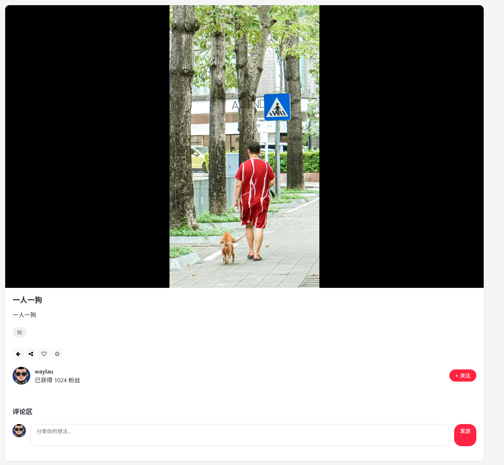

在该视角下，访客可以对他人笔记进行点赞、评论、收藏和分享，对笔记作者进行关注。


如果是自己的视角，界面效果如下图9-2所示。


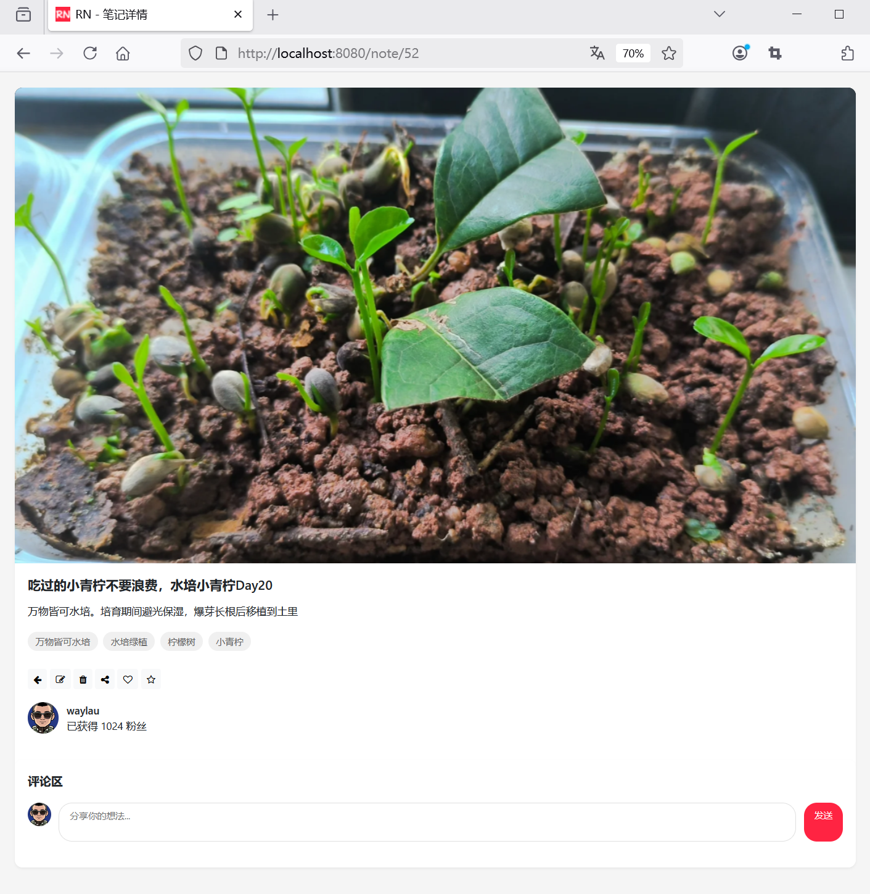


在该视角下，笔记作者可以对该笔记进行编辑、删除、点赞、评论、收藏和分享。


## 9.6 扩展统一异常处理NoteNotFoundException

扩展统一异常处理，增加了对NoteNotFoundException异常的处理：


```java
@ControllerAdvice
public class GlobalExceptionHandler {
    private static final Logger logger = LoggerFactory.getLogger(GlobalExceptionHandler.class);

    // ...为节约篇幅，此处省略非核心内容

    // 笔记不存在异常
    @ExceptionHandler(NoteNotFoundException.class)
    public String handleNoteNotFoundException(NoteNotFoundException ex, Model model) {
        logger.error("笔记不存在异常: {}", ex.getMessage(), ex);
        model.addAttribute("errorCode", 404);
        model.addAttribute("errorMessage", "异常信息: " + ex.getMessage());
        return "400-error";
    }

}
```


当我们试图访问一个不存在的笔记时，比如：<http://localhost:8080/note/12345>。笔记ID为12345的笔记不存在，则会跳转到如下界面：


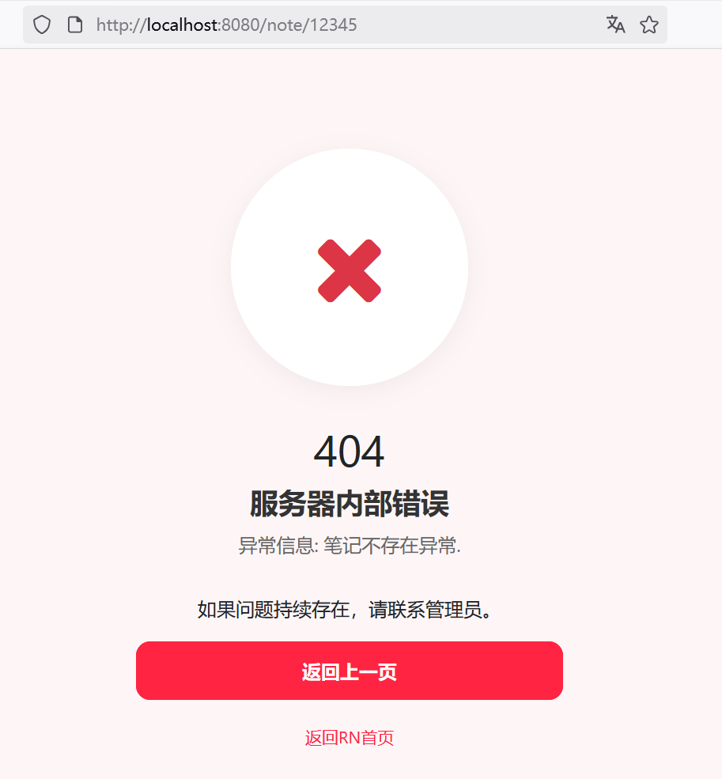


## 9.7 完善笔记发布后的查看笔记功能

### 修改NoteController返回笔记对象模型

```java
@PostMapping("/publish")
public String publishNote(@Valid @ModelAttribute("note") NotePublishDto notePublishDto,
                          BindingResult bindingResult,
                          Model model) {
    // 验证表单
    if (bindingResult.hasErrors()) {
        model.addAttribute("note", notePublishDto);
        return "note-publish";
    } else {
        // 获取当前用户
        User currentUser = userService.getCurrentUser();

        // 创建笔记
        // noteService.createNote(notePublishDto, currentUser);
        Note note = noteService.createNote(notePublishDto, currentUser);
        model.addAttribute("note", note);
        
        // 返回成功响应
        return "note-publish-success";
    }
}
```


### 修改note-publish-success查看笔记按钮点击事件

```html
<div class="btn-group">
  <!--<button class="btn-view" onclick="goToNote()">查看笔记</button>-->
  <button class="btn-view" th:onclick="goToNote([[${note.noteId}]])">查看笔记</button>
  <button class="btn-continue" onclick="continuePublish()">继续发布</button>
</div>


<script>
  // 查看笔记（模拟跳转）
  function goToNote(noteId) {
      // 真实笔记ID
      // window.location.href = "/note/12345";
      window.location.href = "/note/" + noteId;
  }
</script>
```


## 9.8 掌握为多图笔记添加图片轮播功能的能力

小红书笔记详情页的图片轮播和放大预览功能，这两个功能对于提升用户体验和内容展示效果非常重要。

接下来将扩展之前的笔记详情页代码，添加以下功能：
1. 图片轮播（支持多图切换）
2. 图片放大预览（全屏查看高清图片）


本节先介绍图片轮播功能的实现过程。


### 图片轮播容器


修改 note-detail.html 部分，添加轮播容器：

```html
<head>
    <!-- 原有头部内容 -->
    <style>
        /* 新增轮播和预览样式 */
        .carousel-container {
            display: flex;
            transition: transform 0.5s ease;
        }
        
        .carousel-item-img {
            min-width: 100%;
            position: relative;
        }
        
        .carousel-indicator {
            position: absolute;
            bottom: 15px;
            right: 15px;
            background-color: rgba(0, 0, 0, 0.5);
            color: white;
            padding: 4px 10px;
            border-radius: 15px;
            font-size: 12px;
            z-index: 10;
        }
        
        .carousel-control {
            position: absolute;
            top: 50%;
            transform: translateY(-50%);
            color: white;
            font-size: 24px;
            padding: 10px;
            cursor: pointer;
            z-index: 10;
            opacity: 0.7;
            transition: opacity 0.3s;
        }
        
        .carousel-control:hover {
            opacity: 1;
        }
        
        .carousel-control.prev {
            left: 10px;
        }
        
        .carousel-control.next {
            right: 10px;
        }
        
    </style>
</head>
<body>
    <!-- 主内容区 -->
    <main class="container py-4 main-content">
        <!-- 笔记内容 -->
        <div class="note-container">

            <!-- 笔记内容 -->
            <div class="note-images">
                <!---->
                <!-- 图片轮播容器 -->
                <div class="carousel-container" id="carouselContainer">
                    <!-- 动态生成轮播项 -->
                    <div class="carousel-item-img" th:each="image, stat : ${note.images}"
                        th:attr="data-index=${stat.index}">
                        
                    </div>
                </div>

                <!-- 轮播指示器 -->
                <div class="carousel-indicator" id="carouselIndicator">
                    <span id="currentSlide">1</span> / <span id="totalSlides">[[${note.images.size()}]]</span>
                </div>

                <!-- 轮播控制按钮 -->
                <div class="carousel-control prev" onclick="prevSlide()">
                    <i class="fa fa-angle-left"></i>
                </div>
                <div class="carousel-control next" onclick="nextSlide()">
                    <i class="fa fa-angle-right"></i>
                </div>
            </div>
            
            <!-- 原有笔记内容 -->
            
        </div>
        
        <!-- 原有评论区 -->
    </main>
 
</body>
</html>
```


### 轮播脚本

```html
<script>
    // 轮播功能实现
    let currentSlideNum = 1;
    const carouselContainer = document.getElementById('carouselContainer');
    const carouselItems = document.querySelectorAll('.carousel-item-img');
    const currentSlide = document.getElementById('currentSlide');

    // 更新轮播位置
    function updateCarouselPosition() {
        carouselContainer.style.transform = `translateX(-${(currentSlideNum - 1) * 100}%)`;
        currentSlide.textContent = currentSlideNum;
    }

    // 切换到上一张图片
    function prevSlide() {
        if (currentSlideNum > 1) {
            currentSlideNum--;
            updateCarouselPosition();
        }
    }

    // 切换到下一张图片
    function nextSlide() {
        if (currentSlideNum < carouselItems.length) {
            currentSlideNum++;
            updateCarouselPosition();
        }
    }
</script>
```


### 运行调测

下图9-4、9-5展示的是轮播切换图片的效果。

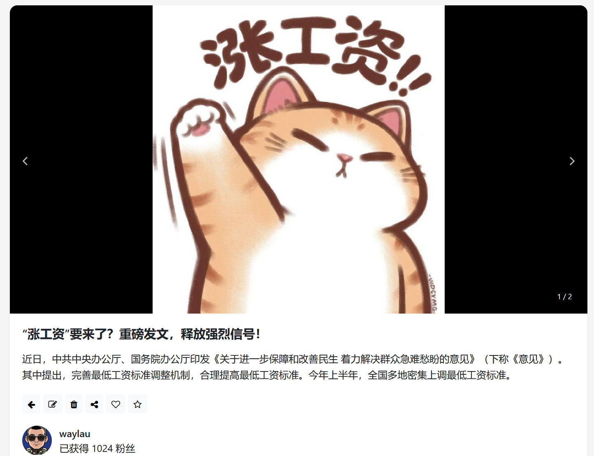


## 9.9 笔记详情页图放大预览功能实现

### 图片放大预览功能


修改HTML部分，添加图片预览模态框：

```html
<head>
    <!-- 原有头部内容 -->
    <style>
        /* 原有轮播和预览样式 */
 
        
        /* 图片预览模态框 */
        .preview-modal {
            display: none;
            position: fixed;
            top: 0;
            left: 0;
            width: 100%;
            height: 100%;
            background-color: rgba(0, 0, 0, 0.9);
            z-index: 1000;
            justify-content: center;
            align-items: center;
        }
        
        .preview-content {
            max-width: 90%;
            max-height: 90%;
            position: relative;
        }
        
        .preview-image {
            max-width: 100%;
            max-height: 85vh;
            object-fit: contain;
            cursor: pointer;
        }
        
        .preview-close {
            position: absolute;
            top: -40px;
            right: 0;
            color: white;
            font-size: 30px;
            cursor: pointer;
        }
        
        .preview-counter {
            position: absolute;
            bottom: -30px;
            left: 50%;
            transform: translateX(-50%);
            color: white;
            font-size: 14px;
        }
        
        .preview-control {
            position: absolute;
            top: 50%;
            transform: translateY(-50%);
            color: white;
            font-size: 30px;
            cursor: pointer;
            padding: 20px;
        }
        
        .preview-control.prev {
            left: -60px;
        }
        
        .preview-control.next {
            right: -60px;
        }
    </style>
</head>
<body>
    <!-- 主内容区 -->
    <main class="container py-4 main-content">
          <!-- 原有主内容区 -->
 
          <!-- img 上加 preview-trigger--> 
          
    </main>
    
    <!-- 图片预览模态框 -->
    <div class="preview-modal" id="previewModal">
        <div class="preview-content">
            
            <div class="preview-close" onclick="closePreview()">
                <i class="fa fa-times"></i>
            </div>
            <div class="preview-counter" id="previewCounter">
                <span id="previewCurrent">1</span> / <span id="previewTotal">[[${note.images.size()}]]</span>
            </div>
            <div class="preview-control prev" onclick="previewPrev()">
                <i class="fa fa-angle-left"></i>
            </div>
            <div class="preview-control next" onclick="previewNext()">
                <i class="fa fa-angle-right"></i>
            </div>
        </div>
    </div>
    
    <script>
        // ...为节约篇幅，此处省略非核心内容

        // 预览图片功能实现
        const previewImage = document.getElementById('previewImage');
        const previewModal = document.getElementById('previewModal');
        const previewCurrent = document.getElementById('previewCurrent');
        const previewClose = document.querySelector('.preview-close');

        // 打开预览
        function openPreview(index) {
            console.log("openPreview " + index);

            currentSlideNum = index + 1;
            previewImage.src = carouselItems[index].querySelector('img').src;
            previewCurrent.textContent = currentSlideNum;
            previewModal.style.display = 'flex';

            // 防止背景滚动
            document.body.style.overflow = 'hidden';
        }

        // 关闭预览
        function closePreview() {
            previewModal.style.display = 'none';

            // 恢复背景滚动
            document.body.style.overflow = '';

            // 更新轮播位置
            updateCarouselPosition();
        }

        // 预览上一张
        function previewPrev() {
            currentSlideNum = Math.max(1, currentSlideNum - 1);
            previewImage.src = carouselItems[currentSlideNum - 1].querySelector('img').src;
            previewCurrent.textContent = currentSlideNum;
        }

        // 预览下一张
        function previewNext() {
            currentSlideNum = Math.min(carouselItems.length, currentSlideNum + 1);
            previewImage.src = carouselItems[currentSlideNum - 1].querySelector('img').src;
            previewCurrent.textContent = currentSlideNum;
        }

        // 为所有preview-trigger类型图片添加点击事件
        const previewTriggers = document.querySelectorAll('.preview-trigger');
        previewTriggers.forEach((trigger, index) => {
            trigger.addEventListener('click', () => {
                openPreview(index);
            });
        });

        // 为关闭按钮添加点击事件
        previewClose.addEventListener('click', closePreview);

        // 键盘导航
        document.addEventListener('keydown', (event) => {
            if (previewModal.style.display === 'flex') {
                switch (event.key) {
                    case 'Escape':
                        closePreview();
                        break;
                    case 'ArrowLeft':
                        previewPrev();
                            break;
                    case 'ArrowRight':
                        previewNext();
                            break;
                }
            }
        })
    </script>
</body>
</html>
```


### 运行调测

下图9-6、9-7展示的是图片放大预览的效果。


## 9.10 提升用户体验经验总结及扩展建议

### 功能说明

1. 图片轮播功能：
   - 使用flexbox实现轮播容器，通过transform进行滑动切换
   - 图片下方显示当前图片索引/总图片数
   - 平滑过渡动画效果

2. 图片放大预览功能：
   - 点击图片弹出全屏预览模态框
   - 预览时显示当前图片索引/总图片数
   - 支持键盘方向键导航（左/右箭头）
   - 点击关闭按钮或按ESC键关闭预览
   - 左右箭头按钮控制预览图片切换


3. 响应式设计：
   - 轮播图片适应容器宽度
   - 预览图片最大宽度为屏幕宽度的90%
   - 移动端和桌面端均有良好体验


### 实现要点

1. 轮播实现：
   - 使用CSS transform实现平滑滚动效果
   - 通过JavaScript控制当前显示的图片索引


2. 预览功能：
   - 模态框覆盖整个屏幕，背景半透明
   - 图片居中显示，保持原始比例
   - 支持多种交互方式（点击、键盘）

3. 用户体验优化：
   - 过渡动画使切换更自然
   - 指示器清晰显示当前位置
   - 支持多种退出方式（点击关闭按钮、按ESC键）


### 扩展建议


1. 评论分页：
   - 实现评论区的分页加载
   - 添加评论排序功能（最新/最热）

2. 用户互动：
   - 实现用户之间的`@`功能

3. 推荐算法：
   - 优化相关笔记推荐算法
   - 基于用户兴趣推荐更多内容

这个实现方案保持了小红书的视觉风格和用户体验，同时提供了完整的笔记详情展示和互动功能。在实际项目中，你可以根据需求进一步扩展和优化这些功能。


## 10.1 笔记模块编辑、删除功能概述

* 笔记模块编辑功能：实现一个仿小红书的笔记修改界面，包含标题编辑、内容编辑、话题标签管理、分类管理等核心功能。
* 笔记模块删除功能：实现笔记的删除。


### 核心功能与设计特点

1. 编辑界面布局：
   - 顶部导航栏包含返回和保存按钮
   - 清晰的展示标题、图片、内容、话题标签和分类


2. 图片展示功能：
   - 图片网格布局展示已上传图片


3. 内容编辑：
   - 标题输入框支持修改
   - 内容编辑区域支持修改
   - 输入验证确保内容完整性

4. 话题标签管理：
   - 支持添加多个话题标签（用空格分隔）
   - 标签删除功能

5. 交互体验：
   - 操作反馈提示
   - 删除确认提示
   - 表单验证和错误提示


## 10.2 使用Bootstrap、Font Awesome以及Thymeleaf轻松实现笔记编辑界面

下面我将为你实现一个仿小红书的笔记修改界面，包含标题编辑、内容编辑、话题标签管理、分类管理等核心功能。


### 界面设计与实现

可以基于note-publish.html进行修改，只需要删除”图片上传区域“相关的样式、组件即可，


以下是笔记修改界面note-edit.html的完整实现代码：

```html
<!DOCTYPE html>
<html lang="en" xmlns:th="http://www.thymeleaf.org">
<head>
    <meta charset="UTF-8">
    <meta name="viewport" content="width=device-width, initial-scale=1.0">
    <title>RN - 笔记编辑</title>
    <!-- 引入 Bootstrap CSS -->
    <link href="https://cdn.bootcdn.net/ajax/libs/bootstrap/5.3.6/css/bootstrap.min.css"
          th:href="@{/css/bootstrap.min.css}" rel="stylesheet">

    <!-- 引入 Font Awesome -->
    <link href="https://cdn.bootcdn.net/ajax/libs/font-awesome/4.7.0/css/font-awesome.min.css"
          th:href="@{/css/font-awesome.min.css}" rel="stylesheet">

    <!-- 自定义样式 -->
    <style>
        /* 基础样式 */
        body {
            background-color: #fef6f6;
            font-family: -apple-system, BlinkMacSystemFont, "Segoe UI", Roboto, Helvetica, Arial, sans-serif;
        }

        .container {
            max-width: 768px;
            margin: 0 auto;
            padding: 0 16px;
        }

        /* 顶部导航栏 */
        .header {
            background-color: white;
            border-bottom: 1px solid #eee;
            padding: 12px 0;
            position: sticky;
            top: 0;
            z-index: 100;
        }

        .header .btn {
            padding: 6px 16px;
            border-radius: 20px;
            font-weight: 600;
        }

        .btn-cancel {
            color: #333;
            border: 1px solid #ddd;
        }

        .btn-publish {
            background-color: #ff2442;
            color: white;
            border: none;
        }

        .btn-publish:hover {
            background-color: #e61e3a;
        }

        /* 内容区域 */
        .content {
            padding: 16px 0;
        }

        /* 标题输入框 */
        .note-title {
            border: none;
            width: 100%;
            font-size: 20px;
            font-weight: 600;
            padding: 12px 0;
            outline: none;
        }

        .note-title::placeholder {
            color: #999;
        }

        /* 已上传图片展示 */
        .uploaded-images {
            display: flex;
            flex-wrap: wrap;
            gap: 8px;
            margin-top: 16px;
        }

        .uploaded-image {
            width: 80px;
            height: 80px;
            border-radius: 8px;
            overflow: hidden;
            position: relative;
        }

        .uploaded-image img {
            width: 100%;
            height: 100%;
            object-fit: cover;
        }

        .uploaded-image .delete-btn {
            position: absolute;
            top: 4px;
            right: 4px;
            width: 20px;
            height: 20px;
            background-color: rgba(0, 0, 0, 0.6);
            color: white;
            border-radius: 50%;
            display: flex;
            align-items: center;
            justify-content: center;
            cursor: pointer;
            font-size: 12px;
        }

        /* 笔记内容编辑器 */
        .note-content {
            width: 100%;
            min-height: 200px;
            border: none;
            outline: none;
            font-size: 16px;
            line-height: 1.6;
            padding: 12px 0;
        }

        .note-content::placeholder {
            color: #999;
        }

        /* 话题选择 */
        .topic-input {
            position: relative;
            margin-bottom: 20px;
        }

        .topic-input input {
            width: 100%;
            padding: 12px;
            border: 1px solid #eee;
            border-radius: 8px;
            outline: none;
        }

        /* 分类选择 */
        .category-selector {
            margin-bottom: 20px;
        }

        .category-input i {
            color: #ff2442;
        }

        /* 添加到 style 标签中 */
        .category-selector select {
            width: 100%;
            padding: 12px;
            border: 1px solid #eee;
            border-radius: 8px;
            background-color: white;
            appearance: none;
            -webkit-appearance: none;
            background-image: url("data:image/svg+xml,%3Csvg xmlns='http://www.w3.org/2000/svg' viewBox='0 0 24 24' fill='%23666'%3E%3Cpath d='M7 10l5 5 5-5z'/%3E%3C/svg%3E");
            background-repeat: no-repeat;
            background-position: right 12px center;
            background-size: 16px;
            cursor: pointer;
        }

        .category-selector select:focus {
            outline: none;
            border-color: #ff2442;
            box-shadow: 0 0 0 2px rgba(255, 36, 66, 0.1);
        }

        .btn-view-note {
            background-color: #ff2442;
            color: white;
        }

        .error-message {
            color: #ff2442;
            font-size: 12px;
            margin-top: 4px;
        }
    </style>
</head>
<body>
<!-- 操作栏 -->
<div class="header">
    <div class="container">
        <div class="d-flex justify-content-between align-items-center">
            <button class="btn btn-cancel" id="cancelPublishBtn">
                取消
            </button>
            <button class="btn btn-publish" id="publishNoteBtn">
                保存
            </button>
        </div>
    </div>
</div>

<!-- 主体部分 -->
<div class="container content">
    <form id="noteForm" method="post" th:object="${note}"
          th:action="@{/note/{noteId}(noteId=${note.noteId})}">
        <!-- 标题输入框 -->
        <input type="text" class="note-title" id="title" name="title"
               th:field="*{title}" placeholder="分享你的生活点滴...">
        <div class="error-message" th:if="${#fields.hasErrors('title')}" th:errors="*{title}">
        </div>

        <!-- 已上传图片预览 -->
        <div class="uploaded-images" id="uploadedImages">
            <div class="uploaded-image" th:each="image : ${note.images}">
                
            </div>
        </div>
        <!-- 错误消息 -->
        <div class="error-message" th:if="${#fields.hasErrors('images')}" th:errors="*{images}">
        </div>

        <!-- 笔记内容 -->
        <textarea class="note-content" id="content" name="content"
                  th:field="*{content}" placeholder="详细描述你的分享内容..."></textarea>
        <div class="error-message" th:if="${#fields.hasErrors('content')}" th:errors="*{content}">
        </div>

        <!-- 话题 -->
        <div class="topic-input">
            <input type="text" class="form-control" id="topicInput" name="topics"
                   th:field="*{topics}" placeholder="添加话题，多个话题用空格隔开">
        </div>

        <!-- 分类 -->
        <div class="category-selector">
            <label for="categorySelect" class="form-label">请选择一个分类：</label>
            <select class="form-control" id="categorySelect" name="category"
                    th:field="*{category}">
                <option value="穿搭">穿搭</option>
                <option value="美食">美食</option>
                <option value="彩妆">彩妆</option>
                <option value="影视">影视</option>
                <option value="职场">职场</option>
                <option value="情感">情感</option>
                <option value="家居">家居</option>
                <option value="游戏">游戏</option>
                <option value="旅行">旅行</option>
                <option value="健身">健身</option>
            </select>
            <div class="error-message" th:if="${#fields.hasErrors('category')}" th:errors="*{category}">
            </div>
        </div>
    </form>

    <!-- 操作反馈 -->
    <div th:if="${success}" class="alert alert-success mt-4">
        <i class="fa fa-check-circle"></i>
        [[${success}]]
    </div>
    <div th:if="${error}" class="alert alert-danger mt-4">
        <i class="fa fa-exclamation-circle"></i>
        [[${error}]]
    </div>
</div>

<!-- Bootstrap JS -->
<script src="https://cdn.bootcdn.net/ajax/libs/bootstrap/5.3.6/js/bootstrap.bundle.min.js"
        th:src="@{/js/bootstrap.bundle.min.js}"></script>

<script>
    // 笔记发布表单的校验
    // 在发布按钮上设置点击事件
    document.getElementById("publishNoteBtn").addEventListener("click", function (event) {
        // 获取笔记标题
        const title = document.getElementById("title").value;
        if (title.trim() === "") {
            alert("请输入笔记标题");
            return;
        }

        // 获取笔记内容
        const content = document.getElementById("content").value;
        if (content.trim() === "") {
            alert("请输入笔记内容");
            return;
        }

        // 提交表单
        document.getElementById("noteForm").submit();
    })

    // 取消发布的事件处理
    document.getElementById("cancelPublishBtn").addEventListener("click", function (event) {
        // 用户确认是否取消发布
        if (confirm("确定要取消发布吗？所有内容将不会被保存")) {
            window.history.back();
        }
    })
</script>
</body>
</html>
```


## 10.3 NoteController控制器来处理笔记编辑请求

在原有的NoteController基础上，增加方法以实现相关功能。

### 创建笔记编辑DTO


```java
package com.example.rednote.dto;

import jakarta.validation.constraints.NotEmpty;
import jakarta.validation.constraints.NotNull;
import jakarta.validation.constraints.Size;
import lombok.Getter;
import lombok.Setter;

import java.util.ArrayList;
import java.util.List;

/**
 * NoteEditDto 笔记编辑DTO
 *
 * @version 2025/08/19
 **/
@Getter
@Setter
public class NoteEditDto {
    @NotNull
    private Long noteId;

    @NotEmpty(message = "标题不能为空")
    @Size(max = 60, message = "标题长度不能超过60个字符")
    private String title;

    @NotEmpty(message = "内容不能为空")
    @Size(max = 900, message = "内容长度不能超过900个字符")
    private String content;

    private String topics;

    @NotEmpty(message = "分类不能为空")
    private String category;

    private List<String> images = new ArrayList<>();
}
```

### 处理用户访问笔记编辑界面展示

新增方法如下。


```java
/**
 * 显示笔记编辑页面
 */
@GetMapping("/{noteId}/edit")
public String showEditForm(@PathVariable Long noteId, Model model) {
    // 查询指定noteId的笔记
    Optional<Note> optionalNote = noteService.findNoteById(noteId);

    // 判定笔记是否存在，不存在则抛出异常
    if (!optionalNote.isPresent()) {
        throw new NoteNotFoundException("");
    }

    // 获取当前用户信息
    User user = userService.getCurrentUser();

    Note note = optionalNote.get();

    // 判定笔记是否属于当前用户，不属于则抛出异常
    if (!note.getAuthor().getUserId().equals(user.getUserId())) {
        throw new NoteNotFoundException("");
    }

    // 将Note对象转为NoteEditDto对象
    NoteEditDto noteEditDto = new NoteEditDto();
    noteEditDto.setNoteId(note.getNoteId());
    noteEditDto.setTitle(note.getTitle());
    noteEditDto.setContent(note.getContent());
    noteEditDto.setCategory(note.getCategory());
    noteEditDto.setImages(note.getImages());

    // 话题的List要转为String
    noteEditDto.setTopics(StringUtil.joinToString(note.getTopics(), " "));

    model.addAttribute("note", noteEditDto);

    return "note-edit";
}
```

当用户使用GET请求访问`/note/{noteId}/edit`时，则会返回note-edit.html模板页面。


需要注意是的，返回前端的NoteEditDto的topics是字符串类型，因此从Note获取到值之后，需要通过StringUtil.joinToString()工具做转换。


```java
public class StringUtil {
    // ...为节约篇幅，此处省略非核心内容

    // List转字符串
    public static String joinToString(List<String> source, String regex) {
        return String.join(regex, source);
    }
}
```


### 控制器处理用户笔记编辑请求

新增方法如下。


```java
/**
 * 处理笔记编辑请求
 */
@PostMapping("/{noteId}")
public String updateNote(@PathVariable Long noteId,
                            @Valid @ModelAttribute("note") NoteEditDto noteEditDto,
                            BindingResult result,
                            Model model,
                            RedirectAttributes redirectAttributes) {
    // 验证表单
    if (result.hasErrors()) {
        model.addAttribute("note", noteEditDto);
        return "note-edit";
    }

    // 检查笔记是否存在
    Optional<Note> optionalNote = noteService.findNoteById(noteId);
    if (!optionalNote.isPresent()) {
        throw new NoteNotFoundException("");
    }

    Note note = optionalNote.get();

    try {
        noteService.updateNote(note, noteEditDto);
        redirectAttributes.addFlashAttribute("success", "笔记更新成功");
        return "redirect:/note/" + noteId;
    } catch (Exception e) {
        log.error("笔记更新失败：{}", e.getMessage(), e);

        model.addAttribute("error", "笔记更新失败：" + e.getMessage());
        model.addAttribute("note", noteEditDto);
        return "note-edit";
    }
} 
```


当用户使用POST请求访问`/note/{noteId}`时，将修改后的笔记数据保存入库。


## 10.4 实现笔记编辑数据的保存方法

修改NoteService，增加如下接口：


```java
public interface NoteService {
 

    /**
     * 更新笔记
     *
     * @param note
     * @param noteEditDto
     */
    void updateNote(Note note, NoteEditDto noteEditDto);
}
```

修改 NoteServiceImpl，实现笔记编辑数据的保存方法：


```java
import com.example.rednote.dto.NoteEditDto;

// ...为节约篇幅，此处省略非核心内容

@Service
public class NoteServiceImpl implements NoteService {

    // ...为节约篇幅，此处省略非核心内容

    @Override
    public void updateNote(Note note, NoteEditDto noteEditDto) {
        // 更新基本信息
        note.setTitle(noteEditDto.getTitle());
        note.setContent(noteEditDto.getContent());
        note.setCategory(noteEditDto.getCategory());

        // 字符串转为List
        note.setTopics(StringUtil.splitToList(noteEditDto.getTopics()," "));

        // 保存更新
        noteRepository.save(note);
    }
}  
```

需要注意是的，前端传入的NoteEditDto的topics是字符串类型，在赋值到Note时，需要通过StringUtil.splitToList()工具做转换。


## 10.5 修改不可变集合导致UnsupportedOperationException错误分析

运行应用，试图保存笔记修改后的数据时，报错如下图10-1所示。


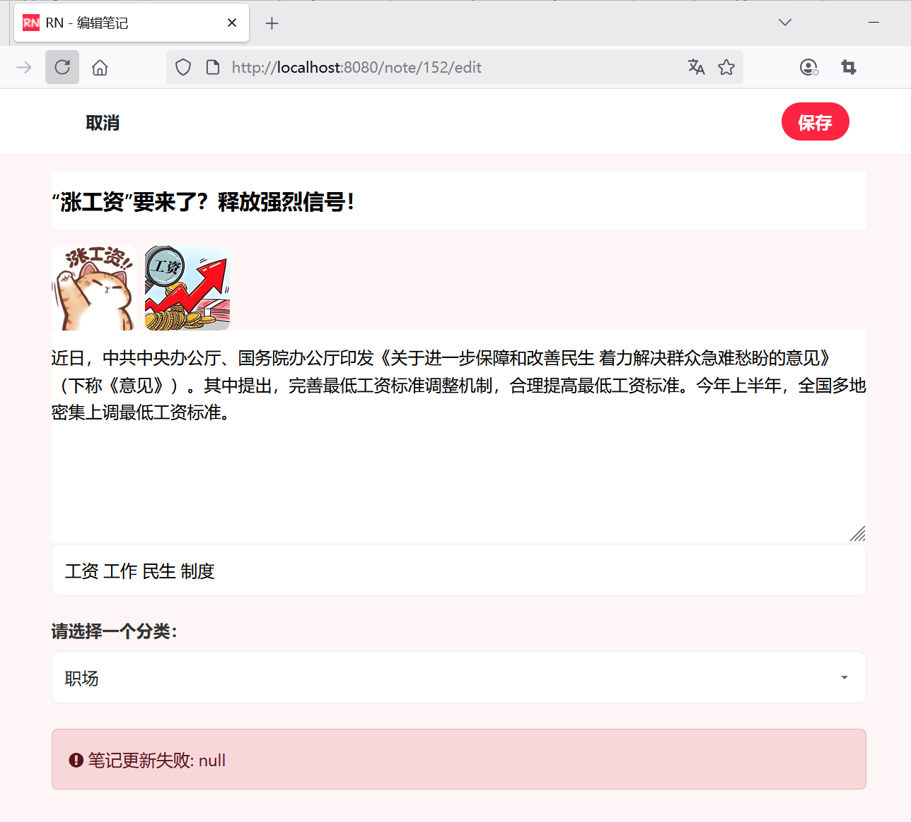


### 问题背景

执行 noteRepository.save(note) 时候报 java.lang.UnsupportedOperationException：

```
java.lang.UnsupportedOperationException: null
	at java.base/java.util.AbstractList.remove(AbstractList.java:169) ~[na:na]
	at java.base/java.util.AbstractList$Itr.remove(AbstractList.java:389) ~[na:na]
	at java.base/java.util.AbstractList.removeRange(AbstractList.java:600) ~[na:na]
	at java.base/java.util.AbstractList.clear(AbstractList.java:245) ~[na:na]
	at org.hibernate.type.CollectionType.replaceElements(CollectionType.java:506) ~[hibernate-core-6.6.15.Final.jar:6.6.15.Final]
	at org.hibernate.type.CollectionType.replace(CollectionType.java:719) ~[hibernate-core-6.6.15.Final.jar:6.6.15.Final]
	at org.hibernate.type.TypeHelper.replace(TypeHelper.java:117) ~[hibernate-core-6.6.15.Final.jar:6.6.15.Final]
	at org.hibernate.event.internal.DefaultMergeEventListener.copyValues(DefaultMergeEventListener.java:596) ~[hibernate-core-6.6.15.Final.jar:6.6.15.Final]
	at org.hibernate.event.internal.DefaultMergeEventListener.entityIsPersistent(DefaultMergeEventListener.java:286) ~[hibernate-core-6.6.15.Final.jar:6.6.15.Final]
	at org.hibernate.event.internal.DefaultMergeEventListener.merge(DefaultMergeEventListener.java:220) ~[hibernate-core-6.6.15.Final.jar:6.6.15.Final]
	at org.hibernate.event.internal.DefaultMergeEventListener.doMerge(DefaultMergeEventListener.java:152) ~[hibernate-core-6.6.15.Final.jar:6.6.15.Final]
	at org.hibernate.event.internal.DefaultMergeEventListener.onMerge(DefaultMergeEventListener.java:136) ~[hibernate-core-6.6.15.Final.jar:6.6.15.Final]
	at org.hibernate.event.internal.DefaultMergeEventListener.onMerge(DefaultMergeEventListener.java:89) ~[hibernate-core-6.6.15.Final.jar:6.6.15.Final]
	at org.hibernate.event.service.internal.EventListenerGroupImpl.fireEventOnEachListener(EventListenerGroupImpl.java:127) ~[hibernate-core-6.6.15.Final.jar:6.6.15.Final]
	at org.hibernate.internal.SessionImpl.fireMerge(SessionImpl.java:854) ~[hibernate-core-6.6.15.Final.jar:6.6.15.Final]
	at org.hibernate.internal.SessionImpl.merge(SessionImpl.java:840) ~[hibernate-core-6.6.15.Final.jar:6.6.15.Final]
	at java.base/jdk.internal.reflect.DirectMethodHandleAccessor.invoke(DirectMethodHandleAccessor.java:104) ~[na:na]
	at java.base/java.lang.reflect.Method.invoke(Method.java:565) ~[na:na]
	at org.springframework.orm.jpa.ExtendedEntityManagerCreator$ExtendedEntityManagerInvocationHandler.invoke(ExtendedEntityManagerCreator.java:364) ~[spring-orm-6.2.7.jar:6.2.7]
	at jdk.proxy2/jdk.proxy2.$Proxy120.merge(Unknown Source) ~[na:na]
	at java.base/jdk.internal.reflect.DirectMethodHandleAccessor.invoke(DirectMethodHandleAccessor.java:104) ~[na:na]
	at java.base/java.lang.reflect.Method.invoke(Method.java:565) ~[na:na]
	at org.springframework.orm.jpa.SharedEntityManagerCreator$SharedEntityManagerInvocationHandler.invoke(SharedEntityManagerCreator.java:320) ~[spring-orm-6.2.7.jar:6.2.7]
	at jdk.proxy2/jdk.proxy2.$Proxy120.merge(Unknown Source) ~[na:na]
	at org.springframework.data.jpa.repository.support.SimpleJpaRepository.save(SimpleJpaRepository.java:654) ~[spring-data-jpa-3.5.0.jar:3.5.0]
	at java.base/jdk.internal.reflect.DirectMethodHandleAccessor.invoke(DirectMethodHandleAccessor.java:104) ~[na:na]
	at java.base/java.lang.reflect.Method.invoke(Method.java:565) ~[na:na]
	at org.springframework.aop.support.AopUtils.invokeJoinpointUsingReflection(AopUtils.java:359) ~[spring-aop-6.2.7.jar:6.2.7]
	at org.springframework.data.repository.core.support.RepositoryMethodInvoker$RepositoryFragmentMethodInvoker.lambda$new$0(RepositoryMethodInvoker.java:277) ~[spring-data-commons-3.5.0.jar:3.5.0]
	at org.springframework.data.repository.core.support.RepositoryMethodInvoker.doInvoke(RepositoryMethodInvoker.java:170) ~[spring-data-commons-3.5.0.jar:3.5.0]
	at org.springframework.data.repository.core.support.RepositoryMethodInvoker.invoke(RepositoryMethodInvoker.java:158) ~[spring-data-commons-3.5.0.jar:3.5.0]
	at org.springframework.data.repository.core.support.RepositoryComposition$RepositoryFragments.invoke(RepositoryComposition.java:515) ~[spring-data-commons-3.5.0.jar:3.5.0]
	at org.springframework.data.repository.core.support.RepositoryComposition.invoke(RepositoryComposition.java:284) ~[spring-data-commons-3.5.0.jar:3.5.0]
	at org.springframework.data.repository.core.support.RepositoryFactorySupport$ImplementationMethodExecutionInterceptor.invoke(RepositoryFactorySupport.java:734) ~[spring-data-commons-3.5.0.jar:3.5.0]
	at org.springframework.aop.framework.ReflectiveMethodInvocation.proceed(ReflectiveMethodInvocation.java:184) ~[spring-aop-6.2.7.jar:6.2.7]
	at org.springframework.data.repository.core.support.QueryExecutorMethodInterceptor.doInvoke(QueryExecutorMethodInterceptor.java:174) ~[spring-data-commons-3.5.0.jar:3.5.0]
	at org.springframework.data.repository.core.support.QueryExecutorMethodInterceptor.invoke(QueryExecutorMethodInterceptor.java:149) ~[spring-data-commons-3.5.0.jar:3.5.0]
	at org.springframework.aop.framework.ReflectiveMethodInvocation.proceed(ReflectiveMethodInvocation.java:184) ~[spring-aop-6.2.7.jar:6.2.7]
	at org.springframework.transaction.interceptor.TransactionAspectSupport.invokeWithinTransaction(TransactionAspectSupport.java:380) ~[spring-tx-6.2.7.jar:6.2.7]
	at org.springframework.transaction.interceptor.TransactionInterceptor.invoke(TransactionInterceptor.java:119) ~[spring-tx-6.2.7.jar:6.2.7]
	at org.springframework.aop.framework.ReflectiveMethodInvocation.proceed(ReflectiveMethodInvocation.java:184) ~[spring-aop-6.2.7.jar:6.2.7]
	at org.springframework.dao.support.PersistenceExceptionTranslationInterceptor.invoke(PersistenceExceptionTranslationInterceptor.java:138) ~[spring-tx-6.2.7.jar:6.2.7]
	at org.springframework.aop.framework.ReflectiveMethodInvocation.proceed(ReflectiveMethodInvocation.java:184) ~[spring-aop-6.2.7.jar:6.2.7]
	at org.springframework.data.jpa.repository.support.CrudMethodMetadataPostProcessor$CrudMethodMetadataPopulatingMethodInterceptor.invoke(CrudMethodMetadataPostProcessor.java:165) ~[spring-data-jpa-3.5.0.jar:3.5.0]
	at org.springframework.aop.framework.ReflectiveMethodInvocation.proceed(ReflectiveMethodInvocation.java:184) ~[spring-aop-6.2.7.jar:6.2.7]
	at org.springframework.aop.framework.JdkDynamicAopProxy.invoke(JdkDynamicAopProxy.java:223) ~[spring-aop-6.2.7.jar:6.2.7]
	at jdk.proxy2/jdk.proxy2.$Proxy132.save(Unknown Source) ~[na:na]
	at com.example.rednote.service.impl.NoteServiceImpl.updateNote(NoteServiceImpl.java:86) ~[classes/:na]
```

### 分析

核心代码位置：

```java
@Override
public void updateNote(Note note, NoteEditDto noteEditDto) {

	// 更新基本信息
	note.setTitle(noteEditDto.getTitle());
	note.setContent(noteEditDto.getContent());
	note.setCategory(noteEditDto.getCategory());

	// 字符串转为List
	note.setTopics(StringUtil.splitToList(noteEditDto.getTopics()," "));

	// 保存更新
	noteRepository.save(note);
}
```


其中，实体Note的topics是由StringUtil.splitToList()生成的。splitToList实现如下：


```java
public static List<String> splitToList(String source, String regex) {
	if (source.isEmpty()) {
		return Collections.emptyList();
	}

	return  Arrays.asList(source.split(regex));
}
```


`Arrays.asList()` 返回的集合是不可变集合，而 Hibernate 在执行持久化操作时需要修改这些集合。


### 整改方案


在保存前临时替换集合：

```java
@Override
public void updateNote(Note note, NoteEditDto noteEditDto) {
	// 更新基本信息
	note.setTitle(noteEditDto.getTitle());
	note.setContent(noteEditDto.getContent());
	note.setCategory(noteEditDto.getCategory());

	// 字符串转为List
	// 确保体使用可变集合实现
	// note.setTopics(StringUtil.splitToList(noteEditDto.getTopics()," "));
	note.setTopics(new ArrayList<>(StringUtil.splitToList(noteEditDto.getTopics()," ")));
	// 保存更新
	noteRepository.save(note);
}
```


### 运行调测


下图10-2所示的是笔记编辑页面。


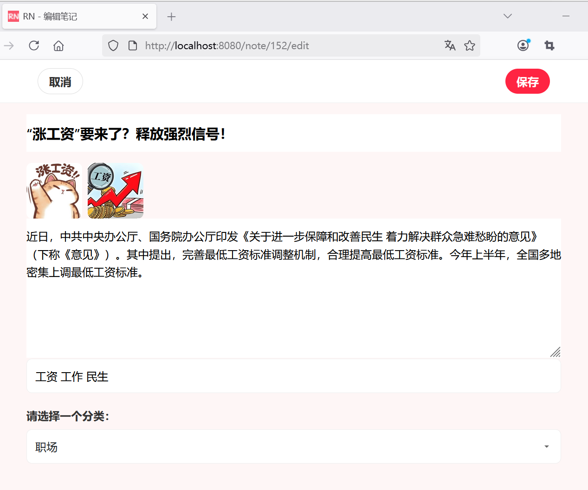


下图10-3所示的是笔记编辑成功后的页面。


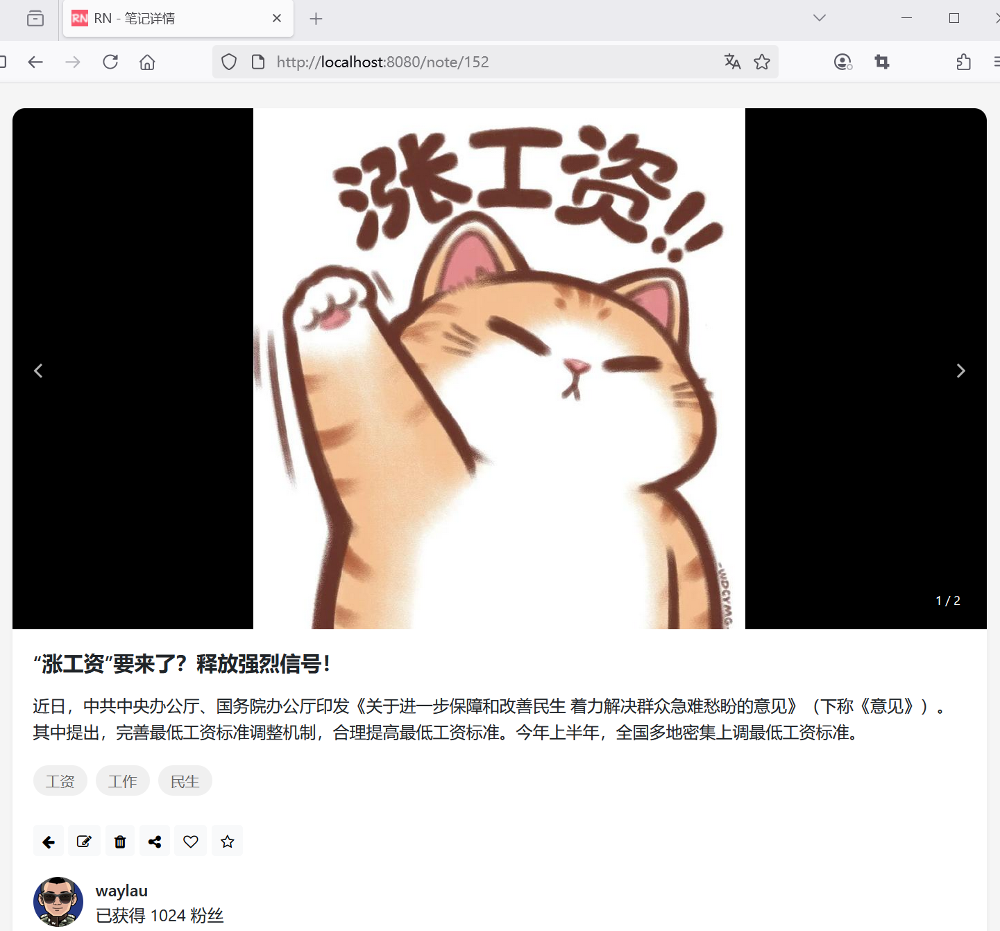


### 总结

`UnsupportedOperationException` 通常表示你正在尝试修改一个不可变集合。确保你的实体使用可变集合实现（如 `ArrayList`），并在DTO到实体转换过程中创建新的可变集合实例。


## 10.6 从笔记详情页面触发编辑、删除笔记的请求

在笔记详情页面操作栏上已经预留了编辑、删除笔记的按钮。如下图10-4所示。


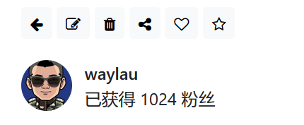


接下来实现从编辑、删除笔记的按钮执行触发编辑、删除笔记的请求。


### 修改编辑笔记按钮事件

修改编辑的按钮事件，在`<button>`外层再套一个`<a>`即可：

```html
<!-- 编辑 -->
<a th:href="@{/note/{noteId}/edit(noteId=${note.noteId})}">
    <button class="btn btn-light btn-sm" th:if="${#authentication.name == note.author.username}">
        <i class="fa fa-edit"></i>
    </button>
</a>
```


### 修改删除笔记的按钮事件


修改删除的按钮事件，在`<button>`设置id属性和onclick事件处理：

```html
<!-- 删除 -->
<button class="btn btn-light btn-sm" th:if="${#authentication.name == note.author.username}"
    th:onclick="deleteNote([[${note.noteId}]])">
    <i class="fa fa-trash"></i>
</button>
```

deleteNote()函数定义如下：

```js
// 处理笔记删除
function deleteNote(noteId) {
    if (confirm("确定要删除此笔记吗？")) {
        fetch(`/note/${noteId}`, {
            method: 'DELETE'
        })
        .then(response => {
            if (response.ok) {
                response.json().then(data => {
                    // 从响应中获取提示信息
                    alert(data.message || '删除成功');

                    // 从响应中获取重定向URL
                    window.location.href = data.redirectUrl;
                });
            } else  {
                response.json().then(data => {
                    alert(data.message || '删除失败，请重试');
                });
            }
        })
        .catch(error => {
            console.error('删除失败：', error);
            alert('删除失败，请稍后重试');
        })
    }
}
```

通过fetch()来发送DELETE请求。fetch 是一个现代化的 JavaScript API，用于发送网络请求并获取资源。它是浏览器提供的全局方法，可以替代传统的 XMLHttpRequest。fetch 支持 Promise，因此更易用且代码更清晰。


## 10.7 掌握`@DeleteMapping`针对DELETE请求的特殊处理

### 增加控制器方法

在原有的NoteController基础上，增加方法以实现相关功能。

```java
/**
 * 处理删除笔记的请求
 */
@DeleteMapping("/{noteId}")
public ResponseEntity<DeleteResponseDto> deleteNote(@PathVariable Long noteId) {
    // 检查笔记是否存在
    Optional<Note> optionalNote = noteService.findNoteById(noteId);
    if (!optionalNote.isPresent()) {
        throw new NoteNotFoundException("");
    }

    Note note = optionalNote.get();

    // 获取当前用户信息
    User user = userService.getCurrentUser();

    // 判定笔记是否属于当前用户，不属于则抛出异常
    if (!note.getAuthor().getUserId().equals(user.getUserId())) {
        throw new NoteNotFoundException("");
    }

    // 使用服务删除笔记
    noteService.deleteNote(note);

    // 返回响应的内容
    DeleteResponseDto deleteResponseDto = new DeleteResponseDto();
    deleteResponseDto.setMessage("笔记删除成功");
    deleteResponseDto.setRedirectUrl("/user/profile");

    return ResponseEntity.ok(deleteResponseDto);
}
```

注：在 Spring MVC 中使用 `@DeleteMapping` 处理删除请求后，但不能使用RedirectAttributes进行重定向。这是因为：HTTP 规范中，DELETE 请求不应该有重定向响应。浏览器在处理 DELETE 请求的重定向时可能会遇到各种问题，如安全限制、缓存问题或行为不一致。因此，使用ResponseEntity作为响应体。

### 通用删除响应对象DeleteResponseDto

ResponseEntity作为响应体所包裹的对象是DeleteResponseDto，代码如下：


```java
package com.example.rednote.dto;

import lombok.Getter;
import lombok.Setter;

/**
 * DeleteResponseDto 执行删除的响应对象
 *
 * @version 2025/06/12
 **/
@Getter
@Setter
public class DeleteResponseDto {
    /**
     * 信息
     */
    private String message;

    /**
     * 重定向URL
     */
    private String redirectUrl;
}
```

上述对象可以用于任意DELETE请求的场景。


### 增加NoteRepository方法

修改NoteRepository增加方法如下：


```java
/**
* 删除笔记
*
* @param note
*/
void delete(Note note);
```


### 删除笔记的服务

修改NoteService，增加如下接口：


```java
public interface NoteService {
 

    /**
     * 删除笔记
     *
     * @param note
     */
    void deleteNote(Note note);
}
```

修改NoteServiceImpl，实现笔记删除的方法：


```java
@Override
@Transactional
public void deleteNote(Note note) {
    // 注意：先删除数据库数据再删图片文件。以防止删除文件异常时，方便回滚数据库数据

    // 先删除数据库数据
    noteRepository.delete(note);

    // 再删图片文件
    List<String> images = note.getImages();
    for (String image : images) {
        fileStorageService.deleteFile(image);
    }
}
```

需要注意是的，上述方法既有删除文件的，又有删除数据库数据的。因此，需要加`@Transactional`进行事务管理，同时，先删库再删文件。这样，以在删除文件异常时，方便回滚数据库。


## 10.8 处理CSRF保护引发的HttpRequestMethodNotSupportedException异常

### 问题背景


运行应用，试图删除笔记时，报错如下图10-5所示。


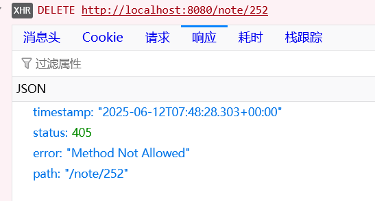


同时在控制台日志里面看大如下信息：


```
2025-06-12T14:34:19.883+08:00  WARN 21324 --- [rednote] [io-8080-exec-10] .w.s.m.s.DefaultHandlerExceptionResolver : Resolved [org.springframework.web.HttpRequestMethodNotSupportedException: Request method 'DELETE' is not supported]
```


### 原因


系统已经启用了CSRF保护，在WebSecurityConfig配置如下：


```java
// 启用 CSRF 防护
.csrf(Customizer.withDefaults())
```


因此，使用JavaScript fetch API所发送的 DELETE 方法需要有效的 CSRF 令牌，否则会报错。


### 如何设置并获取 CSRF 令牌

首先，确保在你的 HTML 模板中有一个 meta 标签来存储 CSRF 令牌。Spring Security 默认会提供一个名为 `_csrf` 的令牌，你可以通过 Thymeleaf 将其插入到 meta 标签中。


修改user-profile.html，增加如下内容：

```html
<!-- 确保有一个meta标签来存储CSRF令牌 -->
<meta name="_csrf" th:content="${_csrf.token}"></meta>
```


接着，在JavaScript fetch API所发送的 DELETE 方法头信息里面设置 CSRF 令牌：

```js
// 笔记删除
function deleteNote(noteId) {
    if (confirm("确定要删除此笔记吗？")) {
        fetch(`/note/${noteId}`, {
            method: 'DELETE',
            // 添加请求头, 用于Spring Security CSRF
            headers: {
                'X-CSRF-TOKEN': document.querySelector('meta[name="_csrf"]').getAttribute('content')
            }
        })
    // ...为节约篇幅，此处省略非核心内容
```

### 运行调测


运行应用，删除笔记时，可以看到如下图10-6所示的提示框，说明笔记已经能够成功删除了。


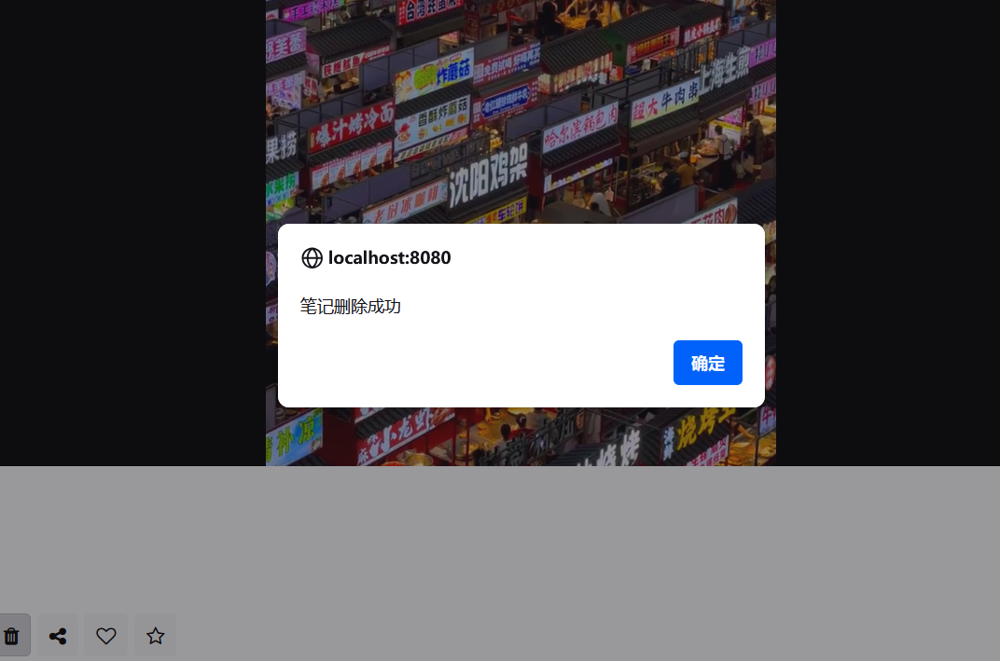

点击提示框“确认”按钮，可以重定向到了用户信息管理界面，如下图10-7所示。


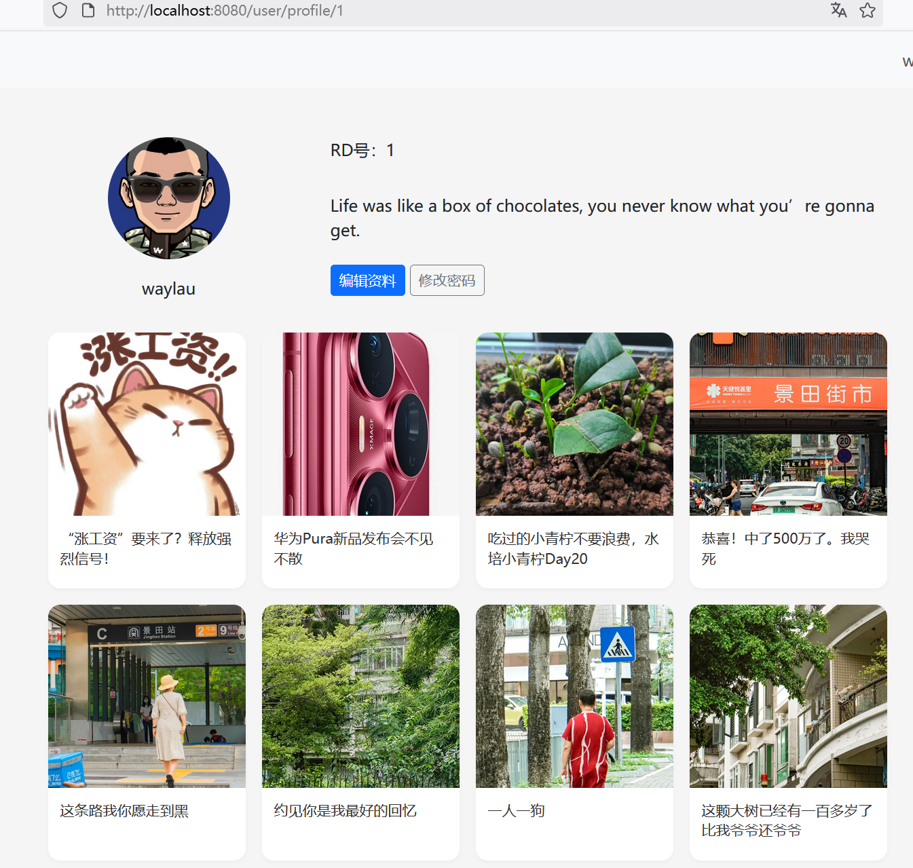


## 10.9 细粒度的访问控制确保只能作者修改、删除自己的笔记

在前面课程中介绍了，在对笔记进行编辑、删除的时候，是加了代码判断，确保只有笔记的作者才能修改、删除笔记的按钮。代码如下：

```java
// 获取当前用户信息
User user = userService.getCurrentUser();

Note note = optionalNote.get();

// 判定笔记是否属于当前用户，不属于则抛出异常
if (!note.getAuthor().getUserId().equals(user.getUserId())) {
    throw new NoteNotFoundException("");
}

// 执行后续业务
```


但这种编程方式固然可行，但略微繁琐。本节介绍一种通过声明式的方式来实现细粒度的访问控制。


### Spring Security 的 `@PreAuthorize` 深入解析

`@PreAuthorize` 是 Spring Security 提供的一个强大注解，用于在方法调用前进行权限检查。它允许你基于表达式语言（SpEL）定义细粒度的访问控制规则，是实现方法级安全的核心工具之一。


`@PreAuthorize` 是一个方法级别的安全注解，用于在方法执行前验证当前用户是否具有执行该方法的权限。如果验证失败，Spring Security 会抛出 `AccessDeniedException`。

#### 使用场景

- 基于角色的访问控制
- 基于权限的访问控制
- 动态权限检查
- 复杂业务逻辑的权限控制

#### 基本语法

```java
@PreAuthorize("expression")
public void someMethod() {
    // 方法实现
}
```

#### 常用表达式

基于角色的访问控制

```java
@PreAuthorize("hasRole('ADMIN')")
public void adminOnlyMethod() {
    // 只有ADMIN角色可以访问
}
```

基于权限的访问控制

```java
@PreAuthorize("hasAuthority('READ_PRIVILEGE')")
public void readData() {
    // 只有拥有READ_PRIVILEGE权限的用户可以访问
}
```

组合多个条件

```java
@PreAuthorize("hasRole('USER') and hasAuthority('WRITE_PRIVILEGE')")
public void writeData() {
    // 用户必须同时具有USER角色和WRITE_PRIVILEGE权限
}
```

使用方法参数

```java
@PreAuthorize("#id == authentication.principal.id")
public void deleteUser(@PathVariable Long id) {
    // 只有用户可以删除自己的账户
}
```

自定义权限检查

```java
@PreAuthorize("@customSecurityService.checkPermission(authentication, #resourceId, 'DELETE')")
public void deleteResource(@PathVariable Long resourceId) {
    // 调用自定义服务检查权限
}
```

### 自定义权限检查是否是作者自己


在NoteService中增加接口：

```java
/**
  * 验证用户是否为笔记作者
  *
  * @param noteId
  * @param username
  * @return
  */
boolean isAuthor(Long noteId, String username);
```


在NoteServiceImpl中增加方法：

```java
@Override
public boolean isAuthor(Long noteId, String username) {
    Optional<Note> optionalNote = noteRepository.findByNoteId(noteId);
    if (!optionalNote.isPresent()) {
        throw new NoteNotFoundException("");
    }

    return username.equals(optionalNote.get().getAuthor().getUsername());
}
```

修改NoteController，在需要方法级别控制的方法上面加`@PreAuthorize`注解：

```java
@GetMapping("/{noteId}/edit")
@PreAuthorize("@noteServiceImpl.isAuthor(#noteId, authentication.name)")
public String showEditForm(@PathVariable Long noteId, Model model) {
    // ...为节约篇幅，此处省略非核心内容
}
```

```java
@PostMapping("/{noteId}")
@PreAuthorize("@noteServiceImpl.isAuthor(#noteId, authentication.name)")
public String updateNote(@PathVariable Long noteId,
                             @Valid @ModelAttribute("note") NoteEditDto noteEditDto,
                             BindingResult result,
                             Model model,
                             RedirectAttributes redirectAttributes) {
    // ...为节约篇幅，此处省略非核心内容
}
```

```java
@DeleteMapping("/{noteId}")
@PreAuthorize("@noteServiceImpl.isAuthor(#noteId, authentication.name)")
public ResponseEntity<DeleteResponseDto> deleteNote(@PathVariable Long noteId) {
    // ...为节约篇幅，此处省略非核心内容
}
```

上述`@noteServiceImpl`中的`noteServiceImpl`是指NoteServiceImpl在Spring中的Bean的名称。

### 配置要求

要使用 `@PreAuthorize`，需要在配置类上启用方法级安全：

```java
import org.springframework.security.config.annotation.method.configuration.EnableMethodSecurity;

@Configuration
@EnableWebSecurity
// 启用@PreAuthorize等注解
// 等同于老版本的@EnableGlobalMethodSecurity(prePostEnabled = true)
@EnableMethodSecurity
public class WebSecurityConfig {
    // ...为节约篇幅，此处省略非核心内容
}
```


Spring Security 的`@EnableMethodSecurity`注解用于开启方法级安全授权（Method Security），替代了旧版本中的`@EnableGlobalMethodSecurity`。以下是关键信息：

核心功能

* ‌灵活配置‌：支持基于Bean的配置方式，允许为不同授权类型（如JSR-250、Spring EL表达式等）单独设置配置。 ‌
* ‌权限校验‌：通过注解（如@PreAuthorize、@PostAuthorize）实现方法执行前后的权限验证。 ‌

与@EnableGlobalMethodSecurity的区别

* ‌版本差异‌：`@EnableMethodSecurity`是Spring Security 5.6版本引入的替代方案，而`@EnableGlobalMethodSecurity`在5.6之前使用。 ‌
* ‌配置方式‌：`@EnableMethodSecurity`支持更细粒度的配置（如JSR-250、Spring EL表达式等），而`@EnableGlobalMethodSecurity`仅提供三种预定义机制（prePostEnabled、securedEnabled、jsr250Enabled）。 ‌


### 总结

`@PreAuthorize` 提供了强大的方法级安全控制能力，通过 SpEL 表达式可以实现非常灵活的权限控制逻辑。它的主要优势包括：

1. 细粒度控制：可以精确到方法甚至方法参数级别的权限控制
2. 动态性：可以基于运行时信息（如用户属性、方法参数）进行权限检查
3. 可读性：表达式语言直观易懂，便于维护
4. 可扩展性：支持自定义 SpEL 函数和权限评估器

合理使用 `@PreAuthorize` 可以显著提高应用程序的安全性，同时保持代码的清晰和可维护性。


## 10.10 安全最佳实践总结及扩展建议

### 安全最佳实践总结

1. 永远不要信任前端验证：
   - 前端隐藏编辑按钮只是用户体验优化
   - 真正的安全验证必须在后端完成

2. 使用 HTTPS：
   - 防止中间人攻击和会话劫持

3. 会话管理：
   - 使用 JWT 或 Session 管理用户身份
   - 设置合理的过期时间

4. 日志记录：
   - 记录所有修改和删除操作
   - 记录异常的访问尝试
   - 记录权限检查失败的情况，便于审计和故障排查

5. CSRF 防护：
   - 启用 Spring Security 的 CSRF 保护
   - 对于 AJAX 请求，确保包含 CSRF 令牌

6. 参数验证：
   - 使用 `@Valid` 注解验证请求参数
   - 防止 SQL 注入和 XSS 攻击

7. 最小权限原则：
   - 只授予用户完成工作所需的最小权限

8. 性能考虑：
   - 对于高频调用的方法，避免复杂的 SpEL 表达式

### 扩展建议

#### 功能扩展建议

1. 图片编辑功能：
   - 添加图片裁剪、滤镜等编辑功能
   - 支持图片排序调整

2. 富文本编辑：
   - 集成富文本编辑器，支持格式化文本
   - 添加表情符号和贴纸功能

3. 标签推荐：
   - 基于内容自动推荐相关标签
   - 热门标签快速选择

4. 草稿保存：
   - 自动保存草稿功能
   - 草稿列表管理

5. 发布设置：
   - 隐私设置（公开、仅自己可见）
   - 发布时间设置（立即发布、定时发布）


#### 安全扩展建议

1. 多级权限控制：
   - 管理员可以修改/删除任何笔记
   - 实现角色系统（ROLE_USER, ROLE_ADMIN）

2. 软删除：
   - 不物理删除笔记，而是标记为已删除
   - 便于数据恢复和审计

3. 操作审计：
   - 记录谁在什么时间修改/删除了笔记
   - 使用 Spring Data JPA 的 `@CreatedBy` 和 `@LastModifiedBy`

4. 并发控制：
   - 使用乐观锁（`@Version` 注解）防止并发修改冲突


通过以上实现，可以确保只有笔记的作者才能修改或删除自己的笔记，同时提供良好的用户体验和安全防护。


## 11.1 首页笔记探索功能概述

实现一个仿小红书的首页功能，包含笔记流展示、搜索、分类导航、推荐内容等核心功能。


### 核心功能与设计特点

1. 界面布局：
   - 顶部固定搜索栏和功能按钮
   - 分类导航栏
   - 网格布局的笔记卡片
   - 底部固定导航栏

2. 笔记卡片设计：
   - 网格图片布局
   - 图片上的标签显示
   - 标题、作者信息和互动数据
   - 点击跳转详情页

3. 交互体验：
   - 无限滚动加载更多内容
   - 分类切换刷新内容
   - 底部导航栏状态切换
   - 平滑的页面过渡

4. 响应式设计：
   - 适配移动设备和桌面设备
   - 网格布局自动调整
   - 触摸友好的交互元素


## 11.2 使用Bootstrap、Font Awesome以及Thymeleaf轻松实现首页笔记探索界面设计

主要分为以下几个部分

* 顶部导航栏
* 分类导航
* 笔记卡片网格
* 加载更多内容提示
* 没有更多内容提示
* 底部导航栏

### 界面整体布局

在`src/main/resources/templates`目录下，新建一个explore.html，代表首页笔记探索界面。以下是页面整体布局代码：

```html
<!DOCTYPE html>
<html lang="en" xmlns:th="http://www.thymeleaf.org" xmlns:sec="http://www.thymeleaf.org/extras/spring-security">

<head>
    <meta charset="UTF-8">
    <meta name="viewport" content="width=device-width, initial-scale=1.0">
    <title>RN - 标记我的生活</title>
    <!-- 引入 Bootstrap CSS -->
    <link href="https://cdn.jsdelivr.net/npm/bootstrap@5.3.6/dist/css/bootstrap.min.css"
        th:href="@{/css/bootstrap.min.css}" rel="stylesheet">
    <!-- 引入 Font Awesome -->
    <link href="https://cdn.jsdelivr.net/npm/font-awesome@4.7.0/css/font-awesome.min.css"
        th:href="@{/css/font-awesome.min.css}" rel="stylesheet">
    <!-- TODO 自定义样式 -->
    <style>
        
    </style>
</head>
<header>
    <!-- TODO 顶部导航栏 -->
    
</header>
<header>
    <!-- TODO 分类导航 -->
    
</header>
<body>
    <main>
        <div class="container">
            <!-- TODO 笔记卡片网格 -->

            <!-- TODO 加载更多内容提示 -->

            
            <!-- TODO 没有更多内容提示 -->

        </div>
    </main>
    <footer>
        <!-- TODO 底部导航栏 -->


    </footer>

    <!-- Bootstrap JS -->
    <script src="https://cdn.jsdelivr.net/npm/bootstrap@5.3.6/dist/js/bootstrap.bundle.min.js"
        th:src="@{/js/bootstrap.bundle.min.js}"></script>
    <script>
         // TODO 程序运行脚本
    </script>
</body>

</html>
```


### 顶部导航栏


```html
<style>
    /* 全局样式 */
    body {
        font-family: -apple-system, BlinkMacSystemFont, "Segoe UI", Roboto, "Helvetica Neue", Arial, sans-serif;
        background-color: #f5f5f5;
    }
</style>

<!-- ...为节约篇幅，此处省略非核心内容 -->
<!-- 顶部导航栏 -->
<header>
    <nav class="navbar navbar-expand-lg">
        <div class="container">
            <a class="navbar-brand" href="/" th:href="@{/}">
                
            </a>

            <!-- 搜索框-->
            <div class="col-md-3">
                <div class="input-group">
                    <input class="form-control" type="text" placeholder="搜索感兴趣的内容" aria-label="Search">
                </div>
            </div>

            <button class="navbar-toggler" type="button" data-bs-toggle="collapse" data-bs-target="#navbarNav"
                    aria-controls="navbarNav" aria-expanded="false" aria-label="Toggle navigation">
                <span class="navbar-toggler-icon"></span>
            </button>

            <div class="collapse navbar-collapse" id="navbarNav">
                <ul class="navbar-nav me-auto">
                </ul>

                <ul class="navbar-nav mb-2 mb-lg-0">
                    <li class="nav-item dropdown">
                        <a class="nav-link dropdown-toggle" href="#" data-bs-target="dropdown" data-bs-toggle="dropdown"
                           aria-expanded="false">
                            [[${#authentication.name}]]
                        </a>

                        <ul class="dropdown-menu" id="dropdown">
                            <li class="dropdown-item">
                                <a class="nav-link" href="/user/profile" th:href="@{/user/profile}">个人资料</a>
                            </li>
                            <li class="dropdown-item">
                                <form th:action="@{/logout}" action="/logout" method="post">
                                    <button type="submit" class="nav-link">退出登录</button>
                                </form>
                            </li>
                        </ul>
                    </li>

                </ul>

            </div>
        </div>
    </nav>
</header>
<!-- ...为节约篇幅，此处省略非核心内容 -->
```


### 分类导航


```html
<!-- ...为节约篇幅，此处省略非核心内容 -->
<style>
    /* ...为节约篇幅，此处省略非核心内容 */

    /* 分类导航 */
    .category-nav {
        background-color: white;
        padding: 8px 0;
        overflow-x: auto;
        white-space: nowrap;
        -webkit-overflow-scrolling: touch;
    }

    .category-item {
        display: inline-block;
        padding: 6px 12px;
        margin-right: 8px;
        border-radius: 20px;
        font-size: 14px;
        cursor: pointer;
        transition: background-color 0.2s;
    }

    .category-item.active {
        background-color: #ff2442;
        color: white;
    }
</style>

</head>
<!-- 顶部导航栏 -->
<header>
    <!-- ...为节约篇幅，此处省略非核心内容 -->
</header>

<!-- 分类导航 -->
<header>
    <div class="container">
        <div class="category-item active">推荐</div>
        <div class="category-item">穿搭</div>
        <div class="category-item">美食</div>
        <div class="category-item">彩妆</div>
        <div class="category-item">影视</div>
        <div class="category-item">职场</div>
        <div class="category-item">情感</div>
        <div class="category-item">家居</div>
        <div class="category-item">游戏</div>
        <div class="category-item">旅行</div>
        <div class="category-item">健身</div>
    </div>
</header>

<!-- ...为节约篇幅，此处省略非核心内容 -->
```


### 笔记卡片网格


```html
<!-- ...为节约篇幅，此处省略非核心内容 -->
<style>
    /* ...为节约篇幅，此处省略非核心内容 */

    /* 笔记卡片网格 */
    .notes-grid {
        display: grid;
        grid-template-columns: repeat(auto-fill, minmax(180px, 1fr));
        gap: 8px;
        padding: 8px;
    }

    .note-card {
        background-color: white;
        border-radius: 8px;
        overflow: hidden;
        box-shadow: 0 1px 2px rgba(0, 0, 0, 0.05);
    }

    .note-image-container {
        position: relative;
        padding-bottom: 100%;
        /* 保持正方形比例 */
        overflow: hidden;
        border-radius: 12px;
    }

    .note-image {
        position: absolute;
        top: 0;
        left: 0;
        width: 100%;
        height: 100%;
        object-fit: cover;
    }

    .note-tag {
        position: absolute;
        bottom: 8px;
        left: 8px;
        background-color: rgba(0, 0, 0, 0.5);
        color: white;
        padding: 2px 8px;
        border-radius: 10px;
        font-size: 12px;
    }

    .note-content {
        padding: 8px;
    }

    .note-title {
        font-size: 14px;
        font-weight: 500;
        margin-bottom: 4px;
        line-height: 1.4;
        overflow: hidden;
        text-overflow: ellipsis;
        display: -webkit-box;
        -webkit-line-clamp: 2;
        -webkit-box-orient: vertical;
    }

    .note-author {
        display: flex;
        align-items: center;
        margin-bottom: 4px;
    }

    .author-avatar {
        width: 20px;
        height: 20px;
        border-radius: 50%;
        margin-right: 6px;
    }

    .author-name {
        font-size: 12px;
        color: #666;
    }

    .note-author-stats {
        display: flex;
        justify-content: space-between;
    }
    
    .note-stats {
        display: flex;
        align-items: center;
        font-size: 12px;
        color: #999;
    }

    .stat-item {
        margin-right: 12px;
    }
</style>

<!-- ...为节约篇幅，此处省略非核心内容 -->

<header>
    <!-- 顶部导航栏 -->
    <!-- ...为节约篇幅，此处省略非核心内容 -->
</header>
<header>
    <!-- 分类导航 -->
    <!-- ...为节约篇幅，此处省略非核心内容 -->
</header>
<body>
    <main>
        <div class="container">
            <!-- 笔记卡片网格 -->
            <div class="notes-grid" id="notesGrid">
                <!-- 笔记卡片将通过JavaScript动态生成 -->
            </div>
            <!-- TODO 加载更多内容提示 -->

            
            <!-- TODO 没有更多内容提示 -->

        </div>
    </main>
    <!-- ...为节约篇幅，此处省略非核心内容 -->
</body>

</html>
```


### 加载更多内容提示


```html
<!-- ...为节约篇幅，此处省略非核心内容 -->
<style>
    /* ...为节约篇幅，此处省略非核心内容 */

    /* 加载更多 */
    .load-more {
        text-align: center;
        padding: 16px 0;
        color: #666;
        font-size: 14px;
    }

</style>
<!-- ...为节约篇幅，此处省略非核心内容 -->
 
<header>
    <!-- 顶部导航栏 -->
    <!-- ...为节约篇幅，此处省略非核心内容 -->
</header>
<header>
    <!-- 分类导航 -->
    <!-- ...为节约篇幅，此处省略非核心内容 -->
</header>
<body>
    <main>
        <div class="container">
            <!-- 笔记卡片网格 -->
            <!-- ...为节约篇幅，此处省略非核心内容 -->

            <!-- 加载更多内容提示 -->
            <div class="load-more" id="loadMore">
                <i class="fa fa-spinner fa-spin"></i> 加载更多
            </div>
            
            <!-- TODO 没有更多内容提示 -->

        </div>
    </main>
    <!-- ...为节约篇幅，此处省略非核心内容 -->
</body>

</html>
```


### 没有更多内容提示


```html
<!-- ...为节约篇幅，此处省略非核心内容 -->
<style>
    /* ...为节约篇幅，此处省略非核心内容 */

    /* 没有更多 */
    .no-more {
        text-align: center;
        padding: 0 0 50px 0;
        color: #666;
        font-size: 14px;
        display: none;
    }
</style>
</head>
<header>
    <!-- 顶部导航栏 -->
    <!-- ...为节约篇幅，此处省略非核心内容 -->
</header>
<header>
    <!-- 分类导航 -->
    <!-- ...为节约篇幅，此处省略非核心内容 -->
</header>
<body>
    <main>
        <div class="container">
            <!-- 笔记卡片网格 -->
            <!-- ...为节约篇幅，此处省略非核心内容 -->
            <!-- 加载更多内容提示 -->
            <!-- ...为节约篇幅，此处省略非核心内容 -->
            
            <!-- 没有更多内容提示 -->
            <div class="no-more" id="noMoreContent">
                <p>已经到底啦~</p>
            </div>
        </div>
    </main>
    <footer>
        <!-- TODO 底部导航栏 -->


    </footer>
    <!-- ...为节约篇幅，此处省略非核心内容 -->
</body>

</html>
</body>

</html>
```


### 底部导航栏


```html
<!-- ...为节约篇幅，此处省略非核心内容 -->
<style>
    /* ...为节约篇幅，此处省略非核心内容 */
    /* 底部导航栏 */
    .bottom-nav {
        position: fixed;
        bottom: 0;
        left: 0;
        right: 0;
        display: flex;
        justify-content: space-around;
        padding: 8px 0;
        box-shadow: 0 -1px 2px rgba(0, 0, 0, 0.05);
        z-index: 100;
        background-color: #f5f5f5;
    }

    .nav-item {
        display: flex;
        flex-direction: column;
        align-items: center;
        color: #666;
        cursor: pointer;
    }

    .nav-item.active {
        color: #ff2442;
    }

    .nav-icon {
        font-size: 20px;
        margin-bottom: 2px;
    }

    .nav-text {
        font-size: 10px;
    }
</style>
</head>
<header>
    <!-- 顶部导航栏 -->
    
</header>
<header>
    <!-- 分类导航 -->
    
</header>
<body>
    <main>
        <div class="container">
            <!-- 笔记卡片网格 -->
            <!-- ...为节约篇幅，此处省略非核心内容 -->

            <!-- 加载更多内容提示 -->
            <!-- ...为节约篇幅，此处省略非核心内容 -->
            
            <!-- 没有更多内容提示 -->
            <!-- ...为节约篇幅，此处省略非核心内容 -->
        </div>
    </main>
    <footer>
        <!-- 底部导航栏 -->
        <div class="container bottom-nav">
            <div class="nav-item active">
                <i class="fa fa-home nav-icon"></i>
                <span class="nav-text">首页</span>
            </div>
            <div class="nav-item">
                <i class="fa fa-compass nav-icon"></i>
                <span class="nav-text">发现</span>
            </div>
            <div class="nav-item">
                <i class="fa fa-plus nav-icon"></i>
                <span class="nav-text">发布</span>
            </div>
            <div class="nav-item">
                <i class="fa fa-comment-o nav-icon"></i>
                <span class="nav-text">消息</span>
            </div>
            <div class="nav-item">
                <i class="fa fa-user-o nav-icon"></i>
                <span class="nav-text">我的</span>
            </div>
        </div>

    </footer>

    <!-- ...为节约篇幅，此处省略非核心内容 -->

    <script>
         // TODO 程序运行脚本
    </script>
</body>

</html>
```


## 11.3 掌握无限滚动刷新加载笔记内容生成笔记卡片网格的秘笈

修改explore.html，在`<script>`增加如下内容：

```js
<script>
    let currentPage = 0;
    let isLoading = false;
    let hasMore = true;
    loadMoreNotes();

    // 加载更多笔记
    function loadMoreNotes() {
        if (isLoading || !hasMore) {
            // 隐藏加载更多
            hideLoadMore();
            // 显示没有更多内容
            showNoMoreContent();
            return;
        }

        isLoading = true;
        // 显示加载更多
        showLoadMore();

        // 获取当前分类
        let category = document.querySelector('.category-item.active').textContent.trim();

        // 发送请求
        fetch(`/explore/note?page=${currentPage + 1}&category=${category}`)
            .then(response => response.json())
            .then(data => {
                if (data.notes && data.notes.length > 0) {
                    currentPage++;
                    // 添加笔记列表到网格布局中
                    appendNotes(data.notes);
                    hasMore = data.hasMore;
                } else {
                    hasMore = false;
                }

                isLoading = false;
                // 隐藏加载更多
                hideLoadMore();

                if (!hasMore) {
                    // 显示没有更多内容
                    showNoMoreContent();
                }
            })
            .catch(error => {
                console.error('Error:', error);
                isLoading = false;
                // 隐藏加载更多
                hideLoadMore();
            });
    }

    // 隐藏加载更多
    function hideLoadMore() {
        document.getElementById("loadMore").style.display = "none";
    }

    // 显示没有更多内容
    function showNoMoreContent() {
        document.getElementById("noMoreContent").style.display = "block";
    }

    // 显示加载更多
    function showLoadMore() {
        document.getElementById("loadMore").style.display = "block";
    }

    const notesGrid = document.getElementById("notesGrid");
    // 添加笔记列表到网格布局中
    function appendNotes(notes) {
        for (let i = 0; i < notes.length; i++) {
            const note = notes[i];

            // 创建笔记卡片元素
            const noteElement = createNoteElement(note);

            notesGrid.appendChild(noteElement);
        }
    }

    // 创建笔记卡片元素
    function createNoteElement(note) {
        const noteElement = document.createElement("div");
        noteElement.className = "masonry-item";
        noteElement.innerHTML = `
            <div class="note-image-container">
                
            </div>
            <div class="note-content">
                <div class="note-title">${note.title}</div>
                <div class="note-author-stats">
                    <div class="note-author">
                        
                        <span class="author-name">${note.username}</span>
                    </div>
                    <div class="note-stats">
                        <div class="stat-item">
                            <i class="fa fa-heart-o">1024</i>
                        </div>
                    </div>
                </div>
            </div>
        `;

        return noteElement;
    }


    const categoryItems = document.querySelectorAll('.category-item');

    // 为分页导航添加点击事件
    categoryItems.forEach(item => {
        item.addEventListener('click', () => {
            categoryItems.forEach(item => {
                item.classList.remove('active');
            });
            item.classList.add('active');

            // 重置笔记网格数据
            notesGrid.innerHTML = '';

            // 恢复初始状态值
            currentPage = 0;
            isLoading = false;
            hasMore = true;
            loadMoreNotes();
        });
    });

    // 监听滚动事件
    window.addEventListener('scroll', function() {
        console.log('scroll');

        if (isLoading || !hasMore) {
            return;
        }

        console.log('scroll before');

        const scrollTop = window.pageYOffset || document.documentElement.scrollTop;
        const windowHeight = window.innerHeight;
        const documentHeight = document.documentElement.scrollHeight;

        console.log('scrollTop: ' + scrollTop);
        console.log('windowHeight: ' + windowHeight);
        console.log('documentHeight: ' + documentHeight);

        if (scrollTop + windowHeight >= documentHeight - 300) {
            loadMoreNotes();
        }

        console.log('scroll after');
    });
</script>
```


## 11.4 创建一个Spring MVC控制器类处理首页笔记探索请求

新建一个控制器ExploreController，用于处理首页笔记探索的请求。

### 返回首页笔记探索页面


新增方法如下。

```java
package com.example.rednote.controller;

import org.springframework.stereotype.Controller;
import org.springframework.web.bind.annotation.GetMapping;
import org.springframework.web.bind.annotation.RequestMapping;

/**
 * ExploreController 首页笔记探索
 *
 * @version 2025/08/20
 **/
@Controller
@RequestMapping("/explore")
public class ExploreController {

    /**
     * 显示笔记探索页面
     */
    @GetMapping
    public String showExplore() {
        return "explore";
    }
}
```

### 返回首页笔记探索页面的笔记数据

新增方法如下。


```java
private static final int PAGE_SIZE = 20;
private static final String DEFAULT_CATEGORY = "推荐";

@Autowired
private NoteService noteService;

/**
  * 返回首页笔记探索页面的笔记数据
  */
@GetMapping("/note")
public ResponseEntity<NoteResponseDto> getNotesByCategory(
                                                          @RequestParam(defaultValue = "1") int page,
                                                          @RequestParam(required = false) String category) {
    // 把“推荐”当成空
    if (DEFAULT_CATEGORY.equals(category)) {
        category = null;
    }

    Page<Note> notes = noteService.getNotesByPage(page, PAGE_SIZE, category);

    NoteResponseDto notesResponseDto = new NoteResponseDto();
    notesResponseDto.setHasMore(notes.hasNext());
    notesResponseDto.setNotes(notes.getContent());

    return ResponseEntity.ok(notesResponseDto);
}
```


上述接口，可以根据分类进行分页查询，并将查询结果通过NoteResponseDto数据结构返回给前端。

如果分类是“推荐”，实际上就是不需要分类，直接赋值为null即可。


### 探索笔记的响应对象DTO

新增NoteResponseDto如下。


```java
package com.example.rednote.dto;

import com.example.rednote.entity.Note;
import lombok.Getter;
import lombok.Setter;

import java.util.List;

/**
 * NoteResponseDto 探索笔记的响应对象
 *
 * @version 2025/08/20
 **/
@Getter
@Setter
public class NoteResponseDto {
    /**
     * 笔记列表
     */
    private List<Note> notes;

    /**
     * 是否还有更多
     */
    private boolean hasMore;
}
```

### 首页重定向


首页重定向到首页笔记探索页面：

```java
package com.example.rednote.controller;

import org.springframework.stereotype.Controller;
import org.springframework.web.bind.annotation.GetMapping;
import org.springframework.web.bind.annotation.RequestMapping;

/**
 * IndexController 首页控制器
 *
 * @version 2025/08/20
 **/
@Controller
@RequestMapping("/")
public class IndexController {
    @GetMapping
    public String index() {
        // 重定向到首页笔记探索页面
        return "redirect:/explore";
    }
}
```


## 11.5 调整安全配置类细化首页笔记探索的访问权限

1. 在 Spring Security 配置类中，进一步细化首页笔记索页面的访问权限
2. 确保只有普通用户角色可以访问首页笔记索页面


修改WebSecurityConfig如下：


```java
@Bean
public SecurityFilterChain filterChain(HttpSecurity http) throws Exception {
    http
            // ...为节约篇幅，此处省略非核心内容    
            .authorizeHttpRequests(authorize -> authorize
                    // ...为节约篇幅，此处省略非核心内容

                    // 允许USER角色的用户访问 /explore/** 的资源
                    .requestMatchers("/explore/**").hasRole("USER")
                    // 其他请求需要认证
                    .anyRequest().authenticated()
            )

 
    ;

    return http.build();
}            
```


## 11.6 提供分类分页查询笔记的服务

### 修改NoteRepository


修改NoteRepository，增加如下接口：


```java
/**
  * 根据分类、分页查询笔记
  *
  * @param category
  * @param pageable
  * @return
  */
Page<Note> findByCategory(String category, Pageable pageable);

/**
  * 分页查询笔记
  *
  * @param pageable
  * @return
  */
Page<Note> findAll(Pageable pageable);
```


上述两个接口的区别是，如果不提供分类，实际上就是全查。

### 修改NoteService

修改NoteService，增加如下接口：


```java
/**
  * 分类分页查询笔记
  *
  * @param page
  * @param pageSize
  * @param category
  * @return
  */
Page<Note> getNotesByPage(int page, int pageSize, String category);
```

### 修改NoteServiceImpl

修改NoteServiceImpl，实现分类分页查询笔记的方法：


```java
@Override
public Page<Note> getNotesByPage(int page, int pageSize, String category) {
    // 构造Pageable对象，按照创建时间倒序排序
    Pageable pageable = PageRequest.of(page - 1, pageSize, Sort.by("createAt").descending());

    if (category != null && !category.isEmpty()) {
        return noteRepository.findByCategory(category, pageable);
    }

    return noteRepository.findAll(pageable);
}
```


## 11.7 处理Hibernate懒加载与Jackson序列化冲突的问题

###  Hibernate 懒加载与 Jackson 序列化冲突的问题

当前端使用JavaScript fetch API试图访问返回首页笔记探索页面的笔记数据时，会报以下错误：

```
com.fasterxml.jackson.databind.exc.InvalidDefinitionException: No serializer found for class org.hibernate.proxy.pojo.bytebuddy.ByteBuddyInterceptor and no properties discovered to create BeanSerializer (to avoid exception, disable SerializationFeature.FAIL_ON_EMPTY_BEANS) (through reference chain: com.example.rednote.dto.NotesResponseDto["notes"]->java.util.Collections$UnmodifiableRandomAccessList[0]->com.example.rednote.entity.Note["author"]->com.example.rednote.entity.User$HibernateProxy["hibernateLazyInitializer"])
	at com.fasterxml.jackson.databind.exc.InvalidDefinitionException.from(InvalidDefinitionException.java:77) ~[jackson-databind-2.19.0.jar:2.19.0]
	at com.fasterxml.jackson.databind.SerializerProvider.reportBadDefinition(SerializerProvider.java:1359) ~[jackson-databind-2.19.0.jar:2.19.0]
	at com.fasterxml.jackson.databind.DatabindContext.reportBadDefinition(DatabindContext.java:415) ~[jackson-databind-2.19.0.jar:2.19.0]
	at com.fasterxml.jackson.databind.ser.impl.UnknownSerializer.failForEmpty(UnknownSerializer.java:52) ~[jackson-databind-2.19.0.jar:2.19.0]
	at com.fasterxml.jackson.databind.ser.impl.UnknownSerializer.serialize(UnknownSerializer.java:29) ~[jackson-databind-2.19.0.jar:2.19.0]
	at com.fasterxml.jackson.databind.ser.BeanPropertyWriter.serializeAsField(BeanPropertyWriter.java:732) ~[jackson-databind-2.19.0.jar:2.19.0]
	at com.fasterxml.jackson.databind.ser.std.BeanSerializerBase.serializeFields(BeanSerializerBase.java:760) ~[jackson-databind-2.19.0.jar:2.19.0]
	at com.fasterxml.jackson.databind.ser.BeanSerializer.serialize(BeanSerializer.java:183) ~[jackson-databind-2.19.0.jar:2.19.0]
	at com.fasterxml.jackson.databind.ser.BeanPropertyWriter.serializeAsField(BeanPropertyWriter.java:732) ~[jackson-databind-2.19.0.jar:2.19.0]
	at com.fasterxml.jackson.databind.ser.std.BeanSerializerBase.serializeFields(BeanSerializerBase.java:760) ~[jackson-databind-2.19.0.jar:2.19.0]
	at com.fasterxml.jackson.databind.ser.BeanSerializer.serialize(BeanSerializer.java:183) ~[jackson-databind-2.19.0.jar:2.19.0]
	at com.fasterxml.jackson.databind.ser.impl.IndexedListSerializer.serializeContents(IndexedListSerializer.java:119) ~[jackson-databind-2.19.0.jar:2.19.0]
	at com.fasterxml.jackson.databind.ser.impl.IndexedListSerializer.serialize(IndexedListSerializer.java:79) ~[jackson-databind-2.19.0.jar:2.19.0]
	at com.fasterxml.jackson.databind.ser.impl.IndexedListSerializer.serialize(IndexedListSerializer.java:18) ~[jackson-databind-2.19.0.jar:2.19.0]
	at com.fasterxml.jackson.databind.ser.BeanPropertyWriter.serializeAsField(BeanPropertyWriter.java:732) ~[jackson-databind-2.19.0.jar:2.19.0]
	at com.fasterxml.jackson.databind.ser.std.BeanSerializerBase.serializeFields(BeanSerializerBase.java:760) ~[jackson-databind-2.19.0.jar:2.19.0]
	at com.fasterxml.jackson.databind.ser.BeanSerializer.serialize(BeanSerializer.java:183) ~[jackson-databind-2.19.0.jar:2.19.0]
	at com.fasterxml.jackson.databind.ser.DefaultSerializerProvider._serialize(DefaultSerializerProvider.java:503) ~[jackson-databind-2.19.0.jar:2.19.0]
	at com.fasterxml.jackson.databind.ser.DefaultSerializerProvider.serializeValue(DefaultSerializerProvider.java:342) ~[jackson-databind-2.19.0.jar:2.19.0]
	at com.fasterxml.jackson.databind.ObjectWriter$Prefetch.serialize(ObjectWriter.java:1587) ~[jackson-databind-2.19.0.jar:2.19.0]
	at com.fasterxml.jackson.databind.ObjectWriter.writeValue(ObjectWriter.java:1061) ~[jackson-databind-2.19.0.jar:2.19.0]
	at org.springframework.http.converter.json.AbstractJackson2HttpMessageConverter.writeInternal(AbstractJackson2HttpMessageConverter.java:485) ~[spring-web-6.2.7.jar:6.2.7]
	at org.springframework.http.converter.AbstractGenericHttpMessageConverter.write(AbstractGenericHttpMessageConverter.java:126) ~[spring-web-6.2.7.jar:6.2.7]
	at org.springframework.web.servlet.mvc.method.annotation.AbstractMessageConverterMethodProcessor.writeWithMessageConverters(AbstractMessageConverterMethodProcessor.java:345) ~[spring-webmvc-6.2.7.jar:6.2.7]
	at org.springframework.web.servlet.mvc.method.annotation.HttpEntityMethodProcessor.handleReturnValue(HttpEntityMethodProcessor.java:263) ~[spring-webmvc-6.2.7.jar:6.2.7]
```

<http://localhost:8080/explore/note>接口返回的是ResponseEntity.ok(notesResponseDto)。`ResponseEntity.ok()` 是 Spring 框架中用于构建 HTTP 响应的一个便捷方法。它属于 `org.springframework.http.ResponseEntity` 类，主要用于封装 HTTP 响应的状态码、头部信息和响应体，提供更灵活的 API 响应控制。`ResponseEntity` 的内容会自动序列化为 JSON/XML 等格式。从上述报错信息可以知道，默认的自动序列化工具为Jackson。


### 错误原因分析

这个错误是典型的Hibernate懒加载与Jackson序列化冲突的问题。具体来说：

1. 错误根源：当Jackson尝试序列化返回的Note数据时，遇到了Hibernate生成的代理对象（`User$HibernateProxy`）
2. 问题路径：
   ```
   NotesResponseDto -> notes列表 -> Note实体 -> author属性 -> User实体的Hibernate代理对象
   ```
3. 技术细节：
   - Hibernate使用代理对象实现懒加载关联实体
   - Jackson无法识别Hibernate的代理类（`ByteBuddyInterceptor`）
   - 代理对象中的`hibernateLazyInitializer`属性触发了序列化错误


从代码断点调试可以看到auther对象属性是空的，如下图11-1所示。


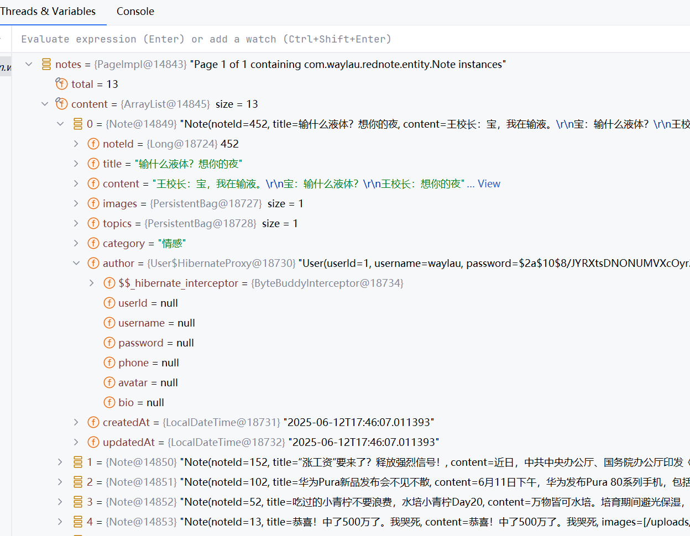


### 解决方案


解决方案有几下几种。

1. 优先使用DTO模式：通过专门的DTO类定义API响应格式，避免直接序列化实体对象
2. 合理设计关联关系：根据业务需求选择合适的加载策略（EAGER/FETCH）
3. 使用@JsonView进行精细控制：在复杂场景中使用Jackson的@JsonView实现选择性序列化
4. 结合性能考虑：懒加载是提高性能的重要手段，但需要配合合理的初始化策略


在本例中，使用的DTO模式。


#### 1. 创建NoteExploreDto

创建NoteExploreDto，代码如下：

```java
package com.example.rednote.dto;

import com.example.rednote.entity.Note;
import lombok.Getter;
import lombok.Setter;

/**
 * NoteExploreDto 笔记探索DTO
 *
 * @version 2025/08/20
 **/
@Getter
@Setter
public class NoteExploreDto {
    private Long noteId;
    private String title;
    /**
     * 封面
     */
    private String cover;
    /**
     * 作者用户名
     */
    private String username;
    /**
     * 作者头像
     */
    private String avatar;

    public static NoteExploreDto toExploreDto(Note note) {
        NoteExploreDto noteExploreDto = new NoteExploreDto();
        noteExploreDto.setNoteId(note.getNoteId());
        noteExploreDto.setTitle(note.getTitle());
        noteExploreDto.setCover(note.getImages().get(0));
        noteExploreDto.setUsername(note.getAuthor().getUsername());
        noteExploreDto.setAvatar(note.getAuthor().getAvatar());

        return noteExploreDto;
    }
}
```

#### 2. 返回DTO类给前端

ExploreController修改如下：


```java
/**
  * 返回首页笔记探索页面的笔记数据
  */
@GetMapping("/note")
public ResponseEntity<NoteResponseDto> getNotesByCategory(
                                                          @RequestParam(defaultValue = "1") int page,
                                                          @RequestParam(required = false) String category) {
    // 把“推荐”当成空
    if (DEFAULT_CATEGORY.equals(category)) {
        category = null;
    }

    Page<Note> notes = noteService.getNotesByPage(page, PAGE_SIZE, category);

    NoteResponseDto notesResponseDto = new NoteResponseDto();
    notesResponseDto.setHasMore(notes.hasNext());
    //notesResponseDto.setNotes(notes.getContent());

    // 处理序列化问题
    List<NoteExploreDto> noteExploreDtoList = new ArrayList<>();
    for (Note note : notes.getContent()) {
        noteExploreDtoList.add(NoteExploreDto.toExploreDto(note));
    }
    notesResponseDto.setNotes(noteExploreDtoList);

    return ResponseEntity.ok(notesResponseDto);
}
```


NoteResponseDto修改如下：

```java
package com.example.rednote.dto;

import com.example.rednote.entity.Note;
import lombok.Getter;
import lombok.Setter;

import java.util.List;

/**
 * NoteResponseDto 探索笔记的响应对象
 *
 * @version 2025/06/13
 **/
@Getter
@Setter
public class NoteResponseDto {
    /**
     * 笔记列表
     */
    // private List<Note> notes;
    private List<NoteExploreDto> notes;

    /**
     * 是否还有更多
     */
    private boolean hasMore;
}
```


通过以上方法，你应该能够解决Jackson序列化Hibernate代理对象的问题，确保API响应能够正确返回笔记数据。


从代码断点调试可以看到DTO对象属性都是有值的，如下图11-2所示。


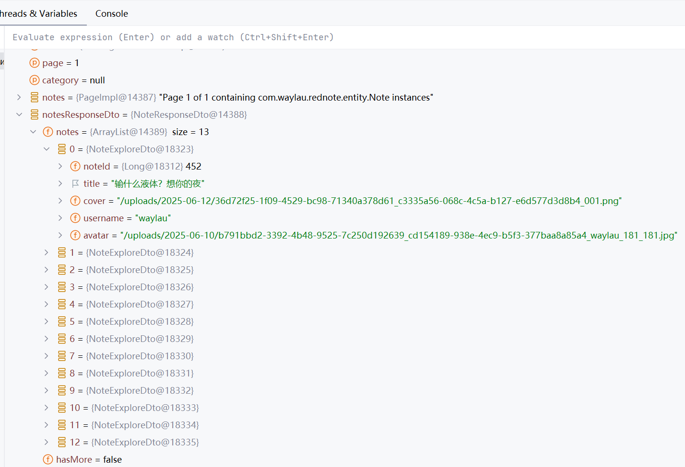


如下图11-3所示的是首次访问首页的效果。


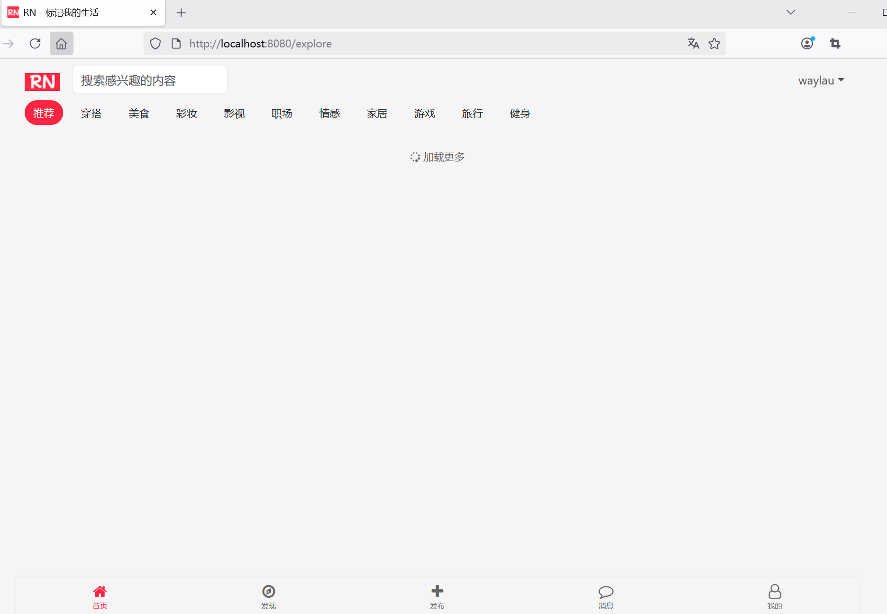


如下图11-4所示的是加载了笔记数据之后的效果。


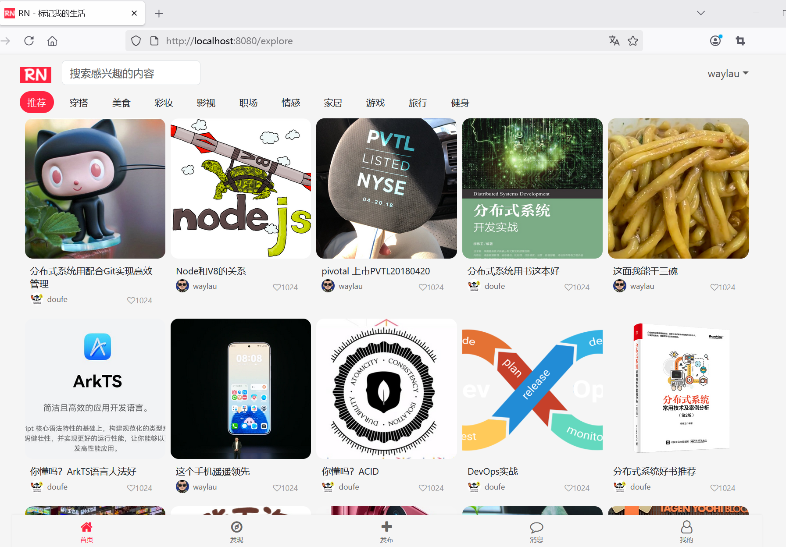


## 11.8 掌握笔记无限滚动刷新的技巧

修改explore.html，在`<script>`增加如下内容：

```js
<script>
    // ...为节约篇幅，此处省略非核心内容
    
    // 监听滚动事件
    window.addEventListener('scroll', function() {
        console.log('scroll');

        if (isLoading || !hasMore) {
            return;
        }

        console.log('scroll before');

        const scrollTop = window.pageYOffset || document.documentElement.scrollTop;
        const windowHeight = window.innerHeight;
        const documentHeight = document.documentElement.scrollHeight;

        console.log('scrollTop: ' + scrollTop);
        console.log('windowHeight: ' + windowHeight);
        console.log('documentHeight: ' + documentHeight);

        if (scrollTop + windowHeight >= documentHeight - 300) {
            loadMoreNotes();
        }

        console.log('scroll after');
    });
</script>
```


如下图11-5所示的是无限滚动刷新，查询完笔记数据之后的效果。


## 11.9 格式化数字展示优化信息传达的效率和用户体验

在数字展示中进行格式化（如将10000显示为1w），本质上是为了优化信息传达的效率和用户体验。这种处理方式并非简单的符号替换，而是基于人类认知规律、场景需求和技术实现的综合考量。以下从多个维度解析其背后的逻辑：


### 一、认知心理学：简化信息处理负荷
1. 短期记忆容量限制  
   人类短期记忆通常只能处理7±2个组块（George Miller的“神奇数字”理论）。例如：
   - 原始数字“1568924”包含7个独立数字，需拆解为“156万8924”或“156.89万”，将信息组块从7个减少到3-4个，降低记忆负担。
   - 对比实验显示：用户识别“3.2k”的速度比“3200”快23%（来源：尼尔森诺曼集团用户体验研究）。

2. 量级感知优先于精确值  
   在许多场景中，用户更关注数字的“量级”而非“精确值”：
   - 社交平台的粉丝数（12.5w vs 125432）：前者能快速传递“十万级”的量级概念。
   - 商品销量（5.8k件 vs 5842件）：消费者更关心“是否畅销”，而非具体差额。


### 二、场景适配：不同场景的显示策略差异
| 场景       | 格式化需求                          | 示例                | 核心目的               |
|----------------|---------------------------------------|-----------------------|--------------------------|
| 社交媒体动态   | 轻量化展示，快速抓取注意力            | 点赞数：2.4w           | 减少视觉干扰，突出互动热度 |
| 金融数据大屏   | 兼顾量级与精度，可能需要动态切换单位   | 市值：1.28万亿（自动切换万亿/亿/万） | 适应不同数据规模的展示   |
| 电商商品列表   | 简洁化展示，避免价格信息碎片化        | 价格：¥1.5k            | 促进购买决策效率         |
| 科学论文图表   | 严格保留精度，使用标准单位（如10³）   | 数据点：1.02×10⁴       | 保证学术严谨性           |


### 三、视觉设计：优化界面信息层级
1. 减少数字长度，提升排版美观  
   - 原始数字：“阅读量1289456”在移动端可能占用2-3行，格式化后“128.9w”仅占1行，节省空间。
   - 案例：小红书笔记列表中，将“收藏数9876”显示为“9.9k”，使卡片布局更紧凑（见下图逻辑示意）：
     ```
     ┌──────────────┐     ┌──────────────┐
     │ 标题          │     │ 标题          │
     │ 正文摘要       │     │ 正文摘要       │
     │ 赞9876 评123  │ →   │ 赞9.9k 评123  │
     └──────────────┘     └──────────────┘
     ```

2. 引导视觉焦点  
   格式化后的数字通过“单位缩写”（如w/k/m）形成视觉区分，使用户更易捕捉关键数据：
   - 未格式化：“粉丝156234，获赞897654”  
   - 格式化：“粉丝15.6w，获赞89.8w”  
   后者通过“w”符号强化量级认知，减少用户对具体数字的关注度。


### 四、技术实现：平衡精度与可读性
1. 动态单位切换策略  
   - 数字 < 1000：显示原值（如568）  
   - 1000 ≤ 数字 < 10000：显示为“X.Xk”（如3.2k）  
   - 10000 ≤ 数字 < 10^8：显示为“X.Xw”（如12.5w）  
   - 10^8 ≤ 数字：显示为“X.X亿”（如1.2亿）  
   （注：不同平台可能有细微差异，如抖音、小红书使用“万”“亿”，而GitHub用“k”“M”）

2. 精度控制算法  
   - 四舍五入：12543 → 1.3w（保留1位小数）  
   - 截断处理：12543 → 1.2w（适用于需要快速显示的场景）  
   - 智能显示：根据数字大小自动调整小数位数：
     - 1024 → 1k（整数）  
     - 1250 → 1.25k（两位小数）  
     - 12345 → 1.23w（两位小数）

3. 国际化适配  
   - 中文环境：10000 → 1万，100000000 → 1亿  
   - 英文环境：1000 → 1k，1000000 → 1M（Million），1000000000 → 1B（Billion）  
   - 日语环境：10000 → 1万，100000000 → 1億  


### 五、反例：何时不应格式化？
1. 需要精确值的场景  
   - 财务报表（金额必须精确到分：¥12345.67）  
   - 科学实验数据（如温度：25.3℃）  
   - 身份证号、订单编号等标识性数字

2. 小数字场景  
   - 数字 < 100：显示原值更直观（如“评论5条”比“0.005w条”更易读）  
   - 例外：某些平台为统一风格，可能仍显示为“0.5k”（如500）

3. 专业领域术语冲突  
   - 计算机领域中“1k”通常指1024（2^10），而日常场景中“1k”=1000，需避免歧义。


### 六、项目里面的应用

定义数字格式化函数：

```javascript
// 数字格式化，自动转换为k、w单位
function numberFormat(num) {
   if (num > 100000) {
      return (num / 10000).toFixed(1) + 'w';
   } else if (num > 1000) {
      return (num / 1000).toFixed(1) + 'k';
   } else {
      return num;
   }
}
```


使用函数：

```js
// 创建笔记卡片元素
function createNoteElement(note) {
   const noteElement = document.createElement("div");
   noteElement.className = "masonry-item";
   noteElement.innerHTML = `
      <div class="note-image-container">
            
      </div>
      <div class="note-content">
            <div class="note-title">${note.title}</div>
            <div class="note-author-stats">
               <div class="note-author">
                  
                  <span class="author-name">${note.username}</span>
               </div>
               <div class="note-stats">
                  <div class="stat-item">
                        <i class="fa fa-heart-o">${numberFormat(1024)}</i>
                  </div>
               </div>
            </div>
      </div>
   `;

   return noteElement;
}
```


如下图11-6所示的是无限滚动刷新，查询完笔记数据之后的效果。


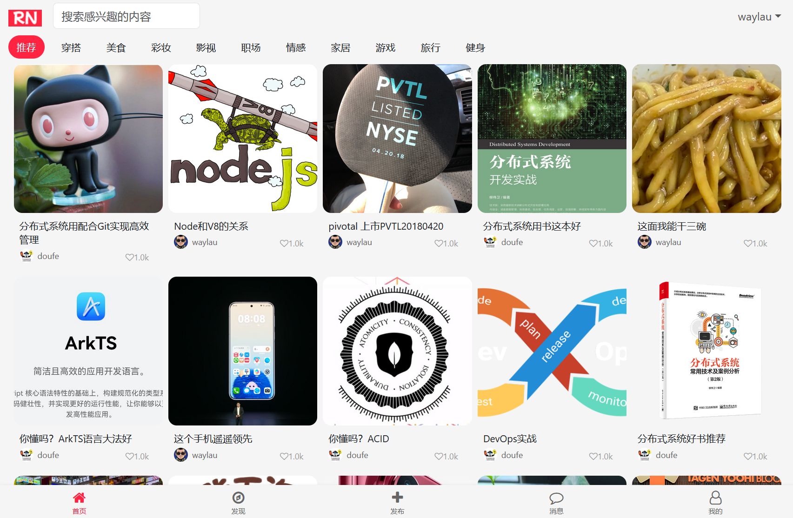


### 总结
数字格式化本质是一种“信息压缩”技术，通过牺牲部分精度来换取更高的传达效率。其核心价值在于：
- 认知层面：符合人类对量级的感知习惯，降低信息处理成本；
- 体验层面：优化界面布局，引导用户关注核心数据；
- 技术层面：通过动态策略平衡不同场景的显示需求。

在实际应用中，需根据业务场景、用户群体和数据特性定制格式化规则，避免因过度简化导致信息失真。


## 11.10 最佳实践总结及扩展建议

### 最佳实践

1. 优先使用DTO模式：通过专门的DTO类定义API响应格式，避免直接序列化实体对象
2. 合理设计关联关系：根据业务需求选择合适的加载策略（EAGER/FETCH）
3. 使用@JsonView进行精细控制：在复杂场景中使用Jackson的@JsonView实现选择性序列化
4. 结合性能考虑：懒加载是提高性能的重要手段，但需要配合合理的初始化策略
5. 格式化数字展示：优化信息传达的效率和用户体验
6. 无限滚动加载：优化了用户体验
7. 适配移动设备和桌面设备：网格布局自动调整


如下图11-7所示的是适配移动设备之后的效果。


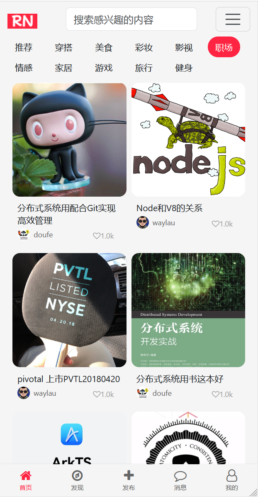


### 扩展建议

1. 个性化推荐：
   - 基于用户兴趣和行为的内容推荐
   - 关注的用户发布的内容优先展示

2. 搜索功能：
   - 实现全文搜索
   - 热门搜索词和搜索历史

3. 内容筛选：
   - 添加更多筛选条件（最新、最热、附近等）

4. 视频内容：
   - 支持视频内容的展示和播放
   - 视频缩略图和播放控制

5. 内容安全：
   - 内容审核机制
   - 敏感内容过滤

6. 性能优化：
   - 图片懒加载
   - 内容预加载
   - 分页数据缓存


## 12.1 首页搜索及瀑布流功能概述

* 首页搜索：在首页搜索框进行关键字搜索
* 从首页跳转到笔记详情页
* 从首页跳转到作者详情页
* 从笔记详情页跳转到作者详情页
* 首页布局：改为瀑布流布局
* 从底部导航栏导航到其他页面


## 12.2 掌握前端搜索功能的核心要点

在网页中实现 `<input>` 搜索功能通常涉及以下几个核心步骤：用户输入监听、搜索逻辑处理、结果展示和交互反馈。以下从前端实现到后端交互的完整流程进行解析，并提供代码示例。


### 前端HTML设置

修改explore.html中搜索框的内容：

```html
<!-- 搜索框-->
<div class="col-md-3">
    <div class="input-group">
        <input class="form-control" type="text" placeholder="搜索感兴趣的内容" aria-label="Search"
                id="searchInput">
        <button class="btn btn-outline-secondary" type="button" id="searchButton">
            搜索
        </button>
    </div>
</div>
```

修改点：

* `<input>`增加了id属性
* 增加了`<button>`

### 搜索触发方式
- 实时获取：使用 `input` 事件监听用户输入，实时获取到搜索内容
- 按钮触发：添加搜索按钮，点击后执行搜索


以下代码实时获取到搜索内容，并缓存在searchContent变量中：

```javascript
// 缓存搜索的内容（确保在loadMoreNotes()执行前声明）
let searchContent = '';

// ...为节约篇幅，此处省略非核心内容

// 获取搜索输入框的值
const searchInput = document.getElementById('searchInput');
searchInput.addEventListener('input', function() {
        searchContent = this.value;
});
```


以下代码当点击搜索按钮时，触发执行搜索：

```javascript
// 搜索按钮执行搜索
document.getElementById('searchButton').addEventListener('click', function() {
    // 获取搜索输入框的值
    searchContent = document.getElementById('searchInput').value;

    // 执行搜索
    performSearch();
});

// 执行搜索
function performSearch() {
    // 重置笔记网格数据
    notesGrid.innerHTML = '';

    // 恢复初始状态值
    currentPage = 0;
    isLoading = false;
    hasMore = true;

    // 加载更多笔记
    loadMoreNotes();
};
```


### 分页导航点击事件处理

将与performSearch()代码逻辑一致的部分，重构为performSearch()。

```js
// 为分页导航添加点击事件
categoryItems.forEach(item => {
    item.addEventListener('click', () => {
        categoryItems.forEach(item => {
            item.classList.remove('active');
        });
        item.classList.add('active');

        // 以下代码重构为performSearch()
        /*
        // 重置笔记网格数据
        notesGrid.innerHTML = '';

        // 恢复初始状态值
        currentPage = 0;
        isLoading = false;
        hasMore = true;
        loadMoreNotes();
        */
        performSearch();

    });
});
```
### 重构loadMoreNotes()

重构loadMoreNotes()函数：

```js
// 加载更多笔记
function loadMoreNotes() {
        if (isLoading || !hasMore) {
            // 隐藏加载更多
            hideLoadMore();
            // 显示没有更多内容
            showNoMoreContent();
            return;
        }

        isLoading = true;
        // 显示加载更多
        showLoadMore();

        // 获取当前分类
        let category = document.querySelector('.category-item.active').textContent.trim();

        // 发送请求
        /*fetch(`/explore/note?page=${currentPage + 1}&category=${category}`)*/
        fetch(`/explore/note?page=${currentPage + 1}&category=${category}&query=${searchContent}`)
        
        // ...为节约篇幅，此处省略非核心内容
}
```


在发送AJAX请求时，传递query参数，值是searchContent。


## 12.3 重构ExploreController处理搜索请求

### 控制器层


修改getNotesByCategory()方法，增加了query参数。

```java
/**
  * 返回首页笔记探索页面的笔记数据
  */
@GetMapping("/note")
public ResponseEntity<NoteResponseDto> getNotesByCategory(
                                                          @RequestParam(defaultValue = "1") int page,
                                                          @RequestParam(required = false) String category,
                                                          @RequestParam(required = false) String query) {
    // 把“推荐”当成空
    if (DEFAULT_CATEGORY.equals(category)) {
        category = null;
    }

    Page<Note> notes = null;

    // 区分是关键字搜索还是分类查询
    if (query == null || query.isEmpty()) {
        notes = noteService.getNotesByPage(page, PAGE_SIZE, category);
    } else {
        notes = noteService.getNotesByPageAndQuery(page, PAGE_SIZE, category, query);
    }


    NoteResponseDto notesResponseDto = new NoteResponseDto();
    notesResponseDto.setHasMore(notes.hasNext());

    // 处理序列化问题
    List<NoteExploreDto> noteExploreDtoList = new ArrayList<>();
    for (Note note : notes.getContent()) {
        noteExploreDtoList.add(NoteExploreDto.toExploreDto(note));
    }
    notesResponseDto.setNotes(noteExploreDtoList);

    return ResponseEntity.ok(notesResponseDto);
}
```

 
如果没有传入query参数值，则执行原有的NoteService.getNotesByPage()方法；否则，执行NoteService.getNotesByPageAndQuery()新方法。


### 服务层

修改NoteService，增加如下接口：

```java
/**
 * 搜索分页查询笔记
 *
 * @param page
 * @param pageSize
 * @param category
 * @param query
 * @return
 */
Page<Note> getNotesByPageAndQuery(int page, int pageSize, String category, String query);
```


修改NoteServiceImpl，增加如下方法：

```java
@Override
public Page<Note> getNotesByPageAndQuery(int page, int pageSize, String category, String query) {
    // 构造Pageable对象，按照创建时间倒序排序
    Pageable pageable = PageRequest.of(page - 1, pageSize, Sort.by("createAt").descending());

    if (category != null && !category.isEmpty() && query != null && !query.isEmpty()) {
        return noteRepository.findByCategoryAndTopicsContaining(category, query, pageable);
    } else if (query != null && !query.isEmpty()) {
        return noteRepository.findByTopicsContaining(query, pageable);
    } else {
        return noteRepository.findAll(pageable);
    }
}
```

如果没有传入category参数值，则执行原有的NoteRepository.findByTopicsContaining()方法；否则，执行NoteRepository.findByCategoryAndTopicsContaining()新方法。


### 仓库层


在 Spring Data JPA 中查询`List<String>`类型的属性需要使用特殊的方法。针对Note实体中的topics属性，新增如下接口：

```java
/**
 * 根据分类和话题标签分页查询笔记
 *
 * @param category
 * @param query
 * @param pageable
 * @return
 */
Page<Note> findByCategoryAndTopicsContaining(String category, String query, Pageable pageable);

/**
 * 根据话题标签分页查询笔记
 *
 * @param query
 * @param pageable
 * @return
 */
Page<Note> findByTopicsContaining(String query, Pageable pageable);
```

### 运行调测


在首页“推荐”分类执行搜素“Java”关键字，效果如下图12-1所示。


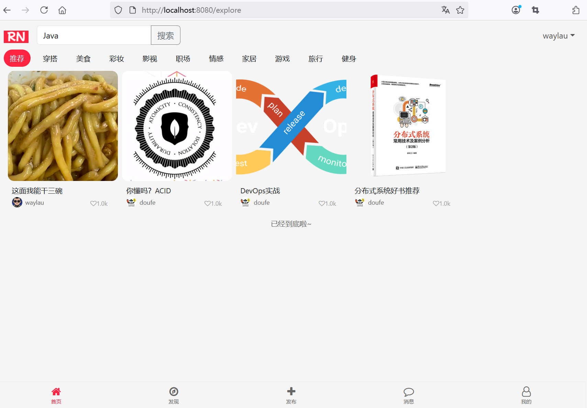


在首页“职场”分类执行搜素“Java”关键字，效果下图12-2所示。


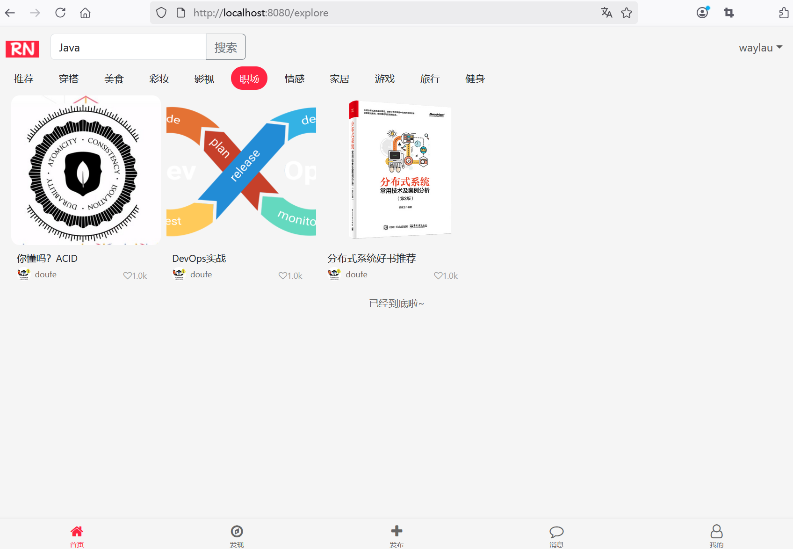


两个搜素结果不一致，说明有些包含“Java”主题的笔记，并不在“职场”分类中。


## 12.4 从首页跳转到笔记详情页

类似于用户详情页的笔记列表的做法，从首页跳转到笔记详情页，只需要在原有的笔记封面``上套一层`<a>`即可。


```js
// 创建笔记卡片元素
function createNoteElement(note) {
    const noteElement = document.createElement("div");
    noteElement.className = "masonry-item";
    noteElement.innerHTML = `
        <div class="note-image-container">
            <!-- 点击跳转到笔记详情页 -->
            <a href="/note/${note.noteId}">
                
            </a>
        </div>
        <div class="note-content">
            <div class="note-title">${note.title}</div>
            <div class="note-author-stats">
                <div class="note-author">
                    
                    <span class="author-name">${note.username}</span>
                </div>
                <div class="note-stats">
                    <div class="stat-item">
                        <i class="fa fa-heart-o">${numberFormat(1024)}</i>
                    </div>
                </div>
            </div>
        </div>
    `;

    return noteElement;
}
```


点击笔记封面，就能跳转到笔记详情页了。


## 12.5 从首页跳转到作者详情页

### 前端修改


点击笔记的作者头像时，我们希望就能跳转到该作者的详情页。实现方式，只需要在作者信息的`<div>`上套一层`<a>`即可。


```js
// 创建笔记卡片元素
function createNoteElement(note) {
    const noteElement = document.createElement("div");
    noteElement.className = "masonry-item";
    noteElement.innerHTML = `
        <div class="note-image-container">
            <!-- 点击跳转到笔记详情页 -->
            <a href="/note/${note.noteId}">
                
            </a>
        </div>
        <div class="note-content">
            <div class="note-title">${note.title}</div>
            <div class="note-author-stats">
                <!-- 点击跳转到用户详情页 -->
                <a href="/user/profile/${note.userId}">
                    <div class="note-author">
                        
                        <span class="author-name">${note.username}</span>
                    </div>
                </a>
                
                <div class="note-stats">
                    <div class="stat-item">
                        <i class="fa fa-heart-o">${numberFormat(1024)}</i>
                    </div>
                </div>
            </div>
        </div>
    `;

    return noteElement;
}
```


跳转到`/user/profile`页面需要传递用户ID，显然当前的note对象DTO里面并没有这个属性，因此需要做进一步的扩展。


### 扩展NoteExploreDto


```java
/**
 * 作者用户ID
 */
private Long userId;

public static NoteExploreDto toExploreDto(Note note) {
    NoteExploreDto noteExploreDto = new NoteExploreDto();
    noteExploreDto.setNoteId(note.getNoteId());
    noteExploreDto.setTitle(note.getTitle());
    noteExploreDto.setCover(note.getImages().get(0));
    noteExploreDto.setUsername(note.getAuthor().getUsername());
    noteExploreDto.setAvatar(note.getAuthor().getAvatar());
    noteExploreDto.setUserId(note.getAuthor().getUserId());

    return noteExploreDto;
}
```


### 运行调测


运行应用，效果如下图12-3所示，跳转逻辑没有问题，只是用户名下面有条下划线不是太美观。


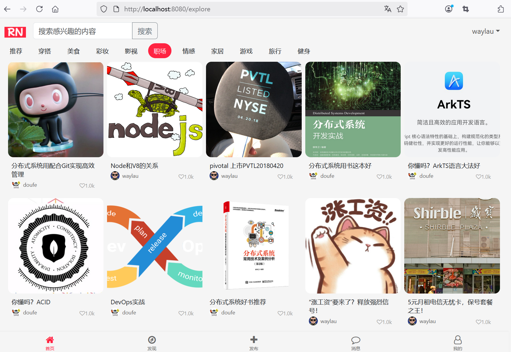


去除`<a>`标签的下划线，只需要加个CSS样式：

```html
<style>
/* 去掉下划线 */
a {
    text-decoration: none;
}
</style>
```


去除用户名下面下划线的效果如下图12-4所示。


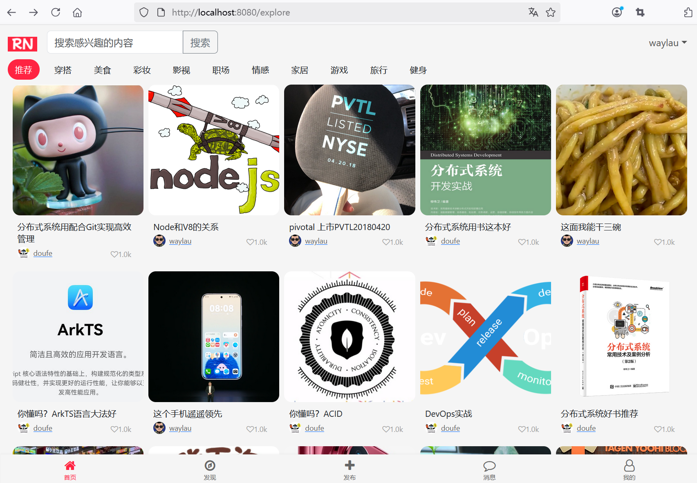


## 12.6 实现从笔记详情页跳转到作者详情页

类似上一节的做法，也可以在笔记详情页作者信息区域，设置点击跳转到作者的详情页。


### 加个CSS样式


修改note-detail.html。

去除`<a>`标签的下划线，只需要加个CSS样式：

```html
<style>
/* 去掉下划线 */
a {
    text-decoration: none;
}
</style>
```


### 前端修改


点击笔记的作者头像时，我们希望就能跳转到该作者的详情页。实现方式，只需要在作者头像上的``上套一层`<a>`即可。


```html
<!-- 作者信息 -->
<div class="author-info">
    <!-- 点击作者头像跳转到作者详情页 -->
    <a th:href="@{/user/profile/{userId}(userId=${note.author.userId})}">
        
    </a>

    <div>
        <div class="author-name" th:text="${note.author.username}">
            user
        </div>
        <div class="author-meta">
            已获得 1024 粉丝
        </div>
    </div>
    <div class="author-follow" th:if="${#authentication.name != note.author.username}">
        + 关注
    </div>
</div>
```


### 运行调测


运行应用，作者头像效果如下图12-6所示。


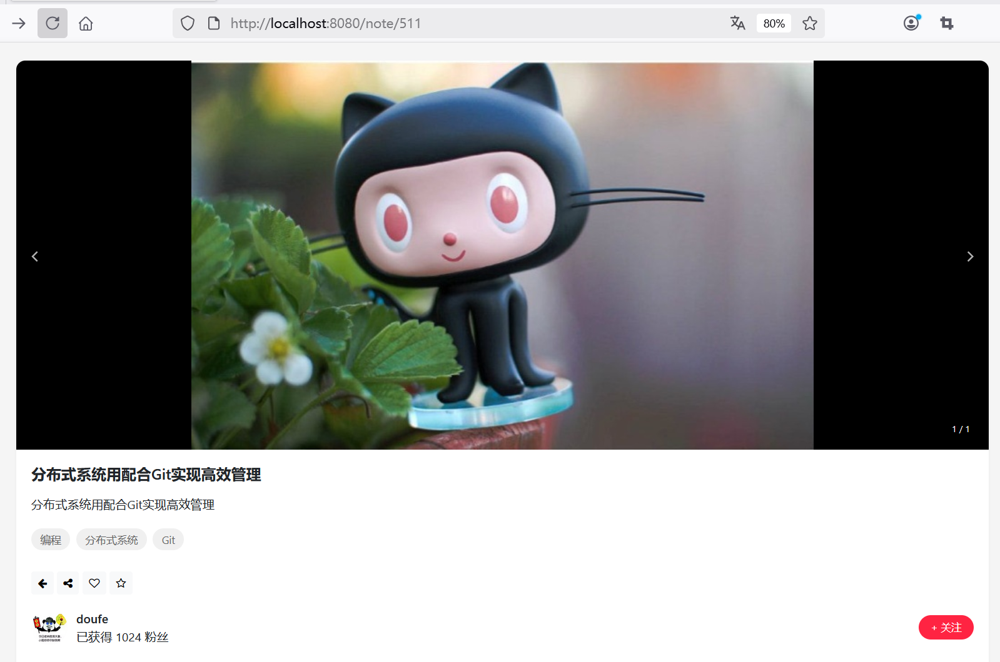


点击作者头像就可以跳转到作者的详情页了，效果如下图12-7所示。


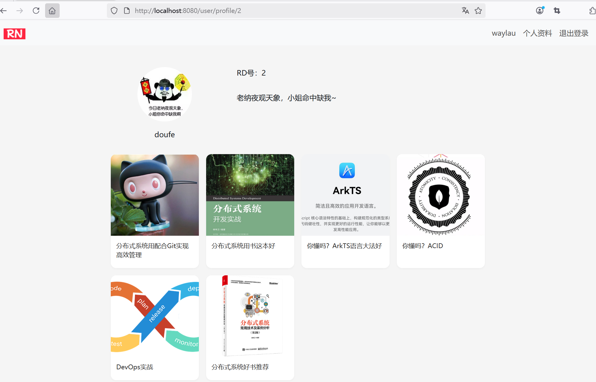


## 12.7 设计瀑布流布局实现方案

瀑布流布局是小红书等内容平台常用的设计方式，它可以根据内容高度自动调整位置，形成错落有致的视觉效果，提升用户浏览体验。


### 瀑布流布局的优势与特点

1. 视觉优势：
   - 错落有致的布局，提升视觉吸引力
   - 充分利用空间，减少空白区域
   - 适应不同高度的内容，保持整体和谐

2. 用户体验：
   - 浏览体验更自然，减少频繁滚动
   - 内容呈现更有层次感，突出重点
   - 增加内容曝光机会，提高参与度

3. 响应式设计：
   - 移动端使用1列或者2列布局
   - 平板使用3列布局
   - 桌面端使用4列布局


### CSS样式


修改explore.html增加如下样式：

```css
/* 瀑布流布局 */
.masonry {
    column-count: 4;
    column-gap: 1em;
    padding: 10;
}
.masonry-item {
    display: inline-block;
    margin: 0 0 1.5em;
    width: 100%;
}

.masonry-note-image {
    border-radius: 12px;
    width: 100%;
    height: auto;
}

@media only screen and (max-width: 320px) {
    .masonry {
        column-count: 1;
    }
}

@media only screen and (min-width: 321px) and (max-width: 768px){
    .masonry {
        column-count: 2;
    }
}
@media only screen and (min-width: 769px) and (max-width: 1200px){
    .masonry {
        column-count: 3;
    }
}
@media only screen and (min-width: 1201px) {
    .masonry {
        column-count: 4;
    }
}
```


### HTML应用样式

```html
<!-- 笔记卡片网格 -->
<!--<div class="notes-grid" id="notesGrid">-->
<div class="masonry" id="notesGrid">
    <!-- 笔记卡片是通过JavaScript动态生成 -->
</div>
```

### 创建笔记元素应用样式

```html
// 创建笔记卡片元素
function createNoteElement(note) {
    const noteElement = document.createElement("div");
    noteElement.className = "masonry-item";
    noteElement.innerHTML = `
        <!--<div class="note-image-container">-->
            <!-- 点击跳转到笔记详情页 -->
            <a href="/note/${note.noteId}">
                <!---->
                
            </a>
        <!--</div>-->

        <!-- ...为节约篇幅，此处省略非核心内容 -->
 
    `;

    return noteElement;
}
```

在`img`上增加masonry-note-image类型样式，同时去除note-image-container类型的`div`。


### 瀑布流布局演示

下面是将小红书首页笔记卡片改为瀑布流布局的效果演示方案。

大尺寸设备效果如下图12-8所示。


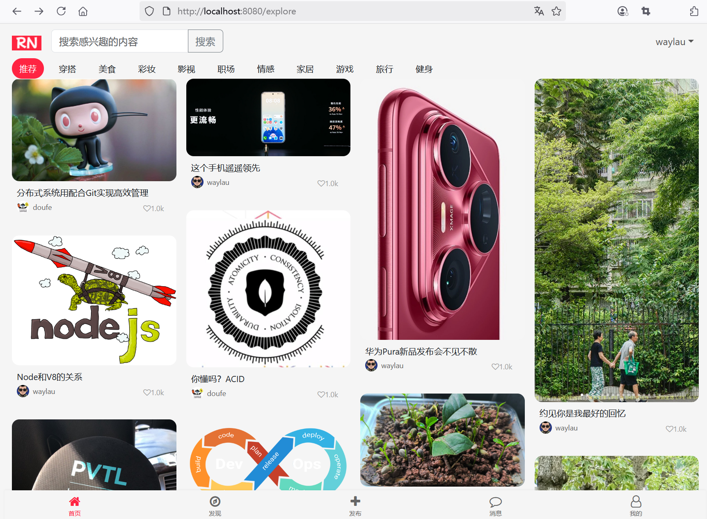


中等尺寸设备效果如下图12-9所示。


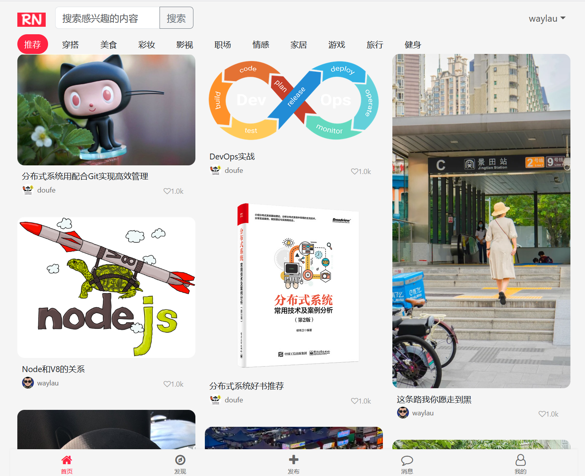


小尺寸设备效果如下图12-10所示。


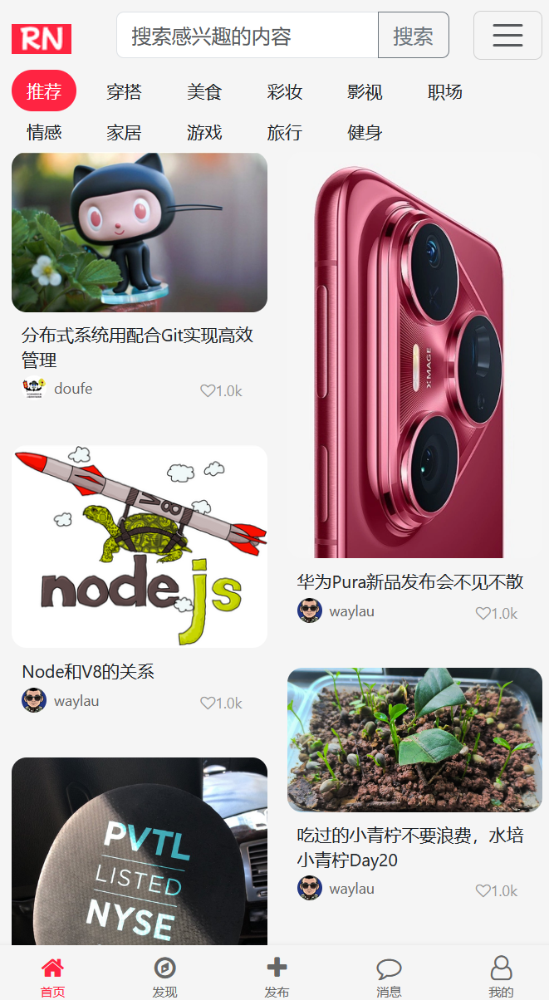


通过以上实现，你可以将小红书首页的笔记卡片从传统网格布局改为瀑布流布局，提升用户体验和内容展示效果。


## 12.8 从底部导航栏导航到其他页面

修改explore.html，实现从底部导航栏导航到其他页面的功能。


### 底部导航栏设置点击事件

```html
<!-- 底部导航栏 -->
<div class="container bottom-nav">
    <div class="nav-item active" onclick="navigateTo('home')">
        <i class="fa fa-home nav-icon"></i>
        <span class="nav-text">首页</span>
    </div>
    <div class="nav-item" onclick="navigateTo('discover')">
        <i class="fa fa-compass nav-icon"></i>
        <span class="nav-text">发现</span>
    </div>
    <div class="nav-item" onclick="navigateTo('publish')">
        <i class="fa fa-plus nav-icon"></i>
        <span class="nav-text">发布</span>
    </div>
    <div class="nav-item" onclick="navigateTo('message')">
        <i class="fa fa-comment-o nav-icon"></i>
        <span class="nav-text">消息</span>
    </div>
    <div class="nav-item" onclick="navigateTo('profile')">
        <i class="fa fa-user-o nav-icon"></i>
        <span class="nav-text">我的</span>
    </div>
</div>
```


### 添加JS脚本处理导航

```js
// 导航函数
function navigateTo(page) {
    console.log('navigateTo: ' + page);

    if (page === 'home') {
        window.location.href = '/';
    } else if (page === 'publish') {
        window.location.href = '/note/publish';
    } else if (page === 'profile') {
        window.location.href = '/user/profile';
    } else {
        // 待实现的功能页面
        alert('暂未开放，敬请期待！');

        return;
    }
}
```


当点击暂未开放的功能时，比如“消息”，提示框效果如下图12-11所示。


## 12.9 搜索功能的扩展与进阶及笔记卡片展示的优化建议

### 搜索功能的扩展与进阶

#### 1. 全文搜索引擎
- Elasticsearch：适用于大规模数据的高性能搜索
  ```java
  // Elasticsearch 查询示例
  @Autowired
  private RestHighLevelClient client;
  
  public List<Note> elasticSearch(String query) throws IOException {
      SearchRequest searchRequest = new SearchRequest("notes");
      SearchSourceBuilder sourceBuilder = new SearchSourceBuilder();
      
      QueryBuilder matchQuery = QueryBuilders.multiMatchQuery(query, "title", "content");
      sourceBuilder.query(matchQuery);
      searchRequest.source(sourceBuilder);
      
      SearchResponse response = client.search(searchRequest, RequestOptions.DEFAULT);
      // 处理结果...
  }
  ```

#### 2. 模糊搜索与纠错
- 使用 Levenshtein 距离实现拼写检查
- 配置 Elasticsearch 的 fuzzy 查询

#### 3. 搜索分析与优化
- 记录搜索日志，分析热门关键词和失败搜索
- 使用 A/B 测试优化搜索结果排序算法


### 总结
实现一个高效的搜索功能需要综合考虑：
1. 前端交互：选择合适的触发方式，优化用户输入体验
2. 性能优化：应用防抖、缓存等技术减少不必要的请求
3. 后端处理：从简单的数据库查询到复杂的全文搜索
4. 用户体验：加载状态、空结果处理、搜索建议等细节

通过合理设计和技术选型，可以构建出既满足功能需求又具有良好用户体验的搜索系统。


### 首页笔记卡片展示的优化建议

1. 图片懒加载：
   ```javascript
   // 使用Intersection Observer实现图片懒加载
   const observer = new IntersectionObserver((entries) => {
       entries.forEach(entry => {
           if (entry.isIntersecting) {
               const img = entry.target;
               img.src = img.dataset.src;
               observer.unobserve(img);
           }
       });
   });
   
   document.querySelectorAll('img[data-src]').forEach(img => {
       observer.observe(img);
   });
   ```

2. 性能优化：
   - 限制同时加载的图片数量
   - 使用虚拟滚动技术处理大量数据
   - 图片使用WebP格式，减小文件大小

3. 动态加载内容：
   - 实现无限滚动，减少初始加载量
   - 根据用户兴趣预加载内容
   - 实现骨架屏占位，提升感知性能


## 13.1 点赞模块功能概述

在原有的小红书项目基础上实现点赞功能，需要从数据库设计、后端API、前端交互三个层面进行改造。

下面是完整的实现方案：

* 点赞/取消点赞
* 获取笔记的点赞状态
* 获取笔记的点赞数


通过以上实现，你可以在原有的小红书项目中完整实现点赞功能，包括点赞状态切换、点赞数统计和用户交互反馈。


## 13.2 点赞功能的数据库设计，掌握JPA关联映射

### 设计实体

首先需要添加点赞相关的实体和关系，新建点赞实体Like.java如下：

```java
package com.example.rednote.entity;

import jakarta.persistence.*;
import lombok.AllArgsConstructor;
import lombok.Data;
import lombok.NoArgsConstructor;

import java.time.LocalDateTime;

/**
 * Like 点赞实体
 *
 * @version 2025/06/15
 **/
@Entity
@Table(name = "t_like")
@Data // @Data集合了 @ToString， @EqualsAndHashCode，所有字段的 @Getter和所有非final字段的 @Setter, @RequiredArgsConstructor
@NoArgsConstructor // 无参构造器
@AllArgsConstructor // 包含所有参数的构造器
public class Like {
    @Id
    @GeneratedValue(strategy = GenerationType.AUTO)
    private Long likeId;

    @ManyToOne(fetch = FetchType.LAZY)
    @JoinColumn(name = "user_id", nullable = false)
    private User user;

    @ManyToOne(fetch = FetchType.LAZY)
    @JoinColumn(name = "note_id", nullable = false)
    private Note note;

    @Column(updatable = false)
    private LocalDateTime createdAt = LocalDateTime.now();

}
```

在Note实体中添加反向关联：

```java
@Entity
@Table(name = "t_note")
@Data // @Data集合了 @ToString， @EqualsAndHashCode，所有字段的 @Getter和所有非final字段的 @Setter, @RequiredArgsConstructor
@NoArgsConstructor // 无参构造器
@AllArgsConstructor // 包含所有参数的构造器
public class Note {

    // ...为节约篇幅，此处省略非核心内容
    
    @OneToMany(mappedBy = "note", cascade = CascadeType.REMOVE)
    private List<Like> likes = new ArrayList<>();

    // 计算点赞数的Transient字段
    @Transient
    public long getLikeCount() {
        return likes.size();
    }
    // 判断当前用户是否已点赞
    @Transient
    public boolean isLikedByUser(Long userId) {
        if (userId == null) {
            return false;
        }
        return likes.stream().anyMatch(like -> like.getUser().getUserId().equals(userId));
    }
}
```


### JPA 关联映射解析：@OneToMany(mappedBy = "note", cascade = CascadeType.REMOVE)

这句代码是 JPA（Java Persistence API）中定义一对多关联关系的核心注解，主要用于建立实体间的双向关联。让我们从多个维度深入解析其含义和作用。

`@OneToMany(mappedBy = "note", cascade = CascadeType.REMOVE)` 这行代码的核心作用是：

1. 建立双向关联：让`Note`和`Like`实体能够互相引用
2. 定义级联行为：删除笔记时自动清理相关点赞记录
3. 优化数据模型：避免数据库中冗余的关联字段

基本概念如下：

#### 1. @OneToMany 注解
- 语义：表示一个`Note`（笔记）实体可以关联多个`Like`（点赞）实体
- 关系方向：定义在“一”方（Note），映射到“多”方（Like）
- 默认FetchType：`LAZY`（延迟加载），即访问`note.getLikes()`时才查询数据库

#### 2. mappedBy 属性
- 作用：指定双向关联的反向端字段
- 原理：关联关系的控制权在`Like`实体的`note`字段上，`Note`实体仅作为反向映射
- 避免冗余：防止 JPA 在数据库中生成两个关联字段（如`note_id`和`like_note_id`）

#### 3. cascade = CascadeType.REMOVE
- 级联操作：当删除`Note`时，自动删除所有关联的`Like`记录
- 避免孤儿数据：防止删除笔记后，点赞记录仍然存在于数据库中
- 其他可选值：
  - `ALL`：所有操作都级联（PERSIST、MERGE、REMOVE 等）
  - `PERSIST`：级联持久化（保存父实体时自动保存子实体）
  - `MERGE`：级联合并（更新父实体时自动更新子实体）


### 常见问题与最佳实践

#### 1. 双向关联维护
- 必须同时设置双方引用：
  ```java
  // 正确方式
  Note note = new Note();
  Like like = new Like();
  
  note.getLikes().add(like); // 设置正向关联
  like.setNote(note);        // 设置反向关联
  ```

#### 2. 避免循环引用
- JSON序列化问题：双向关联可能导致无限递归
- 解决方案：
  - 使用`@JsonIgnore`或`@JsonBackReference`注解
  - 定义 DTO 层，选择性序列化需要的字段

#### 3. 替代关联方式
- 单向关联：如果只需要从`Like`访问`Note`，可以省略`Note.likes`字段
- 多对多关联：如果需要更灵活的关系管理（如用户与笔记的收藏关系），可以使用`@ManyToMany`


### 与其他关联注解对比

| 注解         | 关系类型 | 控制权       | 典型场景                     |
|------------------|--------------|------------------|----------------------------------|
| `@OneToMany`     | 一对多       | 在多的一端       | 笔记与点赞、订单与订单项         |
| `@ManyToOne`     | 多对一       | 在多的一端       | 评论与用户、订单与客户           |
| `@OneToOne`      | 一对一       | 通常在主实体     | 用户与用户详情、订单与支付记录   |
| `@ManyToMany`    | 多对多       | 通过中间表       | 用户与角色、学生与课程           |


在实际应用中，需要根据业务场景权衡级联操作的范围，处理好双向关联的维护，并注意可能出现的性能问题。通过合理使用 JPA 关联注解，可以构建出高效、健壮的实体关系模型。


### `@Transient`字段的用意

在Java开发中，`@Transient`字段是一个重要的注解，主要用于ORM（对象关系映射）框架（如Hibernate、MyBatis等）中，指示该字段不需要映射到数据库表中。下面从多个方面详细解析其用意和应用场景：


#### 核心作用：控制字段与数据库的映射关系

`@Transient`的核心功能是阻止字段被映射到数据库表，即：
- 该字段不会在数据库表中生成对应的列；
- 数据库查询结果也不会填充该字段的值。


#### 具体应用场景

1. 临时计算字段（非持久化数据）
- 字段值由其他字段计算或拼接而来，无需存储到数据库。
- 例：用户的全名（`fullName`）由`firstName`和`lastName`组合而成。

2. 缓存或临时状态字段
- 用于存储对象在运行时的临时状态（如缓存数据、权限标记等），无需持久化。

```java
@Transient
private boolean isAdmin; // 运行时根据权限判断，无需存入数据库
```

3. 避免敏感数据存储
- 防止敏感信息（如密码明文、临时令牌）被误存入数据库。

```java
@Transient
private String temporaryToken; // 临时令牌，不存入数据库
```

4. 优化性能（减少数据库列）
- 当对象包含大量无需持久化的字段时，使用`@Transient`可减少数据库表的列数，提升查询性能。


#### 总结

`@Transient`的核心价值在于分离业务对象与数据库表的映射关系，使实体类能更灵活地处理临时数据、计算字段或敏感信息，同时优化数据库设计和系统性能。在使用时需根据具体框架选择合适的注解，并注意字段的生命周期和序列化问题。


## 13.3 实现LikeRepository处理点赞数据的存储

```java
package com.example.rednote.repository;

import com.example.rednote.entity.Like;
import org.springframework.data.repository.Repository;

import java.util.Optional;

/**
 * LikeRepository 点赞资源库
 *
 * @version 2025/08/21
 **/
public interface LikeRepository extends Repository<Like, Long> {

    Like save(Like like);

    void delete(Like like);

    Optional<Like> findByUserUserIdAndNoteNoteId(Long userId, Long noteId);

    long countByNoteNoteId(Long noteId);
}
```


## 13.4 点赞服务的核心设计要领

### 点赞服务接口
```java
package com.example.rednote.service;

import com.example.rednote.entity.User;

/**
 * LikeService 点赞服务
 *
 * @version 2025/08/21
 **/
public interface LikeService {
    /**
     * 点赞\取消点赞
     *
     * @param noteId
     * @param user
     * @return
     */
    boolean toggleLike(Long noteId, User user);

    /**
     * 获取笔记的点赞数
     *
     * @param noteId
     * @return
     */
    long getLikeCount(Long noteId);
}
```

### 点赞服务实现

```java
package com.example.rednote.service.impl;

import com.example.rednote.entity.Like;
import com.example.rednote.entity.Note;
import com.example.rednote.entity.User;
import com.example.rednote.exception.NoteNotFoundException;
import com.example.rednote.repository.LikeRepository;
import com.example.rednote.repository.NoteRepository;
import com.example.rednote.service.LikeService;
import com.example.rednote.service.NoteService;
import com.example.rednote.service.UserService;
import org.springframework.beans.factory.annotation.Autowired;
import org.springframework.stereotype.Service;

import java.util.Optional;

/**
 * LikeServiceImpl 点赞服务
 *
 * @version 2025/08/21
 **/
@Service
public class LikeServiceImpl implements LikeService {

    @Autowired
    private NoteService noteService;

    @Autowired
    private LikeRepository likeRepository;

    @Override
    public boolean toggleLike(Long noteId, User user) {
        // 判断笔记是否存在
        Optional<Note> optionalNote = noteService.findNoteById(noteId);
        if (!optionalNote.isPresent()) {
            throw new NoteNotFoundException("");
        }

        // 查询用户是否已点赞
        Optional<Like> optionalLike = likeRepository.findByUserUserIdAndNoteNoteId(user.getUserId(), noteId);
        if (optionalLike.isPresent()) {
            // 已点赞，取消点赞
            likeRepository.delete(optionalLike.get());
            return false;
        } else {
            // 未点赞，添加点赞
            Like like = new Like();
            like.setUser(user);
            like.setNote(optionalNote.get());

            likeRepository.save(like);
            return true;
        }
    }

    @Override
    public long getLikeCount(Long noteId) {
        return likeRepository.countByNoteNoteId(noteId);
    }
}
```


## 13.5 Spring MVC控制器来处理点赞请求及安全配置要点

### 点赞控制器层

```java
package com.example.rednote.controller;

import com.example.rednote.dto.LikeResponseDto;
import com.example.rednote.entity.User;
import com.example.rednote.service.LikeService;
import com.example.rednote.service.UserService;
import org.springframework.beans.factory.annotation.Autowired;
import org.springframework.http.ResponseEntity;
import org.springframework.stereotype.Controller;
import org.springframework.web.bind.annotation.PathVariable;
import org.springframework.web.bind.annotation.PostMapping;
import org.springframework.web.bind.annotation.RequestMapping;

/**
 * LikeController 点赞控制器
 *
 * @version 2025/08/21
 **/
@Controller
@RequestMapping("/like")
public class LikeController {
    @Autowired
    private LikeService likeService;

    @Autowired
    private UserService userService;

    /**
     * 处理点赞、取消点赞请求
     *
     * @param noteId
     * @return
     */
    @PostMapping("/{noteId}")
    public ResponseEntity<LikeResponseDto> toggleLike(@PathVariable Long noteId) {
        User currentUser = userService.getCurrentUser();

        boolean isLiked = likeService.toggleLike(noteId, currentUser);
        long likeCount = likeService.getLikeCount(noteId);

        return ResponseEntity.ok(new LikeResponseDto(isLiked, likeCount));
    }
}
```

### DTO


```java
package com.example.rednote.dto;

import lombok.AllArgsConstructor;
import lombok.Getter;
import lombok.Setter;

/**
 * LikeResponseDto 点赞响应对象
 *
 * @version 2025/08/21
 **/
@Getter
@Setter
@AllArgsConstructor
public class LikeResponseDto {
    /**
     * 是否点赞
     */
    private boolean isLiked;

    /**
     * 点赞数量
     */
    private long likeCount;
}
```


修改NoteExploreDto：

```java
/**
    * 是否（被当前用户）点赞
    */
private boolean isLiked;

/**
    * 点赞量
    */
private long likeCount;

/*public static NoteExploreDto toExploreDto(Note note) {
    NoteExploreDto dto = new NoteExploreDto();
    dto.noteId = note.getNoteId();
    dto.title = note.getTitle();
    dto.cover = note.getImages().get(0);
    dto.username = note.getAuthor().getUsername();
    dto.avatar = note.getAuthor().getAvatar();
    dto.userId = note.getAuthor().getUserId();

    return dto;
}*/

public static NoteExploreDto toExploreDto(Note note, User user) {
    NoteExploreDto dto = new NoteExploreDto();
    dto.noteId = note.getNoteId();
    dto.title = note.getTitle();
    dto.cover = note.getImages().get(0);
    dto.username = note.getAuthor().getUsername();
    dto.avatar = note.getAuthor().getAvatar();
    dto.userId = note.getAuthor().getUserId();
    dto.likeCount = note.getLikeCount();
    dto.isLiked = note.isLikedByUser(user.getUserId());

    return dto;
}
```

其中，toExploreDto() 方法增加了User对象。


### 修改ExploreController


```java
@Autowired
private UserService userService;

@GetMapping("/note")
public ResponseEntity<NoteResponseDto> getNotesByCategory(@RequestParam(defaultValue = "1") int page,
                                                              @RequestParam(required = false) String category,
                                                              @RequestParam(required = false) String query) {
        // 注意：把分类“推荐”当成null
        if (DEFAULT_CATEGORY.equals(category)) {
            category = null;
        }

        // 分页查询笔记
        Page<Note> notes = null;
        // 判定query是否为空
        if (query != null && query.trim().length() > 0) {
            notes = noteService.getNotesByPageAndQuery(page, PAGE_SIZE, category, query);
        } else {
            notes = noteService.getNotesByPage(page, PAGE_SIZE, category);
        }

        NoteResponseDto noteResponseDto = new NoteResponseDto();
        /*noteResponseDto.setNotes(notes.getContent());*/
        noteResponseDto.setHasMore(notes.hasNext());

        User user = userService.getCurrentUser();

        // 处理序列化问题
        List<NoteExploreDto> noteExploreDtoLst = new ArrayList<>();
        for (Note note : notes.getContent()) {
            /*noteExploreDtoLst.add(NoteExploreDto.toExploreDto(note));*/
            noteExploreDtoLst.add(NoteExploreDto.toExploreDto(note, user));
        }
        noteResponseDto.setNotes(noteExploreDtoLst);

        return ResponseEntity.ok(noteResponseDto);
    }
}
```

获取当前用户，并赋值给NoteExploreDto.toExploreDto() 方法。


### 安全配置


1. 在 Spring Security 配置类中，进一步细化点赞API的访问权限
2. 确保只有普通用户角色可以访问点赞API


修改WebSecurityConfig如下：


```java
@Bean
public SecurityFilterChain filterChain(HttpSecurity http) throws Exception {
    http
            // ...为节约篇幅，此处省略非核心内容    
            .authorizeHttpRequests(authorize -> authorize
                    // ...为节约篇幅，此处省略非核心内容

                    // 允许USER角色的用户访问 /like/** 的资源
                    .requestMatchers("/like/**").hasRole("USER")
                    // 其他请求需要认证
                    .anyRequest().authenticated()
            )

 
    ;

    return http.build();
}            
```


修改explore.html设置并获取 CSRF 令牌：

```html
<!-- 确保有一个meta标签来存储CSRF令牌 -->
<meta name="_csrf" th:content="${_csrf.token}"></meta>
```


## 13.6 掌握无刷新更新点赞前端设计的核心要点，精通data属性用法

### 前端实现


修改explore.html中内容。

#### 1. 添加点赞按钮样式

```css
/* 点赞按钮样式 */
.liked {
    color: #ff2442;
}

.like-btn {
    cursor: pointer;
}
```


#### 2. 添加点赞状态显示及按钮事件

在笔记卡片中添加点赞按钮：

```html
// 创建笔记卡片元素
function createNoteElement(note) {
    // 判定笔记是否点赞，来设置点赞图标的样式
    let likeIconClass = note.liked ? "fa fa-heart like-btn liked" : "fa fa-heart-o like-btn";

    const noteElement = document.createElement("div");
    noteElement.className = "masonry-item";
    noteElement.innerHTML = `
        <!--<div class="note-image-container">-->
            <!-- 点击跳转到笔记详情页 -->
            <a href="/note/${note.noteId}">
                <!---->
                
            </a>
        <!--</div>-->
        <div class="note-content">
            <div class="note-title">${note.title}</div>
            <div class="note-author-stats">
                <!-- 点击跳转到用户详情页 -->
                <a href="/user/profile/${note.userId}">
                    <div class="note-author">
                        
                        <span class="author-name">${note.username}</span>
                    </div>
                </a>

                <div class="note-stats">
                    <div class="stat-item">
                        <!--<i class="fa fa-heart-o">${numberFormat(1024)}</i>-->
                        <i class="${likeIconClass}" data-node-id="${note.noteId}"
                            onclick="handleLike(this)">${numberFormat(note.likeCount)}</i>
                    </div>
                </div>
            </div>
        </div>
    `;

    return noteElement;
}
```


点赞按钮的样式变量className，其值是根据是否点赞而动态设置。


#### 3. 实现点赞交互

```javascript
// 点赞按钮的点击事件处理函数
function handleLike(element) {
    // 从data-*获取笔记ID
    const noteId = element.dataset.nodeId;

    // 禁用按钮放置重复点击
    element.disabled = true;

    // 发送请求
    fetch(`/like/${noteId}`, {
        method: 'POST',
        // 添加请求头, 用于Spring Security CSRF
        headers: {
            'X-CSRF-TOKEN': document.querySelector('meta[name="_csrf"]').getAttribute('content')
        }
    })
    .then(response => response.json())
    .then(data => {
        if (data.liked) {
            // 设置按钮为点赞样式
            element.classList.remove('fa-heart-o');
            element.classList.add('fa-heart');
            element.classList.add('liked');
        } else {
            // 恢复按钮为未点赞样式
            element.classList.remove('fa-heart');
            element.classList.remove('liked');
            element.classList.add('fa-heart-o');
        }

        // 点赞量显示处理
        element.textContent = numberFormat(data.likeCount);
    })
    .catch(error => {
        console.error('Error:', error);
        alert('点赞失败，请稍后再试');
    });

    // 启用按钮
    element.disabled = false;
}
```

### Thymeleaf 中的 `th:data-*` 属性详解

`th:data-note-id` 是 Thymeleaf 模板引擎中的数据属性绑定语法，用于将后端数据注入到 HTML 元素的 `data-*` 属性中。这类属性主要用于存储页面的自定义数据，便于 JavaScript 读取和操作。


#### 1. 基础语法
- `th:data-*` 是 Thymeleaf 的标准属性处理器
- `*` 部分会被转换为 HTML 中的 `data-*` 属性
- 例如：`th:data-note-id="${note.id}"` → `<div data-note-id="123">`

#### 2. 核心作用
- 数据传递：将服务器端数据（如 Java 对象的属性）传递到前端
- DOM 与数据解耦：避免直接在 JavaScript 中硬编码数据
- 增强交互性：为前端事件处理提供必要的上下文信息


#### 3. 其他 Thymeleaf 属性的对比

| Thymeleaf 属性 | 作用                               | 应用场景                     |
|--------------------|----------------------------------------|----------------------------------|
| `th:text`          | 设置元素的文本内容                     | 显示标题、描述等文本信息         |
| `th:value`         | 设置表单元素的值                       | 填充输入框、下拉框初始值         |
| `th:attr`          | 通用属性设置                           | 设置非标准属性（如 `aria-*`）    |
| `th:data-*`        | 设置 HTML5 的 `data-*` 自定义数据属性  | 为 JavaScript 提供数据上下文     |


#### 4. JavaScript 中获取 data-* 属性的方法

1. 标准方式（dataset 属性）

```javascript
const element = document.querySelector('.like-btn');
const noteId = element.dataset.noteId; // 推荐方式
```

2. 传统方式（getAttribute）

```javascript
const noteId = element.getAttribute('data-note-id');
```

3. 批量获取所有 data-* 属性

```javascript
const allData = element.dataset; // 返回 DOMStringMap 对象
// 例如 data-note-id="123" 会变成 allData.noteId === "123"
```

#### 5. 总结

`th:data-note-id` 是 Thymeleaf 中用于将后端数据注入到 HTML 元素的 `data-note-id` 属性的语法。其核心价值在于：

1. 数据传递：实现服务器端数据与前端 DOM 的绑定
2. 事件驱动：为 JavaScript 事件处理提供必要的上下文
3. 解耦设计：避免在 JavaScript 中硬编码数据 ID，提高代码可维护性

在实际项目中，合理使用 `data-*` 属性可以简化前端与后端的数据交互流程，特别是在传统的服务端渲染项目中尤为实用。


### 运行调测


在首页查看笔记未点赞时效果，如下图13-1所示。


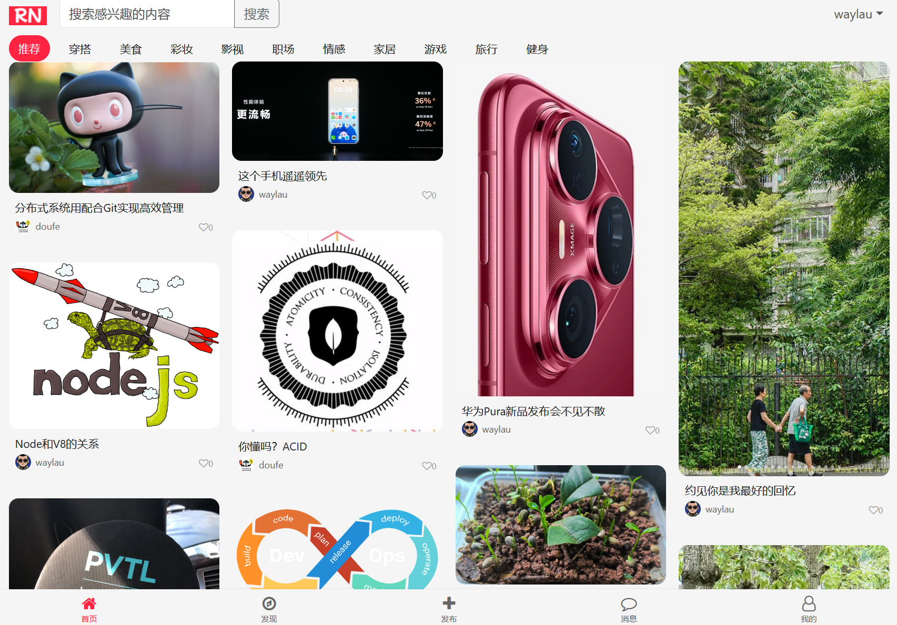

在首页查看笔记未点赞时效果，如下图13-2所示。


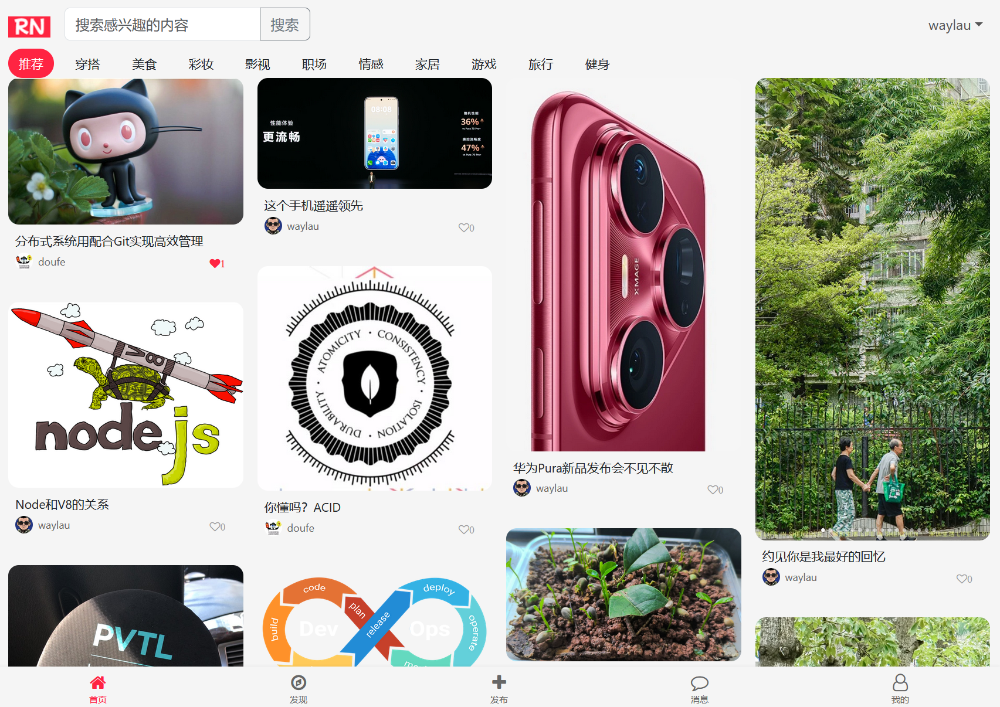


## 13.7 笔记详情页的点赞处理

修改note-detail.html中内容。

### 添加点赞按钮样式

```css
/* 点赞按钮样式 */
.liked {
    color: #ff2442;
}
```


### 点赞按钮设置属性及点击

点赞按钮设置属性：

```html
<!-- 点赞 -->
<button class="btn btn-light btn-sm" >
    <i th:class="${note.isLikedByUser(#authentication.principal?.userId)} ? 'fa fa-heart liked' : 'fa fa-heart-o'"
        th:onclick="handleLike(this)"
        th:data-note-id="${note.noteId}">[[${note.likeCount}]]</i>
</button>
```


在按钮上设置数据属性data-note-id。点赞按钮的样式class，其值是根据是否点赞而动态设置。


设置点击事件handleLike。


`#authentication.principal?.userId`是为了在authentication.principal上获取userId，具体的实现方式会在后续课程介绍。


### 实现点赞交互

发送点赞请求，并根据响应结果更新UI显示。


```javascript
// 点赞按钮的点击事件处理
function handleLike(element) {
    // 从data属性里面获取笔记ID
    const noteId = element.dataset.noteId;

    // 禁用按钮放置重复点击
    element.disabled = true;

    // 发送请求
    fetch(`/like/${noteId}`, {
        method: 'POST',
        // 添加请求头, 用于Spring Security CSRF
        headers: {
            'X-CSRF-TOKEN': document.querySelector('meta[name="_csrf"]').getAttribute('content')
        }
    })
    .then(response => response.json())
    .then(data => {
        if (data.liked) {
            // 设置按钮为点赞样式
            element.classList.remove('fa-heart-o');
            element.classList.add('fa-heart');
            element.classList.add('liked');
        } else {
            // 恢复按钮为未点赞样式
            element.classList.remove('fa-heart');
            element.classList.remove('liked');
            element.classList.add('fa-heart-o');
        }

        // 点赞量显示处理
        element.textContent = numberFormat(data.likeCount);
    })
    .catch(error => {
        console.error('Error:', error);
        alert('点赞失败，请稍后再试');
    });

    // 启用按钮
    element.disabled = false;
}

// 数字格式化，自动转换为k、w单位
function numberFormat(num) {
    if (num > 100000) {
        return (num / 10000).toFixed(1) + 'w';
    } else if (num > 1000) {
        return (num / 1000).toFixed(1) + 'k';
    } else {
        return num;
    }
};
```


## 13.8 自定义UserDetails破解在界面获取不到用户ID的难题

此时如何运行应用，前端解析`note.isLikedByUser(#authentication.principal?.userId`报错，报错信息是“Property or field 'id' cannot be found on object of type 'org.springframework.security.core.userdetails.User'”，那么要如何解决呢？

### 问题分析

这个错误是由于Spring Security返回的`UserDetails`对象结构与你的代码期望不匹配导致的。具体原因如下：

1. 类型不匹配：
   - `#authentication.principal` 返回的是`org.springframework.security.core.userdetails.User`对象
   - 这个对象默认只有`username`、`password`、`authorities`等属性，没有你期望的`userId`字段

2. 解决方案：
   - 需要自定义`UserDetails`实现类，包含用户ID字段
   - 或者通过用户名从数据库中查询完整用户信息


### 自定义 Spring Security UserDetails 实现方案

可以通过继承 `org.springframework.security.core.userdetails.User` 类来扩展自定义属性，这样既能保留 Spring Security 的默认行为，又能添加自己需要的字段（如用户ID）。以下是具体实现方案：


#### 创建自定义 UserDetails 类

```java
package com.example.rednote.config;

import org.springframework.security.core.GrantedAuthority;
import org.springframework.security.core.userdetails.User;

import java.util.Collection;

/**
 * CustomUserDetails 自定义UserDetails
 *
 * @version 2025/06/16
 **/
public class CustomUserDetails extends User {
    // 新增用户ID字段
    private final Long userId;

    public CustomUserDetails(Long userId,
                             String username,
                             String password,
                             Collection<? extends GrantedAuthority> authorities) {
        super(username, password, authorities);

        this.userId = userId;
    }

    public Long getUserId() {
        return userId;
    }

}
```


#### 修改 UserDetailsService 实现


修改 UserDetailsService 实现，返回CustomUserDetails对象：

```java
package com.example.rednote.config;

import com.example.rednote.common.ExceptionType;
import com.example.rednote.entity.User;
import com.example.rednote.repository.UserRepository;
import org.springframework.beans.factory.annotation.Autowired;
import org.springframework.security.core.authority.AuthorityUtils;
import org.springframework.security.core.authority.SimpleGrantedAuthority;
import org.springframework.security.core.userdetails.UserDetails;
import org.springframework.security.core.userdetails.UserDetailsService;
import org.springframework.security.core.userdetails.UsernameNotFoundException;
import org.springframework.stereotype.Service;

import java.util.Collections;
import java.util.Optional;

/**
 * UserDetailsServiceImpl UserDetailsService实现
 *
 * @version 2025/08/17
 **/
@Service
public class UserDetailsServiceImpl implements UserDetailsService {
    @Autowired
    private UserRepository userRepository;

    @Override
    public UserDetails loadUserByUsername(String username) throws UsernameNotFoundException {
        // 根据用户名查询用户，判定用户是否存在
        Optional<User> optionalUser = userRepository.findByUsername(username);
        if (!optionalUser.isPresent()) {
            // 抛出用户不存在的异常
            throw new UsernameNotFoundException(ExceptionType.USERNAME_NOT_FOUND);
        }

        User user = optionalUser.get();

        /*
        // 将User转为UserDetails对象
        return org.springframework.security.core.userdetails.User
                .withUsername(user.getUsername())
                .password(user.getPassword())
                .disabled(false)
                // 设置所有的数据库里面的用户都是USER角色
                .authorities(new SimpleGrantedAuthority("ROLE_USER"))
                .build();
        */

        // 将User转为自定义的UserDetails对象
        return new CustomUserDetails(
                user.getUserId(),
                user.getUsername(),
                user.getPassword(),
                // 设置所有的数据库里面的用户都是USER角色
                AuthorityUtils.createAuthorityList("ROLE_USER"));
    }
}
```


### 关键点说明

1. 继承而非替代：
   - 继承 `org.springframework.security.core.userdetails.User` 保留了 Spring Security 的默认行为
   - 无需重写所有方法，只需添加需要的字段和 getter

2. 构造函数传递：
   - 确保在构造函数中调用父类构造函数并传递必要参数
   - 可以根据需要添加更多构造函数变体

3. 安全上下文集成：
   - Spring Security 会自动将自定义 `UserDetails` 放入安全上下文中
   - 在 Thymeleaf 中通过 `#authentication.principal` 访问时，可直接获取扩展属性


### 总结

通过继承或包装 Spring Security 的 `User` 类，你可以轻松添加自定义属性（如用户ID），并在 Thymeleaf 模板中直接访问。这种方法既保持了与 Spring Security 的兼容性，又满足了业务需求，是处理此类问题的标准做法。


## 13.9 最佳实践及优化建议

### 最佳实践

#### 1. 数据类型转换
- `data-*` 属性存储的是字符串类型
- 如果需要数值类型，需手动转换：
  ```javascript
  const noteId = parseInt(element.dataset.noteId, 10);
  ```

#### 2. 安全性考虑
- 不要在 `data-*` 属性中存储敏感数据（如密码、token）
- 对用户输入进行转义处理，防止 XSS 攻击（Thymeleaf 默认会转义）

#### 3. 性能优化
- 避免在大型列表中为每个元素添加大量 `data-*` 属性
- 复杂数据建议使用 JSON 序列化后存储：
  ```html
  <div th:data-user="${#strings.replace(#jsession(user), '\'', '\\\'')}"></div>
  ```
  ```javascript
  const user = JSON.parse(element.dataset.user);
  ```


### 优化建议

1. 性能优化：
   - 使用Redis缓存点赞数，定期同步到数据库
   - 实现点赞异步处理，提高响应速度

2. 防刷机制：
   - 添加点赞频率限制（如每分钟不超过10次）
   - 记录IP地址，防止恶意刷赞

3. 用户体验：
   - 添加点赞动画效果
   - 显示最近点赞的用户头像

4. 数据统计：
   - 添加点赞排行榜
   - 分析用户点赞行为，提供个性化推荐

5. 级联操作的风险
  - 大规模删除：删除一个包含大量点赞的笔记可能导致性能问题
  - 替代方案：
    - 手动控制删除顺序：先删除关联的`Like`，再删除`Note`
    - 使用数据库触发器处理级联操作


## 13.10 返回友好的错误信息给用户


## 13.11 13.11（源文件无标题）


## 14.1 模块功能概述

在原有项目基础上实现评论功能，需要从数据库设计、后端API、前端交互三个层面进行改造。下面是完整的实现功能：

* 评论框
* 提交评论
* 展示评论列表
* 删除评论
* 回复评论窗口
* 回复评论
* 展示回复列表
* 删除回复


## 14.2 评论功能的数据库设计

首先需要添加评论相关的实体和关系：

```java
package com.example.rednote.entity;

import jakarta.persistence.*;
import lombok.AllArgsConstructor;
import lombok.Data;
import lombok.NoArgsConstructor;

import java.time.LocalDateTime;
import java.util.ArrayList;
import java.util.List;

/**
 * Comment 评论实体
 *
 * @version 2025/08/22
 **/
@Entity
@Table(name = "t_comment")
@Data
@NoArgsConstructor
@AllArgsConstructor
public class Comment {
    @Id
    @GeneratedValue(strategy = GenerationType.AUTO)
    private Long commentId;

    @Column(nullable = false, columnDefinition = "TEXT")
    private String content;

    @ManyToOne(fetch = FetchType.LAZY)
    @JoinColumn(name = "user_id", nullable = false)
    private User user;

    @ManyToOne(fetch = FetchType.LAZY)
    @JoinColumn(name = "note_id", nullable = false)
    private Note note;

    @Column(updatable = false)
    private LocalDateTime createAt = LocalDateTime.now();

    /**
     * 父级评论，用于回复功能
     */
    @ManyToOne(fetch = FetchType.LAZY)
    @JoinColumn(name = "parent_id")
    private Comment parent;

    /**
     * 子级评论，也就是回复
     */
    @OneToMany(mappedBy = "parent", cascade = CascadeType.ALL, orphanRemoval = true)
    private List<Comment> replies = new ArrayList<>();
}
```

在Note实体中添加反向关联：

```java
@Entity
@Table(name = "t_note")
@Data // @Data集合了 @ToString， @EqualsAndHashCode，所有字段的 @Getter和所有非final字段的 @Setter, @RequiredArgsConstructor
@NoArgsConstructor // 无参构造器
@AllArgsConstructor // 包含所有参数的构造器
public class Note {
    
    // ...为节约篇幅，此处省略非核心内容

    @OneToMany(mappedBy = "note", cascade = CascadeType.REMOVE, orphanRemoval = true)
    private List<Comment> comments = new ArrayList<>();
    
    // 计算评论数的Transient字段
    @Transient
    public long getCommentCount() {
        return comments.size();
    }
}
```


## 14.3 实现评论CommentRepository用于保存、查询评论数据

```Java
package com.example.rednote.repository;

import com.example.rednote.entity.Comment;
import org.springframework.data.repository.Repository;

import java.util.List;
import java.util.Optional;

/**
 * CommentRepository 评论资源库
 *
 * @version 2025/08/22
 **/
public interface CommentRepository extends Repository<Comment, Long> {
    Comment save(Comment comment);

    Optional<Comment> findByCommentId(Long commentId);

    void delete(Comment comment);

    /**
     * 查找根评论
     *
     * @param noteId
     * @return
     */
    List<Comment> findByParentIsNullAndNoteNoteIdOrderByCreateAtDesc(Long noteId);

    /**
     * 根据父评论ID获取它的子评论
     *
     * @param parentCommentId
     * @return
     */
    List<Comment> findByParentCommentId(Long parentCommentId);

}
```


## 14.4 掌握点评论服务设计的核心要点

#### 1. 评论服务接口
```java
package com.example.rednote.service;

import com.example.rednote.entity.Comment;
import com.example.rednote.entity.Note;
import com.example.rednote.entity.User;

import java.util.List;
import java.util.Optional;

/**
 * CommentService 评论服务
 *
 * @version 2025/08/22
 **/
public interface CommentService {
    /**
     * 创建评论
     *
     * @param note
     * @param user
     * @param content
     * @return
     */
    Comment createComment(Note note, User user, String content);

    /**
     * 删除评论
     *
     * @param comment
     */
    void deleteComment(Comment comment);

    /**
     * 根据评论ID获取评论
     *
     * @param commentId
     * @return
     */
    Optional<Comment> findCommentById(Long commentId);

    /**
     * 根据笔记ID获取笔记的根评论
     *
     * @return
     */
    List<Comment> getCommentsByNoteId(Long noteId);

    /**
     * 回复评论
     *
     * @param note
     * @param parentComment
     * @param user
     * @param content
     * @return
     */
    Comment replyToComment(Note note, Comment parentComment, User user, String content);
}
```

#### 2. 评论服务实现

```java
package com.example.rednote.service.impl;

import com.example.rednote.entity.Comment;
import com.example.rednote.entity.Note;
import com.example.rednote.entity.User;
import com.example.rednote.repository.CommentRepository;
import com.example.rednote.service.CommentService;
import org.springframework.beans.factory.annotation.Autowired;
import org.springframework.stereotype.Service;

import java.util.List;
import java.util.Optional;

/**
 * CommentServiceImpl 评论服务
 *
 * @version 2025/08/22
 **/
@Service
public class CommentServiceImpl implements CommentService {
    @Autowired
    private CommentRepository commentRepository;

    @Override
    public Comment createComment(Note note, User user, String content) {
        Comment comment = new Comment();
        comment.setNote(note);
        comment.setUser(user);
        comment.setContent(content);

        return commentRepository.save(comment);
    }

    @Override
    public void deleteComment(Comment comment) {
        commentRepository.delete(comment);
    }

    @Override
    public Optional<Comment> findCommentById(Long commentId) {
        return commentRepository.findByCommentId(commentId);
    }

    @Override
    public List<Comment> getCommentsByNoteId(Long noteId) {
        return commentRepository.findByParentIsNullAndNoteNoteIdOrderByCreateAtDesc(noteId);
    }

    @Override
    public Comment replyToComment(Note note, Comment parentComment, User user, String content) {
        Comment reply = new Comment();
        reply.setNote(note);
        reply.setUser(user);
        reply.setContent(content);
        reply.setParent(parentComment);

        parentComment.getReplies().add(reply);

        return commentRepository.save(reply);
    }
}
```


## 14.5 创建处理评论相关请求的控制器

### 控制器层


```java
package com.example.rednote.controller;

import com.example.rednote.dto.CommentResponseDto;
import com.example.rednote.entity.Comment;
import com.example.rednote.entity.Note;
import com.example.rednote.entity.User;
import com.example.rednote.exception.CommentNotFoundException;
import com.example.rednote.exception.NoteNotFoundException;
import com.example.rednote.service.CommentService;
import com.example.rednote.service.NoteService;
import com.example.rednote.service.UserService;
import org.springframework.beans.factory.annotation.Autowired;
import org.springframework.http.ResponseEntity;
import org.springframework.stereotype.Controller;
import org.springframework.web.bind.annotation.*;

import java.util.List;
import java.util.Optional;
import java.util.stream.Collectors;

/**
 * CommentController 评论控制器
 *
 * @version 2025/08/22
 **/
@Controller
@RequestMapping("/comment")
public class CommentController {
    @Autowired
    private NoteService noteService;

    @Autowired
    private UserService userService;

    @Autowired
    private CommentService commentService;

    // 处理创建评论的请求
    @PostMapping("/{noteId}")
    public ResponseEntity<CommentResponseDto> createComment(@PathVariable("noteId") Long noteId,
                                                            @RequestBody String content) {
        // 判定笔记是否存在
        Optional<Note> optionalNote = noteService.findNoteById(noteId);
        if (!optionalNote.isPresent()) {
            throw new NoteNotFoundException("");
        }

        Note note = optionalNote.get();
        User user = userService.getCurrentUser();

        Comment comment = commentService.createComment(note, user, content);

        // 将Comment对象转换成DTO对象
        CommentResponseDto commentResponseDto = CommentResponseDto.toCommentResponseDto(comment);

        return ResponseEntity.ok(commentResponseDto);
    }

    // 处理获取笔记评论列表的请求
    @GetMapping("/{noteId}")
    public ResponseEntity<List<CommentResponseDto>> getCommentsByNoteId(@PathVariable("noteId") Long noteId) {
        // 判定笔记是否存在
        Optional<Note> optionalNote = noteService.findNoteById(noteId);
        if (!optionalNote.isPresent()) {
            throw new NoteNotFoundException("");
        }

        List<Comment> comments = commentService.getCommentsByNoteId(noteId);

        // 将Comment对象转换成DTO对象
        List<CommentResponseDto> commentResponseDtoList = comments.stream().map(CommentResponseDto::toCommentResponseDto)
                .collect(Collectors.toUnmodifiableList());

        return ResponseEntity.ok(commentResponseDtoList);
    }

    // 处理创建回复的请求
    @PostMapping("/{noteId}/reply/{parentCommentId}")
    public ResponseEntity<CommentResponseDto> replyToComment(@PathVariable("noteId") Long noteId,
                                                             @PathVariable("parentCommentId") Long parentCommentId,
                                                             @RequestBody String content) {
        // 判定笔记是否存在
        Optional<Note> optionalNote = noteService.findNoteById(noteId);
        if (!optionalNote.isPresent()) {
            throw new NoteNotFoundException("");
        }

        // 判定父级评论是否存在
        Optional<Comment> optionalParentComment = commentService.findCommentById(parentCommentId);
        if (!optionalParentComment.isPresent()) {
            throw new CommentNotFoundException("");
        }

        // 判定父级评论是否属于该笔记
        Comment parentComment = optionalParentComment.get();
        if (!parentComment.getNote().getNoteId().equals(noteId)) {
            throw new CommentNotFoundException("评论与笔记不匹配");
        }

        Note note = optionalNote.get();
        User user = userService.getCurrentUser();
        Comment reply = commentService.replyToComment(note, parentComment, user, content);

        // 将Comment对象转换成DTO对象
        CommentResponseDto commentResponseDto = CommentResponseDto.toCommentResponseDto(reply);

        return ResponseEntity.ok(commentResponseDto);
    }

    // 处理删除评论（包含回复）的请求
    @DeleteMapping("/{commentId}")
    public ResponseEntity<Void> deleteComment(@PathVariable("commentId") Long commentId) {
        // 判定评论是否存在
        Optional<Comment> optionalComment = commentService.findCommentById(commentId);
        if (!optionalComment.isPresent()) {
            throw new CommentNotFoundException("");
        }

        // 判定评论是否是自己的
        Comment comment = optionalComment.get();
        User user = userService.getCurrentUser();
        if (!comment.getUser().getUserId().equals(user.getUserId())) {
            throw new CommentNotFoundException("无权删除他人的评论");
        }

        commentService.deleteComment(comment);

        return ResponseEntity.noContent().build();
    }
}
```


这里需要注意，不能直接返回实体Comment给前端，需要转为CommentResponseDto对象，否则报以下序列化错误：


```

com.fasterxml.jackson.databind.exc.InvalidDefinitionException: No serializer found for class org.hibernate.proxy.pojo.bytebuddy.ByteBuddyInterceptor and no properties discovered to create BeanSerializer (to avoid exception, disable SerializationFeature.FAIL_ON_EMPTY_BEANS) (through reference chain: com.example.rednote.entity.Comment["note"]->com.example.rednote.entity.Note["author"]->com.example.rednote.entity.User$HibernateProxy["hibernateLazyInitializer"])
	at com.fasterxml.jackson.databind.exc.InvalidDefinitionException.from(InvalidDefinitionException.java:77) ~[jackson-databind-2.19.0.jar:2.19.0]
	at com.fasterxml.jackson.databind.SerializerProvider.reportBadDefinition(SerializerProvider.java:1359) ~[jackson-databind-2.19.0.jar:2.19.0]
	at com.fasterxml.jackson.databind.DatabindContext.reportBadDefinition(DatabindContext.java:415) ~[jackson-databind-2.19.0.jar:2.19.0]
	at com.fasterxml.jackson.databind.ser.impl.UnknownSerializer.failForEmpty(UnknownSerializer.java:52) ~[jackson-databind-2.19.0.jar:2.19.0]
	at com.fasterxml.jackson.databind.ser.impl.UnknownSerializer.serialize(UnknownSerializer.java:29) ~[jackson-databind-2.19.0.jar:2.19.0]
	at com.fasterxml.jackson.databind.ser.BeanPropertyWriter.serializeAsField(BeanPropertyWriter.java:732) ~[jackson-databind-2.19.0.jar:2.19.0]
	at com.fasterxml.jackson.databind.ser.std.BeanSerializerBase.serializeFields(BeanSerializerBase.java:760) ~[jackson-databind-2.19.0.jar:2.19.0]
	at com.fasterxml.jackson.databind.ser.BeanSerializer.serialize(BeanSerializer.java:183) ~[jackson-databind-2.19.0.jar:2.19.0]
	at com.fasterxml.jackson.databind.ser.BeanPropertyWriter.serializeAsField(BeanPropertyWriter.java:732) ~[jackson-databind-2.19.0.jar:2.19.0]
	at com.fasterxml.jackson.databind.ser.std.BeanSerializerBase.serializeFields(BeanSerializerBase.java:760) ~[jackson-databind-2.19.0.jar:2.19.0]
	at com.fasterxml.jackson.databind.ser.BeanSerializer.serialize(BeanSerializer.java:183) ~[jackson-databind-2.19.0.jar:2.19.0]
	at com.fasterxml.jackson.databind.ser.BeanPropertyWriter.serializeAsField(BeanPropertyWriter.java:732) ~[jackson-databind-2.19.0.jar:2.19.0]
	at com.fasterxml.jackson.databind.ser.std.BeanSerializerBase.serializeFields(BeanSerializerBase.java:760) ~[jackson-databind-2.19.0.jar:2.19.0]
	at com.fasterxml.jackson.databind.ser.BeanSerializer.serialize(BeanSerializer.java:183) ~[jackson-databind-2.19.0.jar:2.19.0]
	at com.fasterxml.jackson.databind.ser.DefaultSerializerProvider._serialize(DefaultSerializerProvider.java:503) ~[jackson-databind-2.19.0.jar:2.19.0]
	at com.fasterxml.jackson.databind.ser.DefaultSerializerProvider.serializeValue(DefaultSerializerProvider.java:342) ~[jackson-databind-2.19.0.jar:2.19.0]
	at com.fasterxml.jackson.databind.ObjectWriter$Prefetch.serialize(ObjectWriter.java:1587) ~[jackson-databind-2.19.0.jar:2.19.0]
	at com.fasterxml.jackson.databind.ObjectWriter.writeValue(ObjectWriter.java:1061) ~[jackson-databind-2.19.0.jar:2.19.0]
	at org.springframework.http.converter.json.AbstractJackson2HttpMessageConverter.writeInternal(AbstractJackson2HttpMessageConverter.java:485) ~[spring-web-6.2.7.jar:6.2.7]
	at org.springframework.http.converter.AbstractGenericHttpMessageConverter.write(AbstractGenericHttpMessageConverter.java:126) ~[spring-web-6.2.7.jar:6.2.7]
	at org.springframework.web.servlet.mvc.method.annotation.AbstractMessageConverterMethodProcessor.writeWithMessageConverters(AbstractMessageConverterMethodProcessor.java:345) ~[spring-webmvc-6.2.7.jar:6.2.7]
	at org.springframework.web.servlet.mvc.method.annotation.HttpEntityMethodProcessor.handleReturnValue(HttpEntityMethodProcessor.java:263) ~[spring-webmvc-6.2.7.jar:6.2.7]
	at org.springframework.web.method.support.HandlerMethodReturnValueHandlerComposite.handleReturnValue(HandlerMethodReturnValueHandlerComposite.java:78) ~[spring-web-6.2.7.jar:6.2.7]
	at org.springframework.web.servlet.mvc.method.annotation.ServletInvocableHandlerMethod.invokeAndHandle(ServletInvocableHandlerMethod.java:136) ~[spring-webmvc-6.2.7.jar:6.2.7]
	at org.springframework.web.servlet.mvc.method.annotation.RequestMappingHandlerAdapter.invokeHandlerMethod(RequestMappingHandlerAdapter.java:986) ~[spring-webmvc-6.2.7.jar:6.2.7]
	at org.springframework.web.servlet.mvc.method.annotation.RequestMappingHandlerAdapter.handleInternal(RequestMappingHandlerAdapter.java:891) ~[spring-webmvc-6.2.7.jar:6.2.7]
	at org.springframework.web.servlet.mvc.method.AbstractHandlerMethodAdapter.handle(AbstractHandlerMethodAdapter.java:87) ~[spring-webmvc-6.2.7.jar:6.2.7]
	at org.springframework.web.servlet.DispatcherServlet.doDispatch(DispatcherServlet.java:1089) ~[spring-webmvc-6.2.7.jar:6.2.7]
	at org.springframework.web.servlet.DispatcherServlet.doService(DispatcherServlet.java:979) ~[spring-webmvc-6.2.7.jar:6.2.7]
	at org.springframework.web.servlet.FrameworkServlet.processRequest(FrameworkServlet.java:1014) ~[spring-webmvc-6.2.7.jar:6.2.7]
	at org.springframework.web.servlet.FrameworkServlet.doPost(FrameworkServlet.java:914) ~[spring-webmvc-6.2.7.jar:6.2.7]
```    


### JSON序列化错误解决方案：使用DTO（数据传输对象）隔离实体

这个错误是由于Jackson在序列化Hibernate代理对象时遇到问题导致的。当Hibernate加载实体时，会使用代理（Proxy）延迟加载关联对象，而Jackson默认无法处理这些代理对象。


推荐使用DTO来控制序列化的数据，避免直接序列化实体：

```java
package com.example.rednote.dto;

import com.example.rednote.entity.Comment;
import com.example.rednote.entity.Note;
import com.example.rednote.entity.User;
import lombok.Getter;
import lombok.Setter;

import java.time.LocalDateTime;
import java.util.ArrayList;
import java.util.List;

/**
 * CommentResponseDto 评论的响应对象
 *
 * @version 2025/08/22
 **/
@Getter
@Setter
public class CommentResponseDto {

    // 以下是从Comment对象中获取
    private Long commentId;
    private String content;
    private LocalDateTime createAt;

    // 以下是从User对象中获取
    private Long userId;
    private String username;
    private String avatar;

    // 以下是从Note对象中获取
    private Long noteId;

    // 以下是从Comment的parent对象中获取
    private Long parentCommentId;

    // 以下是从Comment的parent对象中的User对象中获取
    private String parentCommentUsername;

    // 子评论
    private List<CommentResponseDto> replies = new ArrayList<>();

    public static CommentResponseDto toCommentResponseDto(Comment comment) {
        if (comment == null) {
            return null;
        }

        CommentResponseDto commentResponseDto = new CommentResponseDto();
        commentResponseDto.setCommentId(comment.getCommentId());
        commentResponseDto.setContent(comment.getContent());
        commentResponseDto.setCreateAt(comment.getCreateAt());

        User user = comment.getUser();
        commentResponseDto.setUserId(user.getUserId());
        commentResponseDto.setUsername(user.getUsername());
        commentResponseDto.setAvatar(user.getAvatar());

        Note note = comment.getNote();
        commentResponseDto.setNoteId(note.getNoteId());

        Comment parentComment = comment.getParent();
        if (parentComment != null) {
            commentResponseDto.setParentCommentId(parentComment.getCommentId());

            User parentCommentUser = parentComment.getUser();
            commentResponseDto.setParentCommentUsername(parentCommentUser.getUsername());
        }

        List<Comment> replies = comment.getReplies();
        for (Comment reply : replies) {
            CommentResponseDto replyDto = toCommentResponseDto(reply);
            commentResponseDto.getReplies().add(replyDto);
        }

        return commentResponseDto;
    }
}
```


通过以上方法，你应该能够解决JSON序列化时的代理对象问题。选择最适合你项目的方案，通常结合使用DTO和注解配置是最推荐的做法。


## 14.6 扩展全局异常处理器，处理评论模块中可能出现的异常

```java
package com.example.rednote.exception;

/**
 * CommentNotFoundException 评论不存在异常
 *
 * @version 2025/08/22
 **/
public class CommentNotFoundException extends ValidationException {
    public CommentNotFoundException(String message) {
        super("评论不存在异常. " + message);
    }

    public CommentNotFoundException(String message, Throwable cause) {
        super("评论不存在异常. " + message, cause);
    }
}
```


```java
@ControllerAdvice
public class GlobalExceptionHandler {

    //  ...为节约篇幅，此处省略非核心内容

    // 评论不存在异常
    @ExceptionHandler(CommentNotFoundException.class)
    public String handleCommentNotFoundException(CommentNotFoundException ex, Model model) {
        logger.error("评论不存在异常: {}", ex.getMessage(), ex);

        model.addAttribute("errorCode", 404);
        model.addAttribute("errorMessage", "异常信息: " + ex.getMessage());
        
        return "400-error";
    }
}
```


## 14.7 在安全配置类中，配置评论模块的访问权限

### 安全配置


1. 在 Spring Security 配置类中，进一步细化评论API的访问权限
2. 确保只有普通用户角色可以访问评论API


修改WebSecurityConfig如下：


```java
@Bean
public SecurityFilterChain filterChain(HttpSecurity http) throws Exception {
    http
            // ...为节约篇幅，此处省略非核心内容    
            .authorizeHttpRequests(authorize -> authorize
                    // ...为节约篇幅，此处省略非核心内容

                    // 允许USER角色的用户访问 /comment/** 的资源
                    .requestMatchers("/comment/**").hasRole("USER")
                    // 其他请求需要认证
                    .anyRequest().authenticated()
            )

 
    ;

    return http.build();
}            
```


## 14.8 发布评论及评论列表展示的功能实现

### 前端实现

#### 1. HTML模板修改

在笔记卡片评论区域的”发送“按钮上添加点击事件，并设置data属性、增加评论列表div：

```html
<!-- 评论区 -->
<div class="comments-section">
    <div class="comments-header">
        <div class="comments-title">
            评论区
        </div>
    </div>

    <!-- 评论输入框 -->
    <div class="comment-input">
        
        <textarea class="comment-textarea" placeholder="分享你的想法..."></textarea>
        <div class="comment-btn" th:data-note-id="${note.noteId}" th:onclick="sendComment([[${note.noteId}]])">
            发送
        </div>
    </div>

    <!-- 评论列表 -->
    <div class="comment-list" id="commentList"></div>
</div>
```

#### 2. JavaScript实现评论交互
```javascript
// 首次加载评论
const noteId = document.querySelector('.comment-btn').dataset.noteId;
loadComments(noteId);

// 处理评论发送按钮事件
function sendComment(noteId) {
    const textarea = document.querySelector('.comment-textarea');

    // 获取评论内容
    const commentContent = textarea.value.trim();

    if (commentContent === '') {
        alert('评论内容不能为空');
        return;
    }

    // 发送请求
    fetch(`/comment/${noteId}`, {
        method: 'POST',
        headers: {
            'Content-Type': 'application/json',
            'X-CSRF-TOKEN': document.querySelector('meta[name="_csrf"]').getAttribute('content')
        },
        body: commentContent
    })
    .then(response => {
            if (response.ok) {
                // 加载评论列表
                loadComments(noteId);

                // 清空评论输入框
                textarea.value = '';
            } else  {
                alert('评论失败，请重试');
            }
        })
        .catch(error => {
            console.error('评论错误：', error);
            alert('评论失败，请稍后重试');
        });
}

// 加载评论列表
function loadComments(noteId) {
    // 获取评论列表容器
    const commentList = document.getElementById('commentList');

    // 清空评论列表
    commentList.innerHTML = '';

    // 发送请求获取评论列表数据
    fetch(`/comment/${noteId}`)
    .then(response => response.json())
    .then(data => {
        // 判定返回的数据是否为空
        if (data.length > 0) {
            // 遍历评论列表，生成评论项并添加到列表容器中
            data.forEach(comment => {
                const commentElement = createCommentElement(comment);
                commentList.appendChild(commentElement);
            })
        } else {
            // 添加一个提示元素
            const noCommentElement = createNoCommentElement();
            commentList.appendChild(noCommentElement);
        }
    })
}

// 创建一个评论项元素
function createCommentElement(comment) {
    const commentElement = document.createElement('div');
    commentElement.className = 'comment-item';
    commentElement.dataset.commentId = comment.commentId;

    // 格式化日期
    const date = new Date(comment.createAt);
    const formattedDate = date.toLocaleString();

    commentElement.innerHTML = `
    <div class="comment-header">
        
        <div class="comment-user-info">
            <div class="comment-username">${comment.username}</div>
            <div class="comment-time">${formattedDate}</div>
        </div>

        <!-- TODO 回复评论-->
        <button class="reply-btn">
            <i class="fa fa-comment-o"></i>
        </button>

        <!-- TODO 删除评论-->
        <button class="delete-comment">
            <i class="fa fa-trash-o"></i>
        </button>
    </div>

    <div class="comment-content">${comment.content}</div>
    `;

    return commentElement;
}

// 添加一个暂无评论的提示元素
function createNoCommentElement() {
    const commentElement = document.createElement('div');
    commentElement.innerHTML = `<p class="empty-comments">暂无评论，快来发表你的看法吧</p>`;

    return commentElement;
}
```

#### 3. CSS样式美化界面


添加必要的CSS样式：

```css
/* 评论区（第二部分）*/
.comment-user-avatar {
    width: 32px;
    height: 32px;
    border-radius: 50%;
    margin-right: 10px;
}

.comment-user-info {
    flex: 1;
}

.comment-username {
    font-weight: bold;
}

.comment-time {
    font-size: 12px;
    color: #999;
}

.comment-content {
    margin-left: 42px;
    margin-bottom: 10px;
}


.reply-btn, .delete-comment {
    background: none;
    border: none;
    color: #999;
    cursor: pointer;
    font-size: 12px;
}

.delete-comment {
    margin-left: 10px;
}

.empty-comments {
    color: #999;
    text-align: center;
    padding: 20px 0;
}
```


### 运行调测


通过以上实现，可以在项目中完整实现评论区功能，包括评论发布、评论列表展示和用户交互反馈等，演示效果如下图14-1所示。


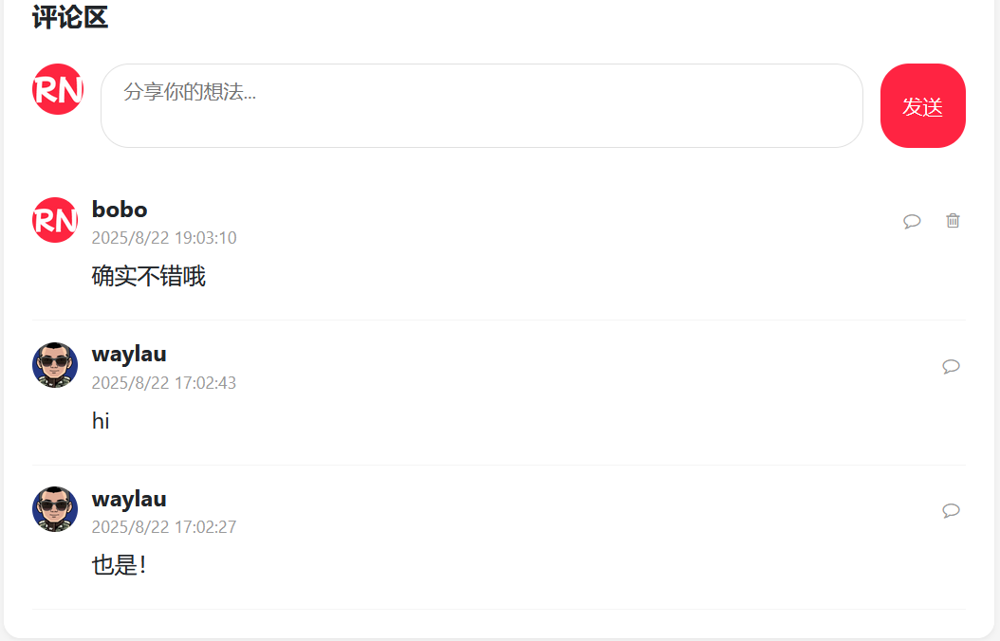


## 14.9 删除评论的功能实现

### 删除评论按钮

在删除评论按钮上添加数据属性绑定，并根据判定动态设置样式：

```js
// 创建一个评论项元素
function createCommentElement(comment) {
    const commentElement = document.createElement('div');
    commentElement.className = 'comment-item';
    commentElement.dataset.commentId = comment.commentId;

    // 格式化日期
    const date = new Date(comment.createAt);
    const formattedDate = date.toLocaleString();

    commentElement.innerHTML = `
    <div class="comment-header">
        
        <div class="comment-user-info">
            <div class="comment-username">${comment.username}</div>
            <div class="comment-time">${formattedDate}</div>
        </div>

        <!-- TODO 回复评论-->
        <button class="reply-btn">
            <i class="fa fa-comment-o"></i>
        </button>

        <!-- 删除评论-->
        <button class="delete-comment" ${isCurrentUser(comment.userId) ? '' : 'style="display:none"'}
            onclick="deleteComment(${comment.commentId})">
            <i class="fa fa-trash-o"></i>
        </button>
    </div>

    <div class="comment-content">${comment.content}</div>
    `;

    return commentElement;
}
```

只有评论的作者自己才能删除。


### 检查是否是当前用户


确保在 HTML 模板中有一个 meta 标签来存储 当前用户ID：

```html
<!-- 确保有一个meta标签来存储当前用户ID -->
<meta name="currentUserId" th:content="${#authentication.principal?.userId}"></meta>
```


检查是否是当前用户函数isCurrentUser()如下：


```javascript
// 检查是否是当前用户
function isCurrentUser(userId) {
    const currentUserId = document.querySelector('meta[name="currentUserId"]').content;
    return userId.toString() === currentUserId;
}
```

#### 调用删除评论的接口


调用删除评论的接口：

```js
// 处理删除按钮点击事件
function deleteComment(commentId) {
    // 删除评论前先做确认提示
    if (!confirm("确定要删除此评论吗？")) {
        return;
    }

    // 发送删除请求
    fetch(`/comment/${commentId}`, {
        method: 'DELETE',
        headers: {
            'X-CSRF-TOKEN': document.querySelector('meta[name="_csrf"]').getAttribute('content')
        }
    }).then(response => {
            if (response.ok) {
                // 加载评论列表
                loadComments(noteId);
            } else  {
                alert('删除评论失败，请重试');
            }
        })
        .catch(error => {
            console.error('删除评论错误：', error);
            alert('删除评论失败，请稍后重试');
        });
}
```


### 运行调测


通过以上实现，可以在项目中完整实现评论删除功能，包括评论删除提前的提示，以及删除后评论列表的刷新。

如下图14-2所示的是评论删除提前的提示。


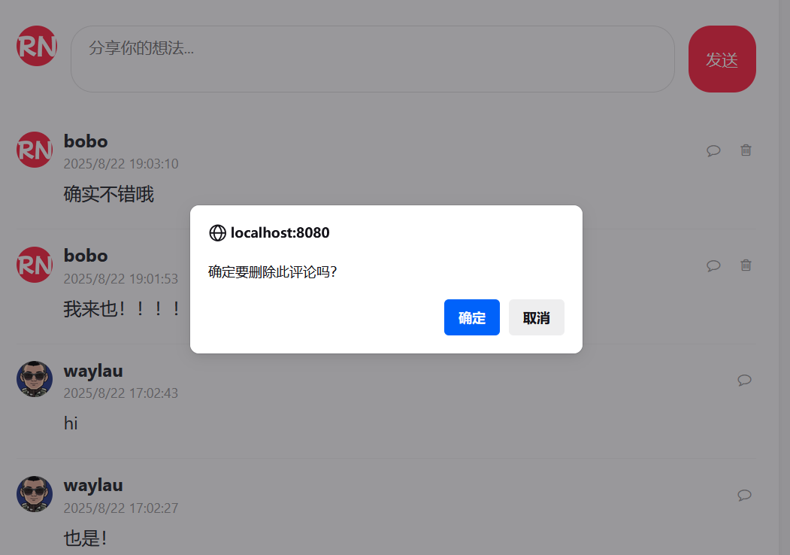


如下图14-3所示的是评论删除后的列表刷新。


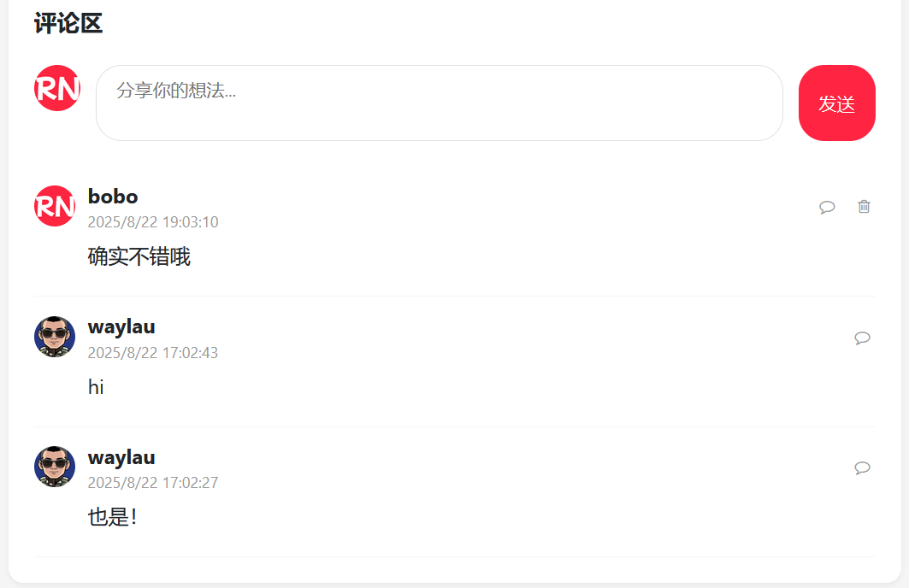


## 14.10 掌握评论回复及多级评论的实现技巧

评论下面可能会有回复（也就是子评论），回复下面还可以继续回复。因此，如何处理多级嵌套的评论，是本节要处理的核心。

处理子评论下再有子评论（即多层级嵌套评论）需要从后端API、前端渲染几个层面进行调整。


以下是完整的解决方案。


### 后端API调整

修改评论服务CommentServiceImpl，支持递归获取所有层级的评论：

```java
@Override
public List<Comment> getCommentsByNoteId(Long noteId) {
    /*return commentRepository.findByParentIsNullAndNoteNoteIdOrderByCreateAtDesc(noteId);*/
    List<Comment> rootComments = commentRepository.findByParentIsNullAndNoteNoteIdOrderByCreateAtDesc(noteId);

    // 递归加载所有的回复及其子回复到根评论上
    rootComments.forEach(rootComment -> {
        // 构建一个能包含回复及其子回复的列表，从1到N层的所有回复
        List<Comment> allReplies = new ArrayList<>();

        // 第一层的回复直接放到allReplies列表中
        List<Comment> firstLevelReplies = rootComment.getReplies();
        allReplies.addAll(firstLevelReplies);

        // 第二层及其后续的回复，就递归而后添加到allReplies列表中
        loadRepliesRecursively(firstLevelReplies, allReplies);

        // allReplies列表按照创建时间倒序排序
        rootComment.setReplies(allReplies.stream().sorted(Comparator.comparing(Comment::getCreateAt).reversed()).toList());
    });

    return rootComments;
}

// 递归加载回复
private void loadRepliesRecursively(List<Comment> replies, List<Comment> allReplies) {
    replies.forEach(reply -> {
        List<Comment> sonReplies = reply.getReplies();
        allReplies.addAll(sonReplies);

        loadRepliesRecursively(sonReplies, allReplies);
    });
}
```

整体上将评论内容分为了两层

* 根评论
* 子评论（子评论下层的子评论也会递归汇总到子评论上）

### 前端渲染实现

在createCommentElement函数内增加回复列表：


```javascript
// 创建一个评论项元素
function createCommentElement(comment) {

    // ...为节约篇幅，此处省略非核心内容

    commentElement.innerHTML = `
        <div class="comment-header">

            <!-- ...为节约篇幅，此处省略非核心内容 -->

        </div>

        <div class="comment-content">${comment.content}</div>

        <!-- 回复列表 -->
        <div class="reply-list">
            ${renderReplies(comment.replies)}
        </div>
    `;

    return commentElement;
}
```


通过renderReplies函数来渲染回复列表：

```js
// 渲染回复列表
function renderReplies(replies) {
    // 判定回复列表是否为空
    if (replies.length === 0) {
        return '';
    }

    return replies.map(reply => {
        const date = new Date(reply.createAt);
        const formattedDate = date.toLocaleString();

        return `
        <div class="reply-item">
            <div class="reply-header">
                <span class="reply-username">${reply.username}</span>
                <span class="reply-to">»</span>
                <span class="reply-target">${reply.parentCommentUsername ? reply.parentCommentUsername : '评论作者'}</span>
                <span class="reply-time">${formattedDate}</span>
            </div>
            <div class="reply-content">${reply.content}</div>

            <!-- 回复回复的按钮-->
            <button class="reply-btn">
                <i class="fa fa-comment-o"></i>
            </button>
            <!-- 删除回复的按钮-->
            <button class="delete-comment" ${isCurrentUser(reply.userId) ? '' : 'style="display:none"'}>
                <i class="fa fa-trash-o"></i>
            </button>
        </div>
        `;
    }).join('');
}
```


## 14.11 通用型回复弹窗的设计

### 回复弹窗

在`<body>`标签底部、`<script>`标签之前添加回复弹窗：


```html
<!-- 回复弹窗 -->
<div class="modal" id="replyModal" tabindex="-1" aria-labelledby="replyModalLabel">
    <div class="modal-dialog">
        <div class="modal-content">
            <div class="modal-header">
                <h5 class="modal-title" id="replyModalLabel">回复 <span id="replyToUsername"></span></h5>
            </div>
            <div class="modal-body">
                <div class="reply-to-content"></div>
                <textarea class="form-control" id="replyContent" rows="3" placeholder="写下你的回复..."></textarea>
            </div>
            <div class="modal-footer">
                <button type="button" class="btn btn-light close-model" data-bs-dismiss="modal">取消</button>
                <button type="button" class="btn btn-danger" id="submitReply">提交回复</button>
            </div>
        </div>
    </div>
</div>
```

### 在回复评论按钮上增加点击事件

在回复评论按钮上增加点击事件以触发showReplyModal函数。

```html
<!-- 回复评论 -->
<button class="reply-btn" onclick='showReplyModal(${JSON.stringify(comment)})'>
   <i class="fa fa-comment-o"></i>
</button>
```

需要注意，在代码中，不能写成`showReplyModal(${comment})`，这是错误的，主要原因如下：

- `${comment}` 是一个 JavaScript 对象，而不是一个简单的值
- 在 HTML 的 `onclick` 属性中，这样的对象无法被正确解析和传递

正确的传递方式


- 应该传递具体的属性值，如commentId、username等
- 或者将整个对象以 JSON 字符串的形式传递

以下是上述两种传递方式的使用示例：

```html
<!-- 方式1：传递具体属性 -->
<button class="reply-btn" onclick="showReplyModal(${comment.commentId}, '${comment.username}', '${comment.content}')">

<!-- 方式2：传递序列化的对象（推荐） -->
<button class="reply-btn" onclick='showReplyModal(${JSON.stringify(comment)})'>
```

### showReplyModal函数


showReplyModal函数用于显示回复模态窗口，定义如下：


```js
// 显示回复模态窗口
function showReplyModal(comment) {
   console.log("comment:" + comment);
   const commentId = comment.commentId;
   const username = comment.username;
   const content = comment.content;
   const noteId = comment.noteId;

   const modal = document.getElementById('replyModal');
   modal.querySelector('.reply-to-content').textContent = content;
   document.getElementById('replyToUsername').textContent = username;

   const submitReply = document.getElementById('submitReply');
   submitReply.dataset.commentId = commentId;
   submitReply.dataset.noteId = noteId;

   // 显示回复模态窗口
   modal.style.display = 'block';
   modal.querySelector('.close-model').onclick = function() {
      modal.style.display = 'none';
      modal.querySelector('.reply-to-content').textContent = '';
      document.getElementById('replyToUsername').textContent = '';
      submitReply.dataset.commentId = '';
      submitReply.dataset.noteId = '';
      document.getElementById('replyContent').value = '';
   }
}
```


### CSS样式调整

添加层级缩进和视觉区分：

```css
/*评论回复*/
.reply-list {
    margin-left: 42px;
    margin-top: 10px;
    padding-left: 10px;
    border-left: 2px solid #f5f5f5;
}

.reply-item {
    margin-bottom: 10px;
}

.reply-header {
    display: flex;
    align-items: center;
    font-size: 14px;
    color: #666;
}

.reply-username, .reply-target {
    font-weight: bold;
    margin-right: 5px;
}

.reply-to {
    margin-right: 5px;
}

.reply-time {
    margin-left: 10px;
    font-size: 12px;
    color: #999;
}

.reply-content {
    margin-top: 5px;
    margin-left: 0;
}

.submit-reply {
    background-color: #ff2442;
    color: white;
    border: none;
    padding: 8px 15px;
    border-radius: 4px;
    cursor: pointer;
}
```


## 14.12 提交回复及删除回复

### 设置提交回复事件处理

回复弹窗上的提交回复设置点击事件以触发handleSubmitReply函数执行：


```html
<button type="button" class="btn btn-danger" id="submitReply" onclick="handleSubmitReply()">提交回复</button>
```

### handleSubmitReply函数


handleSubmitReply函数用于处理发送提交回复的请求到后端API，代码如下：


```js
// 处理提交回复点击事件
function handleSubmitReply() {
   const submitReply = document.getElementById('submitReply');
   const commentId  = submitReply.dataset.commentId;
   const noteId = submitReply.dataset.noteId;
   const replyContent = document.getElementById('replyContent').value;

   if (!replyContent) {
      return;
   }

   // 发送提交回复的请求
   fetch(`/comment/${noteId}/reply/${commentId}`, {
      method: "POST",
      headers: {
            "Content-Type": "application/json",
            'X-CSRF-TOKEN': document.querySelector('meta[name="_csrf"]').getAttribute('content')
      },
      body: replyContent
   })
   .then(response => {
         if (response.ok) {
               // 加载评论列表
               loadComments(noteId);

               // 关闭回复模态窗口
               const modal = document.getElementById('replyModal');
               modal.style.display = 'none';
               document.getElementById('replyContent').value = '';
         } else  {
               alert('回复失败，请重试');
         }
      })
      .catch(error => {
         console.error('回复错误：', error);
         alert('回复失败，请稍后重试');
      });
}
```


### 在回复回复按钮上增加点击事件

在回复回复按钮上增加点击事件以触发showReplyModal函数。

```html
<!-- 回复评论 -->
<button class="reply-btn" onclick='showReplyModal(${JSON.stringify(comment)})'>
   <i class="fa fa-comment-o"></i>
</button>
```


上述处理逻辑与在回复评论按钮上的点击事件处理一致，都是重用了回复弹窗处理回复。

### 在删除回复按钮上增加点击事件

在删除回复按钮上增加点击事件以触发deleteComment函数。

```html
<!-- 删除回复的按钮-->
<button class="delete-comment" ${isCurrentUser(reply.userId) ? '' : 'style="display:none"'}
   onclick="deleteComment(${reply.commentId})">
   <i class="fa fa-trash-o"></i>
</button>
```


上述处理逻辑与在删除回复按钮上的点击事件处理一致，都是重用了删除评论的处理。


### 运行调测


通过以上实现，可以在项目中完整实现回复的功能，包括评论回复评论、回复列表展示、删除回复，以及删除回复后回复列表的刷新。

如下图14-4所示的是回复弹窗。


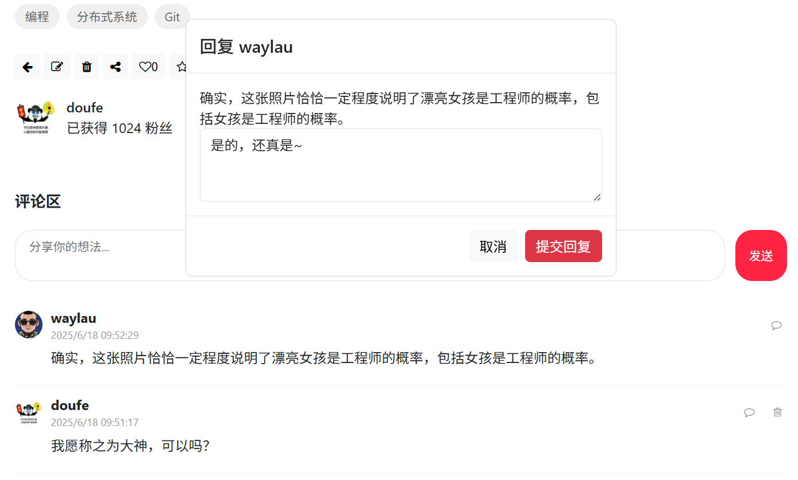


如下图14-5所示的是回复列表，能够显示完整的回复路径。


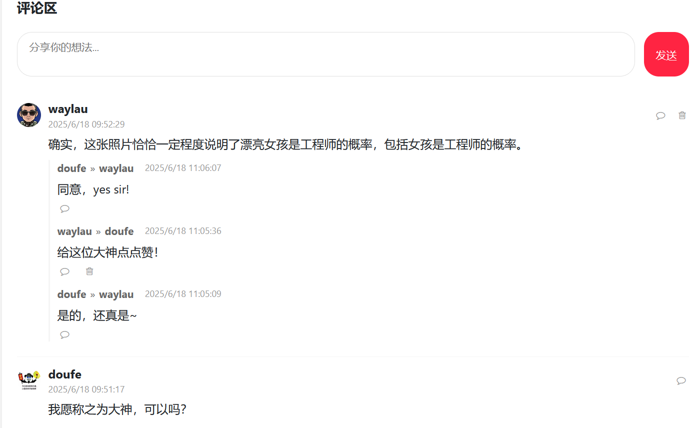


通过以上实现，你可以支持无限层级的嵌套评论，同时保持良好的性能和用户体验。实际项目中，建议根据具体需求限制最大层级深度（如不超过5层），以避免界面过于复杂。


## 14.13 从评论列表跳转到作者详情页

### 前端修改


点击评论的作者头像时，我们希望就能跳转到该作者的详情页。实现方式，只需要在作者信息的标签外再套一层`<a>`标签即可。


```js
// 创建一个评论项元素
function createCommentElement(comment) {
   const commentElement = document.createElement('div');
   commentElement.className = 'comment-item';
   commentElement.dataset.commentId = comment.commentId;

   // 格式化日期
   const date = new Date(comment.createAt);
   const formattedDate = date.toLocaleString();

   commentElement.innerHTML = `
   <div class="comment-header">
      <!-- 点击用户头像跳转到用户详情页 -->
      <a href="/user/profile/${comment.userId}">
            
      </a>

// ...为节约篇幅，此处省略非核心内容
```


回复内容也是类似处理，点击用户名跳转到用户详情页：


```js
// 渲染回复列表
function renderReplies(replies) {
   // 判定回复列表是否为空
   if (replies.length === 0) {
      return '';
   }

   return replies.map(reply => {
      const date = new Date(reply.createAt);
      const formattedDate = date.toLocaleString();

      return `
      <div class="reply-item">
            <div class="reply-header">
               <!-- 点击用户名跳转到用户详情页 -->
               <a href="/user/profile/${reply.userId}">
                  <span class="reply-username">${reply.username}</span>
               </a>

// ...为节约篇幅，此处省略非核心内容
```


### 运行调试

如下图14-6所示的是回复列表，显示是能够可以跳转了。


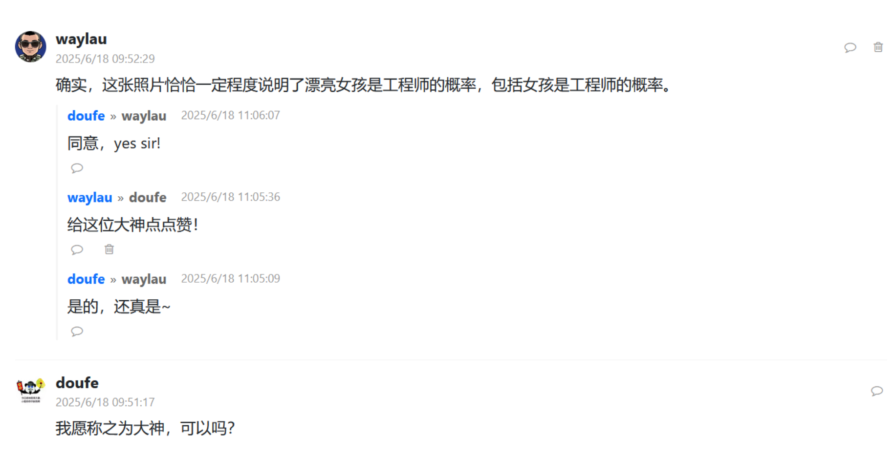


## 14.14 最佳实践及优化建议

### 最佳实践

1. 优先使用DTO：通过DTO控制序列化的数据，避免暴露敏感信息和循环引用
2. 多级评论的实现：不管多少层，最终只呈现为两层


### 优化建议

1. 性能优化：
   - 实现评论分页加载，避免一次性加载过多评论
   - 使用WebSocket实现实时评论通知
   - 实现评论折叠/展开功能

2. 防刷机制：
   - 添加评论频率限制（如每分钟不超过5条）
   - 实现评论内容敏感词过滤

3. 用户体验：
   - 添加评论提交中的加载状态
   - 实现评论成功后的自动滚动到新评论位置

4. 数据统计：
   - 添加热门评论排序
   - 统计用户评论活跃度


## 15.1 模块功能概述

在原有项目基础上实现后台管理模块，需要从权限控制、路由设计、管理界面三个层面进行改造。下面是完整的实现方案：


* 扩展为更灵活的用户角色与权限管理
* 通过配置文件的方式初始化管理员账号
* 自定义登录处理逻辑区分不同角色的登录
* 创建专门处理后台管理请求的控制器类
* 实现可重用的admin.html主模板

通过以上实现，你可以在原有的小红书项目中添加完整的后台管理模块，包括数据看板、用户管理、笔记管理、评论管理等功能，并通过权限系统确保只有管理员可以访问。


## 15.2 扩展为更灵活的用户角色与权限管理

### 设计角色


角色枚举如下：

```java
package com.example.rednote.common;

/**
 * Role 角色枚举
 *
 * @version 2025/06/18
 **/
public enum Role {
    USER("用户"),
    ADMIN("管理员");

    private final String description;

    Role(String description) {
        this.description = description;
    }

    public String getDescription() {
        return description;
    }
}
```

### 将用户关联角色


扩展User实体，添加角色字段：


```java
@Entity
@Table(name = "t_user")
@Data // @Data集合了 @ToString， @EqualsAndHashCode，所有字段的 @Getter和所有非final字段的 @Setter, @RequiredArgsConstructor
@NoArgsConstructor // 无参构造器
@AllArgsConstructor // 包含所有参数的构造器
public class User {

    // ...为节约篇幅，此处省略非核心内容
    
    /**
     * 角色
     */
    @Enumerated(EnumType.STRING)
    @Column(nullable = false)
    private Role role = Role.USER;

}
```

上述代码，在创建User时会自动默认赋值为USER角色。但原先数据库已存在的历史数据，则不一定会赋值USE角色（可能是ADMIN角色，取决于具体的数据库）。比如，在MySQL里，t_user表最终的结果如下：

```sql
mysql> DESCRIBE t_user;
+----------+----------------------+------+-----+---------+-------+
| Field    | Type                 | Null | Key | Default | Extra |
+----------+----------------------+------+-----+---------+-------+
| user_id  | bigint               | NO   | PRI | NULL    |       |
| avatar   | varchar(255)         | YES  |     | NULL    |       |
| bio      | varchar(255)         | YES  |     | NULL    |       |
| password | varchar(255)         | YES  |     | NULL    |       |
| phone    | varchar(255)         | YES  |     | NULL    |       |
| username | varchar(255)         | YES  |     | NULL    |       |
| role     | enum('ADMIN','USER') | NO   |     | NULL    |       |
+----------+----------------------+------+-----+---------+-------+
7 rows in set (0.037 sec)
```

t_user表的role字段已经是支持枚举类型了，但没有提供默认值（Default是NULL），因此，数据库会自动给role字段赋值一个默认值ADMIN或者USER。以下是在MySQL中，role字段赋值的默认值是ADMIN：


```sql
mysql> select * from t_user;
+---------+-----------------------------------------------------------------------------+--------------------------------------------------------------------------+--------------------------------------------------------------+-------------+----------+-------+
| user_id | avatar                                                                      | bio                                                                      | password                                                     | phone       | username | role  |
+---------+-----------------------------------------------------------------------------+--------------------------------------------------------------------------+--------------------------------------------------------------+-------------+----------+-------+
|       1 | /uploads/2025-08-21/35ff037f-043a-4551-8912-99b89eb11591_user_181_181.jpg | Life was like a box of chocolates, you never know what you're gonna get. | $2a$10$wfuboZNYniQBTNo5/3vuau6HKpbr0y3ktavpzH6L3jd6Yw7cbHwKm | 13411111111 | user     | ADMIN |
|       2 | NULL                                                                        | NULL                                                                     | $2a$10$5QzEQnaMCKP/jy4PCHy7Re2gJE18xzslF3JoBwgbubkYPprdtNQla | 13411111112 | bobo     | ADMIN |
+---------+-----------------------------------------------------------------------------+--------------------------------------------------------------------------+--------------------------------------------------------------+-------------+----------+-------+
2 rows in set (0.012 sec)
```


还需要手动执行如下脚本来将存量数据改为USER角色：


```
UPDATE t_user SET role = 'USER';
```


### 修改UserDetailsServiceImpl服务


修改UserDetailsServiceImpl服务，按照User实体上维护的实际的角色返回：

```java
@Override
    public UserDetails loadUserByUsername(String username) throws UsernameNotFoundException {
        // 根据用户名查询用户，判定用户是否存在
        Optional<User> optionalUser = userRepository.findByUsername(username);
        if (!optionalUser.isPresent()) {
            // 抛出用户不存在的异常
            throw new UsernameNotFoundException(ExceptionType.USERNAME_NOT_FOUND);
        }

        User user = optionalUser.get();

        // 将User转为自定义的UserDetails对象
        return new CustomUserDetails(
                user.getUserId(),
                user.getUsername(),
                user.getPassword(),
                /*// 设置所有的数据库里面的用户都是USER角色
                AuthorityUtils.createAuthorityList("ROLE_USER"));*/
                AuthorityUtils.createAuthorityList("ROLE_" + user.getRole().name()));
    }
}
```


## 15.3 通过配置文件的方式初始化管理员账号

### 配置文件中添加管理员信息

在`application.properties`或`application.yml`中添加管理员配置：

```properties
# 管理员配置
admin.username=admin
admin.password=admin123
```


### 初始化管理员账号


修改UserServiceImpl，只能加如下方法，在应用启动的时候，自动通过配置文件初始化管理员账号：

```java
import jakarta.annotation.PostConstruct;
import com.example.rednote.common.Role;

// ...为节约篇幅，此处省略非核心内容

@Value("${admin.username}")
private String adminUsername;

@Value("${admin.password}")
private String adminPassword;

@PostConstruct
public void initAdminUser() {
    // 查询数据库是否存在管理员用户
    Optional<User> optionalAdminUser = findByUsername(adminUsername);
    User adminUser;
    if (!optionalAdminUser.isPresent()) {
        // 不存在，则创建管理员用户
        adminUser = new User();
        adminUser.setUsername(adminUsername);
    } else {
        // 存在，则获取管理员用户
        adminUser = optionalAdminUser.get();
    }

    // 明文密码加密
    String encodedPassword = passwordEncoder.encode(adminPassword);
    adminUser.setPassword(encodedPassword);

    adminUser.setRole(Role.ADMIN);

    updateUser(adminUser);
}
```

### 用户服务增加查询用户名的接口

修改UserService，增加如下接口：


```java
/**
  * 根据用户名查找用户
  *
  * @param username
  * @return
  */
Optional<User> findByUsername(String username);
```


修改UserServiceImpl，增加如下接口实现：

```java
@Override
public Optional<User> findByUsername(String username) {
    return userRepository.findByUsername(username);
}
```


### 增加后台管理控制器


增加后台管理控制器AdminController，以便显示后台管理界面。


```java
package com.example.rednote.controller;

import org.springframework.stereotype.Controller;
import org.springframework.web.bind.annotation.GetMapping;
import org.springframework.web.bind.annotation.RequestMapping;

/**
 * AdminController 后台管理控制器
 *
 * @version 2025/08/23
 **/
@Controller
@RequestMapping("/admin")
public class AdminController {
    @GetMapping()
    public String goToAdmin() {
        return "admin";
    }
}
```

### 运行调测


通过以上实现，可以在项目中完整实现了角色管理功能，包括可以使用管理员账号admin进行登录。

如下图15-1所示，是admin登录应用之后，访问`/explore`页面路径的效果，提示没有权限。


如下图15-2所示，是admin访问`/admin`页面路径的效果，显示有权限。


说明基于角色的访问控制已经生效了。


通过查询数据库表t_user数据，能够看到已经初始化了用户名为admin角色为ADMIN的用户了：


```sql
mysql> select * from t_user;
+---------+-----------------------------------------------------------------------------+--------------------------------------------------------------------------+--------------------------------------------------------------+-------------+----------+-------+
| user_id | avatar                                                                      | bio                                                                      | password                                                     | phone       | username | role  |
+---------+-----------------------------------------------------------------------------+--------------------------------------------------------------------------+--------------------------------------------------------------+-------------+----------+-------+
|       1 | /uploads/2025-08-21/35ff037f-043a-4551-8912-99b89eb11591_user_181_181.jpg | Life was like a box of chocolates, you never know what you're gonna get. | $2a$10$wfuboZNYniQBTNo5/3vuau6HKpbr0y3ktavpzH6L3jd6Yw7cbHwKm | 13411111111 | user     | USER  |
|       2 | NULL                                                                        | NULL                                                                     | $2a$10$5QzEQnaMCKP/jy4PCHy7Re2gJE18xzslF3JoBwgbubkYPprdtNQla | 13411111112 | bobo     | USER  |
|      52 | NULL                                                                        | NULL                                                                     | $2a$10$Zvc89ZXXwQSaF1.PTCAPreYVgQPwEvO1aE3yFw6V.PPsZJVD6POcu | NULL        | admin    | ADMIN |
+---------+-----------------------------------------------------------------------------+--------------------------------------------------------------------------+--------------------------------------------------------------+-------------+----------+-------+
3 rows in set (0.008 sec)
```


## 15.4 自定义登录处理逻辑区分不同角色的登录

为了区分普通用户和管理员登录，可以自定义登录成功后的处理逻辑。


```java
package com.example.rednote.controller;

import com.example.rednote.common.Role;
import com.example.rednote.service.UserService;
import org.springframework.beans.factory.annotation.Autowired;
import org.springframework.stereotype.Controller;
import org.springframework.web.bind.annotation.GetMapping;
import org.springframework.web.bind.annotation.RequestMapping;

/**
 * IndexController 首页控制器
 *
 * @version 2025/08/20
 **/
@Controller
@RequestMapping("/")
public class IndexController {
    @Autowired
    private UserService userService;

    @GetMapping
    public String index() {
        /*// 重定向到首页笔记探索页面
        return "redirect:/explore";*/

        // 判定当前用户角色，如果是管理员则跳转到管理页面，否则跳转到笔记探索页面
        return "redirect:/" + (userService.getCurrentUser().getRole() == Role.ADMIN ? "admin" : "explore");
    }
}
```


默认成功登录后会重定向到`/`，这里再判定角色：

* 如果是ADMIN角色，就重定向到`/admin`；
* 否则就重定向到`/explore`。
 

通过这种方式，你可以实现普通用户存储在数据库中，而管理员账号存储在配置文件中，同时使用统一的登录入口进行身份验证。


## 15.5 创建专门处理后台管理请求的控制器类

将`/admin`路径视为后台管理请求的总路口，其他分为以下几个功能：

* `/admin/dashboard`路径处理数据看板；
* `/admin/user`路径处理用户管理；
* `/admin/note`路径处理笔记管理；
* `/admin/comment`路径处理评论管理；


AdminController修改如下：

```java
package com.example.rednote.controller;

import org.springframework.stereotype.Controller;
import org.springframework.ui.Model;
import org.springframework.web.bind.annotation.GetMapping;
import org.springframework.web.bind.annotation.RequestMapping;

/**
 * AdminController 后台管理控制器
 *
 * @version 2025/08/23
 **/
@Controller
@RequestMapping("/admin")
public class AdminController {
    @GetMapping()
    public String goToAdmin() {
        /*return "admin";*/
        // 重定向到第一个功能界面“数据看板”
        return "redirect:/admin/dashboard";
    }

    /**
     * 显示数据看板界面
     */
    @GetMapping("/dashboard")
    public String dashboard(Model model) {
        model.addAttribute("contentFragment", "admin-dashboard");
        return "admin";
    }

    /**
     * 显示用户管理界面
     */
    @GetMapping("/user")
    public String user(Model model) {
        model.addAttribute("contentFragment", "admin-user");
        return "admin";
    }

    /**
     * 显示笔记管理界面
     */
    @GetMapping("/note")
    public String note(Model model) {
        model.addAttribute("contentFragment", "admin-note");
        return "admin";
    }

    /**
     * 显示评论管理界面
     */
    @GetMapping("/comment")
    public String comment(Model model) {
        model.addAttribute("contentFragment", "admin-comment");
        return "admin";
    }
}
```


上述代码，当访问`/admin`路径时，会重定向到`/admin/dashboard`。

四个功能都是使用相同的admin.html主模板，并在运行时自动替换为不通过功能的模板片段contentFragment。


## 15.6 实现可重用的admin.html主模板

admin.html主模板实现了：

* 导航栏
* 菜单
* 内容区域


```html
<!DOCTYPE html>
<html lang="en" xmlns:th="http://www.thymeleaf.org">
<head>
    <meta charset="UTF-8">
    <meta name="viewport" content="width=device-width, initial-scale=1.0">
    <title>RN - 后台管理</title>
    <!-- 引入 Bootstrap CSS -->
    <link href="https://cdn.bootcdn.net/ajax/libs/bootstrap/5.3.6/css/bootstrap.min.css"
          th:href="@{/css/bootstrap.min.css}" rel="stylesheet">

    <!-- 引入 Font Awesome -->
    <link href="https://cdn.bootcdn.net/ajax/libs/font-awesome/4.7.0/css/font-awesome.min.css"
          th:href="@{/css/font-awesome.min.css}" rel="stylesheet">

    <style>
        /* 全局样式 */
        body {
            font-family: -apple-system, BlinkMacSystemFont, "Segoe UI", Roboto, "Helvetica Neue", Arial, sans-serif;
            background-color: #f5f5f5;
        }

        .bi {
            display: inline-block;
            width: 1rem;
            height: 1rem;
        }

        /*
        * Sidebar
        */
        @media (min-width: 768px) {
            .sidebar .offcanvas-lg {
                position: -webkit-sticky;
                position: sticky;
                top: 48px;
            }

            .navbar-search {
                display: block;
            }

            .sidebar .nav-link {
                font-size: .875rem;
                font-weight: 500;
            }

            .sidebar .nav-link.active {
                color: #2470dc;
            }

            .sidebar-heading {
                font-size: .75rem;
            }
        }
    </style>
</head>
<!--导航栏-->
<header class="navbar navbar-expand-lg">
    <div class="container">
        <a class="navbar-brand" href="/" th:href="@{/}">
            
        </a>

        <button class="navbar-toggler" type="button" data-bs-toggle="collapse" data-bs-target="#sidebarMenu"
                aria-controls="navbarNav" aria-expanded="false" aria-label="Toggle navigation">
            <span class="navbar-toggler-icon"></span>
        </button>
    </div>
</header>

<body>
<div class="container">
    <div class="row">
        <!--菜单-->
        <div class="sidebar border border-right col-md-3 col-lg-2 p-0 bg-body-tertiary">
            <div class="offcanvas-md offcanvas-end bg-body-tertiary" tabindex="-1" id="sidebarMenu"
                 aria-labelledby="sidebarMenuLabel">
                <div class="offcanvas-body d-md-flex flex-column p-0 pt-lg-3 overflow-y-auto">
                    <ul class="nav flex-column">
                        <li class="nav-item">
                            <a class="nav-link d-flex align-items-center gap-2 active" aria-current="page"
                               href="/admin/dashboard" th:href="@{/admin/dashboard}">
                                <i class="fa fa-tachometer"></i>
                                数据看板
                            </a>
                        </li>
                        <li class="nav-item">
                            <a class="nav-link d-flex align-items-center gap-2" aria-current="page"
                               href="/admin/user" th:href="@{/admin/user}">
                                <i class="fa fa-users"></i>
                                用户管理
                            </a>
                        </li>
                        <li class="nav-item">
                            <a class="nav-link d-flex align-items-center gap-2" aria-current="page"
                               href="/admin/note" th:href="@{/admin/note}">
                                <i class="fa fa-file-text"></i>
                                笔记管理
                            </a>
                        </li>
                        <li class="nav-item">
                            <a class="nav-link d-flex align-items-center gap-2" aria-current="page"
                               href="/admin/comment" th:href="@{/admin/comment}">
                                <i class="fa fa-comments"></i>
                                评论管理
                            </a>
                        </li>
                    </ul>
                    <hr class="my-3">
                    <ul class="nav flex-column mb-auto">
                        <li class="nav-item">
                            <form method="post" th:action="@{/logout}" action="/logout">
                                <input type="submit" class="nav-link" value="退出登录">
                            </form>
                        </li>
                    </ul>
                </div>
            </div>
        </div>
        <!--内容区域-->
        <main class="col-md-9 ms-sm-auto col-lg-10 px-md-4">
            <!--代码片段-->
            <div th:replace="~{${contentFragment}}"></div>
        </main>
    </div>
</div>


<!-- Bootstrap JS -->
<script src="https://cdn.bootcdn.net/ajax/libs/bootstrap/5.3.6/js/bootstrap.bundle.min.js"
        th:src="@{/js/bootstrap.bundle.min.js}"></script>

</body>
</html>
```


其中，菜单可以跳转到不同的子功能的页面。子功能的页面内容区域通过`th:replace="~{${contentFragment}}"`来实现动态替换不同的HTML片段。


## 15.7 数据看板功能的实现

### 定义页面片段

新增admin-dashboard.html文件，数据看板HTML页面片段定义如下：

```html
<!DOCTYPE html>
<html lang="en" xmlns:th="http://www.thymeleaf.org" xmlns:sec="http://www.thymeleaf.org/extras/spring-security">

<body>
    <!-- 定义片段 -->
    <div th:fragment="admin-dashboard">
        <div class="card shadow mb-4">
            <div class="card-header py-3">
                <h2>数据看板</h2>
            </div>
            <div class="card-body">
                <!-- 统计卡片 -->
                <div class="col-xl-3 col-md-6 mb-4">
                    <div class="card border-left-primary shadow h-100 py-2">
                        <div class="card-body">
                            <div class="row no-gutters align-items-center">
                                <div class="col mr-2">
                                    <div class="text-xs font-weight-bold text-primary text-uppercase mb-1">用户总数</div>
                                    <div class="h5 mb-0 font-weight-bold text-gray-800" th:text="${userCount}">0</div>
                                </div>
                                <div class="col-auto">
                                    <i class="fa fa-users fa-2x text-gray-300"></i>
                                </div>
                            </div>
                        </div>
                    </div>
                </div>

                <div class="col-xl-3 col-md-6 mb-4">
                    <div class="card border-left-success shadow h-100 py-2">
                        <div class="card-body">
                            <div class="row no-gutters align-items-center">
                                <div class="col mr-2">
                                    <div class="text-xs font-weight-bold text-success text-uppercase mb-1">笔记总数</div>
                                    <div class="h5 mb-0 font-weight-bold text-gray-800" th:text="${noteCount}">0</div>
                                </div>
                                <div class="col-auto">
                                    <i class="fa fa-file-text fa-2x text-gray-300"></i>
                                </div>
                            </div>
                        </div>
                    </div>
                </div>

                <div class="col-xl-3 col-md-6 mb-4">
                    <div class="card border-left-info shadow h-100 py-2">
                        <div class="card-body">
                            <div class="row no-gutters align-items-center">
                                <div class="col mr-2">
                                    <div class="text-xs font-weight-bold text-info text-uppercase mb-1">评论总数</div>
                                    <div class="h5 mb-0 font-weight-bold text-gray-800" th:text="${commentCount}">0
                                    </div>
                                </div>
                                <div class="col-auto">
                                    <i class="fa fa-comments fa-2x text-gray-300"></i>
                                </div>
                            </div>
                        </div>
                    </div>
                </div>
            </div>
        </div>
    </div>
</body>

</html>
```


上述片段的名称为“admin-dashboard”。

### 统计用户数

UserRepository新增如下接口：

```java
/**
  * 统计用户数
  *
  * @return
  */
long count();
```


UserService新增如下接口：

```java
/**
  * 统计用户数
  *
  * @return
  */
long countUsers();
```


UserServiceImpl新增如下方法：

```java
@Override
public long countUsers() {
    return userRepository.count();
}
```

### 统计笔记数

NoteRepository新增如下接口：

```java
/**
  * 统计笔记数
  *
  * @return
  */
long count();
```


NoteService新增如下接口：

```java
/**
  * 统计笔记数
  *
  * @return
  */
long countNotes();
```


NoteServiceImpl新增如下方法：

```java
@Override
public long countNotes() {
    return noteRepository.count();
}
```


### 统计评论数

CommentRepository新增如下接口：

```java
/**
  * 统计评论数
  *
  * @return
  */
long count();
```


CommentService新增如下接口：

```java
/**
  * 统计评论数
  *
  * @return
  */
long countComments();
```


CommentServiceImpl新增如下方法：

```java
@Override
public long countComments() {
    return commentRepository.count();
}
```

### 修改控制器


AdminController修改如下：

```java
@GetMapping("/dashboard")
public String dashboard(Model model) {
    // 统计数据
    long userCount = userService.countUsers();
    long noteCount = noteService.countNotes();
    long commentCount = commentService.countComments();

    model.addAttribute("userCount", userCount);
    model.addAttribute("noteCount", noteCount);
    model.addAttribute("commentCount", commentCount);

    model.addAttribute("contentFragment", "admin-dashboard");

    return "admin";
}
```

### 运行调测


如下图15-3所示，是账号admin访问`/admin`页面路径的效果，重定向到了`/admin/dashboard`页面。


admin.html模版采用了响应式的布局，即便在移动设备上，也能能有很好的适配。如下图15-4所示，是在移动设备上访问`/admin`页面的效果。


点击右上角的按钮，也可以展示完整菜单，如下图15-5所示

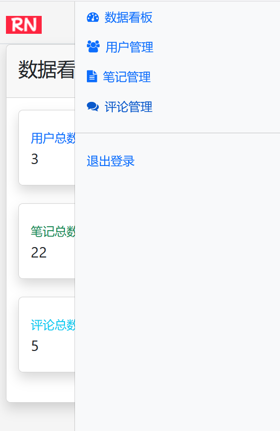


## 15.8 设计用户管理功能的用户分页查询

### 定义页面片段

新增admin-user.html文件，用户管理功能HTML页面片段定义如下：

```html
<!DOCTYPE html>
<html lang="en" xmlns:th="http://www.thymeleaf.org">
<body>
<!-- 定义片段 -->
<div th:fragment="admin-user">
    <div class="card shadow mb-4">
        <div class="card-header py-3">
            <h2>用户列表</h2>
        </div>
        <div class="card-body">
            <div class="table-responsive small">
                <table class="table table-striped table-sm">
                    <thead>
                    <tr>
                        <th>ID</th>
                        <th>用户名</th>
                        <th>电话</th>
                        <th>角色</th>
                        <th>操作</th>
                    </tr>
                    </thead>
                    <tbody>
                    <tr th:each="user:${userPage.content}">
                        <td th:text="${user.userId}">1</td>
                        <td th:text="${user.username}">user</td>
                        <td th:text="${user.phone}">13412345678</td>
                        <td th:text="${user.role}">USER</td>
                        <td>
                            <button class="btn btn-sm btn-light">编辑</button>
                            <button class="btn btn-sm btn-danger">删除</button>
                        </td>
                    </tr>
                    </tbody>
                </table>
            </div>

            <!-- 分页控件 -->
            <div class="d-flex justify-content-center">
                <nav>
                    <ul class="pagination">
                        <li class="page-item" th:classappend="${userPage.first} ? 'disabled' : ''">
                            <a class="page-link" href="#" th:href="@{/admin/user(page=${userPage.number})}">
                                上一页
                            </a>
                        </li>
                        <li class="page-item" th:classappend="${userPage.number+1 == i} ? 'active' : ''"
                            th:each="i : ${#numbers.sequence(1,userPage.totalPages)}">
                            <a class="page-link" href="#" th:href="@{/admin/user(page=${i})}" th:text="${i}">
                                1
                            </a>
                        <li class="page-item" th:classappend="${userPage.last} ? 'disabled' : ''">
                            <a class="page-link" href="#" th:href="@{/admin/user(page=${userPage.number+1+1})}">
                                下一页
                            </a>
                        </li>
                    </ul>
                </nav>
            </div>
        </div>
    </div>
</div>
</body>
</html>
```


上述片段的名称为“admin-user”。

### 分页查询所有用户

UserRepository新增如下接口：

```java
/**
  * 分页查询所有用户
  *
  * @param pageable
  * @return
  */
Page<User> findAll(Pageable pageable);
```


UserService新增如下接口：

```java
/**
  * 分页查询所有用户
  *
  * @param page
  * @param size
  * @return
  */
Page<User> getAllUsers(int page, int size);
```


UserServiceImpl新增如下方法：

```java
@Override
    public Page<User> getAllUsers(int page, int size) {
        // 构造Pageable对象，按照用户ID倒序排序
        Pageable pageable = PageRequest.of(page - 1, size, Sort.by("userId").descending());
        return userRepository.findAll(pageable);
    }
}
```


### 修改控制器


AdminController新增如下方法：

```java
private static final int PAGE_SIZE = 10;

/**
 * 显示用户管理界面
 */
@GetMapping("/user")
/*public String user(Model model) {*/
public String user(Model model, @RequestParam(defaultValue = "1") int page) {
    // 分页查询所有用户数据
    Page<User> userPage = userService.getAllUsers(page, PAGE_SIZE);

    model.addAttribute("userPage", userPage);
    model.addAttribute("contentFragment", "admin-user");
    return "admin";
}
```

### 运行调测


如下图15-6所示，是账号admin访问`/admin/user`页面路径的效果。


如下图15-7所示，是在移动设备上访问`/admin/user`页面的效果。


## 15.9 设计用户管理功能的编辑用户操作

### “编辑”按钮上设置点击事件

在admin-user.html文件的“编辑”按钮上设置点击事件，以便跳转到编辑页面，修改如下：

```html
<button class="btn btn-sm btn-light"
        th:onclick="'window.location.href=\'' + @{/admin/user/{userId}/edit(userId=${user.userId})} + '\''">
    编辑
</button>
```


上述代码会重定向到编辑页面。

### 编辑页面控制器

编辑页面控制器如下：

```java
/**
 * 显示用户编辑界面
 */
@GetMapping("/user/{userId}/edit")
public String editUser(@PathVariable Long userId, Model model) {
    // 判定用户是否存在，不存在则抛出异常
    Optional<User> optionalUser = userService.findByUserId(userId);
    if (!optionalUser.isPresent()) {
        throw new UserNotFoundException("");
    }

    model.addAttribute("user", optionalUser.get());
    model.addAttribute("contentFragment", "admin-user-edit");

    return "admin";
}
```

根据userId查询到用户数据，并绑定到admin.html页面上。同时设置了代码片段为“admin-user-edit”。


### 新增代码片段admin-user-edit.html

```html
<!DOCTYPE html>
<html lang="en" xmlns:th="http://www.thymeleaf.org">
<body>
<!-- 定义片段 -->
<div th:fragment="admin-user">
    <div class="card shadow mb-4">
        <div class="card-header py-3">
            <h2>编辑用户</h2>
        </div>
        <div class="card-body">
            <form th:action="@{/admin/user}" method="post" th:object="${user}">
                <!-- 隐藏用户ID -->
                <input type="hidden" name="userId" th:field="*{userId}">

                <div class="row">
                    <div class="col-lg-6">
                        <!-- 用户名不可编辑 -->
                        <div class="form-group">
                            <label for="username">用户名 <span class="text-danger">*</span></label>
                            <input type="text" class="form-control" id="username" name="username"
                                   th:field="*{username}" disabled>
                        </div>

                        <!-- 密码 -->
                        <div class="form-group">
                            <label for="password">密码</label>
                            <input type="password" class="form-control" id="password" name="password"
                                   th:field="*{password}" placeholder="不修改请留空">
                            <div class="small text-muted">留空则不修改密码</div>
                        </div>

                        <!-- 手机号 -->
                        <div class="form-group">
                            <label for="phone">手机号 <span class="text-danger">*</span></label>
                            <input type="text" class="form-control" id="phone" name="phone"
                                   th:field="*{phone}" placeholder="请输入手机号">
                        </div>
                    </div>
                </div>

                <!-- 操作按钮 -->
                <div class="mt-4">
                    <button type="submit" class="btn btn-primary mr-2">保存</button>
                    <button type="button" class="btn btn-secondary"
                            th:onclick="history.back()">取消
                    </button>
                </div>
            </form>
        </div>
    </div>
</div>
</body>
</html>
```

### 运行调测


如下图15-8所示，访问编辑用户页面的效果。


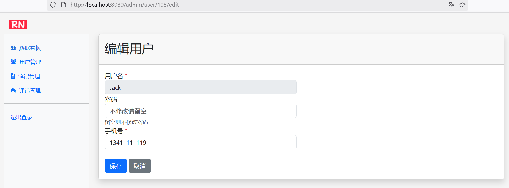


如下图15-9所示，是在移动设备上访问编辑用户页面。


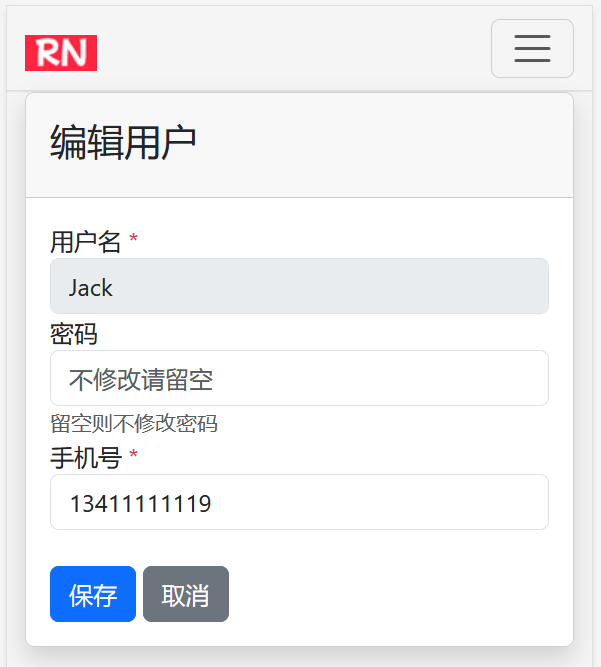


### 保存编辑后的数据

当点击“保存”时，会发送保存数据到后台接口。后台控制器AdminController增加如下方法：


```java
/**
 * 处理保存用户的请求
 */
@PostMapping("/user")
public String updateUser(@ModelAttribute User user) {
    // 判定用户是否存在，不存在则抛出异常
    Optional<User> optionalUser = userService.findByUserId(user.getUserId());
    if (!optionalUser.isPresent()) {
        throw new UserNotFoundException("");
    }

    User oldUser = optionalUser.get();

    // 更新用户
    userService.updateUserByAdmin(oldUser, user);
    return "redirect:/admin/user";
}
```


UserService新增如下接口：

```java
/**
 * 管理员更新用户
 *
 * @param oldUser
 * @param user
 */
void updateUserByAdmin(User oldUser, User user);
```


UserServiceImpl新增如下方法：

```java
@Override
public void updateUserByAdmin(User oldUser, User user) {
    // 更新基本信息
    oldUser.setPhone(user.getPhone());

    // 更新密码前先判定是否需要更新
    if (user.getPassword() != null && !user.getPassword().isEmpty()) {
        String encodedPassword = passwordEncoder.encode(user.getPassword());
        oldUser.setPassword(encodedPassword);
    }

    userRepository.save(oldUser);
}
```


## 15.10 设计用户管理功能的删除用户操作

### “删除”按钮上设置点击事件

在admin-user.html文件的“删除”按钮上设置点击事件，以便跳转到删除请求，修改如下：

```html
<button class="btn btn-sm btn-danger" th:onclick="deleteUser([[${user.userId}]])">
    删除
</button>
```


确保有一个meta标签来存储CSRF令牌：


```html
<!-- 确保有一个meta标签来存储CSRF令牌 -->
<meta name="_csrf" th:content="${_csrf.token}"></meta>
```
    


事件处理逻辑如下：


```js
<script th:inline="javascript">
    // 删除用户
    function deleteUser(userId) {
        // 先确认是否删除用户
        if (!confirm('确定要删除该用户吗？')) {
            return;
        }

        // 发送请求
        fetch('/admin/user/' + userId, {
            method: 'DELETE',
                // 添加请求头, 用于Spring Security CSRF
                headers: {
                    'X-CSRF-TOKEN': document.querySelector('meta[name="_csrf"]').getAttribute('content')
                }
           })
           .then(response => {
               if (response.ok) {
                    response.json().then(data => {
                        // 从响应中获取提示信息
                        alert(data.message || '删除成功');

                        // 从响应中获取重定向URL
                        window.location.href = data.redirectUrl;
                    });
               } else  {
                   response.json().then(data => {
                       alert(data.message || '删除失败，请重试');
                   });
               }
           })
           .catch(error => {
               console.error('删除失败：', error);
               alert('删除失败，请稍后重试');
           })
    }
</script>
```

上述代码会向后端发送删除请求。

### 删除请求控制器

在AdminController中增加如下删除请求方法如下：

```java
/**
 * 处理用户删除的请求
 */
@DeleteMapping("/user/{userId}")
public ResponseEntity<DeleteResponseDto> deleteUser(@PathVariable Long userId) {
    // 判定用户是否存在，不存在则抛出异常
    Optional<User> optionalUser = userService.findByUserId(userId);
    if (!optionalUser.isPresent()) {
        throw new UserNotFoundException("");
    }

    userService.deleteUser(userId);

    DeleteResponseDto deleteResponseDto = new DeleteResponseDto();
    deleteResponseDto.setMessage("用户删除成功");
    deleteResponseDto.setRedirectUrl("/admin/user");

    return ResponseEntity.ok(deleteResponseDto);
}
```


### 删除服务


UserRepository新增如下接口：

```java
/**
  * 根据用户删除ID
  *
  * @param userId
  */
void deleteById(Long userId);
```


UserService新增如下接口：

```java
/**
  * 删除用户
  *
  * @param userId
  */
void deleteUser(Long userId);
```


UserServiceImpl新增如下方法：

```java
@Override
public void deleteUser(Long userId) {
    userRepository.deleteById(userId);
}
```


如下图15-10所示，是在移动设备上访问删除用户成功后的效果。


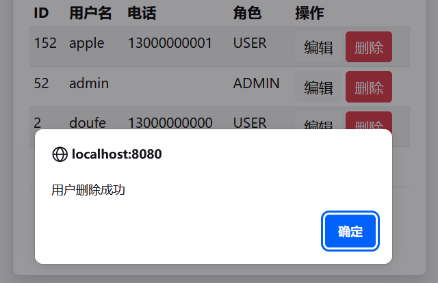


## 15.11 其他功能的处理及安全总结、优化建议

### 其他功能的处理

受限于篇幅，其他功能如笔记管理、评论管理等，实现的过程与用户管理类似，这里就不再赘述。


笔记管理、评论管理等功能简单处理如下。


#### 笔记管理定义页面片段

新增admin-note.html文件，HTML页面片段定义如下：


```html
<!DOCTYPE html>
<html lang="en" xmlns:th="http://www.thymeleaf.org">
<body>
<!-- 定义片段 -->
<div th:fragment="admin-note">
    <div class="card shadow mb-4">
        <div class="card-header py-3">
            <h2>笔记管理</h2>
        </div>
        <!-- 笔记管理 -->
        <div class="card-body">
            <p>暂未开放，敬请期待！</p>
        </div>

    </div>
</div>
</body>
</html>
```

#### 评论管理定义页面片段

新增admin-note.html文件，HTML页面片段定义如下：

```html
<!DOCTYPE html>
<html lang="en" xmlns:th="http://www.thymeleaf.org">
<body>
<!-- 定义片段 -->
<div th:fragment="admin-comment">
    <div class="card shadow mb-4">
        <div class="card-header py-3">
            <h2>评论管理</h2>
        </div>
        <!-- 评论管理 -->
        <div class="card-body">
            <p>暂未开放，敬请期待！</p>
        </div>

    </div>
</div>
</body>
</html>
```


最终两个界面的效果如下图15-11、图15-12所示。


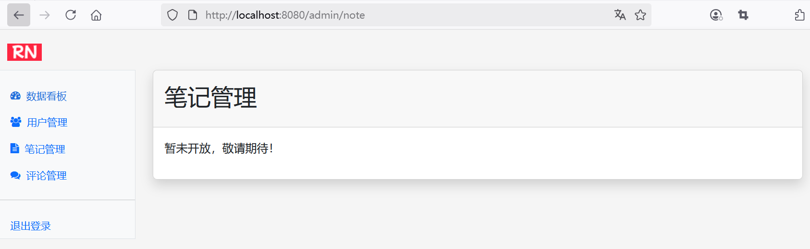

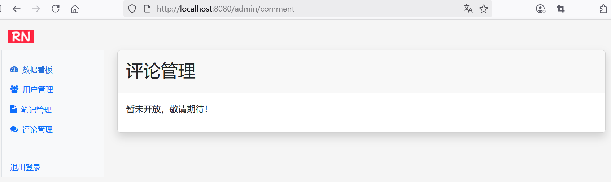


### 安全总结

1. 权限区分：
   - 为管理员和普通用户设置不同的角色

1. 密码加密：
   - 在生产环境中，永远不要使用明文密码（如 `{noop}`）
   - 使用BCrypt或Argon2等强哈希算法加密密码
   - 可以使用`BCryptPasswordEncoder`工具类生成加密密码：


### 优化建议

1. 数据可视化：使用Chart.js或ECharts实现数据图表
2. 搜索过滤：添加搜索和过滤功能
3. 操作日志：记录管理员操作
4. 批量操作：支持批量删除、审核等操作
5. 权限细分：实现更细粒度的权限控制（如菜单权限、按钮权限）
6. 多环境配置：
   - 开发环境可以使用配置文件快速配置
   - 生产环境应使用数据库存储用户信息
7. 安全风险：
   - 配置文件中的密码可能会被意外提交到版本控制系统
   - 考虑使用环境变量或Spring Cloud Config等工具保护敏感信息
   - 限制管理员登录IP范围
   - 添加登录失败次数限制
   - 为管理员账号启用两步验证


## 16.1 课程总结

这个系列实现是仿“小红书”单体项目，演示了基于以Spring Boot为核心的全栈开发过程。

* 评估现状：人少、项目急。
* 围绕Java+AI技术栈快速交付。
* 项目需求分析与架构设计。
* Spring Boot简化Spring项目搭建
* 全栈下的用户模块注册功能实现
* 全栈下的用户模块登录功能实现
* 全栈下的用户模块信息管理功能实现
* 全栈下的笔记模块发布功能实现
* 全栈下的笔记模块列表展示功能实现
* 全栈下的笔记模块笔记详情功能实现
* 全栈下的笔记模块编辑、删除功能实现
* 全栈下的首页模块笔记探索功能实现
* 全栈下的首页模块搜索及瀑布流实现
* 全栈下的点赞模块实现
* 全栈下的评论模块实现
* 全栈下的后台管理模块实现
