> 本页为原「Java 课程 9」全部 41 个分节的合订本；原分节链接会自动跳转到本页。


## 1.1 课程介绍

这个系列在仿“小红书”单体项目基础上，介绍了分布式系统全栈开发的完整知识体系。力求让读者建立起对构建分布式系统的认知框架，能够掌握解决架构设计能力不足痛点。

* 全栈下的分布式节点设计基础
* 全栈下的分布式通信体系基础-I/O
* 全栈下的分布式通信体系基础-并发与并行
* 全栈工程师必备-分布式系统架构设计原理
* 全栈工程师必备-分布式系统架构设计模式
* 全栈工程师必备-分布式系统架构设计方法


## 2.1 全栈工程师如何看待从单体到分布式的架构演进？

全栈工程师处于“前端-后端-运维”的交叉视角，对从单体到分布式的架构演进有着更立体的理解——既不仅关注技术栈的堆砌，而是业务规模、团队协作、系统韧性三者共同驱动的必然选择，同时也伴随着复杂度的转移与平衡。以下从全栈视角解析这一演进的核心逻辑：


### 一、演进的本质：从“简单耦合”到“可控复杂”
全栈工程师往往是架构演进的“亲历者”：早期单体架构中，前后端代码可能在一个仓库、一个部署包中，数据库单库单表，开发效率高但扩展受限；随着业务增长（用户量、数据量、功能模块激增），单体架构的“牵一发而动全身”成为瓶颈，分布式架构通过拆分与解耦解决这一问题。

- 单体架构的“甜蜜期”：  
  全栈工程师能快速上手（前后端交互直接通过内部API），部署简单（打包一个JAR/WAR即可），调试方便（本地启动一个服务即可跑通全流程）。适合MVP验证、小团队协作（10人以内）、功能稳定的场景。
  
- 分布式架构的“必要性”：  
  当业务进入增长期（日活10万+、功能模块20+），全栈工程师会直观感受到单体的痛点：  
  - 前端迭代依赖后端发布（改一个按钮可能需要全量部署）；  
  - 后端某模块bug（如订单系统）会拖垮整个应用（包括笔记、用户等无关模块）；  
  - 数据库成为瓶颈（读写压力集中，单表数据量过亿）。  
  此时分布式架构通过“微服务拆分”“读写分离”“缓存集群”等手段，将复杂度分散到多个独立单元，实现“局部故障不影响全局”“按需扩展”。


### 二、全栈视角下的核心挑战：复杂度的“转移”而非“消失”
分布式架构解决了单体的扩展性问题，但全栈工程师更能体会到复杂度从“代码层”转移到“跨层协作”：

1. 前后端交互：从“直接调用”到“服务发现+网关”  
   - 单体时代：前端直接调用`/api/note/create`（后端Controller接口）；  
   - 分布式时代：前端请求先经过网关（如Spring Cloud Gateway），由网关路由到“笔记微服务”，中间涉及服务注册发现（Nacos/Eureka）、负载均衡。  
   - 全栈应对：前端需理解网关路由规则，处理服务降级/熔断的异常（如显示“服务暂时不可用”）；后端需设计统一的API规范（如RESTful、Swagger文档），避免前端对接混乱。

2. 数据一致性：从“单库事务”到“分布式事务”  
   - 单体时代：一个`@Transactional`注解即可保证“创建笔记+扣减积分”的原子性；  
   - 分布式时代：笔记服务、积分服务分属不同数据库，需用TCC、SAGA等方案保证最终一致性。  
   - 全栈应对：后端需设计补偿机制（如积分扣减失败时回滚笔记发布）；前端需处理“中间状态”（如显示“发布中，请稍后刷新”）。

3. 部署与监控：从“单机部署”到“容器化+链路追踪”  
   - 单体时代：`java -jar app.jar`即可部署，日志查看`tail -f app.log`；  
   - 分布式时代：需用Docker/K8s编排多个服务实例，通过SkyWalking追踪跨服务调用链路，用Prometheus监控各节点性能。  
   - 全栈应对：后端需编写Dockerfile，前端需理解CI/CD流程（如Jenkins自动部署），共同参与监控告警规则设计（如前端接口超时告警）。


### 三、演进的“度”：拒绝“为分布式而分布式”
全栈工程师因接触业务全链路，更能判断架构演进的“性价比”，避免陷入“过度设计”：

- 小业务用单体，快速验证：  
  若产品处于早期（如日活1万以内），全栈工程师应优先选择单体架构（如Spring Boot+Thymeleaf应用），用分层、分包、模块化（而非微服务）实现代码隔离，保留未来拆分的可能性。

- 中大型业务分步演进，而非“一步到位”：  
  演进路径通常是：  
  「单体应用（模块化）」→「垂直拆分（按业务线拆分为用户服务、内容服务）」→「水平拆分（内容服务拆分为笔记服务、评论服务）」→「引入中间件（缓存、消息队列、网关）」。  
  全栈工程师需在每一步评估投入产出：例如，先通过“读写分离”解决数据库压力，而非直接上分库分表；先用Redis单机缓存，再考虑集群。

- 关注“用户体验”这一最终标尺：  
  分布式架构的技术优化（如缓存、CDN）最终要体现为前端的“更快加载”“更少卡顿”；而分布式带来的复杂性（如服务超时）也需前端通过“骨架屏”“重试机制”等手段掩盖，全栈协作才能让用户感知不到架构的变迁。


### 四、全栈工程师的角色：架构演进的“翻译官”与“平衡者”
- 技术到业务的“翻译”：将分布式技术术语（如“服务熔断”）转化为产品语言（“避免某功能故障导致整个APP崩溃”），帮助团队判断优先级。  
- 前后端的“桥梁”：例如，后端引入消息队列异步处理图片上传后，前端需调整交互（显示“上传中”动画），全栈工程师可协调双方制定交互规范。  
- 复杂度的“平衡者”：在“技术完美”与“业务可用”间取舍——例如，初期可用“本地消息表”实现简单的分布式事务，而非直接上Seata框架增加学习成本。


### 总结
从全栈视角看，单体到分布式的演进不仅仅是“技术升级”，而是业务发展到一定阶段的“必然选择”与“妥协艺术”：既要通过拆分解决扩展性问题，又要通过全栈协作控制复杂度，最终服务于“用户体验”与“业务增长”。全栈工程师的价值，正在于既能理解技术细节，又能站在业务视角把握演进的节奏与边界。


## 2.2 分布式系统概述，帮助全栈工程师构建分布式系统认知框架

对于全栈工程师而言，分布式系统并非单纯的“后端技术集合”，而是贯穿“前端交互-后端服务-数据存储-运维部署”的全链路协同体系。构建分布式系统认知，核心是理解“如何将复杂业务拆分为独立单元，并通过规则让单元协同工作，同时解决拆分带来的新问题”。以下从“核心定义-本质特征-核心组件-全栈视角挑战-演进逻辑”五个维度，搭建全栈工程师的分布式系统认知框架。


### 什么是分布式系统？


分布式系统的本质是“多节点协作完成单节点无法胜任的任务”，但需先明确两个关键前提：
- 物理分散：节点（服务器、数据库、缓存实例等）不在同一台物理设备上，可能跨机房、跨地域（如阿里云上海节点+北京节点）；
- 逻辑统一：用户/前端感知不到“多节点”的存在，认为是一个完整系统（例如用户刷小红书笔记，不会察觉笔记来自“北京内容服务节点”，评论来自“上海评论服务节点”）。

对比单体系统：单体系统是“单节点包含所有功能”（如一个JAR包包含笔记、用户、评论模块，一个数据库存储所有数据），而分布式系统是“多节点各司其职，通过网络交互协作”。


### 分布式系统常用术语

分布式系统是一门新兴的学科。为了方便后续章节的学习，先了解下分布式系统中常用的术语。

#### 1. 节点

节点（Node）是指一个可以独立按照分布式协议完成一组逻辑的程序个体。在具体的工程项目中，一个节点往往是一个操作系统上的进程。节点是一个完整的、不可分的整体，是执行分布式任务的最小的单元。

在这个高可用的分布式系统中，相同功能的程序往往会部署到不同的节点中。这种模式也称为“副本”。


#### 2. 副本

副本（Replica）指在分布式系统中为数据或服务提供的冗余。

对于数据副本而言，是指在不同的节点上持久化同一份数据，当出现某一个节点的存储的数据丢失时，可以从副本上读到数据。数据副本是分布式系统解决数据丢失异常的唯一手段。

对于服务副本而言，是指数个节点提供某种相同的服务，这种服务一般并不依赖于节点的本地存储，其所需数据一般来自其他节点。服务副本也称为“服务实例”。

例如，GFS系统的同一个chunk的数个副本就是典型的数据副本，而Map Reduce系统的Job Worker则是典型的服务副本。

图2-1展示的是一个微服务架构图，其中相同的服务会有多个服务实例（服务副本）。

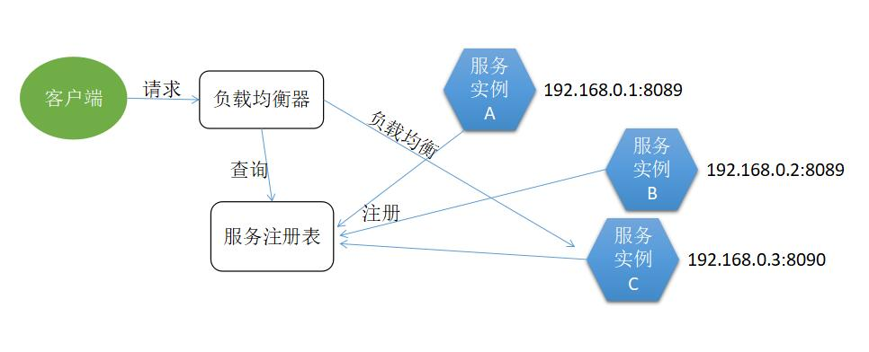


#### 3. 集群

相同功能程序的副本，统称为该功能的集群。

#### 4. 通信

节点与节点之间是完全独立、相互隔离的，节点之间传递信息的唯一方式是网络通信（Communication）。图1-1中带箭头的直线表示了节点之间的消息通信。

消息通信可以是双向的或者是单向的。使用双箭头表示网络双向可达，而某些节点间只有单箭头表示网络单向可达，而某些节点间没有箭头表示网络完全不可达。


#### 5. 存储

节点可以通过将数据写入某台机器的本地存储（Storage）设备来保存数据。通常的存储设备可以是磁盘、SSD、文件，也可以是关系型数据库、NoSQL数据库、文件存储系统等。


#### 6. 状态

如果某个节点负责存储、读取数据，则该节点为有状态的节点，反之称为无状态的节点。如果某个节点A存储数据的方式是将数据通过网络发送到另一个节点B，由节点B负责将数据存储到节点B的本地存储设备，那么不能认为节点A是有状态的节点，而只有节点B是有状态的节点。

#### 7. 异常

异常主要是针对某个节点而言的。异常可能是由网络故障引起的，也可能是程序自身引起的。

注意，在高可用的分布式系统中，单个节点的异常，并不一定会影响整个分布式系统。分布式系统往往会设计一定的容错性。


#### 8. 性能

无论是分布式系统还是单机程序，都会对性能（Performance）有有所要求。对于不同的系统，关注点有所差异。常见的性能指标有：

* 吞吐能力，指系统在某一时间可以处理的数据总量，通常可以用系统每秒处理的总的数据量来衡量；
* 响应延迟，指系统完成某一功能需要使用的时间；
* 并发能力，指系统可以同时完成某一功能的能力，通常也用QPS（query per second，每秒请求数）来衡量。

上述三个性能指标往往会相互制约，追求高吞吐的系统，往往很难做到低延迟；系统平均响应时间较长时，也很难提高QPS。


#### 9. 一致性

分布式系统为了提高可用性，总是不可避免的使用副本的机制，从而引发副本一致性的问题。

根据具体的业务需求的不同，分布式系统总是提供某种一致性模型，并基于此模型提供具体的服务。


### 分布式系统的3个本质特征

全栈工程师需从“前后端协同视角”理解这些特征——它们既是分布式的优势，也是所有问题的根源：

#### 1. 去中心化：从“单点依赖”到“多节点协作”
- 核心逻辑：没有任何一个节点是“绝对核心”，每个节点只负责部分功能（如笔记服务只处理笔记CRUD，用户服务只处理登录注册），节点间通过网络协议（HTTP、RPC、MQ）通信。
- 全栈视角体现：
  - 前端：调用“创建笔记”接口时，无需关心背后是1个还是10个笔记服务实例（网关会自动路由）；
  - 后端：某笔记服务实例宕机，其他实例会接管请求，用户感知不到中断；
  - 风险点：节点间通信依赖网络，一旦网络延迟/中断，会出现“服务不可用”或“数据不一致”（如前端点击“发布笔记”，后端笔记服务成功但通知评论服务失败）。

#### 2. 可扩展性：按需扩容，应对业务增长
- 核心逻辑：单体系统只能“整机扩容”（给服务器加CPU/内存），而分布式系统支持“按需扩容”——哪个模块压力大，就扩哪个模块的节点。
- 全栈视角体现：
  - 后端：小红书笔记模块日活激增时，只需新增10个笔记服务实例，无需动用户、评论服务；数据库读写压力大时，可单独扩读库节点；
  - 前端：通过CDN（分布式内容分发网络）将静态资源（图片、JS/CSS）部署到全国节点，用户访问时自动拉取最近节点的资源，加载速度从500ms降至100ms；
  - 关键指标：水平扩展（加节点）而非垂直扩展（加硬件），是分布式系统应对高并发的核心手段。

#### 3. 容错性：局部故障不影响全局
- 核心逻辑：单体系统“一损俱损”（数据库宕机则整个应用不可用），分布式系统通过“冗余设计”实现“局部故障隔离”。
- 全栈视角体现：
  - 后端：Redis缓存集群中，一个节点宕机，其他从节点会自动切换为主节点，缓存服务不中断；
  - 前端：调用评论接口时，若评论服务临时故障，前端可触发“降级策略”（显示“评论加载中，稍后重试”而非整个页面崩溃）；
  - 关键设计：冗余备份（如数据库主从复制）、故障检测（如心跳机制）、自动恢复（如K8s重启故障容器）是容错的三大支柱。


## 3.1 线程与进程原理解析，高并发应用的基石

### 3.1.1 什么是线程

在早期的计算机操作系统中，能拥有资源和独立运行的基本单位是进程。然而随着计算机技术的发展，进程出现了很多弊端，一是由于进程是资源拥有者，创建、撤消与切换存在较大的时空开销，因此需要引入轻量型进程；二是由于对称多处理机（Symmetric Multi-Processor，SMP）出现，可以满足多个运行单位，而多个进程并行开销过大。

因此在上世纪80年代，出现了能独立运行的基本单位—线程（Thread）。

线程是程序执行流的最小单元。一个标准的线程由线程ID、当前指令指针（PC）、寄存器集合和堆栈组成。另外，线程是进程中的一个实体，是被系统独立调度和分派的基本单位。线程自己不拥有系统资源，只拥有一点儿在运行中必不可少的资源，但它可与同属一个进程的其他线程共享进程所拥有的全部资源。一个线程可以创建和撤消另一个线程，同一进程中的多个线程之间可以并发执行。由于线程之间的相互制约，致使线程在运行中呈现出间断性。

典型的线程拥有三种基本状态：

* 就绪；
* 阻塞；
* 运行。

线程的状态图如图3-1所示。


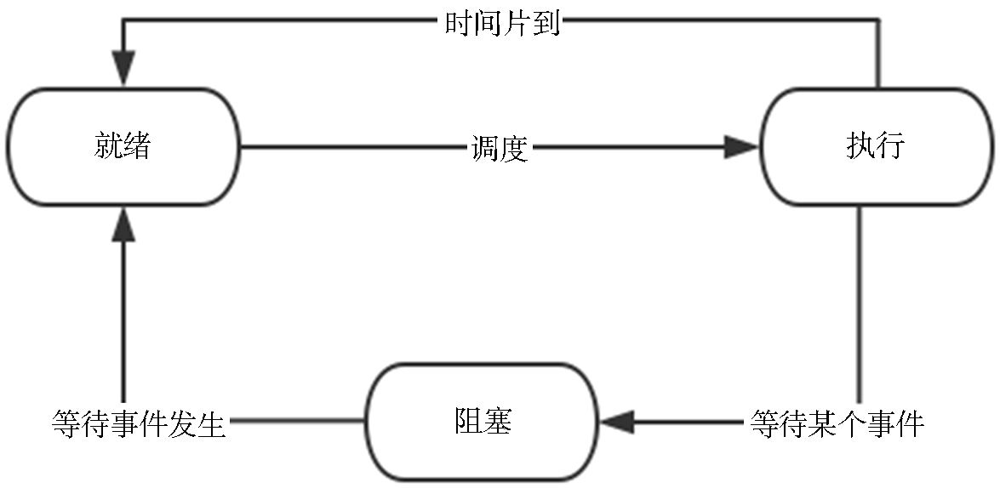


就绪状态是指线程具备运行的所有条件，逻辑上可以运行，在等待处理机；运行状态是指线程占有处理机正在运行；阻塞状态是指线程在等待一个事件（如某个信号量），逻辑上不可执行。每一个程序都至少有一个线程，若程序只有一个线程，那就是程序本身。
线程是程序中一个单一的顺序控制流程，是进程内一个相对独立的、可调度的执行单元。在单个程序中同时运行多个线程完成不同的工作，称为多线程。多数情况下，多线程能提升程序的性能。


### 3.1.2 进程和线程的关系

进程和线程是并发编程的两个基本的执行单元。在大多数编程语言中，并发编程主要涉及线程。

一个计算机系统通常有许多活动的进程和线程。在给定的时间内，每个处理器中只能有一个线程得到真正的运行。对于单核处理器来说，处理时间是通过时间切片来在进程和线程之间进行共享的。

进程有一个独立的执行环境。进程通常有一个完整的、私人的基本运行时资源。特别是每个进程都有自己的内存空间。操作系统的进程表（Process table）存储了CPU寄存器值、内存映像、打开的文件、统计信息、特权信息等。进程一般定义为执行中的程序，也就是当前操作系统的某个虚拟处理器上运行的一个程序。多个进程并发共享同一个CPU以及其他硬件资源是透明的，操作系统支持进程之间的隔离。这种并发透明性需要付出相对较高的代价。

进程往往被视为等同于程序或应用程序。然而，用户看到的一个单独的应用程序可能实际上是一组合作的进程。大多数操作系统都支持进程间通信（Inter Process Communication，IPC），如管道和Socket。IPC不仅用于同个系统的进程之间的通信，也可以用在不同系统的进程之间进行通信。

线程有时被称为轻量级进程（Lightweight Process，LWP）。进程和线程都提供了一个执行环境，但创建一个新的线程比创建一个新的进程需要更少的资源。线程系统一般只维护用来让多个线程共享CPU所必须的最少量信息。特别是线程上下文（Thread Context）中一般只包含CPU上下文以及某些其他线程管理信息。通常忽略那些对于多线程管理不是完全必要的信息。这样单个进程中防止数据遭到某些线程不合法的访问的任务就完全落在了应用程序开发人员的肩上。线程不像进程那样彼此隔离以及受到操作系统的自动保护，所以在多线程程序开发过程中需要开发人员做更多的努力。

线程存在于进程中，每个进程都至少一个线程。线程共享进程的资源，包括内存和打开的文件。这使得工作变得高效，但也存在了一个潜在的问题—通信。关于通信的内容，会在后面章节中讲述。

现在多核处理器或多进程的计算机系统越来越流行。这大大增强了系统的进程和线程的并发执行能力。但即便是没有多处理器或多进程的系统中，并发仍然是可能的。关于并发的内容，会在后面章节中讲述。


### 3.1.3 线程和纤程

为了提高并发量，某些编程语言中提供了“纤程”（Fiber）的概念，比如Golang的goroutine，Erlang风格的actor。Java语言虽然没有定义纤程，但仍有一些第三方库可供选择，比如Quasar。纤程可以理解为是比线程更加细颗粒度的并发单元。同时，Java 19引入了类似的技术——虚拟线程（Virtual Threads）。不管是虚拟线程还是纤程，他们都是轻量级线程，其目的都是为了提高并发能力。

由于纤程是以用户方式代码来实现的，并不受操作系统内核管理，所以内核并不知道纤程，也就无法对纤程实现调度。纤程是根据用户定义的算法来调度的。因此，就内核而言，纤程采用了非抢占式调度方式，而线程是抢占式调度的。

一个线程可以包含一个或多个纤程。线程每次执行哪一个纤程的代码，是由用户来决定的。所以，对于开发人员来说，使用纤程可以获得更高的并发量，但同时也要面临着自己实现调度纤程的复杂度。


## 3.2 线程对象深度解析，建立安全可靠的代码编写规范

在面向对象语言开发过程中，每个线程都与Thread类的一个实例相关联。由于Java语言的流行，下文中的例子将用Java来实现和使用线程对象，以作为并发应用程序的基本原型。

### 3.2.1 定义和启动一个线程

Java中有两种创建Thread实例的方式。第一种是提供Runnable对象。

Runnable接口定义了一个方法run，用来包含线程要执行的代码。HelloRunnable示例如下所示。

```java
public class HelloRunnable implements Runnable {
    @Override
    public void run() {
        System.out.println("Hello from a runnable!");
    }
    public static void main(String[] args) {
        (new Thread(new HelloRunnable())).start();
    }
}
```


第二种创建Thread实例的方式是继承Thread。Thread类本身是实现Runnable，虽然它的run方法什么都没干。HelloThread示例如下所示。

```java
public class HelloThread extends Thread {
    @Override
    public void run() {
        System.out.println("Hello from a thread!");
    }
    public static void main(String[] args) {
        (new HelloThread()).start();
    }
}
```

请注意，这两个例子都是调用start方法来启动线程。

关于第一种方式，它使用Runnable对象，在实际应用中更普遍，因为Runnable对象可以继承Thread以外的类。第二种方式，在简单的应用程序中更容易使用，但受限于你的任务类必须是一个Thread的后代。本书推荐使用第一种方法，将Runnable任务从Thread对象分离来执行任务。这样不仅更灵活，而且它适用于高级线程管理API。

Thread类还定义了大量的方法用于线程管理。

### 3.2.2 暂停线程执行

Thread.sleep可以让当前线程执行暂停一个时间段，这样处理器的时间就可以给其他线程使用。

sleep有两种重载形式：一个是指定睡眠时间为毫秒级，另外一个是指定睡眠时间为纳秒级。然而，这些睡眠时间不能保证是精确的，因为它们是由操作系统提供的，并受其限制，因而不能假设sleep的睡眠时间是精确的。睡眠周期也可以通过中断来终止，我们将在后面的章节中看到。

以下SleepMessages示例是使用sleep每隔4秒打印一次消息：

```java
public class SleepMessages {

    public static void main(String[] args) throws InterruptedException
    {
        String importantInfo[] = {
                "Mares eat oats",
                "Does eat oats",
                "Little lambs eat ivy",
                "A kid will eat ivy too" };

        for (int i = 0; i < importantInfo.length; i++) {
        
            // 暂停4秒
            Thread.sleep(4000);
            
            // 打印消息
            System.out.println(importantInfo[i]);
        }
    }
}
```

请注意main声明抛出InterruptedException。当sleep是激活的时候，若有另一个线程中断当前线程时，则sleep抛出异常。由于该应用程序还没有定义另一个线程来引起中断，所以考虑捕捉InterruptedException。


### 3.2.3 中断线程

中断是表明一个线程应该停止它正在做和将要做的事。线程通过在Thread对象调用interrupt来实现线程的中断。为了中断机制能正常工作，被中断的线程必须支持自己的中断。

#### 1. 支持中断

如何实现线程支持自己的中断？这要看是它目前正在做什么。如果线程调用方法频繁抛出InterruptedException异常，那么它只要在run方法捕获了异常之后返回即可。例如：

```java
for (int i = 0; i < importantInfo.length; i++) {

    // 暂停4秒
    try {
        Thread.sleep(4000);
    } catch (InterruptedException e) {
    
        // 已经中断，无须更多信息
        return;
    }
    
    // 打印消息
    System.out.println(importantInfo[i]);
}
```


很多方法都会抛出InterruptedException，如sleep，被设计成在收到中断时立即取消它们当前的操作并返回。

若线程长时间没有调用方法抛出InterruptedException的话，那么它必须定期调用Thread.interrupted，该方法在接收到中断后将返回true。

```java
for (int i = 0; i < inputs.length; i++) {

    heavyCrunch(inputs[i]);
    
    if (Thread.interrupted()) {
    
        // 已经中断，无须更多信息
        return;
    }
}
```

在这个简单的例子中，代码简单地测试该中断，如果已接收到中断线程就退出。在更复杂的应用程序中，它可能会更有意义地抛出一个InterruptedException：


```java
if (Thread.interrupted()) {
    throw new InterruptedException();
}
```

#### 2. 中断状态标志

中断机制是使用被称为中断状态的内部标志实现的。调用Thread.interrupt可以设置该标志。当一个线程通过调用静态方法Thread.interrupted来检查中断时，中断状态被清除。非静态isInterrupted方法用于线程来查询另一个线程的中断状态，而不会改变中断状态标志。

按照惯例，任何方法因抛出一个InterruptedException而退出都会清除中断状态。当然，它可能因为另一个线程调用interrupt而让那个中断状态立即被重新设置回来。

### 3.2.4 等待另一个线程完成

join方法允许一个线程等待另一个线程完成。假设t是一个正在执行的Thread对象，那么执行方法

```java
t.join();
````

会导致当前线程暂停执行直到t线程终止。join允许程序员指定一个等待周期，与sleep一样，等待时间是依赖于操作系统的时间，同时不能假设join等待时间是精确的。

像sleep一样，join并通过InterruptedException退出来响应中断。


## 3.3 节点之间的通信，构建低延迟高可靠的通信链路

节点与节点之间是完全独立、相互隔离的，节点之间传递信息的唯一方式是通过网络进行通信。而网络往往是不可靠的，即一个节点可以向其他节点通过网络发送消息，但发送消息的节点无法确认消息是否被接收节点完整正确收到。因此，在分布式系统中往往需要考虑网络通信异常的问题。 

常见的网络通信异常包含以下几种。


### 3.3.1 消息丢失

消息丢失是最常见的网络异常。对于常见的IP网络来说，网络层不保证数据报文的可靠传递，在发生网络拥塞、路由变动、设备异常等情况时，都可能发生发送的数据丢失。由于网络数据丢失的异常存在，直接决定了分布式系统的协议必须能处理网络数据丢失的情况。

依据网络质量的不同，网络消息丢失的概率也不同，甚至可能出现在一段时间内某些节点之间的网络消息完全丢失的情况。如果某些节点的直接的网络通信正常或丢包率在合理范围内，而某些节点之间始终无法正常通信，则称这种特殊的网络异常为“网络分化”（network partition）。网络分化是一类常见的网络异常，尤其当分布式系统部署在多个机房之间时。

### 3.3.2 消息乱序

消息乱序是指节点发送的网络消息有一定的概率不是按照发送时的顺序依次到达目的节点。通常由于常由于IP网络的存储转发机制、路由不确定性等问题，网络报文乱序也是一种常见的网络异常。这就要求设计分布式协议时，考虑使用序列号等机制处理网络消息的乱序问题，使得无效的、过期的网络消息不影响系统的正确性。


### 3.3.3 数据错误

网络上传输的数据有可能发生比特错误，从而造成数据错误。通常使用一定的校验码机制可以较为简单的检查出网络数据的错误，从而丢弃错误的数据。

### 3.3.4 不可靠的TCP

TCP协议为应用层提供了可靠的、面向连接的传输服务。该协议设计初衷就是在不可靠的网络之上建立可靠的传输服务。TCP协议出色设计体现在以下几个方面：

* TCP协议通过为传输的每一个字节设置协议通过为传输的每一个字节设置顺序递增的序列号，由接收方在收到数据后按序列号重组数据并发送确认信息。当发现数据包丢失时，TCP协议重传丢失的数据包，从而解决了网络数据包丢失的问题和数据包乱序问题。
* TCP协议为每个TCP数据段使用32位的校验和从而检查数据错误问题。
* TCP协议通过设置接收和发送窗口的机制极大的提高了传输性能，解决了网络传输的时延与吞吐问题。TCP协议最为复杂而巧妙的是其几十年来不断改进的拥塞控制算法，使得TCP可以动态感知底层链路的带宽加以合理使用并与其他TCP链接分享带宽（TCP friendly）。

TCP协议在通常情况下是非常可靠的协议，然而在分布式系统的协议设计中不能认为所有网络通信都基于TCP协议则通信就是可靠的。一方面，TCP协议保证了TCP协议栈之间的可靠的传输，但无法保证两个上层应用之间的可靠通信。通常的，当某个应用层程序通过TCP的系统调用发送一个网络消息时，即使TCP系统调用返回成功，也仅仅只能意味着该消息被本机的TCP协议栈接受，一般这个消息是被放入了TCP协议栈的缓冲区中。再退一步讲，即使目的机器的TCP协议栈后续也正常收到了该消息，并发送了确认数据包，也仅仅意味着消息达到了对方机器的协议栈，而不能认为消息被目标应用程序进程接收到并正确处理了。当发送过程中出现宕机
等异常时，TCP协议栈缓冲区中的消息有可能被丢失从而无法被目标节点正确处理。更有甚者，在网络中断前，某数据包已经被目标进程正确处理，之后网络立刻中断，由于接收方的TCP协议栈发送的确认数据包始终被丢失，发送方的TCP协议栈也有可能告知发送进程发送失败。另一方面，TCP协议只能保证同一个TCP链接内的网络消息不乱序，TCP链接之间的网络消息顺序则无法保证。但在分布式系统中，一个节点向另一个节点发送数据，有可能是先后使用多个TCP链接发送，也有可能是同时并发多个TCP链接发送，那么发送进程不能认为先调用TCP系统调用发送的消息就一定会先于后发送的消息到达对方节点并被处理。


因此，在设计分布系统的网络协议时一定要考虑网络异常。有关通信的内容还会在下个章节继续探讨。


## 4.1 理解本地过程调用，初步掌握分布式体系调用技巧

进程间通信（Inter-Process Communication，IPC）指至少两个进程或线程间传送数据或信号的一些技术或方法。进程是计算机系统分配资源的最小单位。每个进程都有自己的一部分独立的系统资源，彼此是隔离的。为了能使不同的进程互相访问资源并进行协调工作，才有了进程间通信。这些进程可以运行在同一计算机上或网络连接的不同计算机上。进程间的通信技术包括消息传递、同步、共享内存和远程过程调用。进程间通信是一种标准的UNIX通信机制。


进程间通信可以分为本地过程调用和远程过程调用。

本节介绍本地过程调用。


### 4.1.1 本地过程调用的概念


本地过程调用（Local Procedure Call，LPC）是指被调用的过程（函数）与调用过程处于同一个进程中。典型的情况是，调用者通过执行某条机器指令把控制传给新过程，被调用过程保存机器寄存器的值，并在栈顶分配存放其本地变量的空间。


本地过程调用的基础是一种称为“端口(Port)”的进程间通信机制，类似于本地的Unix域的Socket。这种Port机制提供了面向报文传递（message passing）的进程间通信，而本地过程调用则是建立在这个基础上的高层机制，目的是提供跨进程的过程调用。注意这里所谓“跨进程的过程调用”不同于以前所说的“跨进程操作”。前者是双方有约定、遵循一定规程的、有控制的服务提供，被调用者在向外提供一些什么服务、即提供哪些函数调用方面是自主的，而后者则可以是在不知不觉之间的被利用、被操纵。前者是良性的，而后者可以是恶性的。

本地过程调用通常也被称为轻量过程调用或者本地进程间通信。在Windows Vista中，ALPC（Advanced Local Procedure Call，高级本地进程通信）替代了LPC。ALPC提供了一个高速可度量的通信机制，这样便于实现需要在用户模式下高速通信的用户模式驱动程序框架（UMDF，User-Mode Driver Framework）。


### 4.1.2 本地过程调用的实现


LPC是由内核的“端口”对象实现，这样可以确保安全（由访问控制表规定持有特定的安全标识符才可以访问）并可以验证链接另一端进程的身份。程序也可以对每一个信息设定安全标识符，并测试对应信息的变化，以实现每一条消息的安全性。

服务端和客户端之间典型的连接由下列过程表示：

* 服务端进程建立命名服务器连接端口对象，并等待客户端连接；
* 客户端通过向这一端口发送消息来建立连接；
* 如果服务端同意建立连接，便会建立两个无名端口：
* 客户端连接端口：客户线程由此向服务端发送数据；
* 服务端连接端口：服务端由此向客户端发送数据；每个客户端都分配一个独立的接口；
* 服务端持有一个服务连接端口的句柄，同时客户端也持有一个客户连接端口的句柄，这样进程间通信的通道就建立了。


让我们看看本地过程调用是如何在编程语言中实现的。考虑下面的C语言的调用：

```c
count = read(fd, buf, nbytes);
```

其中，fd为一个整型数，表示一个文件。buf为一个字符数组，用于存储读入的数据。nbytes为另一个整型数，用于记录实际读入的字节数。如果该调用位于主程序中，那么在调用之前堆栈的状态如图4-1（a）所示。为了进行调用，调用方首先把参数反序压入堆栈，即最后一个参数先压入，如图4-1（b）所示。在 read 操作运行完毕后，它将返回值放在某个寄存器中，移出返回地址，并将控制权交回给调用方。调用方随后将参数从堆栈中移出，使堆栈还原到最初的状态。


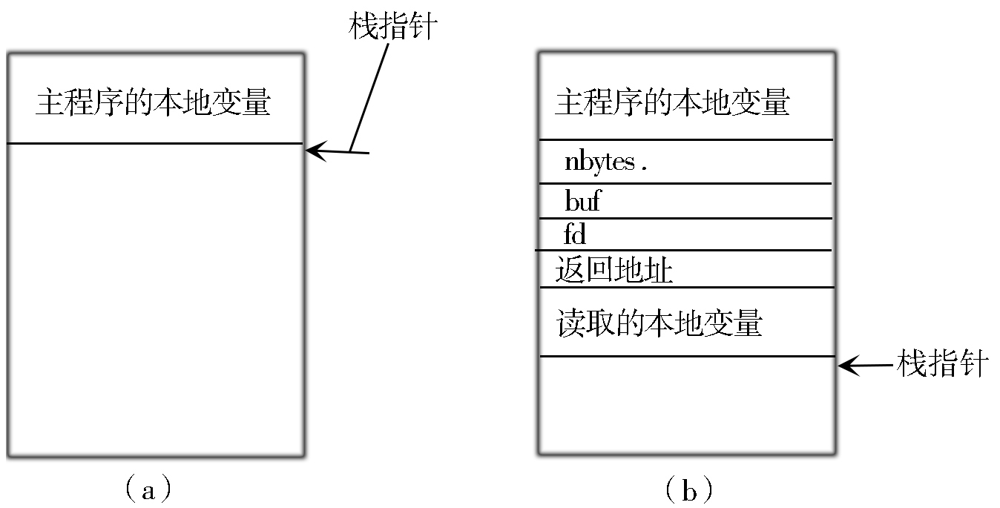


本地过程调用支持以下三种交换信息的方式：

* 针对较短信息（小于256字节）：系统内核在进程间直接复制消息，从发送方的地址空间拷贝消息至系统地址空间，之后再将消息拷贝至接收方的地址空间。
* 针对较长消息（大于256字节）：这需要在发送方和接收方之间建立一个共享内存区域。发送方首先将消息存放在共享内存中，再向接收方发送一个通知（可以通过如上发送短消息的方式实现），之后再由接收方从共享内存中读取这一消息。
* 当消息的数据量过大，难以放入共享内存时，服务端可以直接读取和写入客户端的地址空间。


本地过程调用在Windows NT及其衍生系统中得到了广泛应用。在Win32子系统中，LPC应用于客户端和子系统服务器之间的通信（CSRSS）。在Windows NT 3.51版本中引入了快速LPC以提高调用速度。然而由于NT4.0中将部分关键服务端移入内核模式（win32k.sys）以提高系统效能，这一方法已基本被摒弃。

本地安全认证子系统服务（LSASS），会话管理器（SMSS）以及服务控制管理器均使用LPC端口和客户进程直接通信。Winlogon和安全引用监视器与LSASS进程之间的通信同样使用了LPC。

在Windows系统中，高级本地过程调用（ALPC）拥有比以往的本地过程调用（LPC）更优的性能。因为LPC只能通过同步请求/应答机制通信，而ALPC还可以使用IOCP实现通信。这样，ALPC就可以在消息数量和进程数量间保持一定平衡，保证了端口的高速通信。ALPC还允许信息的批量传输，减少了进程在用户模式和内核模式之间的切换次数。


## 4.2 快速掌握远程过程调用，突破分布式服务调用障碍

RPC是远程过程调用（Remote Procedure Call）的缩写形式。Birrell和Nelson在1984发表于ACM Transactions on Computer Systems的论文*Implementing remote procedure calls*对RPC做了经典的诠释。RPC是指计算机A上的进程，调用另外一台计算机B上的进程，其中A上的调用进程被挂起，而B上的被调用进程开始执行，当值返回给A时，A进程继续执行。调用方可以通过使用参数将信息传送给被调用方，而后可以通过传回的结果得到信息。而这一过程，对于开发人员来说是透明的。
远程过程调用采用客户机/服务器（C/S）模式。请求程序就是一个客户机，而服务提供程序就是一台服务器。和常规或本地过程调用一样，远程过程调用是同步操作，在远程过程结果返回之前，需要暂时中止请求程序。使用相同地址空间的低权进程或低权线程允许同时运行多个远程过程调用。

图4-2描述了并发环境下RPC的调用过程。


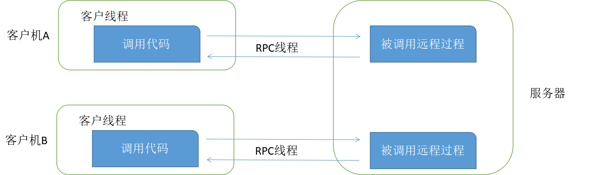


### 4.2.1 远程过程调用原理


RPC背后的思想是尽量使远程过程调用具有与本地调用相同的形式。假设程序需要从某个文件中读取数据，程序员在代码中执行read调用来取得数据。在传统的系统中，read例程由链接器从库中提取出来，然后链接器再将它插入目标程序中。read过程是一个短过程，一般通过执行一个等效的read系统调用来实现，即read过程是一个位于用户代码与本地操作系统之间的接口。

虽然read中执行了系统调用，但它本身依然是通过将参数压入堆栈的常规方式实现调用的。如图4-1（b）所示，程序员并不知道read干了什么。

RPC通过类似的途径来获得透明性。当read实际上是一个远程过程时（比如在文件服务器所在的机器上运行的过程），库中就放入read的另外一个版本，称为客户存根（client stub）。这种版本的read过程同样遵循图4-1（b）的调用次序，这点与原来的read过程相同。另一个相同点是其中也执行了本地操作系统调用。唯一不同点是它不要求操作系统提供数据，而是将参数打包成消息，而后请求将此消息发送到服务器，如图4-3所示。在对send的调用后，客户存根调用receive过程，随即阻塞自己，直到收到响应消息。


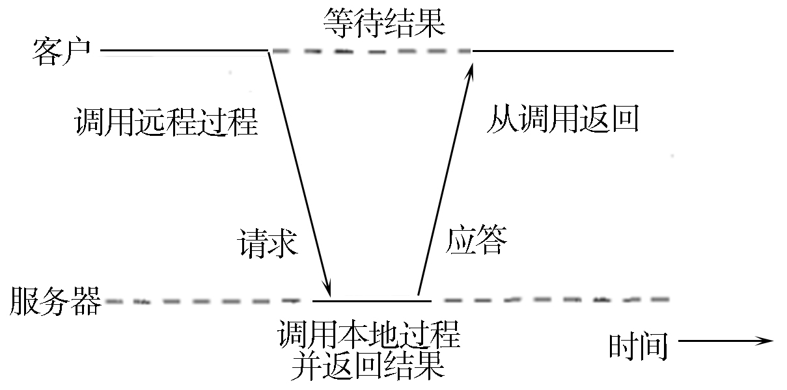


当消息到达服务器时，服务器上的操作系统将它传递给服务器存根（server stub）。服务器存根是客户存根在服务器端的等价物，也是一段代码，用来将通过网络输入的请求转换为本地过程调用。服务器存根一般先调用receive，然后被阻塞，等待消息输入。收到消息后，服务器将参数从消息中提取出来，然后以常规方式调用服务器上的相应过程（见图4-3）。从服务器角度看，过程好像是由客户直接调用的一样：参数和返回地址都位于堆栈中，一切都很正常。服务器执行所要求的操作，随后将得到的结果以常规的方式返回给调用方。以read为例，服务器将用数据填充read中第二个参数指向的缓存区，该缓存区是属于服务器存根内部的。

调用完后，服务器存根要将控制权交回给客户发出调用的过程，它将结果（缓存区）打包成消息，随后调用send将结果返回给客户。事后，服务器存根一般会再次调用receive，等待下一个输入的请求。

客户机器接收到消息后，客户操作系统发现该消息属于某个客户进程（实际上该进程是客户存根，只是操作系统无法区分二者）。操作系统将消息复制到相应的缓存区中，随后解除对客户进程的阻塞。客户存根检查该消息，将结果提取出来并复制给调用者，而后以通常的方式返回。当调用者在read调用进行完毕后重新获得控制权时，它所知道的唯一事情就是已经得到了所需的数据。它不知道操作是在本地操作系统进行的，还是远程完成的。

整个方法中，客户方可以简单地忽略不关心的内容。客户所涉及的操作只是执行普通的（本地）过程调用来访问远程服务，它并不需要直接调用send和receive。消息传递的所有细节都隐藏在双方的库过程中，就像传统库隐藏了执行实际系统调用的细节一样。
概况来说，远程过程调用包含如下步骤：

* （1）客户过程以正常的方式调用客户存根。
* （2）客户存根生成一个消息，然后调用本地操作系统。
* （3）客户端操作系统将消息发送给远程操作系统。
* （4）远程操作系统将消息交给服务器存根。
* （5）服务器存根调将参数提取出来，而后调用服务器。
* （6）服务器执行要求的操作，操作完成后将结果返回给服务器存根。
* （7）服务器存根将结果打包成一个消息，而后调用本地操作系统。
* （8）服务器操作系统将含有结果的消息发送给客户端操作系统。
* （9）客户端操作系统将消息交给客户存根。
* （10）客户存根将结果从消息中提取出来，返回给调用它的客户存根。

以上步骤就是客户过程将客户存根发出的本地调用转换成对服务器过程的本地调用，而客户端和服务器都不会意识到中间步骤的存在。

RPC的主要好处是双重的。首先，程序员可以使用过程调用语义来调用远程函数并获取响应。其次，简化了编写分布式应用程序的难度，因为RPC隐藏了所有的网络代码存根函数。应用程序不必担心一些细节，比如socket、端口号以及数据的转换和解析。在OSI参考模型中，RPC跨越了会话层和表示层。


### 4.2.2 如何实现远程过程调用

要实现远程过程调用，需考虑以下几个问题。

#### 1. 如何传递参数

参数有两种，一种是值参数，一种是引用参数。


传递值参数比较简单，图4-4是一个简单RPC进行远程计算的例子。其中，远程过程add(i,j)有两个参数i和j，其结果是返回i和j的算术和。


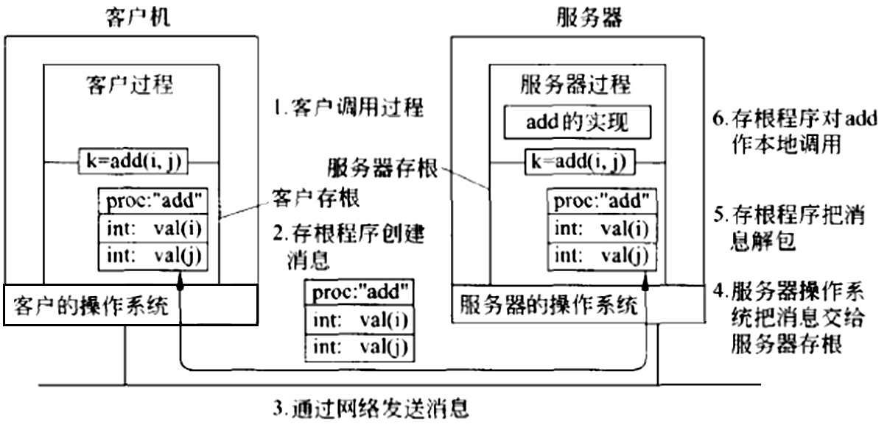


通过RPC进行远程计算的步骤如下：

* （1）将参数放入消息中，并在消息中添加要调用的过程的名称或者编码。
* （2）消息到达服务器后，服务器存根对该消息进行分析，以判明需要调用哪个过程，随后执行相应的调用。
* （3）服务器运行完毕后，服务器存根将服务器得到的结果打包成消息送回客户存根，客户存根将结果从消息中提取出来，把结果值返回给客户端。

当然，这里只是做了简单的演示，在实际分布式系统中，还需要考虑其他情况，因为不同的机器对于数字、字符和其他类型的数据项的表示方式常有差异。比如整数型，就有Big Endian和Little Endian之分。

传递引用参数相对来说比较困难。单纯传递参数的引用（也包含指针）是完全没有意义的，因为引用地址传递给远程计算机，其指向的内存位置可能跟远程系统上完全不同。如果你想支持传递引用参数，就必须发送参数的副本，将它们放置在远程系统内存中，向它们传递一个指向服务器函数的指针，然后将对象发送回客户端，复制它的引用。如果远程过程调用必须支持引用复杂的结构，比如树和链表，它们需要将结构复制到一个无指针的表示里面（比如，一个扁平的树），并传输到远程端来重建数据结构。


#### 2. 如何表示数据

在本地系统上不存在数据不相容的问题，因为数据格式总是相同的。而在分布式系统中，不同远程机器上可能有不同的字节顺序，不同大小的整数，以及不同的浮点表示。对于RPC，如果想与异构系统通信，我们就需要想出一个“标准”来对所有数据类型进行编码，并可以作为参数传递。例如，ONC RPC使用XDR（eXternal Data Representation）格式。这些数据表示格式可以使用隐式或显式类型。隐式类型是指只传递值，而不传递变量的名称或类型。常见的例子是ONC RPC的XDR和DCE RPC的NDR。显式类型指需要传递每个字段的类型和值。常见的例子是ISO标准ASN.1（Abstract Syntax Notation）、JSON（JavaScript Object Notation）、Google Protocol Buffers，以及各种基于XML的数据表示格式。

#### 3. 如何选用传输协议

有些实现只允许使用一个协议（例如TCP）。大多数RPC实现支持几个，例如TCP、HTTP等，并允许用户选择。

#### 4. 出错时会发生什么

相比于本地过程调用，远程过程调用出错的机会更多。由于本地过程调用没有过程调用失败的概念，项目使用远程过程调用必须准备测试远程过程调用的失败或捕获异常。

#### 5. 远程调用的语义是什么

调用一个普通的过程语义很简单：当我们调用时，过程被执行。远程过程完全一次性调用成功是非常难以实现的。执行远程过程可以有如下结果：

* 如果服务器崩溃或进程在运行服务器代码之前就死了，那么远程过程会被执行0次；
* 如果一切工作正常，远程过程会被执行1次；
* 如果服务器返回服务器存根后在发送响应前就崩溃了，远程过程会被执行1次或者多次。客户端接收不到返回的响应，可以决定再试一次，因此出现多次执行函数。如果没有再试一次，函数执行一次；
* 如果客户机超时和重新传输，那么远程过程会被执行多次。也有可能是原始请求延迟了，两者都可能执行或不执行。

RPC系统通常会提供至少一次或最多一次的语义，或者在两者之间选择。如果需要了解应用程序的性质和远程过程的功能是否安全，可以通过多次调用同一个函数来验证。如果一个函数可以运行任何次数而不影响结果，这是幂等（idempotent）函数，如每天的时间、数学函数、读取静态数据等。否则，它是一个非幂等（nonidempotent）函数，如添加或修改一个文件。

#### 6. 远程调用的性能怎么样

远程过程调用比常规的本地过程调用慢得多，因为产生了额外的步骤以及网络传输本身存在延迟。然而，这并不应该阻止我们使用远程过程调用。

#### 7. 远程调用安全吗

使用RPC，我们必须关注各种安全问题：

* 客户端发送消息到远程过程，这个过程是可信的吗？
* 客户端发送消息到远程计算机，这个远程机器是可信的吗？
* 服务器如何验证接收的消息来自合法的客户端？服务器如何识别客户端？
* 消息在网络中传播时如何防止被其他进程嗅探？
* 如何防止消息在客户端和服务器的网络传播中被其他进程拦截和修改？
* 协议能防止重播攻击吗？
* 如何防止消息在网络传播中被意外损坏或截断？

#### 8. 远程过程调用的优点

远程过程调用有诸多优点：

* 不必担心传输地址问题。服务器可以绑定到任何可用的端口，然后用RPC名称服务来注册端口。客户端将通过该名称服务来找到对应的端口号所需要的程序。而这一切对于程序员来说是透明的。
* 系统可以独立于传输提供者。自动生成服务器存根使其可以在系统上的任何一个传输提供者上可用，包括TCP和UDP，而这些，客户端是可以动态选择的。当代码发送以后，接收消息是自动生成的，而不需要额外的编程代码。
* 应用程序在客户端只需要知道一个传输地址—名称服务，负责告诉应用程序去哪里连接服务器函数集。
* 使用函数调用模型来代替socket的发送/接收（读/写）接口。用户不需要处理参数的解析。


### 4.2.3 远程过程调用API

任何RPC实现都需要提供一组支持库。

* 名称服务操作：注册和查找绑定信息（端口、机器）。允许一个应用程序使用动态端口（操作系统分配的）。
* 绑定操作：使用适当的协议建立客户机/服务器通信（建立通信端点）。
* 终端操作：注册端点信息（协议、端口号、机器名）到名称服务并监听过程调用请求。这些函数通常被自动生成的主程序—服务器存根（骨架）所调用。
* 安全操作：系统应该提供机制保证客户端和服务器之间能够相互验证，两者之间提供一个安全的通信通道。
* 国际化操作（可能）：目前，有一小部分RPC包支持转换包括时间格式、货币格式和特定于语言的字符串的功能。
* 封送处理/数据转换操作：函数将数据序列化为一个普通的的字节数组，通过网络进行传递，并能够重建。
* 存根内存管理和垃圾收集：存根可能需要分配内存来存储参数，特别是模拟引用传递语义。RPC包需要分配和清理任何这样的内存。它们也可能需要为创建网络缓存区而分配内存。RPC包支持对象，RPC系统需要跟踪远程客户端是否仍有引用对象或一个对象是否可以删除。
* 程序标识操作：允许应用程序访问（或处理）RPC接口集的标识符，这样的服务器提供的接口集可以被用来交流和使用。
* 对象和函数的标识操作：允许将远程函数或远程对象的引用传递给其他进程，并不是所有的RPC系统都支持。

所以，判断一种通信方式是否是RPC，就看它是否提供上述的API。


### 4.2.4 远程过程调用发展历程

以下远程过程调用发展历程。

#### 1. 第一代RPC

Sun公司是第一个提供商业化RPC库和RPC编译器。在1980年代中期Sun计算机提供RPC，并在Sun Network File System（NFS）上得到支持。该协议被主要以Sun和AT&T为首的Open Network Computing（开放网络计算）作为一个标准来推动。这是一个非常轻量级RPC系统，可在大多数POSIX和类POSIX操作系统中使用，包括Linux、SunOS、OS X和各种发布版本的BSD。这样的系统被称为Sun RPC或ONC RPC。该阶段的其他代表产品还有DCE RPC。


#### 2. 第二代RPC支持对象

面向对象的语言开始在1980年代末兴起，很明显，当时的Sun ONC和DCE RPC系统都没有提供任何支持，诸如从远程类实例化远程对象、跟踪对象的实例或提供支持多态性。现有的RPC机制虽然可以运作，但它们仍然不支持自动、透明的方式的面向对象编程技术。该阶段的主要产品有微软DCOM（COM+）、CORBA、Java RMI。


#### 3. 第三代RPC以及Web Services

传统RPC解决方案可以工作在互联网上，但问题是，它们通常严重依赖于动态端口分配，往往要进行额外的防火墙配置。Web Services成为一组协议，允许服务被发布、发现，并用于技术无关的形式。即服务不应该依赖于客户的语言、操作系统或机器架构。该阶段的代表产品有XML-RPC、SOAP、Microsoft .NET Remoting、JAX-WS等。


## 4.3 掌握常用网络I/O模型，建立系统级性能优化思维

I/O操作主要是操作系统来完成的。根据UNIX的设计，共有五种类型的I/O模型：

* 阻塞I/O；
* 非阻塞I/O；
* I/O复用（select和poll）；
* 信号驱动I/O（SIGIO）；
* 异步I/O（`Posix.1`的`aio_`系列函数）。


上述模型或多或少的影响了其他操作系统的I/O模型设计。

### 4.3.1 阻塞I/O模型

阻塞I/O模型是指，当请求无法立即完成则保持阻塞。主要分为以下两个阶段：

* 阶段1：等待数据就绪。网络I/O的情况就是等待远端数据陆续抵达；磁盘I/O的情况就是等待磁盘数据从磁盘上读取到内核态内存中。
* 阶段2：数据复制。出于系统安全，用户态的程序没有权限直接读取内核态内存，因此内核负责把内核态内存中的数据复制一份到用户态内存中。

阻塞I/O模型如图4-5所示。


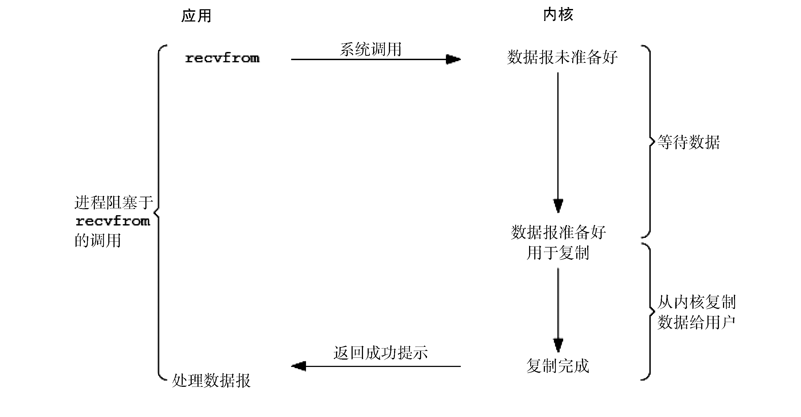


本节中将recvfrom函数视为系统调用。一般recvfrom实现都有一个从应用程序进程中运行到内核中运行的切换，一段事件后再跟一个返回到应用进程的切换。

图4-5中，进程阻塞的整段时间是指从调用recvfrom开始到它返回的这段时间，当进程返回成功指示时，应用进程开始处理数据报。


### 4.3.2 非阻塞I/O模型


非阻塞I/O模型处理流程如下：

* socket设置为NONBLOCK（非阻塞）就是告诉内核，当所请求的I/O操作无法完成时，不要将进程睡眠，而是立刻返回一个错误码（EWOULDBLOCK），这样请求就不会阻塞；
* I/O操作函数将不断地测试数据是否已经准备好，如果没有准备好，继续测试，直到数据准备好为止。整个I/O请求的过程中，虽然用户线程每次发起I/O请求后可以立即返回，但是为了等到数据，仍需要不断地轮询、重复请求，这是对CPU时间的极大浪费。
* 数据准备好了，从内核复制到用户空间。

非阻塞I/O模型如图4-6所示。


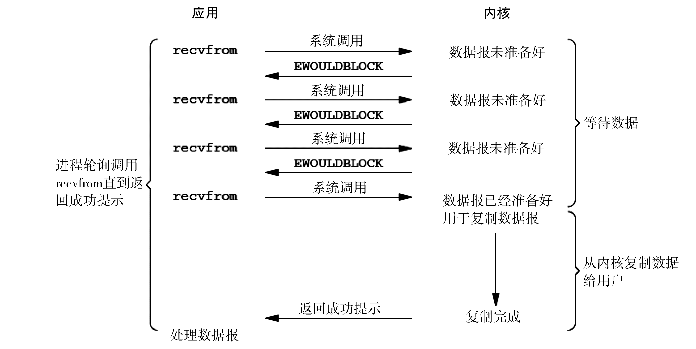


一般很少直接使用这种模型，而是在其他I/O模型中使用非阻塞I/O这一特性。这种方式对单个I/O请求的意义不大，但给I/O复用铺平了道路。


### 4.3.3 I/O复用模型


I/O复用会用到select或者poll函数，在这两个系统调用中的某一个上阻塞，而不是阻塞于真正的I/O系统调用。函数也会使进程阻塞，但是和阻塞I/O所不同的是，这两个函数可以同时阻塞多个I/O操作。而且可以同时对多个读操作、多个写操作的I/O函数进行检测，直到有数据可读或可写时，才真正调用I/O操作函数。


I/O复用模型如图4-7所示。


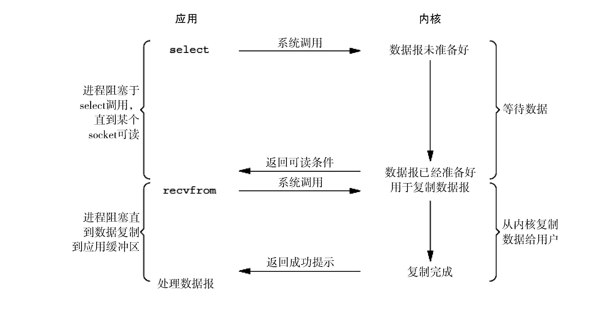


从流程上来看，使用select函数进行I/O请求和同步阻塞模型没有太大的区别，甚至还多了添加监视socket，以及调用select函数的额外操作，效率更差。但是，使用select最大的优势是用户可以在一个线程内同时处理多个socket的I/O请求。用户可以注册多个socket，然后不断地调用select来读取被激活的socket，即可达到在同一个线程内同时处理多个I/O请求的目的。而在同步阻塞模型中，必须通过多线程的方式才能达到这个目的。


I/O复用模型使用了Reactor设计模式实现了这一机制。

调用select/poll该方法由一个用户态线程负责轮询多个socket，直到某个阶段1的数据就绪，再通知实际的用户线程执行阶段2的复制操作。通过一个专职的用户态线程执行非阻塞I/O轮询，模拟实现了阶段1的异步化。

在Java领域，著名的网络编程框架Netty就是采用了Reactor模型。

### 4.3.4 信号驱动I/O（SIGIO）模型

首先，我们允许socket进行信号驱动I/O，并通过调用sigaction来安装一个信号处理函数，进程继续运行并不阻塞。当数据准备好时，进程会收到一个SIGIO信号，可以在信号处理函数中调用recvfrom来读取数据报，并通知主循环数据已准备好被处理，也可以通知主循环，让它来读取数据报。

信号驱动I/O（SIGIO）模型如图4-8所示。


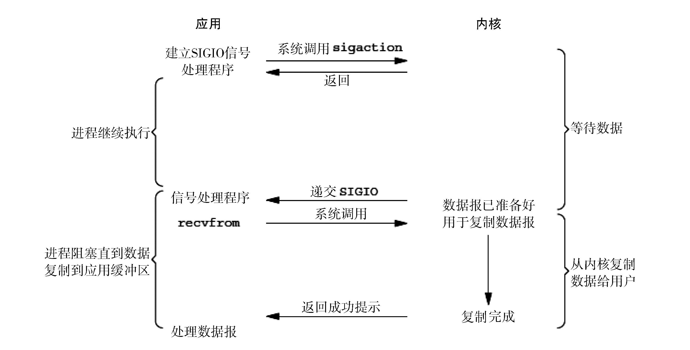


该模型的好处是，当等待数据报到达时，可以不阻塞。主循环可以继续执行，只是等待信号处理程序的通知；或者数据已准备好被处理，或者数据报已准备好被读。


### 4.3.5 异步I/O模型

异步I/O是POSIX规范定义的。通常，这些函数会通知内核来启动操作并在整个操作（包括从内核复制数据到我们的缓存中）完成时通知我们。

该模式与信号驱动I/O（SIGIO）模型的不同点在于，驱动I/O（SIGIO）模型告诉我们I/O操作何时可以启动，而异步I/O模型告诉我们I/O操作何时完成。


调用aio_read函数，告诉内核传递描述字、缓存区指针、缓存区大小、文件偏移，然后立即返回，我们的进程不阻塞于等待I/O操作的完成。当内核将数据复制到缓存区后，才会生成一个信号，来通知应用程序。

异步I/O模型如图4-9所示。


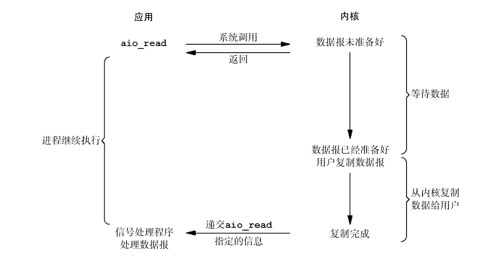


异步I/O模型使用了Proactor设计模式实现了这一机制。异步I/O模型会告知内核，当整个过程（包括阶段1和阶段2）全部完成时，通知应用程序来读数据。


### 4.3.6 几种I/O模型的比较


前四种模型的区别是阶段1不相同，阶段2基本相同，都是将数据从内核复制到调用者的缓存区。而异步I/O的两个阶段都不同于前四个模型。几种I/O模型的比较如图4-10所示。


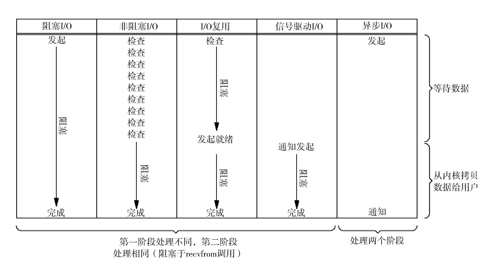

同步I/O操作引起请求进程阻塞，直到I/O操作完成。异步I/O操作不引起请求进程阻塞。上面前四个模型—阻塞I/O模型、非阻塞I/O模型、I/O复用模型和信号驱动I/O模型都是同步I/O模型，而异步I/O模型才是真正的异步I/O。


## 4.4 理解I/O操作中的常用术语，消除分布式开发沟通壁垒

前面一节我们介绍了常用的I/O模型。在I/O操作中的我们经常会遇到常用术语：


* 阻塞和非阻塞
* 同步与异步

那么这些术语有怎么样的联系和区别呢？


### 4.4.1 阻塞和非阻塞


阻塞和非阻塞描述的是用户线程调用内核I/O操作的方式：

* 阻塞是指I/O操作需要彻底完成后才返回到用户空间；
* 非阻塞是指I/O操作被调用后立即返回给用户一个状态值，无须等到I/O操作彻底完成。

以生活中家庭主妇为例子。家庭主妇往往要做非常多的家务，比如煮开水、拖地等。阻塞是指，家庭主妇先去煮开水，她必须要等到水开了才能离开去做其他家务。非阻塞是指，家庭主妇先去把水煮上，不用等水开就离开去拖地了，当然，在拖地过程中，她会时不时停下来去检查下水是否已经开了。

非阻塞的好处是家庭主妇的能力得到了释放，可以多任务（煮开水、拖地）并发了。

### 4.4.2 同步与异步

同步和异步描述的是用户线程与内核的交互方式：

* 同步是指用户线程发起I/O请求后需要等待或者轮询内核I/O操作完成后才能继续执行；
* 异步是指用户线程发起I/O请求后仍继续执行，当内核I/O操作完成后会通知用户线程，或者调用用户线程注册的回调函数。


还是以生活中家庭主妇为例子。在阻塞和非阻塞的例子中，家庭主妇需要会时不时停下拖地这个动作，而去检查下水是否已经开了（轮询），这其实一定程度上是一种浪费，因为拖地这个任务经常被打断了。那么是否有一种机制，当开水煮好后再通知主妇过去关火呢？这就是异步的好处，异步相当于水壶上的报警器，当水煮好后，水壶会发出提示声，以告知家庭主妇水已经煮好了，此时家庭主妇才停下拖地去关火。

异步的好处是减少了轮询。


### 4.4.3 总结

一个I/O操作其实分成了两个步骤：发起I/O请求和实际的I/O操作。

阻塞I/O和非阻塞I/O的区别在于第一步，发起I/O请求是否会被阻塞，如果阻塞直到完成那么就是传统的阻塞I/O，如果不阻塞，那么就是非阻塞I/O。

同步I/O和异步I/O的区别就在于第二个步骤是否阻塞，如果实际的I/O读写阻塞请求进程，那么就是同步I/O。


## 4.5 实战：在Java中实现阻塞I/O模型

Java语言从初创之日起，就是为网络而生的。随着互联网应用的发展，Java也被越来越多的企业所采用。接下来将演示了如何基于Java实现常用网络I/O模型。


执行以下命令进行初始化项目原型：

```
mvn archetype:generate -DgroupId=com.example.java.demo -DartifactId=java-io-demo -DarchetypeArtifactId=maven-archetype-quickstart -DarchetypeVersion=1.5 -DinteractiveMode=false
```


本节先演示在Java中实现阻塞I/O模型的网络应用。

### 4.5.1 开发Echo协议的服务器

早期的Java提供java.net包用于开发网络应用，这类API也被称为Java OIO（Old-blocking I/O，阻塞I/O）。以下演示了使用java.net包及java.io来开发Echo协议的客户端及服务器的过程。

提示：Echo协议是指把接收到的信息按照原样返回，其重要的作用是用于检测和调试网络。这个协议可以基于TCP/UDP协议用于服务器检测端口7有无信息。有关该协议内容详见<https://tools.ietf.org/html/rfc862>。


以下是使用原生java.net包来开发Echo协议的服务器的示例：

```java
package com.example.java.demo.net;

import java.io.IOException;
import java.net.ServerSocket;

/**
 * BlockingEchoServer 阻塞IO Echo服务器
 *
 * @version 2025/08/25
 **/
public class BlockingEchoServer {

    private static final int DEFAULT_PORT = 7;

    public static void main(String[] args) {
        // 解析传参进来的端口号
        int port;
        try {
            port = Integer.parseInt(args[0]);
        } catch (Exception e) {
            port = DEFAULT_PORT;
        }

        // 创建ServerSocket
        try (var serverSocket = new ServerSocket(port)) {
            System.out.println("BlockingEchoServer启动，监听端口：" + port);

            // 接受客户端连接，生成Socket实例
            while (true) {
                try (var clientSocket = serverSocket.accept()) {

                    System.out.println("接收到客户端连接：" + clientSocket.getInetAddress());
                    while (true) {
                        var input = clientSocket.getInputStream();
                        var output = clientSocket.getOutputStream();
                        var buffer = new byte[1024];

                        // 读取客户端的信息
                        var bytesRead = input.read(buffer);
                        if (bytesRead == -1) {
                            break;
                        }

                        // 发送信息给客户端
                        output.write(buffer, 0, bytesRead);

                        System.out.println("Echo：" + new String(buffer, 0, bytesRead));
                        System.out.println("Echo完毕");
                        System.out.println("--------------------------------------------------------------------------------");
                        System.out.println("等待下一个客户端连接...");
                        System.out.println("--------------------------------------------------------------------------------");
                    }
                } catch (IOException e) {
                    System.out.println("BlockingEchoServer异常：" + e.getMessage());
                }
            }
        } catch (IOException e) {
            System.out.println("BlockingEchoServer启动异常，监听端口：" + port);
            System.out.println(e.getMessage());
        }
    }
}
```


上述例子BlockingEchoServer实现了Echo协议。BlockingEchoServer主要是使用了java.net包中Socket和ServerSocket类库。这两个类库主要是用于开发基于TCP协议的应用。如果是想要开发UDP协议的应用，则需要使用DatagramSocket类。

ServerSocket用于服务器端，而Socket是建立网络连接时使用的。在客户端连接服务器成功时，客户端以及服务器两端都会产生一个Socket实例，通过操作这个实例，来完成所需的会话。对于一个网络连接来说，Socket是平等的，并没有差别，不会因为在服务器端或在客户端而产生不同的级别，不管是Socket还是ServerSocket，他们的工作都是通过Socket类和其子类来完成的。

运行BlockingEchoServer，可以看到控制台输出内容如下：

```
BlockingEchoServer启动，监听端口：7
```

### 4.5.2 开发Echo协议的客户端

以下是使用原生java.net包来开发Echo协议的客户端的示例：


```java
package com.example.java.demo.net;

import java.io.IOException;
import java.net.UnknownHostException;

/**
 * BlockingEchoClient 阻塞IO Echo客户端
 *
 * @version 2025/08/25
 **/
public class BlockingEchoClient {
    private static final int DEFAULT_PORT = 7;
    public static final String DEFAULT_HOST = "localhost";

    public static void main(String[] args) {
        // 解析传参进来的服务名、端口号
        String host;
        int port;
        try {
            host = args[0];
            port = Integer.parseInt(args[1]);
        } catch (Exception e) {
            host = DEFAULT_HOST;
            port = DEFAULT_PORT;
        }

        // 创建Socket
        try (var socket = new java.net.Socket(host, port)) {
            System.out.println("BlockingEchoClient启动，连接：" + host + ":" + port);
            var input = socket.getInputStream();
            var output = socket.getOutputStream();
            var reader = new java.util.Scanner(System.in);
            while (true) {
                System.out.print("请输入：");
                var line = reader.nextLine();
                output.write(line.getBytes());
                output.flush();
                var buffer = new byte[1024];

                var bytesRead = input.read(buffer);
                if (bytesRead == -1) {
                    break;
                }

                System.out.println("Echo：" + new String(buffer, 0, bytesRead));
                System.out.println("--------------------------------------------------------------------------------");
                System.out.println("等待下一个输入...");
                System.out.println("--------------------------------------------------------------------------------");
            }
        } catch (UnknownHostException e) {
            System.out.println("BlockingEchoClient异常：" + e.getMessage());
            System.out.println("请检查服务名是否正确！");
            System.exit(1);
        } catch (IOException e) {
            System.out.println("IO异常：" + e.getMessage());
            System.exit(1);
        }
    }
}
```

BlockingEchoClient的Socket的使用与BlockingEchoServer的Socket的使用基本类似。如果你本地的JDK版本是11以上，则可以跳过编译阶段直接运行源码，命令如下：

```
$ java BlockingEchoClient.java localhost 7
```

提示：从JDK 11开始，可以直接运行启动Java源码文件。有关Java的最新特性，可参阅《Java核心编程》。

当BlockingEchoClient客户端与BlockingEchoServer服务器建立了连接之后，客户端就可以与服务器进行交互了。

当我们在客户端输入“hello!”字符时，服务器也会将“hello!”发送回客户端，客户端输入的任何内容，服务器也会原样返回。


BlockingEchoClient控制台输出内容如下：

```
请输入：hello!
Echo：hello!
--------------------------------------------------------------------------------
等待下一个输入...
--------------------------------------------------------------------------------
请输入：yes!
Echo：yes!
--------------------------------------------------------------------------------
等待下一个输入...
--------------------------------------------------------------------------------
请输入：
```


BlockingEchoServer控制台输出内容如下：

```
接收到客户端连接：/127.0.0.1
Echo：hello!
Echo完毕
--------------------------------------------------------------------------------
等待下一个客户端连接...
--------------------------------------------------------------------------------
Echo：yes!
Echo完毕
--------------------------------------------------------------------------------
等待下一个客户端连接...
--------------------------------------------------------------------------------
```

###  4.5.3 java.net包API的缺点

BlockingEchoClient和BlockingEchoServer代码只是一个简单的示例，如果是要创建一个复杂的客户端-服务器协议仍然需要大量的样板代码，并且要求开发者必须掌握相当多的底层技术细节才能使它整个流畅地运行起来。Socket和ServerSocket类库的API只支持由本地系统套接字库提供的所谓的阻塞函数，因此客户端与服务器的通信是阻塞的，并且要求每个新加入的连接，必须在服务器中创建一个新的Socket实例。这极大消耗了服务器的性能，并且也使得连接数受到了限制。


BlockingEchoClient客户端与BlockingEchoServer服务器所实现的方式是阻塞的。


那么Java是否可以实现非阻塞的I/O程序呢？答案是肯定的，且听下回分解。


## 4.6 实战：在Java中实现非阻塞I/O模型

从Java 1.4开始，Java提供了NIO（New I/O），用来替代标准Java I/O API（指1.1.1节所描述的早期的Java网络编程API）。Java NIO也被称为“Non-blocking I/O”，提供了非阻塞I/O的方式，用法与标准I/O有非常大的差异。

Java NIO提供了以下几个核心概念。

* 通道（Channel）和缓冲区（Buffer）：标准的I/O基于字节流和字符流进行操作的，而NIO是基于通道和缓冲区进行操作，数据总是从通道读取到缓冲区中，或者从缓冲区写入到通道中。
* 非阻塞I/O（Non-blocking I/O）:Java NIO可以让你非阻塞的使用I/O，例如，当线程从通道读取数据到缓冲区时，线程还是可以进行其他事情。当数据被写入到缓冲区时，线程可以继续处理它。从缓冲区写入通道也类似。
* 选择器（Selector）：Java NIO引入了选择器的概念，选择器用于监听多个通道的事件（比如：连接打开，数据到达）。因此，单个的线程可以监听多个数据通道，这极大提升了单机的并发能力。


Java NIO API位于java.nio包下。以下是Java NIO版本实现的支持Echo协议的客户端及服务器。


##### 4.6.1 开发NIO版本的Echo服务器

以下是使用原生Java NIO API来开发Echo协议的服务器的示例：

```java
package com.example.java.demo.net;

import java.io.IOException;
import java.net.ServerSocket;

/**
 * BlockingEchoServer 阻塞IO Echo服务器
 *
 * @version 2025/08/25
 **/
public class BlockingEchoServer {

    private static final int DEFAULT_PORT = 7;

    public static void main(String[] args) {
        // 解析传参进来的端口号
        int port;
        try {
            port = Integer.parseInt(args[0]);
        } catch (Exception e) {
            port = DEFAULT_PORT;
        }

        // 创建ServerSocket
        try (var serverSocket = new ServerSocket(port)) {
            System.out.println("BlockingEchoServer启动，监听端口：" + port);

            // 接受客户端连接，生成Socket实例
            while (true) {
                try (var clientSocket = serverSocket.accept()) {

                    System.out.println("接收到客户端连接：" + clientSocket.getInetAddress());
                    while (true) {
                        var input = clientSocket.getInputStream();
                        var output = clientSocket.getOutputStream();
                        var buffer = new byte[1024];

                        // 读取客户端的信息
                        var bytesRead = input.read(buffer);
                        if (bytesRead == -1) {
                            break;
                        }

                        // 发送信息给客户端
                        output.write(buffer, 0, bytesRead);

                        System.out.println("Echo：" + new String(buffer, 0, bytesRead));
                        System.out.println("Echo完毕");
                        System.out.println("--------------------------------------------------------------------------------");
                        System.out.println("等待下一个客户端连接...");
                        System.out.println("--------------------------------------------------------------------------------");
                    }
                } catch (IOException e) {
                    System.out.println("BlockingEchoServer异常：" + e.getMessage());
                }
            }
        } catch (IOException e) {
            System.out.println("BlockingEchoServer启动异常，监听端口：" + port);
            System.out.println(e.getMessage());
        }
    }
}
```


上述例子NonBlokingEchoServer实现了Echo协议，ServerSocketChannel与ServerSocket的职责类似。相比较而言，ServerSocket读和写操作都是同步阻塞的，在面对高并发的场景时，需要消耗大量的线程来维持连接。CPU在大量的线程之间频繁切换，性能损耗很大。一旦单机的连接超过1万，甚至达到几万的时候，服务器的性能会急剧下降。

NIO的Selector却很好地解决了这个问题，用主线程（一个线程或者是 CPU 个数的线程）保持住所有的连接，管理和读取客户端连接的数据，将读取的数据交给后面的线程处理，后续线程处理完业务逻辑后，将结果交给主线程发送响应给客户端，这样少量的线程就可以处理大量连接的请求。

在上述NonBlokingEchoServer例子中，使用Selector注册Channel，然后调用它的select()方法。这个select()方法会一直阻塞到某个注册的通道有事件就绪。一旦这个方法返回，线程就可以处理这些事件。事件包括例如有新连接进来（OP_ACCEPT），数据接收（OP_READ）等。


运行，可以看到控制台输出内容如下：

```
BlockingEchoServer启动，监听端口：7
```

##### 4.6.2 开发NIO版本的Echo客户端

以下是使用原生NIO API来开发Echo协议的客户端的示例：


```java
package com.example.java.demo.net;

import java.io.IOException;
import java.net.UnknownHostException;

/**
 * BlockingEchoClient 阻塞IO Echo客户端
 *
 * @version 2025/08/25
 **/
public class BlockingEchoClient {
    private static final int DEFAULT_PORT = 7;
    public static final String DEFAULT_HOST = "localhost";

    public static void main(String[] args) {
        // 解析传参进来的服务名、端口号
        String host;
        int port;
        try {
            host = args[0];
            port = Integer.parseInt(args[1]);
        } catch (Exception e) {
            host = DEFAULT_HOST;
            port = DEFAULT_PORT;
        }

        // 创建Socket
        try (var socket = new java.net.Socket(host, port)) {
            System.out.println("BlockingEchoClient启动，连接：" + host + ":" + port);
            var input = socket.getInputStream();
            var output = socket.getOutputStream();
            var reader = new java.util.Scanner(System.in);
            while (true) {
                System.out.print("请输入：");
                var line = reader.nextLine();
                output.write(line.getBytes());
                output.flush();
                var buffer = new byte[1024];

                var bytesRead = input.read(buffer);
                if (bytesRead == -1) {
                    break;
                }

                System.out.println("Echo：" + new String(buffer, 0, bytesRead));
                System.out.println("--------------------------------------------------------------------------------");
                System.out.println("等待下一个输入...");
                System.out.println("--------------------------------------------------------------------------------");
            }
        } catch (UnknownHostException e) {
            System.out.println("BlockingEchoClient异常：" + e.getMessage());
            System.out.println("请检查服务名是否正确！");
            System.exit(1);
        } catch (IOException e) {
            System.out.println("IO异常：" + e.getMessage());
            System.exit(1);
        }
    }
}
```

NonBlockingEchoClient的SocketChannel的使用与NonBlokingEchoServer的SocketChannel的使用基本类似。启动客户端，命令如下：

```
$ java NonBlockingEchoClient.java localhost 7
```


当NonBlockingEchoClient客户端与NonBlokingEchoServer服务器建立了连接之后，客户端就可以与服务器进行交互了。

当我们在客户端输入“a”字符时，服务器也会将“a”发送回客户端，客户端输入的任务内容，服务器也会原样返回。


NonBlokingEchoServer控制台输出内容如下：

```
接收到客户端连接：/127.0.0.1
Echo：hello!
Echo完毕
--------------------------------------------------------------------------------
等待下一个客户端连接...
--------------------------------------------------------------------------------
Echo：yes!
Echo完毕
--------------------------------------------------------------------------------
等待下一个客户端连接...
--------------------------------------------------------------------------------
```


## 4.7 实战：在Java中实现异步I/O模型

从Java 1.7开始，Java提供了AIO（异步I/O）。Java AIO也被称为“NIO.2”，提供了异步I/O的方式，用法与标准I/O有非常大的差异。

Java AIO则采用“订阅-通知”模式，即应用程序向操作系统注册I/O监听，然后继续做自己的事情。当操作系统发生I/O事件，并且准备好数据后，再主动通知应用程序，触发相应的函数。

和同步I/O一样，Java的AIO也是由操作系统进行支持的。微软的Windows系统提供了一种异步I/O技术——IOCP（I/O CompletionPort，I/O完成端口），而在Linux平台下并没有这种异步I/O技术，所以使用的是epoll对异步I/O进行模拟。


Java AIO API同Java NIO一样，都是位于java.nio包下。以下是Java AIO版本实现的支持Echo协议的客户端及服务器。


#### 4.7.1 实战：开发AIO版本的Echo服务器

以下是使用原生Java AIO API来开发Echo协议的服务器的示例：

```java
package com.example.java.demo.aio;

import java.io.IOException;
import java.nio.ByteBuffer;
import java.nio.channels.AsynchronousServerSocketChannel;
import java.nio.channels.AsynchronousSocketChannel;
import java.nio.channels.CompletionHandler;

/**
 * AsyncEchoServer 异步IO Echo服务器
 *
 * @version 2025/08/25
 **/
public class AsyncEchoServer {
    private static final int DEFAULT_PORT = 7;

    public static void main(String[] args) {
        // 解析传参进来的端口号
        int port;
        try {
            port = Integer.parseInt(args[0]);
        } catch (Exception e) {
            port = DEFAULT_PORT;
        }

        // 创建AsynchronousServerSocketChannel实例
        try (var asyncServerSocketChannel = AsynchronousServerSocketChannel.open()) {
            System.out.println("AsyncEchoServer启动，监听：" + port);
            asyncServerSocketChannel.bind(new java.net.InetSocketAddress(port));

            // 设置参数
            asyncServerSocketChannel.setOption(java.net.StandardSocketOptions.SO_REUSEADDR, true);
            asyncServerSocketChannel.setOption(java.net.StandardSocketOptions.SO_RCVBUF, 1024);

            // 使用CompletionHandler处理异步连接
            acceptConnection(asyncServerSocketChannel);

            // 保持主线程运行
            Thread.currentThread().join();

        } catch (IOException | InterruptedException e) {
            e.printStackTrace();
        }
    }

    // 递归接受连接的辅助方法
    private static void acceptConnection(AsynchronousServerSocketChannel serverChannel) {
        serverChannel.accept(null, new CompletionHandler<AsynchronousSocketChannel, Void>() {
            @Override
            public void completed(AsynchronousSocketChannel clientChannel, Void attachment) {
                try {
                    System.out.println("接收到客户端连接：" + clientChannel.getRemoteAddress());
                    System.out.println("等待客户端发送信息...");
                    System.out.println("--------------------------------------------------------------------------------");

                    // 继续接受下一个连接（真正实现并发）
                    acceptConnection(serverChannel);

                    // 为当前客户端开始读取数据
                    handleClient(clientChannel);

                } catch (IOException e) {
                    e.printStackTrace();
                }
            }

            @Override
            public void failed(Throwable exc, Void attachment) {
                System.out.println("接受客户端连接失败: " + exc.getMessage());
            }
        });
    }

    // 处理客户端数据的辅助方法
    private static void handleClient(AsynchronousSocketChannel clientChannel) {
        readClientData(clientChannel, ByteBuffer.allocate(1024));
    }

    private static void readClientData(AsynchronousSocketChannel clientChannel, ByteBuffer buffer) {
        clientChannel.read(buffer, buffer, new CompletionHandler<Integer, ByteBuffer>() {
            @Override
            public void completed(Integer result, ByteBuffer attachment) {
                if (result > 0) {
                    attachment.flip();
                    byte[] data = new byte[attachment.remaining()];
                    attachment.get(data);

                    System.out.println("Echo：" + new String(data));

                    // 回写数据，将attachment作为附件传递（而不是null）
                    clientChannel.write(ByteBuffer.wrap(data), attachment, new CompletionHandler<Integer, ByteBuffer>() {
                        @Override
                        public void completed(Integer result, ByteBuffer attachment) {
                            System.out.println("--------------------------------------------------------------------------------");
                            System.out.println("Echo完毕");
                            System.out.println("--------------------------------------------------------------------------------");
                            System.out.println("等待客户端发送信息...");
                            System.out.println("--------------------------------------------------------------------------------");

                            // 继续读取更多数据
                            attachment.clear();
                            readClientData(clientChannel, attachment);
                        }

                        @Override
                        public void failed(Throwable exc, ByteBuffer attachment) {
                            System.out.println("写入数据失败: " + exc.getMessage());
                            try {
                                clientChannel.close();
                            } catch (IOException e) {
                                e.printStackTrace();
                            }
                        }
                    });
                } else if (result == -1) {
                    try {
                        clientChannel.close();
                        System.out.println("客户端已关闭");
                        System.out.println("--------------------------------------------------------------------------------");
                    } catch (IOException e) {
                        e.printStackTrace();
                    }
                }
            }

            @Override
            public void failed(Throwable exc, ByteBuffer attachment) {
                System.out.println("读取数据失败: " + exc.getMessage());
                try {
                    clientChannel.close();
                } catch (IOException e) {
                    e.printStackTrace();
                }
            }
        });
    }

}
```


上述例子AsyncEchoServer实现了Echo协议，AsynchronousServerSocketChannel与ServerSocketChannel的职责类似。相比较而言，AsynchronousServerSocketChannel实现了异步的I/O，而无需再使用Selector，因此整体代码比之ServerSocketChannel要简化很多。


运行，可以看到控制台输出内容如下：

```
AsyncEchoServer启动，监听：7
```

#### 4.7.2 实战：开发AIO版本的Echo客户端

以下是使用原生AIO API来开发Echo协议的客户端的示例：


```java
package com.example.java.demo.aio;

import java.io.IOException;
import java.net.InetSocketAddress;
import java.util.concurrent.ExecutionException;

/**
 * AsyncEchoClient 异步IO Echo客户端
 *
 * @version 2025/08/25
 **/
public class AsyncEchoClient {
    private static final int DEFAULT_PORT = 7;
    public static final String DEFAULT_HOST = "localhost";

    public static void main(String[] args) {
        // 解析传参进来的服务名、端口号
        String host;
        int port;
        try {
            host = args[0];
            port = Integer.parseInt(args[1]);
        } catch (Exception e) {
            host = DEFAULT_HOST;
            port = DEFAULT_PORT;
        }

        // 创建AsynchronousSocketChannel
        try (var channel = java.nio.channels.AsynchronousSocketChannel.open()) {
            System.out.println("AsyncEchoClient启动，连接：" + host + ":" + port);

            // 等待连接完成
            var connectFuture = channel.connect(new InetSocketAddress(host, port));
            // 等待连接建立完成
            connectFuture.get();

            var scanner = new java.util.Scanner(System.in);

            while (true) {
                System.out.print("请输入：");
                var line = scanner.nextLine();

                if (line == null || line.isEmpty()) {
                    continue;
                }

                // 写入数据
                var writeFuture = channel.write(java.nio.ByteBuffer.wrap(line.getBytes()));
                // 等待写入完成
                writeFuture.get();

                // 读取响应
                var buffer = java.nio.ByteBuffer.allocate(1024);
                var readFuture = channel.read(buffer);
                // 等待读取完成
                int bytesRead = readFuture.get();

                if (bytesRead > 0) {
                    buffer.flip();
                    byte[] data = new byte[buffer.remaining()];
                    buffer.get(data);
                    System.out.println("Echo：" + new String(data));
                    System.out.println("--------------------------------------------------------------------------------");
                    System.out.println("Echo完毕");
                    System.out.println("--------------------------------------------------------------------------------");
                } else if (bytesRead == -1) {
                    System.out.println("服务器连接已关闭");
                    break;
                }

                System.out.println("等待下一个输入...");
                System.out.println("--------------------------------------------------------------------------------");
            }
        } catch (ExecutionException e) {
            System.out.println("操作执行异常: " + e.getMessage());
        } catch (InterruptedException e) {
            System.out.println("操作被中断: " + e.getMessage());
        } catch (IOException e) {
            System.out.println("IO异常: " + e.getMessage());
        }
    }
}
```

AsyncEchoClient的AsynchronousSocketChannel的使用与NonBlockingEchoClient的SocketChannel的使用基本类似。启动客户端，命令如下：

```
$ java AsyncEchoClient.java localhost 7
```


当AsyncEchoClient客户端与AsyncEchoServer服务器建立了连接之后，客户端就可以与服务器进行交互了。

当我们在客户端输入“hello!”字符时，服务器也会将“hello!”发送回客户端，客户端输入的任务内容，服务器也会原样返回。


AsyncEchoServer控制台输出内容如下：

```
接收到客户端连接：/127.0.0.1:7394
等待客户端发送信息...
--------------------------------------------------------------------------------
Echo：hello!
--------------------------------------------------------------------------------
Echo完毕
--------------------------------------------------------------------------------
等待客户端发送信息...
--------------------------------------------------------------------------------
Echo：yes!
--------------------------------------------------------------------------------
Echo完毕
--------------------------------------------------------------------------------
等待客户端发送信息...
```


## 4.8 理解分布式下的事件驱动，突破同步编程思维定式

在GUI编程中，事件是非常常见的。比如，用户在界面点击了按钮，就会发送一个“点击”事件，而相应的会有一个处理“点击”事件的事件处理器会来处理该事件。因此，


所谓事件驱动，简单地说就是你点什么按钮（即产生什么事件），电脑执行什么操作（即调用什么函数）。当然事件也不仅限于用户的操作，事件驱动的核心自然是事件。从事件角度说，事件驱动程序的基本结构是由一个事件收集器、一个事件发送器和一个事件处理器组成。事件收集器专门负责收集所有事件，包括来自用户的（如鼠标、键盘事件等）、来自硬件的（如时钟事件等）和来自软件的（如操作系统、应用程序本身等）。事件发送器负责将收集器收集到的事件分发到目标对象中。事件处理器做具体的事件响应工作，它往往要到实现阶段才完全确定。对于框架的使用者来说，他们唯一能够看到的是事件处理器。这也是他们所关心的内容。

 

### 4.8.1 事件驱动编程

事件驱动编程通常只是用一个执行过程，CPU之间不是并发的，在处理多任务的时候，事件驱动编程是使用协作式处理任务，而不是多线程的抢占式。事件驱动简洁易用，只需要注册感兴趣的事件，在回调中设计逻辑就可以了。在调用的过程中，事件循环器（Event Loop）在等待事件的发生，跟着调用处理器。事件处理器不是抢占式的，处理器一般只有很短的生命周期。

 

#### 1. 事件驱动编程的优势

* 在大部分的应用场景中，事件编程优与多线程编程。
* 相对与多线程编程来讲，事件驱动编程比较容易，复杂度低，是开发者乐于接受的。
* 大多数的GUI框架，都是使用事件驱动编程架构的。每一个事件会绑定一个处理器，这些事件通常是点击按钮、选择菜单等等。处理器来实现具体的行为逻辑。
* 事件驱动经常使用在I/O框架中，可以很好的实现I/O复用。很多高性能的I/O框架都是使用事件驱动模型的，例如：Mina、Netty、Node.js<sup>[1]</sup>。
* 易于调试。时间依赖只和事件有关系，而不是内部调度。问题容易暴露。

#### 2. 事件驱动编程的劣势

* 如果处理器占用时间较长，那会阻塞应用程序的响应。
* 无法通过时间来维护本地状态，因为处理器必须返回。
* 通常在单CPU环境下，比多线程编程要快，因为没有锁的因素，没有线程切换的损耗。CPU不是并发的，这样的话就不适合用在一些科学计算的应用中。

 

### 4.8.2 事件循环（Event Loop）的实现

事件循环（Event Loop）是一个程序结构，用于等待和发送消息和事件。事件驱动编程的代码核心就是事件循环器，在Linux下推荐使用epoll实现，在其它没有epol的系统上可以使用kqueue/ports/poll/select实现。

 

下图是事件循环的工作示例图。事件循环器不断接受来自客户端（Client）的请求，事件循环器把请求转交给注册了某类事件的工作线程（Worker）处理。

 


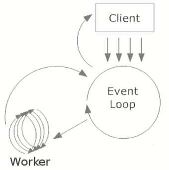

 

 

根据实现的方式不同，在网络编程中基于事件驱动主要有两种设计模式：Reactor和Proactor。

 

 

### 4.8.3 Reactor模型

首先来回想一下普通函数调用的机制：

*  程序调用某函数->函数执行
*  程序等待->函数返回结果
*  控制权返回给程序->程序继续处理

 

和普通函数调用的不同之处在于：应用程序不是主动的调用某个API完成处理，而是恰恰相反，应用程序需要提供相应的接口并注册到Reactor上，如果相应的事件发生，Reactor将主动调用应用程序注册的接口，这些接口又称为“回调函数”。

 

用“好莱坞原则”来形容Reactor再合适不过了：不要打电话给我们，我们会打电话通知你。

 

举个例子：你去应聘某某公司，面试结束后。

*  “普通函数调用机制”公司HR比较懒，不会记你的联系方式，那怎么办呢，你只能面试完后自己打电话去问结果；有没有被录取啊，还是被拒了；
*  “Reactor”公司HR就记下了你的联系方式，结果出来后会主动打电话通知你：有没有被录取啊，还是被拒了；你不用自己打电话去问结果，事实上也不能，因为你没有HR的联系方式。


 
以下是Reactor示意图。

 
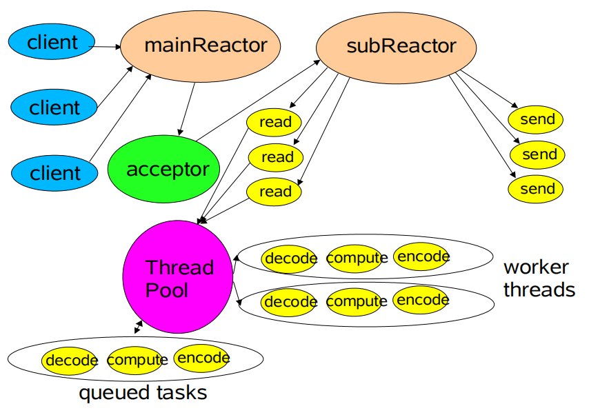

 
 
 
#### 1. Reactor模型的优点

Reactor模型是编写高性能网络服务器的必备技术之一，它具有如下的优点：

* 响应快，不必为单个同步时间所阻塞，虽然Reactor本身依然是同步的；
* 编程相对简单，可以最大程度的避免复杂的多线程及同步问题，并且避免了多线程/进程的切换开销；
* 可扩展性，可以方便的通过增加Reactor实例个数来充分利用CPU资源；
* 可复用性，Reactor框架本身与具体事件处理逻辑无关，具有很高的复用性。


#### 2. Reactor模型框架

使用Reactor模型，必备的几个组件：事件源、Reactor框架、事件多路复用机制和事件处理程序，先来看看Reactor模型的整体框架，接下来再对每个组件做逐一说明。

* 事件源：Linux上是文件描述符，Windows上就是Socket或者Handle了，这里统一称为“句柄集”；程序在指定的句柄上注册关心的事件，比如I/O事件。
* 事件多路复用机制：由操作系统提供的I/O多路复用机制，比如select和epoll。程序首先将其关心的句柄（事件源）及其事件注册到多路复用机制上。当有事件到达时，事件多路复用机制会发出通知“在已经注册的句柄集中，一个或多个句柄的事件已经就绪”。程序收到通知后，就可以在非阻塞的情况下对事件进行处理了。
* Reactor。是事件管理的接口，内部使用事件多路复用机制注册、注销事件；并运行事件循环，当有事件进入“就绪”状态时，调用注册事件的回调函数处理事件。
* 事件处理程序。事件处理程序提供了一组接口，每个接口对应了一种类型的事件，供Reactor在相应的事件发生时调用，执行相应的事件处理。通常它会绑定一个有效的句柄。

 

 

使用Reactor模型后，事件控制流是什么样子呢？可以参见下面的序列图。

 
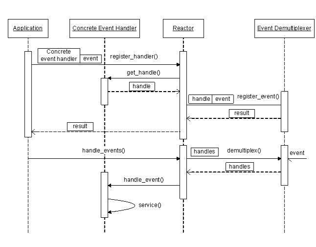

 


 

我们分别以读操作和写操作为例来看看Reactor中的具体步骤：

* 应用程序注册读就绪事件和相关联的事件处理器；
* 事件分离器等待事件的发生；
* 当发生读就绪事件的时候，事件分离器调用第一步注册的事件处理器；
* 事件处理器首先执行实际的读取操作，然后根据读取到的内容进行进一步的处理。

 

写入操作类似于读取操作，只不过第一步注册的是写就绪事件。


### 4.8.4 Proactor模型


我们来看看Proactor模型中读取操作和写入操作的过程：

* 应用程序初始化一个异步读取操作，然后注册相应的事件处理器，此时事件处理器不关注读取就绪事件，而是关注读取完成事件，这是区别于Reactor的关键。
* 事件分离器等待读取操作完成事件。
* 在事件分离器等待读取操作完成的时候，操作系统调用内核线程完成读取操作（异步I/O都是操作系统负责将数据读写到应用传递进来的缓冲区供应用程序操作），并将读取的内容放入用户传递过来的缓存区中。这也是区别于Reactor的一点。
* 事件分离器捕获到读取完成事件后，激活应用程序注册的事件处理器，事件处理器直接从缓存区读取数据，而不需要进行实际的读取操作。

 

Proactor中写入操作与读取操作类似，只不过感兴趣的事件是写入完成事件。

 

从上面可以看出，Reactor和Proactor模型的主要区别就是真正的读取和写入操作是有谁来完成的，Reactor中需要应用程序自己读取或者写入数据，而Proactor模型中，应用程序不需要进行实际的读写过程，它只需要从缓存区读取或者写入即可，操作系统会读取缓存区或者写入缓存区到真正的I/O设备。


 
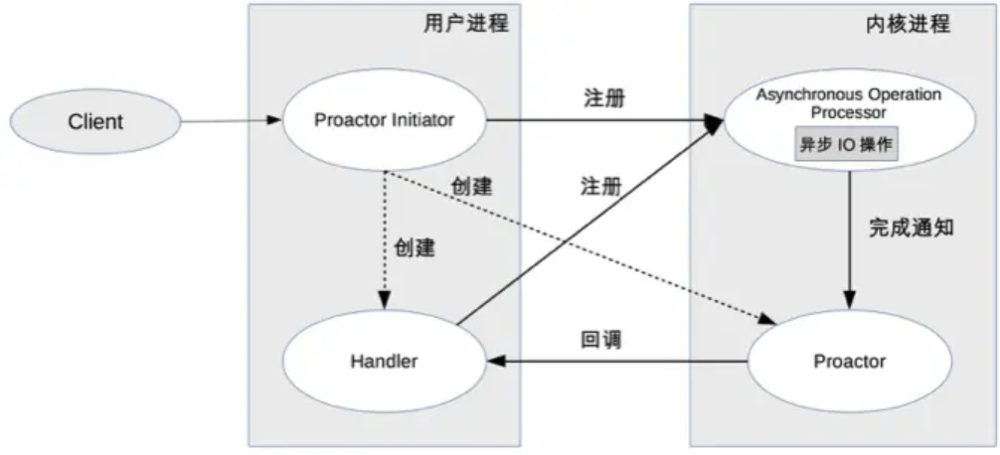

 


<sub>[1]有关Netty和Node.js方面的内容，可参阅《Netty原理解析与开发实战》《Node.js企业级应用开发实战》</sub>


## 5.1 线程与并发核心原理解读

计算机用户想当然地认为他们的系统在一个时间内可以做多件事。比如，用户一边用浏览器下载视频文件，一边可以继续在浏览器上浏览网页。可以做这样的事情的软件称为并发软件（Concurrent Software）。

计算机实现多个程序的同时执行，主要基于以下原因：

* 资源利用率。某些情况下，程序必须要等待其他外部的某个操作完成，才能往下继续执行，而在等待的过程中，该程序无法执行其他任何工作。因此，如果在等待的同时可以运行另外一个程序，将无疑提高资源的利用率。
* 公平性。不同的用户和程序对于计算机上的资源有着同等的使用权。一种高效的运行方式是通过粗粒度的时间分片（Time Slicing）使得这些用户和程序能共享计算机资源，而不是一个程序从头运行到尾，然后再启动下一个程序。
* 便利性。通常来说，在计算多个任务时，应该编写多个程序，每个程序执行一个任务并在必要时相互通信，这比只编写一个程序来计算所有任务更加容易实现。

### 并发与并行

那么并发与并行到底是如何区别的呢？

*The Practice of Programming*一书的作者Rob Pike对并发与并行做了如下描述：

*并发是同一时间应对（dealing with）多件事情的能力；并行是同一时间动手做（doing）多件事情的能力。
并发（concurrency）属于问题域（problem domain），并行（parallelism）属于解决域（solution domain）。并行和并发的区别在于有无状态，并行计算适合无状态应用，而并发解决的是有状态的高性能；有状态要着力解决并发计算，无状态要着力并行计算，云计算要能做到这两种计算自动伸缩扩展。*

上述的描述貌似有点抽象。举一个生活中的例子，某些人工作很忙那么家务活会请钟点工来打扫卫生。一个钟点工在一个小时可以帮你扫地、抹桌子、洗菜、做饭。客户并不关心哪件活先干哪件活后做，客户所关心的是，付费的这一个小时，需要看到所有活都完成。在客户看来，这一个小时内，所有的活都是一个钟点工干的，这就是并发。

再举一例子，客户的亲戚要来看望客户，还有不到一个小时亲戚就要登门了。那么平时要花一个小时才能做完的家务，如何才能提前做完呢？答案是加人。请多几个钟点工一起来做事，比如某个钟点工专门扫地，某人专门抹桌子，某人专门负责洗菜、做饭。这样三人同时开工，就能缩短整体的时间，这就是并行。

从计算机角度来说，单个CPU是需要被某个任务独占的，就如同终点工，在扫地的同时，就不能做抹桌子的动作。如果她想去抹桌子，就需要将手头的扫地任务先停下来。当然，由于多个任务是不断的切换的，因此，在外界看来，就有了“同时”执行多个任务的错觉。

现代的计算机大多是多核（CPU）的，因此，多个CPU同时执行任务，就实现了任务的并行。


### 线程与并发

早期的分时系统中，每个进程以串行化方式执行指令，并通过一组I/O指令来与外部设备通信。每条被执行的指令都有相应的“下一条指令”，程序中的控制流就是按照指令集的规则来确定的。

串行编程模型的优势是直观性和简单性，因为它模仿了人类的工作方式：每次只做一件事，做完再做其他事情。例如，早上起床后，先穿衣，然后下楼，吃早饭。在编程语言中，这些现实世界的动作可以进一步被抽象为一组粒度更细的动作。例如，喝茶的动作可以被细化为：打开橱柜，挑选茶叶，将茶叶倒入杯中，查看茶壶的水是否够，不够要加水，将茶壶放在火炉上，点燃火炉，然后等水烧开，等等。在等水烧开这个过程中包含了一定程序的异步性。例如，在烧水过程中，你可以干等，也可以做其他事情，比如开始烤面包，或者看报纸（这就是另一个异步任务），同时留意水是否烧开了。但凡做事高效的人，总能在串行性和异步性之间找到合理的平衡，程序也是如此。

线程允许在同一个进程中同时存在多个线程控制流。线程会共享进程范围内的资源，例如内存句柄和文件句柄，但每个线程都有各自的程序计数器、栈以及局部变量。线程还提供了一种直观的分解模式来充分利用操作系统中的硬件并行性，而在同一个程序中的多个线程也可以被同时调度到多个CPU上运行。

多线程编程使得程序任务并发成为了可能。而并发控制主要是为了解决多个线程之间资源争夺等问题。并发一般发生在数据聚合的地方，只要有聚合，就有争夺发生，传统解决争夺的方式采取线程锁机制，这是强行对CPU管理线程进行人为干预，线程唤醒成本高，新的无锁并发策略来源于异步编程、非阻塞I/O等编程模型。


## 5.2 常见并发风险深度解析：避免90%的生产环境异常单

多线程并发会带来如下的问题：

* 安全性问题。在没有充足同步的情况下，多个线程中的操作执行顺序是不可预测的，甚至会产生奇怪的结果。线程间的通信主要是通过共享访问字段及其字段所引用的对象来实现的。这种形式的通信是非常有效的，但可能导致两种错误：线程干扰（thread interference）和内存一致性错误（memory consistency errors）。
* 活跃度问题。一个并行应用程序的及时执行能力被称为它的活跃度（liveness）。安全性的含义是“永远不发生糟糕的事情”，而活跃度则关注于另外一个目标，即“某件正确的事情最终会发生”。当某个操作无法继续执行下去，就会发生活跃度问题。在串行程序中，活跃度问题形式之一就是无意中造成的无限循环（死循环）。而在多线程程序中，常见的活跃度问题主要有死锁、饥饿以及活锁。
* 性能问题。在设计良好的并发应用程序中，线程能提升程序的性能，但无论如何，线程总是带来某种程度的运行时开销。而这种开销主要是在线程调度器临时关起活跃线程并转而运行另外一个线程的上下文切换操作（Context Switch）上，因为执行上下文切换，需要保存和恢复执行上下文，丢失局部性，并且CPU时间将更多地花在线程调度而不线程运行上。当线程共享数据时，必须使用同步机制，而这些机制往往会抑制某些编译器优化，使内存缓存区中的数据无效，以及增加贡献内存总线的同步流量。所以这些因素都会带来额外的性能开销。


### 5.2.1 死锁（Deadlock）

死锁是指两个或两个以上的线程永远被阻塞，一直等待对方的资源。

下面是一个Java编写的死锁的例子。

Alphonse和Gaston是朋友，都很有礼貌。礼貌的一个严格的规则是，当你给一个朋友鞠躬时，你必须保持鞠躬，直到你的朋友鞠躬回给你。不幸的是，这条规则有个缺陷，那就是如果两个朋友同一时间向对方鞠躬，那就永远不会完了。这个示例应用程序中，死锁模型是这样的：

```java
package com.example.java.demo.concurrency;

public class Deadlock {

	public static void main(String[] args) {
		final Friend alphonse = new Friend("Alphonse");
        final Friend gaston = new Friend("Gaston");
        new Thread(new Runnable() {
            public void run() {
                alphonse.bow(gaston);
            }
        }).start();
        
        new Thread(new Runnable() {
            public void run() {
                gaston.bow(alphonse);
            }
        }).start();
	}
	
	static class Friend {
        private final String name;

        public Friend(String name) {
            this.name = name;
        }

        public String getName() {
            return this.name;
        }

        public synchronized void bow(Friend bower) {
            System.out.format("%s: %s" + "  has bowed to me!%n", 
            		this.name, bower.getName());
            bower.bowBack(this);
        }

        public synchronized void bowBack(Friend bower) {
            System.out.format("%s: %s" + " has bowed back to me!%n", 
            		this.name, bower.getName());
        }
    }

}
```

当它们尝试调用bowBack时两个线程将被阻塞。无论是哪个线程，也永远不会结束，因为每个线程都在等待对方鞠躬。这就是死锁了。


### 5.2.2 饥饿（Starvation）

饥饿描述了一个线程由于访问足够的共享资源而不能执行程序的现象。这种情况一般出现在共享资源被某些“贪婪”线程占用，而导致资源长时间不被其他线程可用。例如，假设一个对象提供一个同步的方法，往往需要很长时间返回。如果一个线程频繁调用该方法，其他线程若也需要频繁地同步访问同一个对象则通常会被阻塞。

### 5.2.3 活锁（Livelock）


一个线程常常处于响应另一个线程的动作，如果其他线程也常常响应该线程的动作，那么就可能出现活锁。与死锁的线程一样，程序无法进一步执行。然而，线程是不会阻塞的，它们只是会忙于应对彼此的恢复工作。现实中的例子是，两人面对面试图通过一条走廊：Alphonse移动到他的左侧给Gaston让路，而Gaston移动到他的右侧想让Alphonse过去，两个人同时让路，但其实两人都挡住了对方，他们仍然彼此阻塞。

下面就介绍几种解决并发问题的常用方法。


## 5.3 解决并发风险之道

同步和原子访问，是解决并发风险的两种重要方式。

### 5.3.1 同步（Synchronization）


同步是避免线程干扰和内存一致性错误的常用手段。下面就用Java代码来演示这几种问题，以及如何用同步解决这类问题。

#### 1. 线程干扰

下面描述当多个线程访问共享数据时错误是如何出现的。考虑下面的一个简单的类Counter：

```java
public class Counter {
    private int c = 0;

    public void increment() {
        c++;
    }

    public void decrement() {
        c--;
    }

    public int value() {
        return c;
    }
}
```

其中的increment方法用来对c加1；decrement方法用来对c减1。然而，多个线程中都存在对某个Counter对象的引用，那么线程间的干扰就可能导致出现我们不想要的结果。

线程间的干扰出现在多个线程对同一个数据进行多个操作的时候，也就是出现了“交错”。这就意味着操作是由多个步骤构成的，而此时，在这多个步骤的执行上出现了叠加。

Counter类对象的操作貌似不可能出现这种“交错（interleave）”，因为其中的两个关于c的操作都很简单，只有一条语句。然而，即使是一条语句也会被虚拟机翻译成多个步骤。在这里，我们不深究虚拟机具体将上面的操作翻译成了什么样的步骤。只需要知道即使简单的C++这样的表达式也会被翻译成三个步骤：

* （1）获取c的当前值。
* （2）对其当前值加1。
* （3）将增加后的值存储到c中。

表达式c--也会被按照同样的方式进行翻译，只不过第二步变成了减1，而不是加1。

假定线程A中调用increment方法，线程B中调用decrement方法，而调用时间基本上相同。如果c的初始值为0，那么这两个操作的“交错”顺序可能如下所示。

* （1）线程A：获取c的值。
* （2）线程B：获取c的值。
* （3）线程A：对获取到的值加1，其结果是1。
* （4）线程B：对获取到的值减1，其结果是-1。
* （5）线程A：将结果存储到c中，此时c的值是1。
* （6）线程B：将结果存储到c中，此时c的值是-1。

这样线程A计算的值就丢失了，也就是被线程B的值覆盖了。上面的这种“交错”只是其中的一种可能性。在不同的系统环境中，有可能是 B 线程的结果丢失了，或者是根本就不会出现错误。由于这种“交错”是不可预测的，线程间相互干扰造成的bug是很难定位和修改的。

#### 2. 内存一致性错误

下面介绍通过共享内存出现的不一致的错误。

内存一致性错误发生在不同线程对同一数据产生不同的“看法”。导致内存一致性错误的原因很复杂，超出了本书的描述范围。庆幸的是，程序员并不需要知道出现这些原因的细节。我们需要的是一种可以避免这种错误的方法。

避免出现内存一致性错误的关键在于理解happens-before关系。这种关系是一种简单的方法，能够确保一条语句对内存的写操作对于其他特定的语句都是可见的。为了理解这点，我们可以考虑如下的示例。假设定义了一个简单的int类型的字段并对其进行初始化：

```java
int counter = 0;
```

该字段由两个线程共享：A和B。假定线程A对counter进行了自增操作：

```java
counter ++;
```

然后，线程B打印counter的值：

```java
System.out.println(counter);
```

如果以上两条语句是在同一个线程中执行的，那么输出的结果自然是1。但是如果这两条语句是在两个不同的线程中，那么输出的结构有可能是0。这是因为没有保证线程A对counter的修改对线程B来说是可见的。除非程序员在这两条语句间建立了一定的happens-before关系。

我们可以采取多种方式建立这种happens-before关系。使用同步就是其中之一，这点我们将会在下面的小节中看到。
到目前为止，我们已经看到了两种建立这种happens-before的方式：

* 当一条语句中调用了Thread.start方法，那么每一条和该语句已经建立了happens-before的语句都和新线程中的每一条语句有这种happens-before。引入并创建这个新线程的代码产生的结果对该新线程来说都是可见的。
* 当一个线程终止了并导致另外的线程中调用Thread.join的语句返回，那么此时这个终止了的线程中执行了的所有语句都与随后的join语句的所有语句建立了这种happens-before。也就是说，终止了的线程中的代码效果对调用join方法的线程来说是可见的。


#### 3. 同步方法

Java编程语言中提供了两种基本的同步用语：同步方法（synchronized methods）和同步语句（synchronized statements）。同步语句相对而言更为复杂一些，我们将在下一小节中进行描述。本节重点讨论同步方法。
我们只需要在声明方法的时候增加关键字synchronized即可：

```java
public class SynchronizedCounter {
    private int c = 0;

    public synchronized void increment() {
        c++;
    }

    public synchronized void decrement() {
        c--;
    }

    public synchronized int value() {
        return c;
    }
}
```

如果count是SynchronizedCounter类的实例，设置其方法为同步方法会有两个效果：

* 首先，不可能出现对同一对象的同步方法的两个调用的“交错”。当一个线程在执行一个对象的同步方式的时候，其他所有调用该对象的同步方法的线程都会被挂起，直到第一个线程对该对象操作完毕。
* 其次，当一个同步方法退出时，会自动与该对象的同步方法的后续调用建立happens-before关系。这就确保了对该对象的修改对其他线程是可见的。


同步方法是一种简单的可以避免线程相互干扰和内存一致性错误的策略：如果一个对象对多个线程都是可见的，那么所有对该对象的变量的读写都应该是通过同步方法完成的（一个例外就是final字段，它在对象创建完成后是不能被修改的，因此，在对象创建完毕后，可以通过非同步的方法对其进行安全地读取）。这种策略是有效的，但是可能导致“活跃度问题”。这点我们会在后面进行描述。

#### 4. 内部锁和同步

同步是构建在被称为“内部锁（intrinsic lock）”或者是“监视锁（monitor lock）”的内部实体上的。在API中通常被称为“监视器（monitor）”。内部锁在两个方面都扮演着重要的角色：保证对对象状态访问的排他性，建立对象可见性相关的happens-before关系。
每一个对象都有一个与之相关联动的内部锁。按照传统的做法，当一个线程需要对一个对象的字段进行排他性访问并保持访问的一致性时，它必须在访问前先获取该对象的内部锁，然后才能访问之，最后释放该内部锁。在线程获取对象的内部锁到释放对象的内部锁的这段时间，我们说该线程拥有该对象的内部锁。只要有一个线程已经拥有了一个内部锁，其他线程就不能再拥有该锁了。其他线程在试图获取该锁的时候被阻塞了。
当一个线程释放了一个内部锁，那么就会建立起该动作和后续获取该锁之间的happens-before关系。


#### 5. 同步方法中的锁

当一个线程调用一个同步方法的时候，它就自动地获得了该方法所属对象的内部锁，并在方法返回的时候释放该锁。即使由于出现了没有被捕获的异常而导致方法返回，该锁也会被释放。

我们可能会感到疑惑：当调用一个静态的同步方法的时候会怎样？静态方法是和类相关的，而不是和对象相关的。在这种情况下，线程获取的是该类的类对象的内部锁。这样对于静态字段的方法来说，这是由和类的实例的锁相区别的另外的一个锁来进行操作的。

#### 6. 同步语句

另外一种创建同步代码的方式就是使用同步语句。和同步方法不同，使用同步语句必须指明要使用哪个对象的内部锁：

```java
public void addName(String name) {
    synchronized(this) {
        lastName = name;
        nameCount++;
    }
    nameList.add(name);
}
```


在上面的示例中，方法addName需要对lastName和nameCount的修改进行同步，还要避免同步调用其他对象的方法（在同步代码段中调用其他对象的方法可能导致“活跃度”中描述的问题）。如果没有使用同步语句，那么将不得不使用一个单独、未同步的方法来完成对nameList.add的调用。

在改善并发性时，巧妙地使用同步语句能起到很大的帮助作用。例如，我们假定类MsLunch有两个实例字段，c1和c2，这两个变量绝不会一起使用。所有对这两个变量的更新都需要进行同步。但是没有理由阻止对c1的更新和对c2的更新出现交错—这样做会创建不必要的阻塞，进而降低并发性。此时，我们没有使用同步方法或者使用和this相关的锁，而是创建了两个单独的对象来提供锁。

```java
public class MsLunch {
    private long c1 = 0;
    private long c2 = 0;
    private Object lock1 = new Object();
    private Object lock2 = new Object();

    public void inc1() {
        synchronized(lock1) {
            c1++;
        }
    }

    public void inc2() {
        synchronized(lock2) {
            c2++;
        }
    }
}
```

采用这种方式时需要特别小心，我们必须绝对确保相关字段的访问交错是完全安全的。

#### 7. 重入同步（Reentrant Synchronization）

回忆前面提到的：线程不能获取已经被别的线程获取的锁。但是线程可以获取自身已经拥有的锁。允许一个线程能重复获得同一个锁就称为重入同步（reentrant synchronization）。它是这样的一种情况：在同步代码中直接或者间接地调用了还有同步代码的方法，两个同步代码段中使用的是同一个锁。如果没有重入同步，在编写同步代码时需要额外小心，以避免线程将自己阻塞。

### 5.3.2 原子访问（Atomic Access）

下面介绍另外一种可以避免被其他线程干扰的做法的总体思路—原子访问。

在编程中，原子性动作就是指一次性有效完成的动作。原子性动作是不能在中间停止的：要么一次性完全执行完毕，要么就不执行。在动作没有执行完毕之前，是不会产生可见结果的。

通过前面的示例，我们已经发现了诸如c++这样的自增表达式并不属于原子操作。即使是非常简单的表达式也包含了复杂的动作，这些动作可以被解释成许多别的动作。然而，的确存在一些原子操作：

* 对几乎所有的原生数据类型变量（除了long和double）的读写以及引用变量的读写都是原子的。
* 对所有声明为volatile的变量的读写都是原子的，包括long和double类型。

原子性动作是不会出现交错的，因此，使用这些原子性动作时不用考虑线程间的干扰。然而，这并不意味着可以移除对原子操作的同步。因为内存一致性错误还是有可能出现的。使用volatile变量可以降低内存一致性错误的风险，因为任何对volatile变量的写操作都和后续对该变量的读操作建立了happens-before关系。这就意味着对volatile类型变量的修改对于别的线程来说是可见的。更重要的是，这意味着当一个线程读取一个volatile类型的变量时，它看到的不仅仅是对该变量的最后一次修改，还看到了导致这种修改的代码带来的其他影响。

使用简单的原子变量访问比通过同步代码来访问变量更高效，但是需要程序员更多细心的考虑，以避免内存一致性错误。这种额外的付出是否值得完全取决于应用程序的大小和复杂度。


## 5.4 提升系统并发能力：让资源争用成本降低80%

除了使用多线程外，还有以下方式可以提升系统的并发能力。

#### 5.4.1 无锁化设计提升并发能力

加锁是为了避免在并发环境下，同时访问共享资源产生的风险问题。那么，在并发环境下，必须需要加锁？答案是否定的。并非所有的并发都需要加锁。适当的降低锁的粒度，甚至是采用无锁化的设计，更能提升并发能力。

比如，JDK中的ConcurrentHashMap，巧妙采用了桶粒度的锁，避免了put和get中对整个map的锁定，尤其在get中，只对一个HashEntry做锁定操作，性能提升是显而易见。

又比如，程序中可以合理考虑业务数据的隔离性，实现无锁化的并发。比如，程序中预计会有2个并发任务，那么每个任务可以对所需要处理的数据进行分组。任务1去处理尾数为0到4的业务数据，任务2处理尾数为5到9的业务数据。那么，这两个并发任务所要处理的数据，就是天然是隔离的，也就无需加锁。

#### 5.4.2 缓存提升并发能力

有时，为了提升整个网站的性能，我们会将经常需要访问数据缓存起来，这样，在下次查询的时候，能快速的找到这些数据。缓存系统往往有着比传统的数据存储设备（如关系型数据库）更快的访问速度。

缓存的使用与系统的时效性有着非常大的关系。当我们的系统时效性要求不高时，则选择使用缓存是极好的。当系统要求的时效性比较高时，则并不适合用缓存。


#### 5.4.3 更细颗粒度的并发单元

在前面章节中，我们也讨论了，线程是操作系统内核级别最小的并发单元了。虽然相比于进程而言，创建线程的开销要小很多，但当在高并发场景下，创建大量的线程仍然会耗费系统大量的资源。为此，某些编程语言提供了更细颗粒度的并发单元，比如纤程，类似于Golang的goroutine，Erlang风格的actor。相比于线程，纤程可以轻松实现百万的并发量，而且占用更加少的硬件资源。

Java语言虽然没有定义纤程，但仍有一些第三方库可供选择，比如Quasar。读者有兴趣的话，可以参阅Quasar的在线手册（<http://docs.paralleluniverse.co/quasar/>）。


## 6.1 全栈工程师必知的架构核心要素，构建系统级设计思维

架构师的设计思维涵盖多个关键要素，这些要素相互关联、相互影响，共同构成了架构师进行有效设计的基础，以下从抽象与建模、整体与局部、技术与业务等维度加以阐述。


### 6.1.1 抽象与建模

抽象与建模能力将现实问题转化为抽象问题。

- 抽象能力：架构师需要从复杂的现实世界或业务需求中提取出关键信息和本质特征，忽略无关紧要的细节，将问题简化为可处理的模型。例如，在设计电商系统时，把各种商品抽象为具有名称、价格、库存等属性的“商品”对象，把用户的购买行为抽象为“订单”对象等，通过这种抽象可以更清晰地理解系统的核心概念和关系。
- 建模技巧：运用各种建模方法和工具，如UML（统一建模语言）、流程图、数据模型等，将抽象的概念和关系以可视化、规范化的方式表达出来。这些模型不仅有助于架构师自己梳理思路，还能方便与团队成员、客户等进行沟通和交流，确保各方对系统的理解一致。

### 6.1.2 整体与局部


理清整体与局部的关系。

- 全局视野：架构师要从整体上把握系统的架构，考虑系统的各个组成部分之间的相互关系、交互方式以及它们如何协同工作以实现系统的整体目标。例如，在设计大型供应链系统时，需要考虑前端界面、后端服务、数据库、缓存、消息队列等各个部分的架构，以及它们之间的数据流向、通信机制等，确保整个系统的高可用性、可扩展性和性能优化。
- 局部优化：在关注整体的同时，也不能忽视对局部模块或功能的优化。每个局部的性能、可靠性等都会影响到系统的整体表现。比如，对于系统中的核心业务模块，可能需要采用更高效的算法、数据结构或技术框架来提高其处理速度和响应性能，同时要确保局部的优化不会对其他部分产生负面影响。

### 6.1.3 技术与业务


架构设计不能单单关注技术问题，否则设计出来的架构必定只是空中楼阁。架构设计时应综合考虑技术与业务。


- 技术理解：深入理解各种相关技术，包括编程语言、框架、数据库、云计算、网络技术等，了解它们的优势、劣势、适用场景和最新发展趋势。只有掌握了丰富的技术知识，才能在架构设计中做出合理的技术选型和决策。例如，根据系统的并发量、数据量等需求，选择合适的数据库类型（关系型数据库、NoSQL数据库等）和存储架构。
- 业务驱动：架构设计要紧密围绕业务需求展开，以实现业务目标为最终目的。架构师需要与业务人员深入沟通，了解业务流程、业务规则和业务痛点，将业务需求转化为具体的架构设计。例如，在设计金融风控系统时，要根据金融业务的风险控制要求，设计相应的风险评估模型、数据监控和预警机制等架构。

### 6.1.4 稳定性与可扩展性

架构设计时应考虑稳定性与可扩展性。

- 稳定性设计：确保系统在各种情况下都能稳定运行，具备高可靠性和容错性。这包括考虑硬件故障、软件错误、网络问题、高并发等各种可能出现的情况，并采取相应的措施，如冗余设计、备份恢复机制、监控告警系统等。例如，在设计分布式系统时，通过多节点部署、数据复制等方式保证系统在部分节点出现故障时仍能正常提供服务。
- 可扩展性规划：预见到系统未来可能的发展和变化，设计具有良好可扩展性的架构，以便在业务增长、功能增加或技术升级时，系统能够轻松应对，而不需要进行大规模的重构。例如，采用微服务架构、插件化设计等方式，使系统可以方便地添加新的服务或功能模块，支持系统的灵活扩展。

### 6.1.5 性能与成本

在设计架构时，也要综合考虑性能与成本。

- 性能优化：关注系统的性能指标，如响应时间、吞吐量、并发处理能力等，通过优化算法、数据结构、系统架构等方式，提高系统的性能。例如，在设计搜索引擎时，通过使用倒排索引、缓存机制、分布式计算等技术，提高搜索的速度和效率，为用户提供快速的搜索体验。
- 成本控制：在满足系统性能和功能需求的前提下，考虑成本因素，包括硬件成本、软件成本、开发成本、运维成本等。合理选择技术和架构方案，避免过度设计和资源浪费。例如，根据系统的实际需求，选择合适的云计算服务套餐，或者采用开源技术来降低软件采购成本。

### 6.1.6 迭代与演进

架构设计并非一蹴而就，只要不断的迭代与演进，才能保证生命力。

- 迭代思维：认识到架构设计不是一次性完成的，而是一个不断迭代和优化的过程。在项目的不同阶段，根据需求的变化、技术的发展和用户的反馈，对架构进行持续改进和完善。例如，在软件开发的敏捷迭代过程中，架构师会根据每个迭代周期的需求和问题，对系统架构进行微调或优化。
- 演进能力：能够推动架构的演进，使系统能够适应不断变化的环境和需求。这需要架构师具备前瞻性的眼光，关注行业的发展趋势和新技术的应用，及时引入新的技术和理念，对架构进行升级和重构。例如，随着人工智能技术的发展，在一些传统的业务系统中引入人工智能算法和模型，对系统架构进行相应的调整和优化，以提升系统的智能化水平。


## 6.2 B/S vs C/S：不同场景下的架构抉择与演进策略

在IT技术领域，B/S架构和C/S架构是两种常见的软件系统架构模式。

### 6.2.1 B/S架构

B/S架构（Browser/Server，浏览器/服务器架构）是一种以浏览器作为客户端，服务器作为服务提供端的软件架构模式。在这种架构中，用户通过浏览器向服务器发送请求，服务器处理请求后将结果返回给浏览器进行显示。其基本结构主要由浏览器、Web服务器、应用服务器和数据库服务器组成。浏览器负责呈现用户界面，接收用户输入；Web服务器用于处理HTTP请求，将请求转发给应用服务器；应用服务器执行业务逻辑处理；数据库服务器则负责存储和管理数据。


B/S架构的工作原理是：用户在浏览器中输入网址或点击链接，浏览器根据输入的信息生成HTTP请求，并将请求发送到服务器。服务器接收到请求后，根据请求的内容进行相应的处理，如从数据库中获取数据、执行特定的业务逻辑等。处理完成后，服务器将结果以HTML、CSS、JavaScript等格式组装成网页，再通过HTTP响应发送回浏览器。浏览器接收到响应后，对网页进行解析和渲染，将内容展示给用户。

日常大部分通过浏览器来访问的系统，都是B/S架构的系统。比如，我们在浏览器访问淘宝、京东等网站进行购物，这些网站就是B/S架构的系统。


B/S架构特点如下。

- 易于部署和维护：用户只需通过浏览器访问系统，无需在本地安装专门的客户端软件，方便快捷。对于软件的更新和维护，只需在服务器端进行操作，用户下次访问时即可使用最新版本，大大降低了维护成本。
- 跨平台性强：只要有浏览器和网络连接，用户可以在不同的操作系统和设备上访问系统，如Windows、Mac、Linux以及各种移动设备等，具有很强的兼容性。
- 安全性相对较低：由于所有数据和业务逻辑都在服务器端处理，浏览器与服务器之间的通信可能存在安全风险，如网络攻击、数据泄露等。需要通过加密技术、身份验证等手段来增强安全性。
- 对服务器性能要求较高：大量的用户请求都需要服务器进行处理和响应，当并发用户数较多时，可能会对服务器的性能造成较大压力，需要服务器具备较高的处理能力和可扩展性。

### 6.2.2 C/S架构

C/S架构（Client/Server，客户端/服务器架构）是一种将软件系统分为客户端和服务器端两部分的架构模式。客户端安装在用户的本地设备上，负责与用户进行交互，收集用户输入并展示服务器返回的结果；服务器端则负责提供数据存储、业务逻辑处理等服务，为客户端提供支持。其基本结构包括客户端应用程序、服务器和数据库。客户端应用程序通过网络与服务器进行通信，服务器与数据库进行数据交互。


C/S架构的工作原理是：客户端应用程序在本地运行，用户通过客户端界面进行操作，客户端根据用户的操作生成请求，并将请求发送到服务器。服务器接收到请求后，进行相应的处理，如查询数据库、执行特定的业务逻辑等。处理完成后，服务器将结果返回给客户端，客户端对结果进行解析和展示，呈现给用户。

日常在手机端大部分通过APP访问来使用的系统，都是C/S架构的系统。比如，我们在淘宝APP、京东APP进行购物，这些APP就是C/S架构的中的客户端部分。当我们希望在鸿蒙系统上设计开发一款鸿蒙APP的时候，这个APP也是客户端。


C/S架构特点如下。

- 性能较好：由于部分业务逻辑和数据处理可以在客户端进行，减少了与服务器的交互次数，因此在处理一些复杂的业务逻辑和大量数据时，性能相对较好，响应速度较快。
- 安全性较高：客户端和服务器之间的通信通常采用专用的协议，相对HTTP等协议更安全。并且数据可以在客户端进行一定的加密处理，提高了数据的安全性。
- 用户体验好：客户端应用程序可以根据用户的操作习惯和需求进行定制化设计，提供更加丰富和流畅的用户界面和交互体验，如本地缓存数据、离线操作等功能。
- 部署和维护成本高：每个客户端都需要安装和配置软件，当软件更新时，需要逐个客户端进行升级，部署和维护工作较为繁琐，成本较高。
- 跨平台性差：通常情况下，客户端应用程序需要针对不同的操作系统进行开发和编译，如Windows客户端、Mac客户端等，开发和维护的工作量较大，跨平台性不如B/S架构。

B/S架构和C/S架构各有优缺点，在实际应用中，需要根据具体的业务需求、用户群体、技术特点等因素来选择合适的架构模式。


### 6.2.3 富客户端技术

富客户端技术是一种用于构建富互联网应用（Rich Internet Applications，RIA）的技术，它集成了桌面应用的交互性和传统Web应用的部署灵活性与成本效益，旨在为用户提供更高和更全方位的网络体验。富客户端技术通过提供一个运行时的环境，承载被编译的客户端应用程序，这些应用程序通常是通过HTTP协议发布的文件。


富客户端技术具有如下特点。

- 丰富的用户界面：富客户端应用程序能够提供类似于本地桌面应用的丰富、动态的用户界面。它支持复杂的布局、动画效果、拖放操作、实时数据验证等高级交互特性，使用户操作更加直观和便捷。比如一些富客户端的绘图软件，用户可以像使用本地的专业绘图工具一样，进行自由的图形绘制、编辑和特效添加，具有非常流畅和自然的操作体验。
- 本地处理能力：富客户端具备在本地执行部分计算和数据处理的能力。它可以在客户端设备上缓存数据、执行脚本和业务逻辑，减少与服务器的交互次数，提高响应速度和运行效率。例如，在离线地图应用中，用户可以提前下载地图数据到本地，在没有网络的情况下依然能够进行地图浏览、路径规划等操作，这些计算和处理都在本地完成。
- 异步数据交互：富客户端采用异步数据传输技术，允许在不刷新整个页面的情况下与服务器进行数据交互。这使得用户在进行数据提交、查询等操作时，页面能够保持当前状态，不会出现整体刷新导致的页面闪烁和中断，提高了用户体验的连贯性。比如在在线表单填写应用中，用户可以实时提交表单数据进行验证，而无需刷新整个页面，验证结果会即时反馈给用户。
- 跨平台兼容性：通过使用一些跨平台的技术框架，富客户端应用可以在不同的操作系统和设备上运行，具有较好的跨平台性。例如，基于HTML5、JavaScript和CSS等技术开发的富客户端应用，可以在Windows、Mac、Linux以及各种移动设备的浏览器中运行，无需为每个平台单独开发。

在B/S架构中，富客户端技术的实现方式有以下几种。

- HTML5技术：HTML5为富客户端应用提供了丰富的功能支持，如Canvas绘图、本地存储、Web Workers多线程处理等。通过Canvas可以实现复杂的图形绘制和动画效果；本地存储可以将大量数据存储在客户端本地，方便离线访问；Web Workers则允许在后台执行脚本，不影响页面的交互响应。
- JavaScript框架：像Angular、React、Vue.js等JavaScript框架，为构建富客户端应用提供了强大的工具和架构支持。它们采用组件化、数据驱动的开发模式，使得开发人员能够更高效地创建复杂的用户界面和交互逻辑，提高代码的可维护性和可扩展性。
- Flash技术：虽然Flash的应用逐渐减少，但在过去，它是实现富客户端应用的重要技术之一。Flash能够提供丰富的多媒体展示和交互功能，常用于制作动画、游戏、在线视频播放器等富客户端应用。
- Microsoft Silverlight：是一种融合了微软的多种技术的Web呈现技术。它提供了一套开发框架，并通过使用基于向量的图像图层技术，支持任何尺寸图像的无缝整合。Silverlight使开发设计人员能够更好的协作，有效地创造出能在Windows和Macintosh上多种浏览器中运行的内容丰富、界面绚丽的Web应用程序。简而言之，Silverlight是一个跨浏览器、跨平台的插件，为网络带来下一代基于`.NET`媒体体验，和丰富的交互式应用程序。由于HTML5技术比较成熟了，导致微软在2021年已经停止支持Silverlight，官方网站时也不再提供下载。
- JavaFX：JavaFX是一种用于构建富客户端应用的Java技术框架，它提供了丰富的图形界面组件和动画效果，能够开发出功能强大、界面美观的跨平台应用程序，适用于开发各种类型的桌面应用和企业级应用。

富客户端技术的应用场景如下。

- 在线办公软件：如Google Docs、腾讯文档等，用户可以在浏览器中进行文档编辑、表格制作、幻灯片演示等操作，具有与本地办公软件相似的功能和操作体验，同时还能实时保存和共享文档。
- 在线游戏：许多网页游戏采用富客户端技术，能够在浏览器中呈现出精美的游戏画面和流畅的游戏操作，用户无需下载庞大的游戏客户端，通过浏览器即可快速启动游戏。
- 企业级应用：在企业内部的管理系统、客户关系管理（CRM）系统、项目管理系统等应用中，富客户端技术可以提供丰富的交互功能和高效的数据处理能力，满足企业用户复杂的业务需求。


## 6.3 面向对象的分布式架构：从单体到分布式的平滑过渡路径示

在基于对象的分布式系统中，对象的概念在分布式实现中起着极其关键的作用。从原理上来讲，所有的一切都可以被作为对象抽象出来，而客户端将以调用对象的方式来获得服务和资源。

分布式对象之所以成为重要的范型，是因为它相对比较容易地把分布的特性隐藏在对象接口后面。而且因为对象实际上可以是任何事务，所以它也是构建系统的强大范型。

面向对象技术于20世纪80年代开始用于开发分布式系统。同样，在达到高度分布式透明性的同时，通过远程服务器宿主独立对象的理念构成了开发新一代分布式系统的稳固的基础。在本节中，我们将看到基于对象的分布式系统的常用体系结构。


### 6.3.1 基本概念

面向对象的分布式架构是一种融合了面向对象编程思想和分布式计算技术的软件架构模式，它将系统中的各种元素视为具有特定属性和行为的对象，并使这些对象能够在分布式环境中协同工作，以实现复杂的业务功能。

常见的面向对象的分布式架构技术包括微软DCOM（COM+）、CORBA、Java RMI等。

面向对象的分布式架构包含以下基本概念。

- 面向对象：源于面向对象编程（OOP），将现实世界中的事物抽象为对象，每个对象都有自己的状态（属性）和行为（方法）。对象之间通过消息传递进行交互，这种方式使得软件结构更清晰，易于理解、维护和扩展。
- 分布式：指系统的各个组件分布在不同的物理节点上，通过网络进行通信和协作。分布式架构可以将任务分散到多个节点上并行处理，提高系统的处理能力和可靠性，同时能够灵活地扩展系统规模以应对不同的业务需求。
- 融合：面向对象的分布式架构就是将面向对象的思想应用到分布式系统中，使分布式系统中的各个节点和组件都可以看作是具有独立功能的对象，它们在网络环境下相互协作，共同完成系统的整体任务。


### 6.3.2 基本原理


软件世界中的对象和现实世界中的对象类似，对象存储状态在属性里，而通过方法来暴露其行为。方法对对象的内部状态进行操作，并作为对象与对象之间通信的主要机制。隐藏对象内部状态，通过方法进行所有的交互操作，这是面向对象编程的一个基本原则：数据封装（data encapsulation），可以通过接口（interface）来使用方法。一个对象可能实现多个接口，而给定的一个接口定义可能有多个对象为其提供实现。

把接口与实现这些接口的对象进行分隔，对分布式系统很关键。严格的隔离允许我们把接口放在一台机器上，而使对象本身驻留在另外一台机器上。这种组织通常称为分布式对象（distributed object），如图6-1所示。

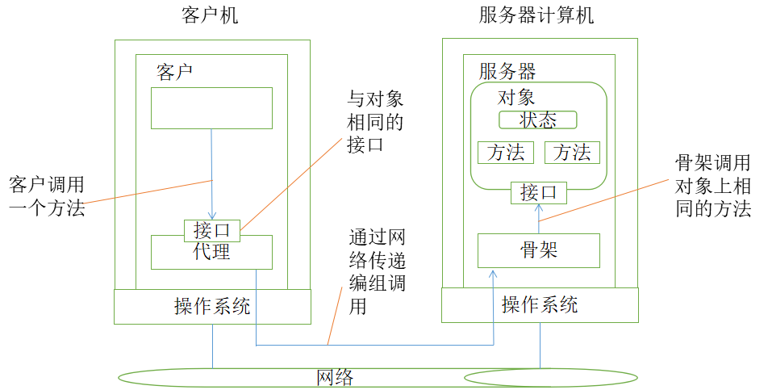


当客户绑定（bind）到一个分布式对象时，就会把这个对象的接口的实现—称为代理（proxy）—加载进客户的地址空间中。代理类似于RPC系统中的客户存根（client stub）。它所做的事是把方法调用编组进消息中，以及对应答消息进行解组，把方法调用的结果返回给客户。实际的对象驻留在服务器计算机上，它在这里提供了与它在客户机上提供的相同的接口。进入的调用请求首先被传递给服务器存根，服务器存根对它们进行解码，在服务器中的对象接口上进行方法的调用。服务器存根还负责对应答进行编码，并把应答消息转发给客户端代理。

服务器端存根通常被称为骨架（skeleton），因为它提供了明确的方式，允许服务器中间件来访问用户定义的对象。实际上，它通常以特定于语言的类的形式包含不完整的代码，需要开发人员来进一步对其进行特殊化处理。

大多数分布式对象的一个特性是它们的状态不是分布式的。状态驻留在单台机器上，在其他机器上，智能地使用被对象实现的接口，这样的对象也被称为远程对象（remote object）。分布式对象的状态本身可能物理地分布在多台机器上，但是这种分布对于对象接口背后的客户来说是透明的。


### 6.3.3 关键特点

面向对象的分布式架构具有以下关键特点。


- 封装性：每个对象都将其内部状态和操作封装起来，对外提供统一的接口。在分布式环境中，这意味着每个节点上的对象可以独立地进行数据处理和业务逻辑执行，而不需要暴露其内部的实现细节，提高了系统的安全性和可维护性。
- 继承性：允许新对象继承已有对象的属性和行为，在分布式架构中，可以利用继承来实现代码的复用和功能的扩展。例如，在一个分布式的电商系统中，不同类型的商品对象可以继承商品基类的共同属性和方法，同时又可以根据自身特点定义独特的属性和行为。
- 多态性：同一操作可以根据对象的不同类型而有不同的行为表现。在分布式系统中，多态性使得不同节点上的对象可以以统一的方式进行交互，而具体的操作实现则根据对象的实际类型来确定，增加了系统的灵活性和可扩展性。
- 分布式协作：各个对象分布在不同的节点上，但能够通过网络进行有效的通信和协作。它们可以根据业务需求，在不同的节点之间传递消息、共享数据，共同完成复杂的任务，实现了系统的分布式处理能力。
- 可扩展性：由于系统中的对象可以独立扩展，因此面向对象的分布式架构能够方便地应对业务增长带来的压力。可以根据需要在分布式系统中添加新的节点或对象，以增加系统的处理能力和功能，而不会对整体架构造成太大的影响。

### 6.3.4 架构组成

面向对象的分布式架构一般由以下部分组成。

- 对象层：是架构的基础，包含了系统中的各种对象，如业务对象、数据对象等。这些对象具有各自的属性和方法，负责实现具体的业务逻辑和数据处理功能。
- 通信层：负责在不同节点上的对象之间建立通信通道，实现消息的传递和数据的交换。常见的通信协议和技术如TCP/IP、HTTP、RPC（远程过程调用）等都可以在这一层中使用。
- 协调层：用于协调各个对象之间的协作和交互，确保它们能够按照预定的规则和流程共同完成任务。协调层可以实现分布式事务处理、任务调度、资源管理等功能，保证系统的一致性和高效运行。
- 数据层：负责数据的存储和管理，在分布式环境中，数据可能分布在多个节点上的不同数据库或存储设备中。数据层需要提供数据的一致性保证、数据复制、数据缓存等功能，以支持对象对数据的高效访问。

### 6.3.5 应用场景

面向对象的分布式架构有以下应用场景。

- 大型互联网应用：如社交媒体平台、电商平台等，用户数量庞大，业务功能复杂，需要处理海量的数据和高并发的请求。面向对象的分布式架构可以将不同的业务功能封装成对象，分布在多个服务器上进行处理，提高系统的性能和可扩展性。
- 企业级应用集成：在企业内部，往往存在多个不同的业务系统，如ERP、CRM、OA等。采用面向对象的分布式架构可以将这些系统中的各个功能模块视为对象，通过分布式通信和协作实现系统之间的集成和数据共享，提高企业的信息化管理水平。
- 分布式计算和大数据处理：在科学计算、气象预报、金融风险分析等领域，需要处理大量的数据和复杂的计算任务。面向对象的分布式架构可以将计算任务分解为多个子任务，分配到不同的节点上并行处理，充分利用分布式系统的计算能力，提高数据处理的效率。


## 6.4 面向服务的分布式架构：让系统可维护性的秘籍

在当今数字化时代，软件系统的规模和复杂度不断攀升，对架构的灵活性、可扩展性与互操作性提出了更高要求。面向服务的架构（Service Oriented Architecture，SOA）应运而生，它正逐渐成为构建大型复杂软件系统的主流架构模式。

### 6.4.1 核心概念

面向服务的架构将软件系统设计为一组松散耦合、可独立部署和管理的服务集合。每个服务都围绕特定的业务功能构建，具备明确的接口定义，以实现与其他服务的交互。这些服务分布在不同的物理节点上，通过网络进行通信协作，共同完成系统的整体业务目标。

想象一个大型电商平台，用户下单、库存管理、支付处理等功能都可被抽象为一个个独立的服务。下单服务负责接收用户订单信息，库存服务处理库存的查询与更新，支付服务则专注于完成支付流程。它们各自独立运行，却又相互配合，如同交响乐团中的不同乐器，各自演奏独特旋律，共同奏响和谐乐章。

### 6.4.2 关键特性

面向服务的架构具有以下关键特性。


- 服务封装：每个服务将实现特定业务功能的逻辑封装在内，对外提供统一的接口。这就如同黑盒，使用者无需了解其内部实现细节，只需关注接口契约。例如，地图导航服务对开发者而言，只需调用其提供的接口输入起点和终点，就能获取导航路线，而不必关心地图数据的存储与算法实现。
- 松耦合：服务之间的依赖关系被降至最低，一个服务的内部变更（如算法优化、数据存储方式改变）不会对其他服务造成直接影响。在电商平台中，支付服务从使用第三方支付接口A切换到接口B，只要新接口能满足原有的契约，下单服务和库存服务无需进行任何修改。
- 可复用：服务的设计着眼于通用性，一个服务可被多个不同的应用或业务流程复用。例如，用户身份验证服务不仅可用于电商平台的登录环节，还能被同一企业的其他业务系统（如供应链管理系统）复用，极大提高了开发效率与资源利用率。
- 分布式部署：服务可根据需求部署在不同的服务器或云端节点上，实现负载均衡与资源优化利用。大型电商在促销活动期间，可将订单处理服务部署在更多的服务器上，以应对高并发的订单请求，确保系统的稳定性和响应速度。

### 6.4.3 架构构成

在SOA架构中，必须有如下重要实体角色，如图6-2所示。

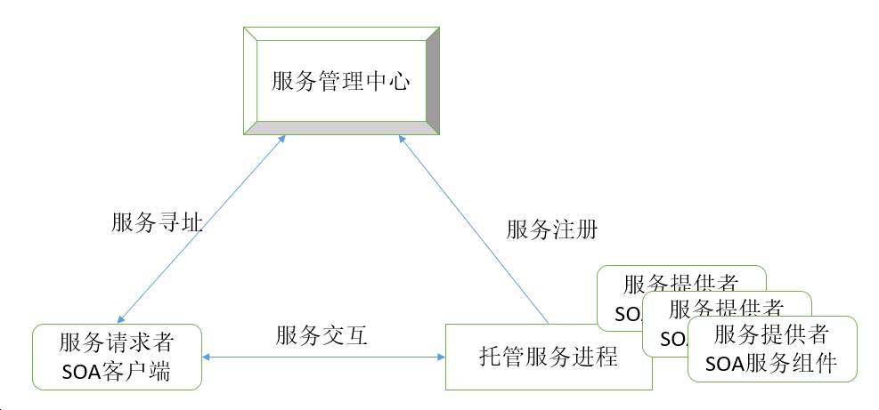


- 服务提供者：创建并提供服务的实体，负责实现具体的业务逻辑，并通过网络对外发布服务接口。例如，物流服务提供商开发的物流跟踪服务，为电商平台等客户提供包裹位置查询等功能。
- 服务请求者：需要使用服务的应用或其他服务，通过查找服务接口并发送请求来获取服务。在电商平台中，用户下单后，订单服务作为请求者调用物流服务的接口，获取订单的物流信息。
- 服务注册中心：类似于电话簿，负责记录服务提供者发布的服务信息（如服务名称、接口地址、服务描述等）。服务请求者可通过注册中心查找所需服务的详细信息。例如，新开发的电商营销活动系统可在注册中心查找库存服务的接口地址，以便在活动策划时实时了解商品库存情况。


SOA体系结构中的每个实体都扮演着服务提供者、请求者和管理中心这三种角色中的某一种（或多种）。SOA体系结构中的操作包括：

* 服务注册。为了使服务可访问．需要服务提供者向服务管理中心注册服务以使服务请求者可以发现和调用它。
* 服务寻址。服务请求者定位服务．方法是查询服务注册中心来找到满足其服务需求的服务资源网络地址。
* 服务交互（远程服务调用）。在完成服务寻址之后，服务请求者根据与目标服务提供者建立的网络通道来调用服务。


### 6.4.4 通信与交互


在面向服务的分布式架构中，服务之间的通信通常通过网络协议进行。这些服务可以独立开发、部署和运维，使得系统的开发迭代更加敏捷，能够快速响应市场变化。


- 基于标准协议：服务之间的通信通常基于标准的网络协议，如HTTP、SOAP（Simple Object Access Protocol，简单对象访问协议）、REST（Representational State Transfer，表述性状态转移）等。HTTP协议因其简单通用、跨平台性强，成为最常用的通信协议之一；SOAP则更注重消息的规范性与安全性，适用于对数据传输要求较高的场景；REST以其简洁的设计风格和高效的性能，在互联网应用中广泛应用。
- 异步与同步交互：服务间交互既支持同步方式，即请求者发送请求后等待服务提供者响应，如同在餐厅点餐等待上菜；也支持异步方式，请求者发送请求后无需等待，可继续执行其他任务，服务提供者处理完成后通过消息队列等方式通知请求者，类似点外卖后可以继续做自己的事，等外卖送达通知。


### 6.4.5 应用场景


面向服务的分布式架构适合以下应用场景。

- 企业应用集成（EAI）：企业内部往往存在多个异构的业务系统，如ERP、CRM、HR系统等。面向服务的分布式架构可将这些系统的功能封装为服务，实现系统间的无缝集成与数据共享，打破信息孤岛。例如，财务系统可调用HR系统的员工薪资数据进行成本核算，同时将财务报表数据提供给管理层决策支持系统。
- 云计算与微服务架构：在云计算环境中，面向服务的分布式架构是实现软件即服务（SaaS）模式的重要基础。微服务架构则是其一种更细粒度的应用，将大型应用拆分为多个小型的、独立的服务，每个服务专注于单一业务功能，通过分布式协作实现复杂业务。例如，Netflix通过微服务架构将视频推荐、播放、用户管理等功能拆分为多个服务，实现了高度灵活和可扩展的视频流媒体平台。
- 物联网（IoT）：在物联网场景下，大量的设备和传感器产生海量数据，需要不同的服务进行数据收集、分析与处理。面向服务的分布式架构可将设备管理、数据存储、数据分析等功能设计为服务，实现物联网系统的高效运行与管理。例如，智能城市系统中，通过不同服务处理来自交通传感器、环境监测设备等的数据，实现交通优化、环境预警等功能。 


### 6.4.6 Web服务的分类

在技术层面上，Web服务可以通过多种方式实现。目前，业界主流分类方法是将Web服务区分为“大”Web服务和RESTful Web服务。

#### 1. “大”Web服务

“大”Web服务使用遵循简单对象访问协议（SOAP）标准的XML消息，SOAP是一种定义消息架构和消息格式的XML语言。此类系统通常包含服务所提供的操作的机器可读描述，用Web服务描述语言（WSDL）编写，WSDL是一种用于按语法定义接口的XML语言。


基于SOAP的设计必须包含以下元素。

* 必须建立正式合同来描述Web服务提供的接口。WSDL可以用来描述契约的细节，它可能包括消息、操作、绑定和Web服务的位置。还可以在`JAX-WS`服务中处理SOAP消息，而无需发布WSDL。
* 架构必须满足复杂的非功能性需求。许多Web服务规范满足了这些需求，并为它们建立了通用词汇表。例如，事务、安全、寻址、信任、协调等等。
* 架构需要处理异步处理和调用。在这种情况下，标准（如Web服务可靠消息）和API（如`JAX-WS`）提供的基础设施及其客户端异步调用支持可以开箱即用。


#### 2. RESTful Web服务

REST非常适合基本的、即席的集成场景。RESTful Web服务通常比基于SOAP的服务更好地与HTTP集成，因此不需要XML消息或WSDL服务API定义。RESTful Web服务也简称为REST服务。

由于RESTful Web服务使用现有的知名W3C和IETF标准（HTTP、XML、URI、MIME），并且具有轻量级基础结构，允许以最少的工具构建服务，因此开发RESTful Web服务成本较低，因此具有很低的采用门坎。


RESTful设计一般满足一下特征。

* Web服务是完全无状态的。一个好的测试是考虑交互是否能在服务器重新启动后存活下来。
缓存基础设施可用于提高性能。如果Web服务返回的数据不是动态生成的并且可以缓存，那么可以利用Web服务器和其他中介固有提供的缓存基础设施来提高性能。但是，开发人员必须小心，因为对于大多数服务器来说，这种缓存仅限于HTTP GET方法。
* 服务生产者和服务消费者对传递的上下文和内容有相互理解。因为没有正式的方法来描述Web服务接口，所以双方必须就描述正在交换的数据的模式和有意义地处理数据的方法达成一致。在现实世界中，将服务作为RESTful实现公开的大多数商业应用程序还以流行的编程语言向开发人员分发描述接口的所谓增值工具包。
* 带宽尤其重要，需要限制。REST对于一些受限设备（例如物联网设备和手机）特别有用，对于这些设备，必须限制XML有效负载上的头和SOAP元素的额外层的开销。


有关RESTful Web服务的内容，还将在后续“REST风格的架构”章节详细讲解。

#### 3. Web服务技术选型

选择使用 “大”Web服务和RESTful Web服务是要针对具体的场景的。

* “大”Web服务：解决企业计算中常见的高级QoS需求。与RESTful Web服务相比，“大”Web服务更容易支持`WS-*`组协议，这些协议提供了安全性和可靠性等标准，并与其他符合`WS-*`的客户机和服务器进行互操作。在老的遗留项目或者是传统的企业级项目中，“大”Web服务还有用武之地。
* RESTful Web服务：使编写Web应用程序更轻松，这些应用程序应用REST风格的部分或全部约束，从而在应用程序中引入所需的属性，例如松耦合（在不破坏现有客户端的情况下，更轻松地演进服务器）、可伸缩性（从小到大）和架构简单性（使用现成组件，例如代理或HTTP路由器）。许多类型的客户端使用RESTful Web服务比较容易，同时允许服务器端进行演进和扩展。客户可以选择使用服务的部分或全部方面，并将其与其他基于Web的服务混搭起来。随着移动APP、云计算、Cloud Native、微服务等架构的兴起，越来越多的应用倾向于使用RESTful Web服务。


## 6.5 面向消息的分布式架构：实现系统吞吐量的关键

在SOA或者是微服务架构中，普遍会采用HTTP协议作为通信协议。HTTP协议具有平台无关性、语言中立性等特点，而在分布式系统中广泛应用。特别是微服务架构的流行，遵循一致的REST风格的HTTP协议，更能在各个微服务之间实现低沟通成本的通信。然而，HTTP有一个缺点，就是它的请求是同步的，即遵循的是“请求—响应”模式，在服务器未返回结果之前，HTTP 客户端会一致等待，直到拿到结果或者是超时未知，这在一定程度上限制程序的处理能力。毕竟等待就是浪费。面向消息的分布式架构（Message Oriented Architecture，MOA）作为一种强大的架构模式，为解决这些问题提供了有效的途径。

### 6.5.1 核心概念


面向消息的分布式架构是一种基于消息传递机制的架构模式，它将分布式系统中的各个组件（如应用程序、服务、模块等）通过消息进行解耦。在这种架构中，组件之间不直接相互调用，而是通过发送和接收消息来进行通信和协作。每个消息都包含了特定的信息和指令，发送方将消息发送到消息队列或消息总线等消息中间件中，接收方从消息中间件中获取消息并进行相应的处理。这种方式就像人们通过邮局传递信件一样，寄信人把信件投入邮箱，收信人在合适的时间从邮箱中取出信件阅读并做出回应，寄信人和收信人不需要直接联系，也不需要知道对方的具体位置和状态。


### 6.5.2 关键特性

面向消息的分布式架构具备以下关键特性。


- 解耦性：发送方和接收方之间没有直接的依赖关系，它们只需要关注消息的格式和内容，而不需要了解对方的实现细节和运行状态。例如，在一个电商系统中，订单生成模块和库存管理模块可以通过消息进行通信，订单生成模块只需要将包含订单信息的消息发送出去，而不需要知道库存管理模块如何更新库存，库存管理模块也只需要从消息中获取必要信息来处理库存，它们之间的耦合度被大大降低。
- 异步性：消息的发送和接收是异步进行的，发送方发送消息后不需要等待接收方处理完成就可以继续执行其他任务。这使得系统能够更好地处理高并发和复杂的业务流程，提高系统的整体性能和响应速度。比如在一个视频处理系统中，用户上传视频后，系统可以将视频处理任务以消息的形式发送给视频处理模块，用户可以继续进行其他操作，而视频处理模块会在后台异步地处理视频，处理完成后再通过消息通知用户。
- 可靠性：消息中间件通常具有可靠的消息存储和传递机制，能够保证消息在发送和接收过程中的不丢失、不重复。即使在网络故障、系统崩溃等异常情况下，消息中间件也可以将消息持久化到磁盘等存储设备上，待系统恢复正常后继续传递消息。例如，在金融交易系统中，交易消息的可靠传递不能出问题，消息中间件可以通过各种技术手段保证每一笔交易消息都能准确无误地被处理。
- 灵活性：易于扩展和修改，当系统需要添加新的功能或组件时，只需要定义相应的消息和处理逻辑，将其接入消息中间件即可，不会对其他组件造成太大影响。例如，在一个社交媒体平台中，要添加一个新的数据分析功能，只需要让相关模块订阅与用户行为等相关的消息，进行数据分析处理，而不会影响到平台的其他功能模块。

### 6.5.3 架构构成

目前，市面上流行的消息中间件，往往具备以下几个基本的架构构成。

- 消息生产者：也称为消息发送者，是产生消息并将其发送到消息中间件的组件。它可以是各种应用程序、服务或模块，根据业务逻辑生成需要传递的消息。例如，在一个日志记录系统中，各个业务模块就是消息生产者，它们将包含日志信息的消息发送到消息中间件，以便日志收集和分析模块进行处理。
- 消息消费者：即消息接收者，从消息中间件中获取消息并进行处理的组件。它根据自身的业务需求，订阅感兴趣的消息类型，并对接收到的消息进行相应的业务逻辑处理。比如在上述日志记录系统中，日志分析模块就是消息消费者，它从消息中间件中获取日志消息，进行分析和存储等操作。
- 消息中间件：作为整个架构的核心，负责存储和转发消息。它提供了消息队列、主题等多种消息模型，支持消息的持久化、路由、过滤等功能。常见的消息中间件有RabbitMQ、Kafka、ActiveMQ等。消息中间件就像一个智能的邮件处理中心，对收到的邮件（消息）进行分类、存储和转发，确保邮件能够准确地到达收件人手中。

上述概念，在不同的产品中可能有不同的表述，但所承担的功能都是类似的。

### 6.5.4 通信与交互

以下是面向消息的分布式架构的通信与交互方面的描述。

- 消息格式：消息通常采用特定的格式进行编码，如JSON、XML等，以便于消息的发送、接收和解析。消息格式定义了消息中包含的字段、数据类型和结构等信息，发送方和接收方需要遵循相同的消息格式约定，才能正确地理解和处理消息。例如，一个包含用户注册信息的消息，可能采用JSON格式，包含用户名、密码、邮箱等字段。
- 消息路由：消息中间件根据消息的属性（如消息类型、目标地址等）将消息路由到合适的消息消费者。可以通过设置消息的路由键、主题等方式来实现消息的准确路由。例如，在一个多租户的系统中，不同租户的消息可以通过设置不同的主题进行区分，消息中间件根据主题将消息路由到对应的租户处理模块。
- 消息订阅与发布：消息消费者通过订阅感兴趣的消息类型或主题来获取消息，消息生产者则将消息发布到相应的主题或队列中。这种订阅-发布模式使得消息的传递更加灵活和高效，多个消费者可以订阅同一个主题，接收并处理相同的消息。比如在一个实时数据监控系统中，多个数据分析模块可以订阅传感器数据主题，同时对传感器发送的消息进行分析处理。

### 6.5.5 应用场景

消息中间件一般是作为HTTP协议的补充，换言之，如果HTTP协议能满足业务需要，则首先应该选择使用HTTP协议作为服务间的通信协议。如果HTTP不能满足，则选用消息中间件产品。消息中间件产品适合以下场景。

- 分布式系统集成：在大型分布式系统中，各个子系统之间通常需要进行复杂的通信和协作。面向消息的分布式架构可以将不同子系统解耦，实现它们之间的异步通信和数据交换。例如，在一个大型企业的ERP系统中，采购、销售、库存、财务等子系统可以通过消息中间件进行通信，协同完成企业的业务流程。
- 异步任务处理：对于一些耗时较长的任务，如文件上传、数据备份、报表生成等，可以采用面向消息的分布式架构将任务以消息的形式发送到后台处理系统，实现异步处理。这样可以提高系统的响应速度，让用户能够继续进行其他操作，而不会被长时间的任务阻塞。
- 事件驱动架构：在事件驱动的系统中，各种事件（如用户操作、系统状态变化等）可以作为消息进行传递和处理。通过面向消息的分布式架构，系统可以根据不同的事件触发相应的业务逻辑，实现灵活的业务流程编排。例如，在一个电商促销活动系统中，用户下单、支付成功等事件可以作为消息触发库存更新、优惠券发放等一系列业务操作。
- 物联网应用：在物联网场景中，大量的传感器设备会产生海量的数据，这些数据需要进行收集、处理和分析。面向消息的分布式架构可以将传感器数据以消息的形式发送到云端或边缘计算节点进行处理，实现设备之间的通信和数据协同。例如，在一个智能家居系统中，各种传感器（如温度传感器、光照传感器等）可以将数据通过消息发送到中央控制单元，实现对家居环境的智能控制。


## 6.6 REST风格的架构：理解表述性状态转移

在“面向服务的分布式架构”一节中，我们介绍了Web服务。其中Web服务又可以分为“大”Web服务及RESTful Web服务。

下面聊聊RESTful Web服务及其架构风格。

### 6.6.1 什么是REST

一说到REST，大家都耳熟能详，很多人的第一反应就是认为这是前端请求后台的一种通信方式。甚至有些人将REST和RPC混为一谈，认为两者都是基于HTTP的类似的东西。实际上，很少人能详细讲述REST所提出的各个约束、风格特点以及如何开始搭建REST服务。

REST（REpresentation State Transfer，表述性状态转移）描述了一个架构样式的网络系统，比如Web应用程序。它首次出现在2000年Roy Fielding的博士论文*Architectural Styles and the Design of Network-based Software Architectures中*。Roy Fielding还是HTTP规范的主要编写者之一，也是Apache HTTP服务器项目的共同创立者。所以这篇文章一发表，就引起了极大的反响。很多公司或者组织如雨后春笋般宣称自己的应用或者服务实现了REST API。但该论文实际上只是描述了一种架构风格，并未对具体的实现作出规范。所以社会上，各大厂商不免存在浑水摸鱼或者“挂羊头卖狗肉”地误用或者滥用REST。所以在这种背景下，Roy Fielding不得不再次发文做了澄清，坦言了他的失望，并对SocialSite REST API提出了批评。同时他还指出，除非应用状态引擎是超文本驱动的，否则它就不是REST或REST API。据此，他给出了REST API应该具备的条件：

* REST API不应该依赖于任何通信协议，尽管要成功映射到某个协议可能会依赖于元数据的可用性、所选的方法等。
* REST API不应该包含对通信协议的任何改动，除非是补充或确定标准协议中未规定的部分。
* REST API应该将大部分的描述工作放在定义用于表示资源和驱动应用状态的媒体类型上，或定义现有标准媒体类型的扩展关系名和（或）支持超文本的标记。
* REST API绝不应该定义一个固定的资源名或层次结构（客户端和服务器之间的明显耦合）。
* REST API永远也不应该有那些会影响客户端的“类型化”资源。
* REST API不应该要求有先验知识（prior knowledge），除了初始URI和适合目标用户的一组标准化的媒体类型（即，它能被任何潜在使用该API的客户端理解）。


REST并非标准，而是一种开发Web应用的架构风格，可以将其理解为一种设计模式。REST基于HTTP、URI以及XML这些现有的广泛流行的协议和标准，伴随着REST的应用，HTTP协议得到了更加正确的使用。


### 6.6.2 REST设计原则

REST指的是一组架构约束条件和原则。满足这些约束条件和原则的应用程序或设计就是REST。

相较于基于SOAP和WSDL的Web服务，REST模式提供了更为简洁的实现方案。RESTful Web服务是松耦合的，这特别适用于为客户创建在互联网传播的轻量级的Web服务 API。REST应用是围绕“资源表述的转移（the transfer of representations of resources）”为中心来做请求和响应的。数据和功能均被视为资源，并使用统一的资源标识符（URI）来访问资源。网页里面的链接就是典型的URI。该资源由文档表述，并通过使用一组简单的、定义明确的操作来执行。

例如，一个REST资源可能是一个城市当前的天气情况。该资源的表述可能是一个XML文档、图像文件或HTML页面。客户端可以检索特定表述，通过更新其数据来修改资源，或者完全删除该资源。

目前，越来越多的Web服务开始采用REST风格设计和实现，真实世界中比较著名的REST服务包括：Google AJAX搜索API、Amazon Simple Storage Service（Amazon S3）等。

基于REST的Web服务遵循一些基本的设计原则，使得REST应用更加简单、轻量，开发速度也更快。这些原则包括：

* 通过URI来标识资源。系统中的每一个对象或资源都可以通过一个唯一的URI来进行寻址，URI的结构应该简单、可预测且易于理解，比如定义目录结构式的URI。
* 统一接口。以遵循RFC-2616所定义的协议的方式显式地使用HTTP方法，建立创建、检索、更新和删除（CRUD：Create、Retrieve、Update 及 Delete）操作与HTTP方法之间的一对一映射。
  * 若要在服务器上创建资源，应该使用POST方法；
  * 若要检索某个资源，应该使用GET方法；
  * 若要更新或者添加资源，应该使用PUT方法；
  * 若要删除某个资源，应该使用DELETE方法。
* 资源多重表述。URI所访问的每个资源都可以使用不同的形式加以表示（比如XML或者JSON），具体的表现形式取决于访问资源的客户端，客户端与服务提供者使用一种内容协商的机制（请求头与MIME类型）来选择合适的数据格式，最小化彼此之间的数据耦合。在REST的世界中，资源即状态，而互联网就是一个巨大的状态机，每个网页是其一个状态；URI是状态的表述；REST风格的应用则是从一个状态迁移到下一个状态的状态转移过程。早期的互联网只有静态页面的时候，通过超链接在静态网页之间间浏览跳转的模式就是一种典型的状态转移过程。也就是说，早期的互联网就是天然的REST。
* 无状态。对服务器端的请求应该是无状态的，完整、独立的请求不要求服务器在处理请求时检索任何类型的应用程序上下文或状态。无状态约束使服务器的变化对客户端是不可见的，因为在两次连续的请求中，客户端并不依赖于同一台服务器。一个客户端从某台服务器上收到一份包含链接的文档，当它要做一些处理时，这台服务器宕掉了，可能是硬盘坏掉而被拿去修理，也可能是软件需要升级重启——如果这个客户端访问了从这台服务器接收的链接，它不会察觉到后台的服务器已经改变了。通过超链接实现有状态交互，即请求消息是自包含的（每次交互都包含完整的信息），有多种技术实现了不同请求间状态信息的传输，例如URI、cookies和隐藏表单字段等，状态可以嵌入到应答消息里，这样一来状态在接下来的交互中仍然有效。REST风格应用可以实现交互，但它却天然地具有服务器无状态的特征。在状态迁移的过程中，服务器不需要记录任何Session，所有的状态都通过URI的形式记录在了客户端。更准确地说，这里的无状态服务器，是指服务器不保存会话状态（Session）；而资源本身则是天然的状态，通常是需要被保存的；这里的无状态服务器均指无会话状态服务器。


### 6.6.3 成熟度模型

正如前文所述，正确、完整的使用REST是困难的，关键在于Roy Fielding所定义的REST只是一种架构风格，它并不是规范，所以也就缺乏可以直接参考的依据。好在Leonard Richardson补充了这方面的不足。他提出的关于REST的成熟度模型（Richardson Maturity Model），将REST的实现划分为不同的等级。图6-3展示了不同等级的成熟度模型。


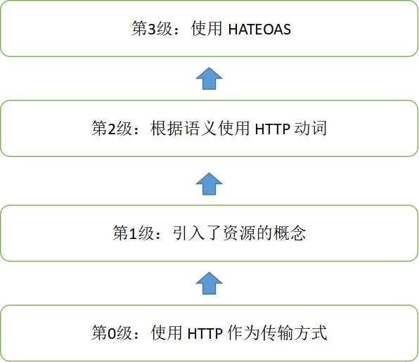

* 第0级：使用HTTP作为传输方式。
* 第1级：引入了资源的概念。每个资源有对应的标识符和表达。所以，不是将所有的请求发送到单个服务端点（Service Endpoint），而是和单独的资源进行交互。
* 第2级：根据语义使用HTTP动词。Web服务使用不同的HTTP方法来进行不同的操作，并且使用HTTP状态码来表示不同的结果。例如， GET方法用来获取资源， DELETE方法用来删除资源。
* 第3级：使用HATEOAS。HATEOAS是Hypertext As The Engine Of Application State的缩写，是指在资源的表达中包含了链接信息，客户端可以根据链接来发现可以执行的动作。


## 6.7 微服务架构：掌握从分布式单体到真正业务自治的破局之路

自2014年业界提出“微服务（Microservices）”的概念以来，微服务架构就不断演进，并且日趋火爆。越来越多的企业拥抱微服务，期望通过微服务的架构来解决大型项目的管理与运维。

那么什么是微服务？微服务架构与传统的SOA架构有什么区别？何时应该采用微服务架构？如何构建微服务？本节就针对上述提到的问题，来简单介绍下微服务架构。


### 6.7.1 什么是微服务架构


微服务架构（Microservices Architecture，MSA）的出现并非偶然，而是与这个时代的软件思想、技术工具的发展有着密切的联系。比如，将业务功能服务化，是SOA的延续；RESTful 等架构的兴起，让我们可以考虑更多轻量化的通信机制；领域驱动设计指导我们如何分析并模型化复杂的业务；敏捷方法论帮助我们拥抱变化，快速反馈；持续集成和持续交付（CI/CD）促使我们构建更快、更可靠、更频繁的软件部署和交付能力；虚拟化和容器技术的发展，使我们简化了部署环境的创建、安装；DevOps文化的流行以及全栈自治团队的出现，使得小团队更加全功能化。这些都是推动微服务架构诞生和发展的重要因素。

实际上，业界对于微服务本身并没有一个严格的定义。James Lewis和Martin Fowler对微服务架构做了如下定义：

*简言之，微服务架构风格就像是把小的服务开发成单一应用的形式，运行在其自己的进程中，并采用轻量级的机制进行通信（一般是HTTP资源API）。这些服务都是围绕业务能力来构建的，通过全自动部署工具来实现独立部署。这些服务可以使用不同的编程语言和不同的数据存储技术，并保持最小化集中管理。*

MSA包含如下特征：

* 组件以服务形式来提供—正如其名，微服务也是面向服务的。
* 围绕业务功能进行组织—微服务更倾向于围绕业务功能对服务结构进行划分、拆解。这样的服务，是针对业务领域有着关完整实现的软件，它包含使用接口、持久存储以及对应的交互。因此团队应该是跨职能的，包含完整的开发技术—用户体验、数据库以及项目管理。
* 产品不是项目—传统的开发模式致力于提供一些被认为是完整的软件。一旦开发完成，软件将移交给维护或者实施部门，然后开发组就可以解散了。而微服务要求开发团队对软件产品的整个生命周期负责。这要求开发者每天都关注软件产品的运行情况，并与用户联系的更紧密，同时承担一些售后支持。越小的服务粒度越容易促进用户与服务提供商之前的关系。Amazon的理念就是“You build it, you run it”，这也正是DevOps的文化理念。
* 强化终端及弱化通道—微服务的应用致力于松耦合和高内聚，它们更喜欢简单的REST风格，而不是复杂的协议（如WS或者BPEL或者集中式框架）。或者采用轻量级消息总线（如RabbitMQ或ZeroMQ等）来发布消息。
* 分散治理—这是跟传统的集中式管理有很大区别的地方。微服务把整体式框架中的组件拆分成不同的服务，在构建它们时将会有更多的选择。
* 分散数据管理—当整体式的应用使用单一逻辑数据库对数据持久化时，企业通常选择在应用的范围内使用一个数据库。微服务让每个服务管理自己的数据库：无论是相同数据库的不同实例，或者是不同的数据库系统。
* 基础设施自动化—云计算，特别是AWS的发展，减少了构建、发布、运维微服务的复杂性。微服务的团队更加依赖于基础设施的自动化，毕竟发布工作相当无趣。近些年开始火爆的容器技术，诸如Docker也是一个不错的选择（有关容器技术以及Docker的内容在后面章节会涉及）。
* 容错性设计—任务服务都可能因为供应商的不可靠而出现故障。微服务应为每个应用的服务及数据中心提供日常的故障检测和恢复。
* 改进设计—由于设计会不断更改，微服务所提供的服务应该能够替换或者报废，而不是要长久地发展。


### 6.7.2 微服务架构与SOA架构的区别

微服务架构（MSA）与面向服务架构（SOA）有相似之处，比如，都是面向服务，通信大多基于HTTP协议。通常传统的SOA意味着大而全的单体架构（Monolithic Architecture）的解决方案。单体架构有时也被称为“单块架构”，这种架构风格会让设计、开发、测试、发布都增加了难度，其中任何细小的代码变更，都将导致整个系统需要重新测试、部署。而微服务架构恰恰把所有服务都打散，设置合理的颗粒度，各个服务间保持低耦合，每个服务都在其完整的生命周期中存活，将互相之间的影响降到最低。SOA需要对整个系统进行规范，而MSA的每个服务都可以有自己的开发语言、开发方式、灵活性大大提高。


#### 1. 单体架构的例子

我们假设在构建一个电子商务应用，应用从客户处接收订单，验证库存和可用额度，并派送订单。应用包含多个组件，包括UI组件（用来实现用户接口），以及一些后台服务（用于检测信用额度、维护库存和派送订单）。

应用作为一体应用部署。例如，一个Java Web应用运行在Tomcat之类Web容器上，仅包含单个WAR文件；一个Rails应用使用Phusion Passenger部署在Apache/Nginx上，或者使用JRuby部署在Tomcat上，它们都仅包含单个目录结构。为了伸缩和提高可用性，我们可以在一个负载均衡器下面运行该应用的多份实例。

单体架构的开发、测试、部署和扩展如图6-4所示。

这个方案有一些好处：

* 易于开发—当前开发工具和IDE的目标就是支持这种一体应用的开发；
* 易于部署—只需要将WAR文件或目录结构放到合适的运行环境下即可；
* 易于伸缩—只需要在负载均衡器下面运行应用的多份副本就可以伸缩。


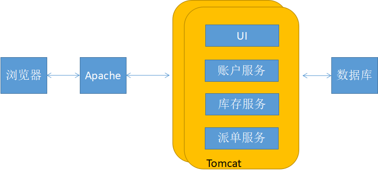


但是，一旦应用变大、团队增长，这种方法的缺点就愈加明显：

* 代码库庞大—巨大的一体代码库可能会吓到开发者，尤其是团队的新人。应用难于理解和修改。因此，开发速度通常会减缓。另外，由于没有模块硬边界，模块化也随着时间的增加而破坏。还有，因为难于理解如何实现变更，代码质量也随着时间的增加而逐渐下降。这是个恶性循环！
* IDE超载—代码库越大，IDE越慢，开发效率越低。
* Web容器超载—应用越大，容器启动时间越长。因此开发者大量的时间被浪费在等待容器启动上。这也会影响到部署。
* 难于持续部署—对于频繁部署，巨大的单体架构应用也是个问题。为了更新一个组件，你必须重新部署整个应用。这还会中断后台任务（如Java应用的Quartz作业），不管变更是否影响到这些任务，这都有可能引发问题。未被更新的组件也可能因此不能正常启动。因此，鉴于重新部署的相关风险会增加，不鼓励频繁更新。尤其对用户界面的开发者来说，因为他们通常需要快速迭代，频繁重新部署。
* 难于伸缩应用—单体架构只能在一个维度伸缩。一方面，它可以通过运行多个副本来伸缩以满足业务量的增加。某些云服务甚至可以动态地根据负载调整应用实例的数量。但是另一方面，该架构不能通过伸缩来满足数据量的增加。每个应用实例都要访问全部数据，这使得缓存低效，并且提升了内存占用和I/O流量。而且，不同的组件所需的资源不同，有些可能是CPU密集型的，另一些可能是内存密集型的。单体架构下，我们不能独立地伸缩各个组件。
* 难于调整开发规模—单体应用对调整开发规模也是个障碍。一旦应用达到一定规模，将工程组织分成专注于特定功能模块的团队通常更有效。比如，我们可能需要UI团队，会计团队，库存团队等。单体架构应用的问题是它阻碍组织团队相互独立地工作。团队之间必须在开发进度和重新部署上进行协调。对团队来说也很难改变和更新产品。
* 需要对一个技术栈长期投入—单体架构迫使你采用开发初期选择的技术栈（某些情况下，是那项技术的某个版本）。单体架构下，很难递增式地采用更新的技术。比如，你选了JVM。除了Java你还可以选择其他使用JVM的语言，比如Groovy和Scala也可以与Java很好地进行互操作。但是单体架构下，非JVM语言写的组件就不行。而且，如果应用使用了后期过时的平台框架，将应用迁移到更新更好的框架上就很有挑战性。还有可能为了采用新的平台框架，需要重写整个应用，这样就太冒险了。

微服务架构正是解决单体架构缺点的替代模式。

#### 2. 微服务架构的例子

一个微服务架构的应用或是多层架构的或是六角架构的，并且包含多种类型的组件：

* 表示组件（Presentation components）—响应处理HTTP请求，并返回HTML或JSON/XML（对于Web Service API而言）。
* 业务逻辑（Business logic）—应用的业务逻辑。
* 数据库访问逻辑（Database access logic）—数据访问对象用于访问数据库。
* 应用集成逻辑（Application integration logic）—消息层，如基于Spring的集成。

这些逻辑组件分别响应应用中不同的功能模块。

最终微服务架构的解决方案如下：

* 通过采用伸缩立方（Scale Cube），特别是y轴方向上的伸缩来架构应用，将应用按功能分解为一组相互协作的服务的集合。每个服务实现一组有限并相关的功能。比如，一个应用可能包含订单管理服务、客户管理服务等。
* 服务间通过HTTP/REST等同步协议或AMQP等异步协议进行通信。
* 服务独立开发和部署。
* 每个服务为了与其他服务解耦，都有自己的数据库。必要时，数据库间的一致性通过数据库复制机制或应用级事件来维护。

微服务架构的服务部署如图6-5所示。


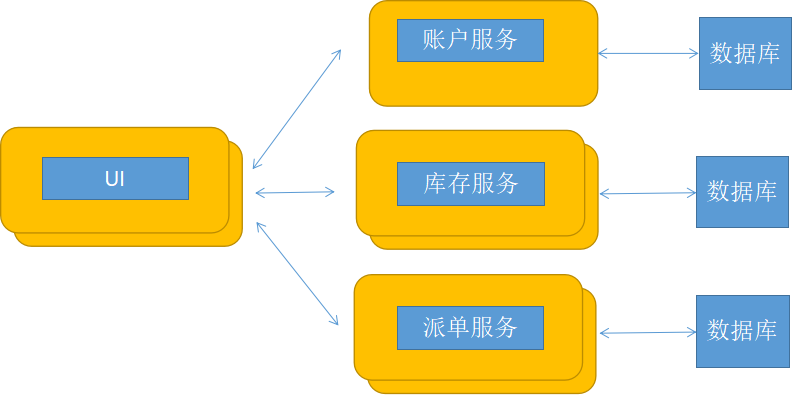


这个方案有一些好处：

* 每个微服务都相对较小。
  * 易于开发者理解；
  * IDE反应更快，开发更高效；
  * Web容器启动更快，开发更高效，并提升了部署速度。
* 每个服务都可以独立部署，易于频繁部署新版本的服务。
* 易于伸缩开发组织结构。我们可以对多个团队的开发工作进行组织。每个团队负责单个服务。每个团队可以独立于其他团队开发、部署和伸缩服务。
* 提升故障隔离（fault isolation）。比如，如果一个服务存在内存泄露，那么只有该服务受影响，其他服务仍然可以处理请求。相比之下，单体架构的一个出错组件可以拖垮整个系统。
* 每个服务可以单独开发和部署。
* 消除了任何对技术栈（technology stack）的长期投入（long-term commitments）。

这个方案也有一些缺点：

* 开发者要处理分布式系统的额外复杂度；
* 开发者IDE大多是面向构建单体架构应用的，并没有显示提供对开发分布式应用的支持；
* 测试更加困难；
* 开发者需要实现服务间通信机制；
* 不使用分布式事务实现跨服务的用例更加困难；
* 实现跨服务的用例需要团队间的细致协作；
* 生产环境的部署复杂度高，对于包含多种不同服务类型的系统，部署和管理的操作复杂度仍然存在；
* 内存消耗增加。微服务架构使用N×M个服务实例来替代N个单体架构应用实例。如果每个服务运行在自己独立的JVM上，通常有必要对实例进行隔离，对这么多运行的JVM，就有M倍的开销。另外，如果每个服务运行在独立的虚拟机上，那么开销会更高。


### 6.7.3 何时采用微服务架构


微服务使开发变得更简单、更快捷了。以前开发人员耗费时间来搭建环境、熟悉代码结构，在微服务的世界里会简单许多。但是，微服务带来了一系列的非功能性需求，比如说事务、服务治理（注册，发现，负载，路由，认证授权，隔离）、监控（日志，性能监控，告警，调用链路）、部署、测试等。微服务依赖于“基础设施自动化”。

微服务不是“银弹”，何时采用微服务还需考虑企业自身的需求。

在开发应用的初期，我们通常不会遇到采用微服务这种方法来试图解决问题的情况。而且，使用这个精细、分布式的架构将会拖慢开发进度。对于初创公司，这是个严重问题，因为它们的最大挑战通常是如何快速发展业务模型及相关应用。

另一个挑战是如何将系统分隔为微服务。这是个技术活，但有些策略可能有帮助。一种方法是通过动词或用例来分隔。比如，之后您将看到分隔后的电子商务应用有个负责派送已完成订单的派单服务。另一个通过动词分隔的例子是实现登录用例的登录服务。

另一种分隔方法是通过名称或资源来分隔系统。这种服务负责对应给定类型的实体/资源的所有操作。比如，之后会发现为何电子商务系统有个库存服务来跟踪产品是否在库存中。

如果你熟悉DDD（领域驱动设计），那么采用DDD来设计微服务，不但可以减少微服务环境中通用语言的复杂，而且可以帮助团队搞清楚领域的边界，理清上下文边界。建议将每个微服务都设计成一个DDD限界上下文（Bounded Context）。这为系统内的微服务提供了一个逻辑边界。

理论上，每个服务应该只承担很小的职责。Bob Martin讲过使用单一职责原则（SRP）来设计类。SRP定义类的职责作为变化的原因，而且类应该只有一个变化的原因。使用SRP来设计服务也是合理的。

另一个有助于服务设计的类比是UNIX实用工具的设计方法。UNIX提供了大量的实用工具如grep、cat和find。每个工具只做一件事，通常做得非常好，并且可以跟其他工具使用shell脚本组合来执行复杂任务。

更多有关微服务架构设计的内容，可参阅《Spring Cloud 微服务架构开发实战》。


## 6.8 Serverless架构：让运维成本的革命性实践

在目前主流云计算IaaS（Infrastructure-as-a-Service，基础设施即服务）和PaaS（Platform-as-a-Service，平台即服务）中，开发者进行业务开发时，仍然需要关心很多和服务器相关的服务端开发工作，比如缓存、消息服务、Web应用服务器、数据库，以及对服务器进行性能优化，考虑存储和计算资源，考虑负载和扩展，考虑服务器容灾稳定性等非业务逻辑的开发。这些服务器的运维和开发，知识和经验极大地限制了开发者进行业务开发的效率。设想一下，如果开发者直接租用服务或者开发服务而无须关注如何在服务器中运行部署服务，是否可以极大地提升开发效率和产品质量？这种去服务器而直接使用服务的架构，我们称之为Serverless架构（无服务器架构）。

### 6.8.1 什么是Serverless架构

如今，随着移动和物联网应用蓬勃发展，伴随着面向服务架构（SOA）以及微服务架构（MSA）的盛行，造就了Serverless架构平台的迅猛发展。在Serverless架构中，开发者无须考虑服务器的问题，计算资源作为服务而不是服务器的概念出现，这样开发者只需要关注面向客户的客户端业务程序开发，后台服务由第三方服务公司完全或者部分提供，开发者调用相关的服务即可。Serverless是一种构建和管理基于微服务架构的完整流程，允许我们在服务部署级别而不是服务器部署级别来管理应用部署，甚至可以管理某个具体功能或端口的部署，这就能让开发者快速迭代，更快速地交付软件。

这种新兴的云计算服务交付模式为开发人员和管理员带来了许多益处。它提供了合适的灵活性和控制性级别，因而在IaaS和PaaS之间找到了一条中间道路。由于服务器端几乎没有什么要管理的，Serverless架构正在彻底改变软件开发和部署领域，比如，推动了NoOps模式的发展。


Serverless架构是新兴的架构体系，业界也没有一个明确的关于Serverless架构的定义。Mike Roberts认为的Serverless架构主要有下面两种形式：

* 首先，Serverless架构用于描述依赖第三方服务（“云端”）实现对逻辑和状态进行管理的应用。这些应用包括典型的富客户端应用，比如单页Web应用或移动应用，它们使用基于云的数据库（比如Parse或Firebase），还有授权服务（比如Auth0、AWS Cognito等），这类服务以前曾经被描述为BaaS（（Mobile）Backend as a Service，（移动）后端即服务）。
* 其次，Serverless架构也可以指这样的一类应用，一部分服务逻辑由应用实现，但是跟传统架构不同在于，它们运行在无状态的容器中，可以由事件触发，短暂、完全地被第三方管理。一种观点认为这是FaaS（Functions as service，函数服务），而AWS Lambda就是一种流行的FaaS实现，当然还有其他。

云计算的发展从IaaS、PaaS、SaaS，到最新的BaaS，在这个趋势中Serverless（去服务器化）的趋势越来越明显。IaaS将真实的物理机变成了虚拟机，PaaS进一步将虚拟机变成了包含基础设施的中间件服务。BaaS和SaaS将中间件服务扩展到更基础的后端能力。这些是云计算解决效率和成本的重要体现。Serverless这种无服务器架构，用服务代替服务器，无须了解落实服务，进一步提高了云计算的成本和效率，从而为BaaS这种新时代云计算提供了架构基础。

BaaS要被开发者广泛接受，需要在云端解决以下的限制：

* BaaS服务的治理；
* BaaS服务需要提供逻辑定制扩展；
* BaaS服务能独立部署，快速启动；
* BaaS服务可以弹性扩展，满足大并发需要；
* BaaS服务可以被监控、计费；
* BaaS服务要解决DevOps相关的问题。

要实现Serverless架构，需要利用以下技术和方案：

* 实现BaaS中的云代码特性，开发者可以直接开发在云端的业务代码，实现FaaS；
* 实现API网关，用API代表服务的入口，并对所有服务进行治理；
* 微服务架构技术，用微服务的概念来实施服务的开发；
* 利用Docker等容器技术部署运行微服务


### 6.8.2 Serverless典型的应用场景

Serverless典型的应用场景主要有UI驱动的应用和消息驱动的应用两大类。

#### 1. UI驱动的应用


先讨论一个带有服务功能逻辑的传统面向客户端的三层应用—一个典型的电子商务应用Pet Store（在线宠物商店）。一般架构如图6-6所示，假设服务端用Java开发完成，客户端用HTML/Javascript。

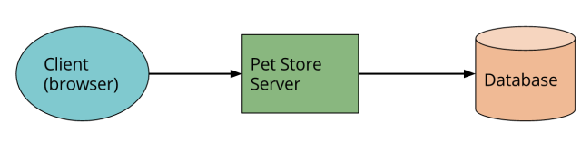


这种架构中，服务端不得不实现诸多系统逻辑，例如认证、页面导航、搜索、交易等都需要在服务端完成，而客户端则显得相对比较简单。如果采用Serverless架构来对该应用进行改造，则架构如图6-7所示。

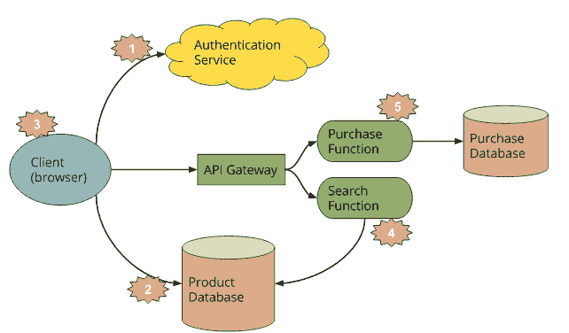


Serverless架构相比于传统面向客户端的三层应用架构，有以下几方面的差异：

* （1）删除了认证逻辑，用第三方BaaS服务来替代。
* （2）使用另外一个BaaS，允许客户端直接访问架构与第三方（例如AWS Dynamo）上的数据子库。通过这种方式提供给客户更安全的访问数据库模式。
* （3）前两点中包含着很重要的第三点，也就是以前运行在Pet Store服务端的逻辑现在都转移到客户端中，例如跟踪用户访问，理解应用的UX架构（例如页面导航），读取数据库并转化为可视视图等。客户端则慢慢转化为单页面应用。
* （4）某些我们想保留在服务端的UX相关功能，例如，计算敏感或者需要访问大量数据，比如搜索这类应用。对于搜索这类需求，我们不需要运行一个专用服务，而是通过FaaS模块，通过API Gateway对HTTP访问提供响应。这样可以使得客户端和服务端都从同一个数据库中读取相关数据。由于原始服务使用Java开发，AWS Lambda（FaaS提供者）支持Java功能，因此可以直接从Pet Store服务端将代码移植到Pet Store搜索功能，而不用重写代码。
* （5）最后，可以将“Purchase”功能用另外一个FaaS功能取代，因为安全原因放在服务端还不如在客户端重新实现，当然前端还是API Gateway。

#### 2. 消息驱动的应用

消息驱动的应用是一个纯后台数据处理服务，如图6-8所示。例如正在编写一个面向用户的应用，需要对UI请求快速响应，但是同时还想获取所有发生的行为。我们设想一个Ad Server（在线广告系统），当用户点击一个广告时，希望快速导向目标，但是同时需要搜集点击量以便向广告商收取费用。

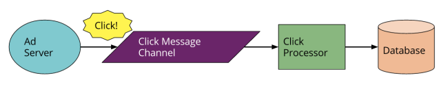


在传统的架构中，Ad Server同步地响应客户，但是同时还会向异步处理“点击量”的应用发送一个消息更新到便于以后向广告商收费的数据库。
而采用Serverless架构的情况下，将会改为如图6-9所示的方式。

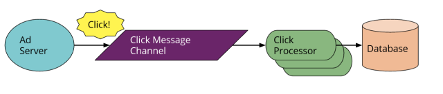


这个架构跟第一个例子有些许不同，这里我们用FaaS功能取代了一个一直运行的应用。此FaaS运行于第三方提供商提供的消息驱动上下文之间。注意，供应商提供了消息代理和FaaS，两者将更加紧密地合作在一起。

FaaS环境通过复制出若干实例来并行处理这些点击，这无疑带来了全新开发体验和执行效率。


### 6.8.3 Serverless架构原则

Peter Sbarski和Sam Kroonenburg合著的*Serverless Architectures on AWS*一书中总结了Serverless架构的以下五种原则，运用这些原则可以帮助我们在构建Serverless架构应用时做出正确的决定：

* 根据需要，使用计算服务来执行代码（没有服务器）。
* 编写单一用途的无状态函数。
* 设计基于推送的、事件驱动的管道。
* 创建更粗实、更强大的前端。
* 拥抱第三方服务。


## 6.9 Cloud Native架构：利用容器化与服务网格，构建面向未来的弹性云架构

未来越来越多的企业将会“拥抱云”。特别是对于中小企业及个人开发者而言，以云架构为优先的Cloud Native应用开发模式将会深入人心。Cloud Native能帮助企业快速推出产品，同时节省成本。


### 6.9.1 为什么需要使用Cloud Native  


最早提出Cloud Native概念的是Pivotal公司的Matt Stine。在他的*Migrating to Cloud-Native Application Architectures*书中，详细解释了Cloud Native产生的背景。Cloud Native这个概念是多种不同思想的一个集合，这些思想与许多公司正在转移到云平台的趋势是一致的。这些思想包括DevOps、持续交付、微服务、敏捷基础设施、康威定律，以及根据商业能力对公司进行重组。Cloud Native既包含技术（比如微服务、敏捷基础设施等），也包含管理（比如 DevOps，持续交付，康威定律，重组等）。Cloud Native也可以说是一系列Cloud技术、企业管理方法的集合。总的来说：

* 云计算的第一个浪潮是关于成本节约和业务敏捷性，尤其是云计算的基础设施更加廉价。随着云计算的不断发展，企业开始采用基础架构即服务（IaaS）和平台即服务（PaaS）服务，并利用它们构建利用云的弹性和可伸缩性的应用程序，同时也能够满足云环境下的容错性。
* 很多企业倾向于使用微服务架构来开发应用。微服务开发快速，职责单一，能够更快速的被客户所采纳。同时，这些应用能够通过快速迭代的方式，得到进化，赢得客户的认可。Cloud Native可以打通微服务开发、测试、部署、发布的整个流程环节。
* 云供应商为迎合市场，提供了满足各种场景方案的 API，例如用于定位的 Google Maps，用于社交协作的认证平台等。将所有这些 API 与企业业务的特性和功能混合在一起，可以让他们为客户构建独特的方案。所有这些整合都在 API 层面进行。这意味着，不管是移动应用还是传统的桌面应用都能无缝集成。所以，采用Cloud Native所开发的应用都且具备极强的可扩展性。
* 软件不可能不出故障。传统的企业级开发方式，需要有专职人员来对企业应用进行监控与维护。而在Cloud Native架构下，底层的服务或者是 API 都由将部署到云中，等价于将繁重的运维工作转移给了云平台供应商。这意味着客户应用将得到更加专业的看护，同时，也节省了运维成本。


### 6.9.2 Cloud Native与微服务架构的关系


Cloud Native与微服务存在某种意义上的联系，可以说微服务的盛行加快了Cloud Native的实践，而Cloud Native的实践反过来，又提供了利于微服务架构实施的基础设施。


微服务的部署具有以下特点。

* 首先每个微服务实例都是整个分布式系统的组成部分，这个部分是不可分割的最小的自治单元。为了便于部署和运维微服务，推荐采用每台主机部署一个单独的微服务实例的方式，而这种方式往往需要占用较多的主机数量。
* 为了系统的可扩展性考虑，微服务实例可以被设计为可以扩展或者减少，以适应业务的变化。

Cloud Native环境以云为先，可以是自己搭建私有云，也可以是租用运营商提供的公有云服务，但不管怎么样，按需使用云服务，都可以最大化节省部署微服务所带来的成本。所以，从这个意义上讲，Cloud Native促进了微服务架构的流行。


### 6.9.3 Cloud Native与Serverless架构的关系

Serverless架构依赖第三方服务（“云端”）来实现对逻辑和状态进行管理的应用。因此，Cloud Native环境以云为先，因此天然的成为了为Serverless架构提供服务支持的土壤。


### 6.9.4 Cloud Native优点

总结以下，Cloud Native具有以下优点。

#### 1. 降低成本

实施Cloud Native可以帮助企业降低成本，无论是使用云基础架构设施，还是使用PaaS或者是SaaS，企业都能够按需使用云服务，按需缴费。无论是个人应用，还是超大规模的集群部署，都可以帮助他们可以减少运营成本，从而增加利润。

另外一个成本是来自运维。实施了Cloud Native的企业，可以将运维成本转嫁给云供应商，从而避免了企业自己招聘专业人员来维护，有效降低了人力成本。

#### 2. 提升速度

无论是个人开发者，还是公司，Cloud Native可以把一个新产品或者服务更快速的推向于市场。一个初创公司或者一个企业他们想要更快速的发展，他们用Cloud Native架构是为了更快速的创新。那么Cloud Native是如何做到提升速度的？

云服务供应商往往提供比较成熟而且全面的云服务解决方案，可以帮助企业快速接入他们的服务。这些服务攘括了从基础架构到中间件，再到云存储、云缓存、云计算等各个方面，企业可以开箱即用的采用这些服务，省去了自研这些服务所花费的时间。

同时，由于云服务都是按需使用、按需购买的，企业可以用比较少的成本去“试错”。这样，企业更加愿意去尝试一些新的技术方案，从而缩短了项目前期的技术调研和准备，加快了推出产品的速度。

Cloud Native推崇持续集成、持续交付的理念，这会帮助企业构建自动发布的流水线，从而加快了从编码到测试再到发布的进程。

#### 3. 可扩展

具备自动扩展的云服务，可以帮助企业应用实现自动扩展。

在流量高峰，运维机制监测到预警阀值，会自动扩展出服务实例。类似的，在流量的低谷，运维机制也能监测到预警阀值，会自动减少服务实例。这样，企业无需担心市场扩展的速度。

举例来说，在“双11”期间，各大电商都会迎来流量的高峰，那么这个时候可以多预备服务实例，以应对并发访问的压力。当淡季来临，将多余的服务实例关闭掉，从而减少运营的成本。而这一切对于客户来说都是无感知的。

#### 4. 减少风险


以前，传统的运维需要有专门的人24小时轮流值守，如果生产环境一旦出现问题，马上需要人去处理。因为，风险不可控，不知道什么时候来临。

而今，使用Cloud Native省去了很多人工运维的工作。自动化运维系统承担了几乎所有的监测的工作，并且能够胜任处理大部分异常问题。比如，上面提到的突如其来的流量高峰，系统能够自动监测到这类异常，并通过自动扩展服务实例的方式来应对这些问题。

当然，系统并不能代替人的所有工作。但在系统遇到无法处理问题的时候，系统也可以通过邮件、短信等方式来通知运维人员，从而使运维人员可以异步处理这些问题，而不用时刻守候在监控器前面。

### 6.9.5 Cloud Native不是银弹

任何技术都不是银弹，Cloud Native同样如此。虽然理论上，所有的技术都可以上云，但也要区分场景。

比如，我想要做一个手机版本的记事本软件或者是单机版本的计算器。这类应用的特征都是纯粹的客户端程序，无需服务器，没有后台，自然也就无没有必要采用Cloud Native。

当然，可以换一个场景，比如，我希望这个记事本软件，无论是在手机端还是在PC端，都能做到数据的同步，那么这个时候就需要有一个服务端程序来做数据同步以及数据的存储，此时，采用Cloud Native架构就是一个非常不错的选择。Cloud Native可以降低部署服务端程序的成本。


### 6.9.6 面临的挑战

使用Cloud Native架构对于企业来说是一场革命。这场革命所带来的影响，并不全是技术上的，同时也包括了管理上的。

从技术上来说，Cloud Native所影响的技术有微服务、敏捷基础设施、容器技术、持续集成工具等等多方面的话题。比如：

* 使用IaaS：运行的服务器可以灵活的按需分配。
* 使用或演变为微服务架构设计系统：每个组件都很小并且互相解耦。
* 自动化和编码：取代用人工去执行脚本和代码。
* 容器化：把应用进行封装处理，使他们测试和部署时更加容易。
* 编排：使用现成的管理和编排工具抽象化生产环境中的服务器个体。

从管理上来说，Cloud Native需要团队拥有敏捷开发、DevOps、持续交付、康威定律等方面的思想。

* 敏捷开发：面向问题的解放方式。
* DevOps：打造全职能的项目团队。
* 持续交付：构建了从编码、测试、部署、发布的自动化交付流水线。
* 康威定律：组织沟通方式决定系统设计。

不管怎么样，越早面对这些挑战，越早将企业架构转变为Cloud Native，越能在当今的软件市场占有一席之地。


更多有关Cloud Native架构设计的内容，可参阅《Cloud Native 分布式架构原理与实践》。


## 7.1 全栈工程师必学的8大架构设计模式

在软件世界里，我们常常会面临各种复杂的问题，就像建筑师在建造大楼时会遇到不同的地形、功能需求一样。比如建筑中的哥特式、巴洛克式风格，这些风格定义了建筑的外观、布局和功能组织方式，遵循特定风格的建筑往往具有相似的特征和优势。在IT领域，架构模式就类似于建筑风格，它是软件开发中针对反复出现的问题所总结归纳出的通用解决方案。架构设计模式就像是软件领域的“建筑蓝图模板”，为开发者提供了应对常见问题的通用解决方案，帮助我们更科学、更合理地组织软件系统的结构。


### 7.1.1 架构设计模式的定义

架构设计模式是指在软件开发过程中，针对反复出现的软件架构问题所总结出来的通用解决方案和最佳实践。它描述了软件系统中各个组件之间的组织方式、交互机制以及如何协同工作以实现系统的功能和非功能需求。简单来说，架构设计模式是一种抽象的、可复用的设计模板，它规定了系统的整体结构和组件之间的关系，使得开发者可以根据具体的项目需求进行调整和应用。

### 7.1.2 架构设计模式的重要性


#### 1. 提高开发效率

当面对一个新的项目时，如果没有架构设计模式的指导，开发者可能需要花费大量的时间去思考和设计系统的整体结构。而架构设计模式提供了经过验证的解决方案，开发者可以直接借鉴这些模式，快速搭建起系统的框架，从而节省了开发时间和精力。例如，在开发一个电子商务系统时，采用分层架构模式可以让开发者迅速确定系统的层次划分，如表现层、业务逻辑层和数据访问层，每个层次的职责清晰，开发人员可以并行工作，提高了开发效率。

#### 2. 保证系统质量

架构设计模式经过了大量实践的检验，具有良好的稳定性、可维护性和可扩展性。遵循架构设计模式可以使系统的结构更加清晰，各个组件之间的耦合度降低，从而便于后续的维护和升级。例如，在采用微服务架构模式时，每个微服务都可以独立开发、部署和扩展，当某个微服务出现问题时，不会影响到其他微服务的正常运行，提高了系统的可靠性和容错性。

#### 3. 促进团队协作


在大型软件开发项目中，通常需要多个开发人员协同工作。架构设计模式为团队成员提供了一个共同的设计语言和思路，使得团队成员能够更好地理解系统的整体架构和各个组件之间的关系。这样，团队成员在开发过程中可以更加高效地沟通和协作，减少了因理解不一致而导致的错误和冲突。


### 7.1.3 架构设计模式的选择与应用

在实际项目中，选对架构设计模式很关键。需要考虑多个因素，如项目的规模、业务需求、性能要求、团队技术水平等。例如，如果项目规模较小、业务逻辑相对简单，采用分层架构模式可能是一个不错的选择；而如果项目需要具有高可扩展性、高可用性等需求，主从模式则是一种相对比较通用的分布式架构设计模式。

同时，架构设计模式并不是一成不变的，在应用过程中需要根据具体的项目情况进行适当的调整和优化。例如，在采用分层架构模式时，可以根据实际需求增加或减少层次，或者对层次之间的职责进行重新划分。


## 7.2 分层模式：直击模块耦合严重痛点，建立清晰的职责划分体系

在软件技术架构的众多设计模式中，分层模式宛如一座结构精巧的大厦，每一层都承担着特定的功能，各层之间协同工作，共同支撑起整个软件系统的稳定运行。分层模式是一种被广泛应用且行之有效的架构设计方法，它通过将软件系统按照功能划分为不同的层次，使得系统的结构更加清晰、易于理解和维护。在当今复杂多变的软件环境中，分层模式为开发者提供了一种高效、灵活的解决方案，无论是小型应用程序还是大型企业级系统，都能从中受益。

### 7.2.1 分层模式的基本概念


分层模式是一种将软件系统按照功能划分为多个层次的架构设计模式。每个层次都有明确的职责和功能，并且只能与相邻的层次进行交互。这种层次化的结构使得系统的各个部分相对独立，降低了模块之间的耦合度，提高了系统的可维护性、可扩展性和可复用性。

一般来说，常见的分层模式如图4-2所示，包含以下几个基本层次：

- 表示层（Presentation Layer）也称为用户界面层，是系统与用户进行交互的接口。它负责接收用户的输入，并将系统的处理结果以可视化的方式展示给用户。表示层可以是图形用户界面（GUI）、Web 页面、命令行界面等。例如，在一个电子商务网站中，用户登录页面、商品展示页面等都属于表示层。
- 业务逻辑层（Business Logic Layer）该层是系统的核心，负责处理业务规则和业务流程。它接收来自表示层的请求，根据业务逻辑进行相应的处理，并调用数据访问层获取或更新数据。业务逻辑层封装了系统的核心业务逻辑，使得业务逻辑与表示层和数据访问层分离，便于维护和修改。例如，在电子商务系统中，订单处理、商品库存管理等业务逻辑都在这一层实现。
- 数据访问层（Data Access Layer）主要负责与数据库或其他数据存储系统进行交互，完成数据的增、删、改、查等操作。数据访问层将业务逻辑层的请求转换为对数据存储系统的具体操作，屏蔽了不同数据存储系统的差异，为业务逻辑层提供了统一的数据访问接口。例如，在一个使用 MySQL 数据库的系统中，数据访问层负责执行 SQL 语句，从数据库中获取或保存数据。
- 数据层（Data Layer）即数据的实际存储位置，可以是关系型数据库（如 MySQL、Oracle）、非关系型数据库（如 MongoDB、Redis）、文件系统等。数据层为数据访问层提供数据存储和管理的支持。


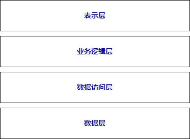


### 7.2.2 分层模式的优势

#### 1. 可维护性

由于各层的职责明确，当系统出现问题或需要进行修改时，开发人员可以快速定位到问题所在的层次，只需要对该层次进行修改，而不会影响到其他层次。例如，如果表示层的某个页面需要调整样式，开发人员只需要修改表示层的相关代码，而不会对业务逻辑层和数据访问层产生影响。

#### 2. 可扩展性

分层模式使得系统具有良好的扩展性。当需要增加新的功能时，可以在相应的层次中添加新的模块或组件，而不会对整个系统的结构造成太大的影响。例如，在电子商务系统中，如果需要增加新的促销活动功能，可以在业务逻辑层中添加相应的业务处理模块。

#### 3. 可复用性

各层的模块或组件具有较高的独立性，可以在不同的系统或项目中进行复用。例如，数据访问层的一些通用数据操作方法可以在多个项目中复用，减少了开发工作量。

#### 4. 团队协作

分层模式便于团队协作开发。不同层次的开发工作可以由不同的团队或开发人员负责，每个团队只需要关注自己所负责的层次，提高了开发效率。例如，前端开发团队负责表示层的开发，后端开发团队负责业务逻辑层和数据访问层的开发。

### 7.2.3 分层模式的应用场景

分层模式的应用场景如下。

* 企业级应用系统：企业级应用系统通常具有复杂的业务逻辑和大量的数据处理需求，分层模式可以很好地满足这些需求。例如，企业资源规划（ERP）系统、客户关系管理（CRM）系统等，通过分层模式可以将业务逻辑、数据处理和用户界面分离，使得系统的结构更加清晰，便于维护和扩展。
* Web 应用程序：在 Web 应用程序开发中，分层模式也是一种常用的架构设计方法。表示层负责处理用户的请求和展示页面，业务逻辑层处理业务规则，数据访问层与数据库进行交互。例如，各种电商网站、社交平台等都广泛采用了分层模式。
* 移动应用开发：移动应用开发同样可以受益于分层模式。表示层负责设计和实现移动应用的界面，业务逻辑层处理应用的核心业务，数据访问层负责与服务器或本地存储进行数据交互。例如，各种购物类、社交类移动应用都采用了分层架构。

### 7.2.4 分层模式的实现要点

#### 1. 层间接口设计

层与层之间通过接口进行交互，接口的设计要清晰、简洁，明确规定各层之间的通信方式和数据格式。例如，业务逻辑层与数据访问层之间的接口可以定义为一组数据访问方法，业务逻辑层通过调用这些方法来获取或更新数据。

#### 2. 依赖管理

各层之间的依赖关系要遵循严格的规则，一般来说，上层依赖于下层，下层不依赖于上层。例如，表示层依赖于业务逻辑层，业务逻辑层依赖于数据访问层，这样可以保证系统的稳定性和可维护性。

#### 3. 异常处理

在分层模式中，异常处理要合理设计。各层应该捕获并处理本层产生的异常，对于无法处理的异常，可以向上层抛出。例如，数据访问层在与数据库交互时可能会出现数据库连接异常，数据访问层应该捕获并处理这些异常，或者将异常信息传递给业务逻辑层进行处理。

### 7.2.5 分层模式的局限性与挑战

#### 1. 性能开销

分层模式会引入一定的性能开销，因为层与层之间的交互需要进行数据传递和方法调用。例如，业务逻辑层调用数据访问层的方法时，需要进行参数传递和返回值处理，这会增加系统的响应时间。

#### 2. 层次划分难度

在实际应用中，如何合理地划分层次是一个挑战。如果层次划分不合理，可能会导致层与层之间的职责不清晰，增加系统的复杂度。例如，如果将一些业务逻辑错误地划分到表示层，会导致表示层的代码过于复杂，影响系统的可维护性。

#### 3. 跨层调用问题

在某些情况下，可能会出现跨层调用的需求，这会破坏分层模式的结构，增加系统的耦合度。例如，表示层直接调用数据访问层的方法，会导致表示层与数据访问层之间的耦合度增加，违反了分层模式的设计原则。


## 7.3 端口适配器模式：攻克技术栈锁定难题，构建可扩展的业务核心系统

在当今复杂多变的 IT 环境中，软件系统需要与各种各样的外部系统和设备进行交互，如数据库、消息队列、第三方 API 等。同时，系统内部的业务逻辑也需要保持相对的独立性和稳定性，以应对不断变化的需求。端口适配器模式（Ports and Adaptors Pattern），也被称为六边形架构（Hexagonal Architecture），应运而生，为解决这些问题提供了一种有效的架构设计方案。它就像一个灵活的连接器，能够让软件系统在保持内部核心稳定的同时，与外部世界进行顺畅的交互。

### 7.3.1 端口适配器模式的基本概念


端口适配器模式是一种软件架构设计模式，它将软件系统划分为三个主要部分：核心业务逻辑（也称为领域模型）、端口（Ports）和适配器（Adaptors）。核心业务逻辑是系统的核心，包含了系统的业务规则和业务流程；端口是核心业务逻辑与外部世界交互的接口，它定义了核心业务逻辑需要从外部获取的服务或需要向外部提供的服务；适配器则是实现这些端口的具体实现，它负责将外部系统或设备的不同接口和协议转换为核心业务逻辑能够理解的形式，或者将核心业务逻辑的输出转换为外部系统或设备能够接受的形式。

如下图4-3所示，端口适配器模式的基本结构如下：

- 核心业务逻辑（领域模型）是系统的核心，它独立于任何外部系统和技术。领域模型包含了系统的实体、值对象、聚合根等领域概念，以及处理这些领域概念的业务规则和业务流程。核心业务逻辑不依赖于任何外部系统，只关注业务本身的逻辑处理。例如，在一个电子商务系统中，订单处理、商品库存管理等业务逻辑都属于核心业务逻辑。
- 端口（Ports）是核心业务逻辑与外部世界交互的接口。它定义了核心业务逻辑需要从外部获取的服务（如数据查询服务、消息发送服务等）或需要向外部提供的服务（如业务事件通知服务等）。端口是抽象的，不涉及具体的实现细节，它只规定了接口的方法和参数。例如，一个数据查询端口可能定义了一个查询商品信息的方法，而不关心具体是从数据库还是其他数据源获取商品信息。
- 适配器（Adaptors）是实现端口的具体实现。它负责将外部系统或设备的不同接口和协议转换为核心业务逻辑能够理解的形式，或者将核心业务逻辑的输出转换为外部系统或设备能够接受的形式。适配器可以分为驱动适配器（Driving Adaptors）和被驱动适配器（Driven Adaptors）。驱动适配器负责接收外部的请求，并将其转换为核心业务逻辑能够处理的形式，如 Web 控制器、消息监听器等；被驱动适配器负责将核心业务逻辑的请求转换为外部系统或设备能够接受的形式，如数据库访问适配器、消息发送适配器等。


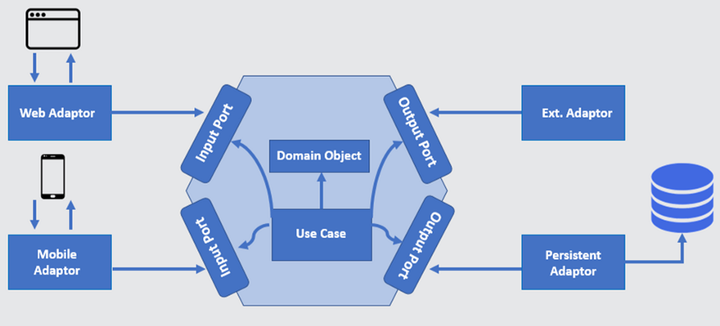


### 7.3.2 端口适配器模式的优势

#### 1. 提高可维护性

由于核心业务逻辑与外部系统分离，当外部系统发生变化时，只需要修改相应的适配器，而不会影响到核心业务逻辑。例如，如果数据库从 MySQL 更换为 PostgreSQL，只需要修改数据库访问适配器，而核心业务逻辑不需要做任何修改。

#### 2. 增强可测试性

核心业务逻辑独立于外部系统，使得单元测试变得更加容易。可以使用模拟对象（Mock Objects）来模拟端口的实现，从而对核心业务逻辑进行单独的测试，而不需要依赖于外部系统的运行环境。

#### 3. 支持技术多样性

端口适配器模式允许系统使用不同的技术和框架来实现适配器。例如，可以使用 Spring Boot 实现 Web 控制器适配器，使用 MyBatis 实现数据库访问适配器，这样可以根据具体的项目需求选择最合适的技术。

#### 4. 促进团队协作

端口适配器模式将系统划分为不同的部分，不同的团队或开发人员可以分别负责核心业务逻辑、端口和适配器的开发。这样可以提高开发效率，同时也便于团队之间的沟通和协作。


### 7.3.3 端口适配器模式的应用场景

#### 1. 企业级应用系统

企业级应用系统通常需要与多个外部系统进行交互，如 ERP 系统、CRM 系统、财务系统等。端口适配器模式可以将核心业务逻辑与这些外部系统分离，使得系统更加灵活和可维护。例如，一个企业级的订单管理系统可能需要与库存管理系统、物流系统等进行交互，通过端口适配器模式可以方便地实现与这些系统的集成。

#### 2. 微服务架构
在微服务架构中，每个微服务都有自己的核心业务逻辑，并且需要与其他微服务或外部系统进行通信。端口适配器模式可以帮助微服务更好地处理与外部系统的交互，提高微服务的独立性和可扩展性。例如，一个用户服务微服务可能需要与认证服务、消息服务等进行交互，通过端口适配器模式可以将这些交互逻辑封装在适配器中，使得用户服务微服务的核心业务逻辑更加清晰。

#### 3. 物联网应用

物联网应用通常需要与各种硬件设备和传感器进行交互，同时还需要与后端的云服务进行通信。端口适配器模式可以将核心业务逻辑与硬件设备和云服务分离，使得系统更加灵活和可扩展。例如，一个智能家居系统可能需要与各种智能设备（如智能灯泡、智能门锁等）进行交互，通过端口适配器模式可以方便地实现与这些设备的通信。

### 7.3.4 端口适配器模式的实现要点

#### 1. 明确核心业务逻辑

在设计系统时，首先要明确核心业务逻辑，将其与外部系统和技术分离。核心业务逻辑应该只关注业务本身的规则和流程，不涉及任何与外部系统交互的细节。

#### 2. 定义端口

根据核心业务逻辑的需求，定义相应的端口。端口应该是抽象的，只规定接口的方法和参数，不涉及具体的实现细节。端口的设计要遵循单一职责原则，每个端口只负责一个特定的功能。

#### 3. 实现适配器

根据端口的定义，实现相应的适配器。适配器要负责将外部系统或设备的不同接口和协议转换为核心业务逻辑能够理解的形式，或者将核心业务逻辑的输出转换为外部系统或设备能够接受的形式。适配器的实现要遵循开闭原则，对扩展开放，对修改关闭。

#### 4. 依赖倒置原则

在实现端口适配器模式时，要遵循依赖倒置原则，即高层模块不应该依赖于低层模块，两者都应该依赖于抽象。核心业务逻辑依赖于端口（抽象接口），而适配器实现这些端口，这样可以降低模块之间的耦合度。

### 7.3.5 端口适配器模式的局限性与挑战

#### 1. 增加系统复杂度

端口适配器模式将系统划分为多个部分，增加了系统的复杂度。开发人员需要理解核心业务逻辑、端口和适配器之间的关系，并且需要编写更多的代码来实现端口和适配器。

#### 2. 性能开销

由于端口适配器模式需要进行多次的接口转换和数据传递，可能会引入一定的性能开销。在对性能要求较高的系统中，需要对性能进行优化。

#### 3. 学习成本

对于开发人员来说，学习和掌握端口适配器模式需要一定的时间和精力。特别是对于一些传统的开发人员来说，需要转变思维方式，适应这种新的架构设计模式。


## 7.4 管道过滤器模式：突破数据处理效率瓶颈，掌握异步流水线设计精髓

在软件开发的浩瀚宇宙中，处理数据的流程常常复杂且多变。想象一下，你有一系列的数据需要经过多个步骤的处理，每个步骤都有特定的功能，就像流水线上的一道道工序。管道过滤器模式（Pipeline Filter Pattern）就为解决这类问题提供了优雅而高效的方案。它以清晰的结构和强大的可扩展性，在众多数据处理场景中大放异彩，无论是简单的文本处理，还是复杂的大数据分析，都能看到它的身影。

### 7.4.1 管道过滤器模式的基本概念


管道过滤器模式是一种软件架构设计模式，它将数据处理过程分解为一系列独立的处理步骤，每个处理步骤由一个过滤器（Filter）来实现。这些过滤器通过管道（Pipeline）依次连接，数据就像水流一样在管道中流动，依次经过各个过滤器进行处理。每个过滤器只负责单一的处理任务，处理完成后将结果传递给下一个过滤器，直到整个处理流程结束。

如下图7-4所示，管道过滤器模式的基本结构如下：

- 过滤器（Filter）是管道过滤器模式的核心组件，它是一个独立的处理单元，负责对输入的数据进行特定的处理，并将处理结果输出。过滤器具有高内聚性，只关注单一的功能，例如数据清洗、格式转换、数据计算等。每个过滤器都有明确的输入和输出接口，输入接口接收上一个过滤器传递过来的数据，输出接口将处理后的数据传递给下一个过滤器。
- 管道（Pipeline）是连接各个过滤器的通道，它负责将一个过滤器的输出作为下一个过滤器的输入，确保数据能够按照预定的顺序依次经过各个过滤器。管道可以是物理上的连接，也可以是逻辑上的连接，例如在内存中传递数据、通过网络传输数据等。
- 数据（Data）是在管道中流动的对象，它可以是任何形式的数据，如文本、数字、图像等。数据在经过每个过滤器时，会被该过滤器进行相应的处理，从而逐步转换为最终需要的形式。


### 7.4.2 管道过滤器模式的优势

#### 1. 可维护性

由于每个过滤器只负责单一的处理任务，当某个处理步骤需要修改或优化时，只需要修改对应的过滤器，而不会影响到其他过滤器。这使得系统的维护变得更加简单和高效。例如，如果需要修改数据清洗的规则，只需要对数据清洗过滤器进行修改，而不需要改动整个数据处理流程。

#### 2. 可扩展性

管道过滤器模式具有良好的扩展性。如果需要增加新的处理步骤，只需要创建一个新的过滤器，并将其插入到管道中合适的位置即可。这使得系统能够轻松应对不断变化的业务需求。例如，在一个文本处理系统中，如果需要增加一个对文本进行情感分析的功能，只需要创建一个情感分析过滤器，并将其添加到管道中。

#### 3. 可复用性

每个过滤器都是独立的处理单元，具有较高的可复用性。一个过滤器可以在不同的管道中使用，或者在同一个管道中多次使用。这减少了开发工作量，提高了代码的复用率。例如，数据格式转换过滤器可以在多个不同的数据处理系统中使用。

#### 4. 并行处理能力

由于每个过滤器都是独立的，因此可以对过滤器进行并行处理，提高数据处理的效率。在多核处理器或分布式系统中，可以同时运行多个过滤器，加速整个数据处理流程。

### 7.4.3 管道过滤器模式的应用场景

管道过滤器模式的应用场景如下。

* 数据处理与转换：在数据处理领域，管道过滤器模式被广泛应用。例如，在大数据处理中，数据可能需要经过清洗、转换、聚合等多个步骤的处理。每个步骤可以用一个过滤器来实现，通过管道将这些过滤器连接起来，形成一个完整的数据处理流程。
* 图像处理：在图像处理中，图像可能需要经过灰度化、滤波、边缘检测等多个处理步骤。每个处理步骤可以用一个过滤器来实现，通过管道将这些过滤器连接起来，实现对图像的复杂处理。
* 文本处理：在文本处理中，文本可能需要经过分词、词性标注、命名实体识别等多个处理步骤。每个处理步骤可以用一个过滤器来实现，通过管道将这些过滤器连接起来，实现对文本的深入分析。

### 7.4.4 管道过滤器模式的实现要点

#### 1. 过滤器的设计

过滤器的设计要遵循单一职责原则，每个过滤器只负责一个特定的处理任务。过滤器的输入和输出接口要明确，确保能够与其他过滤器进行无缝连接。同时，过滤器应该具有良好的封装性，内部实现细节不对外暴露。

#### 2. 管道的实现

管道的实现要确保数据能够正确地从一个过滤器传递到下一个过滤器。可以使用队列、缓冲区等数据结构来实现管道，保证数据的顺序性和一致性。在实现管道时，还需要考虑异常处理和错误恢复机制，确保在某个过滤器出现错误时，整个数据处理流程不会崩溃。

#### 3. 过滤器的配置与组合

在实际应用中，需要根据具体的业务需求对过滤器进行配置和组合。可以通过配置文件或代码来指定过滤器的顺序和参数，实现不同的数据处理流程。同时，要考虑过滤器之间的依赖关系，确保数据能够按照正确的顺序进行处理。

### 7.4.5 管道过滤器模式的局限性与挑战

#### 1. 性能开销

由于数据需要在各个过滤器之间传递，会引入一定的性能开销。特别是在处理大量数据时，数据的传输和复制可能会成为性能瓶颈。因此，在设计管道过滤器模式时，需要考虑性能优化，例如减少数据的复制、采用并行处理等。

#### 2. 错误处理

当某个过滤器出现错误时，需要妥善处理错误，确保整个数据处理流程的正确性和稳定性。错误处理机制需要考虑到不同类型的错误，如数据格式错误、计算错误等，并采取相应的措施，如重试、跳过、记录日志等。


#### 3. 过滤器的依赖管理

在复杂的管道中，过滤器之间可能存在依赖关系。如果依赖关系处理不当，可能会导致数据处理结果不正确。因此，需要对过滤器的依赖关系进行管理，确保数据能够按照正确的顺序进行处理。


## 7.5 主从模式：解决单点故障痛点，构建容灾备份与自动恢复体系

在信息技术飞速发展的当下，软件和硬件系统面临着越来越高的性能、可靠性和可扩展性要求。主从模式（Master Slave Pattern）作为一种经典且广泛应用的架构设计模式，在解决这些问题上发挥着重要作用。从数据库系统到分布式计算环境，从网络设备到物联网架构，主从模式以其独特的结构和运行机制，为系统的稳定运行和高效扩展提供了有力支持。

### 7.5.1 主从模式的基本概念


主从模式是一种将系统中的组件划分为主节点（Master）和从节点（Slave）的架构模式。主节点负责协调和控制整个系统的运行，处理关键决策和核心任务；从节点则听从主节点的指挥，执行主节点分配的任务，并向主节点汇报执行结果。主从节点之间通过特定的通信协议进行数据交互和指令传递，共同完成系统的整体功能。

主从模式包含以下基本结构与角色。


#### 1. 主节点（Master）

主节点是整个系统的核心控制中心，具有以下主要职责：

- 任务分配：根据系统的需求和从节点的状态，将任务合理地分配给各个从节点。例如，在一个分布式文件系统中，主节点会根据文件的存储需求和从节点的磁盘空间情况，决定将文件存储在哪个从节点上。
- 协调管理：协调从节点之间的工作，确保各个从节点之间的任务执行不会产生冲突。同时，主节点还负责监控从节点的运行状态，及时发现并处理从节点出现的异常情况。
- 数据同步：在某些场景下，主节点需要负责数据的同步工作，确保从节点上的数据与主节点保持一致。例如，在数据库主从复制中，主节点将数据的更新操作同步到从节点上。

#### 2. 从节点（Slave）

从节点是系统中的执行单元，主要负责以下工作：

- 任务执行：接收主节点分配的任务，并按照主节点的要求进行执行。例如，在一个分布式计算系统中，从节点会执行主节点分配的计算任务。
- 数据处理：对主节点传递过来的数据进行处理，并将处理结果反馈给主节点。
- 状态汇报：定期向主节点汇报自身的运行状态，包括资源使用情况、任务执行进度等信息。


下图7-5展示的是PostgreSQL数据库主从模式下的流复制原理图。


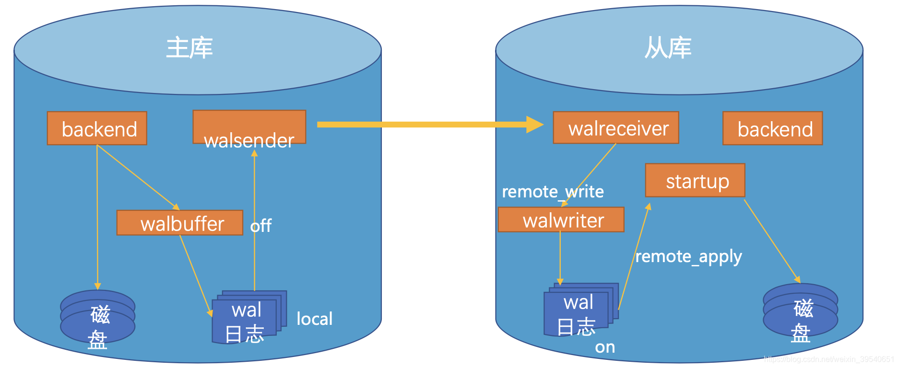


### 7.5.2 主从模式的优势

#### 1. 提高性能

通过将任务分配给多个从节点并行执行，主从模式可以显著提高系统的处理能力。例如，在一个数据库主从架构中，读操作可以分散到多个从节点上进行，从而减轻主节点的负载，提高系统的读取性能。

#### 2. 增强可靠性

主从模式具有一定的容错能力。当某个从节点出现故障时，主节点可以将该从节点的任务重新分配给其他正常的从节点，保证系统的正常运行。同时，在某些情况下，还可以通过主从切换机制，当主节点出现故障时，将某个从节点提升为主节点，继续提供服务。

#### 3. 便于扩展

随着系统业务的增长，可以通过增加从节点的数量来扩展系统的处理能力。主从模式的结构使得新的从节点可以很容易地加入到系统中，而不需要对系统的整体架构进行大规模的修改。


### 7.5.3 主从模式的应用场景

#### 1. 数据库系统

在数据库领域，主从模式被广泛应用于实现数据的读写分离和数据备份。主数据库负责处理写操作，从数据库则复制主数据库的数据，并处理读操作。这样可以提高数据库的读写性能，同时保证数据的安全性和可靠性。例如，在大型电商系统中，用户的下单、支付等写操作会在主数据库中进行，而商品信息查询、订单查询等读操作则可以在从数据库中进行。

#### 2. 分布式计算

在分布式计算环境中，主从模式可以将一个大型的计算任务分解为多个小任务，分配给多个从节点并行执行。主节点负责任务的调度和结果的汇总，从节点负责具体的计算任务。例如，在大数据处理框架 Hadoop 中，NameNode 作为主节点，负责管理文件系统的元数据和任务调度，DataNode 作为从节点，负责存储和处理数据。

#### 3. 网络设备

在网络设备中，主从模式常用于实现设备的集群和负载均衡。主设备负责管理和协调整个集群的运行，从设备则根据主设备的指令进行工作。例如，在一些企业级的路由器集群中，主路由器负责处理路由决策和流量调度，从路由器则负责转发数据包。


### 7.5.4 主从模式的实现要点

#### 1. 通信协议

主从节点之间需要通过稳定、高效的通信协议进行数据交互和指令传递。通信协议要保证数据的准确性和及时性，同时要考虑网络延迟、丢包等问题。常见的通信协议有 TCP/IP、HTTP 等，具体选择要根据系统的需求和特点来决定。

#### 2. 数据同步机制

在主从模式中，数据同步是一个关键问题。要确保从节点上的数据与主节点保持一致，需要采用合适的数据同步机制。常见的数据同步方式有实时同步、定时同步等。例如，在数据库主从复制中，常用的同步方式有基于二进制日志的复制和基于 GTID（全局事务标识符）的复制。

#### 3. 故障处理与恢复

要建立完善的故障处理和恢复机制，当主节点或从节点出现故障时，能够及时发现并采取相应的措施。例如，当从节点出现故障时，主节点要能够及时将该从节点的任务重新分配给其他从节点；当主节点出现故障时，要能够快速进行主从切换，保证系统的正常运行。


### 7.5.5 主从模式的局限性与挑战

#### 1. 主节点单点故障

主从模式中，主节点是系统的核心，如果主节点出现故障，可能会导致整个系统瘫痪。虽然可以通过主从切换机制来解决这个问题，但主从切换过程中可能会出现数据不一致、服务中断等问题。

#### 2. 主节点负载过重

主节点需要承担任务分配、协调管理等重要职责，随着系统规模的扩大和任务量的增加，主节点的负载可能会过重，成为系统的性能瓶颈。

#### 3. 数据一致性问题

在数据同步过程中，由于网络延迟、从节点处理能力等因素的影响，可能会导致从节点上的数据与主节点不一致。需要采取相应的措施来保证数据的一致性，如增加数据校验、重试机制等。


## 7.6 发布订阅模式：解决系统耦合度过高痛点，掌握异步通信核心模式

在复杂的 IT 系统中，组件之间的高效通信与协作是个绕不开的问题。不同模块可能需要对同一事件做出响应，或者某个模块产生的信息需要被多个其他模块获取和处理。发布订阅模式（Publish Subscribe Pattern）应运而生，它为解决这些问题提供了一种松耦合、可扩展的架构方案。

### 7.6.1 发布订阅模式的定义与基本概念


发布订阅模式是一种消息传递模式，在该模式中，消息的发送者（发布者，Publisher）不会直接将消息发送给特定的接收者（订阅者，Subscriber），而是将消息发布到一个中间的消息代理（消息队列、主题等），订阅者可以向消息代理订阅自己感兴趣的消息类型。当发布者发布特定类型的消息时，消息代理会将消息推送给所有订阅了该类型消息的订阅者。

如下图7-6所示，发布订阅模式包含以下基本组件：


- 发布者（Publisher）是产生消息的一方。它负责创建消息，并将消息发布到消息代理。发布者不需要知道有哪些订阅者存在，也不需要关心消息会被哪些订阅者接收，只需要将消息按照规定的格式和类型发布出去即可。例如，在一个新闻系统中，新闻编辑人员就是发布者，他们编写好新闻后将其发布到系统中。
- 订阅者（Subscriber）是对特定类型消息感兴趣的一方。订阅者向消息代理订阅自己感兴趣的消息类型，当有符合其订阅条件的消息发布时，消息代理会将消息推送给订阅者。订阅者可以根据自己的需求处理接收到的消息。例如，在新闻系统中，普通用户就是订阅者，他们可以订阅不同类型的新闻（如体育新闻、科技新闻等），当有新的相关新闻发布时，就会收到通知。
- 消息代理（Message Broker）是发布者和订阅者之间的中间层，它负责接收发布者发布的消息，并将消息转发给相应的订阅者。消息代理维护着订阅者的订阅信息，根据消息的类型和订阅者的订阅条件进行消息的路由和分发。常见的消息代理有消息队列（如 RabbitMQ、Kafka）、事件总线等。


### 7.6.2 发布订阅模式的优势


#### 1. 松耦合性

发布者和订阅者之间不需要直接相互了解，它们只需要和消息代理进行交互。这使得系统的各个组件可以独立开发、部署和修改，降低了组件之间的耦合度。例如，当需要添加一个新的订阅者时，不需要修改发布者的代码，只需要在消息代理上进行订阅操作即可。
#### 2. 可扩展性

由于发布者和订阅者的独立性，系统可以很容易地进行扩展。可以随时添加新的发布者或订阅者，而不会影响到其他组件的正常运行。例如，在一个电商系统中，当需要增加一个新的数据分析模块来处理订单消息时，只需要让该模块订阅订单消息即可，不需要对订单生成模块（发布者）进行任何修改。

#### 3. 异步通信

发布订阅模式通常支持异步通信，发布者发布消息后不需要等待订阅者处理消息，可以继续执行其他任务。这提高了系统的性能和响应速度，尤其在处理大量消息或耗时操作时效果明显。例如，在一个邮件系统中，用户发送邮件（发布消息）后，系统不需要等待所有订阅者（如邮件分类模块、垃圾邮件过滤模块等）处理完邮件，就可以立即返回操作结果给用户。

### 7.6.3 发布订阅模式的应用场景

#### 1. 事件驱动的系统

在事件驱动的系统中，发布订阅模式被广泛应用。当某个事件发生时，相关的模块可以发布该事件消息，其他对该事件感兴趣的模块可以订阅该消息并做出相应的处理。例如，在一个游戏系统中，当玩家完成一个任务时，系统可以发布一个“任务完成”事件消息，其他模块（如成就系统、奖励系统等）可以订阅该消息并进行相应的处理。

#### 2. 实时数据处理

在实时数据处理场景中，如金融交易系统、物联网系统等，发布订阅模式可以实现数据的实时分发和处理。数据源（发布者）将实时数据发布到消息代理，各个数据分析和处理模块（订阅者）可以订阅相应的数据进行实时分析和处理。例如，在股票交易系统中，股票行情数据可以作为发布者发布到消息代理，各个交易策略模块、风险控制模块等可以订阅该数据进行实时处理。

#### 3. 分布式系统

在分布式系统中，不同的节点之间需要进行通信和协作。发布订阅模式可以实现节点之间的解耦和异步通信，提高系统的可扩展性和可靠性。例如，在一个微服务架构的系统中，一个微服务可以作为发布者发布业务事件消息，其他微服务可以作为订阅者订阅这些消息并进行相应的处理。

### 7.6.4 发布订阅模式的实现要点

#### 1. 消息类型和格式定义

需要明确消息的类型和格式，以便发布者和订阅者能够正确地发布和处理消息。消息类型可以是字符串、枚举等，消息格式可以是 JSON、XML 等。例如，在一个基于 JSON 格式的消息系统中，发布者和订阅者需要遵循统一的 JSON 结构来定义和解析消息。

#### 2. 订阅管理

消息代理需要实现有效的订阅管理机制，记录订阅者的订阅信息，包括订阅的消息类型、订阅者的身份等。当有消息发布时，消息代理能够根据订阅信息准确地将消息分发给相应的订阅者。例如，在一个消息队列中，可以使用哈希表来存储订阅者的订阅信息。

#### 3. 消息分发策略

消息代理需要制定合理的消息分发策略，确保消息能够准确、及时地分发给订阅者。常见的消息分发策略有广播（将消息发送给所有订阅者）、组播（将消息发送给特定组的订阅者）等。例如，在一个多用户的聊天系统中，系统管理员发布的通知消息可以采用广播策略发送给所有用户。

### 7.6.5 发布订阅模式的局限性与挑战


#### 1. 消息顺序和一致性

在某些场景下，可能需要保证消息的顺序和一致性。但由于发布订阅模式通常采用异步通信和多订阅者的方式，消息的顺序和一致性可能会受到影响。例如，在一个金融交易系统中，如果交易消息的处理顺序错误，可能会导致交易结果错误。需要采用一些额外的机制来保证消息的顺序和一致性，如消息编号、事务处理等。

#### 2. 消息丢失和重复

在消息传递过程中，可能会出现消息丢失或重复的情况。例如，网络故障、消息代理崩溃等原因可能导致消息丢失；消息重试机制可能会导致消息重复。需要实现消息确认、消息去重等机制来解决这些问题。

#### 3. 性能开销

消息代理需要处理大量的消息发布、订阅和分发操作，可能会成为系统的性能瓶颈。尤其是在高并发场景下，消息代理的性能可能会受到严重影响。需要对消息代理进行性能优化，如采用分布式消息队列、缓存机制等。


## 7.7 共享数据模式：攻克数据同步难题，构建可靠的数据共享机制

在当今的 IT 系统中，数据是核心资产，其高效管理与交互对系统的性能和功能起着决定性作用。随着系统规模的不断扩大和复杂度的提升，多个组件、模块甚至不同系统之间常常需要对同一数据进行访问和操作。共享数据模式（Shared Data Pattern）应运而生，它为解决数据在不同部分之间的共享问题提供了有效的架构方案，广泛应用于各种类型的软件系统中，从简单的单机应用到复杂的分布式系统都能看到它的身影。

### 7.7.1 共享数据模式的基本概念


共享数据模式是一种软件架构模式，它允许系统中的多个组件、模块或子系统访问和操作同一份数据资源。通过共享数据，不同部分可以基于相同的信息进行协作，避免了数据的重复存储和不一致性问题，提高了数据的利用率和系统的整体效率。

共享数据模式的核心在于建立一个共享的数据存储区域，这个区域可以是内存中的数据结构、数据库、文件系统或者分布式缓存等。各个组件通过特定的接口或协议与共享数据存储进行交互，实现数据的读取、写入和更新操作。同时，为了保证数据的一致性和并发访问的正确性，需要采用相应的同步机制和并发控制策略。

共享数据模式包含以下主要组件：

- 共享数据存储：这是共享数据的物理载体，可以是关系型数据库（如 MySQL、Oracle）、非关系型数据库（如 MongoDB、Redis）、内存数据库（如 H2）或者分布式文件系统（如 HDFS）等。不同的存储方式适用于不同的应用场景，需要根据数据的特点和访问需求进行选择。
- 数据访问接口：各个组件通过数据访问接口与共享数据存储进行交互。这些接口可以是 API、SQL 语句、存储过程等，它们定义了数据的访问方式和规则，确保组件能够正确地读取和修改共享数据。
- 同步与并发控制机制：由于多个组件可能同时访问和修改共享数据，为了保证数据的一致性和完整性，需要采用同步与并发控制机制。常见的方法包括锁机制（如互斥锁、读写锁）、事务处理、乐观锁和悲观锁等。

### 7.7.2 共享数据模式的优势

#### 1. 数据一致性

通过共享同一份数据，避免了数据在不同组件或系统中重复存储和更新可能导致的不一致问题。所有组件都基于最新的共享数据进行操作，保证了数据的准确性和一致性。例如，在一个企业资源规划（ERP）系统中，各个部门（如销售、采购、库存）共享同一套产品信息数据，当产品信息发生变更时，所有部门都能及时获取到最新的数据。

#### 2. 提高效率

共享数据减少了数据的冗余存储和传输，降低了系统的开销。同时，多个组件可以同时访问共享数据，提高了数据的利用率和系统的整体性能。例如，在一个分布式计算系统中，多个计算节点可以共享存储在分布式缓存中的中间计算结果，避免了重复计算，提高了计算效率。

#### 3. 促进协作

共享数据为不同组件或系统之间的协作提供了基础。各个组件可以基于共享数据进行交互和协同工作，实现更复杂的业务逻辑。例如，在一个电商系统中，订单处理模块、库存管理模块和物流配送模块可以共享订单数据，协同完成订单的处理和配送流程。

### 7.7.3 共享数据模式的应用场景

#### 1. 企业级应用系统

在企业级应用系统中，不同部门和业务模块需要共享大量的数据，如客户信息、产品信息、财务数据等。共享数据模式可以确保这些数据在整个企业范围内的一致性和可用性，支持企业的业务流程和决策制定。例如，在一个大型企业的 CRM（客户关系管理）系统和 ERP 系统之间共享客户数据，实现客户信息的统一管理和业务流程的协同。

#### 2. 分布式系统

在分布式系统中，多个节点需要共享配置信息、状态数据等。共享数据模式可以通过分布式缓存、分布式数据库等技术实现数据的共享和同步，保证系统的一致性和可靠性。例如，在一个微服务架构的系统中，各个微服务可以共享存储在分布式配置中心的配置数据，实现配置的统一管理和动态更新。

#### 3. 实时数据处理系统

在实时数据处理系统中，多个处理模块需要共享实时数据流进行分析和处理。共享数据模式可以通过消息队列、流处理引擎等技术实现数据的共享和分发，支持实时数据的高效处理和分析。例如，在一个金融交易系统中，多个交易策略模块可以共享实时的市场行情数据，进行实时的交易决策。

### 7.7.4 共享数据模式的实现要点

#### 1. 数据模型设计

合理的数据模型设计是共享数据模式的基础。需要根据业务需求和数据的特点，设计出合适的数据结构和关系，确保数据的高效存储和访问。同时，要考虑数据的扩展性和兼容性，以便在未来业务变化时能够方便地进行调整和扩展。

#### 2. 访问控制与安全

由于共享数据涉及多个组件和用户的访问，需要建立严格的访问控制机制，确保数据的安全性和隐私性。可以通过用户认证、授权管理、数据加密等手段来实现数据的安全访问。例如，在一个企业级数据库中，不同的用户角色具有不同的数据库访问权限，只有经过授权的用户才能访问和修改特定的数据。

#### 3. 数据同步与更新策略

当多个组件同时对共享数据进行修改时，需要制定合理的数据同步与更新策略，保证数据的一致性。可以采用乐观锁、悲观锁、版本控制等方法来解决并发冲突问题。同时，要考虑数据更新的实时性和异步性，根据业务需求选择合适的更新方式。

### 7.7.5 共享数据模式的局限性与挑战

#### 1. 并发冲突问题

多个组件同时访问和修改共享数据时，可能会发生并发冲突，导致数据的不一致性。解决并发冲突需要采用复杂的同步和并发控制机制，这会增加系统的复杂度和开销。例如，在一个多用户的在线文档编辑系统中，多个用户同时修改同一文档可能会导致数据冲突，需要采用版本控制和冲突解决算法来保证数据的一致性。

#### 2. 数据一致性维护

在分布式环境中，由于网络延迟、节点故障等原因，很难保证数据在各个节点之间的实时一致性。需要采用分布式事务、数据复制等技术来维护数据的一致性，但这些技术会增加系统的复杂度和性能开销。例如，在一个分布式数据库系统中，数据在多个节点之间进行复制和同步，可能会出现数据不一致的情况，需要采用两阶段提交、三阶段提交等协议来保证数据的一致性。

#### 3. 性能瓶颈

共享数据存储可能会成为系统的性能瓶颈，尤其是在高并发访问的情况下。大量的组件同时访问共享数据可能会导致数据访问的延迟和性能下降。需要对共享数据存储进行优化，如采用缓存技术、分布式存储等，以提高系统的性能。例如，在一个高流量的电商系统中，大量用户同时访问商品信息数据，可能会导致数据库的性能瓶颈，可以采用缓存技术将热门商品信息缓存到内存中，减少数据库的访问压力。


## 7.8 能力中心模式：突破重复造轮子痛点，实现业务能力快速交付

在当今快速发展且竞争激烈的 IT 领域，企业和开发者面临着诸多挑战，如业务需求的快速变化、技术的不断迭代以及对系统可扩展性和复用性的高要求。能力中心模式（Capability Center Pattern）作为一种先进的架构设计理念应运而生，它为构建灵活、高效且可复用的 IT 系统提供了一种行之有效的解决方案。这种模式在不同规模和类型的企业中都展现出了强大的生命力，从互联网巨头到传统行业的数字化转型企业，都在积极探索和应用能力中心模式来优化自身的 IT 架构。

### 7.8.1 能力中心模式的基本概念


能力中心模式是一种将系统中具有特定业务功能或技术能力的部分进行抽象、封装和集中管理的架构模式。这些被抽象出来的能力以服务的形式存在于能力中心中，各个业务系统或应用可以通过调用能力中心提供的服务来获取所需的功能，而无需重复开发。能力中心就像是一个“能力超市”，里面提供了各种各样的“能力商品”，业务系统可以根据自身需求进行挑选和组合。

能力中心模式包含以下基本组成部分：

#### 1. 能力中心

能力中心是整个模式的核心，它负责对各种能力进行管理和维护。能力中心需要具备以下几个关键功能：

- 能力抽象与封装：将系统中分散的、重复的功能进行抽象，封装成独立的能力服务。例如，将用户认证、支付处理等功能封装成独立的服务。
- 能力注册与发现：对封装好的能力服务进行注册，记录其功能描述、接口信息、调用方式等，并提供能力发现机制，方便业务系统查找和调用所需的能力服务。
- 能力监控与管理：对能力服务的运行状态、性能指标等进行监控，及时发现和处理能力服务出现的问题，并进行能力服务的版本管理和更新。
#### 2. 能力服务


能力服务是能力中心提供的具体服务单元，它是对特定业务功能或技术能力的实现。每个能力服务都有明确的功能边界和接口定义，遵循统一的规范和标准，具有良好的独立性和可复用性。例如，一个电商系统中的商品搜索能力服务，它提供了根据关键词搜索商品的功能，业务系统可以通过调用该服务来实现商品搜索功能。

#### 3. 业务系统


业务系统是能力服务的使用者，它根据自身的业务需求，从能力中心中选择合适的能力服务进行调用，将这些能力服务组合起来实现复杂的业务逻辑。业务系统与能力服务之间通过接口进行交互，不关心能力服务的具体实现细节。例如，一个在线旅游系统可以调用支付能力服务来完成订单支付功能，调用用户认证能力服务来验证用户身份。

### 7.8.2 能力中心模式的优势

#### 1. 提高开发效率

通过复用能力中心提供的能力服务，业务系统的开发人员无需从头开始开发一些通用的功能，大大减少了开发工作量和开发周期。例如，在开发多个不同的业务系统时，都可以复用能力中心提供的用户认证服务，避免了重复开发用户认证模块的工作。

#### 2. 增强系统的可维护性和可扩展性

能力服务的独立性使得对单个能力服务的修改和优化不会影响到其他业务系统。当需要添加新的功能时，只需要在能力中心中开发新的能力服务，并将其注册到能力中心即可，业务系统可以方便地调用新的能力服务，实现系统的扩展。例如，如果需要在电商系统中添加新的营销活动功能，可以在能力中心中开发相应的营销活动能力服务，然后让业务系统调用该服务。

#### 3. 促进业务创新

能力中心模式将企业的核心能力进行集中管理和共享，使得业务部门可以更加灵活地组合和利用这些能力，快速响应市场变化和客户需求，推动业务创新。例如，企业可以将数据分析、人工智能等能力封装成服务，业务部门可以根据不同的业务场景调用这些服务，开展新的业务模式和营销活动。

#### 4. 降低成本

复用能力服务可以减少重复开发和维护的成本，同时能力中心对能力服务的集中管理可以优化资源配置，提高资源利用率，从而降低企业的 IT 成本。例如，通过共享数据库连接池、缓存等资源，减少了资源的浪费。

### 7.8.3 能力中心模式的应用场景


#### 1. 大型企业的数字化转型

在大型企业中，通常存在多个业务系统和部门，这些系统和部门之间存在大量的重复功能和数据。采用能力中心模式可以将这些重复的功能进行抽象和封装，形成共享的能力服务，供各个业务系统和部门使用，实现企业内部的资源整合和协同工作。例如，一家大型集团企业可以建立一个统一的能力中心，将财务结算、人力资源管理等功能封装成服务，供旗下的各个子公司和业务部门使用。

#### 2. 互联网平台的建设

互联网平台通常需要支持多种业务和功能，如电商平台需要支持商品展示、订单处理、支付结算等功能。能力中心模式可以将这些功能进行模块化和服务化，方便平台的扩展和升级。例如，一个电商平台可以建立能力中心，将商品管理、订单管理、支付管理等功能封装成能力服务，各个业务模块可以根据需要调用这些服务，实现业务的快速迭代和创新。

#### 3. 微服务架构

在微服务架构中，能力中心模式可以作为一种有效的组织和管理微服务的方式。将一些通用的功能和能力封装成独立的微服务，放在能力中心进行管理，各个业务微服务可以通过调用能力中心的微服务来获取所需的功能。例如，在一个微服务架构的物流系统中，可以将物流跟踪、运费计算等功能封装成能力微服务，供订单处理微服务、库存管理微服务等调用。

### 7.8.4 能力中心模式的实现要点

#### 1. 能力的识别与抽象

准确识别系统中具有复用价值的能力是实现能力中心模式的关键。需要对业务流程和系统功能进行深入分析，找出那些重复出现、具有通用性的功能，将其抽象成能力服务。在抽象过程中，要遵循高内聚、低耦合的原则，确保能力服务的独立性和可复用性。

#### 2. 接口设计与规范制定

能力服务的接口设计要清晰、简洁，遵循统一的规范和标准。接口应该明确定义输入参数、输出结果和异常处理机制，方便业务系统调用。同时，要制定能力服务的开发、部署、调用等方面的规范，确保能力服务的质量和兼容性。

#### 3. 能力中心的建设与管理

能力中心的建设需要考虑性能、可靠性、安全性等方面的因素。要选择合适的技术架构和平台来构建能力中心，确保其能够高效地管理和提供能力服务。同时，要建立完善的能力中心管理机制，包括能力服务的注册、发现、监控、版本管理等，保证能力中心的正常运行。

#### 4. 与业务系统的集成

能力中心与业务系统之间的集成要简单、便捷。业务系统应该能够方便地发现和调用能力中心的服务，并且能够处理调用过程中可能出现的异常情况。可以采用 API 网关、服务注册与发现等技术来实现能力中心与业务系统的集成。

### 7.8.5 能力中心模式的局限性与挑战

#### 1. 初始建设成本高

构建能力中心需要投入大量的人力、物力和时间，包括对业务流程的梳理、能力的抽象和封装、能力中心平台的开发和部署等。对于一些小型企业或项目来说，可能难以承担这样的成本。

#### 2. 能力服务的标准化难度大

由于不同业务系统的需求和技术栈存在差异，要实现能力服务的标准化是一个挑战。能力服务的接口设计、数据格式、调用方式等方面需要统一标准，否则会影响能力服务的复用性和互操作性。

#### 3. 对团队协作和沟通要求高

能力中心模式涉及到多个团队的协作，包括能力中心的开发团队、业务系统的开发团队等。各个团队之间需要密切沟通和协作，确保能力服务的开发和使用符合业务需求。如果团队之间的沟通不畅，可能会导致能力服务的质量下降和使用效率低下。


## 7.9 开源贡献模式：攻克技术封闭性痛点，积累开源生态建设经验

在当今的 IT 领域，开源软件如同璀璨的星辰，照亮了技术发展的道路。从操作系统 Linux 到编程语言 Python 的众多库，开源软件以其开放、协作的特性，吸引了全球无数开发者的参与。开源贡献模式作为推动开源软件发展的核心机制，不仅促进了技术的共享与创新，还塑造了独特的社区文化。了解开源贡献模式，对于架构师、开发者以及整个 IT 行业都具有重要意义。

### 7.9.1 开源贡献模式的核心概念


开源贡献模式是指在开源软件项目中，开发者、企业和其他参与者通过各种方式为项目提供代码、文档、测试、反馈等资源，以推动项目发展和完善的一种协作模式。在这种模式下，项目的源代码公开，任何人都可以查看、使用、修改和分发，参与者基于共同的目标和兴趣，自愿地为项目贡献力量。

开源贡献模式的核心概念如下：

- 开源许可证是开源项目的法律基础，它规定了项目源代码的使用、修改和分发规则。常见的开源许可证如 GPL（General Public License）、MIT License、Apache License 等。不同的许可证对代码的使用和传播有不同的限制和要求，例如 GPL 要求基于该许可证的衍生作品也必须开源，而 MIT License 则相对宽松，允许更自由地使用和分发代码。
- 开源社区是开源贡献模式的载体，它由项目的开发者、维护者、用户等组成。社区成员通过邮件列表、论坛、即时通讯工具等渠道进行交流和协作。开源社区具有开放、平等、协作的特点，成员们共同讨论项目的发展方向、解决问题、评审代码等。
- 贡献者是开源项目的核心力量，他们可以是个人开发者、企业开发者或其他组织。贡献者的贡献形式多种多样，包括编写代码、修复 bug、完善文档、进行测试、提供反馈和建议等。根据贡献的程度和角色，贡献者可以分为普通贡献者、核心贡献者和维护者。

### 7.9.2 开源贡献模式的优势

#### 1. 促进技术创新

开源贡献模式汇聚了全球开发者的智慧和创造力。不同背景和经验的开发者可以从不同的角度对项目进行改进和优化，提出新的想法和解决方案。例如，在 Linux 内核的开发过程中，来自世界各地的开发者不断贡献新的功能和优化代码，使得 Linux 内核能够快速适应不同的硬件平台和应用场景。

#### 2. 提高软件质量

众多开发者的参与意味着更多的眼睛在审查代码，能够及时发现和修复软件中的 bug。同时，开发者之间的相互交流和学习也有助于提高代码的质量和可维护性。例如，开源数据库 MySQL 通过全球开发者的贡献，不断提升其性能、稳定性和安全性。

#### 3.  降低开发成本

对于企业和开发者来说，使用开源软件可以节省大量的开发成本。他们可以基于现有的开源项目进行二次开发，避免重复造轮子。同时，参与开源项目的贡献也可以提升企业和开发者的技术能力和声誉。例如，许多互联网公司在开发过程中大量使用开源框架和工具，降低了开发成本和时间。

#### 4. 培养技术人才

开源项目为开发者提供了一个学习和实践的平台。初学者可以通过参与开源项目，学习到先进的技术和开发经验，与优秀的开发者交流合作，提升自己的技术水平。例如，许多大学生通过参与开源项目，积累了项目经验，为未来的职业发展打下了坚实的基础。

### 7.9.3 开源贡献模式的主要类型

#### 1. 代码贡献

代码贡献是最常见的开源贡献形式。开发者可以通过提交代码补丁、新功能模块等方式为项目增加价值。在进行代码贡献时，通常需要遵循项目的代码规范和贡献流程。例如，开发者需要先从项目的代码仓库中 fork 代码，然后在自己的本地进行开发和测试，最后提交 pull request 等待项目维护者的审核和合并。

#### 2. 文档贡献

文档对开源项目的使用和推广影响很大。贡献者可以撰写用户手册、API 文档、教程等，帮助其他开发者更好地理解和使用项目。文档贡献不仅可以提高项目的易用性，还可以吸引更多的开发者参与项目。例如，在 Python 的许多开源库中，详细的文档是吸引开发者使用的重要因素之一。

#### 3. 测试贡献

测试贡献者通过对项目进行各种测试，如单元测试、集成测试、性能测试等，发现软件中的 bug 和性能问题，并及时反馈给项目维护者。测试贡献可以帮助项目提高质量和稳定性，确保项目在不同的环境和场景下都能正常运行。例如，一些开源项目会组织测试活动，邀请社区成员参与测试，共同发现和解决问题。

#### 4. 反馈与建议贡献

用户和开发者可以通过提交问题报告、功能请求等方式为项目提供反馈和建议。这些反馈和建议可以帮助项目维护者了解用户的需求和痛点，从而对项目进行改进和优化。例如，在一些开源软件的官方论坛上，用户会提出自己的使用体验和改进建议，项目维护者会根据这些反馈来调整项目的发展方向。

### 7.9.4 开源贡献模式的实践流程

#### 1. 选择合适的项目

开发者在参与开源贡献之前，需要选择一个合适的项目。可以根据自己的兴趣、技术栈和项目的活跃度、发展前景等因素进行选择。可以通过开源项目托管平台（如GitHub、Gitee等）、开源社区网站等渠道查找感兴趣的项目。

#### 2. 了解项目规则和流程

在开始贡献之前，需要仔细阅读项目的贡献指南、代码规范、开发流程等文档。了解项目的规则和流程可以避免在贡献过程中出现不必要的问题，提高贡献的效率和质量。例如，有些项目要求贡献者在提交代码之前先在项目的 issue 中进行讨论，确保贡献的方向和项目的发展一致。

#### 3. 参与社区交流

积极参与开源社区的交流是成为一名优秀贡献者的重要途径。可以通过邮件列表、论坛、即时通讯工具等渠道与其他开发者和维护者进行交流，了解项目的最新动态、讨论技术问题、分享经验和想法。通过参与社区交流，不仅可以提高自己的技术水平，还可以建立良好的人际关系，为后续的贡献打下基础。

#### 4. 进行贡献并提交

根据自己的能力和兴趣，选择合适的贡献方式进行贡献。在贡献过程中，要保证代码的质量和文档的完整性。完成贡献后，按照项目的贡献流程提交贡献，等待项目维护者的审核和反馈。如果审核通过，贡献就会被合并到项目的主代码库中。

### 7.9.5 开源贡献模式面临的挑战与解决方案

#### 1. 知识产权问题

在开源项目中，可能会出现知识产权纠纷，例如代码的版权归属、专利侵权等问题。为了解决这些问题，项目需要明确开源许可证的使用，确保贡献者拥有合法的知识产权。同时，项目维护者需要对贡献的代码进行审核，避免引入有版权问题的代码。

#### 2. 贡献者管理与激励

随着开源项目的发展，贡献者的数量可能会不断增加，如何有效地管理贡献者和激励他们持续贡献是一个挑战。项目可以建立贡献者分级制度，对不同级别的贡献者给予不同的权限和荣誉。同时，也可以通过举办竞赛、奖励等方式激励贡献者积极参与项目。

#### 3. 项目的可持续发展

开源项目的可持续发展需要有足够的资源和支持。如果项目缺乏资金、人力等资源，可能会导致项目的发展停滞甚至夭折。为了解决这个问题，项目可以通过接受捐赠、企业赞助、商业化等方式获取资金支持。同时，也需要培养更多的核心贡献者和维护者，确保项目的技术传承和发展。


## 8.1 理解问题的常用方法

在 IT 技术架构的设计与实现过程中，理解问题是解决问题的关键第一步。一个复杂的 IT 系统往往涉及众多的组件、交互和业务规则，若不能准确理解问题的本质，后续的架构设计和开发工作很可能会偏离方向，导致资源浪费和项目失败。掌握理解问题的常用方法，对 IT 技术人员来说是基本功。下面聊聊几种在 IT 技术架构领域中常用的理解问题的方法。

### 8.1.1 观察法

#### 1. 直接观察系统运行

在 IT 技术架构相关问题中，直接观察系统的运行状态是一种直观且有效的方法。通过监控系统的各项指标，如 CPU 使用率、内存占用、网络带宽等，可以了解系统在不同负载下的表现。例如，在一个电商系统中，在促销活动期间观察系统的响应时间和吞吐量，若发现某些页面加载缓慢，可能意味着该页面所依赖的数据库查询或后端服务存在性能瓶颈。

#### 2. 观察用户操作

观察用户与系统的交互方式能帮助我们发现系统在实际使用中存在的问题。可以通过用户调研、录制用户操作视频等方式进行观察。例如，在一个办公自动化系统中，观察用户在创建和审批流程中的操作步骤，可能会发现某些操作过于繁琐，导致用户体验不佳，这就提示我们在架构设计上可能需要优化流程或提供更便捷的操作界面。

### 8.1.2 访谈法

#### 1. 与业务人员交流

业务人员是系统需求的提出者和使用者，与他们进行深入的访谈可以了解业务的核心流程、目标和痛点。例如，在开发一个医疗信息管理系统时，与医生、护士和管理人员交流，了解他们在日常工作中如何使用患者信息、病历记录等，以及他们对系统的期望和遇到的问题。这样可以确保架构设计能够满足业务需求，支持业务的顺利开展。

#### 2. 与技术团队沟通

与技术团队成员（如开发人员、运维人员等）访谈，可以了解系统的技术实现细节、现有架构的优缺点以及技术层面存在的问题。例如，开发人员可能会反馈某些模块的代码复杂度较高，维护困难；运维人员可能会提到系统在某些情况下容易出现故障，需要进行架构优化以提高系统的稳定性。

### 8.1.3 文档分析法

#### 1. 研究需求文档

需求文档是系统开发的基础，仔细研究需求文档可以明确系统的功能和性能要求。在文档中寻找关键的业务规则、数据流程和约束条件等信息。例如，在一个金融交易系统的需求文档中，明确规定了交易的处理时间、数据的准确性要求等，这些信息直接影响架构设计中的性能优化和数据一致性保障。

#### 2. 分析技术文档

技术文档（如系统架构文档、接口文档等）可以帮助我们了解系统的现有架构和技术实现方式。通过分析这些文档，可以发现架构中的潜在问题和改进空间。例如，在查看一个分布式系统的架构文档时，发现某些服务之间的通信依赖过于复杂，可能会导致系统的可维护性和扩展性较差，需要在后续的架构设计中进行优化。

### 8.1.4 思维导图法

#### 1. 梳理问题结构

使用思维导图工具可以将问题进行分解和结构化。以一个大型项目的架构设计问题为例，可以将问题的核心主题作为思维导图的中心节点，然后将相关的子问题（如功能需求、性能要求、技术选型等）作为分支节点展开。通过这种方式，可以清晰地看到问题的全貌和各个部分之间的关系。

#### 2. 激发创新思维


思维导图还可以帮助我们激发创新思维，在梳理问题的过程中，不断产生新的想法和解决方案。例如，在考虑一个社交网络系统的架构时，通过思维导图可以将不同的功能模块和技术实现方式进行关联，从而发现新的架构设计思路，如采用微服务架构来提高系统的可扩展性和灵活性。

### 8.1.5 鱼骨图法


下图8-1展示的是一张鱼骨图法使用案例。

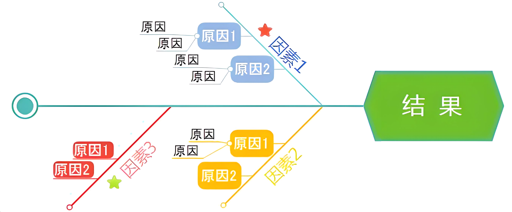


#### 1. 分析问题原因

鱼骨图（也称为因果图）是一种用于分析问题原因的有效工具。在 IT 技术架构中，当遇到系统性能问题、故障问题等时，可以使用鱼骨图来找出可能的原因。以系统响应时间过长为例，将“系统响应时间过长”作为鱼骨图的鱼头，然后从人员、设备、方法、环境等方面进行分析，找出可能导致问题的原因，如人员操作不当、服务器硬件配置不足、算法复杂度高等。


#### 2. 确定关键因素

通过鱼骨图的分析，可以确定导致问题的关键因素。在上述例子中，如果发现服务器硬件配置不足是导致系统响应时间过长的主要原因，那么在后续的架构优化中，就可以重点考虑升级服务器硬件或采用分布式架构来分担负载。

### 8.1.6 标杆分析法

#### 1. 寻找行业标杆

在 IT 技术架构领域，寻找行业内的标杆系统或成功案例进行分析是一种学习和借鉴的有效方法。例如，在设计一个电商系统的架构时，可以研究亚马逊、阿里巴巴等行业巨头的架构设计理念和实践经验。了解他们如何处理高并发、大数据量、分布式存储等问题，从中获取灵感和启示。


#### 2. 对比自身系统

将自身系统与行业标杆进行对比，找出差距和不足之处。分析标杆系统在架构设计、技术选型、运营管理等方面的优势，结合自身系统的特点和需求，制定改进方案。例如，如果发现标杆系统采用了先进的缓存技术来提高系统性能，而自身系统在这方面存在不足，就可以考虑引入缓存技术来优化架构。

### 8.1.7 模拟与实验法

#### 1. 构建原型系统
对于一些复杂的 IT 技术架构问题，可以通过构建原型系统来进行模拟和实验。例如，在设计一个新的数据库架构时，可以构建一个小型的原型数据库，模拟实际的业务场景和数据访问模式，测试不同的数据库配置和查询优化策略的效果。通过原型系统的实验，可以快速验证架构设计的可行性和有效性。

#### 2. 进行压力测试

压力测试是模拟系统在高负载情况下的运行状态，以评估系统的性能和稳定性。在设计一个网站架构时，可以使用压力测试工具模拟大量用户同时访问网站的场景，观察系统的响应时间、吞吐量、资源利用率等指标。根据压力测试的结果，可以发现系统在高并发情况下存在的性能瓶颈，如数据库查询缓慢、服务器处理能力不足等，从而对架构进行针对性的优化。

### 8.1.8 总结

理解问题是 IT 技术架构设计和解决问题的基础，不同的理解问题的方法适用于不同的场景和问题类型。观察法可以让我们直观地了解系统的运行状态和用户需求；访谈法有助于我们获取业务和技术方面的信息；文档分析法可以帮助我们深入了解系统的需求和现有架构；思维导图法和鱼骨图法可以帮助我们梳理问题结构和分析问题原因；标杆分析法可以让我们借鉴行业的成功经验；模拟与实验法可以验证架构设计的可行性和性能。在实际应用中，我们可以根据具体情况综合运用这些方法，以准确理解问题的本质，为后续的架构设计和问题解决提供有力支持。


## 8.2 探索解决方案的常用方法

在IT技术架构领域，当我们清晰地定义了问题之后，接下来的关键步骤就是探索解决方案。由于IT系统的复杂性和多样性，问题往往没有唯一的解决途径，需要综合运用多种方法来寻找最合适的方案。下面聊聊在IT技术架构中探索解决方案的常用方法。

### 8.2.1 头脑风暴法


头脑风暴法是一种激发团队创造力和创新思维的方法。它鼓励团队成员自由地提出各种想法和建议，无论这些想法看起来多么疯狂或不切实际。在IT技术架构问题的解决中，头脑风暴可以打破传统思维的束缚，为问题的解决提供更多的可能性。

头脑风暴法实施步骤如下。

- 确定主题：明确要解决的IT技术架构问题，例如如何提高系统的可扩展性、如何优化数据库性能等。
- 召集团队：邀请相关的技术人员、业务人员和其他利益相关者参加头脑风暴会议。
- 自由发言：在会议中，鼓励成员自由地表达自己的想法，不进行批评和评价。记录下所有提出的想法。
- 整理和评估：会议结束后，对记录的想法进行整理和分类，然后评估每个想法的可行性和潜在价值。

举例，在设计一个电商系统的架构时，团队通过头脑风暴提出了多种提高系统性能的想法，包括使用缓存技术、采用分布式架构、优化数据库查询等。经过评估，团队选择了一些可行的想法进行进一步的研究和实现。

### 8.2.2 逆向思维法


逆向思维法是指从问题的相反方向进行思考，突破常规的思维模式。在IT技术架构中，当正向思考难以找到解决方案时，逆向思维可以帮助我们发现新的途径。

逆向思维法实施步骤如下。

- 明确问题：确定要解决的IT技术架构问题。
- 反向思考：思考与问题常规解决方法相反的思路。例如，如果问题是如何提高系统的安全性，反向思考可以是考虑系统可能存在的最不安全的情况，然后采取措施避免这些情况的发生。
- 评估可行性：对反向思考得到的解决方案进行评估，判断其是否可行。

举例，在解决一个系统数据备份问题时，常规的思路是定期将数据备份到外部存储设备。采用逆向思维，团队考虑如果不进行备份，如何在数据丢失时恢复数据。通过研究，他们发现可以利用系统的实时数据同步和分布式存储技术，在多个节点上保存数据副本，从而实现数据的快速恢复，而无需依赖传统的备份方式。

### 8.2.3 类比法


类比法是将当前的IT技术架构问题与其他类似的问题或领域进行类比，借鉴已有的解决方案。通过类比，我们可以从不同的角度看待问题，发现新的解决思路。

类比法实施步骤如下。

- 寻找类比对象：寻找与当前问题类似的IT系统、行业案例或其他领域的问题。例如，在设计一个分布式系统的架构时，可以类比互联网搜索引擎的架构。
- 分析类比对象的解决方案：研究类比对象的解决方案，找出其中的关键要素和成功经验。
- 迁移解决方案：将类比对象的解决方案进行适当的调整和修改，应用到当前的问题中。

举例，在设计一个实时数据处理系统的架构时，团队类比了交通流量控制系统的架构。交通流量控制系统通过传感器收集交通数据，然后根据数据分析结果实时调整信号灯的时间。团队将这个思路应用到实时数据处理系统中，通过传感器收集业务数据，然后根据数据分析结果实时调整系统的处理策略，提高了系统的处理效率。

### 8.2.4 分治法


分治法是将一个复杂的IT技术架构问题分解为多个较小的、相对独立的子问题，然后分别解决这些子问题。最后，将子问题的解决方案组合起来，得到原问题的解决方案。

分治法实施步骤如下。

- 问题分解：将复杂的问题分解为多个子问题，确保每个子问题相对独立且易于解决。例如，在设计一个大型电商系统的架构时，可以将问题分解为用户界面设计、业务逻辑处理、数据库管理等子问题。
- 解决子问题：分别对每个子问题进行分析和解决，可以采用不同的方法和技术。
- 组合解决方案：将子问题的解决方案组合起来，形成原问题的解决方案。在组合过程中，需要考虑子问题之间的接口和交互。

举例，在开发一个企业级应用系统时，团队将系统的功能分解为多个模块，每个模块由不同的小组负责开发。每个小组独立完成自己的模块开发后，通过接口进行集成，最终形成一个完整的应用系统。

### 8.2.5 文献研究法


文献研究法是通过查阅相关的技术文献、研究报告、学术论文等资料，了解当前IT技术架构领域的最新研究成果和实践经验。通过文献研究，我们可以获取更多的信息和思路，为解决问题提供参考。

文献研究法实施步骤如下。

- 确定研究范围：明确要查阅的文献范围，包括书籍、期刊、会议论文、技术博客等。
- 搜索文献：使用搜索引擎、学术数据库等工具搜索相关的文献资料。
- 筛选和阅读文献：对搜索到的文献进行筛选，选择与当前问题相关的文献进行阅读和分析。
- 提取有用信息：从文献中提取有用的信息和思路，应用到问题的解决中。

举例，在研究如何优化数据库性能时，团队通过查阅相关的数据库技术文献，了解到了一些最新的数据库优化技术，如索引优化、查询优化、数据库分区等。团队将这些技术应用到实际的数据库系统中，取得了显著的性能提升。

### 8.2.6 专家咨询法


专家咨询法是向IT技术架构领域的专家请教，获取他们的意见和建议。专家具有丰富的经验和专业知识，他们的建议可以帮助我们避免一些常见的错误，找到更有效的解决方案。

专家咨询法实施步骤如下。

- 确定专家名单：确定在IT技术架构领域具有丰富经验和专业知识的专家名单。
- 联系专家：通过邮件、电话、会议等方式联系专家，向他们介绍问题的背景和情况。
- 获取专家意见：听取专家的意见和建议，记录下他们提出的解决方案和注意事项。
- 评估和应用专家意见：对专家的意见进行评估，结合实际情况选择合适的建议应用到问题的解决中。

举例，在设计一个云计算系统的架构时，团队邀请了几位云计算领域的专家进行咨询。专家们根据自己的经验和研究成果，提出了一些关于系统架构设计、资源管理、安全防护等方面的建议。团队对这些建议进行了评估和分析，将其中可行的建议应用到了实际的架构设计中。

### 8.2.7 原型法


原型法是通过构建一个简单的原型系统来验证解决方案的可行性。在IT技术架构中，原型可以帮助我们快速验证某个架构设计的想法，发现其中存在的问题，并及时进行调整和优化。

原型法实施步骤如下。

- 确定原型目标：明确原型系统要实现的功能和目标，例如验证某个算法的性能、展示某个界面的设计等。
- 构建原型：根据原型目标，选择合适的技术和工具构建原型系统。原型可以是一个简单的模拟系统，也可以是一个部分功能的实际系统。
- 测试和评估原型：对原型系统进行测试和评估，收集用户的反馈意见和数据。根据测试和评估的结果，分析原型系统存在的问题和不足之处。
- 优化和改进原型：根据测试和评估的结果，对原型系统进行优化和改进，直到满足要求为止。

举例，在设计一个移动应用的架构时，团队首先构建了一个简单的原型应用，展示了应用的主要功能和界面设计。通过对原型应用的测试和用户反馈，团队发现了一些界面设计不合理、功能实现存在问题等情况。团队对原型进行了优化和改进，最终确定了一个更加完善的应用架构。

### 8.2.8 总结

在IT技术架构中，探索解决方案需要综合运用多种方法。头脑风暴法可以激发团队的创造力，逆向思维法可以突破常规思维，类比法可以借鉴其他领域的经验，分治法可以将复杂问题简化，文献研究法可以获取最新的技术信息，专家咨询法可以借助专家的智慧，原型法可以快速验证解决方案的可行性。技术人员应根据具体问题的特点和需求，灵活选择和运用这些方法，以找到最适合的解决方案，推动IT系统的不断发展和优化。


## 8.3 展示设计的常用方法

在IT技术架构领域，精心设计的架构方案需要通过有效的展示方法传达给不同的利益相关者，如技术团队、管理层、客户等。一个清晰、直观且富有说服力的展示，不仅能帮助受众更好地理解架构的价值、功能和优势，还能为项目的推进和决策提供有力支持。下面聊聊IT技术架构展示设计的常用方法。

### 8.3.1 可视化图表法

#### 1. 架构图绘制

架构图是展示IT技术架构最直观的方式之一。常见的架构图包括系统架构图、模块架构图、网络拓扑图等。

- 系统架构图：从整体上展示系统的组成部分及其相互关系。例如，在一个电商系统的架构图中，会包含用户界面层、业务逻辑层、数据访问层以及数据库等核心组件，并用箭头表示它们之间的数据流向和交互方式。可以使用专业的绘图工具，如 Visio、Lucidchart 等，确保图形的规范性和专业性。
- 模块架构图：聚焦于系统内部各个模块的详细设计。以一个企业资源规划（ERP）系统为例，模块架构图会展示财务模块、采购模块、销售模块等之间的接口和依赖关系，帮助技术人员理解模块的分工和协作。
- 网络拓扑图：主要用于展示网络设备的连接方式和网络结构。在一个大型数据中心的网络拓扑图中，会包含服务器、交换机、路由器等设备，以及它们之间的物理和逻辑连接，便于网络工程师进行网络规划和故障排查。


下图8-2展示的是一张物联网技术系统架构图示例。

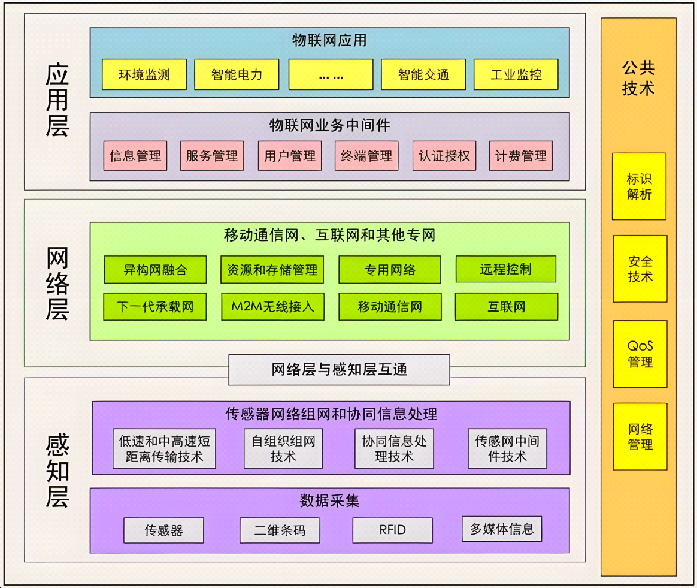


#### 2. 流程图设计

流程图能够清晰地展示业务流程或系统操作流程。例如，在一个在线支付系统的展示中，使用流程图可以详细描述用户从选择商品、下单、支付到订单完成的整个过程，包括各个环节的条件判断和跳转逻辑。通过不同形状的图形（如矩形表示操作步骤、菱形表示判断条件）和箭头的指向，让受众一目了然地理解流程的走向和关键节点。可以使用专业的流程图绘制工具，如ProcessOn、Draw.io等。

#### 3. 数据流向图

数据流向图用于展示数据在系统中的流动路径和处理过程。在一个大数据分析系统中，数据流向图会展示数据从数据源（如传感器、日志文件）采集，经过数据清洗、转换、存储，最终到数据分析和可视化的整个过程。通过不同颜色或线条的粗细来表示数据的重要性或流量大小，帮助受众理解数据的流转和处理机制。

### 8.3.2 故事板法

#### 1. 构建故事场景

将IT技术架构的应用场景以故事的形式呈现出来。例如，对于一个智能医疗系统的架构展示，可以构建一个患者就医的故事场景：患者通过手机端预约挂号，到医院后使用自助设备进行签到，医生通过电子病历系统查看患者的病史和检查报告，进行诊断并开具处方，药房根据处方进行配药，整个过程中各个系统模块协同工作。通过生动的故事场景，让受众更容易理解架构在实际业务中的应用和价值。

#### 2. 分镜展示

将故事场景分解为多个分镜，每个分镜对应一个关键环节或操作步骤。例如，在上述智能医疗系统的故事板中，可以分为患者预约分镜、医院签到分镜、医生诊断分镜、药房配药分镜等。每个分镜可以配以相应的架构图或流程图，详细展示该环节中系统的工作原理和组件交互，使展示更加有条理和层次感。

### 8.3.3 对比分析法

#### 1. 新旧架构对比

如果是对现有架构进行升级或改造，可以将新架构与旧架构进行对比展示。对比的方面可以包括性能指标（如响应时间、吞吐量）、可扩展性、维护成本等。例如，在一个企业级应用系统的架构升级项目中，通过图表对比旧架构在处理高并发请求时的响应时间较长，而新架构采用了分布式架构和缓存技术，响应时间大幅缩短，让受众直观地看到新架构的优势。

#### 2. 竞品架构对比

将自己的IT技术架构与市场上的竞争对手架构进行对比。分析双方在功能特点、技术实现、成本效益等方面的差异。例如，在一个云计算平台的架构展示中，对比自家平台与其他竞争对手在弹性伸缩能力、数据安全性、服务价格等方面的优劣，突出自身架构的独特卖点和竞争优势。

### 8.3.4 案例分析法

#### 1. 实际项目案例

分享基于该IT技术架构实施的实际项目案例。详细介绍项目的背景、目标、面临的挑战以及如何运用架构解决问题并取得的成果。例如，在展示一个物联网架构时，可以介绍一个智能工厂项目案例：该工厂面临设备管理复杂、生产效率低下的问题，通过采用物联网架构实现了设备的实时监控和自动化控制，生产效率提高了 30%，设备故障率降低了 20%。通过具体的数据和实际效果，增强受众对架构的信任和认可。

#### 2. 行业标杆案例

引用行业内的标杆案例，说明类似架构在其他企业的成功应用。分析这些标杆案例的架构设计思路、实施过程和经验教训，为受众提供参考和借鉴。例如，在展示一个金融科技架构时，可以介绍国际知名银行采用的先进架构模式，以及它们如何通过架构创新提升业务竞争力和客户体验。

### 8.3.5 交互式展示法

#### 1. 演示系统搭建

搭建一个可交互的演示系统，让受众亲自操作和体验IT技术架构的功能。例如，在展示一个智能家居架构时，搭建一个模拟的智能家居环境，受众可以通过手机应用或智能语音设备控制灯光、窗帘、空调等设备的开关和调节，直观地感受架构的便捷性和智能化。

#### 2. 实时数据展示
在展示过程中，实时展示系统的运行数据和状态信息。例如，在展示一个大数据分析平台的架构时，通过仪表盘实时展示数据的采集量、处理速度、分析结果等指标，让受众了解系统的实际运行情况和性能表现。

### 8.3.6 文档说明法

#### 1. 架构文档撰写

撰写详细的架构文档，包括架构概述、设计原则、组件说明、接口定义、部署方案等内容。架构文档是对架构设计的全面描述，为技术人员提供了详细的参考资料。文档中可以配以相应的图表和示例代码，增强文档的可读性和实用性。

#### 2. 用户手册编写

编写用户手册，针对不同的用户角色（如管理员、普通用户）详细说明如何使用基于该架构开发的系统。用户手册应包含操作步骤、常见问题解答等内容，帮助用户快速上手和解决使用过程中遇到的问题。

### 8.3.7 总结

在IT技术架构的展示设计中，可视化图表法直观呈现架构结构和关系，故事板法通过生动场景增强理解，对比分析法突出优势，案例分析法提供实践参考，交互式展示法带来亲身体验，文档说明法提供详细资料。综合运用这些常用方法，根据不同的受众和展示目的进行灵活组合和调整，能够更有效地展示IT技术架构的魅力和价值，推动项目的顺利实施和技术的广泛应用。


## 8.4 评估设计方案的常用方法

在IT技术架构领域，设计方案的质量直接关系到系统的性能、可维护性、可扩展性以及项目的成败。面对众多的设计方案，如何准确、全面地评估它们，挑选出最适合项目需求的方案，是架构师和项目团队必须掌握的关键技能。下面聊聊评估IT技术架构设计方案的常用方法。

### 8.4.1 功能完整性评估法

#### 1. 需求匹配度分析

将设计方案与项目的需求文档进行细致比对，检查方案是否涵盖了所有的功能需求。对于功能性需求，要确保方案中的各个模块和组件能够实现相应的功能。例如，在一个电商系统的设计方案评估中，需确认方案是否支持商品展示、购物车管理、订单处理、支付结算等核心功能。对于非功能性需求，如性能、安全、兼容性等方面的要求，也要在方案中找到对应的设计和实现措施。

#### 2. 功能扩展性考量

评估设计方案是否具备良好的功能扩展性，以应对未来业务的变化和增长。一个优秀的设计方案应该能够方便地添加新的功能模块，而不会对现有系统造成过大的影响。例如，在设计一个企业级应用系统时，要考虑到随着企业业务的拓展，可能需要增加新的业务流程和功能，如客户关系管理模块、供应链管理模块等，方案应预留相应的接口和扩展点。

### 8.4.2 性能评估法

#### 1. 响应时间测试

通过模拟实际的用户操作和负载情况，测试设计方案在不同场景下的响应时间。对于一个网站架构设计方案，可使用性能测试工具（如JMeter、LoadRunner等）模拟大量用户同时访问网站的情况，记录页面的加载时间、操作的响应时间等指标。响应时间越短，说明方案的性能越好，能够为用户提供更流畅的体验。

#### 2. 吞吐量评估

吞吐量是指系统在单位时间内能够处理的请求数量。评估设计方案的吞吐量，有助于判断系统在高并发情况下的处理能力。例如，在评估一个数据库系统的设计方案时，可通过测试不同并发用户数下数据库的查询和写入操作的处理速度，来确定系统的吞吐量上限。如果方案的吞吐量能够满足项目的预期负载要求，则说明方案在性能方面表现良好。

#### 3. 资源利用率分析

分析设计方案在运行过程中对系统资源（如CPU、内存、磁盘I/O等）的利用率。合理的设计方案应该能够高效地利用系统资源，避免资源的浪费和瓶颈。例如，在评估一个分布式系统的设计方案时，要检查各个节点的资源分配是否合理，是否存在某个节点资源过度使用而其他节点资源闲置的情况。

### 8.4.3 可维护性评估法

#### 1. 代码可读性审查

审查设计方案对应的代码，评估代码的可读性。良好的代码应该具有清晰的结构、规范的命名和详细的注释，便于开发人员理解和维护。例如，在评估一个软件开发项目的设计方案时，检查代码是否遵循了统一的编码规范，函数和变量的命名是否具有明确的含义，代码中是否包含必要的注释来解释关键逻辑。

#### 2. 模块独立性检查

检查设计方案中各个模块的独立性，即模块之间的耦合度。低耦合的设计方案意味着各个模块之间的依赖关系较少，一个模块的修改不会对其他模块产生过多的影响。例如，在评估一个模块化架构的设计方案时，分析模块之间的接口是否清晰，是否存在模块之间过度依赖的情况。

#### 3. 文档完整性评估

评估设计方案相关文档的完整性和准确性。文档是系统维护的重要依据，包括需求文档、设计文档、测试文档等。完整的文档应该能够详细描述系统的功能、架构、接口、实现细节等方面的信息，方便开发人员和维护人员进行后续的工作。

### 8.4.4 可扩展性评估法

#### 1. 技术架构灵活性分析

分析设计方案所采用的技术架构是否具有灵活性，能够适应未来技术的发展和变化。例如，在评估一个基于云计算的系统设计方案时，检查方案是否采用了开放的标准和接口，是否支持与其他云服务的集成，是否能够方便地迁移到不同的云计算平台。

#### 2. 数据扩展性考量

考虑设计方案在数据量增长和数据类型变化时的扩展性。对于一个大数据系统的设计方案，要评估方案是否能够处理不断增加的数据量，是否支持对新的数据类型进行处理和分析。例如，方案是否采用了分布式存储和处理技术，是否能够方便地添加新的数据源。
#### 3. 业务扩展性评估

评估设计方案是否能够支持业务的扩展和变化。在一个企业级应用系统的设计方案中，要考虑到企业业务模式的变化和新业务的开展，方案是否能够快速调整和适应。例如，方案是否采用了模块化设计，是否能够方便地添加新的业务模块和功能。

### 8.4.5 安全性评估法

#### 1. 数据安全保障

评估设计方案在数据存储和传输过程中的安全保障措施。检查方案是否采用了数据加密技术，如对敏感数据进行加密存储和传输，防止数据泄露。例如，在评估一个金融系统的设计方案时，要确保方案对用户的账户信息、交易记录等敏感数据进行了有效的加密处理。

#### 2. 访问控制机制

检查设计方案是否具备完善的访问控制机制，能够对不同用户的访问权限进行严格管理。例如，方案是否采用了角色基于访问控制（RBAC）模型，是否能够根据用户的角色和权限分配不同的操作权限，防止非法用户访问系统资源。

#### 3. 安全漏洞检测

使用安全漏洞检测工具（如Nmap、OWASP ZAP等）对设计方案进行安全漏洞检测。检查方案是否存在常见的安全漏洞，如 SQL 注入、跨站脚本攻击（XSS）等。对于检测到的安全漏洞，评估方案是否有相应的修复措施和防范机制。

### 8.4.6 成本效益评估法

#### 1. 开发成本估算

估算设计方案的开发成本，包括人力成本、硬件成本、软件成本等。对于一个软件开发项目，要考虑到开发人员的工资、开发工具和环境的费用、服务器和存储设备的采购成本等。通过准确的成本估算，判断方案是否在项目预算范围内。

#### 2. 运营成本分析

分析设计方案在系统运行过程中的运营成本，包括能源消耗、维护费用、技术支持费用等。例如，一个基于云计算的系统设计方案，要考虑到云服务的使用费用、数据存储费用等。评估方案的运营成本是否合理，是否能够在长期运行中为企业带来经济效益。

#### 3. 效益评估

评估设计方案能够为企业带来的效益，包括提高生产效率、降低成本、增加收入等方面。例如，一个企业资源规划（ERP）系统的设计方案，要评估方案实施后能够为企业带来的业务流程优化、库存管理改善、客户满意度提高等效益。通过对比成本和效益，判断方案的投资回报率是否符合企业的预期。

### 8.4.7 风险评估法

#### 1. 技术风险识别

识别设计方案中可能存在的技术风险，如技术的成熟度、兼容性问题、技术更新换代等。例如，在评估一个采用新兴技术的设计方案时，要考虑到该技术是否已经得到广泛应用和验证，是否存在与现有技术不兼容的情况。

#### 2. 项目风险分析

分析设计方案在项目实施过程中可能遇到的风险，如进度延迟、成本超支、人员变动等。对于一个大型的IT项目，要制定相应的风险管理计划，对可能出现的风险进行提前预警和应对。

#### 3. 应对措施评估

评估设计方案针对可能出现的风险是否有相应的应对措施。一个完善的设计方案应该能够对风险进行有效的管理和控制，降低风险对项目的影响。例如，方案是否有备用技术方案、是否有应急响应机制等。

### 8.4.8 总结

评估IT技术架构设计方案需要综合运用多种方法，从功能完整性、性能、可维护性、可扩展性、安全性、成本效益和风险等多个维度进行全面考量。在实际评估过程中，要根据项目的具体需求和特点，合理选择评估方法和指标，确保挑选出最适合项目的设计方案，为项目的成功实施和系统的长期稳定运行奠定坚实的基础。


## 9.1 课程总结

这个系列介绍了分布式系统全栈开发的完整知识体系，包括分布式系统原理、模式以及如何设计分布式系统相关的方法。力求让读者建立起对构建分布式系统的认知框架，能够掌握解决架构设计能力不足痛点。为下一步仿“小红书”项目从单体系统向分布式系统演进打下坚实的基础。

* 全栈下的分布式节点设计基础
* 全栈下的分布式通信体系基础-I/O
* 全栈下的分布式通信体系基础-并发与并行
* 全栈工程师必备-分布式系统架构设计原理
* 全栈工程师必备-分布式系统架构设计模式
* 全栈工程师必备-分布式系统架构设计方法
