大家好，我是程序员Dan。今天想跟大家一起复习一下 **Java 基础，也就是 Java SE**，梳理计算机校园招聘面试中经常被问到的一些八股。

这里既有常见知识点，也有我根据个人面试经历总结出的 Java 基础重点。下面按照不同模块依次来看。

## 一、Java 基础知识
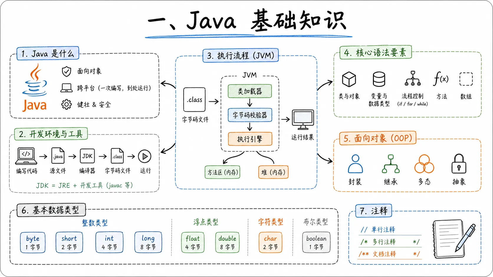

## Java 的语言特点
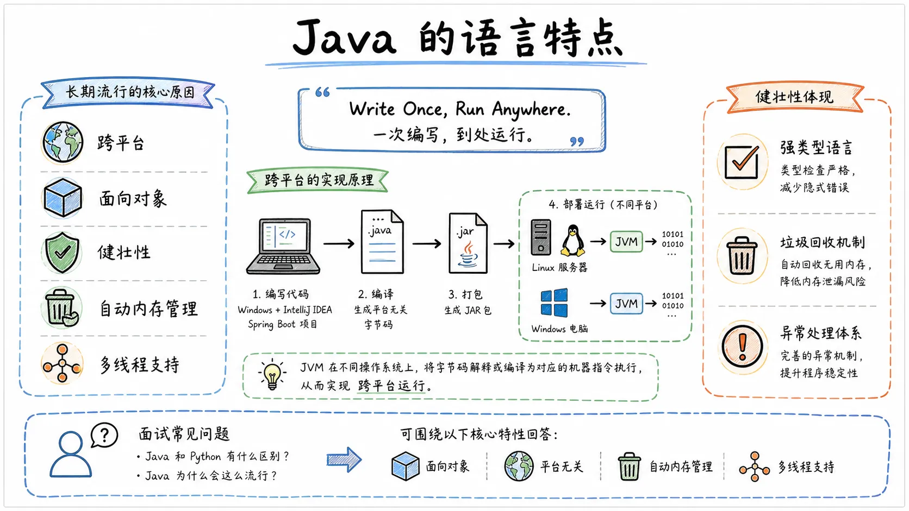

Java 为什么能够长期流行？核心原因在于它具备以下特点：

- **跨平台**
- **面向对象**
- **健壮性**
- **自动内存管理**
- **多线程支持**

Java 最经典的一句话是：

> **Write Once, Run Anywhere.**  
> 一次编写，到处运行。

比如，你在 Windows 电脑上使用 IntelliJ IDEA 编写 Spring Boot 代码，随后将项目打成 JAR 包，部署到 Linux 服务器上，这个 JAR 包依然可以运行。跨平台能力主要依赖 **JVM 对字节码的解释或编译执行**：Java 源代码先被编译为平台无关的字节码，再由不同操作系统上的 JVM 转换为对应的机器指令。

Java 的健壮性则主要体现在：

- 它是一门**强类型语言**；
- 具备**垃圾回收机制**；
- 具备完善的**异常处理体系**。

我在面试时也被问到过：“Java 和 Python 有什么区别？”或者“Java 为什么会这么流行？”回答时，可以围绕 *面向对象、平台无关、自动内存管理和多线程支持* 这些核心特性展开。

## JVM、JRE 和 JDK 的区别
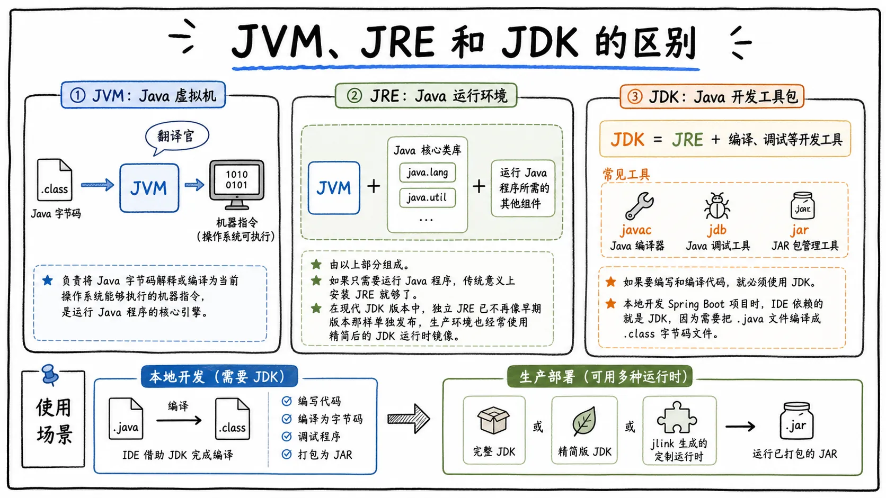

### JVM：Java 虚拟机

**JVM（Java Virtual Machine）**相当于一个“翻译官”，负责把 Java 字节码解释或编译为当前操作系统能够执行的机器指令，是运行 Java 程序的核心引擎。

### JRE：Java 运行环境

**JRE（Java Runtime Environment）**由以下部分组成：

- JVM；
- Java 核心类库，例如 `java.lang`、`java.util` 等；
- 运行 Java 程序所需的其他组件。

如果只需要运行 Java 程序，传统意义上安装 JRE 就够了。不过在现代 JDK 版本中，独立 JRE 已不再像早期版本那样单独发布，生产环境也经常使用精简后的 JDK 运行时镜像。

### JDK：Java 开发工具包

**JDK（Java Development Kit）**可以理解为：

> **JDK = Java 运行环境 + 编译、调试等开发工具**

常见工具包括：

- `javac`：Java 编译器；
- `jdb`：Java 调试工具；
- `jar`：JAR 包管理工具。

如果要编写和编译代码，就必须使用 JDK。本地开发 Spring Boot 项目时，IDE 依赖的就是 JDK，因为需要把 `.java` 文件编译成 `.class` 字节码文件。

在生产环境部署时，服务器上安装完整 JDK、精简版 JDK，或者通过 `jlink` 生成的定制运行时，通常都可以运行打包好的 JAR。

## Java 的基本数据类型
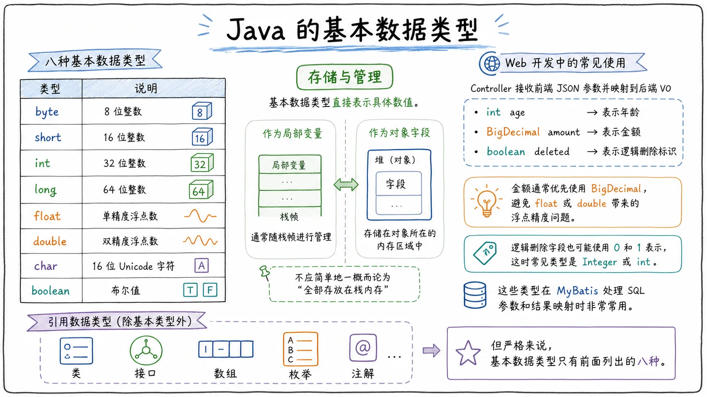

Java 有八种基本数据类型：

| 类型 | 说明 |
|---|---|
| `byte` | 8 位整数 |
| `short` | 16 位整数 |
| `int` | 32 位整数 |
| `long` | 64 位整数 |
| `float` | 单精度浮点数 |
| `double` | 双精度浮点数 |
| `char` | 16 位 Unicode 字符 |
| `boolean` | 布尔值 |

基本数据类型直接表示具体数值。它们作为局部变量时，通常随栈帧进行管理；作为对象字段时，则存储在对象所在的内存区域中，不能简单地一概而论为“全部存放在栈内存”。

在 Web 开发中，Controller 接收前端 JSON 参数并映射到后端 VO 时，经常会看到：

- `int age`：表示年龄；
- `BigDecimal amount`：表示金额；
- `boolean deleted`：表示逻辑删除标识。

其中，金额通常优先使用 `BigDecimal`，避免 `float` 或 `double` 带来的浮点精度问题。逻辑删除字段也可能使用 `0` 和 `1` 表示，这时常见类型是 `Integer` 或 `int`。

这些类型在 MyBatis 处理 SQL 参数和结果映射时非常常用。

除了基本数据类型，Java 还有引用数据类型，包括：

- 类；
- 接口；
- 数组；
- 枚举；
- 注解等。

但严格来说，**基本数据类型只有前面列出的八种**。

## 二、面向对象核心知识
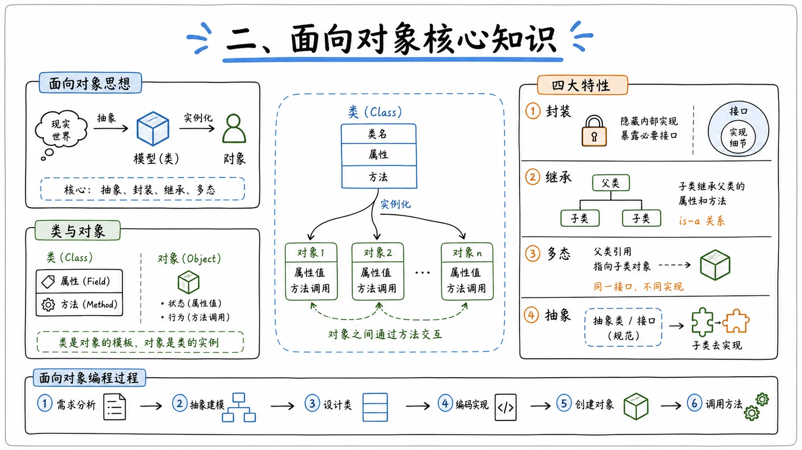

## 封装
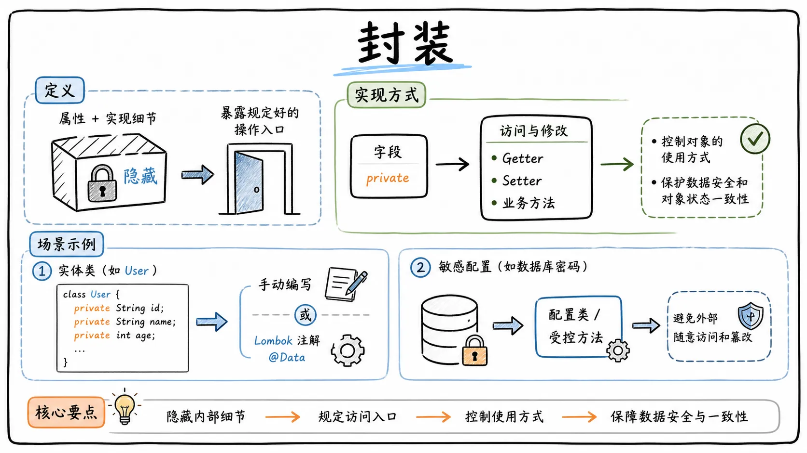

封装简单来说，就是把对象内部的属性和实现细节隐藏起来，只向外部暴露规定好的操作入口。

例如，可以把字段声明为 `private`，再通过 Getter、Setter 或业务方法进行访问和修改。这样能够控制对象的使用方式，保护数据安全和对象状态的一致性。

在 Web 开发中，经常会定义 `User` 实体类，并将字段设置为 `private`。随后可以手动编写 Getter、Setter，也可以使用 Lombok 的 `@Data` 等注解自动生成。

数据库连接密码等敏感配置也通常不会直接公开，而是通过配置类或受控方法读取，避免外部随意访问和篡改。

## 继承
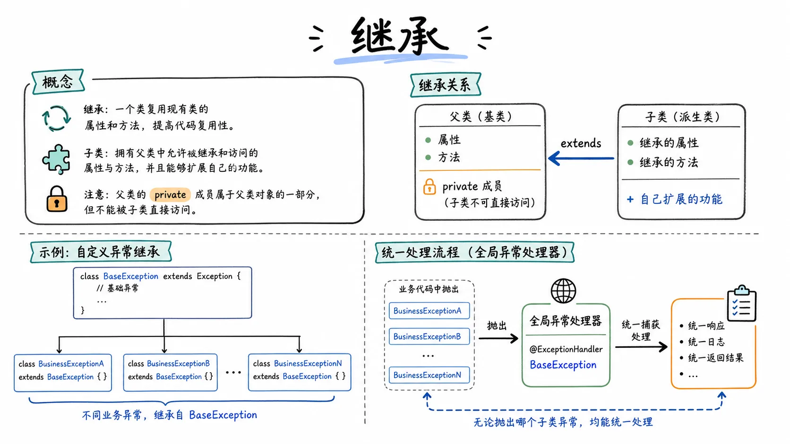

继承是指一个类复用现有类的属性和方法，从而提高代码的复用性。

子类可以拥有父类中允许被继承和访问的属性与方法，并且能够扩展自己的功能。需要注意，父类的 `private` 成员虽然属于父类对象的一部分，但不能被子类直接访问。

例如，在 Web 项目中可以定义一个基础异常：

```java
public class BaseException extends RuntimeException {
    private final String errorCode;
}
```

然后定义业务异常继承它：

```java
public class BusinessException extends BaseException {
    // 业务异常扩展
}
```

在全局异常处理器中，可以直接捕获 `BaseException`。这样，无论抛出的是哪个具体子类异常，都能够进行统一处理。

## 多态
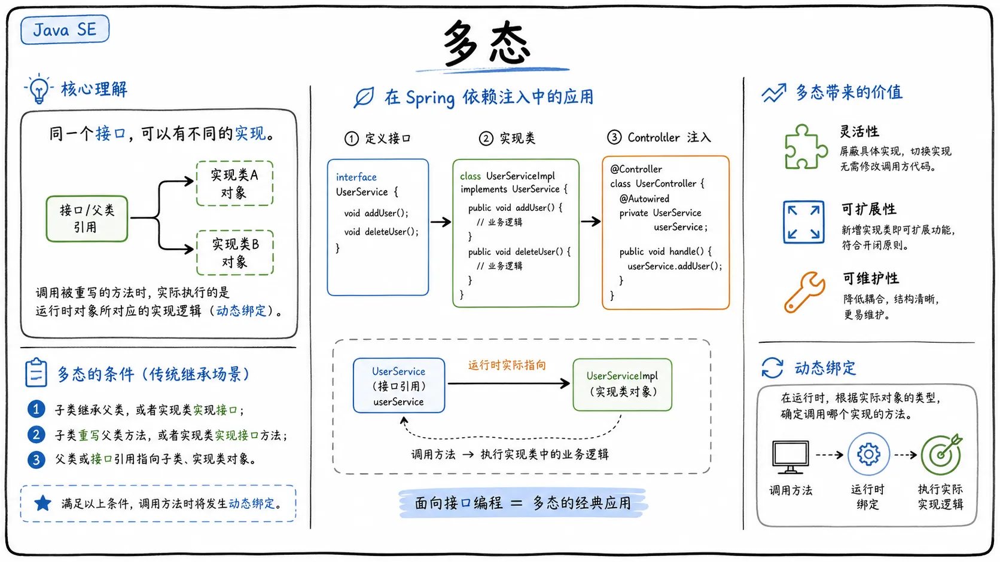

多态最直观的理解是：

> **同一个接口，可以有不同的实现。**

父类或接口类型的引用可以指向子类或实现类对象。调用被重写的方法时，实际执行的是运行时对象所对应的实现逻辑，这就是动态绑定。

在 Spring 的依赖注入中，多态非常常见。比如定义一个接口：

```java
public interface UserService {
    User getUser(Long id);
}
```

再定义实现类：

```java
@Service
public class UserServiceImpl implements UserService {
    @Override
    public User getUser(Long id) {
        return null;
    }
}
```

在 Controller 中注入 `UserService`：

```java
private final UserService userService;
```

此时，`userService` 这个接口引用实际指向的是 `UserServiceImpl` 实例。调用方法时，执行的也是实现类中的业务逻辑。这就是**面向接口编程**，也是多态的经典应用。

传统继承场景下，多态通常包含以下条件：

1. 子类继承父类，或者实现类实现接口；
2. 子类重写父类方法，或者实现类实现接口方法；
3. 父类或接口引用指向子类、实现类对象。

多态主要提高了代码的**灵活性、可扩展性和可维护性**。动态绑定允许程序在运行时确定实际调用哪个实现的方法。

## `this` 关键字
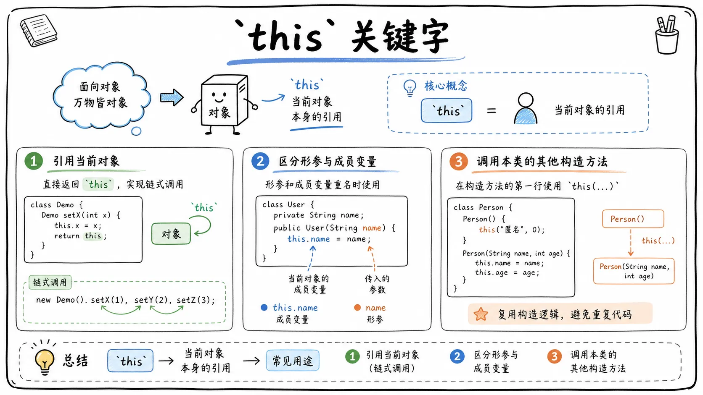

面向对象强调“万物皆对象”，而 `this` 代表的就是**当前对象本身的引用**。

`this` 常见的用法有三种。

### 1. 引用当前对象

可以直接返回 `this`，实现链式调用：

```java
public User setName(String name) {
    this.name = name;
    return this;
}
```

### 2. 区分形参与成员变量

当形参和成员变量重名时，可以使用：

```java
this.name = name;
```

左侧的 `this.name` 是当前对象的成员变量，右侧的 `name` 是传入的参数。

### 3. 调用本类的其他构造方法

可以在构造方法的第一行使用 `this(...)` 调用本类的其他构造方法：

```java
public User(String name) {
    this();
    this.name = name;
}
```

这样能够复用构造逻辑，避免重复代码。

## 重载与重写
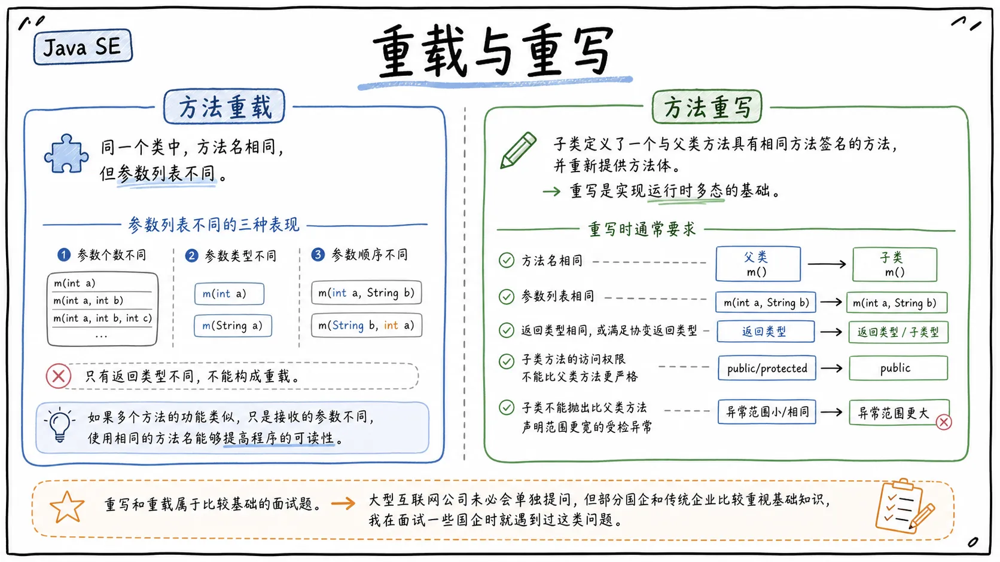

### 方法重载

如果一个类中存在多个**方法名相同，但参数列表不同**的方法，就称为方法重载。

参数列表不同可以表现为：

- 参数个数不同；
- 参数类型不同；
- 参数顺序不同。

只有返回类型不同，不能构成重载。

如果多个方法的功能类似，只是接收的参数不同，使用相同的方法名能够提高程序的可读性。

### 方法重写

如果子类定义了一个与父类方法具有相同方法签名的方法，并重新提供方法体，就称为方法重写。重写是实现运行时多态的基础。

重写时通常要求：

- 方法名相同；
- 参数列表相同；
- 返回类型相同，或者满足协变返回类型；
- 子类方法的访问权限不能比父类方法更严格；
- 子类不能抛出比父类方法声明范围更宽的受检异常。

重写和重载属于比较基础的面试题。大型互联网公司未必会单独提问，但部分国企和传统企业比较重视基础知识，我在面试一些国企时就遇到过这类问题。

## 抽象类与接口
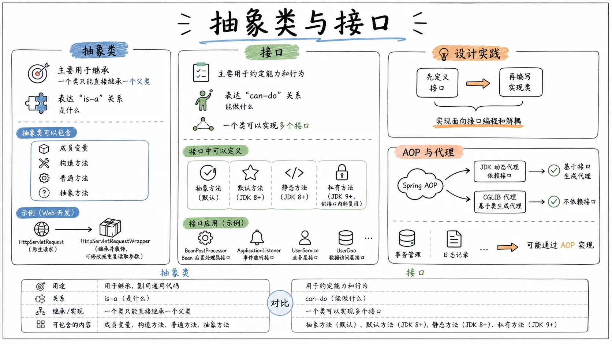

抽象类主要用于继承，一个类只能直接继承一个父类。它表达的通常是 **“is-a”** 关系，也就是“是什么”。

抽象类中可以包含：

- 成员变量；
- 构造方法；
- 普通方法；
- 抽象方法。

接口主要用于约定能力和行为，表达的通常是 **“can-do”** 关系，也就是“能做什么”。

一个类可以实现多个接口。JDK 8 之后，接口中还可以定义：

- 默认方法；
- 静态方法。

JDK 9 之后，接口还可以包含私有方法，用于复用接口内部逻辑。

在 Web 开发中，抽象类的一个例子是 `HttpServletRequestWrapper`。可以继承它，对原生 `HttpServletRequest` 进行装饰，例如修改或重复读取请求参数。

接口的应用则遍地都是，例如：

- `BeanPostProcessor`：Bean 后置处理器接口；
- `ApplicationListener`：事件监听接口；
- `UserService`：业务层接口；
- `UserDao`：数据访问层接口。

之所以常常先定义接口、再编写实现类，是为了实现面向接口编程和解耦。Spring AOP 既可以使用 **JDK 动态代理**，也可以使用 **CGLIB 代理**：JDK 动态代理依赖接口，而 CGLIB 可以基于类生成代理。事务管理、日志记录等功能都可能通过 AOP 实现。

## 深拷贝与浅拷贝
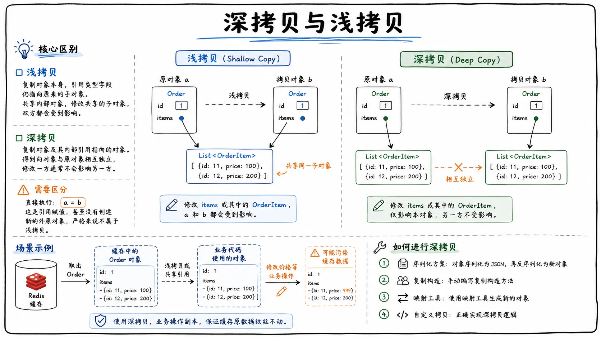

### 浅拷贝

浅拷贝会复制对象本身，但对象内部的引用类型字段通常仍然指向原来的子对象。

因此，拷贝后的对象与原对象可能共享内部对象。修改共享的子对象时，双方都会受到影响。

需要区分的是，直接执行：

```java
Order copy = original;
```

这只是**引用赋值**，甚至没有创建一个新的外层对象，严格来说不属于浅拷贝。

### 深拷贝

深拷贝会把对象内部的数据，包括引用所指向的对象，也重新复制一份。深拷贝得到的对象与原对象相互独立，修改一方通常不会影响另一方。

例如，从 Redis 缓存中取出一个 `Order` 对象，其中包含：

```java
List<OrderItem> orderItems;
```

如果业务代码与缓存数据共享同一对象引用，或者只做了浅拷贝，那么修改订单项、价格等内容时，就可能污染原始缓存数据。

为了安全，可以进行深拷贝，例如：

- 将对象序列化成 JSON，再反序列化为新对象；
- 手动编写复制构造方法；
- 使用映射工具生成新的对象；
- 正确实现深拷贝逻辑。

这样可以让业务逻辑操作副本，保证缓存原数据纹丝不动。

## `hashCode()` 与 `equals()`
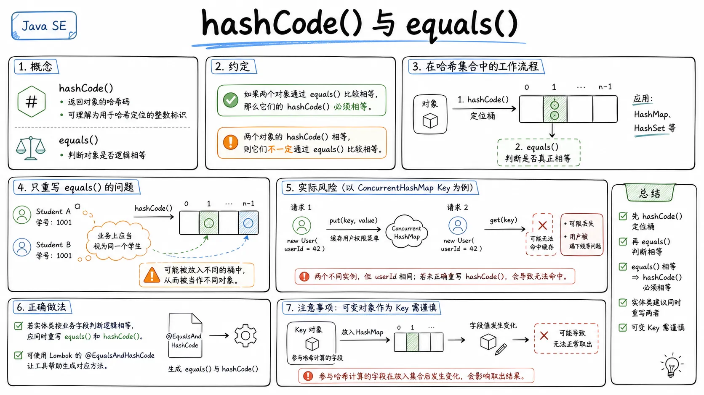

`hashCode()` 方法用于返回对象的哈希码，可以粗暴地理解为对象用于哈希定位的一个整数标识。它主要应用在哈希表结构中，用于快速确定对象所在的桶。

Java 对 `equals()` 与 `hashCode()` 的约定是：

> 如果两个对象通过 `equals()` 比较相等，那么它们的 `hashCode()` 必须相等。  
> 两个对象的 `hashCode()` 相等，则它们不一定通过 `equals()` 比较相等。

`HashMap`、`HashSet` 等哈希集合通常会先利用 `hashCode()` 定位桶，再通过 `equals()` 判断对象是否真正相等。

如果只重写 `equals()`，却不重写 `hashCode()`，逻辑上相等的两个对象可能产生不同的哈希码。例如，两个 `Student` 对象的学号相同，业务上应当视为同一个学生，但它们可能被放入不同的桶中，从而被当作不同对象。

在开发中，假设使用 `User` 对象作为 `ConcurrentHashMap` 的 Key，缓存用户权限菜单。两个请求分别创建了不同的 `User` 实例，但它们的 `userId` 相同。如果没有正确重写 `hashCode()`，后续调用 `get()` 时可能无法命中缓存，最终导致权限丢失，甚至出现用户被踢下线等问题。

因此，如果实体类按照业务字段判断逻辑相等，就应同时重写 `equals()` 和 `hashCode()`。也可以使用 Lombok 的：

```java
@EqualsAndHashCode
```

让工具帮助生成对应方法。不过，使用可变对象作为 `HashMap` 的 Key 仍然需要谨慎：如果参与哈希计算的字段在放入集合后发生变化，同样可能导致无法正常取出。

## 三、Java 异常处理
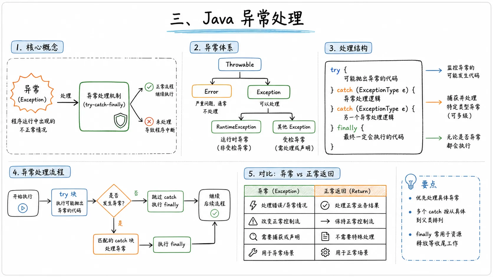

## `Throwable` 体系
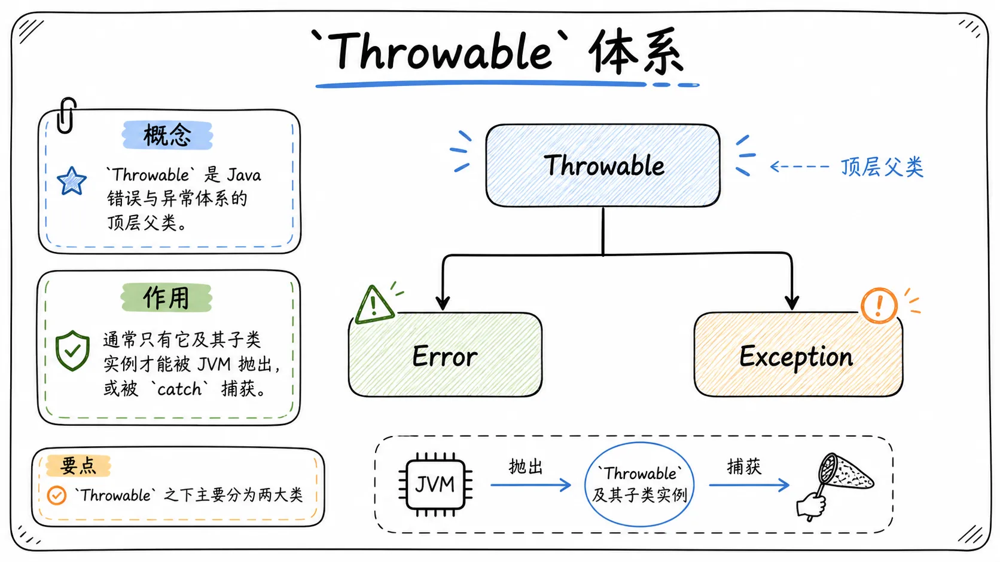

`Throwable` 是 Java 错误与异常体系的顶层父类。通常只有它及其子类实例才能被 JVM 抛出，或被 `catch` 捕获。

`Throwable` 下面主要分为两大类：

1. `Error`
2. `Exception`

## `Error`：系统级严重错误
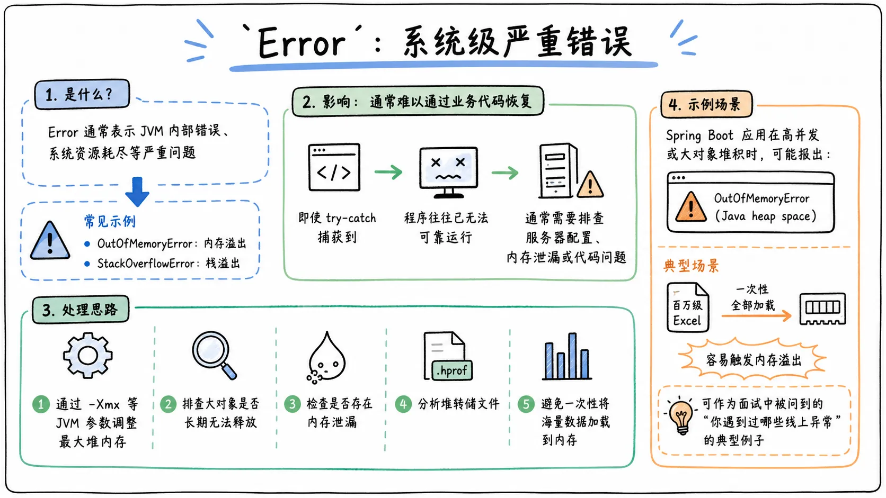

`Error` 通常表示 JVM 内部错误、系统资源耗尽等严重问题，例如：

- `OutOfMemoryError`：内存溢出；
- `StackOverflowError`：栈溢出。

这类问题通常不适合依赖普通业务代码进行恢复。即使通过 `try-catch` 捕获，程序也往往已经无法可靠运行，通常需要排查服务器配置、内存泄漏或代码问题。

例如，Spring Boot 应用在高并发或大对象堆积时，可能报出：

```text
java.lang.OutOfMemoryError: Java heap space
```

这时可以从以下方向处理：

- 通过 `-Xmx` 等 JVM 参数调整最大堆内存；
- 排查大对象是否长期无法释放；
- 检查是否存在内存泄漏；
- 分析堆转储文件；
- 避免一次性将海量数据加载到内存。

比如导出百万级 Excel 时，如果一次性把全部数据加载到内存，就很容易触发内存溢出。这也是面试官询问“你遇到过哪些线上异常”时可以举的例子。

## `Exception`：程序可以处理的异常
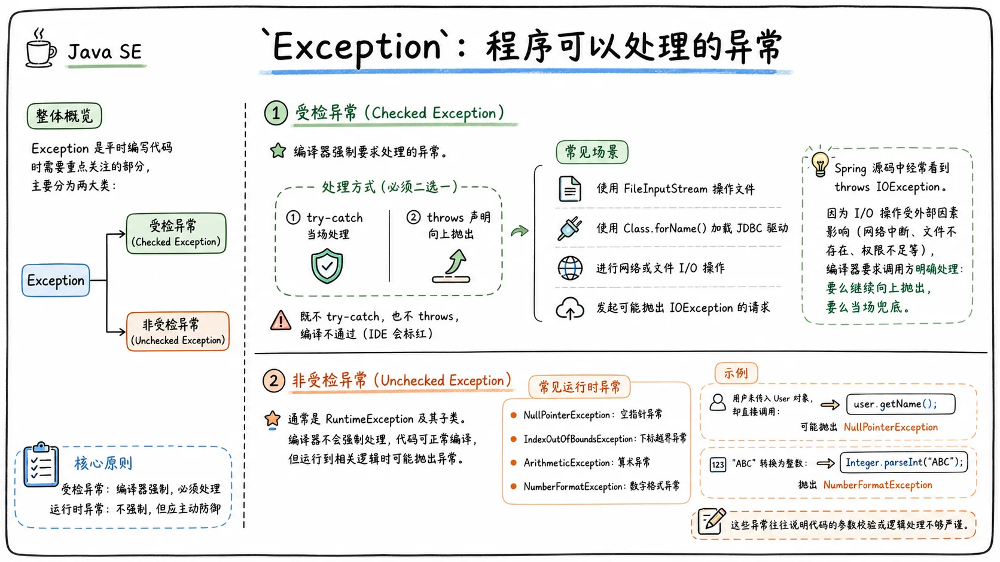

`Exception` 是平时编写代码时需要重点关注的部分，主要可以分为：

- **受检异常，即 Checked Exception**
- **非受检异常，即 Unchecked Exception**

### 受检异常

受检异常是编译器强制要求处理的异常。如果既不使用 `try-catch`，也不通过 `throws` 声明，代码就无法通过编译，IDE 通常也会直接标红。

常见场景包括：

- 使用 `FileInputStream` 操作文件；
- 使用 `Class.forName()` 加载 JDBC 驱动；
- 进行网络或文件 I/O 操作；
- 发起可能抛出 `IOException` 的请求。

Spring 源码中经常可以看到 `throws IOException`，因为 I/O 操作可能受到网络中断、文件不存在、权限不足等外部因素影响。编译器要求调用方明确处理：要么继续向上抛出，要么当场兜底。

### 运行时异常

运行时异常通常是 `RuntimeException` 及其子类。编译器不会强制处理，代码可以正常编译，但运行到相关逻辑时可能抛出异常。

常见运行时异常包括：

- `NullPointerException`：空指针异常；
- `IndexOutOfBoundsException`：下标越界异常；
- `ArithmeticException`：算术异常；
- `NumberFormatException`：数字格式异常。

例如，用户没有传入 `User` 对象，代码却直接调用：

```java
user.getName();
```

这时就可能抛出 `NullPointerException`。

再比如：

```java
Integer.parseInt("ABC");
```

由于 `"ABC"` 无法转换为整数，会抛出 `NumberFormatException`。

这些异常往往说明代码的参数校验或逻辑处理不够严谨。

## 异常处理方式
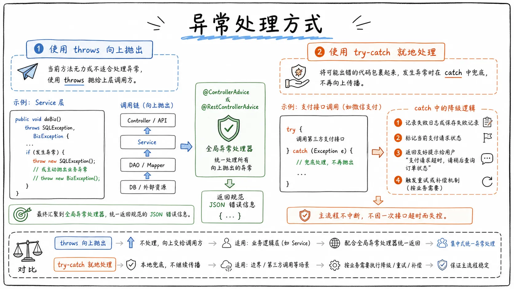

### 使用 `throws` 向上抛出

如果当前方法没有能力或不适合处理异常，可以在方法签名中使用 `throws`，把异常交给上层调用方。

例如，Service 层主要负责业务逻辑，遇到 `SQLException` 或自定义业务异常时，可以继续向上抛出；也可以主动抛出：

```java
throw new BusinessException(errorCode);
```

随后配合 `@ControllerAdvice` 或 `@RestControllerAdvice` 编写全局异常处理器。这样，所有 Service 层抛出的异常最终都汇聚到全局异常处理器，再统一向前端返回格式规范的 JSON 错误信息。

这就是**集中式统一异常处理**，基本属于 Spring Boot 项目的标配。

### 使用 `try-catch` 就地处理

`try-catch` 是把可能出错的代码包起来。如果发生异常，就进入 `catch` 代码块，由当前逻辑进行兜底，使异常不再继续向上传播。

例如，调用微信支付等第三方接口时，网络超时可能抛出异常。不能直接把底层超时异常原样甩给用户，因此可以使用 `try-catch` 包裹调用代码，并在 `catch` 中执行降级逻辑：

1. 记录失败日志或保存失败记录；
2. 标记当前支付请求状态；
3. 返回“支付请求超时，请稍后查询订单状态”等提示；
4. 根据业务需要触发重试或补偿机制。

这样，主流程不会因为一次接口超时而完全失控。

## 四、String、StringBuilder 与 StringBuffer
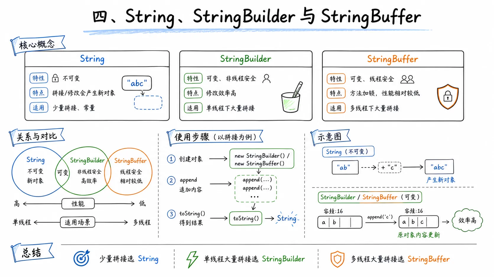

## String：不可变字符串
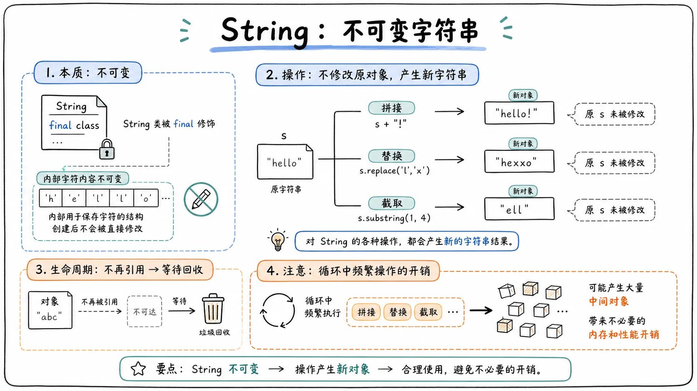

`String` 是不可变字符串。`String` 类本身被 `final` 修饰，其内部用于保存字符内容的结构也不会在字符串创建后被直接修改。

对 `String` 进行拼接、替换、截取等操作时，并不是在原字符串上修改，而是产生新的字符串结果。原对象如果不再被引用，就会等待垃圾回收。

因此，在循环中频繁执行：

```java
str += value;
```

可能产生大量中间对象，带来不必要的内存和性能开销。

## StringBuilder：可变、线程不安全
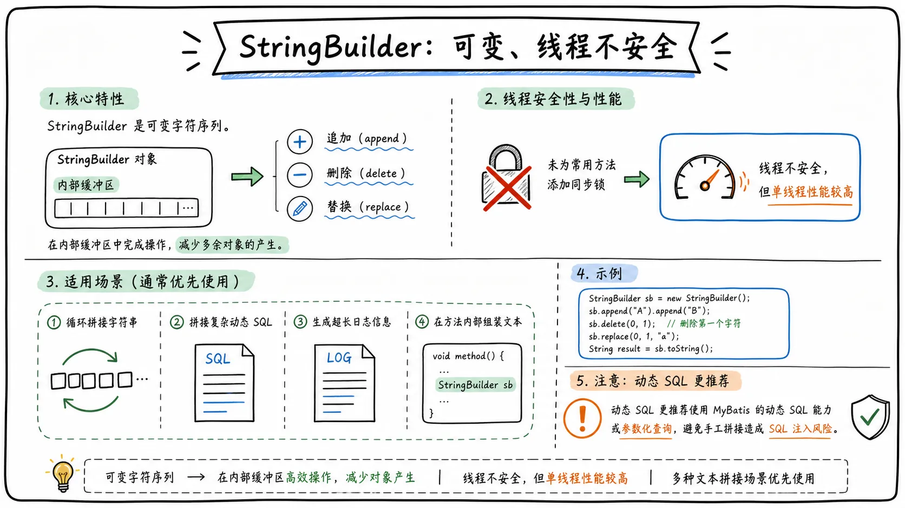

`StringBuilder` 是可变字符序列。它会在内部缓冲区中完成追加、删除、替换等操作，减少多余对象的产生。

它没有为常用方法添加同步锁，因此**线程不安全，但单线程性能较高**。

在以下场景中，通常优先使用 `StringBuilder`：

- 循环拼接字符串；
- 拼接复杂动态 SQL；
- 生成超长日志信息；
- 在方法内部组装文本。

例如：

```java
StringBuilder builder = new StringBuilder();
builder.append("SELECT * FROM user WHERE 1 = 1");
builder.append(" AND status = ?");
```

不过，动态 SQL 更推荐使用 MyBatis 的动态 SQL 能力或参数化查询，避免手工拼接造成 SQL 注入风险。

## StringBuffer：可变、线程安全
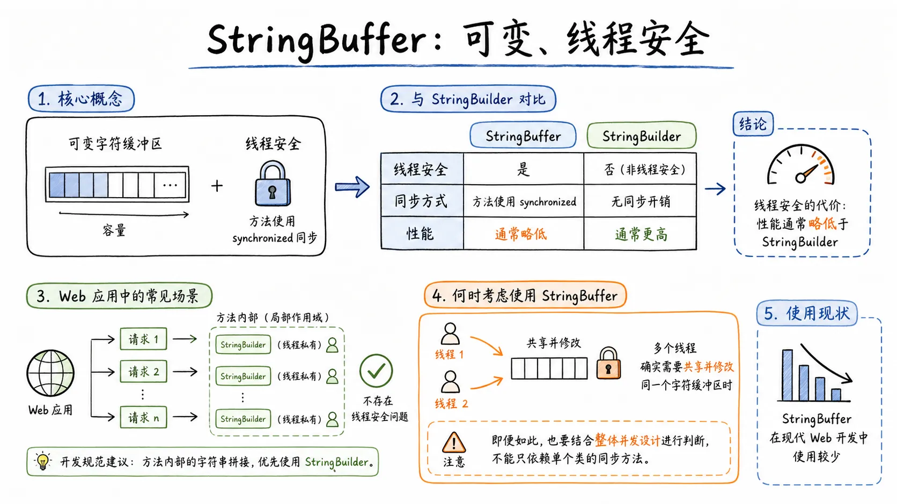

`StringBuffer` 与 `StringBuilder` 用法类似，但它的许多方法使用了 `synchronized` 进行同步，因此线程安全，性能通常略低于 `StringBuilder`。

Web 应用虽然会并发处理多个请求，但方法内部创建的局部 `StringBuilder` 通常是线程私有的，不存在线程安全问题。因此，开发规范一般会建议：

> 方法内部的字符串拼接，优先使用 `StringBuilder`。

`StringBuffer` 在现代 Web 开发中使用较少。只有多个线程确实需要共享并修改同一个字符缓冲区时，才可能考虑使用它。不过，即便如此，也要结合整体并发设计进行判断，而不能只依赖单个类的同步方法。

## 五、Java 进阶语法与机制
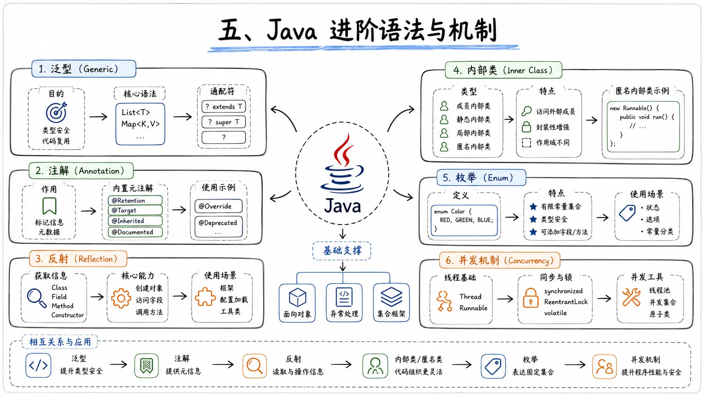

## 序列化与反序列化
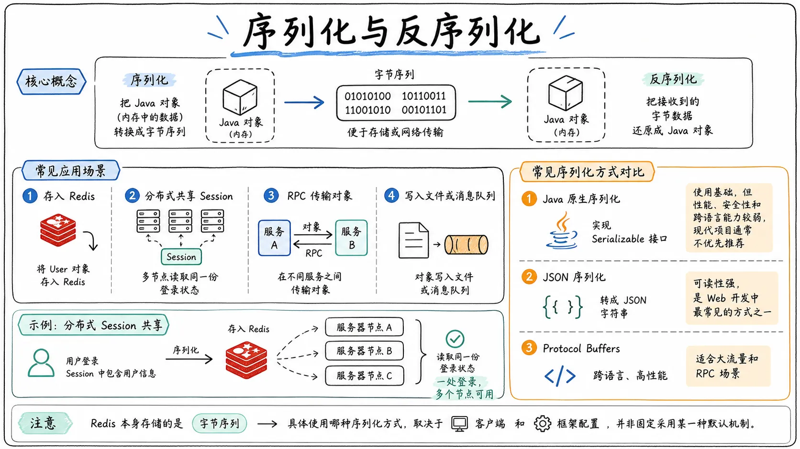

序列化是把 Java 对象，也就是内存中的对象数据，转换成便于存储或网络传输的字节序列。

反序列化则是把接收到的字节数据重新还原成 Java 对象。

在 Java 开发中，常见场景包括：

- 将 `User` 对象存入 Redis；
- 在分布式环境中共享 Session；
- 通过 RPC 在不同服务之间传输对象；
- 将对象写入文件或消息队列。

例如，用户登录后的 Session 中包含用户信息。把 Session 序列化后存入 Redis，不同服务器节点就可以读取同一份登录状态，从而实现分布式会话共享，也就是“一处登录，多个节点可用”。

常见序列化方式包括：

- **Java 原生序列化**：实现 `Serializable` 接口，使用基础，但性能、安全性和跨语言能力较弱，现代项目通常不优先推荐；
- **JSON 序列化**：转成 JSON 字符串，可读性强，是 Web 开发中最常见的方式之一；
- **Protocol Buffers**：跨语言、高性能，适合大流量和 RPC 场景。

需要注意，Redis 本身存储的是字节序列，具体使用哪种序列化方式，取决于客户端和框架配置，并非固定采用某一种默认机制。

## 泛型
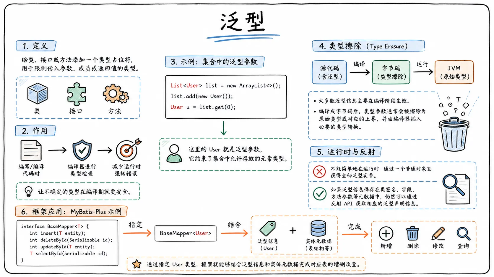

泛型是给类、接口或方法添加一个类型占位符，用于限制传入参数、成员或返回值的类型。

泛型可以让编译器在编写和编译代码时进行类型检查，减少运行时强制类型转换错误。

例如：

```java
List<User> users = new ArrayList<>();
```

这里的 `User` 就是泛型参数，它约束了集合中允许存放的元素类型。

Java 泛型的重要特性之一是**类型擦除**。大多数泛型信息主要在编译阶段生效，编译成字节码后，类型参数通常会被擦除为原始类型或对应的上界，并由编译器插入必要的类型转换。

因此，不能简单地在运行时通过一个普通对象直接获得全部泛型实参。不过，如果泛型信息保存在类签名、字段、方法参数等元数据中，仍然可以通过反射 API 获取相应的泛型声明信息。

MyBatis-Plus 中的 `BaseMapper<T>` 就使用了泛型。例如：

```java
public interface UserMapper extends BaseMapper<User> {
}
```

通过指定 `User` 类型，框架就能够结合泛型信息和实体元数据完成对应表的增删改查。

## 反射
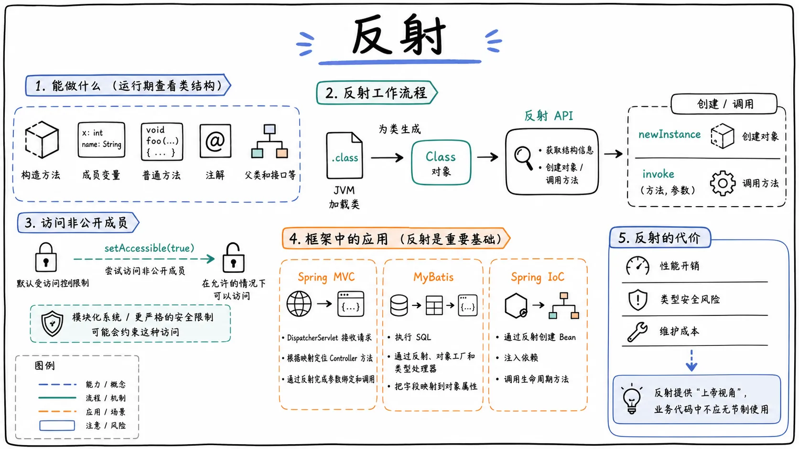

反射允许 Java 程序在运行期间检查类的结构，包括：

- 构造方法；
- 成员变量；
- 普通方法；
- 注解；
- 父类和接口等。

在满足访问控制与运行环境允许的情况下，反射还可以通过 `setAccessible(true)` 等方式尝试访问非公开成员。不过在模块化系统和更严格的安全限制下，这种访问可能受到约束。

JVM 加载类后，会为其生成对应的 `Class` 对象。反射 API 可以从 `Class` 对象中获取类的结构信息，并通过 `newInstance`、`invoke` 等机制创建对象或调用方法。

反射是很多 Java 框架的重要基础，例如：

- Spring MVC 的 `DispatcherServlet` 接收到请求后，会根据映射关系定位 Controller 方法，并通过反射完成参数绑定和方法调用；
- MyBatis 执行 SQL 后，会通过反射、对象工厂和类型处理器等机制，把数据库字段映射到 Java 对象属性；
- Spring IoC 会通过反射创建 Bean、注入依赖并调用生命周期方法。

反射相当于给代码提供了一个“上帝视角”，但也会带来一定的性能开销、类型安全风险和维护成本，因此业务代码中不应无节制使用。

## Socket 与 RPC
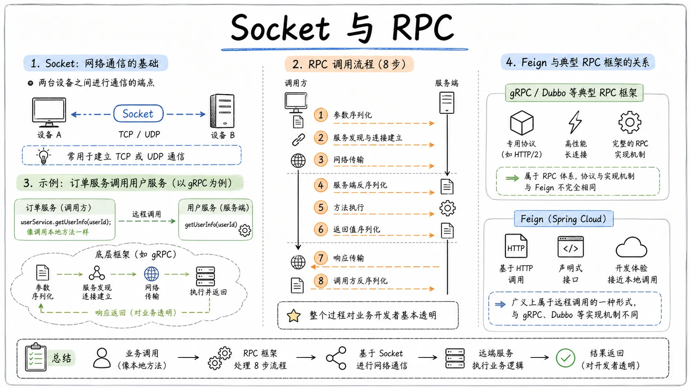

Socket 是网络通信的基础，可以理解为两台设备之间进行通信的端点，常用于建立 TCP 或 UDP 通信。

RPC，也就是**远程过程调用**，让程序能够像调用本地方法一样调用另一台服务器上的方法。开发者只需要调用某个 Service 方法，底层框架会完成一整套“脏活累活”：

1. 参数序列化；
2. 服务发现与连接建立；
3. 网络传输；
4. 服务端反序列化；
5. 方法执行；
6. 返回值序列化；
7. 响应传输；
8. 调用方反序列化。

例如，在微服务架构中，订单服务需要调用用户服务。使用 gRPC 等 RPC 框架后，订单服务只需要调用类似：

```java
userService.getUser(userId);
```

底层框架会把参数序列化，通过 Netty、Socket 等网络通信机制发送给用户服务。用户服务反序列化参数并执行方法，再把结果序列化后返回。整个过程对业务开发者基本透明。

Feign 也能提供类似本地接口调用的开发体验。在 Spring Cloud 中，它通常属于声明式 HTTP 客户端，底层一般通过 HTTP 调用远程服务，广义上也可以被视为远程调用的一种形式，但与 gRPC、Dubbo 等典型 RPC 框架的协议和实现机制并不完全相同。

## Stream 流
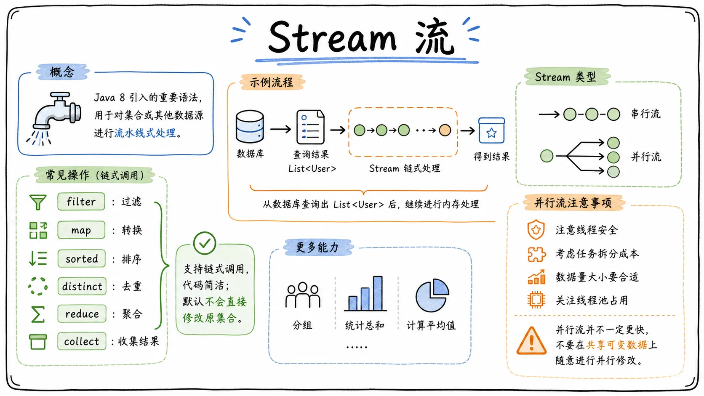

Stream 是 Java 8 引入的重要语法，用于对集合或其他数据源进行流水线式处理。

常见操作包括：

- `filter`：过滤；
- `map`：转换；
- `sorted`：排序；
- `distinct`：去重；
- `reduce`：聚合；
- `collect`：收集结果。

Stream 支持链式调用，代码通常比较简洁，而且默认不会直接修改原集合。

例如，从数据库查询出一个 `List<User>` 后，可以继续进行内存处理：

```java
List<String> names = users.stream()
        .filter(User::isEnabled)
        .map(User::getName)
        .collect(Collectors.toList());
```

Stream 还可以完成分组、统计总和、计算平均值等操作。

Stream 分为：

- **串行流**
- **并行流**

并行流可以利用多核 CPU 处理部分适合拆分的大数据任务，但必须注意线程安全、任务拆分成本、数据量大小和线程池占用问题。并不是用了并行流就一定更快，也不要在共享可变数据上随意进行并行修改。

## 六、Java I/O 流
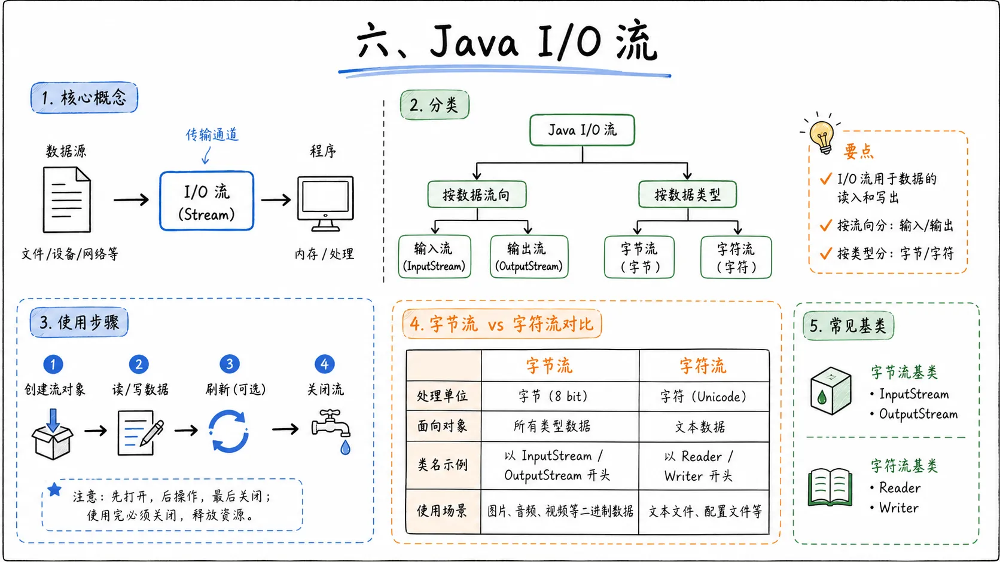

## 按数据流方向划分
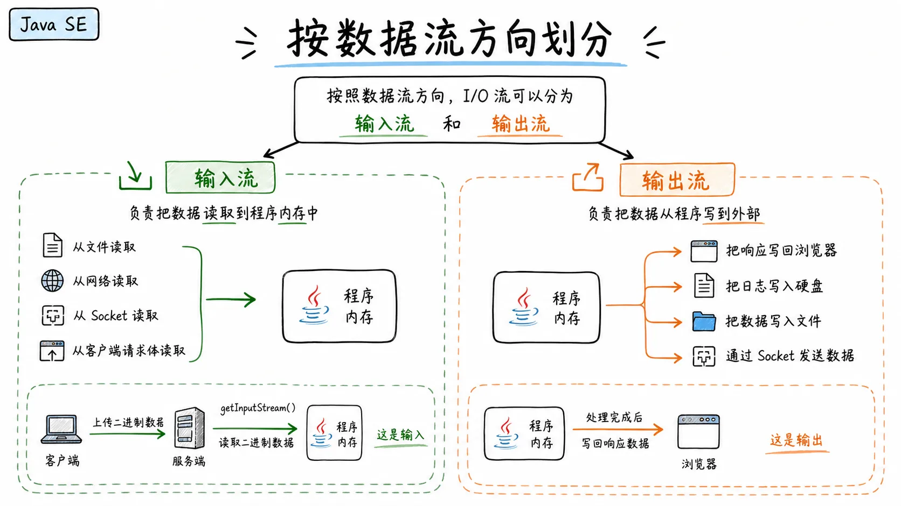

按照数据流方向，I/O 流可以分为输入流和输出流。

### 输入流

输入流负责把数据读取到程序内存中，例如：

- 从文件读取；
- 从网络读取；
- 从 Socket 读取；
- 从客户端请求体读取。

用户上传图片时，服务端可以通过 `getInputStream()` 读取客户端发送的二进制数据，这就是输入。

### 输出流

输出流负责把数据从程序写到外部，例如：

- 把响应写回浏览器；
- 把日志写入硬盘；
- 把数据写入文件；
- 通过 Socket 发送数据。

处理完成后，可以通过：

```java
response.getOutputStream();
```

把响应数据写回浏览器，这就是输出。

## 按处理数据的单位划分
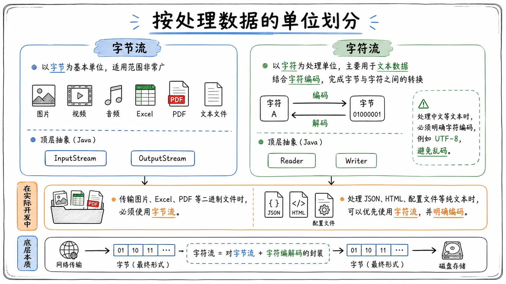

### 字节流

字节流以字节为基本单位，适用范围非常广，可以处理：

- 图片；
- 视频；
- 音频；
- Excel；
- PDF；
- 文本文件。

在 Java 中，字节输入流和输出流的顶层抽象分别是：

- `InputStream`
- `OutputStream`

### 字符流

字符流以字符为处理单位，主要用于文本数据，并结合字符编码完成字节与字符之间的转换。

Java 中常见的字符流顶层抽象包括：

- `Reader`
- `Writer`

处理中文等文本时，必须明确字符编码，例如 UTF-8，避免乱码。

在实际开发中：

- 传输图片、Excel、PDF 等二进制文件时，必须使用字节流；
- 处理 JSON、HTML、配置文件等纯文本时，可以优先使用字符流，并明确编码。

需要注意，网络传输和磁盘存储的底层最终仍是字节。字符流只是对字节流和字符编解码过程进行了封装。

## 按功能角色划分
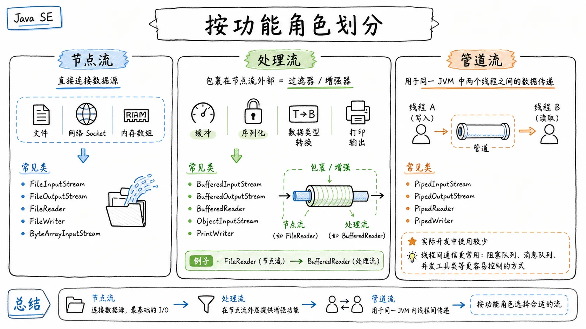

### 节点流

节点流直接连接数据源，例如：

- 文件；
- 网络 Socket；
- 内存数组。

常见节点流包括：

- `FileInputStream`
- `FileOutputStream`
- `FileReader`
- `FileWriter`
- `ByteArrayInputStream`

### 处理流

处理流包裹在节点流外部，可以理解为过滤器或增强器，用于提升性能或提供更便利的功能，例如：

- 缓冲；
- 序列化；
- 数据类型转换；
- 打印输出。

常见处理流包括：

- `BufferedInputStream`
- `BufferedOutputStream`
- `BufferedReader`
- `ObjectInputStream`
- `PrintWriter`

例如：

```java
BufferedReader reader =
        new BufferedReader(new FileReader("data.txt"));
```

这里的 `FileReader` 是节点流，`BufferedReader` 是处理流。

### 管道流

管道流用于同一个 JVM 中两个线程之间的数据传递。一个线程向管道写入数据，另一个线程从管道读取数据。

常见类包括：

- `PipedInputStream`
- `PipedOutputStream`
- `PipedReader`
- `PipedWriter`

不过在实际开发中，管道流使用得比较少。线程间通信通常还可以选择阻塞队列、消息队列、并发工具类等更容易控制的方式。

## 七、BIO、NIO 与 AIO
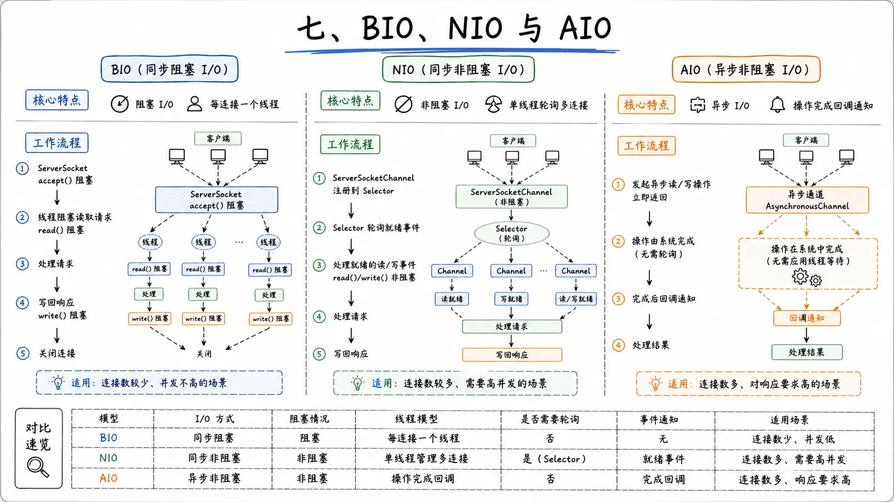

## BIO：同步阻塞
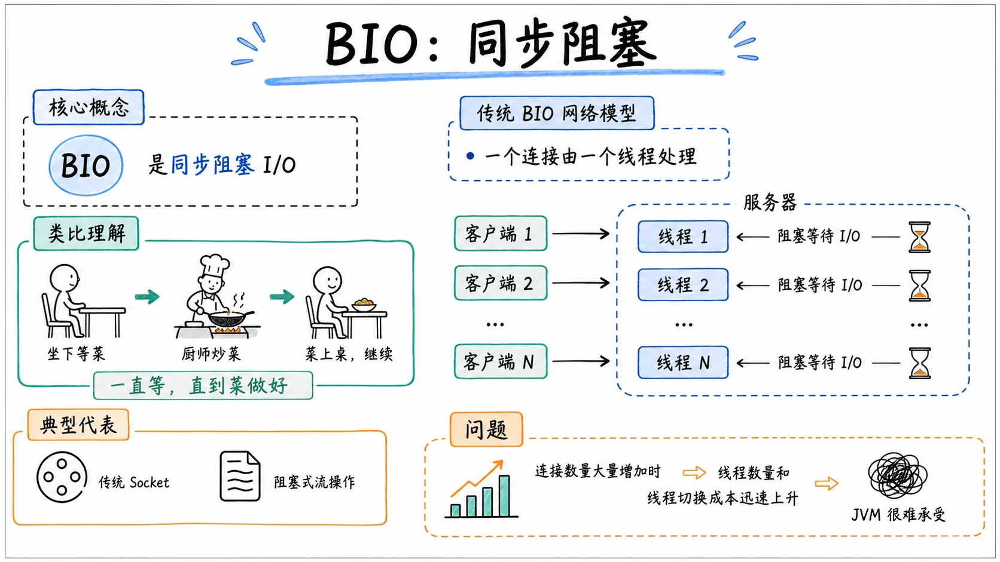

BIO 是**同步阻塞 I/O**。

可以把它理解为去店里吃饭：你坐在那里一直等，直到厨师把菜炒好，菜上桌后才能继续。

传统 BIO 网络模型通常是一个连接由一个线程处理。当连接数量大量增加时，线程数量和线程切换成本也会迅速上升，JVM 很难承受。

传统 `Socket` 与阻塞式流操作就是典型代表。

## NIO：同步非阻塞
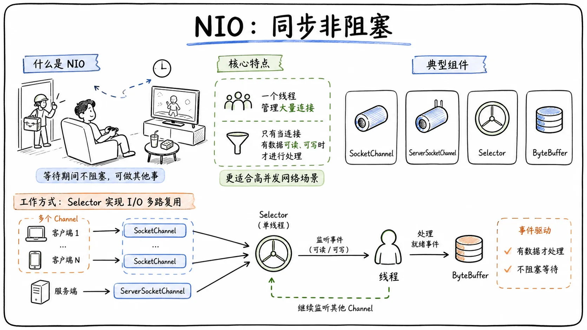

NIO 通常指**同步非阻塞 I/O**。可以把它理解为在家点外卖：等待外卖期间，你还可以看电视、玩游戏，不需要一直原地干等。

它的特点是一个线程可以管理大量连接。只有当连接真正有数据可读、可写时，程序才进行处理，因此更适合高并发网络场景。

Java NIO 中的典型组件包括：

- `SocketChannel`
- `ServerSocketChannel`
- `Selector`
- `ByteBuffer`

`Selector` 可以实现 I/O 多路复用，让一个线程监听多个 Channel 的事件。

## AIO：异步非阻塞
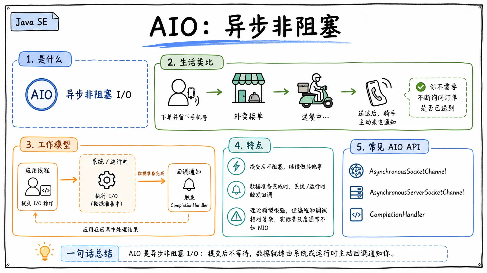

AIO 是**异步非阻塞 I/O**。

可以把它理解为点外卖后留下手机号：外卖送到时，骑手主动打电话通知你，你不需要不断询问订单是否已经送到。

AIO 的特点是提交操作后，由系统或运行时在数据准备完成时触发回调。理论模型很强，但编程和调试相对复杂，实际普及度通常不如 NIO。

Java 中常见的 AIO API 包括：

- `AsynchronousSocketChannel`
- `AsynchronousServerSocketChannel`
- `CompletionHandler`

## Tomcat 与 I/O 模型
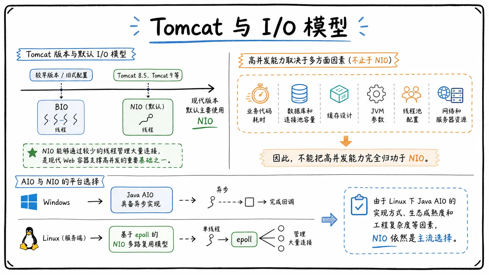

现代 Tomcat 版本通常默认采用 NIO Connector。较早版本和旧式配置中更常见 BIO，而 Tomcat 8.5、Tomcat 9 等版本默认主要使用 NIO。

NIO 能够通过较少的线程管理大量连接，是现代 Web 容器支撑高并发的重要基础之一。不过，Spring Boot 应用能否支撑高并发，还取决于：

- 业务代码耗时；
- 数据库和连接池容量；
- 缓存设计；
- JVM 参数；
- 线程池配置；
- 网络和服务器资源。

因此，不能把高并发能力完全归功于 NIO。

在 Windows 上，Java AIO 具备相应的异步实现；而在 Linux 服务端，高性能网络框架和服务器更常采用基于 `epoll` 的 NIO 多路复用模型。由于 Linux 下 Java AIO 的实现方式、生态成熟度和工程复杂度等因素，NIO 依然是主流选择。

## 八、复习重点
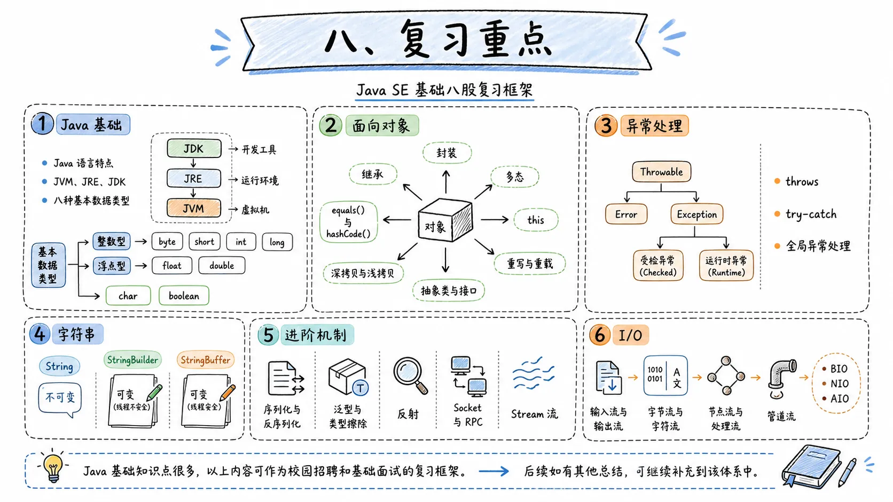

这次总结的 Java SE 基础八股主要包括：

1. **Java 基础**
   - Java 语言特点
   - JVM、JRE、JDK
   - 八种基本数据类型

2. **面向对象**
   - 封装
   - 继承
   - 多态
   - `this`
   - 重写与重载
   - 抽象类与接口
   - 深拷贝与浅拷贝
   - `equals()` 与 `hashCode()`

3. **异常处理**
   - `Throwable`
   - `Error`
   - 受检异常与运行时异常
   - `throws`
   - `try-catch`
   - 全局异常处理

4. **字符串**
   - `String`
   - `StringBuilder`
   - `StringBuffer`

5. **进阶机制**
   - 序列化与反序列化
   - 泛型与类型擦除
   - 反射
   - Socket 与 RPC
   - Stream 流

6. **I/O**
   - 输入流与输出流
   - 字节流与字符流
   - 节点流与处理流
   - 管道流
   - BIO、NIO 与 AIO

> Java 基础的知识点很多，这些内容可以作为校园招聘和基础面试的复习框架。后续如果还有其他总结，也可以继续补充到这个体系中。
