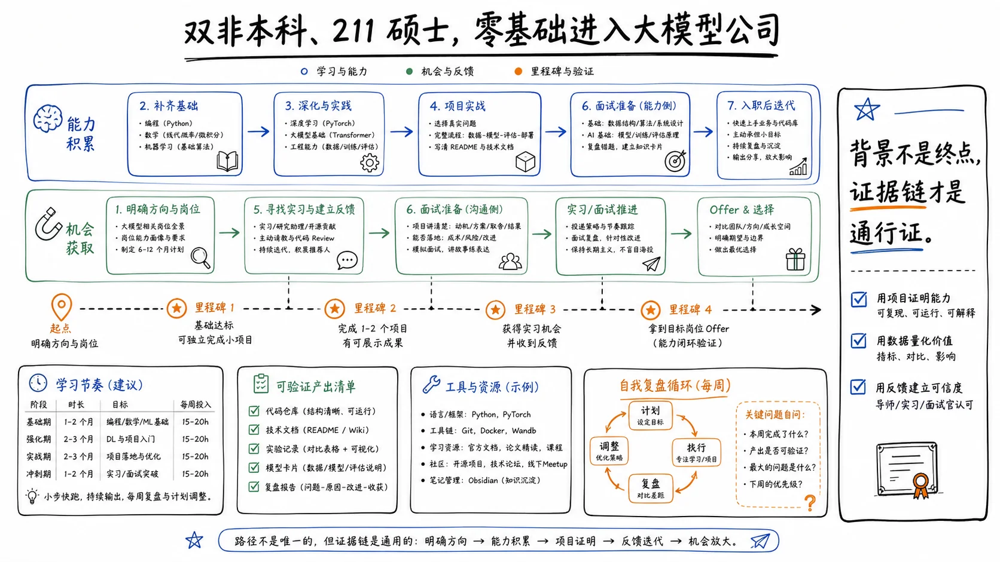

> 本页为「求职面经合集」9 篇的合订本；原文章链接会自动跳转到本页。

## 字节内容消费前端一面：主线是流式 LLM + React 实时系统，不是切图题

还在背「居中方案」的人，撞上内容消费 + LLM 落地岗，会很懵。这篇是大二软工冲字节前端实习的一面复盘：部门「内容消费」，约 60 分钟，结果挂了。复盘质量高——题按业务主线串，不是散装八股。2025-2026 前端实习很有参考价值。挂掉事实保留着，比只晒 offer 的面经更可信。

## 这场面到底在考什么

作者归纳四块，应串成一条系统叙事：

1. **LLM / 流式交互（最核心）**：一字一字出来怎么做、SSE vs Fetch Stream vs WebSocket
2. **React 深水区**：Fiber、可中断渲染、Hooks 规则、Zustand
3. **浏览器与性能**：渲染管线、transform 动画、DOM 构建阻塞
4. **手写**：防抖节流、深拷贝、事件循环/闭包输出题

挂的人往往还在背「居中方案」，而岗位已经按内容消费 + 大模型落地在招。

## 流式交互：能带走的判断

| 点 | 判断 |
|----|------|
| 流式展示 | `fetch` + `ReadableStream` + `TextDecoder`；UI 不要每字符 setState，用缓冲 + rAF/定时批量刷 |
| SSE 重连 | 浏览器 EventSource 对标准 SSE 有自动重连；业务协议要自己约定 |
| 为何偏 Fetch Stream | SSE 偏 GET，长 prompt/history/tools 不适合塞 URL；Fetch 更灵活（含 POST） |
| SSE vs WS | SSE：单向、轻、好重连，适合日志/通知/LLM 输出；WS：双向，适合强互动 |
| WebSocket | 经 HTTP 升级；要说清 Upgrade 握手 |

WebWorker：CPU 重活挪出主线程；不能碰 DOM（线程安全）。适合算哈希、解码、重计算，不适合直接改页面。

## React 追问往哪走

- Zustand：组件外 store + 订阅；和 React 同步常用 `useSyncExternalStore` 思路
- Fiber：协调可中断；**真正提交到 DOM 的 commit 阶段不能当游戏暂停键乱打断**（作者复盘强调这点）
- Hooks：本质是链表/顺序状态；所以不能放进条件/循环（顺序错乱）
- 虚拟 DOM：描述 UI 的对象树，不是浏览器 DOM

## 浏览器与手写还在，但不是主战场

- transform 走合成层，少触布局/重绘，动画更稳
- 阻塞 DOM 构建：同步脚本等经典点仍会问
- 手写三件套仍在：防抖、节流、深拷贝（循环引用 / Map Set 看部门）

软题：自我介绍对准「React + 性能 + 流式交互」，别堆无关名词。

## JD 带 AI/Feed 时先补这三块

若 JD 带推荐、Feed、AI 助手、创作工具，优先补：

1. 流式协议选型与前端消费性能
2. React 并发与状态外置
3. 主线程保护（Worker / 批量更新）

传统「BFC + 居中 + 闭包」仍可能出现，但不是这条业务线的主战场。

一面挂了也能当题单用：原帖把「考官在考什么」写得很清楚。

来源：[掘金深度复盘](https://juejin.cn/post/7595974133098102818)（WildBlue）。

## 寒冬里两年前端拿字节+阿里：阿里几乎不八股，字节一面打基础后面挖项目

寒冬年里，两年前端想抬上限，少刷一百道简单题，多把项目写成能被深挖的文档。掘金这篇：一本本科、Vue 栈，做过前端监控 SDK、告警平台、在线协作文档；2022 缩招环境下投多家，拿下字节与阿里，入职阿里杭州。长文里 CVTE / 字节 / 阿里题很多，这里只留「准备方法 + 两家大厂差异」。框架题（Vue2/3）可能得换成你现在的栈，方法不过期，题面会。

## 简历少挖坑

专业技能只写真正熟的。作者示例是「熟悉 JavaScript、TypeScript、Vue.js、Nodejs」，不再堆一串「了解」。「了解」写多了，等于主动给面试官挖坑清单。

项目挑参与最深、能量化深度的写；开源只写有实质贡献的。邮箱电话务必正确（远程邀请常用邮箱）。有优秀绩效或晋升可以点一笔，HR 面会先入为主。

投递：**能内推就内推**。作者连写三遍，不是修辞，是成功率体感。

## 项目复盘：作者写了约 2.5 万字的那套抽屉

每条项目按这几个抽屉准备：

1. 动机：需求、为什么做、对公司意义
2. 角色：Owner / 核心开发 / 打杂（诚实）
3. 技术选型（若有）
4. 架构与分层（可附图）
5. 细节实现（监控 SDK 的采集点一类）
6. 亮点与难点
7. 成果：最好有数据

作者认为这套复盘直接帮到了字节和阿里 offer。社招中后期轮次基本在挖这些抽屉；抽屉空着，八股再熟也撑不住深挖。

## 阿里 vs 字节：作者体感

| | 阿里 | 字节 |
|--|------|------|
| 八股 | 全程几乎不问 | 一面偏基础 |
| 主战场 | 项目细节、架构逻辑、方案合理性 | 后面几轮偏项目深度实现 |
| 启示 | 项目够复杂就押项目；不够深就补基础 | 常规路径：基础过门 → 项目深挖 |

同一句「我做过监控 SDK」，在阿里会被追架构合理性，在字节可能先过一遍基础再挖实现。项目口述四问够用：**为什么做、怎么做、难点是什么、业界更好的做法是什么**。

## 现场别把节奏搞砸

等面试官问完再开口。先花 3-5 秒组织语言，别抢答把思路冲散。自我介绍和反问提前写死，现场别即兴编。即兴最容易跑题到简历漏洞。

HR 常规题：离职原因、成就感、挫折、城市、对团队期待。对方有知名产品的话，准备一句「我用下来哪里不爽」比空夸更管用。夸产品人人会，挑问题才像真用过。

## 和后端面经对照着看

后端多厂帖强调八股优先级与算法拖时长；这篇前端社招强调「项目文档化」。两年经验档位上，**项目深度往往比再刷一百道简单题更决定上限**，尤其阿里这种几乎不走八股流程的部门。别用后端刷题节奏硬套前端社招。

原文写于 2022 年，阅读量高、题单与专栏链还在；当方法帖看，别当今年题库。

来源：[掘金「2022 面经」](https://juejin.cn/post/7173865309185671181)（菜猫子neko）。

## 24 届 Java 秋招：多厂连面时，掌控节奏比多背两页八股管用

连面最怕的不是「又冒出一道没背过的题」，是同一周里软压力面和纯算法面交替砸过来，节奏全乱。这篇来自牛客公开帖：作者有阿里 / 字节实习，秋招连面快手、阿里滔天、滴滴、字节、小红书、美团等。题单可以当日历，真正值钱的是两处硬踩坑。

## 他自己怎么控场

项目和实习别临时拼。提前写成能讲满 10 分钟的故事：挑战、前因后果、难点、成长。高频开场题吃掉前面 1/4 时间很正常，别慌。

原理别一两句收工。能深入就深入，讲到面试官打断为止；时长被你占用，通常比干等下一题更安全。

算法也会也别秒交。拖到约 45 分钟，第二道算法概率会下降；作者自称小技巧，别当成铁律，当「别急着交卷」的提醒就行。

八股优先级（作者按被问频率）：JVM → Java → MySQL → Redis → 计网 → OS。有丰富实习时，秋招现场往往比暑期更「偏项目」：二三十分钟在讲经历很常见，这时候背再多边角八股也换不来项目叙事。

## 各厂味道对照

| 公司轮次 | 偏什么 | 作者原话式提醒 |
|----------|--------|----------------|
| 快手一面 | Synchronized 深到 monitor / wait-notify，再挂 AQS 条件队列；算法带过期 LRU | 两天后二面 |
| 快手二面 | 几乎全是写题 + 智力/概率题 | 「既然全是写题为啥不笔试」；周日约面体验差 |
| 阿里滔天一面 | 成就感、价值、还能更好吗；DB 插入全流程、索引、B+/LSM；JVM GC/G1/类加载 | 偏基础串联 |
| 阿里滔天二面 | 老板压力面：内驱、成果衡量、技术 vs 业务 | **踩坑：业务部门硬说自己更爱纯技术** |
| 字节一面 | Redis Moved、集群；查询优化；热销榜设计；流批处理；MIT 6.824；三数之和 | 场景题多 |
| 字节二面/三面 | 价值评估、offer 选择、业务是否核心 | **踩坑：说「业务是否核心」当选 offer 标准；扯到脉脉被怼** |
| 小红书 | Java8→21、虚拟线程、限流（滑动窗口/Sentinel/令牌桶）；代码实现滑动窗口限流 | 一面完很快二面 |
| 美团一面 | Redis 为何用跳表；索引/缓冲池/redo undo/next-key；HTTPS/TCP 能串到半连接与 epoll | 「会联想才像有深度」 |
| 阿里 HR | 期望薪资、gap、困难怎么解决 | 作者称当年滔天校招 offer 多为 P4，谈级要心里有数 |

## 两处硬踩坑，比题单更值钱

业务部门问「技术重要还是业务重要 / 你更喜欢技术吗」时，作者答偏技术，后面就被追落地能力。复盘结论干脆：业务向团队要明确「技术服务业务」，别秀纯技术洁癖。洁癖话术在业务面里很贵。

字节三面谈选 offer，他把「业务是否核心」当标准，立刻被追「分到不核心业务你就不干吗」「为啥不在阿里内部跳」「为什么看脉脉」。面试官要的是你自己想清楚的稳定叙事，不是外部八卦。脉脉当论据，几乎必翻车。

评价反馈（作者侧）：技术 OK，业务理解力偏差；后续阿里给 P4，作者拒了。

## 题单里反复冒头的技术块

并发：Synchronized / wait-notify / AQS 条件队列。存储：插入路径、B+ vs B、LSM/列存使用场景、next-key lock。缓存：Redis 类型与集群、Moved、跳表做 ZSet、热销榜「日志 → 流处理 → 定时刷 ZSet」。限流：滑动/滚动窗口、Sentinel、令牌桶、漏桶；能手写滑动窗口加分。算法样本：带过期 LRU、k 组反转链表、三数之和、最小栈、螺旋矩阵、消消乐消除、LIS、鸡蛋掉落。

别把上面当今晚刷题 TODO。先对照自己简历，缺哪块补哪块；空白块比「都看过一点」更危险。

## 别当题库背，当连面日历看

同一周可能既有压力软面又有纯算法二面。准备两套口述稿就够：

1. 实习/项目 10 分钟版（可被打断）
2. 业务偏好与选 offer 的稳定说法（别依赖脉脉话术）

原帖在牛客公开讨论区，题目列表完整；答案以作者口述为准，这里只保留考点与判断，不整段复述。

来源：[牛客讨论帖](https://www.nowcoder.com/discuss/532303076607197184)（南昌大学 Java 方向作者）。

## 拿多个大厂 SSP 的人，路径其实很朴素：八股压到 3 秒反应，再拿实习当弹药

SSP 听起来玄，路径其实朴素：八股压到秒级反应，再用实习当弹药。作者 211 本 + C9 软工硕，25 届 Java；美团日常 + 淘天暑期后，秋招拿字节 / 快手 / 淘天 / 京东 SSP、美团 SP，最后去淘天。这是系列上篇，主讲学习路径；面试拆解在预告的下篇（本文只基于已公开的上篇）。

## 时间线：可当校招作战图

| 阶段 | 做什么 |
|------|--------|
| 研一寒假 | 定方向转 Java；图书馆啃 Java 基础 + SSM |
| 回校后数月 | 每周 6 天、每天约 8h+ 学后端；八股打卡数月 |
| 中间 2-3 个月 | 方向摇摆，Java 暂停（真实弯路） |
| 8 月底起 | 回归后端；跟项目课做个人项目并主动优化、预埋面试题 |
| 当年 12 月 | 开始投递；先拿美团实习 |
| 次年 1-8 月 | 美团 + 阿里实习 |
| 9 月 | 系统准备秋招，约 1 个月面完主力场 |
| 10-12 月 | 论文与收尾 |

顺是结果，中间有停顿。可复用的是「选对输入源 + 拉长复习周期」，不是天赋叙事。

## 八股怎么学才进面试

作者列的输入源（公开站点，非付费课广告位）：JavaGuide、码农会所、Java 进阶之路、Java 全栈知识体系、小林 coding，再加牛客面经对照。

覆盖块：OS、计网、JUC、JVM、Redis、MySQL、Kafka、RocketMQ、ZooKeeper、分布式、Dubbo。

关键动作不是「看过」，而是**反复整理、理解、压缩、记忆**，一直补到秋招。结果描述很具体：美团和秋招现场，多数八股能在约 3 秒内想起，且大部分问题落在已知集合里。

算法路径：左程云视频练思维 → 代码随想录刷两遍（作者觉得更贴面试）→ LeetCode Hot100 / Top250，边刷边归方法。

## 项目不是做完，是预埋追问

跟着公开项目教程做完一遍后，作者主动：

- 优化项目里用到的技术点
- 提前想面试可能问什么
- 不断总结完善

这和「简历上堆轮子名」相反：每个技术点对应可讲的取舍。

## 实习在秋招里的权重

作者自承：秋招顺利，很大一块是实习弹药足。多厂面经里也能对上：有实习时，大量时间在介绍经历，八股占比会下降。路径上「先实习再秋招」比「纯校招裸面」容错高。

## 四条能抄结构，别抄难度预期

1. 定方向要早，但允许中途停两个月；停完要有明确回归点。
2. 八股用优质清单反复压缩，目标是「秒级反应」，不是收藏夹。
3. 算法分「思维课」和「面试方法课」，别只刷不总结。
4. 项目做完进入第二阶段：优化 + 预埋题；实习经历是 SSP 级 offer 的常见燃料。

注意：作者背景强（C9 硕 + 双实习），路径可抄结构，难度预期别裸对标。下篇若公开「面试经验」，可再补一篇做题单对照。

来源：[掘金《我的秋招 ssp 总结（一）》](https://juejin.cn/post/7461269186713321491)（码间烟火录）。

## 美团校招 Java：一面 80 分钟里，真正要命的是 Base 和 ThreadLocal

意向城市写错，面试官能直接说「有硬性要求的话可以结束」。这篇投稿：本硕 211，项目是仿牛客 + 黑马点评优化版，投美团「核心本地商业-美团平台」后端。时间线很干净：9.13 一面 → 9.18 二面 → 9.26 OC。能带走的不是题单，是两处真实踩坑。

## Base 写错，差点直接结束

一面开场聊职业规划。候选人提到深圳（意向城市写的深圳），面试官打断：部门在北京，为什么提深圳？确认简历后问：对 Base 有硬性要求吗，有的话可以结束面试。

候选人吓一跳，立刻说没有要求。后面才进入技术。

校招意向城市和部门实际 Base 对不上时，面试官会先卡流程，不是寒暄。投递前核对部门城市，比多背两道题更划算。

## ThreadLocal 会被追到 CPU 缓存

简历写了 ThreadLocal，面试官按这个挖：

1. ThreadLocal 原理 → ThreadLocalMap
2. ThreadLocalMap 和 HashMap 结构差在哪（线性探测）
3. 为什么用线性探测而不是链表
4. 线性探测和 CPU 缓存的关系
5. 链表为什么不利于缓存局部性；你了解 CPU 缓存吗

这不是「背定义」题，是「你简历上写的词，能不能接到硬件层」。简历上每一个「做过」都会变成追问入口。

手撕两道：

- LeetCode 215 第 K 大（堆）→ 追问堆适用场景
- 面试官现场编的「对象属性区间合并」，候选人写了约 80 行；再追「属性很多怎么办」

一面总长约 80 分钟，后半段出题构思就耗了二十多分钟，心理压力本身也是考察的一部分。

## 二面短，但项目必须扛得住

二面约 35 分钟。项目拷打集中在：

- 数据库与缓存一致性
- RabbitMQ 异步下单流程

聊了大约 15 分钟就上手撕：LeetCode 114 二叉树转链表，要求递归 + 非递归各写一遍。

候选人一度怀疑是不是 KPI 面（问得少），但还是把题写完了。反问时面试官只说「校招生都挺优秀」，信息量极低，别从这种话里读结果。

## OC 节奏：沉默不等于挂

二面后等了约 8 天（6 个工作日），晚上九点意向邮件。校招常见：中间沉默不等于挂。

## 下次投递前我会改这几处

| 环节 | 带走什么 |
|------|----------|
| 投递 | Base / 部门城市先对齐 |
| 简历 | ThreadLocal、分布式锁这类词，准备到「为什么」和边界 |
| 一面 | 算法要能讲复杂度；现场题允许写长，但要想扩展方案 |
| 二面 | 项目按「一致性 / 异步链路」两条线讲清 |
| 等待 | 一周左右意向不算异常 |

原帖是读者投稿的完整时间线，细节可信；没有给出标准答案全文，适合当「流程样本」而不是题库。

来源：[掘金原帖](https://juejin.cn/post/7433866609443602484)（小林系账号转载读者投稿）。

## 社招两年半跑了 28 轮：技术讨论不是答题比赛

28 轮打下来，最先垮的往往不是算法，是把面试当成「答题比赛」的心态。思否这篇公开复盘：二本、工作约两年半，约 10 家公司拿到字节、拼多多、美团、滴滴等 offer。一半写「怎么聊」，一半是各厂题单。时效约 2022，题面会过期，讨论打法和简历边界不会。

## 书比碎片文章更扛追问

作者主张真体系靠书，文章当扩充。不是鸡汤：碎片文能帮你「听说过」，书才能帮你扛二三连问。书单方向（不必本本啃完，当覆盖面参考）：

- 并发：《Java 并发编程的艺术》《Java 并发编程实战》
- JVM：《深入理解 Java 虚拟机》+ G1/ZGC 专题 + 美团/R 大文章
- MySQL：InnoDB 内幕、高性能 MySQL、实战课
- Redis：设计与实现、运维、系列长文
- 还有 Kafka / ZK / 架构（凤凰架构、DDD）

算法别神话。社招反复刷 LeetCode 前 200 足够；作者约 170 题，多数现场是原题。卡壳就看答案再默写，循环即可，比追求「秒杀难题」更贴实战。

## 简历就是你划给面试官的题库范围

写上去的每个技术点都要能扛追问。超级简历之类工具随便用，关键只有一句：别把「听过」写成「做过」。听过的词一旦上简历，就会变成追问入口。

自我介绍 = 简历精简版。别讲兴趣爱好，讲「做过最难的事 + 量化结果 + 为什么匹配这个岗」。HR 和面试官都在找匹配信号，不是人设。

## 技术讨论三件套

作者把技术环节定义成**讨论**，不是单方面问答。这个定义本身就值回票价。

不卑不亢：可以在尊重前提下质疑面试官结论；遇到侮辱性态度可以直接终止。真诚：冷门题不会就说不会，别编。编一轮，后面全是补丁。深入 + 发散：熟悉点要抓住。例：Kafka 零拷贝 → 深入到 sendfile + DMA Scatter/Gather → 再发散「为什么 RocketMQ 写日志用零拷贝、Kafka 写日志不用」。

答完一小段就点出重点，避免一个人讲到面试官失焦。编程分两类：算法；语言技巧（交叉打印、单例、简单工厂）。年限不长时几乎必有手写，别赌「今天只聊项目」。

反问：作者觉得改变不了结果，固定问岗位技术栈和最大挑战即可。别指望反问翻盘，把它当成信息收集。

## 各厂题味（只留模块）

从帖内多家题单抽出社招高频块：

| 模块 | 反复出现的问题类型 |
|------|-------------------|
| 集合与并发 | HashMap 扩容与冲突；锁与并发容器 |
| JVM | G1 特点、卡表/SATB；线上排查口吻 |
| MySQL | 慢 SQL 排查流程；冷热分离；分库分表 |
| 中间件 | Kafka 选举与流量规划；MQ 事务外发送如何保一致 |
| 分布式 | 本地消息表 / TCC / 最大努力通知；熔断 vs 降级 |
| 工程 | APM / Java Agent；RPC 框架要考虑什么；QPS/TPS 与系统瓶颈 |
| 业务系统 | 模块怎么拆、怎么治理；缓存一致性场景 |

美团侧作者印象：一面八股密度高。字节侧：算法难、基础要求高（作者面的是 Go 岗，Java 八股相对少）。同厂不同岗，别直接抄别人的「字节很爱问 XX」。

## 和校招面经差在哪

社招更吃「线上问题怎么查、系统怎么拆、中间件为什么这么用」。书单 + 简历边界意识，比背题库更能扛 28 轮这种消耗战。讨论感也是分水岭：能带面试官走你的知识地图，通过率通常高于纯背诵。

原帖在思否公开，题单很长；本篇刻意不整页粘贴问答，只保留打法与考点地图。题库会过期，打法不会。

来源：[思否原文](https://segmentfault.com/a/1190000042035124)（CoderW，约 2022）。

## 双非本科、211 硕士，零基础进入大模型公司

# 普通学历小白如何从零拿到互联网实习

## 一、案例背景：双非本科、211 硕士，零基础进入大模型公司

## 1. 从普通学历到大模型后训练实习

这位同学是 **25 考研的双非本科生，后来考入一所普通 211 院校读硕士**。学校既不是西电、北邮，也不在超一线城市，整体背景比较普通。目前，他已经进入一家 AI 大模型公司，从事**大模型后训练**相关工作，实习薪资也相当可观，日薪超过 400 元。

大模型后训练是现在非常热门的方向。简单来说，就是根据模型生成结果、人工反馈或评测结果，对大模型进行进一步训练和优化，从而提升模型效果。

这位同学没有发表论文，也不属于特别有天赋的类型。他给人的印象一直比较朴素，靠的不是“天赋碾压”，而是目标明确、自律性强，一步一步稳扎稳打。

> 如果你的基础和背景与他类似，也确实希望进入互联网或 AI 行业，那么最值得借鉴的不是某个单独技巧，而是他的整体思路：**尽早开始、持续学习、及时调整、边投边补、不断复盘。**

他未来仍希望继续在 AI 行业探索，目标岗位包括：

- 大模型后训练
- AI Infra
- Agent 开发
- 其他 AI 工程相关岗位

## 2. 从零开始的求职时间线

这位同学在考研成功之前，几乎没有真正接触过代码。与编程最接近的一次经历，可能就是考研复试机考，而且当时很多技术都不会，甚至直接学习黑马程序员的课程都比较吃力。

他的整体时间线如下：

1. **考研录取后的暑假**
   - 大约四五月确认录取。
   - 休息一段时间后，从七八月开始正式学习技术。

2. **研一上学期**
   - 在上课和适应研究生生活的同时，持续打磨技术。
   - 学习后端开发、中间件、RAG、Agent 等内容。

3. **研一下学期**
   - 准备计算机基础知识，也就是常说的“八股”。
   - 练习算法，包括 LeetCode、Hot 100 等。
   - 同时关注学校的毕业要求。

4. **研一下学期五月**
   - 开始正式投递简历。
   - 最终拿到一份待遇不错的大模型后训练实习。

这里的“八股”可以理解为面试中经常考察的计算机基础知识。因为问题形式相对固定，所以被称为“八股”，例如：

- TCP 是什么？
- UDP 是什么？
- TCP 和 UDP 有什么区别？
- 常见网络协议有哪些？
- 数据库、操作系统、计算机网络中的基础概念是什么？

算法则主要用于考察正常的代码能力，例如 LeetCode Hot 100，以及 ACM 模式、LeetCode 模式下的代码实现。

## 二、方向选择：不要把自己锁死在一个岗位上

## 1. 当前值得关注的计算机就业方向

目前计算机领域相对值得关注的方向包括：

- 后端开发
- AI 应用开发
- AI Infra
- 大模型预训练
- 大模型后训练
- 算法岗位
- 产品经理
- 运维及相关岗位

产品经理和运维也不能忽视。随着技术和产品逐渐成熟，如何把产品真正卖出去、如何保障系统稳定运行，都会催生新的岗位需求。现在甚至已经出现了运维与算法结合的岗位，说明很多传统方向也在随着 AI 发展而变化。

> 时代变化很快，不要死磕一个方向，更不要因为已经学了一段时间，就认为换方向一定是“血亏”。

这位同学本科和研一刚开学时，预计的就业方向也是 **Java 后端**。他当时咨询过研三的学长学姐，发现不少人都在走 Java 后端，而且拿到了不错的 Offer，因此最初也准备沿着这条路线走。

但后来 Claude Code、Codex 等 AI 编程工具快速发展。他体验后认为 AI 能力很强，相关方向可能更有前景，于是开始查找资料，并结合 AI 学习 RAG、Agent 等知识。

他真正接触 AI 的时间并不算长。这也说明，没必要认为某个就业方向必须用整个研究生三年去准备。一旦已经努力了一年，临时换方向也不等于前面的时间全部浪费。

读研期间，很多时候都是在寻找适合自己的方向。找到正确方向之后，后续一段时间的集中努力，往往就能产生明显结果。

## 2. 不怕改变，但要先建立基础能力

“不把自己锁死”和“什么都浅尝辄止”不是一回事。更合理的做法是：

1. 先选择一个方向深入学习。
2. 建立基础工程能力。
3. 关注行业变化。
4. 在已有基础上补充新技术。
5. 根据招聘反馈调整目标岗位。

这位同学和此前一些高学历同学的经历有一个共同点：**都是先学习正常的开发技术栈，再根据行业变化补充 Agent 等新知识。**

技术之间并不是毫无关系。学过后端开发以后，再补充 RAG、Agent、大模型应用开发，通常会更快。后端开发中的数据库、接口、部署、中间件和系统设计能力，也能直接服务于 AI 应用落地。

2026 年上半年，也就是他研一下学期时，Agent 方向快速爆发。他随即补充相关知识，抓紧时间准备八股和算法，同时了解大模型后训练流程，随后开始面试。

当时他同时投递了两个主要方向：

- Java 后端
- AI 应用及相关岗位

最终录用他的并不是看起来更传统、更稳妥的 Java 后端岗位，而是一家大模型公司的后训练岗位。

这正好说明：**风口期的新岗位未必比传统岗位更难进入，传统方向也未必天然更容易。** Java 后端目前竞争非常激烈，反而是部分 Agent、AI 应用或后训练岗位，可能更容易给愿意快速学习的人机会。

## 3. 不同基础对应的选择建议

### 没有系统学过后端开发

可以优先学习 **AI 应用开发**，一边学习，一边完善自己的就业方向。但后续最好补齐后端相关技术栈，这会显著增强竞争力。

### 已经学过后端开发

可以继续巩固后端能力，同时补充 AI 相关知识，包括：

- RAG
- Agent
- 常见 Agent 框架
- AI 应用开发流程
- AI 编程工具的使用经验
- Claude Code、Codex 等辅助编程工具

后端技术栈仍然是比较重要的底层能力。学完基础开发以后，再补充更前沿、更热门的方向，会比完全脱离工程基础去追逐概念更稳妥。

## 三、技术学习：视频入门、文档进阶、AI 加速

## 1. 先明确岗位需要哪些技术栈

选择方向后，第一步不是盲目找教程，而是先弄清楚：

- 目标岗位需要哪些技术栈？
- 哪些属于最低要求？
- 哪些必须掌握？
- 哪些只是加分项？
- 哪些内容需要写进简历？
- 哪些技术可能在面试中被深入追问？

视频中重点提到了两类技术栈：

- **Java 后端技术栈**
- **AI 应用开发技术栈**

无论选择哪个方向，都要完成技术学习、项目实践、八股准备和面试训练。如果目标是大厂，还需要提前练习算法，同时适应 **ACM 模式和 LeetCode 模式**。

不过，从目前的面试体验来看，大厂对手撕算法的要求相比以前有所降低。一个重要原因是 AI 辅助工具越来越多，线上面试中手撕代码更容易出现作弊，双摄像头也可能存在盲区，甚至有人会借助外接屏幕或其他工具完成题目。因此，企业对单纯算法题的信任度和依赖度正在下降。

以前可能需要把 LeetCode Hot 100 刷得非常熟，现在做到比较扎实即可。当然，这不代表算法可以完全不学，只是没必要把全部时间都押在算法题上。

## 2. 三种主要学习路径

技术栈的学习方式主要有三种：

1. **看视频**
2. **阅读技术文档**
3. **结合 AI 智能体辅助学习**

### 视频学习：适合零基础入门

刚开始学习时，可能会遇到很多困难。视频对新手更友好，因为有人带着理解概念、搭建环境、完成项目。

可以在 B 站寻找优质教程，也可以选择比较成熟的机构课程，例如：

- 黑马程序员
- 尚硅谷
- 其他口碑较好的系统教程

入门阶段，最好挑选相对知名、结构完整的教程，不要频繁更换资料。

### 文档学习：适合已经具备基础的人

当你大致知道某项技术是做什么的，也掌握了几个相近的技术栈后，就可以逐渐转向文档学习。

阅读的知识密度通常高于看视频。如果一门技术的视频有 30 个小时，实际学习时可能需要投入 60 个小时甚至更多。一项技术就可能花费一周，如果把所有技术都通过长视频学习，可能一个学期都不够。

通常看完三四套系统教程、建立基本认知后，后面的技术可以直接通过文档学习，不必每一门都重新看几十个小时的视频。

可以参考：

- 官方技术文档
- 开源项目文档
- GitHub 上 Star 较高的教程或项目
- 成熟开发者整理的学习资料

开源文档更适合作为补充教材。类似准备 408 时，主线可以使用王道资料；只有某些知识点讲得不够清楚，或者存在遗漏时，再回到教材补充。技术学习也可以采用相同思路。

现在有了 AI，部分原本需要查阅大量文档的问题，也可以先让 AI 解释，再回到文档核对。

### AI 辅助学习：快速建立结果导向的路线

在当前环境下，学习任何一门技术栈，都可以借助 AI 提高效率。使用 AI 并不丢脸，也不是一件“不光彩”的事。

很多人总觉得所有内容都必须靠自己从零到一完成，这种思维没有必要。既然已经有强力工具，也有很多学长学姐借助 AI 找到不错的工作，就应该合理利用。

一种可行的方法是：

1. 在 GitHub 上寻找质量较高的开源项目，或者选择其他优质教程。
2. 使用 Claude Code、Codex 等工具辅助阅读和学习。
3. 写清楚提示词，说明自己的技术基础、目标岗位和预期结果。
4. 让 AI 分析适合自己的学习方法。
5. 让 AI 制定阶段性学习计划。
6. 在真实代码中边看、边改、边验证。

GitHub 项目通常包含真实代码。通过这种方式，既能提升 Coding 能力，也能提升架构理解能力。随着使用次数增加，个人的 **AI Native 能力**也会逐渐提高。

这位同学整理的材料，文字是他自己写的，而排版和语言优化则借助了 Codex。关键不是让 AI 替代思考，而是利用 AI 提高表达和执行效率。

## 3. 学习不能无限追求“完成度”

这位同学并不是把全部技术栈学到 100% 才开始投递，而是在技术和项目完成度达到大约 **85%——90%** 时就开始行动。

这是一条非常重要的原则：

> **不要等到技术栈完全学完再投递。很多能力是在项目、面试和真实工作中逐步补齐的。**

学历较好的人，有时反而会因为选择空间大而随意浪费时间。普通背景的同学如果能在求职和技术提升阶段做得更细致，最终找到的工作未必比高学历同学差。

## 四、项目准备：先做出来，再复盘到能讲清楚

## 1. 项目不是“跑通”就结束

项目做完以后，一定要复盘。所谓“做完”，也不需要追求绝对完美，而是要确保：

- 核心功能可以运行。
- 项目架构能够解释。
- 关键技术能够展开。
- 技术选型有基本依据。
- 遇到的问题能够复盘。
- 项目中的个人贡献能够讲清楚。

学校项目往往更关注“能不能实现”，例如：

- RAG 能不能跑通？
- Agent 能不能调用工具？
- 功能能不能正常展示？

但真实业务会继续追问：

- 模型效果是否稳定？
- 实验是否可复现？
- 数据和评测是否可靠？
- GPU 等计算资源是否值得投入？
- 方案是否真正服务业务？
- 推理成本和训练成本是否合理？

因此，项目不能只停留在“代码跑起来了”，还要体现对稳定性、效率、成本、评测和工程落地的理解。

## 2. 用项目证明技术能力

对普通学生来说，学历通常已经无法改变，论文也不是所有人都能发表。求职过程中最可控、也最重要的部分，就是项目。

建议选择 **两个最具代表性的项目**，不要单纯堆砌数量。每个项目都可以按照 STAR 法则和技术难点展开：

1. **Situation：项目背景**
   - 这是什么项目？
   - 它要解决什么问题？
   - 用一句话概括项目价值。

2. **Task：个人任务**
   - 你负责什么模块？
   - 目标是什么？
   - 你承担了哪些具体工作？

3. **Action：实施过程**
   - 使用了哪些技术、架构和中间件？
   - 做了哪些设计？
   - 为什么这样设计？
   - 基于什么技术实现了什么功能？

4. **Result：项目结果**
   - 最终取得了什么效果？
   - 性能、准确率、吞吐量、响应时间或成本发生了什么变化？
   - 尽量使用数据量化成果。

每个项目还应单独列出一到两个**技术难点及解决方案**。这既能展示技术深度，也能主动引导面试官提问。

例如：

- 缓存穿透如何处理？
- 跨事务如何保障一致性？
- Agent 项目如何实现跨会话长期记忆？
- 为什么选择当前技术，而不是其他方案？
- 如果数据量扩大十倍，系统应该如何调整？

面试官并不是每场面试都会严肃、完整地研究简历。有的面试官刚骑车回来，气喘吁吁，一边泡茶、喝水，一边聊天，整个过程可能非常随意。因此，简历上最好主动留下可供提问的抓手。

Agent 岗位目前的面试问题也比较混乱。不同公司对自己真正需要什么样的 Agent 人才，可能还没有形成统一标准，所以不同岗位之间经常会问到相似甚至随机的问题。

## 五、投递实习：海投、早投、边面边补

## 1. 投递平台的组合

这位同学采用的投递方式是：

- **以 BOSS 直聘为主**
- **以实习僧和公司官网为辅**

单纯通过官网投递，大量普通同学的简历可能会石沉大海。很多中小公司甚至没有容易找到的官网招聘入口，如果不使用招聘平台，求职者可能都不知道这些公司正在招人。

BOSS 直聘的优势在于：

- 公司数量多，覆盖大、中、小型公司。
- 反馈通常更快。
- 运气好时可以快速约面。
- 询问面试结果更方便。
- 能接触到更多中小公司和创业公司。

技术栈学得差不多、项目完成并复盘后，就可以尝试找实习。不必追求完美的八股和算法，因为很多经验和能力，都是在真实面试中练出来的。

第一次、第二次面试表现不好很正常。面到第三次、第四次时，往往就会逐渐熟悉套路。资深技术人员关注的问题和切入点其实大同小异，面试很像模拟考试：第一次模考可能很差，但做得越多，表现通常会越好。

面试并不像高考或考研，不是一锤定音。一次没发挥好，不代表后续没有机会。

很多网上分享的优秀面经，也并不是分享者第一次面试时的状态。他们往往是在多次面试后发现了常见套路，才能把很多问题回答出来。因此，不要因为看到别人“什么都会”就不敢投递。

## 2. 海投策略与数量

这位同学采用的策略是**海投**，每天在 BOSS 直聘投递大约 200 份。

前期只要有面试机会，不管是小厂、中厂还是大厂，只要岗位相关，都可以参加。面试多了以后会发现，面试官问的问题基本大同小异，后续就能更加从容。

不过，海投并不等于盲目点击“立即沟通”。投递前仍然要判断岗位描述是否匹配，不匹配的岗位只会浪费双方时间。

可以分批次进行：

- 上午投递约 100 份。
- 下午投递约 100 份。
- 避免短时间内高频操作，被系统判断为机器人行为。

看岗位描述时，不必只关注公司写的业务介绍，更要看它对候选人的具体技术要求，判断自己的技能是否基本匹配。

## 3. 把握投递时间和 HR 活跃度

HR 一般更可能在以下时段在线：

- 上午 **9：30——11：30**
- 下午 **14：00——17：00**

尽量避开午休和下班时段打招呼，回复速度可能更快。

在 BOSS 直聘筛选岗位时，可以优先选择**最近一周活跃的 HR**。有些公司虽然已经招到人，但岗位并没有及时关闭。筛选后只投递给近期活跃的 HR，可以减少无效沟通。

## 4. 不要只盯着知名大厂

筛选公司时，可以适当放宽以下条件：

- 公司规模
- 融资阶段
- 成立时间
- 知名度

很多中小公司和创业公司处于急招状态，面试流程快，更容易拿到 Offer，也适合前期练手。

第一阶段的目标不一定是一步拿下最理想的公司，而是先积累面试经验、了解岗位要求，再逐步提高选择标准。

## 5. 优化打招呼模板和主页信息

BOSS 直聘默认的打招呼内容通常是：

> 悌好，请问还招人吗？

这种模板信息量太少，建议根据个人情况修改，简要说明自己的学校、方向、核心技术和岗位匹配点。

附件简历应提前上传为 **PDF 格式**，同时完善主页信息。如果 HR 对你感兴趣，点开主页就能快速看到基本情况，进一步索要或查看简历的概率也会更高。

## 六、简历打磨：不是个人自传，而是岗位能力证明

## 1. 简历的核心原则

简历不是个人自传，而是一份与目标岗位匹配的能力证明。

针对技术实习，核心原则是：

- **用项目证明技术栈。**
- **用数据量化成果。**
- **用关键词通过筛选。**
- **确保每一项内容都能展开讲。**

简历建议控制在一到两页，并使用 PDF 格式。

## 2. 个人信息与技能标签

个人信息保持清晰、完整即可。技能标签可以放在项目后面，用关键词罗列，并按照熟练度分级：

- 熟悉
- 掌握
- 了解

应谨慎使用“精通”。简历上写了“精通”，面试官就可能按照更高标准深入追问。

技能标签需要直接命中岗位描述中的硬性要求，否则在机器筛选或 HR 初筛阶段，就可能被直接淘汰。

## 3. 项目经历是重中之重

HR 通常会依次关注：

1. 学历、学校和专业
2. 项目或论文
3. 技术栈
4. 实习及其他经历

学历已经无法改变，大部分人也没有论文，因此最可控的内容就是项目。

项目要少而精，避免堆砌。每一个项目都必须能够讲清楚：

- 项目背景
- 个人职责
- 技术选型
- 架构设计
- 中间件使用
- 技术难点
- 解决方案
- 最终成果

成果最好量化。不能只写“做了很多工作”，而要明确说明这些工作最终带来了什么效果。

## 4. 其他加分项

可作为加分项的内容包括：

- 有实际内容的技术博客
- GitHub 链接
- 技术社区活跃经历
- 开源贡献
- 英语六级
- 其他与岗位相关的能力证明

但有一个基本要求：

> **简历上的每一条内容，都要能够展开讲三到五分钟。不熟悉的内容不要写，写了就要准备好被深挖。**

## 七、面试准备：证明自己能干活，也有成长潜力

## 1. 面试的真正核心

实习面试的核心，是快速证明自己具备以下两点：

- **现在有一定的干活能力。**
- **未来有继续成长的潜力。**

面试并不是考倒候选人。可以把每次面试看作一次技术交流和查漏补缺，尽量放平心态。

## 2. 面试前的三项准备

### 调研公司

面试前了解公司的：

- 主营业务
- 产品方向
- 目标用户
- 相关技术栈
- 当前招聘岗位的具体职责

通过 BOSS 直聘投递中小公司时，这一步尤其重要。

### 复习简历

对照自己的项目经历逐项自问自答：

- 为什么选择这项技术？
- 为什么不用其他技术？
- 如果数据量扩大十倍怎么办？
- 项目的完整架构是什么？
- 自己具体负责了什么？
- 最大技术难点是什么？
- 最后取得了什么结果？

目标是能够流利讲出项目全貌，而不是只背几句项目描述。

### 准备一分钟自我介绍

自我介绍可以包括：

1. 学校和专业
2. 核心技术栈
3. 最亮眼的一到两个项目
4. 项目取得的量化结果
5. 为什么想投这家公司

不要像背课文一样生硬，要尽量自然。

## 3. 技术面的常见模块

技术面通常集中在三个模块：

1. **项目**
2. **八股**
3. **算法**

项目主要考察实际能力和思考深度；八股考察基础知识；算法考察代码实现和问题解决能力。

## 4. 反问环节不要浪费

面试官一般会问：

> 你有什么问题想问我吗？

这个环节可以体现主动性和对岗位的兴趣。可以询问：

- 如果有幸入职，前三个月主要负责什么？
- 团队当前最核心的业务目标是什么？
- 这个岗位最看重候选人的哪些能力？
- 新人通常如何参与项目？
- 团队使用的主要技术栈是什么？
- 这个岗位后续的成长路径如何？

薪资和加班情况当然也可以了解，但如果完全没有准备，只问薪资多少、加班多不多，可能会无形中浪费展示主动性和岗位兴趣的机会。

## 八、面后复盘：最快的成长方式

## 1. 面试结束后立即记录

每场面试结束后，最好在 30 分钟内用手机备忘录记录：

- 面试官问到的所有技术点
- 自己卡壳的地方
- 没有回答出来的问题
- 面试官给出的提示
- 项目中被深入追问的部分
- 自己表达不清楚的地方

不会的问题当天查资料搞懂，再补充到自己的知识库里。

当面试进行到第五场左右时，可能会发现 **80% 的问题都曾经出现过**。这就是复盘的价值。

## 2. 正确认识前几场失败

前 3——5 场面试，大概率是用来练手感的。即使挂掉，也不要立刻自我怀疑。

失败的原因可能包括：

- 岗位匹配度不足
- 面试时过于紧张
- 项目表达不清楚
- 某些基础知识存在短板
- 公司临时调整招聘计划
- 已经有更合适的人选

如果条件允许，可以保持每天两到三场面试的节奏。海投加多面，累计到十场左右，基本就能摸清常见套路。

拿到一个 Offer 后，也不要立刻停止面试。继续争取更好的机会，手里有选择权，才有底气谈薪资和入职时间。

只拿到第一个 Offer 就停止投递，可能会错失更好的选择。

## 九、真实实习：学校项目与业务落地完全不同

## 1. 后训练实习带来的最大变化

这段大模型后训练实习，让这位同学感受最深的是：**学校项目和真实业务之间的差别，比想象中更大。**

以前做项目，更多关注功能能不能实现，例如 RAG 能不能跑通、Agent 能不能调用工具。进入公司后，则需要关注：

- 模型效果是否稳定
- 实验是否可复现
- 数据是否可靠
- 评测方法是否可信
- GPU 等计算资源是否值得投入
- 训练和推理成本是否合理
- 最终结果能否真正服务业务

很多时候，不是把模型训练起来就结束了，而是要不断对比实验结果、分析问题、调整方案，最终做出能够服务真实业务的结果。

能够接触真实 GPU 资源和大模型后训练流程，也让他对 AI 行业形成了更具体的认识。

## 2. 后训练、AI Infra 与 Agent 并非完全割裂

在实习之前，他对大模型后训练、AI Infra、Agent 开发等方向的理解，主要来自：

- 互联网行业从业者的教程
- 开源项目
- 论文
- 网络资料

实习后才发现，这些方向并不是完全割裂的：

- **大模型后训练**需要理解数据、模型、评测和算力。
- **AI Infra**更关注训练和推理的效率、稳定性与成本。
- **Agent 开发**更偏向把模型能力真正落实到具体场景中。

这些岗位的底层都要求比较扎实的工程能力，以及持续学习新技术的能力。

当然，工程能力可以慢慢练习。不要因此得出“找实习前必须具备极其扎实的工程能力”这种结论。很多能力都能在面试、项目和真实实习中不断提升。

## 3. 技术之外，沟通、复盘和主动性同样重要

工作中遇到问题时，不能只停留在：

- “我不会。”
- “代码报错了。”
- “这个功能做不出来。”

更合理的处理方式是：

1. 先定位问题。
2. 整理已有信息。
3. 提出自己的猜测。
4. 准备可能的解决方案。
5. 再与同事讨论。

每次实验、开发任务或沟通结束后进行复盘，也能更快发现自己的知识短板，并将其转化成下一阶段的学习计划。

这位同学从考研阶段开始就表现出了很强的主动性。虽然他并不认为自己天赋很高，但目标明确、自律性强，也愿意持续复盘和调整。

## 十、实习的意义：验证方向，也证明能力

## 1. 不必急着锁定唯一细分方向

这段实习还没有让他完全确认未来只做哪一个细分方向，但让他确定了自己希望继续在 AI 行业探索。

接下来，他会继续补充：

- 大模型后训练知识
- Agent 相关知识
- AI Infra 相关能力
- 后端开发与工程能力

他不会再把自己局限在单一技术栈内。

对他来说，这次实习更像一次验证：

- 验证自己是否喜欢真实的 AI 工程工作。
- 验证自己是否适合互联网行业。
- 帮助自己更清楚地规划后续求职和学习方向。

很多人的第一段实习，本来就是为了完成这种验证。

## 2. 获得真实的行业视角

通过接触大模型后训练和实际工程流程，他不再只根据网上的信息判断某个方向有没有前景，而是可以结合以下因素做选择：

- 自己的兴趣
- 当前能力
- 真实工作内容
- 岗位发展空间
- 行业实际需求

这种行业视角，是只看教程、论文和经验帖很难获得的。

## 3. 更早发现自己的不足

实习让他更早发现自己在以下方面仍有欠缺：

- 训练流程
- 模型评估
- 算力资源
- 工程规范
- 真实业务中的协作方式

这些不足反而让后续学习更有目标。第一次实习时不懂工程规范很正常，重要的是尽早接触并开始补齐。

## 4. 实习经历本身就是能力证明

无论以后继续投递：

- 大模型后训练
- AI Infra
- Agent 开发
- 其他 AI 相关岗位

他都可以更清楚地说明：

- 自己做过什么
- 学到了什么
- 解决过哪些问题
- 为什么适合这个方向

一个原本很普通、考研前并不起眼的学生，通过稳扎稳打，也能逐步形成很强的竞争力。

## 十一、给普通学历小白的最终建议

## 1. 不要等技术栈完全学完

对于仍在准备实习的同学，最重要的建议是：

> **不要等技术栈完全学完再开始投递。**

很多能力都是在面试、项目和真实工作中逐步补齐的。越早接触招聘要求和面试问题，越能知道自己还缺什么。

更合理的流程是：

1. 选择一个主方向深入学习。
2. 完成一到两个能够讲清楚的项目。
3. 在完成度达到 85%——90% 时开始投递。
4. 根据面试反馈补充技术栈。
5. 不断复盘并调整方向。

## 2. 不要把自己限制得太死

学习后端的同学，可以了解 AI 应用和 Agent；学习 AI 的同学，也应该补齐工程能力，例如：

- 数据库
- 部署
- 后端开发
- 系统设计
- 工程规范
- 稳定性与成本意识

数据库等基础能力不可能完全绕开。AI 应用最终仍然要进入真实系统、连接真实数据并服务真实用户。

AI 行业变化很快。与其在短时间内了解大量技术名词，不如做到：

- 持续学习
- 主动使用 AI 工具
- 及时复盘
- 灵活调整方向
- 建立扎实的工程能力

不要觉得这种技术也懂一点、那种技术也懂一点，就显得很炫酷。浅层了解大量概念的实际作用，并没有想象中那么大。

就像开篇所说的，要成为一个“专业球员”，而不是只会打野球的“野球员”。

## 3. 学历不是最终结果

如果学历不错却始终找不到工作，未必只是就业环境的问题，也可能是求职过程中没有及时吸收新信息：

- 不知道行业已经发展到什么阶段。
- 不清楚企业当前需要什么能力。
- 仍然按照过去的经验准备。
- 因为学历不错而产生路径依赖。
- 认为好工作理应自动到来。

好的工作仍然需要主动争取。即使学历较好，如果没有两三段实习和持续准备，最后找到的工作也未必比这位“双非本科加 211 硕士”的同学更好。

因此，不要因为自己的学历背景普通，就觉得在网上谁都能“踹一脚”，进而认定自己找不到好工作。

真正开始投递、参加面试并拿到 Offer 后，会发现学历只是求职中的一个因素，并不是全部。总把学历揪住不放，解决不了实际问题。比学历更值得关注的是：

- 自己会什么
- 做过什么
- 能否讲清楚
- 是否具备干活能力
- 能否持续学习
- 是否愿意主动复盘和调整

## 十二、后续案例：考研二战失败后如何找到近 20 万年薪工作

下一个案例会更难：一位二本本科生，考研二战失败，从零基础开始求职，最终在当前就业环境下找到一份**年薪接近 20 万元**的工作。

如果考研不幸失败，或者本身就是双非硕士，也可以参考这类双非本科生的求职经历。双非硕士和双非本科面对的求职场景存在相似之处，前者可能稍有优势，但真正决定结果的，仍然是技术准备、项目质量、投递策略、面试表现和持续复盘能力。

## 被裁了别开馆子，围着技术转一圈再说 FDE

星思考（「星写·星观点」）火车上随笔。钩子是中年裁员焦虑，落点是一个岗位名：**FDE（Forward Deployed Engineer，前沿部署工程师）**。原文没图，封面是后补的；读的时候把「岗位叙事」和「招聘真源」分开——这篇是认知随笔，不是 JD 数据库。

## 铁板炒饭教的那一课

南理工食堂铁板炒饭档口：自己 3 分钟一份，隔壁快餐老夫妇 3 分钟十几份。  
作者结论很硬——**别干能力之外的事**。开馆子对他来说是乱投资，不是第二曲线。

能力第一曲线他还认：技术 → 管技术团队 → 做产品（APP / 小程序 / 网站）。第二曲线也得围着技术，别跳场。

## AI 时代，技术人还剩什么壁垒

工具把门槛砸矮了，但学习、动手、知识结构还在。作者吐槽：文科生玩 AI 短视频，很多是技术人玩烂的基础活——语气偏冲，当气氛就行，别当行业普查。

被裁后出路，他只愿意列**围着技术**的几种；其中一条就是转 FDE。

## FDE：驻场交付，不是外包卖钟点

作者眼里的企业 AI 交付核心，干两件事：

| 块 | 干啥 | 别跟啥搞混 |
|---|---|---|
| 现场 | 驻场把业务 AI 落地，并对结果负责 | ≠ 外包卖工时；是陪跑卖产品、全周期、懂业务还写代码 |
| 回流 | 把现场踩出来的可复用点抽回产品 | Skill / MCP / Agent、行业方案之类 |

复合画像是 T 型：技术基座 + 业务沟通 + 决策 + 产品化。作者把它当技术第二曲线；「高薪」只是听说，本地未核。

## 读者反馈里有点用的几条

- **难搞论**：彩京说需求无穷、不验收不付尾款、小团队拖死 → Justin 回：这跟 FDE 无关，创业通病。  
- **预备役**：胡义说现在就攒 FDE 潜质，别等裁了再转——作者赞。  
- **叫法战**：南烟「AI 化的实施工程师」（作者赞）vs 强力小世界「就是实施工程师，别高大上」。名字吵归吵，活还是现场交付。  
- **供需与怀疑**：Jacky 说找 FDE 的很少；两个化骨龙「有这本事还会裁你？」；Alex「说白了就是骗」；乾「那你为啥现在不转？」——质疑区，留着当反方，别当论据。  
- **年龄门槛**：不二问 40+ 被裁再学新技术还有没有机会、是不是名校年轻人专属——原文没答满，这边也不脑补。  
- 其余「未雨绸缪 / 时刻准备被裁」、Flora「请来隔壁驻场」当气氛即可。

## 旁边几篇怎么并排

同批还有软技能菜单 [未来人才八种能力](/posts/eight-future-capabilities/)，以及组织侧把隐性经验收进 Skill 的 [SOP 变 Skill](/posts/agent-skills-handbook/)——旁链互指即可，**不并成一篇**。MCP / Skills 分层另见工程向笔记，本篇只收职业叙事 + FDE 定义。

## 小林coding：图解与面经怎么排着读

小林coding 主站把「图解基础」和「后端面试」拆得很清楚，适合当个人学习地图，不适合整站搬进博客。这篇只做**导览**：告诉你各栏目干什么、建议怎么排着读，细节一律回原文。

[主站首页](https://www.xiaolincoding.com/)

> 版权归小林coding。本文是自写学习导读 + 外链索引，不是原文转载。付费营、小程序、以及挂在 xiaolinnote.com 上的 Agent / Claude Code 专题，本次不覆盖。

## 先认清地图

| 你想补什么 | 先看哪一块 | 原文入口 |
|---|---|---|
| 网络半桶水 | 图解网络 | [network](https://www.xiaolincoding.com/network/) |
| 进程 / 内存 / 文件 | 图解系统 | [os](https://www.xiaolincoding.com/os/) |
| 索引 / 事务 / 锁 | 图解 MySQL | [mysql](https://www.xiaolincoding.com/mysql/) |
| 缓存与一致性 | 图解 Redis | [redis](https://www.xiaolincoding.com/redis/) |
| Java / Go / C++ 八股 | 面试题系列 | [interview](https://www.xiaolincoding.com/interview/) |
| 大厂 / 银行面经 | 后端面经汇总 | [backend_interview](https://www.xiaolincoding.com/backend_interview/) |
| 怎么学、怎么写简历 | 小林的那些事儿 | [cs_learn](https://www.xiaolincoding.com/cs_learn/) |

主站体量很大（图解网络约 20 万字 + 500 图量级）。别按「从头到尾刷完」规划；按岗位缺口挑一条线深挖更合适。

## 我怎么排优先级

**后端校招 / 社招八股**：网络 → 系统 → MySQL → Redis，再补本语言面试题。面经放最后，用来对答案，不拿来当第一本教材。

**已经在岗、只缺短板**：直接进对应图解（例如天天排查慢 SQL 就先 MySQL），面经当「别人怎么问」的样本。

**想顺带看 Agent / RAG / Claude Code**：那些专题多在 [xiaolinnote.com](https://xiaolinnote.com/) 外链站，和主站 sitemap 不是同一棵树；需要另开学习任务，别和本合集混成「已经全抓了」。

## 图解四件套（主站核心）

四条线共用一个气质：手绘多、口语讲解、冲着面试高频点。读的时候建议带着自己的错题本——能画出「请求怎么走 / 进程怎么调度 / 一条 SQL 怎么查」才算过关，而不是收藏链接。

- [图解网络](https://www.xiaolincoding.com/network/)：HTTP/HTTPS、TCP/UDP、IP 等程序员日常会碰的协议链路
- [图解系统](https://www.xiaolincoding.com/os/)：进程、内存、文件、网络子系统
- [图解 MySQL](https://www.xiaolincoding.com/mysql/)：索引、引擎、事务、MVCC、锁、日志
- [图解 Redis](https://www.xiaolincoding.com/redis/)：结构、持久化、淘汰、高可用、缓存一致性

## 面试与面经怎么用

- [Java / Go / C++ / 测试开发面试题](https://www.xiaolincoding.com/interview/)：按语言桶刷，配合图解回填原理
- [大厂后端面经](https://www.xiaolincoding.com/backend_interview/)：互联网大厂、中厂、银行等真实题库向内容——适合模拟，不适合当唯一知识源

面经里同一题在不同公司变形很大。记下「他在考哪一层」（网络？锁？存储引擎？），再回图解对应章，比狂背答案稳。

## 本合集以后会挂什么

Firefly 合集 slug：`xiaolincoding`。  
站上只有这篇导读和以后点名写的**薄学习笔记**（判断、错题、对照表），一律外链回 xiaolincoding.com。本机另有私人 Archive（仓外、不进 git），用来离线翻原文——**不会**把那 200+ 篇批量上成公开帖。

想指定某几篇主题做薄笔记，直接点名即可。
