小时候看《西游记》，盯着的是降妖除魔；长大再翻，看见的是人心。

师徒五人，各记一句就够：

- **唐僧**：路可以难，心不能退。
- **悟空**：本事再大，也要有人肯收、有人敢用。
- **八戒**：贪嗔痴写在脸上，护师却从不缺席。
- **沙僧**：话少、担重，把队伍黏在一起。
- **白龙马**：多数时候不当主角，没有他路走不成。

有人把这套神魔长卷做成了**黑金浮雕风「西游人物谱」**：深底浮雕云纹，金线勾形，竖排大字旁盖着红印「书缝漫游」。单人页用**六节点环形叙事**——身份、经历、转折、归宿绕人物转一圈，读完像把一章人物传压成一张图。

文中作者列名 **17** 位；附件实际是 **19** 张图：1 张群像封面 + 18 张单人（含文称未计入的**女儿国王**）。群像封面标签亦为 17 人，**不含**女儿国王。脚注见文末。

---

## 风格怎么认

| 关键词 | 落在画面上 |
|---|---|
| 黑金浮雕 | 炭黑 / 青铜底，浮雕云纹与金属高光 |
| 六节点环形叙事 | ①→⑥ 虚线箭头绕人物一圈 |
| 书缝漫游 | 竖排题旁红印，系列统一标识 |

适合当「人物设定信息图」模板：中间立像，外围六格把生平压成可读环，比纯立绘多一层叙事。

---

## 群像封面

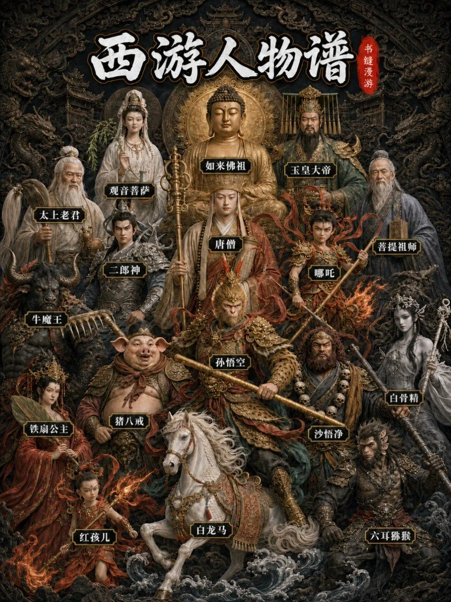

图面大题：**西游人物谱**。同框可见如来、唐僧、悟空、白龙马、观音、玉帝、太上老君、二郎神、哪吒、菩提、牛魔王、沙悟净、铁扇、八戒、红孩儿、六耳、白骨精等标签——**17** 人，无女儿国王。

---

## 大唐高僧 唐三藏


| # | 节点 | 标签 | 地点 | 主句 | 副句 |
|---|---|---|---|---|---|
| ① | 金蝉子 | 前世 | 灵山 | 十世修行 | 如来座下二弟子 |
| ② | 取经人 | 受命 | 长安 | 奉诏西行 | 唐王赐号三藏 |
| ③ | 师父 | 收徒 | 五行山 | 解救悟空 | 收齐三位徒弟 |
| ④ | 坚定者 | 历劫 | 西行路 | 八十一难 | 一心求取真经 |
| ⑤ | 凡人 | 考验 | 女儿国 | 情关未改 | 慈悲亦有迟疑 |
| ⑥ | 佛 | 功果 | 灵山 | 旃檀功德佛 | 修成正果 |

---

## 齐天大圣 孙悟空

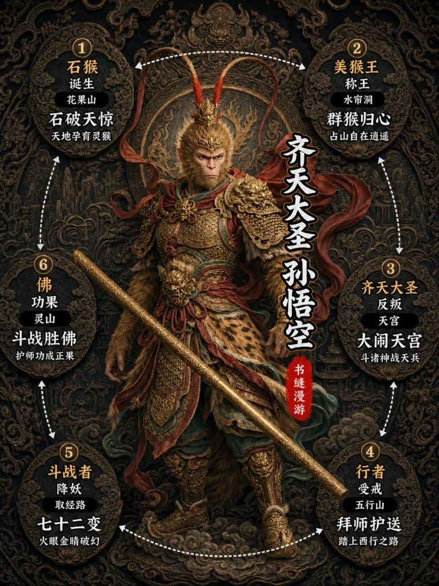

| # | 节点 | 标签 | 地点 | 主句 | 副句 |
|---|---|---|---|---|---|
| ① | 石猴 | 诞生 | 花果山 | 石破天惊 | 天地孕育灵猴 |
| ② | 美猴王 | 称王 | 水帘洞 | 群猴归心 | 占山自在逍遥 |
| ③ | 齐天大圣 | 反叛 | 天宫 | 大闹天宫 | 斗诸神战天兵 |
| ④ | 行者 | 受戒 | 五行山 | 拜师护送 | 踏上西行之路 |
| ⑤ | 斗战者 | 降妖 | 取经路 | 七十二变 | 火眼金睛破幻 |
| ⑥ | 佛 | 功果 | 灵山 | 斗战胜佛 | 护师功成正果 |

---

## 天蓬元帅 猪八戒


| # | 节点 | 标签 | 地点 | 主句 | 副句 |
|---|---|---|---|---|---|
| ① | 天蓬元帅 | 前世 | 天河 | 掌管水军 | 天宫威风凛凛 |
| ② | 猪刚鬣 | 贬凡 | 福陵山 | 错投猪胎 | 云栈洞占山 |
| ③ | 女婿 | 招亲 | 高老庄 | 强娶高翠兰 | 贪恋人间烟火 |
| ④ | 八戒 | 收徒 | 高老庄 | 悟空降服 | 拜师同往西天 |
| ⑤ | 伙伴 | 历劫 | 取经路 | 九齿钉耙 | 嘴馋心善护师 |
| ⑥ | 使者 | 功果 | 灵山 | 净坛使者 | 功成受封正果 |

---

## 卷帘大将 沙悟净

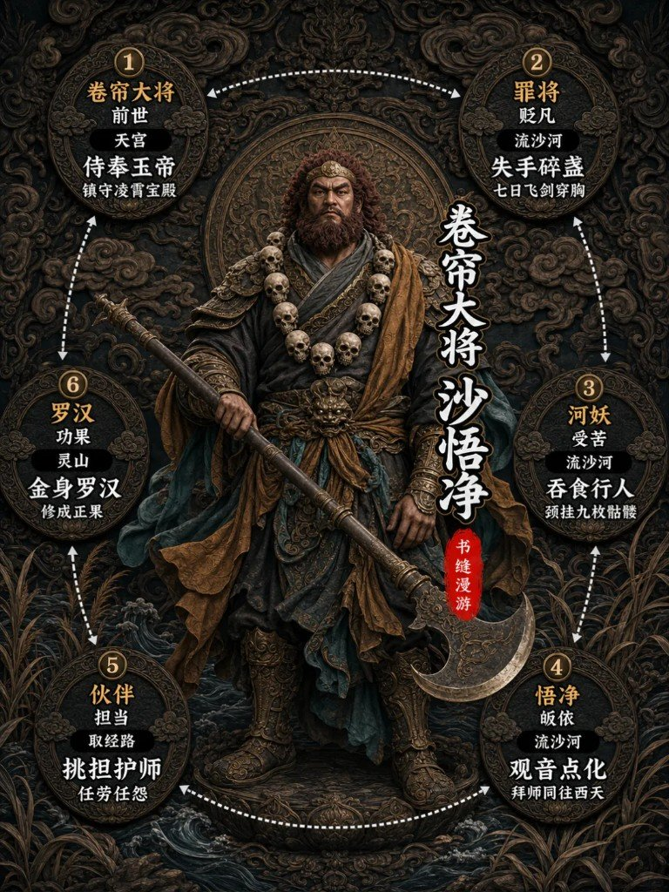

| # | 节点 | 标签 | 地点 | 主句 | 副句 |
|---|---|---|---|---|---|
| ① | 卷帘大将 | 前世 | 天宫 | 侍奉玉帝 | 镇守凌霄宝殿 |
| ② | 罪将 | 贬凡 | 流沙河 | 失手碎盏 | 七日飞剑穿胸 |
| ③ | 河妖 | 受苦 | 流沙河 | 吞食行人 | 颈挂九枚骷髅 |
| ④ | 悟净 | 皈依 | 流沙河 | 观音点化 | 拜师同往西天 |
| ⑤ | 伙伴 | 担当 | 取经路 | 挑担护师 | 任劳任怨 |
| ⑥ | 罗汉 | 功果 | 灵山 | 金身罗汉 | 修成正果 |

---

## 西海龙子 白龙马


| # | 节点 | 标签 | 地点 | 主句 | 副句 |
|---|---|---|---|---|---|
| ① | 龙王三太子 | 身世 | 西海 | 龙宫贵胄 | 西海龙王之子 |
| ② | 罪龙 | 犯戒 | 西海龙宫 | 纵火焚珠 | 获罪待斩得救 |
| ③ | 白龙马 | 化身 | 鹰愁涧 | 化马驮师 | 伴唐僧踏西行 |
| ④ | 坐骑 | 跋涉 | 取经路 | 千山万水 | 默默负重前行 |
| ⑤ | 龙子 | 救主 | 宝象国 | 化身舞剑 | 奋战黄袍怪 |
| ⑥ | 天龙 | 功果 | 灵山 | 八部天龙马 | 功成化龙正果 |

---

## 大慈大悲 观音菩萨


| # | 节点 | 标签 | 地点 | 主句 | 副句 |
|---|---|---|---|---|---|
| ① | 菩萨 | 道场 | 南海 | 紫竹林 | 慈航普度众生 |
| ② | 取经使 | 奉旨 | 灵山 | 领受佛旨 | 东土寻取经人 |
| ③ | 点化者 | 指引 | 长安 | 赐予三宝 | 袈裟锡杖紧箍 |
| ④ | 度化者 | 收徒 | 西行路 | 点化三徒 | 护持取经团队 |
| ⑤ | 救难者 | 护佑 | 三界 | 屡解危局 | 降妖伏魔解厄 |
| ⑥ | 慈悲尊 | 功德 | 南海 | 闻声救苦 | 大慈大悲 |

---

## 灵山世尊 如来佛祖


| # | 节点 | 标签 | 地点 | 主句 | 副句 |
|---|---|---|---|---|---|
| ① | 世尊 | 居所 | 灵山 | 大雷音寺 | 统摄西方佛界 |
| ② | 降魔者 | 出手 | 天宫 | 掌压悟空 | 五行山镇大圣 |
| ③ | 发愿者 | 弘法 | 灵山 | 三藏真经 | 欲传东土众生 |
| ④ | 主持者 | 筹谋 | 佛界 | 启动取经 | 观音东行寻人 |
| ⑤ | 试炼者 | 设局 | 西行路 | 八十一难 | 磨炼师徒道心 |
| ⑥ | 佛祖 | 功果 | 雷音寺 | 赐经封佛 | 师徒功德圆满 |

---

## 三界至尊 玉皇大帝

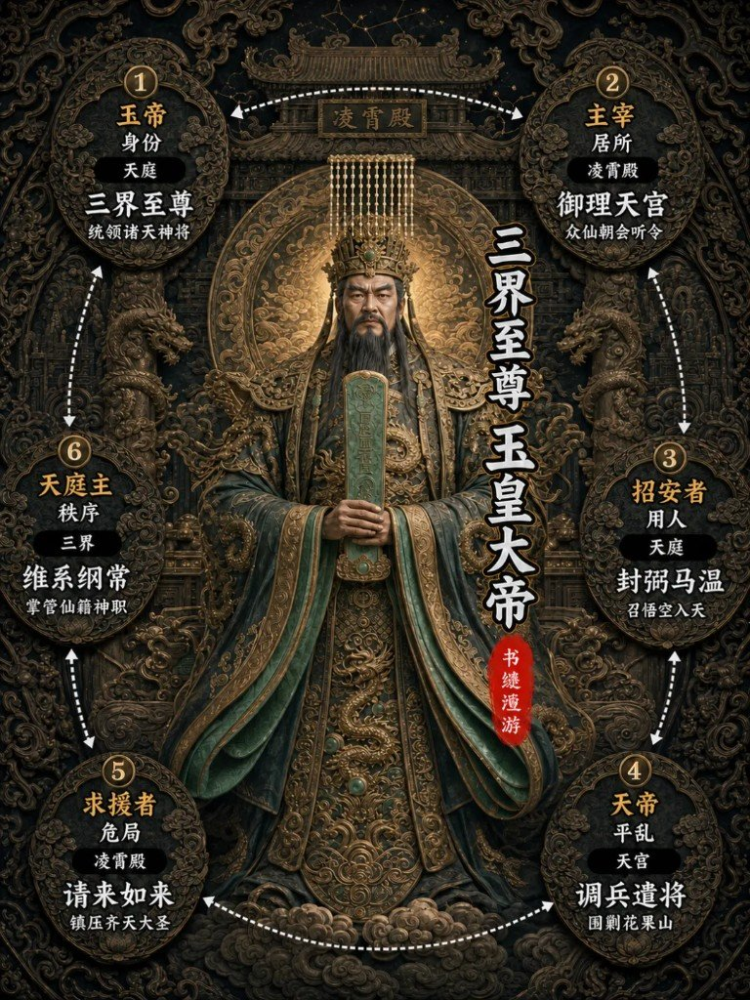

| # | 节点 | 标签 | 地点 | 主句 | 副句 |
|---|---|---|---|---|---|
| ① | 玉帝 | 身份 | 天庭 | 三界至尊 | 统领诸天神将 |
| ② | 主宰 | 居所 | 凌霄殿 | 御理天宫 | 众仙朝会听令 |
| ③ | 招安者 | 用人 | 天庭 | 封弼马温 | 召悟空入天 |
| ④ | 天帝 | 平乱 | 天宫 | 调兵遣将 | 围剿花果山 |
| ⑤ | 求援者 | 危局 | 凌霄殿 | 请来如来 | 镇压齐天大圣 |
| ⑥ | 天庭主 | 秩序 | 三界 | 维系纲常 | 掌管仙籍神职 |

---

## 三清道祖 太上老君


| # | 节点 | 标签 | 地点 | 主句 | 副句 |
|---|---|---|---|---|---|
| ① | 道祖 | 身份 | 天庭 | 三清尊神 | 道法深不可测 |
| ② | 炼丹师 | 道场 | 兜率宫 | 八卦炉 | 金丹法宝皆出 |
| ③ | 守藏者 | 失窃 | 兜率宫 | 悟空偷丹 | 五壶金丹入腹 |
| ④ | 炼化者 | 擒获 | 天庭 | 八卦炉炼 | 炼成火眼金睛 |
| ⑤ | 法宝主 | 因缘 | 西行路 | 金银二童 | 携宝下界为妖 |
| ⑥ | 降妖者 | 收伏 | 平顶山 | 收回童子 | 重归兜率宫 |

---

## 方寸山祖师 菩提祖师

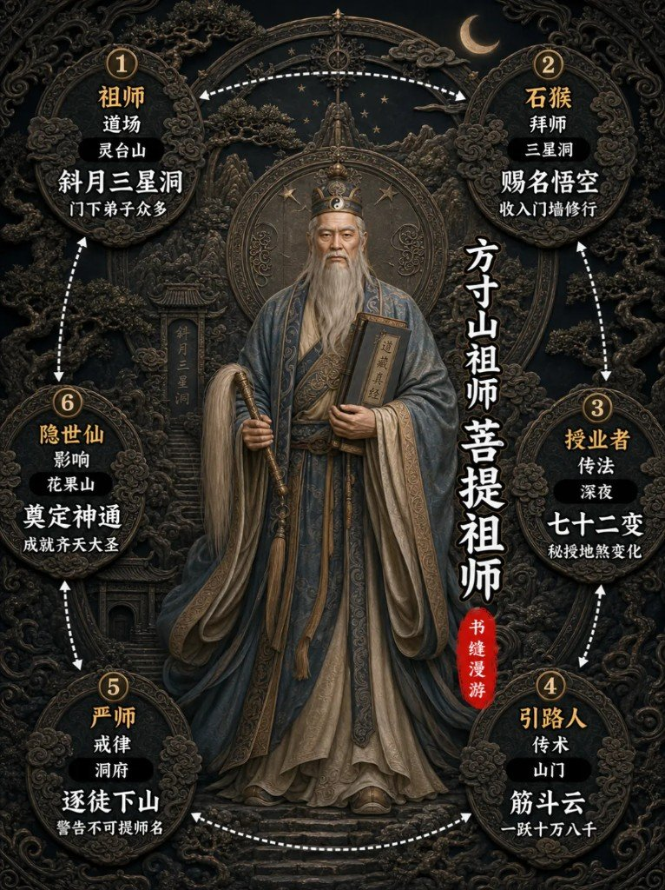

| # | 节点 | 标签 | 地点 | 主句 | 副句 |
|---|---|---|---|---|---|
| ① | 祖师 | 道场 | 灵台山 | 斜月三星洞 | 门下弟子众多 |
| ② | 石猴 | 拜师 | 三星洞 | 赐名悟空 | 收入门墙修行 |
| ③ | 授业者 | 传法 | 深夜 | 七十二变 | 秘授地煞变化 |
| ④ | 引路人 | 传术 | 山门 | 筋斗云 | 一跃十万八千 |
| ⑤ | 严师 | 戒律 | 洞府 | 逐徒下山 | 警告不可提师名 |
| ⑥ | 隐世仙 | 影响 | 花果山 | 奠定神通 | 成就齐天大圣 |

---

## 灌江显圣 二郎神

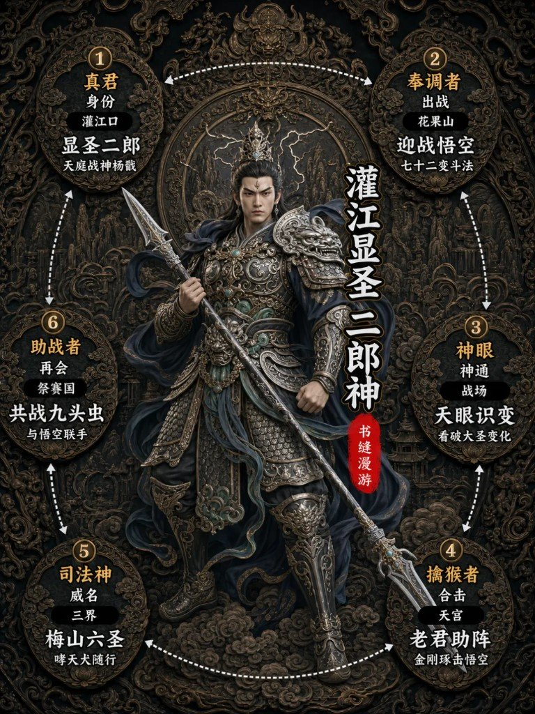

| # | 节点 | 标签 | 地点 | 主句 | 副句 |
|---|---|---|---|---|---|
| ① | 真君 | 身份 | 灌江口 | 显圣二郎 | 天庭战神杨戬 |
| ② | 奉调者 | 出战 | 花果山 | 迎战悟空 | 七十二变斗法 |
| ③ | 神眼 | 神通 | 战场 | 天眼识变 | 看破大圣变化 |
| ④ | 擒猴者 | 合击 | 天宫 | 老君助阵 | 金刚琢击悟空 |
| ⑤ | 司法神 | 威名 | 三界 | 梅山六圣 | 哮天犬随行 |
| ⑥ | 助战者 | 再会 | 祭赛国 | 共战九头虫 | 与悟空联手 |

---

## 中坛元帅 哪吒三太子


| # | 节点 | 标签 | 地点 | 主句 | 副句 |
|---|---|---|---|---|---|
| ① | 莲花身 | 身世 | 陈塘关 | 灵珠转世 | 太乙真人弟子 |
| ② | 三太子 | 神职 | 天庭 | 中坛元帅 | 托塔天王之子 |
| ③ | 神将 | 出战 | 花果山 | 迎战悟空 | 六臂神通斗法 |
| ④ | 法宝主 | 武器 | 天庭 | 火尖枪 | 风火轮乾坤圈 |
| ⑤ | 降妖者 | 助战 | 西行路 | 屡助悟空 | 对阵牛魔王 |
| ⑥ | 少年神 | 威名 | 三界 | 三头六臂 | 神勇无畏 |

---

## 平天大圣 牛魔王


| # | 节点 | 标签 | 地点 | 主句 | 副句 |
|---|---|---|---|---|---|
| ① | 大力王 | 称号 | 积雷山 | 平天大圣 | 七圣结义称兄 |
| ② | 兄长 | 结义 | 花果山 | 与猴王盟 | 昔日同为妖王 |
| ③ | 夫君 | 家室 | 芭蕉洞 | 铁扇公主 | 红孩儿之父 |
| ④ | 妖王 | 势力 | 积雷山 / 摩云洞 | 盘踞一方称雄 | —— |
| ⑤ | 对手 | 激战 | 火焰山 | 七十二变 | 与悟空变化斗法 |
| ⑥ | 降服者 | 结局 | 天庭 | 诸神围攻 | 被哪吒降服 |

---

## 罗刹仙 铁扇公主

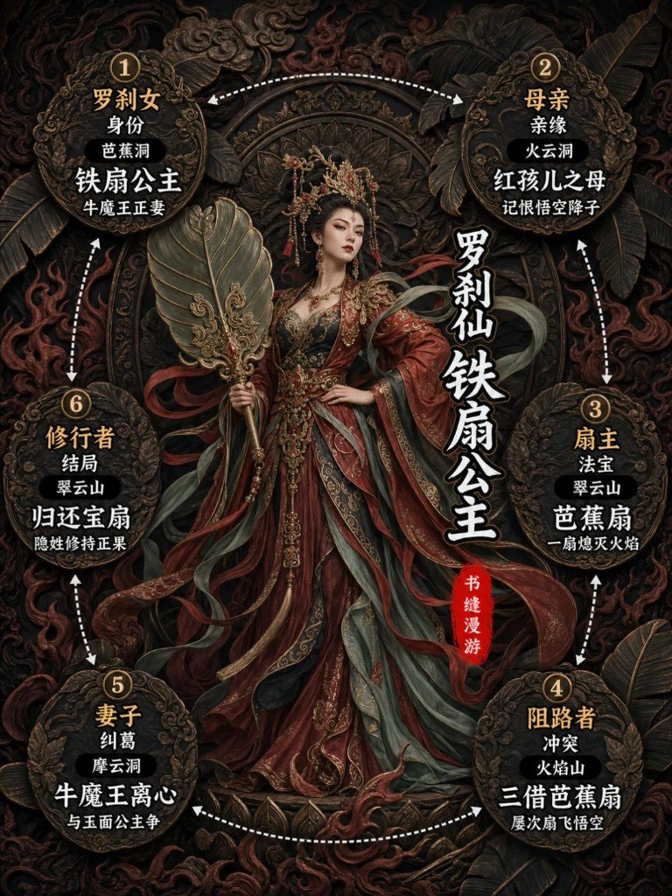

| # | 节点 | 标签 | 地点 | 主句 | 副句 |
|---|---|---|---|---|---|
| ① | 罗刹女 | 身份 | 芭蕉洞 | 铁扇公主 | 牛魔王正妻 |
| ② | 母亲 | 亲缘 | 火云洞 | 红孩儿之母 | 记恨悟空降子 |
| ③ | 扇主 | 法宝 | 翠云山 | 芭蕉扇 | 一扇熄灭火焰 |
| ④ | 阻路者 | 冲突 | 火焰山 | 三借芭蕉扇 | 屡次扇飞悟空 |
| ⑤ | 妻子 | 纠葛 | 摩云洞 | 牛魔王离心 | 与玉面公主争 |
| ⑥ | 修行者 | 结局 | 翠云山 | 归还宝扇 | 隐姓修持正果 |

---

## 圣婴大王 红孩儿

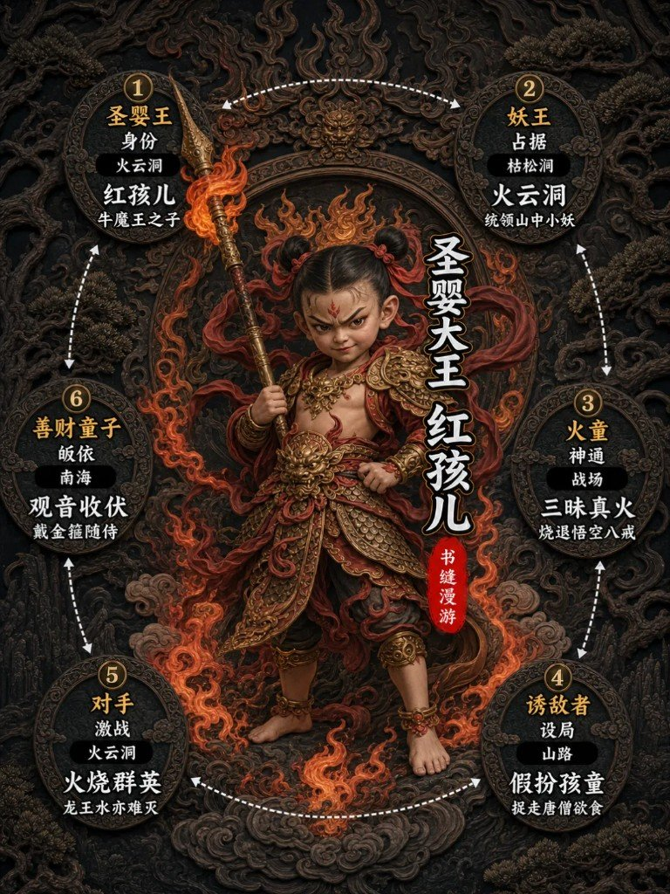

| # | 节点 | 标签 | 地点 | 主句 | 副句 |
|---|---|---|---|---|---|
| ① | 圣婴王 | 身份 | 火云洞 | 红孩儿 | 牛魔王之子 |
| ② | 妖王 | 占据 | 枯松涧 | 火云洞 | 统领山中小妖 |
| ③ | 火童 | 神通 | 战场 | 三昧真火 | 烧退悟空八戒 |
| ④ | 诱敌者 | 设局 | 山路 | 假扮孩童 | 捉走唐僧欲食 |
| ⑤ | 对手 | 激战 | 火云洞 | 火烧群英 | 龙王水亦难灭 |
| ⑥ | 善财童子 | 皈依 | 南海 | 观音收伏 | 戴金箍随侍 |

---

## 白虎岭尸魔 白骨精

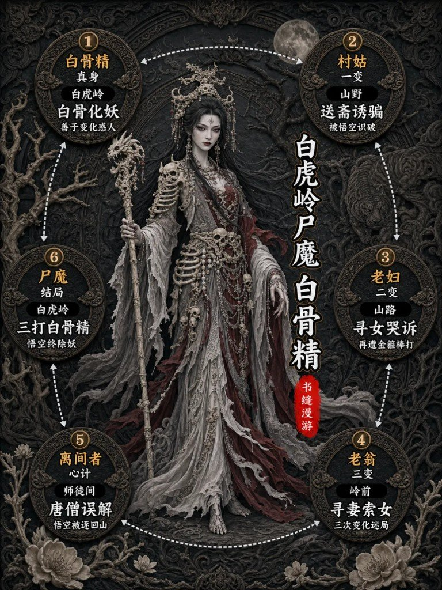

| # | 节点 | 标签 | 地点 | 主句 | 副句 |
|---|---|---|---|---|---|
| ① | 白骨精 | 真身 | 白虎岭 | 白骨化妖 | 善于变化惑人 |
| ② | 村姑 | 一变 | 山野 | 送斋诱骗 | 被悟空识破 |
| ③ | 老妇 | 二变 | 山路 | 寻女哭诉 | 再遭金箍棒打 |
| ④ | 老翁 | 三变 | 岭前 | 寻妻索女 | 三次变化迷局 |
| ⑤ | 离间者 | 心计 | 师徒间 | 唐僧误解 | 悟空被逐回山 |
| ⑥ | 尸魔 | 结局 | 白虎岭 | 三打白骨精 | 悟空终除妖 |

---

## 真假猴王 六耳猕猴

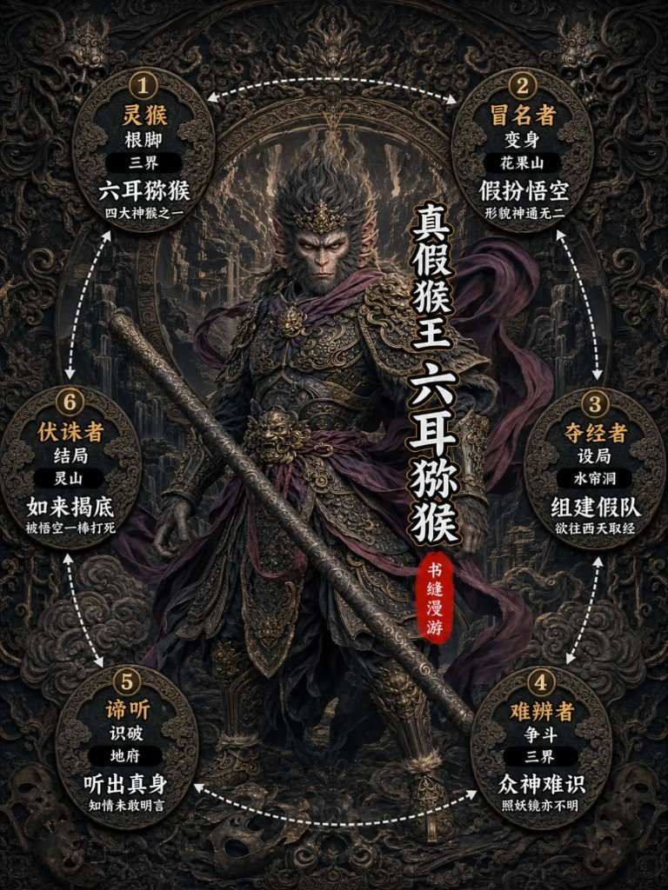

| # | 节点 | 标签 | 地点 | 主句 | 副句 |
|---|---|---|---|---|---|
| ① | 灵猴 | 根脚 | 三界 | 六耳猕猴 | 四大神猴之一 |
| ② | 冒名者 | 变身 | 花果山 | 假扮悟空 | 形貌神通无二 |
| ③ | 夺经者 | 设局 | 水帘洞 | 组建假队 | 欲往西天取经 |
| ④ | 难辨者 | 争斗 | 三界 | 众神难识 | 照妖镜亦不明 |
| ⑤ | 谛听 | 识破 | 地府 | 听出真身 | 知情未敢明言 |
| ⑥ | 伏诛者 | 结局 | 灵山 | 如来揭底 | 被悟空一棒打死 |

---

## 西梁国主 女儿国王

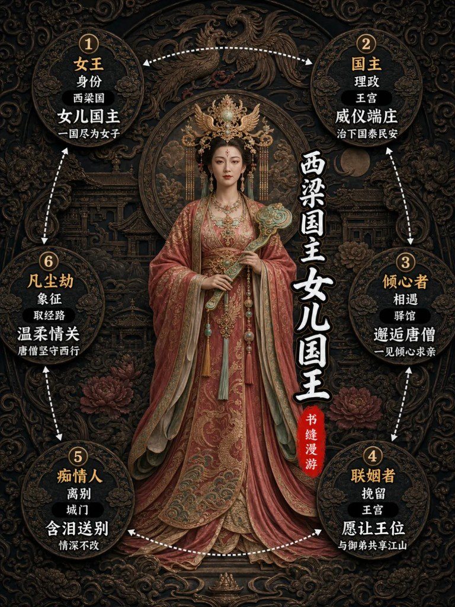

文称 17 人名单里**没有**她；附件单独给了六节点页，叙事落在唐僧的「情关」。

| # | 节点 | 标签 | 地点 | 主句 | 副句 |
|---|---|---|---|---|---|
| ① | 女王 | 身份 | 西梁国 | 女儿国主 | 一国尽为女子 |
| ② | 国主 | 理政 | 王宫 | 威仪端庄 | 治下国泰民安 |
| ③ | 倾心者 | 相遇 | 驿馆 | 邂逅唐僧 | 一见倾心求亲 |
| ④ | 联姻者 | 挽留 | 王宫 | 愿让王位 | 与御弟共享江山 |
| ⑤ | 痴情人 | 离别 | 城门 | 含泪送别 | 情深不改 |
| ⑥ | 凡尘劫 | 象征 | 取经路 | 温柔情关 | 唐僧坚守西行 |

---

## 欲望、缺点、选择

这套谱好看在立像，更耐看在环上那六格：每个神魔都被压成「曾是谁 → 做错什么 → 怎么走 → 落何处」。降妖是壳，**欲望、缺点、选择**才是肉——八十一难不过是把这些反复摊开给人看。

你最想先抄哪一位进自己的设定板？评论区报名也行。

---

## 脚注

1. **文称 17 vs 图面**：作者列名师徒五人 + 观音、如来、玉帝、太上老君、菩提、二郎神、哪吒、牛魔王、铁扇、红孩儿、白骨精、六耳 = **17**。附件另有女儿国王单人页；群像封面标签亦为 17（无女儿国王）。不是缺图，是名单口径与附件集合不完全重合。
2. **考据争议（评论指出即可，不展开）**：二郎神图面兵器非三尖两刃刀；六耳或有「八耳」说法；沙僧颈骷髅枚数；玉帝「宣」如来等措辞——版本与改编差异，笔记不仲裁。
3. **另期**：作者另推《封神演义》49 人物。Knowledge 当前 **无**对应笔记路径，勿硬链；有原料再另开一期。
4. **旁链（不硬并）**：古风女装六风格提示词、短剧男主脸型 60 种、Coze 历史人物科普海报、GPT-Image2 高张力海报——题材相邻，不是同一篇。

---

## 文件与校验

```
2026-08-10_西游人物谱黑金浮雕风/
├── 黑金浮雕西游人物谱：六节点转一圈看见的是人心.md  # 本笔记（H1 含逗号）
└── assets/
    ├── SOURCES.md                                      # 映射 / 旁链 / 口径
    ├── 00-群像封面-西游人物谱.png
    ├── 01-孙悟空.png … 18-女儿国王.png                 # 共 19 PNG
```

| 校验项 | 结果 |
|---|---|
| 磁盘 PNG | 19 |
| 正文图片引用（配图文件） | 19 |
| 六节点单人页 | 18（含女儿国王） |
| 群像封面 | 1 |