## JVM 在校招面试中的重要性
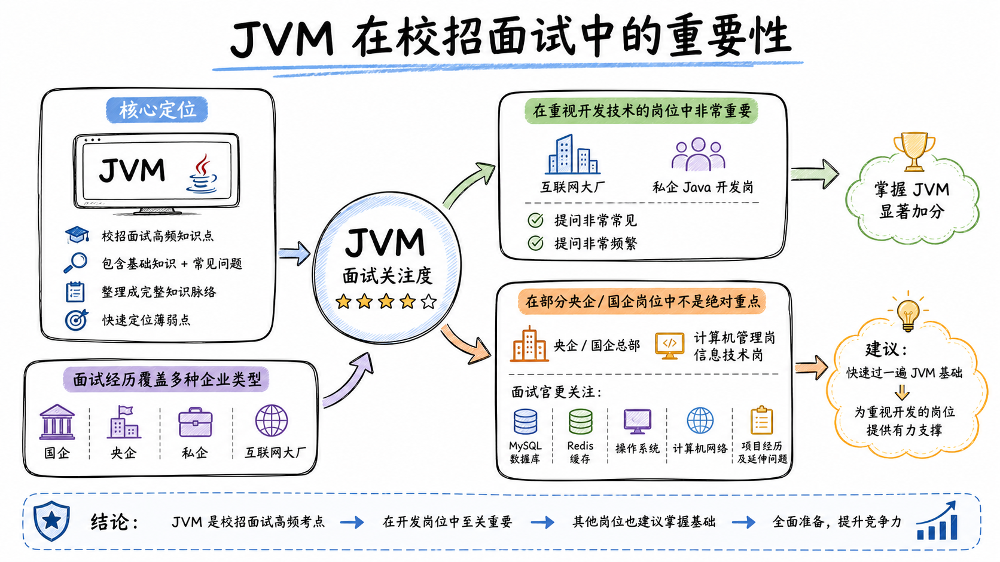

大家好，我是程序员Dan。今天想和大家分享 **JVM，也就是 Java 虚拟机**，在计算机校园招聘中经常被面试官问到的知识点。这些内容既包括 JVM 的基础知识，也包括我在近百家公司面试过程中遇到的常见问题。我把它们整理成了一套完整的知识脉络，方便大家在面试前快速浏览，及时定位自己还没有掌握清楚的部分。

我面试过的公司包括国企、央企、私企和互联网大厂。总体来看，JVM 相关问题往往集中在那些比较看重开发技术的岗位上，比如互联网大厂和私企的 Java 开发岗，提问非常常见，也非常频繁。

但在部分央企、国企总部的计算机管理岗或信息技术岗中，JVM 并不是绝对重点。面试官可能更关注以下内容：

- MySQL、Redis 等数据库与缓存技术
- 操作系统
- 计算机网络
- 项目经历及其延伸问题

不过，把 JVM 的基础知识快速过一遍仍然很有必要。对于重视开发能力的岗位来说，这部分知识会成为非常好的助力。

## JVM 整体架构与运行时内存
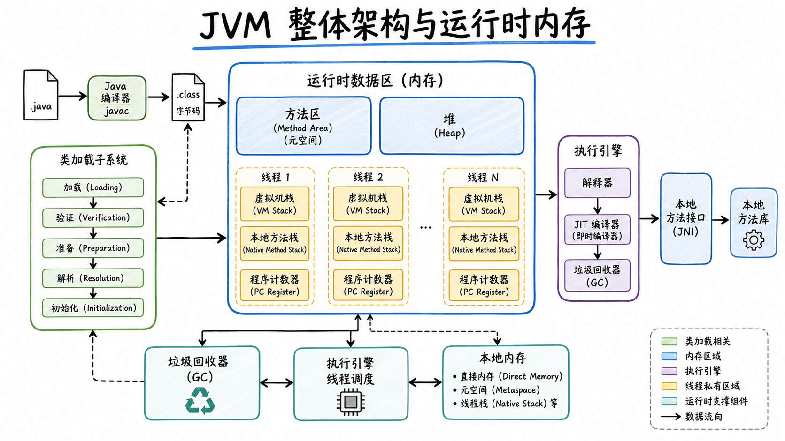

## JVM 的三个核心组成部分
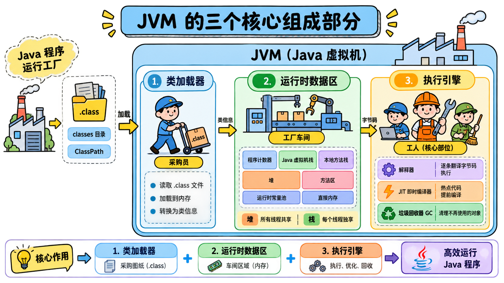


可以把 JVM 想象成一个专门运行 Java 程序的工厂，这个工厂有三个核心部门。

### 1. 类加载器

类加载器就像“采购员”，负责把硬盘上的 `.class` 文件搬到内存中。

比如程序启动时，它会从 `classes` 目录或 ClassPath 中读取 `.class` 文件，将其加载到内存，转换成 JVM 能够识别和使用的类信息，相当于把工厂需要的图纸准备好。

### 2. 运行时数据区

运行时数据区相当于工厂车间，是 JVM 工作时划分出来的不同功能区域，包括：

- 程序计数器
- Java 虚拟机栈
- 本地方法栈
- 堆
- 方法区
- 运行时常量池
- 直接内存

其中，**堆像公共仓库，由所有线程共享；栈像个人工位，每个线程独享。**

### 3. 执行引擎

执行引擎是真正干活的“工人”，也是 JVM 的核心部位。

- **解释器**：把字节码逐条翻译成机器码并执行。
- **JIT 即时编译器**：像一个优化师。如果发现某段代码被反复执行，属于热点代码，就会提前把它编译成机器码，后续再次执行时速度会更快。
- **垃圾回收器 GC**：像清洁工，负责清理不再使用的对象所占用的内存。

## JVM 运行时数据区
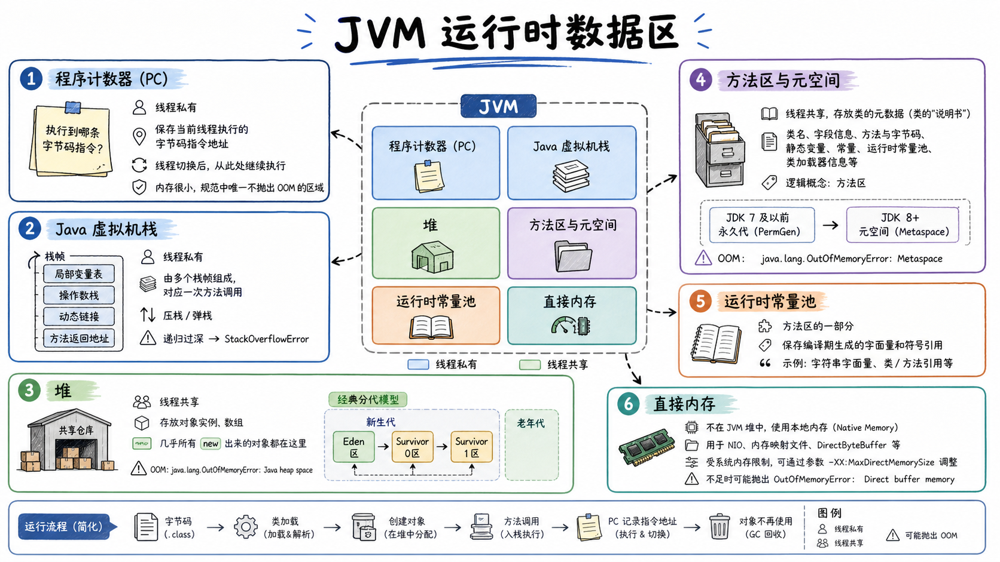

## 程序计数器
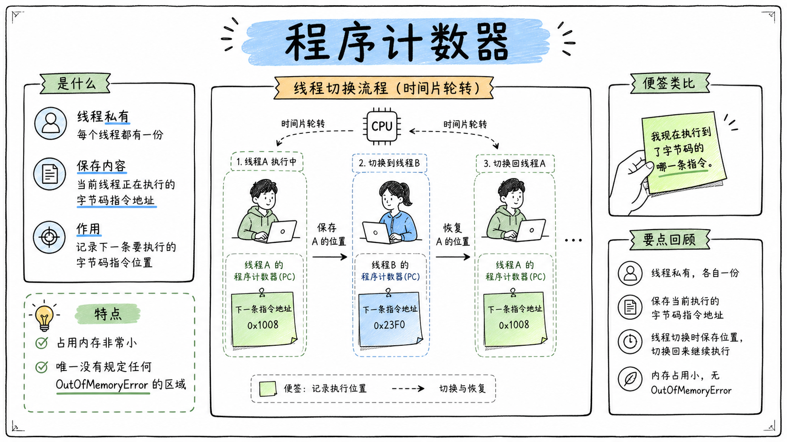

程序计数器是**线程私有**的，每个线程都有一份，内部保存当前线程正在执行的字节码指令地址。

可以把它看作每个员工手中的一张便签纸，上面记录着：

> 我现在执行到了字节码的哪一条指令。

当 CPU 在多个线程之间通过时间片轮转快速切换时，假设线程 A 暂停执行，JVM 会把线程 A 当前执行的位置记录在它的程序计数器中。等 CPU 再次切换回来时，线程 A 看一眼“便签”，就知道应该从哪里继续执行。

程序计数器占用的内存非常小，也是《Java 虚拟机规范》中唯一没有规定任何 `OutOfMemoryError` 情况的区域。

## Java 虚拟机栈
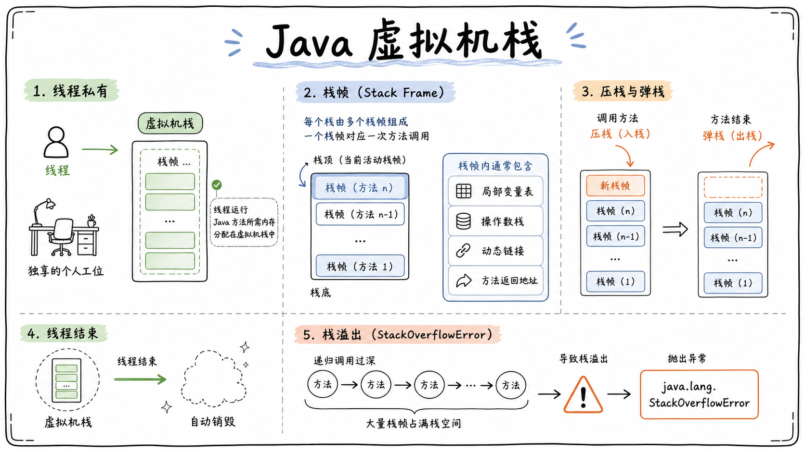

Java 虚拟机栈也是**线程私有**的，可以把它理解为每个线程独享的个人工位。线程运行 Java 方法时所需要的内存，会分配在虚拟机栈中。

每个栈由多个**栈帧**组成，一个栈帧对应一次方法调用。每个线程在某一时刻只有一个活动栈帧，对应当前正在执行的方法。

每调用一次方法，就会向栈中压入一个栈帧；方法执行结束后，对应栈帧出栈。栈帧中通常保存：

- 局部变量表
- 操作数栈
- 动态链接
- 方法返回地址

如果熟悉数据结构，就会知道栈的主要特点是**压栈和弹栈**。线程结束后，它对应的虚拟机栈也会自动销毁。

如果递归调用过深，比如方法递归调用了一万次，大量栈帧可能把栈空间占满，最终抛出：

```text
java.lang.StackOverflowError
```

## 堆
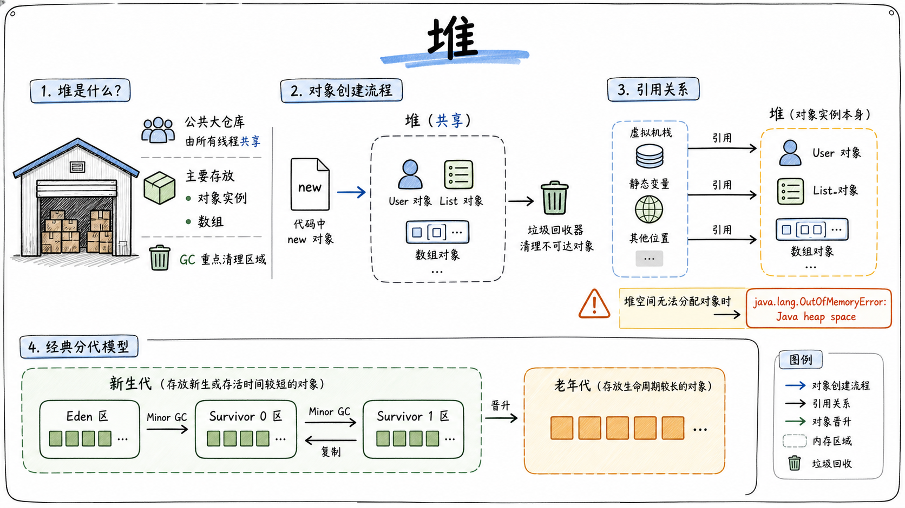

堆像一个公共大仓库，由所有线程共享，主要用于保存：

- 对象实例
- 数组

也就是说，代码中绝大多数通过 `new` 创建出来的对象，比如 `User`、`List`，都会存放在堆中。垃圾回收器重点清理的也是这块区域。

堆中保存的是对象实例本身，对象的引用可能保存在虚拟机栈、静态变量等位置。如果堆空间无法继续分配对象，就可能抛出：

```text
java.lang.OutOfMemoryError: Java heap space
```

经典分代模型中，堆通常包括：

- **新生代**
  - Eden 区
  - Survivor 0 区
  - Survivor 1 区
- **老年代**

新生代用于存放刚创建或存活时间较短的对象，老年代主要保存生命周期较长的对象。

## 方法区与元空间
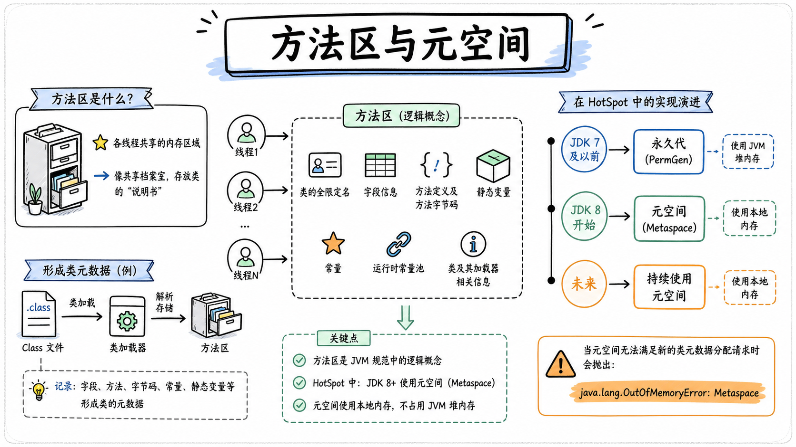

方法区是各线程共享的一块内存区域，可以把它想象成所有线程共享的档案室，主要存放类的元数据，也就是类的“说明书”，包括：

- 类的全限定名
- 字段信息
- 方法定义及方法字节码
- 静态变量
- 常量
- 运行时常量池
- 类及其加载器的相关信息

比如一个 `class` 文件被加载后，它有哪些字段、有哪些方法、方法体的字节码是什么，都会形成相应的类元数据。

方法区是 JVM 规范中的逻辑概念。在 HotSpot 虚拟机中：

- JDK 7 及以前主要通过永久代实现。
- JDK 8 开始移除了永久代，改为**元空间 Metaspace**。
- 元空间使用本地内存，而不是 JVM 堆内存。

如果元空间无法满足新的类元数据分配请求，也会抛出：

```text
java.lang.OutOfMemoryError: Metaspace
```

## 运行时常量池
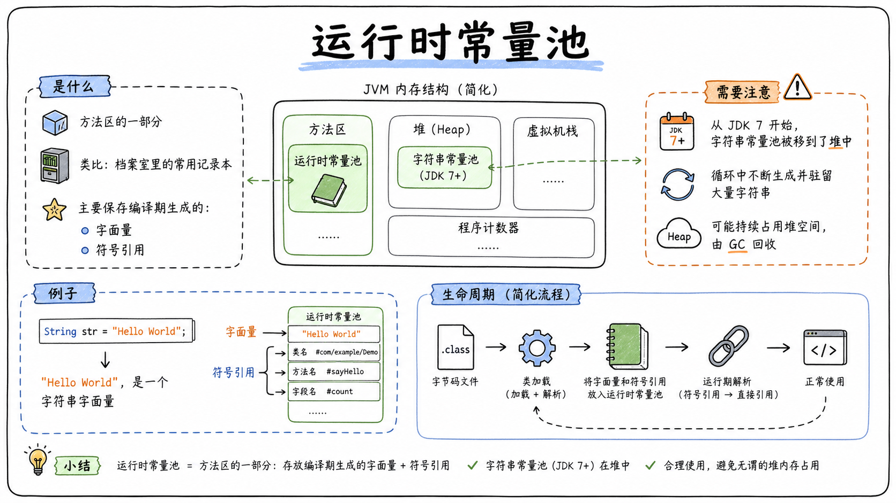

运行时常量池是方法区的一部分，可以把它看成档案室里的常用记录本，主要保存编译期生成的：

- 字面量
- 符号引用

例如：

```java
String str = "Hello World";
```

`"Hello World"` 就是一个字符串字面量。类名、方法名、字段名等符号引用，也会进入运行时常量池。

需要注意，**从 JDK 7 开始，字符串常量池被移到了堆中**。因此，如果在循环中不断生成并驻留大量字符串，也可能持续占用堆空间，需要由 GC 进行回收。

## 直接内存
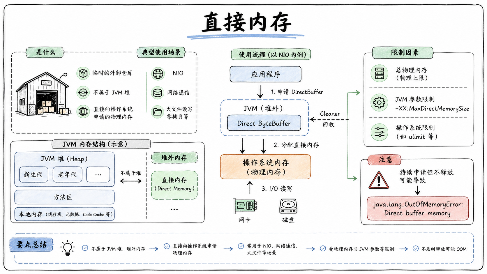

直接内存像一个临时的外部仓库，它不属于 JVM 堆，而是直接向操作系统申请的物理内存，通常会在 NIO 等场景中使用。

直接内存不受 JVM 堆大小的直接限制，但会受到机器总物理内存以及相关 JVM 参数的限制。如果程序持续申请直接内存却不释放，也可能导致：

```text
java.lang.OutOfMemoryError: Direct buffer memory
```

## 堆与栈的区别
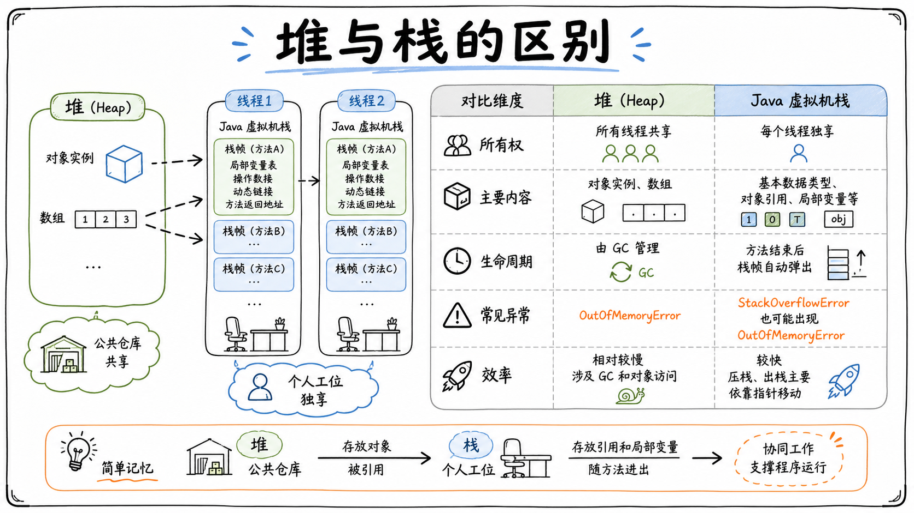

可以从几个维度理解堆和栈。

| 对比维度 | 堆 | Java 虚拟机栈 |
|---|---|---|
| 所有权 | 所有线程共享 | 每个线程独享 |
| 主要内容 | 对象实例、数组 | 基本数据类型、对象引用、局部变量等 |
| 生命周期 | 由 GC 管理 | 方法结束后栈帧自动弹出 |
| 常见异常 | `OutOfMemoryError` | `StackOverflowError`，也可能出现 `OutOfMemoryError` |
| 效率 | 相对较慢，涉及 GC 和对象访问 | 较快，压栈、出栈主要依靠指针移动 |

*简单记忆：堆是公共仓库，栈是个人工位。*

## JVM 垃圾回收机制
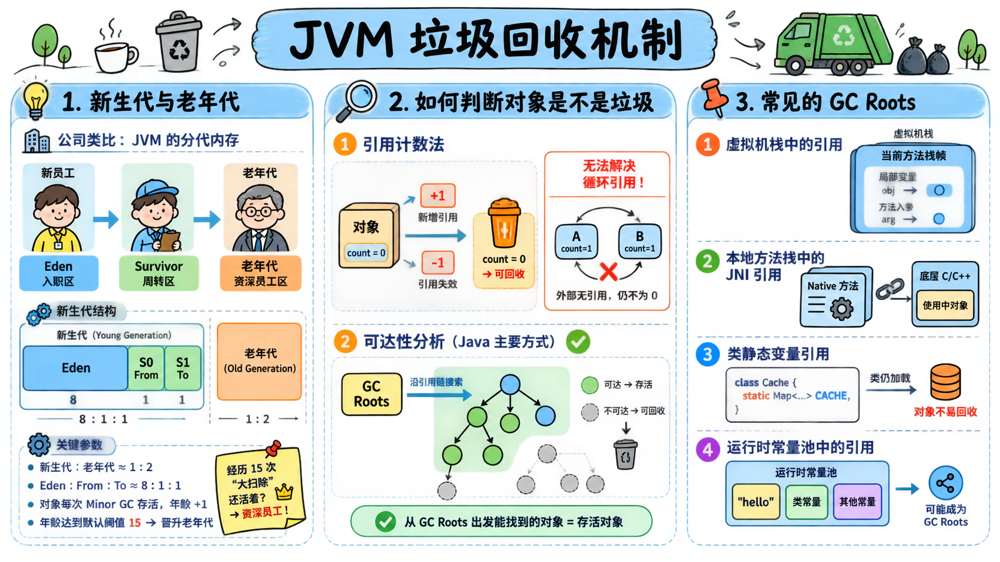

## 新生代与老年代
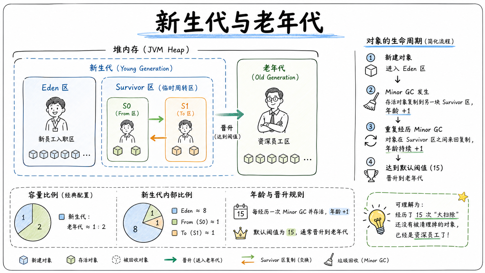

可以用一家公司来理解 JVM 的分代内存。

- **Eden 区**：新员工入职区，新创建的对象通常先进入这里。
- **Survivor 区**：临时周转区，保存经历过几次垃圾回收但仍然存活的对象。
- **老年代**：资深员工区，保存长期存活或体积较大的对象。

Survivor 区又分为：

- S0，也叫 From 区
- S1，也叫 To 区

在经典配置中：

- 新生代与老年代的容量比例通常约为 `1:2`。
- Eden、From、To 的比例通常约为 `8:1:1`。
- 对象每经历一次 Minor GC 并存活下来，年龄通常会加一。
- 当年龄达到默认阈值 15 时，通常会晋升到老年代。

可以理解为：经历了 15 次“大扫除”还没有被清理掉的对象，已经是资深员工了。

## 如何判断对象是不是垃圾
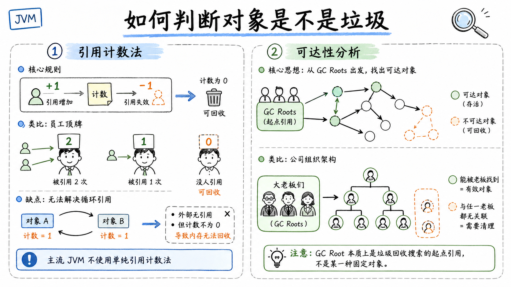

### 引用计数法

引用计数法会在对象中记录它被引用的次数。每增加一个引用，计数加一；引用失效时，计数减一。当计数为零时，说明对象没有被使用，可以回收。

可以想象成每个员工头上顶着一块牌子，有人引用他，数字就加一；数字为零，说明没人需要他。

但这种方式无法很好地解决**循环引用**。

假设对象 A 引用对象 B，对象 B 又引用对象 A。即使外部已经没有任何地方使用它们，它们的引用计数仍然不为零，可能导致内存无法回收。因此，主流 JVM 并不使用单纯的引用计数法判断对象是否存活。

### 可达性分析

Java 主要通过**可达性分析算法**判断对象是否存活。

算法会从一组称为 **GC Roots** 的引用出发，沿引用链向下搜索。能够从 GC Roots 找到的对象被认为仍然存活；如果某个对象与任何 GC Root 之间都没有引用链，就说明它不可达，可以被垃圾回收。

可以把 GC Roots 想象成公司的几个大老板。老板顺着组织关系向下找员工，凡是能够找到的员工都属于有效对象；如果某个员工与任何老板都牵不上线，就会被认定为需要清理的对象。

> **注意：GC Root 本质上是垃圾回收搜索的起点引用，不是某一种固定对象。**

## 常见的 GC Roots
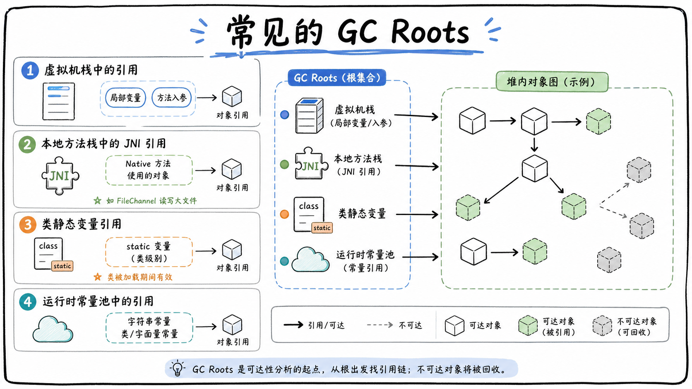

Java 中常见的 GC Roots 包括以下几类。

1. **虚拟机栈中的引用**

   正在执行的方法，其局部变量和入参中保存的对象引用，可以作为 GC Roots。

2. **本地方法栈中的 JNI 引用**

   Java 调用底层 C 或 C++ 代码时，Native 方法正在使用的对象不能被随意回收。例如使用 `FileChannel` 读写大文件时，底层本地代码正在持有和使用的相关资源。

3. **类静态变量引用**

   被 `static` 修饰的变量属于整个类，而不是某个对象。例如：

   ```java
   public static Map<String, Object> CACHE = new HashMap<>();
   ```

   只要类仍然被加载，`CACHE` 以及它能够引用到的键值对，通常都不会被轻易回收。

4. **运行时常量池中的引用**

   例如字符串常量、类相关常量等，也可能形成 GC Roots 的引用来源。

## 垃圾回收算法
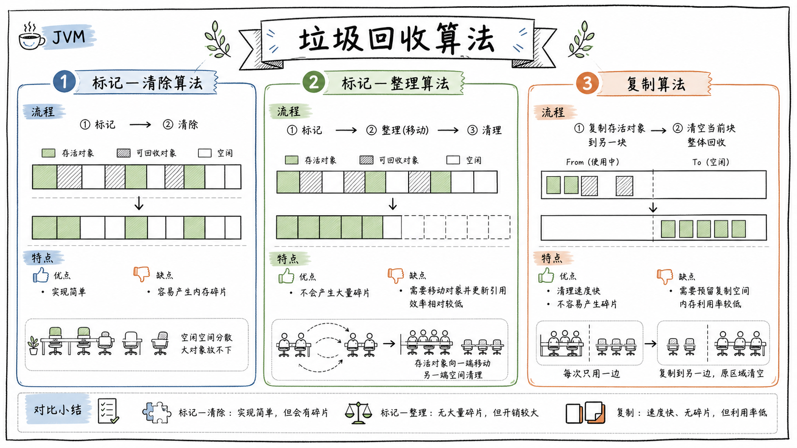

## 标记——清除算法
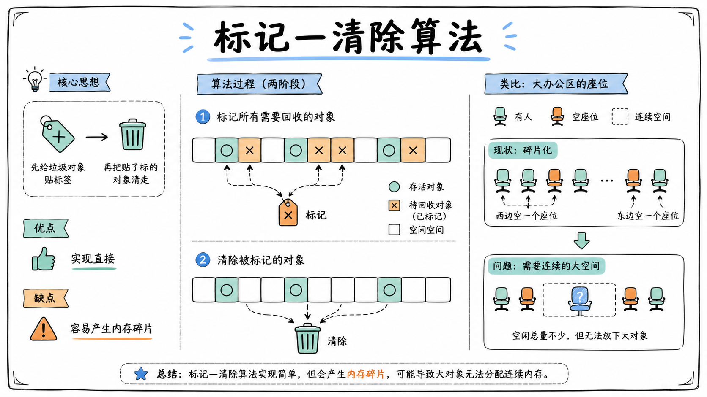

标记——清除算法分为两个阶段：

1. 标记所有需要回收的对象。
2. 清除被标记的对象。

它相当于先给垃圾对象贴标签，再把贴了标签的对象清走。

优点是实现直接；缺点是容易产生**内存碎片**。就像一个大办公区中，东边空一个座位，西边空一个座位。虽然空闲空间总量不少，但如果来了一个很大的对象，需要连续的内存空间，就可能无法放下。

## 标记——整理算法
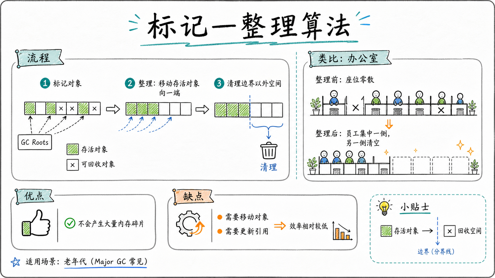

标记——整理算法会先标记对象，再让所有存活对象向内存的一端移动，最后清理边界以外的空间。

它相当于把还在工作的员工全部挪到办公室一侧，另一侧空出来的座位统一清理。

- **优点**：不会产生大量内存碎片。
- **缺点**：需要移动对象并更新引用，效率相对较低。

## 复制算法
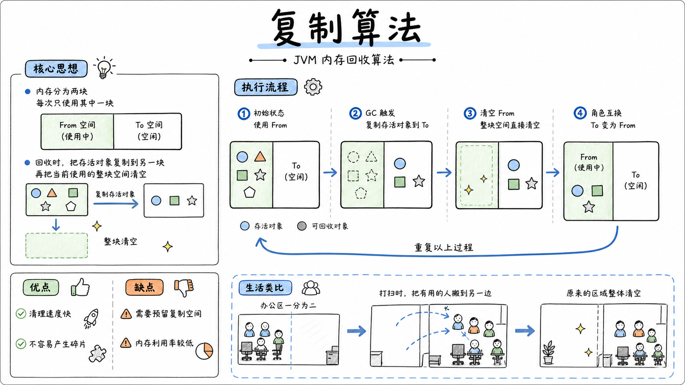

复制算法把内存划分为两块，每次只使用其中一块。垃圾回收时，把仍然存活的对象复制到另一块，再把当前使用的整块空间直接清空。

它相当于把办公区一分为二，每次只使用一边。打扫时，把有用的人搬到另一边，原来的区域整体清空。

- **优点**：清理速度快，不容易产生碎片。
- **缺点**：需要预留复制空间，内存利用率较低。

## 分代回收与 GC 类型
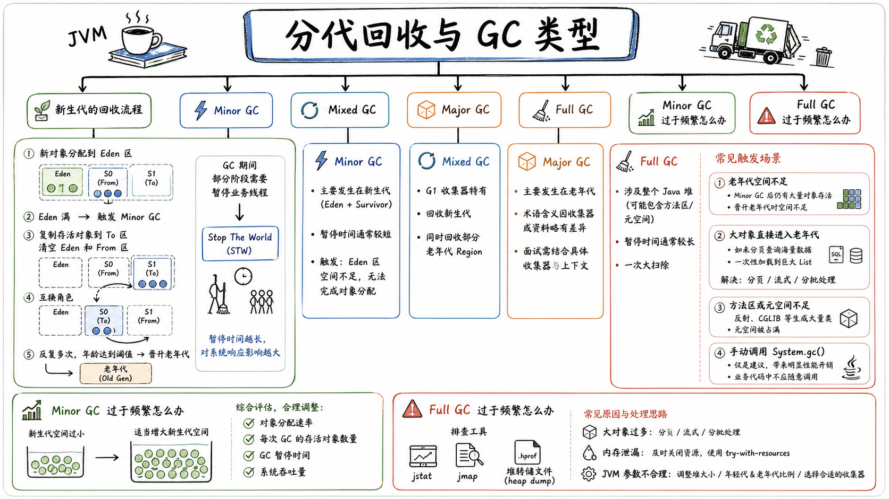

## 新生代的回收流程
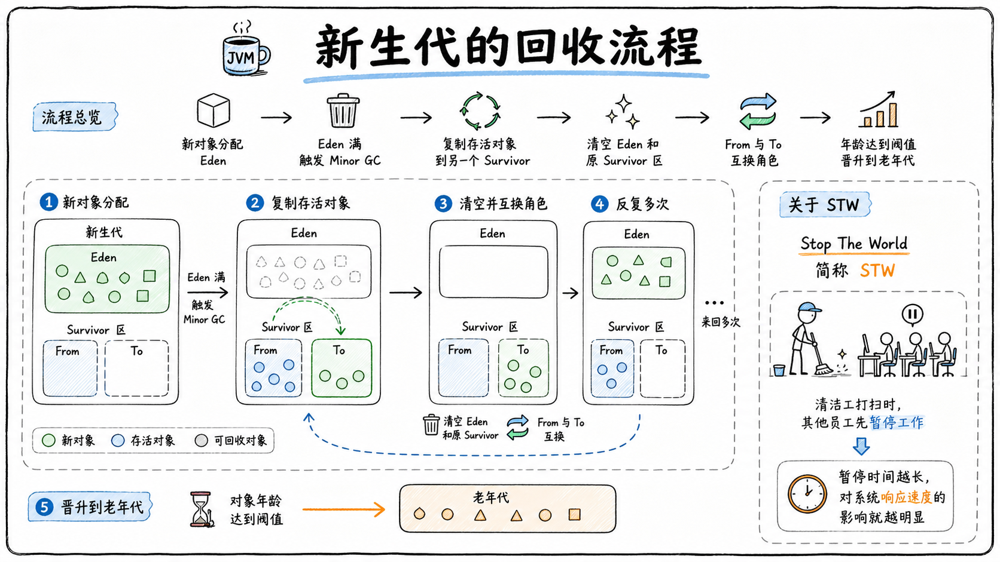

新对象通常先分配到 Eden 区。Eden 区满后，会触发 Minor GC。

垃圾回收时，会把 Eden 区和当前使用的 Survivor 区中仍然存活的对象，通过复制算法搬到另一个 Survivor 区，然后清空 Eden 和原 Survivor 区。此后 From 区和 To 区会互换角色。

这个过程会来回倒腾多次。对象的年龄达到阈值后，通常会晋升到老年代。

GC 执行期间，部分阶段需要暂停业务线程，这种现象叫：

```text
Stop The World，简称 STW
```

相当于清洁工打扫时，其他员工先暂停工作。暂停时间越长，对系统响应速度的影响就越明显。

## Minor GC
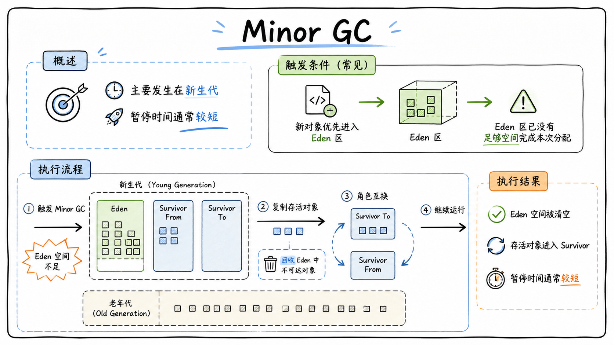

Minor GC 主要发生在新生代，暂停时间通常较短。

常见触发条件是：新对象优先进入 Eden 区，但 Eden 区已经没有足够空间完成本次分配。

## Mixed GC
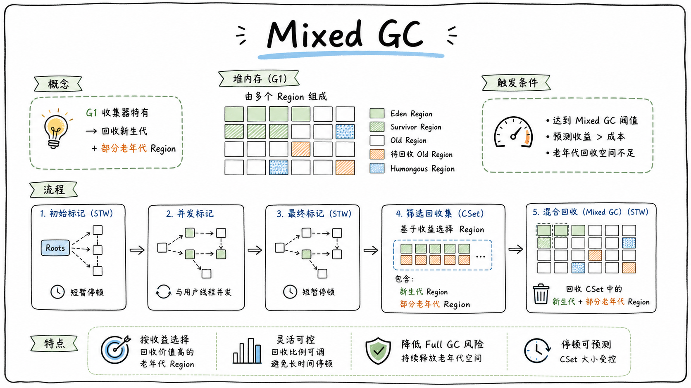

Mixed GC 是 G1 收集器特有的回收方式，除了回收新生代，还会回收部分老年代 Region。

## Major GC
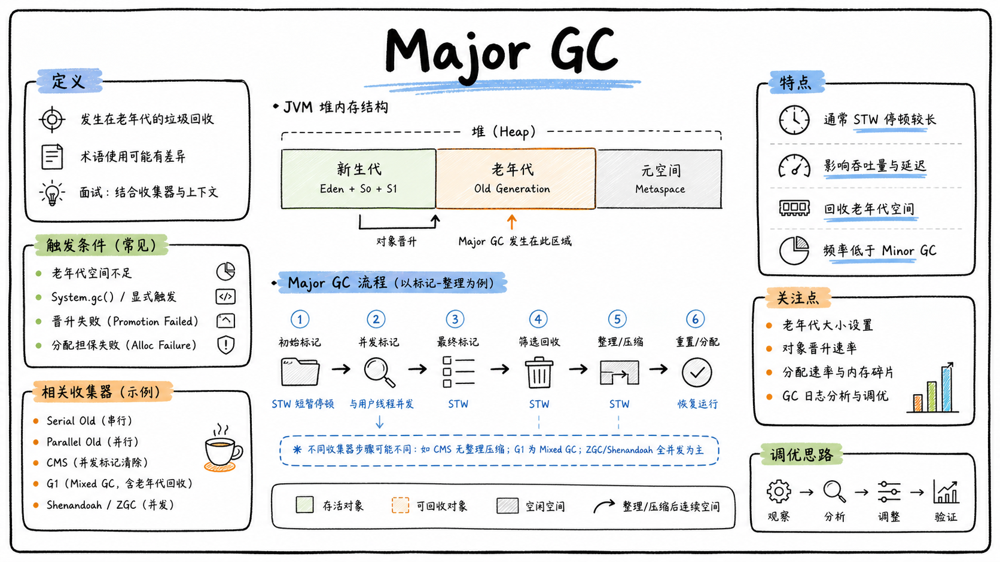

Major GC 通常指发生在老年代的垃圾回收。不同资料或不同收集器对这一术语的使用可能略有差异，面试时最好结合具体收集器和上下文说明。

## Full GC
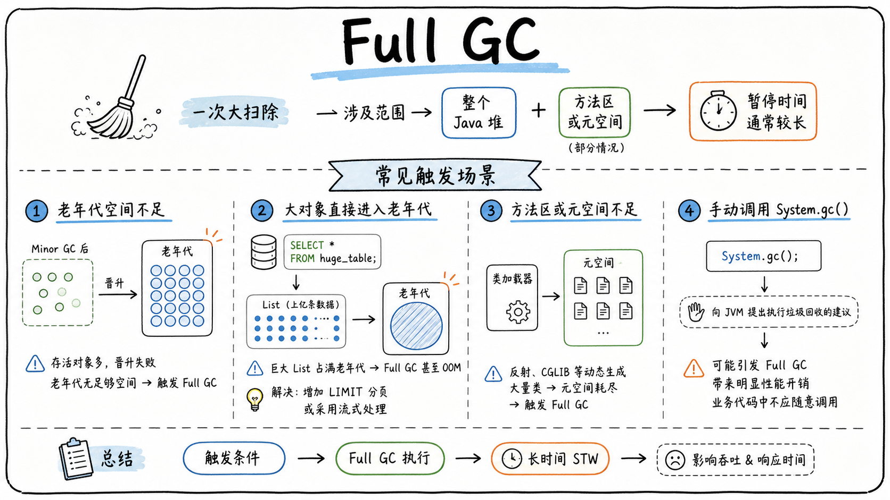

Full GC 可以理解为一次大扫除，通常会涉及整个 Java 堆，部分情况下还会涉及方法区或元空间，暂停时间往往比较长。

常见触发场景包括：

1. **老年代空间不足**

   Minor GC 后仍有大量对象存活，需要晋升到老年代，但老年代没有足够空间。

2. **大对象直接进入老年代**

   比如执行一条未分页的查询：

   ```sql
   SELECT * FROM huge_table;
   ```

   如果一次查询上亿条数据并放入一个巨大 `List`，这个对象可能直接占满老年代，导致 Full GC，甚至 OOM。解决方式通常是增加 `LIMIT` 分页或采用流式处理。

3. **方法区或元空间不足**

   例如通过反射、CGLIB 等方式动态生成了大量类，导致元空间被占满。

4. **手动调用 `System.gc()`**

   ```java
   System.gc();
   ```

   这只是向 JVM 提出执行垃圾回收的建议，但往往会带来明显的性能开销，业务代码中不应随意调用。

## Minor GC 过于频繁怎么办
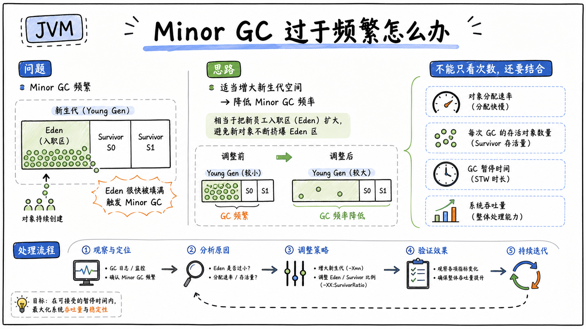

Minor GC 频繁，通常可能是新生代空间过小，导致 Eden 区很快被填满。

一种思路是适当增大新生代空间，降低 Minor GC 的频率，相当于把新员工入职区扩大，避免新对象不断挤爆 Eden 区。

但内存调整不能只看次数，还要结合：

- 对象分配速率
- 每次 GC 的存活对象数量
- GC 暂停时间
- 系统吞吐量

## Full GC 过于频繁怎么办
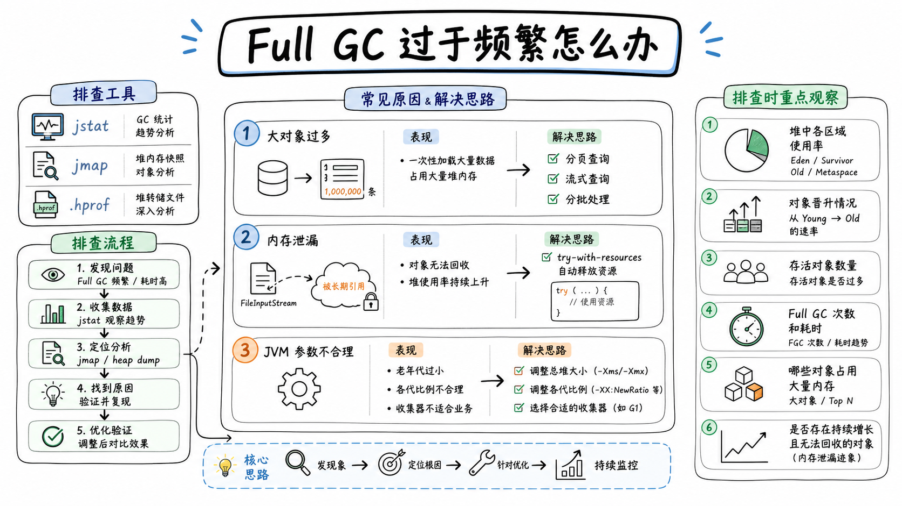

Full GC 频繁是一个比较严重的问题，可以借助 `jstat`、`jmap`、堆转储文件等工具进行排查。

常见原因包括：

- **大对象过多**：例如 SQL 未分页，一次查出一百万条数据放进 `List`。可以使用分页、流式查询或分批处理。
- **内存泄漏**：例如 `FileInputStream` 等资源使用后没有关闭，对象长期被引用，堆越来越满。可以使用 `try-with-resources` 自动释放资源。
- **JVM 参数不合理**：例如老年代设置过小，或者垃圾收集器不适合当前业务。可以考虑调整总堆大小、各代比例，或使用 G1 等更合适的收集器。

排查时应重点观察：

- 堆中各区域的使用率
- 对象晋升情况
- 存活对象数量
- Full GC 次数和耗时
- 哪些对象占用了大量内存
- 是否存在持续增长且无法回收的对象

## Java 对象的创建、销毁与晋升
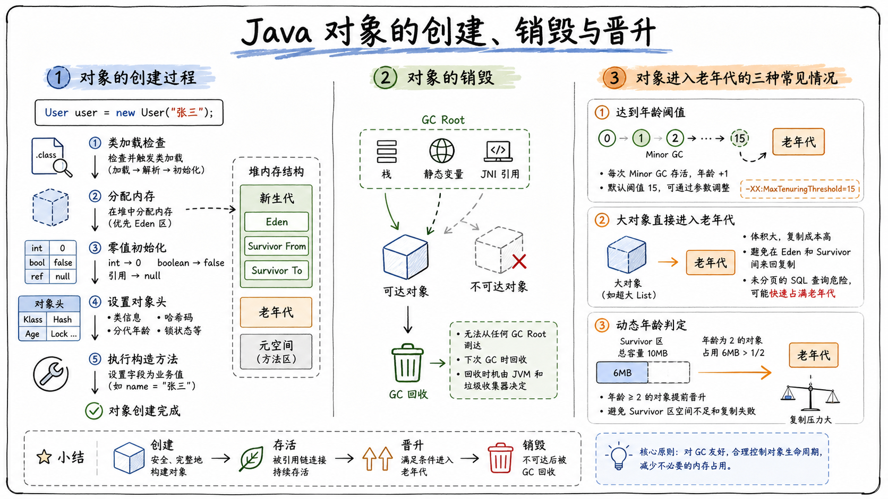

## 对象的创建过程
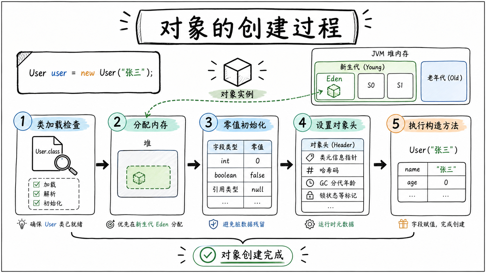

假设代码中写了：

```java
User user = new User("张三");
```

JVM 在后台大致会完成以下步骤。

1. **类加载检查**

   JVM 先检查 `User` 类是否已经加载、解析和初始化。如果还没有，就触发类加载过程。

2. **分配内存**

   JVM 在堆中划出一块能够容纳 `User` 对象的内存。通常新对象优先在新生代 Eden 区分配。

3. **零值初始化**

   JVM 会把对象实例字段先初始化为对应的零值。例如：

   - `int` 初始化为 `0`
   - `boolean` 初始化为 `false`
   - 引用类型初始化为 `null`

   这样可以避免旧内存中的脏数据残留。

4. **设置对象头**

   JVM 会设置对象头中的相关信息，例如：

   - 对象属于哪个类
   - 哈希码
   - GC 分代年龄
   - 锁状态等标记信息

5. **执行构造方法**

   最后调用构造方法，将对象字段设置成业务代码指定的值。例如把原来的 `name = null` 改成 `name = "张三"`。

至此，一个 Java 对象正式创建完成。

## 对象的销毁
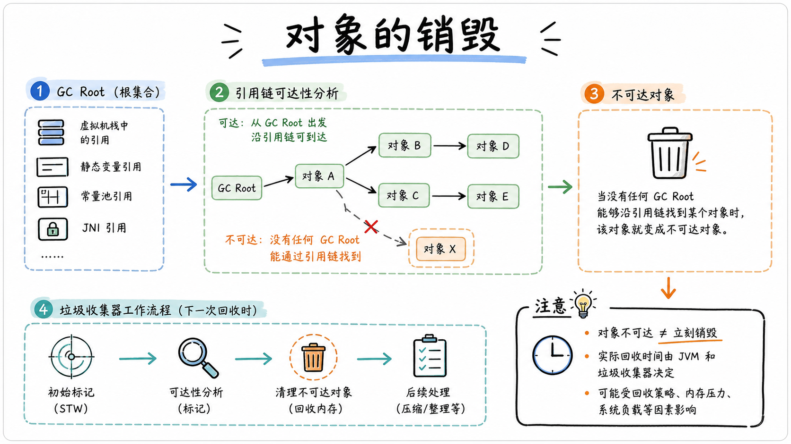

当没有任何 GC Root 能够沿引用链找到某个对象时，该对象就会变成不可达对象。垃圾收集器下一次工作时，可能会回收它所占用的内存。

需要注意，对象不可达后不一定会立刻销毁，实际回收时间由 JVM 和垃圾收集器决定。

## 对象进入老年代的三种常见情况
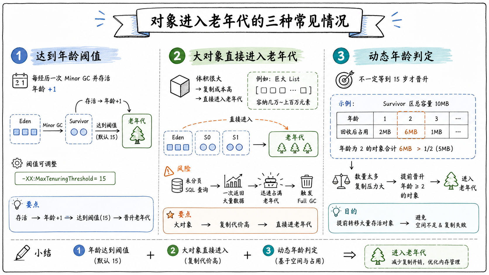

### 1. 达到年龄阈值

对象每经历一次 Minor GC 并存活下来，年龄通常会加一。当年龄达到默认阈值 15 时，就可能晋升到老年代。

该阈值可以通过 JVM 参数调整：

```bash
-XX:MaxTenuringThreshold=15
```

### 2. 大对象直接进入老年代

一些体积很大的对象，在部分收集器和分代策略下可能直接进入老年代，避免在 Eden 和两个 Survivor 区之间来回复制。

比如一个能够容纳几万个元素的巨大 `List`，搬来搬去成本很高，JVM 可能更倾向于将其放入老年代。

这也解释了为什么未分页的 SQL 查询非常危险：一次查出几万乃至上百万条数据，可能迅速占满老年代，触发 Full GC。

### 3. 动态年龄判定

对象不一定非要等到 15 岁才晋升。

例如某个 Survivor 区总容量为 10MB，垃圾回收后，年龄为 2 的对象合计占用了 6MB，已经超过 Survivor 区的一半。JVM 可能认为这批对象数量太多，继续留在 Survivor 区会增加复制压力，于是将年龄大于等于 2 的对象提前晋升到老年代。

这样做是为了提前转移大量存活对象，避免 Survivor 区空间不足和复制失败。

## 常见垃圾收集器
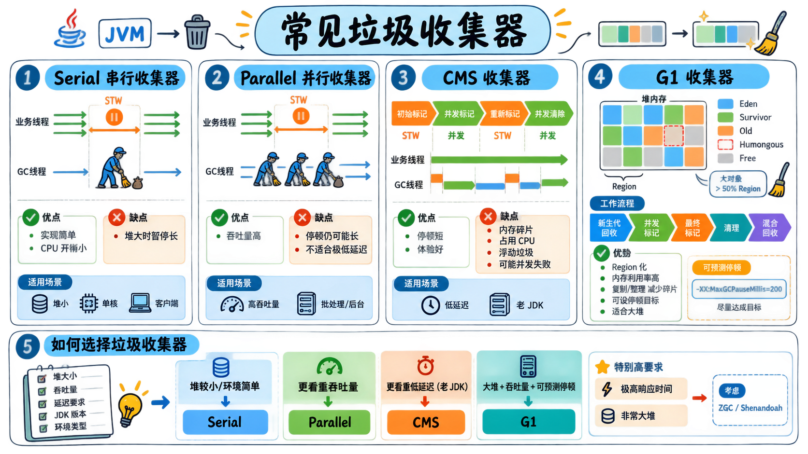

## Serial 串行收集器
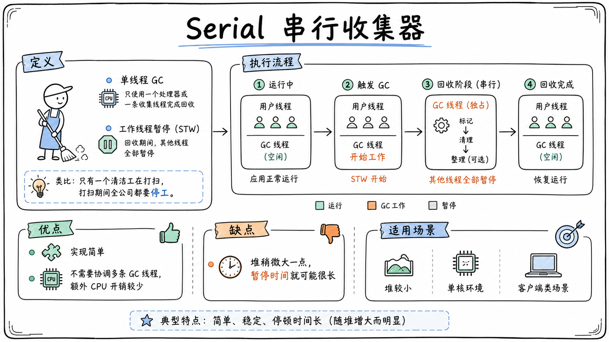

Serial 是单线程垃圾收集器，只使用一个处理器或一条收集线程完成垃圾回收。

在垃圾回收期间，它需要暂停其他工作线程，也就是发生 STW。相当于只有一个清洁工在打扫，而且打扫期间全公司都要停工。

- **优点**：实现简单，不需要协调多条 GC 线程，额外 CPU 开销较少。
- **缺点**：堆稍微大一点，暂停时间就可能很长。

它更适合堆较小、单核或客户端类场景。

## Parallel 并行收集器
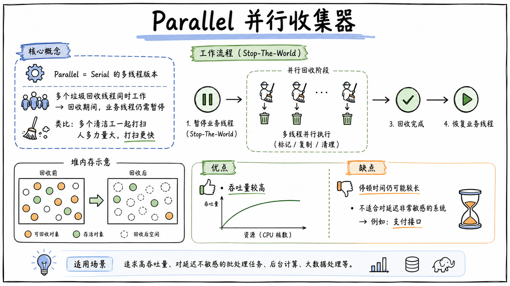

Parallel 可以看成 Serial 的多线程版本。多个垃圾回收线程同时工作，但回收期间业务线程仍然需要暂停。

它相当于多个清洁工一起打扫，虽然员工仍然要停工，但因为人多力量大，整体打扫速度更快。

- **优点**：吞吐量较高。
- **缺点**：停顿时间依然可能较长，不适合对延迟非常敏感的系统，比如支付接口。

## CMS 收集器
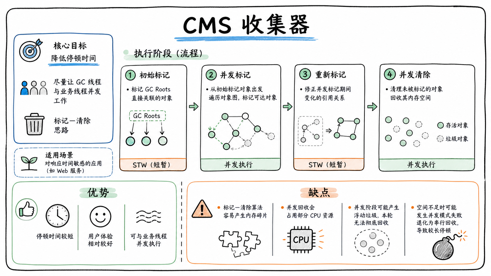

CMS 全称为 **Concurrent Mark Sweep**，核心目标是降低停顿时间。它尽量让垃圾回收线程与业务线程并发工作，采用的是标记——清除思路。

主要阶段包括：

1. **初始标记**

   标记 GC Roots 能直接关联到的对象，需要短暂 STW。

2. **并发标记**

   从初始标记对象出发，遍历对象图并标记可达对象。该阶段可以与业务线程并发执行。

3. **重新标记**

   修正并发标记期间因业务线程继续运行而发生变化的引用关系，需要 STW。

4. **并发清除**

   清理未被标记的对象，回收其内存空间，可以与业务线程并发执行。

CMS 的优势是停顿时间较短，用户体验相对较好；缺点包括：

- 使用标记——清除算法，容易产生内存碎片。
- 并发回收会占用部分 CPU 资源。
- 并发阶段可能产生浮动垃圾，本轮无法彻底回收。
- 空间不足时可能发生并发模式失败，退化为串行回收，导致较长停顿。

## G1 收集器
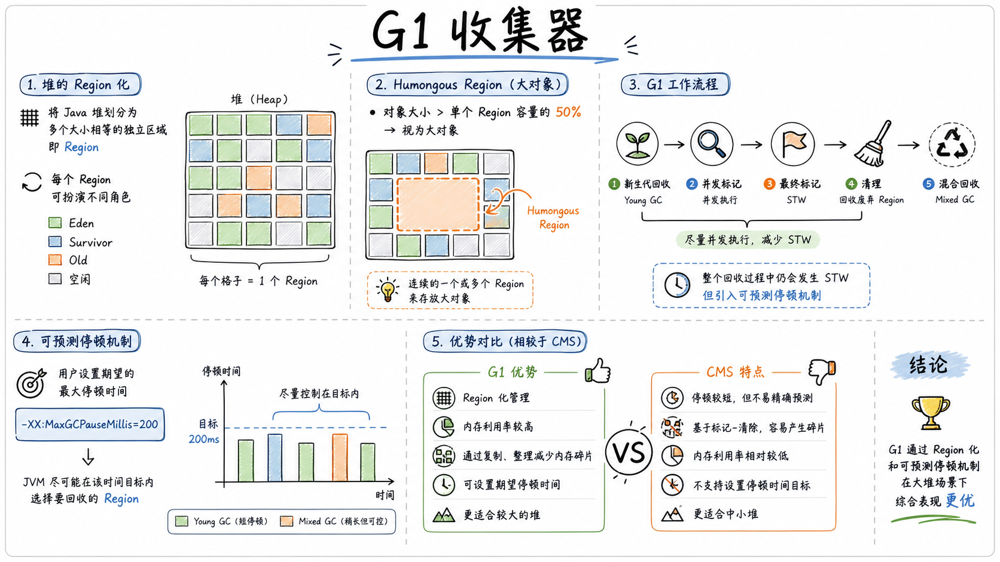

G1 是目前常见的垃圾收集器之一。它把 Java 堆划分为多个大小相等的独立区域，也就是 **Region**。每个 Region 都可以根据需要扮演 Eden、Survivor 或老年代的角色。

G1 还专门设置了 Humongous Region 来处理大对象。通常，如果一个对象的大小超过单个 Region 容量的 50%，就会被视为大对象。

G1 的工作过程中包括：

- 新生代回收
- 并发标记
- 最终标记
- 清理
- 混合回收 Mixed GC

G1 在垃圾回收期间仍然会发生 STW，但它引入了可预测停顿机制。用户可以在 JVM 启动时指定期望的最大停顿时间：

```bash
-XX:MaxGCPauseMillis=200
```

JVM 会尽可能在这一时间目标内选择需要回收的 Region。

相较于 CMS，G1 的优势主要包括：

- Region 化管理
- 内存利用率较高
- 通过复制、整理减少内存碎片
- 可以设置期望停顿时间
- 更适合较大的堆

CMS 的停顿较短但不容易精确预测，而且容易产生碎片；G1 的停顿目标相对可预测，也重点解决了内存碎片问题。

## 如何选择垃圾收集器
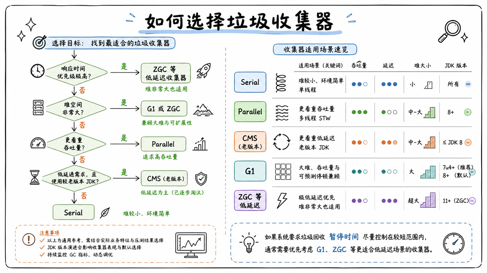

不同收集器适合不同场景：

- 堆较小、环境简单：可以考虑 Serial。
- 更看重吞吐量：可以考虑 Parallel。
- 更看重低延迟，且使用较老版本 JDK：可能会接触 CMS。
- 希望兼顾大堆、吞吐量和可预测停顿：可以考虑 G1。
- 响应时间优先级极高，或者堆空间非常大：可以考虑 ZGC 等低延迟收集器。

如果系统要求垃圾回收暂停时间尽量控制在较短范围内，通常需要优先考虑 G1、ZGC 等更适合低延迟场景的收集器。

## Java 的四种引用
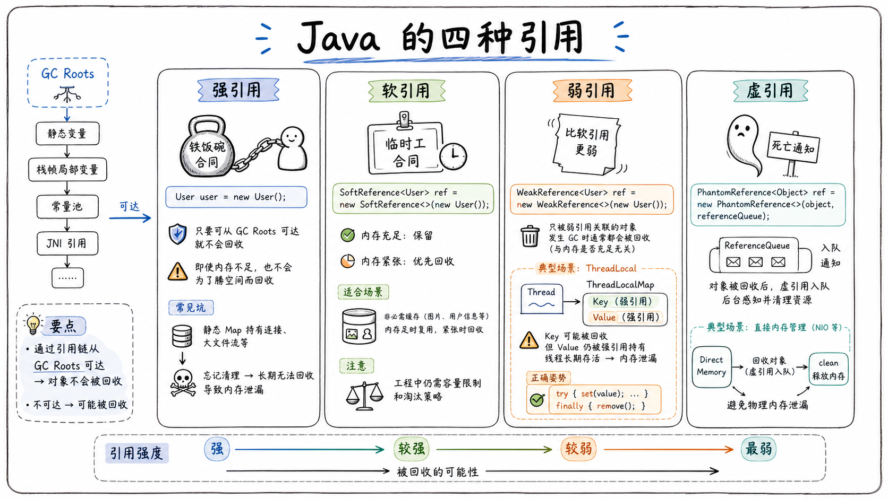

## 强引用
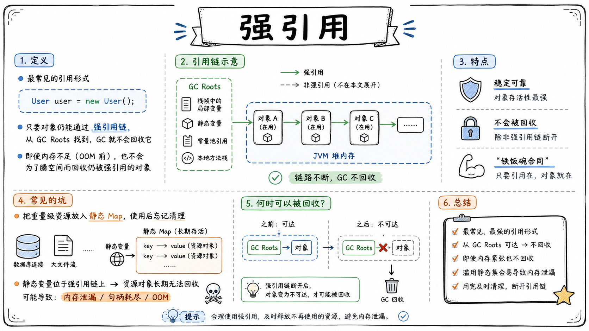

强引用是最常见的引用形式，例如：

```java
User user = new User();
```

只要对象仍然能够通过强引用链从 GC Roots 找到，垃圾收集器就不会回收它。哪怕系统即将内存溢出，也不会为了腾空间而随意回收仍被强引用的对象。

它相当于一份“铁饭碗合同”。

强引用常见的坑是：把数据库连接、大文件流等对象放入静态 `Map`，使用后又忘记清理。由于静态变量可能处于强引用链上，这些资源可能长期无法回收，最终导致内存泄漏。

## 软引用
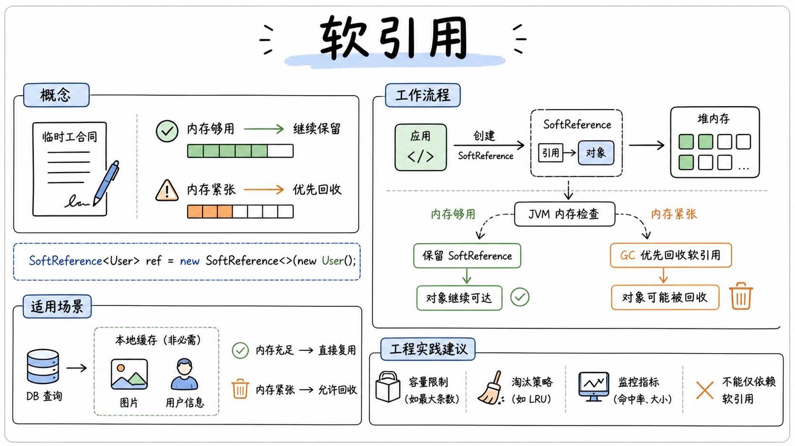

软引用像一份临时工合同：内存够用时可以继续保留，内存紧张时会优先回收。

```java
SoftReference<User> ref = new SoftReference<>(new User());
```

软引用适合描述一些非必需缓存。例如把从数据库查询到的图片或用户信息放到本地缓存中，内存充足时直接复用；内存紧张时允许 JVM 回收。

不过在实际工程中，缓存通常还需要明确的容量限制和淘汰策略，不能只依赖软引用。

## 弱引用
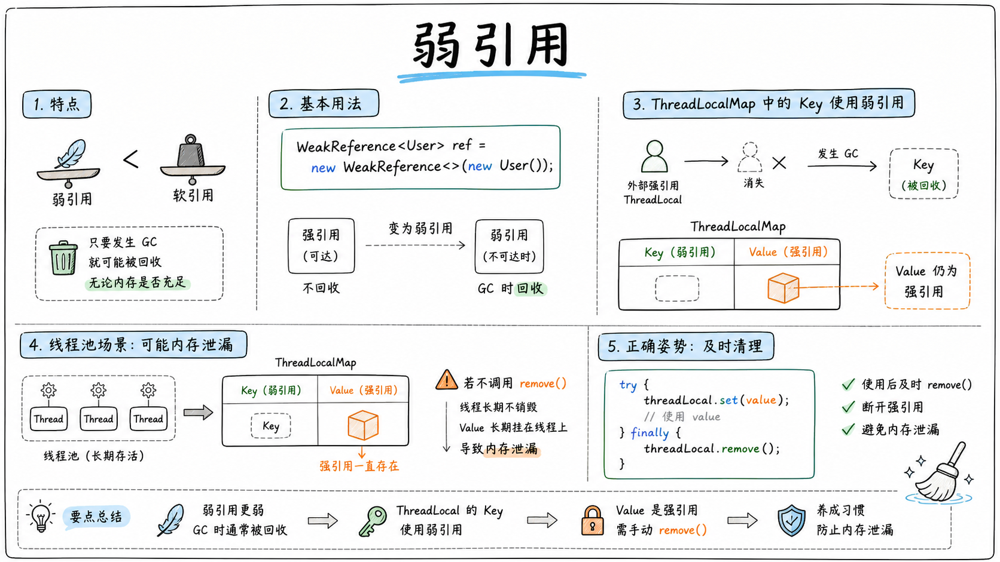

弱引用比软引用更弱。只被弱引用关联的对象，一旦发生垃圾回收，无论当前内存是否充足，通常都会被回收。

```java
WeakReference<User> ref = new WeakReference<>(new User());
```

`ThreadLocalMap` 中的 Key 使用了弱引用。如果外部对某个 `ThreadLocal` 的强引用消失，发生 GC 后，这个 Key 可能被回收。

但需要注意，`ThreadLocalMap` 的 Value 仍然是强引用。如果线程池中的线程长期不销毁，又没有及时调用 `remove()`，Value 仍可能长期挂在线程上，导致内存泄漏。

```java
try {
    threadLocal.set(value);
    // 使用 value
} finally {
    threadLocal.remove();
}
```

## 虚引用
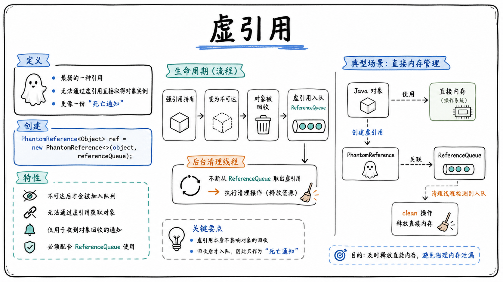

虚引用是最弱的一种引用，无法通过虚引用直接取得对象实例。它更像一份“死亡通知”。

```java
PhantomReference<Object> ref =
        new PhantomReference<>(object, referenceQueue);
```

对象被回收后，相关虚引用会进入引用队列，后台程序可以据此完成资源清理。

典型场景是直接内存管理。NIO 等组件使用直接内存时，当对应 Java 对象被回收，后台清理机制可以感知引用状态并执行 `clean` 操作，释放操作系统层面的直接内存，避免物理内存泄漏。

## 逃逸分析与 JVM 优化
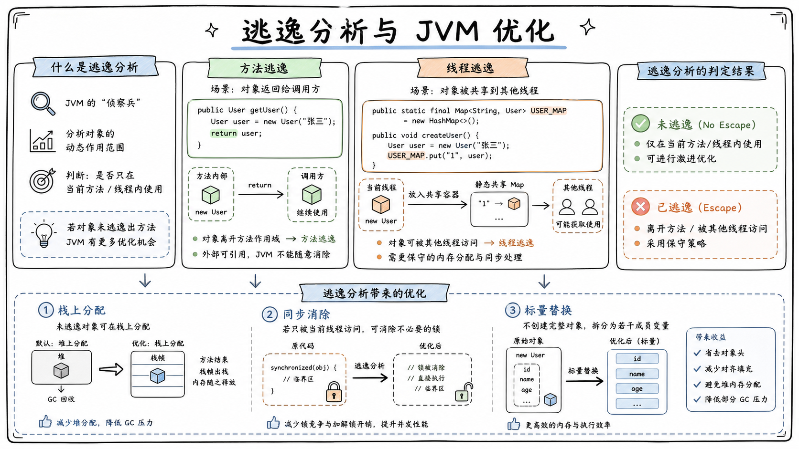

## 什么是逃逸分析
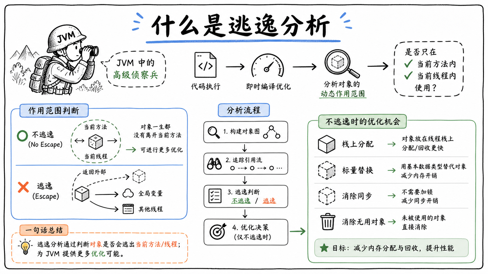

逃逸分析可以理解为 JVM 中的高级侦察兵。在代码执行和即时编译优化过程中，JVM 会分析某个对象的动态作用范围，判断它是否只在当前方法或当前线程内部使用。

如果一个对象一辈子都没有离开当前方法，JVM 就有机会对它进行更多优化。

## 方法逃逸
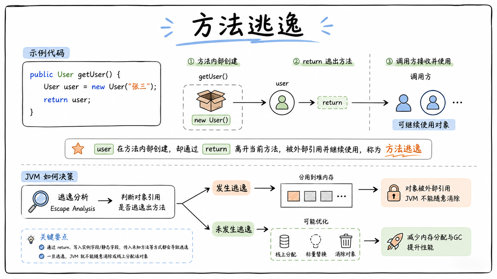

假设在方法内部创建一个对象，最后又把它返回给调用方：

```java
public User getUser() {
    User user = new User("张三");
    return user;
}
```

`user` 在方法内部创建，却通过 `return` 离开了当前方法。调用方拿到对象后可以继续使用它，这就叫**方法逃逸**。

既然对象已经被外部引用，JVM 就不能随意消除它。

## 线程逃逸
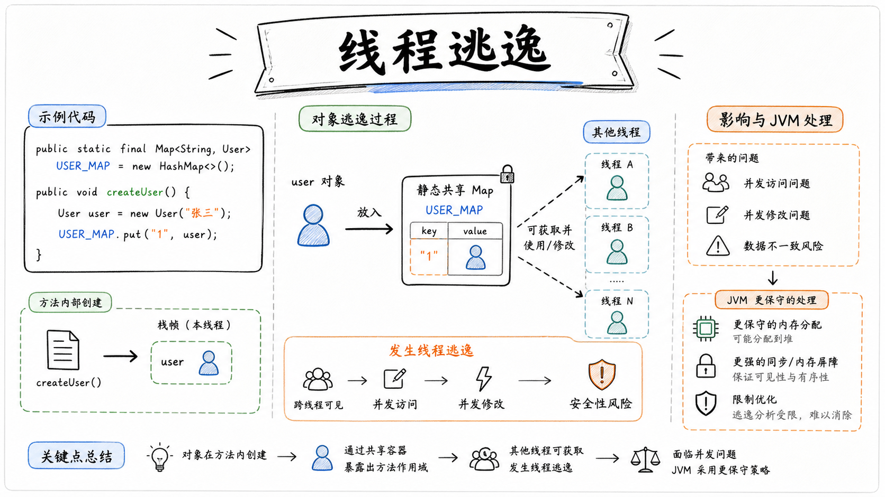

假设类中有一个所有线程共享的静态 `Map`：

```java
public static final Map<String, User> USER_MAP = new HashMap<>();

public void createUser() {
    User user = new User("张三");
    USER_MAP.put("1", user);
}
```

`user` 原本在方法内部创建，但被放进了静态共享 `Map`，其他线程也可能拿到它，这就发生了**线程逃逸**。

线程逃逸还意味着对象可能面临并发访问和并发修改问题，JVM 通常需要按照更保守的方式进行内存分配与同步处理。

## 逃逸分析带来的优化
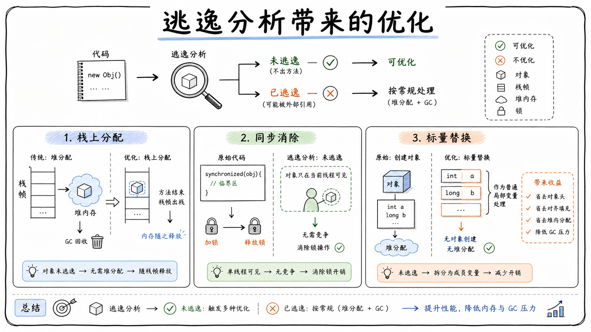

### 1. 栈上分配

正常情况下，对象通常分配在堆中，之后等待 GC 回收。

如果 JVM 判断对象没有逃出当前方法，就可能通过优化手段避免传统堆分配。方法结束、栈帧出栈后，相关内存随之释放，不需要垃圾收集器单独处理。

### 2. 同步消除

假设代码中使用了 `synchronized`，但 JVM 通过逃逸分析发现被锁对象只会被当前线程访问，其他线程根本无法接触到它。

既然不存在多线程竞争，JVM 就可能消除这次锁操作，减少获取锁和释放锁的性能开销。

### 3. 标量替换

如果 JVM 发现对象没有逃逸，甚至可能不真正创建完整对象，而是把对象拆成若干个成员变量，作为普通局部变量进行处理。

这样可以省去：

- 对象头
- 对齐填充
- 堆内存分配
- 部分垃圾回收压力

这就是标量替换带来的优化效果。

## JVM 内存问题与调优
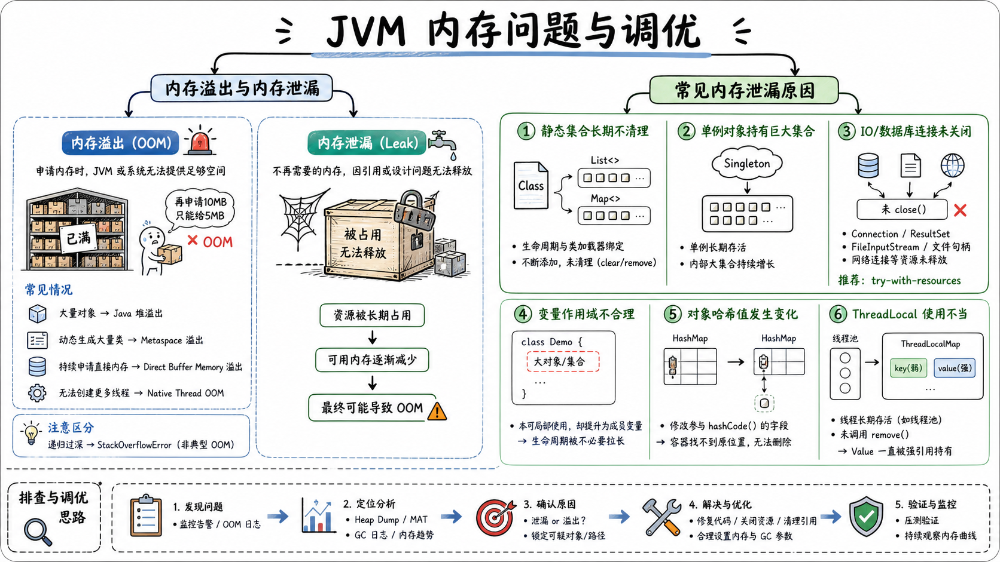

## 内存溢出与内存泄漏
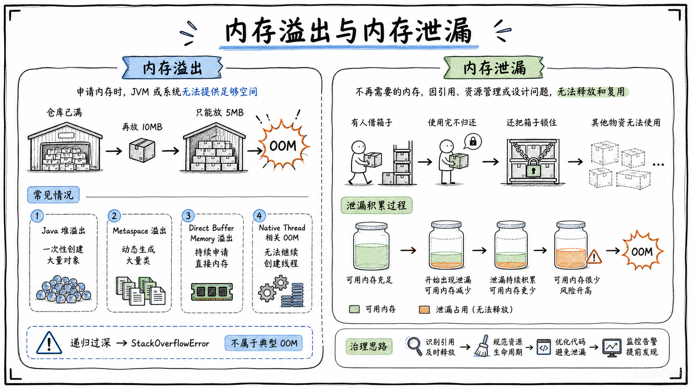

### 内存溢出

内存溢出即 `OutOfMemoryError`，表示程序申请内存时，JVM 或系统已经无法提供足够空间。

可以把它理解为仓库已经完全塞满，连一颗螺丝钉都放不下。程序想再申请 10MB，但 JVM 只能提供 5MB，于是抛出错误。

常见情况包括：

- 一次性创建大量对象，导致 Java 堆溢出。
- 动态生成大量类，导致 Metaspace 溢出。
- 持续申请直接内存，导致 Direct Buffer Memory 溢出。
- 无法继续创建线程，产生 Native Thread 相关 OOM。

需要区分的是：递归过深通常抛出的是 `StackOverflowError`，不属于典型的 `OutOfMemoryError`。

### 内存泄漏

内存泄漏是指程序已经不再需要某块内存，但由于引用、资源管理或代码设计问题，导致这块内存无法释放和重新利用。

它相当于有人借用了仓库中的箱子，使用完后既不归还，还把箱子锁住。其他物资无法再使用这些位置。随着泄漏不断积累，可用内存越来越少，最终可能进一步导致 OOM。

## 常见内存泄漏原因
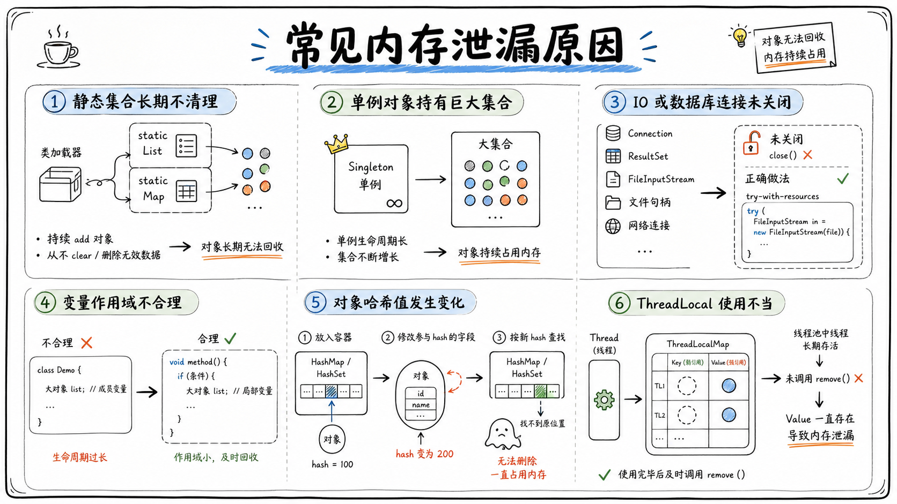

### 1. 静态集合长期不清理

```java
private static final List<Object> LIST = new ArrayList<>();
private static final Map<String, Object> MAP = new HashMap<>();
```

静态集合的生命周期通常与类加载器绑定。如果不断向集合中添加对象，却从不执行 `clear()` 或删除无效数据，这些对象就可能长期无法回收。

### 2. 单例对象持有巨大集合

单例对象本身通常长期存活。如果单例内部持有一个不断增长的大集合，单例不销毁，这个集合中的对象也会一直占用内存。

### 3. IO 或数据库连接未关闭

例如：

- `Connection`
- `ResultSet`
- `FileInputStream`
- 文件句柄
- 网络连接

如果使用后没有调用 `close()`，就可能导致 Java 对象或操作系统资源长期无法释放。

推荐使用：

```java
try (FileInputStream input = new FileInputStream(file)) {
    // 读取文件
}
```

### 4. 变量作用域不合理

某个对象只需要在一个 `if` 代码块中使用，却被定义为类成员变量，会导致它的生命周期被不必要地拉长。

例如本来只是局部判断需要的 `type`，却被提升到了成员变量级别。对于基本类型影响通常很小，但如果是大型对象或集合，就可能造成不必要的长期占用。

### 5. 对象哈希值发生变化

对象被放入 `HashMap` 或 `HashSet` 后，如果又修改了参与 `hashCode()` 计算的字段，可能导致对象的哈希值变化。

此后容器按照新的哈希值去查找，可能再也找不到原来的存储位置，也就无法正常删除该对象。就像把快递放进柜子后，又偷偷改了取件码，最后谁也取不出来，快递只能一直占着柜子。

### 6. ThreadLocal 使用不当

`ThreadLocalMap` 的 Key 是弱引用，但 Value 是强引用。如果使用线程池，线程会长期存活；使用完 `ThreadLocal` 后又没有调用 `remove()`，Value 就可能一直挂在线程的 `ThreadLocalMap` 上，最终导致内存泄漏。

## 内存问题的排查流程
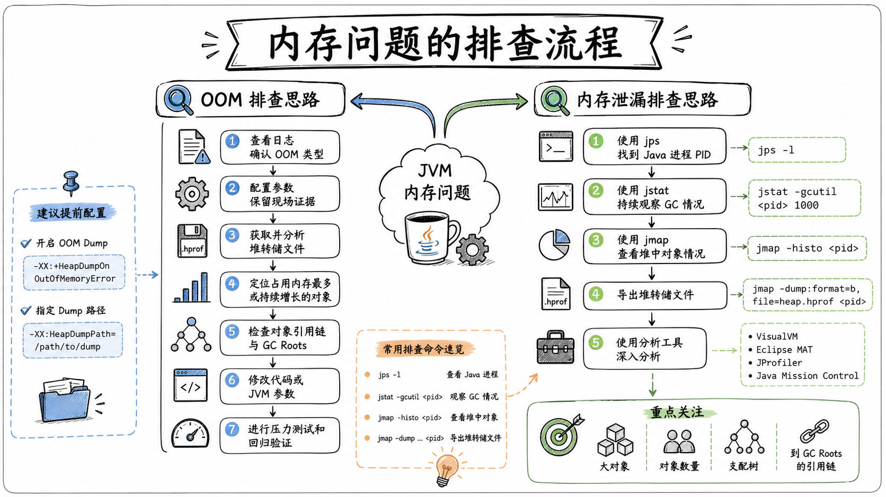

## OOM 排查思路
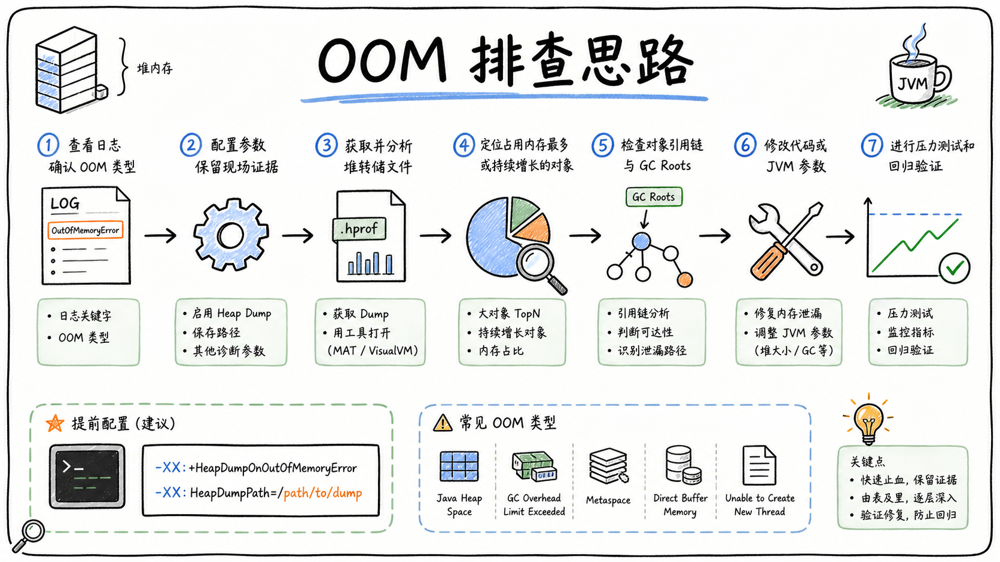

发生 OOM 后，可以按以下流程处理：

1. **查看日志，确认 OOM 类型**
2. **配置参数，保留现场证据**
3. **获取并分析堆转储文件**
4. **定位占用内存最多或持续增长的对象**
5. **检查对象引用链与 GC Roots**
6. **修改代码或 JVM 参数**
7. **进行压力测试和回归验证**

建议提前配置：

```bash
-XX:+HeapDumpOnOutOfMemoryError
-XX:HeapDumpPath=/path/to/dump
```

## 内存泄漏排查思路
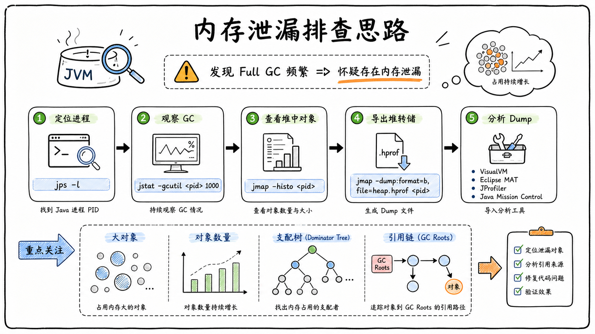

如果发现 Full GC 频繁，可以怀疑是否存在内存泄漏。

1. 使用 `jps` 找到 Java 进程 PID：

   ```bash
   jps -l
   ```

2. 使用 `jstat` 持续观察 GC 情况：

   ```bash
   jstat -gcutil <pid> 1000
   ```

3. 使用 `jmap` 查看堆中对象情况：

   ```bash
   jmap -histo <pid>
   ```

4. 导出堆转储文件：

   ```bash
   jmap -dump:format=b,file=heap.hprof <pid>
   ```

5. 将 Dump 文件导入分析工具，例如：

   - VisualVM
   - Eclipse MAT
   - JProfiler
   - Java Mission Control

重点查看大对象、对象数量、支配树以及对象到 GC Roots 的引用链。

## 常见 JVM 参数与工具
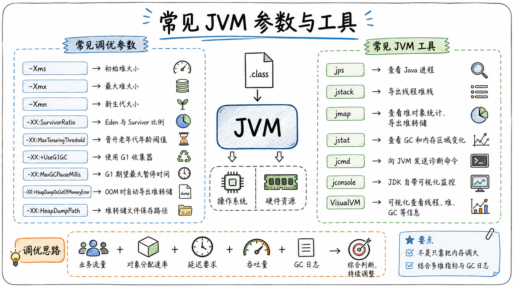

## 常见调优参数
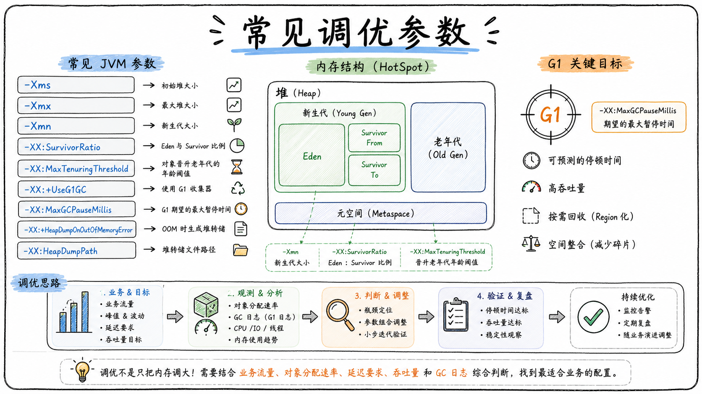

常见 JVM 参数包括：

```bash
-Xms                         # 初始堆大小
-Xmx                         # 最大堆大小
-Xmn                         # 新生代大小
-XX:SurvivorRatio            # Eden 与 Survivor 的比例
-XX:MaxTenuringThreshold     # 对象晋升老年代的年龄阈值
-XX:+UseG1GC                 # 使用 G1 收集器
-XX:MaxGCPauseMillis         # G1 期望的最大暂停时间
-XX:+HeapDumpOnOutOfMemoryError
-XX:HeapDumpPath
```

调优不能只靠把内存调大，还要结合业务流量、对象分配速率、延迟要求、吞吐量和 GC 日志综合判断。

## 常见 JVM 工具
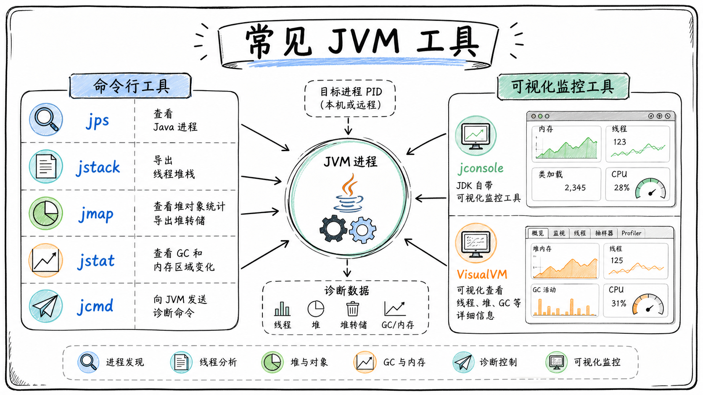

- `jps`：查看 Java 进程。
- `jstack`：导出线程堆栈。
- `jmap`：查看堆对象统计、导出堆转储。
- `jstat`：查看 GC 和内存区域变化。
- `jcmd`：向 JVM 发送诊断命令。
- `jconsole`：JDK 自带的可视化监控工具。
- `VisualVM`：可视化查看线程、堆、GC 等信息。

## CPU 飙高排查
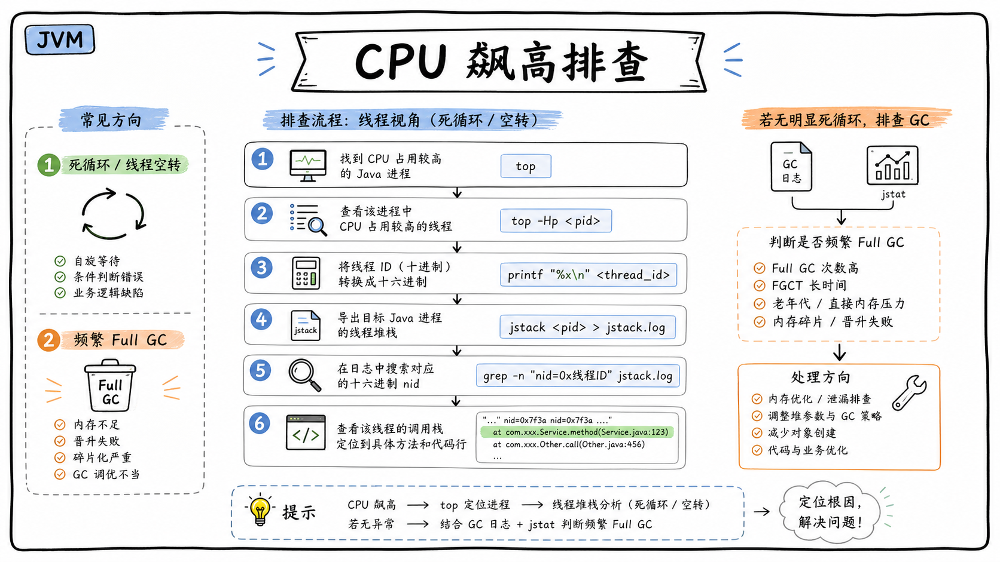

CPU 飙高通常有两个常见方向：

1. 死循环或线程空转。
2. 频繁 Full GC。

可以按照以下思路排查：

1. 使用 `top` 找到 CPU 占用较高的 Java 进程：

   ```bash
   top
   ```

2. 查看该进程中 CPU 占用较高的线程：

   ```bash
   top -Hp <pid>
   ```

3. 将线程 ID 从十进制转换成十六进制：

   ```bash
   printf "%x\n" <thread_id>
   ```

4. 使用 `jstack` 导出目标 Java 进程的线程堆栈：

   ```bash
   jstack <pid> > jstack.log
   ```

5. 在日志中搜索对应的十六进制 `nid`：

   ```bash
   grep -n "nid=0x线程ID" jstack.log
   ```

6. 查看该线程正在执行的代码位置，最终定位到具体方法和代码行。

如果线程堆栈没有明显死循环，就需要结合 GC 日志和 `jstat` 判断是否是频繁 Full GC 导致 CPU 占用过高。

## JVM 类加载机制
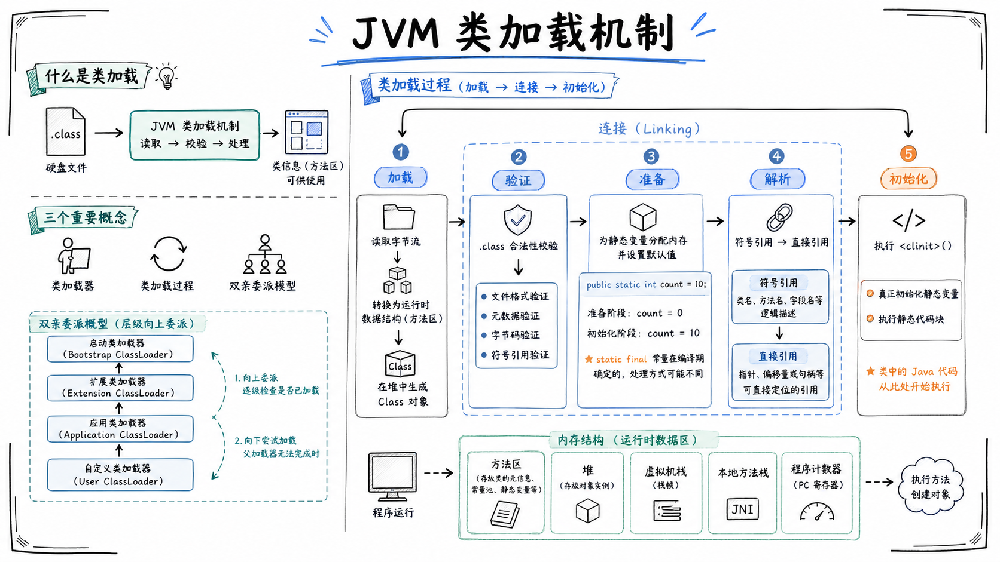

## 什么是类加载
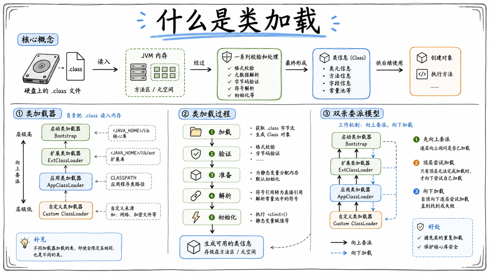

类加载就是把硬盘上的 `.class` 文件读入 JVM 内存，经过一系列校验和处理，最终形成 JVM 可以直接使用的类信息，供后续创建对象和执行方法使用。

类加载机制有三个重要概念：

- 类加载器
- 类加载过程
- 双亲委派模型

## 类加载过程
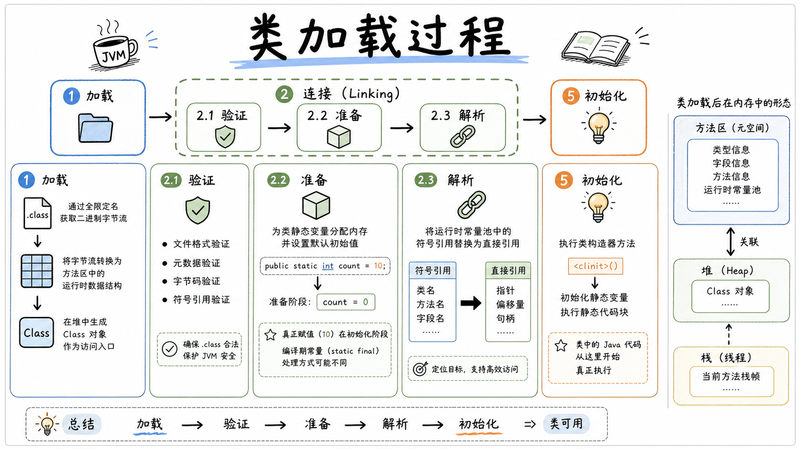

完整的类加载生命周期通常包括加载、连接和初始化，其中连接又包括验证、准备和解析。

### 1. 加载

通过类的全限定名获取对应的二进制字节流，将字节流表示的静态存储结构转换为方法区中的运行时数据结构，并在堆中生成对应的 `Class` 对象，作为访问类信息的入口。

### 2. 验证

验证 `.class` 文件是否合法，防止恶意或错误的字节码破坏 JVM。

验证内容通常包括：

- 文件格式验证
- 元数据验证
- 字节码验证
- 符号引用验证

### 3. 准备

为类静态变量分配内存，并设置默认初始值。

例如：

```java
public static int count = 10;
```

准备阶段通常先把 `count` 设为 `0`，真正赋值为 `10` 一般发生在初始化阶段。被 `static final` 修饰且能够在编译期确定的常量，处理方式可能不同。

### 4. 解析

把运行时常量池中的**符号引用**替换成**直接引用**。

符号引用可以理解为类名、方法名、字段名等逻辑描述；直接引用则是能够直接定位到目标的指针、偏移量或句柄。

### 5. 初始化

执行类构造器方法 `<clinit>()`，真正初始化静态变量，并执行静态代码块。

初始化是类加载过程中非常关键的一步，类中的 Java 代码从这里开始真正执行。

## 类加载器与双亲委派模型
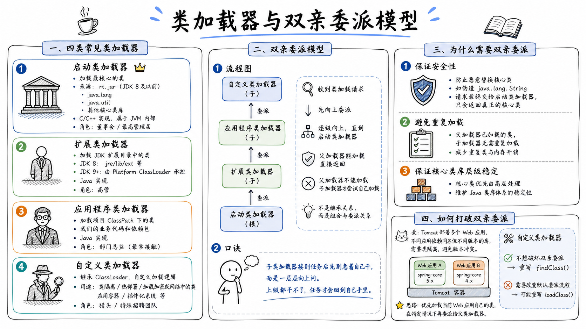

## 四类常见类加载器
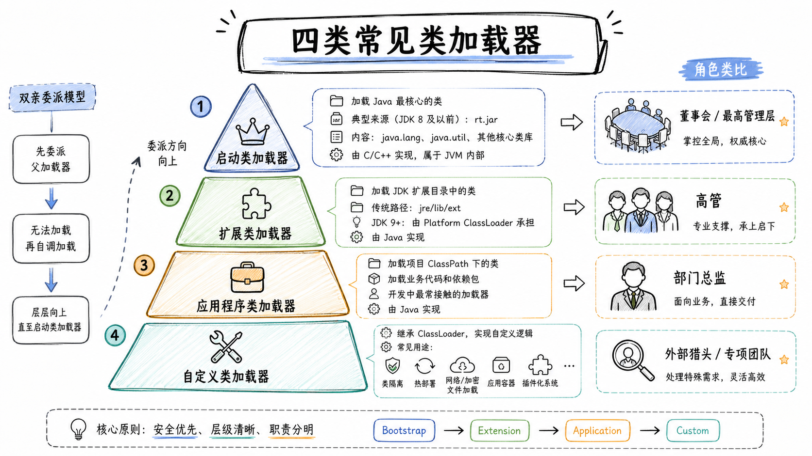

### 1. 启动类加载器

启动类加载器 Bootstrap ClassLoader 负责加载 Java 最核心的类。

在 JDK 8 及以前，典型来源包括 `rt.jar`，内容涉及：

- `java.lang`
- `java.util`
- 其他核心类库

它由 C/C++ 实现，属于 JVM 内部的一部分，Java 代码通常无法直接取得它的普通对象引用。

可以把它理解成公司的董事会或最高管理层。

### 2. 扩展类加载器

扩展类加载器 Extension ClassLoader 主要负责加载 JDK 扩展目录中的类，例如传统 JDK 中 `jre/lib/ext` 目录下的扩展类库。

它由 Java 实现，可以理解为公司的高管。

> JDK 9 引入模块化系统后，原有扩展类加载机制发生了变化，对应角色通常由 Platform ClassLoader 承担。

### 3. 应用程序类加载器

应用程序类加载器 Application ClassLoader 主要加载项目 ClassPath 下的类，也就是我们自己编写的业务代码和依赖包。

它可以理解为部门总监，也是开发中最常接触的类加载器。

### 4. 自定义类加载器

开发者可以继承 `ClassLoader`，实现自己的类加载逻辑。

它可以用于：

- 类隔离
- 热部署
- 从网络或加密文件中加载类
- 应用容器
- 插件化系统

可以把它理解为外部猎头或专门处理特殊招聘任务的团队。

## 双亲委派模型
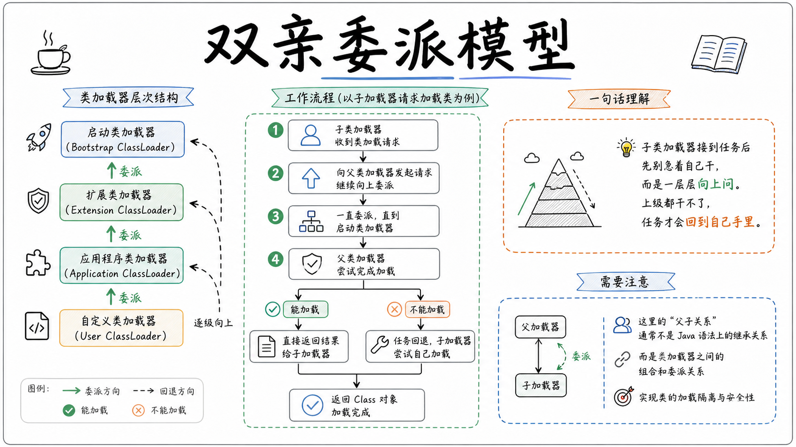

一个类加载器收到类加载请求后，通常不会立刻自己加载，而是先把请求委派给父类加载器。父类加载器继续向上委派，直到启动类加载器。

如果父类加载器能够完成加载，就直接返回结果；只有父类加载器无法加载时，子类加载器才会尝试自己加载。

简单来说就是：

> 子类加载器接到任务后先别急着自己干，而是一层层向上问。上级都干不了，任务才会回到自己手里。

需要注意，这里的“父子关系”通常不是 Java 语法上的继承关系，而是类加载器之间的组合和委派关系。

## 为什么需要双亲委派
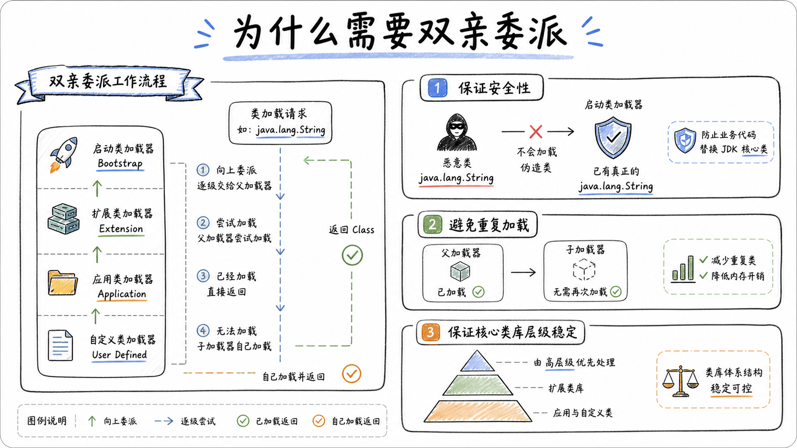

### 1. 保证安全性

假设有人在项目中伪造了一个恶意类：

```text
java.lang.String
```

按照双亲委派模型，加载请求会一路交给启动类加载器。启动类加载器发现核心类库中已经存在真正的 `java.lang.String`，就不会加载项目中伪造的版本。

这样可以防止业务代码替换 JDK 核心类。

### 2. 避免重复加载

父类加载器已经加载过的类，子类加载器不需要再加载一遍，可以减少重复类和额外内存开销。

### 3. 保证核心类库层级稳定

双亲委派能够让 Java 核心类优先由更高层级的类加载器处理，保证类库体系结构相对稳定。

## 如何打破双亲委派
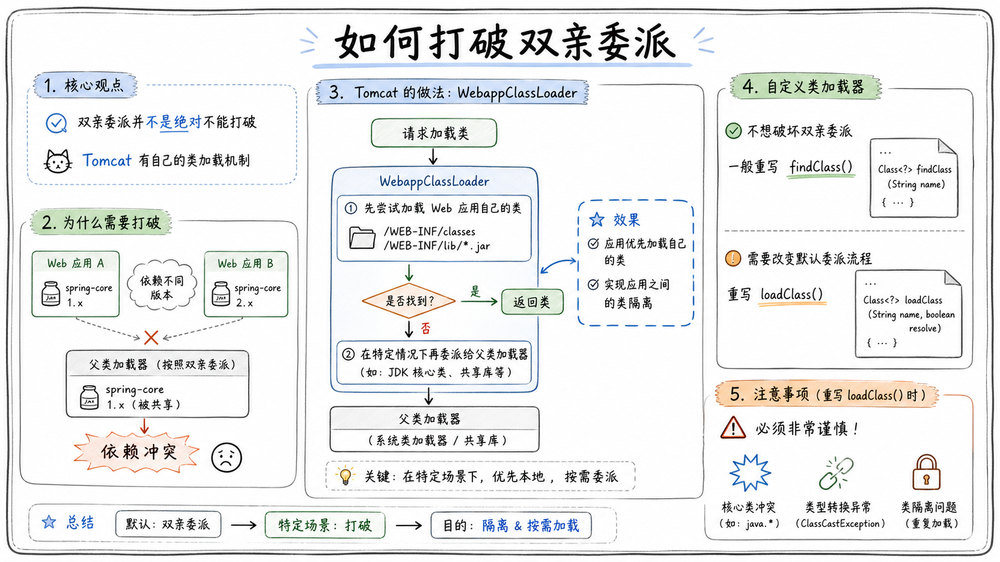

双亲委派并不是绝对不能打破。Tomcat 就有自己的类加载机制。

Tomcat 需要同时部署多个 Web 应用。如果两个应用分别依赖不同版本的 `spring-core`，完全按照传统双亲委派模式加载，两个应用可能共用同一个版本，从而发生依赖冲突。

因此，Tomcat 的 `WebappClassLoader` 会优先尝试加载 Web 应用自己的类，在特定情况下再委派给父类加载器，从而实现应用之间的类隔离。

对于自定义类加载器：

- 如果不想破坏双亲委派，一般重写 `findClass()`。
- 如果需要改变默认委派流程，则可能重写 `loadClass()`。

重写 `loadClass()` 时必须非常谨慎，否则可能引发核心类冲突、类型转换异常和类隔离问题。

## JVM 面试知识的整体脉络
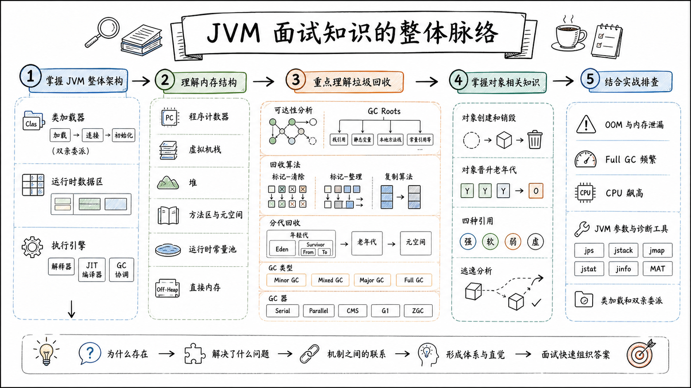

JVM 的知识可以按照下面的顺序理解和复习：

1. **先掌握 JVM 整体架构**
   - 类加载器
   - 运行时数据区
   - 执行引擎

2. **再理解内存结构**
   - 程序计数器
   - 虚拟机栈
   - 堆
   - 方法区与元空间
   - 运行时常量池
   - 直接内存

3. **重点理解垃圾回收**
   - 可达性分析
   - GC Roots
   - 标记——清除、标记——整理、复制算法
   - 分代回收
   - Minor GC、Mixed GC、Major GC、Full GC
   - Serial、Parallel、CMS、G1、ZGC

4. **继续掌握对象相关知识**
   - 对象创建和销毁
   - 对象晋升老年代
   - 四种引用
   - 逃逸分析

5. **最后结合实战排查**
   - OOM 与内存泄漏
   - Full GC 频繁
   - CPU 飙高
   - JVM 参数与诊断工具
   - 类加载和双亲委派

这些内容不必完全死记硬背。更重要的是建立整体脉络，理解每个机制为什么存在、解决了什么问题，以及它们之间有什么联系。通过导图或结构化笔记不断补充和复习，对 JVM 的理解就会越来越清晰，面试时也更容易快速组织答案。
