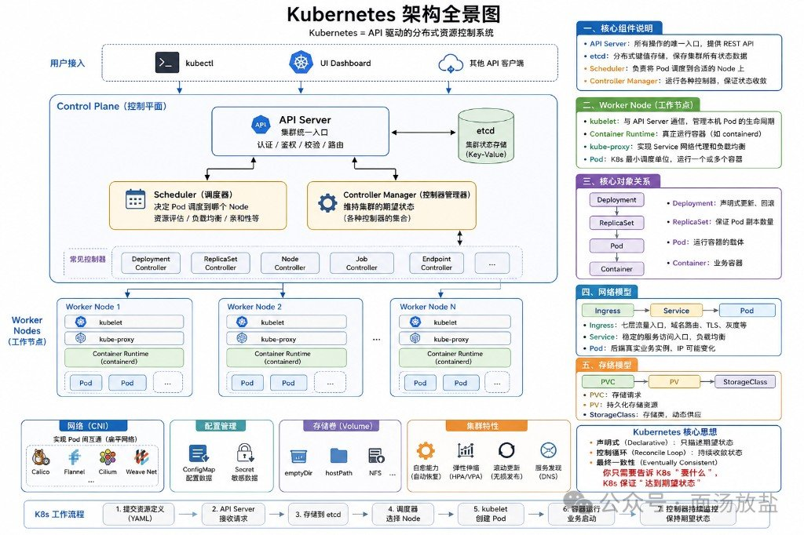
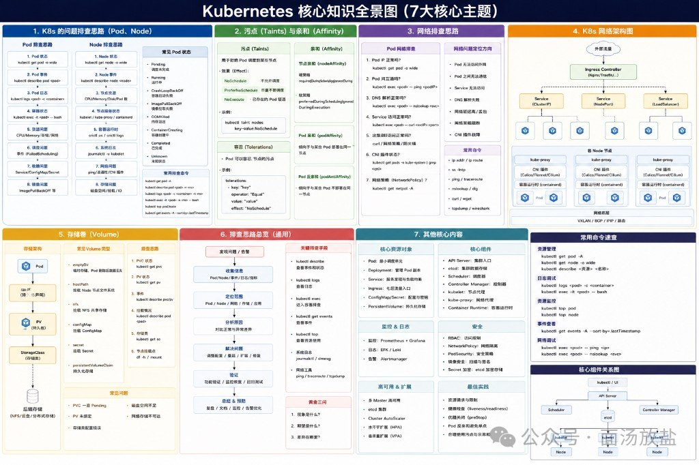

K8s 组件名一堆，记不住很正常。这两张图一个讲「请求怎么从 YAML 落到 Pod」，一个讲「出事时按哪七条线查」。下面尽量跟图面走，当可读速查，不当完整教程。

旁链（**不硬并**）：容器层命令见 Docker 命令背会这条线就够日常（待发布）；运维工具选型见 运维自动化选型：先摸清这十件工具（待发布）。网络基础旁链文末。

---

## 图 1：架构全景，控制面怎么把期望状态推下去



图题：**Kubernetes 架构全景图**  
副标：**Kubernetes = API 驱动的分布式资源控制系统**

### 从上往下：谁接请求、谁干活

| 层 | 图面内容 |
|---|---|
| 用户接入 | `kubectl` / UI Dashboard / 其他 API 客户端 |
| Control Plane | API Server、etcd、Scheduler、Controller Manager |
| Worker Nodes | 多节点：kubelet、kube-proxy、Container Runtime（containerd）、Pod |
| 底座能力 | 网络（CNI）、配置管理、存储（Volume）、集群特性 |

**Control Plane（控制平面）**

| 组件 | 图面职责 |
|---|---|
| API Server | 集群统一入口；认证 / 鉴权 / 校验 / 路由；提供 REST API |
| etcd | 集群状态存储（Key-Value）；保存全部状态数据 |
| Scheduler | 决定 Pod 调度到哪个 Node；资源评估 / 负载均衡 / 亲和性等 |
| Controller Manager | 维持期望状态；各种控制器的集合 |

常见控制器（图面列举）：Deployment、ReplicaSet、Node、Job、Endpoint……

**Worker Node（工作节点）**

| 组件 | 图面职责 |
|---|---|
| kubelet | 与 API Server 通信；管理本机 Pod 生命周期 |
| Container Runtime | 真正跑容器（如 containerd） |
| kube-proxy | Service 网络代理与负载均衡 |
| Pod | 最小调度单位；跑一个或多个容器 |

**底座四块**

| 块 | 图面要点 |
|---|---|
| 网络（CNI） | Pod 互通（扁平网络）：Calico / Flannel / Cilium / Weave Net…… |
| 配置管理 | ConfigMap（配置数据）、Secret（敏感数据） |
| 存储（Volume） | emptyDir / hostPath / NFS…… |
| 集群特性 | 自愈；弹性伸缩（HPA/VPA）；滚动更新；服务发现（DNS） |

### 底部工作流：YAML → 期望状态

图面七步：

1. 提交资源定义（YAML）
2. API Server 接收请求
3. 存储到 etcd
4. 调度器选择 Node
5. kubelet 创建 Pod
6. 容器运行 / 业务启动
7. Controller 持续监控 / 保持期望状态

记这条线就够：你交「想要什么」，集群用调和环不停往那个状态靠。

### 右侧概念卡（建议和左图画面对着看）

**一、核心组件**  
API Server 统一入口 → etcd 存状态 → Scheduler 选节点 → Controller Manager 做收敛。

**二、Worker Node**  
kubelet 管生命周期；Runtime 跑容器；kube-proxy 做 Service 代理；Pod 是载体。

**三、核心对象关系**

```text
Deployment → ReplicaSet → Pod → Container
```

| 对象 | 图面一句话 |
|---|---|
| Deployment | 声明式更新、回滚 |
| ReplicaSet | 保证 Pod 副本数 |
| Pod | 跑容器的载体 |
| Container | 业务容器本身 |

**四、网络模型**

```text
Ingress → Service → Pod
```

| 对象 | 图面一句话 |
|---|---|
| Ingress | 七层入口：域名路由、TLS、灰度等 |
| Service | 稳定访问入口 + 负载均衡 |
| Pod | 真实实例；IP 可能变 |

**五、存储模型**

```text
PVC → PV → StorageClass
```

| 对象 | 图面一句话 |
|---|---|
| PVC | 存储需求（申请） |
| PV | 持久化存储资源 |
| StorageClass | 存储类；动态供应 |

**六、核心思想（图脚）**

| 词 | 意思 |
|---|---|
| 声明式 Declarative | 只描述期望状态 |
| 控制循环 Reconcile Loop | 持续向期望收敛 |
| 最终一致性 Eventually Consistent | 告诉 K8s「要什么」，它保证「达到」 |

图脚原句气质：**你只需要告诉 K8s「要什么」，K8s 保证「达到期望状态」。**

---

## 图 2：七大主题速查，出事按哪条线查



图题：**Kubernetes 核心知识全景图（7 大核心主题）**

### 1. Pod / Node 排障思路

**Pod 侧（图面清单气质）**

- 状态与落点：`kubectl get pod -o wide`
- 事件：`kubectl describe pod`
- 日志：`kubectl logs`（含 previous）
- 进容器：`kubectl exec`
- 资源：CPU / Mem / Disk / Net；`kubectl top pod`
- 调度失败：看 FailedScheduling 一类事件
- 依赖：Service / ConfigMap / Secret 是否齐
- 镜像：ImagePullBackOff / ErrImagePull 等

**Node 侧**

- `kubectl get node` / `describe node`
- 状态：Ready、NotReady、SchedulingDisabled、NetworkUnavailable 等
- 资源打满（CPU/Mem）、磁盘 / IO、OOM / 内核日志（`dmesg`）
- 系统服务：kubelet / kube-proxy / containerd；`journalctl -u kubelet`
- 运行时：`crictl`；存储与网络再往下拆

**常见 Pod 状态（图面）**

| 状态 | 含义（图面） |
|---|---|
| Pending | 调度未完成 |
| Running | 正在运行 |
| CrashLoopBackOff | 容器反复启动失败 |
| ImagePullBackOff / ErrImagePull | 镜像拉取失败 / 错误 |
| OOMKilled | 内存溢出被杀 |
| ContainerCreating | 创建中（常伴随拉镜像） |
| Completed | 任务正常结束 |
| Unknown / Error | 未知 / 异常退出 |
| CreateContainerConfigError 等 | 配置或创建阶段出错 |

### 2. 污点（Taints）与亲和（Affinity）

| 概念 | 图面要点 |
|---|---|
| Taints | 节点排斥某类 Pod；Effect：`NoSchedule` / `PreferNoSchedule` / `NoExecute` |
| Tolerations | Pod 声明容忍，才能上带对应污点的节点 |
| nodeAffinity | 按节点标签硬选 / 软偏好（required / preferred） |
| podAffinity | 倾向和某些 Pod 靠近 |
| podAntiAffinity | 倾向和某些 Pod 远离 |

常用命令气质：

```bash
kubectl taint nodes <node> key=value:NoSchedule
kubectl taint nodes <node> key:NoSchedule-
```

### 3. 网络排查思路

**Pod 网络检查线（图面）**

1. Pod IP 是否正常（`get pod -o wide`）
2. Pod 间连通（`ping` 等）
3. DNS（`nslookup` / `dig`）
4. 访问 Service（`curl`）
5. 出网 / 外部访问
6. CNI 插件状态
7. NetworkPolicy 是否挡路

**常见现象**

- 同网 / 跨 Pod 不通
- Service 不通、DNS 失败
- 延迟高 / 丢包
- CNI 故障、kube-proxy 异常
- 外网域名解析失败

**节点侧常用命令（图面）**

`ip addr` / `ip route`、`ss`、`ping`、`traceroute`、`nslookup`、`curl`、`tcpdump`

NetworkPolicy：`kubectl get networkpolicy` / `describe networkpolicy`

### 4. K8s 网络架构（图面分层）

```text
外部流量
  → Ingress Controller（Nginx / Traefik …）
  → Service（ClusterIP / NodePort / LoadBalancer）
  → 各 Node 上的 Pod
```

每个 Node 上大致有：kube-proxy（iptables / IPVS）、CNI（Calico / Flannel / Cilium…）、Container Runtime、Pod。  
Overlay / 底层常见词：VXLAN、BGP、IPIP、路由。

和架构图右侧「Ingress → Service → Pod」是同一条故事，这里多了「进集群后怎么在节点间铺」。

### 5. 存储卷（Volume）

**关系（图面）**

```text
Pod → PVC → PV → StorageClass → 后端存储（NFS / 云盘 / 分布式存储…）
```

**常见 Volume 类型**

| 类型 | 图面说明 |
|---|---|
| emptyDir | 临时；Pod 删则没 |
| hostPath | 挂节点本地路径 |
| nfs | NFS 共享 |
| configMap / secret | 挂配置 / 敏感数据 |
| persistentVolumeClaim | 经 PVC 申请持久卷 |

**排查**

- `kubectl get/describe pvc`、`get/describe pv`
- `get/describe storageclass`（或 `sc`）
- Pod 内挂载点、节点 `df -h`、相关 events

**常见坑**

PVC Pending、PV 未绑定、配置错误、磁盘满、网络存储不可达、权限不够。

### 6. 通用排障流程 + 金三角

图面七步气质：

1. 发现问题 / 告警  
2. 收集信息（Pod、Node、events、logs、metrics）  
3. 划范围（Pod / Node / 网络 / 存储 / 应用）  
4. 比正常 vs 异常，定因  
5. 处置（改配置、重启、扩缩容、修依赖）  
6. 验证（功能 + 监控恢复）  
7. 复盘与预防（文档、告警优化）

**金三角（图面）**

1. 现象是什么？  
2. 期望是什么？  
3. 差异在哪里？

这三问比瞎敲命令有用：先对齐「该什么样」，再找差。

### 7. 其他核心内容（图面格子）

| 格 | 图面条目 |
|---|---|
| 核心资源对象 | Pod、Deployment、Service、Ingress、ConfigMap/Secret、PV/PVC、Job/CronJob、StatefulSet、DaemonSet、HPA、NetworkPolicy、ServiceAccount… |
| 核心组件 | API Server、etcd、Scheduler、Controller Manager、kubelet、kube-proxy、Container Runtime |
| 监控 & 日志 | Prometheus + Grafana；EFK / Loki；Alertmanager |
| 安全 | RBAC、NetworkPolicy、PodSecurity、镜像安全、Secret 加密、Security Context |
| 高可用 & 扩展 | 多 Master、etcd 集群、Cluster Autoscaler、HPA/VPA、CRD、Operator、Metrics Server、Dashboard… |
| 最佳实践 | requests/limits；liveness/readiness；优雅关闭（preStop）；反亲和避免单点 |

### 侧栏：常用命令速查（图面）

| 类 | 命令气质 |
|---|---|
| 资源管理 | `kubectl get pod -A`、`get node -o wide`、`describe <资源> <名>` |
| 日志调试 | `kubectl logs`（含 `-p` / `-c`）、`kubectl exec -it <pod> -- bash` |
| 资源监控 | `kubectl top pod`、`kubectl top node` |
| 事件 | `kubectl get events -A --sort-by=.lastTimestamp` |
| 集群信息 | `kubectl version`、`cluster-info`、`get cs`（组件状态，视版本而定） |
| 节点维操 | `cordon` / `drain --ignore-daemonsets` / `uncordon` |

**底部组件关系（图面简化）**

```text
kubectl / UI
    ↓
API Server ←→ etcd
    ↓
Scheduler / Controller Manager
    ↓
kubelet / kube-proxy → Nodes → Pods
```

和架构全景是同一套骨架：所有路都先过 API Server。

---

## kubectl 命令小表（从图面抽）

| 场景 | 命令 |
|---|---|
| 看 Pod 落点 | `kubectl get pod -o wide` / `-A` |
| 看事件 | `kubectl describe pod <name>`；`kubectl get events --sort-by=.lastTimestamp` |
| 看日志 | `kubectl logs <pod>`；挂了加 `-p` / `-c` |
| 进容器 | `kubectl exec -it <pod> -- bash` |
| 看资源 | `kubectl top pod` / `top node` |
| 污点 | `kubectl taint nodes <node> key=value:NoSchedule` |
| 节点封锁/腾空 | `cordon` / `drain` / `uncordon` |
| 存储 | `kubectl get pvc,pv,sc` + `describe` |
| 网络策略 | `kubectl get networkpolicy -A` |

Docker 本机命令不在本篇展开，去旁链 Docker 速查。

---

## 旁边几篇别搅成一锅

| 旁链 | 它管啥 | 别跟本篇混 |
|---|---|---|
| Docker 命令背会这条线就够日常（待发布） | Docker CLI | 单机容器命令 ≠ 集群编排 |
| 运维自动化选型：先摸清这十件工具（待发布） | 运维工具地图 | 工具选型 ≠ K8s 控制面 |
| 网络协议靠谁才能活：一张依赖图（待发布） | 协议依赖 | 协议栈 ≠ CNI/Service 排障 |
| [网卡那四栏到底各自干嘛](../2026-08-09_计算机网络基础四件套/网卡那四栏到底各自干嘛.md) | 网络基础四栏 | 基础课 ≠ 集群网络架构图 |
| Linux 目录结构运维速记（待发布） | 主机目录 | Node 侧速记 ≠ 编排模型 |

---

## 原料与校验

- 图数：正文 `![]` = 2；配图文件 = 2
- 未发帖；未 commit / push