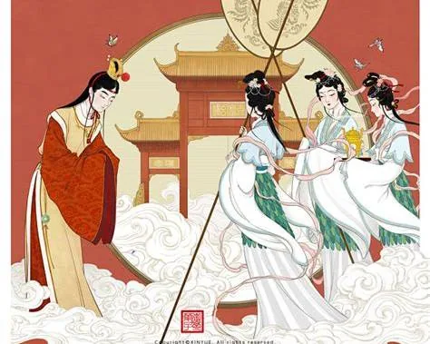
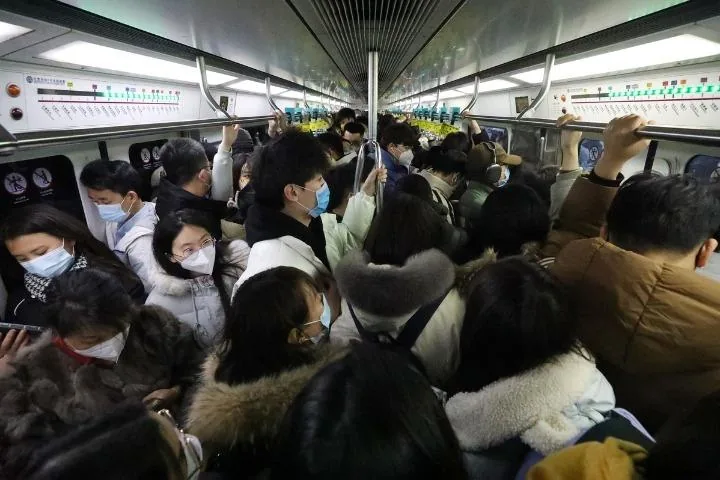

 >[!note]
 >**修炼能量很重要，但凭什么给你？** 
 **修行最终不能只停留在“心”上。你想什么都不重要，你做什么才重要。**

---

## 1. 从贾宝玉梦游太虚幻境说起：有来历，不等于有修行

### 仙珠转世，到了人间仍是一身“凡气”

大家好，我是修炼者小烨，今天我们先来讲个故事。

在《红楼梦》里，贾宝玉是**仙珠转世**，被认为是女娲补天时剩下的一块顽石，经过修炼后有了灵性，然后被带到人间，经历红尘。

有一次，贾宝玉在梦中被警幻仙子带到太虚幻境。其他仙子见到贾宝玉，是这么说的：

> “听说今日必有绛珠妹子的生魂前来游玩，所以我们等了这么久，为什么反而引来了这等浊物来污染这清净之境。”

贾宝玉听闻此言，吓得欲退不能退，自觉自行污秽不堪。

警幻仙子跟姐妹解释道：

> “今日受贾府祖先之灵所托，特引他到此处，让他再经历一番声色之患，希望他之后能醒悟，但也还未可知。”

**你看，不管你是什么仙儿转世，到了人间，不修炼就是一股子凡臭。**

如果不是看在你是仙珠转世，如果不是看在贾府祖先之灵的面子上，神仙几乎不会来指点。

### 条件再好，凡气太重也点化不动

为什么？看看这个故事的结尾就知道了：

> 警幻仙子亲自来告诉他，他元神天分时自带一股痴情，给他显像，告诉他要经历怎样的结束，提醒他要做好选择，又带他来到仙境，熏陶了好久。
> 
> 然而贾宝玉身上的凡气太重，像迷雾一样，让他始终看不透，悟不到仙子的意思，最后还是选择沉沦苦海去了。

有这么好条件的人，哪怕派警幻仙子来点化都点不动，更何况大多数没有修炼背景、没有福德积累的凡人了。

---

## 2. 凡气与能量边界：为什么修炼者会强调远离“浊气”

### 神仙为什么不会主动靠近凡人

很多人爱提护法神，其实真正的神仙隔老远就闻得到人身上的凡臭。

换做是你，你会主动去找一个臭烘烘的人吗？你会每天陪在他身边吗？

连警幻仙子都是把贾宝玉生魂带到仙境，而不是自己跑到凡间去的。

### 修炼者对“凡气”和“浊气”的感知

其实也不止神仙，真正修炼过的人，也可以闻得到人身上的凡臭。

只要身上不是干净的修炼能量，不管男女老少，不管你练什么功，靠近点都是臭臭的。

如果你无法想象，可以试想一下老人身上的气息，因为老人的能量频率是远低于年轻人的。

敏锐的人可能会觉得老人身上有一股浑浊的气，其实不止凡气，还有浊气。

其他生灵的气更臭，因为他们都是靠浊气修炼的。

### 人群接触带来的“沾染”

最近我出门遇到人多又不可避免的地方，就不得不跟旁人撞上。

若是凡气还好，就怕那人身上附着其他大佬，就那么贴近一下，就能沾到我的衣服跟着回家。

所以我都是勤洗外套，尤其是最近都要每周洗两遍羽绒服。

换做毫无察觉力的人，这样下去结果可想而知。

---

## 3. 善良不等于修为：能量不是靠“心好”换来的

### 条件越好，越容易误把自己当成“强者”

虽然我常说人都应该修行修炼，把这个道理嚼烂了说给大家听，但是真正有魄力修行的人又有几个呢？

开篇我就引用了贾宝玉的例子。

这样一个来历福德都不浅的人，神仙费了这么多口舌，他都无动于衷。

这世界上像贾宝玉这样的人比比皆是，论修炼背景，论家世条件，论功德福报，论天资聪明，论临近引路，真的是多了去了。

我们都知道，自身条件好的人，遇事也更顺利。

然而正是因为这种顺境，让人误以为自己就是这个环境的强者，开始分不清真正的大小王。

在这类人中，不乏善良、有大爱、想要修行的人。有了道德感的加持，开始自视清高，认为自己往那一坐就发着正道的光芒，简直是**痴到了极点**。

### 修炼能量很重要，但凭什么给你？

这些人有一个核心问题没想明白：

> **修炼能量很重要，但凭什么给你？**

真以为能量是靠钱、靠实力、靠心善、靠真心就能换来的吗？

很多人说天道大爱，我持正念，我存善心，那神仙菩萨怎会不来保佑我，怎会不给我能量？

这种思想非常幼稚。

### “靠爱发电”解决不了现实问题

我说直白点：

> **你的善良值个屁，靠爱发电只会令人发笑。**

看看那些搞放生的，没半点解决事情的能力，成事不足，败事有余，行善的结果却是带来恶业，你还不如不善良的好。

---

## 4. 从黑熊精看能量分配：能力、价值与行动缺一不可

### 观音为什么要把黑熊精收于麾下

再看看为什么观音要把黑熊精收于麾下。

不仅仅是因为黑熊精有一颗求道的心，更重要的是：

1. **黑熊精是可造之材。**
    武力强悍，能跟孙悟空打平，说明他能派上用场。
2. **他还很有悟性。**
    懂得审时度势，懂站队。只要有机会跟正道站一块儿，就立马归顺，将他的力量臣服在观音之下，甘愿当一个守山的小编制。

### “道常无名，朴”：需要时成器，不需要时为朴

为什么？

因为：

> **“道常无名，朴。”**

大道就像一块朴素的木头，只有需要的时候，它才会变化成器皿。

生灵想走正道，想与道同寿，那就老实当一块朴木。

**只有用到你的时候，你才是器皿；不用的时候，就化回朴木。**

如果一个人身份感太重，大到都请不动，那就别修炼了。

宇宙之大，众生之多，系统之大，难题之多，每一个解决系统难题的人，必然要具备一定的能力，也承载相应的能量量级。

### 能量最终与个体价值相匹配

> **所以修炼能量一定是和个体的价值相匹配的。**

你能有多少能量，取决于你能使用自己的价值，取决于你践行道的心。

若你从未用行动佐证你的心，谁信啊？

真当神仙是傻子，任你忽悠吗？

---

## 5. 修行最终要落到行动：道心决定方向，上行创造结果

### 能量才是修行能够真正运转的基础

所以修行能量是第一位的，所有众生都需要能量。

> **能量是众生之间的一般等价物。**

做神仙这事儿没有你，也会有其他人，有没有你都无所谓。

修心只是对你而言是很重要的。

你的决心决定了你的高度，但与他人无关，与天地宇宙无关。

### 光有“道心”还不够，更重要的是上行

而且不仅仅是有一颗道心，更重要的是**上行**。

你的心能不能推动你的行为，为宇宙创造实实在在的结果？

换而言之：

> **你想什么都不重要，你做什么才重要。**

我是修炼者小烨，我们下期继续聊。