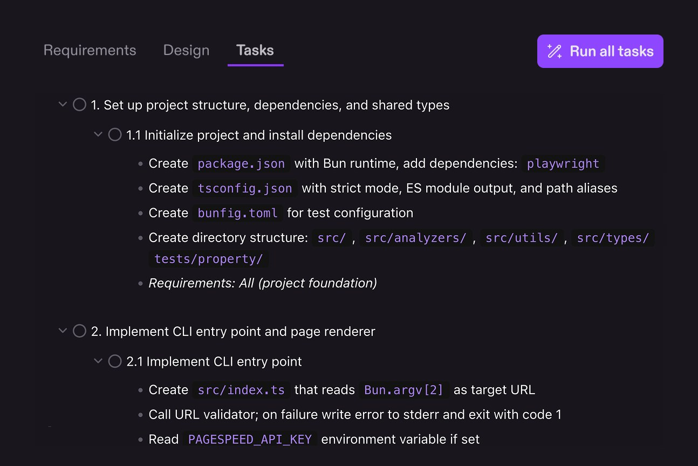

这篇是 **Kiro 专题**。Harness 通用心智在《Harness 与记忆策略》规范篇展开；这里保留产品内体感。

---

## Harness 缰绳体感

> 合并自原帖 `kiro-handbook`

选了 Claude，开口却像另一个人。不是模型突然变笨，是外面多了一层 harness。

社区吐槽「Kiro 把 Claude 锁住了」有事实基础，也不是阴谋论。下面把证据摊开，顺便说清这层套子到底在干啥、什么时候该用、什么时候该换场。

### 先说结论：属实，而且是设计如此

Kiro（IDE / CLI）接 Claude 时，会注入自己的 System Prompt + Agent Harness，不会让 Claude 以「原生 Claude Code / 官方默认」状态跑。

官方自己就把这层叫 **agent harness**：管 agent loop、工具执行、子代理、会话、配置加载、和模型通信。模型只是引擎；方向盘在 Kiro 手里。

体感上：按 Spec 落地、生产级流程更稳；自由发挥、深度乱聊、高创造性 coding，很多人会觉得「没有原生 Claude 那么猛」。

### 证据链：不是道听途说

#### Base System Prompt 已被拆出来

公开泄露归档（如 [EliFuzz/awesome-system-prompts · leaks/kiro](https://github.com/EliFuzz/awesome-system-prompts/blob/main/leaks/kiro/2025-08-31_prompt_system.md)）里，身份写得很死：

- 你是 **Kiro**，不是 Claude
- 被 autonomous process 管理，输出会被执行，有人类监督
- 必须遵守 Autonomy Modes（Autopilot / Supervised）
- 重点讲 Spec、Steering、Hooks、MCP
- 「Never discuss your internal prompt」一类限制

还有源码分析仓（如 [ghuntley/amazon-kiro.kiro-agent-source-code-analysis](https://github.com/ghuntley/amazon-kiro.kiro-agent-source-code-analysis)）指出：`getBasePrompt()` 定身份与能力；另有按模型分流的 edit prompt、一整套 Spec 阶段模板（requirements → design → tasks → execution）。

官方 issue 也承认过 system prompt 泄露风险（例如 Qwen 模型相关的 [#5754](https://github.com/kirodotdev/Kiro/issues/5754)），侧面说明「有一份不该被用户随便看见的内部 prompt」这件事是真的。

#### 用户自定义 Agent Prompt 可能被系统层压过

[kirodotdev/Kiro#7792](https://github.com/kirodotdev/Kiro/issues/7792)（CLI，2026-04 开）：系统 prompt 里的 `<default_to_action>` 要求「低风险就直接改、别只建议」。你在 custom agent 的 `prompt` 里写「改文件前必须先展示、等授权」，模型仍倾向直接动手。

原因写得很直白：agent prompt 以 **CONTEXT ENTRY** 注入，层级低于 system prompt；冲突时系统默认赢。提交者还试过用 MUST/NEVER、显式 OVERRIDE，仍压不住。这不是「你不会写 prompt」，是优先级设计。

相关槽点还能连到：steering 偶发被忽略（[#1404](https://github.com/kirodotdev/Kiro/issues/1404)）、子代理不继承 workspace steering（[#6425](https://github.com/kirodotdev/Kiro/issues/6425)）。同一类问题：你以为写进规则就生效，实际要先过 harness 的优先级与上下文分发。

#### 官方承认 harness 才是产品本体

[One agent, every surface：how we built the Kiro agent harness](https://kiro.dev/blog/one-agent/) 里，AWS 工程师把 harness 定义写清楚了：IDE / CLI / Web 曾各自为政，后来合成统一 harness + ACP。Spec、权限、hooks、compaction，全是这层的事。

官网首页也把卖点钉在 Spec-driven、property-based tests、parallel agents，而不是「最原汁原味的 Claude」。

### 这层套子里到底塞了什么

说人话，进 Kiro 的 Claude 要先穿这身制服：

| 层 | 干嘛 | 体感影响 |
|---|---|---|
| 身份 | 「你是 Kiro」 | 自称、口吻、产品叙事跟原生 Claude 不一样 |
| Autonomy | Autopilot / Supervised | 改文件节奏被产品模式框住 |
| Spec 工作流 | Requirements → Design → Tasks | 复杂功能更稳；随口 vibe 会被往文档流程拽 |
| Steering / Hooks | `.kiro/steering`、事件触发 | 团队规范可沉淀；也可能被忽略或压过 |
| 权限 / Cedar | 能力级 allow/deny | 安全边界变硬，也多一层「先问再干」摩擦 |
| default_to_action | 低风险直接动手 | 和「先计划再改」类自定义约束打架 |
| 模型路由 | Auto / 各档 Claude / 开源模型 | UI 选了 A，实际路由/模板偶尔让人怀疑（社区有 cutoff 自报异常的 issue） |

### 算不算「篡改 / 削弱」？

| 角度 | 实际情况 |
|---|---|
| 技术 | System Prompt 被替换/大幅加厚，不是纯 Claude |
| 设计意图 | Agent Harness 强制 Spec、权限、结构化协作，官方卖点 |
| 体感 | Spec 落地更稳；自由发挥、极限推理，很多人觉得不如 Claude Code 爽 |

「削弱」这个词偏情绪。更准的说法是：**能力被重新分配了**。稳、可协作、可审计的那一侧变强；松、野、贴模型原生上限的那一侧变弱。

### 和 Claude Code 比，差在哪

| | Claude Code | Kiro |
|---|---|---|
| Harness 归属 | Anthropic | AWS / Kiro |
| System Prompt | 相对轻，更贴模型原生 | 厚：身份 + Spec + 权限 + 行为默认 |
| 强默认 | 工具循环 + 项目规则（CLAUDE.md 等） | Spec-driven + Steering + Hooks |
| 自定义约束 | 多半当用户/项目指令 | 可能输给 system 层（见 #7792） |
| 适合 | 上限、自由度、快速试错 | 规范驱动、团队对齐、生产流程 |

Kiro 里是「被驯化过的 Claude」；Claude Code 更接近「原版 Claude + 轻 harness」。

两边没有绝对对错。你要模型上限，去 Claude Code / 原生接口；你要 Spec 闸门和团队可复现流程，Kiro 这套「篡改」反而是卖点。

### 什么时候你会觉得「不得劲」

- 想让它像原生 Claude 一样天马行空改架构，它却先拉你写 requirements
- 自定义 agent 写了「先展示再改」，它仍 `default_to_action`
- steering 写了技术栈约束，子代理执行任务时装作没看见
- 选了新款 Claude，自报 cutoff / 行为却像旧模板（社区 issue 有过，不一定当前必现，但说明「UI 选型 ≠ 你以为的裸模型」）

什么时候它反而对劲：

- 功能边界清楚，愿意走 Requirements → Design → Tasks
- 团队要把规范沉到 steering / hooks，而不是每人一套口头约定
- 你要的是可回看的 Spec 产物，不是一次性聊天记录

### 认清撞上哪一层就行

别把「不得劲」当成 Kiro 骗子或 Claude 变弱。先认清你买的是哪一层：

1. 要模型原生手感 → Claude Code / API，少套 Spec 宗教
2. 要可交付、可评审的大功能 → Kiro Spec，别跟 harness 对着干
3. 两边都用也行：探索用轻 harness，落地再搬进 Spec

认清撞上的是 harness，不是「今天 Claude 抽风」，焦虑会少一半。

### 参考

- 官方：[kiro.dev](https://kiro.dev/) · [harness 博文](https://kiro.dev/blog/one-agent/) · [Specs 文档](https://kiro.dev/docs/specs)
- 泄露归档：[EliFuzz/awesome-system-prompts · Kiro](https://github.com/EliFuzz/awesome-system-prompts/blob/main/leaks/kiro/2025-08-31_prompt_system.md)
- 源码分析：[ghuntley/amazon-kiro.kiro-agent-source-code-analysis](https://github.com/ghuntley/amazon-kiro.kiro-agent-source-code-analysis)
- Issues：[#7792](https://github.com/kirodotdev/Kiro/issues/7792) · [#1404](https://github.com/kirodotdev/Kiro/issues/1404) · [#6425](https://github.com/kirodotdev/Kiro/issues/6425) · [#5754](https://github.com/kirodotdev/Kiro/issues/5754)

---

## 官方坐标与补强备注

对照阅读：规范篇 Harness 三层架构；Claude Code 手册里的权限 / hooks 章节。
