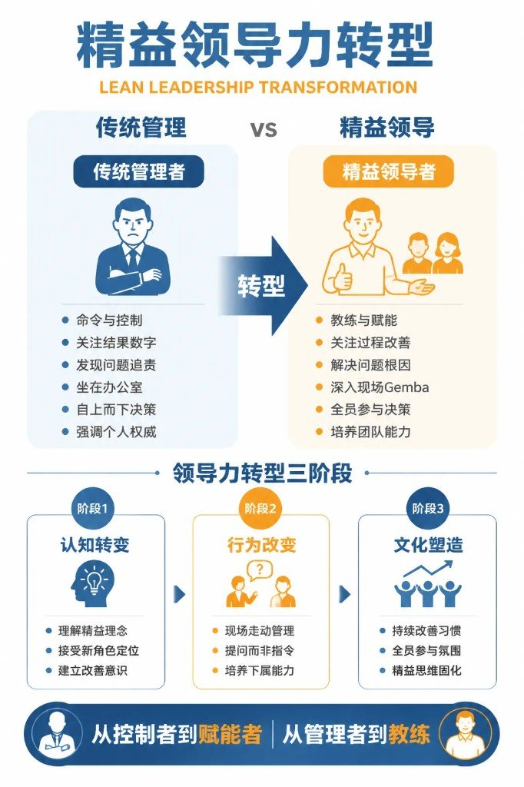
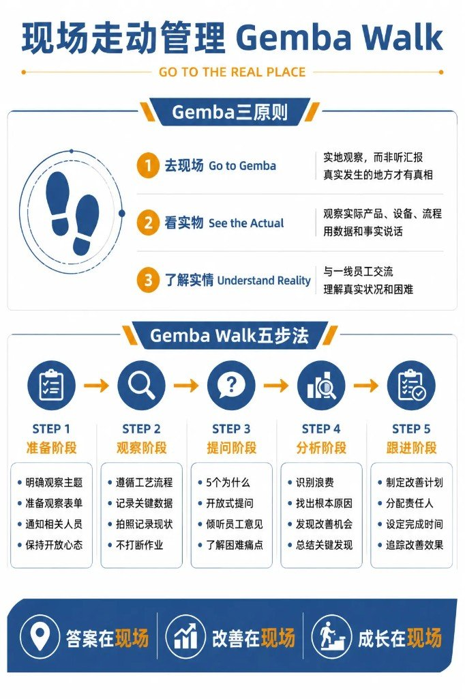
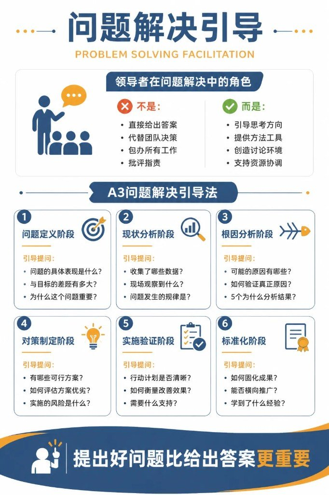
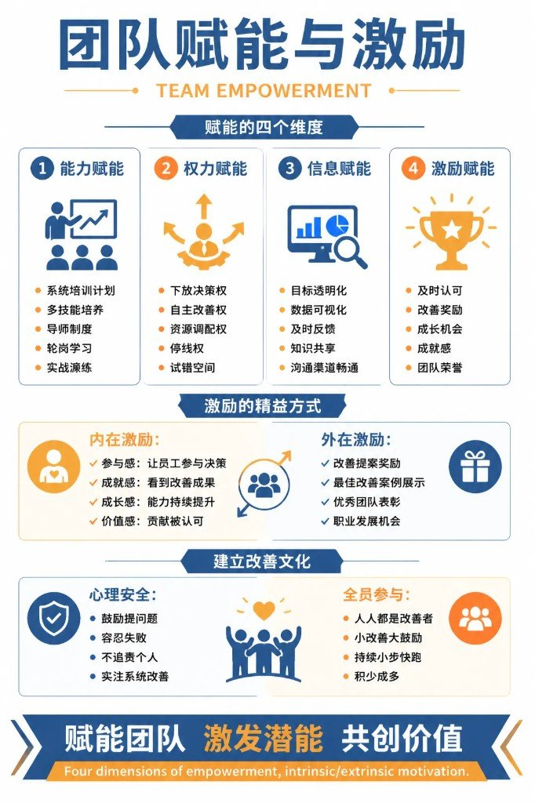

精益推不动，很多人先怪工具、怪员工、怪「文化不行」。

更常见的卡点在领导自己：还在命令与控制，还在办公室听二手汇报，还在替团队做决定、替团队解题。角色不换，工具学再多也是空转。

这条路的本质转变就一句：从控制者到赋能者，从管理者到教练。

旁链提醒：同日队列里还有「人效差，答案多半不在人身上」「很多公司只会砍成本，高手从省钱走到赚钱」——相关，但**不硬并**。人效篇拆分子分母与四层对症；降本篇讲暴力→管控→流程→经营路径；这边讲**领导角色怎么转身**（Gemba / 教练 / A3 / Kotter）。

---

## 01 精益领导力转型

精益领导力的第一步，是认知转变——从传统管理者变成精益领导者。

### 传统管理者 vs 精益领导者

传统管理者的六个特征：

1. **命令与控制。** 上级说、下级做，不容置疑。员工是执行工具，不是思考主体。
2. **关注结果数字。** 只看产量、只看利润、只看 KPI，不看过程、不看方法、不看人的成长。
3. **发现问题追责。** 出了问题，先找谁的责任，先罚谁。结果是人人自保，问题被掩盖。
4. **坐在办公室。** 决策靠报表、靠汇报，不到现场去。报表是二手信息，汇报是过滤过的信息，离真相越来越远。
5. **自上而下决策。** 所有决策由领导做，员工不参与。员工没有参与感，就没有认同感，执行就打折扣。
6. **强调个人权威。** 领导是权威、是专家，员工要服从。这种权威文化，压制了员工的创造力和主动性。

精益领导者的六个特征：

1. **教练与赋能。** 领导不是给答案的人，是引导员工自己找到答案的人。赋能，就是让员工有能力、有权力、有信心去做。
2. **关注过程改善。** 结果重要，但过程更重要。过程对了，结果自然对。过程改善了，能力就提升了，结果是可持续的。
3. **解决问题根因。** 出了问题，不追责，找根因。用 5Why、鱼骨图等工具，找到系统层面的原因，防止再发。
4. **深入现场 Gemba。** 领导要走出办公室，到现场去、到一线去。现场是真相发生的地方，只有到现场才能看到真实。
5. **全员参与决策。** 决策不是领导的专利，是一线员工、技术专家、管理人员共同参与的结果。参与决策的人，更愿意执行决策。
6. **培养团队能力。** 领导的终极目标，不是让自己不可替代，是让自己可替代。培养出能独当一面的团队，领导才能升维。

### 领导力转型三阶段

**阶段1：认知转变。**

- 理解精益理念。精益不只是工具，是思维方式、是管理系统、是文化变革。
- 接受新角色定位。从「指挥官」变成「教练」，从「控制者」变成「赋能者」，这个转变不容易，但必须做。
- 建立改善意识。改善不是项目，是日常。领导自己要先有改善意识，才能带动团队。

**阶段2：行为改变。**

- 现场走动管理。不再坐在办公室，定期到现场走动，观察、提问、倾听。
- 提问而非指令。遇到问题，先问「你怎么看？」而不是「你应该这样做」。
- 培养下属能力。把时间和精力花在培养人上，而不是替人做事上。

**阶段3：文化塑造。**

- 持续改善习惯。改善成为团队的习惯，不需要推动，自动发生。
- 全员参与氛围。每个人都愿意提建议、每个人都愿意参与改善，没有旁观者。
- 精益思维固化。精益思维融入每个人的血液，成为企业文化的一部分。

从控制者到赋能者，从管理者到教练。这是精益领导力的本质转变。

---

## 02 现场走动管理 Gemba Walk

精益领导者的核心实践之一，就是 Gemba Walk——现场走动管理。Gemba 是日语「现场」的意思，指真实发生工作的地方。

### Gemba 三原则

**原则1：去现场 Go to Gemba。**  
实地观察，而非听汇报。真实发生的地方才有真相。你在办公室听到的汇报，经过了层层过滤、层层美化，离真相越来越远。只有到现场，才能看到真实。

**原则2：看实物 See the Actual。**  
观察实际产品、设备、流程，用数据和事实说话。不要问「产量怎么样」，要问「今天的实际产量是多少？和目标的差距是多少？」不要问「设备好不好」，要问「设备的 OEE 是多少？故障停机时间是多少？」

**原则3：了解实情 Understand Reality。**  
与一线员工交流，理解真实状况和困难。员工最了解现场，他们的困难、他们的建议，是最真实的信息。领导要倾听，而不是说教。

### Gemba Walk 五步法

**Step 1：准备阶段。**

- 明确观察主题。今天去现场，看什么？是 5S？是质量？是效率？还是安全？主题明确，才能聚焦。
- 准备观察表单。设计观察清单，逐项对照，防止遗漏。
- 通知相关人员。提前告知现场人员，避免突然袭击造成紧张。Gemba Walk 不是检查，是学习。
- 保持开放心态。不要带着预设结论去现场，要带着好奇心和空杯心态。

**Step 2：观察阶段。**

- 遵循工艺流程。按产品流动的方向，从原材料到成品，完整走一遍。
- 记录关键数据。周期时间、在制品数量、设备状态、人员操作，都要记录。
- 拍照记录现状。用照片记录问题点，作为后续分析的依据。
- 不打断作业。观察时，不要打断员工操作，不要当场批评，先观察、后讨论。

**Step 3：提问阶段。**

- 5 个为什么。看到问题，连续问为什么，找到根因。
- 开放式提问。「你怎么看这个现象？」「你觉得原因是什么？」而不是「你为什么做错了？」
- 倾听员工意见。让员工先说，领导多听。员工的声音，是最真实的声音。
- 了解困难痛点。员工操作中的困难、痛点，就是改善的机会。

**Step 4：分析阶段。**

- 识别浪费。用七大浪费的框架，识别现场的浪费。
- 找出根本原因。用 5Why、鱼骨图等工具，找到问题的根因。
- 发现改善机会。每个问题背后，都有一个改善机会。
- 总结关键发现。Gemba Walk 结束后，总结关键发现，形成报告。

**Step 5：跟进阶段。**

- 制定改善计划。针对发现的问题，制定具体的改善计划。
- 分配责任人。每个改善点，都有明确的责任人。
- 设定完成时间。改善要有 deadline，不能无限拖延。
- 追踪改善效果。改善后，要验证效果，看问题是否真正解决。

答案在现场，改善在现场，成长在现场。领导者的成长，也在现场。

---

## 03 教练式领导

精益领导者的核心技能之一，是教练式领导。不是告诉员工怎么做，而是引导员工自己找到方法。

### 教练的核心理念

1. **不是给答案，而是引导思考。** 员工遇到问题时，领导的第一反应不是「你应该这样做」，而是「你觉得可以怎么做？」引导员工自己思考，员工才会成长。
2. **不是做决定，而是培养能力。** 领导替员工做决定，员工永远学不会做决定。领导的目标是培养员工独立决策的能力。
3. **不是解决问题，而是教会方法。** 领导亲自解决问题，问题解决了，但员工没学会。领导教会员工解决问题的方法，员工以后遇到类似问题，自己就能解决。

### 教练式提问技巧

**技巧1：开放式提问。**

- 「你观察到什么现象？」——让员工描述事实，而不是下结论。
- 「你认为原因是什么？」——让员工分析原因，而不是领导给答案。
- 「你有什么改善想法？」——让员工提出方案，而不是领导下指令。
- 「如何验证你的方案？」——让员工思考验证方法，培养系统思维。

**技巧2：5 个为什么。**

| Why | 问什么 | 挖到哪一层 |
|---|---|---|
| 1 | 为什么会发生？ | 描述现象 |
| 2 | 为什么是这个原因？ | 深入一层 |
| 3 | 为什么没有预防？ | 找到系统漏洞 |
| 4 | 为什么系统允许？ | 找到制度缺陷 |
| 5 | 根本原因是什么？ | 找到最深层的根因 |

**技巧3：引导式提问。**

- 「如果是你，会怎么做？」——换位思考，激发主动性。
- 「还有其他可能性吗？」——拓展思维，避免局限。
- 「这样做的风险是什么？」——培养风险意识。
- 「需要什么资源支持？」——培养资源协调能力。

### 教练四步法：GROW 模型

| 字母 | 含义 | 做什么 |
|---|---|---|
| **G** | Goal 目标 | 明确改善目标和期望结果。和员工一起明确：我们要解决什么问题？要达到什么目标？ |
| **R** | Reality 现状 | 了解当前状况和差距。用数据和事实描述现状；现状和目标之间的差距，就是改善空间。 |
| **O** | Options 方案 | 探讨多种可能的解决方案。不局限于一个方案，鼓励发散思维。 |
| **W** | Will 意愿 | 确定行动计划和承诺。选出最优方案，制定行动计划，员工做出承诺。 |

### 教练的关键行为

- **积极倾听：** 不打断、不评判，认真听员工说完。
- **有效提问：** 用开放式、引导式提问，激发员工思考。
- **及时反馈：** 员工的想法，及时反馈，对的肯定，错的纠正。
- **鼓励尝试：** 鼓励员工大胆尝试，即使失败也是学习。
- **容忍失败：** 失败是成长的一部分，不容忍失败，就没有创新。
- **认可成长：** 员工的每一点进步，都要认可，都要鼓励。

授人以鱼不如授人以渔，培养能力胜过解决问题。教练式领导的终极目标，是让员工不再需要教练。

---

## 04 问题解决引导

精益领导者在问题解决中，不是「解题者」，是「引导者」。

### 领导者在问题解决中的角色

| 不是 | 而是 |
|---|---|
| 直接给出答案。领导不是百科全书，不需要知道所有答案。 | 引导思考方向。用提问引导团队思考，找到正确的方向。 |
| 代替团队决策。决策是团队的事，领导不能包办。 | 提供方法工具。提供 5Why、鱼骨图、A3 报告等工具，让团队有方法可用。 |
| 包办所有工作。领导不能替员工干活，员工才是执行主体。 | 创造讨论环境。营造开放、安全的讨论氛围，让每个人都愿意发言。 |
| 批评指责。批评指责只会让员工隐瞒问题，不是解决问题。 | 支持资源协调。团队需要资源时，领导要协调资源，扫除障碍。 |

### A3 问题解决引导法

A3 报告是丰田发明的问题解决方法，因为报告写在 A3 纸上而得名。核心是结构化的问题解决流程。

**阶段1：问题定义阶段。** 引导提问：

- 问题的具体表现是什么？——描述现象，用数据说话。
- 与目标的差距有多大？——量化差距，明确问题严重程度。
- 为什么这个问题重要？——说明问题的优先级和影响。

**阶段2：现状分析阶段。** 引导提问：

- 收集了哪些数据？——数据是分析的基础。
- 现场观察到什么？——Gemba Walk 的发现。
- 问题发生的规律是？——是偶尔发生还是经常发生？是某个班次还是所有班次？

**阶段3：根因分析阶段。** 引导提问：

- 可能的原因有哪些？——头脑风暴，列出所有可能原因。
- 如何验证真正原因？——用数据验证，排除假原因。
- 5 个为什么分析结果？——用 5Why 深挖，找到根因。

**阶段4：对策制定阶段。** 引导提问：

- 有哪些可行方案？——发散思维，提出多种方案。
- 如何评估方案优劣？——用标准评估，比如成本、效果、风险、可行性。
- 实施的风险是什么？——预判风险，制定预案。

**阶段5：实施验证阶段。** 引导提问：

- 行动计划是否清晰？——谁、做什么、什么时候完成，都要明确。
- 如何衡量改善效果？——指标是什么？数据怎么收集？
- 需要什么支持？——资源、权限、协调，领导要提供支持。

**阶段6：标准化阶段。** 引导提问：

- 如何固化成果？——把有效的措施，写入标准作业指导书。
- 能否横向推广？——这个改善，其他区域、其他产线能否复制？
- 学到了什么经验？——总结教训，形成组织知识。

提出好问题比给出答案更重要。领导者的价值，不在于知道答案，而在于提出好问题，引导团队找到答案。

---

## 05 团队赋能与激励

精益领导力的核心目标，是赋能团队。团队有能力、有动力、有环境，精益才能持续。

### 赋能的四个维度

**维度1：能力赋能。**

- 系统培训计划。根据岗位需求，制定系统的培训计划，不是零散培训。
- 多技能培养。培养多技能工，让员工掌握多种技能，提高灵活性和价值。
- 导师制度。老员工带新员工，技能传承，文化传递。
- 轮岗学习。定期轮岗，拓宽视野，培养复合型人才。
- 实战演练。培训不是听课，是实战。在真实场景中练习，才能真正掌握。

**维度2：权力赋能。**

- 下放决策权。让一线员工有决策权，比如质量判断权、设备停机权、改善实施权。
- 自主改善权。员工可以自主发起改善，不需要层层审批。
- 资源调配权。给员工一定的资源调配权，比如小额采购权、加班安排权。
- 停线权。发现重大质量问题时，员工有权停线，防止批量不良。
- 试错空间。允许员工在一定范围内试错，容错是创新的前提。

**维度3：信息赋能。**

- 目标透明化。团队目标、个人目标，都要透明，让每个人知道方向。
- 数据可视化。生产数据、质量数据、效率数据，实时显示在看板上，人人可见。
- 及时反馈。员工的表现，及时反馈，好的肯定，差的纠正。
- 知识共享。改善经验、技术知识，共享给所有人，避免重复发明轮子。
- 沟通渠道畅通。员工有意见、有建议，有渠道表达，有机制回应。

**维度4：激励赋能。**

- 及时认可。员工做得好，立刻认可，不要等年底。
- 改善奖励。对有价值的改善提案，给予物质奖励和精神奖励。
- 成长机会。给员工学习、晋升、挑战的机会，让员工看到未来。
- 成就感。让员工感受到工作的意义和价值，不仅仅是赚钱。
- 团队荣誉。团队成果，共同分享，增强团队凝聚力。

### 激励的精益方式

**内在激励：**

- 参与感：让员工参与决策。参与了，就有主人翁意识。
- 成就感：看到改善成果。自己的努力，变成了实际的改善，成就感油然而生。
- 成长感：能力持续提升。每天都在学习、都在进步，工作有奔头。
- 价值感：贡献被认可。自己的贡献，被领导、被同事、被客户认可，价值感满满。

**外在激励：**

- 改善提案奖励。提案被采纳，给予奖金或积分。
- 最佳改善案例展示。把优秀案例展示出来，让提案者有名、有荣誉。
- 优秀团队表彰。团队改善成果突出，给予表彰和奖励。
- 职业发展机会。改善能力强的员工，优先晋升、优先培训。

### 建立改善文化

**心理安全：**

- 鼓励提问题。没有问题才是最大的问题，鼓励员工大胆提问。
- 容忍失败。失败是学习的机会，不惩罚失败，惩罚隐瞒失败。
- 不追责个人。问题发生后，追系统原因，不追个人责任。追责个人，只会让人隐瞒问题。
- 关注系统改善。从系统层面找原因，从流程、制度、工具上改进。

**全员参与：**

- 人人都是改善者。改善不是工程师的事，是每个人的事。
- 小改善大鼓励。哪怕是一个小改善，也要鼓励，积小胜为大胜。
- 持续小步快跑。不要求大突破，要求每天进步一点点。
- 积少成多。每个人的小改善，加起来就是巨大的进步。

赋能团队，激发潜能，共创价值。团队强，则企业强。

---

## 06 变革领导力

精益推行，本质上是一场变革。变革需要领导力，而且是特殊的领导力——变革领导力。

### 精益变革的挑战：常见阻力

| 阻力 | 典型声音 | 背后是什么 |
|---|---|---|
| 思维惯性 | 「一直这样做的」 | 习惯旧方式；改变意味着不确定与风险 |
| 恐惧心理 | 「会不会影响我」 | 可能影响岗位、收入、地位 |
| 怀疑态度 | 「又是一阵风」 | 见过太多「运动」，怀疑这次也吹一阵 |
| 能力不足 | 「不知道怎么做」 | 想改但缺方法与培训 |
| 利益冲突 | 「损害我的利益」 | 触动权力、资源、地位，阻力必然大 |

### 变革领导八步法（Kotter 模型）

**Step 1：营造紧迫感。**  
展示市场压力。竞争对手在进步，客户在要求，不变革就会被淘汰。分析竞争态势，和标杆企业对比，找到差距，激发危机感。用数据和案例强调：变革不是选择，是生存。

**Step 2：建立领导联盟。**  
组建变革团队——不是一个人推，是一个有权力、有影响力、有专业能力的团队推。获得高层支持：资源、权力、背书，缺一不可。跨部门协作，打破部门墙。

**Step 3：制定愿景战略。**  
清晰的变革愿景：要去哪、变成什么样，要清晰、要激动人心。可行的实施策略：分几步走、每步做什么。阶段性目标：大愿景拆成小里程碑。

**Step 4：沟通变革愿景。**  
多渠道、高频次传播（会议、培训、海报、内部刊物）。领导以身作则：自己先做到，员工才会信；说一套做一套，变革必败。耐心解答疑虑，消除恐惧。

**Step 5：授权行动。**  
清除制度、资源、人员障碍。提供资源，不能既要马儿跑、又要马儿不吃草。鼓励大胆尝试新方法，允许试错。

**Step 6：创造短期成果。**  
先选容易出成果的项目，快速见效。庆祝阶段胜利，增强信心。短期成果是最好的信心增强剂：让怀疑者闭嘴，让支持者更坚定。

**Step 7：巩固成果深化。**  
短期成果不是终点，是起点。持续改进，扩大范围（从一个区域、一条产线到全公司），从局部优化走到系统优化。

**Step 8：固化新文化。**  
把精益做法写入制度、流程、考核。新员工入职就接受精益培训，精益成为「默认设置」。持续强化，日复一日。

### 领导者关键行为

**以身作则：**

- 亲自参与改善。领导不是旁观者，是参与者。
- 遵守新标准。自己先遵守，员工才会遵守。
- 展示决心。遇到困难，不轻言放弃。

**持续沟通：**

- 解释变革意义。反复解释：为什么要变革？对大家有什么好处？
- 倾听员工声音。不能只听好话。
- 及时反馈。问题与建议不要石沉大海。

**耐心坚持：**

- 接受反复。变革是螺旋上升，有倒退是正常的。
- 长期投入。是马拉松，不是短跑。
- 不轻言放弃。遇到困难就放弃，变革必败。坚持，才有胜利。

变革始于领导，成功在于坚持。精益变革里，领导的决心和坚持，是决定成败的关键。

---

## 来源与交接

| 项 | 内容 |
|---|---|
| 来源 | `paste-md` · 用户粘贴长文 + 6 张信息图（作者未标注） |
| 原文 URL | 无 |
| 合并 | **新建**；与人效四层、降本增效分笔记互链，不硬并 |
| 去重 | 粘贴含近乎相同的双份 01–06 + 末尾错乱拼接；已只留一份完整正文 |

| 旁链 | 彼篇主线 | 与本篇边界 |
|---|---|---|
| [人效差，答案多半不在人身上](/posts/people-efficiency-four-layers/) | 人效公式 + 四层对症 | 彼=人效怎么拆；本=领导角色怎么转身 |
| [很多公司只会砍成本，高手从省钱走到赚钱](/posts/cost-efficiency-four-tiers/) | 降本增效四段位 12 法 | 彼=路径段位；本=精益落地时的领导侧行为 |