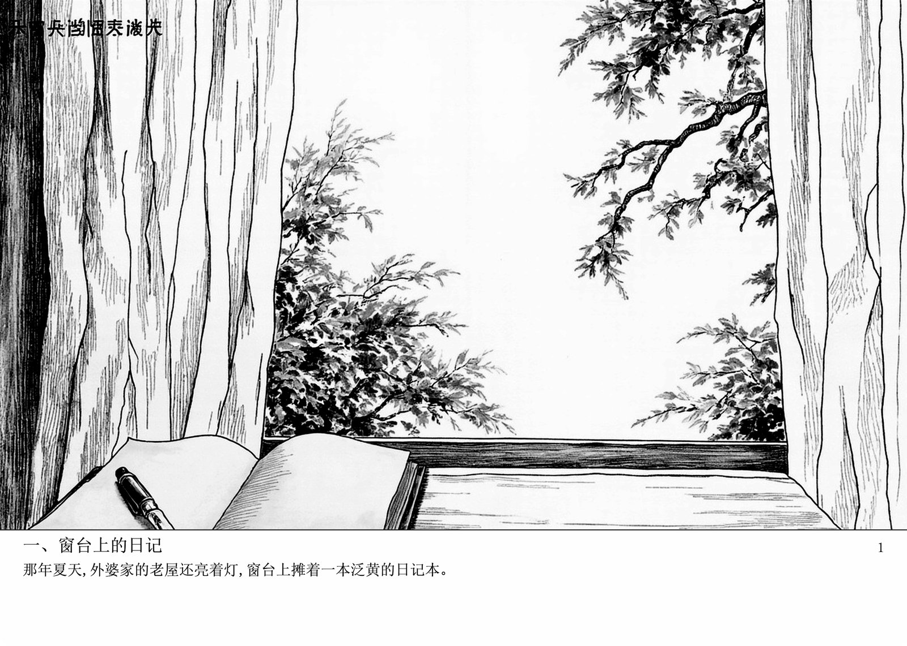

在 B 站刷到同济子豪兄的《三体》连环画，被那套"八十年代小人书 × 苏联太空科幻"的味儿抓住了。他把"任意文档变成小人书"做成了开源 Skill，我顺手拉下来试了试——踩了三个坑，也摸清了这个 skill 真正的成色。

## 这个 skill 是干嘛的

输入小说 / 故事 / 剧本，输出一本八十年代小人书：封面 + 6-10 页内页 + 封底，每页 7:5 横屏，黑白和彩色双版本，最后合 PDF。核心卖点是**文字以像素原生渲染在图上**——下方 18% 是宋体配文，上方 82% 是工笔白描插画，像真书一样。

作者是 B 站 UP 主同济子豪兄，仓库里除了这个 skill，还有他画《三体》名场面、章北海传的一堆作品。Skill 内置 9 张 1970-80 年代经典连环画参考图（鸡毛信、桃花扇、铁道游击队…），连封面标题用什么颜色都做了题材配色表（革命红、古典墨、现代蓝、传奇金）。

## 流程：五步，关键在第三步

| 步 | 动作 | 说明 |
|---|---|---|
| 1 | 确认画风 | 参考内置经典图：工笔白描、英雄比例、高对比 |
| 2 | 拆分镜 | 按叙事拆 6-10 页，每页提炼 1-2 句配文 |
| 3 | 逐页生图 | 封面 / 内页 / 封底三类 prompt 模板（设计给 Seedream） |
| 4 | 做旧 | 纸张纹理 + 印刷磨损 + 暗角 + 网点，封底保持清晰 |
| 5 | 合成 PDF | 封面 → 内页 → 封底顺序合并 |

## 实测：换掉 Seedream，成败全在中文字

skill 设计用字节 Seedream 生图，Seedream 的强项是中文文字渲染。我没有 Seedream 渠道，先用 MiniMax 顶替跑了一版《纸上的夏天》。

结果很干脆：**MiniMax 画中文配文 = 乱码**。回目和正文全变成"旧伋拟同""夫夸柬之雾拍奴叫"这种不可读字符。不是 prompt 问题，是模型中文渲染能力的差距——Seedream 在这块确实是国内第一梯队，MiniMax 还差得远。

## 三个坑，都出在适配模型上

1. **中文配文乱码**：对策是图片里一个字都不写，**后期用 PIL 叠字**（Windows 自带宋体 / 楷体），文字反而更清晰可控
2. **"留白"指令被过度执行**：想让 MiniMax 留出下方文字区，写"下方四分之一留白"，结果它直接留了一半空白，插画只占上半截。正确做法是让插画**满幅**，文字带后期用白底盖住底部 18% 叠字
3. **封面自带印章**：MiniMax 生成复古封面时会在角落加红色印章和小字，做旧后反而有年代感，就留着了

## 适配后的方案（实测可用）

```text
满幅底图(3:2) → 裁到 7:5(2800×2000) → 下方 18% 白底叠宋体配文
→ 做旧(纸张纹理/磨损/暗角/网点) → 黑白转灰度 / 彩色暖色降饱和 → 双版本 PDF
```

全程 MiniMax + Pillow，零外部依赖，文字零乱码。黑白、彩色两版各 6 页 PDF 均实测出片。下面是《纸上的夏天》实际产出的对比页：




## 适用范围与边界

- **适合**：有叙事性的文字（小说 / 剧本 / 科普解说），自带分镜
- **边界**：非叙事内容拆不出分镜；跨页角色一致性仍是 AI 生图通病；每本设计 6-10 页，超长需分批
- **版权**：skill 封底模板硬编码了《三体》和作者名，自用必须改（用原创故事绕开）

封底的效果长这样，版权信息这块是后期叠字加上的：


## 结论

这个 skill 的工程化很成熟——prompt 模板、做旧脚本、PDF 合成都有讲究，是"审美驱动 + 工具链封装"的典型。值不值得用取决于生图渠道：有 Seedream，开箱即用；只有 MiniMax，就得走后期叠字这套适配，但也能出不错的效果。
