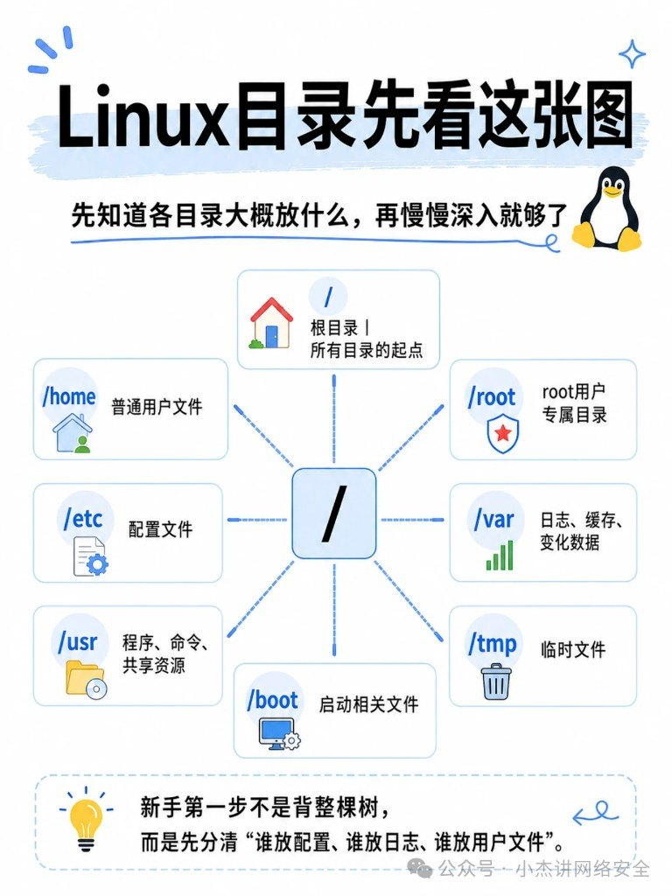
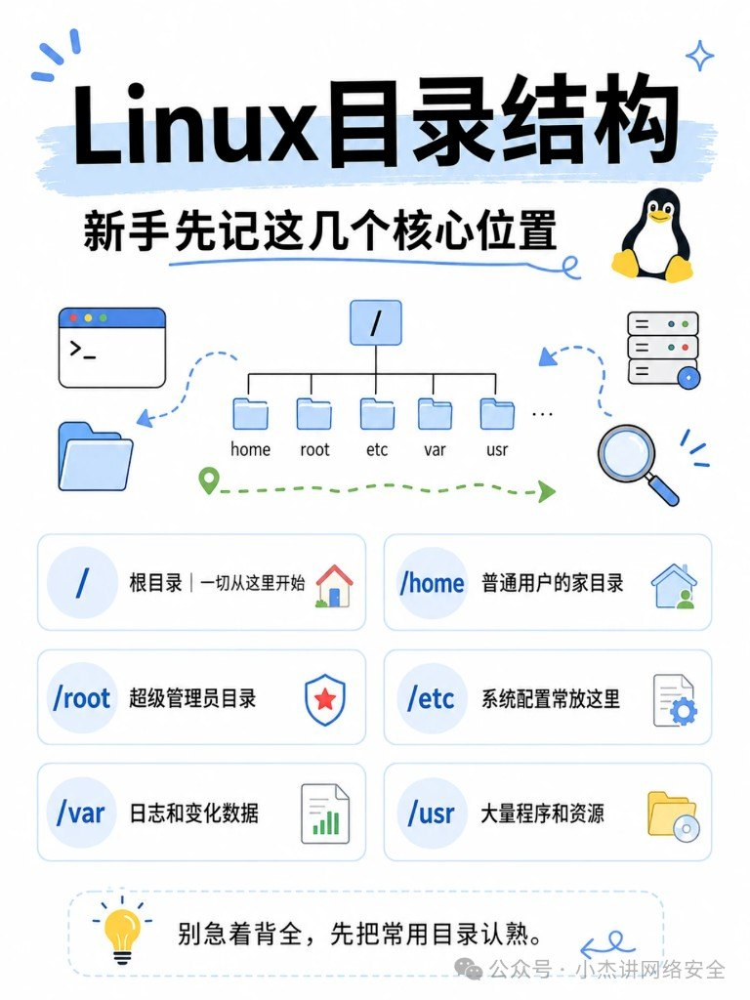

新手卡 Linux 目录，最容易把自己塞进「把 FHS 整张表背下来」的坑。真干活时你只需要先认几个**常去的位置**——改配置、查日志、找程序、回用户家，路熟了，整棵树自然长出来。

原料：公众号「小杰讲网络安全」运维速记图卡（主体六张）+ 「小林coding」《Linux目录结构详解》全景一图（并入文末对照卡）。

同系列还有「磁盘维护命令」「从加电到可登录」两篇运维速记，本篇先把目录认熟。

下面按「先看总览 → 认家 → 认干活三件套 → 补高频八目录 → 按用途记 → 整树对照」压成可带走的速记。

## 先看这张总览

整棵树从 `/` 长出来。图卡把常见枝丫摊开（含 `/tmp`、`/boot`），目的不是让你背完，是给你一张**心理地图**：以后听到路径，知道它大概挂在哪一支。

## 六个核心位置就够起步

| 路径 | 干什么 | 新手记法 |
|---|---|---|
| `/` | 文件系统总入口 | 所有路径的根 |
| `/home` | 普通用户家目录 | 你的桌面/文档通常在这 |
| `/root` | 管理员（root）的家 | **不是** `/`，别混 |
| `/etc` | 系统与服务配置 | 改配置先来这 |
| `/var` | 会变的数据：日志、缓存、邮件等 | 查日志、看涨盘常来这 |
| `/usr` | 用户态程序与共享资源 | 找装好的程序多半在这 |

## `/`、`/home`、`/root` 别混

三件事最容易搞拧：

- **`/`**：整棵树的根，不是「root 用户的家」。
- **`/home/<用户名>`**：普通用户的家；你登录后 `~` 通常指向这里。
- **`/root`**：超级用户自己的家目录，权限狠，普通用户进不去是常态。

记错一次就会出现「我以为在家目录，其实在根下乱写」——运维事故里很常见。

## 干活三件套：`/etc` · `/var` · `/usr`

日常排障几乎绕不开这三个：

| 去哪 | 场景 | 例子直觉 |
|---|---|---|
| `/etc` | 改行为、看默认配置 | nginx、ssh、systemd 单元旁路配置 |
| `/var` | 查发生了什么、数据在涨 | `/var/log`、缓存、运行时状态 |
| `/usr` | 找命令/库/文档装在哪 | 二进制、共享库、手册页常落这里 |

口诀：**改配置看 etc，查日志看 var，找程序看 usr。**

（发行版细节会有 overlay / 合并目录，但新手先按这三格走，不至于迷路。）

## 再补八个高频目录

核心位置认熟后，这八个出现频率也很高：

| 路径 | 一句话 |
|---|---|
| `/bin` | 基础用户命令（很多系统已与 `/usr/bin` 合并，概念仍要懂） |
| `/sbin` | 偏系统管理的命令（同样常与 `/usr/sbin` 合并） |
| `/dev` | 设备文件入口（磁盘、终端等「当文件用」） |
| `/proc` | 内核与进程的「活信息」（几乎全是虚拟文件） |
| `/tmp` | 临时文件；重启可能清空，别当仓库 |
| `/boot` | 启动相关：内核、引导配置 |
| `/opt` | 第三方/可选软件包常装这 |
| `/mnt` | 临时挂载点（U 盘、额外盘先挂这里很常见） |

不要求一次背完；下次 `cd` 撞上其中一个，回这张表对一下就行。

## 按用途记，配三板斧命令

别按字母表背路径，按**你要干什么**记：

1. 要改系统怎么跑 → `/etc`
2. 要看它刚才干了啥 / 数据涨哪了 → `/var`
3. 要找程序装哪了 → `/usr`（再辅 `/opt`、`/bin`）
4. 要回自己文件 → `/home`；管理员自己的家 → `/root`

走路用三板斧就够热身：

| 命令 | 作用 |
|---|---|
| `pwd` | 我现在在哪 |
| `ls` | 这里有什么 |
| `cd` | 去那个位置 |

先 `pwd` 再 `ls`，少很多「以为在 A 其实在 B」的乌龙。

## 认路比背树重要

Linux 目录标准（FHS）很长，生产发行版还有合并、只读根、容器层叠……新手阶段目标很简单：**听到路径能判断该去哪一类目录**。核心六位置 + 干活三件套口诀 + 八个高频补丁，够应付绝大多数入门排障；真要深挖某个服务，再对着它的文档钻子目录就行。

## 附录：整树对照卡（小林coding）

上面是「先认常去位置」。需要把整棵树摊开核对时，用这张全景——左树右卡，按颜色分系统核心、设备挂载、用户数据、虚拟文件系统等。发行版细节会有差，大格通常稳。

### 快速记忆（图卡底部）

| 路径 | 记法 |
|---|---|
| `/etc` | 看配置 |
| `/home` | 看用户资料 |
| `/var` | 看变化数据 |
| `/usr` | 看应用资源 |
| `/tmp` | 看临时文件 |

学习顺序建议：先 `/`、`/etc`、`/home`、`/var`，再扩到 `/proc`、`/sys` 这类虚拟文件系统。

### 补全表（正文八目录之外常撞上的）

| 路径 | 一句话 |
|---|---|
| `/lib` | 基础共享库与内核模块（常与 `/usr/lib` 合并） |
| `/media` | 可移动介质自动挂载点 |
| `/run` | 本轮开机以来的运行时状态 |
| `/srv` | 本机对外服务数据（站点、FTP 等） |
| `/sys` | 内核 / 硬件 / 驱动信息的虚拟文件系统 |
| `/lost+found` | 文件系统修复后捞回的碎片（ext 系常见） |

和正文不冲突：日常仍走「etc / var / usr」三件套；这张卡只在你需要**对照整树**或解释冷门路径时翻。
