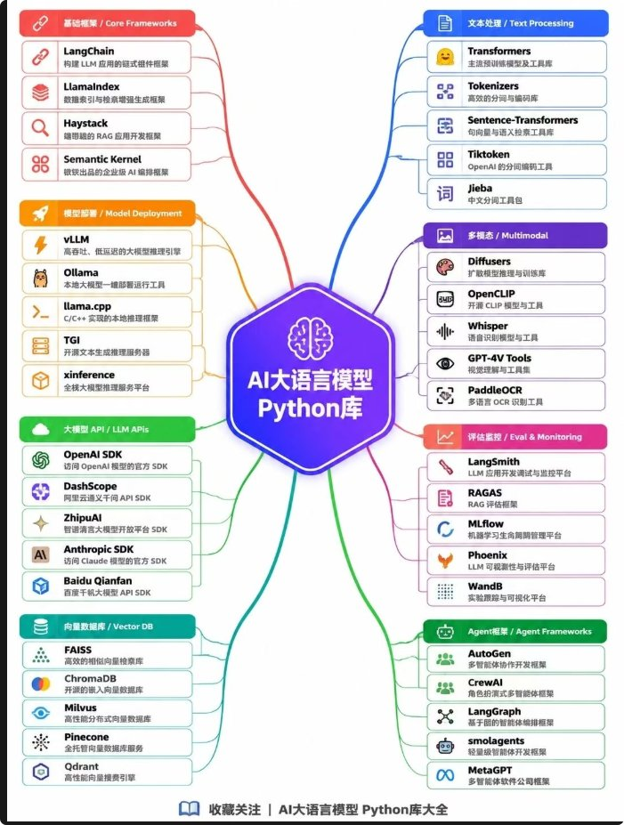

有人问：**AI 大模型应用开发，需要学哪些 Python 库？**

不必一次全啃。下面这张八分脑图把常见库按职能摊开——先认路，再按自己要走的路径挑子集。

图心：**AI大语言模型 Python库**。页脚：「收藏关注 | AI大语言模型 Python库大全」。各库一句说明跟图面走。

---

## 八区速查

### 1. 基础框架

| 库 | 一句话（图面） |
|---|---|
| **LangChain** | 构建 LLM 应用的链式组件框架 |
| **LlamaIndex** | 数据索引与检索增强生成框架 |
| **Haystack** | 端到端的 RAG 应用开发框架 |
| **Semantic Kernel** | 微软出品的企业级 AI 编排框架 |

### 2. 模型部署

| 库 | 一句话（图面） |
|---|---|
| **vLLM** | 高吞吐、低延迟的大模型推理引擎 |
| **Ollama** | 本地大模型一键部署运行工具 |
| **Llama.cpp** | C/C++ 实现的本地推理框架 |
| **TGI** | 开源文本生成推理服务器 |
| **xinference** | 全栈大模型推理服务平台 |

### 3. 大模型 API

| 库 | 一句话（图面） |
|---|---|
| **OpenAI SDK** | 访问 OpenAI 模型的官方 SDK |
| **DashScope** | 阿里云通义千问 API SDK |
| **ZhipuAI** | 智谱清言大模型开放平台 SDK |
| **Anthropic SDK** | 访问 Claude 模型的官方 SDK |
| **Baidu Qianfan** | 百度千帆大模型 API SDK |

### 4. 向量数据库

| 库 | 一句话（图面） |
|---|---|
| **FAISS** | 高效的相似向量检索库 |
| **ChromaDB** | 开源的嵌入向量数据库 |
| **Milvus** | 高性能分布式向量数据库 |
| **Pinecone** | 全托管向量数据库服务 |
| **Qdrant** | 高性能向量搜索引擎 |

### 5. 文本处理

| 库 | 一句话（图面） |
|---|---|
| **Transformers** | 主流预训练模型及工具库 |
| **Tokenizers** | 高效的分词与编码库 |
| **Sentence-Transformers** | 句向量与语义检索工具库 |
| **Tiktoken** | OpenAI 的分词编码工具 |
| **Jieba** | 中文分词工具包 |

### 6. 多模态

| 库 | 一句话（图面） |
|---|---|
| **Diffusers** | 扩散模型推理与训练库 |
| **OpenCLIP** | 开源 CLIP 模型与工具 |
| **Whisper** | 语音识别模型与工具 |
| **GPT-4V Tools** | 视觉理解与工具集 |
| **PaddleOCR** | 多语言 OCR 识别工具 |

### 7. 评估监控

| 库 | 一句话（图面） |
|---|---|
| **LangSmith** | LLM 应用开发调试与监控平台 |
| **RAGAS** | RAG 评估框架 |
| **MLflow** | 机器学习生命周期管理平台 |
| **Phoenix** | LLM 可观测性与评估平台 |
| **WandB** | 实验跟踪与可视化平台 |

### 8. Agent 框架

| 库 | 一句话（图面） |
|---|---|
| **AutoGen** | 多智能体协作开发框架 |
| **CrewAI** | 角色扮演式多智能体框架 |
| **LangGraph** | 基于图的智能体编排框架 |
| **smolagents** | 轻量级智能体开发框架 |
| **MetaGPT** | 多智能体软件公司框架 |

---

## 按路径挑子集就行

八区约 40 个名字，不是通关清单。常见起步可以粗暴一点：

| 你要走的路 | 优先碰的区 |
|---|---|
| **RAG** | 基础框架 + 向量数据库 + 文本处理（嵌入/分词）+ 评估监控里的 RAGAS |
| **Agent** | Agent 框架 + 基础框架（编排）+ 大模型 API |
| **本地部署** | 模型部署（Ollama / vLLM / Llama.cpp 等） |
| **多模态** | 多模态区 + 对应 API / 文本处理 |

先定路径，再在对应区里挑 1–2 个主库练手；同区其余当「知道有谁」即可。

---

## 旁链：别跟工具层、架构篇搅成一锅

| 旁链 | 它管啥 | 跟本篇的边界 |
|---|---|---|
| [一张图看懂：MCP、Skills、CLI](/posts/mcp-handbook/) | 连接 / 方法 / 执行 | 工具层 ≠ Python 库地图 |
| Agent 工程 20 概念（上）（待发布） | Agent / Harness / Loop 词表 | 概念词表 ≠ 库选型 |
| Prompt → Context → Harness → Loop（待发布） | 能力瓶颈四站外移 | 叙事框架 ≠ 八区库表 |
| [Claude Code 四类 Loop](/posts/claude-code-handbook/) | CC 交权循环 | 工作流交权 ≠ 应用库盘点 |
| 8 种主流 Agent 架构（待发布） | 架构形态对照 | 架构篇；本篇是实现侧库 |
| 10 种软件架构风格（待发布） | 通用软件架构 | 通用架构 ≠ LLM Python 库 |
| 企业 AI 落地七层（待发布） | 企业落地分层 | 落地分层 ≠ 库地图 |
| 企业 AI 员工五件脏活（待发布） | 脏活与链路 | 业务脏活 ≠ 库速查 |

本篇只做「库名 + 图面一句」的选型地图；原帖 URL 用户未给，按粘贴图卡处理。[^open-q]

[^open-q]: 原文评论区有「还需要学什么」一类开放提问，**评论未收录**；本笔记不编造「还该补哪些」的完整清单。
