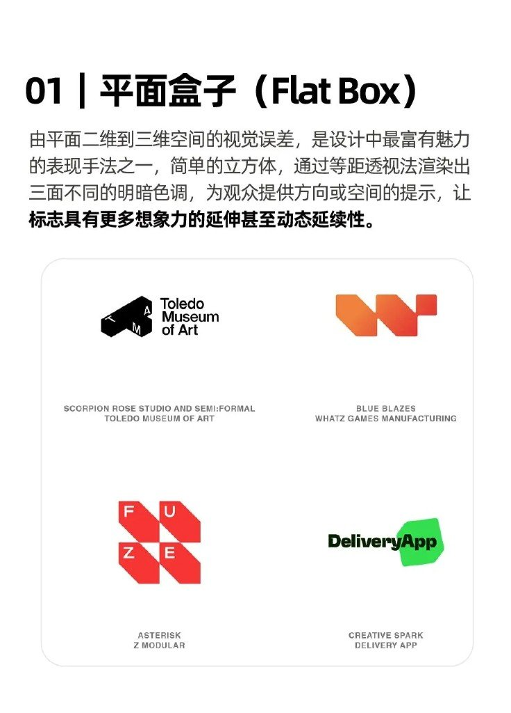
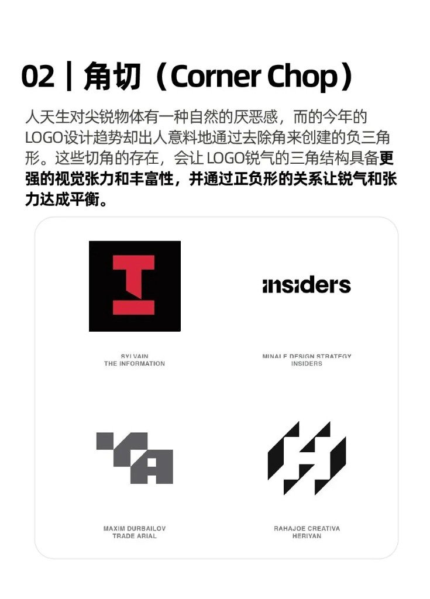
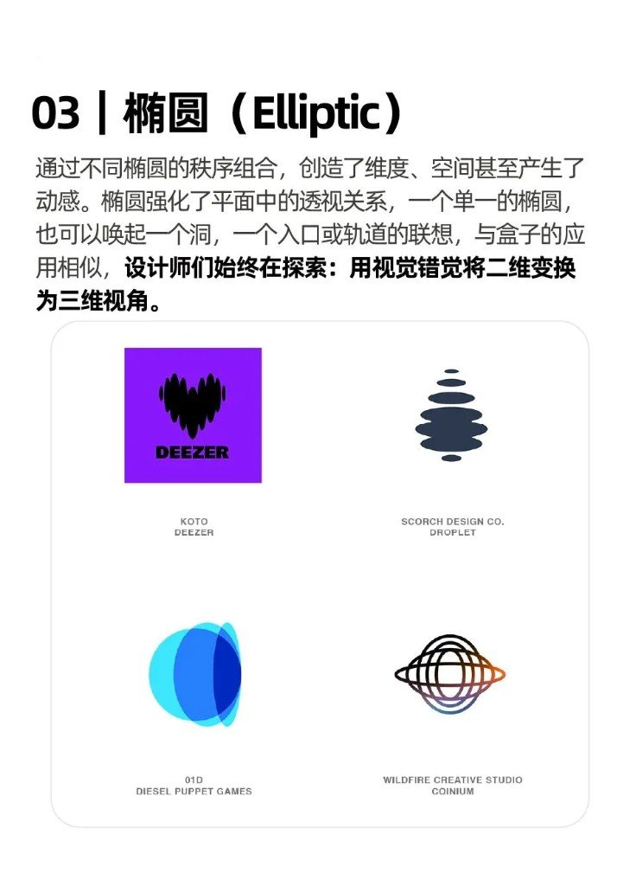
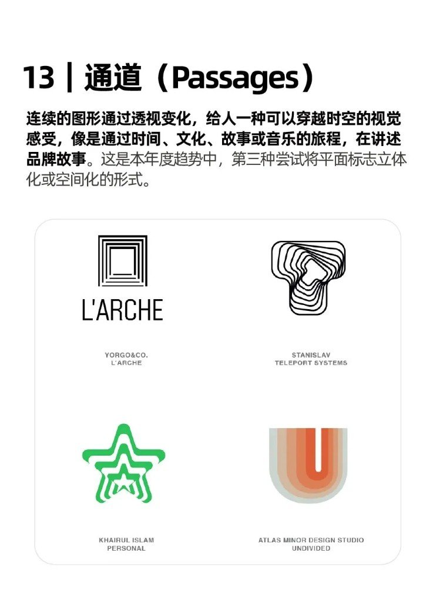
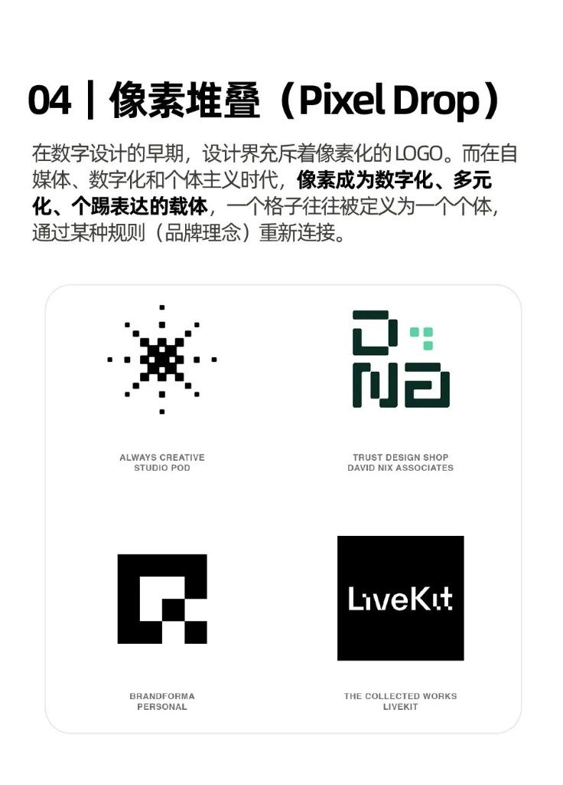
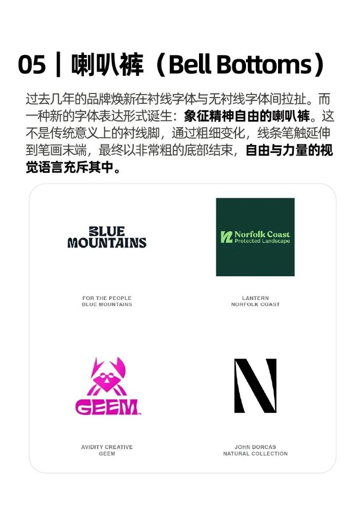
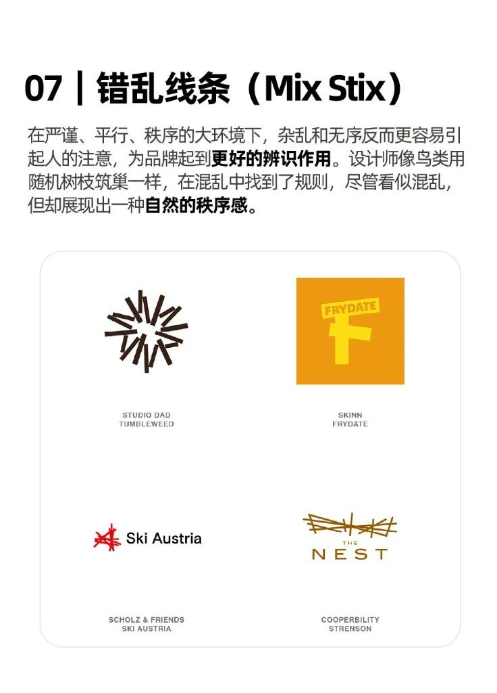
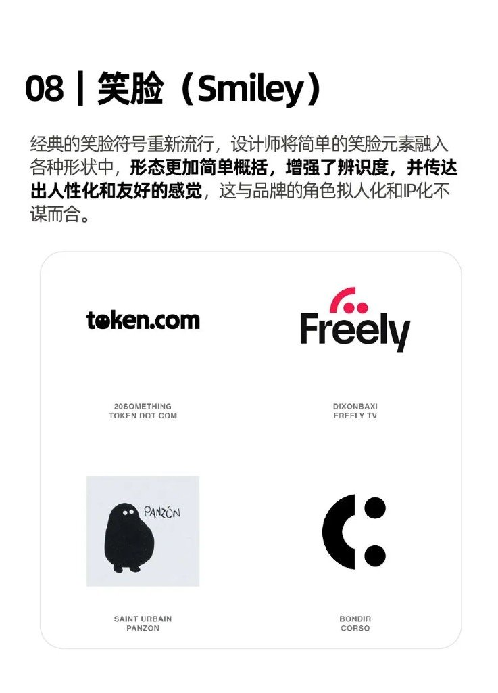

公众号几乎没写字，甩封面 + 15 张趋势页。封面明说是 LogoLounge 2026 标志趋势解析——中文转述，不是官方英文报告原文。

同日视觉品味旁链：[红墙上的节气](/posts/solar-terms-red-wall/) · [六张海报刀法](/posts/creative-poster-gallery/)（均仍在草稿箱，本地可开）。

版权先钉死：案例 Logo 归原设计师与品牌方。只当欣赏学习。禁止商用临摹、二创当己有。

## 怎么记这十五刀

我按四组扫：立体化、字体/像素、情感亲和、符号指向。做 PPT / 信息图时偷的是语法，不是人家成标。

### 立体化（平面硬拗空间）

| # | 中英 | 手法 |
|---|---|---|
| 01 | 平面盒子 Flat Box | 等距透视三面明暗，盒子当空间错觉 |
| 02 | 角切 Corner Chop | 切角出负三角，锐气与张力用正负形对冲 |
| 03 | 椭圆 Elliptic | 椭圆秩序组合 → 洞口 / 轨道 / 透视深度 |
| 13 | 通道 Passages | 连续形透视隧道，讲「穿越」叙事 |
| 14 | 雷达扫描 Radar Sweep | 锥形/径向渐变模拟扫描运动与时间 |

### 字体 / 像素 / 材质感

| # | 中英 | 手法 |
|---|---|---|
| 04 | 像素堆叠 Pixel Drop | 像素格=个体单元；可「掉落」游离方块 |
| 05 | 喇叭裤 Bell Bottoms | 字脚末端粗厚外扩——不是传统衬线 |
| 06 | 液态连接 Liquid Bridge | 粘性圆润接头，柔流共生（常贴 ESG） |
| 07 | 错乱线条 Mix Stix | 乱线筑巢，乱里藏秩序 |
| 09 | 贴纸 Stickers | 阴影+模切边，倾斜松散更活 |

### 情感 / 亲和

| # | 中英 | 手法 |
|---|---|---|
| 08 | 笑脸 Smiley | 简笔笑脸嵌字标，拟人化 / IP |
| 12 | 平衡艺术 Balance Act | 不规则块当积木叠平衡，曲直混搭 |

### 符号 / 指向

| # | 中英 | 手法 |
|---|---|---|
| 10 | 中心点 Center Point | 向心团结——滥了，靠外围元素救新鲜 |
| 11 | 指针 Pointers | 箭头并入字母，方向=号召力 |
| 15 | 新星 Nova Star | 四角星当 AI/高科技符号：神秘、信任、未来感 |

## 自己用时记这几条就够

- 想「薄标志有厚度」→ 先试 Flat Box / Elliptic / Passages / Radar Sweep，别一上来加阴影糊成伪 3D
- 想字标有态度 → Bell Bottoms 或 Pixel Drop，二选一别叠满
- 想亲和 → Smiley / Stickers；想科技未来感 → Nova Star（四角星，不是五角）
- 中心点（10）官方转述都承认难出新：能不用就换刀

偷语法，别描成标。十五页署名与原图权属归设计师与品牌方。
