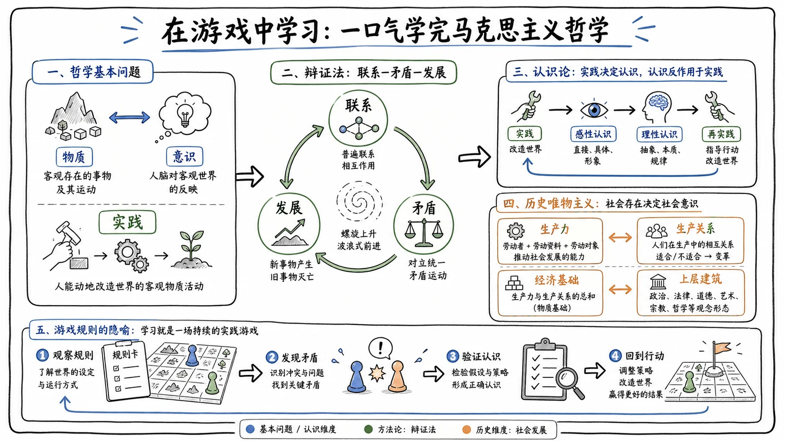

# 一、哲学基本问题与物质意识

## 1.1 哲学基本问题与唯物主义形态

这是一株豌豆射手，他通过射出豌豆打败僵尸。他认为先有了要打败僵尸的想法，才会想要射出豌豆，因此**意识才是世界的本源**，这就是**唯心主义**。

这是一颗坚果，他曾和伙伴们一起抵抗僵尸的入侵。一颗颗豌豆呼啸而过，一阵阵低吼令人胆寒，一个个战友接连倒下。面对这些客观存在的事物，他认为**物质才是世界的本源**，这就是**唯物主义**。

这两种思维的碰撞，衍生出了哲学的基本问题：**意识和物质谁才是世界的本源**。

这颗坚果虽然是唯物主义者，但他认为植物都是由分子构成，因此分子是世界的本源，只有分子才算得上是物质。这种认为所有物质都是由分子构成的唯物主义，叫做**近代形而上学唯物主义**。这种唯物主义虽有一定科学基础，但经不起自然科学发展的检验。随着科学发展，我们发现分子由更小的粒子构成，如中子、质子、夸克等。

这株玉米投手也是唯物主义者，但他认为只有植物、僵尸、草坪这些多种实物才是物质。这种将物质等同于某些实物的唯物主义，叫做**古代朴素唯物主义**，具有明显的局限性。这两种唯物主义又被叫做旧唯物主义自然观，是不彻底的唯物主义。

**现代辩证唯物主义**认为，凡是具有客观实在性、不会以人的意志为转移的都是物质。无论是实物粒子还是尚未发现的新物质，只要不受人为意志影响，它们就是物质。

## 1.2 物质、运动与实践

既然物质范畴如此之广，它们有什么共性？日月更替，潮涨潮汐，植物生长枯萎，这些事物无时无刻不在**运动**，而运动正是所有物质的根本属性。

物质世界包罗万象。这片荒凉的后院在未经实践改造之前，属于自然界的物质；通过布置、种植和排列等一系列实践活动形成的有机系统，就成为人类社会的一部分。因此，**实践**不仅是将物质世界分化为自然界与人类社会的历史前提，也是将二者统一的现实基础。

面对僵尸入侵，大嘴花通过吞噬僵尸阻挡进攻，但对冰车无能为力；倭瓜能跃起砸扁僵尸，但对矿工僵尸束手无策。通过不断尝试和调整，它们逐渐理解不同僵尸的特性和应对策略。因此，**实践是理解和解释一切现象的关键**，实践帮助我们更好地理解物质世界。

## 1.3 意识的本质与能动作用

这是一只僵尸，他对未来看不到希望，向往迷人的魅力、惊人的臂力以及傲人的财力。他感到绝望，对当下只剩迷茫。身处物质世界的他，常与其他事物比较，优于对方则骄傲，逊于对方则苦恼。这种对客观世界的主观印象就是**意识**。

这也是一只僵尸，它每天只知道吃，从不陷入苦思。两只僵尸面对相同的物质内容，却拥有截然不同的想法。因此，意识在内容上是客观的，在形式上是主观的，是客观内容与主观形式的统一。

第一只僵尸感到苦恼，希望强化自身；第二只僵尸感到满足，希望填饱肚子。他们的意识都具有目的性，这体现了意识能动作用之一：**意识活动具有目的性和计划性**。

为了抵抗僵尸，植物们不再满足现状。向日葵和豌豆联姻诞生了豌豆向日葵，小猫香蒲与向日葵联姻诞生了小猫向日葵。它们创造性地衍生了新的植物，这体现了意识能动作用之二：**意识活动具有创造性**。

僵尸大军面对越来越强的对手，在一次次失败中总结出要加强自身装备、针对性进攻，这体现了意识能动作用之三：**意识具有指导实践、改造客观世界的作用**。

屏幕前的你通关后惊呼雀跃，失败后捶胸顿足，这些情绪影响着你的行为，这也是意识能动作用之四：**意识具有调控人的行为和生理活动的作用**。

显而易见，意识对物质世界具有反作用力，也就是**意识的能动作用**。

## 1.4 物质与意识的辩证关系及实践前提

这是一只僵尸，想要吃到脑子，但在现实面前，他的梦想不值一提。思维无法直接改变现实，意识无法直接作用于物质。虽然光有想法不足以让他实现目标，但想法具有指导实践、达成目标的能动作用。

他从失败中吸取经验，加强自身装备，再次挑战，但在失败的路上他一向很成功。这是否说明思维指导实践的理论错了？并非如此。他的失败是对物质世界的认识不够充分：高估了自身水平，低估了对手实力。现实中，只有从实际出发，能充分反映客观规律的认识，才是正确全面的认识；只有以正确的认识为指导，才能形成正确的行动。因此，**从实际出发**是发挥思维能动作用的前提之一。

如果仅有认知而不付出实践，也会迎来失败。因此，**实践**是发挥思维能动作用的前提之二。僵尸通过失败的实践更全面地了解自身和对手，又通过更全面的认知去指导实践，形成良性循环。用思维指导实践，此为“志”；在实践中完善思维，则为“慧”。

思维指导实践必须依靠一定的物质条件和手段。倘若僵尸没有金钱提升装备，没有人脉开路，没有高人指点，空无一物的他无论有多大抱负，终是竹篮打水一场空。因此，**依赖物质条件和手段**是思维能动作用的前提之三。

> 君子生非异也，善假于物也。

只有从实际出发，让正确的认知指导实践，假借外物，才是充分发挥意识主观能动性的前提。深刻理解并把握物质与意识的辩证关系，以及主观能动性与客观规律性的关系，才能在物质世界中更有效地实现目标和解决问题。

## 二、唯物辩证法：联系、发展与矛盾

## 2.1 联系的普遍性、客观性、多样性与条件性

这株豌豆射手是后院保安，保护业主平安。他与僵尸之间的敌对关系，属于不同事物之间的联系；他自身通过根须与叶片进行光合，产生养分维持生长，这个过程属于事物内部的联系。

处在联系中的事物相互影响、相互制约、相互作用。柔弱的生产者可以帮助解锁更强的战士，而战士又保护生产者，体现了联系的相互作用和相互影响。但在有限空间内，每多一个生产者，战士的空间就减少一个，这体现了联系中的相互制约关系。

无论是事物之间的联系，还是事物本身内部的联系，这些关系都不以人的意志为转移，故联系具有**客观性**。唯物辩证法认为，万事万物都处在联系之中，小到一棵植物，大到整个地球，都是相互联系的统一体，而非孤立存在，故联系具有**普遍性**。向日葵与豌豆射手的合作关系、豌豆射手与僵尸的敌对关系，或直接或间接，或必然或偶然，或内部或外部，反映了物质世界的多样性，因此联系具有**多样性**。所有联系都是有条件的。植物种植与土地是否空置有联系，如果没有空置空间，就中断了植物与土地的联系；但条件可以改变，面对不利条件采取举措，能化不利条件为有利条件，故联系具有**条件性**。

有利条件促进事物发展，不利条件抑制事物发展，而发展是普遍联系的事物之间相互作用的必然结果。

## 2.2 发展的实质与量变质变规律

这是250个阳光购买的寒冰香蒲，他与僵尸的敌对关系是一种联系。处在联系中的事物不可避免会相互作用，这种作用可以是物质的，也可以是精神的。无论是物质还是精神层面，相互作用必然导致事物的运动及变化，也必然导致事物的发展。

发展的本质是**新事物的产生和旧事物的灭亡**。随着战斗升级，现有植物不再满足需求，需通过新植物满足战斗需求。新事物诞生于旧事物，保留旧事物中合理的因素，又添加旧事物不能容纳的新内容；它有新的要素、结构和功能，适应变化的环境和条件。旧事物的各种要素和功能已不适应当前环境，因此不可避免走向灭亡。

新事物根本上符合人民群众的利益和要求，必然能战胜旧事物，故发展是前进上升的运动。但新事物产生和旧事物灭亡并非瞬间完成，而是经过**量变**的积累而产生了**质**的飞跃。这里涉及三个概念：**量、度、质**。在旧事物处于量变范畴时，可用量表示事物的规模、程度、速度等数量关系；量变与质变的临界点即为度；质是事物区别于其他事物的内在规定性。

量变是质变的必要准备，质变是量变的必然结果。在总的量变过程中，存在阶段性和局部性的部分质变，表现量变与质变的相互渗透。事物的发展是新事物产生和旧事物灭亡的循环，也是质变与量变过程中渐进与飞跃交替循环的过程。

## 2.3 联系与发展的五大基本环节

事物从联系到发展的过程，通过**五对基本环节**得以实现。

1. **原因与结果**：植物在与僵尸的对抗中被摧毁，对抗关系是植物毁灭的原因，植物毁灭是结果。全面把握因果关系，才能通过自觉努力消除不利因素，达到预期结果。
2. **本质与现象**：植物与僵尸之间的对抗本质上是利益冲突，这种内在联系的外在表现即为战斗。现象又分为真相与假象。植物与僵尸对抗看似制造冲突，实际是为了维持后院安全稳定；种植更多植物看似加剧冲突，实际是为了更好维持安稳。真相往往隐蔽于表面。学习新事物会让你感到无知，但实际会让你更聪明；运动会让你感到虚弱，但实际会让你更强壮；面对恐惧会让你感到害怕，但实际会使你更勇敢。只有透过现象把握本质，方能洞悉事物发展脉络。
3. **偶然与必然**：蹦极僵尸盗走场上核心植物导致防守失败，看似偶然，实际上是由于植物布局缺乏科学性和严谨性所致，是一种必然联系。
4. **现实与可能**：原有植物无法有效抵抗僵尸，玩家开始思考，这一潜在发展必须以现实条件为基础。
5. **内容与形式**：植物与僵尸的对抗不仅有2D版本，还有3D版本。尽管表现形式各异，但对抗的核心内容决定其表达方式。内容代表事物之间的内在联系，形式必须依据内容为基础进行发展与创新。

## 2.4 对立统一规律：矛盾及其基本属性

这是一株豌豆射手，他吐出豌豆击退僵尸。他的防守与僵尸的进攻是对立的，这叫**对立性**；但如果没有僵尸的进攻，植物也就无需防守，因此植物与僵尸也存在相互依存关系，甚至在一定情况下对立面的双方可以相互转化及相互贯通，这叫**统一性**。

马哲将这种既有对立性又有统一性的事物称之为**矛盾**。所以对立统一规律即矛盾规律。马克思认为，万事万物都处在矛盾当中，如出生与死亡、完整与残缺。僵尸想要突破后院和植物想要保护后院的矛盾，促使植物提升攻击力，也促使僵尸提升防御力，所以**矛盾推动事物的发展**，它是变化发展的内在动力，也是事物之间联系的根本内容。

矛盾的同一性是有条件、相对的；如果没有僵尸，植物与僵尸的依存关系就无从谈起。矛盾的同一性是事物存在和发展的前提。矛盾的斗争性则是绝对的，因为只要矛盾存在，斗争就一直存在。斗争性的作用有三：

- 促使矛盾双方力量发生变化；
- 为事物的质变创造条件；
- 促使一种矛盾向另一种矛盾过渡。

同一性和斗争性在不同条件下可能处于不同地位。当春风得意时，应清楚和谐只是相对的、有条件的，应时刻保持谦逊与谨慎；当深陷低谷时，不要自暴自弃，因为矛盾不会消失，只能解决。

## 2.5 矛盾的普遍性与特殊性

万物矛盾终生，天地对立而存。生灵的生与死、事物的圆与缺看似对立，但又互以对方的存在为前提。

> 有无相生，难易相成，长短相较，高下相倾。

万事万物无时无刻不处于矛盾之中，因此矛盾具有**普遍性**。但在不同阶段、不同条件下，事物的矛盾不尽相同。植物保护后院与僵尸进攻后院的矛盾，以及种植植物前后阳光的多与少也是矛盾，它们同时存在，但又有主次之分。对抗僵尸是主要任务，即**主要矛盾**；种植植物花费阳光是次要任务，即**次要矛盾**。主要矛盾起支配地位、主导作用，次要矛盾起从属地位、次要作用。

矛盾的普遍性即共性，是无条件的、绝对的；矛盾的特殊性即特性，是有条件的、相对的。共性寓于特性之中，二者紧密相连。面对情景各异的事物，应注意到事物存在特性矛盾，避免简单照搬和机械复制。这就是矛盾普遍性与特殊性的哲学意义：学会从个别到一般，再从一般到个别的辩证思维。

## 2.6 主次矛盾与矛盾分析法

在植物与僵尸的斗争中，僵尸入侵后院与植物保卫后院是一对矛盾；普通僵尸的弱小与想要强化自身的愿景也是一种矛盾。前者是最重要、优先级更高的矛盾，称为**主要矛盾**，后者为**次要矛盾**。事物身处纷繁复杂的物质世界，面临的矛盾往往并非单一，不同矛盾的重要性各异。主要矛盾是事物发展的中心问题、关键问题、重点问题，在事物发展中占据支配地位，其他矛盾占从属地位，这就是矛盾的力量不平衡性。

任何矛盾都由对立的两方面构成，主要矛盾也不例外。僵尸与植物对抗时，时而僵尸入侵占主导，时而植物抵抗占主导。这种在主要矛盾中占主导地位的一方，被称为**主要方面**，它决定事物的性质、本质、主流与方向；相对弱势的一方为**次要方面**。

马哲的**矛盾分析法**给了解决几乎所有问题的流程化方法论：

- 既要看到主要矛盾及主要方面，也要看到次要矛盾及次要方面，这叫**两点论**；
- 同时要着重把握主要矛盾与矛盾的主要方面，看清事物主流与大势，这叫**重点论**。

坚持两点论与重点论的统一，才能在全面看待事物发展的过程中，清晰把握方向，做到从重点出发、统领全局。

## 2.7 否定之否定规律

这是一株豌豆射手，他经历了从种子到植物的过程，即由种子到植物的质变。种子状态相较于成熟植物，在初期更能适应环境，因此种子状态本身具有合理的**肯定因素**。当环境条件变化、种子到了发芽时机，单纯的种子形态已不满足自身需求，种子内部的**否定因素**开始占据主导，促使种子从肯定状态转向自我否定，引发质变成长为植物。因此，否定是事物的自我否定，是事物内部矛盾运动的结果。

由种子走向植物，是植物发展的必要环节；由幼稚走向成熟，是人类发展的必要环节。不否定是发展的必要环节，是旧事物向新事物转变的过程。但新事物并非凭空产生，而是在保留旧事物合理因素的基础上，从旧事物中孕育而生。新事物发扬旧事物的合理因素，抛弃不合理因素，这个过程即为**扬弃**。

花开终有谢，叶茂必归根。植物终会枯萎，但生命以种子的形式延续。这种经历了对种子的否定，又对植物进行否定的过程，即为**否定之否定**。事物经历肯定、否定、否定之否定三大阶段，就是事物的一个发展周期。事物发展并非一蹴而就，而是内部矛盾相互作用的结果，具有**周期性**和**曲折性**。新的种子经过自然筛选和考验，发扬了旧种子的合理因素，又添加了更适应环境的新内容，因此发展规律还具有**前进性**。

事物发展呈螺旋式上升。需认清自我，辩证看待发展中的曲折，相信厚积薄发终将带来质的飞跃。

## 三、认识论：实践、认识与真理

## 3.1 实践的本质、特性与类型

臣观圣上久玩手机，恐伤龙体，谏言即一种实践行为。在这个过程中，臣是进谏的主体，即**实践主体**；陛下是被进谏的对象，即**实践客体**；语言是臣的**实践中介**。一个完整的实践包含三个部分：以人为主体的实践主体、实践客体以及实践中介，三者相互依存，缺一不可。

微臣通过进谏，让陛下停止刷手机，间接影响了圣上刷手机的物质行为，即臣通过进谏的实践间接地改造了物质世界。实践的本质是**人类有意识地改造世界的物质活动**。

进谏是有意识、有目的的，故实践具有**自觉能动性**；进谏确实间接引起了物质世界的变化，故实践具有**直接现实性**；如果当前历史背景下尚未发明手机，或当前社会背景下无人出售手机，自然不会有此次进谏，故实践具有**社会历史性**。

此次进谏虽看似只有劝学一个作用，但以实践的宏观视角体现出三大作用：

1. **实践关系**：臣与陛下的互动，是实践主客体之间的相互作用关系。
2. **认识关系**：在互动中，臣更充分地了解圣上的想法及观点，主体对客体的认知深化。
3. **价值关系**：臣向圣上进谏是为了引导陛下做出更好决策，即对客体的价值考量。

实践中的主体和客体并非固定不变。陛下发言时，臣即为客体；微臣发言时，陛下即为客体。实践中介也不断变化，语言、动作表达都是中介。实践是双向运动的，通过双向运动解决现实世界的矛盾。

实践类型有：

- **物质生产实践**：种植植物抵御僵尸，满足物质需要，是最基本的实践活动。
- **社会政治实践**：植物合作形成社会关系，如豌豆向日葵与树桩、植物与南瓜头的配合。
- **科学文化实践**：舞王僵尸在富有节奏的音律中前行，创造精神文化产品。
- **虚拟实践**：屏幕前的您滑动视频、操纵鼠标游玩游戏，通过数字化中介互动，具有开放性、间接性和交互性。

## 3.2 实践与认识的关系

通过种植魅惑菇的实践活动，我们获得了关于其魅惑特性的认识，这展现了实践是认识的来源。掌握了魅惑菇特性后，我们进一步探寻它是否对所有僵尸有效，这体现了实践推动认识发展的驱动作用。经过多次实验，每次尝试均以成功告终，我们似乎得到肯定答案，但魅惑菇对矿工僵尸、蹦极僵尸无效，因此并非对所有僵尸有效，故**实践是检验认识真理性的唯一标准**。随着对魅惑菇特性深入了解，我们的认识得以丰富完善，面对矿工僵尸和蹦极僵尸不再忽视，而是采取相应策略，这体现了认识对实践的指导作用，即实践是认识的目的，认识服务于实践。

## 3.3 认识的本质及发展过程

哲学即对事物本质的认识。这是一株魅惑菇，在了解其作用之前，你需要种植它，这一行为是实践。你想要了解魅惑菇特性的想法，体现了主动有选择性的思维能力，这是主体的**能动性**。通过观察，你理解了魅惑菇具有魅惑特性，你作为主体，魅惑菇作为客体，这种主体对客体的理解即为客体的反映。因此，认识可以概括为：**主体在实践基础上对客体的能动反映**，这也是辩证唯物主义对认识本质的概括。

在辩证唯物主义认识论出现前，唯心主义及旧唯物主义对认识本质有不同回答：

- **主观唯心主义**认为认识不以实践为基础，万事万物都是自身精神的产物，认识乃生而知之。
- **客观唯心主义**认为实践与认识皆由世外神灵操控或启示，认识乃神灵所示。
- **旧唯物主义**承认认识是主体对客体的理解，但不承认主体能动性，认为认识是客体被动的反映，且一次性完成。

辩证唯物主义认为，认识具有**反映特性**和**创造性**。反映特性表现为对客观事物的反映；创造性表现为能动性和创新性。二者相互依存，不可分割，共同构成认识的本质特性。

## 3.4 从感性认识到理性认识

为什么我们懂得很多道理，但还是过不好这一生？知行合一学说给出答案：知而行之，方为真知；知而不行，实为不知。大多数道理仅停留在“知道”层面，未曾付诸实践，因此并未真正理解。

马克思主义认为，认识事物需从低级认识逐步提升到高级认识，然后应用于实践。通过感官直接认识“坚持就是胜利”，这种低级认识叫**感性认识**。感性认识具有直接性，但停留于表浅，未深入本质，存在局限性。

从低级认识深化为高级认识，需经历三大阶段：

1. **概念总结**：对坚持与胜利的概念进行总结，明确怎样才算有效坚持、面对不同僵尸怎样坚持、坚持到什么阶段算胜利。
2. **判断**：掌握概念后，获得应对不同情境的策略，但现实环境复杂多变，需对不同情境精准判断。
3. **推理**：面对未曾应对的僵尸时，运用推理将已知知识应用于未知情况，通过逻辑推导得出结论。

感性认识通过概念总结、判断和推理三个阶段上升为**理性认识**，这一过程即为**认识的第一次飞跃**。这一过程依赖大量感性材料的筛选和提炼，实现去粗取精、去伪存真、由此及彼。理性认识虽由感性认识深化而来，但二者并无明确界限，相互渗透、相互包容。

在认识过程中，可能经历对战斗策略的顿悟和植物杂交的想象，这种不自觉且没有逻辑的认识形式，被称为**非理性因素**。它可能通过顿悟等形式对认识活动起到激活和驱动作用，某些时候甚至控制战斗决策。因此，既要重视理性分析，也要积极挖掘非理性因素的潜能。

## 3.5 从认识到实践的第二次飞跃

这是一株豌豆射手，通过观察其行为，我们发现他能击败僵尸，这个过程即为**认识世界**。我们认识他的目的是让其击败僵尸、保护后院，因此认识世界的目的是为了改造世界。如果不对其种植，认识的正确性无法被验证，也会失去意义。只有通过与僵尸战斗的实践，才能检验认知。

> 纸上得来终觉浅，绝知此事要躬行。

从认识到实践需要经历：

1. **确定实践目的**：通过种植植物打败僵尸，不想被吃掉脑子，这构成实践理念：保护家园。
2. **制定方案**：基于理念制定植物排列方案，这是关键步骤。
3. **验证可行性**：在较简单关卡内尝试，验证方案合理性，取得经验后逐步推广。

通过认识指导实践，认识运动达到了当前阶段目标。但随着难度增加，需要更强植物才能继续保护后院。实践推动认识的深化，认识与实践是一个不断循环发展的过程。实践必须符合现实和具体的社会历史条件。认识与实践历程螺旋式上升，正是这些起伏不定的经历推动我们不断前行。

## 3.6 真理及其属性

这是一株寒冰射手，他会吐出豌豆攻击僵尸，这是客观事实。你通过观察发现寒冰射手会攻击僵尸、保护家园，这一理解即主观认识。当主观认识与客观事实一致时，这种正确的认识就是**真理**。

对寒冰射手攻击僵尸这一行为的正确认识，不会因人为意志而改变，因此在相同条件下，对事物的正确认识只有一个，即**真理的一元性**。但可以表述为“寒冰射手攻击僵尸”，也可以表述为“僵尸会被寒冰射手攻击”，说明真理在客观内容上是一元的，表达形式可以多样，是**一元性与多样性的统一**。

真理具有**客观性**，不依赖于个人意志而改变。要认识真理，必须观察植物的实践行为，一步步探索验证。

> 不登高山，不知天之高也；不临深溪，不知地之厚也。

真理的获取往往不是一蹴而就的。一颗坚果表面上它是植物，但在不同阶段可能发生改变，如变成一只僵尸。这说明事物在不同阶段和方面可能变化，导致我们无法全面认识事物。先前对坚果的认识在某一阶段或某一方面是真理，但它仅反映事物某一阶段或部分的特性，因此真理具有**相对性**。但人类认识力无限，能一步步接近真理和更全面认识真理，这即是真理的**绝对性**。真理是相对性和绝对性的统一，相对中蕴含着绝对，绝对深藏于相对之内，从相对走向绝对。

## 3.7 真理与谬误

你是一颗坚果，通过与僵尸战斗，认识到僵尸是敌人，这是真理。你的朋友豌豆射手认为僵尸与他外貌相似，所以僵尸是同伴，这是**谬误**。当条件变化，豌豆开始黑化，学会召唤僵尸，这时僵尸成为同伴。因此真理与谬误的对立性在特定条件和范围内成立，条件变化时可相互转化，其对立性是相对的。

现实生活中，当前困境未必永远是障碍，若看清形势、因势利导，可化逆境为顺境。

> 青取之于蓝而青于蓝，冰水为之而寒于水。

真理与谬误总是相比较而存在、相斗争而发展。正是思想碰撞与融合，新事物才得以从旧事物基础上升起，真理在斗争中升华，旧貌在新生中蜕变。

怎样区分真理与谬误？真理标志主观认识与客观事实一致，因此验证真理即为验证是否与客观实际相符。必须通过实践，**实践是检验真理的唯一标准**。这一点是绝对的。但实践标准也具有相对性，没有实际条件时无法进行检验。坚守实践为检验真理的唯一标准，还需洞察其绝对性与相对性的辩证统一。

## 3.8 价值及其特性

这是一株豌豆射手，他的子弹经过坚果得到强化。对于豌豆射手来说，坚果具有**价值**。在这个过程中，豌豆射手是主体，发射子弹是实践，坚果是客体。价值是主体通过实践与客体之间形成的、对主体有意义的关系。

关于价值本质，客观主义价值论认为强化子弹的效果是坚果本身固有的，与豌豆射手无关；主观主义认为坚果的价值取决于豌豆射手是否需要加强子弹，与客体无关。马克思主义哲学认为，价值离不开主体需要，也依赖客体特性，具有主体性和客观基础。

价值的基本特性：

- **主体性**：只有植物射出豌豆，坚果才能发挥强化子弹的潜在价值，价值依赖于主体存在和创造。
- **客观性**：植物的存在、创造以及坚果作用都是客观事实，不受人为意志影响。
- **多维性**：同一客体对不同主体展现不同价值。坚果能强化豌豆香蒲的豌豆，却会弱化寒冰香蒲的攻击。
- **社会历史性**：普通坚果成长为高坚果后，无法再强化豌豆射手子弹，价值随历史发展而变化。

要做出正确的价值评价，需要树立良好价值观，在纷扰中明辨是非。

## 3.9 认识世界与改造世界

这是一只僵尸，他想要吃到脑子。你对这一事实的认识即**认识世界**，你种植植物抵抗僵尸的行为即**改造世界**。抵抗僵尸的行为来源于对僵尸入侵的认识，故认识世界是改造世界的前提，体现了两者统一性。不满足现状推动我们改变现状，体现了两者相互对立的关系。这种既对立又统一的关系即矛盾关系，是认识世界到改造世界过程中的根本动力，也是认识与实践中的基本矛盾。

改造世界过程中，世界被划分为客观世界与主观世界。随着僵尸增多，当前布阵思路无法抵抗入侵，即主观世界知识不足以继续改造客观世界，因此需要改造旧有战略思维。改造主观世界有助于更好地改造客观世界，客观世界的实践又反过来深化主观世界改造。

> 知之愈明则行之愈笃，行之愈笃则知之益明。

从认识世界到改造世界的过程遵循客观规律，这些规律称为事物的**必然性**。只有遵循规律，才能制定合理行动计划，实现有效改造。利用事物的必然性展现出的自觉自主状态即为**自由**。自由不是脱离限制的任性，而是在认识和运用规律基础上实现更大自主性和掌控力。因此从认识世界到改造世界的过程，是从必然走向自由的过程。

在认识和改造世界的过程中，旧事物难以应对新挑战时，就会出现瓶颈。不破不立，破而后立。应摒弃旧观念，运用新规律、新联系、新属性，进行**理论创新**，并将其化为实践，即**实践创新**。实践创新是变革和发展的先导，又为理论创新提供思考基础。两者相互作用，共筑创新良性循环。认识世界和改造世界是一个包含着创新的发展过程，唯有持续创新与突破，方能进步不止。

> 流水不腐，户枢不蠹。

## 四、唯物史观：社会历史发展规律

## 4.1 生产力与生产关系

这是一株向日葵，你可以通过种植它生产阳光。在整个生产过程中，你是种植的劳动者；你使用的工具如铲子，属于劳动资料中的生产工具；向日葵是劳动对象。劳动者利用劳动资料对劳动对象进行改造的能力，就是**生产力**。

你作为劳动者，决定了生产实践能否进行，因此劳动者是生产力中最活跃的因素。生产工具的进步反映生产力水平的提升，也标志着社会形态的变迁，因此生产工具是生产力发展的重要标志，也是区分社会形态的重要依据。科学技术推动生产工具从铁铲升级到机械化设备，提高生产效率，是生产发展的决定性因素，因此科学技术被称为**第一生产力**。科技发展离不开人才推动，因此人才是推动科技进步的关键，是**第一资源**。

在生产过程中，必然涉及铲子和向日葵等生产资料的归属权问题，即生产资料所有制关系。这种生产过程中的经济关系，就是**生产关系**。如果铲子和向日葵都归你所有，这是生产资料私有制形式，你与朋友之间会形成剥削关系，产品分配也不平等。生产资料所有制不仅决定人与人之间的关系，还直接影响产品的分配关系。这三种关系共同构成生产关系，生产资料所有制关系是生产关系中最基本、最具决定意义的方面。

生产力与生产关系统称为**物质生产方式**，属于社会存在的一部分。

## 4.2 经济基础与上层建筑

这是一只雪人僵尸，他与同伴一起生产植物，生产结果归他们共有，这是公有制生产关系。这是一只舞王僵尸，他指挥仆人生产植物，生产结果归他自己所有，这叫私有制生产关系。

社会中各类生产关系的总和，被称作**经济基础**。经济基础是生产关系而非物质手段。僵尸的道德、法律思想等思想观点都受到私有制关系的影响，各种思想观点简称为**意识形态**，即道德、哲学、宗教、法律、艺术等。在这种意识形态指导下，舞王僵尸建立了军队、政党、监狱等政治组织与制度，这些政治组织与制度以及意识形态构成**上层建筑**。经济基础决定上层建筑，上层建筑反映并服务于经济基础。随着矛盾激化，政治制度和意识形态推动社会变革，这种矛盾运动正是社会发展的动力。

## 4.3 社会基本矛盾与社会发展

顺境清扬草虫，逆境造龙成凤。这是一株豌豆射手，他与同伴共同守护后院，然而僵尸进攻让他们难以完成任务，这种对立便是矛盾。他们不断调整阵型、尝试不同协作方式，正体现了矛盾是推动事物发展的动力。

在人类社会中，推动社会进步的根本力量是**社会基本矛盾**。舞王僵尸召唤奴隶生产植物，奴隶体现奴隶社会生产关系。随着科技进步、生产力发展，出现机械等高级生产工具，归资本家所有，劳动者从奴隶变为工人，构成资本主义生产关系。从奴隶制到资本主义制的变革，正是因为生产力的发展促使生产关系调整。**生产力与生产关系之间的矛盾**是推动社会变革的根本动力，是社会基本矛盾之一。生产力是社会基本矛盾运动中最基本的动力因素，也是发展与进步的决定力量。

生产关系发展带来变革，产生资本主义的政治制度和意识形态，后者无法适应旧有上层建筑，最终导致封建社会瓦解，推动社会进步。**经济基础与上层建筑之间的矛盾**是社会基本矛盾之二。生产力作为社会演变的起点，是衡量社会进步的根本尺度，也是社会进步的根本内容。社会基本矛盾的解决方式因时而异：矛盾激化至无法调和时，推动社会形态变革；矛盾能通过改革解决时，在同一社会形态内部实现进一步发展。

## 4.4 阶级、革命与改革

> 以斗争求和平则和平存，以妥协求和平则和平亡。

这是一只雪人僵尸，他虽有强大攻击和防御，在僵尸家族鲜有敌手，但为了避免冲突，常选择以妥协求和平。起初奏效，但随着对手识破退让，失去进攻锐气的他终被击败。生活亦如是，斗争才能赢得真正和平与进步，退避与保守只能求得暂时安宁。

舞王僵尸召唤仆人劳作，自己坐享其成。舞王僵尸代表奴隶主阶级，伴舞僵尸象征奴隶阶级。奴隶阶级劳动成果归奴隶主所有，这种一方占有另一方劳动成果的关系即**阶级**的体现。当被剥削者不堪其苦，与剥削阶级发生冲突时，历史在斗争中前进。社会层面会引发**社会革命**，标志着旧社会制度崩溃和新社会结构建立。奴隶阶级的斗争不仅终结奴隶社会，还催生新的社会形态，促进社会结构变革。广义的社会革命涵盖政治、经济体系等全面变革。

阶级矛盾尚未激化到剧烈程度时，斗争结果往往是**改革**。改革是社会形态由量变到质变的关键手段，在一定程度上解决社会基本矛盾，促进生产力发展并推动社会进步。无论是革命还是改革，都是社会发展与进步中不可或缺的重要因素。没有对抗便没有进步，这是文明至今所遵循的规律。

## 4.5 英雄史观与群众史观

是英雄创造了历史，还是人民创造了历史？

僵王博士认为，僵尸一族至今的阶段性成功完全依赖自己的策略与指挥，是他创造了历史。这种认为少数英雄人物创造历史的观点，即为**英雄史观**。他之所以持有这种看法，是因为其看法停留于历史表象，夸大了自身作用，忽视了僵尸群众的历史作用，这是英雄史观的认识根源；僵尸内部只有少部分僵尸负责统治，广大僵尸群众处于被支配地位，群众对历史的创造性得不到承认，这是社会根源；从阶级角度看，英雄史观有助于僵王博士夸大个人贡献、弱化群众作用，从而巩固统治地位，这是阶级根源。

另一只普通僵尸认为，是他和并肩作战的僵尸群众共同创造了历史，这种认为群众创造历史的观点即为**群众史观**。其依据有：

- **现实依据**：僵尸社会的历史由无数真实现实的僵尸创造，而非孤立英雄个人的历史。
- **历史本质依据**：社会历史的本质是由众多僵尸的愿望和行动共同作用的产物，是集体活动形成的合力，不能归于少数英雄。
- **历史发展依据**：历史发展遵循客观规律，顺应历史发展趋势的尸群才是真正的推动者。
- **历史层次依据**：从整体看，僵尸是历史的创造者；从群体看，劳动群体是历史的主导力量；从个人看，个人作用有限。

在僵尸入侵后院的历史中，涌现出旗帜僵尸、僵王博士等作用较大的个体，即**历史人物**。僵王博士在推动僵尸入侵中发挥的作用远超其他僵尸，属于**杰出人物**。杰出人物往往更具开拓性目光与审时度势能力，最先发现历史任务、提出历史需求，比一般人站得高、看得远，往往象征社会变革的先导。

普通僵尸借鉴僵王博士的强大能力，意识到自身不足，优化装备，选择借势前行。这个追随攀附强者的过程也是不断自省的过程。

> 君子性非异也，善假于物也。

虽然杰出人物在历史发展中发挥重要作用，但历史发展方向与进程并非由他们决定，历史创造者实为大多数普通群众。群众的价值体现在：

- 群众是**物质财富的创造者**，通过采集改造和生产等活动形成社会所需物质条件；
- 群众是**精神财富的创造者**，音乐、舞蹈等精神产品的主体是人民群众；
- 群众是**社会变革的决定力量**，僵王虽有强大攻击手段，但要想胜利必须依赖尸群。

群众创造历史的过程中受多方面限制：物质层面经济条件影响创造力，思想层面文化与政治起制约作用。以辩证角度看待个人与群众在历史中的关系，才能更全面理解他们在历史中的作用。

感谢观看，希望这段学习旅程能让您有所收获，我们未来再见。

