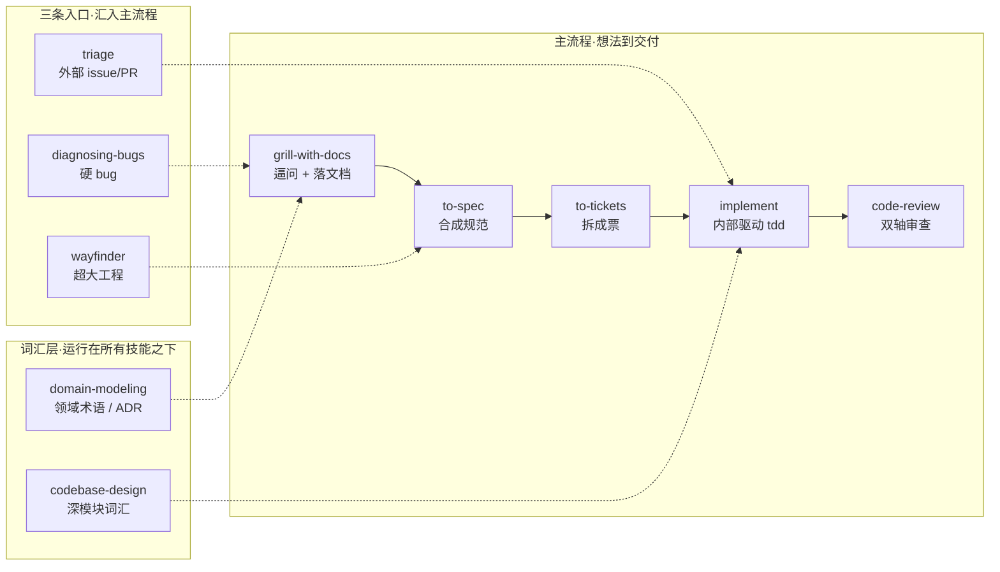

TypeScript 圈博主 Matt Pocock 开源了自己的 agent 技能库，star 涨得飞快。表面是 40 个 SKILL.md，拆开看其实是同一套工程方法论。这篇基于技能原文，把它的骨架和关键设计讲透。

## 一张地图看全局

整个库不是平铺的技能堆，而是三层结构加一堆独立件。ask-matt（官方路由器）把它画得很清楚：

主流程是「想法→交付」，三条 on-ramp（入口）从不同起点汇入，两个词汇技能在所有流程下面提供公共语言，剩下的是独立件。

## 心脏：grilling，一台逼你想清楚的机器

整库最强的引擎不是写代码的，而是「问问题」的。

grilling 把任何计划当一棵**决策树**：每个决定下面挂着依赖它的下一批决定。按「轮」问，每轮只问当前能答的那批（frontier，即前置已定的决策），每个问题编号并附上 agent 自己的推荐答案。

分工很明确：能从代码库或文件查到的**事实**，agent 派子代理查，不麻烦你；真正要拍的**决策**才抛给你，等你回答进下一轮。frontier 空了（树走完、没有默默假设）才算完，且在确认共识前不动手。

## 词汇层：让所有技能说同一种话

两个技能不直接干活，但所有技能都踩在它们上面。

**domain-modeling**（领域建模）管「词」。三条硬纪律：

- `CONTEXT.md` 是**纯术语表**，零实现细节，不兼当 spec 或草稿
- 用户用词和术语表冲突时当场指出（「你的术语表说 cancellation 是 X，但你好像指 Y」）
- ADR 只在三条件同时满足才写：难逆转、无上下文会惊讶、是真实权衡的结果。少一个就不写

**codebase-design**（深模块）管「形状」。核心是 deep module：小接口后面藏大量行为。几个一眼能带走的原则：

- **删除测试**：想象删掉这个模块，复杂度没了？它就是个透传。复杂度分散到 N 个调用方？它值
- **接口即测试面**：调用方和测试跨同一条缝；想越过接口测，多半是模块形状错了
- **一个适配器是假设的缝，两个才是真的缝**：没有真实变化别引入抽象

## 主流程：grill → spec → tickets → implement → review

**grill-with-docs**（有代码库）/ **grill-me**（无代码库）：同一个 grilling 引擎，前者把结论写进 CONTEXT.md 和 ADR，后者不落任何东西。选哪个看有没有代码库，不看心情。

**to-spec**：把聊定的事合成规范，明确「不访谈，纯合成」。模板有两处反直觉的设计：

- **User Stories 要超长**：编号列表尽可能穷尽功能所有面向，不是两三句
- **Implementation Decisions 不放文件路径和代码**：因为会迅速过时；唯一例外是原型产出的状态机/类型形状这类「比散文更精确」的东西

**to-tickets**：把规范拆成 **tracer-bullet 垂直切片**。每张票切一条贯穿 schema→API→UI→测试的完整窄路，自己可演示可验证，尺寸塞得进一个全新上下文窗口。每张票声明 **blocking edges**（依赖谁、被谁阻塞），无阻塞的立即可开工。

特殊场景：大范围重构（改一个符号炸全库）不硬塞垂直切片，改用 **expand-contract**：先加新形态不破坏旧的 → 按爆炸半径分批迁移（每批一张票，CI 保持绿）→ 无调用者后删旧形态。

**implement**：按票实现，内部驱动 tdd（红→绿，一次一切片）。每张票自包含，上一张的上下文可丢，新票开新窗口。

**code-review**：双轴，两个并行子代理互不污染上下文。一个查「符不符合仓库规范」（Standards），一个查「实现对不对得上原需求」（Spec）。

## 三条入口：从不同起点汇入主流程

**triage**（issue 管理）：只处理「你没创造的 issue」，也就是外部 bug 报告、feature 请求。走状态机分类、验证、写成 agent 能直接领走的任务。注意 to-tickets 产生的票已是 agent-ready，不要再过 triage。

**diagnosing-bugs**（硬 bug）：只接「一眼看不出来」的，比如间歇性 flake、两个已知良好状态之间爬进来的回归。铁律：先建紧反馈环（一条已经对这个 bug 红的命令），再谈理论；修完带回归测试。事后若发现真问题是「没有好 seam 锁住这个 bug」，就转给 improve-codebase-architecture。

**wayfinder**（超大工程）：主流程里认知负荷最高的一环。当「从这到目的地」的路还看不见时，它把工作做成 issue tracker 上的一张**决策地图**：一个 map issue 挂一批决策 ticket。两处设计很妙：

- **战争迷雾（fog of war）**：能精确成句的问题才变成 ticket；看不清的写进 Not yet specified，等 frontier 推进自然毕业成票，不硬切迷雾
- **HITL vs AFK**：票分「人在环内」（和用户一起拍板）和「人不在环」（agent 独自解决）。HITL 票 agent 绝不能代答，官方原话是「一个自己回答自己问题的 grilling agent 已经坏了」
- 一次会话只解一张票（research 票除外），解完记录答案、关票、在地图上加指针

wayfinder 默认「只规划不执行」：地图清空时交棒到主流程的 to-spec，而不是直接 implement。

## 会话纪律：阶段边界

ask-matt 里最实用的一段是 phase boundaries。两个阶段之间怎么处理上下文，五选一，官方给了决策顺序：Continue（不花钱）→ clear（什么都不留）→ handoff（跨 harness/目录/同事才用）→ subagent（紧任务单独窗口）→ compact（压缩，树底部的默认）。

核心主张：**grilling→spec→tickets 保持一个未断的上下文窗口**（约 150k token 的「清醒区」内），别中途 compact；每张 implement 才开新窗口。跨阶段或跨目录用 handoff 搭桥，prototype 进出主流程就靠它。

## 我的判断

这套东西最有价值的地方，不是某个技能，而是它把**「有经验的工程师怎么把事做成」**拆成了可组合的流程，并且对 skill 本身用了同一套纪律：薄壳委派（grill-me 正文只剩一句）、旧能力吸收合并、核心小可组合。

三点要认清：

- **有学习曲线**：skill 之间互相引用（grill-with-docs 驱动 domain-modeling，implement 驱动 tdd），单独抽一个会失效；首次要跑 setup 初始化 issue tracker 和文档布局
- **它选了一条更重的路**：wayfinder、to-tickets 这种「先想清楚再动手」的流程，对小型一次性任务反而拖沓。ask-matt 自己都警告 wayfinder 别用在范围清晰的 feature 上
- **强绑定维护文档的习惯**：CONTEXT.md + ADR 这套领域建模假设你愿意写文档；如果你本来就不写，这些技能的价值打对折

最核心的一点：**Matt Pocock 的整个技能库，本质是在教 agent 一件事，动手之前先把每个假设都问一遍。** 其他全是这条主线的配套。

## 两天三个版本：从 40 个技能到 25 个 promoted

这篇发出之后，官方从 v1.1.0 一路发到 v1.2.3（两天三个版本）。技能数量不再是 40 个——现在全仓 35 个，官方正式分发的 promoted 是 25 个。

### 数量为什么缩水：4 个技能被吸收合并

v1.2.0 一口气废弃了 4 个：design-an-interface、ubiquitous-language、request-refactor-plan、qa。前三个分别被 codebase-design、domain-modeling、improve-codebase-architecture 吸收——正好印证了上文的「旧能力吸收合并」：词汇层和架构层越做越全，原先独立的单点技能就没了存在必要。

### 三个新面孔

| 技能 | 它干嘛的 | 特别之处 |
|---|---|---|
| wait-what | 消息没看懂就让 agent 重新讲一遍 | 全库最短，正文 3 行；用「听者状态」命名而不是输出（不叫 /tldr），逼它重讲 + 简化 + 带上缺的上下文 |
| to-questionnaire | 把「你一个人答不了的决定」变成问卷 | grill 的对象不是主题而是「发给谁、要什么」，从 in-progress 毕业 |
| wizard | 生成交互式 bash 脚本带你走手动流程 | 从 in-progress 毕业，改成 model-invoked（agent 遇到只有人能做的步骤会自动调它） |

另外 writing-great-skills 改名为 writing-for-agents，无别名，旧名直接失效。重构动作：GLOSSARY 并入 SKILL.md、skill 专属机制拆到新的 SKILL-MECHANICS.md、pruning 加了「cache」概念（文档别复述环境里能查到的东西）。

### 这套技能踩在 Agent Skills 开放标准上

v1.2.0 最大的结构性动作是加了 Codex 兼容：每个 SKILL.md 旁多一个 agents/openai.yaml（Codex 的扩展元数据），仓库根 AGENTS.md 是 CLAUDE.md 的符号链接。背后是 OpenAI 推的 Agent Skills 开放标准（agentskills.io）：目录约定 .agents/skills/<name>/SKILL.md（项目）+ ~/.agents/skills/（用户），frontmatter 必需键只有 name + description。

各工具对这套标准的读取路径并不完全一样，铺到多工具链时最容易踩：

| 工具 | 读哪些 skills 目录 |
|---|---|
| Codex | ~/.agents/skills（主路径）+ 项目级 .agents/skills |
| Cursor | ~/.cursor/skills + 兼容 .agents/skills |
| OpenCode | ~/.config/opencode/skills + 兼容 .agents/skills |
| Claude Code | ~/.claude/skills，不读 .agents/skills，要靠 junction/符号链接 |

把技能放进 ~/.agents/skills 真源，Codex 直接读，Cursor/OpenCode 双路径兜底，只有 Claude Code 需要一条 junction（~/.claude/skills 指向真源）。

### 插件版 vs 复制版

官方从 v1.2.0 起同时提供两种装法：插件版（claude plugins install mattpocock-skills，订阅制自动更新，但只活在 Claude Code 的插件沙盒里）和复制版（npx skills@latest add mattpocock/skills，可编辑文件副本）。官方明说装两个会重复。工具链不止 Claude Code 的话，插件版其他工具读不到，只能复制版 + 真源 + 镜像。

### 更新里最值钱的一手

是 wait-what 的命名哲学：修「模型话痨」这类毛病，技能越写越长越没用，不如用一个命名精确的短触发词，让 agent 一次做对「重讲、简化、补齐上下文」三件事。名字描述「听者的状态」而不是「想要的输出」，是这套技能库一贯思路的极端化。
