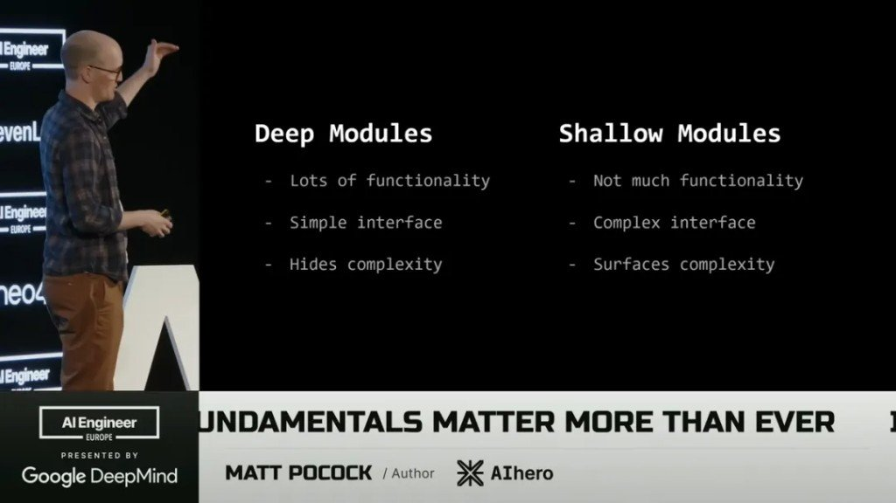
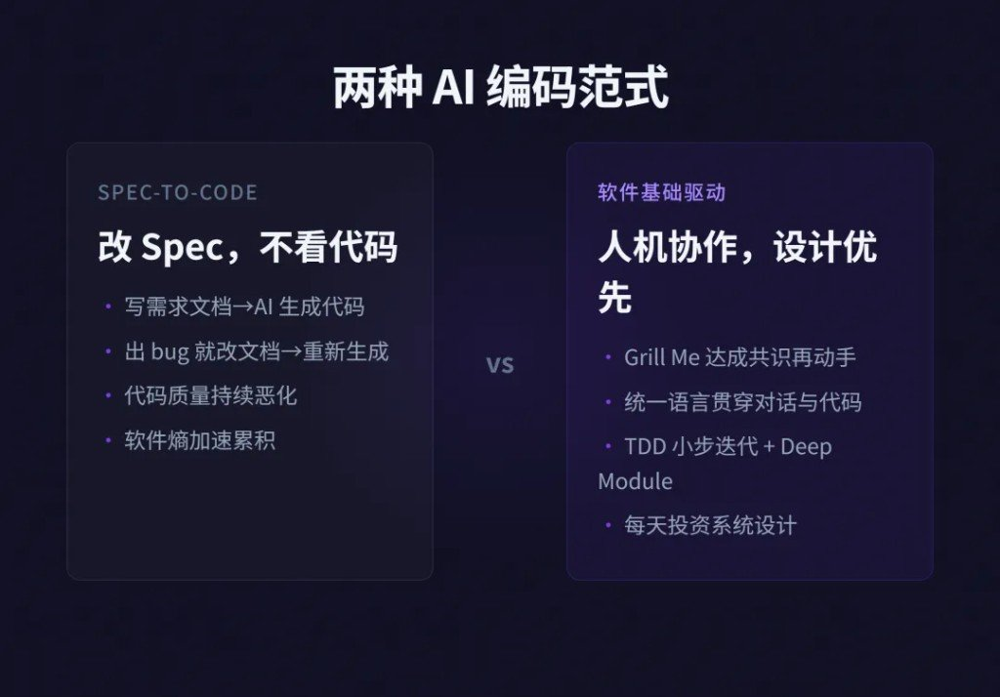

「写规格 → AI 出码 → 有 bug 改规格重生」听起来像未来。干三个月你就知道：未来也可能是一坨谁都不敢动的糊。

Matt Pocock 在 AI Engineer Europe 那档 *Software Fundamentals Matter More Than Ever* 里，把流行口号拧了一下：代码打字变便宜了，坏代码却贵到离谱——因为烂结构会同时卡住你和模型。好库与烂库的差距，会被 AI 放大，不是抹平。

同人不同题：早前拆过他的 skills 库骨架，见 [40 个技能围着一个 grilling 转](/posts/matt-pocock-engineering-method/)。本篇是演讲书单向，别当成同一篇复读。

## Spec-to-Code 为什么会喂出软件熵

人尽量不读代码，只改文档再重生——短期交付好看，中期每次改动都让下一刀更贵。Ousterhout 那句被他打在大屏上：复杂度 = 任何让系统难懂、难改的结构因素。

所以真正贵的不是 token，是「生成错形状」的速度。

## 失败模式怎么挂回四本书

| 你撞上的坑 | 旧解法挂哪 |
|---|---|
| AI 做对了「错题」 | 先共享 Design Concept；Brooks《设计的设计》+ `/grill-me` |
| 你和模型各说各话 | Evans《领域驱动设计》· 统一语言 |
| 一次生成冲出车灯 | TDD（Kent Beck）；《程序员修炼之道》的小步反馈 |
| Failure #4：Doing way too much | Ousterhout《软件设计的哲学》· Deep Module |
| 功能在涨、脑子先炸 | 人守战略接口，AI 干战术实现 |

四本封面墙：

Kent Beck 不在墙上，但卡在「油门限制器」那一格——红绿重构不是仪式，是不让模型一次铺三层错。

## 五步，别当鸡汤清单

1. **Grill Me**：先逼问 40～100 个问题，决策树走完再动手。技能在 `mattpocock/skills` 的 `grill-me`（有库用 `grill-with-docs`）。2026-08-11 核对：仓库约 21.2 万 star；公众号写的「13k+」口径不清，别拿去当唯一数字。
2. **统一语言**：一个概念一个词，术语表进上下文；同义漂移会同时脏 prompt 和代码。
3. **TDD**：把生成速度卡在反馈环上，而不是写完再祈祷绿。
4. **Deep Module**：大量行为藏进小接口；浅模块堆多了，模型比你先迷路。

5. **委托实现**：接口你定（战略），内部灰盒给模型（战术）。军事比喻就这句：别让战术天才上指挥席，也别自己去抠每一枪。

## 两种范式，选边很简单

| Spec-to-Code | 软件基础驱动 |
|---|---|
| 改 Spec，不看代码 | 共识 → 语言 → 小步 → 深模块 |
| bug → 改文档 → 重生 | 每天仍投一点系统设计 |
| 熵加速 | 人机分工清楚 |

没有第三种魔法范式。工具再换，挂不上旧书的那条路，还是会在第三个月撞墙。

## 书先读哪本，看你最近在骂谁

- 模块切得又碎又透 → 先 Ousterhout
- 词对不上、PR 里三种叫法 → 先 Evans
- 计划本身像雾 → Brooks + 开一轮 grill
- 生成太猛测太懒 → Beck 的循环先挂上，Pragmatic 当陪读

视频源：YouTube `v4F1gFy-hqg`（检索日 2026-08-11）。
