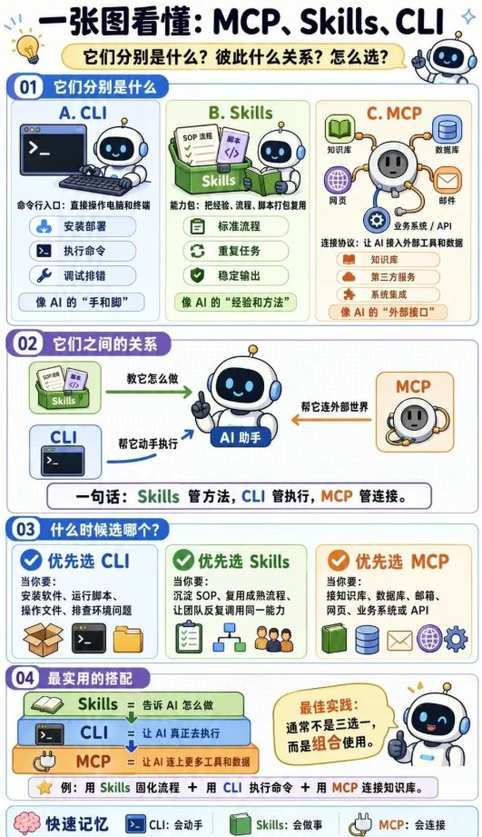

MCP、Skills、CLI，分别解决「连接、方法、执行」三类问题。MCP 让 AI 接入知识库、数据库和外部系统；Skills 沉淀流程与经验，提升复用性；CLI 负责具体命令执行与落地操作。三者并非替代关系，而是协同关系，组合使用效果最佳。

它们分别是什么？彼此什么关系？怎么选？下面按图四段展开，文案尽量跟图面走，不当完整教程。

## 三件东西，各管一块

| 件 | 图面定义 | 典型能力 | 像 AI 的… |
|---|---|---|---|
| **CLI** | 命令行入口：直接操作电脑和终端 | 安装部署 / 执行命令 / 调试排错 | **手和脚** |
| **Skills** | 能力包：把经验、流程、脚本打包复用 | 标准流程 / 重复任务 / 稳定输出 | **经验和方法** |
| **MCP** | 连接协议：让 AI 接入外部工具和数据 | 知识库 / 第三方服务 / 系统集成 | **外部接口** |

分不清时先对号：要不要**动手**、要不要**按套路做事**、要不要**连外面**。

## 不是替代，是叠在一起用

图中间是 AI Assistant，三件分别贴到不同部位：

- **Skills** → 教它怎么做
- **CLI** → 帮它动手执行
- **MCP** → 帮它连外部世界

图脚那句够用：**Skills 管方法，CLI 管执行，MCP 管连接。**

不是谁取代谁。缺方法会瞎干，缺手脚落不了地，缺连接就困在本地沙盒。

## 先想清楚你要哪种能力

| 优先 | 触发条件 |
|---|---|
| **优先选 CLI** | 安装软件、运行脚本、操作文件、排查环境问题 |
| **优先选 Skills** | 沉淀 SOP、复用成熟流程、让团队反复调用同一能力 |
| **优先选 MCP** | 接知识库、数据库、邮箱、网页、业务系统或 API |

选型顺序可以很粗暴：本地命令/文件/环境 → CLI；要稳定复用同一套做法 → Skills；要跨系统拿数据/调服务 → MCP。

## 实战里怎么叠

图上三块是叠着的，不是三选一：

1. **Skills** = 告诉 AI 怎么做
2. **CLI** = 让 AI 真正去执行
3. **MCP** = 让 AI 连上更多工具和数据

**最佳实践：通常不是三选一，而是组合使用。**

例：用 Skills 固化流程 + 用 CLI 执行命令 + 用 MCP 连接知识库。

页脚快速记忆也顺手背掉：

| 件 | 记法 |
|---|---|
| CLI | 会动手 |
| Skills | 会做事 |
| MCP | 会连接 |
