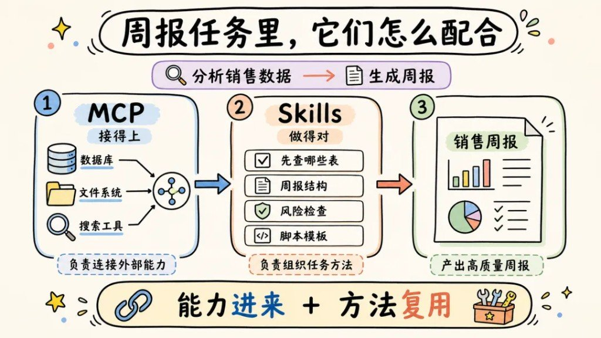
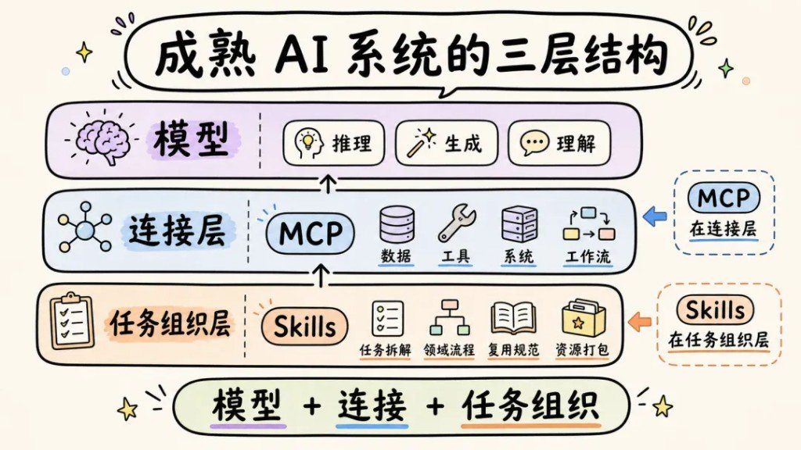

「都是给 AI 加能力，所以二选一」——这句把人带沟里了。加能力没错，**层位**才是坑：一个管接进来，一个管怎么做。

## MCP：统一怎么接外面

MCP（Model Context Protocol）是**开放连接标准**：AI 应用用同一套规矩发现、暴露、传递和调用外部能力——数据源、工具、工作流、外部应用。

官方说法（2026-08-11 核对）：开源标准，用来把 AI 应用接到外部系统；类比就是 AI 侧的 USB-C——值钱的是统一插头，不是某一个外设。见 [modelcontextprotocol.io/introduction](https://modelcontextprotocol.io/introduction)。

记住这句就够：**重点不是某个工具，而是统一连接方式。**

## Skills：把「做得对」打包带走

Skills 是**可复用能力包**：说明、知识、脚本、模板……把领域里怎么把事做稳的经验捆好，任务来了直接调用。

| | MCP | Skills |
|---|---|---|
| 偏什么 | 连接 | 组织 |
| 回答 | 怎么接外部世界 | 怎么把任务做好 |
| 对 AI | 接进来 | 按方法做 |
| 互替？ | 否 | 否 |

## 周报：接得上 × 做得对

别空谈互补，看一张销售周报怎么叠。

1. **MCP**：数据库 / 文件系统 / 搜索——原料接得上
2. **Skills**：先查哪些表、周报结构、风险检查、脚本模板——方法复用
3. **产出**：像样的销售周报

只有插头没有菜谱，会乱炖；只有菜谱接不上库，是纸上谈兵。

## 三层栈：模型 · 连接 · 任务组织

把 MCP / Skills 塞进成熟 AI 的分层里，误会基本消掉。

| 层 | 干什么 | 落点 |
|---|---|---|
| 模型 | 推理 / 生成 / 理解 | 脑子 |
| 连接层 | 数据 · 工具 · 系统 · 工作流 | **MCP** |
| 任务组织层 | 拆解 · 领域流程 · 复用规范 · 资源打包 | **Skills** |

公式六个字：**模型 + 连接 + 任务组织。**  
选型时先问「我缺的是插头还是菜谱」，别再问「MCP 和 Skills 哪个更强」。

## 跟旁边那张三件套卡别搅

本篇不讲 CLI，也不讲具体怎么配某个 Host。若要「连接 / 方法 / 执行」三件一起看，站内已有：[一张图讲清 MCP、Skills 和 CLI 怎么分工](/posts/mcp-skills-cli-relationship/)。彼=三件选型；本篇=两概念层位 + 三层栈，别硬并成一篇。
