## 面试中的考查侧重点
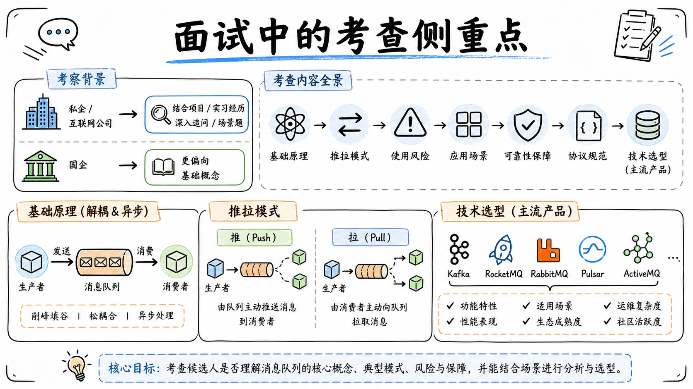

消息队列是计算机校招面试中的常见考点。在私企或互联网公司，面试官往往会结合项目、实习经历深入追问，甚至设计具体的场景题；而在不少国企的面试中，相关问题通常更偏向基础概念。

本文围绕消息队列的基础原理、推拉模式、使用风险、应用场景、可靠性保障、协议规范，以及 Kafka、RocketMQ、RabbitMQ、Pulsar、ActiveMQ 等主流产品的技术选型展开。

## 消息队列基础
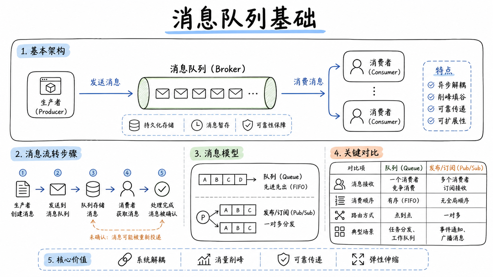

## 什么是消息队列
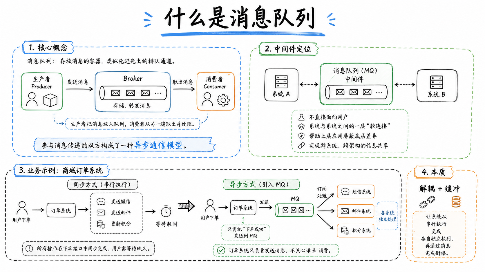

消息队列可以理解为一个存放消息的容器，类似于一条先进先出的排队通道：

- **生产者 Producer**：发送消息的一方；
- **消费者 Consumer**：处理消息的一方；
- **Broker**：存储、转发消息的服务端。

生产者把消息放入队列，消费者从另一端取出并处理。参与消息传递的双方构成了一种**异步通信模型**。

消息队列属于中间件，可以理解为系统与系统之间的一层“软连接”。它不直接面向用户，而是帮助上层应用屏蔽底层差异，实现跨系统、跨架构的信息共享。

例如，在商城订单系统中，用户下单成功后，系统还需要发送短信、发送邮件、更新积分等。如果这些操作全部在下单接口中同步完成，用户可能要等待好几秒才能看到下单成功的提示。

引入消息队列后，订单系统只需要把“下单成功”这件事发送到消息队列中，也就是发送到 MQ。短信、邮件、积分等系统分别订阅这条消息并独立处理。订单系统只负责发送消息，不需要关心谁来消费，这就是消息队列最基本的工作方式。

> **消息队列的本质，可以概括为“解耦 + 缓冲”。**  
> 它让系统从串行执行变成各自独立执行，再通过消息完成衔接。

## 消息队列的三大作用
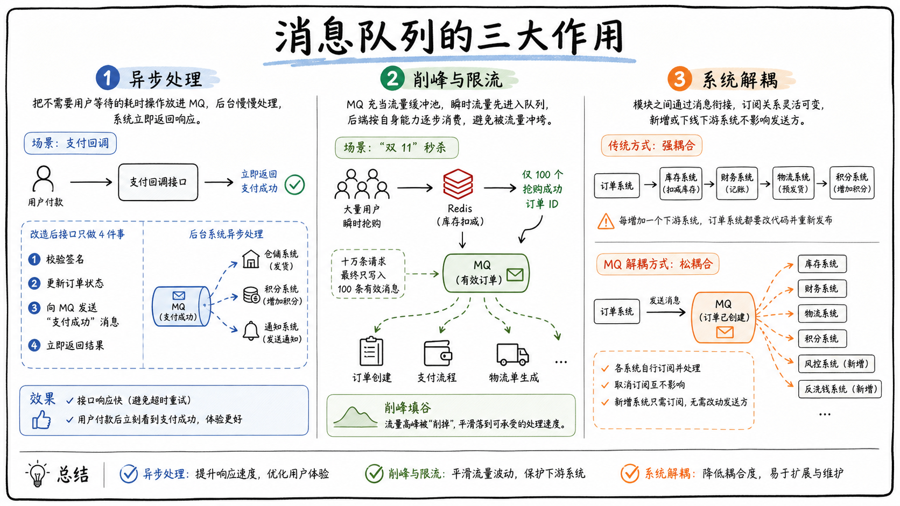

### 1. 异步处理

异步处理，就是把不需要用户等待的耗时操作放进消息队列，由后台慢慢处理。用户完成操作后，系统可以立即返回响应，不必等待所有后续任务结束。

以支付回调为例，用户付款后，系统可能需要：

- 更新订单状态；
- 通知仓储发货；
- 增加用户积分；
- 发送支付成功通知。

如果这些事情全部放在支付回调接口中同步执行，接口响应时间可能达到三四秒，支付平台甚至可能因为超时而发起重试。

改造后，支付回调接口只完成以下操作：

1. 校验签名；
2. 更新订单状态；
3. 向 MQ 发送一条“支付成功”消息；
4. 立即返回结果。

仓储、积分、通知等系统分别订阅消息并独立处理。这样，用户付款后可以立刻看到支付成功，使用体验也会更好。

### 2. 削峰与限流

消息队列可以充当流量缓冲池。瞬时流量猛增时，请求先进入队列，后端消费者再按照自己的处理能力逐步消费，从而避免下游系统被流量直接冲垮。

以“双 11”秒杀为例，秒杀开始的一瞬间，可能有几十万甚至上百万人抢购 100 部手机或 100 件衣服。如果十几万条请求直接打到数据库，数据库很可能当场“跪了”。

一种常见方案是：

1. 秒杀请求到达后，先通过 Redis 完成库存扣减；
2. 只有真正抢购成功的 100 个订单 ID 才进入 MQ；
3. 后续的订单创建、支付流程、物流单生成等操作，由消费者从 MQ 中逐步拉取并处理。

也就是说，十万条请求最终只向 MQ 写入 100 条有效消息，后端系统自然会稳定很多。这就是消息队列的**削峰填谷**作用。

### 3. 系统解耦

引入消息队列后，模块之间不再直接调用，而是通过消息完成衔接。

例如，A 模块发送一条消息，B、C、D 三个模块可以根据需要自行订阅。某个模块不想继续处理时，可以取消订阅；新增模块时，也不需要修改 A 模块的代码。

在传统商城系统中，用户下单后，订单系统可能需要依次调用：

- 库存系统扣减库存；
- 财务系统记账；
- 物流系统预发货；
- 积分系统增加积分。

每增加一个下游系统，订单系统都需要修改代码并重新发布。

通过消息队列解耦后，订单系统只负责发送一条“订单已创建”的消息。库存、财务、物流、积分等系统各自订阅并处理。如果后续增加风控系统或反洗钱系统，只需要让新系统订阅同一条消息，订单系统一行代码都不用改。

## 消息队列的推拉模式
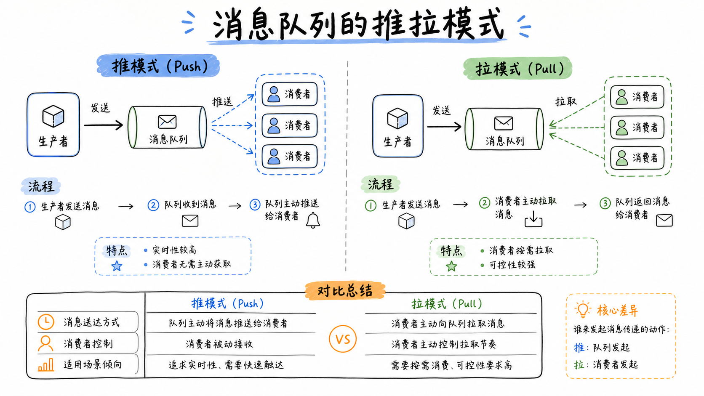

## 推拉发生在哪些组件之间
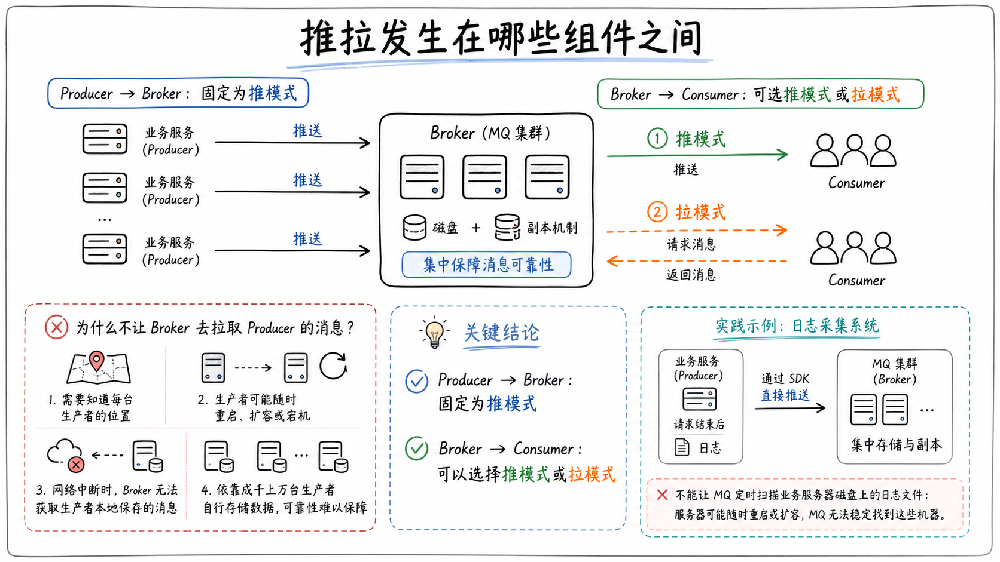

消息队列中的“推模式”和“拉模式”，通常指的是 **Consumer 与 Broker 之间的交互方式**。

生产者向 Broker 发送消息，业界默认采用推模式，即：

> **Producer 主动把消息推送给 Broker。**

如果反过来，让 Broker 到成千上万台生产者服务器上拉取消息，会带来严重问题：

- Broker 需要知道每台生产者服务器的位置；
- 生产者可能随时重启、扩容或宕机；
- 网络中断时，Broker 无法获取生产者本地保存的消息；
- 依靠成千上万台生产者自行存储数据，可靠性难以保障。

Broker 通常拥有磁盘和副本机制，可以集中保障消息可靠性。因此需要记住：

- **Producer → Broker：固定为推模式；**
- **Broker → Consumer：可以选择推模式或拉模式。**

例如，在日志采集系统中，业务服务作为 Producer，每次请求结束后，通过 SDK 直接把日志发送给 MQ 集群中的 Broker。不能让 MQ 定时扫描业务服务器磁盘上的日志文件，因为业务服务器随时可能重启或扩容，MQ 甚至无法稳定找到这些机器。

## 推模式
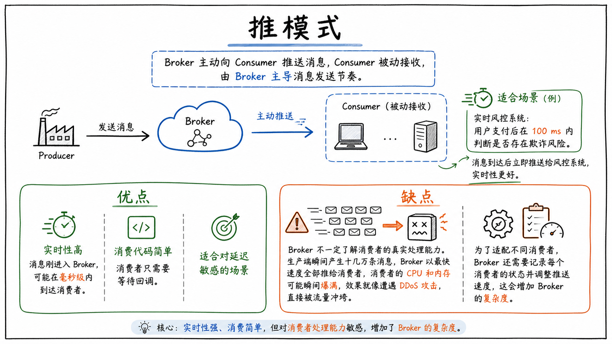

推模式是指 Broker 主动向 Consumer 推送消息，Consumer 被动接收，由 Broker 主导消息发送节奏。

### 优点

- **实时性高**：消息刚进入 Broker，可能在毫秒级内到达消费者；
- **消费代码简单**：消费者只需要等待回调；
- 适合对延迟敏感的场景。

例如，实时风控系统要求用户支付后在 100 ms 内判断是否存在欺诈风险。此时使用推模式，消息到达后立即推送给风控系统，实时性更好。

### 缺点

Broker 不一定了解消费者的真实处理能力。如果生产端瞬间产生十几万条消息，而 Broker 以最快速度全部推给消费者，消费者的 CPU 和内存可能瞬间爆满，效果就像遭遇 DDoS 攻击一样，直接被流量冲垮。

另外，为了适配不同消费者，Broker 还需要记录每个消费者的状态并调整推送速度，这会增加 Broker 的复杂度。

## 拉模式
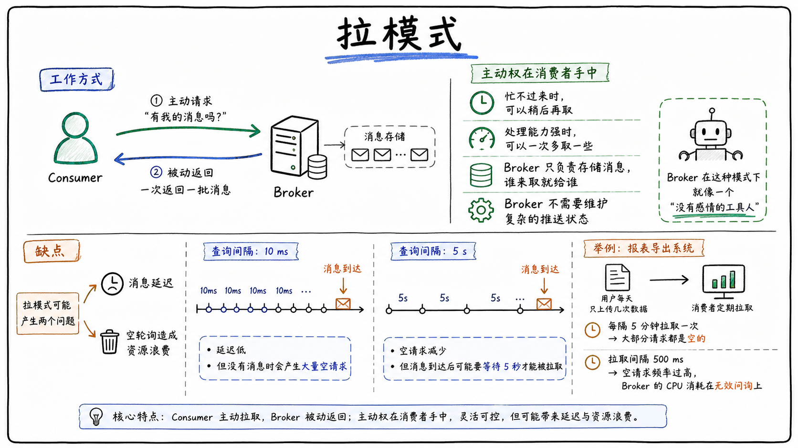

拉模式是指 Consumer 主动向 Broker 请求消息，Broker 被动返回。

消费者就像自己取餐的顾客，会主动询问 Broker：“有我的消息吗？”如果有，就一次取回一批。主动权掌握在消费者手中：

- 忙不过来时，可以稍后再取；
- 处理能力强时，可以一次多取一些；
- Broker 只负责存储消息，谁来取就给谁；
- Broker 不需要维护复杂的推送状态。

可以说，Broker 在这种模式下就像一个“没有感情的工具人”。

### 缺点

拉模式可能产生两个问题：

- **消息延迟**；
- **空轮询造成资源浪费**。

消费者不知道消息什么时候到达，只能定期询问。如果每 10 ms 查询一次，延迟虽然低，但没有消息时会产生大量空请求；如果每 5 秒查询一次，空请求减少了，但消息到达后可能要等待 5 秒才能被拉取。

例如，在报表导出系统中，用户每天可能只上传几次数据。如果消费者每隔 5 分钟拉取一次，大部分请求都是空的；如果把拉取间隔设置为 500 ms，空请求频率又会过高，Broker 的 CPU 会消耗在无效问询上。

## Kafka 与 RocketMQ 的长轮询
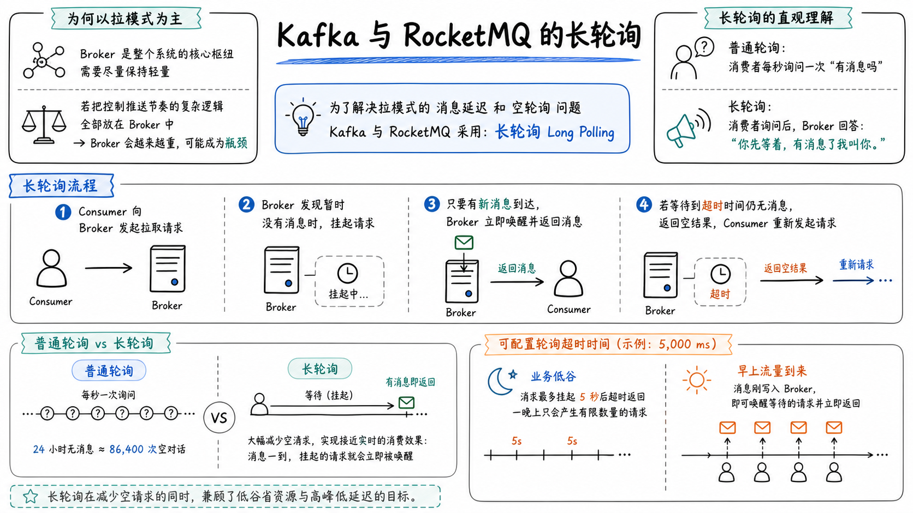

Kafka 和 RocketMQ 都选择以拉模式为主，因为 Broker 是整个系统的核心枢纽，需要尽量保持轻量。如果把控制推送节奏的复杂逻辑全部放在 Broker 中，Broker 会越来越重，最终可能成为系统瓶颈。

为了同时解决拉模式的消息延迟和空轮询问题，它们采用了**长轮询 Long Polling**。

长轮询的流程是：

1. Consumer 向 Broker 发起拉取请求；
2. Broker 发现暂时没有消息时，不立即返回空结果，而是挂起请求；
3. 在挂起期间，只要有新消息到达，Broker 就立即唤醒请求并返回消息；
4. 如果等待到超时时间仍没有消息，才返回空结果，让消费者重新发起请求。

普通轮询就像消费者每秒询问一次“有消息吗”。如果 24 小时没有消息，就会产生 86,400 次空对话。

长轮询则相当于消费者询问后，Broker 回答：

> “你先等着，有消息了我叫你。”

这样既减少了空请求，又能够实现接近实时的消费效果：消息一到，挂起的请求就会立即被唤醒。

开发过程中可以配置相应的轮询超时时间，例如设置为 5,000 ms。业务低谷时，请求最多挂起 5 秒后超时返回，一晚上只会产生有限数量的请求；早上流量到来时，消息刚写入 Broker，就能唤醒正在等待的请求并立即返回。

## 使用消息队列的风险与判断准则
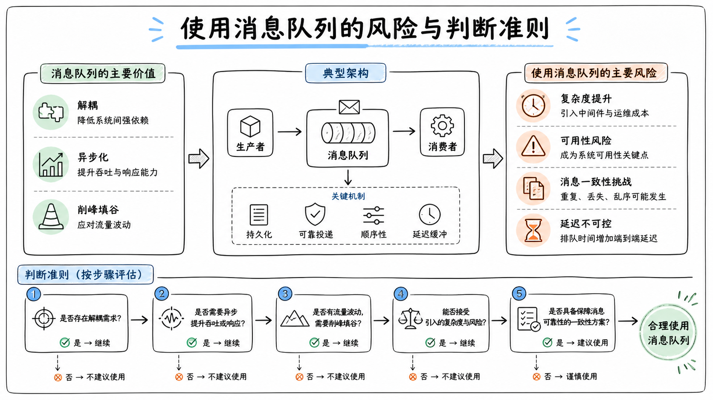

## 可用性与系统复杂度
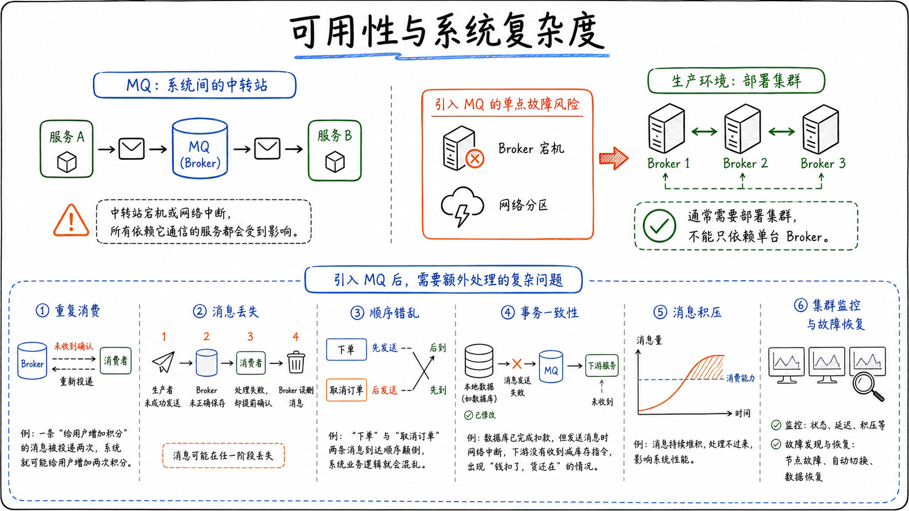

引入 MQ 会增加系统的单点故障风险，需要应对 Broker 宕机、网络分区等异常情况。

消息队列相当于系统之间的中转站。如果中转站突然宕机或网络中断，所有依赖它通信的服务都会受到影响。因此，生产环境中的 MQ 通常需要部署集群，不能只依赖单台 Broker。

引入 MQ 后，还要额外处理以下复杂问题：

- 重复消费；
- 消息丢失；
- 顺序错乱；
- 事务一致性；
- 消息积压；
- 集群监控与故障恢复。

### 重复消费

Broker 可能因为没有收到消费者确认而重新投递同一条消息。如果消费逻辑没有做幂等设计，就可能重复执行业务。

例如，一条“给用户增加积分”的消息被投递两次，系统就可能给用户增加两次积分。

### 消息丢失

消息可能丢失在不同阶段：

- 生产者没有成功发送；
- Broker 没有正确保存；
- 消费者处理失败，却提前确认消息已经消费；
- Broker 误以为消息已经处理并将其删除。

### 顺序错乱

先发送的消息可能后到，后发送的消息可能先到。

例如，“下单”与“取消订单”两条消息的到达顺序发生颠倒，系统业务逻辑就会混乱。

### 事务一致性

本地数据已经修改，但消息没有成功发送，也会造成不一致。

例如，数据库已经完成扣款，但发送消息时网络中断，下游没有收到减库存指令，最终出现“钱扣了，货还在”的情况。

## 什么时候该用 MQ
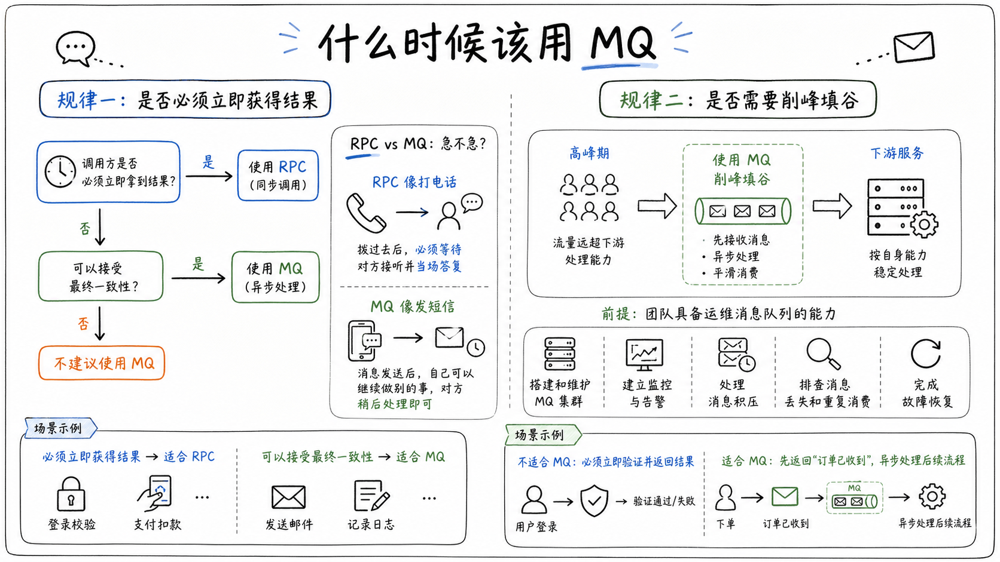

可以参考两条判断规律。

### 规律一：是否必须立即获得结果

如果调用方必须立刻拿到结果，应优先使用 **RPC 同步调用**，而不是 MQ。

RPC，也就是远程过程调用，它把另一台服务器上的方法包装成类似本地接口的形式。开发者调用时，就像调用本地函数一样，不需要直接感知底层网络传输。

RPC 和 MQ 最核心的区别，可以理解为“急不急”：

- **RPC 像打电话**：拨过去后，必须等待对方接听并当场答复；
- **MQ 像发短信**：消息发送后，自己可以继续做别的事，对方稍后处理即可。

登录校验、支付扣款等必须立即获得结果的场景，适合使用 RPC。发送邮件、记录日志等晚几秒也无所谓的操作，适合使用 MQ。

因此：

- 必须立即获得结果：使用 RPC；
- 可以接受最终一致性：可以使用 MQ。

### 规律二：是否需要削峰填谷

如果高峰期流量远超下游处理能力，并且团队具备运维消息队列的能力，可以优先使用 MQ 削峰填谷。

所谓具备运维能力，是指团队能够：

- 搭建和维护 MQ 集群；
- 建立监控与告警；
- 处理消息积压；
- 排查消息丢失和重复消费；
- 完成故障恢复。

例如，用户登录必须立即验证并返回结果，不适合使用 MQ；“双 11”下单时，可以先返回“订单已收到”，再异步处理后续流程，适合使用 MQ。

## 消息队列的典型应用场景
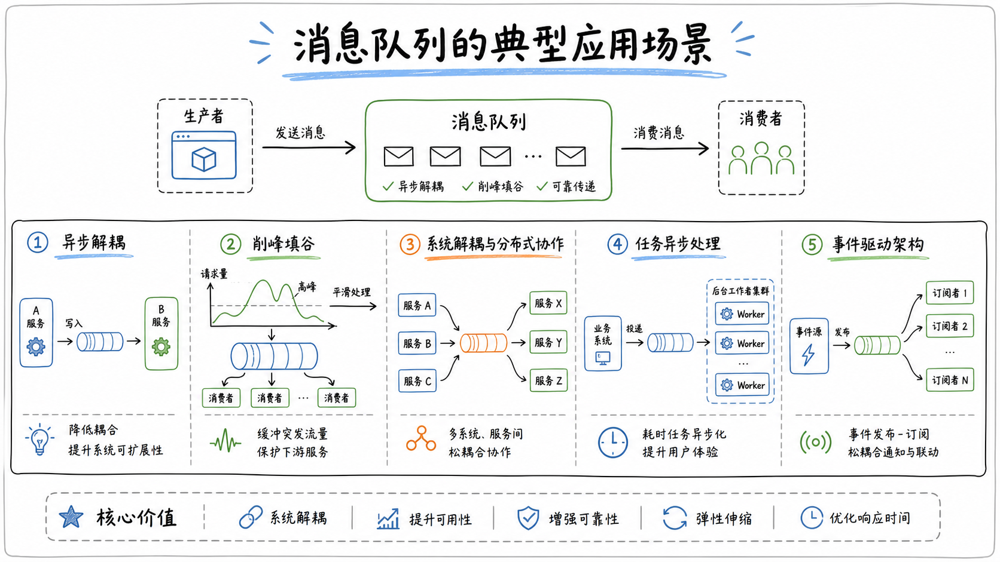

## 分布式事务
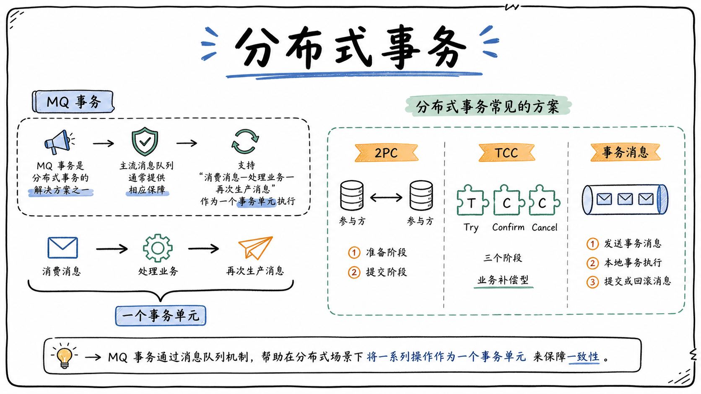

MQ 事务是分布式事务的解决方案之一。主流消息队列通常提供相应保障，也可以支持“消费消息——处理业务——再次生产消息”的全过程作为一个事务单元执行。

分布式事务常见的方案包括 2PC、TCC 和事务消息。

## 2PC：两阶段提交
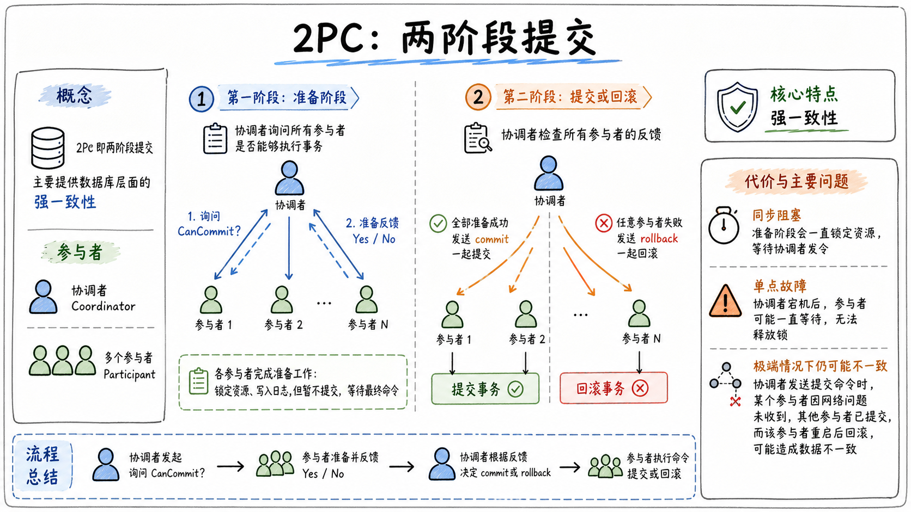

2PC 即 Two-Phase Commit，两阶段提交，主要提供数据库层面的强一致性。

参与者包括：

- **协调者 Coordinator**；
- **多个参与者 Participant**。

整个过程分为两个阶段。

### 第一阶段：准备阶段

协调者询问所有参与者是否能够执行事务。各参与者完成准备工作，例如锁定资源、写入日志，但暂时不提交，等待协调者的最终命令。

### 第二阶段：提交或回滚

协调者检查所有参与者的反馈：

- 如果所有参与者都准备成功，就发送 `commit`，让大家一起提交；
- 如果任意参与者失败，就发送 `rollback`，让大家一起回滚。

2PC 的核心特点是**强一致性**，但代价较高，主要问题包括：

- **同步阻塞**：准备阶段会一直锁定资源，等待协调者发令；
- **单点故障**：协调者宕机后，参与者可能一直等待，无法释放锁；
- **极端情况下仍可能不一致**：协调者发送提交命令时，如果某个参与者因网络问题没有收到，其他参与者已经提交，而该参与者重启后回滚，就可能造成数据不一致。

## TCC：业务层事务
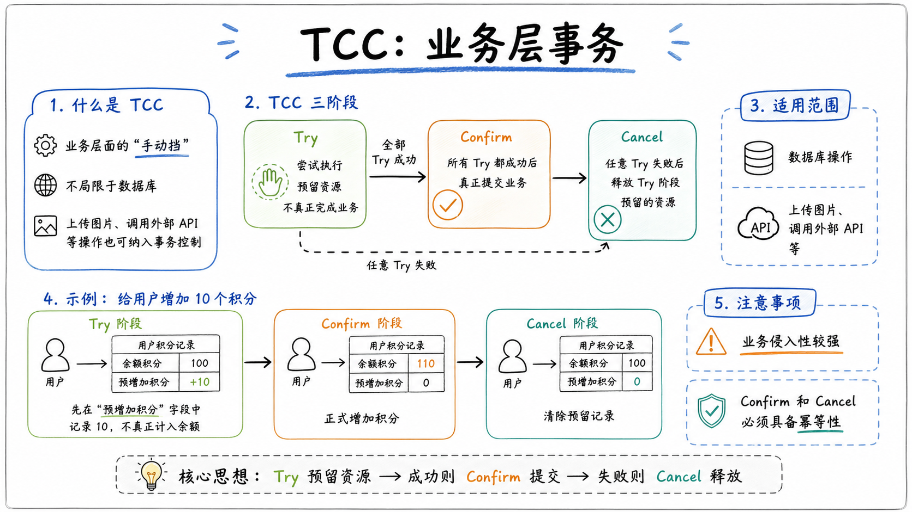

TCC 可以理解为业务层面的“手动挡”。它不局限于数据库，上传图片、调用外部 API 等操作也可以纳入事务控制。

每个业务需要实现三个方法：

1. **Try**：尝试执行，预留资源，但不真正完成业务；
2. **Confirm**：所有 Try 都成功后，真正提交业务；
3. **Cancel**：任意 Try 失败后，释放 Try 阶段预留的资源。

例如，系统要给用户增加 10 个积分：

- Try 阶段先在“预增加积分”字段中记录 10，但不真正计入用户余额；
- Confirm 阶段正式增加积分；
- Cancel 阶段清除预留记录。

TCC 的业务侵入性较强，而且 `Confirm` 和 `Cancel` 必须具备**幂等性**。

## 事务消息
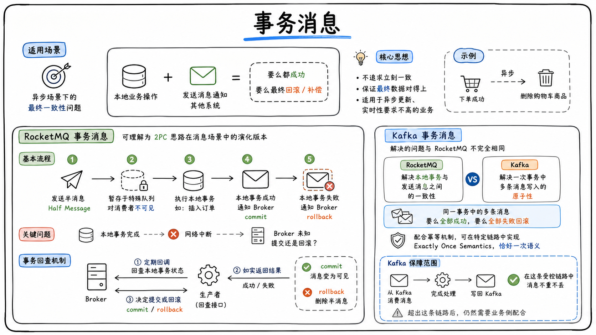

事务消息适合异步场景下的最终一致性问题。它主要解决：

> 本地完成一项业务操作，同时还要发送一条消息通知其他系统，这两个动作要么都成功，要么最终能够回滚或补偿。

事务消息不追求立刻一致，而是保证最终数据能够对得上，适用于异步更新、实时性要求不高的业务。

例如，商城下单成功后，可以异步删除购物车中的商品。

### RocketMQ 事务消息

RocketMQ 事务消息可以理解为 2PC 思路在消息场景中的演化版本。其基本流程是：

1. 生产者先向 Broker 发送一条**半消息 Half Message**；
2. 半消息暂时对消费者不可见，存放在特殊队列中；
3. 生产者执行本地事务，例如向数据库插入订单；
4. 本地事务成功后，生产者通知 Broker `commit`，消息变为可见；
5. 本地事务失败后，生产者通知 Broker `rollback`，Broker 删除半消息。

最关键的问题是：如果生产者执行完本地事务，在向 Broker 返回结果时网络中断，Broker 不知道应该提交还是回滚，怎么办？

RocketMQ 提供了**事务回查机制**。Broker 会定期回调生产者提供的接口，询问本地事务究竟成功还是失败。生产者根据本地事务状态如实返回结果，Broker 再决定提交或回滚。

这样就解决了“本地事务成功，但消息没有成功发出去”的一致性难题。

### Kafka 事务消息

Kafka 事务解决的问题与 RocketMQ 不完全相同：

- **RocketMQ**：解决本地事务与发送消息之间的一致性；
- **Kafka**：解决一次事务中多条消息写入的原子性。

Kafka 可以保证同一事务中的多条消息要么全部成功，要么全部失败回滚。配合幂等机制，它可以在特定链路中实现 **Exactly Once Semantics，恰好一次语义**。

但这里的“恰好一次”并不是指在任何分布式环境下，每条消息都只会被消费一次。Kafka 的保障范围主要是：

> 从 Kafka 消费消息，完成处理，再将结果写回 Kafka。

在这条受控链路中，可以做到消息不重不丢，但超出这条链路后，仍然需要业务侧配合。

## 顺序消息与延时消息
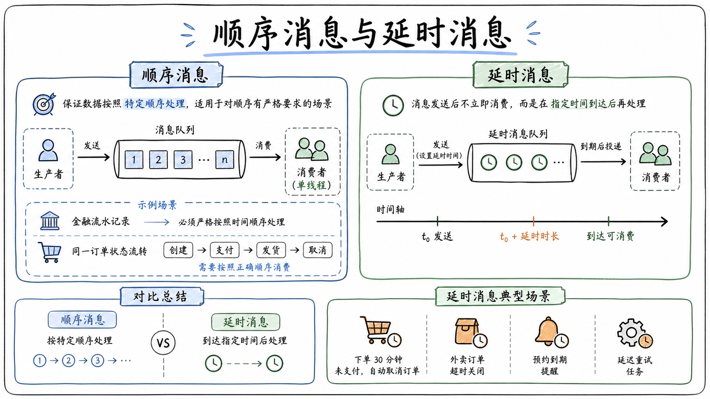

消息队列可以保证数据按照特定顺序处理，适用于对顺序有严格要求的场景。

例如，金融流水记录必须严格按照时间顺序处理；同一个订单的“创建、支付、发货、取消”等状态消息，也需要按照正确顺序消费。

延时消息则是指消息发送后不立即消费，而是在指定时间到达后再进行处理。

典型场景包括：

- 用户下单 30 分钟未支付，自动取消订单；
- 外卖订单超时关闭；
- 预约到期提醒；
- 延迟重试任务。

## 即时通信与数据流处理
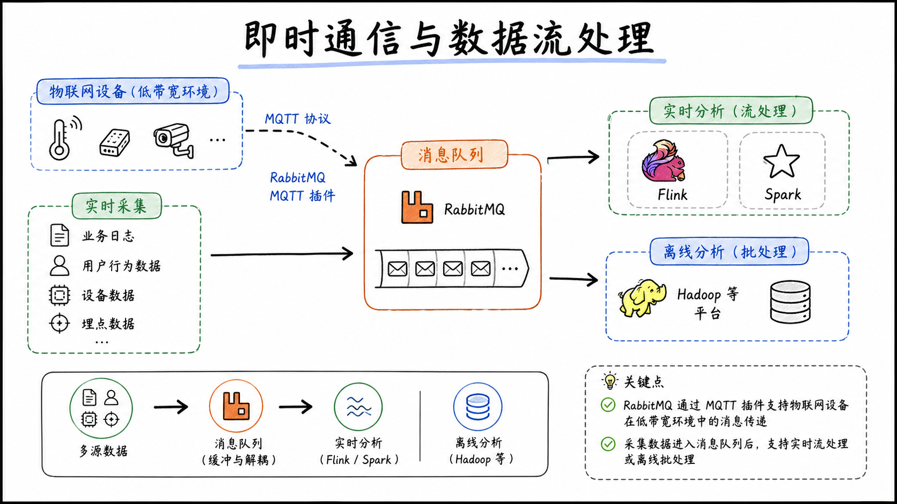

RabbitMQ 可以通过 MQTT 插件支持物联网设备在低带宽环境中的消息传递。

消息队列也可以用于实时采集：

- 业务日志；
- 用户行为数据；
- 设备数据；
- 埋点数据。

采集后的数据可以导入 Flink、Spark 等大数据引擎进行实时分析，也可以进入 Hadoop 等平台完成离线分析。

## 消息队列的可靠性保障
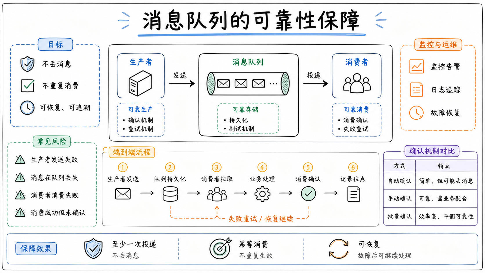

## 全链路可靠性设计
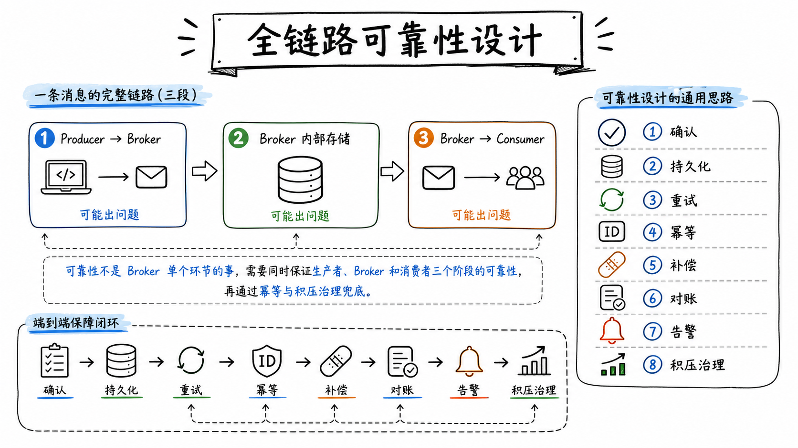

不同 MQ 的实现细节不同，但可靠性设计的思路基本一致，包括：

- 确认；
- 持久化；
- 重试；
- 幂等；
- 补偿；
- 对账；
- 告警；
- 积压治理。

消息队列的可靠性不是 Broker 单个环节的事。一条消息从产生到消费完成，要经过三段链路：

1. Producer → Broker；
2. Broker 内部存储；
3. Broker → Consumer。

每一段都有可能出问题。因此，必须同时保证生产者、Broker 和消费者三个阶段的可靠性，再通过幂等与积压治理兜底。

## 生产者阶段
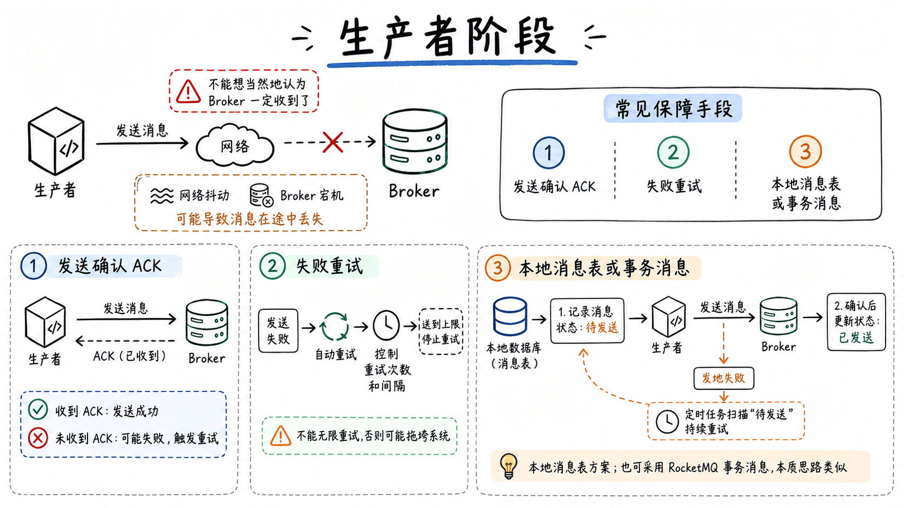

生产者发送消息后，不能想当然地认为 Broker 一定收到了。网络抖动或 Broker 宕机都可能导致消息在途中丢失。

常见保障手段有三种。

### 1. 发送确认 ACK

生产者发送消息时，要求 Broker 返回“已经收到”的确认，即 ACK。

如果没有收到 ACK，生产者就认为消息可能发送失败，并触发重试。

### 2. 失败重试

消息发送失败后自动重试，但需要控制重试次数和间隔，不能无限重试，否则可能拖垮系统。

### 3. 本地消息表或事务消息

对于订单、支付等绝对不能丢失的关键消息，可以先把消息存入本地数据库的消息表，并将状态标记为“待发送”。

Broker 确认收到消息后，再将状态改为“已发送”。如果发送失败，定时任务会扫描“待发送”消息并持续重试。

这就是**本地消息表方案**。如果希望使用更完整的产品能力，也可以采用 RocketMQ 事务消息，其本质思路类似。

## Broker 存储阶段
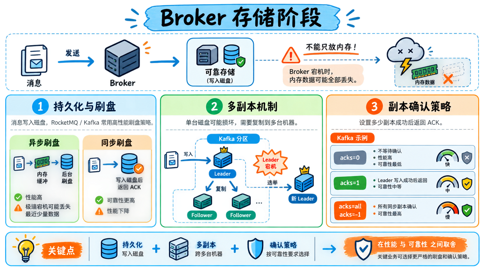

消息到达 Broker 后，需要保证它被可靠存储，不能只放在内存中。否则 Broker 突然宕机时，内存中的数据可能全部丢失。

### 1. 持久化与刷盘

消息需要写入磁盘。RocketMQ 和 Kafka 通常采用高性能的刷盘策略。

- **异步刷盘**：性能高，但极端宕机情况下可能丢失最近少量数据；
- **同步刷盘**：消息真正写入磁盘后才返回 ACK，可靠性更高，但性能会下降。

关键业务可以根据可靠性要求选择更严格的刷盘策略。

### 2. 多副本机制

单台 Broker 的磁盘可能损坏，因此需要将消息复制到多台机器。

例如，Kafka 的一个分区拥有 Leader 和多个 Follower。Leader 宕机后，可以从符合条件的 Follower 中选举新的 Leader，继续提供服务并降低消息丢失风险。

### 3. 副本确认策略

写入消息时，需要设置多少个副本确认成功后，才向生产者返回 ACK。

以 Kafka 为例：

- `acks=0`：生产者不等待 Broker 确认，性能高但可靠性最低；
- `acks=1`：Leader 写入成功后返回；
- `acks=all` 或 `acks=-1`：等待所有同步副本确认，可靠性最高。

## 消费者阶段
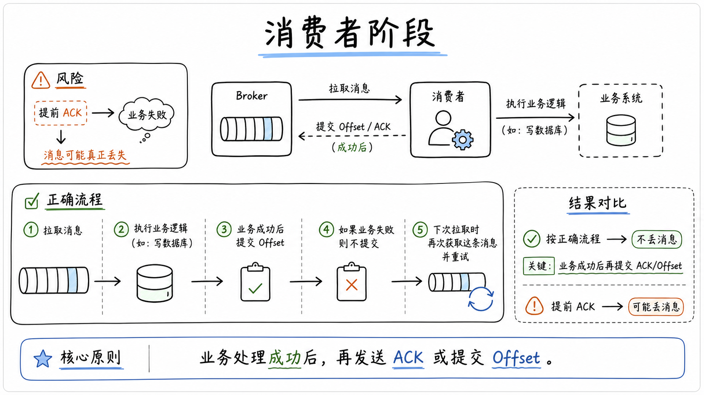

消费者从 Broker 获取消息后，可能在处理过程中宕机或抛出异常。如果提前告诉 Broker“已经消费完成”，但业务后来失败，这条消息就可能真正丢失。

核心原则是：

> **业务处理成功后，再发送 ACK 或提交 Offset。**

正确流程是：

1. 消费者拉取消息；
2. 执行业务逻辑，例如写数据库；
3. 业务成功后提交 Offset；
4. 如果业务失败，则不提交；
5. 下次拉取时再次获取这条消息并重试。

## 重试与死信队列
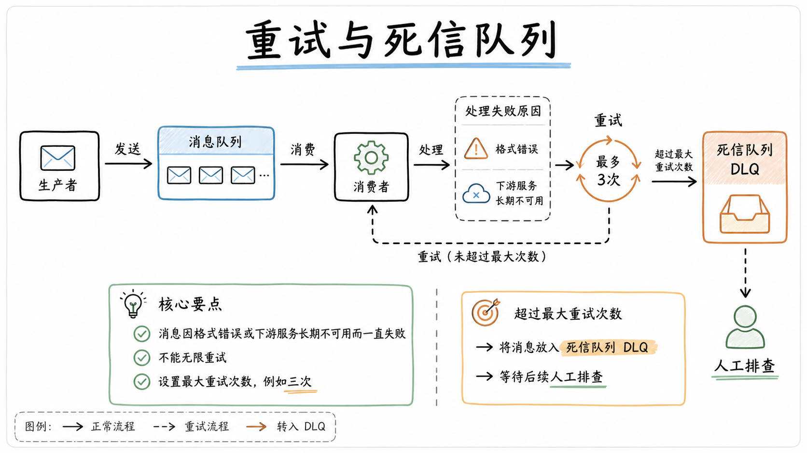

如果一条消息因为格式错误，或者依赖的下游服务长期不可用而一直失败，不能无限重试。

可以设置最大重试次数，例如三次。超过次数后，将消息放入**死信队列 Dead Letter Queue，DLQ**，等待后续人工排查。

## 业务层兜底
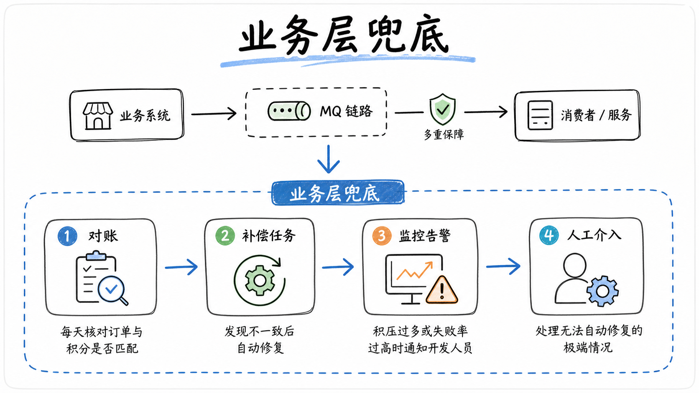

即使 MQ 链路已经采取了多重保障，业务层仍然需要兜底：

- **对账**：例如每天核对订单与积分是否匹配；
- **补偿任务**：发现不一致后自动修复；
- **监控告警**：积压过多或失败率过高时通知开发人员；
- **人工介入**：处理无法自动修复的极端情况。

## 幂等设计与消息积压治理
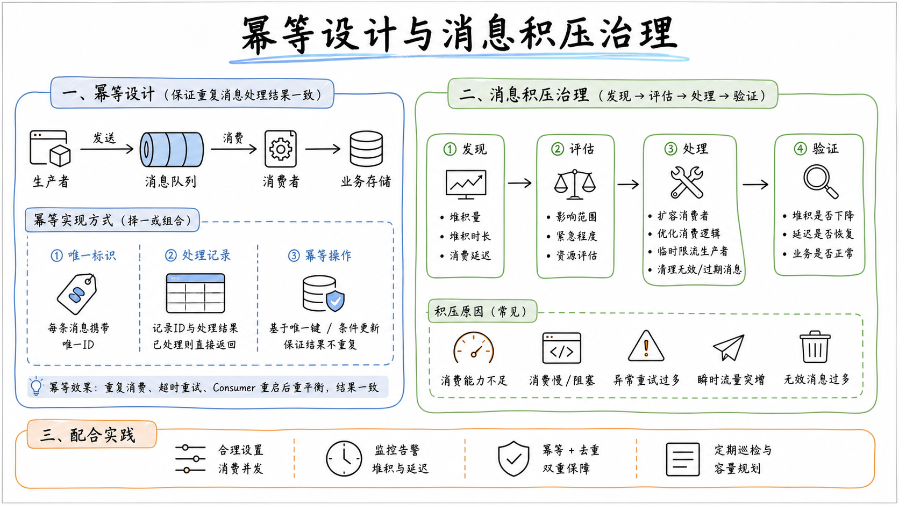

## 重复消费与幂等性
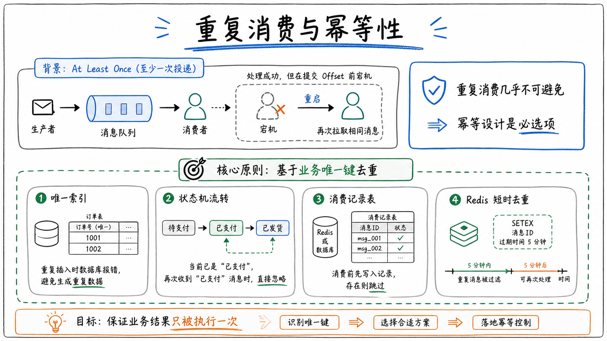

在 **At Least Once，至少一次投递**语义下，重复消费几乎不可避免。

例如，消费者已经成功处理业务，但在提交 Offset 前宕机。重启后，它会再次拉取同一条消息，因此幂等设计是必选项。

核心原则是：

> **基于业务唯一键去重。**

常见方案包括以下几种。

### 唯一索引

在数据库中建立唯一索引，例如订单号唯一。重复插入时数据库会直接报错，从而避免生成重复数据。

### 状态机流转

业务状态按照严格顺序变化，例如：

`待支付 → 已支付 → 已发货`

如果当前状态已经是“已支付”，再次收到“已支付”消息时，可以直接忽略。

### 消费记录表

消费消息前，先向 Redis 或数据库写入一条消费记录。如果发现这条消息已经消费过，就直接跳过。

### Redis 短时去重

把消息 ID 存入 Redis，并设置过期时间。例如过期时间为 5 分钟，那么 5 分钟内到达的重复消息都会被过滤。

## 消息积压的原因
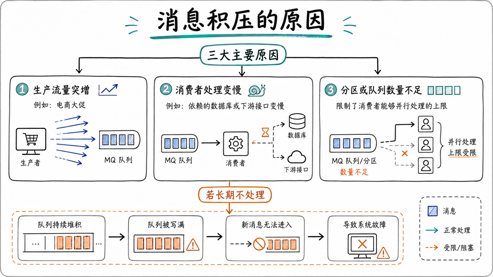

消息积压是 MQ 最常见的问题之一，主要原因通常有三个：

- **生产流量突增**：例如电商大促；
- **消费者处理变慢**：例如依赖的数据库或下游接口变慢；
- **分区或队列数量不足**：限制了消费者能够并行处理的上限。

如果积压长期不处理，队列可能被写满，新消息无法进入，最终导致系统故障。

## 消息积压的处理步骤
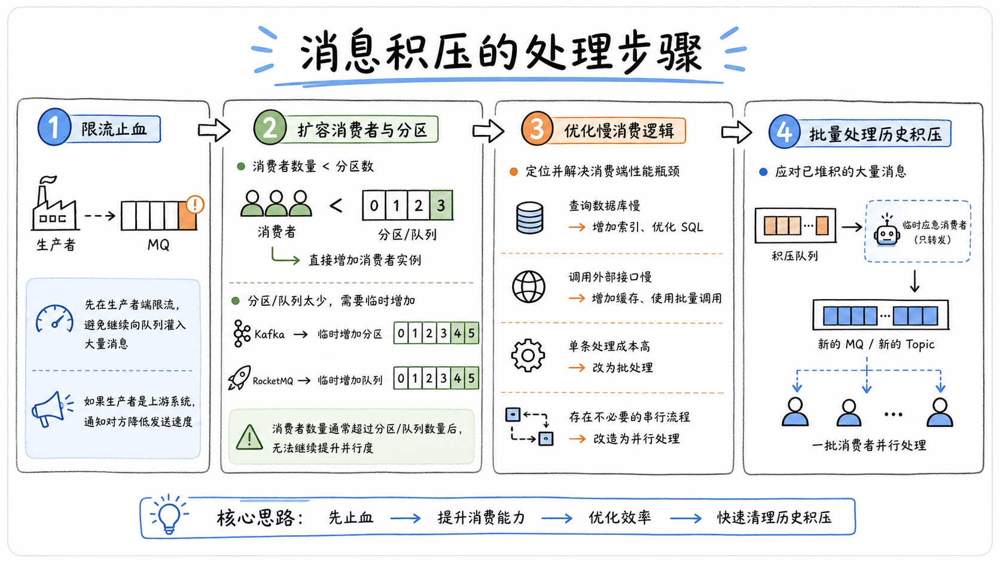

### 1. 限流止血

先在生产者端限流，避免继续向队列灌入大量消息。如果生产者是上游系统，可以通知对方降低发送速度。

### 2. 扩容消费者与分区

如果消费者数量小于分区数，可以直接增加消费者实例。

如果分区本身太少，则需要：

- Kafka 临时增加分区；
- RocketMQ 临时增加队列。

需要注意，消费者数量通常超过分区或队列数量后，无法继续提升并行度。

### 3. 优化慢消费逻辑

检查消费端代码的性能瓶颈：

- 查询数据库慢：增加索引、优化 SQL；
- 调用外部接口慢：增加缓存、使用批量调用；
- 单条处理成本高：改为批处理；
- 存在不必要的串行流程：改造为并行处理。

### 4. 批量处理历史积压

对于已经堆积的大量消息，可以创建临时应急消费者。它不处理复杂业务，只负责将消息快速转发到新的 MQ 或新的 Topic 中，再挂载一批消费者并行处理。

## 消息队列的协议与模型规范
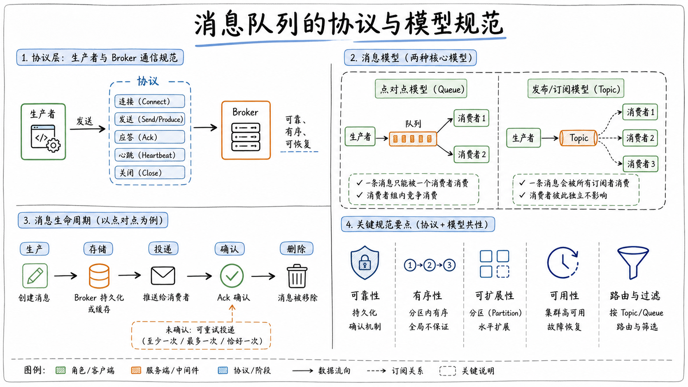

## JMS：Java 消息服务
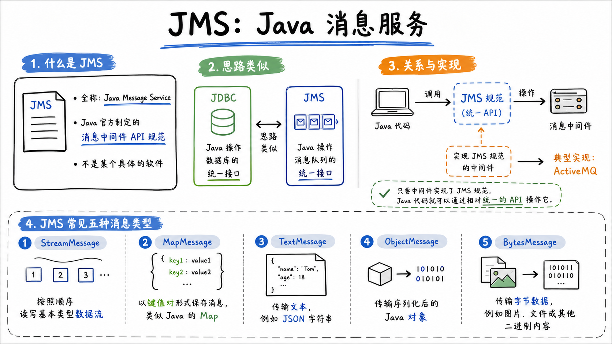

JMS 全称为 **Java Message Service**，即 Java 消息服务。它是 Java 官方制定的一套消息中间件 API 规范，不是某个具体的软件。

JMS 与 JDBC 的思路类似：

- JDBC 是 Java 操作数据库的统一接口；
- JMS 是 Java 操作消息队列的统一接口。

只要消息中间件实现了 JMS 规范，Java 代码就可以通过相对统一的 API 操作它。ActiveMQ 是 JMS 规范的典型实现。

JMS 中常见的五种消息类型包括：

- **StreamMessage**：按照顺序读写基本类型数据流；
- **MapMessage**：以键值对形式保存消息，类似 Java 的 `Map`；
- **TextMessage**：传输文本，例如 JSON 字符串；
- **ObjectMessage**：传输序列化后的 Java 对象；
- **BytesMessage**：传输字节数据，例如图片、文件或其他二进制内容。

## JMS 的两种消息模型
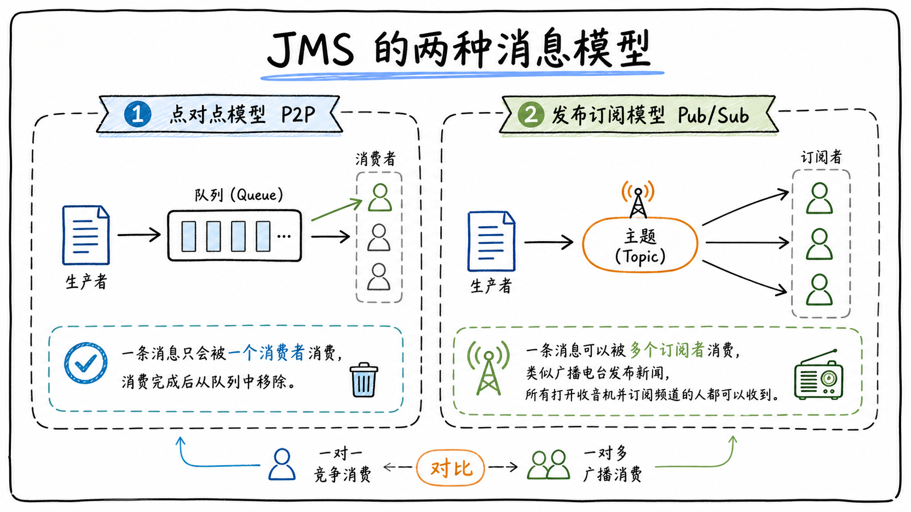

### 点对点模型 P2P

一条消息只会被一个消费者消费，消费完成后从队列中移除。

### 发布订阅模型 Pub/Sub

一条消息可以被多个订阅者消费，类似广播电台发布新闻，所有打开收音机并订阅频道的人都可以收到。

## AMQP：高级消息队列协议
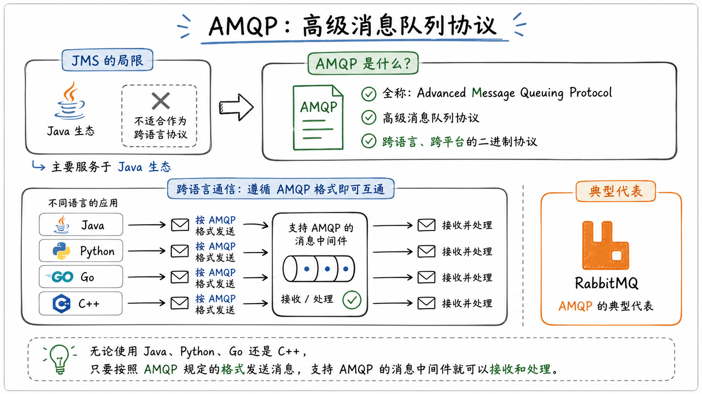

JMS 的局限是主要服务于 Java 生态。如果系统使用 Python、Node.js、Go 或 C++，JMS 就不适合充当跨语言协议。

AMQP 全称为 **Advanced Message Queuing Protocol**，即高级消息队列协议。它是一种跨语言、跨平台的二进制协议。

无论使用 Java、Python、Go 还是 C++，只要按照 AMQP 规定的格式发送消息，支持 AMQP 的消息中间件就可以接收和处理。RabbitMQ 是 AMQP 的典型代表。

## RabbitMQ 的 Exchange 路由模型
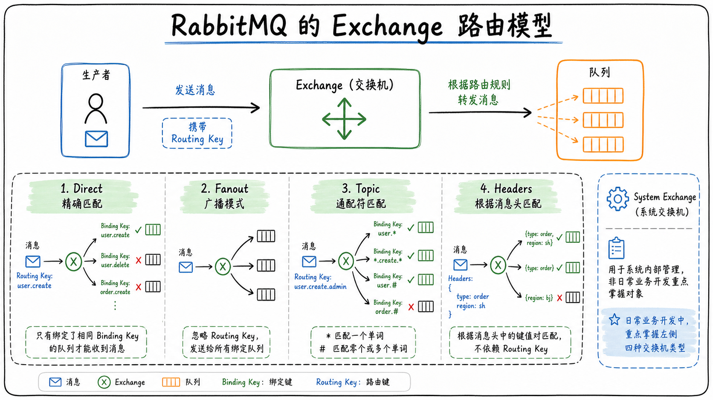

AMQP 与 RabbitMQ 中的核心概念之一是 **Exchange，交换机**。生产者将消息发送给 Exchange，Exchange 再根据路由规则把消息转发到对应队列。

RabbitMQ 常用的 Exchange 类型主要有四种：

1. **Direct**：精确匹配。消息携带 Routing Key，只有绑定了相同 Binding Key 的队列才能收到；
2. **Fanout**：广播模式。忽略 Routing Key，把消息发送给所有绑定队列；
3. **Topic**：通配符匹配。`*` 匹配一个单词，`#` 匹配零个或多个单词；
4. **Headers**：根据消息头中的键值对匹配，不依赖 Routing Key。

此外，部分协议资料中还会提到用于系统内部管理的 **System Exchange**，但在 RabbitMQ 的日常业务开发中，通常重点掌握前面四种交换机类型。

## RPC 与 MQ 的对比
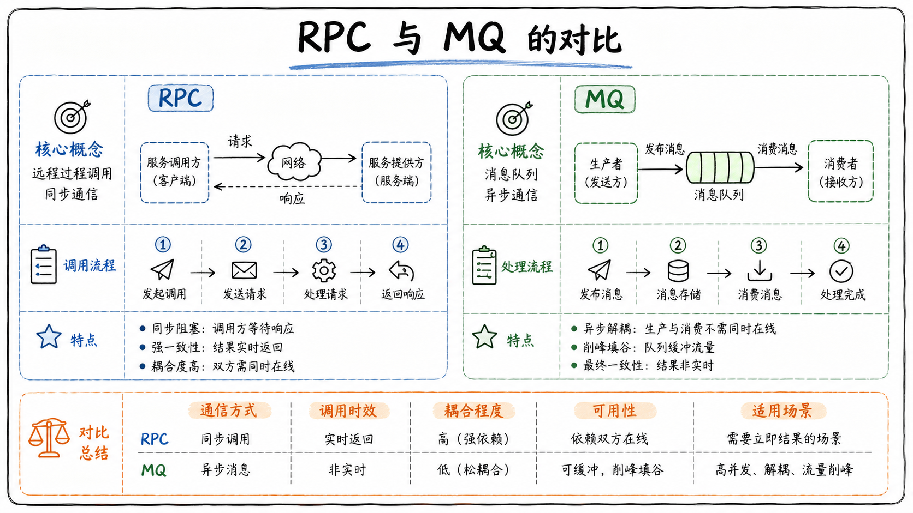

## 同步响应与异步通信
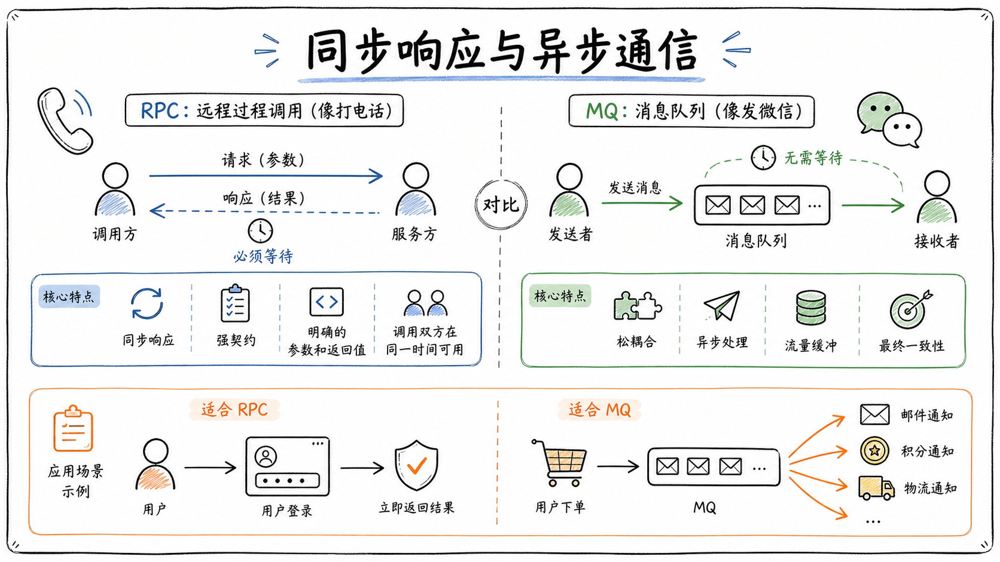

RPC 是远程过程调用，就像给同事打电话。必须等待对方接听、处理并返回结果，才能继续执行后续操作。因此，RPC 强调的是：

- 同步响应；
- 强契约；
- 明确的参数和返回值；
- 调用双方在同一时间可用。

MQ 就像给同事发微信。消息发送后，发送者可以继续做其他事情，对方什么时候查看和处理，不需要发送者一直等待。因此，MQ 强调的是：

- 松耦合；
- 异步处理；
- 流量缓冲；
- 最终一致性。

用户登录适合 RPC，用户下单后的邮件、积分、物流通知等流程适合 MQ。

## 双向直连与存储转发
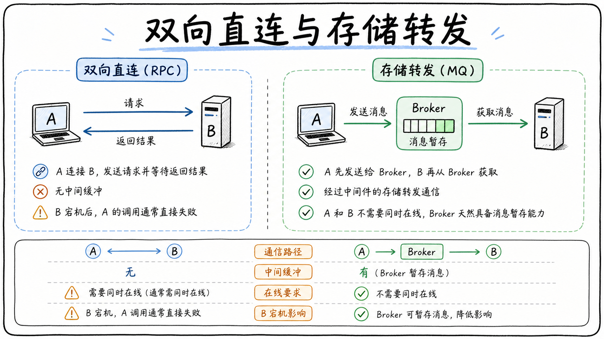

RPC 中，A 连接 B，发送请求并等待返回结果，属于双向直连的网络通信。A 和 B 之间没有中间缓冲，B 宕机后，A 的调用通常会直接失败。

MQ 中，A 先把消息发送给 Broker，B 再从 Broker 获取。它属于经过中间件的存储转发通信。A 和 B 不需要同时在线，Broker 天然具备消息暂存能力。

## 实时处理与延迟容忍
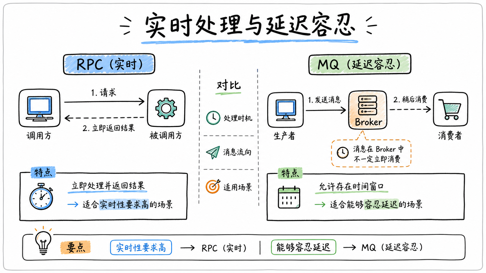

RPC 要求被调用方立即处理并返回结果，适合实时性要求高的场景。

MQ 允许业务存在一定的时间窗口，消息发送到 Broker 后不一定立即消费，适合能够容忍延迟的场景。

## 是否需要持久化
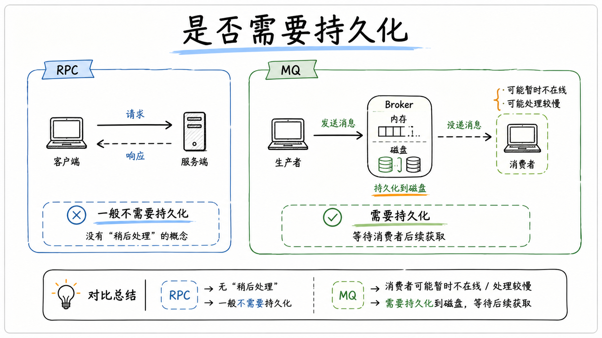

RPC 没有“稍后处理”的概念，一般不需要对请求进行持久化存储。

MQ 的消费者可能暂时不在线，也可能处理较慢，因此 Broker 需要把消息持久化到磁盘，等待消费者后续获取。

## 主流消息队列技术选型
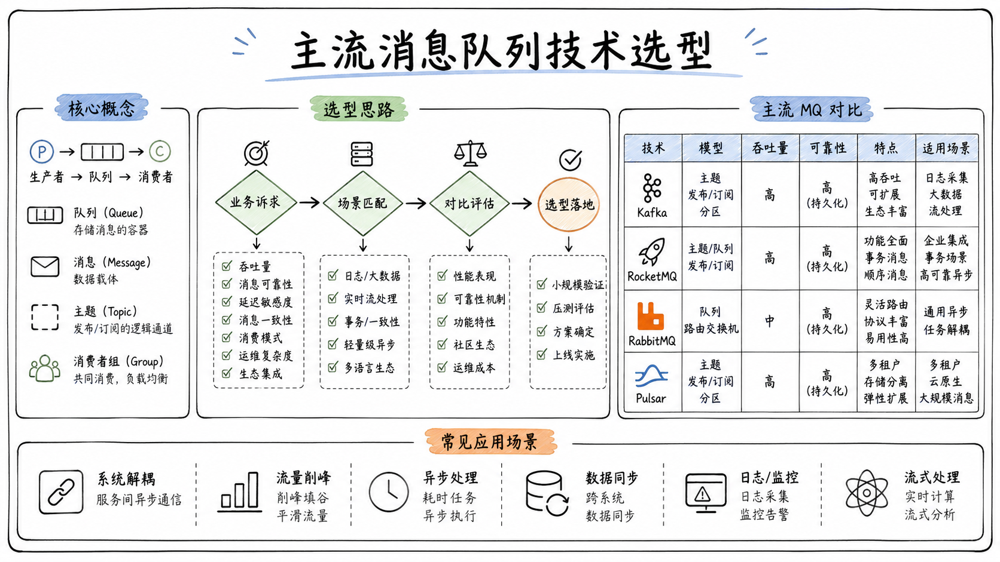

## Kafka：高吞吐的分布式流处理平台
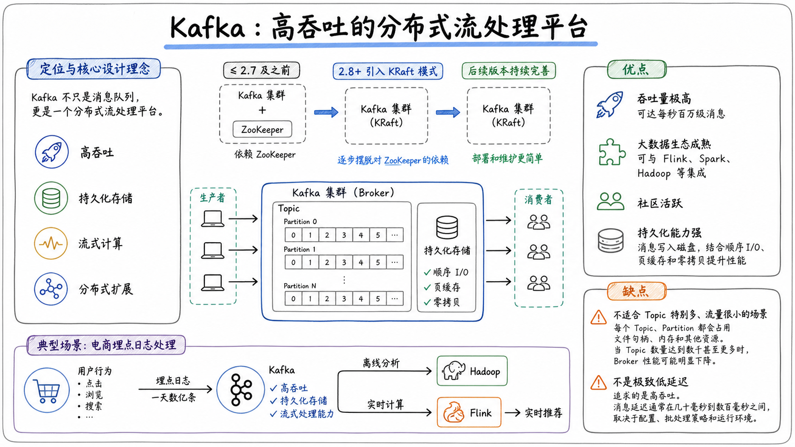

Kafka 的定位不只是消息队列，更是一个分布式流处理平台。其核心设计理念包括：

- 高吞吐；
- 持久化存储；
- 流式计算；
- 分布式扩展。

Kafka 在 2.8 版本后逐步引入 **KRaft 模式**，并在后续版本中持续完善，从而摆脱对 ZooKeeper 的依赖，使部署和维护更加简单。

### 优点

- **吞吐量极高**：可以达到每秒百万级消息，适合海量数据场景；
- **大数据生态成熟**：能够与 Flink、Spark、Hadoop 等组件集成；
- **社区活跃**；
- **持久化能力强**：消息写入磁盘，并利用顺序 I/O、页缓存和零拷贝等技术提升性能。

### 缺点

Kafka 中，每个 Topic、Partition 都会占用一定的文件句柄、内存和其他资源。如果 Topic 数量达到数千甚至更多，Broker 性能可能明显下降，因此它不太适合“Topic 特别多、单个 Topic 流量很小”的场景。

Kafka 追求的是高吞吐，而不是极致低延迟。其消息延迟通常在几十毫秒到数百毫秒之间，具体取决于配置、批处理策略和运行环境。

### 典型场景

电商网站需要采集用户点击、浏览、搜索等埋点日志，一天可能产生数亿条数据。这些日志不一定要求立即处理，可以先通过 Kafka 存储，再导入 Hadoop 进行离线分析，或者导入 Flink 完成实时推荐。

## RocketMQ：金融级可靠性
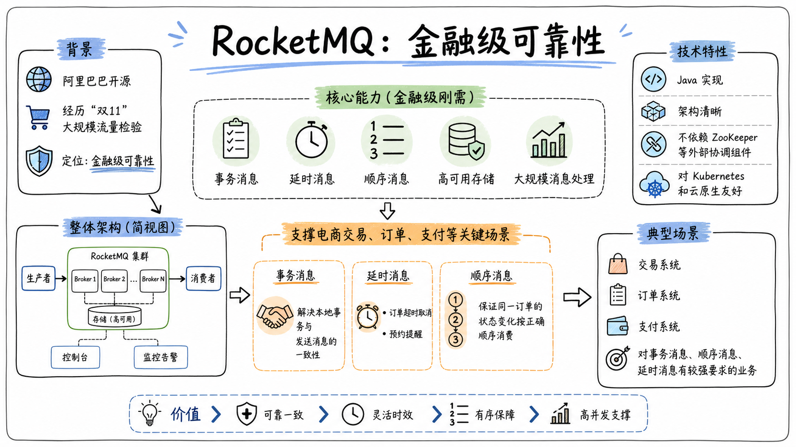

RocketMQ 由阿里巴巴开源，经历过“双 11”大规模流量场景的检验，定位偏向金融级可靠性。

它支持：

- 事务消息；
- 延时消息；
- 顺序消息；
- 高可用存储；
- 大规模消息处理。

这些能力都是电商交易、订单和支付场景中的刚需。

事务消息可以解决本地事务与发送消息的一致性；延时消息可用于订单超时取消、预约提醒；顺序消息能够保证同一订单的状态变化按照正确顺序消费。

RocketMQ 采用 Java 实现，整体架构相对清晰，不依赖 ZooKeeper 等外部协调组件，对 Kubernetes 和云原生部署也较为友好。

### 典型场景

- 交易系统；
- 订单系统；
- 支付系统；
- 对事务消息、顺序消息和延时消息有较强要求的业务。

## RabbitMQ：灵活路由与低延迟
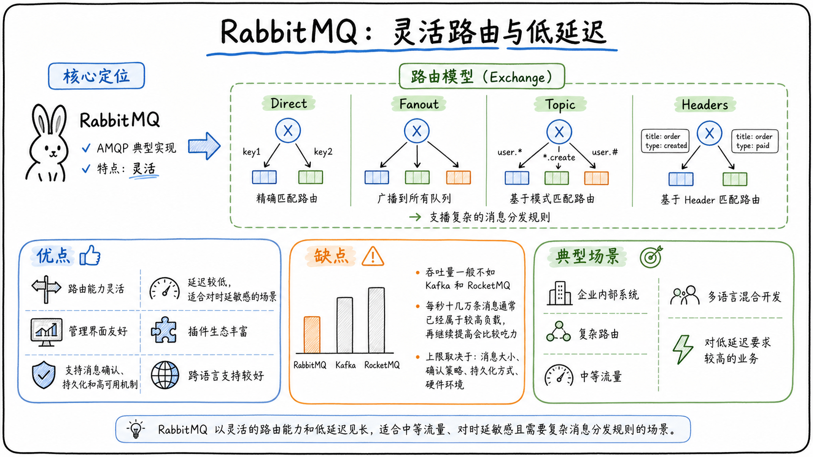

RabbitMQ 是 AMQP 的典型实现，最大的特点是灵活。它提供 Direct、Fanout、Topic、Headers 等 Exchange 路由模型，可以支持复杂的消息分发规则。

### 优点

- 路由能力灵活；
- 延迟较低，适合对时延敏感的场景；
- 管理界面友好；
- 插件生态丰富；
- 支持消息确认、持久化和高可用机制；
- 跨语言支持较好。

### 缺点

RabbitMQ 的吞吐量一般不如 Kafka 和 RocketMQ。每秒十几万条消息通常已经属于较高负载，再继续提高会比较吃力，具体上限取决于消息大小、确认策略、持久化方式和硬件环境。

### 典型场景

- 企业内部系统；
- 复杂路由；
- 中等流量；
- 多语言混合开发；
- 对低延迟要求较高的业务。

## Pulsar：面向云原生的新一代消息平台
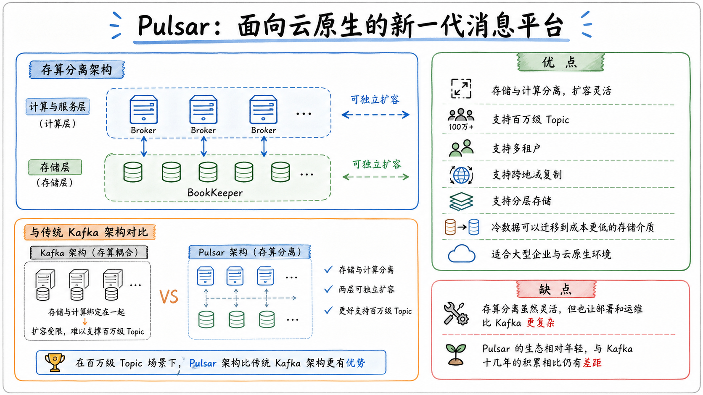

Pulsar 是面向云原生场景的新一代消息平台，采用**存算分离架构**：

- 存储层使用 BookKeeper；
- 计算与服务层由 Broker 承担；
- 两层可以独立扩容。

这种架构能够支持大量 Topic，在百万级 Topic 场景下比传统 Kafka 架构更有优势。

### 优点

- 存储与计算分离，扩容灵活；
- 支持百万级 Topic；
- 支持多租户；
- 支持跨地域复制；
- 支持分层存储；
- 冷数据可以迁移到成本更低的存储介质；
- 适合大型企业与云原生环境。

### 缺点

存算分离虽然灵活，但也让部署和运维比 Kafka 更复杂。Pulsar 的生态相对年轻，与 Kafka 十几年的积累相比仍有差距。

## ActiveMQ：老牌 JMS 实现
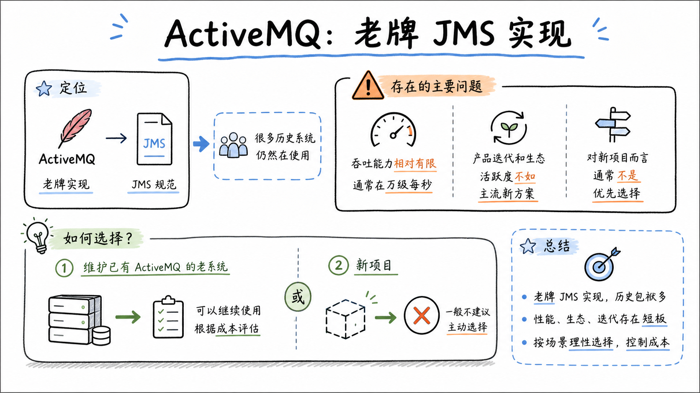

ActiveMQ 是 JMS 规范的老牌实现，很多历史系统仍然在使用。

但它也存在明显问题：

- 吞吐能力相对有限，通常在万级每秒；
- 产品迭代和生态活跃度不如主流新方案；
- 对新项目而言，通常不是优先选择。

如果是在维护原本就使用 ActiveMQ 的老系统，可以继续根据成本评估；新项目一般不建议主动选择。

## 消息队列选型建议
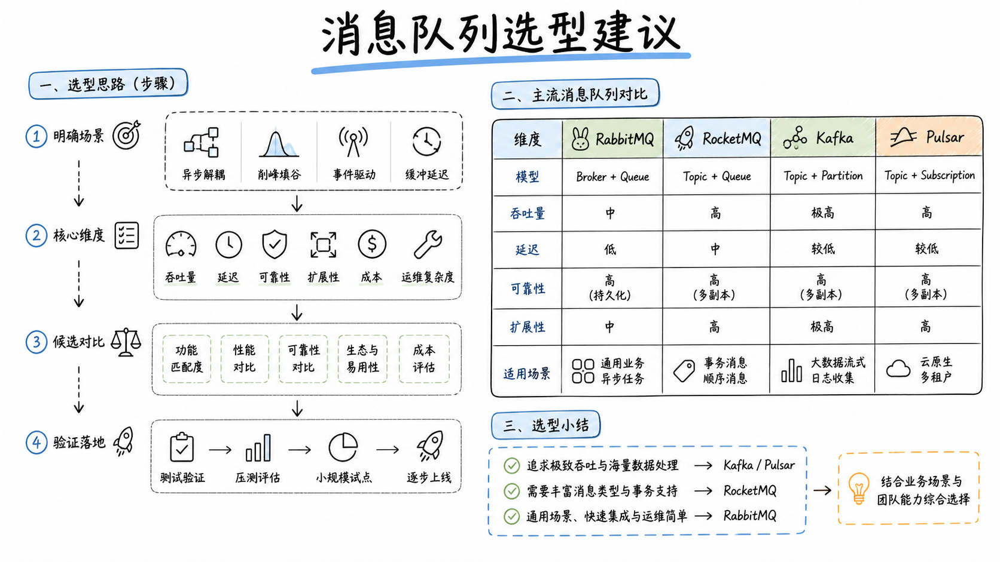

## 按业务场景选择
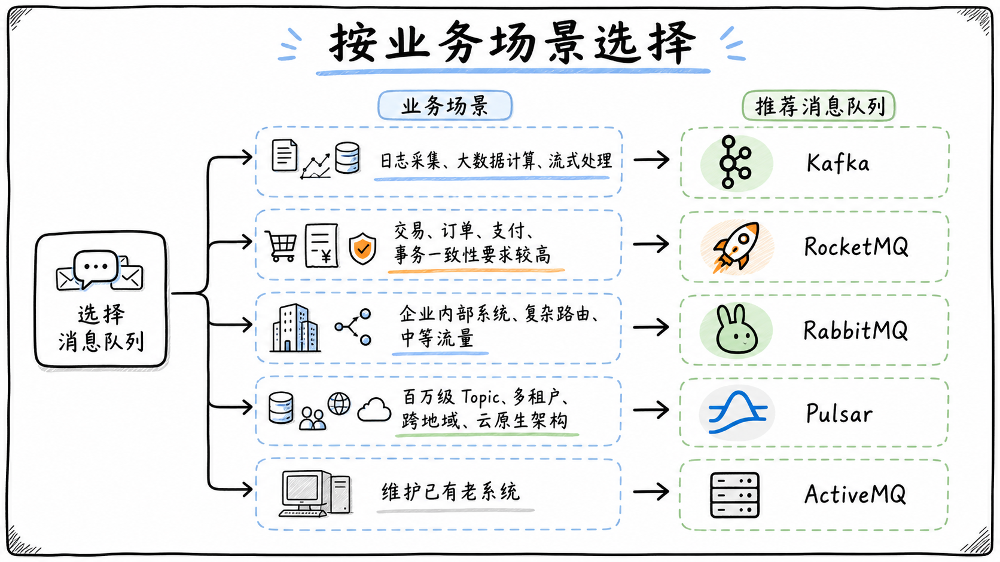

- **日志采集、大数据计算、流式处理**：选择 Kafka；
- **交易、订单、支付、事务一致性要求较高**：选择 RocketMQ；
- **企业内部系统、复杂路由、中等流量**：选择 RabbitMQ；
- **百万级 Topic、多租户、跨地域、云原生架构**：选择 Pulsar；
- **维护已有老系统**：根据现状继续使用 ActiveMQ。

## 按技术栈选择
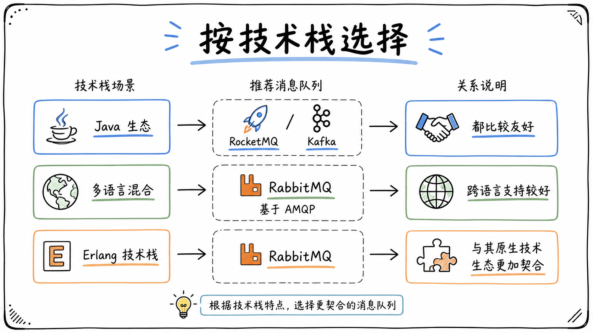

- Java 生态：RocketMQ、Kafka 都比较友好；
- 多语言混合：RabbitMQ 基于 AMQP，跨语言支持较好；
- Erlang 技术栈：RabbitMQ 与其原生技术生态更加契合。

## 按运维能力选择
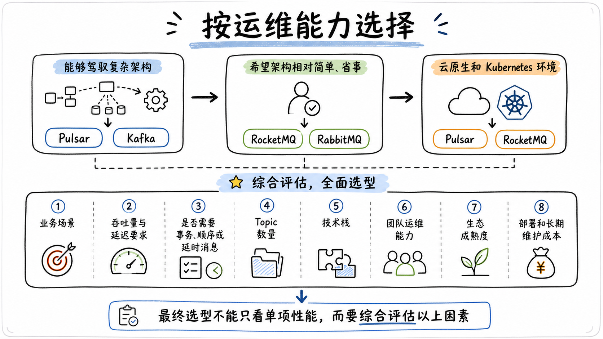

- 能够驾驭复杂架构：Pulsar、Kafka；
- 希望架构相对简单、省事：RocketMQ、RabbitMQ；
- 云原生和 Kubernetes 环境：Pulsar、RocketMQ 都可以重点考虑。

最终选型不能只看单项性能，而要综合评估：

1. 业务场景；
2. 吞吐量与延迟要求；
3. 是否需要事务、顺序或延时消息；
4. Topic 数量；
5. 技术栈；
6. 团队运维能力；
7. 生态成熟度；
8. 部署和长期维护成本。
