大家好，我是修炼者小烨。今天来聊一下大家比较关心的话题：**这个世界到底应该是什么样子？该怎么统合玄学观和科学观，又怎么统合神仙观和外星文明观？**

既然要聊世界观，那就得把时间和空间拉大一些，把古今和中外一起梳理，不要局限视野。从人类发展的时间顺序，我先把它分为：

1. **前古时期**
2. **上古时期**
3. **中古时期**
4. **近现代**

---

## 1. 前古时期：人神混居，人类是修炼者最后的“考核载体”

### 正神离开大地后，留下了什么

大神是这么说的：在文明之前，大地的能量还很充沛，神仙也是可以住在地上的，当时的人神可以混居。
后来发生了一些人类自找麻烦的事情，正神就不住地上了。

这里要理解一个能量概念：**正能量和负能量是守恒存在的。** 所以当大神陆续撤离地面的时候，很多负能量大佬也被陆续封印起来了。

留在地上的，大致包括：
- 还未修成的神；
- 以正能量修成的**精灵类**；
- 以负能量修成的**妖、魔、鬼、怪类**；
- 还有就是**人**。

### 为什么最后都要转世成人

至于人类这种存在，基本可以理解为一种**载体**。也就是无论你的元神是什么来历，最后飞升阶段都要转世成人，用人心和人类社会环境来考验个体的心性。如果考验通过，就可以飞升；考验不过，就继续重开。
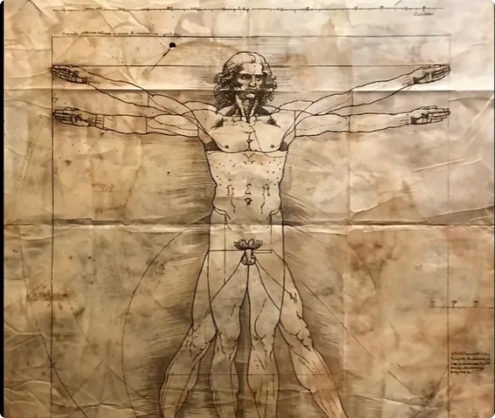

为什么一定要通过人生来做最后的考验呢？

>因为无论是动植物修成的妖仙、亡魂修成的鬼仙、浊煞之气修成的魔仙和怪仙，还是在正能量附近修成的精灵
>
>

这些来历的元神通常心思都比较单一。一旦认定修炼，就会一直想办法去修炼。
但是，**神仙的世界不是混吃混喝的地方，修成者必须考虑更多、更广的事情。**

### 人类这套感官系统，是一套“低配版的新系统”

神明又不可能直接把上层世界的感官系统白送给这些修炼的众生，所以人类这种作为中间过渡的载体，出现了人类感官系统，相当于**低配版的新系统**。古代常提到创造“半神”，就是指这件事情。

成为人后，个体的心思就会多起来。这套系统有利有弊，全凭个人怎么选择。

> _**成佛成魔，只在一瞬。**_

很多修为很牛的大佬转世成人，都栽进去了。所以修行中的“修行”，其实就是个体如何把握人类这套复杂的新系统，能不能稳住一开始的本心。

很多前世修得不错的他类众生，第一次转世到人身上，就显得特别缺心眼。尤其是很多修得不错的个体，品性还很善良，容易被凡人亲朋好友当“傻白甜”来看。

但其实是好事。因为从凡人身上诞生的元神，基本是很难入道的。纯凡人会觉得人的感官很哇塞：“好好体验生活不好吗？干嘛去修炼？”

这也是为什么小烨总强调一句话：

> **“凡人一个，关我屁事。”**

很多凡人元神转了很多世以后，终于想修行了，但也只是跑去念念经书。因为没办法，他们生生世世都没有过“**修炼要靠实实在在的能量**”这种经历，所以没有“唤醒”一说。

至于再宏大的事情，小烨也不知道。

---

## 2. 上古时期：从自然神信仰，到祭司与“大佬”争夺人间话语权

### 最早的信仰体系，其实都指向自然神灵

在文明刚诞生的时候，世界各地的信仰还是以自然神灵为主。

可以看出，上古时期的人对神灵认知的体系基本是一致的，只不过在不同地区产生了不同的叫法，但好些神明其实都是同一位。
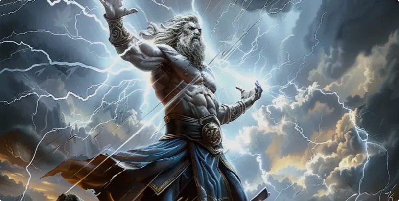

所以神仙不用分什么东方、西方，**大神之间是很熟的，甚至跟地上这些修炼的大佬都熟，只是跟凡人不熟而已。**

### 神职是如何慢慢被各种“大佬”占据的

这个阶段，最开始担任神职的都是一些**大祭司**，负责传递一些信息。但后来这些职位慢慢就被各种大佬夺取了。
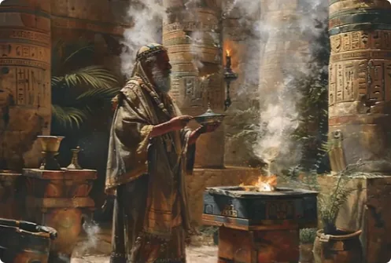

因为能量有正就有邪，修炼的个体也是如此。负能量众生也是要修炼才能存活下去的。

对于负能量众生来说，人身上的凡尘能量是不错的修炼资源。越多人信仰他、依赖他，他收到的能量就越多，自己修得也越快。
所以从那个时候开始，手腕越强的大佬，越要抢占凡人的**话事者**，让凡人给自己打工。

那话事者又有什么好处呢？
首先就是能借用大佬的功能，所谓预测、巫术之类的。大佬越强，功能越强；办事越多，带来的信徒也越多，话事者的地位也就越高。

至于地位这种东西，是凡人的最爱。

> **神权并行，本质就是两边一拍即合。**

这个阶段，人们已经慢慢开始不相信自然神了，转去信奉一些大佬。包括后面很多“创造新神”的事情，这些都是祭司和大佬在拓展自己的影响力。

### 为什么蛇、狐一类的崇拜特别多

像蛇、狐这一类崇拜得多，其实是因为这两类生灵自古就比较容易步入修炼，所以出现大佬的频率很高。

不仅如此，很多大佬能力确实很强，修了千万年的大佬不在少数。

小烨上个月去过某个公园，那里的那位大佬灵压，把我的脸都可以压麻。但是很多凡人还在那里拼命跪拜、求保佑。

别问为什么神职乱了，大神不管管。
**那都是人类自己的选择。**

人欲淹没了最开始的本性，管又有什么意义呢？

---

## 3. 仙人为什么开始传道：真正的修炼机会，从来不是无限开放

### 仙人传下来的，一部分是玄学知识，一部分是修炼方法

虽然大神不爱管人间事，但终究还是愿意给修炼的众生一个机会。

所以在这个时期出现了一些仙人：
1. **教大家如何用玄学知识建立生活；**
2. **教大家如何修炼。**  

之后零零散散有人传道、有人修成，这给了很多愿意修炼的众生一些念想。

为什么说只是念想，而不是直接给机会，让全部修行的众生修成呢？
有两个原因。

### 第一个原因：修行资源本身就是有限开放的

刚才提到，修炼的个体先要转世成人，先学会适应一套复杂的新系统。
好比先学会开一台教练车。
可是学会之后，你还需要有一台自己的车。不然你学会开教练车，又有什么意义呢？

所以修行中的**修命**，指的就是你还要修成自己的身体。这副身体里配备有神仙级别的认知系统，这样等你对人类认知系统有良好控制力的时候，时机一到，你就可以进入新的身体里飞升了。

可问题就在这：

> **修成身体所需的能量来源，也就是纯正能量，是有限的。**

凭什么给你？
或者，凭什么给他呢？
大家可以好好想想“**凭什么**”这三个字。

### 第二个原因：大神信不过凡人的人性

另外，关于如何造出一副神体，每个时代的方法都不一样。
规则由大神出，每个时代都有专人来指点，这样方法就不至于落入不修行的小人之手。
这就是要说的第二个原因：

> **大神信不过凡人的人性。**

刚才提到，玄学话事者的身份越高，越容易被大佬找上门。糖衣炮弹之下，基本没有不沦陷的。

大家可以想象一下，如果真正的修行方法就这么直直白白地公布于众，那么它真的会完好无缺地被每个真心修炼的人学到吗？

**不会的。**

---

## 4. 中古时期：玄学为什么越来越复杂，也越来越容易走偏

### 经书、咒语、阵法，最后可能变成了“大佬通讯手册”

其实根本不用想象，中古离现代已经3000年了，人是什么样子，大家都清楚。

自仙人开创道法理论以来，各种各样的大师顶着名号，借着各类神明的名义，建立各种歪门邪道，各自为营。嘴上多么尊重道法，其实都跟大佬搅在一块儿。

佛陀说过，末法时代到处都是披着袈裟的魔，指的就是这件事情。
1. 甭管什么经书、咒语、阵法，本质上是在完善一本**花样召唤大佬的通讯手册**。
2. 甭管这些头部大师多么能显本事，本质还是在借用大佬的功能，给大佬打工，帮大佬拉人头。

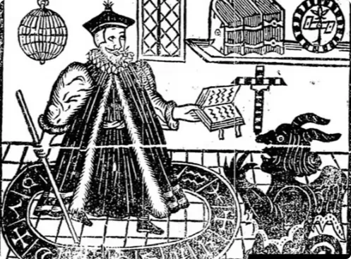

当然，他们自己是不知道的。

因为当他们求神像或者向内求的时候，大佬回应他了、帮他忙了，他便会以为是自己招来**正神**了，反而会虔诚得不得了。

### 为什么有些传承“每一代都有功能”

这类传承下来的人，很多每一代都有功能，比如什么内观、斗法。
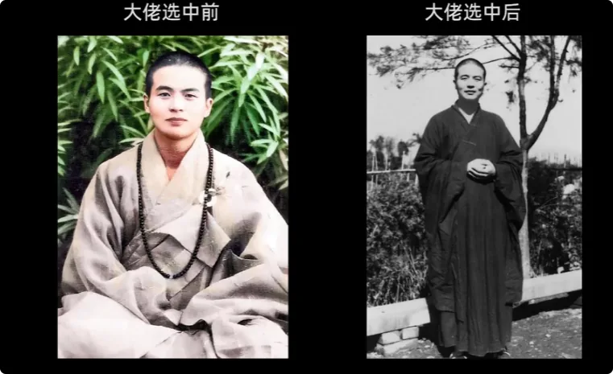

前一任会在大佬的介绍下选好下一任，而且这个人一定是聪明的，刚刚好念经念得特别好，特别能和大佬深度绑定，甚至可以借用大佬的功能拓展影响力。

同时，这类人也高产“龙傲天”。

>因为资质好，又从小被选中，还开了功能，所以个个内心都觉得自己是**天选之人**。

说白了，就是这类人的修为根底其实很差。

小烨告诉你，他们都是什么来历：
他们大多数前世是有点修为的小妖、小魔，而且是阴气比较重的那种。

这种来历的一转世，就容易招来同类相食，被同类利用。再者，本身就缺乏仙缘，阴性众生下手会更不留情面。

所以这些看似功能厉害的人，其实只是：

> **和同类同频快。**

这些人的悟性其实都不高，都不是真正的修行人。

---

## 5. 真正有机缘的修行人：为什么反而经常在玄学路上处处受挫

### 真正有根底的人，往往天然排斥歪门邪道

那什么是真正有机缘的修行人呢？

真正的修行人，首先前世修为根底要好。在玄学这条路上，他会一直受挫。
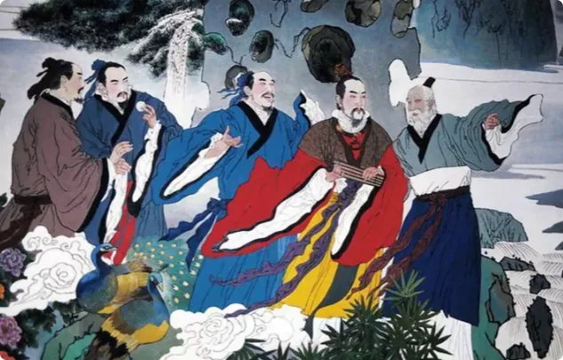
他们大多数会凭借前世积累的、真正修炼的感觉，打心底里排斥那些歪门邪道，或者再怎么也学不进去。

比如：
- 对经书真的读不进去；
- 又无法彻底放下修炼的原始动机；
- 一辈子都想找到真正的出路。

**这样的人才大概率不会被人性贪欲所困，才有机会遇到真正修炼的方法。**

所以中古时期零零散散修成的人，基本都是**一对一、口传心授**。
谁品性不错，才会出现专门的引渡人去度谁。
根本没有必要把方法公布于众，因为这个时期有缘人其实没这么多，转世成人的修炼者也没这么多。
在过去2000年里，真正允许飞升的才不足百人。

但从全球范围看，这些得道者基本都在东方，因为东方离某处仙山(昆仑山)更近。

这也是为什么东方兴起修仙热潮，而其他地方还在被各种大佬控制得死死的。
哪怕是在万物互联的今天，转世在东方的修行人，都有更高的几率接触到真正的修行。

---

## 6. 近现代：为什么玄学退场之后，科技知识反而开始快速爆发

### 知识，本就是从高层级向低层级流动

随着知识权限的放开，人类学到了更多超越以往的知识，很多科技的发展速度都堪比神迹。
其实不用怀疑：

> **知识就是由高层级流向低层级的。**

还记得小烨常说的“能量守恒、付出和收获对等”这个概念吗？
从这个概念，你可以理解很多事情。

比如为什么科技现在在西方迸发，是因为那边先出现过大量的**代偿**。
那段时间，西方教会里的大佬们可谓是吃得饱饱的。

再然后根据能量守恒，**否极泰来**，大量的上层知识才在不破坏守恒的情况下，涌入那些天才的脑子里。
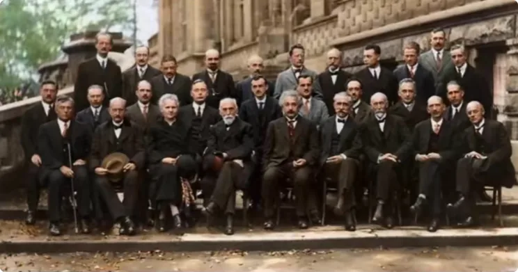

大佬这期间也很识相，很自然而然地退出了注定要陨落的教会。
但是大佬又不会真正消失得无影无踪。

**大佬还是要吃饭的嘛。**

### 从宗教体系退出以后，“大佬”又进入了新的组织

所以后来出现了各种秘密结社。
凡是心术不正的能人，大佬都可以帮他建立新的教义。
这些秘密结社后来变成什么呢？

一种是玩小圈子，比如**世越号**；一种是玩大圈子，比如**新纪元学说**。
反正只要大佬显点本事，总会吸引到狂热的拥趸。

别问为什么科技迸发没出现在东方。
**都是东方人自己的选择，自己的果要自己吃。**

---

## 7. 当下这个窗口期：真正的修行机会增加，假的道路也会同时泛滥

### “大升维”背后真正代表的是什么

我们继续说。

收获了这么多知识，那人类是不是应该付出点什么？
其实关于这一点，全球背后的灵界大佬都知道。
你们去看那些杂七杂八的神秘学学说，无论是东方还是西方，这些理论背后真正的始作俑者，也就是大佬们，他们基本都在旁敲侧击地告诉凡人：

> **要做好选择。**

比如什么“迎接大升维”这种听起来很可笑的事情。
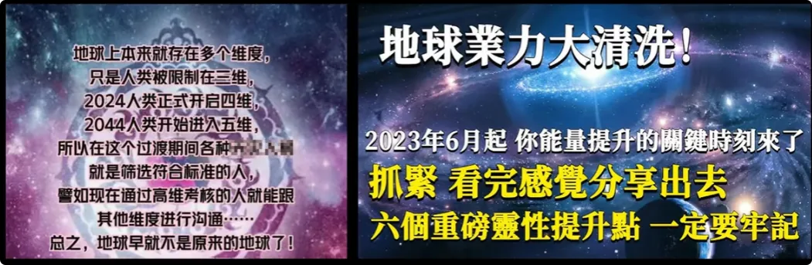

但具体人类要付出什么，连修千万年的大佬都不会直白地说出来，那小烨自然也是不清楚的。
小烨只知道：

> **“大升维”真正的意思，是能真正修行的窗口期出现了，得抓住天时地利。**

所以这几十年间，有相当多修为不错的众生转世成人了。
这些人会对修行非常感兴趣。
但千万不要以为这些大佬出来发声、提醒大家修行，他们就是大好人。

其实是因为**身体的名额增多了，那大佬的名额也要增多，才能维持能量守恒。**
一边开放了，另一边也得放开。

### 为什么现在的“修行”越来越强调光与爱

所以为什么现在市面上的修行，都充斥着“光与爱”“真善美”“修心就可以修成正果”？

那是因为大佬抓住了凡人**想不劳而获**的痛点，哄着这群假的修行人给自己上供。
凡修为根底欠缺的、抓不住机会的，都会成为大佬的盘中餐，半路夭折。

只有真正修为根底好的、能排除万难的、最终能抓住机会的，才是真正的**有缘人**。
同样，现在很多小妖、小魔也在忙着吃人，想趁这个机会好好升级。

所以你可以看到：
- 越来越疯狂的人；
- 越来越简化的泛修行；
- 灵界背后都在大狂欢。

不仅如此，很多上古封印的大佬也被放出来了。
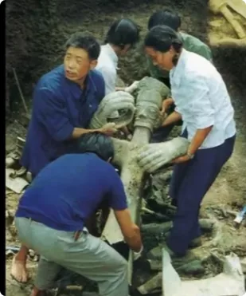

> **不该去的地方不要去。**

算是给粉丝朋友的一些福利建议。

### 一千个人去“修行”，真正找到路的可能只有两三个

在未来，假如有1000个人跑去修行，那大概只有两三个人才能找到真路，大部分都将成为大佬的菜。
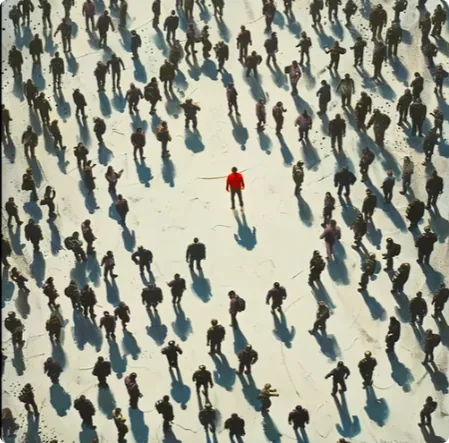

别问为什么不阻止。

> **那都是个人不能明辨，自食其果罢了。**

比如看我视频的人，听得倒是挺起劲的，行动的倒没见几个，还有不少要来骂我两句。

---

## 8. 神仙与外星文明并不冲突：玄学和科学本就是不同层级的知识投影

### 为什么很多人无法把“神仙”和“天外来客”缝合到一起

这个部分单独拿出来讲。

很多人难以缝合**神仙和天外来客**这两个概念，是因为古典神灵形象太深入人心了，导致大家觉得神灵都是穿着古装出现的。
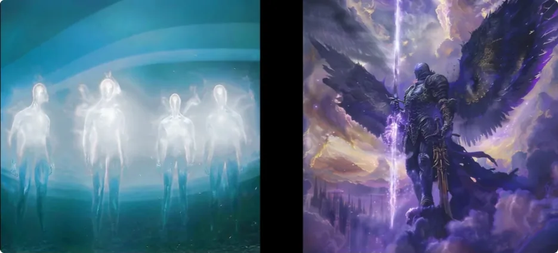

其实上古大神和大佬都是高维的。
只不过虽然都在“天上”，但是：

> **此天非彼天。**

他们不在一个层面。
不是说神仙就跟科学没有任何关系。

相反：

> _**先有上层社会的知识体系，才有传给下层的玄学和科学体系。**_

他们根本不需要迎合凡人展示什么。
科技大神拥有一挥手就能解决低维度大部分事情的神通，真的没有必要再秀肌肉了。

况且，都到了那种感知级别的存在，他们的知识体系，又岂是人类这种感知级别能够理解的？
所以如果天上真有什么 UFO，也不知道是哪个维度的大佬出来捉弄人呢。

反正据我观察：

> **大神是不屑于把车子开出来秀肌肉的。**

