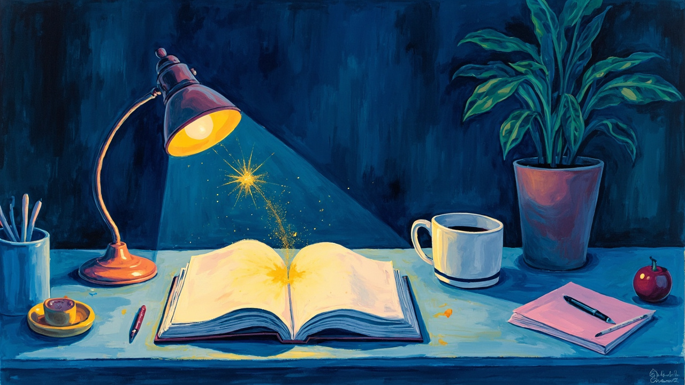
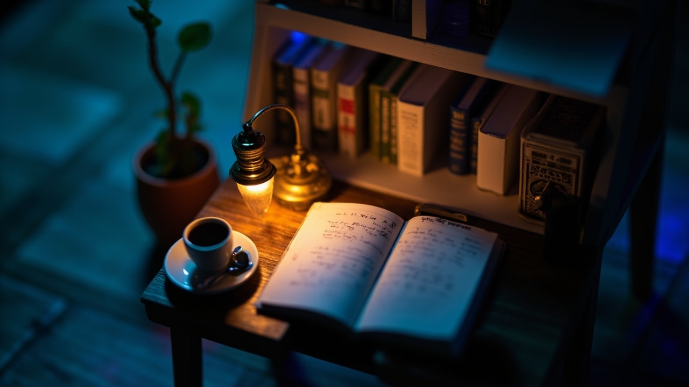

## 这篇在说什么

本站用 MiniMax 生成卡片封面时，不只「随便出一张好看的图」，而是先按场景选风格池：

1. **通用场景** — 生成前列出选项，让你挑；不选则默认 **编辑静物（03）**
2. **特定场景** — 题材命中关键词时，直接走对应风格，不再弹通用菜单

下面样张共用同一主题锚点：**夜写字台 · 萤火 · 笔记本 · 台灯 · 咖啡杯**，方便只比风格、不比题材。

口味硬规范（生成时始终生效）：

- 极具创意，拒绝廉价 AI 味（尤其蓝紫渐变、紫粉霓虹）
- 艺术感 + 现代感
- 紧贴主题，或主题高度抽象
- 画面包含多种可辨要素

本地挑选页：`/media/minimax/style-taste/`（开发服）或仓库内 `public/media/minimax/style-taste/index.html`。

## 通用场景

换帖题也能撑住的风格。出封面时列出菜单；**不选 → 默认 03**。

| ID | 风格 | 菜单文案 | 适用主题 |
|----|------|----------|----------|
| 03★ | 编辑静物 | 印刷级静物（默认） | 几乎任意博文 |
| 09 | 35mm 胶片 | 胶片纪实 | 随笔 / 旅行 / 情绪 / 视频教程 |
| 16 | 水粉插画 | 杂志风插画 | 教程 / 科普 / 产品介绍 |
| 06 | Risograph | 孔版油墨 | 创作谈 / 科技人文 |
| 10 | 剪纸拼贴 | 剪纸拼贴 | 综述 / 多概念 / 抽象杂谈 |
| 05 | 包豪斯 | 几何抽象 | 系统设计 / 高度抽象贴题 |
| 08 | 等轴微缩 | 等轴微缩场景 | 流程 / 架构 / 工具链 |

### 03★ 编辑静物（默认）

印刷级静物，博物馆图录感；几乎任意博文的稳妥底盘。

### 09 35mm 胶片

纪实亲密感与颗粒；适合随笔、旅行、情绪向与视频教程封面。

### 16 水粉插画

杂志风手绘插画；适合教程、科普、产品介绍。

### 06 Risograph 孔版

独立杂志油墨叠印质感；适合创作谈、科技人文。

### 10 剪纸拼贴

手撕纸层与多物件拼合；适合综述、多概念杂谈。

### 05 包豪斯几何

圆 / 矩 / 三角重构物件；适合系统设计与高度抽象贴题。

### 08 等轴微缩

干净 isometric 微缩场景；适合流程、架构、工具链。

## 特定场景

题材命中下表关键词时，**默认直出对应风格**（除非你明确改口）。

| ID | 风格 | 触发主题 |
|----|------|----------|
| 01 | 像素 | 像素 / 8·16-bit / 复古掌机 / retro game |
| 02 | 体素 | Minecraft / 方块 / 沙盒 |
| 13 | Low-poly | 低面数 / 3D 游戏美术 |
| 07 | 浮世绘 | 和风 / 浮世绘 / 日式美学 |
| 11 | 水墨 | 书法 / 古典 / 禅意 / 水墨 |

### 01 像素风

### 02 我的世界 / 体素

### 13 Low-poly 3D

### 07 当代浮世绘

### 11 当代水墨

## 怎么分流

1. 先看题材是否命中「特定场景」表  
2. 命中 → 直接用对应 ID 写 prompt 出图  
3. 未命中 → 列出通用 7 选项；不选则用 03  
4. 任何风格都套用文首口味硬规范，并避开蓝紫廉价 AI 味  

未纳入本规范的样张（默认不用）：04 瑞士海报 · 12 黏土 · 14 粗野 · 15 陶瓷。

## 相关资产

| 资产 | 路径 |
|------|------|
| 风格挑选页 | `public/media/minimax/style-taste/index.html` |
| Skill 工艺说明 | `.cursor/skills/firefly-minimax-media/references/prompt-craft.md` |
| 本帖封面 | `./cover.jpg`（与 03 编辑静物同图） |
