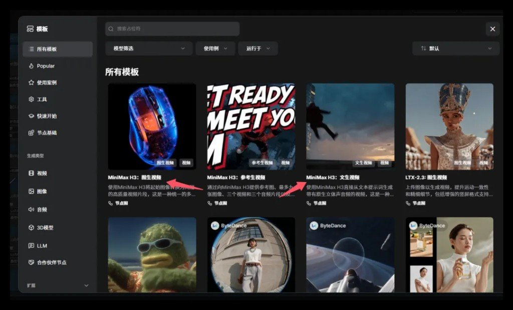
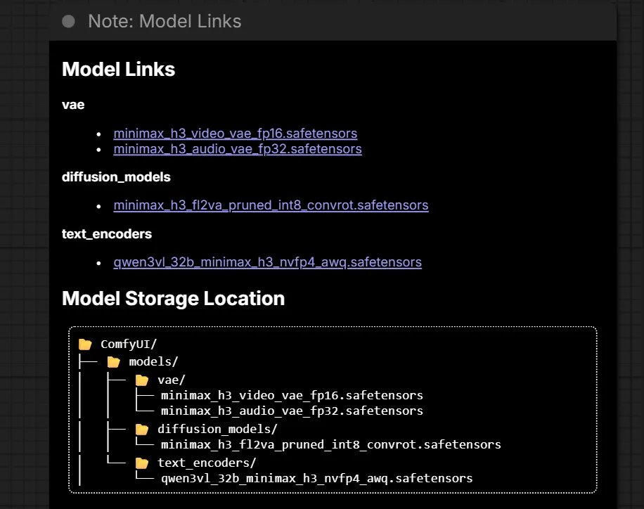
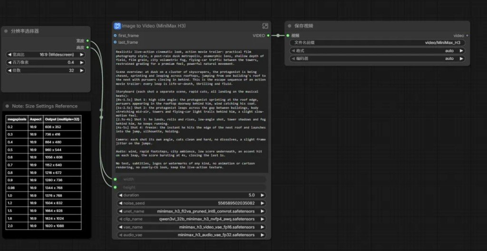

公众号「AIGC小顽童」2026-08-11 这篇，核心不是安利，是一条个人机能不能落地的实测路径：H3 开源权重很大，满血 BF16 别想了；走秋叶/桌面 ComfyUI + INT8/NVFP4 四文件，作者称 16G 推荐可用。

下面只留能带走的：档位、文件落点、关键参数、提示词骨架、坑，以及和官方 API 的分界。文中数字均标作者实测/转述，本机未复跑。



## H3 本地到底开了什么

| 项 | 口径 |
|---|---|
| 体量 | 33.1B dense Omni（非 MoE） |
| 时间线 | 约 2026-07-31 发布 · 08-03 开源权重 |
| 同 pass | 文/图/参考 → 视频 + 原生立体声 |
| 文本塔 | Qwen3-VL-32B |
| 本地分辨率 | 默认约 768p；2K / Context-IR 作者称仅 API |
| 帧/声 | 帧数 17n+5 · 24fps · 音频 32kHz 立体声 |
| 开源 | FL2VA、Ref2VA |
| 未开源 | Context-IR、Regenerate-2K（作者口径） |

许可证别跟着软文拍板：作者转述「排除美/欧/英/韩本地」+「社区许可年营收 <$20M 商用」——以官方 LICENSE 为准，本稿只记风险。

## 显存 / 内存：个人机认量化档

| 显存 | 作者结论 |
|---|---|
| 8G + NF4 | 勉强 |
| 12G + INT8 | 能跑 |
| 16G | 推荐 |
| 24G+ | 舒服 |
| 满血 BF16 | 集群；个人别硬刚 |

系统内存：32G 底线，64G 甜点（动态卸载）。作者踩坑原话级别的提醒——内存往往要比「显卡够不够」更先爆。

正文里出现过 `RTX 6060` / `34G` 一类字样，留言也在嘲；对照留言环境更像 4060 系。当审核口误存疑，别按字面买卡。

## 部署：Comfy 模板 + 四个文件约 42.5GB

路径很短：

1. 秋叶启动器或桌面版先更新内核/依赖（原文配图：版本管理 / 一键更新）
2. 侧栏模板 → 加载 MiniMax H3（文生 / 图生 / 参考生）
3. 按 Model Links 把权重丢进对应目录



| 文件 | 放哪 |
|---|---|
| `minimax_h3_video_vae_fp16.safetensors` | `models/vae/` |
| `minimax_h3_audio_vae_fp32.safetensors` | `models/vae/` |
| `minimax_h3_fl2va_pruned_int8_convrot.safetensors` | `models/diffusion_models/` |
| `qwen3vl_32b_minimax_h3_nvfp4_awq.safetensors` | `models/text_encoders/` |

目录名错一个，节点就空白——这是最高频的「下完了却跑不起来」。

## 参数先钉这几个


配图分辨率表（Multiple=32）：

| MP | 约像素 |
|---|---|
| 0.4 | 864×480（低分试词） |
| 0.98 | 1344×768（≈768p） |
| 2.0 | 1920×1088（≈1080p） |

另记：

- 时长看节点 `duration`（配图示例 5.0；提示词里若写 10s，以节点为准或自行对齐）
- 帧数合法集：17n+5
- 本地别指望文里吹的 2K 满血——那条在 API 侧

## 提示词：主题 / 时间轴 / 镜头 / 声音

作者推「四行法」——时间段连续且不重叠：

```text
主题：…
主体时间轴：0-As …；A-Bs …；B-Xs …
镜头：…
声音：…
```



和站内「把 MiniMax 当制片」那条（API 侧三字段/五模式）是同一家模型、两条轨：那边管云端提示词结构，这篇管本机权重与显存档。旁链即可，别硬并。

## 坑与迭代节奏

| 坑 | 怎么处理 |
|---|---|
| OOM | 降 MP / 缩短 duration；先查系统内存是否 <32G |
| 找不到模型 | 对照上表四路径，vae 别塞进 checkpoints |
| 糊 | 低分只负责定稿词；母版再抬到 ~0.9MP |
| 音画飘 | 时长、帧数规则、音频 VAE 是否挂上 |
| SageAttention | 留言当加速手段；新手慎开，出问题先关 |

作者建议的四轮：低分试词 → 加参考 → ~0.9MP 母版 → 外部超分或 API 2K。

留言可采信程度一般，但有用数量级：768p + 16G 至少约 25 分钟（作者/读者口径）；另有 torch cu130 / TeaCache / SageAttention 加速讨论；Mac 体验差。

## 本地和 API 怎么分

| 要这个 | 走哪 |
|---|---|
| 个人练手、省额度、FL2VA/Ref2VA/文生+立体声 | 本地量化 Comfy |
| Context-IR、Regenerate-2K、正经 2K | 官方 API |
| Firefly 站内出片额度/脚本 | `firefly-minimax-media`（API 链路，与本文 Comfy 本地无关，勿混改） |

网盘「全家桶福利」、加群领模型——原文若有，不要当知识收录。权重去官方/可信镜像自己核哈希。
