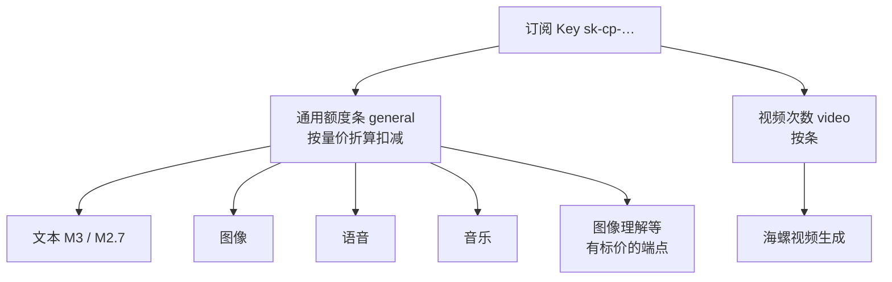

> 归档：2026-08-04 · 面向拼车 / 自用 Max（Token Plan）  
> 文本、生图、语音、音乐共用一条进度条；视频才有固定条数。订阅 Key（`sk-cp-…`）和按量 Key 不是一路货。

官方入口：[国内订阅页](https://platform.minimaxi.com/subscribe/token-plan) · [定价](https://platform.minimaxi.com/docs/guides/pricing-token-plan) · [概要](https://platform.minimaxi.com/docs/token-plan/intro) · [FAQ](https://platform.minimaxi.com/docs/token-plan/faq)

---

## Max 这一档到底买到什么

国内公开档：**Plus ¥49 / Max ¥119 / Ultra ¥469**（连续包年 Max 约 ¥1,190，相当于省 2 个月）。

| 项 | Max |
|----|-----|
| 定位 | 高频编程 Agent + 多模态日常 |
| 月度 M3 用量（宣传口径） | 约 **18 亿+ token** |
| 按「单次 ~50K token」粗算 | 约 **36,000 次 / 月** |
| Agent 并发（含高峰动态限流口径） | 约 **4–5** |
| 5 小时窗口仅打 M2.7（参考） | 约 **4,500 次** |
| 5 小时窗口仅打 M2.7-highspeed（参考） | 约 **2,250 次** |
| 视频 | **3 条 / 日**（Plus 无；Ultra 5 条 / 日） |
| 长上下文 | 1M（适合大仓 / 长文档） |
| M3 多模态理解 | 图像 / 视频输入可用 |

国际站同档约 **$50 / 月**，规则结构一致，价格与积分换算不同。



---

## 额度怎么计量（拼车最容易踩错）

### 1. 统一池，不是「每种模态各算一袋次数」

官方 FAQ 写得很死：**文本 / 图像 / 语音 / 音乐等覆盖资源共用同一套餐内额度**，控制台进度条是唯一真相源。  
扣减方式是 **usage-based**：按该端点的按量标价，从套餐额度里折算扣除。简单对话便宜，长上下文、多轮 Agent、多模态会明显更「吃条」。

| 能力 | 有没有独立固定次数 | 怎么扣 |
|------|-------------------|--------|
| 文本 Coding | 否 | 进 **general** 百分比池 |
| 生图 | 否 | 同上 |
| 语音 | 否 | 同上 |
| 音乐 | 否 | 同上 |
| 图像理解（如 API-vlm） | 否 | 同上（按标价折算） |
| 视频生成 | **有** | **video**：Max **3 / 日**；接口侧常见周窗约 **21**（≈3×7） |

所以之前会话里那句「生图语音音乐没有固定次数」仍然成立：不是没额度，是**不按次拆包**。


### 2. 双窗口：5 小时 + 周

- **5 小时窗口**：滚动 / 固定窗口（中英文文档表述略有出入，体感都是「半天一档」）  
- **周窗口**：管一周总量  
- **未用完不结转**到下一个计费周期  

打满任一门，该窗口内订阅额度就停；有积分则先吃完套餐再吃积分，或换按量 Key。

### 3. 本机实时快照（拼车号、查额瞬间）

`mmx quota show`（国内 `api.minimaxi.com`）：

| 额度包 | 当前窗口剩余 | 周剩余（面板显示） | 重置约 |
|--------|-------------|-------------------|--------|
| 通用 general | **99%** | **134%**（原始约 89% × 150% 加成） | ~3h40m |
| 视频 video | **0 / 3**（当日已用尽） | **3 / 21** | ~12h40m |

说明：

- general 的 `total_count=0`，接口只给百分比，不给绝对 token 数  
- 面板「周剩余 134%」来自 `weekly_boost_permille=1500`（150% 加成显示），不是又多了一套额度包  
- `token_plan/remains` 与 `coding_plan/remains` 视频计数字段偶发不一致；**以控制台条 + `mmx` 面板为准**

---

## 两把钥匙：规范别混

| | 订阅 Key（Token Plan） | 按量 API Key |
|--|------------------------|--------------|
| 形态 | 常见 `sk-cp-…` | 平台「接口密钥」 |
| 扣什么 | 套餐额度（+ 可选积分溢出） | 账户余额 |
| 用途 | Agent / CLI / 拼车日常 | 生产、大批量、不受套餐窗限制（花余额） |
| 能否互换 | **不能** | **不能** |

拼车场景务必约定：所有工具只塞**同一把订阅 Key**；有人换成按量 Key，账单会突然走余额。


额度用尽时的官方路径：

1. 已购积分自动顶（覆盖范围内）  
2. 升级档位 / 团队改派席位  
3. 换成按量 Key  
4. 等 5 小时或周窗口重置  

生产流量官方建议走**按量**，Token Plan 定位是个人交互式开发。

---

## 接口与工具怎么接（Max 常用面）

### 查额度

```bash
# CLI
mmx quota show --output text

# HTTP（国内文档口径）
# GET https://www.minimaxi.com/v1/token_plan/remains
# Header: Authorization: Bearer <订阅Key>
```

本机实测可用：`https://api.minimaxi.com/v1/token_plan/remains`（以及兼容的 coding_plan 路径）。

### 能力 ↔ 典型调用

| 能力 | 典型入口 | 扣哪一包 |
|------|----------|----------|
| 文本 Chat | OpenAI 兼容 / `mmx text chat` / Agent | general |
| 生图 | `mmx image generate` / MCP `text_to_image` | general |
| 语音 | `mmx speech synthesize` / MCP TTS | general |
| 音乐 | `mmx music generate` | general |
| 联网搜索 | `mmx search` / minimax-coding `web_search` | general（有标价则折算） |
| 看图理解 | vision / understand_image | general |
| 视频 | `mmx video generate` | **video 次数** |

文档索引：[国内 API 总览](https://platform.minimaxi.com/docs/api-reference) · CLI 指南见 Token Plan 文档树。

### 明确不在 Token Plan 覆盖（或暂不支持）的

官方多次点名：**MiniMax H3、音色设计、快速复刻** 等特殊能力；Credits 使用范围另说，但订阅覆盖清单以控制台为准。  
需要这些能力时，按量 Key / 单独资源包，别指望 Max 订阅条直接扛。

---

## 拼车与限流：平台写在明面上的规矩

文档承认会针对「超高并发批量 / **多用户共享**」做账户维度限速。高峰多在工作日 **15:00–17:30**：

| 档位 | 高峰约可撑 Agent 数 |
|------|---------------------|
| Plus | 3–4 |
| **Max** | **4–5** |
| Ultra | 6–7 |

RPM / TPM 超限通常约 1 分钟缓，高峰会更紧。

对拼车的实操含义：

- 额度是**账户共享**的：你开 Cursor、队友开 Claude Code，啃的是同一条 general + 同一袋视频次数  
- 视频 3 条 / 日极容易被一人刷光（本机快照已是当日 0/3）  
- 别并行开一堆长上下文 Agent 硬冲高峰；Max 的「4–5」是体验口径，不是法律意义上的硬并发合同  

---

## 积分包（Max 的溢出垫）

国内积分换算约 **1,000 积分 = ¥7**（国际站约 1,000 credits = $1）。示例：¥30 → 4,285；¥150 → 21,430；¥500 → 71,435。有效期自购买起 **365 天**。

规则：套餐额度优先，溢出再吃积分；无套餐也可只用积分 + 订阅 Key。

---

## 和「旧 Coding Plan / 按次错觉」的差别

升级后官方强调三点：

1. **按实际消耗扣**，不再「简单问题和重推理同价次数」  
2. **统一池**，别再按模态记小本本  
3. 控制台进度条 > 口头宣传次数  

社区里有人感觉「Max 变紧」：多模态并进一池后，狂刷识图 / Agent 会快速吃光 5 小时条——这是计量模型变化，不是你没买到 Max。

---

## 照这个做，少踩坑

1. 工具里只放订阅 Key；生产另开按量 Key  
2. 每天开工先 `mmx quota show`：看 general % 和 video 剩余条数  
3. 视频任务先协调「谁用今天的 3 条」  
4. 生图 / TTS / 音乐当「吃通用条」，别当免费无限次  
5. 高峰少堆 Agent；撞限流先停并发再等窗口  
6. 需要 H3 / 音色设计 / 大批量视频 → 按量或资源包，别硬刚订阅条  

---

## 诚实边界

- Max 的「18 亿 token / 36,000 次」是**宣传估算**，不是 API 返回的硬计数  
- 接口不拆 image/speech/music 剩余次数；细账只能看控制台条或自己按标价反推  
- 档位价格、赠送视频条数以订阅页实时为准；本文数字抓取日为 2026-08-04  
