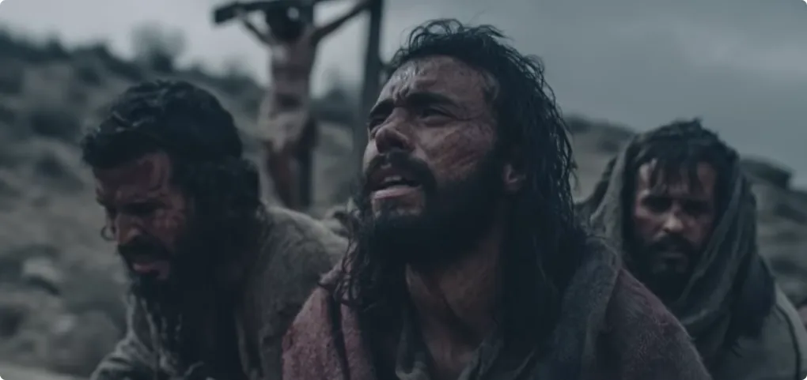
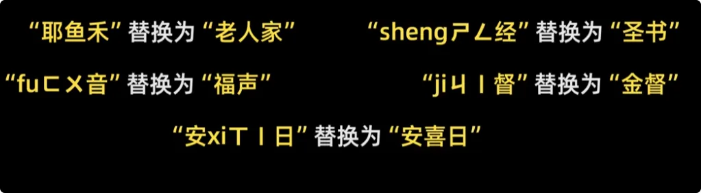
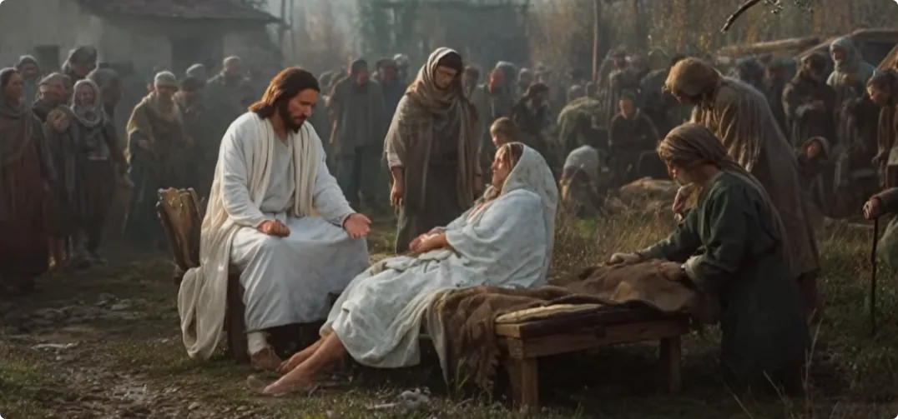
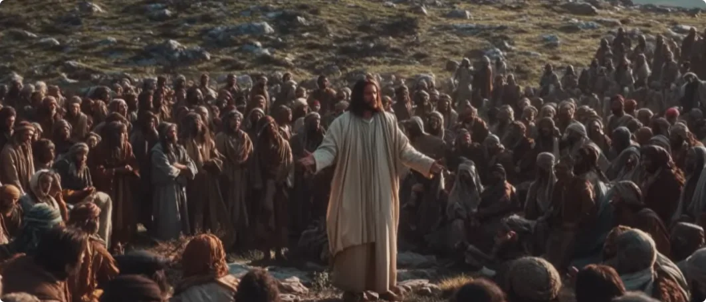
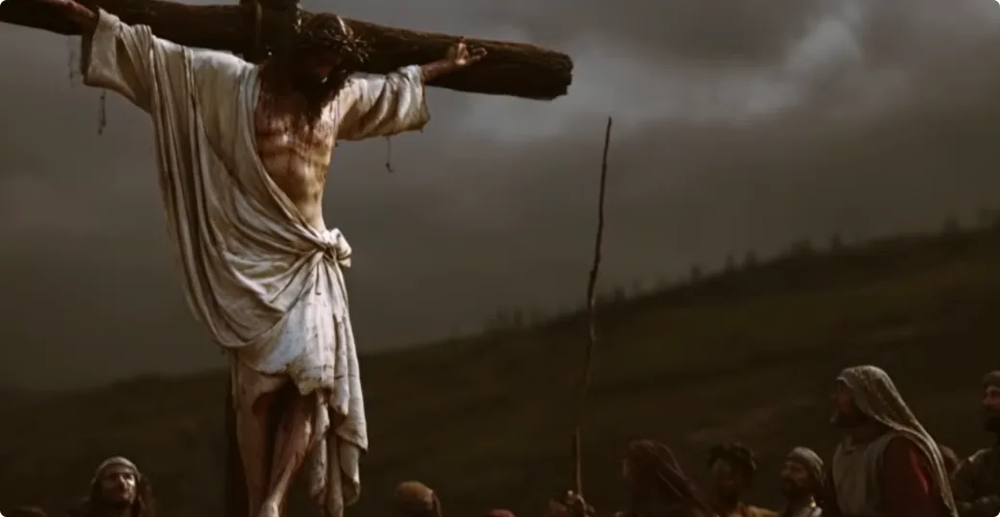
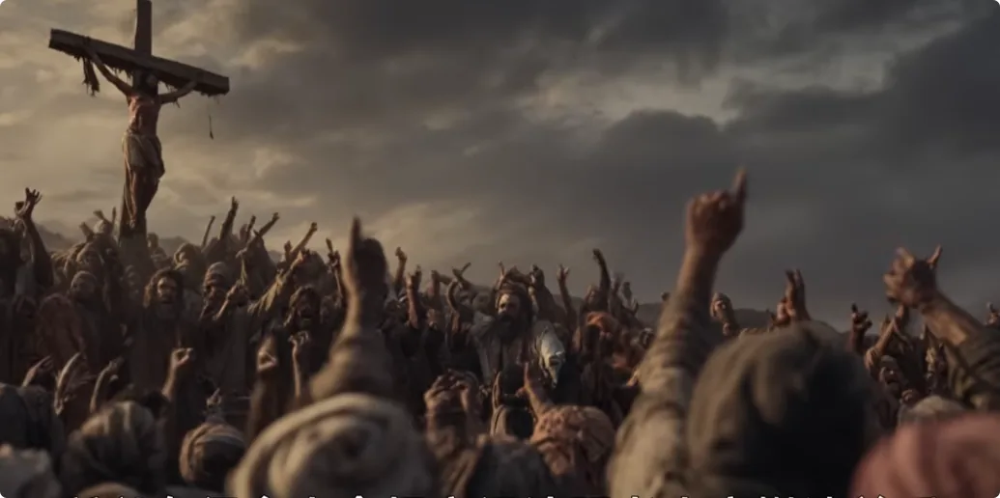

2000年前，一位下凡的神被钉上了十字架。刑场周围的人都在喊：“他该死！除掉他！”

有的人用拳头打他，有的人向他吐口水，士兵鞭打他、羞辱他，宗教领袖满是轻蔑和讥讽。除了他在人间的母亲、他最爱的一位门徒以及一些妇女，其他的人要么看戏，要么在嘲弄他。

他们说：“你既说你是神的人，那你可以救你自己吧？你的神会来救你吧？”
最后，他在最大化的痛苦中断气。
就当人们以为自己得逞，除掉了这个口出狂言的异端时，忽然大地震颤了，耶路撒冷的圣殿裂开，死去的圣徒从坟墓中苏醒。

人们先是感到惊恐，接着是巨大的悔恨，因为他们终于意识到一件可怕的事情：十字架上那位真的是神委派的人，然而他刚刚被自己亲手处决了。

这个人就是耶稣，一位爱人的神祇。

大家好，我是修炼者小烨。

由于上一期视频在国内无法审核通过，所以本期我需要把个别用词替换掉，从AI视觉审核和AI音频审核的角度全面替换，希望海内外朋友相互体谅。
- 某人，我们尊称为“老人家”。
- 某经，我们说成“圣书”。
- 某音，我们说成“浮生”。
- 某都，我们说成“京都”。
- 某节日，我们说成“安喜日”。

今天我们接着上一期，继续讲圣书中关于修仙的事情。本期我们既讲人性如何使自身覆灭，也讲凡人想要飞升的本质。

## 老人家下世替凡人赎罪
### 下世的原因: 
我们先来说老人家下凡的原因。
太初有道，世间万物都由道创造。道有自己的位格，道和神都是祂的一个位格。没错，就是东方人认为的那个“道”。
然而，世间常有人把控着对道和神的解释权，把控着经书律法的解释权，以此约束和残害世人，甚至挑唆世人背道而行，导致世人最后却不再信道和神了。

这件事严重到什么地步呢？

经上是这么说的：世道黑暗污秽，道的光照进屋内，使光都有罪。凡背道作恶的人都怕正道的光，因为他们明白这道光会要了他们的性命。相反，那些行道之人却期待着道的光辉，期待正道的降临。

因此，老人家就是来给信道者一个希望，也称之为浮生，同时也给那些背道者一个悔改的期限。
总的来说，老人家在2000年前下凡的主要目的，就是**替天传道，为道铺路**。

### 下世的计划: 
神的计划是这样子的：
为了让世人看清楚自身的弱点和罪恶，也为了让神看见世人剩余的良善面，论证世人尚且可救，神委派老人家以凡人之躯入局，任凭世人借由自身的恶将他送上十字架。
直到他被世人杀死，神再显神迹，将其复活，向世人证明他本是神的人，是道委派的光，让世人惊觉是自己亲手葬送道的圣者，以此来让世人看清自己的恶行并悔过，重新信道。
最后，道神通过看见人们对信道的践行，来评估人往后需承担的罪的体量。

所以，老人家在其中的作用，就是以自身的死换取人们对道神的重新信任，以减免人类整体的罪。也就是老人家是献祭给神的羔羊，赎世人的罪。

那么接下来，我们就来看看这场下凡救赎的神，被他所爱的世人送上刑场的荒唐戏码。

### 导火索的积累和爆发: 
上一期我们讲过，老人家在传道的大部分时间里，都在帮助大众驱鬼治病。虽然看起来是善举，然而这却动了旧秩序的蛋糕，因为“肥水不流外人田”。这也是老人家被世人谋划处死的开端。

在旧秩序中，犹太律法师，也就是文士和法利赛人，是一群研究旧约律法的专家和精英。他们通过掌握对律法的解释权，深度影响和约束着人们的生活。他们不容民众挑战他们的规条体系，民众对他们既尊敬又畏惧。

老人家是这么评价他们的：

> 这些人只说道义，却从不行道义；把难事都推给百姓去做，自己只坐收渔利。这些人喜欢做表面功夫，喜欢至高的宝座，更喜欢听街上的百姓如何尊敬他们。

他们在听闻老人家到处行神迹、帮人驱鬼治病后，这群既得利益者便到处收集老人家的罪证，好处死老人家。

有一次，老人家在安喜日治好一个病人，文士和法利赛人要以此为把柄状告老人家，因为律法规定在安喜日不得做任何工作，他们把治病也列为工作。

老人家反问他们：

> 安喜日存在的目的，不就是让人休养身心的吗？不就是为了人的福利而设立的吗？  
> 人把牲畜当成自己的财产，当牲畜遇到危险时，也都会为了保住财产而不惜忽视律法。难道百姓不比牲畜可贵吗？  
> 律法应以怜悯和维护百姓为前提，而不是高于百姓。

文士和法利赛人听完就大怒，因为他们是规则的制定者，他们对宗教的解释权不容置疑。老人家的言论无疑撬动了他们的根基，于是他们开始商议怎么除掉老人家。

老人家不仅重新诠释了律法存在的意义，更诠释了执法之人应具备什么资格。

有一次，文士和法利赛人故意带一个行淫的女子来为难老人家。他们问他：“按照律法，得用石头砸死她，你觉得行吗？”

如果老人家反对，那就是与罪人为伍，要作为逮捕他的罪证；如果老人家说行，那就违背了他怜悯的思想，周边的民众就会失望。

总之，他们要找出老人家的把柄。

可老人家却说：

> 你们中间有谁认为自己没有犯过任何罪的，就可以动手。

结果他们面面相觑，没一个人动手。因为他们从老到少，无论资历阅历，没有人敢说自己的德行是无可指摘的，没有人敢站在道德高地上审判这位妇女。

最后，老人家赦免了妇女的罪，因为在现场，只有他是纯洁无罪的人类，只有他有资格。换句话说，只有委派他的道，有资格审判和赦免人的罪。

老人家又说：

> 我代表祂那怜悯的意志来人间，祂从来都是施惠于人的。祂怎么做，我就怎么做；你们的律法之外，我也可以做。

这话无疑挑战了犹太人的权威，因为犹太人认为自己已是神在世间唯一合法的代理人，不存在老人家这种神之子、神委派的新角色、新体系。

同时，犹太人认为自己是高人一等的，其他人都是神定的罪人。而老人家竟敢以神圣身份自居，在神定的安喜日去帮助罪人，与罪人作伴。

因此，犹太人认为老人家不仅是在亵渎神，也威胁到了犹太人，所以犹太人也开始谋划杀了老人家。

随着老人家治好成千上万人的病，越来越多的民众开始相信他、追随他，期待他改变旧世界。老人家也迎来了人间的标准结局：他的存在本身就有罪。

因为当正道的光照进黑暗，照出其中的污浊和不堪，使光也便有了罪。

老人家传道的三年，几乎所有的旧秩序既得利益者都在谋划除掉他。而老人家从一开始就知道会这样，他也不藏着掖着。

他就是要让所有人，不管男女老少，不管什么民族，不管什么身份，都参与到这场荒唐而现实的历史事件中来。因为最终他的死会成为一面镜子，照射出每个世人心中的罪恶，如此才能让众人乃至他们的后人悔改。

故事讲到这里，我们平心而论，老人家有做过什么伤害世人的事吗？

没有。

他只是给大家讲讲道理，让大家理解道的本意，又为了让大家听进去，显了一点神迹来驱鬼治病而已。
讲真话、讲实话，就能在人间招来杀身之祸。
换个角度说，那些领袖难道没怀疑过老人家是神的人吗？

他们心里当然知道，但是他们实在放不下手中的利益，所以宁可赌一把：老人家就是个疯子。宁可误杀神的圣者，宁可背道而行，也要尽力保住自己手中的利益。

而这就是下凡的神明在世间最大的阻力。

有人会问，那是不是把这群旧秩序领袖干掉，就万事大吉了呢？
当然不是。

因为使人堕落的从来不是人们手中的利益，而是人性本身。

人性有三大弱点，那就是**贪、嗔、痴**。也就是
得到了就想要更多；得不到就心生怨念；难以自我审视，一切以自我为中心建立善恶观。

而这种人性弱点藏在每一个人身上。不管什么民族，不管什么社会地位，也不管远近亲疏，不管是谁，只要开始接触到利益，他们的贪嗔痴就开始发作。

连老人家这些下凡的神明转世成人身，也要再次考验名利观。
因此，天上的神明从来不独宠一个民族、家族，也不会把神权交给任何一个民族、家族。
所以，在历史上总会出现某个民族受神眷顾，起飞了，做大了，然后又开始飘了，最后迎来覆灭。

在圣书新约中，有三处巧妙表达了神明对人性贪嗔痴的失望。

## 一、人之贪

老人家做了个比喻，讲人的贪。这里我直接讲本意：

道神曾把人类的世界交给某一批人代管，可能是某一民族，也可能是某一家族。
等到道神再次派神灵去视察人间时，那些人就合起伙来，商议着把下凡的神灵给杀了。
道神说：

> 既然你们自称是独忠于神，而不愿忠于其他神灵的，那我就派我的化身去，你们应当服气了吧？

结果那些人把道神的化身也给杀了，因为他们想霸占大地上的一切，他们觊觎道神的资产。
最终，道神决定下死手除灭这群恶人，要将地上的产业交给能按时交付任务的人管理。
这个故事充分说明，人的贪婪是上不封顶的，是填不满的，凡所见的都想拿到手里占为己有。

## 二、人之嗔

第二个故事讲的是人的嗔。

老人家回自己家乡驱鬼治病，然而那些老乡都不服老人家。他们认为：

> 我是看着你长大的，你什么出身，你父母兄弟姐妹是谁，我都一清二楚。你怎么可能学到这么多本事？你怎么会比我厉害？你凭什么来指导我怎么生活呢？

这些老乡越想就越讨厌老人家。说白了，就是人的嗔念作祟、嫉妒心作祟，见不得身边的人拥有自己没有的东西，见不得自己身边的人过得比自己好。

这种心理更容易在熟人身上产生。

老人家对他的门徒说：

> 历史上但凡是先知，除了他们的亲人和同乡，没有不尊敬他们的。

换而言之，**当一个求道者修有所成，不管你有多大本事，最不愿意相信你的、最不愿放下身段尊重你的，往往是那些认识你过去的人。因为他们还停留在原地，你的存在就是对他们的审问**

所以求道之人要保持独立。你修得好或不好，成或不成，最终可能只有你能为自己庆祝。
因为你的光芒会让身边的人感到刺眼，甚至会让他们萌生伤害你的想法，最终给你的道路带来不便。

比如老人家的同乡，最后居然想把老人家推下悬崖。

## 三、人之愚痴

最后一处讲的是人的愚痴，这是最难的了。

人若能意识到自己的贪念和嗔念，那也还好，也是有慧根的人了，能够及时牵住自己的思绪，及时回头止损。
就怕这人从始至终都意识不到自己的错误，朝着错误的方向一路走到黑。

关于痴这一点，最直观的表现就是在信仰上。
老人家说，世人口口声声说敬仰神、敬畏道，其实不过是表面恭敬，心底都在谋算自己的事情。
旧约说，亚当、夏娃吃了善恶果，能分辨善恶事，于是有了原罪。其实说的是人类有了自己的私心，想要夺取道的神权，由自己决定世上何为善、何为恶，谁是益虫、谁是害虫，不再甘心听从道行事。

后世那些宗教领袖，把自己的注解和条规抬到原始教义之上，遮盖了甚至歪曲了神的本意。
人们愿意遵循这些新的教条生活，是因为人们只信对自己有利的，只听自己愿意听的。忠言逆耳的，却从来听不进去，也无法从茫茫经书中还原出来。

所以，他们拜的不是真正的神，遵行的也不是真正的天道，而是传承千年的人道。
所以，老人家从不把自己托付给任何信徒，也不用神迹来赢得人的信任，因为他知道人类是什么样子。
真正信道的、心中有道的人，是不需要神迹来证明道的。
那些需要神迹来证明老人家身份的人，需要神迹来证明道的人，最终都会因为没有见到及时的神迹，而选择背弃老人家、背弃道。

## 门徒的背弃: 

于是，我们接下来会看到老人家的门徒如何背弃老人家。
最后的晚餐中，那句“你们中有人出卖了我”广为流传。

### 犹大信仰的崩塌
十二门徒中的犹大，他出卖老人家的底层动机，其实和大多犹太人一样。他们期待的是旧约中提及的一位能改变旧世界的领袖。
然而老人家却说，自己建立的国并不在人的世界，甚至预言了自己的受难和牺牲。
所以对于犹大这一类人来说，他们对老人家是极其失望的。犹大不过是老人家众多信徒中的一个缩影。
既然自己的理想无法实现，于是犹大选择背叛老人家。他宁愿把老人家出卖给旧世界的领袖，换成能在人世间过上好日子的金币。
这段故事也映射了后来的犹太族群选择金钱背叛道。

### 彼得的口是心非
在最后的晚餐，老人家预言了诸位门徒会背弃他。门徒彼得信誓旦旦地说：

> 我就算跟您一起坐牢、一起受死，也是甘心的。

老人家却回复他说：

> 今早鸡还没打鸣，你就有三次说不认识我。

此时的彼得还不清楚这话的意思。

在吃完最后的晚餐，老人家给门徒洗完脚、为门徒祷告完后，犹大就带着一群罗马士兵来逮捕老人家。

就在老人家被士兵拿着刀剑逮捕的那一刻，所有的门徒都在极度的恐惧和震惊中选择抛弃老人家，四散逃入夜色中。

等老人家被捕后，彼得就远远地跟在他们后面，和差役坐在一起。他想要看看这事会如何发展。

有一个女子认出了彼得，说他素来和老人家是一伙的。彼得却否认说：

> 我不认得他。

过了一会儿，又有人认出了他，说他跟老人家是一党的。彼得情绪激动地说：

> 你这个人，我不是。

又过了一段时间，又有一个人极力地指认彼得，就是同老人家一伙的。

彼得慌了，大声说道：

> 你这个人，我不知道你在讲什么。

说话间，街上的鸡就打鸣了。

你看，不论是同老人家亲近的门徒，还是普通的信徒，即便他们亲眼见证了老人家的神迹和教导，恐惧仍然能压倒他们对老人家的信心。

用东方人能理解的话来说，就是心中的道义不够。

老人家在人间传道的三年，真心忠诚的徒弟却寥寥无几。这也是前面所说，老人家不把自己托付给任何人，因为他太了解人性了。

老人家被带到犹太公会大祭司面前，以老人家自称神之子为由，定他亵渎神的罪。众人也纷纷要定老人家死罪。
接着，有的人向他吐口水，有的人扇他巴掌，有的人用拳头打他。
受祭司长和长老的鼓动，众人把老人家押到罗马总督比拉多的衙门，控告他煽动民众反对纳税给凯撒大帝，并自称为犹太人的王。
但是罗马总督多番审问下来，老人家在法律上根本构不成死罪。所以罗马总督一开始只想象征性地鞭打老人家，然后给放了。

然而众人早已疯狂，即便死罪不成立，仍要定老人家死罪。众人一起呐喊着要把老人家钉在十字架上，甚至宣称他们和他们的后代会来承担一切后果。
罗马总督怕底下生乱，不如就让老人家当替罪羊，除之以安民愤，于是同意把老人家交给钉十字架的人。
待罗马总督给老人家用完鞭刑后，老人家被交到士兵手上。

士兵们开始羞辱老人家。他们向他吐口水，用荆棘缠他的头，用手掌扇他巴掌，还拿苦胆调的酒喂他喝，不停地戏弄他。
他们把老人家钉上十字架，并在十字架上写上他的罪名：

> 犹太人的王。

以此来嘲讽他。

路过的百姓辱骂他，官府的人也戏弄他。他们都在说：

> 这个人救得了别人，却不能救自己。他不是说自己是神的儿子吗？自己从十字架上下来，从十字架上下来给我们看看，这样我们就信了。

为什么曾经跟随老人家的信众也这么冷漠呢？

## 背弃的门徒在犹豫什么?
### 其一，信仰的崩塌

尽管他们在过去已经见证过老人家驱鬼治病的本事，但他们认为，既然老人家自称是救世渡难之人，怎么会连自己的性命都保不住呢？

如果老人家不能给他们带来新世界，不能复兴他们的民族，那为什么要跟随他呢？

所以，他们还在**等老人家自证**。

### 其二，现实的恐惧

在汹涌的民意和权威的立场面前，任何公开与老人家站在一起的人，都可能被视为叛乱的同谋，面临同样的命运：逮捕、审判和十字架。

所以，有很多人会想方设法跟老人家撇清关系。
尽管世人做到这种地步，老人家在被钉十字架的时候，仍然在为世人祈祷。

他说道：

> 请赦免他们的罪，因为世人并不知道自己在做什么。

在老人家的十字架旁，有老人家的生母玛利亚，以及唯一陪着老人家、见证老人家到最后的年轻门徒约翰。

于是，老人家临终前把母亲玛利亚托付给了约翰照顾。

除这两位，还有好些妇女陪伴在老人家旁。她们成为老人家最忠诚、最坚定的见证者，也在圣书中与门徒们四散逃跑形成了鲜明的对比。

圣书之所以要强调这一点，是要说明，因为女性的名利心比男性少，所以在最后的时刻，女性要比男性更重感情、更重情义。女性的果要比男性好，女性得到的机会会比男性大。

老人家从中午12点一直被钉到了下午3点，直到断气。

在这3个小时里，遍地的天都黑了。

老人家以自身黑暗痛苦的3个小时，代替世人承受了道神的惩罚，以换取未来救赎世人的机会。

## 道的愤怒
就在老人家断气的那一刻，地震发生了，大地上的岩石崩裂，圣殿也裂成了两半。一些旧约信徒的坟墓也被震开，他们从坟墓中苏醒，象征着老人家的救赎之功追溯并覆盖了旧约时代的忠诚信徒。

目睹这一切，一旁的罗马军官感到十分害怕，因为他意识到自己犯下了可怕的错误。

他刚刚参与处决了一个无辜的、具有神圣身份的人物。他或许触怒了神明，招致报应。

而那些参与处决的众人，也从狂热回归清醒，陷入深刻悔恨与自责中。

随着圣殿中象征垄断神权的幔幕被伟力撕碎，标志着以律法、祭司、献祭和隔绝世人的旧约行为之约正式结束，通过救赎的新约恩典之约正式开启。

老人家死后的第三天，天微亮，一些妇女便带着香料去老人家的坟墓，打算为老人家膏抹身体。

去的路上，她们还在发愁，谁能来帮她们打开墓穴外的巨石。结果她们到了后，发现巨石已经自己滚开了。
当她们走进墓穴后，她们找不到老人家的身体，却看见有身穿白袍、相貌不凡的天使坐在那里等候。
天使告诉妇女们，老人家已经复活，让她们去通知老人家的门徒，前往加利利的一座山上去见老人家。
等门徒们来到加利利的山上，老人家就给他们显现，让他们见证复活后的自己。

在此之后，老人家又跟门徒相处了40天，细心教导他们。
最后，老人家在伯大尼附近的一座山上，当着门徒的面白日飞升，乘着一朵云彩离去了。
总的来说，老人家的故事真的令人感动。
神明为世人做到这种程度，可见他们至真至性的慈悲神性。

## 结尾
老人家道成肉身，经历贫穷，被误解，被至亲出卖，被门徒否认，被公众羞辱，被不公审判，承受身体的剧痛和死亡的恐惧。
可见，神明并非高高在上地观察世人的痛苦，而是躬身入局，亲自尝尽了世人一切的悲伤与挣扎。
神明都全然理解。历史长河中，诸神屡屡为迷途的世人点亮明灯。
然而，面对这般真情实意的救赎，世人的回应却常常显得沉默与吝啬。

人们总能轻易地为自身的过错找到借口，不愿正视自己，不肯迈出悔悟的那一步，最终一次又一次地把文明的车轮开进死胡同。
所以下一期，我们将深度解读圣书中所说的世人的大罪，找到世人难以醒悟的根本原因。

我是修炼者小烨，我们下期再见。