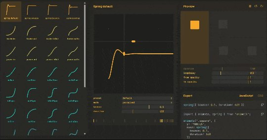
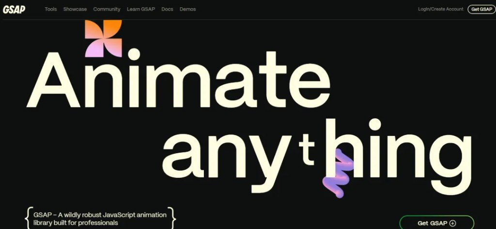
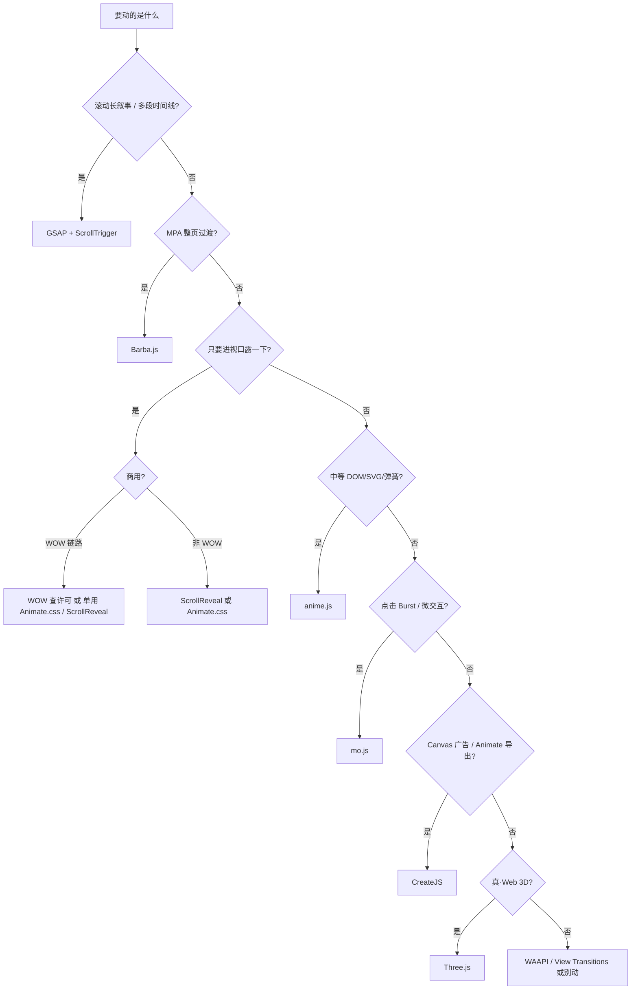

站点一要「炫」，搜索结果就甩出一堆库名。真正费钱的是同一区块叠两套引擎、商用许可没查、以及用 Three.js 去拧按钮。下面这张表 + 决策树够开工。

同系列旁链：[SVG 能动起来的十条路](/posts/svg-animation-ten-ways/)（手法文）· [小程序 Lottie](/posts/miniprogram-lottie-canvas/)（AE→JSON→canvas，不是 tween 库）。



## 十库选型表

| # | 方案 | 主场 | 体积/形态（原文口径） | 许可 / 坑 |
|---|---|---|---|---|
| 1 | **anime.js** v4 | CSS/SVG/DOM/对象；Scroll、spring、draggable | ESM、模块化按需 | 中等复杂度优先 |
| 2 | **GSAP** | Timeline + ScrollTrigger 滚动叙事 | 插件生态 | 文称 **2024 中 3.13+ 全插件免费**（以官网许可复核） |
| 3 | **Barba.js** | MPA 整页过渡 | ~7KB | 不是 SPA 路由动画替代品 |
| 4 | **ScrollReveal** | 进视口揭示 | 零依赖 | 编排复杂就换引擎 |
| 5 | **WOW.js** + Animate.css | 滚动触发 CSS 类 | 叠 Animate.css | **WOW 商用要商业许可** |
| 6 | **Animate.css** | 纯 CSS 预设 | 无 JS 运行时 | 只够简单进出场 |
| 7 | **Velocity.js** | jQuery `.animate` 升级路径 | 语法近 jQuery | 新项目少见首选 |
| 8 | **mo.js** | Burst 等 UI 微交互 / 矢量运动图形 | 微动效向 | 别当整站滚动导演 |
| 9 | **CreateJS** | Canvas、广告、Animate 导出 | Canvas 族 | DOM 动效不找它 |
| 10 | **Three.js** | Web 3D / WebGPU | 场景引擎 | 2D UI 别硬塞 |



## 先问场景，再点库名



存量 jQuery 动画迁出：才轮到 Velocity。新活默认别从它开场。

## anime vs GSAP：怎么二选一

| | anime.js | GSAP |
|---|---|---|
| 你在乎体积与上手 | 更轻，v4 ESM | 能力全，按需挂插件 |
| 滚动叙事 | 有 Scroll | **ScrollTrigger** 仍是主场 |
| 团队已有时间线肌肉 | 够用就别上重的 | 复杂编排更省事 |
| 许可 | 常规开源用法 | **3.13+ 插件免费化**后门槛下降（复核官网） |

经验法则：营销长页、钉住、scrub、跨组件导演 → GSAP；卡片/SVG/弹簧玩具感、不想背插件心智 → anime。


## 别踩的两处坑

1. **WOW.js 商用许可**——个人演示和商用站不是一回事；能只用 Animate.css / ScrollReveal 就少背一层风险。
2. **粘贴错乱别当真**——原文末段曾把 mo.js 列表夹进「上一代库 / 原生 API」；正确归位：mo.js = 微交互；WAAPI / View Transitions = 与库**组合**的原生层，不是第 11 个同级「炫库」。


## 趋势其实就两头

专业动效在变成可默认依赖的基础设施（GSAP 插件免费化是信号之一）；另一头是浏览器原生 **View Transitions / WAAPI** 吃掉一部分「为过渡而引库」。库还在，职责更窄。

本站（Firefly）侧对照一句即可：滚动与时间线能力偏 GSAP 一脉；页面过渡走 **Swup**，和 Barba 的 MPA 过渡同类问题、不同实现——选型时分清「滚动叙事」和「路由/整页过渡」，别混进同一引擎硬扛。

## GSAP 现已全员免费（附录）

同日另一篇公众号专讲许可拐点，差分钉在这里，不复读上面的十库对照。


官网顶栏写得很直白：`GSAP is now free for everyone, thanks to Webflow's support!`
文称 **2024** 全面免费（含原 Club 插件）；商业能不能用、有没有例外，仍以官网许可页为准，别拿转载当合同。

**短历程**：Flash 年代的 GreenSock → 迁到 JS / 现代 Web → 插件生态把 ScrollTrigger / MorphSVG / SplitText 做成标配技能树 → Webflow 托底后的免费里程碑。知道这条弧线，就能理解为什么「以前劝你先看预算」的说法过期了。

**还值一提的核心**（细节去官方 docs，别在笔记里背手册）：

- 性能取向贴着 `requestAnimationFrame`
- API 面：`to` / `from` / `fromTo`，目标可到 CSS / SVG / 普通对象
- Easing + **Timeline**（多段编排才是它吃饭的家伙）
- 跨 DOM / SVG / Canvas / 框架旁路
- 插件：ScrollTrigger、Draggable、MorphSVG、SplitText…

和 anime 怎么二选一，见上文「anime vs GSAP」——这里只补一句：免费化之后，**别再因为「Club 插件要钱」默认降级到轻量库**；体积与心智成本仍是真实约束。

**四个最短 snippet**（认 API 形状即可）：

```js
// ScrollTrigger
gsap.to(".box", {
  x: 200,
  scrollTrigger: { trigger: ".box", start: "top 80%", scrub: true },
});

// MorphSVG
gsap.to("#circle", { duration: 1, morphSVG: "#hippo" });

// SplitText
const split = new SplitText(".title", { type: "chars,words" });
gsap.from(split.chars, { y: 40, opacity: 0, stagger: 0.03 });

// Draggable
Draggable.create(".knob", { type: "x,y", bounds: ".stage" });
```

**资源**：[gsap.com/docs](https://gsap.com/docs)（旧 greensock.com/docs 多半会跳转）、官网 Forums / Community。写 GSAP 前先翻官方文档，别在中文二手安利里绕圈。
