## 一、MyBatis 基础与定位

## 1.1 MyBatis 是什么
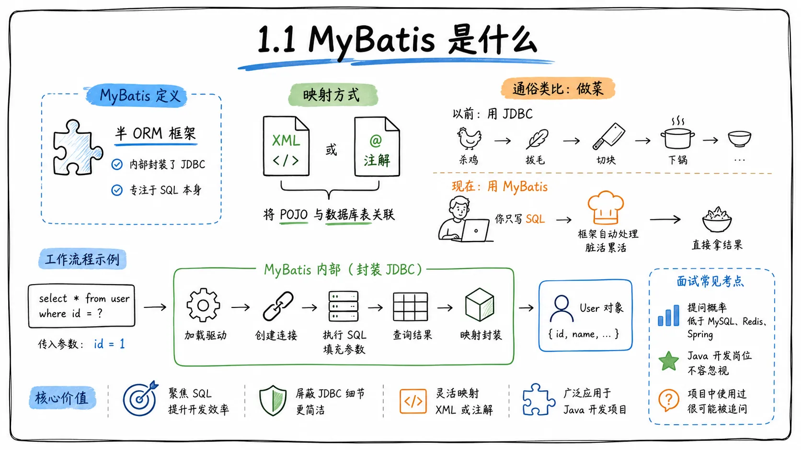

大家好，我是程序员丹尼尔。本视频总结 MyBatis 在计算机校园招聘面试中的常见考点，帮助大家理清知识脉络。面试中 MyBatis 的提问概率不如 MySQL、Redis、Spring 高，但在 Java 开发岗位中依然不容忽视，尤其是项目中使用过 MyBatis 时，面试官很可能追问。

MyBatis 是一个**半 ORM 框架**，内部封装了 JDBC，开发时只需关注 SQL 语句本身，无需加载驱动、创建连接等复杂过程。通过 XML 或注解配置映射，将 POJO 与数据库表关联。通俗地说，以前用 JDBC 操作数据库就像做菜要自己杀鸡、拔毛、切块、下锅，而现在有了 MyBatis，你只需写 SQL，后厨（框架）自动处理脏活累活，你只管拿结果。

例如，写一个 `select * from user where id = ?`，MyBatis 自动填参数，查出数据自动封装到 User 对象中。

## 1.2 JDBC 的不足与 MyBatis 的解决
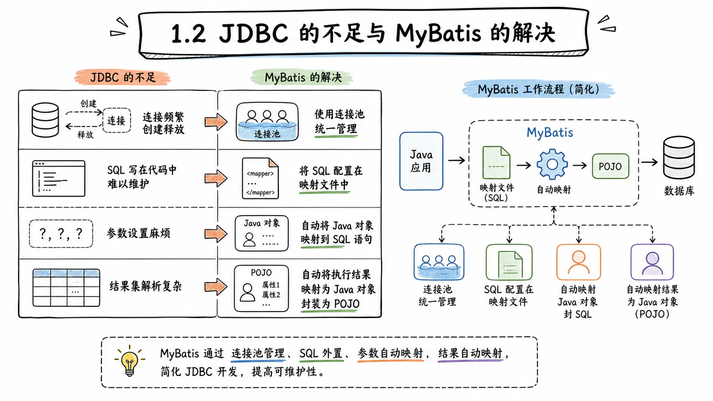

- **连接频繁创建释放**：MyBatis 使用连接池统一管理。
- **SQL 写在代码中难以维护**：MyBatis 将 SQL 配置在映射文件中。
- **参数设置麻烦**：MyBatis 自动将 Java 对象映射到 SQL 语句。
- **结果集解析复杂**：MyBatis 自动将执行结果映射为 Java 对象，封装为 POJO。

## 1.3 MyBatis 与 Hibernate 对比
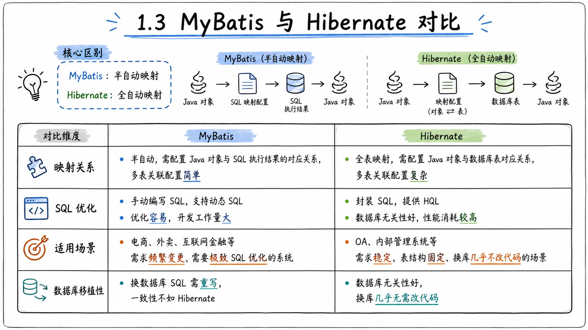

如果面试官问到两者的区别，抓住核心点：**MyBatis 是半自动映射，Hibernate 是全自动映射**。

| 对比维度 | MyBatis | Hibernate |
| --- | --- | --- |
| 映射关系 | 半自动，需配置 Java 对象与 SQL 执行结果的对应关系，多表关联配置简单 | 全表映射，需配置 Java 对象与数据库表对应关系，多表关联配置复杂 |
| SQL 优化 | 手动编写 SQL，支持动态 SQL，优化容易，开发工作量大 | 封装 SQL，提供 HQL，数据库无关性好，性能消耗较高 |
| 适用场景 | 电商、外卖、互联网金融等需求频繁变更、需要极致 SQL 优化的系统 | OA、内部管理系统等需求稳定、表结构固定、换库几乎不改代码的场景 |
| 数据库移植性 | 换数据库 SQL 需重写，一致性不如 Hibernate | 数据库无关性好，换库几乎无需改代码 |

## 二、核心配置与使用
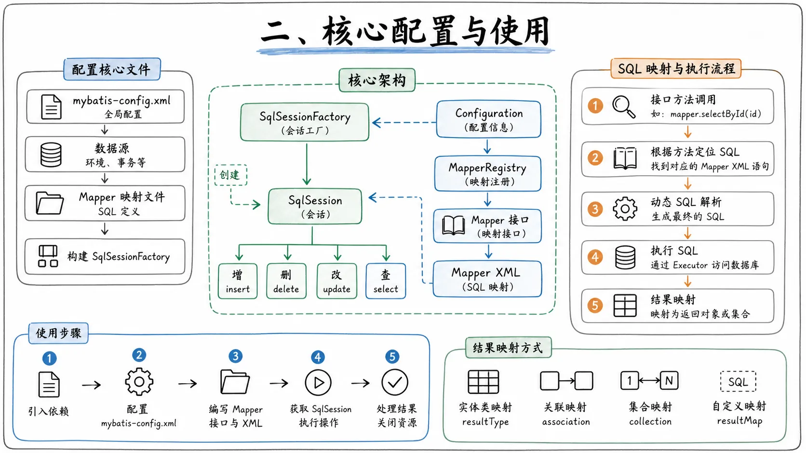

## 2.1 使用步骤
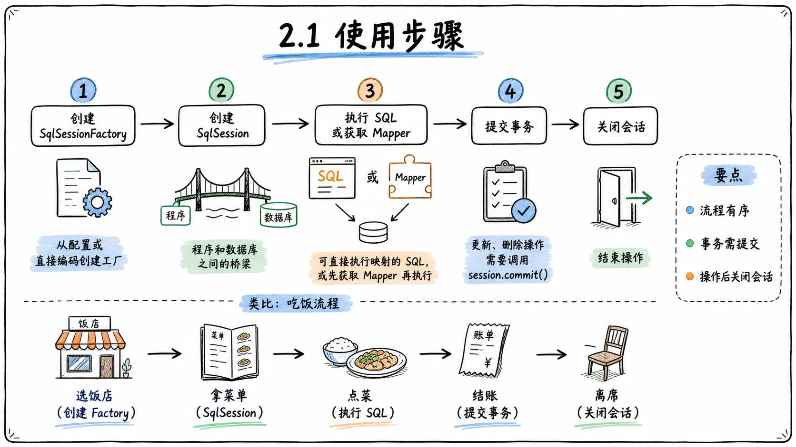

1. **创建 SqlSessionFactory**：从配置或直接编码创建工厂。
2. **创建 SqlSession**：通过工厂创建，可理解为程序和数据库之间的桥梁。
3. **执行 SQL 或获取 Mapper**：可直接执行映射的 SQL，或先获取 Mapper 再执行。
4. **提交事务**：更新、删除操作需要调用 `session.commit()`。
5. **关闭会话**：结束操作。

类比吃饭流程：选饭店（创建 Factory）→ 拿菜单（SqlSession）→ 点菜（执行 SQL）→ 结账（提交事务）→ 离席（关闭会话）。

## 2.2 组件生命周期
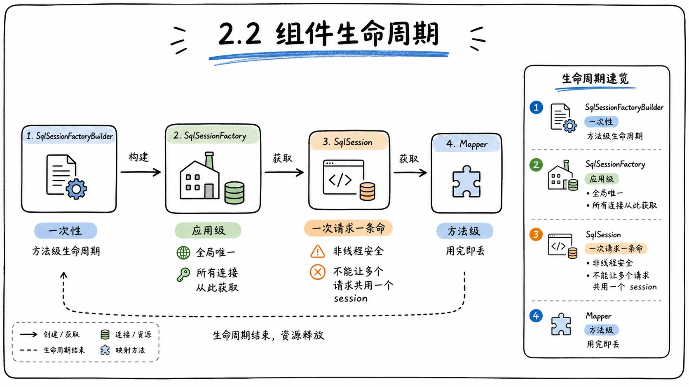

- **SqlSessionFactoryBuilder**：一次性，方法级生命周期。
- **SqlSessionFactory**：应用级，全局唯一，所有连接从此获取。
- **SqlSession**：一次请求一条命，**非线程安全**，不能让多个请求共用一个 session。
- **Mapper**：方法级，用完即丢。

## 2.3 传递多个参数
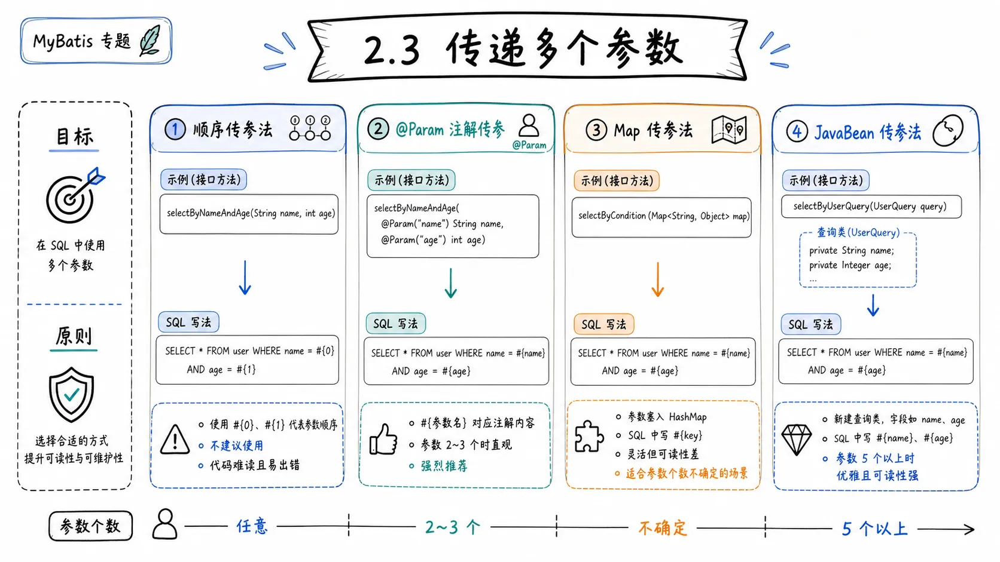

- **顺序传参法**：使用 `#{0}`、`#{1}` 代表参数顺序，不建议使用，代码难读且易出错。
- **@Param 注解传参**：`#{参数名}` 对应注解内容，参数 2~3 个时直观，强烈推荐。
- **Map 传参法**：参数塞入 HashMap，SQL 中写 `#{key}`，灵活但可读性差，适合参数个数不确定的场景。
- **JavaBean 传参法**：新建查询类，字段如 name、age，SQL 中写 `#{name}`、`#{age}`。参数 5 个以上时优雅且可读性强。

## 2.4 实体类属性与字段名不一致
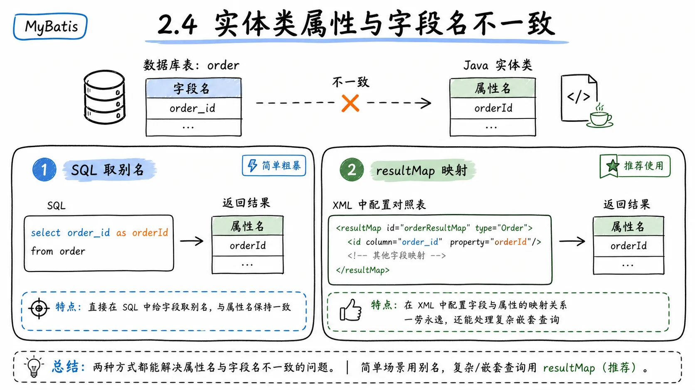

例如数据库字段 `order_id`，Java 属性 `orderId`。

- **SQL 取别名**：`select order_id as orderId from order`，简单粗暴。
- **resultMap 映射**：在 XML 中配置对照表，一劳永逸，还能处理复杂嵌套查询，推荐使用。

## 2.5 枚举映射
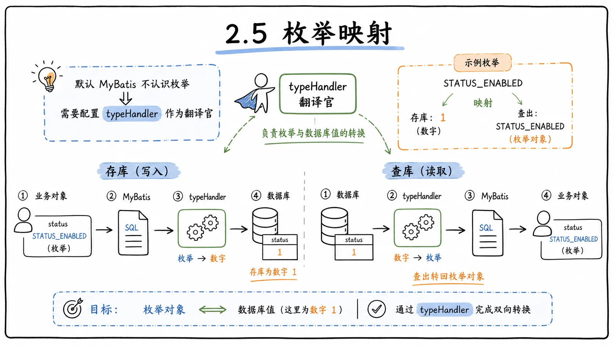

默认 MyBatis 不认识枚举，需要配置 `typeHandler` 作为翻译官。例如枚举 `STATUS_ENABLED` 存库转数字 1，查出来转回枚举对象。

## 2.6 #{} 与 ${} 的区别（面试高频）
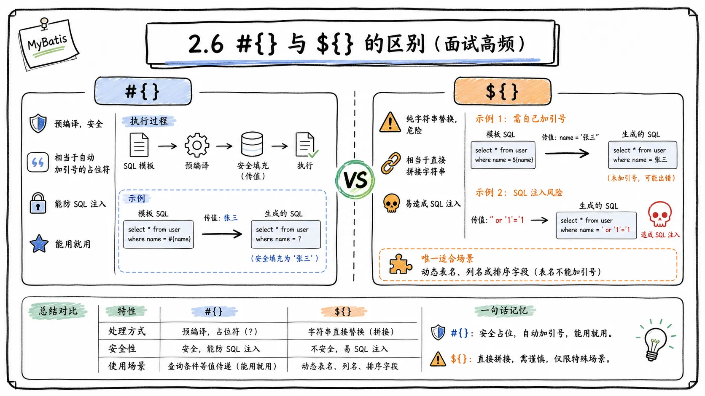

- **#{}**：预编译，安全，相当于自动加引号的占位符。SQL 变成 `where name = ?`，传值“张三”后安全填充，能防 SQL 注入，**能用就用**。
- **${}**：纯字符串替换，危险，相当于直接拼接字符串。如传 `name = '张三'`，SQL 直接变成 `where name = 张三`，需自己加引号；若用户传 `' or '1'='1`，则造成 SQL 注入。**唯一适合场景**：动态表名、列名或排序字段（表名不能加引号）。

## 2.7 模糊查询 LIKE 写法
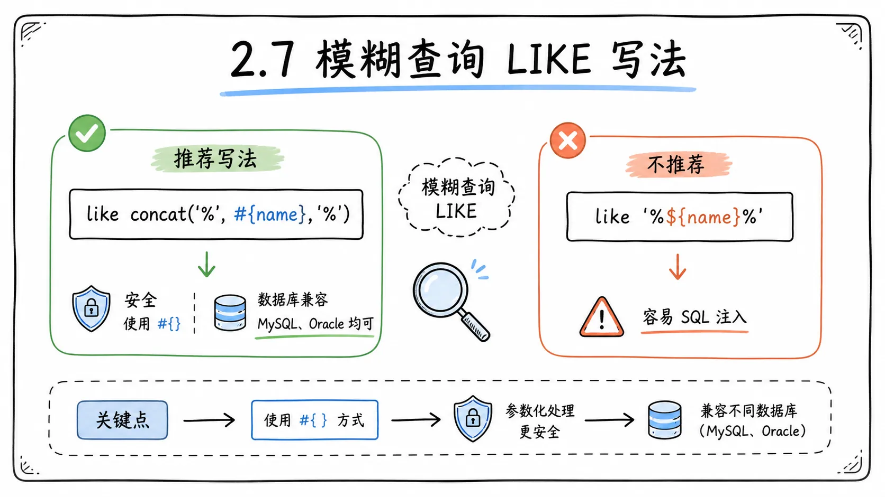

推荐写法：`like concat('%', #{name}, '%')`，使用 `#{}` 安全且数据库兼容（MySQL、Oracle 均可）。不推荐：`like '%${name}%'`，容易 SQL 注入。

## 2.8 获取生成主键
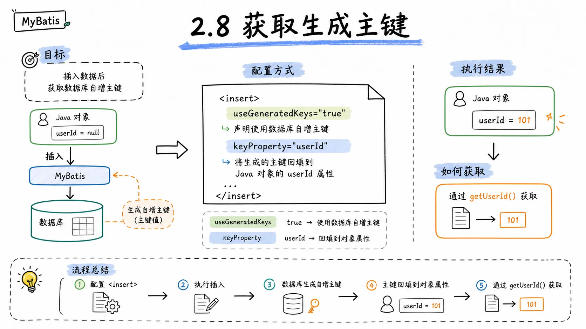

插入数据后获取数据库自增主键：在 `<insert>` 标签中加两个属性：

- `useGeneratedKeys="true"`：声明使用数据库自增主键。
- `keyProperty="userId"`：将生成的主键回填到 Java 对象的 userId 属性。

插入完成后通过 `getUserId()` 即可获取。

## 2.9 全局配置 settings
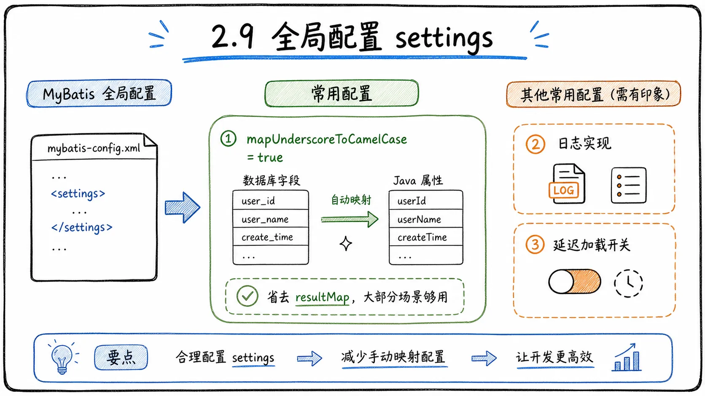

常用配置：`mapUnderscoreToCamelCase` 设为 `true`，数据库下划线字段自动映射为 Java 驼峰属性，省去 resultMap，大部分场景够用。其他常用配置有：日志实现、延迟加载开关等，需有印象。

## 三、动态 SQL
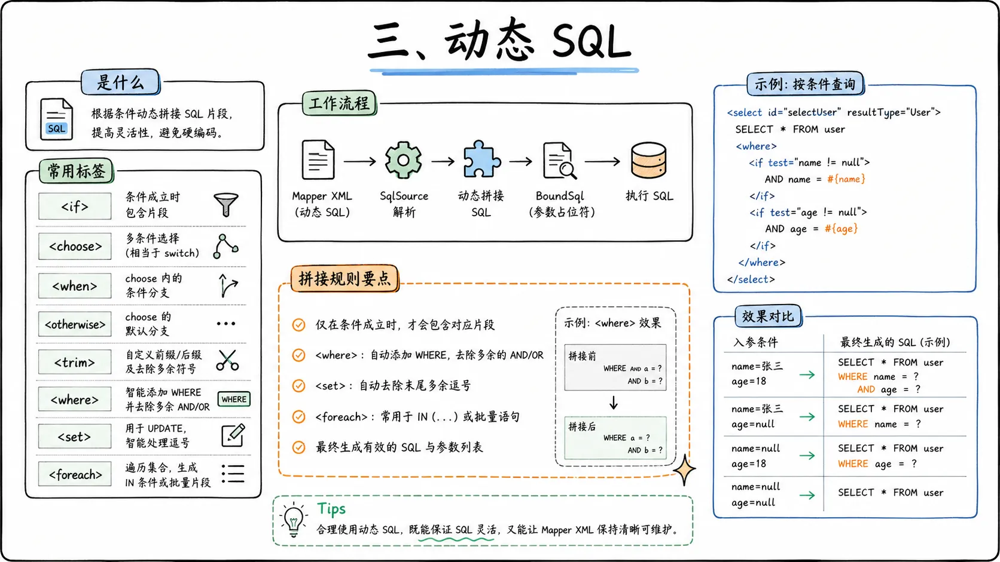

## 3.1 动态 SQL 概述
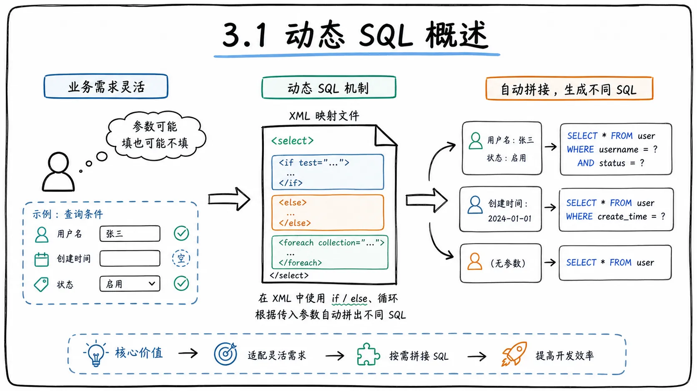

业务需求灵活，用户可能填也可能不填参数。动态 SQL 允许在 XML 中写 if/else、循环，根据传入参数自动拼出不同 SQL。

## 3.2 常用动态 SQL 标签
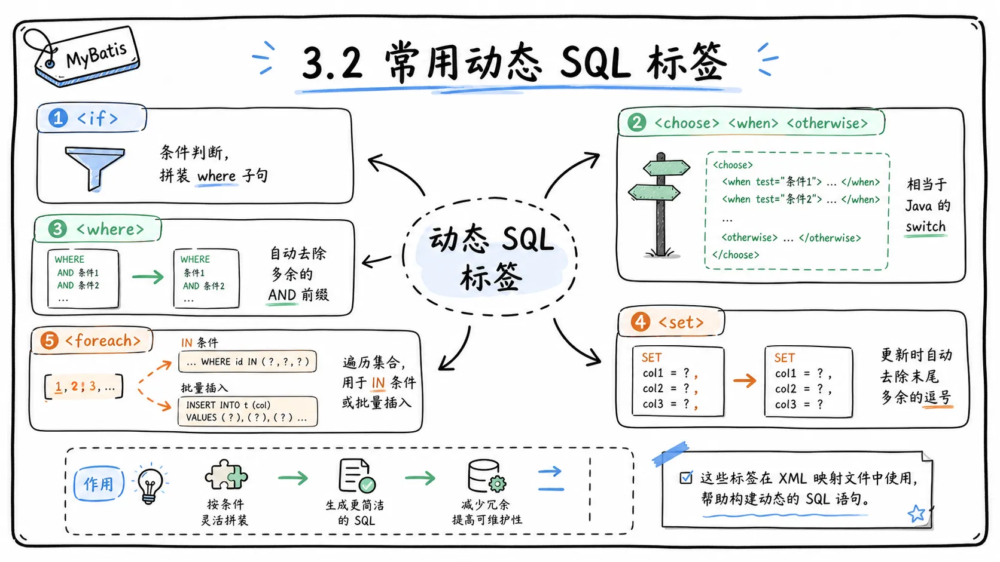

- `<if>`：条件判断，拼装 where 子句。
- `<choose> <when> <otherwise>`：相当于 Java 的 switch。
- `<where>`：自动去除多余的 `AND` 前缀。
- `<set>`：更新时自动去除末尾多余的逗号。
- `<foreach>`：遍历集合，用于 IN 条件或批量插入。

## 3.3 foreach 标签属性
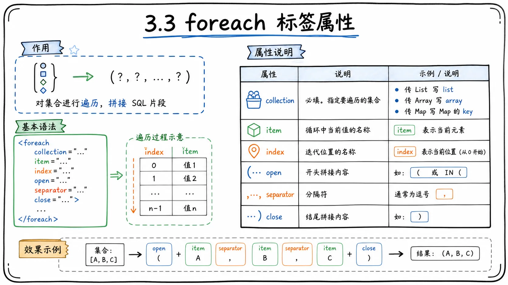

- `collection`：必填。传 List 写 `list`，传 Array 写 `array`，传 Map 写 Map 的 key。
- `item`：循环中当前值的名称。
- `index`：迭代位置的名称。
- `open` / `close`：开头和结尾拼接内容。
- `separator`：分隔符，通常为逗号。

## 3.4 OGNL 表达式
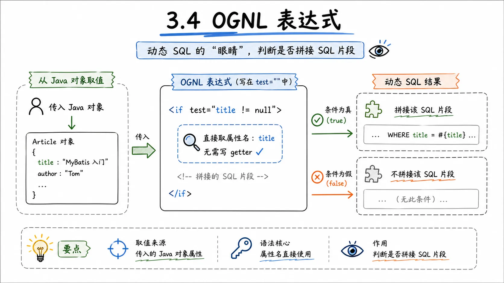

写在 `test=""` 中的取值语法，直接从传入 Java 对象中获取属性，如 `test="title != null"` 自动取 title 属性，无需写 getter。它是动态 SQL 的“眼睛”，判断是否拼接 SQL 片段。

## 四、缓存机制
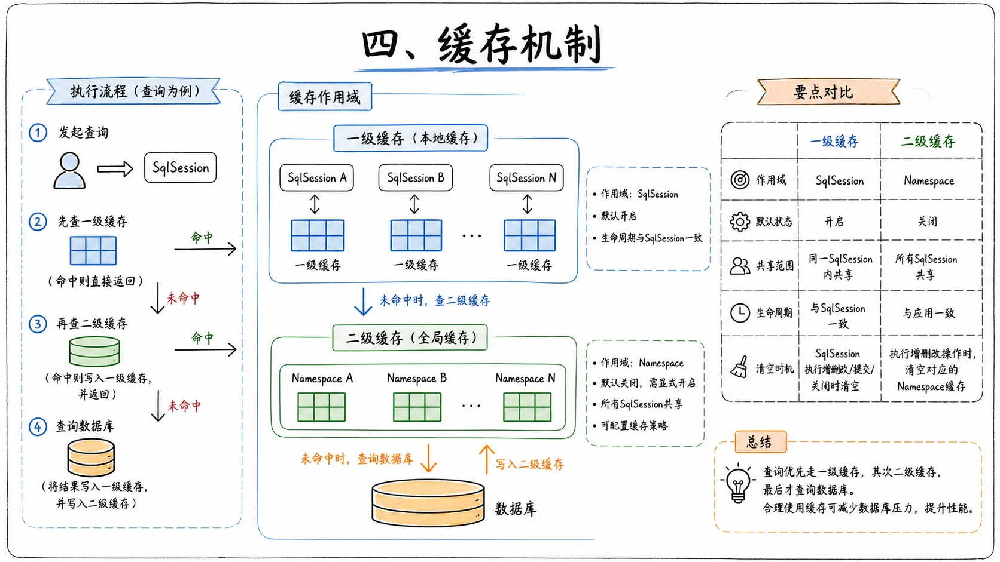

## 4.1 一级缓存
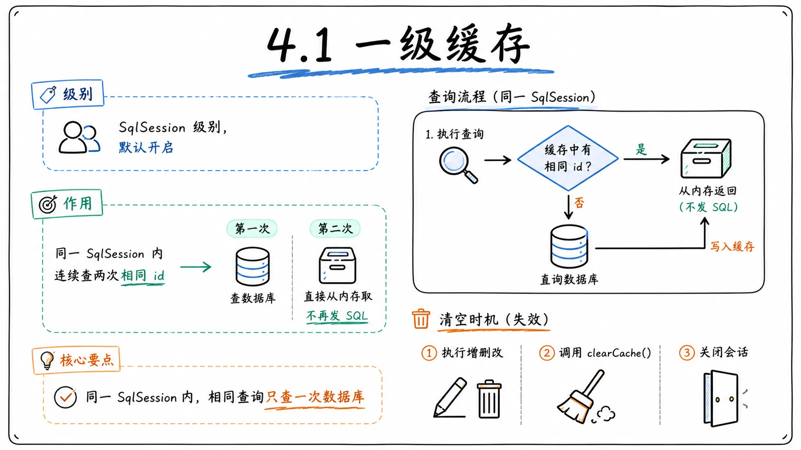

- **级别**：SqlSession 级别，默认开启。
- **作用**：同一 SqlSession 内连续查两次相同 id，第一次查数据库，第二次直接从内存取，不再发 SQL。
- **清空时机**：执行增删改、调用 `clearCache()` 或关闭会话时失效。

## 4.2 二级缓存
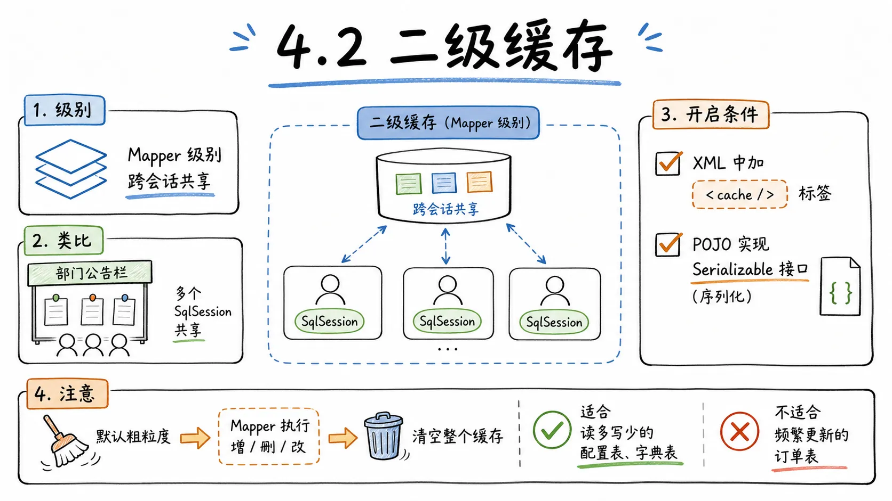

- **级别**：Mapper 级别，跨会话共享。
- **类比**：部门公告栏，多个 SqlSession 共享。
- **开启条件**：XML 中加 `<cache/>` 标签；POJO 实现 `Serializable` 接口（序列化）。
- **注意**：二级缓存默认粗粒度，Mapper 执行增删改就清空整个缓存。适合读多写少的配置表、字典表，不适合频繁更新的订单表。

## 4.3 共享缓存
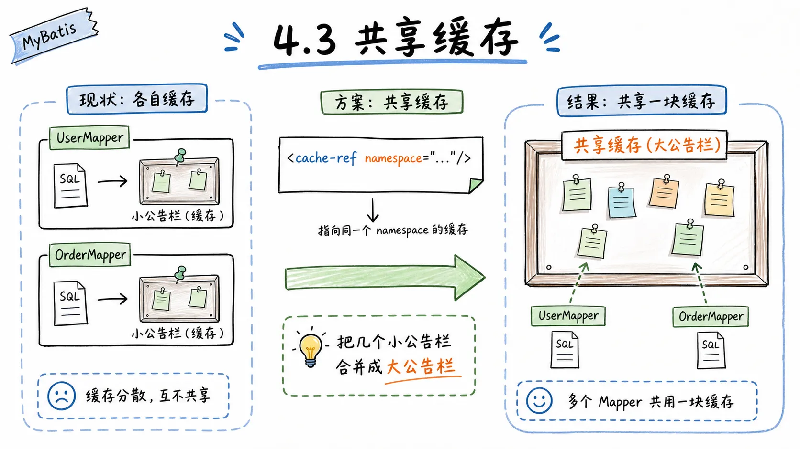

多个 Mapper 共用一块缓存，使用 `<cache-ref namespace="..."/>` 标签，把几个小公告栏合并成大公告栏。

## 五、插件、拦截器与分页
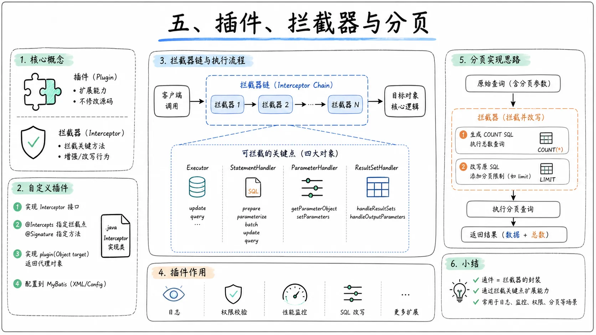

## 5.1 插件原理与四大对象
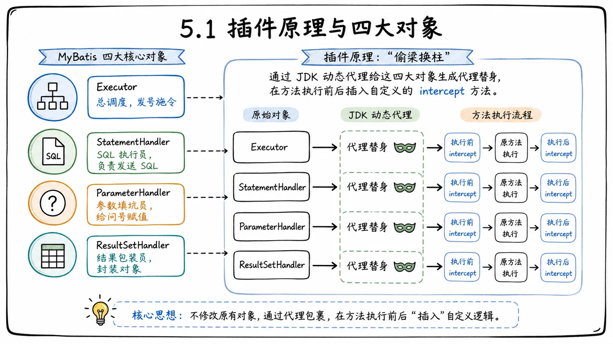

MyBatis 四大核心对象：

- **Executor**：总调度，发号施令。
- **StatementHandler**：SQL 执行员，负责发送 SQL。
- **ParameterHandler**：参数填坑员，给问号赋值。
- **ResultSetHandler**：结果包装员，封装对象。

插件原理：通过 JDK 动态代理给这四大对象生成代理替身，在方法执行前后插入自定义的 `intercept` 方法，即“偷梁换柱”。

## 5.2 插件编写步骤
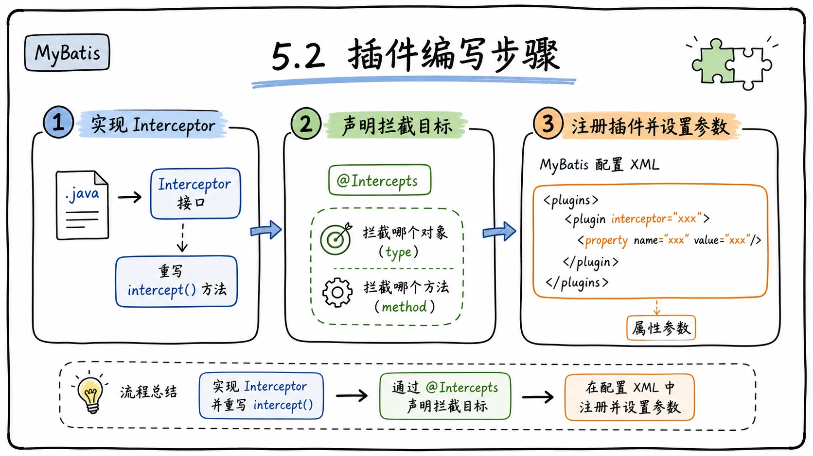

1. 写一个类实现 `Interceptor` 接口，重写 `intercept` 方法。
2. 加 `@Intercepts` 注解，指定拦截哪个对象的哪个方法。
3. 在 MyBatis 配置 XML 中注册插件并设置属性参数。

## 5.3 插件常用场景
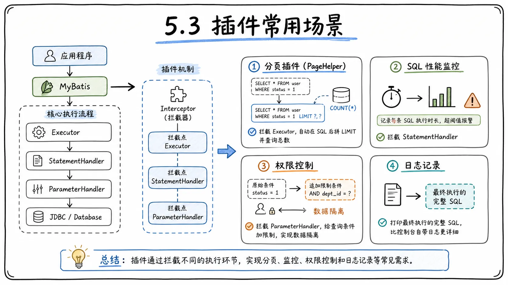

- **分页插件（PageHelper）**：最常用。拦截 Executor，自动在 SQL 后拼 `LIMIT` 并查询总数。
- **SQL 性能监控**：拦截 StatementHandler，记录每条 SQL 执行时长，超阈值报警。
- **权限控制**：拦截 ParameterHandler，偷偷给查询条件加限制，实现数据隔离。
- **日志记录**：打印最终执行的完整 SQL，比控制台自带日志更详细。

## 5.4 分页机制
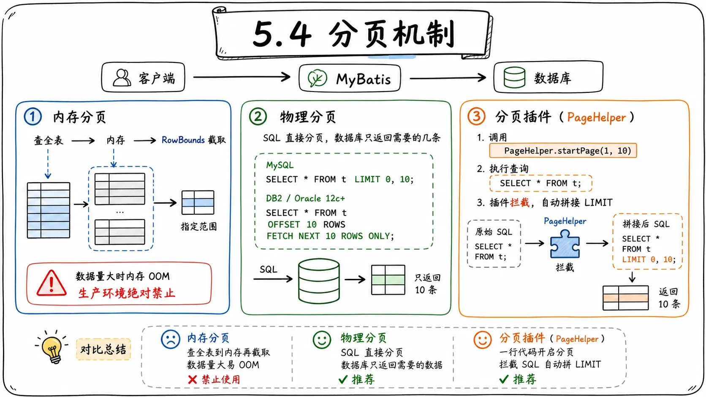

- **内存分页**：查全表到内存，再用 RowBounds 截取指定范围。类似把整只烤全羊端上桌再切，数据量大时内存 OOM，**生产环境绝对禁止**。
- **物理分页**：SQL 直接写 `LIMIT 0, 10` 或 `OFFSET 10 ROWS FETCH NEXT 10 ROWS ONLY`，数据库只返回需要的几条。
- **分页插件**：使用 PageHelper，调用 `PageHelper.startPage(1, 10)`，插件拦截 SQL 自动拼 `LIMIT`。

## 六、工作原理与动态代理
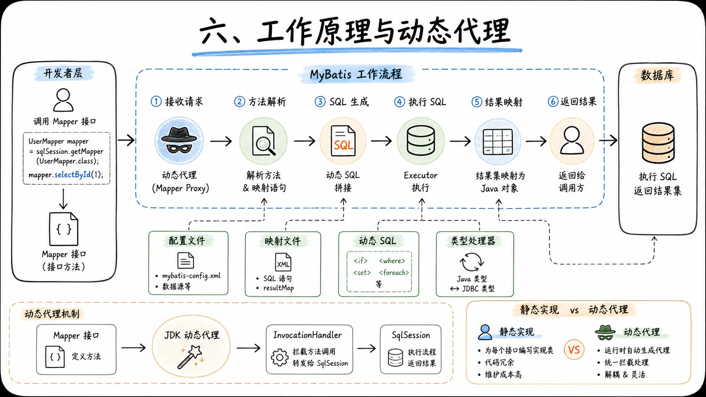

## 6.1 工作原理概述
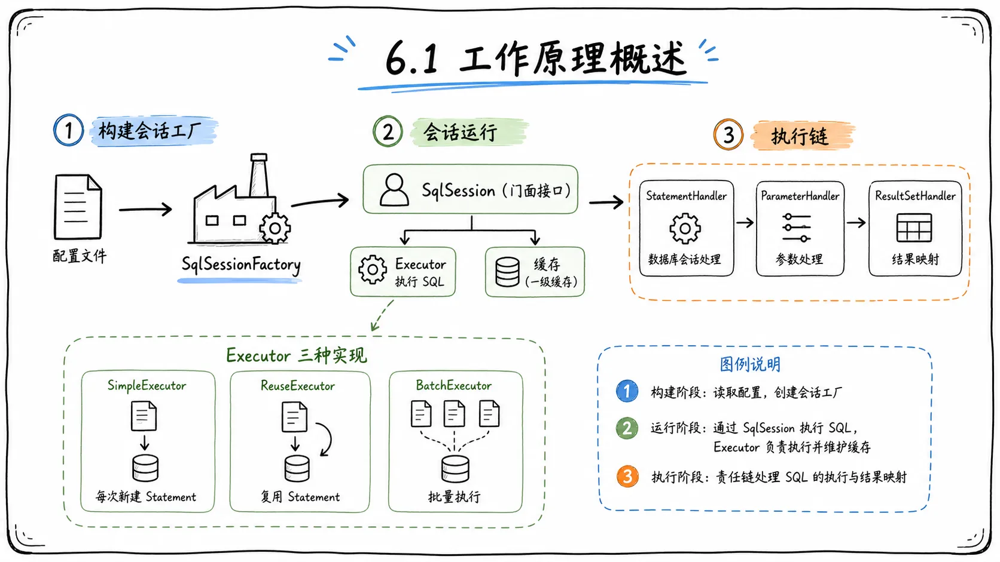

1. **构建会话工厂**：读取配置文件，构建 `SqlSessionFactory`。
2. **会话运行**：`SqlSession` 是门面接口，内部通过 Executor 执行 SQL 并维护缓存。Executor 有 SimpleExecutor、ReuseExecutor、BatchExecutor 三种，分别对应每次新建 Statement、复用 Statement、批量执行。
3. **执行链**：StatementHandler 负责数据库会话处理，ParameterHandler 负责参数处理，ResultSetHandler 负责结果映射。

## 6.2 功能架构
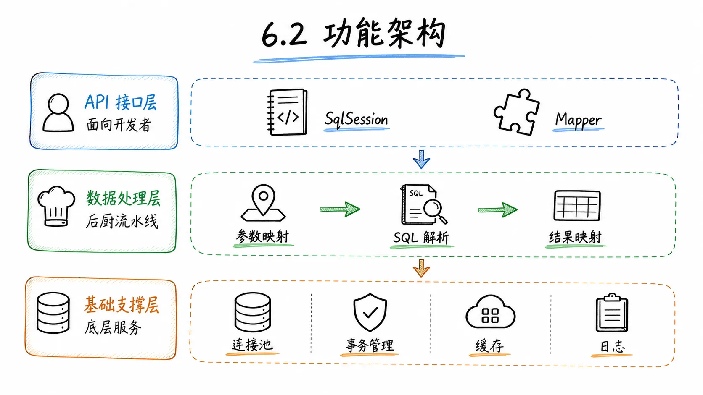

- **API 接口层**：面向开发者，如 SqlSession、Mapper。
- **数据处理层**：后厨流水线，包括参数映射、SQL 解析、结果映射。
- **基础支撑层**：底层服务，如连接池、事务管理、缓存、日志。

## 6.3 Mapper 接口与动态代理
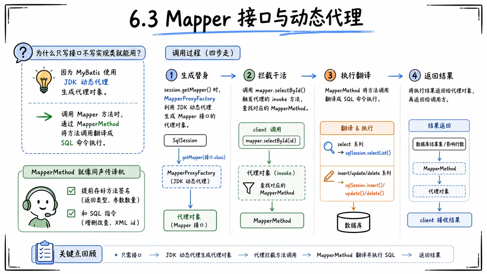

为什么只写接口不写实现类就能用？因为 MyBatis 使用 JDK 动态代理生成代理对象。调用 Mapper 方法时，通过 `MapperMethod` 将方法调用翻译成 SQL 命令执行。

调用过程：

1. **生成替身**：`session.getMapper()` 时，`MapperProxyFactory` 利用 JDK 动态代理生成 Mapper 接口的代理对象。
2. **拦截干活**：调用 `mapper.selectById()` 触发代理的 `invoke` 方法，查找对应的 `MapperMethod`。
3. **执行翻译**：`MapperMethod` 将方法调用翻译成 SQL 命令，如 select 调 `sqlSession.selectList()`，insert 调 `sqlSession.insert()`。
4. **返回结果**。

`MapperMethod` 就像同声传译机，提前存好方法签名（返回类型、参数数量）和 SQL 指令（增删改查、XML id）。

## 七、关联查询与延迟加载
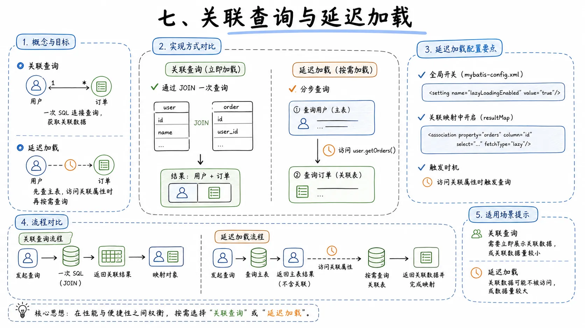

## 7.1 一对一关联 association
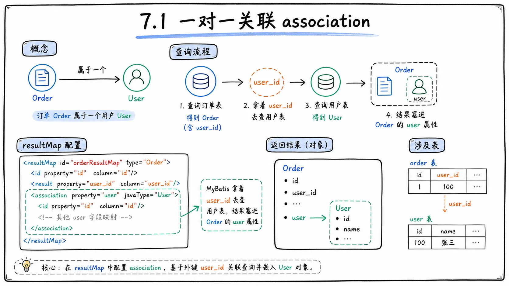

订单 Order 属于一个用户 User，查询订单时带上用户信息。在 resultMap 中配置：

```xml
<association property="user" javaType="User" column="user_id" select="selectUserById"/>
```

MyBatis 拿着 `user_id` 去查用户表，结果塞进 Order 的 user 属性。

## 7.2 一对多关联 collection
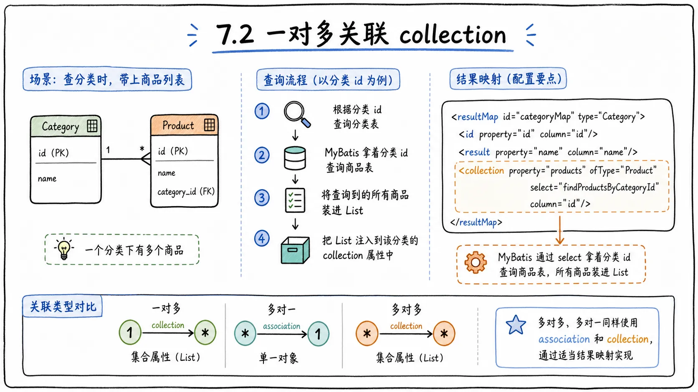

分类 Category 下有多个商品 Product，查分类时带上商品列表。配置：

```xml
<collection property="products" ofType="Product" column="id" select="selectProductByCategoryId"/>
```

MyBatis 拿着分类 id 查商品表，所有商品装进 List。

多对多、多对一同样使用 association 和 collection，通过适当结果映射实现。

## 7.3 延迟加载
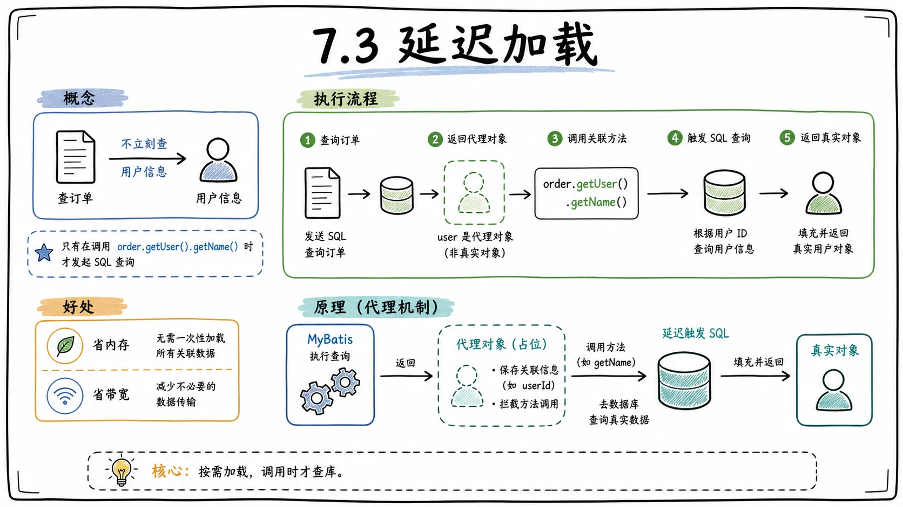

懒加载：查订单时不立刻查用户信息，等真正调用 `order.getUser().getName()` 时才发 SQL 查询。好处是省内存和带宽。原理是 MyBatis 返回的不是真实对象，而是代理对象，一调用方法才去查库。

## 7.4 嵌套查询与嵌套结果
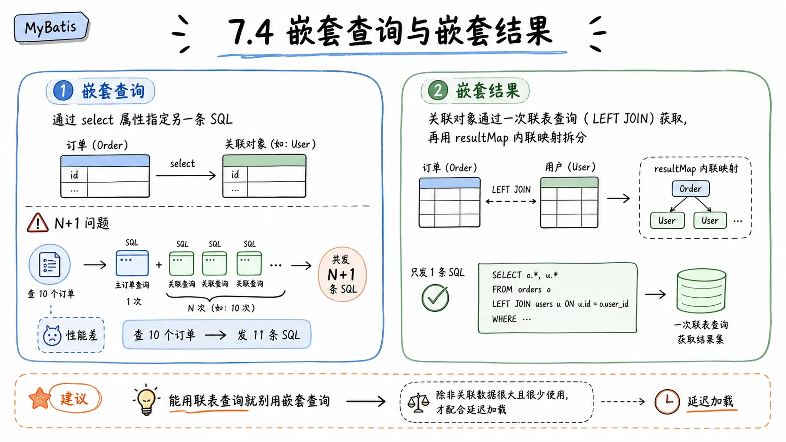

- **嵌套查询**：通过 `select` 属性指定另一条 SQL，存在 **N+1 问题**：查 1 条主订单 + N 次关联查询，查 10 个订单要发 11 条 SQL，性能差。
- **嵌套结果**：关联对象通过一次联表查询（LEFT JOIN）获取，再用 resultMap 内联映射拆分。**能用联表查询就别用嵌套查询**，除非关联数据很大且很少使用，才配合延迟加载。

## 八、面试常考点补充
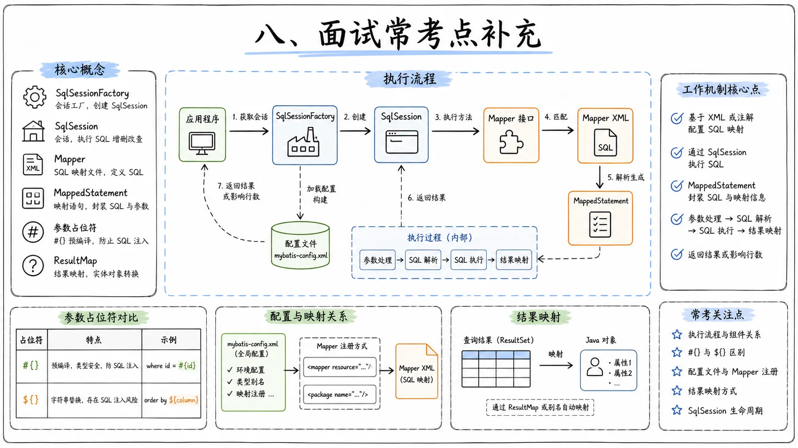

## 8.1 默认别名
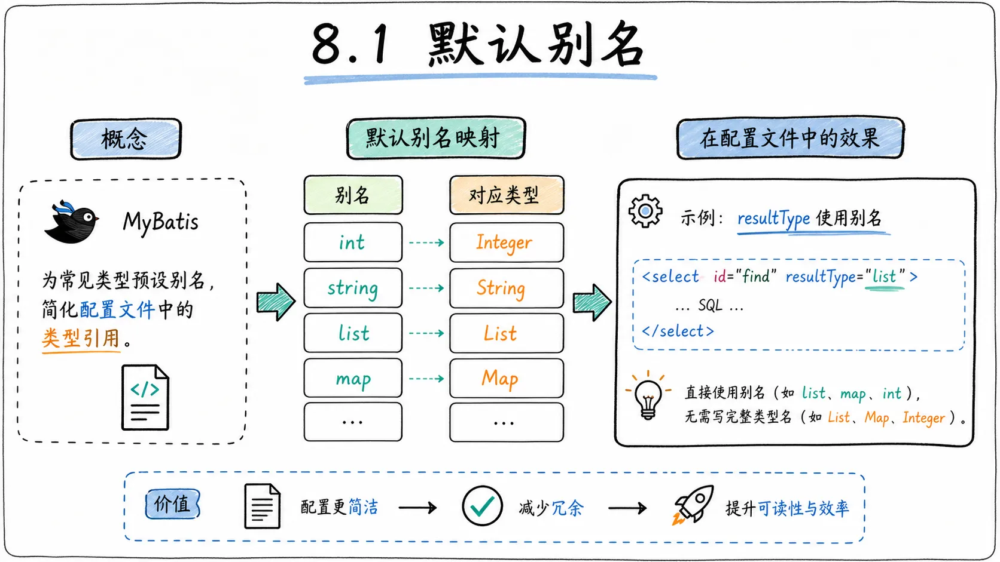

MyBatis 为常见类型预设别名：`int`→`Integer`、`string`→`String`、`list`→`List`、`map`→`Map` 等，简化配置文件中的类型引用。

## 8.2 resultMap 高级用法
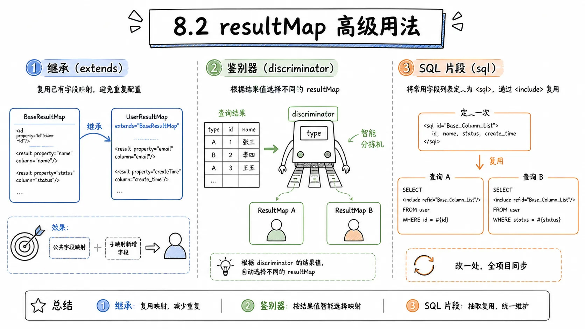

- **继承（extends）**：复用已有字段映射，避免重复配置。
- **鉴别器（discriminator）**：根据结果值选择不同的 resultMap，相当于智能分拣机。
- **SQL 片段（sql）**：将常用字段列表定义成 `<sql id="...">`，通过 `<include refid="..."/>` 复用，改一处全项目同步。

## 8.3 ObjectFactory
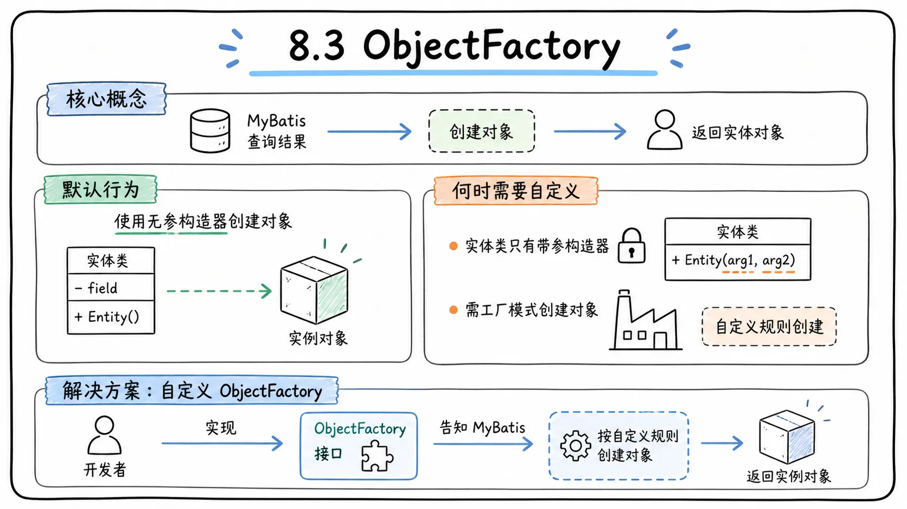

MyBatis 查完数据创建对象时默认使用无参构造器。如果实体类只有带参构造器或需工厂模式创建，需自定义实现 `ObjectFactory` 接口，告诉 MyBatis 按自己的规矩造对象。

## 8.4 环境配置与映射器注册
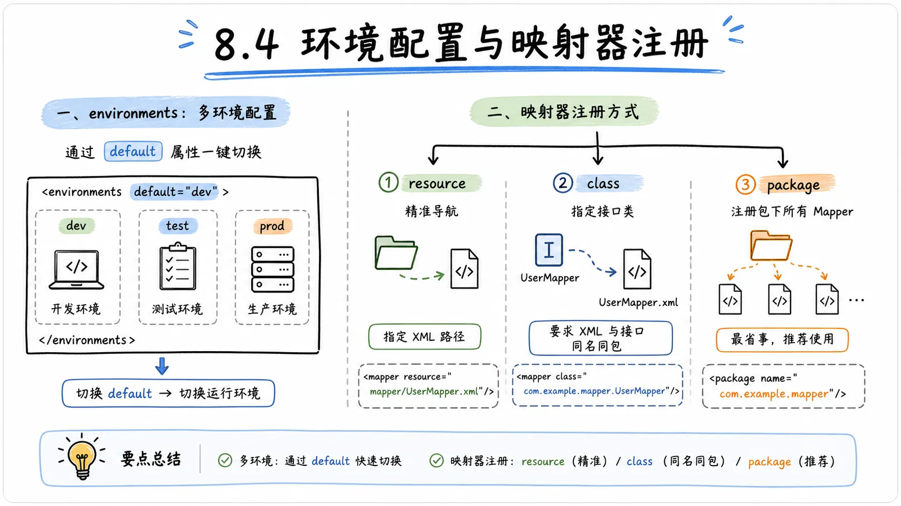

- **environments**：配置开发、测试、生产多环境，通过 `default` 属性一键切换。
- **映射器注册方式**：
  - `resource`：精准导航，指定 XML 路径。
  - `class`：指定接口类，要求 XML 与接口同名同包。
  - `package`：注册包下所有 Mapper，最省事，推荐使用。

## 8.5 与 Spring 集成
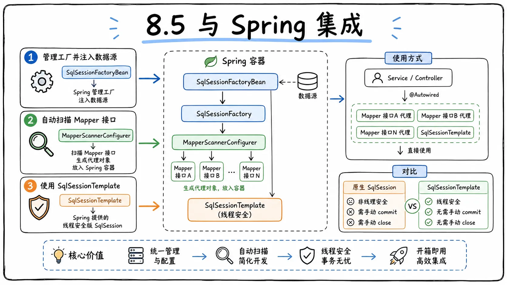

- 使用 `SqlSessionFactoryBean` 让 Spring 管理工厂并注入数据源。
- 使用 `MapperScannerConfigurer` 自动扫描 Mapper 接口，生成代理对象放入 Spring 容器，直接 `@Autowired` 使用。
- 使用 `SqlSessionTemplate`：Spring 提供的线程安全版 SqlSession，替代原生非线程安全版本，配合事务无需手动 commit 和 close。

## 8.6 日志配置
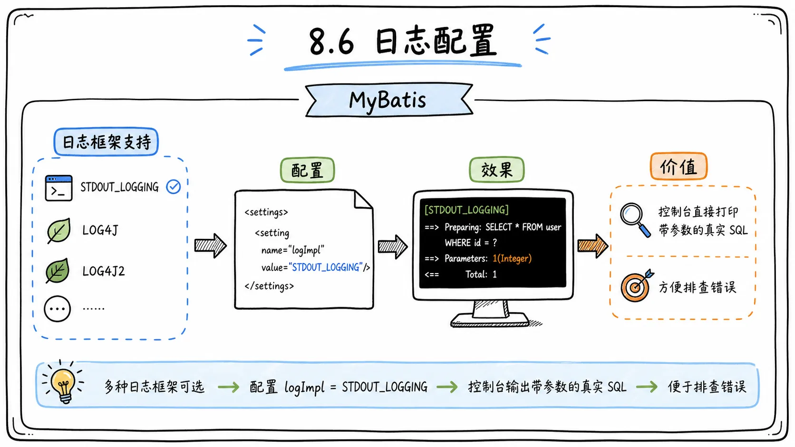

MyBatis 支持多种日志框架。配置 `logImpl=STDOUT_LOGGING` 后，控制台直接打印带参数的真实 SQL，方便排查错误。

## 8.7 Batch 模式注意事项
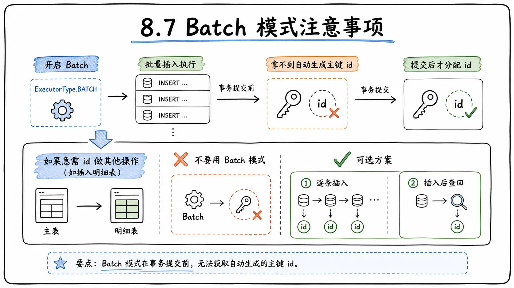

开启 `ExecutorType.BATCH` 批量插入时，事务提交前拿不到自动生成主键 id。如果急需 id 做其他操作（如插入明细表），不要用 Batch 模式，应逐条插入或查回。

## 8.8 延迟加载触发方法
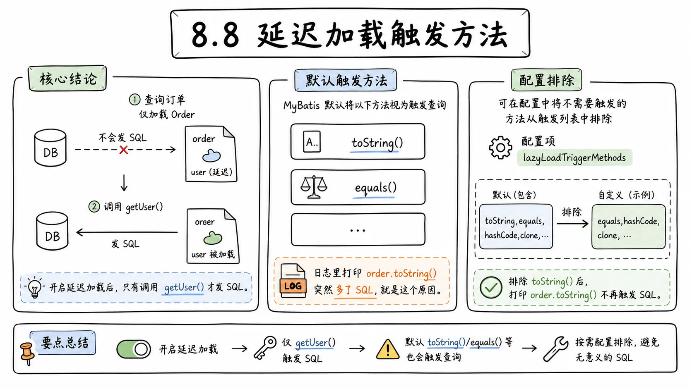

开启延迟加载后，只有调用 `getUser()` 才发 SQL。但 MyBatis 默认将 `toString()`、`equals()` 等方法也视为触发查询。如果日志里打印 `order.toString()` 突然多了 SQL，就是这个原因。可在配置中将 `toString()` 从触发列表中排除。

## 8.9 存储过程支持
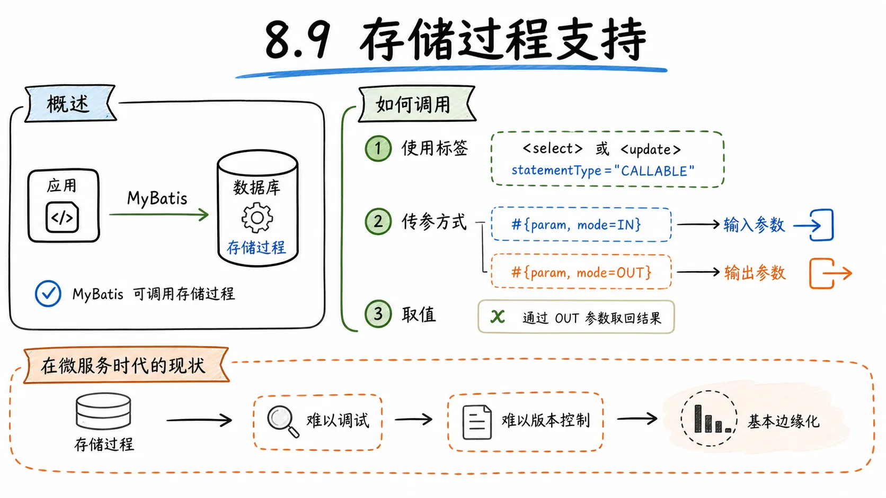

MyBatis 可调用存储过程，使用 `<select>` 或 `<update>` 标签中的 `statementType="CALLABLE"`，通过 `#{param, mode=IN}` 和 `#{param, mode=OUT}` 传参取值。微服务时代存储过程因难以调试、版本控制，基本边缘化。

## 8.10 数据库移植性
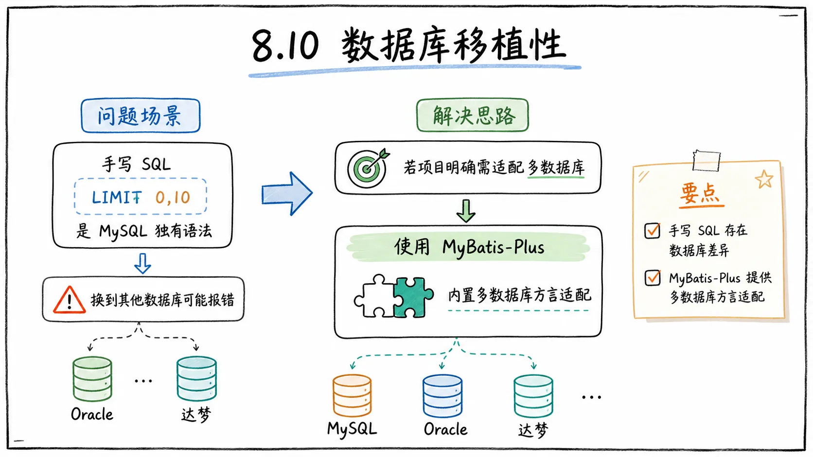

手写 SQL 如 `LIMIT 0,10` 是 MySQL 独有，换到 Oracle 或国产达梦可能报错。若项目明确需适配多数据库，可考虑 MyBatis-Plus，它内置多数据库方言适配。

## 8.11 MyBatis-Plus
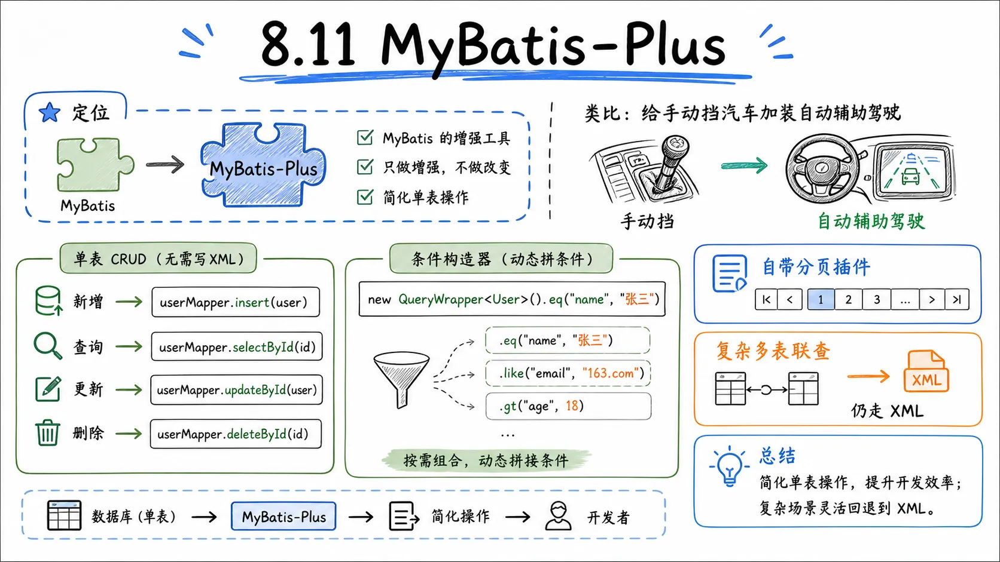

MyBatis-Plus 是 MyBatis 的增强工具，只做增强不做改变，简化单表操作。类似给手动挡汽车加装自动辅助驾驶。单表 CRUD 无需写 XML，直接 `userMapper.insert()`、`userMapper.selectById()`；条件构造器如 `new QueryWrapper<User>().eq("name", "张三")` 动态拼条件；自带分页插件。复杂多表联查仍走 XML。

## 8.12 命名空间
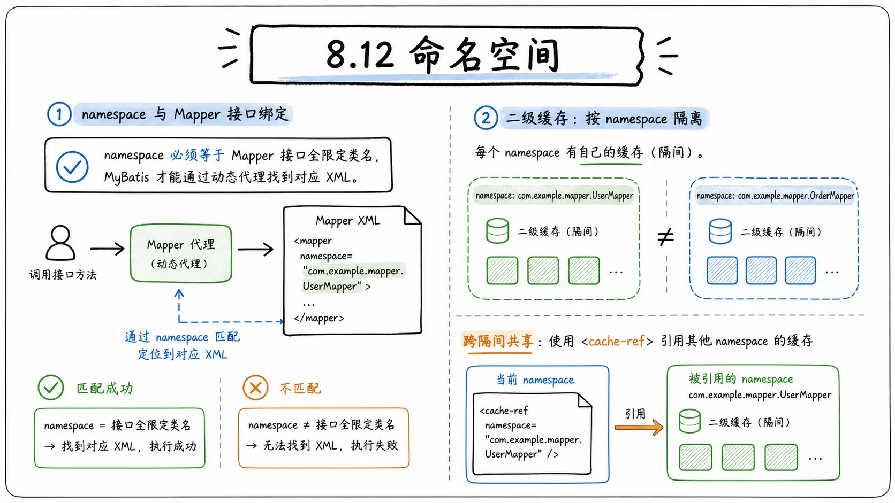

`namespace` 必须等于 Mapper 接口全限定类名，MyBatis 才能通过动态代理找到对应 XML。同时它是二级缓存的隔离隔间，每个 namespace 有自己的缓存；共享时使用 `<cache-ref>` 标签跨隔间取数据。

## 8.13 面试回答示例
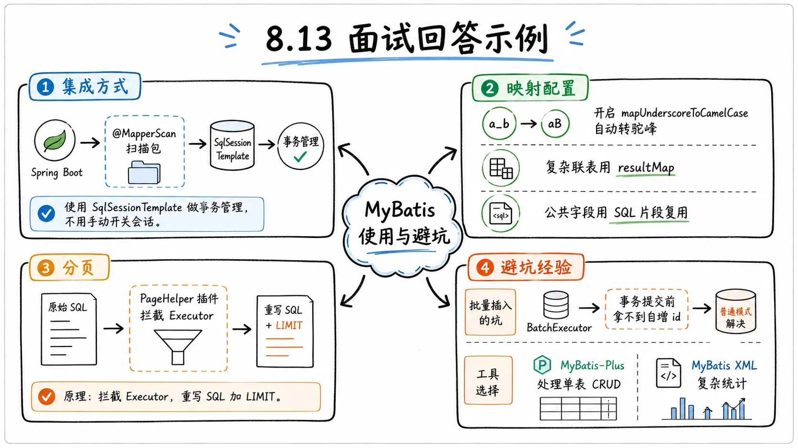

当面试官问“项目里 MyBatis 怎么用、有什么坑”，可参考：

- **集成方式**：Spring Boot + `@MapperScan` 扫描包，使用 `SqlSessionTemplate` 做事务管理，不用手动开关会话。
- **映射配置**：开启 `mapUnderscoreToCamelCase` 自动转驼峰，复杂联表用 resultMap，公共字段用 SQL 片段复用。
- **分页**：使用 PageHelper 插件，原理是拦截 Executor 重写 SQL 加 LIMIT。
- **避坑**：批量插入曾用 BatchExecutor，发现事务提交前拿不到自增 id，后改为普通模式；引入 MyBatis-Plus 处理单表 CRUD，复杂统计仍写 XML。

今天的内容就先到这边。
