## 内容概览
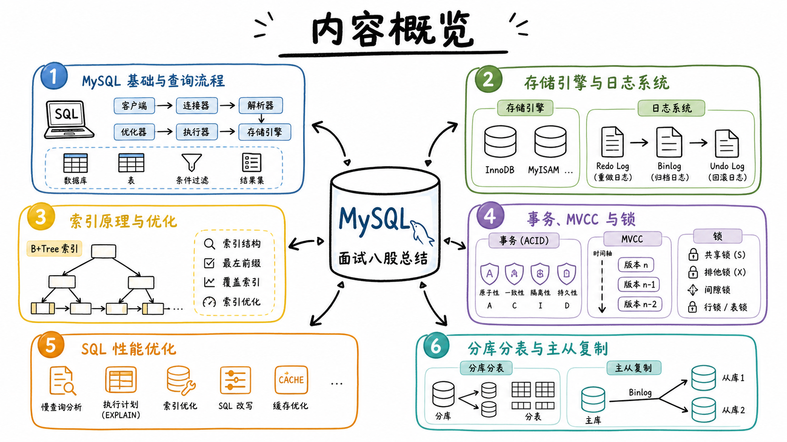

大家好，我是程序员Dan。今天主要和大家一起总结 MySQL 在计算机校园招聘面试过程中，经常被面试官问到的一些八股知识。

我之前讲过一版 MySQL 八股，但当时麦克风不太好，准备也不够充分，听起来不太顺畅，所以这次重新整理并录制一版。全文按照以下模块展开：

- MySQL 基础与查询流程
- 存储引擎与日志系统
- 索引原理与优化
- 事务、MVCC 与锁
- SQL 性能优化
- 分库分表与主从复制

## 一、MySQL 基础与存储引擎
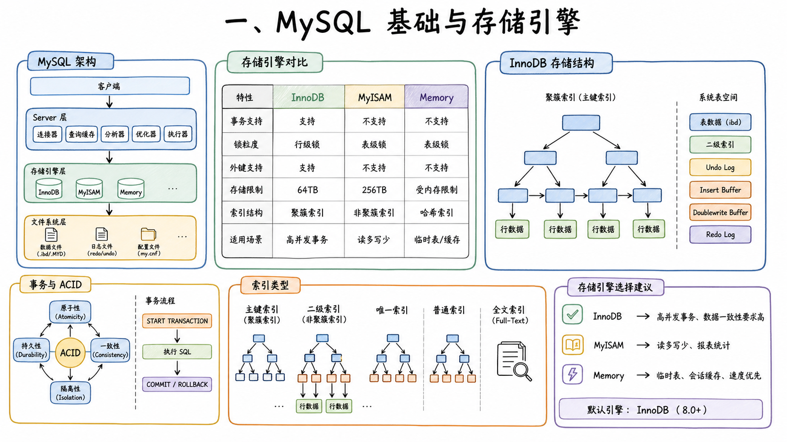

## 1. SQL 查询语句的执行流程
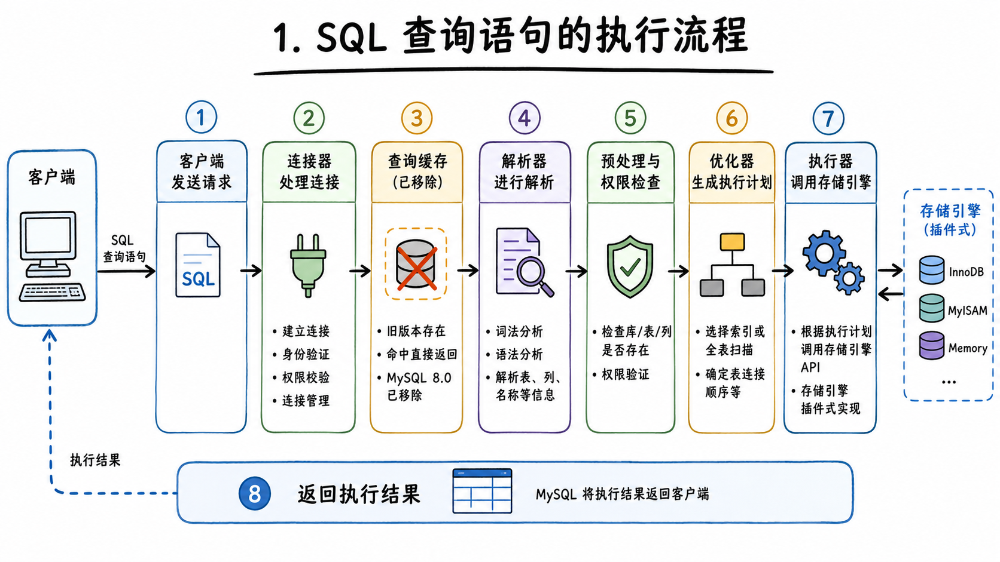

面试官可能会问：一条 SQL 语句进入 MySQL 后，内部会发生怎样的过程？

完整流程如下：

1. **客户端发送请求**

   客户端向 MySQL 服务器发送 SQL 查询语句。

2. **连接器处理连接**

   MySQL 的连接器处理请求，与客户端建立连接，并完成用户名、密码、权限等信息的校验，同时负责连接管理。Java 中通过 JDBC 或数据库连接池建立的连接，就会在这一阶段被处理。

3. **查询缓存**

   在旧版本 MySQL 中，如果查询缓存里存在完全相同的 SQL 及其查询结果，可以直接将结果返回客户端；如果没有命中，则进入下一阶段。

   > MySQL 8.0 已经移除了查询缓存，因此在当前版本中不再经过这一环节。

4. **解析器进行解析**

   解析器会进行词法分析和语法分析，检查 SQL 是否符合语法规则，并解析 SQL 中涉及的表、列和名称等信息。

5. **预处理与权限检查**

   MySQL 会检查引用的数据库、表和列是否存在，并进行相应的权限验证。

6. **优化器生成执行计划**

   优化器负责确定 SQL 的执行计划。例如，一条 `SELECT` 语句的 `WHERE` 条件中包含带索引的 `id`，优化器需要判断是使用索引，还是进行全表扫描。多表查询时，表之间的连接顺序也由优化器决定。

7. **执行器调用存储引擎**

   执行器根据执行计划，调用存储引擎提供的 API 进行数据读写。MySQL 的存储引擎采用插件式设计，不同存储引擎在具体实现上存在较大差异。

8. **返回执行结果**

   MySQL 将执行结果返回客户端，客户端收到查询结果后，本次查询结束。

## 2. MySQL 常用命令
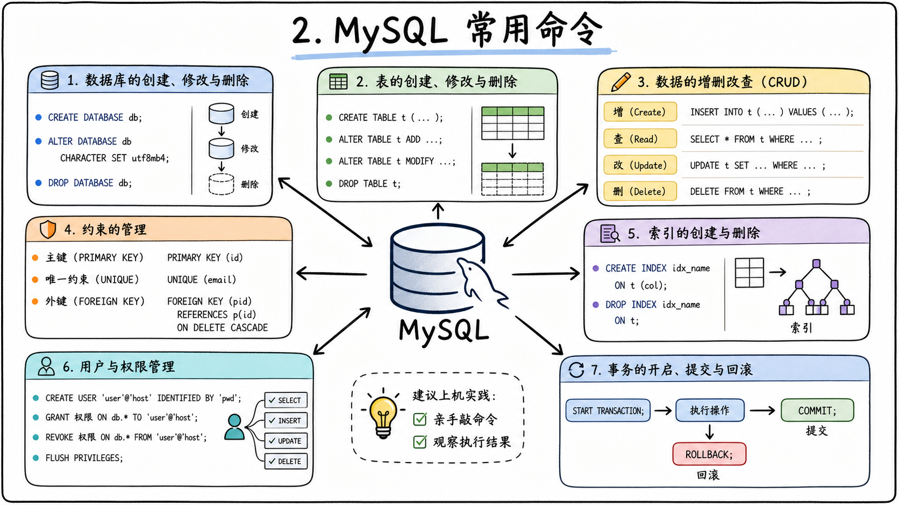

MySQL 的常用命令一定要掌握，主要包括：

- 数据库的创建、修改与删除
- 表的创建、修改与删除
- 数据的增删改查，即 CRUD
- 主键、唯一约束、外键等约束的管理
- 索引的创建与删除
- 用户与权限管理
- 事务的开启、提交与回滚

建议真正到电脑上手敲这些命令，并观察执行结果。相比单纯背诵，实际执行更有助于加深印象。

## 3. MySQL 的常见存储引擎
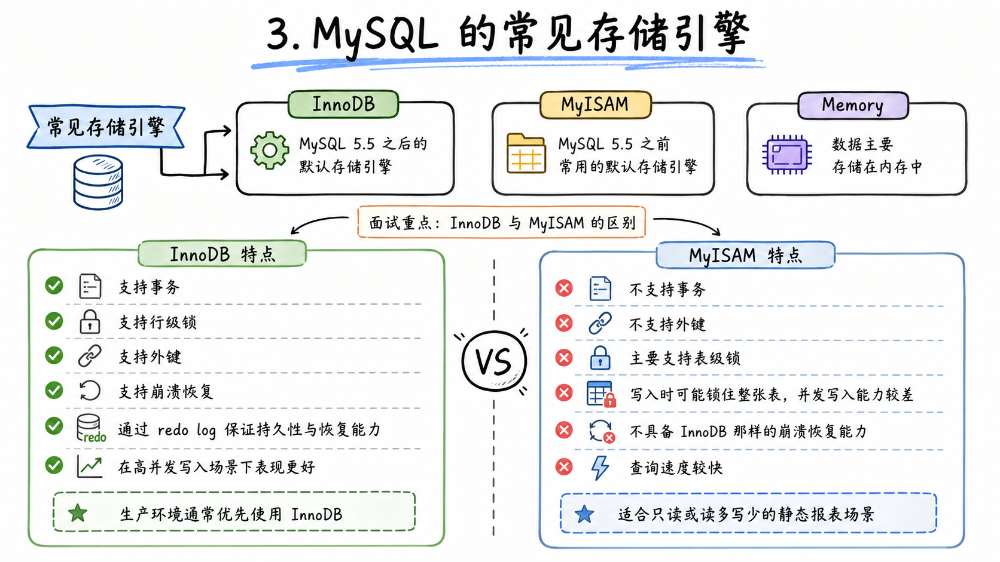

MySQL 支持多种存储引擎，常见的包括：

- **InnoDB**：MySQL 5.5 之后的默认存储引擎
- **MyISAM**：MySQL 5.5 之前常用的默认存储引擎
- **Memory**：数据主要存储在内存中

面试中最常问的是 InnoDB 与 MyISAM 的区别。

### InnoDB

InnoDB 具有以下特点：

- 支持事务
- 支持行级锁
- 支持外键
- 支持崩溃恢复
- 通过 redo log 保证持久性与恢复能力
- 在高并发写入场景下表现更好

目前生产环境通常优先使用 InnoDB。由于它支持行级锁，在高并发写入的情况下，并发性能通常比只支持表级锁的存储引擎更好。

### MyISAM

MyISAM 具有以下特点：

- 不支持事务
- 不支持外键
- 主要支持表级锁
- 写入时可能锁住整张表，并发写入能力较差
- 不具备 InnoDB 那样的崩溃恢复能力
- 查询速度较快

MyISAM 目前已经比较少用，更适合只读或读多写少的静态报表场景。

## 二、MySQL 日志系统
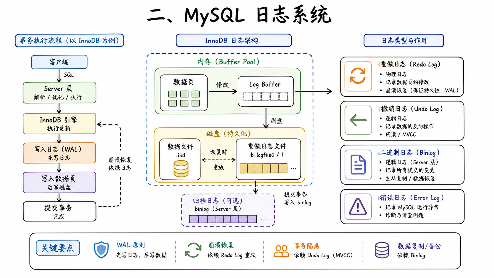

## 1. MySQL 有哪些日志
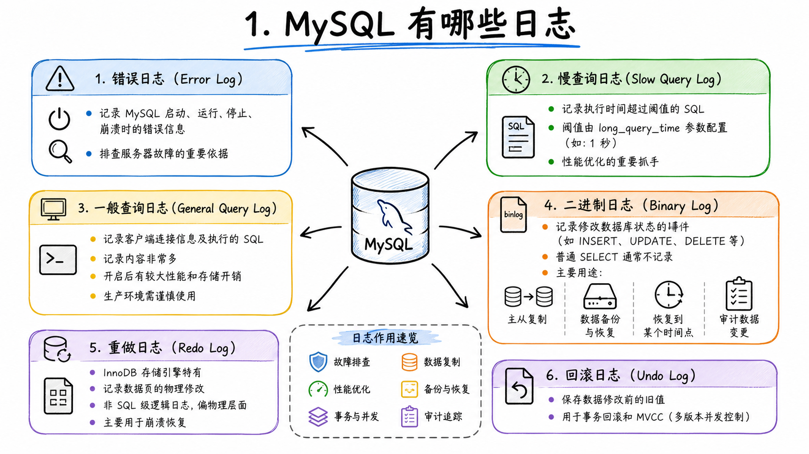

MySQL 中常见的日志包括以下几类。

### 错误日志：Error Log

错误日志主要记录 MySQL 在启动、运行、停止以及发生崩溃时的错误信息，是排查服务器故障的重要依据。

### 慢查询日志：Slow Query Log

慢查询日志用于记录执行时间超过指定阈值的 SQL。这个阈值通过 `long_query_time` 参数配置。

例如，将 `long_query_time` 设置为 1 秒，就会记录执行时间超过 1 秒的 SQL。慢查询日志也是 Java 服务和数据库性能优化的重要抓手。

### 一般查询日志：General Query Log

一般查询日志会记录 MySQL 服务器接收到的客户端连接信息以及执行的 SQL 语句。由于记录内容非常多，开启后会产生较大的性能和存储开销，生产环境需要谨慎使用。

### 二进制日志：Binary Log

二进制日志通常简称为 **binlog**，主要记录会修改数据库状态的事件，例如 `INSERT`、`UPDATE`、`DELETE` 等操作，以及相关执行信息。

需要注意的是，普通 `SELECT` 查询通常不会记录到 binlog 中。binlog 主要用于：

- 主从复制
- 数据备份与恢复
- 将数据库恢复到某个时间点
- 审计数据变更

### 重做日志：Redo Log

redo log 是 InnoDB 存储引擎特有的日志，记录数据页发生了哪些物理修改。它不是 SQL 语句级别的逻辑日志，而是偏物理层面的日志，主要用于崩溃恢复。

### 回滚日志：Undo Log

undo log 主要保存数据修改前的旧版本，用于：

- 事务回滚
- 实现 MVCC
- 构建数据版本链

事务需要回滚时，InnoDB 可以根据 undo log 将数据恢复到修改前的状态。

## 2. binlog 的作用
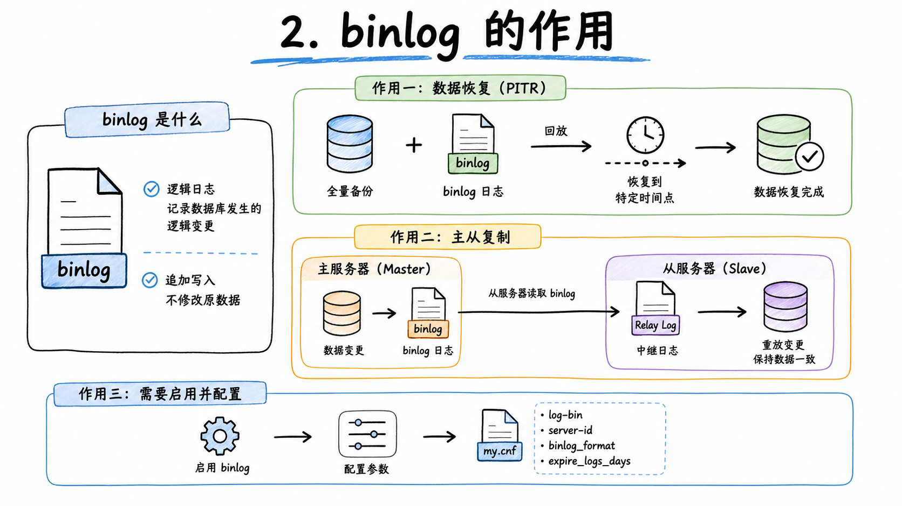

binlog 是一种逻辑日志，记录数据库发生的逻辑变更。发生数据误删或丢失时，可以结合全量备份与 binlog，将数据库恢复到特定时间点。

主服务器上的 binlog 还可以被从服务器读取，从而实现主从数据同步。binlog 需要通过配置启用并设置相应参数。

## 3. binlog 与 redo log 的区别
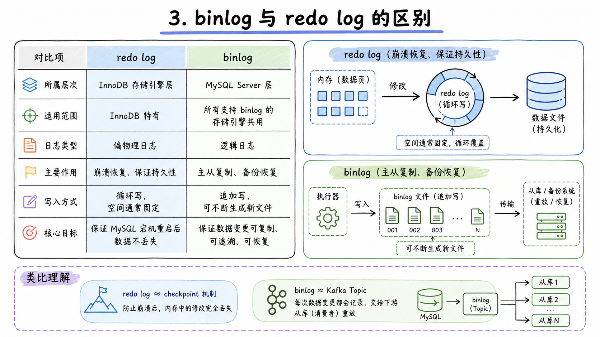

这是一个非常高频的面试考点。

| 对比项 | redo log | binlog |
|---|---|---|
| 所属层次 | InnoDB 存储引擎层 | MySQL Server 层 |
| 适用范围 | InnoDB 特有 | 所有支持 binlog 的存储引擎共用 |
| 日志类型 | 偏物理日志 | 逻辑日志 |
| 主要作用 | 崩溃恢复、保证持久性 | 主从复制、备份恢复 |
| 写入方式 | 循环写，空间通常固定 | 追加写，可不断生成新文件 |
| 核心目标 | 保证 MySQL 宕机重启后数据不丢失 | 保证数据变更可复制、可追溯、可恢复 |

redo log 可以类比为 Java 系统中的 *checkpoint* 机制，主要防止程序或机器突然崩溃后，内存中的修改完全丢失。

binlog 则有点像 Kafka 中的 Topic：每次数据变更都会被记录下来，随后可以交给下游消费者，也就是从库进行重放。

## 4. 为什么需要两阶段提交
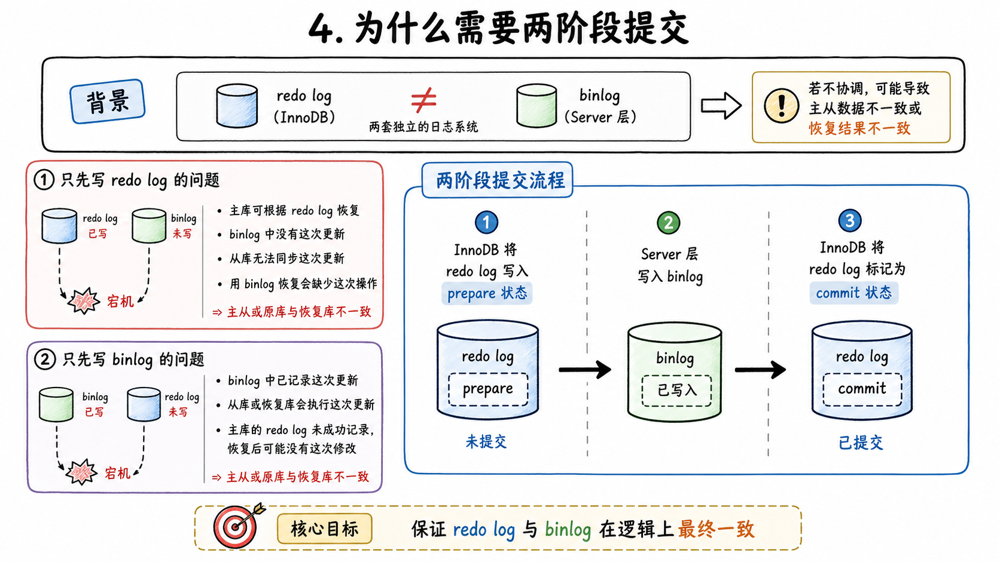

一条更新语句通常会同时涉及 redo log 和 binlog。由于 redo log 属于 InnoDB，而 binlog 属于 Server 层，它们是两套相互独立的日志系统。如果不做协调，就可能导致两份日志状态不一致，进而造成主从数据不一致或恢复结果不一致。

### 只先写 redo log 的问题

如果先写完 redo log，但还没写 binlog，系统就突然宕机：

- 主库可以根据 redo log 恢复数据；
- 但 binlog 中没有这次更新；
- 从库无法同步这次更新；
- 使用 binlog 恢复出的数据库也会缺少这次操作。

最终就会出现主库与从库，或者原库与恢复库之间的数据不一致。

### 只先写 binlog 的问题

如果先写完 binlog，但还没写 redo log，系统就突然宕机：

- binlog 中已经记录了这次更新；
- 从库或恢复库会执行这次更新；
- 但主库的 redo log 没有成功记录，主库恢复后可能没有这次修改。

同样会造成数据不一致。

### 两阶段提交的流程

为了解决这个问题，MySQL 引入了两阶段提交，大致过程如下：

1. InnoDB 将 redo log 写入 **prepare** 状态。
2. Server 层写入 binlog。
3. InnoDB 将 redo log 标记为 **commit** 状态。

两阶段提交的核心目标，是保证 redo log 与 binlog 在逻辑上最终一致。

## 5. redo log 与 WAL
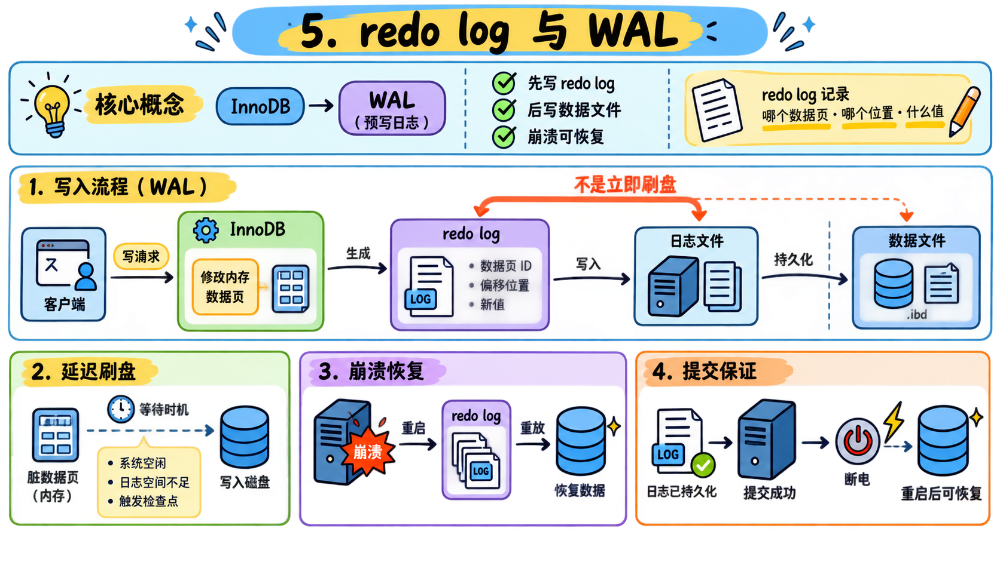

InnoDB 采用 **WAL（Write-Ahead Logging，预写日志）** 策略。

事务执行写操作时，InnoDB 会先写 redo log，而不是立即将所有修改同步写入数据文件。redo log 记录的是类似“哪个数据页的哪个位置被修改成了什么值”这样的物理变更。

日志写入后，脏数据页不需要立刻刷盘，可以等系统空闲、日志空间不足或触发检查点时，再批量写入磁盘。

如果系统崩溃，重启后可以重放 redo log 中还没来得及写入数据文件的操作，从而恢复数据。事务提交时，只要相应日志已经持久化，即使下一秒服务器断电，数据也可以在重启后恢复。

## 6. redo log 的刷盘时机
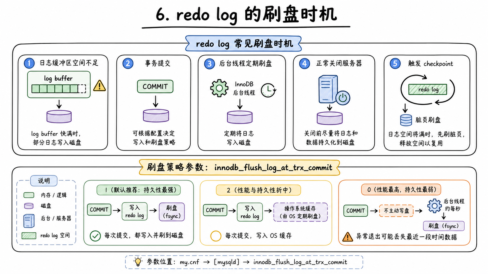

redo log 常见的刷盘时机包括：

1. **日志缓冲区空间不足**

   当内存中的 log buffer 快满时，需要将一部分日志写入磁盘。

2. **事务提交**

   事务执行 `COMMIT` 时，可以根据配置决定日志写入和刷盘策略。

3. **后台线程定期刷盘**

   InnoDB 后台线程会定期将日志写入磁盘。

4. **正常关闭服务器**

   MySQL 正常关闭前，会尽量将需要持久化的数据和日志写入磁盘。

5. **触发 checkpoint**

   redo log 空间有限并采用循环写。当日志空间即将被写满时，需要先把对应脏页刷入磁盘，才能复用日志空间。

控制刷盘策略的重要参数是 `innodb_flush_log_at_trx_commit`：

- `1`：每次事务提交，都将 redo log 写入并刷到磁盘，持久性最强。
- `2`：每次事务提交，将 redo log 写入操作系统缓存，通常由操作系统定期刷盘。
- `0`：事务提交时不主动写盘，由后台线程大约每秒写入并刷盘，MySQL 异常退出时可能丢失最近一段时间的数据。

## 7. redo log 的循环写与 checkpoint
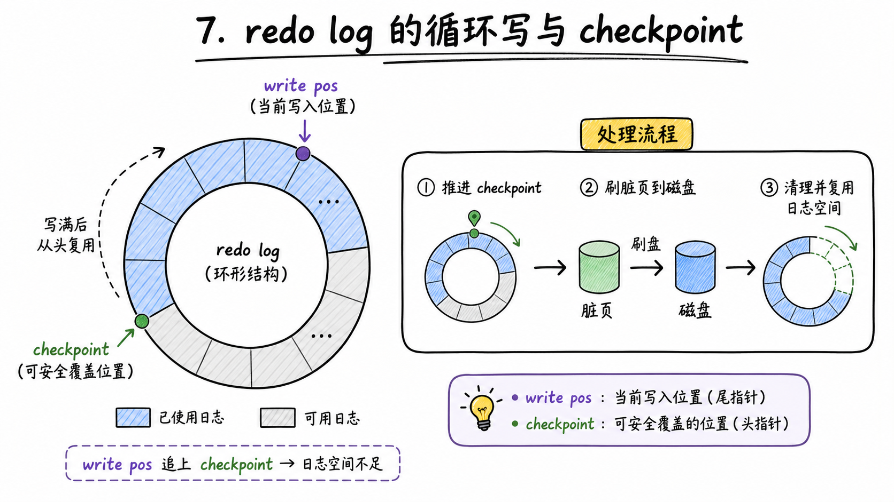

redo log 可以理解为一个环形结构，写满之后会从头复用空间。但在覆盖旧日志之前，必须确保旧日志对应的数据页已经成功写入磁盘。

其中有两个重要位置：

- **write pos**：当前写入位置，类似队列的尾指针。
- **checkpoint**：可以被安全覆盖的位置，类似队列的头指针。

当 `write pos` 追上 `checkpoint` 时，说明日志空间不足。此时必须推进 checkpoint，将相应脏页刷入磁盘，再清理并复用对应日志空间。

## 三、MySQL 索引原理
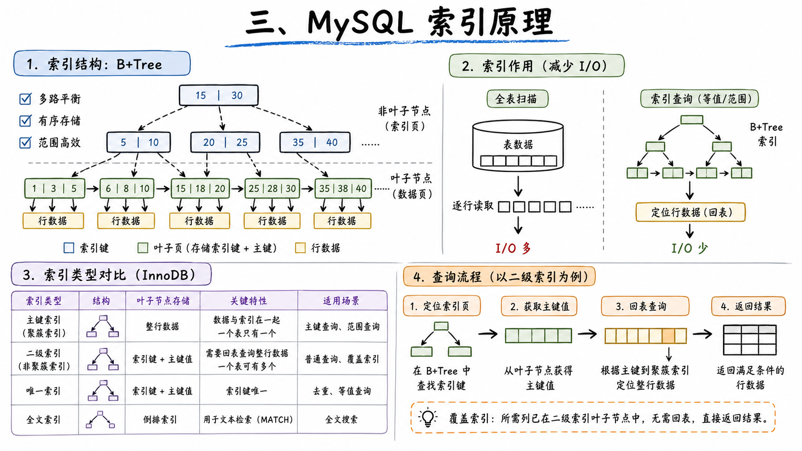

## 1. 索引为什么能加快查询
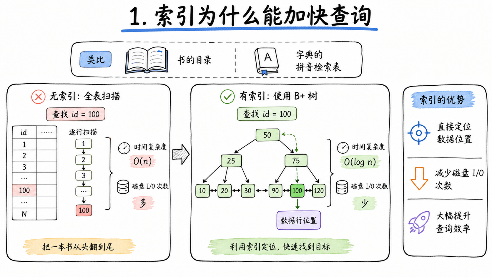

索引可以类比为书的目录，或者字典中的拼音检索表。

如果没有索引，要查找 `id = 100` 的数据，数据库只能逐行进行全表扫描，类似于把一本书从头翻到尾，时间复杂度接近 `O(n)`。

有了索引后，MySQL 可以利用 B+ 树等数据结构，将查询复杂度降低到近似 `O(log n)`。数据库能够直接定位索引指向的数据位置，大幅减少磁盘 I/O 次数，而磁盘 I/O 往往是数据库查询中非常耗时的操作。

## 2. 索引的分类
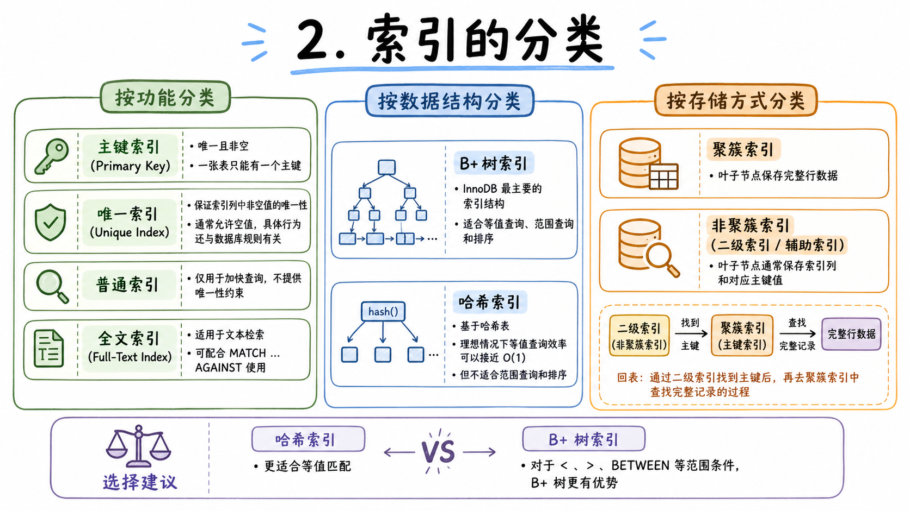

### 按功能分类

- **主键索引（Primary Key）**：唯一且非空，一张表只能有一个主键。
- **唯一索引（Unique Index）**：保证索引列中非空值的唯一性，通常允许空值，具体行为还与数据库规则有关。
- **普通索引**：仅用于加快查询，不提供唯一性约束。
- **全文索引（Full-Text Index）**：适用于文本检索，可配合 `MATCH ... AGAINST` 使用。

### 按数据结构分类

- **B+ 树索引**：InnoDB 最主要的索引结构，适合等值查询、范围查询和排序。
- **哈希索引**：基于哈希表，理想情况下等值查询效率可以接近 `O(1)`，但不适合范围查询和排序。

哈希索引更适合等值匹配。对于 `>`、`<`、`BETWEEN` 等范围条件，B+ 树更有优势。

### 按存储方式分类

- **聚簇索引**：叶子节点保存完整行数据。
- **非聚簇索引，也称二级索引或辅助索引**：叶子节点通常保存索引列和对应主键值。

通过二级索引找到主键后，再去聚簇索引中查找完整记录的过程，称为**回表**。

## 3. 创建索引时的注意事项
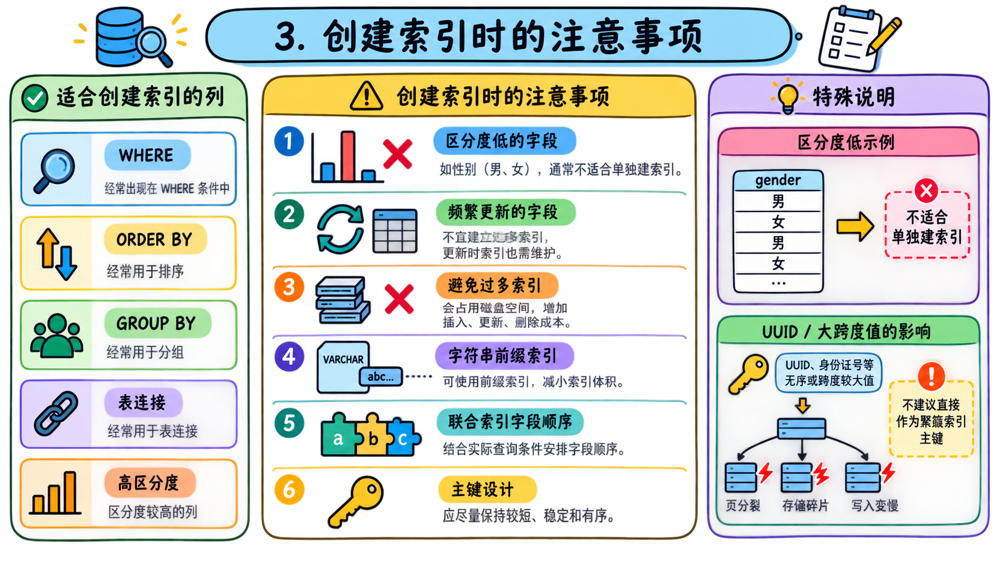

适合创建索引的列通常包括：

- 经常出现在 `WHERE` 条件中的列
- 经常用于 `ORDER BY` 排序的列
- 经常用于 `GROUP BY` 分组的列
- 经常用于表连接的列
- 区分度较高的列

创建索引时还要注意以下问题：

- 区分度很低的字段，例如只有“男、女”两种值的性别字段，通常不适合单独建立索引。
- 频繁更新的字段不宜随意建立过多索引，因为数据更新时相关索引也需要维护。
- 不要建立过多索引，否则会额外占用磁盘空间，并增加插入、更新和删除操作的成本。
- 字符串列可以考虑使用前缀索引，以减小索引体积。
- 创建联合索引时，要结合实际查询条件安排字段顺序。
- 主键应尽量保持较短、稳定和有序。

对于 UUID、身份证号等无序或跨度较大的值，如果直接作为聚簇索引主键，随机插入可能导致页分裂和存储碎片，影响写入性能。

## 4. 常见的索引失效场景
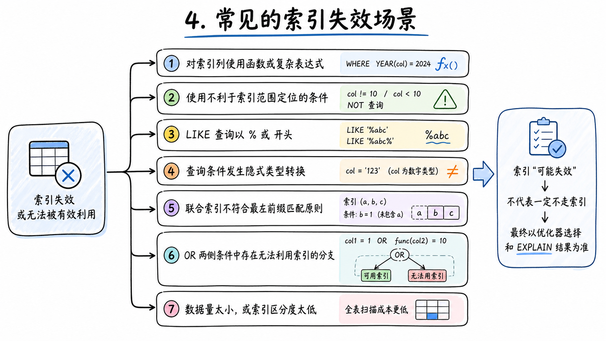

常见的索引失效或无法被有效利用的情况包括：

- 对索引列使用函数或复杂表达式。
- 使用不利于索引范围定位的条件，例如某些 `!=`、`<>`、`NOT` 查询。
- `LIKE` 查询以 `%` 或 `_` 开头，例如 `LIKE '%abc'`。
- 查询条件发生隐式类型转换。
- 联合索引不符合最左前缀匹配原则。
- `OR` 两侧条件中存在无法利用索引的分支，可能导致整体执行计划退化。
- 数据量太小，或者索引区分度太低，优化器判断全表扫描成本更低。

> 索引“可能失效”并不意味着某种写法在任何情况下都绝对不走索引，最终仍应结合优化器选择和 `EXPLAIN` 的结果判断。

## 5. InnoDB 为什么选择 B+ 树
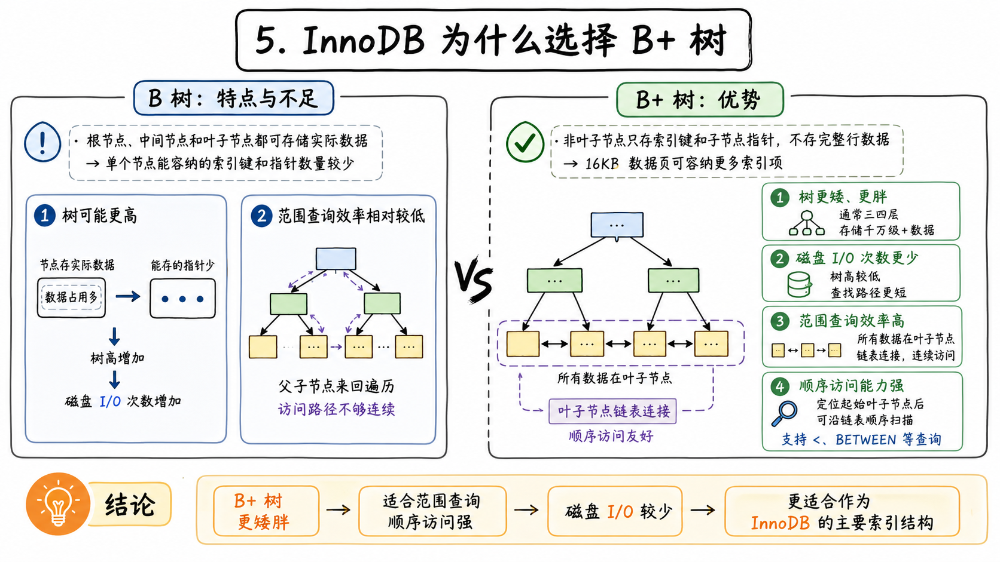

面试官经常会问：InnoDB 为什么选择 B+ 树，而不是 B 树？

### B 树的特点与不足

B 树的根节点、中间节点和叶子节点都可以存储实际数据，因此单个节点能够保存的索引键和指针数量较少。

这会带来两个问题：

1. **树可能更高**

   单个节点存储实际数据后，占用空间变大，能保存的子节点指针变少，树高可能增加，从而增加磁盘 I/O 次数。

2. **范围查询效率相对较低**

   B 树执行范围查询时，可能需要在父子节点之间来回遍历，访问路径不够连续。

### B+ 树的优势

B+ 树的非叶子节点主要保存索引键和子节点指针，不保存完整行数据，因此一个 16KB 的数据页可以容纳更多索引项。

它的优势包括：

- **树更矮、更胖**：通常三四层就能存储千万级甚至更多数据。
- **磁盘 I/O 次数更少**：树高较低，查找路径更短。
- **范围查询效率高**：所有数据都在叶子节点，叶子节点之间通过链表连接。
- **顺序访问能力强**：执行 `>`、`<`、`BETWEEN` 等查询时，定位到起始叶子节点后，可以沿叶子节点顺序扫描。

因此，B+ 树既矮胖，又适合范围查询，磁盘 I/O 较少，更适合作为 InnoDB 的主要索引结构。

## 6. 聚簇索引与非聚簇索引
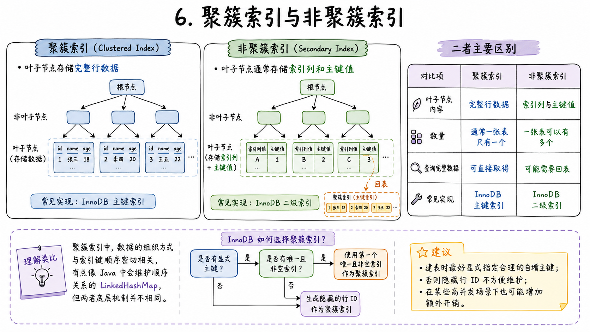

聚簇索引的叶子节点存储完整行数据，非聚簇索引的叶子节点通常存储索引列和主键值。

二者的主要区别如下：

| 对比项 | 聚簇索引 | 非聚簇索引 |
|---|---|---|
| 叶子节点内容 | 完整行数据 | 索引列与主键值 |
| 数量 | 通常一张表只有一个 | 一张表可以有多个 |
| 查询完整数据 | 可直接取得 | 可能需要回表 |
| 常见实现 | InnoDB 主键索引 | InnoDB 二级索引 |

聚簇索引中，数据的组织方式与索引键顺序密切相关，有点像 Java 中会维护顺序关系的 `LinkedHashMap`，但两者底层机制并不相同，这里只是方便理解。

如果表中没有显式主键，InnoDB 会优先选择第一个唯一且非空的索引作为聚簇索引；如果也不存在这样的索引，则会生成隐藏的行 ID。

因此，建表时最好显式指定合理的自增主键。否则隐藏行 ID 不方便维护，在某些高并发场景下也可能增加额外开销。

## 7. 回表与覆盖索引
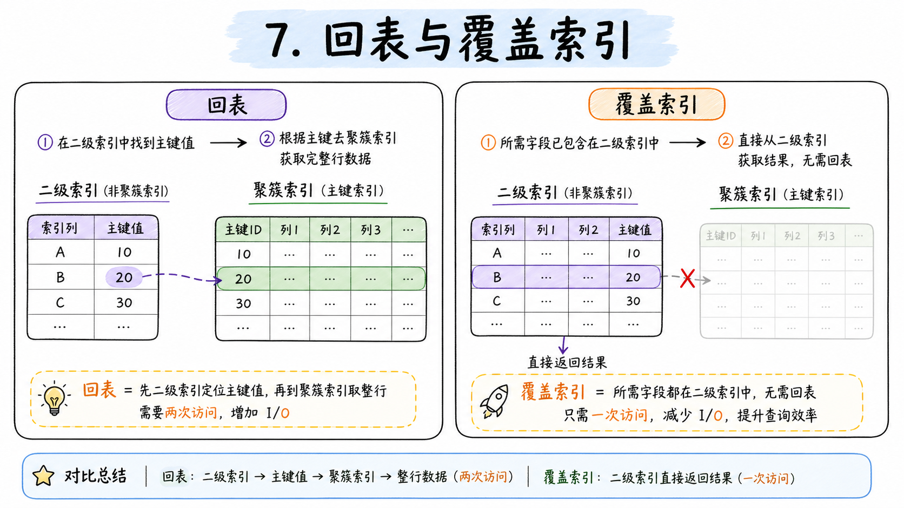

### 回表

通过二级索引查询时，先在二级索引中找到主键值，再根据主键去聚簇索引中获取完整行数据，这个过程称为回表。

### 覆盖索引

如果 `SELECT` 所需要的字段都已经包含在二级索引中，那么数据库可以直接从该索引中取得结果，不必再访问聚簇索引。

这种索引称为**覆盖索引**。覆盖索引能够避免回表，减少 I/O，提高查询效率。

## 8. 最左前缀匹配原则
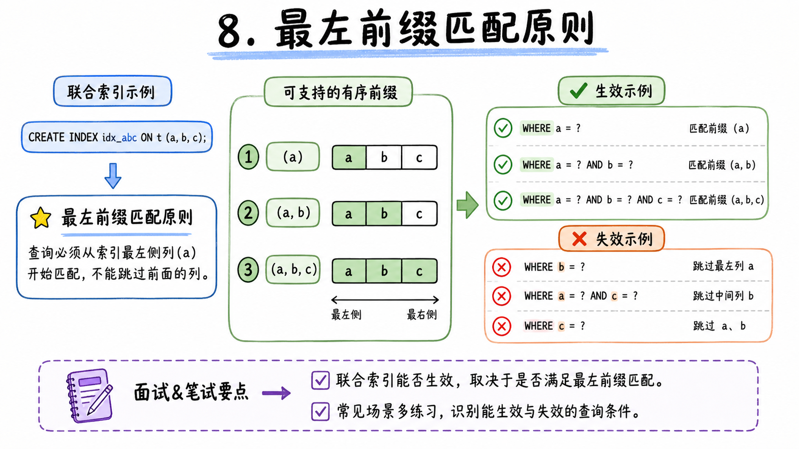

最左前缀匹配原则可以说是联合索引的“生命线”。

假设创建了联合索引：

```sql
INDEX idx_abc (a, b, c)
```

它可以支持的有序前缀包括：

- `(a)`
- `(a, b)`
- `(a, b, c)`

查询一般需要从索引最左侧列开始匹配，不能随意跳过前面的列。面试和笔试中经常考查联合索引能够生效和失效的具体场景，建议结合示例题进行练习。

## 9. 索引条件下推
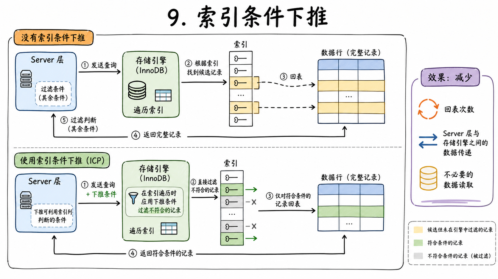

索引条件下推即 **ICP（Index Condition Pushdown）**。

没有索引条件下推时，存储引擎先根据索引找到候选记录并回表，然后将完整记录返回 Server 层，由 Server 层判断其余过滤条件。

使用索引条件下推后，Server 层会将能够利用索引列判断的部分条件下推给存储引擎。存储引擎在遍历索引时，直接过滤掉不符合条件的记录，只对符合条件的数据进行回表。

这样可以减少：

- 回表次数
- Server 层与存储引擎之间的数据传递
- 不必要的数据读取

## 四、MySQL 事务与 MVCC
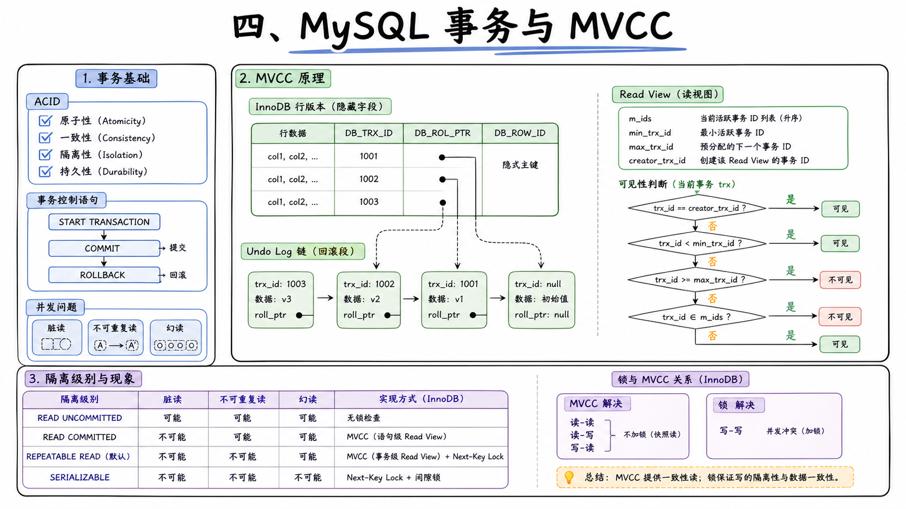

## 1. 事务的 ACID 特性
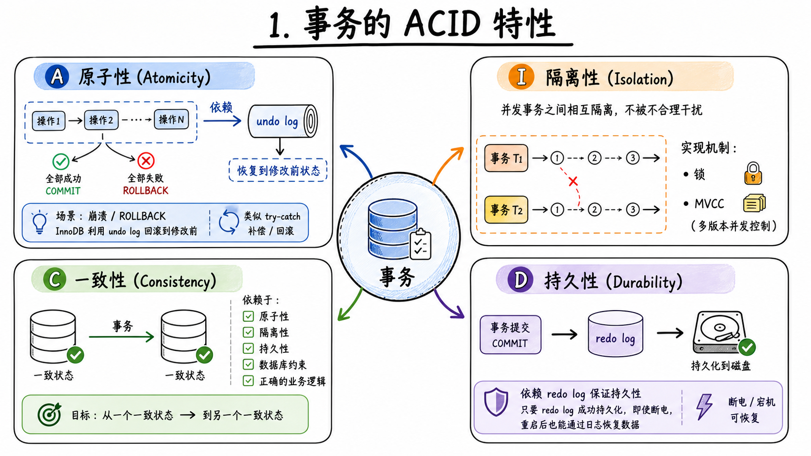

事务具有四大特性：原子性、一致性、隔离性和持久性。

### 原子性：Atomicity

一个事务中的所有操作，要么全部成功提交，要么全部失败回滚，不能只执行其中一部分。

MySQL 主要依靠 **undo log** 保证原子性。如果事务执行到一半崩溃，或者手动执行 `ROLLBACK`，InnoDB 可以利用 undo log 将数据恢复到修改前的状态。

它有点像 Java 代码在 `try-catch` 中捕获异常后执行补偿或回滚操作。

### 一致性：Consistency

事务应该使数据库从一个一致状态转换到另一个一致状态。

一致性是事务最终要达到的目标，它依赖于：

- 原子性
- 隔离性
- 持久性
- 数据库约束
- 正确的业务逻辑

### 隔离性：Isolation

多个并发事务之间应该相互隔离，一个事务的执行不应被其他事务不合理地干扰。

MySQL 主要通过以下机制实现隔离性：

- 锁
- MVCC，即多版本并发控制

### 持久性：Durability

事务一旦提交，其所做的修改就应该被永久保存。

MySQL 主要依靠 **redo log** 保证持久性。只要 redo log 成功持久化，即使服务器随后断电，重启后也能通过日志恢复数据。

## 2. 并发事务的三类问题
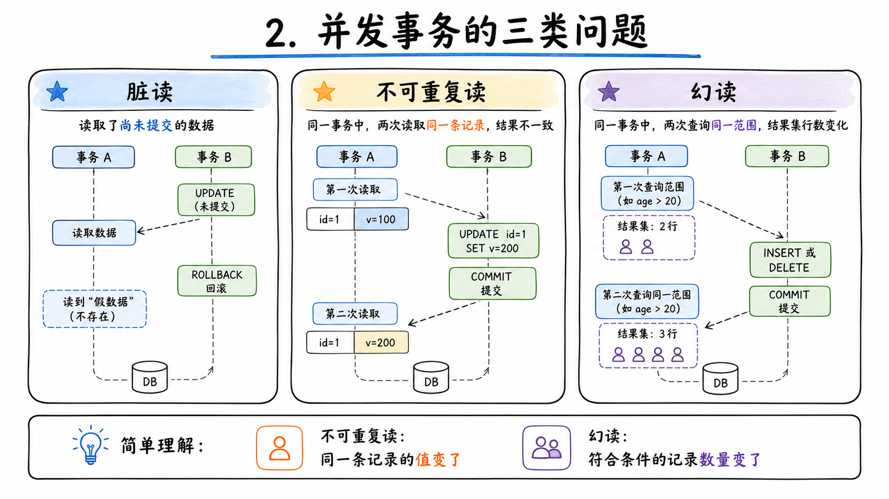

### 脏读

事务 A 读取了事务 B 尚未提交的数据。如果事务 B 随后回滚，事务 A 读取到的就是不存在的“假数据”，这就是脏读。

### 不可重复读

事务 A 在同一事务中两次读取同一条记录，结果却不一致。原因可能是两次读取之间，事务 B 对该记录执行了 `UPDATE` 并提交。

### 幻读

事务 A 在同一事务中两次查询同一范围，结果集中的行数发生变化。原因可能是事务 B 在这段时间执行了 `INSERT` 或 `DELETE` 并提交。

简单理解：

- **不可重复读**：同一条记录的值变了。
- **幻读**：符合条件的记录数量变了。

## 3. 事务隔离级别
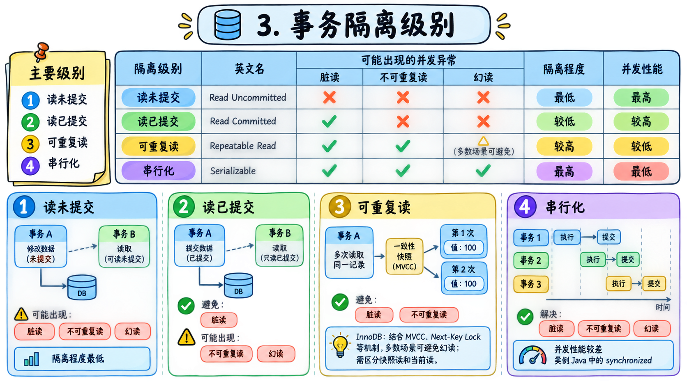

MySQL 中常见的事务隔离级别包括：

1. 读未提交
2. 读已提交
3. 可重复读
4. 串行化

### 读未提交：Read Uncommitted

当前事务可以读取其他事务尚未提交的数据，因此可能出现：

- 脏读
- 不可重复读
- 幻读

这是隔离程度最低的级别。

### 读已提交：Read Committed

当前事务只能读取其他事务已经提交的数据，因此可以避免脏读，但仍可能出现：

- 不可重复读
- 幻读

### 可重复读：Repeatable Read

同一事务中，多次读取同一条记录时，结果能够保持一致。即使其他事务修改并提交了这条记录，也不会影响当前事务的一致性快照读取。

它可以避免：

- 脏读
- 不可重复读

InnoDB 还会结合 MVCC、Next-Key Lock 等机制，在很多场景下解决幻读问题，但快照读和当前读的处理方式需要区分。

### 串行化：Serializable

串行化是隔离程度最高的级别，通过让并发事务趋向串行执行来避免并发异常。

它能解决脏读、不可重复读和幻读，但并发性能较差，有点像在 Java 中使用 `synchronized` 将并发操作严格串行化。

## 4. 各隔离级别的实现思路
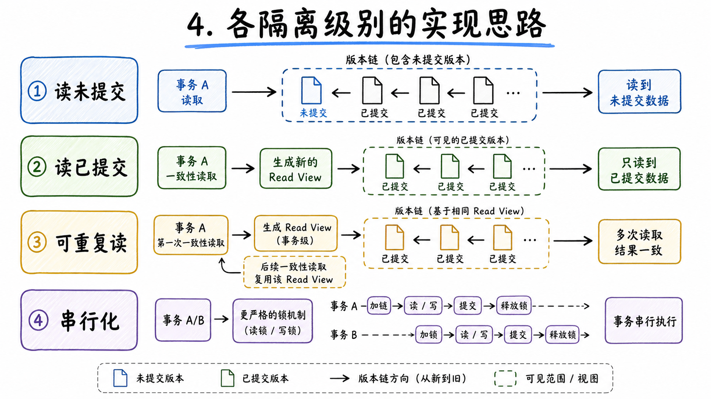

- **读未提交**：读取时可以直接看到其他事务尚未提交的数据版本。
- **读已提交**：通过 MVCC 实现，每次一致性读取前通常都会生成新的 Read View。
- **可重复读**：通过 MVCC 实现，事务第一次一致性读取时生成 Read View，后续一致性读取复用该视图。
- **串行化**：通过更严格的锁机制控制并发读写，使事务串行执行。

## 5. MVCC 的作用
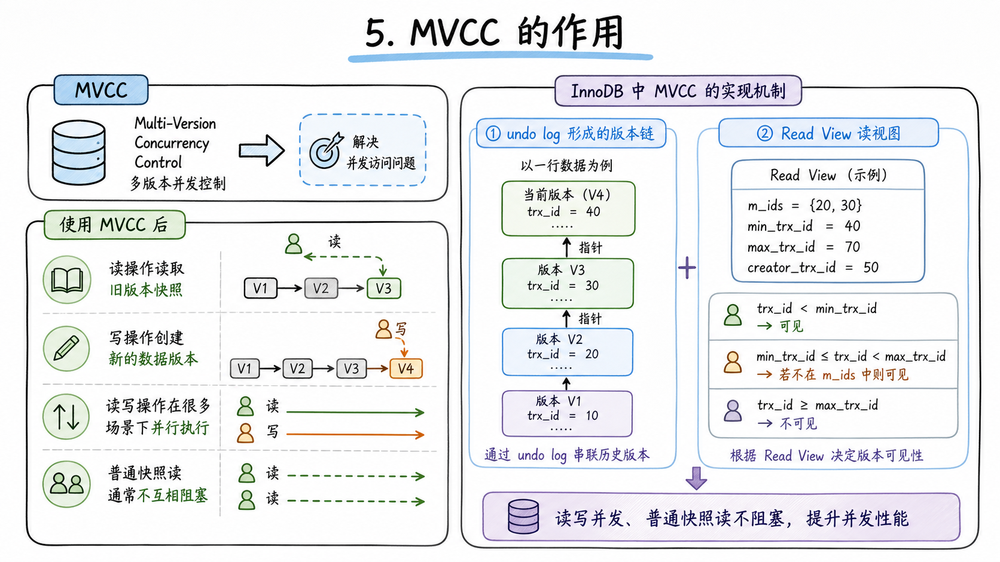

MVCC 即 **Multi-Version Concurrency Control，多版本并发控制**，主要用于解决数据库并发访问问题。

在传统锁机制下，如果一个事务正在写数据，其他事务可能需要等待写事务完成后才能读取。使用 MVCC 后：

- 读操作可以读取数据的旧版本快照；
- 写操作可以创建新的数据版本；
- 读写操作能够在很多场景下并行执行；
- 普通快照读通常不需要互相阻塞。

在 InnoDB 中，MVCC 主要通过以下机制实现：

- undo log 形成的版本链
- Read View 读视图

## 6. 版本链
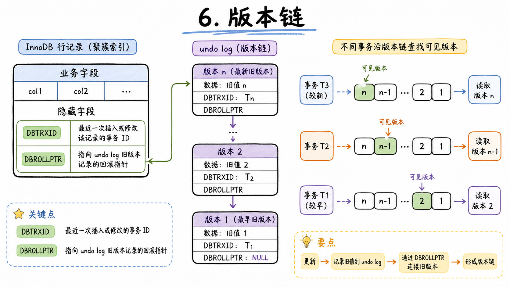

InnoDB 的每行记录除了业务字段外，还包含一些隐藏字段，其中与 MVCC 密切相关的包括：

- `DB_TRX_ID`：最近一次插入或修改该记录的事务 ID。
- `DB_ROLL_PTR`：指向对应 undo log 旧版本记录的回滚指针。

当事务更新一行数据时，InnoDB 不会让旧版本彻底消失，而是将旧值记录到 undo log 中，并通过回滚指针将各个版本连接起来。

这样，不同版本的数据就形成了一条版本链。事务可以沿着版本链查找对自己可见的历史版本。

## 7. Read View 读视图
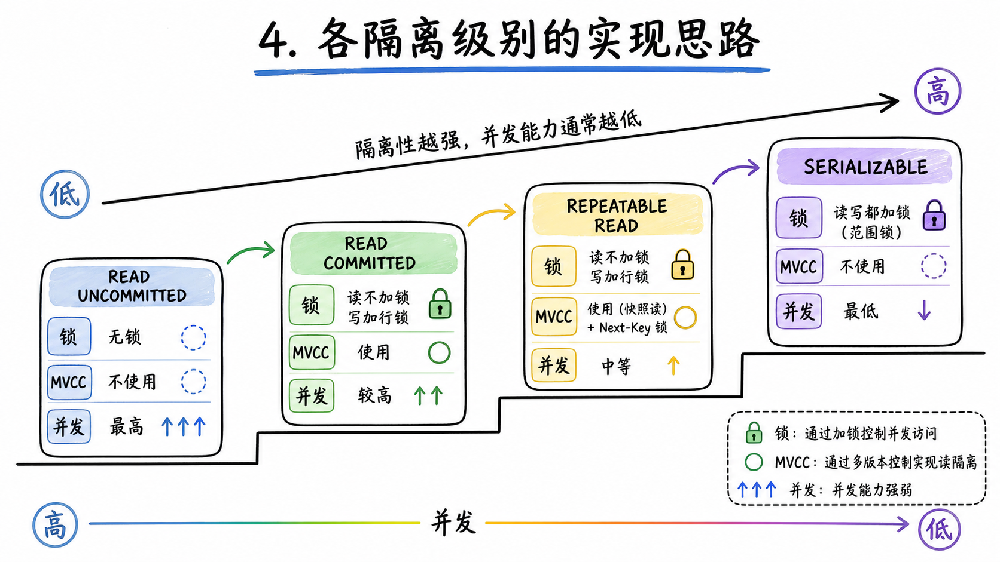

Read View 是 InnoDB 为一致性读取创建的数据结构，用于判断某个版本的数据对当前事务是否可见。

它主要服务于：

- 读已提交
- 可重复读

Read View 中的重要信息包括：

- `creator_trx_id`：创建该 Read View 的事务 ID。
- `m_ids`：创建视图时，系统中活跃且尚未提交的事务 ID 列表。
- `min_trx_id`：`m_ids` 中最小的事务 ID。
- `max_trx_id`：创建视图时，系统下一次准备分配的事务 ID。

### 版本可见性判断

当事务读取某条记录时，InnoDB 会根据记录的 `DB_TRX_ID` 和 Read View 判断版本是否可见。

- 如果版本由当前事务创建，通常对当前事务可见。
- 如果 `DB_TRX_ID < min_trx_id`，说明创建该版本的事务在 Read View 生成前已经提交，因此该版本可见。
- 如果 `DB_TRX_ID >= max_trx_id`，说明创建该版本的事务是在 Read View 生成后才开始的，因此不可见。
- 如果 `DB_TRX_ID` 位于 `min_trx_id` 与 `max_trx_id` 之间，则检查它是否在 `m_ids` 中：
  - 不在 `m_ids` 中，说明对应事务已经提交，版本可见。
  - 在 `m_ids` 中，说明对应事务在创建视图时仍然活跃，版本不可见。

如果当前版本不可见，就沿着 `DB_ROLL_PTR` 查找版本链中的上一个版本，直到找到可见版本。

## 8. 读已提交与可重复读的关键区别
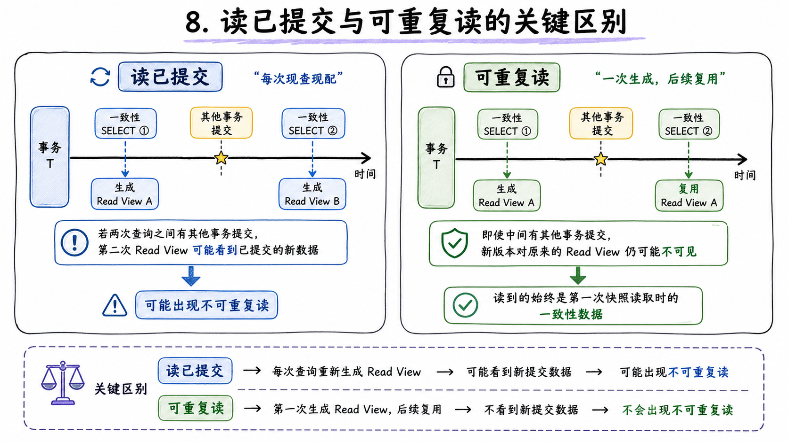

### 读已提交

读已提交可以理解为“每次现查现配”。

事务每执行一次一致性 `SELECT`，通常都会重新生成 Read View。如果两次查询之间有其他事务提交，那么第二次生成的新 Read View 可能会看到这些已经提交的数据，因此可能出现不可重复读。

### 可重复读

可重复读可以理解为“一次生成，后续复用”。

事务第一次执行一致性读取时生成 Read View，后续查询继续复用这个视图。即使中间有其他事务提交，新版本对原来的 Read View 仍然可能不可见，因此事务读到的始终是第一次快照读取时所对应的一致性数据。

## 五、MySQL 锁机制
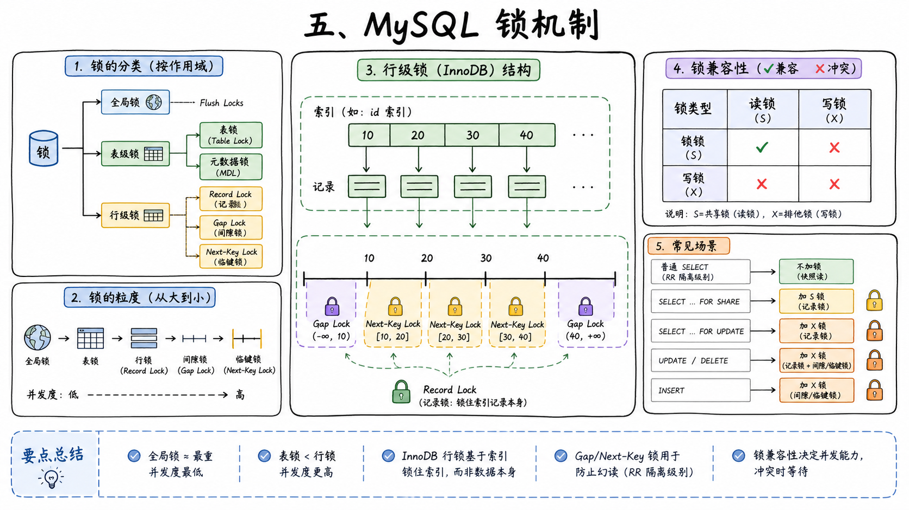

## 1. 按锁粒度分类
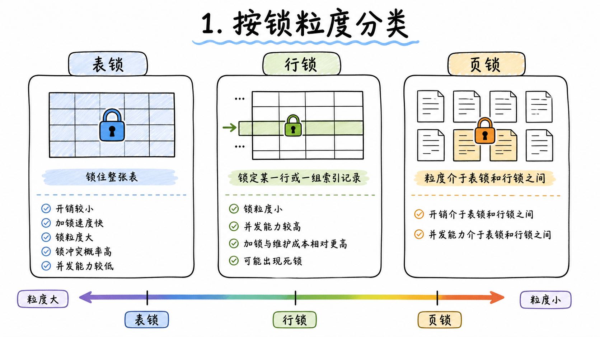

### 表锁

表锁会锁住整张表，其特点包括：

- 开销较小
- 加锁速度快
- 锁粒度大
- 锁冲突概率高
- 并发能力较低

### 行锁

行锁锁定某一行或一组索引记录，其特点包括：

- 锁粒度小
- 并发能力较高
- 加锁与维护成本相对更高
- 可能出现死锁

### 页锁

页锁的粒度介于表锁和行锁之间，其开销、并发能力也介于二者之间。

## 2. 按兼容性分类
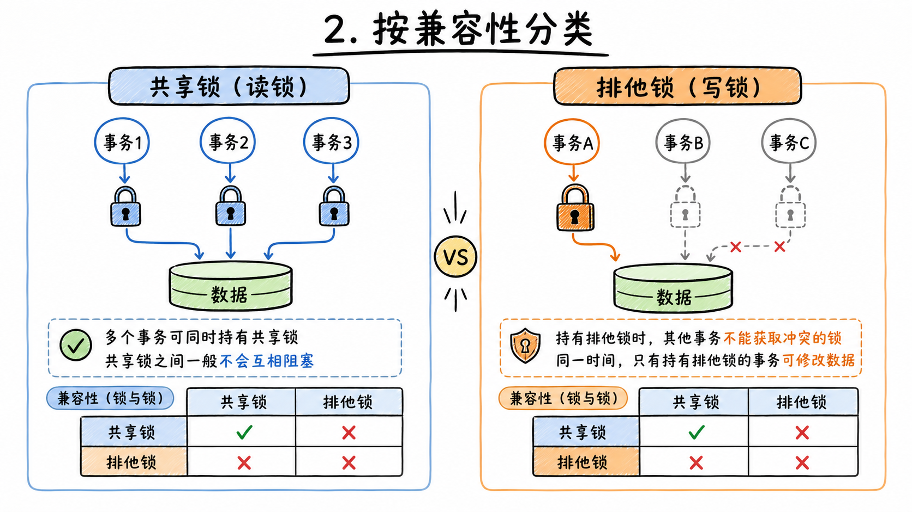

### 共享锁

共享锁也叫读锁，多个事务之间通常可以同时持有共享锁，因此共享锁之间一般不会互相阻塞。

### 排他锁

排他锁也叫写锁。某个事务持有排他锁时，其他事务不能再获取与其冲突的锁。

在同一时间内，通常只有持有相应排他锁的事务能够修改被锁定的数据。

## 3. 乐观锁与悲观锁
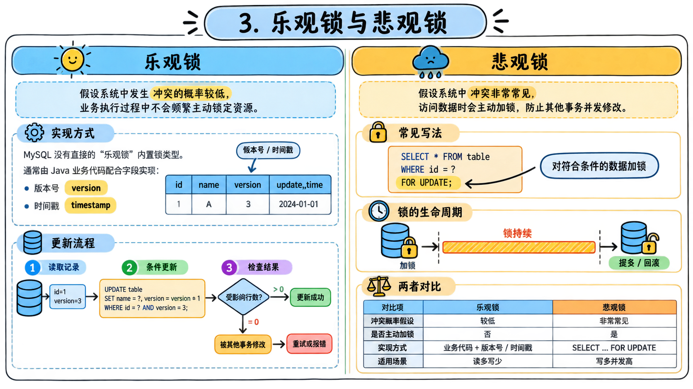

### 乐观锁

乐观锁假设系统中发生冲突的概率较低，因此在业务执行过程中不会频繁主动锁定资源。

MySQL 并没有一种直接叫作“乐观锁”的内置锁类型，它通常由 Java 业务代码配合字段实现，例如：

- 版本号 `version`
- 时间戳

读取记录时，同时获取版本号；更新时，将旧版本号作为条件：

```sql
UPDATE product
SET stock = stock - 1,
    version = version + 1
WHERE id = ?
  AND version = ?;
```

如果受影响行数为 0，说明数据已被其他事务修改，此时可以选择重试或报错。

### 悲观锁

悲观锁假设系统中冲突非常常见，因此访问数据时会主动加锁，防止其他事务并发修改。

常见写法是：

```sql
SELECT *
FROM product
WHERE id = ?
FOR UPDATE;
```

该语句会对符合条件的数据加锁，锁通常会持续到当前事务提交或回滚。

## 4. InnoDB 行锁的实现
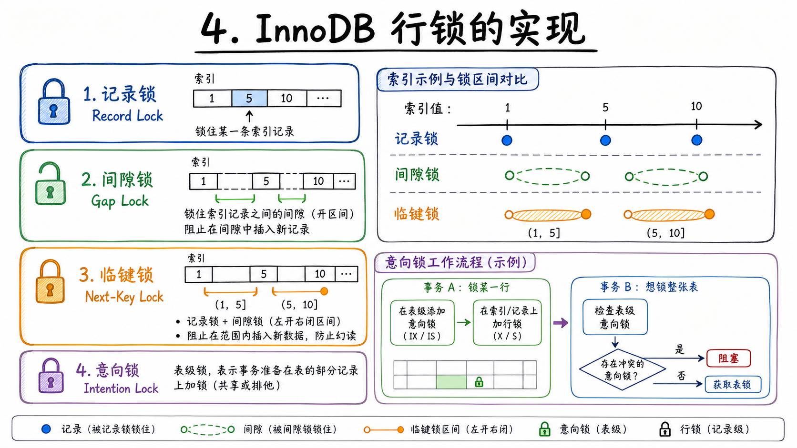

### 记录锁：Record Lock

记录锁精准锁住某一条索引记录。

### 间隙锁：Gap Lock

间隙锁锁住索引记录之间的间隙，不包含间隙两端的记录，可以理解为一个开区间。

在某些等值查询或范围查询中，如果查询条件涉及相应索引范围，InnoDB 可能会对记录之间的间隙加锁，以阻止其他事务在间隙中插入新记录。

### 临键锁：Next-Key Lock

临键锁是记录锁与间隙锁的组合，通常可以理解为左开右闭区间，也是 InnoDB 在可重复读隔离级别下防止幻读的重要机制。

例如索引值包括 `1、5、10`，相应临键锁区间可能表现为：

- `(1, 5]`
- `(5, 10]`

通过锁定记录及其前面的间隙，可以阻止其他事务向范围内插入新数据，从而解决当前读场景下的幻读问题。

### 意向锁：Intention Lock

意向锁是表级锁，主要用于快速表示某个事务准备在表中的部分记录上加共享锁或排他锁。

例如：

- 事务 A 锁住表中的某一行；
- 事务 B 想锁住整张表。

如果没有意向锁，事务 B 可能需要检查表中每一行是否被加锁。有了意向锁后，事务 A 在加行锁前，先在表级别添加相应意向锁；事务 B 只需检查表级意向锁，就能快速判断表内是否存在可能冲突的行锁。

## 5. 死锁排查
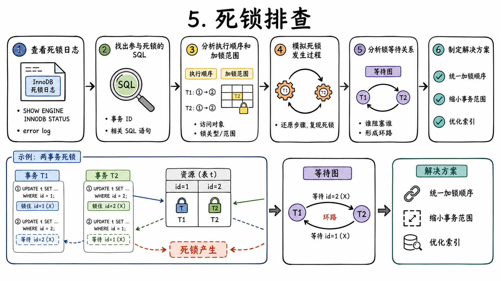

排查数据库死锁可以按照以下步骤进行：

1. 查看死锁日志。
2. 找出参与死锁的 SQL。
3. 分析各条 SQL 的执行顺序和加锁范围。
4. 模拟死锁发生过程。
5. 分析事务之间的锁等待关系。
6. 根据分析结果统一加锁顺序、缩小事务范围或优化索引。

## 六、SQL 性能定位与优化
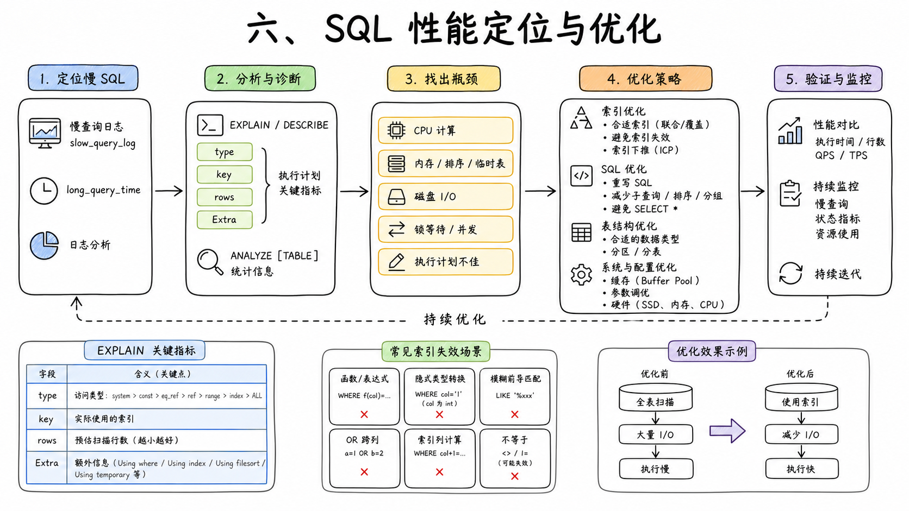

## 1. 如何定位慢 SQL
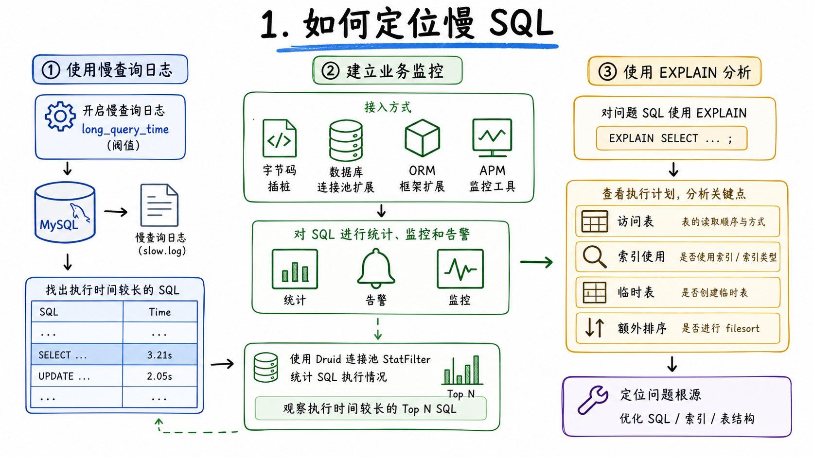

### 使用慢查询日志

开启 MySQL 慢查询日志，并配置 `long_query_time`。通过慢查询日志找出执行时间较长的 SQL，再进一步分析问题根源。

### 建立业务监控

可以在业务基础设施中加入 MySQL 监控，例如通过：

- 字节码插桩
- 数据库连接池扩展
- ORM 框架扩展
- APM 监控工具

对服务中执行的 SQL 进行统计、监控和告警。

如果使用阿里开源的 Druid 数据库连接池，可以利用其 `StatFilter` 统计 SQL 执行情况，并观察项目中执行时间较长的 Top N SQL。

### 使用 EXPLAIN

找到问题 SQL 后，可以使用 `EXPLAIN` 查看执行计划，分析 MySQL 如何访问表、是否使用索引、是否创建临时表以及是否进行了额外排序。

## 2. 避免查询不必要的列
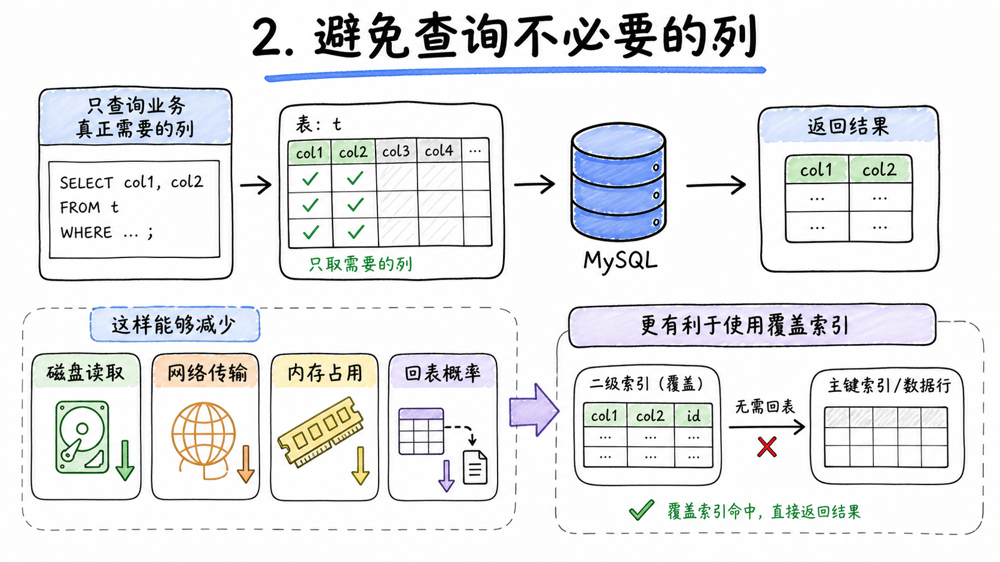

尽量避免无脑使用：

```sql
SELECT *
FROM user;
```

应只查询业务真正需要的列。这样能够减少：

- 磁盘读取
- 网络传输
- 内存占用
- 回表概率

同时也更有利于使用覆盖索引。

## 3. 分页优化
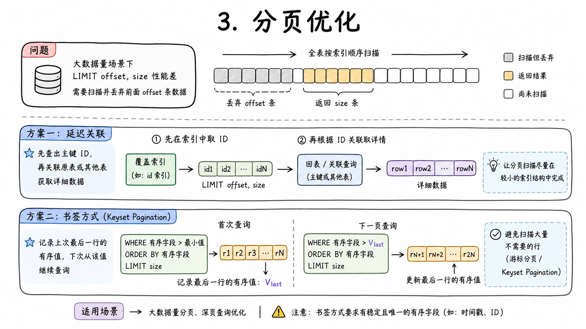

对于大数据量场景，传统的 `LIMIT offset, size` 性能可能较差，因为数据库通常需要扫描并丢弃前面 `offset` 条数据。

### 延迟关联

先通过索引查询出需要的主键 ID，再根据这些 ID 关联原表或其他表，取得详细数据。

例如：

```sql
SELECT u.*
FROM user u
JOIN (
    SELECT id
    FROM user
    ORDER BY id
    LIMIT 100000, 20
) t ON u.id = t.id;
```

这样可以尽量让前面的分页扫描在较小的索引结构中完成。

### 书签方式

记录上一次查询结果中最后一行的某个有序值，下一次从这个值继续查询：

```sql
SELECT *
FROM user
WHERE id > ?
ORDER BY id
LIMIT 20;
```

这种方式也叫游标分页或 Keyset Pagination，可以避免扫描大量不需要的行。

## 4. 索引优化
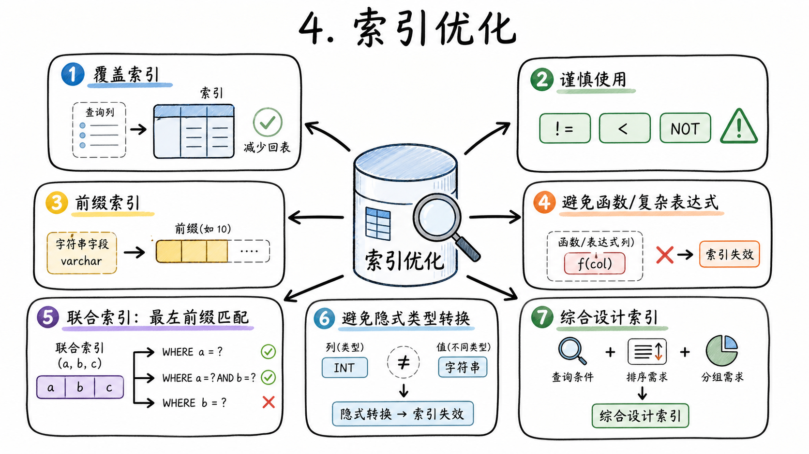

索引优化可以从以下方面入手：

- 使用覆盖索引，减少回表。
- 谨慎使用 `!=`、`<>` 和某些 `NOT` 条件。
- 字符串字段可以适当使用前缀索引。
- 避免对索引列使用函数或复杂表达式。
- 正确设计联合索引，遵守最左前缀匹配原则。
- 避免隐式类型转换。
- 根据查询、排序和分组需求综合设计索引。

## 5. JOIN 优化
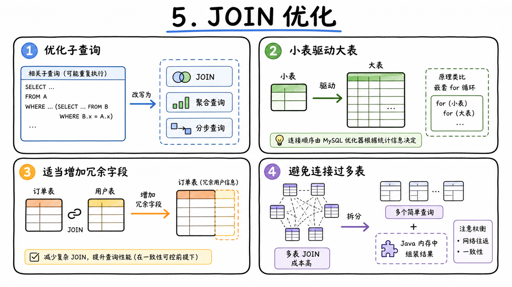

### 优化子查询

特别是 `SELECT` 列表和 `WHERE` 条件中的相关子查询，可能被重复执行，从而导致性能问题。可以根据实际情况改写为 JOIN、聚合查询或分步查询。

### 小表驱动大表

进行 JOIN 时，一般希望用较小的结果集驱动较大的结果集。

这有点像 Java 中的嵌套 `for` 循环：外层循环执行次数越少，整体执行次数通常越少。不过最终连接顺序一般由 MySQL 优化器根据统计信息决定。

### 适当增加冗余字段

在一些查询频繁、数据一致性可控的场景中，可以适当增加冗余字段，减少复杂 JOIN。

### 避免连接过多表

JOIN 表数量过多会增加优化器选择和执行成本。可以考虑把复杂 JOIN 拆成多个简单查询，再在 Java 内存中组装结果，但也要权衡网络往返和一致性问题。

## 6. 排序优化
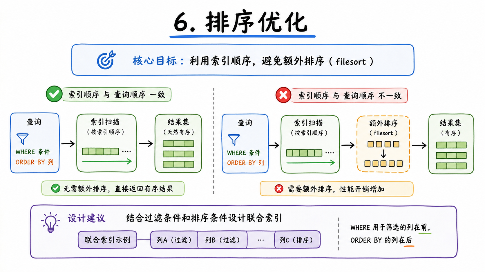

设计索引时应充分考虑排序需求。如果查询顺序与索引顺序一致，MySQL 可以直接按照索引顺序扫描，得到天然有序的结果，避免额外排序。

例如：

```sql
SELECT id, create_time
FROM orders
WHERE user_id = ?
ORDER BY create_time;
```

可以结合过滤条件和排序条件设计联合索引。

## 7. UNION 优化
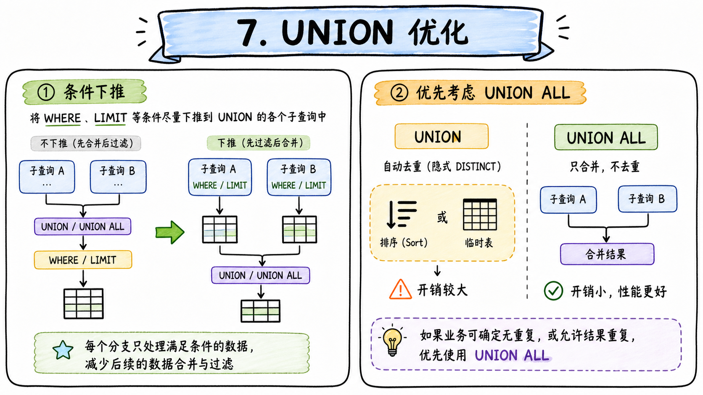

### 条件下推

将 `WHERE`、`LIMIT` 等条件尽量下推到 `UNION` 的各个子查询中，让每个分支只处理满足条件的数据，减少后续的数据合并与过滤。

### 优先考虑 UNION ALL

`UNION` 会自动去重，相当于隐式执行 `DISTINCT`，可能涉及排序或临时表，开销较大。

`UNION ALL` 只负责合并结果，不进行去重。如果业务上可以确定没有重复数据，或者允许结果重复，可以优先使用 `UNION ALL`。

## 8. 如何查看 EXPLAIN


### type：访问类型

`type` 表示表的访问方式。常见类型从较优到较差大致包括：

```text
system
const
eq_ref
ref
range
index
ALL
```

其中：

- `system`、`const`：通常表示最多匹配一行，性能较好。
- `eq_ref`：多表连接中，使用主键或唯一索引进行等值匹配。
- `ref`：使用非唯一索引进行等值查询。
- `range`：使用索引执行范围查询。
- `index`：扫描整个索引。
- `ALL`：全表扫描，通常是最差的访问类型。

实际优化中一般希望至少达到 `range` 或更好的级别，但仍要结合数据量、过滤比例和整体成本判断。

### Extra：额外信息

`Extra` 中需要重点关注：

- **Using filesort**：MySQL 需要进行额外排序，未直接利用索引顺序。数据量大时需要重点优化。
- **Using temporary**：使用了临时表，常见于复杂分组、排序或去重，应重点关注。
- **Using index**：使用了覆盖索引，所需数据可以直接从索引取得，不需要回表，通常是较理想的情况。
- **Using index condition**：使用了索引条件下推。
- **Using where**：Server 层还需要根据 `WHERE` 条件进行过滤。

## 七、分库分表
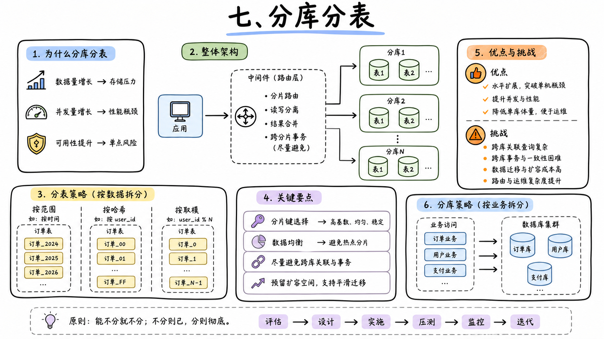

## 1. 为什么需要分库分表
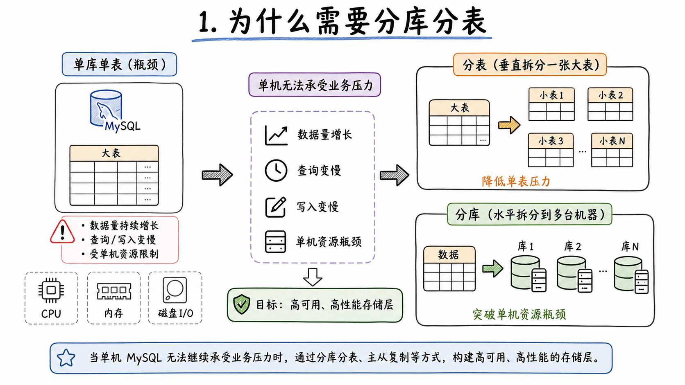

当单机 MySQL 无法继续承受业务压力时，就需要通过分库分表、主从复制等方式，构建高可用、高性能的存储层。

单库单表意味着所有数据都集中在一起。数据量持续增长后，查询和写入都会变慢，还会受到单机 CPU、内存和磁盘 I/O 的限制。

- **分表**：将一张大表拆成多张小表，降低单表压力。
- **分库**：将数据分散到多台机器，突破单机资源瓶颈。

## 2. 垂直分表与水平分表
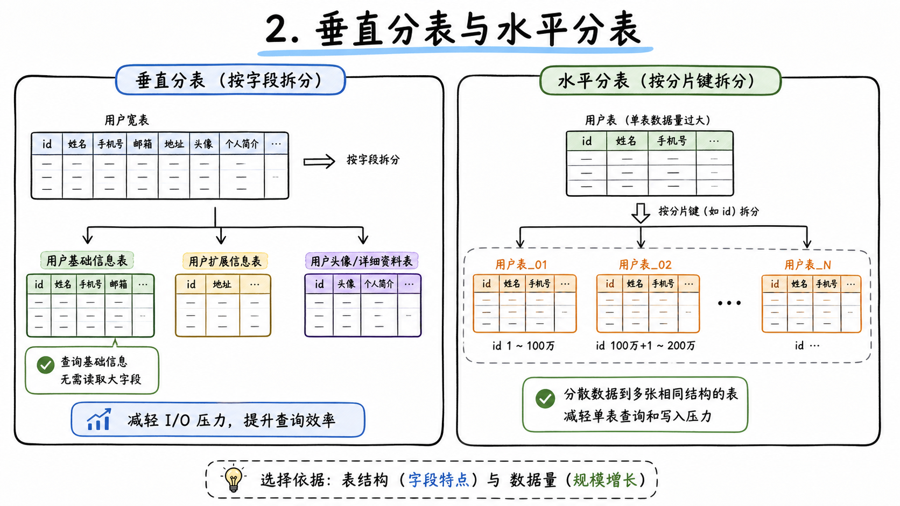

### 垂直分表

垂直分表是把一张宽表按照字段拆分。

例如，将基础信息和大字段拆开：

- 用户基础信息表
- 用户扩展信息表
- 用户头像或详细资料表

这样，查询基础信息时就不需要读取数据量较大的字段，可以减轻 I/O 压力。

### 水平分表

当单表数据量过大时，可以按照某个分片键，将同一张表的数据分散到多张结构相同的表中，从而减轻单表查询和写入压力。

## 3. 常见分表策略
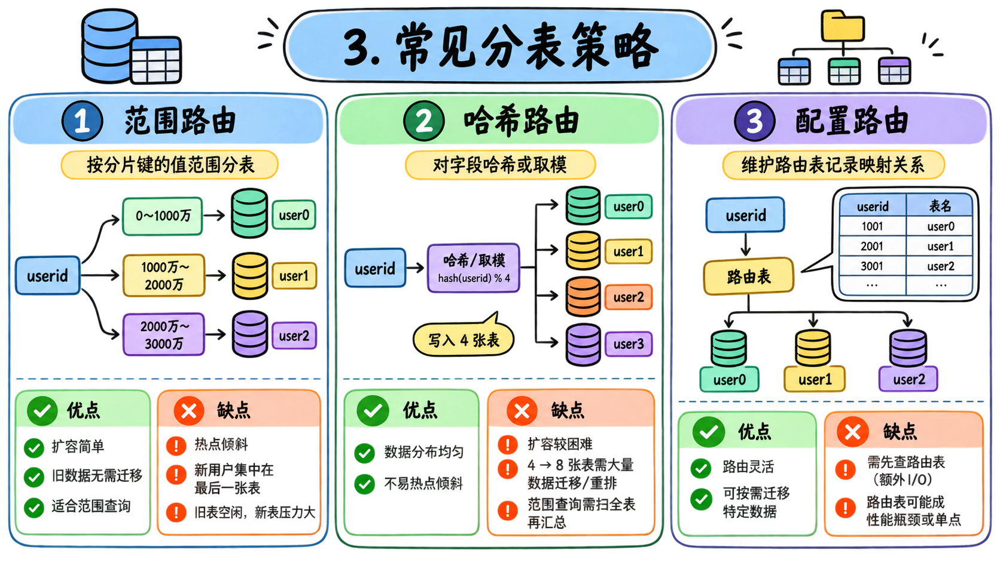

### 范围路由

范围路由根据分片键的值范围进行分表，适用于分片键具有顺序性或连续性的场景。

例如按 `user_id` 划分：

- `0～1000 万`：`user_0`
- `1000 万～2000 万`：`user_1`
- `2000 万～3000 万`：`user_2`

**优点：**

- 扩容简单，可以直接增加新表。
- 旧数据通常不需要重新迁移。
- 天然适合范围查询。

**缺点：**

- 容易产生热点倾斜。
- 新注册用户可能集中在最后一张表。
- 旧表相对空闲，新表压力较大。

### 哈希路由

哈希路由是最常用的方式之一，可以对某个字段进行哈希或取模。

例如：

```text
user_id % 4
```

根据结果将数据写入四张不同的表。

**优点：**

- 数据分布通常比较均匀。
- 不容易发生明显的热点倾斜。

**缺点：**

- 扩容较困难。
- 从 4 张表扩容到 8 张表时，取模规则发生变化，大量数据需要迁移和重排。
- 范围查询可能需要扫描所有分表后再汇总，效率较差。

### 配置路由

配置路由是单独维护一张路由表，记录逻辑数据与物理表之间的映射关系，例如：

```text
user_id -> 物理库名 -> 物理表名
```

**优点：**

- 路由非常灵活。
- 可以按需迁移特定用户或特定数据。

**缺点：**

- 每次查询可能需要先查路由表，增加一次网络或磁盘 I/O。
- 路由表本身可能成为性能瓶颈或单点风险。

## 4. 垂直分库与水平分库
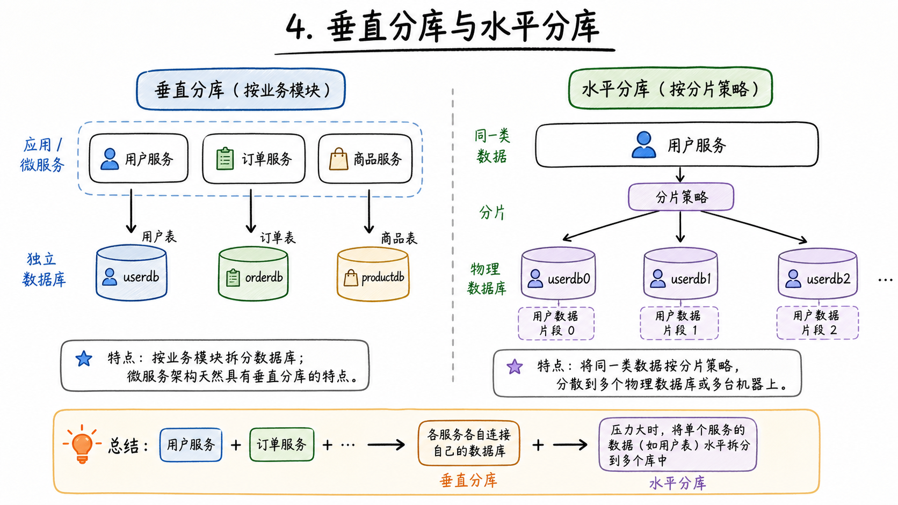

### 垂直分库

垂直分库按照业务模块拆分数据库，例如：

- 用户表放在 `user_db`
- 订单表放在 `order_db`
- 商品表放在 `product_db`

微服务架构天然具有垂直分库的特点。例如用户服务、订单服务分别连接自己的数据库。

### 水平分库

水平分库是将同一类数据按照分片策略，分散到多个物理数据库或多台机器上。

例如：

- `user_db_0`
- `user_db_1`
- `user_db_2`

每个数据库只保存一部分用户数据。

如果一个项目有用户服务和订单服务，每个服务连接自己的数据库，这是垂直分库；如果用户服务压力太大，又将用户表水平拆分到多个库中，这就是水平分库。

## 5. 分库分表的代价
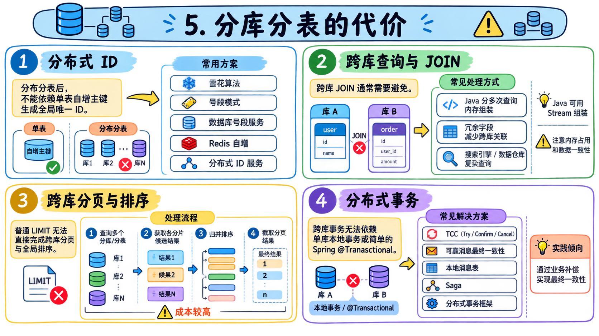

### 分布式 ID

分库分表后，不能再简单依赖单表自增主键生成全局唯一 ID。可以使用：

- 雪花算法
- 号段模式
- 数据库号段服务
- Redis 自增
- 专门的分布式 ID 服务

### 跨库查询与 JOIN

跨库 JOIN 通常需要避免。常见处理方式包括：

- 在 Java 代码中分多次查询，再在内存中组装。
- 使用冗余字段减少跨库关联。
- 通过搜索引擎或数据仓库完成复杂查询。

Java 中可以使用 Stream 等方式组装查询结果，但要注意内存占用和数据一致性。

### 跨库分页与排序

普通的 `LIMIT` 无法直接完成跨库分页与全局排序。通常需要：

1. 查询多个分库或分表。
2. 获取各分片候选结果。
3. 进行归并排序。
4. 截取最终分页结果。

这个过程的成本通常较高。

### 分布式事务

跨库事务无法直接依赖单库本地事务或简单的 Spring `@Transactional` 保证。

常见解决方案包括：

- TCC：`Try、Confirm、Cancel`
- 可靠消息最终一致性
- 本地消息表
- Saga
- 分布式事务框架

实际项目中往往更倾向于通过业务补偿实现最终一致性。

## 八、主从复制与高可用
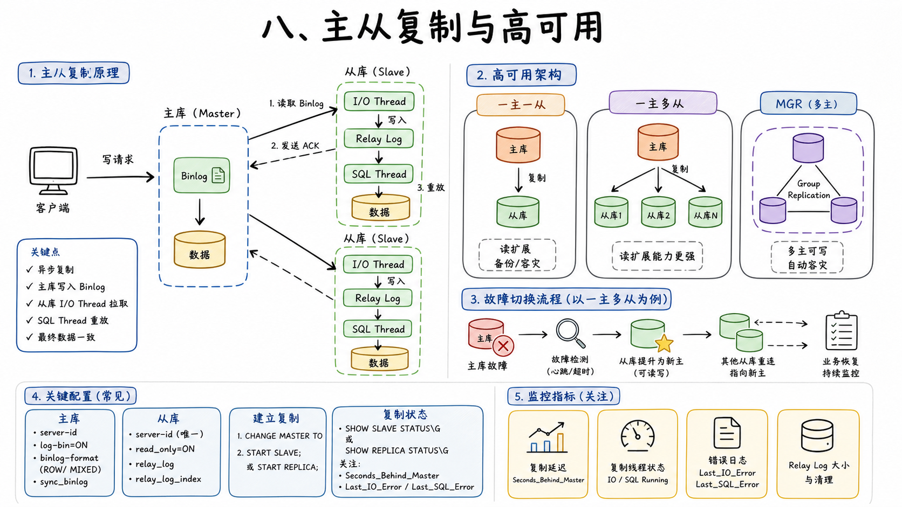

## 1. 主从复制原理
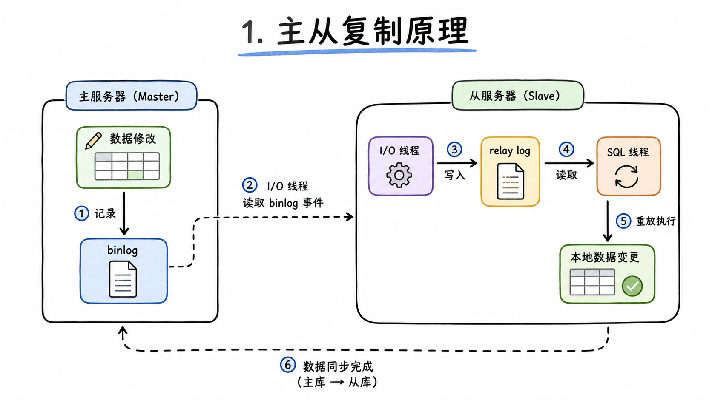

主从复制的基本流程如下：

1. 主服务器上修改数据的事件被记录到 binlog。
2. 从服务器的 I/O 线程连接主服务器，读取 binlog 事件。
3. 从服务器将接收到的日志写入本地的中继日志，即 relay log。
4. 从服务器的 SQL 线程或回放线程读取 relay log。
5. 从服务器在本地重新执行相应变更。
6. 主库的数据修改被同步到从库。

## 2. 常见主从架构
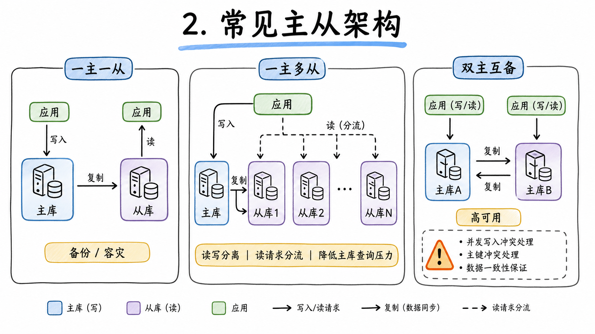

### 一主一从

一台主库和一台从库，是最简单的备份或容灾结构。

### 一主多从

一台主库负责写入，多台从库分担读请求，可以实现读写分离，降低主库的查询压力。

### 双主互备

两台数据库互为主从，用于提高可用性。但双主架构需要特别处理并发写入、主键冲突和数据一致性问题。

## 3. 主从延迟
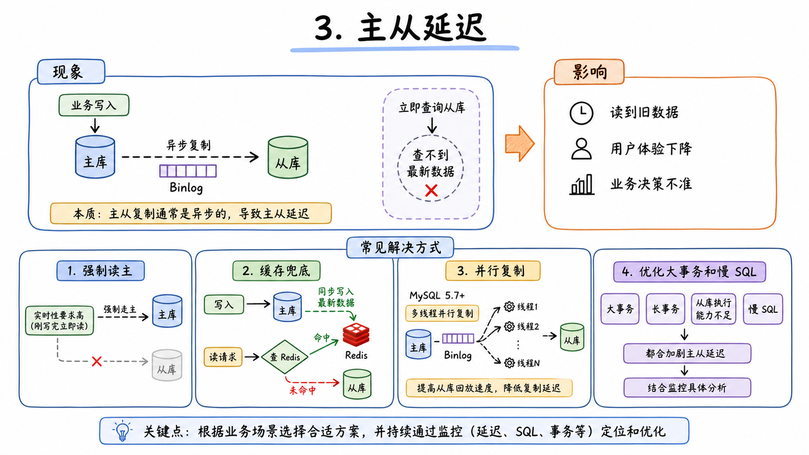

主从复制通常是异步的。业务写入主库后，如果立即查询从库，可能查不到最新数据，这就是主从延迟。

常见解决方式包括：

1. **强制读主**

   对实时性要求高的查询，例如刚写完立即读取，可以强制走主库。

2. **缓存兜底**

   写完主库后，将最新数据同步写入 Redis。读请求先查 Redis，未命中时再查从库。

3. **并行复制**

   MySQL 5.7 之后支持更完善的多线程并行复制，可以提高从库回放日志的速度，降低复制延迟。

4. **优化大事务和慢 SQL**

   大事务、长事务、从库执行能力不足以及单条 SQL 过慢，都可能加剧主从延迟，需要结合监控具体分析。

## 九、MySQL 面试复习思路
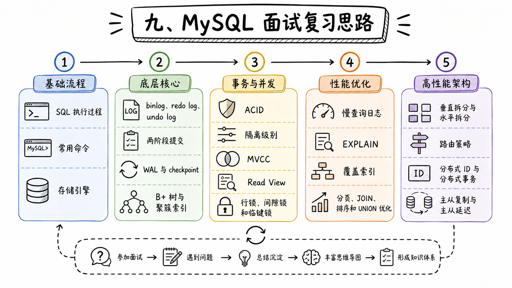

MySQL 面试内容可以按照以下逻辑串联：

1. **先掌握基础流程**
   - SQL 执行过程
   - 常用命令
   - 存储引擎

2. **再理解底层核心**
   - binlog、redo log、undo log
   - 两阶段提交
   - WAL 与 checkpoint
   - B+ 树与聚簇索引

3. **深入事务与并发**
   - ACID
   - 隔离级别
   - MVCC
   - Read View
   - 行锁、间隙锁和临键锁

4. **掌握性能优化手段**
   - 慢查询日志
   - `EXPLAIN`
   - 覆盖索引
   - 分页、JOIN、排序和 UNION 优化

5. **扩展到高性能架构**
   - 垂直拆分与水平拆分
   - 路由策略
   - 分布式 ID 与分布式事务
   - 主从复制与主从延迟

> 在不断参加面试的过程中，可以继续丰富自己的 MySQL 思维导图，把实际遇到的问题补充进去，最终形成一套更完整、更适合自己的知识体系。
