> 本页为「网络与系统负基础合集」6 篇的合订本；原文章链接会自动跳转到本页。


## 负基础篇—网络安全入门基本认知


# 负基础篇：网络安全入门基本认知

## 课程规划与学习主线

大家好，我是一只枷锁。从今天开始，我准备给大家录制一些**负基础课程**。更新时间可能不太固定：忙的时候可能不会更新，稍微闲一点时，我会尽可能多更新一些。

我大致做了一个计划，负基础篇主要会从以下几个方面带大家逐步学习：

1. 网络安全的入门认知；
2. 当前 AI 渗透的发展趋势；
3. 面向负基础学习者的快速入门课程；
4. 如果后续精力充沛，再整理一套更加完整的课程。

今天先讲网络安全的入门认知。我也整理了一份配套文档，后续会同步上传到粉丝群或交流群中。

## 什么是网络安全

## 网络安全并不只是电影里的“黑客”

很多人一听到“网络安全”，脑子里就会出现一种画面：一个戴着帽子的黑客坐在黑漆漆的房间里，面对满屏绿色代码疯狂敲键盘，然后“啪”的一声，全世界的电脑都黑了。

但那属于电影情节。真实的网络安全，与每个人的**生活、工作和钱包**都息息相关。这节课不讲复杂术语，也不讲公式，就用大白话带大家了解网络安全到底是什么。

## 从一家网店理解网络安全

先设置一个场景：假设你开了一家网店，在淘宝或拼多多上卖衣服。用户需要注册账号、登录并购买衣服，系统里会逐渐积累用户的姓名、手机号、收货地址和购买记录。你和员工则通过网店后台处理订单和发货。

这套系统的服务器需要尽可能保持 24 小时运行。大家打开淘宝或拼多多时，通常想什么时候打开就什么时候打开，这就说明平台背后的服务器需要持续提供服务。

那么，一家网店需要保护的东西到底有哪些？

有人可能会说：

> 不就是保护网站页面，不让别人篡改吗？

这当然是一个要求，但只是最低要求。用户拥有自己的账号，如果账号被别人冒用，甚至被人拿去下单，用户肯定不会乐意。用户的手机号和地址也不能随便泄露。如果今天刚在你的店里买了一件衣服，第二天就接到几十个诈骗电话，用户以后还敢不敢继续在这里买东西？

商品价格和订单金额同样不能被篡改。比如一件衣服卖 200 元，有人通过技术手段把它改成 100 元，甚至直接改成 1 元，然后一次买 1000 件，商家很可能因此遭受巨大损失。

网站还会有后台管理权限。如果后台落到黑客手里，陌生人登录后台，把所有订单全部删除了，该怎么办？网站也不能说挂就挂。双十一或“618”正卖东西时，系统突然崩溃一个小时，可能损失几十万、上百万，甚至上千万元。

出了安全事件以后，还需要考虑以下问题：

- 能不能查出是谁干的？
- 对方是怎么做到的？
- 受影响的数据和业务能不能恢复？
- 相同的问题会不会再次发生？

这些都是网络安全需要保护和处理的内容。网络安全保护的不只是一个登录页面，而是一整套东西，包括企业的**数字资产、业务连续性和用户权益**。

## 网络安全的三个基本目标

网络安全有三个基本目标，也就是常说的 **CIA 三要素**：保密性、完整性和可用性。参加软考时通常需要学习这些内容；如果只是想了解网络安全，先掌握基本含义即可。

## 保密性：不该看的人看不到

保密性指的是，信息只能由有权限的人查看。

比如账号信息、身份证号、银行卡号和购买记录，除了用户本人和业务上确实需要知道的人，其他人都不应该看到。

假设你在一家网店注册并填写了身份信息，这些信息会存放在数据库中。如果商家把数据库弄丢了，导致用户信息泄露，就说明系统的**保密性被破坏了**。

## 完整性：数据不能被偷偷修改

完整性指的是，数据不能被未授权的人篡改。

比如你转账 100 元，结果到了对方账户里却变成了 1 万元；或者网店里一件售价 200 元的衣服被人改成了 1 元，这都属于完整性被破坏。

数据不光要保存下来，还必须保证它是正确的。没有权限的人，不能随意修改数据。

## 可用性：该用的时候能够正常使用

可用性指的是，系统在需要使用时能够正常工作。

比如双十一期间想打开淘宝买东西，页面却一直转圈，始终无法使用，这就可能是可用性出了问题。

系统不是建完就算完成了。用户需要它时，它必须能够正常提供服务。

## 网络安全的基础概念

## 资产

资产是指**有价值、需要保护的东西**。

在网店场景中，用户的身份信息、地址和其他用户数据都是资产；服务器是资产；管理员账号和密码也是资产；整个业务系统同样属于资产。

简单来说，只要某样东西丢了、坏了或被人偷走以后，你会心疼、会损失钱，它就属于资产。

## 威胁

威胁是指可能给你造成损害的人、事件或行为。

常见的威胁包括：

- 网络上的黑客；
- 电脑病毒和恶意软件；
- 员工误操作；
- 员工把密码写在便利贴上，再贴到显示器旁边；
- 自然灾害、设备故障等意外事件。

因此，威胁不一定是人，也可能是某个事件或某种行为。

## 漏洞

漏洞是系统中的弱点或毛病。

比如密码设置得过于简单，直接使用 `123456`，这就属于**弱口令漏洞**。因为这种密码太常见，别人很容易猜出来。

其他常见情况还包括：

- 应该设置权限的地方没有设置，导致任何人都能进入后台；
- 配置错误，把原本不该公开的内容暴露到互联网上；
- 开发人员没有正确校验用户身份；
- 系统没有及时安装安全补丁。

安全测试本质上是在与系统设计和开发逻辑做对抗：开发者不允许普通用户执行的操作，如果我们能够通过其他方式完成，就说明系统可能存在漏洞。

漏洞通常是系统自身存在的问题，而威胁则是外部客观存在的潜在危险。

## 风险

风险是指威胁利用漏洞以后，造成损失的可能性和影响程度。

例如，外面有一个小偷，这个小偷属于威胁；你家的门锁坏了，门锁问题属于漏洞。外面既有小偷，家里的门锁又坏了，那么家里被偷的可能性就会变高，损失也可能很大，这就属于高风险。

可以简单理解为：

> **风险 = 威胁利用漏洞后，造成损失的可能性与影响。**

## 防护措施

防护措施是用来降低风险的各种技术和管理办法。

常见措施包括：

- 登录时进行身份认证；
- 通过手机号验证码进行二次验证；
- 为不同人员分配不同权限；
- 及时安装补丁；
- 记录日志，方便事后排查问题；
- 定期备份数据，以防万一；
- 对重要操作进行审计。

不同的人应该拥有不同的权限和页面展示内容，这些都属于防护措施。

## 网络安全中的攻与防

## 攻击方到底在做什么

很多人觉得网络安全就是黑客攻击、搞破坏，其实安全行业里既有“攻”，也有“防”。

安全工作中的“攻”并不是让你破坏别人的系统，而是在取得明确授权以后，站在攻击者的角度模拟黑客，对目标系统进行安全测试，从而帮助客户发现问题、验证风险并推动修复。

可以把它理解为客户对你说：

> 你来打我吧，我想看看自己的系统有哪些毛病。

你完成测试后，需要告诉客户哪里存在漏洞、会造成什么影响，以及应该如何修复。这属于合法、合规的**渗透测试或攻击模拟**。

## 防守方的持续工作

防守并不是安装一个杀毒软件就结束了，而是一套持续开展的工作。

首先要搞清楚自己有哪些资产。例如，企业有多少台服务器、多少个站点、多少套业务系统。其次，要把没有必要暴露在互联网中的内容收起来。

开发人员为了调试方便，可能会把某些接口直接暴露在外面。系统上线以后，如果这些测试接口仍然存在，就会扩大攻击面，给黑客提供更多可利用的入口。

账号权限也需要严格管理。管理员权限和普通用户权限显然不应该相同，不该给的权限不能随便给。

综合来看，攻防双方关注的是同一套系统，只是站的角度不同：

- **攻击方**：模拟攻击，看看系统哪里不行、哪里能够被突破；
- **防守方**：守住系统，监测谁在攻击、使用了什么方法，并尝试定位和溯源攻击者。

## 白帽、黑帽与合法授权

## 黑帽黑客

黑帽黑客通常是在没有得到他人同意的情况下攻击系统，目的可能是偷窃信息、牟利、勒索或搞破坏。

他们常做的事情包括：

- 获取和买卖用户信息；
- 窃取企业数据；
- 入侵服务器；
- 植入病毒或木马；
- 实施敲诈勒索；
- 控制他人电脑，用于继续实施恶意活动；
- 破坏网站和业务系统。

生活中经常有人接到莫名其妙的推销或诈骗电话，这可能意味着用户在某套系统中留下的信息已经泄露。攻击者获取信息后，可能将其卖给诈骗机构或广告公司获利。

勒索病毒对普通个人用户的攻击相对减少了。因为攻破一台普通个人电脑，再专门向用户勒索，过程复杂、成本较高、收益有限。现在很多勒索攻击更偏向银行、金融机构或其他资金较充足的重要单位，因为攻击者认为这些目标更有支付能力。

## 白帽黑客

白帽黑客是在取得明确授权后，使用安全技术帮助企业发现问题、应对风险并推动修复的人。

白帽和黑帽使用的技术可能差不多，但性质完全不同。白帽常见的工作包括：

- **渗透测试**：对客户授权的系统进行测试，并提交测试报告；
- **漏洞挖掘**：寻找各类系统中的安全漏洞；
- **红队攻防**：模拟真实攻击者，检验防守方是否能发现和阻断攻击；
- **蓝队防守**：监测攻击、分析告警并尝试溯源攻击者；
- **应急响应**：安全事件发生后，第一时间进行处置；
- **安全运营与安全研究**：持续分析风险、维护安全策略和研究新型攻击方式。

会使用安全工具，不等于就是白帽。白帽身份来自**合法授权、合规操作和负责任的漏洞处理方式**。

> 没有授权，技术再厉害，擅自对他人系统进行渗透测试，也属于越过法律红线。

大家一定要做合法的白帽黑客，不能去当黑帽黑客。

## 护网行动、攻防演练与红蓝对抗

## 什么是护网行动

网络安全中有一个常见概念叫**护网行动**。它通常是特定时期开展的网络安全保障和实战化攻防活动，一般会在每年的七八月份或八九月份出现。

不同地区、行业和单位的组织方式可能略有不同，但核心角色通常包括：

- 攻击方；
- 防守方；
- 组织方和裁判方；
- 安全服务人员。

攻击方主要负责模拟黑客，对授权范围内的系统进行攻击。防守方负责监控系统是否被攻击、分析攻击者使用的手法，并尝试定位或溯源攻击人员。

组织方和裁判方负责制定规则、确认范围、协调过程并评估最终结果。

## 什么是攻防演练

攻防演练与护网行动在本质上比较接近，只是组织范围可能不同。例如，金融行业可以组织一场行业攻防演练，某家银行或某个具体单位也可以单独组织攻防演练。

无论采用哪种形式，核心前提都包括：

1. 有明确授权；
2. 明确哪些目标可以测试、哪些不能测试；
3. 明确时间、方式和规则；
4. 通过模拟攻击和防守，检验组织的安全能力。

护网和攻防演练相关岗位通常在每年六七月份后逐渐增多，有时会持续到十一月左右。红队和蓝队选手的薪资可能比较高，但前提是能够产出成果。

例如，作为红队攻击人员，至少需要取得一定的测试成果。如果参加项目却没有任何有效产出，就很难拿到较高的报酬。

## 红队与蓝队

红队本质上是攻击队，负责模拟攻击者对目标系统开展测试。蓝队是防守队，负责监控、发现、阻断、处置和事后复盘。

攻防演练的目的并不是单纯比较“谁打进去了”“谁防住了”，也不是看谁更厉害，而是发现真实问题，例如：

- 哪些资产仍然处于暴露状态，可能被黑客利用；
- 哪些设备或系统存在弱口令，且没有及时修复；
- 安全设备能否发现黑客的攻击行为；
- 蓝队是否有能力在真实攻击发生时快速响应和处置；
- 各部门之间的信息是否互通；
- 整体响应流程是否顺畅。

因此，攻防演练本质上是为企业和业务系统做一次安全排查与能力检验。

## SRC：安全应急响应中心

## SRC 是什么

SRC 的全称是 **Security Response Center**，一般译为“安全应急响应中心”。

普通学习者不一定能赶上护网行动或攻防演练，也不一定能立刻找到相关岗位。如果想尝试挖掘漏洞、锻炼自己的技术，可以在符合规则的前提下参与 SRC。

SRC 通常由企业发布允许测试的互联网资产，让外部白帽帮助企业发现安全问题。例如，联想、腾讯、顺丰、T3 出行等企业可能会开放相应的 SRC 或漏洞提交渠道。

发现某家企业授权资产中的漏洞后，可以向对应平台提交。常见平台包括：

- 漏洞盒子；
- 补天；
- 腾讯 SRC；
- 企业自建 SRC；
- 其他第三方漏洞响应平台。

腾讯 SRC 就是腾讯安全应急响应中心，可以提交与腾讯授权资产有关的漏洞。企业通常会根据漏洞危害程度给予奖励，不同平台的奖励标准差异很大。有的平台严重漏洞奖励可能在数百元至一千多元，有的平台则可能达到数千元甚至上万元；低危漏洞的奖励通常更少。

腾讯、字节、快手、顺丰等规模较大、资金和安全团队较充足的企业，可能会自建 SRC。其他企业如果没有足够的资金或安全团队运营 SRC，也可能委托漏洞盒子、补天等第三方平台代为运营和接收漏洞。

## 提交 SRC 漏洞时的注意事项

### 1. 仔细阅读平台规则

每个平台的规则都不一样。同一个漏洞在某个平台上可能被评为低危，在另一个平台上可能被评为中危或高危，具体需要看平台的漏洞评级标准。

平台通常会公开以下内容：

- 漏洞接收规则；
- 允许测试的资产范围；
- 漏洞评级方式；
- 禁止使用的测试手段；
- 奖励标准；
- 报告提交要求。

只能测试平台明确允许的资产。如果发现的漏洞不在授权范围内，即使提交，平台也可能不予认可。

### 2. 不得影响正常业务

如果发现一个漏洞可能导致服务器宕机，不能为了证明漏洞存在就真的让服务器宕机。这样的操作可能对业务造成巨大损失，最终也可能被追究责任。

安全测试应遵循*最小影响原则*，不能以验证漏洞为理由破坏目标业务。

### 3. 只获取证明问题所需的最少数据

例如发现了 SQL 注入漏洞，不能通过 SQL 注入把对方数据库中的全部数据下载下来。

通常只需要证明以下几点：

- SQL 注入确实存在；
- 注入能够正常执行；
- 能够获取一个数据库名，或者其他最小化证明信息。

到这里就足够了。没有必要继续获取大量用户数据，更不能把全部数据下载到本地。在 SRC 平台中，这种过度测试通常是不被允许的。如果真的把对方所有数据都弄下来，事后被追责，可能就要“进去包吃包住”了。

### 4. 提交完整、清晰的报告

漏洞报告应尽可能写清楚。如果报告不完整，审核人员无法复现或认为内容缺乏依据，就可能直接驳回。

报告通常需要说明：

1. 漏洞所属资产；
2. 漏洞类型；
3. 复现步骤；
4. 必要的截图或请求信息；
5. 漏洞影响；
6. 修复建议；
7. 测试过程中是否接触敏感信息。

## SRC 不是互联网通用授权书

SRC 并不是一张可以测试所有互联网系统的通用授权书。

例如，你获得的是联想某些资产的测试授权，就只能测试规则中写明的资产。提交漏洞前，平台通常会要求你接受相关协议或保密要求。必须确认授权范围和测试边界，不能拿到一家的授权后，就顺手把其他企业也全部测一遍。

能不能测试，必须看对应 SRC 的**最新规则和资产范围**。如果搞错了范围，即使真的发现问题，也可能承担法律责任。

## 护网、攻防演练与 SRC 的区别

护网行动通常由相关单位统一组织，属于较大范围的实战化攻防活动。攻防演练可能由某个行业或某个单位单独组织。SRC 则是企业日常接收、处理外部白帽漏洞报告的渠道。

不同项目的授权和规范并不相同。例如，在某些护网或红队项目中，规则可能要求攻击方进一步证明数据库中有多少数据、包含哪些敏感信息；但在日常 SRC 中，通常不能进行过于敏感或影响业务的操作。

因此，不能把一个项目中的规则直接套用到另一个项目中。

## 网络安全测试的法律红线

## 四条基本原则

### 1. 没有授权，不能测试

一套系统能够从互联网访问，不代表你有权测试它。

> 就像别人家的门没有锁，也不代表你可以进去逛一圈。

“能够访问”不等于“有权测试”，这两件事必须分清楚。

### 2. 有授权，也不能越界

即使客户提供了授权，也只能测试授权文件中写明的资产、时间范围和操作方式。

例如，客户只允许测试 A 网站，你却顺手把 B 网站也测了，这就属于越界，同样可能违法。

### 3. 验证漏洞必须点到为止

以 SQL 注入为例，只要获得一个库名或其他最小化信息，能够证明漏洞存在即可，没有必要导出几百万条用户名或其他敏感数据。

点到为止既是职业素养，也是法律底线。

### 4. 接触到的数据必须保密

测试过程中可能会看到：

- 用户账号；
- 业务数据；
- 系统配置；
- 源代码；
- 内部信息；
- 密钥或其他敏感内容。

这些信息不能随便保存、传播、上传到公共平台，更不能拿去出售。完成必要的漏洞证明以后，应按照规则及时删除相关数据。

## 网络安全行业的常见岗位

## 安全服务工程师

很多人以为网络安全行业只有“黑客”这一个岗位，其实行业分工比想象中细得多。不同公司的岗位名称可能不一样，小公司可能要求一个人干好几种工作，大公司则可能拆分成多个团队，每个团队只负责特定事项。

**安全服务工程师**是比较常见的一线交付岗位，也是我目前从事的岗位。它通常简称为“安服工程师”，行业里也有人调侃为“安服仔”。

这个岗位覆盖面广、需求较大，对新人也相对友好，因此是不少网络安全初学者入行时最可能接触的岗位。

不同公司对安服工程师的要求不同，有些公司可能要求掌握：

- 渗透测试；
- 风险评估；
- 红队攻击；
- 蓝队防守；
- 应急响应；
- 值守监控；
- 漏洞扫描；
- 报告编写；
- 客户沟通；
- 漏洞复测和整改推进。

因此，安服工程师不仅要懂技术，还要能够写文档、做汇报并与客户沟通。

有些项目的需求比较明确，有些项目则会根据客户的额外要求增加工作内容。例如，本来接到的任务是到客户现场完成某项工作，到场后客户又提出新需求，安服工程师可能也需要配合完成。

安服岗位本身还会继续细分。有些人专门负责红队，岗位名称可能是渗透测试工程师或红队工程师；有些人专门负责蓝队监控、值守、检测和响应。

不同方向的薪资和待遇也不一样。专门打红队、专业性更强的安全工程师，薪资通常会高于只做基础漏洞扫描和简单渗透测试的普通安服工程师。专业能力越强，技术往往越值钱。

蓝队工程师则更偏向监控、值守、检测和响应。他们需要查看安全设备是否产生告警，判断告警是否真实，并决定应该如何处置。

## 项目经理

项目经理负责统筹整个项目的交付，可以理解为项目的“管家”。

主要职责包括：

- 明确项目目标、范围和验收标准；
- 制定项目计划；
- 安排渗透测试、安服等人员前往客户现场；
- 跟进项目进度；
- 管理交付质量和项目风险；
- 协调客户、公司内部团队和第三方人员；
- 处理项目过程中的资源与沟通问题。

项目经理通常需要懂一些技术，否则很难判断工作量、风险和交付质量。

很多技术型项目经理，都是从安服或其他一线交付岗位逐渐成长起来的。刚毕业就直接当项目经理通常不太现实，一般要先积累技术和项目交付经验，工作几年后才可能转向管理岗位。

## 技术支持与实施工程师

技术支持和实施工程师主要负责安全产品的部署与现场交付。这个岗位更贴近客户现场，部分工作与网络工程师存在交叉。

核心任务是把公司的安全产品部署到客户环境中，并让它正常运行。例如，奇安信、安恒、绿盟等安全厂商都有自己的安全产品，客户采购后，需要有人完成现场部署和调试。

具体工作可能包括：

- 在客户现场部署安全产品；
- 完成网络接入和设备上架；
- 调整安全策略；
- 配置防火墙、WAF、堡垒机；
- 部署 NDR、SOC 等检测或运营平台；
- 根据客户网络环境进行联调；
- 验证产品功能；
- 编写部署和使用文档；
- 培训客户使用产品。

例如，客户采购了长亭的雷池 WAF，就需要实施人员前往客户现场，把相关资产接入 WAF，配置策略并验证防护效果。

技术支持和实施岗位更偏向**产品能力**。公司培养出来的人员，可能主要熟悉本公司的设备。安服则更侧重安全测试、分析和安全服务交付。

如果在奇安信只学习奇安信的设备，之后跳槽到绿盟，可能还需要重新学习绿盟的设备。因此，从岗位灵活性来看，实施岗位可能没有安服岗位那么强。

## 售后工程师

售后工程师负责产品交付后的持续保障。

实施工程师主要负责把产品部署起来并完成交付；售后工程师则负责产品交付后出现的问题、维护和升级。

具体工作包括：

- 排查网络问题；
- 排查系统和配置问题；
- 处理兼容性与版本问题；
- 指导客户调整配置；
- 恢复产品或服务；
- 处理升级、故障和日常维护；
- 将无法解决的问题转交高级售后、研发或产品团队。

可以简单理解为：实施负责让产品成功运行，售后负责让已经交付的产品继续稳定运行。

## 销售与售前工程师

我以前一直以为销售和售前是同一个岗位，其实它们并不是一回事。

销售主要负责：

- 寻找客户；
- 维护客户关系；
- 介绍公司和产品；
- 了解成交机会；
- 推动商务流程；
- 推进合同签订；
- 进行商务谈判和资源协调。

本质上，销售需要推动客户购买产品或服务。

售前工程师则是在客户产生购买意向后，负责分析客户需求、调研客户环境、设计解决方案、演示产品、编写方案和参与投标。售前需要具备技术理解、方案设计、表达和文档能力。

一条常见的业务和交付链路是：

1. **销售**发现客户需求并推动合作；
2. **售前**调研客户现场环境，设计解决方案；
3. 客户完成采购；
4. **项目经理**统筹项目交付；
5. 如果采购的是设备，由**技术支持或实施工程师**完成部署；
6. 如果客户需要渗透测试等服务，由**安服工程师**提供安全服务；
7. 产品出现问题后，由**售后工程师**提供持续保障。

这是一条完整链路，每个环节都有对应的人员负责。

## 等保测评、安全运营与应急响应

等保测评、安全运营等方向，我目前接触得相对较少，尤其是等保测评，没有实际参与过具体项目，因此这里只能结合了解到的内容简单介绍。

**等保测评**主要依据相关标准、制度以及技术和管理要求，对信息系统开展检查和评估。例如，系统中存在大量弱口令，不符合等保要求，就需要协助相关人员整改。

**安全运营**主要涉及告警处理、日志分析、风险分析以及安全设备策略维护。

**应急响应**属于蓝队经常开展的工作。当系统遭到入侵、客户电脑感染病毒或发生数据泄露时，需要由应急响应人员及时处置。

## 安全开发与安全研究

安全产品同样需要开发人员完成，因此安全开发主要负责设计和开发安全产品，也会参与安全工具、平台和系统能力的建设。

安全研究则更偏向研究漏洞原理、新型攻击方式和新的攻击面，分析漏洞形成原因及其利用与防护方法。

## 甲方、乙方、驻场与外包

## 甲方

甲方是安全建设和业务风险的主要责任主体，例如企业、学校、医院、政府及其他企事业单位。甲方是购买安全产品和服务的一方。

甲方重点关注：

- 安全治理；
- 合规建设；
- 安全运营；
- 防守能力；
- 自身业务和数据安全；
- 内部制度与资产管理。

甲方更接近自己的业务和数据，需要重点考虑自身制度、合规和资产安全。国企、政府单位和大型组织通常都属于甲方。

甲方岗位往往更偏向蓝队防守、安全运营和合规建设，但这不是绝对的。有些规模较大、资金充足的甲方也会建立自己的红队、攻防团队或安全研发团队。

有些大型互联网企业既可能是甲方，也可能对外提供产品和服务，因此同时具有甲方和乙方属性。

## 乙方

乙方向客户提供安全产品、解决方案和专业技术服务，是出售产品和服务的一方。

常见工作包括：

- 产品销售；
- 方案设计；
- 项目交付；
- 安全服务；
- 售后保障。

奇安信、安恒、绿盟、长亭等安全厂商，都可以视为乙方单位。

## 驻场

驻场是一种工作方式，指工作人员长期或阶段性地在客户现场工作，直接配合客户完成产品维护、安全运营或安全服务。

例如，安全厂商卖给客户一套安全设备，同时配套提供年度安全服务，就可能安排安全人员驻场，协助客户开展渗透测试、设备维护和日常安全工作。

驻场人员可能负责：

- 检查设备运行状态；
- 处理入侵告警；
- 调整安全策略；
- 日常巡检；
- 排查故障；
- 处理漏洞和误报；
- 根据客户要求开展授权范围内的渗透测试。

需要特别注意：

> 人在客户现场，不代表默认拥有测试客户所有系统的权限。

每次测试都必须确认授权边界，不能因为自己是驻场人员，就擅自测试客户的全部资产。

## 外包

外包是一种用工或服务交付方式，不是具体的技术岗位。

外包人员可能从事：

- 驻场运维；
- 技术支持；
- 开发；
- 测试；
- 安全服务。

与正式员工相比，外包人员通常权限较小，对业务、工作方式和技术路线的决策权也比较有限。晋升、福利和组织归属等方面，往往也与正式员工存在差异。行业里经常有人调侃外包岗位，这也反映出部分外包人员在组织中的地位相对较低。

但这些差异主要来自岗位设置和组织关系，并不代表个人能力或职业价值一定更低。

判断一个驻场或外包岗位是否值得去，可以重点看以下几点：

1. 工作内容是有技术积累，还是每天只做重复性填表；
2. 能否接触有价值的产品、平台和真实业务；
3. 是否能够持续学习和成长；
4. 劳动合同如何签订；
5. 薪酬、社保和福利如何安排；
6. 项目结束以后，公司如何安置人员。

把这些问题搞清楚以后，再决定是否接受岗位。

## 负基础学习者如何选择方向

## 课程为什么以安服工程师为主线

这套课程主要以**安全服务工程师，也就是安服工程师**为主线，带大家了解安服工作中会遇到的问题，以及需要学习哪些技术，并从负基础阶段开始逐步学习。

之所以选择安服作为主线，是因为它是安全厂商和安全服务项目中比较常见的一线岗位，也是很多初学者入行时最容易接触的就业方向。

安服工程师覆盖范围比较广，可能需要掌握：

- 渗透测试；
- 红队攻击；
- 蓝队防守；
- 应急响应；
- 安全测试；
- 报告编写；
- 客户沟通。

规模较大的企业可能会把红队、蓝队和应急响应拆分成独立岗位。具体工作内容仍然要看公司的业务和项目要求。

## 选择方向前先回答四个问题

零基础或负基础学习者可以先问自己四个问题：

1. 更喜欢动手测试，还是分析日志和安全事件？
2. 是否愿意长期学习编程和底层系统知识？
3. 更适合项目交付，还是长期安全运营？
4. 更喜欢技术研究，还是标准流程、沟通与管理？

不同的人适合不同的岗位。

如果更喜欢动手测试、分析漏洞和解决问题，那么安服、渗透测试和红队方向可能更合适。

如果性格比较外向，善于与人沟通、推动合作和维护关系，可能更适合销售、售前或项目协调。

如果学过网络工程，对路由器、服务器、交换机比较了解，那么技术支持、实施和售后工作可能更适合。

这些问题只是帮助大家理解岗位倾向，并不是给任何人贴标签。性格、基础和能力都可以通过学习和工作发生变化。刚入门时不必马上认定自己只能做某一种工作，可以先沿着安服主线学习，再通过实际练习判断自己的兴趣和优势。

## 非科班能不能进入网络安全行业

## 专业背景不是绝对限制

今天有一位师傅问我：“我是其他专业的，你是怎么进入网络安全行业的？”

我身边很多安服工程师，并不是网络安全科班出身。有的人学机器人，有的人学物联网，有的人学计算机相关专业，也有的人专业跨度很大。比如我是管理学专业出身，甚至还见过汉语言文学专业转行做网络安全的人。

我认为，这个行业很大程度上依赖**兴趣驱动**。如果你对网络安全感兴趣，愿意学习相关技术，学会以后自然可以尝试寻找对应的工作。专业并不会把一个人完全限制住，所以不要把原本的专业当成束缚自己的枷锁。

工作本质上是为公司创造价值。只要真正掌握了技能，能够胜任工作，公司就可能接纳你。因此，不需要过分在意自己的出身或专业。

当然，也不能直接保证任何人都一定能找到岗位。前提是确实认真学习过，掌握了必要技能，并具备胜任工作的能力。满足这些条件后，无论参加面试还是正式任职，一般都不会因为“不是科班出身”而完全没有机会。

我身边就有很多这样的师傅：他们不是科班出身，只是对网络安全非常感兴趣，后来学习了相关技术，也成功找到了网络安全方面的工作。

> 相比专业名称，更重要的是兴趣、学习能力、技术积累，以及能否真正解决问题。

## 后续课程安排

这节课主要带大家了解了网络安全的基础概念、常见活动、法律红线和行业岗位。

后续会继续聊一聊当前的 **AI 渗透趋势**。如果时间允许，也会持续更新负基础课程，带大家逐步学习安全服务工程师需要掌握的相关技术。


## 负基础篇—网络通信核心认识终端、IP、端口、域名、DNS，内外网


# 网络通信：网络安全学习的地基

## 为什么要理解网络通信

大家好，我是一只枷锁。今天给大家讲一下**网络通信的核心概念**。

大家每天都在上网，但你有没有想过：当我们通过浏览器访问百度时，百度服务器是怎么知道“我来了”的？两台相隔千里的电脑，又是怎么互相通信的？

网络通信是后续学习 Web 漏洞、抓包、靶场和渗透测试的地基。如果不懂通信，就很难看懂流量；看不懂流量，入门就会变得非常困难。

这节课会把一些基础内容讲清楚，让大家在后面的学习中，无论听我讲还是听其他师傅讲，都能更轻松一些。比如提到 **CMD、PowerShell、IP、端口**时，大家至少知道它们分别是什么，不至于混淆。

> 网络安全不是单纯地“记工具”，而是要先明白设备之间如何找到彼此、如何建立连接，以及数据如何传递。

## 认识终端与基础命令

## 什么是终端

终端就是一个可以在窗口里输入命令、让计算机执行操作的地方。很多终端看起来是黑色窗口，所以也常被称为“黑框”。

它就像一个**工具箱**。后面讲到 IP、端口等内容时，都需要亲手查看和验证，因此首先要学会使用终端。

学习安全为什么一定要会命令？主要有以下几个原因：

- 很多 Linux 服务器没有图形化操作界面，只能通过命令行操作。
- 很多安全工具本身也没有图形界面，需要通过命令启动。
- 有些工具需要使用 Python、Java 等环境运行，也必须输入相应命令。
- 我们经常要通过命令查看计算机和网络的基础信息。

所以，终端是以后学习网络安全时避不开的工具。

## Windows 中的 CMD 与 PowerShell

Windows 中常见的两种终端是：

- **CMD**
- **PowerShell**

两者看起来比较相似，但能力有所不同。

CMD 的兼容性很好，执行基础命令、运行 Python 程序或启动 Java 程序通常都没有问题。PowerShell 则更加强大，可以理解为一个功能更丰富、自动化能力更强的终端和脚本环境。

它们在界面上也有一些区别：

- CMD 通常运行的是 `cmd.exe`。
- PowerShell 的窗口标题会显示 `Windows PowerShell`，经典版本的界面通常是蓝色的。

### 打开 CMD

1. 按下 `Win + R`，打开“运行”窗口。
2. 输入：

```bash
cmd
```

3. 按回车，即可打开 CMD。

这个黑色窗口就是终端，后面的很多基础命令都会在这里执行。

### 打开 PowerShell

1. 点击 Windows 的“开始”按钮。
2. 在搜索框中输入：

```text
PowerShell
```

3. 点击搜索结果即可打开。

如果运行脚本或执行命令时提示权限不足，建议右键选择**“以管理员身份运行”**。CMD 也可以通过同样的方式以管理员身份打开。

## 常用命令

这些命令现在不需要死记硬背，只要先混个眼熟即可。后续使用得多了，自然就记住了。

### 查看当前用户

```bash
whoami
```

该命令会告诉你当前正在使用哪个用户身份。

例如，执行后可能会输出计算机名和用户名的组合，从中可以看出当前登录的 Windows 用户。

### 查看 Windows 网络配置

```bash
ipconfig
```

这个命令可以查看 Windows 系统中的网络配置信息，其中比较重要的是：

- IPv4 地址
- 子网掩码
- 默认网关
- 各个网卡的状态和配置

例如，在虚拟机中执行 `ipconfig`，看到的 IPv4 地址可能以 `172` 开头。这通常是因为虚拟机处于宿主机或虚拟化软件创建的内网中。

其中，**默认网关**通常就是当前设备用来连接其他网络的路由器地址。

### 在 Linux 或 macOS 中查看网络信息

在 Linux 或 macOS 中，可以使用：

```bash
ifconfig
```

部分较新的 Linux 发行版更常用：

```bash
ip addr
```

这些命令可以查看网卡及对应的 IP 地址，包括物理网卡、无线网卡和虚拟机创建的虚拟网卡等信息。

macOS 属于类 Unix 系统，终端的操作方式与 Windows 有一定区别，但本质上都是通过命令与系统交互。有些基础命令相同，有些命令则会有所不同。

终端本身也可以更换主题、字体和颜色。我平时使用的是自己安装的终端软件，但它与系统自带终端的本质是一样的。

### 测试网络连通性

```bash
ping www.baidu.com
```

`ping` 可以用来初步测试能否连通某个目标。

如果能看到数据包返回，并且延迟时间正常、没有持续显示超时，就说明当前设备与目标之间基本能够通信。通过 `ping` 一个域名，通常还可以看到该域名解析出来的 IP 地址。

如果在虚拟机中执行后持续超时，也可能不是百度出现了问题，而是虚拟机自身的网络配置存在异常。此时可以换到宿主机中继续测试。

需要注意的是，目标不响应 `ping` 并不一定代表网站没有运行，因为有些服务器或防火墙会主动禁止 ICMP 回显响应。

## 如何阅读命令输出

像 `ipconfig` 这类命令会输出一排排结构化文本，每一项都有相应含义。

例如：

```text
IPv4 Address. . . . . . . . . . . : 192.168.x.x
Default Gateway . . . . . . . . . : 192.168.x.x
```

如果 IPv4 地址以 `192.168` 开头，通常说明它是一个内网 IP。常见的私有 IPv4 地址范围包括：

- `10.0.0.0`——`10.255.255.255`
- `172.16.0.0`——`172.31.255.255`
- `192.168.0.0`——`192.168.255.255`

如果看到这些地址，通常说明设备位于路由器或其他网关设备后面。

如果实在看不懂命令输出，可以把完整结果复制下来，交给豆包、腾讯元宝等 AI 工具，让它逐行解释具体含义。

## 终端使用技巧与常见报错

使用终端时，可以通过 `Tab` 键补全命令、路径或文件名，避免重复输入。终端用得多了，这些操作自然会越来越顺手。

如果系统提示：

```text
不是内部或外部命令，也不是可运行的程序或批处理文件
```

通常意味着：

- 命令输入错误；
- 命令本身不存在；
- 对应程序没有安装；
- 程序所在目录没有加入环境变量。

例如输入一个系统中不存在的命令，CMD 就会报出类似错误。此时应先检查拼写，再确认对应工具是否已经正确安装和配置。

## IP 地址：网络设备的门牌号

## 什么是 IP 地址

现实生活中，每栋楼、每一户都有自己的地址和门牌号。只有把详细地址告诉快递员，快递员才能找到你家。

网络也是一样的。每一台联网设备都需要一个用于定位的地址，这就是 **IP 地址**。

> IP 地址可以理解为设备在网络中的“门牌号”。

不只是电脑，手机、服务器以及其他能够联网的设备，也都会拥有相应的 IP 地址。设备之间只有知道对方的地址，才有可能找到彼此并进行通信。

## IPv4 地址的格式

常见的 IPv4 地址由四组数字组成，组与组之间使用英文句点分隔，例如：

```text
192.168.1.10
```

它具有以下特征：

1. 一共分为四段。
2. 各段之间使用 `.` 分隔。
3. 每一段的取值范围是 `0`——`255`。

如果某一段数字大于 `255`，或者不是四段结构，就不是合法的普通 IPv4 地址格式。

现在也有大量设备使用 IPv6。IPv6 地址通常更长，以十六进制形式表示，并使用冒号分隔，例如：

```text
2001:db8:85a3::8a2e:370:7334
```

现阶段先重点认识 IPv4 即可。随着后续接触增多，自然能够区分 IPv4 与 IPv6。

## 公网 IP 与内网 IP

IP 地址可以分为两类：

- **公网 IP**
- **内网 IP，也叫私有 IP**

### 公网 IP

公网 IP 是互联网上可被路由的地址，可以类比为现实地图中的公开详细地址。一个对外提供服务的网站或服务器，通常需要通过公网 IP 让外部用户访问。

如果一台设备直接暴露在公网中，就像大门直接朝向马路，全世界的人都有机会来“敲门”。因此，拥有公网 IP 并对外提供服务的服务器，必须做好安全防护。

### 内网 IP

内网 IP 只在特定局域网中有效，不能直接作为互联网中的公开地址使用。

例如，家里有一台路由器，两台电脑和几部手机都连接到同一个 Wi-Fi。路由器会给每台设备分配不同的内网 IP，这些设备属于同一个局域网，可以在网络策略允许的情况下通过内网互相访问。

但互联网中的其他人，默认无法直接通过这些内网 IP 访问家里的电脑。

常见私有地址范围如下：

| 私有地址范围 | 常见使用场景 |
|---|---|
| `10.0.0.0/8` | 大型公司、机构或规模较大的内网 |
| `172.16.0.0/12` | 企业网络、虚拟化网络等 |
| `192.168.0.0/16` | 家庭路由器和小型局域网 |

判断一个 IPv4 地址是公网地址还是内网地址时，可以先检查它是否位于这三个私有地址范围中。如果属于这些范围，它通常就是内网 IP。

## 公网与内网对安全的意义

在渗透测试中，目标有没有公网 IP、能不能从外部直接访问，是非常重要的判断依据。

- 有公网 IP并开放服务，意味着外部存在直接访问入口。
- 只有内网 IP，通常意味着外部无法直接连接。
- 如果先控制了目标的公网服务器、边界设备或路由器，就有可能继续访问其内部网络。

例如，一家企业的业务服务器对外开放并拥有公网入口。如果攻击者控制了这台服务器，就可能以它为跳板，进一步接触企业内网。

新手阶段可以先重点关注公网 IP：

> **公网 IP：互联网中的其他设备有机会找到你。**  
> **内网 IP：通常只有同一局域网或相关内部网络中的设备才能访问。**

## 端口与服务：找到设备上的具体入口

## 什么是端口

知道 IP 后，只能找到具体设备，但一台设备上可能同时运行多个服务，例如：

- 网站服务
- 数据库服务
- SSH 远程登录服务
- 远程桌面服务
- QQ、微信等应用程序
- 其他自定义服务

这时就需要通过**端口**进一步定位具体服务。

可以把 IP 和端口类比成酒店：

- **IP** 是酒店的地址。
- **端口** 是具体房间号。
- **服务** 是住在房间里的客人。

送外卖时，只写酒店地址还不够。如果没有机器人或前台代送，还需要告诉对方具体房间号，才能准确找到人。

所以，端口是用来定位一台设备上具体网络服务的标识。

## 端口号范围

端口号的范围是：

```text
0——65535
```

许多常见服务都有约定俗成的默认端口。例如：

| 端口 | 常见服务 | 用途 |
| --- | --- | --- |
| `22` | SSH | 远程登录 Linux/Unix 服务器 |
| `80` | HTTP | 普通网页服务 |
| `443` | HTTPS | 加密网页服务 |
| `3306` | MySQL | MySQL 数据库服务 |

例如，一台服务器开放了 `3306` 端口，它可能运行着 MySQL 数据库；开放了 `80` 或 `443` 端口，则可能运行着网站服务。

这里不需要马上死记硬背。后续做题、搭建环境和分析目标时会不断遇到这些端口，用得多了自然就能形成反应。

默认端口也不是绝对不变的。管理员可以修改服务使用的端口，因此看到某个端口时，只能先根据常见情况作出初步判断，最终还要结合服务识别结果确认。

## 端口开放与安全暴露面

端口开放通常意味着相应服务正在监听，并可能允许外部访问。

可以把服务器想象成一座城堡：

- 每个端口都是一扇门。
- 每扇门后面对应一个具体服务。
- 门开得越多，外部可以尝试进入的入口通常也越多。

因此，开放端口越多，潜在的**攻击面或暴露面**往往越大。如果某个服务存在漏洞，攻击者就可能通过对应端口尝试进入。

反过来，如果不需要的端口全部关闭，外部能够直接访问的入口就会减少。

不过，端口开放不代表一定存在漏洞，只代表相应服务可能对外提供访问。安全分析仍然需要结合服务版本、配置、权限和漏洞情况进行判断。

## 客户端与服务端

## 谁发起请求，谁提供服务

理解了 IP 和端口后，还要分清通信双方的角色：谁先发起请求，谁负责提供服务。

一句话理解：

- **客户端**：主动发起请求的一方，相当于顾客。
- **服务端**：提供服务、等待请求的一方，相当于饭店或店员。

大家去饭店点菜时，会主动告诉店员自己需要什么，因此顾客相当于客户端；饭店负责接收需求并提供菜品，因此相当于服务端。

常见客户端包括：

- 电脑中的浏览器
- 手机 App
- 各类主动连接服务器的软件

常见服务端包括：

- 网站服务器
- 数据库服务器
- 文件服务器
- 远程登录服务
- 其他长期等待访问的服务

## 一次完整的访问过程

以浏览器访问网站为例：

1. 用户打开浏览器，浏览器充当客户端。
2. 用户输入地址或搜索内容，相当于发起请求。
3. 服务端接收到请求。
4. 服务端根据请求进行处理。
5. 服务端把页面或数据返回给浏览器。
6. 浏览器把结果展示给用户。

例如，访问百度时，我们把百度的地址交给浏览器，浏览器向对应服务器发出请求，服务器收到后返回百度页面。

再比如查询学校课表：

- 学生通过浏览器或手机 App 发起查询。
- 学校的服务端接收请求。
- 服务端可能从数据库中查询课表。
- 查询结果返回到浏览器或 App 中。

## 为什么安全学习要理解这种关系

攻击者重点关注的通常是**服务端**，因为服务端长期开放并等待访问，例如：

- 网站
- 数据库
- 远程登录服务
- 各种对外提供功能的服务器

服务端就像一直开门等客的饭店，也是安全测试中重点分析的目标。

浏览器等客户端主要用于发起请求。在测试过程中，测试人员可能借助浏览器、抓包工具或脚本构造请求，观察服务端会如何处理和响应。

## 域名、DNS 与解析过程

## 为什么需要域名

IP 地址可以定位设备，但一串数字不方便人类记忆。比如一个网站只提供 IPv4 地址，用户每次访问都要记住那串数字，显然比较麻烦。

因此出现了**域名**。域名是便于人类记忆和使用的地址，例如：

```text
www.baidu.com
```

百度仍然有对应的 IP 地址。执行：

```bash
ping www.baidu.com
```

通常可以看到该域名解析出的某个 IP 地址。

可以这样理解：

- **域名**是方便人类记忆的名称。
- **IP 地址**是网络通信实际使用的重要地址标识。
- 两者可以指向同一个网站或服务。

需要注意的是，一个域名可能对应多个 IP，一个 IP 也可能承载多个域名，并不总是一对一关系。

## 域名的层级

以：

```text
www.baidu.com
```

为例，从右向左可以看到不同层级：

- `com`：顶级域名
- `baidu`：二级域名
- `www`：主机名，也常被视为更低一级的子域名

常见顶级域名包括：

- `.com`
- `.cn`
- `.org`
- `.top`

例如，`.cn` 和 `.com` 都属于顶级域名。`baidu.com` 是注册和使用的主体域名，而前面的 `www` 用于指向具体主机或服务。

## 什么是 DNS

DNS 的全称是 **Domain Name System**，中文叫**域名系统**。它的重要作用之一，就是把域名解析成对应的 IP 地址。

可以把 DNS 类比成手机通讯录：

- 人名相当于域名。
- 手机号相当于 IP 地址。
- 通讯录相当于 DNS。

我们可能记不住张三的手机号，但可以记住“张三”这个名字。点击通讯录中的张三后，手机会自动找到对应号码并拨打。

DNS 做的事情也类似：当我们访问一个域名时，它会帮助计算机查询相应的 IP 地址。

## 域名访问的基本流程

一次常见的域名访问过程大致如下：

1. 用户在浏览器中输入域名。
2. 计算机先检查本地是否已经缓存了对应解析结果。
3. 如果本地没有，就向配置的 DNS 服务器发起查询。
4. DNS 查询并返回该域名对应的 IP 地址。
5. 计算机拿到 IP 后，再尝试连接对应服务器的端口。
6. 服务端处理请求并返回结果。

也就是说，访问域名时通常会先通过 DNS 把域名解析为 IP，再利用 IP 和端口访问相应服务。

> 域名方便人使用，DNS 负责查询和翻译，IP 与端口则帮助网络找到具体设备和服务。

## 内网、外网与网络隔离

## 什么是内网和外网

内网通常指一定范围内的局域网，例如：

- 家庭网络
- 公司网络
- 学校网络
- 办公室网络

以家庭网络为例，家里有一台路由器，电脑、手机以及家人的其他设备都连接到同一个 Wi-Fi。这些设备通常处于同一个局域网中，并分别拥有不同的内网 IP。

外网通常指互联网。互联网上的公开服务，可以通过公网地址向全球范围内的用户提供访问。例如，百度拥有对外可访问的服务入口，用户可以通过域名或对应公网地址访问它。

## 内网设备如何访问互联网

内网设备使用的是私有 IP，但仍然能够访问互联网，这是因为路由器通常会进行 **NAT**。

NAT 的全称是 **Network Address Translation**，中文叫**网络地址转换**。

家庭中可能有多台内网设备，但对外通常共用一个或少量公网 IP。路由器会完成以下工作：

1. 接收内网设备发送的数据。
2. 将通信转换为使用路由器公网地址对外发送。
3. 记录对应的连接关系。
4. 收到外部返回的数据后，再转发给正确的内网设备。

它有点像小区传达室或负责收发信件的中间人：

- 住户先把要寄出的信交给传达室。
- 传达室统一把信送出去。
- 外面的回信到达后，传达室再根据记录交给对应住户。

在这个比喻中，路由器就是负责中转的角色。

因此，家中多台设备虽然都使用内网 IP，却可以借助路由器的公网出口同时访问互联网。

## 物理隔离与逻辑隔离

网络隔离大致可以分为两类。

### 物理隔离

两个网络之间完全没有物理连接，线路和设备层面彼此分离。

### 逻辑隔离

网络在物理上存在连接，但通过技术手段规定：

- 哪些设备可以互相访问；
- 哪些网段不能通信；
- 哪些服务允许通过；
- 哪些数据必须被拦截。

新手阶段如果觉得这部分比较难，先分清内网和外网即可。后续学习防火墙、VLAN、访问控制等内容时，会逐渐理解逻辑隔离的具体实现。

## 什么叫“不出网”

有些内网设备无法主动访问互联网。

例如，在银行或某些单位工作时，可能会发现办公设备使用的是内网 IP，并且无法访问百度等公网网站。这通常是因为网络做了隔离或访问限制。

“不出网”通常指：

> 内网中的设备无法主动连接外部互联网服务。

有些环境还会同时限制外部连接进入，形成“外面连不进来，里面也访问不出去”的隔离状态。

## 代理、抓包与隧道

## 什么是代理

现实生活中的代理，是接受委托并代替他人完成某件事的人或机构。

例如，想购买海外商品，但自己无法直接购买，于是委托本地代理商代购。代理商买到商品后，再转交给你。

网络中的代理也类似，它是一个帮助转交请求的中间人：

1. 你把请求交给代理。
2. 代理替你访问目标。
3. 目标把结果返回给代理。
4. 代理再把结果交给你。

代理又可以分为**正向代理**和**反向代理**。

## 正向代理

正向代理位于用户与目标网站之间。

访问过程大致是：

```text
用户设备 → 正向代理服务器 → 目标网站
```

用户通过代理服务器访问目标网站。目标网站直接看到的通常是代理服务器的连接信息，而不是用户直接与它建立连接。

也就是说，用户“躲在”代理服务器后面。目标网站知道代理服务器访问过它，但未必能直接看到原始用户的网络地址。

## 反向代理

反向代理位于客户端与真实服务器之间。

访问过程大致是：

```text
客户端 → 反向代理服务器 → 后端真实服务器或服务器集群
```

客户端访问的是反向代理服务器。反向代理再把请求转发给后面的真实服务器，并把响应返回给客户端。

这时，真实服务器“躲在”反向代理后面。客户端通常只知道反向代理的地址，不一定知道后端究竟有哪些服务器以及它们的真实地址。

可以简单记忆：

- **正向代理**：用户躲在代理后面。
- **反向代理**：真实服务端躲在代理后面。

## 抓包工具与代理

后续学习中会使用抓包工具。部分抓包工具会通过代理方式，让浏览器流量先经过它，再转发到目标服务器。

这样就可以观察流量中的数据，并进行分析或修改。可以把它理解为：

- 请求先被工具拦下来；
- 打开看看里面有什么；
- 根据需要分析或修改；
- 再决定是否放行。

抓到数据包后，就可以进一步研究请求参数、响应内容、身份信息以及客户端与服务端之间的交互过程。

## 什么是隧道

隧道可以先简单理解为：**把一种流量封装在另一种传输形式中，使其能够通过特定网络路径传递。**

它有点像给快递重新打包。包装完成后，只看外层不一定知道里面具体是什么。

例如，某些特殊物品需要经过检查站或通过特定运输方式寄送，就可能使用普通包装进行封装，让它看起来和其他包裹类似，再随着正常运输流程发送出去。

隧道在这里起到的是封装和传输作用。在一些场景中，它也可以增加流量识别的难度。不过，隧道的具体原理和类型比较多，后续还会继续扩展。

## 核心概念串联

网络通信的基本过程可以按下面的逻辑理解：

1. **域名**方便人类记忆网站地址。
2. **DNS**把域名解析成 IP 地址。
3. **IP 地址**帮助定位网络中的设备。
4. **端口**帮助定位设备上的具体服务。
5. **客户端**主动发起请求。
6. **服务端**接收请求并返回结果。
7. 内网设备可以通过路由器和 **NAT** 访问互联网。
8. **代理**可以在客户端与服务端之间转发请求。
9. **隧道**可以对流量进行封装并通过特定路径传输。

这些概念暂时不需要全部死记硬背。现阶段最重要的是能够分清：

- 什么是终端；
- 什么是 IP 和端口；
- 什么是公网与内网；
- 什么是客户端与服务端；
- 域名、DNS 和 IP 之间是什么关系；
- 内网设备如何通过路由器访问互联网；
- 代理和隧道大致解决什么问题。

如果某个概念还没有完全理解，可以让 AI 用更直白的方式解释，并结合生活中的地址、酒店房间、通讯录、传达室和代购等例子反复理解。随着后续抓包、靶场和渗透测试实践增多，这些概念会逐渐串联起来。


## 负基础篇——认识操作系统：主流操作系统介绍


# 课程说明与学习目标

## 建立共性问题笔记站

最近在和大家交流时，我发现很多人提出的问题都很相似，例如：

- 我现在处于哪个学习阶段？
- 接下来应该怎么学？
- 将来怎么找工作？
- 应该找什么样的工作？

因为这些问题具有很强的共性，所以我打算建立一个**在线信息网站，也可以理解为笔记站**，把常见问题及对应解答统一汇总起来，方便大家随时查看。

我会先在群里收集大家的问题，再结合自己的建议以及更专业师傅的见解，同步更新到笔记网站上。以后如果大家对未来感到迷茫，或者在学习、求职过程中遇到问题，可以先到笔记站里寻找答案。对于新出现的共性问题，大家也可以继续在群里提问，我会持续补充。

## 本节课要解决的问题

这节课主要带大家认识操作系统，不需要动手实践。学完之后，只要能对常见操作系统留下基本印象，知道它们分别是什么、来自哪里、主要应用在哪些场景，就达到了学习目标。

这里讲的“操作系统”，与大学里的**操作系统原理**课程并不相同。操作系统原理通常研究的是：

- 进程如何调度；
- 内存如何分配；
- 文件如何组织；
- 程序如何并发运行；
- 锁与死锁等底层机制。

那门课的目的，是理解操作系统的内部结构、底层理论和运行原理。本节课则主要从**实际应用和网络安全**的角度，介绍当前主流的操作系统、它们的发展脉络及应用场景，为后续学习打基础。

很多同学接触电脑多年，却没有形成清晰的系统概念，只知道“我的电脑是 Windows”“我的手机是安卓”或者“我的手机是苹果”。这一章要做的，就是讲清楚这些系统从哪里来、经历了什么，以及现在分别在哪些领域发挥作用。

## 什么是操作系统

## 操作系统是软硬件之间的“管家”

把一台电脑拆开，可以看到 CPU、内存、硬盘等各种硬件。但这些硬件不会自己干活，需要一个“管家”对它们进行统一管理和调度，这个管家就是**操作系统**。

电脑的最底层是硬件，包括 CPU、内存和硬盘；上层运行的是 QQ、微信、浏览器等软件；操作系统则位于两者之间，既负责管理硬件资源，也为软件运行提供环境。

可以把电脑比作一家公司：

- **CPU**是负责干活的人；
- **内存**是办公桌；
- **硬盘**是仓库；
- **操作系统**则是公司的行政管理部门。

行政部门负责分配资源、协调各个部门，让所有人都能正常工作。操作系统发挥的也是这种承上启下、协调各方的作用。

> 操作系统本质上是硬件与软件之间的中间层：向下管理硬件，向上为应用程序提供运行环境。

## 为什么必须有操作系统

如果没有操作系统，每个软件都需要直接操作 CPU、内存和硬盘等底层硬件。这样不仅开发难度极高，换一台硬件配置不同的电脑，软件甚至可能还要重新编写。

操作系统把复杂的底层操作封装成统一接口，软件只需要调用这些接口，就能完成文件读写、画面显示和网络通信等工作。

*没有操作系统的电脑，基本就是一个不会动的铁皮盒子。*

平时双击图标、移动鼠标、敲击键盘，本质上都是由操作系统接收并转达：它把用户的操作“翻译”给硬件，再把硬件的处理结果通过画面、声音等形式呈现出来。

由于厂商、设备类型和使用目的不同，设备所采用的操作系统也会有所区别。

## 操作系统的主要分类

## 桌面端操作系统

桌面端操作系统主要供个人电脑使用，例如：

- **Windows**
- **macOS**

大家日常使用的家庭电脑、学校机房电脑和办公电脑，大多属于桌面端设备。

## 服务器端操作系统

服务器端操作系统主要部署在公司机房、数据中心或个人服务器上，用来持续对外提供网站、数据库等服务。常见系统包括：

- **Linux**
- **Windows Server**
- **UNIX**

例如微信的后台服务和数据库需要全年不间断运行，它们所在的主机就属于服务器端。服务器通常需要保持长期在线，不能像个人电脑一样不用时就随手关机。

## 移动端操作系统

移动端操作系统就是手机和平板电脑所使用的系统，主流产品包括：

- 苹果手机和平板使用的 **iOS / iPadOS**；
- 华为设备使用的 **HarmonyOS（鸿蒙系统）**；
- 小米、Redmi、vivo 等大量厂商的手机主要使用基于 **Android** 的系统。

移动端与日常生活联系最紧密，大家每天聊天、看视频、使用移动应用，基本都离不开手机操作系统。

## 嵌入式与专用操作系统

嵌入式和专用操作系统往往是根据具体设备定制的系统，很多产品基于 Linux 或其他实时操作系统开发，常见于：

- 路由器；
- 智能电视；
- 车载系统；
- 公共设备；
- 机器人及其他智能硬件。

简单来说，桌面端主要给人直接使用；服务器端用于长期运行服务；移动端服务于手机和平板；嵌入式系统则隐藏在各种专用设备内部。

## Windows：最常见的桌面操作系统

## Windows 的来源与特点

Windows 是微软开发的操作系统。“Windows”直译就是“窗口”，它的核心特点之一，就是让普通用户通过窗口、图标和鼠标完成操作。

在图形化操作系统普及前，很多电脑主要通过 **DOS 命令行**进行操作。用户需要输入命令，才能创建、读取或管理文件，这种方式对普通人并不友好。

微软希望做出一个人人都能通过鼠标点击使用的操作系统，于是推出了 Windows。现在打开 Windows 电脑，可以直接看到桌面上的一个个图标，点击后就能运行对应程序，不再要求普通用户掌握大量命令。

## Windows 的常见应用场景

Windows 在日常生活和办公环境中非常常见，例如：

- 家庭个人电脑；
- 学校机房；
- 公司办公终端；
- 政府、金融及传统单位的内部业务系统。

只要使用过电脑，基本都接触过 Windows。大多数公司员工使用的办公电脑，也以 Windows 为主。

微软同时提供服务器版本，即 **Windows Server**。它经常出现在政府、金融机构和传统企业的内部业务系统中，被当作服务器操作系统长期运行。

## macOS：苹果电脑的操作系统

## macOS 的使用场景

macOS 是苹果电脑使用的操作系统，主要运行在 MacBook、iMac、Mac mini、Mac Studio 等设备上。

它与 Windows 一样，都属于面向个人电脑的桌面操作系统。macOS 上同样可以使用 QQ、微信、浏览器和 WPS 等常见软件，只是不同系统在交互方式、软件生态和整体体验上有所区别。

如果有机会，可以多体验几种操作系统。有人觉得 macOS 更适合自己，就选择 Mac；如果觉得 Windows 用起来更习惯，继续保持原来的使用习惯也完全没有问题。

> 操作系统没有绝对的“最好”，更重要的是它是否适合自己的使用场景和操作习惯。

## Linux：服务器与安全领域的核心系统

## Linux 的诞生

Linux 对初学者来说可能没有 Windows 那么熟悉，但只要深入接触计算机、服务器或网络安全，就一定绕不开它。

1991 年，芬兰大学生 **林纳斯·托瓦兹（Linus Torvalds）**觉得当时使用的 MINIX 存在限制，于是开始编写自己的操作系统内核，并将其发布到互联网上，逐渐发展为今天的 **Linux 内核**。Linux 的标志性吉祥物是一只企鹅，名字叫 **Tux**。

Linux 能够形成完整可用的系统，也离不开前人的积累。GNU 项目已经提供了大量自由软件和开发工具，Linux 内核与这些工具结合后，构成了常说的 **GNU/Linux 操作系统**。

Linux 也是开源精神的重要代表之一。任何人都可以查看、研究和修改它的源代码，全球开发者能够共同参与维护。

## 开源与闭源的区别

Windows 和 macOS 的核心系统代码主要属于商业公司的闭源代码。普通用户可以直接使用系统，但通常无法查看其全部源代码，也不能任意修改和重新发布。

Linux 则是开源的，源代码公开，任何人都可以在遵守许可证的前提下进行查看、修改和分发。

Linux 具有**开源、免费、稳定、可定制**等特点，因此很快在服务器市场中发展起来，并衍生出大量发行版。这些发行版通常使用相同的 Linux 内核，但在软件打包、桌面环境、管理工具和更新策略上有所区别。

## Debian：老牌稳定的发行版

**Debian** 是历史较久、以稳定著称的 Linux 发行版，由社区维护。它常见于服务器环境，也是许多其他发行版的基础。

Debian 的特点包括：

- 社区维护；
- 稳定性较高；
- 软件包体系成熟；
- 被大量发行版作为底层基础。

例如网络安全领域常见的 **Kali Linux**，就是基于 Debian 构建的。学习初期不一定要记住所有细节，但看到 Debian 的名称或 Logo 时，应该能反应过来：它是一个 Linux 发行版。

## Ubuntu：适合入门的 Linux 发行版

**Ubuntu** 也是非常常见的 Linux 发行版，由 Canonical 公司推动，基于 Debian 开发，更强调普通用户和开发者的使用体验。

Ubuntu 的文档、教程和社区资料很多。如果使用过程中遇到问题，通常很容易通过搜索找到答案。它广泛用于：

- 个人电脑；
- 开发环境；
- 云服务器；
- 个人服务器；
- 虚拟机和实验环境。

如果想入门 Linux，Ubuntu 是一个比较推荐的选择。很多用于练习的靶机，本质上也是基于 Ubuntu 或其他 Linux 发行版搭建的。

## CentOS：传统企业里的老朋友

**CentOS** 曾是国内企业服务器环境中的常见系统。它过去主要以 Red Hat Enterprise Linux，也就是 **RHEL** 的源代码为基础，提供高度兼容的免费发行版，因此一度成为许多企业服务器的主流选择。

后来 CentOS Linux 的发展路线发生变化，旧版本也陆续停止维护，项目重心转向 **CentOS Stream**。因此，现在仍可能在一些老旧客户现场或历史业务系统中遇到传统 CentOS。

看到 CentOS 的名称或 Logo 时，需要知道它是 Linux 发行版，且长期与企业服务器环境联系紧密。

## Kali Linux：面向安全测试的发行版

**Kali Linux** 是面向网络安全和渗透测试的 Linux 发行版，预装了大量安全测试工具。用户通常不需要逐个下载，只要更新软件源和工具包，就能直接使用。

不过从个人实际工作经验来看，Kali 并不是所有渗透测试工作的必需品。它更常用于：

- 搭建靶场；
- 构建测试环境；
- 进行专项安全实验；
- 快速调用预装的安全工具。

真正工作时，不一定每天都要使用 Kali。很多渗透测试工具可以直接安装在 Windows 或普通 Linux 系统上，例如在 Windows 中安装 **Burp Suite** 等工具，通常就能完成大量工作。

所以，学 Kali 可以先“图一乐呵”，不要把“会用 Kali”误认为“会做渗透测试”。真正需要掌握的是渗透测试方法、网络协议、系统原理和工具背后的逻辑。

## 虚拟机与多系统体验

## 不重装电脑也能学习其他系统

假设当前使用的是 macOS，但又想体验 Windows 11、Ubuntu 或 Kali Linux，没有必要把电脑原来的系统直接刷掉。

安装虚拟机软件后，可以在当前操作系统中创建一个虚拟环境，再将其他操作系统作为虚拟机运行。例如：

1. 在 macOS 中安装虚拟机软件；
2. 创建一台虚拟机；
3. 导入 Windows 11、Ubuntu 或 Kali Linux 的镜像；
4. 在虚拟环境中启动并使用对应系统。

Windows 用户同样可以使用虚拟机安装 Ubuntu、Kali Linux 等系统。不同电脑和处理器架构的安装方法可能不完全相同，但相关技术已经比较成熟，网上也能找到大量教程。

虚拟机非常适合学习、体验和搭建实验环境，不必为了学习 Linux 就把自己的 Windows 电脑直接刷成 Kali 或 Ubuntu。

## Linux 的主要应用场景

## 网站服务器与云计算

全球大量网站和互联网公司的后台服务都运行在 Linux 服务器上。阿里云等云计算平台提供的许多云服务器，默认或常用的操作系统也是 Linux。

Linux 还广泛应用于：

- 网站服务器；
- 数据库服务器；
- 云计算平台；
- 容器和虚拟化环境；
- 超级计算机。

## Android 与智能设备

Android 的底层使用 Linux 内核，因此 Android 中的许多内部机制和 Linux 存在联系。手机开启调试模式后，通过终端工具可以看到，一部分 Linux 命令在 Android 环境中同样可以使用。

Android 因为开放程度较高、可定制性较强，众多手机厂商都可以基于它开发自己的系统界面和功能，因此迅速占据了全球智能手机市场的大量份额。

除手机外，Linux 还常见于：

- 路由器；
- 智能电视；
- 车载系统；
- 机器人；
- 各类智能设备。

正因如此，Linux 不仅是一套服务器系统，也成为大量产品和服务的底层基础，是计算机行业中非常重要的技术成果。

## 主流移动操作系统

## Android：开放且普及的移动系统

Android 是当前最主流的移动操作系统之一，主要应用在智能手机和平板电脑上，也会出现在车机等设备中。

它基于 Linux 内核，开放程度较高，手机厂商可以在其基础上进行定制。因此，小米、Redmi、vivo 等大量厂商都推出了基于 Android 的手机系统。

## iOS：苹果的移动操作系统

**iOS** 是苹果 iPhone 使用的操作系统，iPad 目前使用的是从 iOS 体系发展而来的 **iPadOS**。

iOS 与 macOS 在技术脉络上同源，都继承了 UNIX 体系中的许多设计。它与 Android 长期处于竞争关系。

iOS 的生态相对封闭，苹果对硬件、系统和应用商店拥有较强的控制力，因此系统一致性、安全管控和用户体验通常较好，运行也比较流畅。它在欧美市场占有很高地位，在国内同样拥有大量用户。

如果同时使用 iPhone、iPad 和 Mac，还可以通过设备协同形成较完整的苹果生态。

## HarmonyOS：逐渐常见的国产系统

**HarmonyOS，也就是鸿蒙系统**，是华为推出的操作系统，应用于华为手机、平板及其他智能设备。

随着国产化推进，鸿蒙在政企和国企场景中的发展较快。未来从事安全相关工作时，也会接触到更多鸿蒙设备。

例如在实际渗透测试项目中，一个客户的业务可能同时包含网站和移动 App，而移动端又需要分别考虑：

1. Android 端；
2. iOS 端；
3. HarmonyOS 端。

因此，鸿蒙也会逐渐成为安全测试中需要认识和关注的操作系统。不过移动端通常会作为专项测试内容，与传统网站渗透测试的方式并不完全相同。

## Windows Server 与 UNIX

## Windows Server：微软的服务器系统

Windows Server 是微软推出的服务器操作系统，历史上出现过 Windows Server 2008、2012、2016 等多个版本，后续也在持续更新。

它的界面与桌面版 Windows 比较相似，但用途不同。普通 Windows 电脑通常用于个人办公，不使用时可以关机；Windows Server 则作为服务器运行，需要长期保持在线，为外部或内部用户提供服务。

Windows Server 在传统企业、政府和金融机构中仍然比较常见，尤其经常用于：

- 内部业务系统；
- 文件共享；
- 身份认证；
- 办公网络；
- **Active Directory 域环境**。

## UNIX：操作系统领域的老前辈

UNIX 出现得很早，可以说是现代操作系统的重要祖师爷之一。C 语言也与 UNIX 的发展密切相关，最初就是为了更方便地重写和实现 UNIX 而设计的。

如今普通用户可能很少直接接触 UNIX，但在一些对稳定性要求极高的领域，它仍然存在，例如：

- 大型机和关键业务系统；
- 银行核心系统；
- 科研机构；
- 高可靠性计算环境。

macOS 直接继承了 UNIX 技术体系中的许多内容；Linux 虽然不是直接由 UNIX 源代码发展而来，但在设计理念和接口规范上深受 UNIX 影响。

它们之间可以大致理解为：

- **UNIX** 是重要的技术源头；
- **Linux** 参考和继承了 UNIX 的许多理念，并发展为开源内核；
- **macOS** 则建立在具有 UNIX 血统的技术基础之上，逐渐演变为今天的苹果桌面操作系统。

UNIX 虽然很老，但它的思想依然无处不在。

## 网络安全应重点关注哪些系统

## 重点学习 Windows 与 Linux

操作系统很多，但从主流网络安全工作来看，最需要关注的是：

- **Windows**
- **Linux**
- **Windows Server**

Android、iOS 和 HarmonyOS 属于更细分的移动安全方向。如果只讨论常见的渗透测试、企业内网和服务器安全，Windows 与 Linux 仍然是核心。

## 原因一：大多数服务器运行在 Linux 或 Windows Server 上

访问一个网站时，背后通常有一台或多台服务器在持续运行。全球大量网站服务器采用 Linux；Windows Server 则常见于政府、金融机构和传统企业的内部业务系统。

如果以后成为安全服务工程师，到客户现场看到的服务器，基本也以这两类系统为主：要么是 Linux，要么是 Windows Server。

## 原因二：企业办公终端以 Windows 为主

企业内网中的员工电脑、文件共享和办公系统，大多属于 Windows 体系。

攻击者如果成功控制一台 Windows 办公电脑，可能以它作为突破口，在企业内网中继续进行：

1. 信息收集；
2. 权限提升；
3. 凭据获取；
4. 横向移动；
5. 控制更多主机。

最终，攻击者可能控制企业的大半个内网，甚至整个内网。因此，Windows 是内网安全中必须掌握的系统。

## 原因三：攻击环境与目标环境往往同时涉及两类系统

渗透测试人员常用的工具和靶机环境，很多运行在 Linux 上，例如 Kali Linux、Ubuntu 以及各种 Linux 靶场。

甲方的服务器通常以 Linux 为主，但员工办公终端又以 Windows 为主。也就是说，安全人员往往需要同时面对两类环境：

- 攻击工具平台可能是 Linux；
- 目标服务器可能是 Linux；
- 办公终端和内网环境可能是 Windows；
- 传统业务系统也可能运行在 Windows Server 上。

所以两边都要懂：既要能看懂和使用工具，也要理解目标系统的结构、权限和运行方式。

## 不同安全场景中的系统分布

## 渗透测试与客户现场

渗透测试人员常见的本地工作环境包括 Windows、macOS 和 Linux，也可能使用专门的虚拟机作为工具机。

到了客户现场，接触较多的通常是：

- 以 Linux 为主的网站和业务服务器；
- 以 Windows Server 为主的传统业务与域环境；
- 以 Windows 为主的办公内网终端。

Android、iOS、HarmonyOS 等移动系统并非完全不会遇到，但通常会由移动安全专项负责测试，而不是完全照搬传统网站渗透测试方法。

## 本节学习重点

这节课不要求立刻掌握每种操作系统的安装与操作，只需要做到以下几点：

- 知道常见操作系统分别叫什么；
- 看到名称或 Logo 时，能大致判断它属于什么系统；
- 理解桌面端、服务器端、移动端和嵌入式系统的区别；
- 认识 Windows、macOS、Linux、Android、iOS、HarmonyOS、Windows Server 和 UNIX；
- 重点记住 Debian、Ubuntu、CentOS、Kali Linux 等常见 Linux 发行版；
- 明白网络安全学习为什么要重点关注 **Windows 与 Linux**。

后续学习也会主要沿着 Windows 和 Linux 两条路线向外延伸，不断深入系统使用、服务器管理、渗透测试和企业内网安全等内容。


## 交换机：先认清面板口，再谈 VLAN 在干嘛

很多人一上来就背 `switchport mode access`，面板上那些口还分不清。口认错了，VLAN 配得再漂亮也是空转。这篇按现场顺序走：先把面板摸清楚，再讲 VLAN 到底切的是什么。

材料合了两份笔记：端口详解（面板物理口）+ VLAN 在干嘛（广播域 / Trunk / 三层）。厂商私有堆叠口另说，这里只覆盖常见面板。

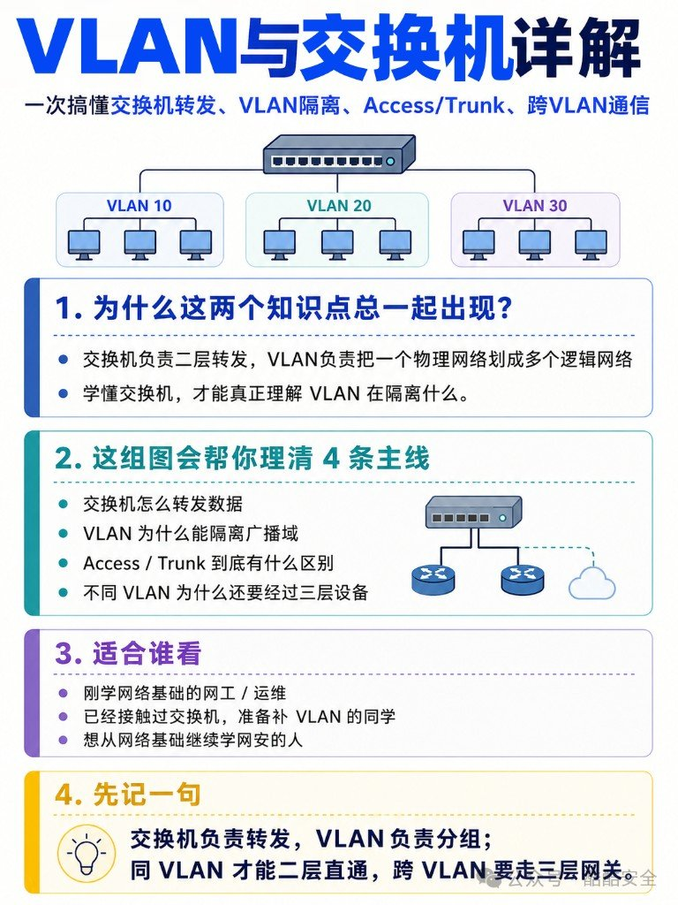

## 面板先认一遍

常见机型大致是：一排 RJ45 业务口 → 右侧 SFP+ 上联 → CONSOLE / MGMT → 指示灯（PWR / SYS / STAT / PoE）。

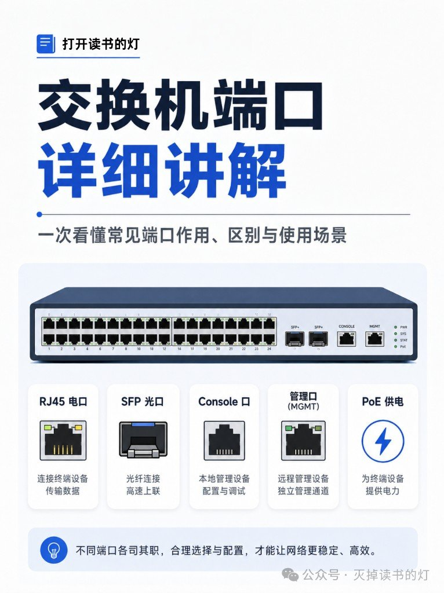

记这句就够：**业务走电口或光口，运维走 Console / MGMT，供电看 PoE。**

## 六类口，别按长相分组

| 类型 | 干什么 | 典型场景 |
|---|---|---|
| RJ45 电口 | 网线接终端，传数据 | 电脑、打印机、摄像头、AP、话机 |
| SFP 光口 | 插光模块，中长距离 / 高速链路 | 楼宇互联、上联 |
| SFP+ | 常见万兆上联 | 交换机互连、服务器高速接入 |
| Console | 本地 CLI，初始配置 / 救场 | 没配 IP、SSH 挂了 |
| MGMT | 独立管理通道，不跑业务流量 | 远程运维、权限隔离 |
| PoE | 网线同时传数据 + 供电 | AP、话机、摄像头、门禁 |

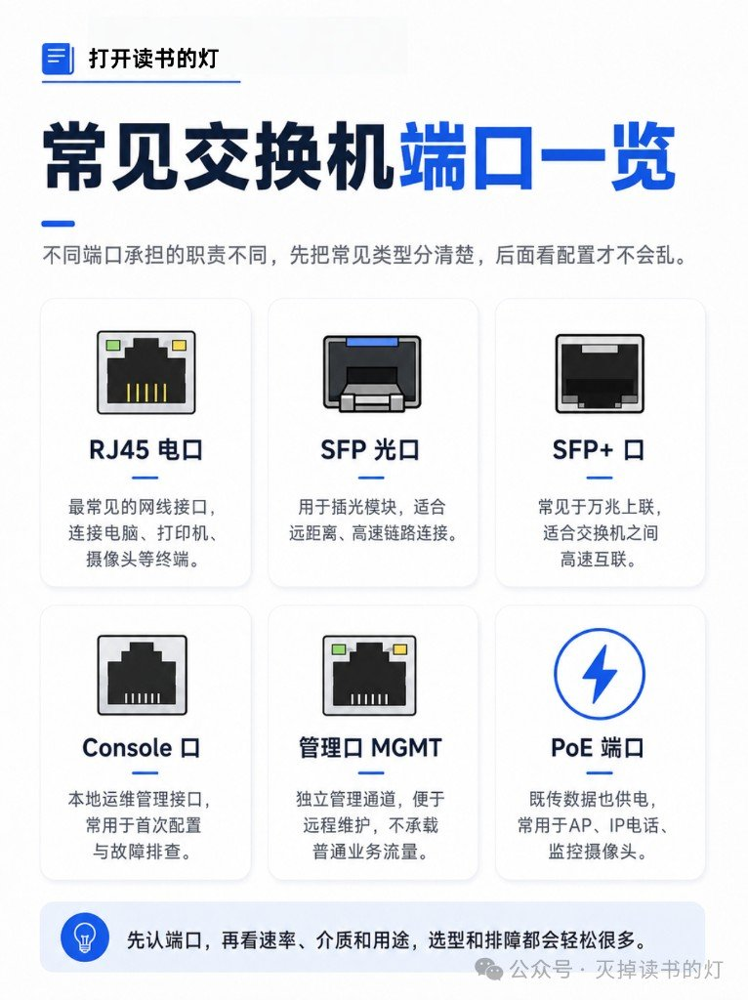

### RJ45：近距离接入首选

外观就是插水晶头的电口，面板上最常见。速率从 10M / 100M / 1000M 到 2.5G、5G、10G 电口都有。

两点别踩：双绞线有效距离大致 ≤100 米；线规（Cat5e / Cat6）、协商速率、指示灯要一起看。设备就在附近、用网线就能到 → 默认先想 RJ45。


### SFP 和 SFP+：槽长得像，速率差一截

| | SFP | SFP+ |
|---|---|---|
| 常见速率 | 千兆 | 万兆 |
| 典型用途 | 中长距离光链路 | 交换机上联、高速互连 |
| 注意 | 要先插模块；也可用电口模块 | 同样要匹配模块与光纤 |

插槽本身不能直接插裸纤。模块速率、接口类型、传输距离要对齐；单模 / 多模、双纤 / 单纤也要和现场光缆匹配。

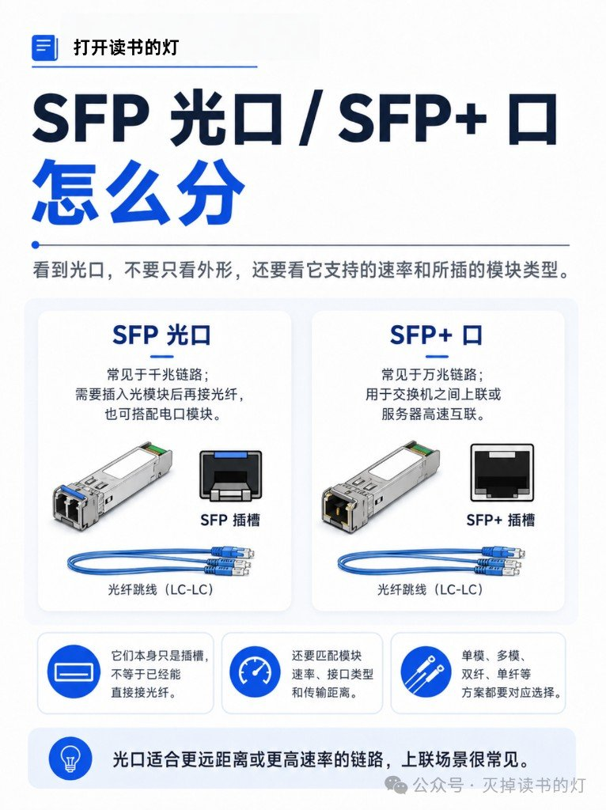

### Console：本地救场口

Console **不跑业务流量**。干的是：本地登录，做初始配置、排障、系统恢复。常见接法：电脑 → Console 线 → CONSOLE 口，再用 PuTTY / SecureCRT 进 CLI。

IP 还没配上、SSH 进不去、远程全挂时，它往往是唯一还能说话的口。

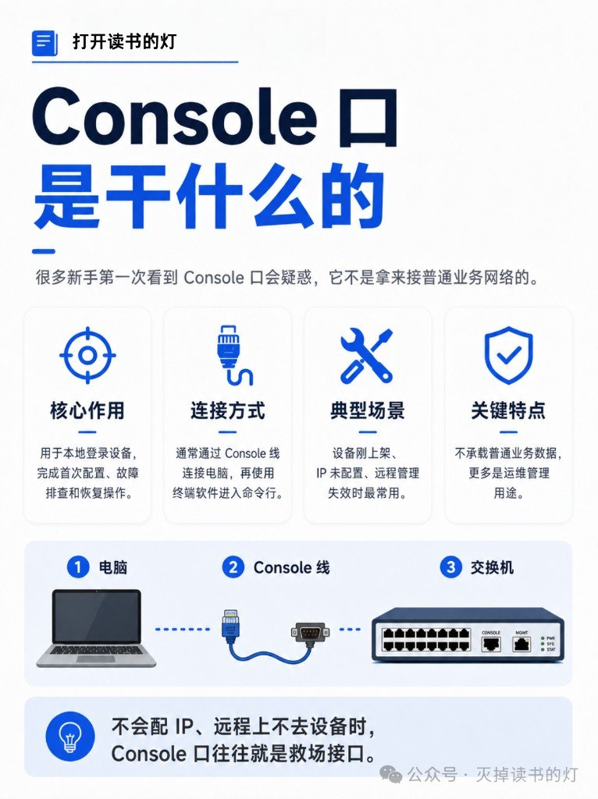

### MGMT ≠ 业务口

管理口和普通业务口外观可能都是 RJ45，职责完全分开：MGMT 接独立管理网、不转发一般用户业务；业务口才承载 VLAN、速率、链路状态这些日常关注点。别把管理口当成「多一个普通网口」乱用。

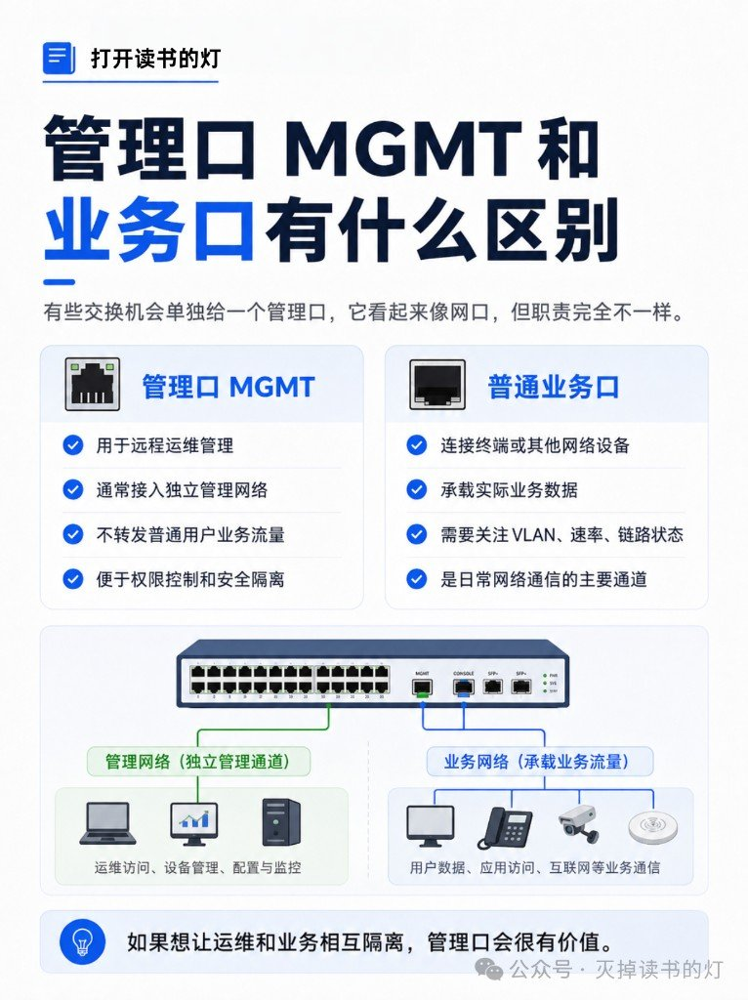

### PoE：一根线解决数据和电

常见落点：无线 AP、IP 电话、监控摄像头、门禁。标准常见 802.3af / at / bt，功率逐级抬高。上手前确认三件事：交换机是否支持 PoE、标准是否对得上终端、**整机功率预算**够不够（不是单口标了 PoE 就能全插满）。

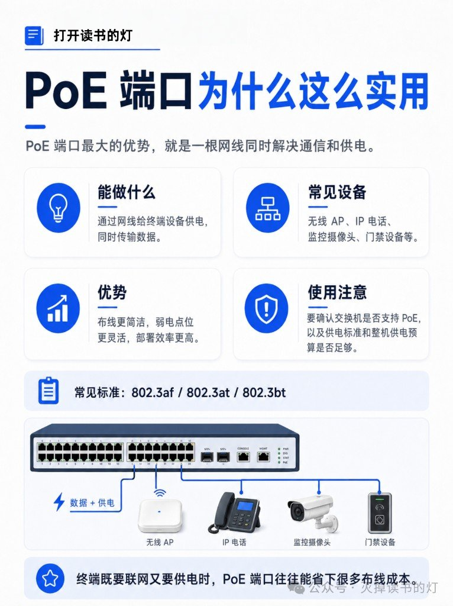

## 看端口时盯住这四件事

1. **形态**：RJ45 / 光口槽 / Console / MGMT，先分清是谁
2. **速率**：1G、10G、25G、40G+，决定性能天花板
3. **介质**：网线、光纤、模块类型，两端必须匹配
4. **场景**：终端接入、上联、远程运维、还是 PoE 供电


常见误区：光口不是插上光纤就通（模块与光纤要对）；管理口不是普通业务口；PoE 要看整机功率预算。端口认清了，后面配 VLAN、查链路、选型号都会顺手很多。

---

## 交换机先学 MAC，再决定往哪扔

口接对了，帧进交换机还要看两样：源 MAC 用来记「谁从哪个口进来」，目的 MAC 用来决定往哪送。

| 目的 MAC | 行为 |
|---|---|
| 表里有 | 单播，只送到对应口 |
| 表里没有 | 泛洪到同 VLAN 其它口 |
| 广播 | 也只在同 VLAN 内铺 |

交换机的本职是二层转发；VLAN 不是换一台机器，是在同一台物理交换机上把流量切成逻辑组。


## VLAN 切的是广播域，不是「安全银弹」

不划 VLAN：整机一个大广播域，ARP 一类广播跟着设备数一起涨，管理也糊成一锅。

划了之后：物理一张网，逻辑多个广播域——同 VLAN 二层通，不同 VLAN 默认二层隔离。常见切法按部门、业务（办公 / 访客 / 服务器）、或管理需要。

VLAN ≠ IP 子网。前者二层广播域，后者三层地址段；实务常一对一映射，别当成同义词。同一 VLAN 也能跨多台交换机延伸，前提是中间链路（多半是 Trunk）真的在扛这个 VLAN。


## Access / Trunk，加上 802.1Q 那张「行李牌」

| | Access | Trunk |
|---|---|---|
| 常接 | PC、打印机 | 交换机、路由器上联 |
| 承载 | 通常一个 VLAN | 多个 VLAN |
| 标签 | 终端侧常见帧不带标签 | 靠标签区分 VLAN |

Access = 单 VLAN 接入口；Trunk = 多 VLAN 运输通道。终端走 Access，交换机互连走 Trunk——记这个比背命令有用。

Trunk 上多出来的那截是 802.1Q：插在源 MAC 和 Type 之间。TPID 多半是 `0x8100`，真正要命的是 12 bit 的 VLAN ID。标签服务交换机之间的链路，不是让你在终端上手搓解析。

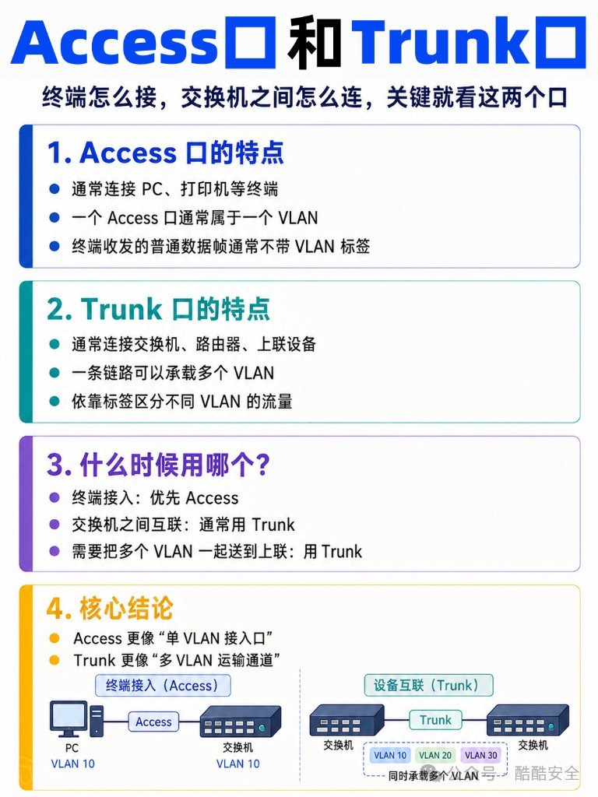

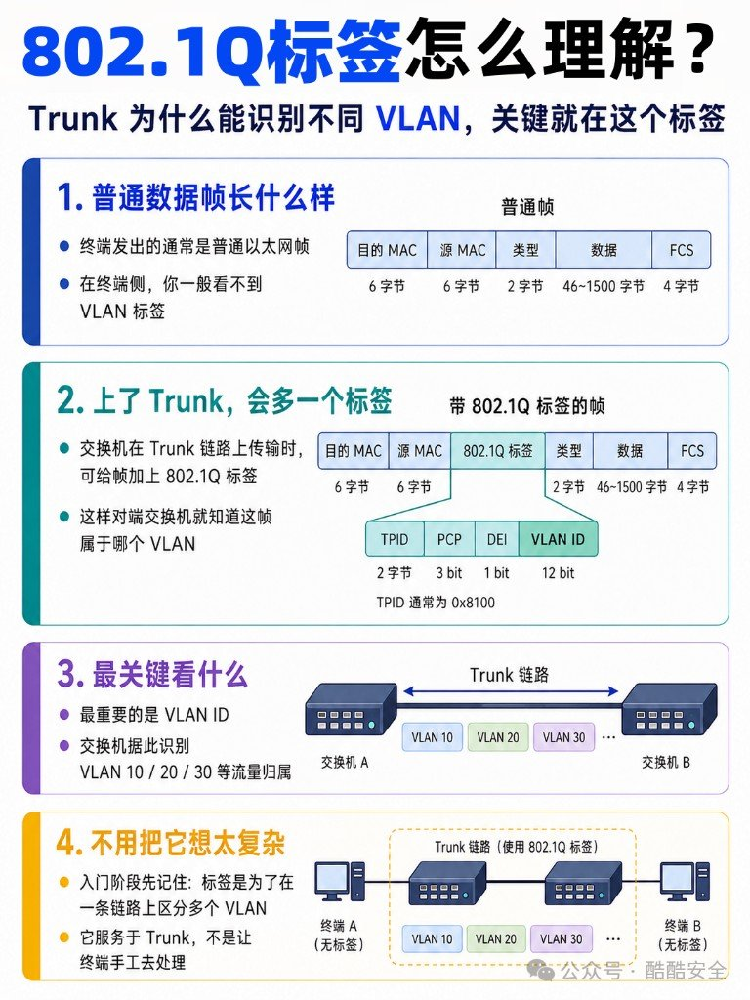

## 跨 VLAN：必须撞上三层

同 VLAN：同一个广播域，交换机二层就能转。  
不同 VLAN：普通二层交换机不会把它们桥在一起——这不是 bug，是隔离本身。

谁来打通：默认网关 / 路由器 / 三层交换机。常见做法是三层交换机上每个 VLAN 一个网关口（SVI 一类）。

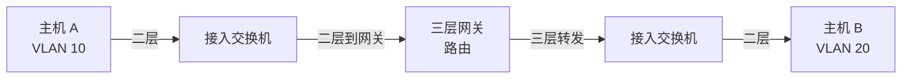

不同 VLAN 互通 = 三层转发。没网关，Access/Trunk 配得再漂亮也白搭。

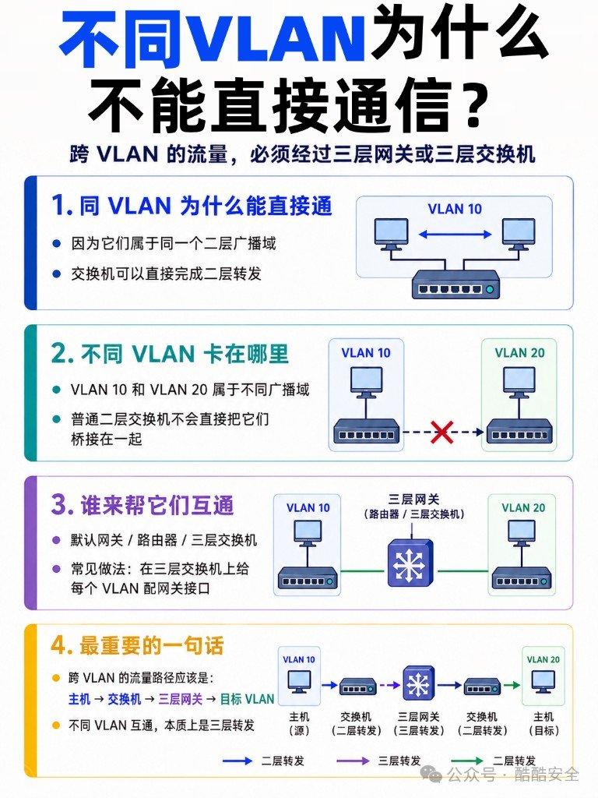

## 企业落地就这几句

示意划分：VLAN 10 办公、20 访客、30 服务器、99 管理。终端口 Access，上联 Trunk，核心三层交换机扛各 VLAN 网关。

1. 交换机：二层转发  
2. VLAN：隔离广播域  
3. 跨 VLAN：必须过三层设备  

VLAN 让广播域和管理边界清楚，别当成 ACL、零信任或「划完就安全」。网安往下学，这只是地板，不是天花板。


## 适合谁，我怎么记

如果你还在「口都分不清就开配 VLAN」的阶段，先把面板六类口过一遍，再回来看广播域这三句。已经会配 Access/Trunk 但跨 VLAN 总不通——先查有没有三层网关，别在命令字上空转。


## Linux 目录：先认核心位置，别死背整棵树

新手卡 Linux 目录，最容易把自己塞进「把 FHS 整张表背下来」的坑。真干活时你只需要先认几个**常去的位置**——改配置、查日志、找程序、回用户家，路熟了，整棵树自然长出来。

原料：公众号「小杰讲网络安全」运维速记图卡（主体六张）+ 「小林coding」《Linux目录结构详解》全景一图（并入文末对照卡）。

同系列还有「磁盘维护命令」「从加电到可登录」两篇运维速记，本篇先把目录认熟。

下面按「先看总览 → 认家 → 认干活三件套 → 补高频八目录 → 按用途记 → 整树对照」压成可带走的速记。

## 先看这张总览


整棵树从 `/` 长出来。图卡把常见枝丫摊开（含 `/tmp`、`/boot`），目的不是让你背完，是给你一张**心理地图**：以后听到路径，知道它大概挂在哪一支。

## 六个核心位置就够起步


| 路径 | 干什么 | 新手记法 |
|---|---|---|
| `/` | 文件系统总入口 | 所有路径的根 |
| `/home` | 普通用户家目录 | 你的桌面/文档通常在这 |
| `/root` | 管理员（root）的家 | **不是** `/`，别混 |
| `/etc` | 系统与服务配置 | 改配置先来这 |
| `/var` | 会变的数据：日志、缓存、邮件等 | 查日志、看涨盘常来这 |
| `/usr` | 用户态程序与共享资源 | 找装好的程序多半在这 |

## `/`、`/home`、`/root` 别混

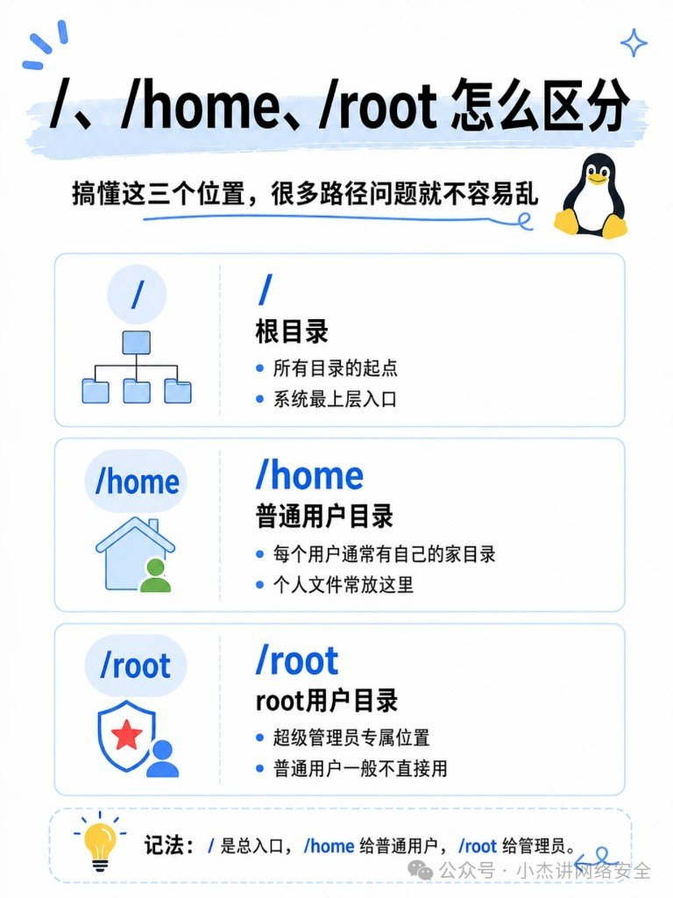

三件事最容易搞拧：

- **`/`**：整棵树的根，不是「root 用户的家」。
- **`/home/<用户名>`**：普通用户的家；你登录后 `~` 通常指向这里。
- **`/root`**：超级用户自己的家目录，权限狠，普通用户进不去是常态。

记错一次就会出现「我以为在家目录，其实在根下乱写」——运维事故里很常见。

## 干活三件套：`/etc` · `/var` · `/usr`

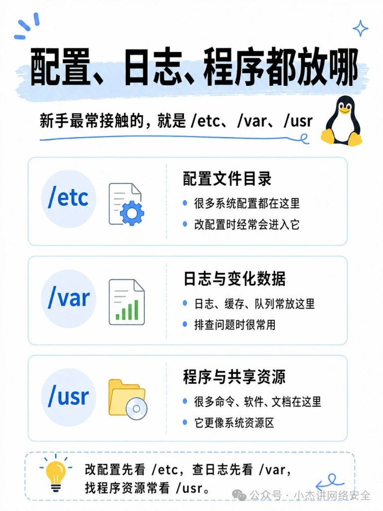

日常排障几乎绕不开这三个：

| 去哪 | 场景 | 例子直觉 |
|---|---|---|
| `/etc` | 改行为、看默认配置 | nginx、ssh、systemd 单元旁路配置 |
| `/var` | 查发生了什么、数据在涨 | `/var/log`、缓存、运行时状态 |
| `/usr` | 找命令/库/文档装在哪 | 二进制、共享库、手册页常落这里 |

口诀：**改配置看 etc，查日志看 var，找程序看 usr。**

（发行版细节会有 overlay / 合并目录，但新手先按这三格走，不至于迷路。）

## 再补八个高频目录


核心位置认熟后，这八个出现频率也很高：

| 路径 | 一句话 |
|---|---|
| `/bin` | 基础用户命令（很多系统已与 `/usr/bin` 合并，概念仍要懂） |
| `/sbin` | 偏系统管理的命令（同样常与 `/usr/sbin` 合并） |
| `/dev` | 设备文件入口（磁盘、终端等「当文件用」） |
| `/proc` | 内核与进程的「活信息」（几乎全是虚拟文件） |
| `/tmp` | 临时文件；重启可能清空，别当仓库 |
| `/boot` | 启动相关：内核、引导配置 |
| `/opt` | 第三方/可选软件包常装这 |
| `/mnt` | 临时挂载点（U 盘、额外盘先挂这里很常见） |

不要求一次背完；下次 `cd` 撞上其中一个，回这张表对一下就行。

## 按用途记，配三板斧命令

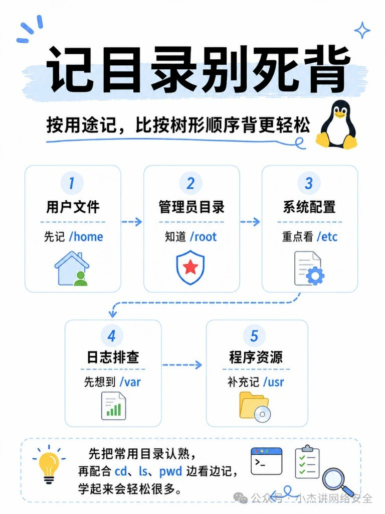

别按字母表背路径，按**你要干什么**记：

1. 要改系统怎么跑 → `/etc`
2. 要看它刚才干了啥 / 数据涨哪了 → `/var`
3. 要找程序装哪了 → `/usr`（再辅 `/opt`、`/bin`）
4. 要回自己文件 → `/home`；管理员自己的家 → `/root`

走路用三板斧就够热身：

| 命令 | 作用 |
|---|---|
| `pwd` | 我现在在哪 |
| `ls` | 这里有什么 |
| `cd` | 去那个位置 |

先 `pwd` 再 `ls`，少很多「以为在 A 其实在 B」的乌龙。

## 认路比背树重要

Linux 目录标准（FHS）很长，生产发行版还有合并、只读根、容器层叠……新手阶段目标很简单：**听到路径能判断该去哪一类目录**。核心六位置 + 干活三件套口诀 + 八个高频补丁，够应付绝大多数入门排障；真要深挖某个服务，再对着它的文档钻子目录就行。

## 附录：整树对照卡（小林coding）

上面是「先认常去位置」。需要把整棵树摊开核对时，用这张全景——左树右卡，按颜色分系统核心、设备挂载、用户数据、虚拟文件系统等。发行版细节会有差，大格通常稳。

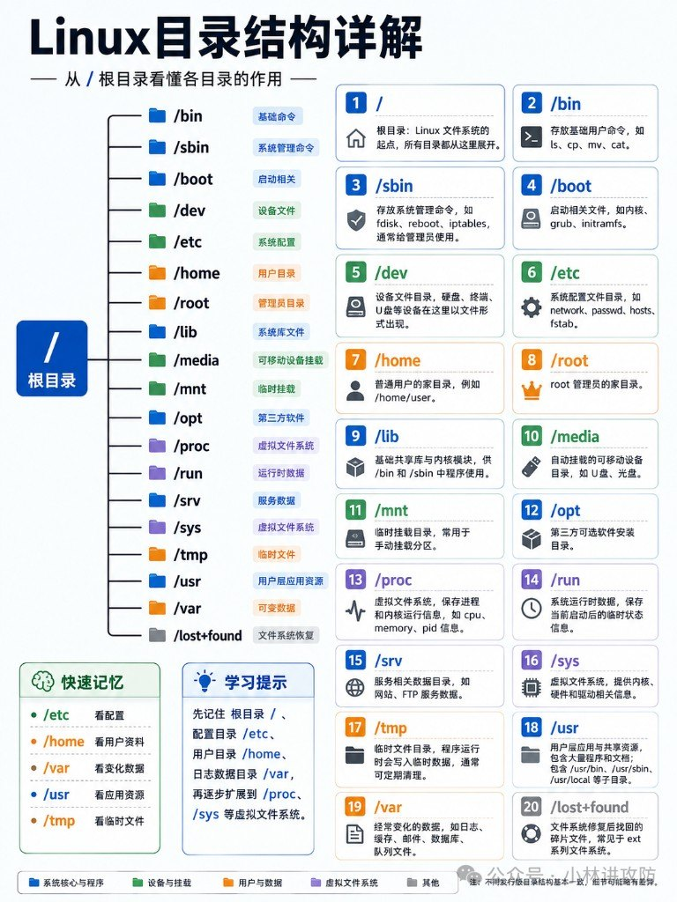

### 快速记忆（图卡底部）

| 路径 | 记法 |
|---|---|
| `/etc` | 看配置 |
| `/home` | 看用户资料 |
| `/var` | 看变化数据 |
| `/usr` | 看应用资源 |
| `/tmp` | 看临时文件 |

学习顺序建议：先 `/`、`/etc`、`/home`、`/var`，再扩到 `/proc`、`/sys` 这类虚拟文件系统。

### 补全表（正文八目录之外常撞上的）

| 路径 | 一句话 |
|---|---|
| `/lib` | 基础共享库与内核模块（常与 `/usr/lib` 合并） |
| `/media` | 可移动介质自动挂载点 |
| `/run` | 本轮开机以来的运行时状态 |
| `/srv` | 本机对外服务数据（站点、FTP 等） |
| `/sys` | 内核 / 硬件 / 驱动信息的虚拟文件系统 |
| `/lost+found` | 文件系统修复后捞回的碎片（ext 系常见） |

和正文不冲突：日常仍走「etc / var / usr」三件套；这张卡只在你需要**对照整树**或解释冷门路径时翻。


## 两张全景图：K8s 架构怎么转、故障怎么查

K8s 组件名一堆，记不住很正常。这两张图一个讲「请求怎么从 YAML 落到 Pod」，一个讲「出事时按哪七条线查」。下面尽量跟图面走，当可读速查，不当完整教程。

旁链（**不硬并**）：容器层命令见 Docker 命令背会这条线就够日常（待发布）；运维工具选型见 运维自动化选型：先摸清这十件工具（待发布）。网络基础旁链文末。

---

## 图 1：架构全景，控制面怎么把期望状态推下去


图题：**Kubernetes 架构全景图**  
副标：**Kubernetes = API 驱动的分布式资源控制系统**

### 从上往下：谁接请求、谁干活

| 层 | 图面内容 |
|---|---|
| 用户接入 | `kubectl` / UI Dashboard / 其他 API 客户端 |
| Control Plane | API Server、etcd、Scheduler、Controller Manager |
| Worker Nodes | 多节点：kubelet、kube-proxy、Container Runtime（containerd）、Pod |
| 底座能力 | 网络（CNI）、配置管理、存储（Volume）、集群特性 |

**Control Plane（控制平面）**

| 组件 | 图面职责 |
|---|---|
| API Server | 集群统一入口；认证 / 鉴权 / 校验 / 路由；提供 REST API |
| etcd | 集群状态存储（Key-Value）；保存全部状态数据 |
| Scheduler | 决定 Pod 调度到哪个 Node；资源评估 / 负载均衡 / 亲和性等 |
| Controller Manager | 维持期望状态；各种控制器的集合 |

常见控制器（图面列举）：Deployment、ReplicaSet、Node、Job、Endpoint……

**Worker Node（工作节点）**

| 组件 | 图面职责 |
|---|---|
| kubelet | 与 API Server 通信；管理本机 Pod 生命周期 |
| Container Runtime | 真正跑容器（如 containerd） |
| kube-proxy | Service 网络代理与负载均衡 |
| Pod | 最小调度单位；跑一个或多个容器 |

**底座四块**

| 块 | 图面要点 |
|---|---|
| 网络（CNI） | Pod 互通（扁平网络）：Calico / Flannel / Cilium / Weave Net…… |
| 配置管理 | ConfigMap（配置数据）、Secret（敏感数据） |
| 存储（Volume） | emptyDir / hostPath / NFS…… |
| 集群特性 | 自愈；弹性伸缩（HPA/VPA）；滚动更新；服务发现（DNS） |

### 底部工作流：YAML → 期望状态

图面七步：

1. 提交资源定义（YAML）
2. API Server 接收请求
3. 存储到 etcd
4. 调度器选择 Node
5. kubelet 创建 Pod
6. 容器运行 / 业务启动
7. Controller 持续监控 / 保持期望状态

记这条线就够：你交「想要什么」，集群用调和环不停往那个状态靠。

### 右侧概念卡（建议和左图画面对着看）

**一、核心组件**  
API Server 统一入口 → etcd 存状态 → Scheduler 选节点 → Controller Manager 做收敛。

**二、Worker Node**  
kubelet 管生命周期；Runtime 跑容器；kube-proxy 做 Service 代理；Pod 是载体。

**三、核心对象关系**

```text
Deployment → ReplicaSet → Pod → Container
```

| 对象 | 图面一句话 |
|---|---|
| Deployment | 声明式更新、回滚 |
| ReplicaSet | 保证 Pod 副本数 |
| Pod | 跑容器的载体 |
| Container | 业务容器本身 |

**四、网络模型**

```text
Ingress → Service → Pod
```

| 对象 | 图面一句话 |
|---|---|
| Ingress | 七层入口：域名路由、TLS、灰度等 |
| Service | 稳定访问入口 + 负载均衡 |
| Pod | 真实实例；IP 可能变 |

**五、存储模型**

```text
PVC → PV → StorageClass
```

| 对象 | 图面一句话 |
|---|---|
| PVC | 存储需求（申请） |
| PV | 持久化存储资源 |
| StorageClass | 存储类；动态供应 |

**六、核心思想（图脚）**

| 词 | 意思 |
|---|---|
| 声明式 Declarative | 只描述期望状态 |
| 控制循环 Reconcile Loop | 持续向期望收敛 |
| 最终一致性 Eventually Consistent | 告诉 K8s「要什么」，它保证「达到」 |

图脚原句气质：**你只需要告诉 K8s「要什么」，K8s 保证「达到期望状态」。**

---

## 图 2：七大主题速查，出事按哪条线查


图题：**Kubernetes 核心知识全景图（7 大核心主题）**

### 1. Pod / Node 排障思路

**Pod 侧（图面清单气质）**

- 状态与落点：`kubectl get pod -o wide`
- 事件：`kubectl describe pod`
- 日志：`kubectl logs`（含 previous）
- 进容器：`kubectl exec`
- 资源：CPU / Mem / Disk / Net；`kubectl top pod`
- 调度失败：看 FailedScheduling 一类事件
- 依赖：Service / ConfigMap / Secret 是否齐
- 镜像：ImagePullBackOff / ErrImagePull 等

**Node 侧**

- `kubectl get node` / `describe node`
- 状态：Ready、NotReady、SchedulingDisabled、NetworkUnavailable 等
- 资源打满（CPU/Mem）、磁盘 / IO、OOM / 内核日志（`dmesg`）
- 系统服务：kubelet / kube-proxy / containerd；`journalctl -u kubelet`
- 运行时：`crictl`；存储与网络再往下拆

**常见 Pod 状态（图面）**

| 状态 | 含义（图面） |
|---|---|
| Pending | 调度未完成 |
| Running | 正在运行 |
| CrashLoopBackOff | 容器反复启动失败 |
| ImagePullBackOff / ErrImagePull | 镜像拉取失败 / 错误 |
| OOMKilled | 内存溢出被杀 |
| ContainerCreating | 创建中（常伴随拉镜像） |
| Completed | 任务正常结束 |
| Unknown / Error | 未知 / 异常退出 |
| CreateContainerConfigError 等 | 配置或创建阶段出错 |

### 2. 污点（Taints）与亲和（Affinity）

| 概念 | 图面要点 |
|---|---|
| Taints | 节点排斥某类 Pod；Effect：`NoSchedule` / `PreferNoSchedule` / `NoExecute` |
| Tolerations | Pod 声明容忍，才能上带对应污点的节点 |
| nodeAffinity | 按节点标签硬选 / 软偏好（required / preferred） |
| podAffinity | 倾向和某些 Pod 靠近 |
| podAntiAffinity | 倾向和某些 Pod 远离 |

常用命令气质：

```bash
kubectl taint nodes <node> key=value:NoSchedule
kubectl taint nodes <node> key:NoSchedule-
```

### 3. 网络排查思路

**Pod 网络检查线（图面）**

1. Pod IP 是否正常（`get pod -o wide`）
2. Pod 间连通（`ping` 等）
3. DNS（`nslookup` / `dig`）
4. 访问 Service（`curl`）
5. 出网 / 外部访问
6. CNI 插件状态
7. NetworkPolicy 是否挡路

**常见现象**

- 同网 / 跨 Pod 不通
- Service 不通、DNS 失败
- 延迟高 / 丢包
- CNI 故障、kube-proxy 异常
- 外网域名解析失败

**节点侧常用命令（图面）**

`ip addr` / `ip route`、`ss`、`ping`、`traceroute`、`nslookup`、`curl`、`tcpdump`

NetworkPolicy：`kubectl get networkpolicy` / `describe networkpolicy`

### 4. K8s 网络架构（图面分层）

```text
外部流量
  → Ingress Controller（Nginx / Traefik …）
  → Service（ClusterIP / NodePort / LoadBalancer）
  → 各 Node 上的 Pod
```

每个 Node 上大致有：kube-proxy（iptables / IPVS）、CNI（Calico / Flannel / Cilium…）、Container Runtime、Pod。  
Overlay / 底层常见词：VXLAN、BGP、IPIP、路由。

和架构图右侧「Ingress → Service → Pod」是同一条故事，这里多了「进集群后怎么在节点间铺」。

### 5. 存储卷（Volume）

**关系（图面）**

```text
Pod → PVC → PV → StorageClass → 后端存储（NFS / 云盘 / 分布式存储…）
```

**常见 Volume 类型**

| 类型 | 图面说明 |
|---|---|
| emptyDir | 临时；Pod 删则没 |
| hostPath | 挂节点本地路径 |
| nfs | NFS 共享 |
| configMap / secret | 挂配置 / 敏感数据 |
| persistentVolumeClaim | 经 PVC 申请持久卷 |

**排查**

- `kubectl get/describe pvc`、`get/describe pv`
- `get/describe storageclass`（或 `sc`）
- Pod 内挂载点、节点 `df -h`、相关 events

**常见坑**

PVC Pending、PV 未绑定、配置错误、磁盘满、网络存储不可达、权限不够。

### 6. 通用排障流程 + 金三角

图面七步气质：

1. 发现问题 / 告警  
2. 收集信息（Pod、Node、events、logs、metrics）  
3. 划范围（Pod / Node / 网络 / 存储 / 应用）  
4. 比正常 vs 异常，定因  
5. 处置（改配置、重启、扩缩容、修依赖）  
6. 验证（功能 + 监控恢复）  
7. 复盘与预防（文档、告警优化）

**金三角（图面）**

1. 现象是什么？  
2. 期望是什么？  
3. 差异在哪里？

这三问比瞎敲命令有用：先对齐「该什么样」，再找差。

### 7. 其他核心内容（图面格子）

| 格 | 图面条目 |
|---|---|
| 核心资源对象 | Pod、Deployment、Service、Ingress、ConfigMap/Secret、PV/PVC、Job/CronJob、StatefulSet、DaemonSet、HPA、NetworkPolicy、ServiceAccount… |
| 核心组件 | API Server、etcd、Scheduler、Controller Manager、kubelet、kube-proxy、Container Runtime |
| 监控 & 日志 | Prometheus + Grafana；EFK / Loki；Alertmanager |
| 安全 | RBAC、NetworkPolicy、PodSecurity、镜像安全、Secret 加密、Security Context |
| 高可用 & 扩展 | 多 Master、etcd 集群、Cluster Autoscaler、HPA/VPA、CRD、Operator、Metrics Server、Dashboard… |
| 最佳实践 | requests/limits；liveness/readiness；优雅关闭（preStop）；反亲和避免单点 |

### 侧栏：常用命令速查（图面）

| 类 | 命令气质 |
|---|---|
| 资源管理 | `kubectl get pod -A`、`get node -o wide`、`describe <资源> <名>` |
| 日志调试 | `kubectl logs`（含 `-p` / `-c`）、`kubectl exec -it <pod> -- bash` |
| 资源监控 | `kubectl top pod`、`kubectl top node` |
| 事件 | `kubectl get events -A --sort-by=.lastTimestamp` |
| 集群信息 | `kubectl version`、`cluster-info`、`get cs`（组件状态，视版本而定） |
| 节点维操 | `cordon` / `drain --ignore-daemonsets` / `uncordon` |

**底部组件关系（图面简化）**

```text
kubectl / UI
    ↓
API Server ←→ etcd
    ↓
Scheduler / Controller Manager
    ↓
kubelet / kube-proxy → Nodes → Pods
```

和架构全景是同一套骨架：所有路都先过 API Server。

---

## kubectl 命令小表（从图面抽）

| 场景 | 命令 |
|---|---|
| 看 Pod 落点 | `kubectl get pod -o wide` / `-A` |
| 看事件 | `kubectl describe pod <name>`；`kubectl get events --sort-by=.lastTimestamp` |
| 看日志 | `kubectl logs <pod>`；挂了加 `-p` / `-c` |
| 进容器 | `kubectl exec -it <pod> -- bash` |
| 看资源 | `kubectl top pod` / `top node` |
| 污点 | `kubectl taint nodes <node> key=value:NoSchedule` |
| 节点封锁/腾空 | `cordon` / `drain` / `uncordon` |
| 存储 | `kubectl get pvc,pv,sc` + `describe` |
| 网络策略 | `kubectl get networkpolicy -A` |

Docker 本机命令不在本篇展开，去旁链 Docker 速查。

---

## 旁边几篇别搅成一锅

| 旁链 | 它管啥 | 别跟本篇混 |
|---|---|---|
| Docker 命令背会这条线就够日常（待发布） | Docker CLI | 单机容器命令 ≠ 集群编排 |
| 运维自动化选型：先摸清这十件工具（待发布） | 运维工具地图 | 工具选型 ≠ K8s 控制面 |
| 网络协议靠谁才能活：一张依赖图（待发布） | 协议依赖 | 协议栈 ≠ CNI/Service 排障 |
| [网卡那四栏到底各自干嘛](../2026-08-09_计算机网络基础四件套/网卡那四栏到底各自干嘛.md) | 网络基础四栏 | 基础课 ≠ 集群网络架构图 |
| Linux 目录结构运维速记（待发布） | 主机目录 | Node 侧速记 ≠ 编排模型 |

---

## 原料与校验

- 图数：正文 `![]` = 2；配图文件 = 2
- 未发帖；未 commit / push
