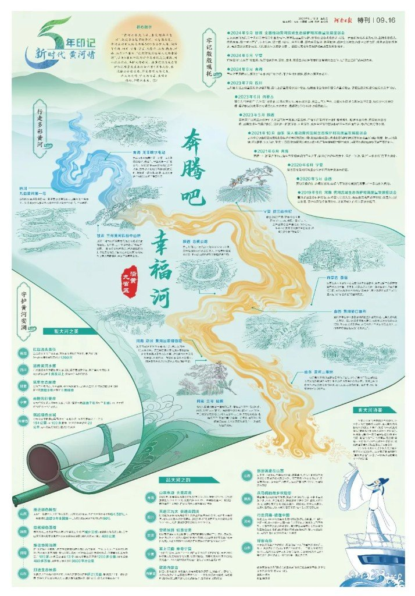
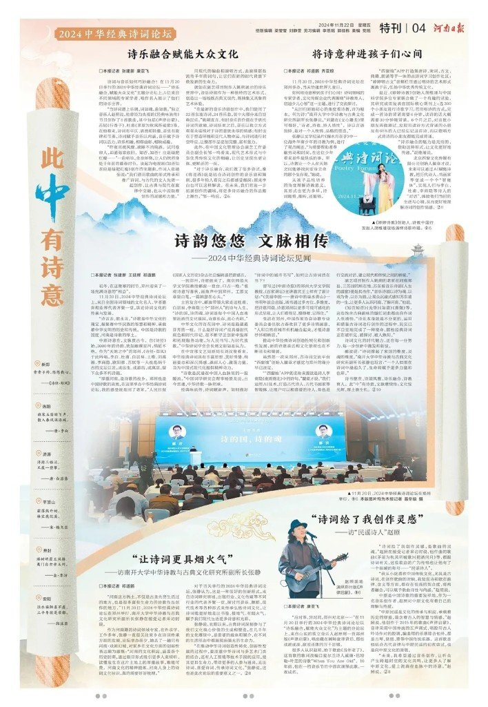
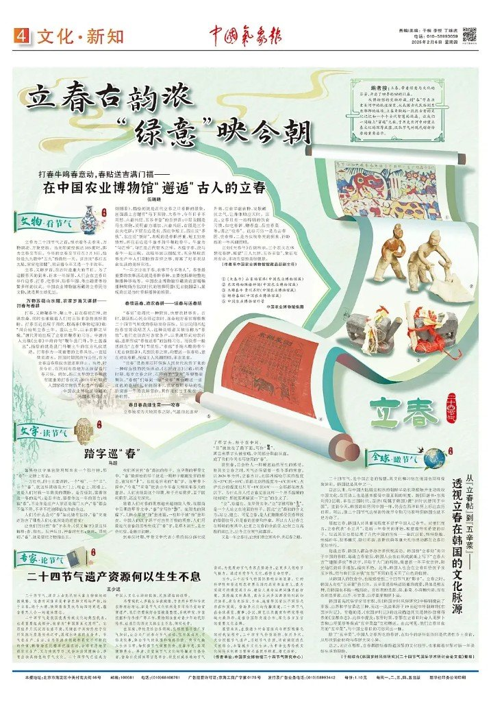
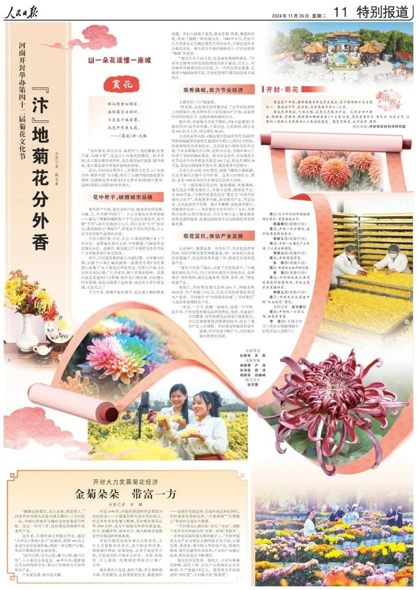
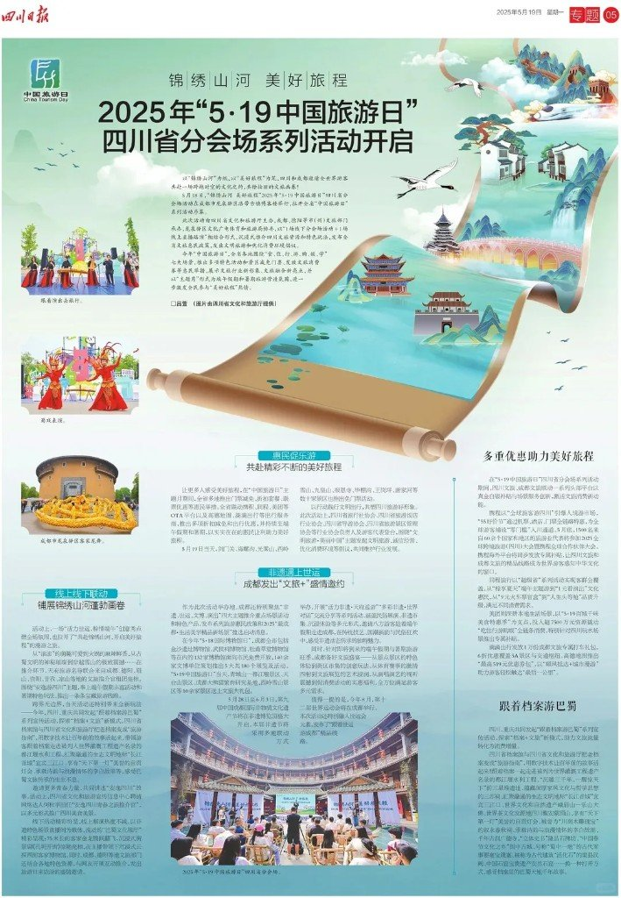
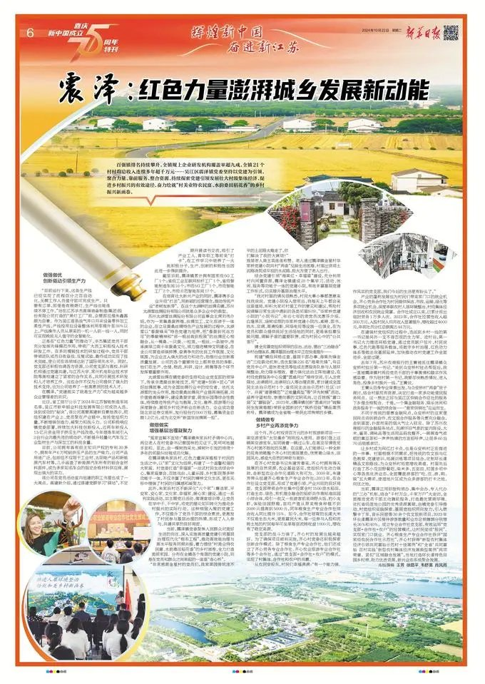
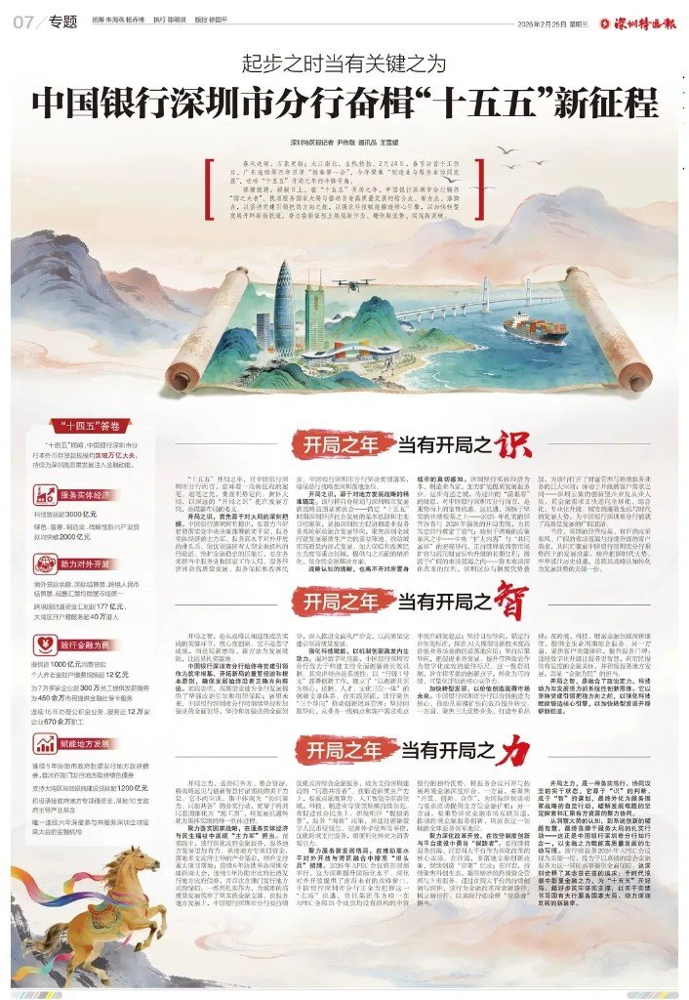
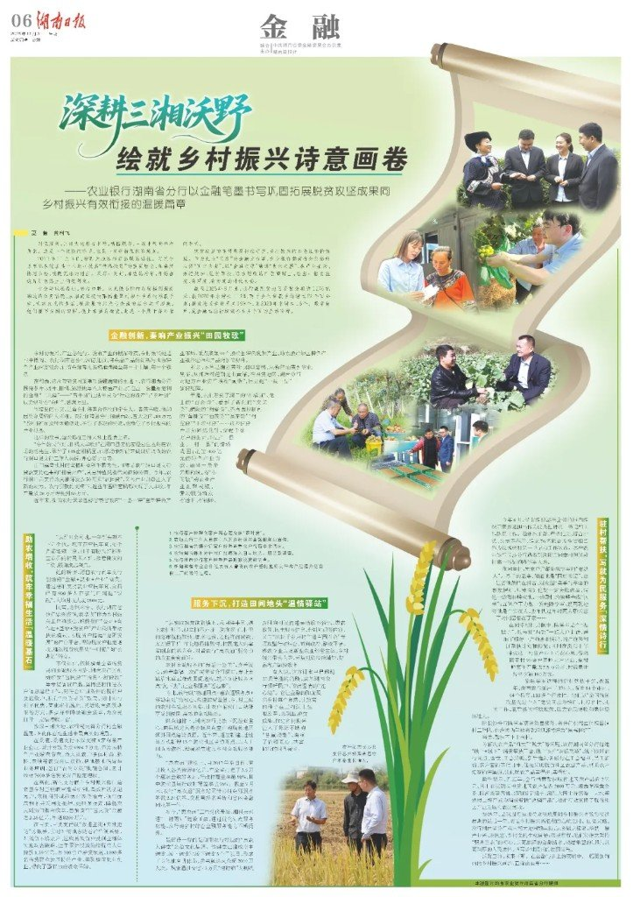
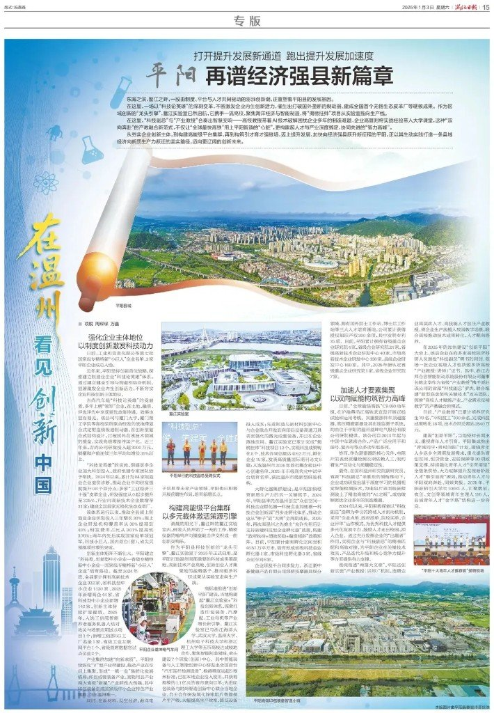

报纸整版最怕什么？栏框密、字堆死、读者一眼就滑走。这几年不少党报、行业报、都市报，爱拿同一个器物救场——**卷轴**。

卷轴在版面上不只是装饰边框。它把「画卷 / 史册 / 蓝图 / 文脉」这几层意思压进一张纸：文化主题像在展画；成就回顾像在翻史册；规划部署像在铺蓝图；地方文旅像在续文脉。主题一对上，整版就有了主心骨。

下面按报题过一遍案例，再留六条共同手法与读者常吵的几句。

开篇这张不是拼贴导览，是河南日报《奔腾吧 幸福河》：卷轴铺底，黄河以金黄丝带从卷面蜿蜒而出，把九省地标串成叙事线——卷轴当「柔性容器」的典型。

---

## 三类主题，卷轴各自怎么用

| 符号读法 | 适合主题 | 版面上像什么 |
|---|---|---|
| 画卷 | 文旅、节庆、民俗、诗词 | 卷面展开成风景 / 人物 / 节庆主视觉 |
| 史册 | 周年回顾、成就盘点、「十四五」答卷 | 卷体承托时间轴、数据条、大事记 |
| 蓝图 / 文脉 | 两会部署、规划开局、地方文脉 | 卷面像未写完的图，或把古今并置在同一卷芯 |

同一器物，映射不同；读者不用读完标题，也能感到「这页在讲展开、传承、还是向前画」。

---

## 图鉴：一张卷轴，各报各用

### 河南日报 · 中华经典诗词论坛

竖向长卷落下「此中有诗意」，城市诗签贴在卷缘，论坛报道与人物访谈绕卷排布——文化符号与正文真正咬合，不是贴一张 PNG。

### 中国气象报 · 立春

节气专版用卷轴托住「立春」意象，把气象新闻从冷数据拉回物候与时令。

### 人民日报 · 开封菊花节

斜置卷轴框住菊田人物大图，祥云与花瓣软化栏线；严肃报道里忽然有了节庆温度。

### 四川日报 · 安逸四川夏旅

夏旅主题用卷轴展「安逸」气质，文旅信息跟着卷势走，少了说明书感。

### 大同日报 · 一万平方公里看中国

大主题、大信息量时，卷轴负责收束视线，避免整版散成展板墙。

### 烟台日报 · 万亿之城碳路先锋

产业与「碳」叙事偏硬，卷轴把发展线画成可跟读的路径，而不是表格堆砌。

### 四川日报 · 中国旅游日

旅游日整版再度用卷：节日气氛 + 线路/活动信息，卷面当导览层。

### 浙江日报 · 「十四五」四件大事

省两会语境下，白色长卷在山水与城市场景间蜿蜒，四件大事写在卷上，成就块落在卷侧——史册感与蓝图感叠在一起。[^masthead-zj]

### 新华日报 · 震泽

地方专版用卷轴托「震泽」文脉与风貌，小切口也能做整版气势。

### 深圳特区报 · 两会蓝图

横展卷轴里画出城市场景，「蓝图已经绘就」直接落到器物上；两侧回顾 / 奋进数据夹着卷芯。[^masthead-sz]

### 深圳特区报 · 中行「十四五 / 十五五」

金融答卷本该很硬。上方长卷山水城景，下方三枚红色短卷分栏「识 / 智 / 力」，严肃选题被中式容器接住。

### 钱江晚报 · 少年诗词大会

少年与诗词，卷轴回到「文脉」本义：活动报道带着书卷气，而不是赛场海报腔。

### 湖南日报 · 乡村振兴画卷

「画卷」二字写进主题，卷轴几乎是标题的视觉同义词——符号与文案对齐时，读者零成本读懂隐喻。

### 浙江日报 · 平阳

县域专题用卷展地方肌理，信息密度高时仍靠卷势分主次。

### 深圳特区报 · 阅读周刊民俗画卷

阅读周刊把民俗收进画卷形态，纸媒版式同时适合拆条发新媒体。

### 襄阳日报 · 「两资三能」

工业与招商报道里，卷轴分别框住江城风景与工地实景——柔性容器把硬新闻和软视觉缝在同一页。

---

## 这些整版其实在干同一件事

六条共同特点，原文写得很全，这里原样压实留用：

1. **文化符号与图文一体**  
   卷轴不是角落贴纸，而是标题、照片、数据的承托结构；符号语义（展开、传承、书写）与稿件主题同向。

2. **柔性容器**  
   刚性栏框改成可弯曲、可斜置、可分叉的卷面，文字与图片跟着卷势走，信息再多也不像砌砖。

3. **形态多变**  
   竖卷、横卷、斜卷、短卷条、多卷并列……同一符号换形态，版式就不会一眼撞车。

4. **中式美学软化严肃选题**  
   两会、金融、产业、碳中和这类硬稿，靠卷轴、云纹、山水、翰墨气，把「必须读」变成「愿意看」。

5. **纸媒 + 新媒体双向**  
   整版在报上成立；拆成长图、九宫格、短视频封面时，卷轴主视觉仍可单独成立——一次设计，两端吃。

6. **构图核心、主次分明**  
   先立卷轴主视觉，再挂卫星信息块；读者先被器物抓住，再决定往哪一块钻。

拿去对照自己做的活动长图 / 年报内页也成立：先问「卷轴在这页到底代表画卷、史册还是蓝图」，再决定形态，比先找素材库 PNG 靠谱。

旁链（不合并）：哑光纸质杂志感与巨型裁切字，见 [`告别塑料感：哑光纸、偏心视窗、巨型裁切字`](../2026-08-10_告别塑料感_巨型裁切字海报/告别塑料感：哑光纸、偏心视窗、巨型裁切字.md)；冲击力海报七套，见 [`一眼很猛：GPT-Image2七种高张力海报提示词`](../2026-08-10_GPT-Image2高张力海报7风格/一眼很猛：GPT-Image2七种高张力海报提示词.md)；结构化出科普海报，见 [`输入一个名字：Coze三十秒出历史人物科普海报`](../2026-08-10_Coze历史人物科普海报工作流/输入一个名字：Coze三十秒出历史人物科普海报.md)。

---

## 评论区比版式本身还吵

有人说卷轴看多了会**视觉疲劳**——符号一旦成套路，就从巧思变成模板。这话公允：器物救得了单页，救不了整年审美。

也有人打出「**太卷了**」：一边夸版式真会「卷」，一边吐槽行业内卷。双关之所以好笑，是因为两种「卷」常常一起来。

还有人怀疑画面「**像 AI 风**」。真假不必在笔记里拍板；值得记的是：当中式符号被批量复用，读者会下意识用「是不是机器出的」来表达审美不适。

致谢向的留言里，**河南日报**等常被点名——说明读者认的是「符号用对了主题」，不是「谁先用了卷轴」。

---

## 什么时候别硬上卷轴

主题本身没有展开 / 传承 / 书写隐喻时，硬贴卷轴只会显得空。信息必须做成严格对照表、地图坐标、流程图时，柔性容器也可能拖慢检索。符号疲劳已经出现在同一系列里时，换器物比换配色更有用。

认清卷轴在这一页到底是画卷、史册还是蓝图，再决定要不要用——比收藏一百张「创意报纸」截图更能带走。
