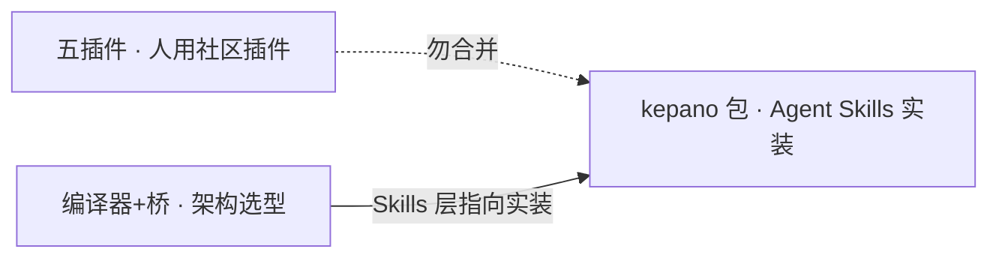

把「Obsidian 装啥」塞进一张购物清单，最容易装错层。社区插件是给人用的；kepano 那包是给 Agent 读写开放格式的；「编译器 + 桥」又是另一层架构选型。三样都能让库变好用，但混着买只会越装越糊。

今晚把三份素材并成一篇，文内硬分三节。读的时候先问自己：你现在要解决的是**人用 Obsidian**，还是**Agent 会不会写 vault**，还是**第二大脑怎么编译、怎么连上**。

---

## 先分清三层，别叠成一锅

| 层 | 干啥 | 典型货 |
|---|---|---|
| 人用插件 | 结构、模板、剪藏、相关推荐 | Dataview / Templater / Excalidraw… |
| Agent Skills | Agent 按规范操作 Markdown / Bases / Canvas / CLI | [kepano/obsidian-skills](https://github.com/kepano/obsidian-skills) |
| 编译器 + 桥 | 知识编译沉淀 + Claude↔本地库通道 | LLM Wiki 系仓库 + second-brain MCP 系 |

Skills 在架构图里扮演「按需触发的能力包」；具体装哪几个，看第三节仓库实核。MCP 跟 Skills 为啥不能当同一层比，见待发布帖「MCP 和 Skills 不是一层」（`mcp-vs-skills-layers`）。

---

## 人用五插件：先把空壳救活

装完 Obsidian 若啥都不加，它就是个会开 Markdown 的壳。潮汕炮王那张图说得很死：**真正好用全靠插件**。下面五个够把碎片接成能复利的库——注意，这是**插件清单**，别跟 Agent Skills 包混着装。

| # | 插件 | 你拿它换什么 |
|---|---|---|
| 01 | **Dataview** | 笔记当数据库：属性一填，列表自动刷 |
| 02 | **Templater** | 新建就套模板，还能跑脚本 |
| 03 | **Excalidraw** | 库里直接画白板 / 流程图，再嵌回笔记 |
| 04 | **Web Clipper** | 官方剪藏：网页一键进本地库 |
| 05 | **Smart Connections** | 侧栏推相关旧笔记，靠相似度长链路 |

个人库我会这么排：

1. **Dataview + Templater** 先立住；没有属性与模板，后面再炫也是散沙。
2. **Web Clipper** 打通入口；外面读的东西要进库，比先上 AI 推荐实在。
3. **Excalidraw** 你常画流程再装；纯文字库可以后置。
4. **Smart Connections** 库有一定存量再开；空库上 AI 相关推荐，噪声大于收益。

边界钉一次：这边的 **Web Clipper** 是人用剪藏插件；kepano 包里的 **defuddle**（以及口述里的 clipper）是给 Agent 吃网页的技能。名字像，层位不同。

---

## 编译器 + 桥：第二大脑先定这两样

闲游 AI 那张「Claude × Obsidian」架构图不教你装哪个社区插件，只钉死一层心法：**一个编译器 + 一座桥**。没有编译的 RAG，图上那句便签写得很损——只是带着氛围感的 grep。

三种逻辑别叠锅：

| 层 | 叫啥 | 实际在干嘛 |
|---|---|---|
| ① | **LLM Wiki** | 原料当源码 → AI 抽成互链 Wiki 页 → 后续查询省 token；偏沉淀 |
| ② | **Skills** | 论文精读、会议整理等拆成技能包，用时才加载；偏调用能力 |
| ③ | **MCP 桥** | Claude ↔ 本地库的实时通道；图里还分只读 / 读写；偏连接 |

进阶还有一条支线：时序知识图谱——沿 Past → Present → Future 追概念怎么变。本篇不展开企业向「六层验收」，只停在个人第二大脑选型卡。

### 编译器 · 三选一（2026-08-11 已核仓库存在）

| 仓库 | stars（核对日） | 定位 |
|---|---|---|
| [AgriciDaniel/claude-obsidian](https://github.com/AgriciDaniel/claude-obsidian) | ~10.7k | Claude Code + Obsidian 自组织第二大脑；宣称跟 Karpathy LLM Wiki 模式 |
| [qhuang20/obsidian-skills](https://github.com/qhuang20/obsidian-skills) | ~27 | Obsidian 向 Claude Code 插件；首技能 llm-wiki |
| [ekadetov/llm-wiki](https://github.com/ekadetov/llm-wiki) | ~106 | Claude Code 插件：持久、可复利的 Obsidian 知识库 |

### 桥 · 三选一

| 仓库 | stars（核对日） | 定位 |
|---|---|---|
| [eugeniughelbur/obsidian-second-brain](https://github.com/eugeniughelbur/obsidian-second-brain) | ~3.9k | vault 当多 CLI Agent 的持久记忆（Markdown） |
| [noesskeetit/second-brain-mcp](https://github.com/noesskeetit/second-brain-mcp) | ~5 | MCP：vault → 语义记忆，给任意 coding agent |
| [CoMfUcIoS/second-brain-mcp](https://github.com/CoMfUcIoS/second-brain-mcp) | ~12 | MCP：对 vault **智能只读**，当 LLM 第二大脑 |

星数只说明热度。个人库更常先问：要不要写回 vault、能不能接受只读、编译器是「插件技能」还是「整套脚手架」。

---

## kepano Skills：仓库实核 5 个，「九技能」口述未核

有人会把「9 个 Obsidian Agent Skills」和「五个最好用插件」放一张清单里——那就装错层了。kepano 这个仓库教的是 **Agent 怎么操作 Obsidian 开放格式与 CLI**，跟 Dataview / Templater 不是一路货。

官方仓库：[kepano/obsidian-skills](https://github.com/kepano/obsidian-skills)

**搜证（2026-08-11，已核）**：`gh api repos/kepano/obsidian-skills/contents/skills` → **正好 5 个目录**；仓库约 4.5 万 star，未 archived；遵循 [Agent Skills](https://agentskills.io/specification) 规范。公众号/口述里的「九技能」**未在仓库出现**，下文标「口述 / 未核」。

### 官方仓库里实打实的 5 个（建议先装 · 已核）

| 简称 | 目录名 | 干什么 |
|---|---|---|
| markdown | `obsidian-markdown` | 写 Obsidian Flavored Markdown：wikilink、embed、callout、properties… |
| bases | `obsidian-bases` | 写 `.base`：视图、过滤、公式、汇总 |
| canvas | `json-canvas` | 写 `.canvas`：节点、边、组（JSON Canvas） |
| defuddle | `defuddle` | 网页去噪抽干净 Markdown，省 token |
| cli | `obsidian-cli` | 经 Obsidian CLI 读写库；也覆盖插件/主题开发辅助 |

装法（官方）：

```text
/plugin marketplace add kepano/obsidian-skills
/plugin install obsidian@obsidian-skills
```

或：`npx skills add https://github.com/kepano/obsidian-skills`

### 「按需 4」——口述有，仓库暂无（未核）

用户策略常说：**5 先装，4 按需。** 口述名单是 `qmd` / `maintainer` / `obsidian` / `clipper`。

2026-08-11 查 `skills/`：**只有上面 5 个目录**，这四个名字没出现。可能是旧文预告、另一发行渠道、或把别的工具误算进包。实装以仓库为准；需要时再盯 upstream。

---

## 三层怎么并排读



- 要选 **人用插件** → 第二节那五个
- 要定 **编译器 / 桥仓库** → 第三节那六仓
- 要让 **Agent 会写 Obsidian 格式** → 先跑通已核的 5 个 Skills
- 要搞清 MCP 跟 Skills 谁管连接、谁管做法 → 待发布的层位概念帖

先把人用结构立住，再谈编译与桥；Agent Skills 最后装，别一上来把插件超市和技能包当成同一张采购单。
