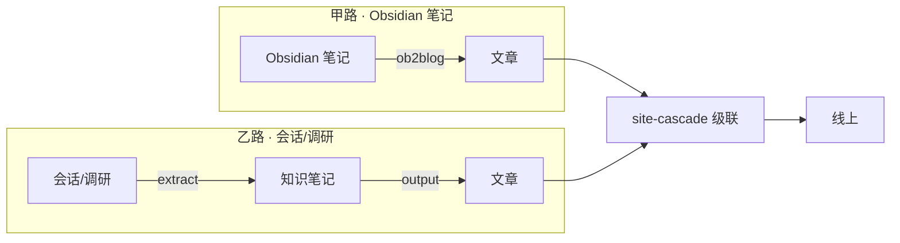

一篇东西从「脑子里有点想法」到「线上别人能点开」，中间要过多少道手？以前得自己搭草稿、写正文、做封面、传图、改 frontmatter、跑统计、记笔记，一个流程下来少说半小时。现在我把这套拆成了几个只管一件事的小 skill，再串成一条流水线——说「一键发布」，其实是 agent 替你把这套流程跑完了。

## 两条内容流水线，收尾都是同一套

我的 blog 发布有两条入口，按「素材在哪」选：

| 路 | 素材来源 | 走法 |
| --- | --- | --- |
| 甲 | Obsidian vault 里的笔记 | `ob2blog` → `site-cascade` |
| 乙 | 会话/调研结论 | `knowledge-extract` → `knowledge-output` → `site-cascade` |

两条路互补：笔记已经躺在 Obsidian 里就走甲；素材是对话里现聊出来的就走乙。收尾都是同一个 `site-cascade`——它负责发文后的四件事：生成「新笔记」动态、更新站点统计、分类标签、热力图。

## 乙路全流程：从一句话到线上

这条是我最常用的（本博客最近的帖子几乎都走它）：

每个 skill 只干一件事，边界划得干净：

| skill | 只管什么 | 产出 |
| --- | --- | --- |
| knowledge-extract | 会话提炼成高密度笔记 | Knowledge\todo\ 草稿 |
| knowledge-output | 素材补成帖 + 落盘 + 校验 + 级联 + 归档 | posts\{slug}\ 成品 |
| ob2blog | Obsidian vault↔帖双边同步 | posts\ + manifest 映射 |
| site-cascade | 发文后级联四表面 | 动态/统计/分类/热力图 |
| dynamic-post | 即时短内容（不进 posts） | dynamic\ 动态 |
| firefly-minimax-media | MiniMax 生图（style-taste） | 封面/配图 |

## 调度依赖：谁等谁

这条链能流水线化，靠的是明确的上下游关系：

- **output 等 extract 的产物**——extract 不落笔记，output 没料可发
- **site-cascade 等任何一方的落盘**——ob2blog/output/手写 posts 都行
- **ob2blog 和 output 互补不互调**——一个管 vault 笔记，一个管会话素材
- **dynamic-post 独立**——发动态不触发级联，跟成帖互不干扰
- **output 复用 ob2blog 的模板**——frontmatter 结构和校验脚本是共享的

因为每个 skill 边界单一、依赖单向，才能像流水线一样一个接一个跑，中途任何一步出问题都能单独重跑。

## 配图：先扒现成，最后才生图

发文章避不开配图，这也是个独立的小规范：

1. **官方素材**——官方 README 的预览 gif / 截图，扒 GitHub raw 直链，带官方背书还省事（动图尤其值得扒，比如 claude-mem 的 `cm-preview.gif`）
2. **网上相关素材**——主题相关的图、素材包、合规网图
3. **生图兜底**——前两级都没有，才按 style-taste 用 MiniMax 生成（生图本身还有一套风格路由和 checklist）

先找现成的，不是什么都值得烧额度生图。

## 配套的两个小件

- **dynamic-post**：发「最新动态」这类即时短内容，独立于成帖流程，发完即出现在动态时间线
- **agent-comment**：文章/动态发完后，agent 能以协作者身份在评论区追加点评——这是另一个会话里做出来的「agent 评论机制」

## 这流水线是真跑过的

不是纸上设计。看 git log，这套是从 `feat(ob2blog)` 起步，逐步加 `feat(site-cascade)`、`Knowledge 引入 todo/Archive`，再一批批发文章发动态积累起来的。dynamic-post 还经历过「并入 output」又「还原独立」的反复，最后定型为独立 skill。最近连着发的「会话命名」「记忆方案」两篇，就是这条乙路流水线现跑的。

一句话收束：所谓「一键发布」，不是有个神奇按钮，是把「提炼 → 成帖 → 级联 → 归档」拆成可复用的积木，让 agent 按序拼装。积木越拆越稳，发帖就越接近一键。
