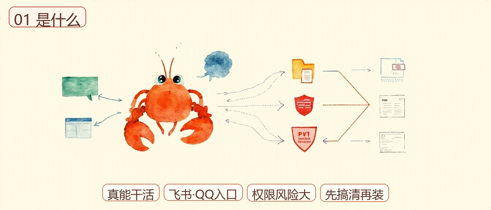
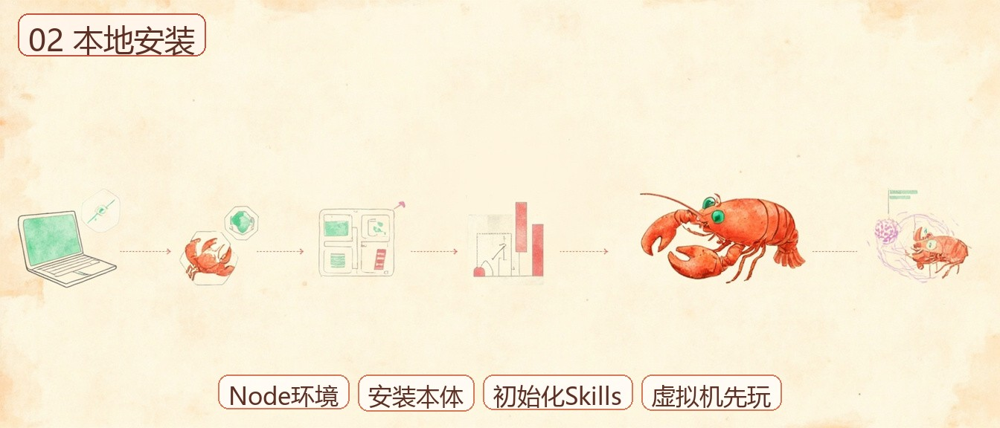
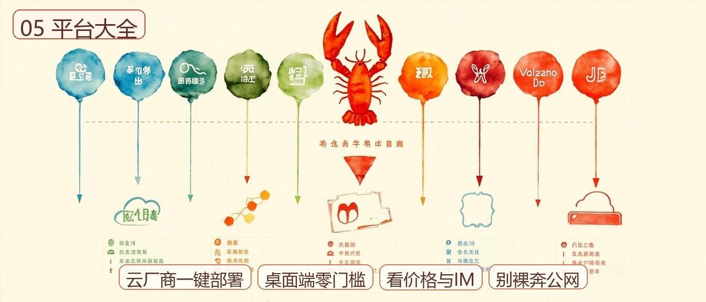
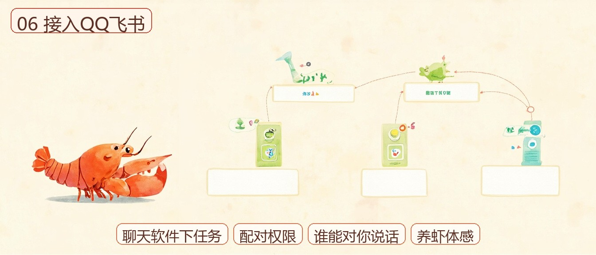
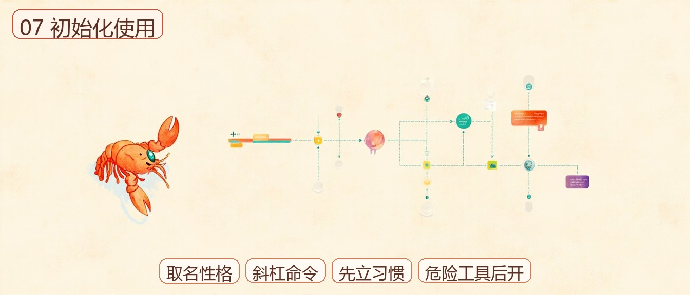
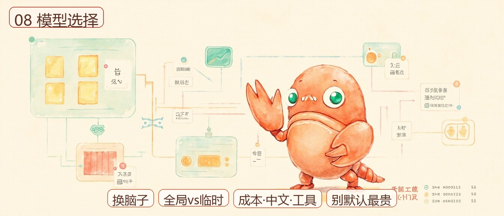
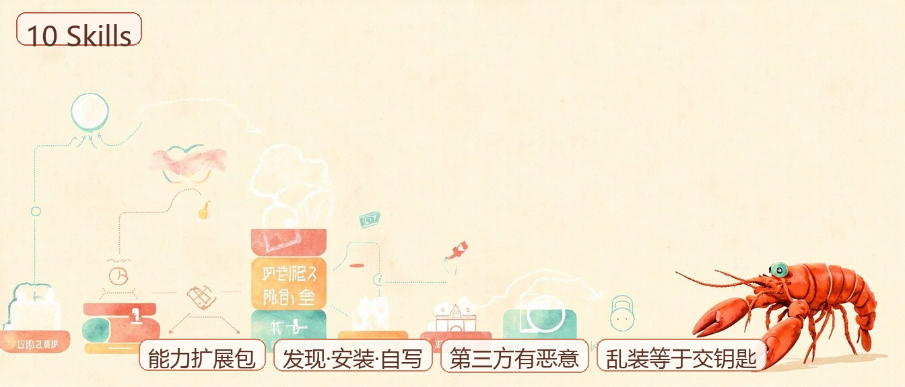
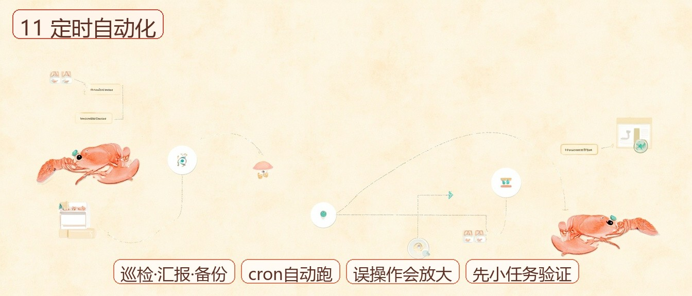
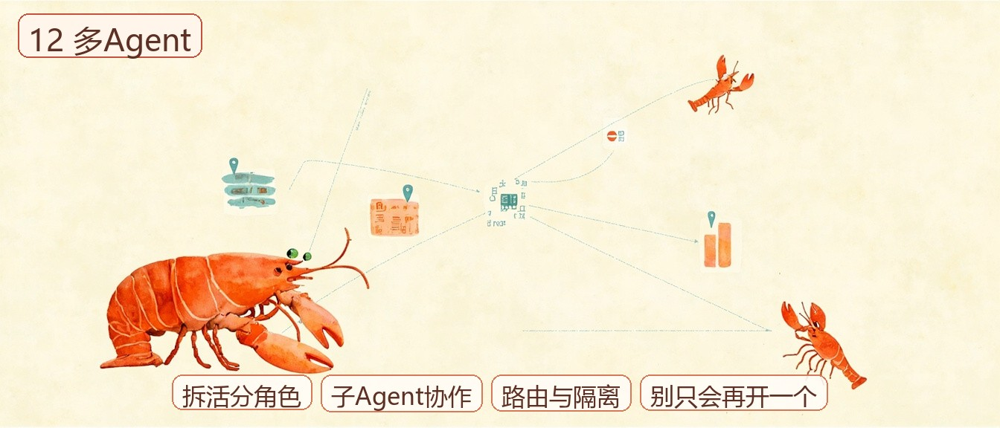
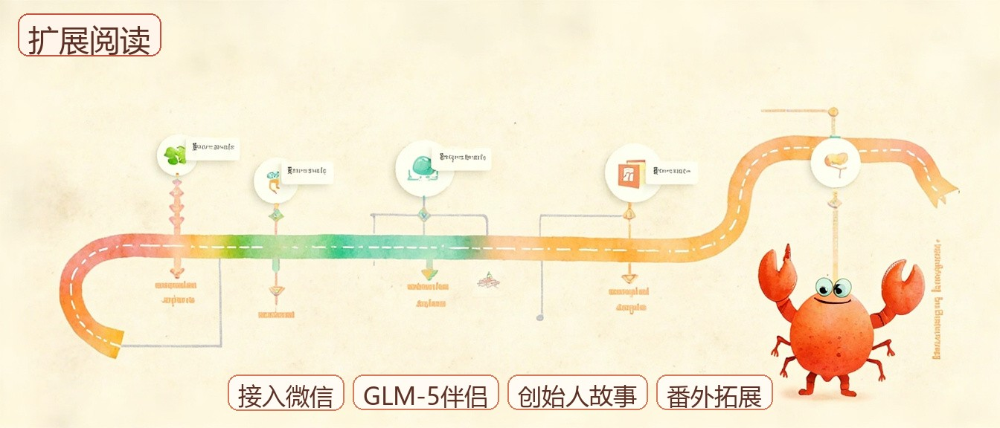

---
title: 数字员工与权限边界：OpenClaw 索引
published: 2026-08-04
updated: 2026-08-04T21:30:00
description: OpenClaw 系列按目录摘重点：安装、IM、Skills、自动化与安全红线；小长条配图挂回原文。
image: ./cover.jpg
tags: [OpenClaw, 教程索引, Agent]
themeTags: [索引摘要, 鱼皮, ai-guide]
category: Agentic Coding
collections: [vibe-tutorial-index]
draft: false
lang: ""
slug: openclaw-tutorial-index
pinned: false
comment: true
author: threetwoa
sourceLink: https://ai.codefather.cn/library/2034903746290417666
---

鱼皮那套 OpenClaw 教程很长，全搬进博客没意义。这篇只做三件事：按他的目录立标题、每章给能带走的摘要、原文用小长条配图挂回 AI 导航 / 开源仓。细节去原文；这里当索引和导航。

[原文 · 系列总览（鱼皮 AI 导航）](https://ai.codefather.cn/library/2034903746290417666) · [GitHub · liyupi/ai-guide](https://github.com/liyupi/ai-guide)

## 怎么读这篇

| 你想 | 建议 |
|---|---|
| 第一次碰 OpenClaw | 先 01→06，跑起来再接手机聊天 |
| 已经装好了 | 07 起按需：Skills / 定时 / 多 Agent / 省钱 |
| 最该先看的一篇 | **14 安全指南**（权限大，翻车贵） |

学习顺序来自鱼皮导读；摘要基于公开正文提炼，不是逐字搬运。配图为统一龙虾吉祥物小长条，点击可进原文。

## 00 导读

系列总览：OpenClaw = 能操控本机、还能用手机聊天软件远程下任务的开源 AI 数字员工。教程覆盖安装、接入、技能、自动化、安全和实战。

[原文 · 00 OpenClaw 保姆级教程导读](https://ai.codefather.cn/library/2034905403342487554)

## 01 OpenClaw 是什么

它不是只会聊天的 Bot，而是真能开软件、控浏览器、动文件、跑代码的助手；飞书 / QQ 等渠道是入口。火归火，权限也大：邮件误删、盘符清空、内网暴露都有真实案例。装之前先搞清风险，比追 Stars 重要。

[原文 · 01 OpenClaw 是什么](https://ai.codefather.cn/library/2034905696616611841)

## 02 本地安装

面向零基础：环境（Node 等）→ 安装本体 → 初始化 / Skills 概念 → 提醒隔离环境。建议虚拟机或备用机先玩，别一上来把生产机权限交出去。

[原文 · 02 本地安装 OpenClaw](https://ai.codefather.cn/library/2034908921038143489)

## 03 一键安装脚本

懒得逐步装就走脚本：一行拉齐依赖和配置。省步骤，不省安全意识；装完仍要看权限和模型账单。

[原文 · 03 · GitHub](https://github.com/liyupi/ai-guide/blob/main/OpenClaw%20%E4%BF%9D%E5%A7%86%E7%BA%A7%E6%95%99%E7%A8%8B/03%20OpenClaw%20%E4%B8%80%E9%94%AE%E5%AE%89%E8%A3%85%E8%84%9A%E6%9C%AC.md) · [系列总览点进本章](https://ai.codefather.cn/library/2034903746290417666)

## 04 云端部署

目标：云服务器上 24 小时在线的「员工」，手机随时指挥。适合不想本机长开的人；公网暴露面更大，认证和防火墙必须跟上。

[原文 · 04 · GitHub](https://github.com/liyupi/ai-guide/blob/main/OpenClaw%20%E4%BF%9D%E5%A7%86%E7%BA%A7%E6%95%99%E7%A8%8B/04%20%E4%BA%91%E7%AB%AF%E9%83%A8%E7%BD%B2%20OpenClaw.md) · [系列总览点进本章](https://ai.codefather.cn/library/2034903746290417666)

## 05 一站式部署平台大全

各厂商「点几下就部署」方案汇总。选型看：是否要接国内 IM、价格、是否默认裸奔公网。

[原文 · 05 · GitHub](https://github.com/liyupi/ai-guide/blob/main/OpenClaw%20%E4%BF%9D%E5%A7%86%E7%BA%A7%E6%95%99%E7%A8%8B/05%20OpenClaw%20%E4%B8%80%E7%AB%99%E5%BC%8F%E9%83%A8%E7%BD%B2%E5%B9%B3%E5%8F%B0%E5%A4%A7%E5%85%A8.md) · [系列总览点进本章](https://ai.codefather.cn/library/2034903746290417666)

## 06 接入 QQ 和飞书

把龙虾接到日常聊天软件，手机发消息就能下任务。这是「养虾」体感最强的一步；配对、权限、谁能对你说话，要一起配好。

[原文 · 06 · GitHub](https://github.com/liyupi/ai-guide/blob/main/OpenClaw%20%E4%BF%9D%E5%A7%86%E7%BA%A7%E6%95%99%E7%A8%8B/06%20OpenClaw%20%E6%8E%A5%E5%85%A5%20QQ%20%E5%92%8C%E9%A3%9E%E4%B9%A6.md) · [系列总览点进本章](https://ai.codefather.cn/library/2034903746290417666)

## 07 初始化与基础使用

取名、性格、常用斜杠命令。先把日常对话和审批习惯立住，再开危险工具。

[原文 · 07 · GitHub](https://github.com/liyupi/ai-guide/blob/main/OpenClaw%20%E4%BF%9D%E5%A7%86%E7%BA%A7%E6%95%99%E7%A8%8B/07%20OpenClaw%20%E5%88%9D%E5%A7%8B%E5%8C%96%E5%92%8C%E5%9F%BA%E7%A1%80%E4%BD%BF%E7%94%A8.md) · [系列总览点进本章](https://ai.codefather.cn/library/2034903746290417666)

## 08 模型选择与切换

给龙虾换「脑子」：全局切换 vs 临时切换。成本、中文能力、工具调用稳定性，按场景选，别默认最贵。

[原文 · 08 · GitHub](https://github.com/liyupi/ai-guide/blob/main/OpenClaw%20%E4%BF%9D%E5%A7%86%E7%BA%A7%E6%95%99%E7%A8%8B/08%20OpenClaw%20%E6%A8%A1%E5%9E%8B%E9%80%89%E6%8B%A9%E4%B8%8E%E5%88%87%E6%8D%A2.md) · [系列总览点进本章](https://ai.codefather.cn/library/2034903746290417666)

## 09 工具管理与多媒体

浏览器、TTS、发图发视频等能力开关。原则：用什么开什么；只聊天就关掉 `exec` / `write` 这类高危工具。

[原文 · 09 · GitHub](https://github.com/liyupi/ai-guide/blob/main/OpenClaw%20%E4%BF%9D%E5%A7%86%E7%BA%A7%E6%95%99%E7%A8%8B/09%20OpenClaw%20%E5%B7%A5%E5%85%B7%E7%AE%A1%E7%90%86%E4%B8%8E%E5%A4%9A%E5%AA%92%E4%BD%93%E8%83%BD%E5%8A%9B.md) · [系列总览点进本章](https://ai.codefather.cn/library/2034903746290417666)

## 10 Skills 技能系统

Skills = 能力扩展包；从发现到安装到自己写。第三方市场有恶意包先例，乱装等于给陌生人钥匙。

[原文 · 10 · GitHub](https://github.com/liyupi/ai-guide/blob/main/OpenClaw%20%E4%BF%9D%E5%A7%86%E7%BA%A7%E6%95%99%E7%A8%8B/10%20OpenClaw%20Skills%20%E6%8A%80%E8%83%BD%E7%B3%BB%E7%BB%9F.md) · [系列总览点进本章](https://ai.codefather.cn/library/2034903746290417666)

## 11 定时任务与自动化

巡检、汇报、备份交给 cron 类能力。自动化越爽，误操作放大越狠；先小任务验证，再放大频率。

[原文 · 11 · GitHub](https://github.com/liyupi/ai-guide/blob/main/OpenClaw%20%E4%BF%9D%E5%A7%86%E7%BA%A7%E6%95%99%E7%A8%8B/11%20OpenClaw%20%E5%AE%9A%E6%97%B6%E4%BB%BB%E5%8A%A1%E4%B8%8E%E8%87%AA%E5%8A%A8%E5%8C%96.md) · [系列总览点进本章](https://ai.codefather.cn/library/2034903746290417666)

## 12 多 Agent 协作

子 Agent / 多 Agent：拆活、分角色。复杂度上来后，路由和隔离比「再开一个」更重要。

[原文 · 12 · GitHub](https://github.com/liyupi/ai-guide/blob/main/OpenClaw%20%E4%BF%9D%E5%A7%86%E7%BA%A7%E6%95%99%E7%A8%8B/12%20OpenClaw%20%E5%A4%9A%20Agent%20%E5%8D%8F%E4%BD%9C.md) · [系列总览点进本章](https://ai.codefather.cn/library/2034903746290417666)

## 13 记忆管理与成本控制

记忆要管，账单更要管。对话自带系统提示和上下文，简单请求也能烧掉大量 Token；平台侧设每日上限，Git 备份工作区。

[原文 · 13 · GitHub](https://github.com/liyupi/ai-guide/blob/main/OpenClaw%20%E4%BF%9D%E5%A7%86%E7%BA%A7%E6%95%99%E7%A8%8B/13%20OpenClaw%20%E8%AE%B0%E5%BF%86%E7%AE%A1%E7%90%86%E4%B8%8E%E6%88%90%E6%9C%AC%E6%8E%A7%E5%88%B6.md) · [系列总览点进本章](https://ai.codefather.cn/library/2034903746290417666)

## 14 安全指南

系列最硬的一篇。红线包括：不可逆操作二次确认、Token 上限、非管理员运行、别裸奔公网、别乱逛不明网页、别乱装第三方 Skills、密钥别明文、保持更新。光靠聊天里「叮嘱 AI」不够，上下文一压缩指令就可能丢。

[原文 · 14 · GitHub（建议优先精读）](https://github.com/liyupi/ai-guide/blob/main/OpenClaw%20%E4%BF%9D%E5%A7%86%E7%BA%A7%E6%95%99%E7%A8%8B/14%20OpenClaw%20%E5%AE%89%E5%85%A8%E6%8C%87%E5%8D%97.md) · [系列总览点进本章](https://ai.codefather.cn/library/2034903746290417666)

## 15 一键卸载

玩腻了或翻车要止损：干净卸载 + 养虾报告。和安装脚本成对看。

[原文 · 15 · GitHub](https://github.com/liyupi/ai-guide/blob/main/OpenClaw%20%E4%BF%9D%E5%A7%86%E7%BA%A7%E6%95%99%E7%A8%8B/15%20OpenClaw%20%E4%B8%80%E9%94%AE%E5%8D%B8%E8%BD%BD%E8%84%9A%E6%9C%AC.md) · [系列总览点进本章](https://ai.codefather.cn/library/2034903746290417666)

## 接入微信 / GLM-5 伴侣实战 / 番外

- **接入微信**：安卓 / iOS 养虾通道，和 QQ、飞书并列。
- **GLM-5 AI 伴侣实战**：自拍、语音、干活一体的玩法向实战。
- **番外 · 创始人故事**：Peter / ClawdBot 来历，拓展阅读。

[微信 · GitHub](https://github.com/liyupi/ai-guide/blob/main/OpenClaw%20%E4%BF%9D%E5%A7%86%E7%BA%A7%E6%95%99%E7%A8%8B/OpenClaw%20%E6%8E%A5%E5%85%A5%E5%BE%AE%E4%BF%A1%E4%BF%9D%E5%A7%86%E7%BA%A7%E6%95%99%E7%A8%8B.md) · [GLM-5 实战 · GitHub](https://github.com/liyupi/ai-guide/blob/main/OpenClaw%20%E4%BF%9D%E5%A7%86%E7%BA%A7%E6%95%99%E7%A8%8B/OpenClaw%20%E5%AE%9E%E6%88%98%20-%20%E7%94%A8%20GLM-5%20%E6%89%93%E9%80%A0%E4%BD%A0%E7%9A%84%20AI%20%E4%BC%B4%E4%BE%A3.md) · [番外 · GitHub](https://github.com/liyupi/ai-guide/blob/main/OpenClaw%20%E4%BF%9D%E5%A7%86%E7%BA%A7%E6%95%99%E7%A8%8B/%E7%95%AA%E5%A4%96%20-%20OpenClaw%20%E5%88%9B%E5%A7%8B%E4%BA%BA%E7%9A%84%E6%95%85%E4%BA%8B.md) · [系列总览](https://ai.codefather.cn/library/2034903746290417666)

## 出处与边界

| 项 | 说明 |
|---|---|
| 原作 | 程序员鱼皮 · [ai-guide](https://github.com/liyupi/ai-guide) · [AI 导航](https://ai.codefather.cn) |
| 本篇 | 索引 + 精炼摘要；操作步骤以原文为准 |
| 呈现 | 每章小长条配图 + 原文链接（图可点）；封面另用 `cover.jpg` |
| 吉祥物参考 | OpenClaw 官方矢量龙虾：[GitHub favicon.svg](https://github.com/openclaw/openclaw/blob/main/ui/public/favicon.svg) · [openclaw.ai/favicon.svg](https://openclaw.ai/favicon.svg) |
| 未做 | 不镜像全文、不搬运图床整包 |
| 相关阅读 | [入门坐标](/posts/vibe-basics-index/) · [工具栈三岔](/posts/vibe-coding-tools-index/) · [对话与回路](/posts/vibe-coding-tips-index/) · [MCP 薄笔记](/posts/vibe-mcp-index/) |

部分章节网站单篇 `library` ID 未对齐时，同时挂 GitHub 深链与系列总览。
