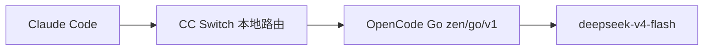

社区截图在吵「Go 里的 DS 跟官方不一样、默认降智」。我把 GitHub 证据翻了一遍，再对照自己现在的用法：吐槽不是空穴来风，但也不等于这套饭不能吃。对我来说，真正值钱的是——首月五刀订 Go，接进 Claude Code，把 Flash 当日用主力蹬。

## 那些吐槽，哪些属实

结论先摆桌上：有真实依据，但别被「问模型你是谁」带沟里。

| 说法 | 核验 | 我怎么看 |
|---|---|---|
| Go 的 Flash 跟官方体感不一样 / 降智 | 社区有对比反馈；复杂 agent 循环上分歧最大 | 部分人中招，不是人人中招 |
| 模型自称 V3.2、不知道 V4 | GitHub [#40409](https://github.com/anomalyco/opencode/issues/40409)（2026-08-04 开，08-07 关）可复现；[#40607](https://github.com/anomalyco/opencode/issues/40607) 在官方第一方 API 也能复现 | 维护者直接说了：LLM 会撒谎身份，这种探测意义不大 |
| 0731 要开 China-hosted | [#39838](https://github.com/anomalyco/opencode/issues/39838)、V2EX 等：不开就 `RegionError` 403 | 想用最新 Flash，工作区里把「启用中国部署的模型」打开 |
| 「量大小人物」分级 | 公开资料没坐实 | 先当段子，别当真 |

8 月 4 日那边还有另一条硬新闻：Flash API 因「前所未有访问量」容量吃紧，OpenCode 自己也发过告警，官方随后说已恢复。负载是真的猛——OpenCode 还晒过 8 月 1 日单日约 **8T tokens**（免费 5T + Go 付费 3T）。人多了，卡顿和体感波动都正常。

自报身份不可靠。想判断版本，拿真实 coding / 多轮工具任务并排测，比盘问「你是谁」靠谱。

## 性价比到底离谱在哪

官方落地页（[opencode.ai/go](https://opencode.ai/go)）那张「每 5 小时请求数」条形图，一眼就能看懂 Flash 站哪：

| 项 | 数字 |
|---|---|
| 首月 | **$5**，之后 **$10**/月 |
| 滚动额度 | 5 小时 **$12** / 周 **$30** / 月 **$60**（按美元价值计） |
| Flash 基础估算 | 约 **31,650** / 5 小时（文档表） |
| Flash **现网 2× 促销** | 约 **63,300** / 5 小时（落地页条形图；Luna 也标了 2×） |
| Flash 计价（与官方对齐） | 输入 $0.14 / 输出 $0.28 / 缓存命中约 $0.0028（每百万 token） |
| 官方自述杠杆 | 付 $10，目标给约 **6×** 用量 |

图上谁短谁长不用我多嘴：Grok / Kimi K3 / Qwen Max 一百出头，Flash 直接拉到六万级。便宜、额度进 $60 池、个人重度 coding agent 很难打满。同样体积用量去官方直连，口袋要掏满那 $60；Go 这边月费十刀，还顺带一堆 GLM / Kimi / MiniMax / Qwen 等模型。

2× 是限时的（落地页 New 条写着 limited time），促销结束会回落基础档，别按峰值当永久真理。细则仍以 [docs/go](https://opencode.ai/docs/go/) 与控制台为准。

额度是**全模型共享**的。你狂烧 GLM-5.2、Kimi K3 这类贵货，Flash 的「几乎无限」会被挤掉。想蹬 Flash，就别把贵模型当背景噪音开着。

## 我怎么把它接到 Claude Code 里蹬

别人材料里写了很多对比评测。我自己的用法就三步，够用：

### 1. 订 Go：五刀 + 邀请赠额

走别人的邀请链接订 Go，首月 **$5**。邀请侧常有 **$5** 赠送额度（社区说法，以结算页为准），叠上套餐里的月度 **$60** 价值用量——对个人开发者已经夸张了。

订完拿 Zen/Go 的 API key，端点是 OpenAI 兼容：`https://opencode.ai/zen/go/v1/chat/completions`，模型 ID：`deepseek-v4-flash`。

想稳定吃到 0731 新版，记得去工作区打开 **Enable models hosted in China**。不开的话，Flash 可能直接 403，或者根本到不了你以为的那版。数据会走中国侧基础设施，敏感业务自己掂量。

### 2. CC Switch：Anthropic 协议拐成 OpenAI

Claude Code 默认吃 Anthropic 协议。Go 的 Flash 端点是 OpenAI 兼容。

中间架一层 **CC Switch**（本机常见 `127.0.0.1:15721`）：加 Provider，把上游指到 OpenCode Go，把 CC 的 Anthropic 请求路由/转换成 OpenAI `chat/completions`。工具端只认本地代理，模型实锤落到 `deepseek-v4-flash`。

链路可以想成：

### 3. 在 Claude Code 里当主力蹬

接好之后，Flash 就挂在 Claude Code 的 Harness 生态里跑：多轮工具、自己的 workflow、日常改码调试。复杂关键决策另切更强模型兜底；日用循环、可拆任务，Flash 足够舒服，而且量够你蹬。

相关阅读：[把高成本判断留给 Luna](/posts/opencode-luna-deepseek-minimax/)——那边讲 OpenCode 里怎么拆角色；这篇讲「订 Go → 拐进 CC → 蹬 Flash」。

## 人太多会抖，但还没打断我

Flash 现在是全球热点。OpenCode 一家就能晒出单日万亿级 token；官方 API 也出现过容量告警。人多了——印度那边也在猛蹬、各路羊毛党、agent 刷子一起上——上游抖动、偶发变慢甚至「感觉钝了」，都说得通，官方性能被挤差一截也不奇怪。

但这并不碍事。起码目前没有打断我这套工作流，我也没体验到那种「换了个假模型」的断崖差别。有体感落差时，优先查：China opt-in 开了没、是不是高峰挤兑、贵模型有没有在偷额度。

还在观望的，开一个月实测最准：看消耗曲线，也看复杂任务并排对比。对我来说，这五刀订下去，Flash 已经够当日用主力了。
