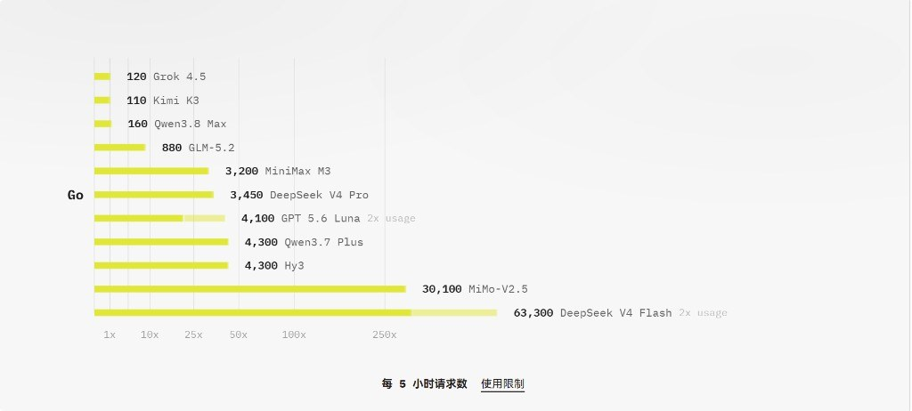

这篇是 **OpenCode 专题合订**。中转站测评正文仍在「中转」分类各站专篇；这里保留路由协作与工具侧配置，两边可交叉引用。

---

## 把高成本判断留给 Luna

> 合并自原帖 `opencode-handbook`

这套配置的价值，不在于把几个模型堆在一起，而在于把任务按能力和成本拆开：`bestcodex/gpt-5.6-luna` 负责判断、路由和验收，`opencode-go/deepseek-v4-flash` 负责可拆分的纯文本执行，MiniMax MCP 负责图片、音乐、视频、TTS 和音色等产物。

这样做的结果是，主控模型不用承担所有重复执行，子 Agent 也不用假装自己拥有视觉能力。真正重要的部分，是每次委派都把边界和工具权限重新写进任务契约里，避免子 Agent 依赖历史上下文。

相关阅读：[Best Codex 中转：三把钥匙、一个 Luna](/posts/bestcodex-relay-luna/)——那边讲 Key 与额度；这篇讲接到 OpenCode 之后怎么分活。

### 这套组合为什么划算

成本收益来自路由，而不是来自「所有任务都换成便宜模型」。

| 工作类型 | 更合适的角色 | 原因 |
|---|---|---|
| 需求理解、复杂取舍、视觉入口、最终验收 | `luna-orchestrator` / `bestcodex/gpt-5.6-luna` | 需要更长上下文、更强推理或图片输入能力 |
| 文件扫描、结构化分析、代码修改、测试和工具结果处理 | `deepseek-v4-flash-worker` / `opencode-go/deepseek-v4-flash` | 任务可以拆开，输入和输出都能用文本表达 |
| 图片、音乐、视频、TTS、音色和图片理解 | MiniMax / `minimax-coding` 工具 | 产物由专用能力生成或解析，不占用主控的全部推理链 |

主控模型只在需要判断的地方出现，纯文本执行交给子 Agent，媒体能力按需触发。任务越清晰，这个分工越省成本；任务越模糊，越应该先让 Luna 收敛目标，再派发执行。

### 三个角色，各自守住一条边界

| 角色 | 接收什么 | 负责什么 | 交付什么 | 不做什么 |
|---|---|---|---|---|
| `luna-orchestrator` | 用户需求、原始图片、视频上下文、子任务结果 | 识别模态、选择能力、拆分任务、判断风险、Review 和验收 | 结构化任务、路由决策、最终结论 | 不把空结果、无证据结果或未完成的异步任务判为成功 |
| `deepseek-v4-flash-worker` | 结构化文字、路径、URL、Prompt、歌词、文本、`task_id` 和工具返回结果 | 执行独立纯文本任务，并在范围内直接调用已暴露且获准的工具 | 非空结果、文件变更清单、验证证据、工具结果或任务状态 | 不把原始图片或视频字节作为模型输入，不猜测视觉内容，不伪造工具结果 |
| MiniMax / `minimax-coding` | `prompt`、`text`、`lyrics`、`voice_id`、`task_id`、`image_source` 等结构化参数 | 生成媒体、理解图片、查询音色、执行相关搜索 | 文件路径、结构化分析文字、`task_id` 或状态 | 不主动扩大任务，不把 `enabled` 自动解释成余额充足 |

有一个容易被误解的点：DeepSeek 是纯文本模型，不等于它只能写调用方案。它可以直接调用当前会话已经暴露、并且权限和认证都通过的 OpenCode 原生工具与 MCP。它不能接收媒体字节，但可以把路径、URL、Prompt 或 `task_id` 作为工具参数传出去，再处理工具返回的文本结果。

### 真正防止「失忆」的不是上下文，而是委派契约

子 Agent 不应该依赖主控上一轮说过什么。每次通过原生 `task` 委派时，都重复注入下面这段固定声明：

> DeepSeek V4 Flash 是纯文本执行 Agent，不接收图片、剪贴板附件或未转换的多媒体，只处理主控提供的结构化文字，并返回非空结果、修改文件、验证命令、验证结果和剩余风险。

同一个任务里还要补上正向能力声明：

> DeepSeek 可以直接调用当前会话已注册且权限/认证通过的 OpenCode 原生工具和 MCP；多媒体只能通过工具参数处理，不能作为原始模型输入。工具不可见或调用失败时，必须返回非空阻塞结果，不得猜测或伪造媒体结果。

这两段话缺一不可。只有限制没有授权，DeepSeek 会把自己误判成「只能分析文本、不能碰工具」；只有授权没有限制，它可能把图片附件当作模型输入，或者把无法验证的媒体结果说成已完成。

固定契约至少要覆盖五件事：

1. 任务范围：只做当前子任务，不擅自扩大。
2. 输入边界：原始媒体不进模型，结构化参数可以交给工具。
3. 工具权限：只能使用当前会话实际暴露且获准的工具。
4. 失败行为：工具不可见、未连接、认证失败或调用失败时，返回非空阻塞结果。
5. 验收证据：返回工具结果、文件路径或任务状态，以及验证命令、验证结果和剩余风险。

### 媒体任务的标准接力


图片理解时，`image_source` 是传给视觉工具的路径或 URL，不是把图片字节交给 DeepSeek。标准流程是：

1. Luna 或 DeepSeek 根据任务范围准备 `image_source` 和分析 Prompt。
2. `minimax-coding_understand_image` 处理图片，返回 OCR、对象、颜色、布局或其他结构化文字。
3. DeepSeek 消费这段结构化文字，继续做判断、改写、代码修改或下一步编排。
4. Luna 检查返回内容是否非空，检查路径、状态、文件变更和需求覆盖。

生成任务也遵循同样的接力方式。DeepSeek 可以直接调用媒体工具，但要先识别副作用：生图和生音频会产生文件和额度消耗，视频可能是异步任务，播放会产生本地设备副作用，网页搜索会产生外部网络请求。

视频任务尤其不能把「已提交」当成「已完成」：`MiniMax_generate_video` 返回 `task_id` 后，必须继续使用 `MiniMax_query_video_generation` 查询到终态，并以最终产物和 Review 结果为准。

### 当前工具面

当前 OpenCode 会话登记并暴露的能力族如下。具体参数以当次运行时工具签名为准，能力索引不替代工具定义。

| 能力 | 工具入口 |
|---|---|
| 图片生成 | `MiniMax_text_to_image` |
| 图片理解和 OCR | `minimax-coding_understand_image` |
| 音乐生成 | `MiniMax_music_generation` |
| 文本转语音 | `MiniMax_text_to_audio` |
| 视频生成与查询 | `MiniMax_generate_video`、`MiniMax_query_video_generation` |
| 音色列表 | `MiniMax_list_voices` |
| 音频播放 | `MiniMax_play_audio` |
| 音色设计 | `MiniMax_voice_design` |
| 音色克隆 | `MiniMax_voice_clone` |
| 网页搜索 | `minimax-coding_web_search` |

这套工具面让产物不再只有文本和代码，还可以包括图片、音乐、语音、视频、OCR 结果和结构化媒体分析。DeepSeek 的职责不是拥有这些媒体模态，而是把结构化任务送到正确的工具，并继续处理返回结果。

### 已验证什么，不能越界推断什么

验证结论要分层写，不能把配置状态和业务成功混在一起。

| 状态 | 当前结论 |
|---|---|
| 配置启用 | `MiniMax` 和 `minimax-coding` 在全局 OpenCode 配置中为 `enabled` |
| 工具可见 | 当前会话暴露了 MiniMax 媒体工具和 `minimax-coding` 工具 |
| 只读调用成功 | `MiniMax_list_voices` 使用 `system` 和 `voice_cloning` 两种参数均成功返回；后者返回空列表 |
| DeepSeek 直接调用工具 | 已验证。DeepSeek 子 Agent 直接调用 `MiniMax_list_voices` 成功，不只是生成调用方案 |
| 生成端点逐项成功 | 尚未逐项验证，不能把配置声明写成全部生成工具已验收 |
| 权益或余额充足 | 当前没有从工具栏得到明确余额查询结果，不能从 `enabled` 推断 |
| 服务端模型真实路由 | 子 Agent 不能独立证明请求最终命中的服务端节点，只能报告配置路由和运行行为 |

「工具已注册」「MCP 已连接」「认证通过」「权益充足」「业务调用成功」是五个不同状态。任何一项都不能替代另外四项。

### 主控验收标准

Luna 收到 `task_result` 后，至少检查以下内容：

| 检查点 | 不通过时的处理 |
|---|---|
| 结果非空 | 重试一次或报告阻塞 |
| Agent 和模型路由正确 | 不验收，检查委派方式和运行信息 |
| 工具结果真实存在 | 不接受只有模板或计划的文字 |
| 文件变更符合授权 | 发现越界修改时暂停验收 |
| 验证命令和结果齐全 | 不把「应该通过」算作证据 |
| 异步任务已到终态 | 继续查询或报告未完成 |
| 剩余风险已列出 | 要求补充边界，不用乐观措辞掩盖未知项 |

这套验收机制把模型的「记性」变成了可检查的契约。子 Agent 即使忘了上下文，也会在当前 Prompt 中重新获得能力边界和工具入口；它即使给出错误结论，Luna 仍然可以通过结果、权限和验证证据把错误拦下来。

### 最容易写错的几句话

| 容易误导的说法 | 更准确的说法 |
|---|---|
| MiniMax 已启用，所以媒体功能一定可用 | MCP 处于 enabled 状态，工具是否可用要看当前会话暴露、认证和实际调用结果 |
| 图片交给 DeepSeek 处理 | 图片通过 `image_source` 交给视觉工具，DeepSeek 只处理工具返回的结构化文字 |
| DeepSeek 只能生成调用方案 | DeepSeek 可以直接调用当前会话已暴露且获准的工具，纯文本边界只限制模型输入，不限制工具编排能力 |
| 调用方案已经生成，所以任务完成 | 只有实际调用获得返回，并完成验证和 Review，才算执行完成 |
| 视频任务已经提交，所以视频生成完成 | 必须保存 `task_id`，查询到终态并确认产物 |
| 音色列表为空，所以 MiniMax 没有权益 | 空列表只说明当前分类没有可枚举条目，不能推出权益状态 |
| 纯文本模型不能做媒体任务 | 纯文本模型不能直接理解媒体字节，但可以通过工具参数编排媒体任务 |

### 维护这套体系的几条硬规则

1. `opencode.json` 是运行时配置来源，`capability-index.md` 是能力登记表，`AGENTS.md` 和 `session-bootstrap.md` 是协作规则和新会话同步层。
2. 修改 Agent、模型、MCP、Skill、Plugin 或权限后，同时更新能力索引，并重新做 JSON 解析和运行时检查。
3. 每次原生 `task` 委派都重复注入固定能力声明，不依赖历史上下文。
4. 运行时工具栏优先于旧文档。工具名、参数和可用性发生变化时，以当次实际暴露签名为准。
5. 修改配置后重启 OpenCode。配置不是热加载的，当前会话不会自动获得所有新规则。
6. 凭据只从认证存储或环境变量读取，不进入 Prompt、日志、能力索引或知识笔记。
7. 媒体工具按需触发。涉及生成、播放、外部网络或异步任务时，先标明副作用，再执行和验收。

### 适合迁移到其他项目的原则

- 按输入模态和任务复杂度分工，不按「谁都能做」分工。
- 把工具权限、失败处理和验收证据写进每次委派契约。
- 让低成本模型承担可验证的执行，让高能力模型承担路由和最终判断。
- 把多媒体当作工具参数和工具结果管理，不把媒体字节硬塞给纯文本模型。
- 将配置状态、运行时状态和业务结果分层记录。
- 用真实调用验证工具链，不用静态 `enabled` 字段替代运行时证据。
- 对异步产物坚持「状态到终态」的验收，而不是看到 `task_id` 就结束。
- 保留失败和未知项。未知不是失败，但把未知写成成功会让整套协作失去可信度。

这套方案的核心不是让某一个模型变得无所不能，而是让每个角色都知道自己能做什么、该把什么交给工具、什么时候必须停下来等主控验收。这样，成本、能力和产物多样性才会同时成立。

---

## 接上 Claude Code 的 AutoMemory

> 合并自原帖 `opencode-handbook`

如果你同时用 Claude Code 和 OpenCode，迟早会遇到一个很烦的问题：Claude 记得项目历史，OpenCode 却像第一次见面。

最省事的解法不是再建一套 SQLite，也不是把记忆迁移到某个云服务，而是让两个工具读写同一份 Claude Code AutoMemory。

### compaction 不是 AutoMemory

这两个概念很容易混在一起。

OpenCode 的 session persistence 和 context compaction，解决的是当前会话太长之后如何继续；Claude Code AutoMemory 解决的是哪些信息值得跨会话保留下来。一个负责压缩上下文，一个负责沉淀长期记忆，不是一回事。

OpenCode 核心目前没有 Claude Code 同款的自动记忆提取机制。想让它跨会话召回和写回，就需要插件或其他扩展层。

### 选兼容层，不另起炉灶

这次接入的是 `opencode-claude-memory`。它的定位不是新建一个记忆系统，而是把 OpenCode 接到 Claude Code 已有的本地 Markdown 目录上：

| 项目 | 做法 |
|---|---|
| 存储 | 继续使用 Claude Code 的 `~/.claude/projects/<project>/memory/` |
| 格式 | 沿用 Markdown 与 YAML frontmatter |
| 迁移 | 不迁移，旧文件原样保留 |
| 数据库 | 不增加 SQLite、worker 或云端服务 |
| 工具 | 提供 `memory_list`、`memory_search`、`memory_read`、`memory_save`、`memory_delete` |

说白了，这不是复制记忆，而是接同一个文件入口。

### 实际接入只需要三步

先安装插件：

```bash
npm install -g opencode-claude-memory
```

再安装会话结束后的 wrapper：

```bash
opencode-memory install
```

最后在全局 `opencode.json` 里追加插件：

```json
{
  "plugin": ["opencode-claude-memory"]
}
```

已有其他插件时只追加，不要覆盖整个配置。改完后要完全退出并重启 OpenCode，配置不会在当前进程里热加载。

### Windows 下真正容易卡住的是路径

我的 blog 工作区有两个层级：

```text
D:\OneDrive\Desktop\blog
└── Firefly    # 真正的 Git 仓库
```

Claude Code 旧记忆已经落在：

```text
C:\Users\Lenovo\.claude\projects\D--OneDrive-Desktop-blog\memory\
```

而插件按照 Firefly 的 Git 根目录解析出了另一条路径：

```text
C:\Users\Lenovo\.claude\projects\D--OneDrive-Desktop-blog-Firefly\memory\
```

如果不处理这个差异，插件虽然能加载，`memory_list` 也能调用，但看到的是一个空目录。这个状态最容易被误判成“插件没有记忆”。

解决方式是把空的目标目录改成 Windows junction，指向已有的 Claude memory：

```text
D--OneDrive-Desktop-blog-Firefly\memory
        ↓ junction
D--OneDrive-Desktop-blog\memory
```

这样没有复制文件，也没有迁移真源；两个路径只是指向同一份内容。以后如果项目根目录或 Git worktree 变化，要重新检查插件解析出的路径。

### 验证不能只看配置文件

“配置写进去了”和“共享记忆真的能用”至少是三层证据：

1. `opencode debug config` 能识别 `opencode-claude-memory`。
2. 独立重启的 OpenCode 进程能调用 `memory_list`、`memory_search`、`memory_read`。
3. OpenCode 写入一条临时记忆后，Claude Code 在同一个项目里也能读到。

本次验证结果是：

| 验证项 | 结果 |
|---|---|
| 插件版本 | `opencode-claude-memory@1.7.3` |
| OpenCode memory 工具 | 可用 |
| 现有 blog memory | 可读 |
| OpenCode 写入 | 成功 |
| Claude Code 读取 OpenCode 写入 | 成功 |
| 临时测试条目 | 已清理 |
| 原有 memory 文件 | SHA-256 已恢复一致 |

最后一项很重要。测试写入时，插件会同步更新 `MEMORY.md` 索引；如果只删测试主题文件、不恢复索引，记忆库仍然会留下脏引用。验证脚本或工具如果没有帮你做回滚，必须再检查一次索引。

### 记忆、项目规则和文章素材各归其位

共享记忆很有用，但它不是整个知识系统：

| 内容 | 适合的位置 |
|---|---|
| 稳定的项目规则与命令 | `AGENTS.md`、`CLAUDE.md`、`CONTEXT.md` |
| 用户偏好、工作习惯、跨会话决策 | Claude Code AutoMemory |
| 调研结论和文章素材 | `D:\OneDrive\Desktop\Knowledge\` |
| 可发布正文 | blog 的 `src/content/posts/` |

把所有东西塞进 AutoMemory，最后只会得到一间很难找东西的杂物间。记忆应该保存“以后还会影响决策的事实”，文章素材则应该进入自己的写作流水线。

### 还有一个 Skill 入口误会

OpenCode 的 Skill 不等于斜杠命令。它由 Agent 的 `skill` 工具按需加载，所以在 `/skills` 菜单里看不到，不代表文件没有安装。

正确的触发方式是直接告诉 Agent：

```text
用 post-publish 提炼这次会话。
```

如果 Skill 已被当前 CLI 的 available skills 发现，Agent 就可以加载它。模型 variants 是 API 推理参数问题，Skill 则是 Agent 工具入口问题，这两件事不要混成一个“索引失败”。

### 最后留一条边界

共享方案解决的是存储一致性，不保证所有 shell 的 wrapper 行为都一样。Windows 下 Git Bash 更容易让 `opencode-memory install` 生效；PowerShell 仍能加载插件和 memory 工具，但会话结束后的自动提取是否触发，要按实际运行环境验证。

真正稳妥的判断顺序是：先看插件有没有被 OpenCode 解析，再看工具能不能读已有条目，最后做一次跨工具写读。三层都通过，才算真的把两套记忆接成了一套。🧠

---

## DeepSeek V4 Flash 刀法

> 合并自原帖 `opencode-handbook`

社区截图在吵「Go 里的 DS 跟官方不一样、默认降智」。我把 GitHub 证据翻了一遍，再对照自己现在的用法：吐槽不是空穴来风，但也不等于这套饭不能吃。对我来说，真正值钱的是——首月五刀订 Go，接进 Claude Code，把 Flash 当日用主力蹬。

### 那些吐槽，哪些属实

结论先摆桌上：有真实依据，但别被「问模型你是谁」带沟里。

| 说法 | 核验 | 我怎么看 |
|---|---|---|
| Go 的 Flash 跟官方体感不一样 / 降智 | 社区有对比反馈；复杂 agent 循环上分歧最大 | 部分人中招，不是人人中招 |
| 模型自称 V3.2、不知道 V4 | GitHub [#40409](https://github.com/anomalyco/opencode/issues/40409)（2026-08-04 开，08-07 关）可复现；[#40607](https://github.com/anomalyco/opencode/issues/40607) 在官方第一方 API 也能复现 | 维护者直接说了：LLM 会撒谎身份，这种探测意义不大 |
| 0731 要开 China-hosted | [#39838](https://github.com/anomalyco/opencode/issues/39838)、V2EX 等：不开就 `RegionError` 403 | 想用最新 Flash，工作区里把「启用中国部署的模型」打开 |
| 「量大小人物」分级 | 公开资料没坐实 | 先当段子，别当真 |

8 月 4 日那边还有另一条硬新闻：Flash API 因「前所未有访问量」容量吃紧，OpenCode 自己也发过告警，官方随后说已恢复。负载是真的猛——OpenCode 还晒过 8 月 1 日单日约 **8T tokens**（免费 5T + Go 付费 3T）。人多了，卡顿和体感波动都正常。

自报身份不可靠。想判断版本，拿真实 coding / 多轮工具任务并排测，比盘问「你是谁」靠谱。

### 性价比到底离谱在哪

官方落地页（[opencode.ai/go](https://opencode.ai/go)）那张「每 5 小时请求数」条形图，一眼就能看懂 Flash 站哪：



| 项 | 数字 |
|---|---|
| 首月 | **$5**，之后 **$10**/月 |
| 滚动额度 | 5 小时 **$12** / 周 **$30** / 月 **$60**（按美元价值计） |
| Flash 基础估算 | 约 **31,650** / 5 小时（文档表） |
| Flash **现网 2× 促销** | 约 **63,300** / 5 小时（落地页条形图；Luna 也标了 2×） |
| Flash 计价（与官方对齐） | 输入 $0.14 / 输出 $0.28 / 缓存命中约 $0.0028（每百万 token） |
| 官方自述杠杆 | 付 $10，目标给约 **6×** 用量 |

图上谁短谁长不用我多嘴：Grok / Kimi K3 / Qwen Max 一百出头，Flash 直接拉到六万级。便宜、额度进 $60 池、个人重度 coding agent 很难打满。同样体积用量去官方直连，口袋要掏满那 $60；Go 这边月费十刀，还顺带一堆 GLM / Kimi / MiniMax / Qwen 等模型。

2× 是限时的（落地页 New 条写着 limited time），促销结束会回落基础档，别按峰值当永久真理。细则仍以 [docs/go](https://opencode.ai/docs/go/) 与控制台为准。

额度是**全模型共享**的。你狂烧 GLM-5.2、Kimi K3 这类贵货，Flash 的「几乎无限」会被挤掉。想蹬 Flash，就别把贵模型当背景噪音开着。

### 我怎么把它接到 Claude Code 里蹬

别人材料里写了很多对比评测。我自己的用法就三步，够用：

#### 1. 订 Go：五刀 + 邀请赠额

走别人的邀请链接订 Go，首月 **$5**。邀请侧常有 **$5** 赠送额度（社区说法，以结算页为准），叠上套餐里的月度 **$60** 价值用量——对个人开发者已经夸张了。

订完拿 Zen/Go 的 API key，端点是 OpenAI 兼容：`https://opencode.ai/zen/go/v1/chat/completions`，模型 ID：`deepseek-v4-flash`。

想稳定吃到 0731 新版，记得去工作区打开 **Enable models hosted in China**。不开的话，Flash 可能直接 403，或者根本到不了你以为的那版。数据会走中国侧基础设施，敏感业务自己掂量。

#### 2. CC Switch：Anthropic 协议拐成 OpenAI

Claude Code 默认吃 Anthropic 协议。Go 的 Flash 端点是 OpenAI 兼容。

中间架一层 **CC Switch**（本机常见 `127.0.0.1:15721`）：加 Provider，把上游指到 OpenCode Go，把 CC 的 Anthropic 请求路由/转换成 OpenAI `chat/completions`。工具端只认本地代理，模型实锤落到 `deepseek-v4-flash`。

链路可以想成：


#### 3. 在 Claude Code 里当主力蹬

接好之后，Flash 就挂在 Claude Code 的 Harness 生态里跑：多轮工具、自己的 workflow、日常改码调试。复杂关键决策另切更强模型兜底；日用循环、可拆任务，Flash 足够舒服，而且量够你蹬。

相关阅读：[把高成本判断留给 Luna](/posts/opencode-handbook/)——那边讲 OpenCode 里怎么拆角色；这篇讲「订 Go → 拐进 CC → 蹬 Flash」。

### 人太多会抖，但还没打断我

Flash 现在是全球热点。OpenCode 一家就能晒出单日万亿级 token；官方 API 也出现过容量告警。人多了——印度那边也在猛蹬、各路羊毛党、agent 刷子一起上——上游抖动、偶发变慢甚至「感觉钝了」，都说得通，官方性能被挤差一截也不奇怪。

但这并不碍事。起码目前没有打断我这套工作流，我也没体验到那种「换了个假模型」的断崖差别。有体感落差时，优先查：China opt-in 开了没、是不是高峰挤兑、贵模型有没有在偷额度。

还在观望的，开一个月实测最准：看消耗曲线，也看复杂任务并排对比。对我来说，这五刀订下去，Flash 已经够当日用主力了。

---

## 官方坐标与补强备注

OpenCode 的美化 / Harness / 技巧以本章为准；若某段同时服务中转测评，中转专篇只保留测评结论与数据，详细配置链回本文。
