## 操作系统的定义
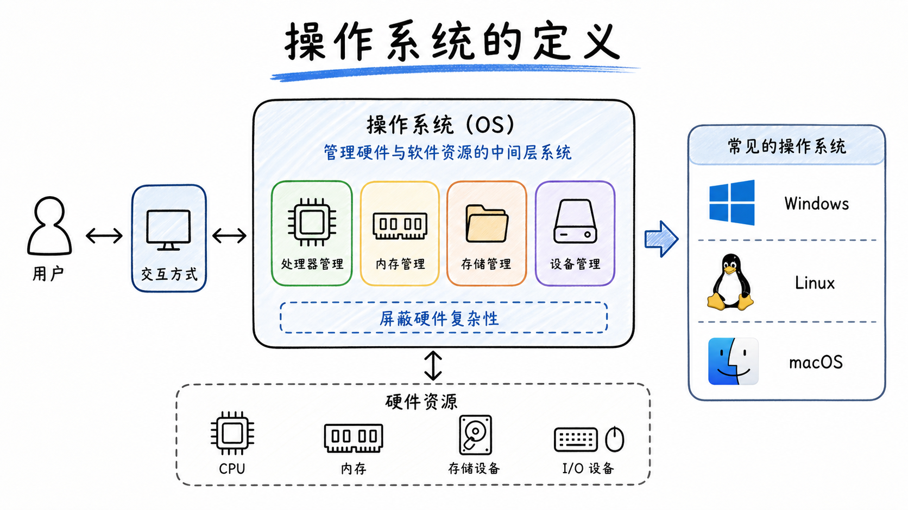

大家好，我是程序员Dan。今天总结一下操作系统在校招面试中经常被问到的“八股”，也就是常见的操作系统面试题。

**操作系统（Operating System，OS）**是计算机系统中管理硬件与软件资源的中间层系统。它屏蔽了硬件的复杂性，也为用户提供了便捷的交互方式。常见的操作系统包括：

- Windows
- Linux
- macOS

## 操作系统的主要功能
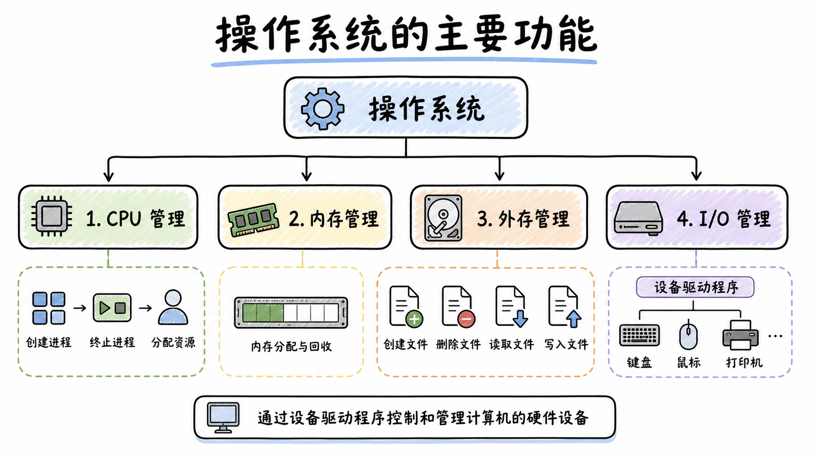

操作系统的功能主要可以分为四类：

1. **CPU 管理**
2. **内存管理**
3. **外存管理**
4. **I/O 管理**

具体来说，操作系统需要负责创建和终止进程，为进程分配资源，并提供创建、删除、读取和写入文件的功能。此外，操作系统还要通过设备驱动程序控制和管理计算机的硬件设备，例如键盘、鼠标和打印机等。

## 操作系统内核
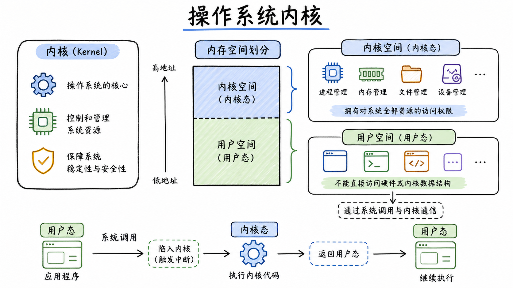

**内核（Kernel）**是一个计算机程序，也是操作系统的核心。它提供了操作系统最核心的能力，可以控制和管理系统中的各种资源。

计算机的内存空间可以划分为两个区域：

- **内核空间**
- **用户空间**

这种划分主要是为了保护系统的稳定性和安全性。

### 内核空间

内核空间也对应**内核态**，是操作系统内核代码及其运行时数据结构所在的内存区域。它拥有对系统全部资源的访问权限，可以完成进程管理、内存管理等操作。

### 用户空间

用户空间是操作系统为应用程序及用户进程分配的内存区域。用户空间中的进程不能直接访问硬件或内核数据结构，只能通过**系统调用**与内核通信。

当应用程序执行系统调用时，CPU 会从用户态切换到内核态，进入内核空间执行相应的内核代码，完成后再切回用户态。

## 进程与进程管理
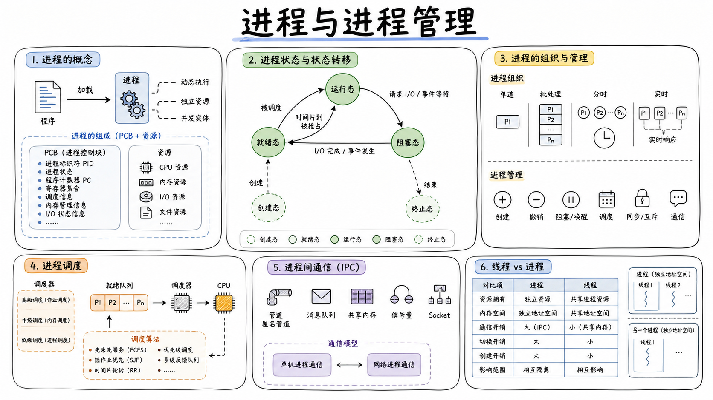

## 并发与并行

### 并发

**并发**是指在一段时间内，多个任务都会被处理，但在某一个具体时刻，只有一个任务正在执行。

单核处理器实现并发，主要依靠时间片轮转。例如有程序 A 和程序 B：

1. A 运行一个时间片；
2. 切换到 B；
3. B 运行一个时间片；
4. 再切换回 A。

因为切换速度足够快，所以从宏观上看，多个程序像是在一段时间内同时运行；但从微观上看，它们其实是一个接一个轮流执行的。

### 并行

**并行**是指在同一个时刻有多个任务同时执行，这通常需要多核处理器完成。

从微观上看，并行系统可以同时执行多条指令，不同程序被放在不同的处理器核心上运行。这才是物理意义上的多个任务同时进行。

## 进程上下文切换
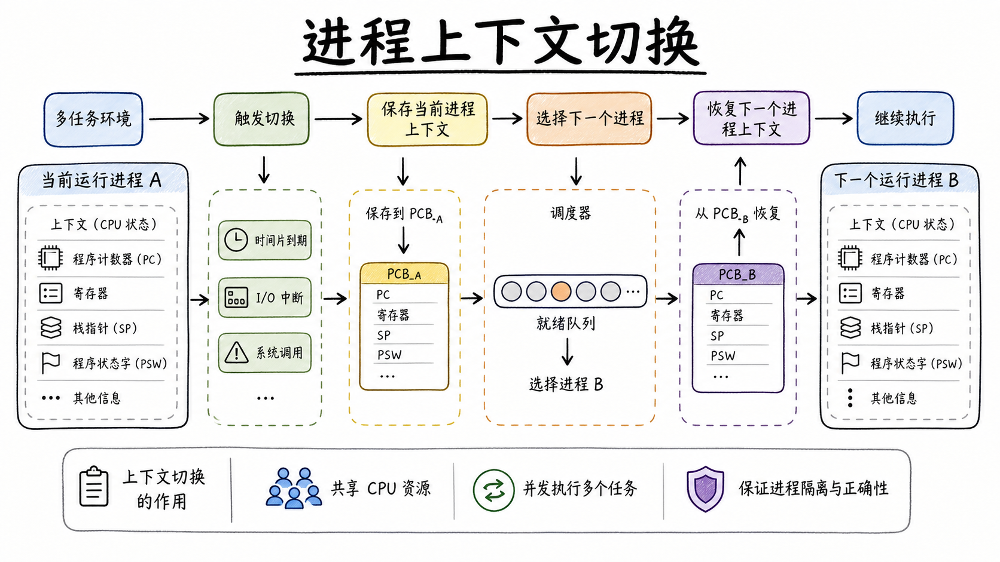

**进程上下文切换**是指操作系统在多任务处理环境中，将 CPU 从一个进程切换到另一个进程的过程。

通过上下文切换，多个进程可以共享 CPU 资源，使系统能够并发执行多个任务。切换过程中，操作系统需要保存当前进程的运行上下文，并恢复下一个进程此前保存的上下文。

## 进程的五种状态
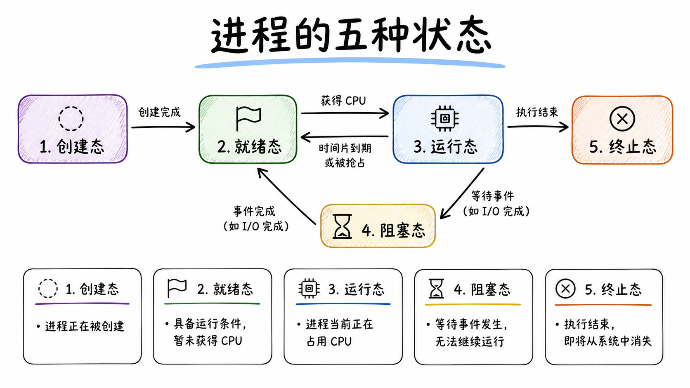

进程通常包括五种状态，其中运行态、就绪态和阻塞态最常被问到。

- **运行态**：进程当前正在占用 CPU。
- **就绪态**：进程已经具备运行条件，但由于其他进程正在运行，所以暂时没有获得 CPU。
- **阻塞态**：进程正在等待某个事件发生，例如等待输入输出操作完成。即使此时把 CPU 控制权交给它，它也无法继续运行。
- **创建态**：进程正在被创建。
- **终止态**：进程执行结束，即将从系统中消失。

## 僵尸进程与孤儿进程
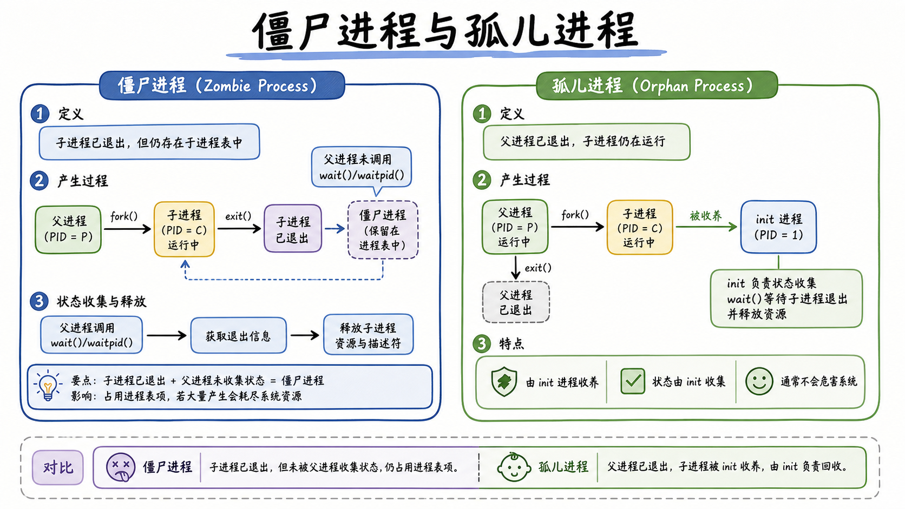

### 僵尸进程

**僵尸进程**是指已经执行完成并处于终止状态，但仍然存在于进程表中的进程。

子进程退出时，它的进程描述符不会立即释放。只有父进程通过 `wait()`、`waitpid()` 等方法获取子进程的退出信息后，相关资源才会被释放。

如果子进程已经退出，而父进程没有调用这些方法进行状态收集，那么子进程的进程描述符仍然会留在系统中，该进程就成为僵尸进程。

### 孤儿进程

**孤儿进程**是指父进程已经退出，但子进程仍在运行的情况。

这些子进程会被 `init` 进程收养。在传统 Unix/Linux 系统中，`init` 进程的 PID 为 1，它会负责对这些孤儿进程完成状态收集。因此，孤儿进程通常不会对系统造成危害。

## 进程间通信
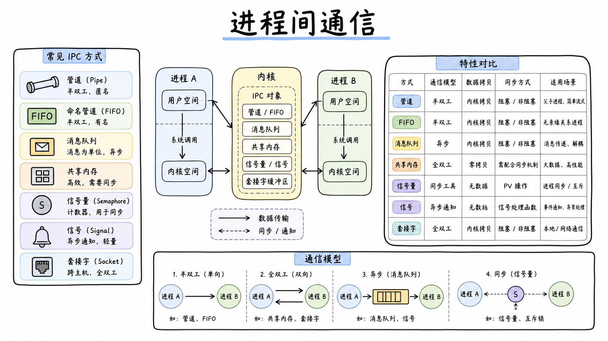

## 六种常见的进程间通信方式
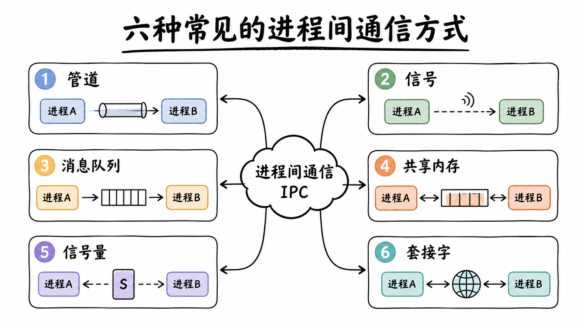

进程间通信，也就是 **IPC（Inter-Process Communication）**，常见方式主要包括：

1. 管道
2. 信号
3. 消息队列
4. 共享内存
5. 信号量
6. 套接字

## 管道
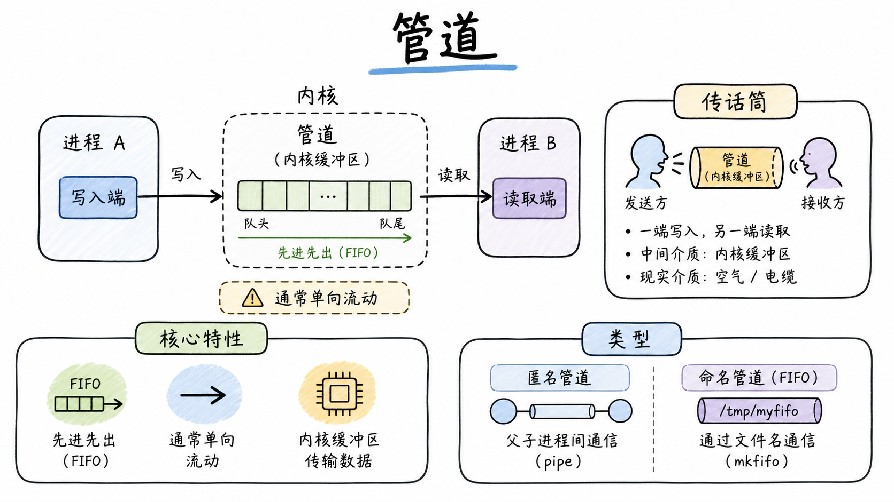

进程间的**管道**可以理解为内核中的一串缓存。数据从管道的一端写入，再从另一端读取，并且通常只能单向流动。

可以把管道理解成不同进程之间的“传话筒”：一边发出声音，另一边接收声音。现实中的传话介质可能是空气或电缆，而进程间管道的介质则是内核缓冲区。

管道遵循**先进先出（FIFO）**原则，并可进一步分为匿名管道和命名管道等类型。

## 信号
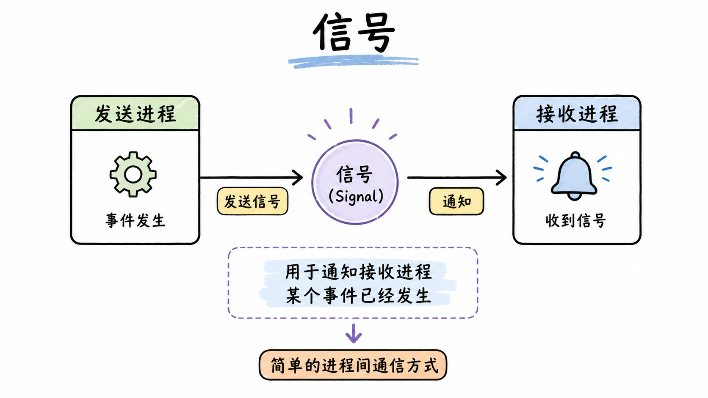

**信号（Signal）**用于通知接收进程某个事件已经发生，是一种比较简单的进程间通信方式。

## 消息队列
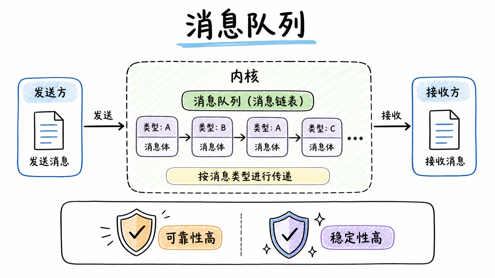

**消息队列**是保存在内核中的消息链表，可以按照消息类型进行传递，具有较高的可靠性和稳定性。

## 共享内存
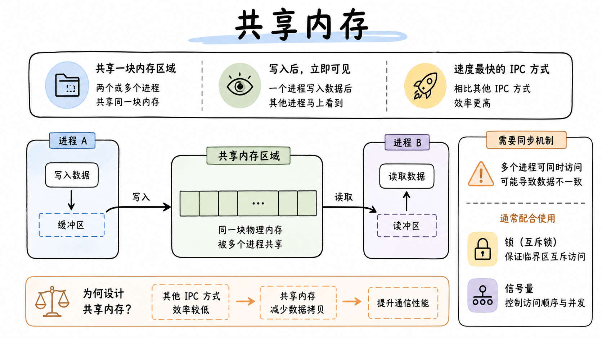

**共享内存**允许两个或多个进程共享同一块内存区域。一个进程写入数据后，其他进程可以马上看到。

> 共享内存通常是速度最快的进程间通信方式。

它是针对其他进程间通信方式效率较低的问题而设计的。不过，由于多个进程可以同时访问共享区域，通常还需要配合锁或信号量保证同步。

## 信号量
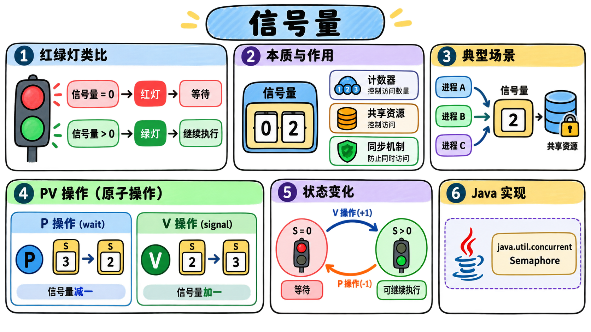

**信号量（Semaphore）**可以理解成红绿灯：

- 信号量为零，可以类比为红灯，需要等待；
- 信号量非零，可以类比为绿灯，可以继续执行。

信号量本质上是一个计数器，用于控制对共享资源的访问数量。它也经常作为一种同步机制，防止某个进程正在访问共享资源时，其他进程同时访问该资源。

Java 的 `java.util.concurrent` 包中也有相关类来实现类似功能。

控制信号量需要掌握两种原子操作：

- **P 操作**：`wait`，使信号量减一；
- **V 操作**：`signal`，使信号量加一。

这就是常说的 **PV 操作**，属于操作系统基础知识，需要理解清楚。

## 套接字
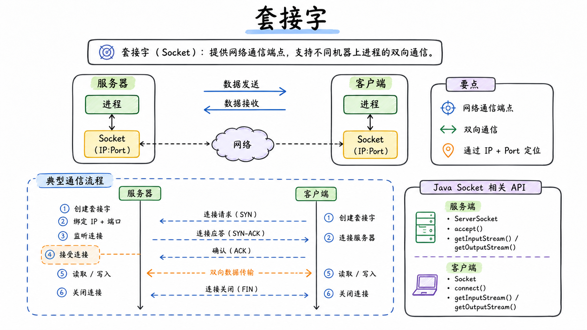

**套接字（Socket）**主要用于提供网络通信端点，可以让运行在不同机器上的进程进行双向通信。Java 中也提供了 Socket 相关 API。

## 进程调度算法
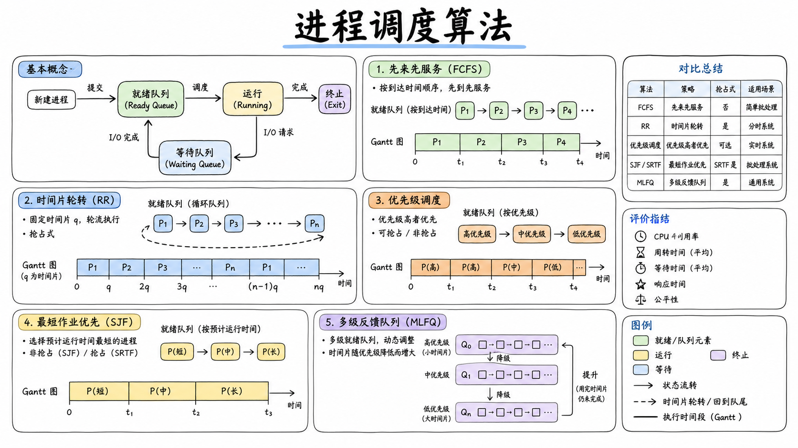

## 六种常见调度算法
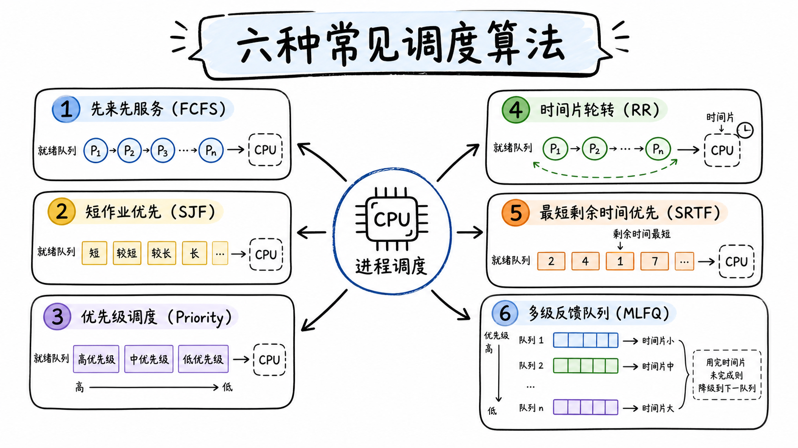

常见的进程调度算法包括：

1. 先来先服务
2. 短作业优先
3. 优先级调度
4. 时间片轮转
5. 最短剩余时间优先
6. 多级反馈队列

## 先来先服务
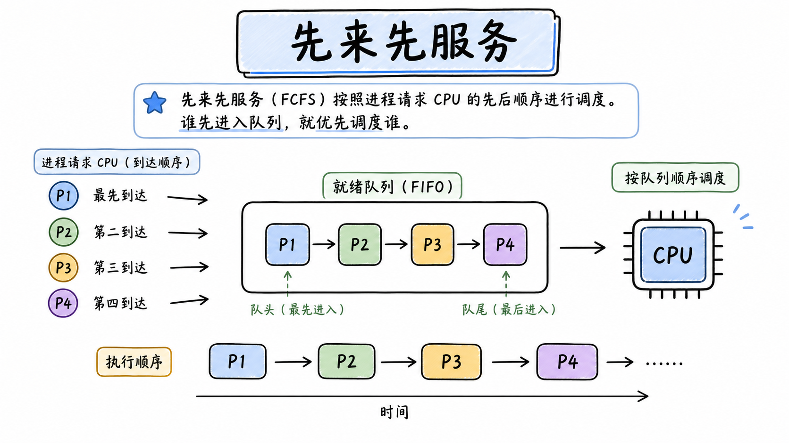

**先来先服务（FCFS）**按照进程请求 CPU 的先后顺序进行调度。谁先进入队列，就优先调度谁。

## 短作业优先
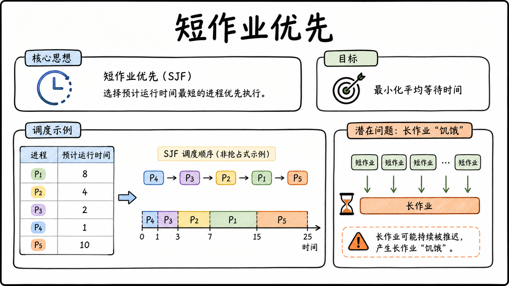

**短作业优先（SJF）**选择预计运行时间最短的进程优先执行。

这种方式可能导致长作业持续被推迟，产生长作业“饥饿”的问题。

## 优先级调度
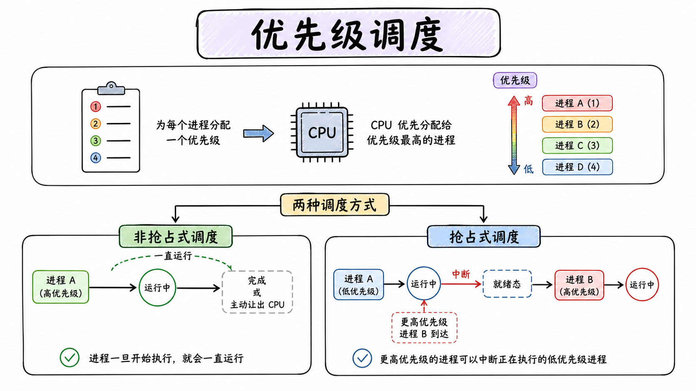

**优先级调度**会为每个进程分配一个优先级，CPU 优先分配给优先级最高的进程。

优先级调度可以分为两种：

- **非抢占式调度**：进程一旦开始执行，就会一直运行到完成或主动让出 CPU。
- **抢占式调度**：更高优先级的进程可以中断正在执行的低优先级进程。

## 时间片轮转
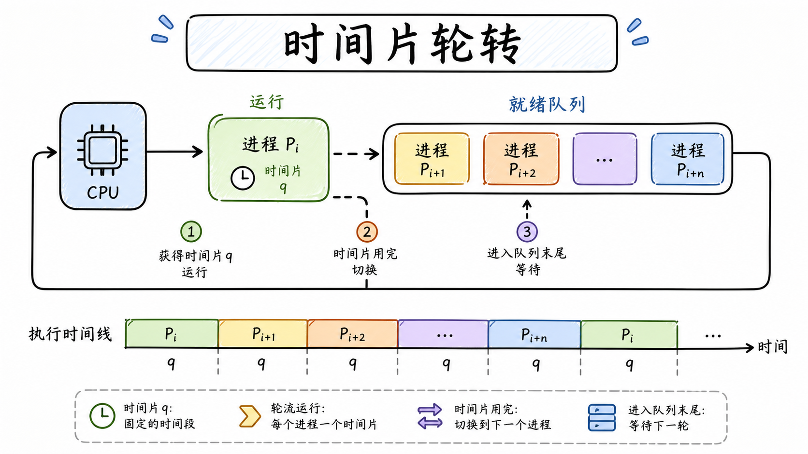

**时间片轮转调度**会为每个进程分配一个固定的时间段，也就是时间片。每个进程可以在自己的时间片内运行，时间片用完后再切换到其他进程。

## 最短剩余时间优先
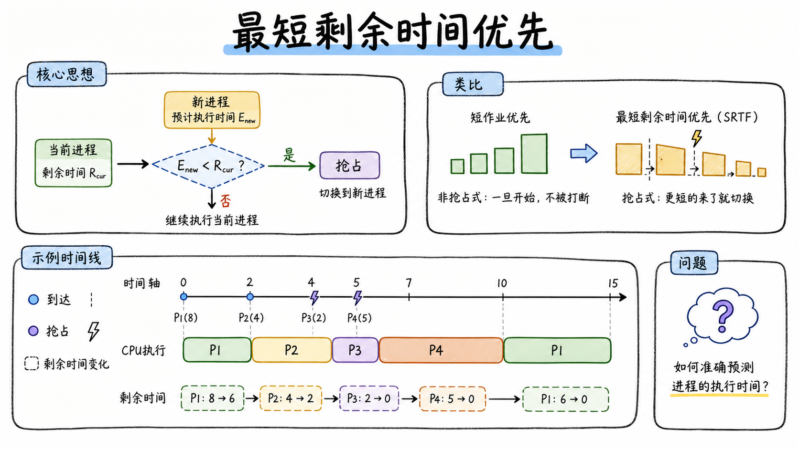

**最短剩余时间优先（SRTF）**可以看成短作业优先的抢占式版本。

如果新进程的预计执行时间比当前进程的剩余执行时间短，调度器就会暂停当前进程，切换到新进程。

这种算法也会面临一个问题：*应该如何准确预测进程的执行时间？*

## 多级反馈队列
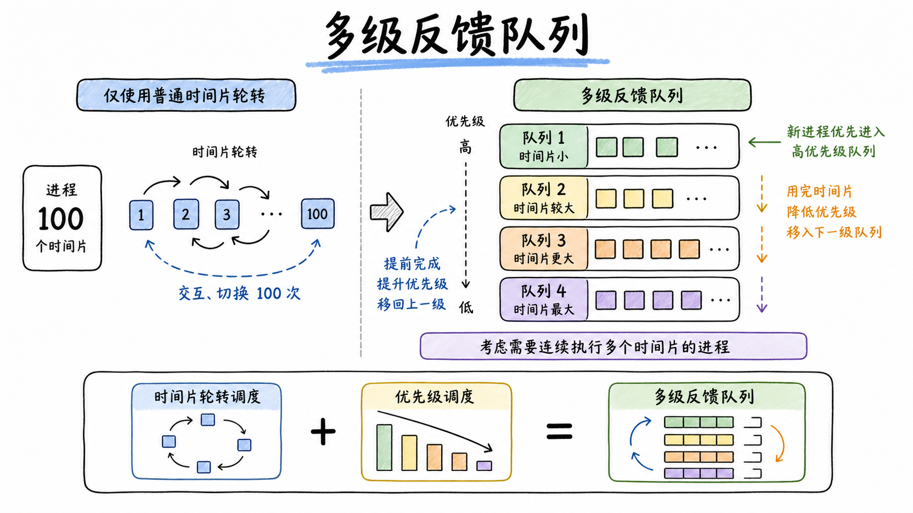

假设一个进程需要执行 100 个时间片，如果只采用普通的时间片轮转算法，就可能需要交互、切换 100 次。

**多级反馈队列**会设置多个队列，每个队列拥有不同的优先级和时间片大小，并考虑需要连续执行多个时间片的进程。它可以看成时间片轮转调度算法与优先级调度算法的结合。

## 线程与线程同步
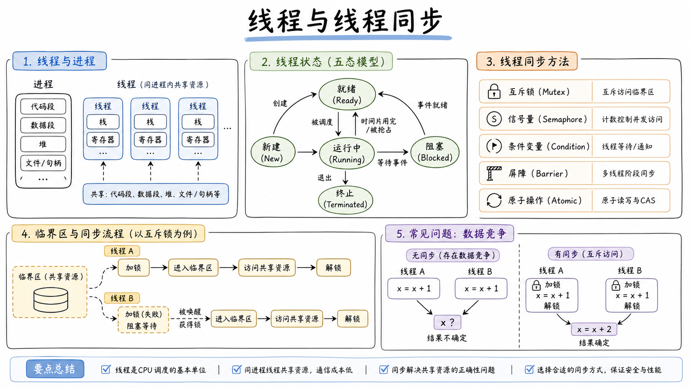

## 进程与线程的区别

**进程**是一个正在执行的程序实例。每个进程都有独立的地址空间、全局变量、堆、栈和文件描述符等。

**线程**是进程中的一个执行单元。一个进程可以包含多个线程，这些线程共享所属进程的地址空间和资源。

两者可以从以下几个方面进行比较：

| 对比维度 | 进程 | 线程 |
|---|---|---|
| 地址空间 | 相互独立 | 共享所属进程的地址空间 |
| 内存开销 | 较大 | 较小 |
| 上下文切换 | 开销较大 | 开销较小 |
| 通信 | 通信开销较大 | 可通过共享内存直接通信 |
| 创建与销毁 | 开销较大 | 开销较小 |
| 并发性 | 相对较低 | 相对较高 |
| 崩溃影响 | 通常不影响其他进程 | 可能导致整个进程崩溃 |

进程在独立的地址空间中运行，一个进程发生崩溃通常不会影响其他进程。线程共享同一进程的内存空间，一个线程崩溃则可能导致整个进程崩溃，自然也会影响该进程中的其他线程。

线程的生命周期由进程控制。如果进程终止，进程中的线程也会随之终止。

## 线程上下文切换
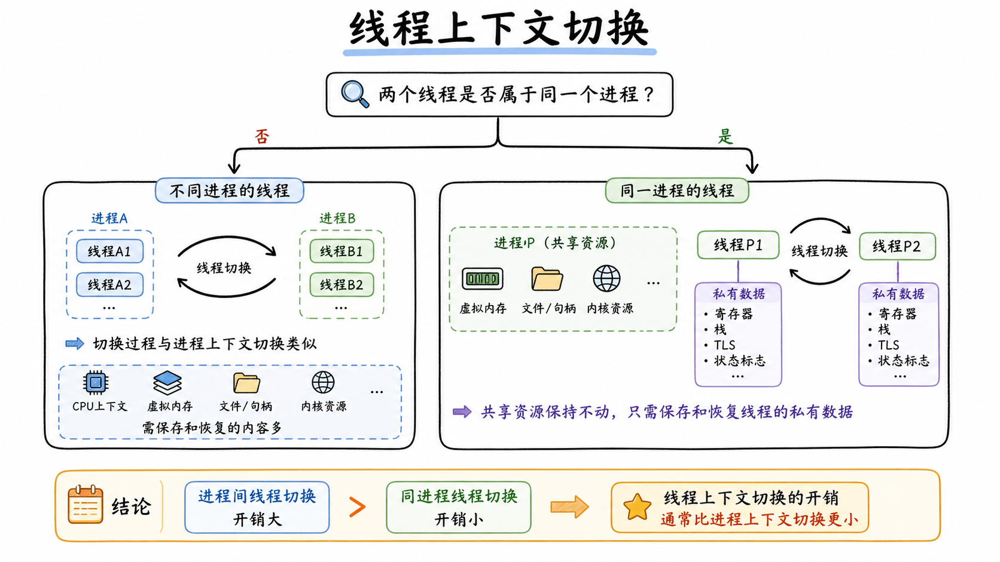

分析线程上下文切换时，首先要判断两个线程是否属于同一个进程。

- 如果两个线程不属于同一个进程，切换过程与进程上下文切换类似。
- 如果两个线程属于同一个进程，由于它们共享虚拟内存等资源，切换时可以保持这些共享资源不动，只需要保存和恢复线程的私有数据。

因此，线程上下文切换的开销通常比进程上下文切换更小。

## 线程的三种实现方式
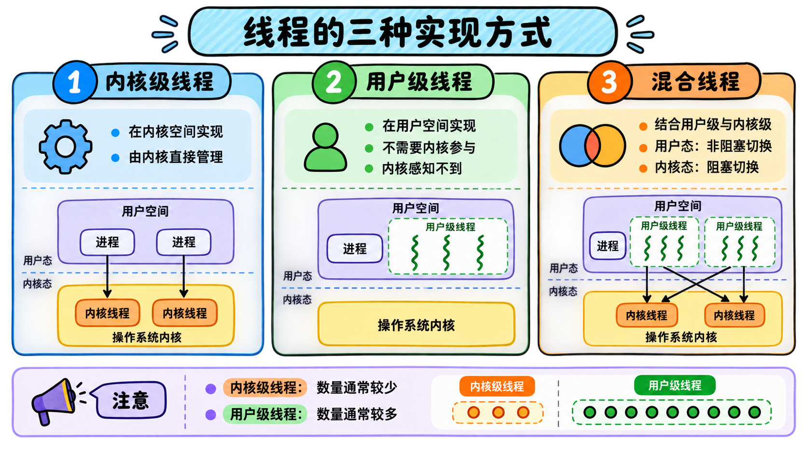

线程的实现方式主要包括：

1. **内核级线程**
2. **用户级线程**
3. **混合线程**

### 内核级线程

内核级线程是在内核空间中实现的线程，由内核直接管理。

### 用户级线程

用户级线程是在用户空间中实现的线程，不需要内核参与，内核也感知不到这些线程的具体存在。

### 混合线程

现代操作系统通常会将用户级线程与内核级线程结合起来。

用户态的执行系统负责进程内部线程在非阻塞状态下的切换，内核态的操作系统负责阻塞线程的切换，也就是同时实现内核态和用户态的线程管理。

需要注意的是，内核级线程的数量通常较少，用户级线程的数量通常较多。

## 线程同步与临界区
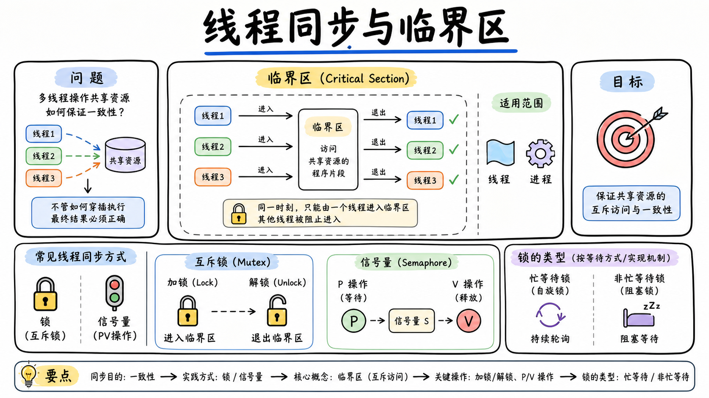

线程同步主要解决多线程操作共享资源时的一致性问题。不管多个线程如何穿插执行，最终结果都必须正确。

常见的线程同步方式包括锁和信号量。

**临界区**是访问共享资源的程序片段。我们希望这段代码是互斥的，即同一时刻只能由一个线程执行。当某个线程正在临界区内执行时，其他线程应当被阻止进入该临界区。

临界区不仅针对线程，也适用于进程。常见同步实现方式包括：

- **互斥锁**
- **信号量**

对于互斥锁，需要理解加锁和解锁的概念；对于信号量，则需要掌握 PV 操作。根据等待方式和实现机制不同，锁还可以区分为忙等待锁和非忙等待锁等类型。

## 死锁、饥饿与活锁
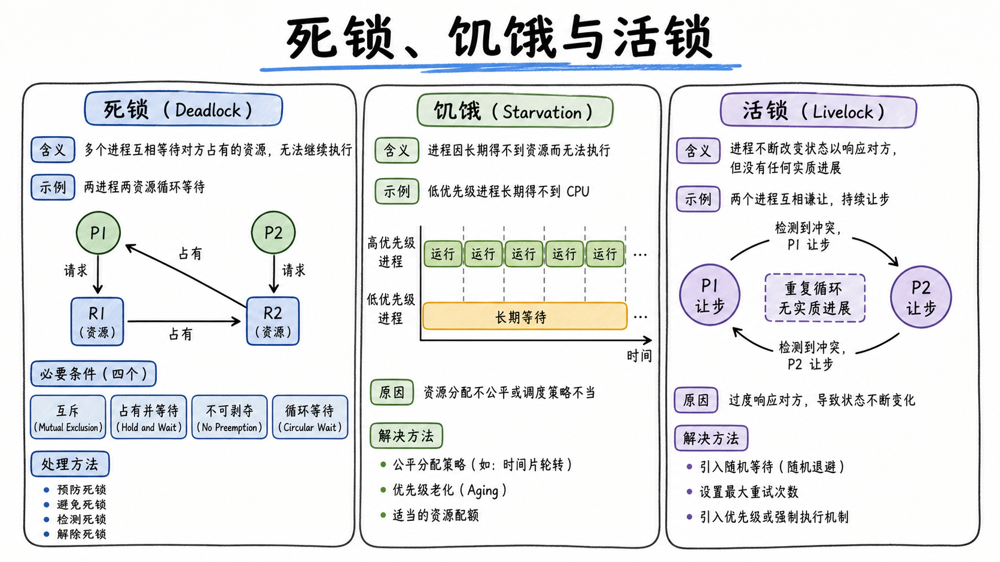

## 什么是死锁
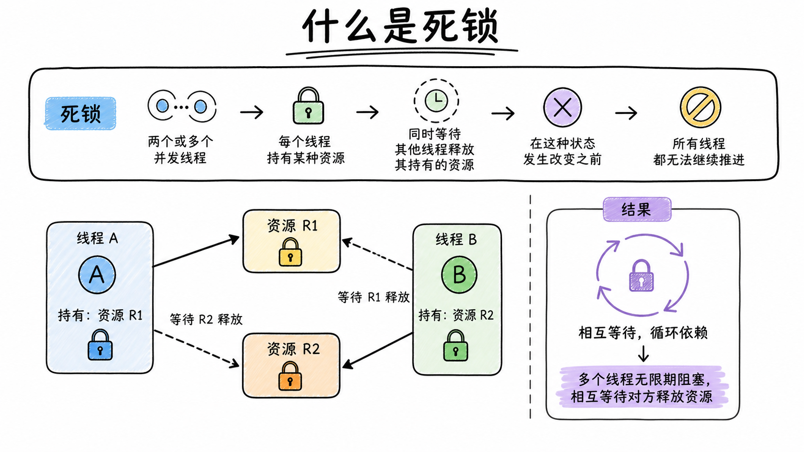

**死锁**是指在两个或多个并发线程中，每个线程都持有某种资源，同时又在等待其他线程释放其持有的资源。在这种状态发生改变之前，所有线程都无法继续推进。

换句话说，多个线程会无限期阻塞，并相互等待对方释放资源。

## 死锁产生的四个必要条件
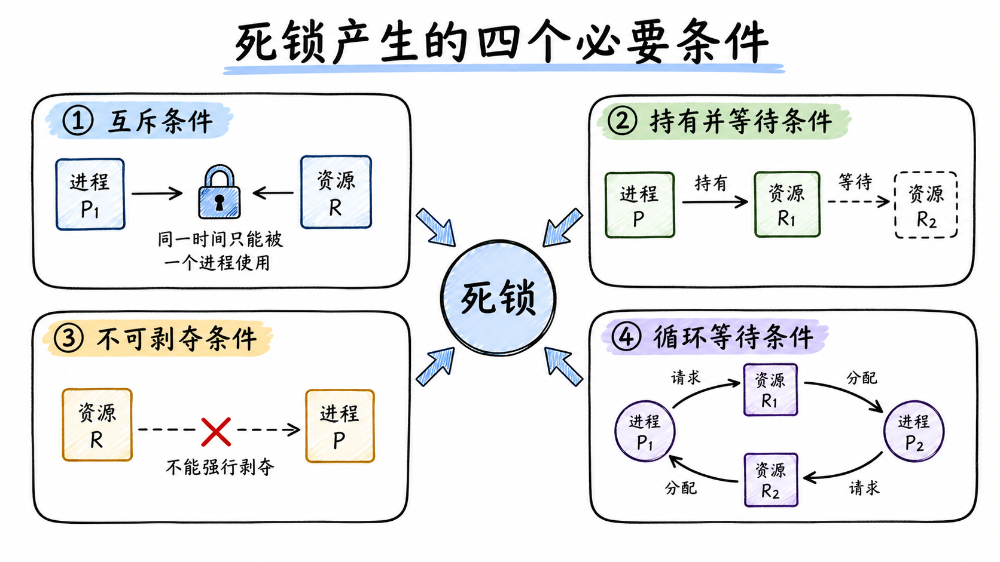

死锁的产生需要同时满足以下四个条件：

1. **互斥条件**
2. **持有并等待条件**
3. **不可剥夺条件**
4. **循环等待条件**

## 如何预防死锁
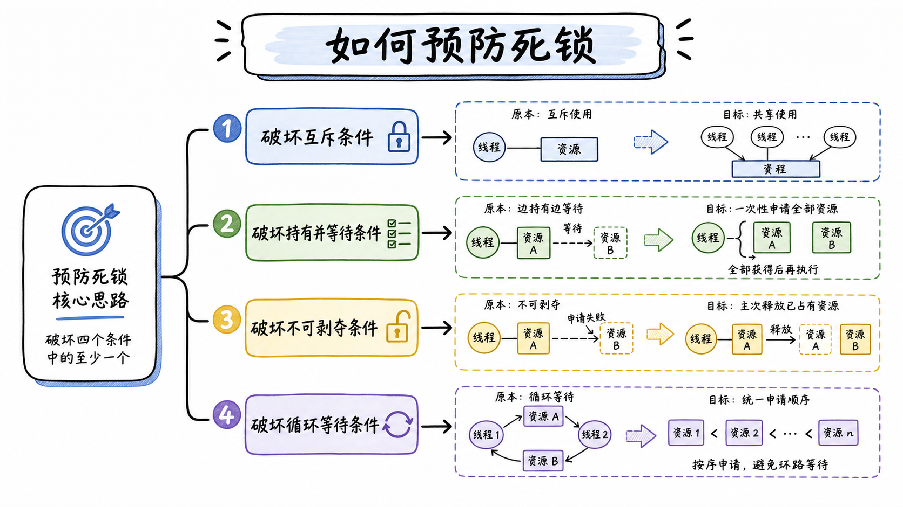

预防死锁的核心思路，就是破坏上述四个条件中的至少一个。

### 破坏互斥条件

让资源可以同时被多个线程使用。不过，这种方式通常很难实现，因为很多资源在某一时刻只能由一个线程占用，例如互斥锁本身。

### 破坏持有并等待条件

线程可以一次性申请自己需要的全部资源。只有在获得所有资源后才开始执行，避免持有部分资源的同时继续等待其他资源。

### 破坏不可剥夺条件

当持有部分资源的线程继续申请其他资源却申请不到时，让它主动释放已经占有的资源，从而破坏不可剥夺条件。

### 破坏循环等待条件

可以为资源建立统一的申请顺序，并要求线程按照规定顺序申请资源，从而避免形成环路等待。

## 饥饿
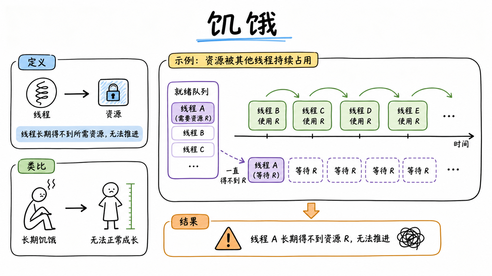

**饥饿**是指某个线程一直得不到它所需要的资源，因此无法继续推进。

这就像一个人长期处于饥饿状态，自然没有办法正常成长。

## 活锁
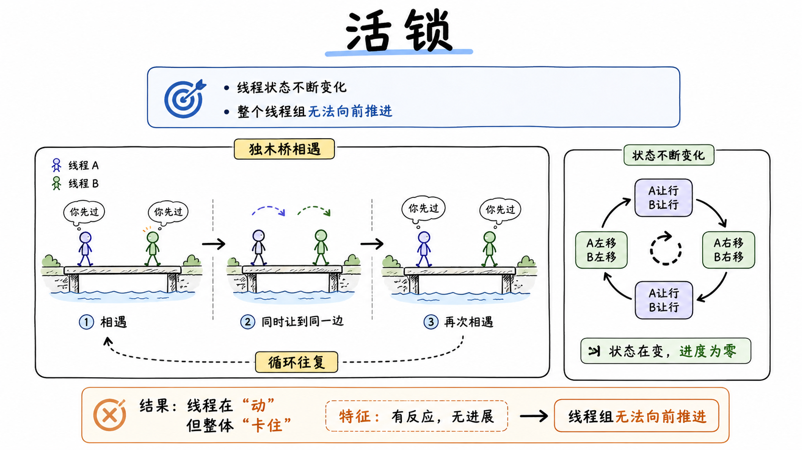

在**活锁**状态下，线程的状态会不断发生变化，但整个线程组仍然无法向前推进。

可以把它理解成两个人在独木桥上相遇，都想让对方先过，于是两个人同时往旁边让。如果两个人每次都让到同一边，他们的状态虽然一直在变化，却始终无法向前走，相当于“动着动着卡住了”。

## 内存管理
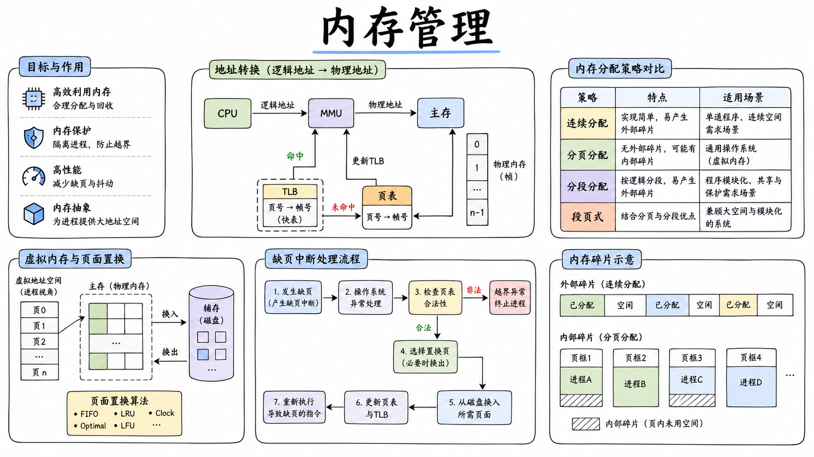

## 物理内存与虚拟内存
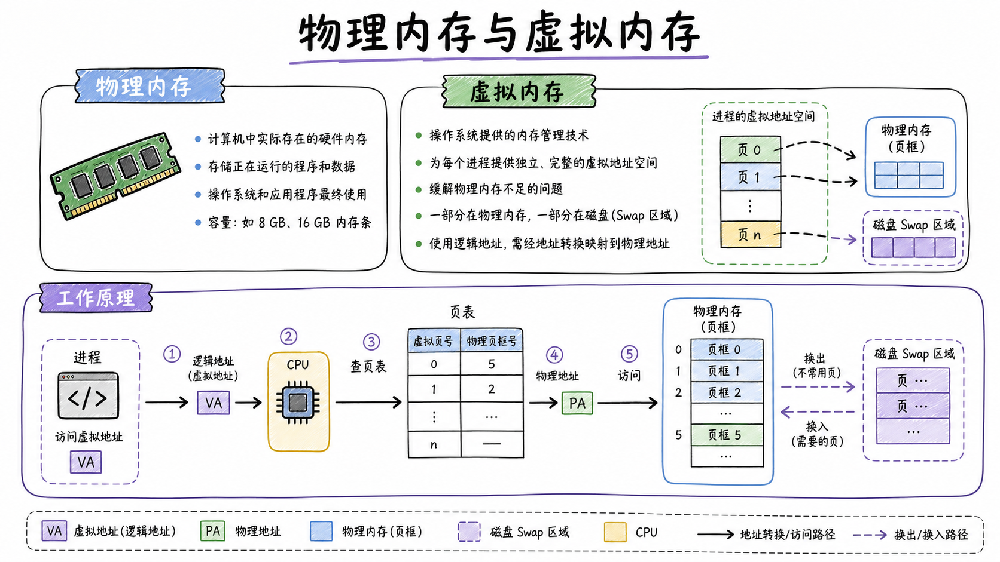

### 物理内存

**物理内存**是计算机中实际存在的硬件内存，用于存储正在运行的程序和数据。操作系统和应用程序最终都必须使用物理内存执行。

平时所说的 8 GB、16 GB 内存条，指的就是物理内存容量。

### 虚拟内存

**虚拟内存**是操作系统提供的一种内存管理技术。它让应用程序认为自己拥有连续、独立的内存空间，但实际上，这些内容可能一部分存放在物理内存中，另一部分存放在磁盘中，物理位置也可能并不连续。

虚拟内存的核心思想是通过硬件与操作系统配合，为每个进程提供独立、完整的虚拟地址空间，从而缓解物理内存不足的问题。

每个进程都有自己的虚拟地址空间。虚拟内存使用的是逻辑地址，它与实际物理地址不同，必须经过地址转换才能映射到物理内存。

操作系统通过**页表**将虚拟地址映射到物理地址。当程序访问某个虚拟地址时，CPU 会通过页表找到对应的物理地址。

操作系统会把虚拟内存划分成很多页，也就是 *pages*。每一页都可以映射到物理内存中的一个页框。如果物理内存不足，操作系统会把不常用的页暂时存储到磁盘交换区，也就是 **Swap** 区域，这个过程称为页面换出或页面交换。

## 内存分段
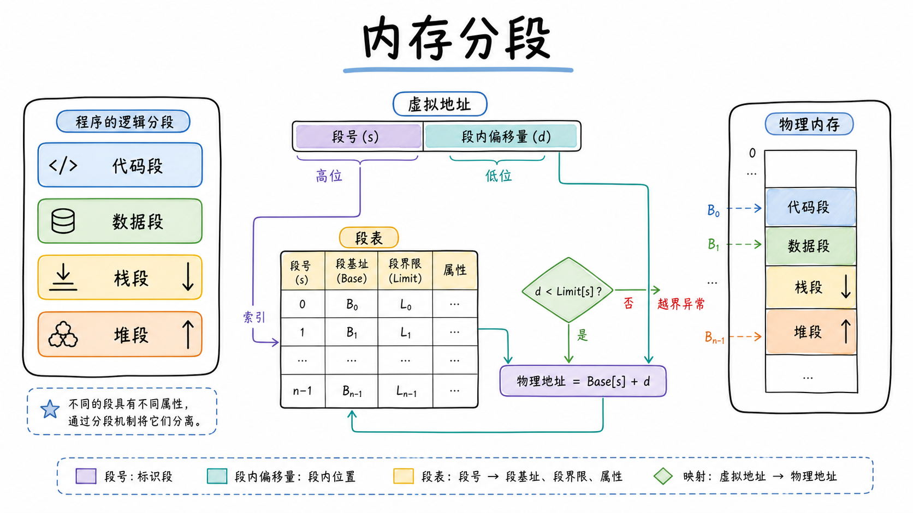

一个程序由若干个逻辑分段组成，例如：

- 代码段
- 数据段
- 栈段
- 堆段

不同的段具有不同属性，因此可以通过分段机制将它们分离出来。

在分段机制下，虚拟地址由两部分组成：

1. 段号
2. 段内偏移量

虚拟地址与物理地址通过段表进行映射。段表中通常包含段号、段基址和段界限等信息。

## 内存分页
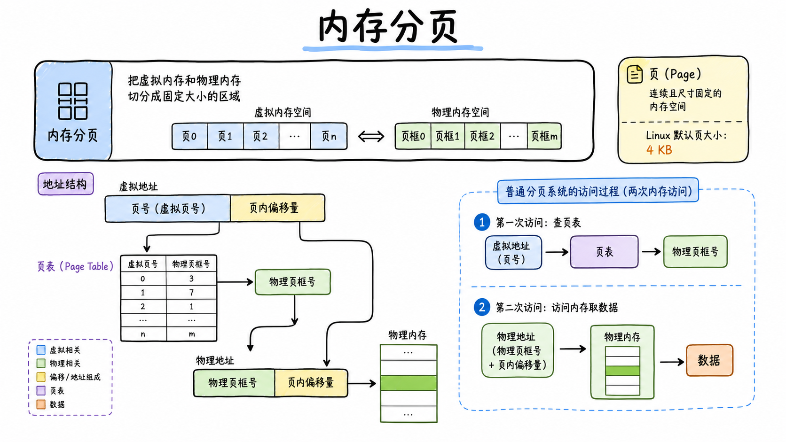

**内存分页**是把整个虚拟内存和物理内存空间切分成一段段固定大小的区域。这种连续且尺寸固定的内存空间称为**页（Page）**。在常见的 Linux 系统中，默认页大小通常为 4 KB。

在普通分页系统中，访问数据通常需要两次内存访问：

1. 第一次访问页表，找到对应的物理页框，再结合页内偏移量得到实际物理地址；
2. 第二次根据得到的物理地址访问内存，取出数据。

## 分页与分段的区别
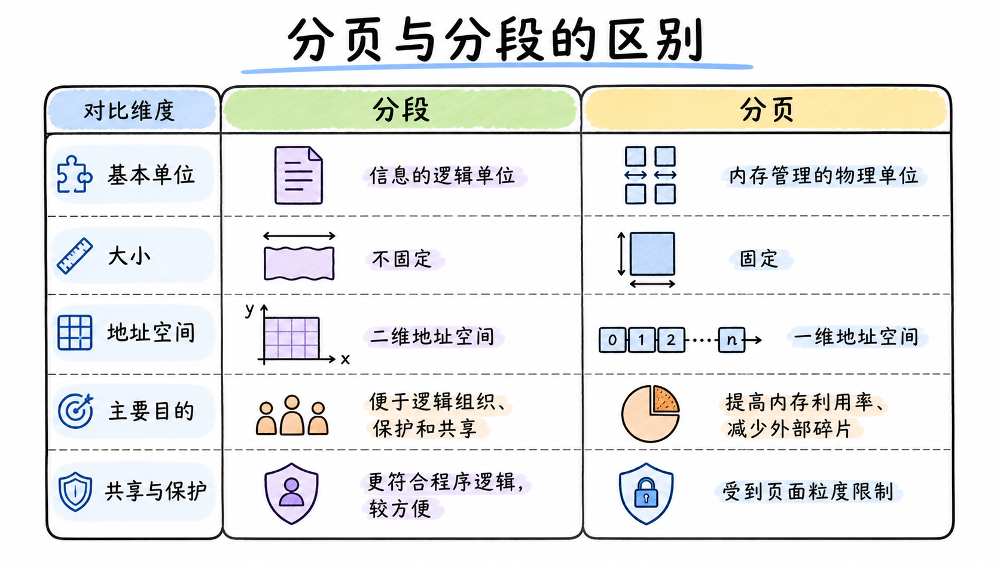

| 对比维度 | 分段 | 分页 |
|---|---|---|
| 基本单位 | 信息的逻辑单位 | 内存管理的物理单位 |
| 大小 | 不固定 | 固定 |
| 地址空间 | 二维地址空间 | 一维地址空间 |
| 主要目的 | 便于逻辑组织、保护和共享 | 提高内存利用率、减少外部碎片 |
| 共享与保护 | 更符合程序逻辑，较方便 | 受到页面粒度限制 |

## 多级页表
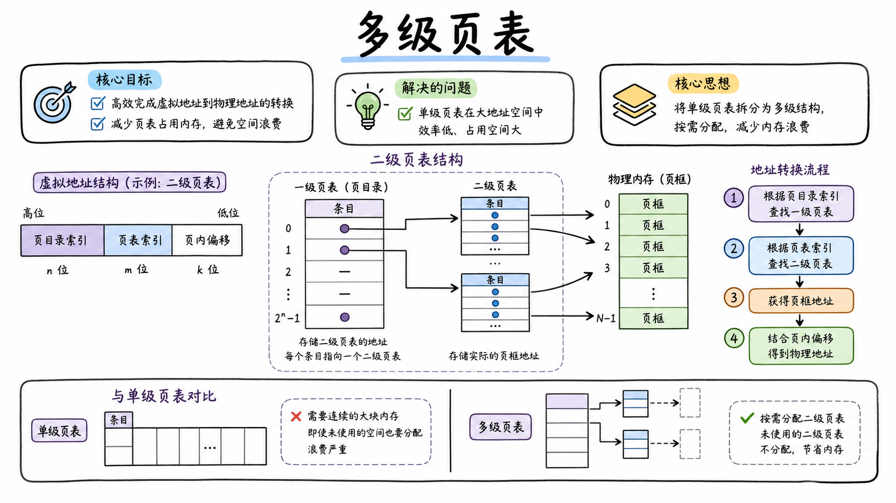

**多级页表**是一种虚拟内存管理技术，用于高效完成虚拟地址到物理地址的转换。

多级页表通过分层结构减少页表所占用的内存，解决单级页表在大地址空间中效率较低、占用空间过大的问题。

它会把单级页表拆分成多个层级。例如二级页表包括：

- **一级页表，也叫页目录**：存储二级页表的地址，每个条目指向一个二级页表；
- **二级页表**：存储实际的页框地址。

通过这种方式，没有使用到的二级页表可以不分配，从而减少内存浪费。

## 快表与 TLB
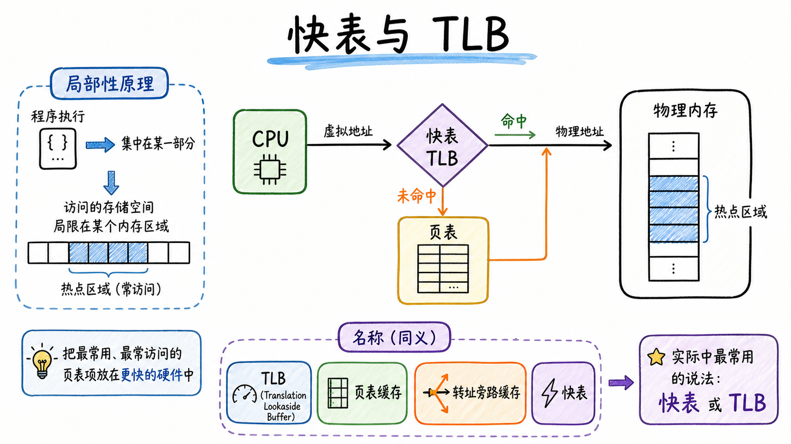

程序在一段时间内的执行通常集中在某一部分，相应访问的存储空间也会局限在某个内存区域，这就是**局部性原理**。

利用这一特性，可以把最常用、最常访问的页表项存放在访问速度更快的硬件中。例如在 CPU 芯片中加入一个专门缓存常用页表项的 Cache，这个缓存称为：

- **TLB（Translation Lookaside Buffer）**
- 页表缓存
- 转址旁路缓存
- 快表

实际讨论中最常用的说法就是“快表”或 TLB。

## 交换空间
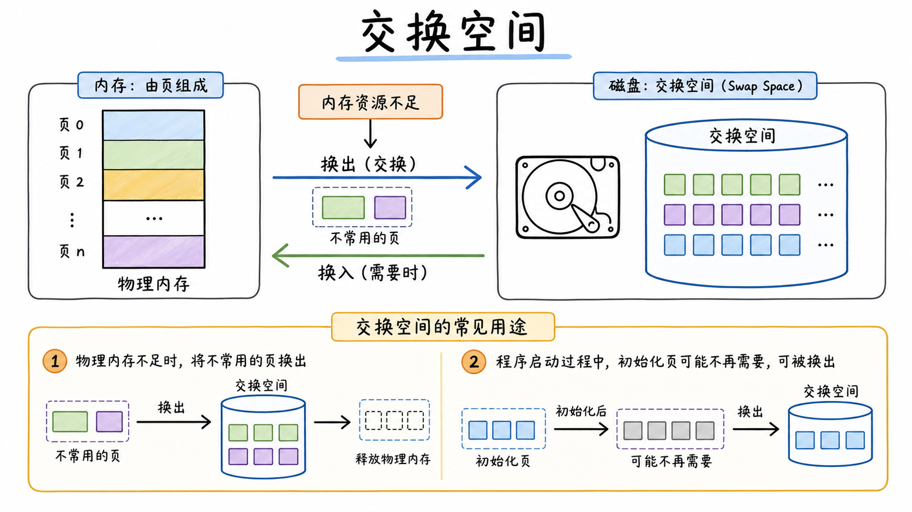

操作系统会把物理内存划分成一块块页。当内存资源不足时，Linux 可以把某些页的内容转移到磁盘上的另一块空间，以释放物理内存。

磁盘上的这块空间称为**交换空间（Swap Space）**，这一过程称为交换。

交换空间常见用途包括：

- 物理内存不足时，将不常用的页换出；
- 程序启动过程中，某些内存页只用于初始化，之后可能不再需要，可以被换出。

## 缺页中断
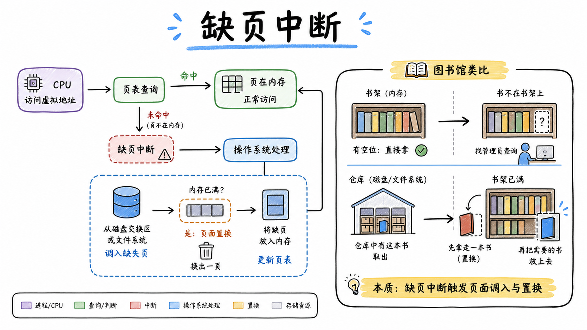

**缺页中断（Page Fault）**是虚拟内存管理中的一个概念。当程序访问的页不在物理内存中时，就会发生缺页中断。操作系统需要从磁盘交换区或文件系统中把缺失的页调入内存。

可以把它类比成去图书馆找书：

> 书架能放的书有限。如果要找的书刚好在书架上，就可以直接拿来读；如果不在书架上，就要找管理员查询。管理员发现仓库里有这本书，便从仓库中取出。如果书架已经满了，还要先拿走一本书，再把需要的书放上去。

这就类似缺页中断发生后的页面调入与置换过程。

## 页面置换算法
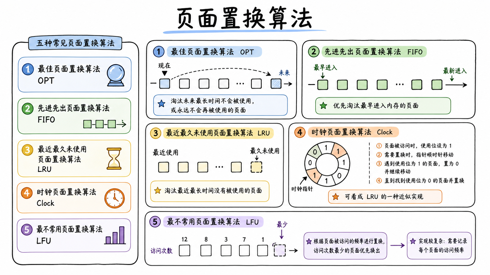

常见页面置换算法一共有五种：

1. 最佳页面置换算法
2. 先进先出页面置换算法
3. 最近最久未使用页面置换算法
4. 时钟页面置换算法
5. 最不常用页面置换算法

### 最佳页面置换算法

**OPT** 会淘汰未来最长时间不会被使用，或者以后永远不会再被使用的页面。

这是理论上的最佳算法，但通常无法真正实现，因为系统无法准确知道未来会访问哪些页面。

### 先进先出页面置换算法

**FIFO** 优先淘汰最早进入内存的页面。

### 最近最久未使用页面置换算法

**LRU** 淘汰最近最长时间没有被使用的页面。

### 时钟页面置换算法

**Clock** 可以看成 LRU 的一种近似实现。它通过循环列表遍历页面，每个页面都有一个使用位：

- 页面被访问时，使用位设置为 1；
- 需要进行页面置换时，时钟指针顺时针移动；
- 遇到使用位为 1 的页面，就把它置为 0 并继续移动；
- 直到找到使用位为 0 的页面并将其置换。

### 最不常用页面置换算法

**LFU** 根据页面被访问的频率进行置换，访问次数最少的页面会被优先换出。

LFU 的实现比较复杂，因为系统需要记录每个页面的访问频率。

## I/O 模型与多路复用
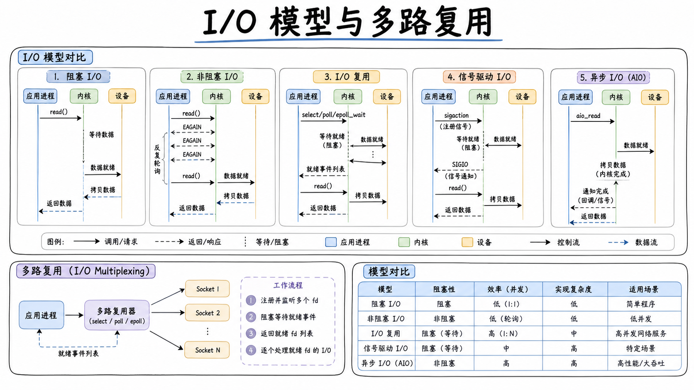

## 阻塞 I/O
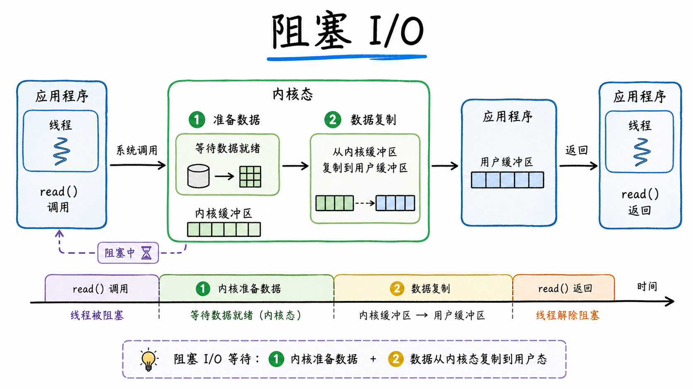

**阻塞 I/O**是指用户程序执行 `read()` 后，线程会被阻塞，直到：

1. 内核把数据准备好；
2. 数据从内核缓冲区复制到应用程序缓冲区。

完成这两个过程后，`read()` 才会返回。

因此，阻塞 I/O 等待的既包括内核准备数据的过程，也包括数据从内核态复制到用户态的过程。

## 非阻塞 I/O
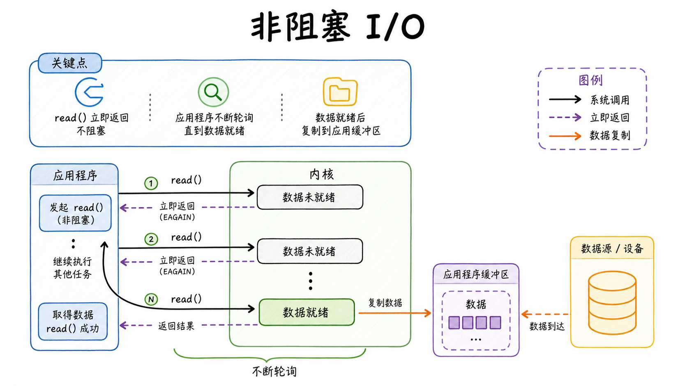

在**非阻塞 I/O**中，如果数据还没有准备好，非阻塞的 `read()` 请求会立即返回，程序可以继续向下执行。

应用程序需要不断轮询内核，直到数据准备完成。随后，内核把数据复制到应用程序缓冲区，`read()` 调用才能真正取得结果。

## I/O 多路复用
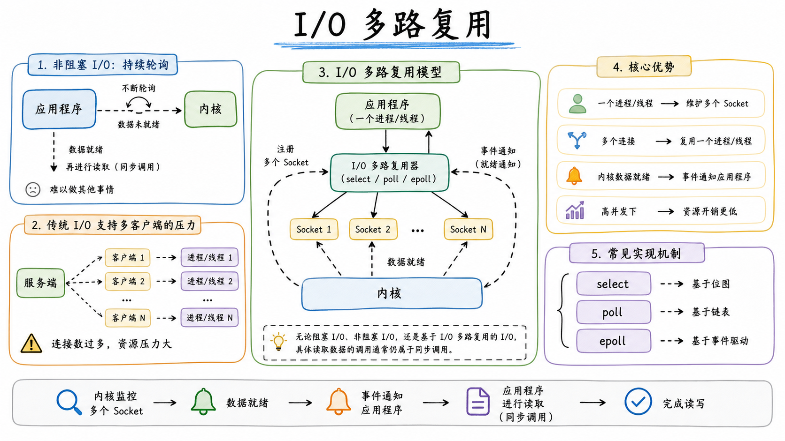

普通非阻塞 I/O 需要应用程序持续轮询，在这个过程中很难去做其他事情，因此引入了 **I/O 多路复用**技术。

当内核数据准备好后，可以通过事件通知的方式告知应用程序，让应用程序再进行相应操作。

> 无论是阻塞 I/O、非阻塞 I/O，还是基于 I/O 多路复用的 I/O，在这些模型中，具体读取数据的调用通常仍属于同步调用。

传统 I/O 模型中，如果服务端需要支持多个客户端，可能要为每个客户端分配一个进程或线程。连接数量过多时，操作系统很难承受如此大的资源压力。

I/O 多路复用允许一个进程或线程维护多个 Socket。所谓“多路复用”，就是让多个连接复用一个进程或线程。

常见实现机制包括：

- `select`
- `poll`
- `epoll`

## select
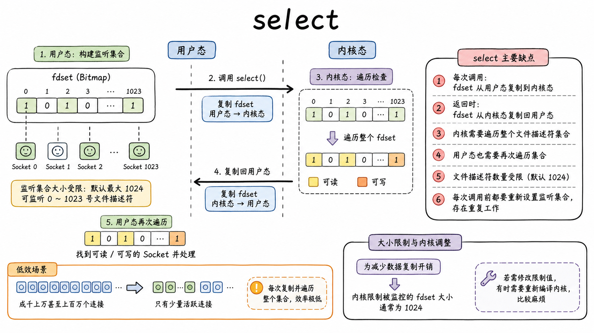

`select` 会把已经连接的 Socket 放入一个文件描述符集合，也就是 `fd_set`。调用 `select()` 时，需要把 `fd_set` 从用户态复制到内核态，由内核检查是否有网络事件发生。

内核的检查方式比较直接：遍历整个 `fd_set`。当检查到某个 Socket 有事件发生时，就把它标记为可读或可写，再把整个 `fd_set` 复制回用户态。

用户态拿到集合后，还要再次遍历，才能找到真正可读或可写的 Socket 并进行处理。

`select` 使用固定长度的 Bitmap 表示文件描述符集合，默认最大值通常为 1024，也就是只能监听 0～1023 号文件描述符。

`select` 的主要缺点包括：

- 每次调用都要把 `fd_set` 从用户态复制到内核态；
- 返回时还需要把集合从内核态复制回用户态；
- 内核需要遍历整个文件描述符集合；
- 用户态也需要再次遍历集合；
- 文件描述符数量存在限制；
- 每次调用前都需要重新设置监听集合，存在重复工作。

如果存在成千上万甚至上百万个连接，但其中只有少量活跃连接，每次复制并遍历整个集合就会非常低效。

为了减少数据复制导致的性能问题，内核会对被监控的 `fd_set` 大小进行限制，通常是 1024。如果要修改这一限制，有时还需要重新编译内核，比较麻烦。

## poll
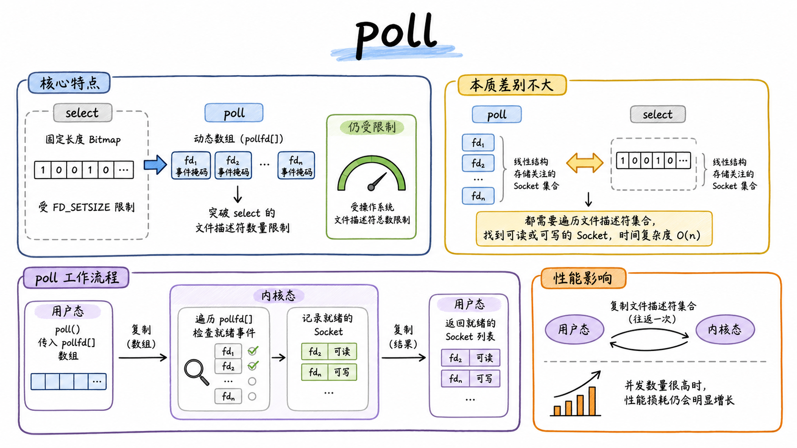

`poll` 不再使用固定长度的 Bitmap 存储需要关注的文件描述符，而是使用动态数组进行组织，因此突破了 `select` 的文件描述符数量限制，但仍会受到操作系统文件描述符总数的限制。

`poll` 和 `select` 本质上的差别并不大。它们都使用线性结构存储进程关注的 Socket 集合，都需要遍历文件描述符集合，找到可读或可写的 Socket，时间复杂度为 **O(n)**。

同时，`poll` 也需要在用户态和内核态之间复制文件描述符集合。并发数量很高时，性能损耗仍会明显增长。

## epoll
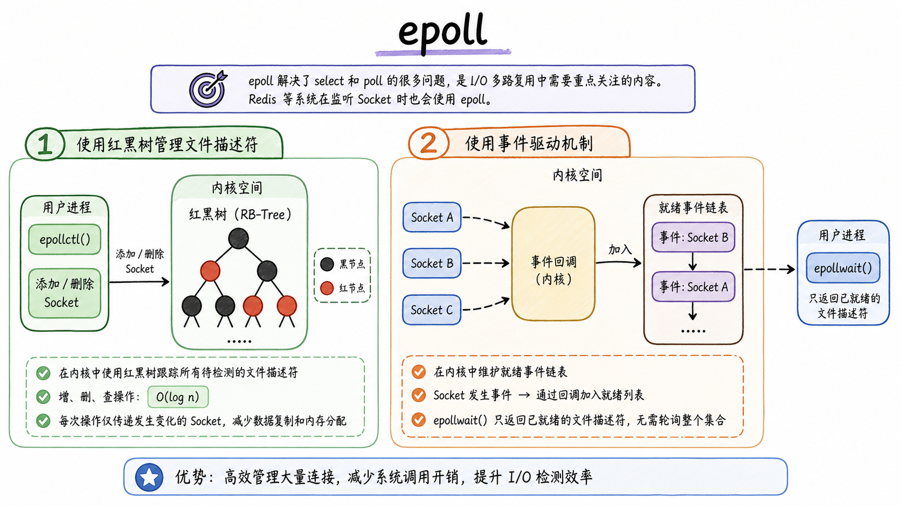

`epoll` 解决了 `select` 和 `poll` 的很多问题，是 I/O 多路复用中需要重点关注的内容。Redis 等系统在监听 Socket 时也会使用 `epoll`。

`epoll` 主要从两个方面解决问题。

### 使用红黑树管理文件描述符

`epoll` 在内核中使用红黑树跟踪进程中所有待检测的文件描述符。需要监控的 Socket 可以通过 `epoll_ctl()` 添加到内核的红黑树中。

红黑树是一种高效的数据结构，增、删、查操作通常都能达到 **O(log n)** 的时间复杂度。

这样一来，每次操作时就不需要传递整个 Socket 集合，只需要传递发生变化、需要检测的 Socket，从而减少大量数据复制和内存分配。

### 使用事件驱动机制

`epoll` 使用事件驱动机制，在内核中维护一个链表来记录已经就绪的事件。

当某个 Socket 有事件发生时，内核通过回调机制把它加入就绪事件列表。用户调用 `epoll_wait()` 时，只会返回已经发生事件的文件描述符，不需要再次轮询整个 Socket 集合，因此检测效率会高很多。

## 文件链接与存储设备
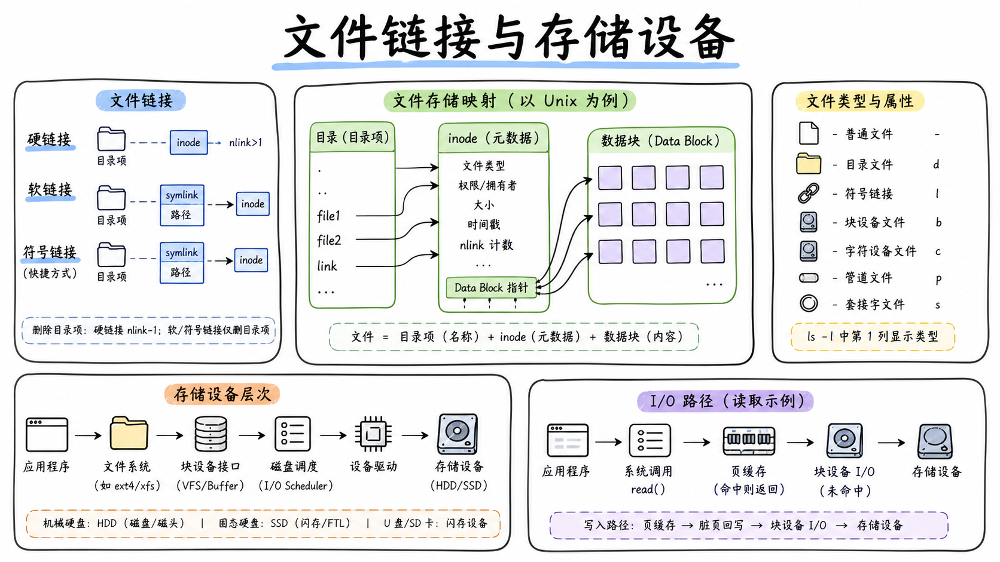

## 硬链接
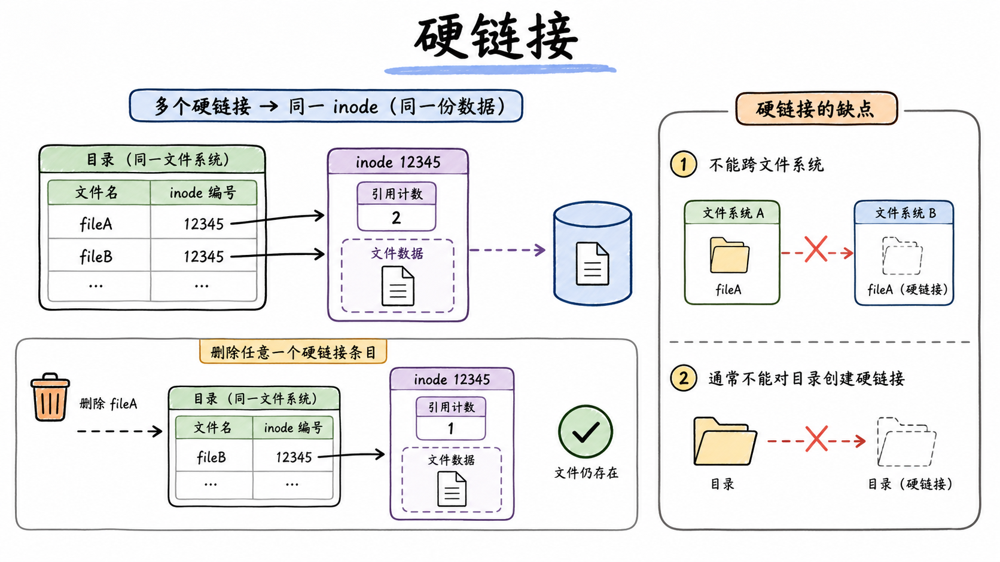

硬链接会在目录中创建一个新的条目，记录文件名及其对应的 **inode** 编号。多个硬链接指向同一个 inode，也就是指向同一份文件数据。

删除任意一个硬链接条目后，只要文件的引用计数还不为零，文件就仍然存在。

硬链接的缺点包括：

- 不能跨文件系统；
- 通常不能对目录创建硬链接。

## 软链接
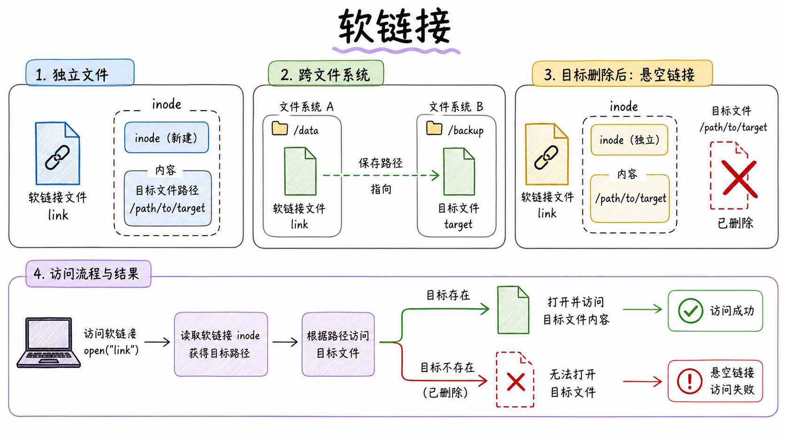

软链接相当于重新创建了一个独立文件。这个文件有自己的 inode，但文件内容保存的是另一个文件的路径。

访问软链接时，系统会根据其中保存的路径访问目标文件。因此，软链接可以跨文件系统。

即使目标文件已经被删除，软链接文件本身仍然存在，只不过它会变成无法正确打开目标文件的“悬空链接”。

## 机械硬盘与固态硬盘
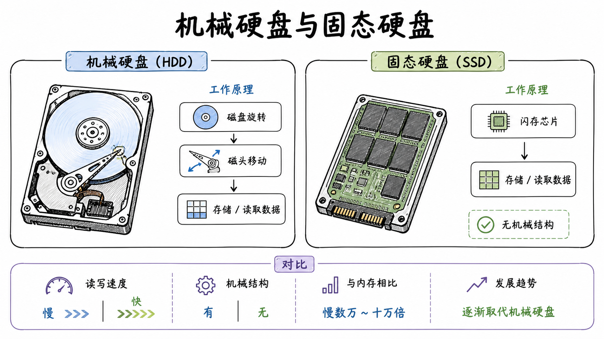

**机械硬盘（HDD）**通过磁盘旋转和磁头移动存储、读取数据。它的读写速度比较慢，与内存相比可能慢数万乃至十万倍。

另一种硬盘是**固态硬盘（SSD）**。固态硬盘没有机械结构，读写速度通常比机械硬盘快很多，因此正在逐渐取代机械硬盘。

## 操作系统面试知识整理
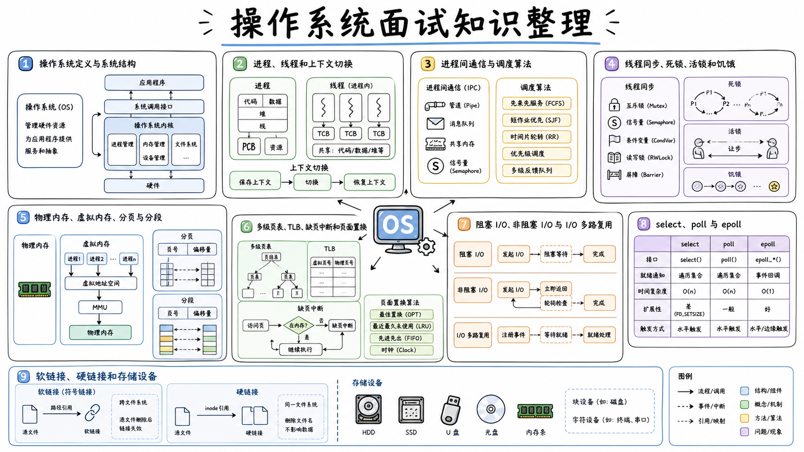

以上是操作系统面试中比较常见的问题，涉及：

- 操作系统定义与系统结构
- 进程、线程和上下文切换
- 进程间通信与调度算法
- 线程同步、死锁、活锁和饥饿
- 物理内存、虚拟内存、分页与分段
- 多级页表、TLB、缺页中断和页面置换
- 阻塞 I/O、非阻塞 I/O 与 I/O 多路复用
- `select`、`poll` 与 `epoll`
- 软链接、硬链接和存储设备
