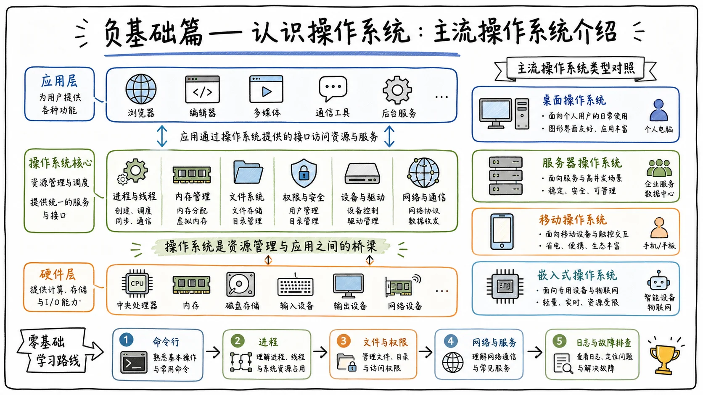

# 课程说明与学习目标

## 建立共性问题笔记站

最近在和大家交流时，我发现很多人提出的问题都很相似，例如：

- 我现在处于哪个学习阶段？
- 接下来应该怎么学？
- 将来怎么找工作？
- 应该找什么样的工作？

因为这些问题具有很强的共性，所以我打算建立一个**在线信息网站，也可以理解为笔记站**，把常见问题及对应解答统一汇总起来，方便大家随时查看。

我会先在群里收集大家的问题，再结合自己的建议以及更专业师傅的见解，同步更新到笔记网站上。以后如果大家对未来感到迷茫，或者在学习、求职过程中遇到问题，可以先到笔记站里寻找答案。对于新出现的共性问题，大家也可以继续在群里提问，我会持续补充。

## 本节课要解决的问题

这节课主要带大家认识操作系统，不需要动手实践。学完之后，只要能对常见操作系统留下基本印象，知道它们分别是什么、来自哪里、主要应用在哪些场景，就达到了学习目标。

这里讲的“操作系统”，与大学里的**操作系统原理**课程并不相同。操作系统原理通常研究的是：

- 进程如何调度；
- 内存如何分配；
- 文件如何组织；
- 程序如何并发运行；
- 锁与死锁等底层机制。

那门课的目的，是理解操作系统的内部结构、底层理论和运行原理。本节课则主要从**实际应用和网络安全**的角度，介绍当前主流的操作系统、它们的发展脉络及应用场景，为后续学习打基础。

很多同学接触电脑多年，却没有形成清晰的系统概念，只知道“我的电脑是 Windows”“我的手机是安卓”或者“我的手机是苹果”。这一章要做的，就是讲清楚这些系统从哪里来、经历了什么，以及现在分别在哪些领域发挥作用。

## 什么是操作系统

## 操作系统是软硬件之间的“管家”

把一台电脑拆开，可以看到 CPU、内存、硬盘等各种硬件。但这些硬件不会自己干活，需要一个“管家”对它们进行统一管理和调度，这个管家就是**操作系统**。

电脑的最底层是硬件，包括 CPU、内存和硬盘；上层运行的是 QQ、微信、浏览器等软件；操作系统则位于两者之间，既负责管理硬件资源，也为软件运行提供环境。

可以把电脑比作一家公司：

- **CPU**是负责干活的人；
- **内存**是办公桌；
- **硬盘**是仓库；
- **操作系统**则是公司的行政管理部门。

行政部门负责分配资源、协调各个部门，让所有人都能正常工作。操作系统发挥的也是这种承上启下、协调各方的作用。

> 操作系统本质上是硬件与软件之间的中间层：向下管理硬件，向上为应用程序提供运行环境。

## 为什么必须有操作系统

如果没有操作系统，每个软件都需要直接操作 CPU、内存和硬盘等底层硬件。这样不仅开发难度极高，换一台硬件配置不同的电脑，软件甚至可能还要重新编写。

操作系统把复杂的底层操作封装成统一接口，软件只需要调用这些接口，就能完成文件读写、画面显示和网络通信等工作。

*没有操作系统的电脑，基本就是一个不会动的铁皮盒子。*

平时双击图标、移动鼠标、敲击键盘，本质上都是由操作系统接收并转达：它把用户的操作“翻译”给硬件，再把硬件的处理结果通过画面、声音等形式呈现出来。

由于厂商、设备类型和使用目的不同，设备所采用的操作系统也会有所区别。

## 操作系统的主要分类

## 桌面端操作系统

桌面端操作系统主要供个人电脑使用，例如：

- **Windows**
- **macOS**

大家日常使用的家庭电脑、学校机房电脑和办公电脑，大多属于桌面端设备。

## 服务器端操作系统

服务器端操作系统主要部署在公司机房、数据中心或个人服务器上，用来持续对外提供网站、数据库等服务。常见系统包括：

- **Linux**
- **Windows Server**
- **UNIX**

例如微信的后台服务和数据库需要全年不间断运行，它们所在的主机就属于服务器端。服务器通常需要保持长期在线，不能像个人电脑一样不用时就随手关机。

## 移动端操作系统

移动端操作系统就是手机和平板电脑所使用的系统，主流产品包括：

- 苹果手机和平板使用的 **iOS / iPadOS**；
- 华为设备使用的 **HarmonyOS（鸿蒙系统）**；
- 小米、Redmi、vivo 等大量厂商的手机主要使用基于 **Android** 的系统。

移动端与日常生活联系最紧密，大家每天聊天、看视频、使用移动应用，基本都离不开手机操作系统。

## 嵌入式与专用操作系统

嵌入式和专用操作系统往往是根据具体设备定制的系统，很多产品基于 Linux 或其他实时操作系统开发，常见于：

- 路由器；
- 智能电视；
- 车载系统；
- 公共设备；
- 机器人及其他智能硬件。

简单来说，桌面端主要给人直接使用；服务器端用于长期运行服务；移动端服务于手机和平板；嵌入式系统则隐藏在各种专用设备内部。

## Windows：最常见的桌面操作系统

## Windows 的来源与特点

Windows 是微软开发的操作系统。“Windows”直译就是“窗口”，它的核心特点之一，就是让普通用户通过窗口、图标和鼠标完成操作。

在图形化操作系统普及前，很多电脑主要通过 **DOS 命令行**进行操作。用户需要输入命令，才能创建、读取或管理文件，这种方式对普通人并不友好。

微软希望做出一个人人都能通过鼠标点击使用的操作系统，于是推出了 Windows。现在打开 Windows 电脑，可以直接看到桌面上的一个个图标，点击后就能运行对应程序，不再要求普通用户掌握大量命令。

## Windows 的常见应用场景

Windows 在日常生活和办公环境中非常常见，例如：

- 家庭个人电脑；
- 学校机房；
- 公司办公终端；
- 政府、金融及传统单位的内部业务系统。

只要使用过电脑，基本都接触过 Windows。大多数公司员工使用的办公电脑，也以 Windows 为主。

微软同时提供服务器版本，即 **Windows Server**。它经常出现在政府、金融机构和传统企业的内部业务系统中，被当作服务器操作系统长期运行。

## macOS：苹果电脑的操作系统

## macOS 的使用场景

macOS 是苹果电脑使用的操作系统，主要运行在 MacBook、iMac、Mac mini、Mac Studio 等设备上。

它与 Windows 一样，都属于面向个人电脑的桌面操作系统。macOS 上同样可以使用 QQ、微信、浏览器和 WPS 等常见软件，只是不同系统在交互方式、软件生态和整体体验上有所区别。

如果有机会，可以多体验几种操作系统。有人觉得 macOS 更适合自己，就选择 Mac；如果觉得 Windows 用起来更习惯，继续保持原来的使用习惯也完全没有问题。

> 操作系统没有绝对的“最好”，更重要的是它是否适合自己的使用场景和操作习惯。

## Linux：服务器与安全领域的核心系统

## Linux 的诞生

Linux 对初学者来说可能没有 Windows 那么熟悉，但只要深入接触计算机、服务器或网络安全，就一定绕不开它。

1991 年，芬兰大学生 **林纳斯·托瓦兹（Linus Torvalds）**觉得当时使用的 MINIX 存在限制，于是开始编写自己的操作系统内核，并将其发布到互联网上，逐渐发展为今天的 **Linux 内核**。Linux 的标志性吉祥物是一只企鹅，名字叫 **Tux**。

Linux 能够形成完整可用的系统，也离不开前人的积累。GNU 项目已经提供了大量自由软件和开发工具，Linux 内核与这些工具结合后，构成了常说的 **GNU/Linux 操作系统**。

Linux 也是开源精神的重要代表之一。任何人都可以查看、研究和修改它的源代码，全球开发者能够共同参与维护。

## 开源与闭源的区别

Windows 和 macOS 的核心系统代码主要属于商业公司的闭源代码。普通用户可以直接使用系统，但通常无法查看其全部源代码，也不能任意修改和重新发布。

Linux 则是开源的，源代码公开，任何人都可以在遵守许可证的前提下进行查看、修改和分发。

Linux 具有**开源、免费、稳定、可定制**等特点，因此很快在服务器市场中发展起来，并衍生出大量发行版。这些发行版通常使用相同的 Linux 内核，但在软件打包、桌面环境、管理工具和更新策略上有所区别。

## Debian：老牌稳定的发行版

**Debian** 是历史较久、以稳定著称的 Linux 发行版，由社区维护。它常见于服务器环境，也是许多其他发行版的基础。

Debian 的特点包括：

- 社区维护；
- 稳定性较高；
- 软件包体系成熟；
- 被大量发行版作为底层基础。

例如网络安全领域常见的 **Kali Linux**，就是基于 Debian 构建的。学习初期不一定要记住所有细节，但看到 Debian 的名称或 Logo 时，应该能反应过来：它是一个 Linux 发行版。

## Ubuntu：适合入门的 Linux 发行版

**Ubuntu** 也是非常常见的 Linux 发行版，由 Canonical 公司推动，基于 Debian 开发，更强调普通用户和开发者的使用体验。

Ubuntu 的文档、教程和社区资料很多。如果使用过程中遇到问题，通常很容易通过搜索找到答案。它广泛用于：

- 个人电脑；
- 开发环境；
- 云服务器；
- 个人服务器；
- 虚拟机和实验环境。

如果想入门 Linux，Ubuntu 是一个比较推荐的选择。很多用于练习的靶机，本质上也是基于 Ubuntu 或其他 Linux 发行版搭建的。

## CentOS：传统企业里的老朋友

**CentOS** 曾是国内企业服务器环境中的常见系统。它过去主要以 Red Hat Enterprise Linux，也就是 **RHEL** 的源代码为基础，提供高度兼容的免费发行版，因此一度成为许多企业服务器的主流选择。

后来 CentOS Linux 的发展路线发生变化，旧版本也陆续停止维护，项目重心转向 **CentOS Stream**。因此，现在仍可能在一些老旧客户现场或历史业务系统中遇到传统 CentOS。

看到 CentOS 的名称或 Logo 时，需要知道它是 Linux 发行版，且长期与企业服务器环境联系紧密。

## Kali Linux：面向安全测试的发行版

**Kali Linux** 是面向网络安全和渗透测试的 Linux 发行版，预装了大量安全测试工具。用户通常不需要逐个下载，只要更新软件源和工具包，就能直接使用。

不过从个人实际工作经验来看，Kali 并不是所有渗透测试工作的必需品。它更常用于：

- 搭建靶场；
- 构建测试环境；
- 进行专项安全实验；
- 快速调用预装的安全工具。

真正工作时，不一定每天都要使用 Kali。很多渗透测试工具可以直接安装在 Windows 或普通 Linux 系统上，例如在 Windows 中安装 **Burp Suite** 等工具，通常就能完成大量工作。

所以，学 Kali 可以先“图一乐呵”，不要把“会用 Kali”误认为“会做渗透测试”。真正需要掌握的是渗透测试方法、网络协议、系统原理和工具背后的逻辑。

## 虚拟机与多系统体验

## 不重装电脑也能学习其他系统

假设当前使用的是 macOS，但又想体验 Windows 11、Ubuntu 或 Kali Linux，没有必要把电脑原来的系统直接刷掉。

安装虚拟机软件后，可以在当前操作系统中创建一个虚拟环境，再将其他操作系统作为虚拟机运行。例如：

1. 在 macOS 中安装虚拟机软件；
2. 创建一台虚拟机；
3. 导入 Windows 11、Ubuntu 或 Kali Linux 的镜像；
4. 在虚拟环境中启动并使用对应系统。

Windows 用户同样可以使用虚拟机安装 Ubuntu、Kali Linux 等系统。不同电脑和处理器架构的安装方法可能不完全相同，但相关技术已经比较成熟，网上也能找到大量教程。

虚拟机非常适合学习、体验和搭建实验环境，不必为了学习 Linux 就把自己的 Windows 电脑直接刷成 Kali 或 Ubuntu。

## Linux 的主要应用场景

## 网站服务器与云计算

全球大量网站和互联网公司的后台服务都运行在 Linux 服务器上。阿里云等云计算平台提供的许多云服务器，默认或常用的操作系统也是 Linux。

Linux 还广泛应用于：

- 网站服务器；
- 数据库服务器；
- 云计算平台；
- 容器和虚拟化环境；
- 超级计算机。

## Android 与智能设备

Android 的底层使用 Linux 内核，因此 Android 中的许多内部机制和 Linux 存在联系。手机开启调试模式后，通过终端工具可以看到，一部分 Linux 命令在 Android 环境中同样可以使用。

Android 因为开放程度较高、可定制性较强，众多手机厂商都可以基于它开发自己的系统界面和功能，因此迅速占据了全球智能手机市场的大量份额。

除手机外，Linux 还常见于：

- 路由器；
- 智能电视；
- 车载系统；
- 机器人；
- 各类智能设备。

正因如此，Linux 不仅是一套服务器系统，也成为大量产品和服务的底层基础，是计算机行业中非常重要的技术成果。

## 主流移动操作系统

## Android：开放且普及的移动系统

Android 是当前最主流的移动操作系统之一，主要应用在智能手机和平板电脑上，也会出现在车机等设备中。

它基于 Linux 内核，开放程度较高，手机厂商可以在其基础上进行定制。因此，小米、Redmi、vivo 等大量厂商都推出了基于 Android 的手机系统。

## iOS：苹果的移动操作系统

**iOS** 是苹果 iPhone 使用的操作系统，iPad 目前使用的是从 iOS 体系发展而来的 **iPadOS**。

iOS 与 macOS 在技术脉络上同源，都继承了 UNIX 体系中的许多设计。它与 Android 长期处于竞争关系。

iOS 的生态相对封闭，苹果对硬件、系统和应用商店拥有较强的控制力，因此系统一致性、安全管控和用户体验通常较好，运行也比较流畅。它在欧美市场占有很高地位，在国内同样拥有大量用户。

如果同时使用 iPhone、iPad 和 Mac，还可以通过设备协同形成较完整的苹果生态。

## HarmonyOS：逐渐常见的国产系统

**HarmonyOS，也就是鸿蒙系统**，是华为推出的操作系统，应用于华为手机、平板及其他智能设备。

随着国产化推进，鸿蒙在政企和国企场景中的发展较快。未来从事安全相关工作时，也会接触到更多鸿蒙设备。

例如在实际渗透测试项目中，一个客户的业务可能同时包含网站和移动 App，而移动端又需要分别考虑：

1. Android 端；
2. iOS 端；
3. HarmonyOS 端。

因此，鸿蒙也会逐渐成为安全测试中需要认识和关注的操作系统。不过移动端通常会作为专项测试内容，与传统网站渗透测试的方式并不完全相同。

## Windows Server 与 UNIX

## Windows Server：微软的服务器系统

Windows Server 是微软推出的服务器操作系统，历史上出现过 Windows Server 2008、2012、2016 等多个版本，后续也在持续更新。

它的界面与桌面版 Windows 比较相似，但用途不同。普通 Windows 电脑通常用于个人办公，不使用时可以关机；Windows Server 则作为服务器运行，需要长期保持在线，为外部或内部用户提供服务。

Windows Server 在传统企业、政府和金融机构中仍然比较常见，尤其经常用于：

- 内部业务系统；
- 文件共享；
- 身份认证；
- 办公网络；
- **Active Directory 域环境**。

## UNIX：操作系统领域的老前辈

UNIX 出现得很早，可以说是现代操作系统的重要祖师爷之一。C 语言也与 UNIX 的发展密切相关，最初就是为了更方便地重写和实现 UNIX 而设计的。

如今普通用户可能很少直接接触 UNIX，但在一些对稳定性要求极高的领域，它仍然存在，例如：

- 大型机和关键业务系统；
- 银行核心系统；
- 科研机构；
- 高可靠性计算环境。

macOS 直接继承了 UNIX 技术体系中的许多内容；Linux 虽然不是直接由 UNIX 源代码发展而来，但在设计理念和接口规范上深受 UNIX 影响。

它们之间可以大致理解为：

- **UNIX** 是重要的技术源头；
- **Linux** 参考和继承了 UNIX 的许多理念，并发展为开源内核；
- **macOS** 则建立在具有 UNIX 血统的技术基础之上，逐渐演变为今天的苹果桌面操作系统。

UNIX 虽然很老，但它的思想依然无处不在。

## 网络安全应重点关注哪些系统

## 重点学习 Windows 与 Linux

操作系统很多，但从主流网络安全工作来看，最需要关注的是：

- **Windows**
- **Linux**
- **Windows Server**

Android、iOS 和 HarmonyOS 属于更细分的移动安全方向。如果只讨论常见的渗透测试、企业内网和服务器安全，Windows 与 Linux 仍然是核心。

## 原因一：大多数服务器运行在 Linux 或 Windows Server 上

访问一个网站时，背后通常有一台或多台服务器在持续运行。全球大量网站服务器采用 Linux；Windows Server 则常见于政府、金融机构和传统企业的内部业务系统。

如果以后成为安全服务工程师，到客户现场看到的服务器，基本也以这两类系统为主：要么是 Linux，要么是 Windows Server。

## 原因二：企业办公终端以 Windows 为主

企业内网中的员工电脑、文件共享和办公系统，大多属于 Windows 体系。

攻击者如果成功控制一台 Windows 办公电脑，可能以它作为突破口，在企业内网中继续进行：

1. 信息收集；
2. 权限提升；
3. 凭据获取；
4. 横向移动；
5. 控制更多主机。

最终，攻击者可能控制企业的大半个内网，甚至整个内网。因此，Windows 是内网安全中必须掌握的系统。

## 原因三：攻击环境与目标环境往往同时涉及两类系统

渗透测试人员常用的工具和靶机环境，很多运行在 Linux 上，例如 Kali Linux、Ubuntu 以及各种 Linux 靶场。

甲方的服务器通常以 Linux 为主，但员工办公终端又以 Windows 为主。也就是说，安全人员往往需要同时面对两类环境：

- 攻击工具平台可能是 Linux；
- 目标服务器可能是 Linux；
- 办公终端和内网环境可能是 Windows；
- 传统业务系统也可能运行在 Windows Server 上。

所以两边都要懂：既要能看懂和使用工具，也要理解目标系统的结构、权限和运行方式。

## 不同安全场景中的系统分布

## 渗透测试与客户现场

渗透测试人员常见的本地工作环境包括 Windows、macOS 和 Linux，也可能使用专门的虚拟机作为工具机。

到了客户现场，接触较多的通常是：

- 以 Linux 为主的网站和业务服务器；
- 以 Windows Server 为主的传统业务与域环境；
- 以 Windows 为主的办公内网终端。

Android、iOS、HarmonyOS 等移动系统并非完全不会遇到，但通常会由移动安全专项负责测试，而不是完全照搬传统网站渗透测试方法。

## 本节学习重点

这节课不要求立刻掌握每种操作系统的安装与操作，只需要做到以下几点：

- 知道常见操作系统分别叫什么；
- 看到名称或 Logo 时，能大致判断它属于什么系统；
- 理解桌面端、服务器端、移动端和嵌入式系统的区别；
- 认识 Windows、macOS、Linux、Android、iOS、HarmonyOS、Windows Server 和 UNIX；
- 重点记住 Debian、Ubuntu、CentOS、Kali Linux 等常见 Linux 发行版；
- 明白网络安全学习为什么要重点关注 **Windows 与 Linux**。

后续学习也会主要沿着 Windows 和 Linux 两条路线向外延伸，不断深入系统使用、服务器管理、渗透测试和企业内网安全等内容。

