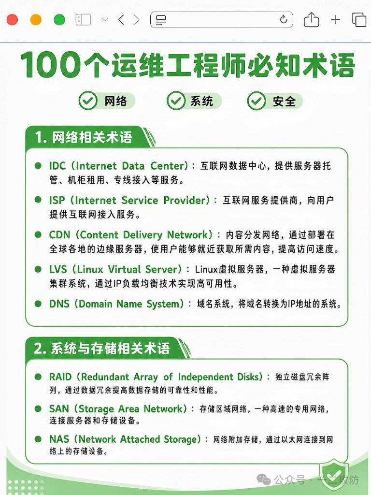
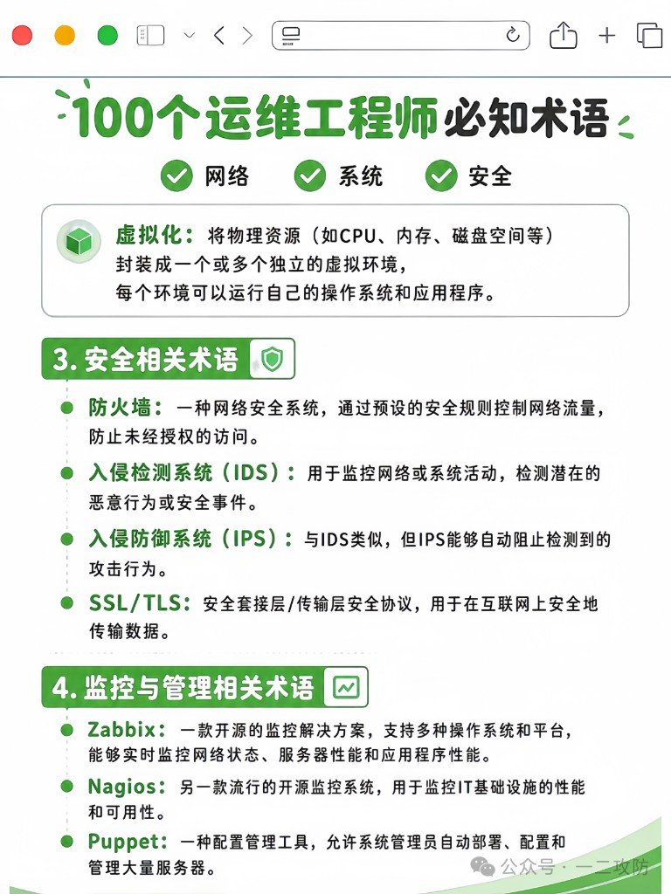
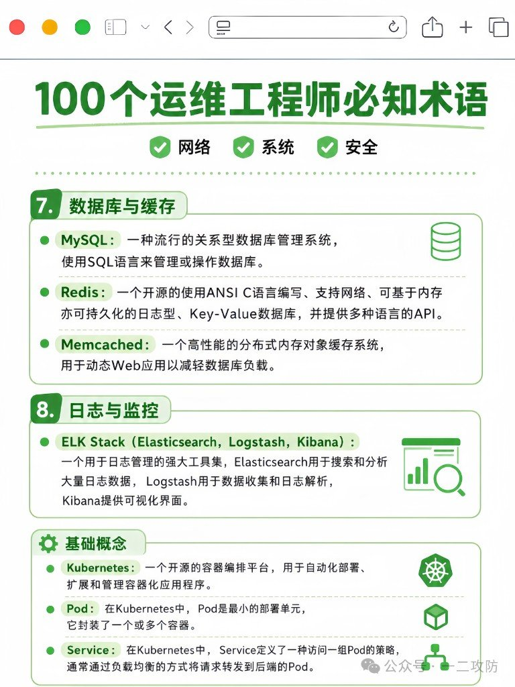
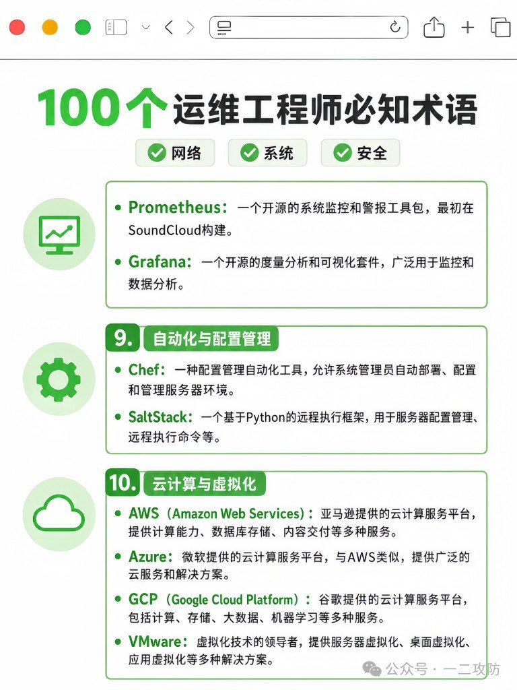
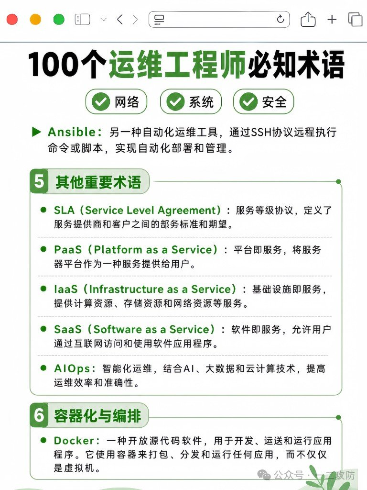

这篇是**节选 / 未完**，不是「运维必知 100 词」全本。

公众号「一二攻防」甩过一组竖版术语海报，标题写着「100个运维工程师必知术语」。手上实际只有 **5 张图**，正文全在图里。读图整理后，本批收录术语约 **38** 条——缺的别当我漏抄，是原料就没给齐。

用途很窄：面试前扫缩写、写文档时对齐中英叫法、从海报快速跳回原图。RAID 怎么选级、Prometheus 怎么挂 exporter、K8s Service 类型差异——海报一行定义盖不住，得另开坑。

竖海报在站点里会走限高，点开 Fancybox 看清即可。

## 本批到底有多少

| 口径 | 数量 |
|------|------|
| 海报宣称 | 100 |
| 本批图可读出的条目 | **约 38**（ELK Stack 按 1 条，内含 ES / Logstash / Kibana） |
| 缺口 | 约 62+，原料未提供 |

以后若补到「真 · 100 条」，在同主题上增补差分即可，别另开同构目录假装又一篇百科。

## 网络

| 术语 | 在说什么 |
|------|--------|
| IDC | 互联网数据中心：托管、机柜、专线接入这类场地与带宽服务。 |
| ISP | 互联网服务提供商：卖给你上网接入的那一方。 |
| CDN | 内容分发网络：边缘节点就近取内容，压延迟。 |
| LVS | Linux 虚拟服务器：集群 + IP 负载均衡那条线。 |
| DNS | 域名系统：域名 ↔ IP。 |

## 系统与存储

| 术语 | 在说什么 |
|------|--------|
| RAID | 多盘冗余阵列：可靠性和/或性能用冗余换。 |
| SAN | 存储区域网：服务器到存储的高速专用网。 |
| NAS | 网络附加存储：挂在以太网上的共享盘柜。 |
| 虚拟化 | 把 CPU/内存/盘等封装成多个独立虚拟环境，各自跑 OS 和应用。 |

虚拟化条目在图 2；图见下一节。

## 安全

| 术语 | 在说什么 |
|------|--------|
| 防火墙 Firewall | 按规则放行/拦截流量，挡未授权访问。 |
| IDS | 入侵检测：盯流量/活动，报可疑事件（偏「看见」）。 |
| IPS | 入侵防御：类似 IDS，但能自动拦攻击（偏「动手」）。 |
| SSL/TLS | 传输层加密协议，网上数据别裸奔。 |

IDS 看、IPS 拦——面试爱问这对，海报也是这么切的。

## 监控与可观测

| 术语 | 在说什么 | 图 |
|------|--------|----|
| Zabbix | 开源监控，网络/主机/应用状态都能盯。 | 02 |
| Nagios | 老牌开源监控，偏基础设施可用性。 | 02 |
| ELK Stack | Elasticsearch 搜析 + Logstash 采集解析 + Kibana 可视化。 | 04 |
| Prometheus | 开源监控告警工具包，出身 SoundCloud。 | 05 |
| Grafana | 度量分析与可视化面板，常接各类时序源。 | 05 |

Zabbix/Nagios 是「传统主机监控」那一挂；Prom+Grafana 是云原生指标栈常见组合；ELK 主攻日志。别混成一个「监控」糊过去。

## 自动化与配置管理

| 术语 | 在说什么 |
|------|--------|
| Puppet | 配置管理：批量部署/配置/管机。 |
| Ansible | 走 SSH 远程跑命令或剧本，无 Agent 味重。 |
| Chef | 配置管理自动化，部署与环境收敛。 |
| SaltStack | Python 远程执行框架，配置管理 + 远程命令。 |

海报把 Puppet 写在「监控与管理」里，Ansible/Chef/Salt 散在后面——检索时仍归**配置管理**一栏更清楚。

## 云服务模型与 SLA

| 术语 | 在说什么 |
|------|--------|
| SLA | 服务等级协议：提供方和客户之间的标准与期望（可用性数字常挂这里）。 |
| IaaS | 基础设施即服务：算力、存储、网络当服务卖。 |
| PaaS | 平台即服务：把应用运行平台直接给你。 |
| SaaS | 软件即服务：浏览器里用成品软件。 |
| AIOps | 智能化运维：AI + 大数据 + 云，想抬效率和准确度。 |

IaaS / PaaS / SaaS 是「你管到哪一层」的尺子，别跟具体厂商名搅在一起记。

## 容器与 Kubernetes

| 术语 | 在说什么 |
|------|--------|
| Docker | 用容器打包、分发、跑应用（不是整机虚拟机那条路）。 |
| Kubernetes | 容器编排：部署、扩缩、管理容器化应用。 |
| Pod | K8s 最小部署单元，里面装一个或多个容器。 |
| Service | 一组 Pod 的稳定访问入口，常带负载均衡转发。 |

## 数据库与缓存

| 术语 | 在说什么 |
|------|--------|
| MySQL | 常见关系型库，SQL 管数据。 |
| Redis | 内存型（可持久化）Key-Value，多语言 API。 |
| Memcached | 分布式内存对象缓存，给动态站减库压。 |

Redis 能干的事比「缓存」宽；Memcached 更偏纯缓存——海报定义也是这个分工。

## 云厂商与虚拟化产品

| 术语 | 在说什么 |
|------|--------|
| AWS | 亚马逊云：计算、库、存储、CDN 等一大桌。 |
| Azure | 微软云，能力面与 AWS 同级对照。 |
| GCP | 谷歌云：计算、存储、大数据、ML 等。 |
| VMware | 虚拟化产品线（服务器/桌面/应用虚拟化等）。 |

## 按图回源

| 图文件 | 板块 |
|--------|------|
| `fig-01-network-storage.jpg` | 网络、RAID/SAN/NAS |
| `fig-02-virt-security.jpg` | 虚拟化、防火墙/IDS/IPS/TLS、Zabbix/Nagios/Puppet |
| `fig-03-ansible-cloud.jpg` | Ansible、SLA/IaaS/PaaS/SaaS/AIOps、Docker |
| `fig-04-db-elk-k8s.jpg` | MySQL/Redis/Memcached、ELK、K8s/Pod/Service |
| `fig-05-prom-cloud.jpg` | Prometheus/Grafana、Chef/SaltStack、AWS/Azure/GCP/VMware |

## 这张表能干什么

能：扫缩写、对齐叫法、跳回原图。

不能：当操作手册。原料补齐之前，别把这篇当成「运维必知完整百科」转发。
