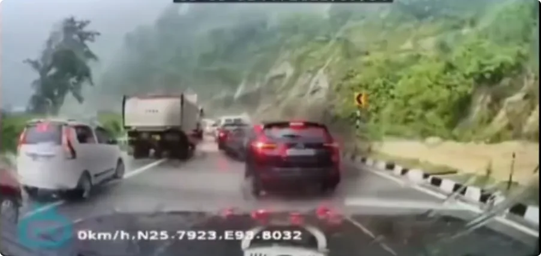
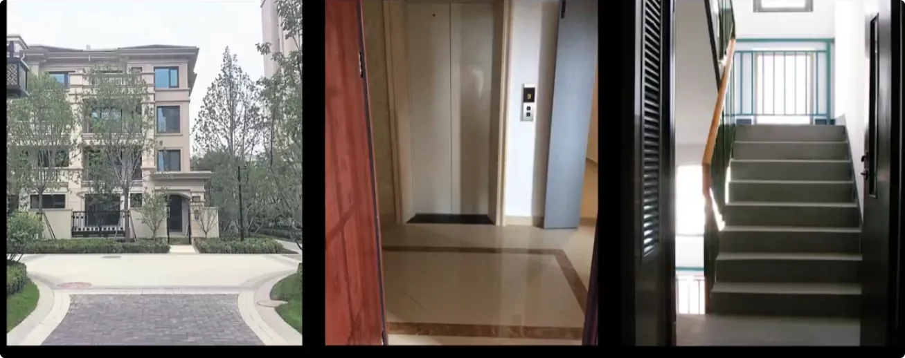
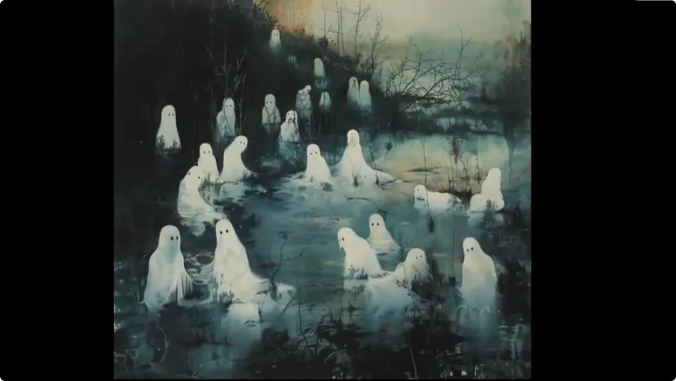
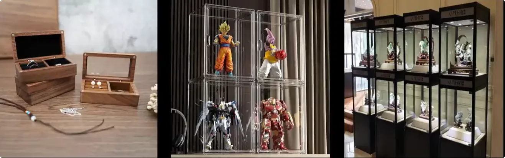
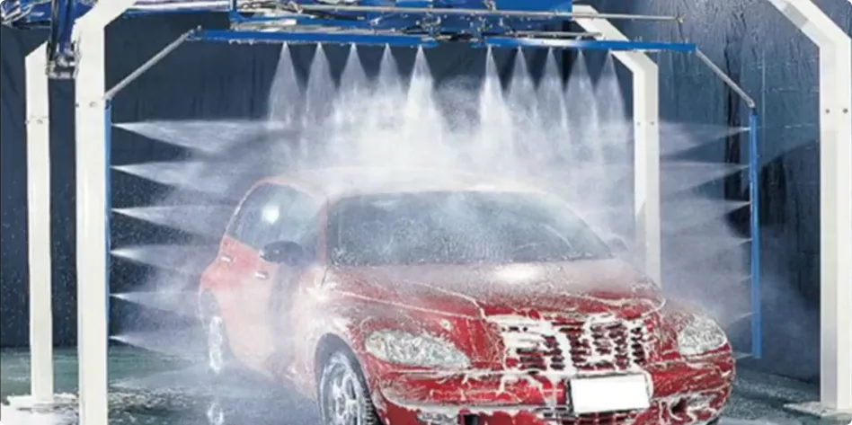
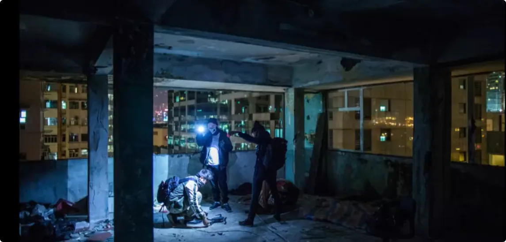

> _**不让它留，不让它附，不让它跟，不让它钻。**_

## 1. 所谓“意外”并非突然发生：背后的能量早已积累到临界点

如果是你开车经过，或者从这里路过，你能保证出现意外的人不是你吗？想必大多数人会觉得这是造化弄人，谁也不敢保证自己安全无事。

但如果我告诉你，所有的意外都是可以避免的，知道背后原理的人，可以大大降低意外风险，任何人都可以将风险转移出去，你还会坐以待毙吗？

今天小烨给大家揭露一下意外发生的原理，教大家日常怎么辟邪。

### 车祸发生之前，周围的能量已经发生变化

首先说原理。比如我们常见的车祸，其实早在发生之前，周围看不见的地方已经处于**负能量量变的极限**了。

比如这几辆车，有特殊感知力的朋友可以察觉，上面早已爬满了大量的阴性众生，车上的人也是如此。一个能量场干净的人，绝不会被卷入这类事件。

同理还有这条马路，早就积累了大量的煞气。一个气场衰败的人，一辆能干扰人心智的车，偶然地把人带到了一个火候合适的地点，意外就发生了。

> **整个过程都不是巧合。没有什么意外，都是蓄谋已久。**

在玄学的世界，能量造成了表面事实，事实反映背后的能量。因为人身上的生气由兴到衰，不会凭空消失得无影无踪，而是会随着死亡瞬间散到周边空间中去，转化成更低频的能量。

这个过程，是阴性众生最方便捕食人类能量的时机。
可以去看我选车那期视频。大多数深色车很快就会变得不干净，很多连撞的车都载着脏东西，只是人不知道。
同样，如果突然生了一场大病，或者突然运势低落，也不用怀疑，一般身上或者家里都不会很干净。

### 小意外如果反复出现，就不要再当作巧合

如果发生过小意外，但是又不放在心上，那接下来大概率会发展成更不好的事情。

那为什么阴性众生要害人呢？
*因为**万物都需要能量来生长**。哪怕是最底层的生灵，也要吃一些能量废料来维持生存。这其中最方便获取的能量来源，就是人的生气。*

其次，只有提高自身能量级别，才有生存的主导权。

> _**天地不仁，以万物为刍狗。**_

底层众生弱肉强食，本就是最基本的自然法则。理想的道德只建立在上层社会，不在下层。所以人间背后的下层灵界，就是极度弱肉强食的：吃你，不需要跟你打招呼，自然法则默许。

正如人默许自己是食物链顶端的存在，默许人可以吃遍万物。

---

## 2. 阴性众生为什么要干扰人：它们需要你主动释放“生气”

那它们是怎么吃人气的呢？
它们想要吃人气，就必须制造点什么，让人主动释放自己的生气。
比如**纵欲**，又或者蹲守在一些高危场所活动，甚至蹲在人本身旁边等着捡漏。

能量大的灵体，甚至可以干扰人的心智，比如让人抑郁，让人想自杀，或者想去容易发生意外的地方。

有些人喜欢看恐怖题材，甚至去废弃楼探险，不去做点惊奇的事情就不舒服，其实背后都有被干扰。一惊一乍之间，人的心神就会不稳，人的生气就会释放得更多。

所以人有千万种光怪陆离的意外死法，背后都是有人在精打细算。

那人应该怎么避开这些意外呢？
最好的方法，就是趁早切断这些干扰源。不要习惯了让它们在你身边晃悠，陪你吃，陪你睡。

小烨总结了四步：

> _**1) 不让它留**_  
> _**2) 不让它附**_  
> _**3) 不让它跟**_  
> _**4) 不让它钻**_

---

## 3. 第一步“不让它留”：保持家宅和车辆干净、流动

### 来过可以，但不要让它长期留下

**第一，不让它留。**

如果它来过，那就别让它在自己的家里、车里逗留。

什么叫来过？

>**进过你的家门，就叫来过。**

灵体也是能量体，也称之为“气”，本身会随着空气和水等物质的流动而移动。

这也是为什么在家宅风水里常说，房门不要对着大马路、电梯口、楼道走廊。因为房门正对通道，就好比接了一个排气管，脏东西都往你家里排。

同理，房子冲着水也是不可以的。比如冲着排水管，就容易滋生一些不好的东西；挨着河流、池塘建房也不行，河流能带动的东西更多。

### 家里最简单的处理方式：通风、清理、不要堆积

再说家里人在外面进进出出，难免会把外面的脏东西带回家，所以：
- **家里要多通风，让空气流动起来；**
- **不要的东西都扔掉，不要堆太多；**
- **经常挪动物品、擦洗、打扫卫生。**

因为你不知道物品背后关联着谁。东西堆得太多，就容易住进各种杂七杂八的灵体。
而打扫卫生的过程中，东西挪来挪去、擦来擦去，就会让灵体们觉得住得不安稳，不如找下家去了。
再者就是家用车。
尤其地下车库空气不流动，灵体容易扎堆。所以平时自己的车要开到敞亮的地方，多通风、多擦洗。

---

## 4. 第二步“不让它附”：长期贴身、被欣赏的物品尤其要注意

**第二，不让它附。**

如果它想要附体在某件物品或者某个角落，那就要阻止它。

为什么要附体？

因为众生都是临水而居的。这里的“水”，指的就是人的生气。

如果能天天吃到人气，灵体当然是要挨着人过日子的。除非自身能量级别足够高，在哪里都可以过得安稳，否则大多数灵体还是希望附在某个具体的事物上，安稳生存。

### 老家具、玩偶、绘画和饰品为什么容易成为“附着对象”

所以凡是人天天贴身触碰的物品，或者赏心悦目的物品，都是不错的附着对象。

举几个例子。

比如十几年不换的木质沙发、茶几、柜子、床，真的干净不了一点。很多老房子阴气重，根源还在这些老家具上，或者黑掉、霉掉的墙壁上。

又比如家里的：
- 玩偶；
- 绘画、海报；
- 饰品；
- 长期陈列而且被人反复欣赏的物件。

你看它的时候，肯定跟看普通日用品的状态不一样。你一定是带着欣赏的情感和想法的，你是**心有所向**的。

这样就会产生能量连接，物体多少都能收到你的一些能量，所以灵体能住就会住进去。

有人说，会不会太夸张了？我平时看一眼，就会惹上它们吗？

你可以用极限法来模拟一下。

假如你超级喜欢一样东西，甚至想把它占为己有的地步，这时候你一定投入了相当多的情感和心神，这时候你的生气就是在往外释放的，尤其是向你所关注的那个东西释放过去。

现在把这份生气稀释成365份，就是一般情况下你每天分给某个欣赏物的能量。

> _**千里之堤，毁于蚁穴。**_

人不知道温水煮青蛙，它们却懂得积少成多。况且大多数人还会爱惜好这些物品，避免磕着碰着，间接打造了一个舒适、安稳的附身场所。

所以你的家里、车里，尽量不要摆放太多海报、画作、玩偶、饰品等。这些物品在外面看看就好，不要带回家。

更不要专门去开光、请镇宅物、请护身符。要是请了大家伙，你就完犊子了。

### 床品、衣柜和汽车要经常清理

最后重点关注家里的床单、被套，要经常换洗；衣柜也要多通风、多擦洗；还有车座、车身，也要多清洗。

在大部分情况下，中小型灵体是可以赶走的，因为它们能量小、能力弱。

---

## 5. 第三步“不让它跟”：少去容易把东西“带回来”的地方

**第三，不让它跟。**

所谓不让跟，就是你别去那些脏东西多的地方，更不要惹到人家。

### 第一类：废弃楼、停工建筑和长期无人居住的地方

首当其冲就是别作死，去废弃的楼房探险。

尤其是大片大片停工荒废的楼房，基本无家可归的亡灵都会住在里面。

> **记住：人不住的地方，有的是东西住。**

可不只是一两个，而是一大群。

而且一旦成群结队，就一定会跳出一个大佬，逼它们出来打工。

所以人去到那种地方，无论它情不情愿，它都得来找你一趟。

### 第二类：古董、首饰、玩偶以及古建筑

其次就是玩偶、古董、首饰类的商店。

每件物品都住着东西。越是光鲜亮丽、越打动人、越昂贵的物品，上面所附的灵体就越强。
因为人家灵体也不傻。
跟着高富帅、白富美，可以吃香喝辣过好日子。所以好的位置，它们也是要相互争抢的，全凭自己的手腕。

> **所以你一进门店，都不知道是谁在挑选谁。**

这种地方就不再多提了，往期有说，都是一个个大大小小的公司，产品是信仰，人气做货币。
古建筑也是一个道理，尤其是古雕塑、古塔，见着就赶紧溜吧。

记住，**跨越的时间越久，就代表物体存在得越稳定。**

像文物这种被保护、被欣赏，甚至被崇拜的东西，那是极好的住所，所以博物馆也别去。
有些人作死，去这些地方一惊一乍的，还可能对某些物品偷偷使坏，殊不知惹到人家会有什么后果。轻则鬼压床，重则发生意外。

### 大自然也不是哪里都适合去

小烨曾说要多去大自然。

很多粉丝朋友可能认为，去到大自然就可以了，就舒坦了。

但是**大自然也是鱼龙混杂的**，有正能量汇聚的节点，就有负能量汇聚的节点。搞不好去一趟自然，还能带个妖回来。

这里小烨编了个口诀，可以帮你分辨大多数情况下的自然好坏：

> _**多去敞亮、宽阔的自然，少去幽静、逼仄的自然。**_
> 
> _**神仙看了都想住的地方，可以留；看了都摇头的地方，你要走。**_

神仙不会住在悬崖峭壁、蜿蜒洞窟。

所谓：

> _**君子不立危墙之下。**_

---

## 6. 第四步“不让它钻”：心神不稳时，不要再进入高风险环境

**第四，不让它钻。**

所谓不让钻，就是不要让它有任何机会钻进你的身体里。

人在什么时候最容易被附体呢？

主要有两种情况：
1. **心神不稳的时候；**
2. **处于高危环境的时候。**
   
### 情绪低落或者过度亢奋时，更要远离高风险场所

比如你在心情很低落的时候，就不要去荒山野岭、废弃大楼、地下车库、河边池塘等这些地方。
又比如你在非常亢奋的时候，就不要去酒吧宿醉，不要随便发生关系，容易被醉死鬼和狐蛇妖附身回家。
又或者很多人去玩密室逃脱。

被吓着的那一瞬间，人的意识是恍惚的，你不知道有多少灵体在守株待兔，等着这一刻。

有些小朋友去荒废大楼玩捉迷藏，就经常出现“丢魂”的事情。
那原理是什么呢？

因为人在心神不稳的时候，**气场屏障就会弱很多**，也是灵体最容易突破屏障附体的时候。

### 一旦进入身体，就会让人持续停留在“对它有利”的状态

而它们钻进去之后，就会想办法影响你的气场，让你一直想抑郁，或者一直想纵欲，让你的身体和精神处于：
- **对你负反馈；**
- **对它正反馈。**

这样它们才能吃得更深。
由皮到肉，再到骨髓、血液，一层层气场吃下去。
等到**阴病反阳病**的时候，说明你的气场屏障已经被吃得很脆了。

### 高危环境本身就是最适合“捡漏”的地方

另一种情况，是人处于高危环境。
周边等着附身的灵体也是相当多的。
且不说死亡那一瞬间人的气场释放出来，就算弄得半死半残，那气场虚弱的你也是很适合附身享用的。
所以：

> **不要做冒生命风险的事。**

因为当你在做这件事情的时候，你根本不清楚自己的意识有没有被干扰。

---

## 7. 四步辟邪的核心：减少干扰源，让自己的环境保持干净

做到以上四步：

> _**不让它留，不让它附，不让它跟，不让它钻。**_

起码可以让你周围的环境保持干净，可以帮你避免被中小型灵体迫害，能保持正常的运势，保持身心健康。
但是，如果你已经发生意外了，甚至能量低到在大白天都可以感受到它们在你身上，或者知道家里住着大佬了，那你就必须来找我了。

要么做清理，要么早日踏上真正的修行。
当然，我还是建议想修行的人来找我。

毕竟：

> **只有修行人才知道能量之可贵，才懂得珍惜能量。**