> **生命个体存在的意义是什么？**
> 
> **从我目前在修仙过程中接触到的信息来看，其中一个结论就是：修炼永生。**

## 1. 人为什么会追问生命意义：五感之外，是否还有另一套世界

### 大多数人对生命意义的理解，都建立在现有经验之上

大家好，我是修炼者小烨。今天小烨要讲的是关于生命个体存在的意义，至少是我作为修仙者在目前接触到的信息范围内确定到的一些真相。大家且当个故事听听就好。

大家应该都想过，**生命存在的意义是什么呢？**

大多数人会觉得，人活着就一辈子，死了就没了，所以这辈子要任性地活，后人的死活跟自己没什么关系，觉得这辈子回旋镖打不到自己身上。而有些理科生觉得，生命的存在无非是基因延续自己的一种方式，容易走向黑暗森林式的极端思考。

说到底，大多数人之所以对灵性和玄学持批判观点，其实主要还是陷进了一种**经验主义**。因为对于人类这副躯体来说，五感接收到的都是物理世界，目前的科学仪器观测到的也是物理世界。大部分人不相信玄学，从认知经验上来讲也无可厚非。

换句话说，对于大部分人而言，只要能让他看到那个世界，他能一瞬间变成坚定的非唯物论者。

而社会上还有一小部分人，他们有过一些特殊的经历，远远超过他人，或者说大多数人的认知经验。这时你再跟他谈唯物论，他是不信你的。甚至有些人一辈子都认为万物有灵，人存在的意义不该这么简单，甚至觉得其他生灵乃至自然物存在的意义也不该这么简单。

### 科学与玄学为什么呈现出不同的知识形态

事实上，这世界本就是科学和玄学并行运作的。
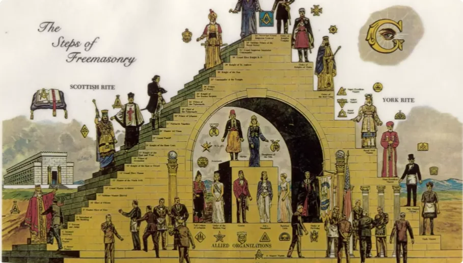

科学之所以得以公开传播和发展，因为科学领域研究的是客观物理，也就是死物。死物无论怎么被研究，都不会因谁而改变。因此我们可以说，科学是稳定可控的。
**重点来了：**

> _**对于玄学的研究，那就必然意味着研究对象不是死物，而是一群无法被物理约束的活物。**_

在这个领域，很多真理都无法被人说了算，极容易因超个体而改变。那这样一种不稳定、不可控的知识力量，读过历史书的你应当知道它会被如何对待。

很多人会说：“凭什么相信你？人类现代文明发展的这几百年，从来没有什么超越物理的力量。”

这里小烨不做回答，但有句话说得特别好：

> **别看他们怎么说，要看他们怎么做。**

玄学之所以被雪藏，无非是压力还不到位，但是压力会持续增加，总有质变的时候。所以他们也着急，得赶紧想好怎么过渡、怎么跟大家解释才行。

如果你本身对玄学保持接受的态度，那不妨我们继续深入讲讲：**生命个体存在的意义是什么？**

天道和宇宙意志太过神秘，小烨也不敢轻易解读。因此接下来我会从我修仙过程中接触到的灵界和他类众生，也就是一些经验之谈，给大家讲讲关于生命意义的其中一个结论：

> **修炼永生。**

---

## 2. 从纯正能量到元神：生命意识究竟从哪里诞生

### 修行为什么必须先找到“上行清气”

自古修炼成神仙者，都离不开在天地间寻找**纯正能量**。换个词大家应该更好理解，叫**上行清气**。

纯正能量也分层级。层级越高，自身意识和超感官所对接的维度也就越高，接触到的真相、智慧和法力才会更高。

**这就是为什么修行必须要先找到纯正能量。**

此外，纯正能量也是生命能量，顾名思义，是滋养万物生长的能量。灵魂的转生、细胞的生长，以及生命生衰之中的“生”，都离不开天地间的纯正能量。至于何时滋养、滋养多少，都是有定数的。

说到这里你应该明白，生命能量不是死物，而是有灵性意识的活物。正如我之前的视频谈到过：

> **灵体是能量体，反之，能量体也是灵体。**

因此，天地间不同地方的纯正能量，其实就是管理不同地区的神灵。神灵拿去滋养大地生灵生长的能量，其实用的是自身的一小部分魂魄灵力。

### 小白车的故事：当能量积累发生质变

这里不得不提一件亲身经历过的事情，方便大家更好地理解这其中的奥秘。

小烨出门寻找能量的时候，总会骑着我的小白车作为交通工具。它跟了我很长时间，陪我拜访过很多神灵的家。

理所当然地，它在旁边或多或少也沾到了不少纯正能量，或者说是神灵魂魄的碎片。日积月累，直到有一天我打算要换车，它突然开口跟我说：

> _**“请主人不要抛弃我。”**_

是的，你没听错。

**小白车诞生了自己的神识。**

车子作为灵性能量和神识碎片的载体，积累到质变之时，诞生了自己的意识。你们可以回想一下东方的很多神话里，为什么常有石头成精、物皆有灵的说法。

而这个刚开始诞生神识的地方，就叫做**元神**。

> **所以并不是“万物有灵”，而是“万物可有灵”。**

从这个角度，我们再复盘一下玄学领域常提及的那些生灵，是不是更好理解它们的存在了？

---

## 3. 元神并不只有一种：妖、怪、魔、鬼、精灵与神灵

### 不同载体、不同能量，诞生出不同类型的灵体

1. **妖**
    
    专指从动物或植物载体上诞生的意识，是靠负能量修炼后的灵体，统称为妖。
    
    要注意的是，如果动植物生前没有诞生意识，那死后就没有灵，也不成妖。所以，并不是说万物有灵，而是**万物可有灵**。
    
    妖类会根据其原有动植物特性而具备相应的元神特点。一般情况下，动物中的狐、蛇类更容易诞生妖灵。民间常提狐仙和柳仙，其实就是有些法力的狐妖和蛇妖。
    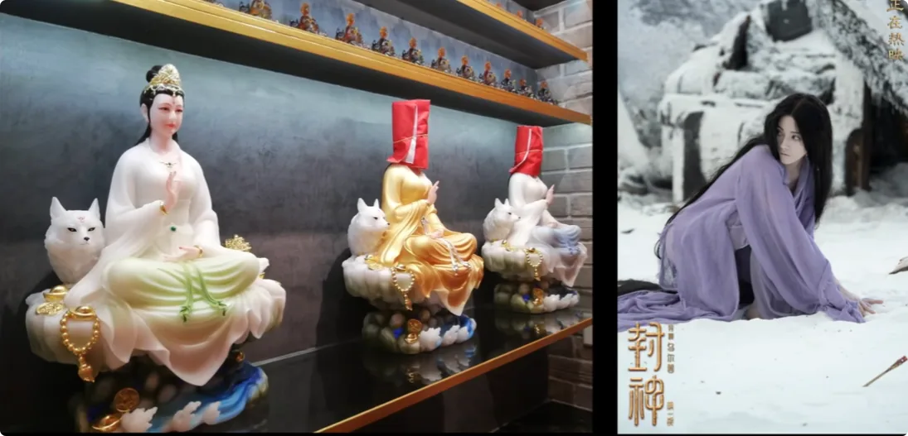
    很多文艺作品里都提到过他们，其实他们也参与了创作，可见他们的元神特点。他们转世或附体的人，都会具备相应的外表、性格和能量特点。
    
2. **怪**
    
    由病菌、**瘴气**甚至煞气等特殊物体承载负能量而诞生意识的灵体，无特定的形状。
    
    最近大家比较关心的哀牢山，那里面的迷雾可是真的一整片会动的怪物。那些古怪的地方，怪类就多。大地上不是每一块土地都拿给人类开发的，人要有敬畏之心。
    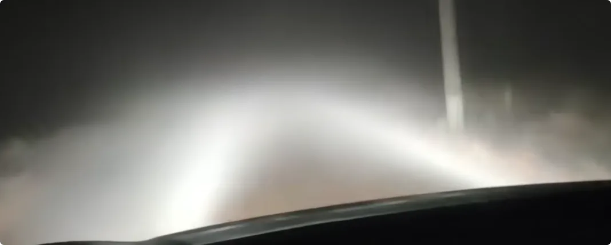
    比起妖这类生灵，我还没有遇到过转世成人的怪类修炼者。也许比起动物和植物，这类生灵的元神更缺乏感情和理性，难以理解道德秩序。
    
3. **魔**
    
    这一类生灵的存在尤其古老。也就是说，修炼千万年、上亿年的大魔不在少数，负能量量级更是恐怖如斯，连天上和地上的一些神灵都不是对手。大魔存在的维度也是很高的。
    
    要说魔类的来源，小烨也只能猜，大概是两极相生时就诞生了对立面，其分支造就了一个个魔。又或者说，他们可能诞生于心魔。
    
    
    因为我发现，只要人对一些东西产生执念、掌控欲，比如金钱、地位等等，他们就会立马出现。
    
    但并不是说魔类永远是恶人。相反，**两极合归太一，众生终究是要臣服于天的。** 因此，魔类元神的修行人其实不在少数。
    
    也许是魔类世界太过残酷，我身边遇见的魔类转世的修行人，连修仙都特别卷。
    
4. **纯凡人元神**
    
    指第一世就在人身上诞生的元神。
    
    纯凡人元神最大的特点就是私欲重，且被当前五感所限制，对灵界没什么经验。纯人修行人很难想通修行需要修炼能量，很难想通灵界的交换规则。
    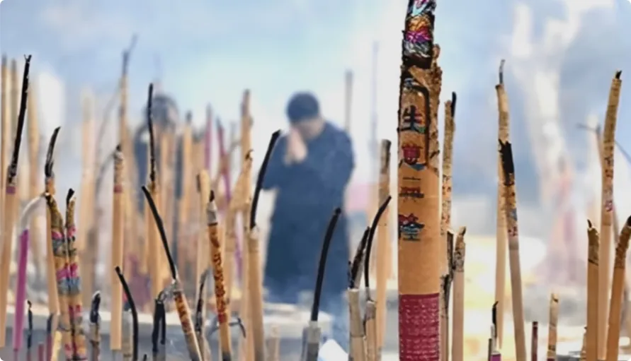
    这也意味着，纯凡人元神的个体难有修成的机缘。当然也有幸运儿，纯凡人元神若能珍惜修炼机缘，也有机会修炼成地仙。
    
5. **鬼**
    
    很多妖魔转世成人，死后可能会被家族带回老巢，保留原来的特性。所以，“鬼”字专指人类死后的灵体。
    
    鬼类要么流浪街头排队等轮回，要么学会找能量修炼。做鬼后开始修炼并修成厉鬼，一般都会尊称一声**鬼仙**。
    
    鬼元神和纯人元神之所以有区别，是因为鬼已经失去了人身的一些特点，且自带的煞气更重，修行的方式已经产生差异。
    
6. **精灵**
    
    专指在纯正能量附近修炼的动物、植物甚至玉石等。
    
    近水楼台先得月。很多动植物生长在能量节点附近，得到了当地神灵的点拨，诞生了元神并开始修炼，久而久之还能化形。
    
    
    不同的元神也是各有各的法力特点。比如很多灵树、灵草，就非常擅长治疗负能量造成的阴病。
    
    也因此，精灵类也属于神灵类，这类就属于**赢在起跑线上**。人类真的算不上什么。
    
7. **地上神灵**
    
    专指滋养一方生灵的神灵。
    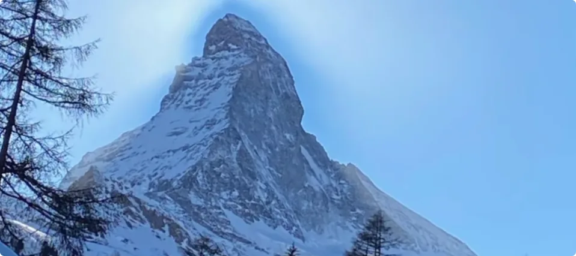
    大地生命诞生之初，地上神灵就开始修炼。这里就要回答前面我提到的问题：为什么神灵要用自身的一小部分魂魄灵力去滋养生灵？
    
    是因为**天道使然**。
    
    天上会泽于大地，天上把纯正生命能量源源不断地传向地面，地上神灵以此修炼而生。地上神灵承接天命，再向其他生灵转移自身的生命能量，推动地上生灵的生长和发展。
    
    在东西方创世神话中，神明给人吹了一口气，人类就此诞生，就是这个意思。
    
8. **天上神灵**
    
    指所有本就诞生于天上，或者从地上修炼上去的神仙。
    
    其实古今中外都记载过一些特定的大神，只是名字不一样罢了。
    

---

## 4. 灵界最底层的生存规则：为什么所有灵体都必须“修炼”

### 灵体存在本身，就需要不断消耗能量

论天上神仙还是太过遥远，让我们回头看看普通的生灵、普通的元神，一级玩家都是怎么生存的。

之前我的视频就讲过，灵界是很残酷的。死后当鬼可不是什么好事。

**灵体湮灭可不是安乐死那般轻松，比肉身死时承受的痛苦还要难受千万倍。**

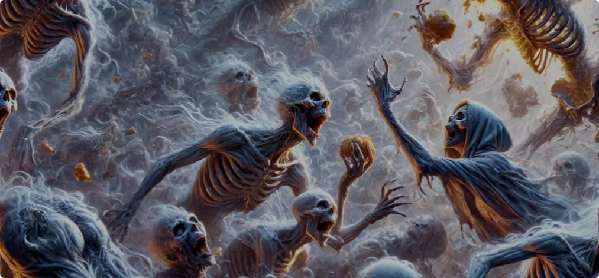

如果不敢湮灭，那就必须生存下来。而灵体作为能量体，存在就会消耗能量，想要生存，那就必须想办法吃进新的能量。

常人很难想象，大多数的亡魂跟疯狗一样抢食能量残渣是什么情景；很难想象，那些连疯狗都比不上的低阶灵体，饿得动弹不得又求死不能是什么情景；同样也不知道，那些厉害点的灵体都在如何想方设法地从活人身上搞到能量。

### 七情六欲会产生不同能量，这就叫“同气相求”

因为人的能量场会受自身七情六欲而改变状态。当思绪、欲望过重的时候，就容易过度产生某一种能量：

- **性欲产生的能量**，主要是妖类在吸收，因为符合动植物繁衍的特点，也就是符合他们元神修炼的特点；
- **贪念、执念、掌控欲等产生的能量**，主要吸引魔类元神；
- **生病、虚弱过程中产生的能量**，则符合怪类元神修炼的特点；
- **抑郁、戾气、杀欲**，则容易吸引鬼类。
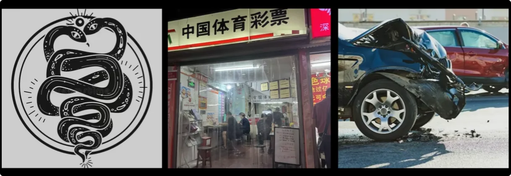

> **不同能量吸引不同的灵体，这就叫“同气相求”。**

在这种吃上顿没下顿的生存条件下，所有灵体都想方设法地摄取能量，壮大自身的能量体、灵体，而这个过程就统称为**修炼**。

借助修炼，个体拥有了更强烈的自我意识。也许迫使生命集体发展自我意识，就是宇宙意志本身。

### 修炼解决生存，修行则是从浑浊走向纯正

而那些拥有强大能量体的妖魔鬼怪们，并不意味着他们就没有了后顾之忧。

我们前面提过，**能量是分层级的**。

负能量所处的维度浑浊不堪，没有谁愿意一直待在脏的环境，没有谁愿意拥有浑噩的意识。

因此，这些大佬最终都是想走上正道的，顺应天道，争取纯正能量来修炼，修身养性，成仙成圣。

这个过程就称之为：

> **修行。**

也许让生命集体明白修行的意义，就是天道。

---

## 5. 有缘人为什么要转世成人：舍弃旧灵体，重新争一次正果

### 很多修行人，转世前已经修炼了很久

换而言之，相当多有机缘的修行人，也就是有缘人，其实是妖魔鬼怪的元神转世而来的。

在他们转世前，诸位的能量级别都可以说是大佬。然而，他们心甘情愿地归顺天道，给神灵们打工过相当长的一段时间，也遵循天道修炼、修行。

最后，其德行和心性通过考核，才争取到这次转世成人、获得纯净能量修行修炼的机会。要注意，这里的字眼是：

> **在转世前给天道神灵打工，德行和心性先得到了认可，争取到真正修仙的机会，他们的元神才舍弃原来的灵体，以人身再生，以人身重新开始修炼纯正能量，去修成正果。**
> 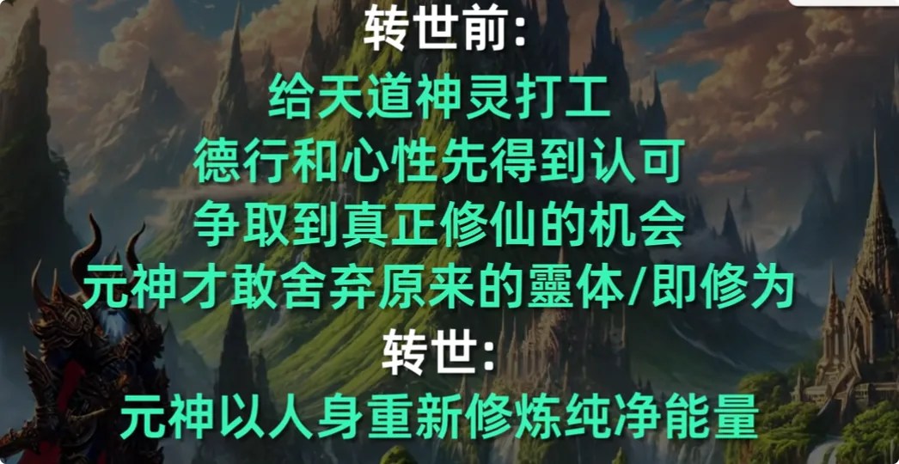

在没有得到天道神灵的认可前，没有谁敢轻易放弃修为，直奔人间。

没有认可，意味着来人间也没有机会得到纯正能量，更别谈修炼成仙了。

### 为什么修炼不是“每个个体天然拥有的权利”

有人会问：

> “为什么要经过天道神灵的认可，才有缘分修行修炼呢？难道修行修炼不应该是每个个体的权利吗？”

当然不是。

修炼成仙，就意味着天地间有一处**纯正生命能量资源**划归给某个人。
若非道德极好之人，天道怎可能让他随意占为己有呢？
如果连个体的德行和心性都不考核，那么此等顶级资源早就被无德、无底线之人垄断了，还有普通人什么事呢？

> _**所以谁成仙成圣，都需要经过天道神灵的考核和认可。**_

因此，所有因为这个契机转世成人的修行人，在这一世是被天道神灵注视的。
会有一双看不见的手，迫使他们重新找到修行、修炼的路。
自己过往种下了因，今生寻求修成正果，再加上神秘力量的助力，**三者之合，才是人们常提及的“修行的缘分”。**
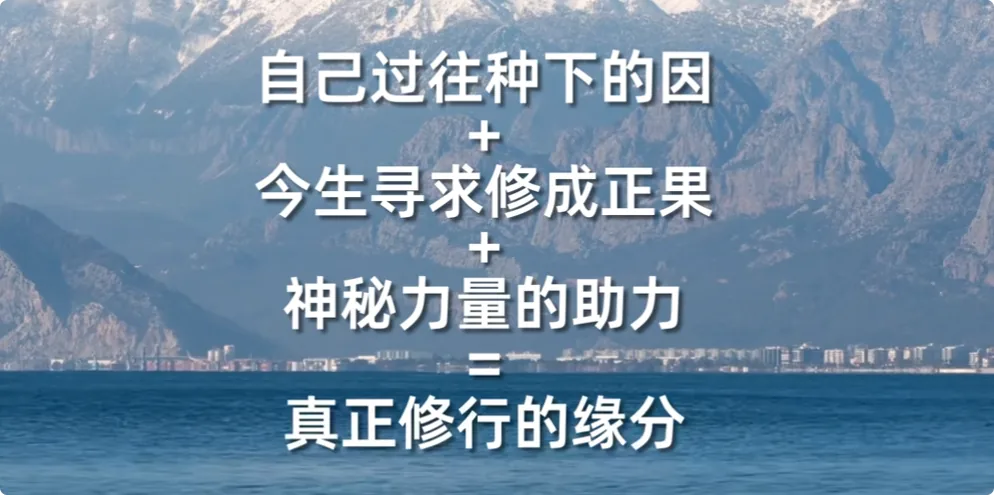

---

## 6. 人身才是最后的考场：以凡人之躯直面人心与贪嗔痴

### 有缘，不代表这一世一定能走回正道

但并不意味着转世成人的有缘人，就一定会走回正道，就一定能修成仙。
因为想要成仙者，还得经得住最后的考验，也就是：

> **以身入局，以凡人之躯直面人心和人性的阴暗面，证明自己具备极好的心性。**

相比其他生灵都专注于修炼，人类是所有生灵中最复杂的一个。
人的私欲可以创造出许多事物来体验，每样都可以带来快乐，也可以带来痛苦。**顺逆之间，可见贪嗔痴。**
*人心可以一念成佛，也可以一念成魔。*

任何一个有缘人，身为人时，该面对的人是一个不少：家庭、爱情、生儿育女、工作生存、人际、事业、名利乃至健康等等，就看个人怎么选择。
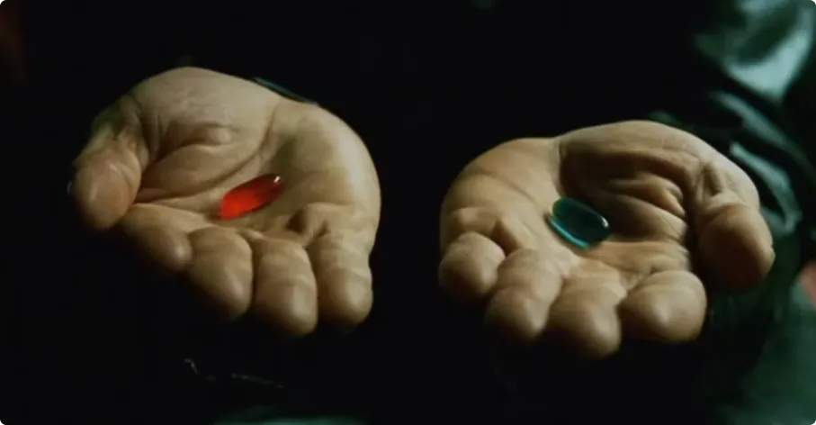

有的修行人就迷失在其中，而有的人则能顺利回过神来。

### 为什么不同修行人的人生难度并不相同

这其中的差异，与有缘人背后的**根底和来历背景**有关。
修炼者都是独立的个体，不仅根底上有差异，其来历背景也有差异。

1. **从根底上来说**
- 有些修炼者本身的悟性就高，因此此生看待人世和修行都比较通透；
- 有些修炼者原来的修为高，此生在遇到修炼的正道时，唤醒的感知力也是他人不可比拟的；
- 有些修炼者来自精灵类，以同气相求的原理，此生受灵体干扰较小，劫难较少；
- 相反，那些来自妖魔鬼怪类的修炼者，此生不可避免地面对灵界同类的折磨。

1. **从来历背景上来说** 
- 有些修炼者在灵界可能有师父或同修，此生会得到一些帮助，帮助他们加速开悟；
- 有些修炼者可能本身就是某神仙的徒弟，此生早早就步入正道，连人世的很多考验都免了；
- 而有些修炼者可能没有什么背景可言，此生必定相对艰险。

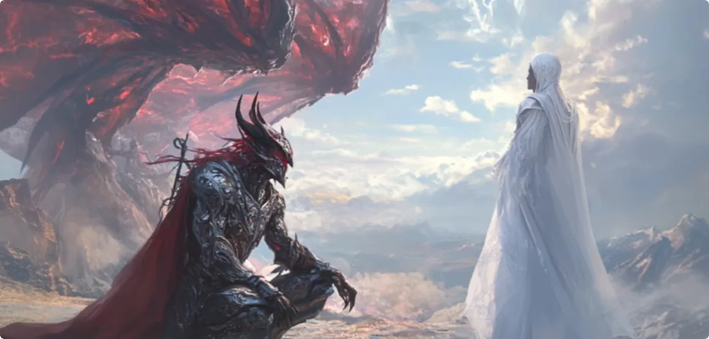

---

## 7. 为什么痛苦常常成为“唤醒”：只有放下尘世执念，才能重新找到路

### 天道会允许尘世不断挫败有缘人

但最后无论是什么根底和来历，天道神灵都一视同仁。
允许并派遣灵界众生去挫败有缘人，挫败他们在人世间珍视的一切。

**只有让他们放下尘世的执念，才能重新唤醒有缘人的修行意识，才能将他们带回正道，才能将珍贵之物交与他们。**

对于有缘人来说，回归正途之前所承受的一切痛苦，其实都来自于天道神灵的爱。
正因为天道神灵知道，对于有缘人来说真正珍贵的是什么，才会剥离不属于有缘人的东西。

大多数有缘人都是在失去人间很多东西，甚至到鬼门关走一遭后，才想起要修行。
他们内心深处产生强烈的孤独感，感觉自己不属于人间，好像有什么特别的事情要去做。
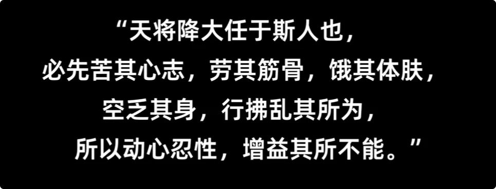

也恰似此时，时机已成，神秘力量才会将其引至引路人。

### 真正见到引路人以后，神灵就不再替你选择

而有缘人见到引路人后，能不能辨认，并选择留下来修行，就是由有缘人自己的心性决定的了。

**神灵不再干涉。**

最后能醒悟过来，寻得纯正能量修炼的人，才算是世间真正的修行人。
接着开始第二轮的考验，也就是：

> **考验修行人对天道坚不坚定。**

而那些此生没能走回修行道路的人，天时已过，下一世再无修炼的缘分。
他们失去了原来的修为和身躯，想要再次修行就难了。

---

## 8. 回到生命存在的意义：人类本身，就是众生修行的一环

### 得到人身，本应该是一件值得珍惜的事情

人类作为众生的一员，不可能不修行。

**人类被创造和存在的意义，本身就是众生修行的一环。**

而本轮人类文明又在追求些什么东西？答案也是显而易见的。
前面已经提到，底层灵界的生灵苟延残喘，无不渴望性命。
*得人生，本是一件值得珍重、值得珍惜，应该修行修炼、继续往上走的事情。*

如今却搞得连在世者都过不下去，甚至人类集体都不再愿意相信天道，也不愿意行善积德。

可能大多数人会说：

> “若天地神灵知人之苦楚，又为何不出手相帮呢？”

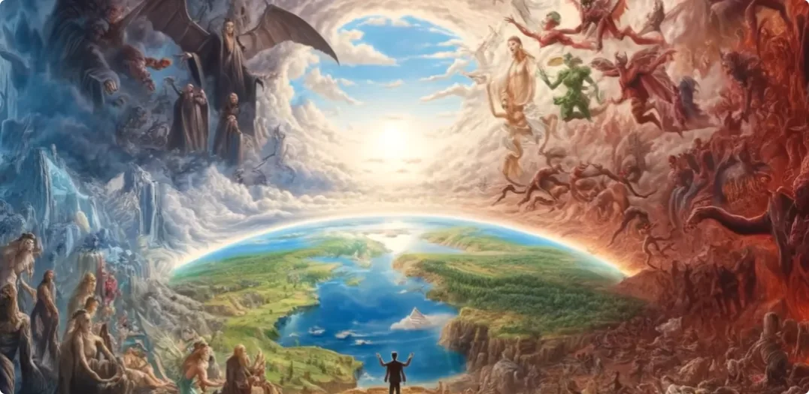

请问，无数生灵都渴望苍天主持公道，渴望有一个修行修炼的正规渠道，而人类作为修行的一环，**人类自身又以何种诉求要求着天地神灵呢？**

也许正如天道神灵心怀慈悲时，以强硬手段唤醒有缘人类一般，面对人类集体，终究也需要以同样的手段，剥离不属于人类集体追求的东西。

> _**生命不是得到一副肉身以后，任由这一世自然消耗殆尽。**_
> 
> _**从元神诞生，到摄取能量、壮大意识，再到由修炼走向修行，生命始终都在面对同一个方向：不断向上。**_

我是修炼者小烨，我们下期再见。