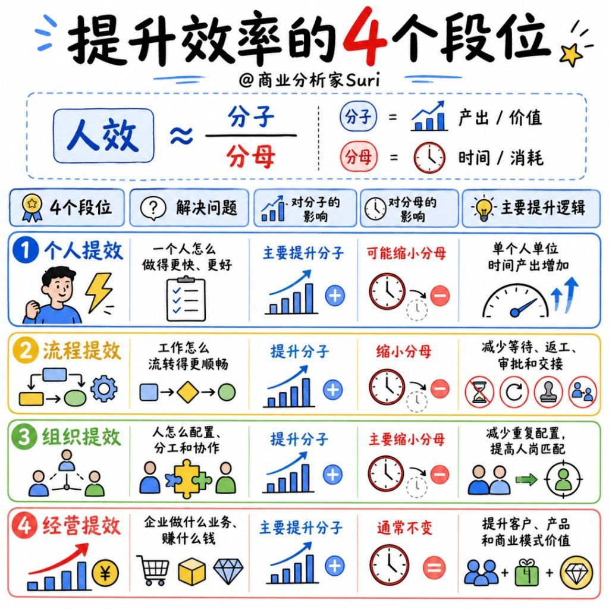
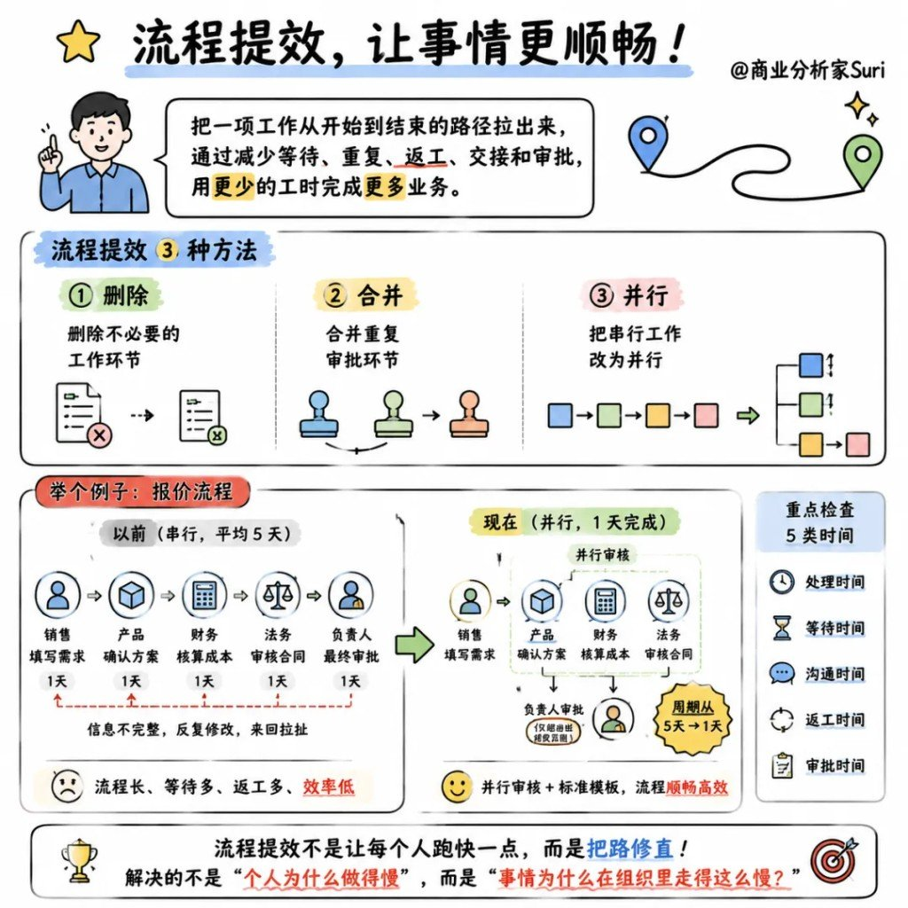

公司一喊「提人效」，套路往往先冲人：裁人、加班、冻结招聘，再加一轮培训。

人少了、工时长了，人效数字偶尔好看几天——产出没涨、利润没涨，只是把压力压到剩下的人身上。

人效 ≠ 人少。真正拉开差距的，是个人、流程、组织、经营这四层；培训、加班、裁员常常治错病。

旁链提醒：同日队列里还有「缺人才还是缺阵型」「AI 员工五件脏活」「AI 落地七层」「局部最优与全局观」，以及「很多公司只会砍成本，高手从省钱走到赚钱」——相关，但**不硬并**。阵型 / AI 落地 / 认知全局那边各管各的；降本增效那篇讲**暴力→管控→流程→经营**路径段位；这边讲**人效公式怎么拆、四层怎么对症**。

---

## 人效 ≈ 产出 ÷ 人力

说人话：分子是产出 / 价值，分母是时间 / 消耗（人头、工时、成本）。

两条路：

| 路径 | 做什么 | 常见误区 |
|---|---|---|
| **做大分子** | 同样的人，做出更多、更值钱的结果 | 只盯忙碌，不问价值 |
| **缩小分母** | 同样的产出，少用人、少耗时、少内耗 | 默认「裁人 = 提效」 |

裁人加班主要动分母；若分子本身是低毛利、碎片化业务，分母再压也抬不起真正的人效。

### 四段位总表

| 段位 | 解的问题 | 分子 | 分母 | 主逻辑 |
|---|---|---|---|---|
| **个人提效** | 一个人怎么更快更好 | 主要 ↑ | 可能 ↓ | 单位时间个人产出上去 |
| **流程提效** | 事情怎么流转更顺 | ↑ | ↓ | 砍等待、返工、审批、交接 |
| **组织提效** | 人怎么配、怎么分、怎么协作 | ↑ | 主要 ↓ | 减冗余配置，提升人岗匹配 |
| **经营提效** | 公司做什么生意、怎么赚钱 | 主要 ↑ | 通常 ≈ | 客户 / 产品 / 模式的价值上去 |

越往上，越根本。个人层再卷，挡不住流程堵、组织扯皮、生意本身不值钱。

---

## 个人提效：让个人更能干

定义：升级一个人的能力、工具、方法——同样时间做更多，或同样工作更短时间做完。

### 三种方法

| 方法 | 干嘛 |
|---|---|
| **补能力** | 技能培训、专业能力、工作方法 |
| **用模板** | SOP、模板库、知识库，少踩个人操作坑 |
| **借工具** | AI / 数字化工具，砍低价值手工 |

### 案例：经营分析师

| | 以前 | 现在 |
|---|---|---|
| 取数 / 整理 | 收集 3 天 + 报表 2 天 | 统一口径自动取数半天 + 模板出基础报告半天 |
| 高价值分析 | 不到 1 天 | 识别异常、追因、给建议——时间明显更多 |
| 痛点 | 大半辈子在 scrub 数据 | 整理从 3 天压到半天，时间砸在决策上 |

核心：少做无效事，多做有价值的事。这一层解决的是「这个人能不能干」——不是公司整个人效的全部答案。

---

## 流程提效：让事情更顺畅

定义：把一件事从发起到完成的路径理清；少等人、少重复、少返工、少交接、少审批——业务产出上去，人力消耗下来。

### 三种方法

| 方法 | 干嘛 |
|---|---|
| **删除** | 砍掉没必要的环节 |
| **合并** | 重复审批并成一刀 |
| **并行** | 串行改并行，别干等 |

### 重点查五类时间

处理时间 · 等待时间 · 沟通时间 · 返工时间 · 审批时间——人跑得快，路歪了也白搭。

### 案例：报价流程

| | 以前（串行，均 5 天） | 现在（并行，约 1 天） |
|---|---|---|
| 路径 | 销售填需求 → 产品确认 → 财务算成本 → 法务审合同 → 负责人终审（各约 1 天） | 销售填需求 → 产品/财务/法务**标准模板并行审** → 负责人仅超权限才批 |
| 症状 | 信息不全、来回改、等审批 | 周期短、流转顺 |
| 问题从 | 「这人怎么这么慢」 | 「这件事在组织里为什么走这么慢」 |

流程提效不是让人跑更快，是把路修好。

---

## 组织提效：让团队更协同

定义：调职责、层级、协作关系、资源配置——对的人做对的事，少管理摩擦、少重复岗位；权责清、决策快、产出增。

### 三种方法

| 方法 | 干嘛 |
|---|---|
| **划职责** | 重划部门职责，取消重复汇报 |
| **减层级** | 砍多余管理层级，拉大管理幅度 |
| **配岗位** | 核心人才放关键岗；非核心可外包 |

### 案例：运营三级

| | 以前 | 现在 |
|---|---|---|
| 总部 / 区域 / 城市 | 三层都在「收数、做表、开会」；前线问题谁都解不了 | **总部**：规则、系统、数据平台；**区域**：诊断、推动改进；**城市**：执行、服务一线 |
| 结果 | 重复劳动 + 层层上报，时间耗在报告链 | 砍冗余报告、人头可减、时间花在刀刃上 |

组织提效的核心：对的人、对的岗、做值钱的事——把「汇报时间」换成「出业务结果的时间」。

（与「缺阵型」那篇相邻：那边讲任务·站位·协作·权力怎么搭；这边讲人效视角下职责/层级/岗位怎么减内耗——主题不同，不硬并。）

---

## 经营提效：让努力更值钱

定义：选更好的客户、产品、渠道、生意模式——同样的人，做更值钱的事。

### 为什么这一层往往最关键

1. **低毛利生意陷阱**：人再拼，人均也难好看。
2. **最大浪费**：不是动作慢，是长期做不赚钱的事。
3. **资源投向**：把人财物砸进更有价值、可复制的业务。

### 三种方法

| 方法 | 干嘛 |
|---|---|
| **优化结构** | 砍低毛利产品；聚焦高价值客户；选高效渠道 |
| **调整模式** | 非标服务 → 标准产品；一次性交付 → 持续收费 |
| **聚焦资源** | 人财物集中在高收入、高毛利、高复购处 |

### 案例：软件公司

| | 以前 | 后来 |
|---|---|---|
| 打法 | 长期定制项目；需求碎；营收看着还行，**毛利低** | 共性需求产品化；高定制涨价+边界；研发盯相似需求、愿付费客户 |
| 人力 | 研发交付跟着项目涨 | 人数基本不动 |
| 结果 | 忙、扩编、利润薄 | 重复开发少；**人均毛利 / 人均经营利润上去** |

经营提效不是把人「挤满」，是让他们做的事更值钱——分子做大，分母往往几乎不动。

---

## 出了问题，按这个顺序查

| 信号 | 先怀疑哪一层 |
|---|---|
| **个别人**慢 / 错 / 不会 | 个人（能力、模板、工具） |
| **同一环节**大家都卡 | 流程（删并并行、五类时间） |
| **跨部门**扯皮、重复汇报、没人拍板 | 组织（职责、层级、岗位） |
| 大家很努力，**利润 / 人均价值仍差** | 经营（客户、产品、模式、资源） |

别用培训治流程病，别用加班治组织病，别用裁员治经营病。

---

## 评论里两条值得留

1. **逆推也成立**：有人建议从上往下压——先看经营值不值，再看组织乱不乱，再看流程堵不堵，最后才动个人。和「越往上越根本」同一件事，只是排查方向反过来。
2. **「降本增效」被骂，多半是路径不对症**：拿裁人加班当万能药，污名的是错位药方，不是「效率」这两个字本身。

认清撞上哪一层，比再开一轮全员动员有用。

---

## 来源与交接

| 项 | 内容 |
|---|---|
| 来源 | `paste-md` · @商业分析家Suri / 精英打工人们 |
| 原文 URL | 无 |
| 合并 | **新建**；与下列互链不硬并 |

| 旁链 | 彼篇主线 | 与本篇边界 |
|---|---|---|
| [很多企业不是缺人才，而是缺阵型](../2026-08-10_企业缺人才还是缺阵型/很多企业不是缺人才，而是缺阵型.md) | 组织阵型（任务·站位·协作·权力） | 彼=怎么摆阵；本=人效四层与分子分母 |
| [先让 AI 懂公司，再让它在公司里办事](../2026-08-10_企业AI员工五件脏活与落地链路/先让AI懂公司，再让它在公司里办事.md) | AI 员工脏活 + 落地链路 | 彼=AI 运行时；本=人效分层诊断 |
| [前六层是工程，第七层才是老板看见的成果](../2026-08-10_企业AI落地七层结构/前六层是工程，第七层才是老板看见的成果.md) | 企业 AI 七层工程 | 彼=AI 落地叠法；本=人效段位 |
| [你以为自己在做正确的事，可能只是陷入了局部最优](../2026-08-10_局部最优与全局观/你以为自己在做正确的事，可能只是陷入了局部最优.md) | 认知局部最优 / 全局观 | 彼=个人系统思维；本=企业人效对症 |
| [很多公司只会砍成本，高手从省钱走到赚钱](../2026-08-10_降本增效四段位12方法/很多公司只会砍成本，高手从省钱走到赚钱.md) | 降本增效四段位 + 12 法 | 彼=暴力→管控→流程→经营路径；本=人效公式与四层诊断 |