用 pi 用了一阵，有个别扭的事一直没解决：关掉会话再开，它把你忘得干干净净。上次踩的坑、交代过的偏好、刚配好的 provider，全没了。每开一个新会话，等于跟一个失忆的人重新认识。

翻了文档才搞明白，这不是 bug，是设计。pi 原生压根不带长期记忆。它能记住事，全靠一个叫 pi-hermes-memory 的扩展撑着。

我顺手把这套机制扒了一遍，顺便把 Claude Code 那边攒的记忆同步过来。下面是我搞明白的。

## 三层，从最容易丢到最不容易丢

最上面一层是模型上下文。系统提示、AGENTS.md、当前对话，全在内存里。pi 有个 `/compact` 自动摘要防着撑爆，但本质上会话一结束就没了。它不是记忆，是工作内存。

往下一层是 pi 原生自带的。会话存成 `~/.pi/agent/sessions/` 下的 jsonl 文件，树结构，每条消息带 id 和 parentId。可以 `/resume` 接着上次的聊，`/fork` 从某一句岔出去重开。技能（skills）也是原生的，遵循 Agent Skills 标准，SKILL.md 配 frontmatter，按需加载。

但这层有个硬伤：只存原始会话，不帮你跨会话检索，也不提取事实。你想问「上次聊 auth 那次说了啥」，原生 pi 答不上来。

## 真正让 pi 记住事的那个扩展

pi-hermes-memory 的 README 第一句话挺老实：

> Your Pi agent normally forgets everything when you close a session. This extension fixes that.

它管三类东西。事实放 `MEMORY.md`，用户画像放 `USER.md`，失败教训单独一个 `failures.md`。每个文件 5000 字符封顶。技能复用 pi 原生的 SKILL.md，不另起炉灶。

记忆分两层。全局的放 `~/.pi/agent/pi-hermes-memory/`，名字、操作系统、偏好这类到处适用的。项目级的放 `projects-memory/<项目>/`，绑某个代码库的架构决策、API 怪癖。检索靠一个 SQLite 的 FTS5 全文索引，`memory_search` 和 `session_search` 都查它。

有个细节挺有意思：`session_search` 检索的其实是 pi 原生那些 jsonl 会话，但索引是这个扩展建的。两层是协作，不是各管各的。

## 它默认不把记忆塞给你，得你自己来要

这是我觉得最值得说的一处。

扩展默认的策略，是不把完整记忆灌进系统提示。它只在提示里放一段叫 `<memory-policy>` 的指令，告诉 agent：可能用到持久记忆时，去调 `memory_search`。

换句话说，记忆是参考资料（context），不是必须照办的指令（instruction）。repo 里的代码、工具的实际输出，优先级都比记忆高。

这么干主要为了省 token。第一次对话不用把一堆记忆全塞进去。代价是召回变成概率性的：agent 得在动手前主动想起来去搜，搜了才会用到。

## 禁令为什么要单独拎出来

policy-only 有个绕不开的毛病。一条「禁止做 X」的规则，只有在 agent 动手前恰好搜到它才生效。可 agent 恰恰在最该遵守禁令的那一刻，没有理由去搜。

所以扩展搞了个 Standing Instructions。`/memory-pin` 命令把条目写进 `STANDING.md`，每个会话都注入，不靠召回。

几个设计挺克制。上限 20 条、2000 字符，硬截断。只能用户手写或用命令，agent 没法把自己的记忆偷偷提权到这。每条都要过和普通记忆一样的安全扫描。

它区分了两种东西：可以召回去用的事实，和必须每次都看见的禁令。

## 这套机制在后台一直跑

扒存储目录的时候，能看到证据。

写记忆不是直接覆盖。每次写之前先存一份 `.MEMORY.md.recovery-` 快照，带时间戳。我数了一下，这种 recovery 文件几十个。崩了能回滚。

并发写有锁，一个 `.pi-hermes-locks.sqlite`，WAL 模式，防几个会话同时写坏。

后台学习每 10 轮对话或 15 次工具调用复盘一次，自动存有价值的东西。用户纠正 agent 的时候立刻存，不等回合末。

容量管理靠 auto-consolidation，文件满了不报错，自动合并。我自己写记忆就撞上了：`failures.md` 写到 91%，下次再写就该触发合并。而且我之前写的一条 StepFun 鉴权规则，内容比我单次存进去的更全，已经被合并增强过了。

密钥扫描是我比较在意的一点。每次写记忆前都扫 API key、token、SSH key，拦下来不存。前几轮我不小心把一个 MiniMax key 明文打到终端输出里，要是写记忆时再把 key 带进去就更糟。扩展挡的不只是手滑，还有 prompt injection 把恶意内容骗进记忆、之后再被搜出来的攻击路子。

## 这套东西不是从零写的

翻扩展的 ROADMAP，它明说从 Hermes Agent port 过来，还做了竞品对照。

Hermes 的记忆是三层：L1 持久记忆（`MEMORY.md` + `USER.md`），L2 技能（`SKILL.md`），L3 会话全文搜索（FTS5）。pi 这个扩展基本对上了。Hermes 还有个 L4，接 Honcho、Mem0 这些外部 provider 做更深的用户建模，pi 这边还没做。

知道这个背景，有些设计就讲得通了。比如 `MEMORY.md` 用 `§` 符号分隔条目、带 created/last 时间戳，这套是从 Hermes 继承的格式。

## 扒完之后

AI 编程工具的「记忆」不是单一的东西。至少得分清楚：工作内存、原始会话、可召回的事实、必须遵守的禁令。混在一起，要么 token 爆掉，要么该记的记不住、该遵守的想不起来。pi 这个扩展的分层，把这几样拆开了，各自走各自的机制。

它也不完美。policy-only 省了 token，但召回是概率性的，关键禁令得靠 Standing Instructions 单独兜底。auto-consolidation 不丢数据，可合并之后具体留了什么、改写了什么，你也说不清（我看到自己写的记忆被增强过，说不上是好事还是有点不安）。

我同步 Claude Code 记忆过来时，最直接的感受是：同一个用户在两个 agent 上攒的记忆高度重叠，但格式、容量、注入策略都不一样。CC 按项目分目录、每个主题一个 md，pi 是全局几个文件加 5000 字符上限。同步不是搬运，是挑各自缺的、有价值的，重新组织。

如果你也用 pi，这套机制值得花十分钟搞明白。不然它要么帮你记一堆你没意识到的，要么你想让它记住的它没记住，两边都不踏实。

之前写过一篇 [Claude Code 自己的记忆机制是怎么跑的](/posts/claude-code-memory-auto-vs-claude-mem/)，可以对着看。
