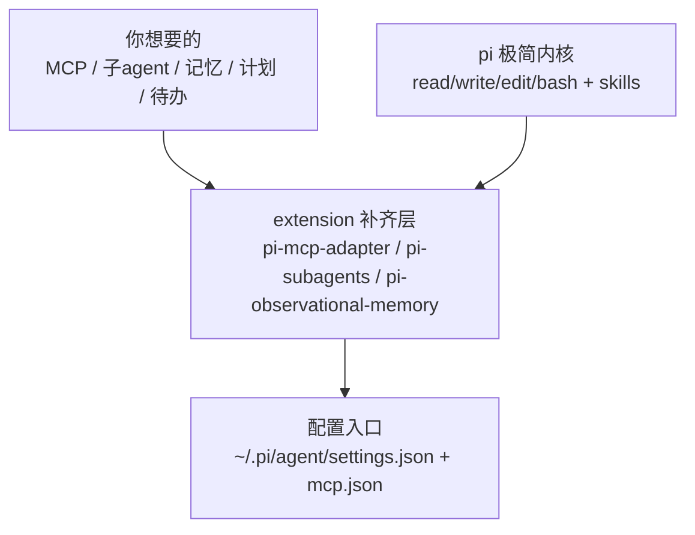
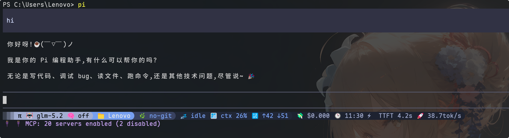
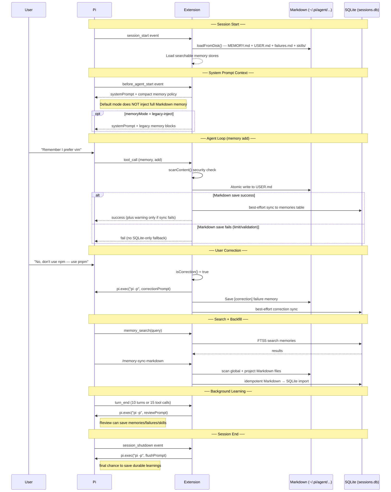

这篇是 **Pi Coding Agent 专题合订**。原生缺的器官用 extension 补；美化与记忆单独成章。

---

## 开荒：extension 一件件补

> 合并自原帖 `pi-coding-agent-handbook`

> **⚠️ 持续维护声明（2026-08-09）**：本文写于 pi 开荒期（08-06）。此后配置持续演进——① 记忆扩展 `pi-hermes-memory` 因破坏多行粘贴，已于 08-08 替换为 `pi-observational-memory`（观察式记忆 + 分层压缩，会话收尾自动记录）；② 后续补装 `pi-dynamic-workflows`（workflow 编排）+ 4 个本地扩展工具。正文保留开荒时的真实探索，**当前最新状态见文末「后来长出的器官」**。想看记忆机制本身，移步 [pi 靠什么记住事](/posts/pi-coding-agent-handbook/)。

手里 AI 编程工具越堆越多，pi 是这批里最特别的一个：官方文档明言它不带 MCP、不带子 agent、不带 plan 模式，连 TodoWrite 和后台 bash 都没有，走的是"primitives, not features"的极简内核。但开荒完回头看，最大的体会是一句话：**pi 缺的不是能力，是接入层——adapter 借来 MCP、subagents 借来子 agent、memory 借来记忆，真正的坑全在配置落地，不在装包。**

> pi 官方 usage.md 原话：It intentionally does not include built-in MCP, sub-agents, permission popups, plan mode, to-dos, or background bash.

> 材料说明：文中提到的吞吐结论（Anthropic 协议明显优于 OpenAI）来自对智谱两个协议的直连压测，不是 pi 自带的统计；pi 那 8 个会话里只有环境事实。别把两组数据搞混。

### 缺啥补啥，先画一张图

pi 的内核有多瘦？你能想到的"重设施"它一个都不带。这反而逼出一条干净的路：缺什么，就在 settings.json 里点名补什么。



三包加起来磁盘才 7MB，系统提示基本不受影响——这是"按需补件"和"全家桶"最大的区别。我的结论：**能少装绝不多装，每多一个包就多一份工具列表膨胀和 token 开销。**

| 缺失能力 | 补齐方案 | 配置入口 |
|---|---|---|
| MCP 桥接 | pi-mcp-adapter | mcp.json（imports 软引用） |
| 子 agent | pi-subagents | agents/*.md |
| 持久记忆 | pi-observational-memory（原 hermes，08-08 换） | 会话收尾自动记录 + recall 回溯 |
| plan / todo | pi-code 或独立小包 | settings.json |
| 后台 bash | extension / tmux | — |

### GLM-5.2 是纯文本，看图得自己搭梯子

接智谱 GLM-5.2 时踩了个认知坑：官方文档把 GLM-5.2 放在"文本模型"分类里，输入输出都是文本——**纯文本**！智谱的视觉能力在 GLM-5V-Turbo / GLM-4.6V 那批模型上。

对纯文本模型，看图就得多走一步：`MINIMAX_API_KEY` + openai SDK，把图片 base64 塞进消息，让 MiniMax 的视觉模型替 pi 看一眼。这条链路的 key、SDK、路径三个前置条件都得自己现场核，别信 AI 一句"已配好"。

MCP 里不想用的 server，`/mcp disable` 一行搞定，或写 `{disabled:true}`；全局禁用写 `~/.pi/agent/mcp.json`。

### 最大的坑不是缺功能，是 LANG 环境变量

开荒最烧时间的是中文乱码排查。查了一圈发现 `LANG` 在 pi 进程里是空的，而 `~/.bashrc` 明明有 `export LANG=zh_CN.UTF-8`——矛盾点在这：pi 执行命令走的是**非交互式 bash**（`shopt login_shell=off`），根本不读 `.bashrc`。

正解是 `setx LANG zh_CN.UTF-8`（注意只对新进程生效，改完要重开），或者靠早已在位的 `PYTHONUTF8=1` / `PYTHONIOENCODING=utf-8` 兜底。

> 教训：规范里写"去 ~/.bashrc 加一行"可能不适用于非交互启动的 CLI。环境问题的排查顺序：先确认进程形态（交互还是非交互），再谈改哪个文件。

### 版本号靠现场实测，别让 AI 的嘴替你做决定

让 AI 报依赖版本号是幻觉高发区。openai SDK 在 Claude Code 环境实测是 2.26.0，pi 环境可能是 2.46.0——两个环境并存，谁也别替谁做主。**版本这类可实证的东西，一律 `pip show` / `import` 现场看。**

装包顺序也有讲究：adapter → subagents → memory，一个一个来，每装一个验证一次，别一锅端。真出问题 `pi remove npm:<包>` 单独卸，不影响其他。

| 启动时的 MCP 报错 | 归因 | 处理 |
|---|---|---|
| supabase / vercel | needs auth（OAuth 未授权） | `/mcp-auth` 按需授权 |
| obsidian | server 端 inputSchema 校验失败 | 等 server 更新，不是 adapter 的锅 |
| github | 401 token 过期 | 重新配置凭证 |
| server 报 `must configure exactly one of command, url, socket` | 本地 server 与 imports 同名，`command`+`url` 字段级浅合并撞名 | 本地别重复配（让 imports 接管），或改名 / 换 transport |
| tavily 等 401 | env 写了 `${KEY}` 但 pi **不解析 `${}` 插值** | 本地硬编码 key，别用 `${}`；改完 TUI `/reload` |
| 其余 18 个 | 在线，146 tools | 正常用 |

### 三包七兆，九个小兵，命令就几条

pi-subagents 自带 9 个 builtin agent，全是"干一件具体事"的定位：

| agent | 干吗 |
|---|---|
| scout | 快速侦察（找文件、探目录） |
| reviewer | 审查代码 / 差异 |
| oracle | 深挖一个问题 |
| planner | 拆计划 |
| worker | 执行单项任务 |
| advisor / researcher / context-builder / delegate | 咨询 / 调研 / 上下文组装 / 委派 |

命令面也窄，记得住：

| 场景 | 命令 |
|---|---|
| 装扩展 | `pi install npm:X`（ECONNRESET 就换淘宝镜像重试） |
| 看已装 | `pi list` |
| 切模型 | `/model`（或 `/model provider/modelId`） |
| MCP 导入 / 禁用 | `/mcp setup` / `/mcp disable` |
| 会话树 / 压缩 | `/tree` / `/compact` |
| 重载扩展 | `/reload` |

### 记忆靠双保险：handoff prompt + memory 重索引

pi 没有原生自动记忆，得自己搭。开荒时我两路并进：交接时用 handoff prompt 把基线固化给下个会话；平时靠 `pi-hermes-memory` 的 SQLite FTS5 会话搜索，跨会话能捞回"上次踩过的坑"。

> **⚠️ 此方案已弃用（2026-08-08）**：`pi-hermes-memory` 会把粘贴的长文本拆成多条消息喂给模型（断章取义），实测破坏多行粘贴。已换 `pi-observational-memory`——会话收尾自动记录观察/反思、分层压缩，靠 `recall(id)` 精确回溯。下面 hermes 的机制细节留作历史，**别照着装**。

一个小坑：包文档里的 `/memory-index-sessions` 看着像斜杠命令，实际是内部 handler 名，重索引靠**重启触发自动 backfill**。别照着文档敲一个不存在的命令。

顺带一条取舍：pi-code 虽然一站式补齐 todo / memory / web / subagents，但它会读 `.claude` 配置，和我现有的三目录 skill 共享冲突，最后选择不装。**功能重叠的包，宁缺毋滥。**

### pi 开荒可抄清单（直接抄）

1. 配置分两级：全局 `~/.pi/agent/settings.json`，项目 `.pi/settings.json`
2. skills 三目录共享（`~/.claude/skills` + `~/.agents/skills` + `~/.pi/agent/skills`），不复制
3. mcp.json 用 imports 软引用，别硬拷贝 server 定义；但同名会撞（本地 + imports 浅合并触发 command/url 互斥）、`${}` 插值不解析、改完要 `/reload`
4. 装包顺序：adapter → subagents → memory，逐个验证
5. 装前备份：`cp settings.json settings.json.bak.<时间戳>`
6. GLM-5.2 纯文本，看图走 MiniMax 视觉回退
7. LANG 用 setx，别指望 pi 读 .bashrc
8. 版本号一律现场实测
9. 记忆用 handoff + observational 双保险（hermes 已弃，破坏多行粘贴）
10. 功能重叠的包（pi-code）宁缺毋滥

急救：`pi remove npm:<包>` 卸单个；`pi list` 看现状；`/reload` 让扩展生效；`/model glm-5-turbo` 换模型；配置炸了就用装前的备份还原。

### 后来长出的器官（持续维护）

开荒只是起点，pi 在本机一直在长新器官。补一份增量记录，让这篇别停留在 08-06 那天。

**接入层 → 编排层的升级**：开荒补的是"借能力"（MCP / 子 agent / 记忆），后来发现还缺"编排能力"——形状不固定的任务没法扇出。`pi-dynamic-workflows` 补的就是这块：一个 `workflow` 工具，写段 JS 就能 `parallel` / `pipeline` 调度多个子 agent。冒烟验证：`parallel` + 两个 `agent()` 一次跑通，比口头让模型"分头查"靠谱。至此 pi 从"接入层"补到了"编排层"。

**记忆扩展换代**：`pi-hermes-memory` → `pi-observational-memory`，原因上文说了——hermes 破坏多行粘贴。observational 走另一条路：不往系统提示灌记忆，而是会话收尾自动把关键观察/反思落盘、分层压缩，需要时 `recall(12位hex)` 精确拉回原始上下文。更轻，也不抢 token。

**四个本地扩展（自建工具）**：除开荒时唯一的 `rtk.ts`（bash 输出压缩），后来又写了三个——`assess-change`（git 变更/风险盘点）、`blog-context`（Firefly 博客上下文）、`pi-env`（会话/provider/模型自检）。共同点：把"手搓四五条 bash 拼上下文"固化成一个工具调用。固化思路见 [命令是快捷键，工具是仪表盘](/posts/pi-coding-agent-handbook/)。

> 一句话总结演进：**开荒补"能借到什么"，维护补"借来怎么编排、怎么固化"**。pi 的极简内核没变，变的是外挂的厚度。

---

把 Claude 的生态搬去别的工具，pi 给出了第三种答法：不搬运，用扩展一件件补。MCP、子 agent、记忆这些"器官"，它一个没长，但每个都能借。**开荒的最优解不是全都要，是缺啥借啥、坑现场踩** ☕(￣▽￣)ノ

---

## 命令是快捷键，工具是仪表盘

> 合并自原帖 `pi-coding-agent-handbook`

上一篇 [pi coding agent 开荒](/posts/pi-coding-agent-handbook/) 把接入层补完了：MCP 借 adapter、子 agent 借 subagents、记忆借 observational（原 hermes，08-08 换），全是"缺啥借啥"。可开荒完回头看，有个更扎眼的缺口没动过——**能接的都接了，能固化的一个没固化**。高频操作还在靠口头触发 skill，看环境还得手搓四五条 bash 拼上下文。这一篇就是补"产出层"：六个斜杠命令当快捷键，三个工具当仪表盘。

### 盘点完才发现：prompts 三处全空

对照 pi 官方文档列的六种扩展能力，本机现状一目了然：

| 扩展维度 | 现状 | 一句话 |
|---|---|---|
| custom provider | 5 家 provider、9 个启用模型 | 超额，接得很爽 |
| skill | 175 个躺平在三个目录 | 海量，但全靠口头触发 |
| pi package | 消费 5 个，自建 0 个 | 只进不出 |
| **prompt template** | 三个目录全不存在 | 🔴 完全空白 |
| **extension** | 只有 1 个 rtk.ts，只用了事件钩子 | 🟡 单一 |
| theme | 用着别人打的 catppuccin | 够用，不折腾 |

之前优化的重心一直在"输入侧"：接模型、接能力、省 token。而文档给的恰好是"输出侧"：把高频流程固化成命令、把本地信号结构化成工具、把整套配置打包分发。**两者互补不冲突——车改完动力，还缺快捷键和仪表盘。**

### 一份社区指南 + 官方 79 个脚手架

参考了一份把 pi 六种扩展串起来演示的实战指南（bibi-share 的 pi-agent 笔记），套路是拿"代码变更评估"当例子：一个 extension 喂结构化上下文、一个 skill 定评估口径、一个 prompt template 当入口。官方仓库 `packages/coding-agent/examples/extensions/` 里还躺着 79 个现成脚手架，从 `dirty-repo-guard` 到 `structured-output` 都有。

有指南、有脚手架，落差就清楚了：**不是能力不够，是没人把它们固化成"顺手的形态"。**

### 六个斜杠命令：文件名即命令

pi 的 prompt template 机制有个妙处：文件名就是命令，`commit.md` 就是 `/commit`。把成熟 skill 套一层入口文件，高频操作就从"说一句话触发"变成"敲一个斜杠"：

| 命令 | 映射 skill | 干的活 |
|---|---|---|
| `/commit` | commit-commands | 规范化提交，禁止自动 commit |
| `/dynamic` | dynamic-post | 在博客发一条动态，内容当参数 |
| `/extract` | knowledge-extract | 把会话提炼成知识笔记 |
| `/publish` | knowledge-output | 素材发布成博客文章 |
| `/status` | 配合 pi_env 工具 | 看环境全景 |
| `/assess` | 配合 assess_change 工具 | 评估工作区变更 |

命令本身只是"请使用 /skill:xxx"加参数传递，真正的流程在 skill 里——入口轻、逻辑不重复，是这套设计最顺的地方。参数替换支持 `$@`、`${1:-默认值}`，`/dynamic 好心情` 会把"好心情"原样传进去。

### 三个工具：上下文从"跑命令"变"拿 JSON"

命令解决入口，工具解决上下文。以前问"当前环境是什么样"，agent 得跑四五条 bash 自己拼；现在三个工具一次调用返回结构化 JSON：

| 工具 | 一句话 | 触发场景 |
|---|---|---|
| `pi_env` | 会话文件、模型、provider、扩展、包、主题一次打包 | 问环境/会话状态 |
| `blog_context` | 博客 git 状态、文章数、动态数、最近提交 | 博客项目干活时 |
| `assess_change` | diff、变更文件、配置改动、大文件分类 | 评估变更/准备提交 |

核心变化是**agent 拿到的从"零散命令输出"变成"固定结构"**——省掉反复试命令，也避免上下文被一堆输出污染。

### 踩坑三连：都是"想当然"害的

这三个坑几乎每个都是"文档没说、跑起来才发现"，写出来能帮人少走三段弯路：

**① session 信息别读环境变量。** 想当然以为 `process.env.PI_SESSION_FILE` 在扩展里能读，结果返回 null。查了 pi 的类型定义才明白：`PI_*` 变量是 pi 在调 bash 工具时注入的，扩展进程里根本没有。正解是 `ctx.sessionManager.getSessionFile() / getSessionId()`——session 信息在上下文里，不在环境里。

**② `ctx.model.id` 是裸 id。** 想当然以为 `model.id` 是 `provider/model` 这种带前缀格式，拿它 split 出 provider，结果 provider 栏显示成了模型名。实测裸 id 就是 `glm-5.2`，不带 provider 前缀。要 provider 得靠 `settings.defaultProvider` 兜底。

**③ 工具默认 cwd 可能不是仓库。** 变更评估工具默认在 `ctx.cwd` 跑 git，agent 的工作目录不是仓库时返回空结果。解法是给工具加可选 `cwd` 参数，并加 `isGitRepo` 检测——非仓库直接返回空结构，别让 git 报错喷一屏。

### 验收的教训：结构对不等于值对

三个工具跑通后，让 Pi 自己复核了一遍，它当场揪出两个问题：provider 串成了模型名（就是坑②），assess 工具没处理非仓库 cwd（就是坑③）。**自检只盯"结构对不对"是不够的，得盯"值对不对"**——返回 JSON 结构再规范，字段值错了就是错的。这一步独立复核比自己闷头测值钱得多。

### 可抄清单

1. 能力分两层看：接入层（provider/MCP/记忆）和产出层（命令/工具/打包），缺哪层补哪层
2. 高频 skill 套 prompt template 当入口，文件名即命令，逻辑仍在 skill 里不重复
3. 工具化场景：环境/项目状态这类"每次都要拼的上下文"，固化成 registerTool
4. session 信息走 `ctx.sessionManager`，别读 `process.env.PI_*`（那只注入给 bash）
5. `ctx.model.id` 是裸 id，要 provider 就兜底 defaultProvider
6. 跑 git 的工具加 `cwd` 参数 + `isGitRepo` 早退，防非仓库空结果
7. 交付前让另一个 AI 复核"值对不对"，别只看结构
8. 官方 `examples/extensions/` 79 个脚手架，抄之前先翻一遍

---

开荒是给车补动力，这篇是装快捷键和仪表盘。pi 从"能用"到"顺手"，差的不是能力，是把高频动作固化成固定形态的那一步 ☕(￣▽￣)ノ

---

## 主题与状态栏

> 合并自原帖 `pi-coding-agent-handbook`

手里 AI 编程工具越堆越多，pi 的脸算是这批里最朴素的：默认 `dark` 主题黑得发灰，底部一条光秃秃的状态栏。这画风跟它那套「primitives, not features」的极简内核倒是统一，但看久了确实想换换。

折腾一圈下来最核心的认知就一句：**pi 的美化分两类，主题随便装、状态栏只能装一个，搞反了就打架。** 这篇记一下装什么、怎么踩的坑，给同样想给 pi 整容的人抄作业。

### 主题和状态栏，根本不是一回事

pi 官方把美化拆成两块，机制完全不同，装法、共存性也截然相反。一开始没搞清这个分工，看清单上二十个包很容易犯选择困难。

| 维度 | 主题（Theme） | 状态栏 / UI 扩展（Extension） |
|---|---|---|
| 本体 | 一个 JSON，定义 51 个颜色 token | 一个 TS 模块，订阅事件渲染 footer |
| 共存 | 多装互不影响，切换用 | 抢 footer 渲染权，**装两个就打架** |
| 切换 | `/settings` 或改 `theme` 字段 | 装上就生效，`/reload` |
| 热重载 | 编辑当前主题文件自动重载 | 改源码后 `/reload` |
| 入口 | `~/.pi/agent/themes/*.json` 或 package | `~/.pi/agent/extensions/` 或 package |

记住这个分工，后面所有选择都不纠结了：**主题像换壁纸，想换就换、想留几个备着都行；状态栏像装输入法，同时装两个会互相抢权。**

### 装什么：两步到位的最稳组合

本来拿来一份二十个美化包的清单（主题包 + 状态栏扩展两大类），第一反应是不信——AI 编的包名十有八九是幻觉。结果逐个去 npm 查，居然全是真包，而且都带 `pi-package` 关键字，是货真价实的 pi 专用。这点得记一笔，下次别再重复验。

真要落地不用贪，先装最稳的一对把脸换掉：

- **主题挑 `@sherif-fanous/pi-catppuccin`** —— Catppuccin 是公认最护眼的配色，社区维护活跃，一次带四个变体（Mocha / Macchiato / Frappe / Latte），深浅全覆盖。
- **状态栏挑 `pi-inline-statusline`** —— 单行、响应式、信息不丢，默认 Tokyo Night 预设就很好看，零配置即用。

这套组合的好处是**互不冲突,装上立刻见效**。真不喜欢,`pi remove` 一条命令干净卸掉,不留尾巴。激进派想一步到位也可以上 `@rokiy/pi-ui`(带 Boxed Editor 那个 ╭─╮ 包裹),但它和状态栏是二选一,第一轮不建议冒险。

装完跑起来长这样，底部一行信息密度恰到好处，又不挤：



### 真正值得记的，是这两个坑

装主题本身没坑，`pi install npm:xxx` 一条命令就进 `settings.json` 的 `packages` 数组。真正让我翻车的，是后面优化时踩的两个配置坑。

#### 坑一：glm 系列压根不支持思考

zhipu 全家桶（glm-4-flash / glm-5-turbo / glm-5.2）在 `pi --list-models` 里 thinking 列全是 `no`。给它们设 `defaultThinkingLevel` 不会报错，但也不会触发——静默浪费。

正确做法不是设全局思考级别，而是**按场景切模型**：日常留 glm-5.2 省钱，遇到复杂任务 `Ctrl+P` 切到支持思考的备选。我在 `enabledModels` 里配了这几个，都是带思考的：

| 模型 | 什么时候切过去 |
|---|---|
| `deepseek/deepseek-v4-pro` | 推理 / 代码强，复杂调试 |
| `google/gemini-3-pro-preview` | 要看图 / 多模态 |
| `kimi-coding/k3` | 长上下文 coding |
| `minimax/MiniMax-M3` | 1M 上下文，读长文档 |

> 关于 pi 怎么把 adapter / subagents / memory 三包补齐内核能力的，可以看[这篇开荒记](/posts/pi-coding-agent-handbook/)。这篇只讲脸。

#### 坑二：enabledModels 会反噬默认模型

这个坑最隐蔽。`enabledModels` 一旦设置，就**接管**了 `Ctrl+P` 的循环列表，列表里没有的模型切不过去。第一次配的时候只列了四个备选，没把默认的 glm-5.2 加进去——结果切到 deepseek 就切不回来了，状态栏的模型名直接换走，人傻了。

修复就一条铁律：**配 enabledModels 时，默认模型必须放进数组，而且放第一位**。

```json
"enabledModels": [
  "zhipu-anthropic/glm-5.2",
  "deepseek/deepseek-v4-pro",
  "google/gemini-3-pro-preview",
  "kimi-coding/k3",
  "minimax/MiniMax-M3"
]
```

### 配完长什么样

下面是最终跑起来的 `settings.json`，删掉了和美化无关的字段，只留视觉相关的几行。一张表看完整配置思路：

| 字段 | 值 | 作用 |
|---|---|---|
| `theme` | `catppuccin-mocha` | Catppuccin 最深款，护眼 |
| `packages` | 含 catppuccin + inline-statusline | 一个管颜色，一个管 footer |
| `externalEditor` | `code --wait` | `Ctrl+G` 弹 VS Code 写长 prompt |
| `enabledModels` | 5 个（含默认） | `Ctrl+P` 循环切换，默认在内 |

### 几个能继续挖的方向

美化到这儿只是开了个头,pi 还有一堆没碰的能力。比如 `shell-aliases` 能把 `c` 直接等于 `git commit`;`keybindings` 改键位,挪不顺手的快捷键;`prompt-templates` 把常用 prompt 存成模板,`/template` 一键调;还有 `@rokiy/pi-ui` 那套带 Boxed Editor 的一体化 UI,不过它要替换现在的状态栏。这些都没装,等主题和状态栏用顺手了再决定要不要继续往上堆。**美化这事最怕一次堆太多,出了问题都不知道是哪个包的锅。**

### 一条速查

| 想做的事 | 怎么做 |
|---|---|
| 装包 | `pi install npm:<包名>` |
| 卸包 | `pi remove npm:<包名>` |
| 换主题 | `/settings` 或改 `"theme"` 字段 |
| 换状态栏预设 | `PI_STATUSLINE_PRESET=classic pi`（默认 tokyo-night） |
| 切模型 | `Ctrl+P`（受 `enabledModels` 限制） |
| 外部编辑器 | `Ctrl+G`（走 `externalEditor`） |
| 完全回滚 | 还原备份的 `settings.json.bak.*` |

---

## 记忆机制

> 合并自原帖 `pi-coding-agent-handbook`

> **⚠️ 已迁移声明（2026-08-09）**：本文扒的是 `pi-hermes-memory` 的架构（FTS5 / policy-only / Standing Instructions / 六个后台机制）。但该扩展已于 2026-08-08 **卸载**——它会破坏多行粘贴（把长文本拆成多条消息喂给模型，断章取义）。当前已换 `pi-observational-memory`（观察式记忆 + 分层压缩，会话收尾自动记录，`recall(id)` 回溯）。**下面的架构分析留作历史参考，别照着装 hermes。** 迁移详情见 [pi 开荒篇·后来长出的器官](/posts/pi-coding-agent-handbook/)。

用 pi 用了一阵，有个别扭的事一直没解决：关掉会话再开，它把你忘得干干净净。上次踩的坑、交代过的偏好、刚配好的 provider，全没了。每开一个新会话，等于跟一个失忆的人重新认识。

翻了文档才搞明白，这不是 bug，是设计。pi 原生压根不带长期记忆。它能记住事，全靠一个叫 pi-hermes-memory 的扩展撑着。

我顺手把这套机制扒了一遍，顺便把 Claude Code 那边攒的记忆同步过来。下面是我搞明白的。

### 三层，从最容易丢到最不容易丢

最上面一层是模型上下文。系统提示、AGENTS.md、当前对话，全在内存里。pi 有个 `/compact` 自动摘要防着撑爆，但本质上会话一结束就没了。它不是记忆，是工作内存。

往下一层是 pi 原生自带的。会话存成 `~/.pi/agent/sessions/` 下的 jsonl 文件，树结构，每条消息带 id 和 parentId。可以 `/resume` 接着上次的聊，`/fork` 从某一句岔出去重开。技能（skills）也是原生的，遵循 Agent Skills 标准，SKILL.md 配 frontmatter，按需加载。

但这层有个硬伤：只存原始会话，不帮你跨会话检索，也不提取事实。你想问「上次聊 auth 那次说了啥」，原生 pi 答不上来。


### 真正让 pi 记住事的那个扩展

pi-hermes-memory 的 README 第一句话挺老实：

> Your Pi agent normally forgets everything when you close a session. This extension fixes that.

它管三类东西。事实放 `MEMORY.md`，用户画像放 `USER.md`，失败教训单独一个 `failures.md`。每个文件 5000 字符封顶。技能复用 pi 原生的 SKILL.md，不另起炉灶。

记忆分两层。全局的放 `~/.pi/agent/pi-hermes-memory/`，名字、操作系统、偏好这类到处适用的。项目级的放 `projects-memory/<项目>/`，绑某个代码库的架构决策、API 怪癖。检索靠一个 SQLite 的 FTS5 全文索引，`memory_search` 和 `session_search` 都查它。

有个细节挺有意思：`session_search` 检索的其实是 pi 原生那些 jsonl 会话，但索引是这个扩展建的。两层是协作，不是各管各的。

### 它默认不把记忆塞给你，得你自己来要

这是我觉得最值得说的一处。

扩展默认的策略，是不把完整记忆灌进系统提示。它只在提示里放一段叫 `<memory-policy>` 的指令，告诉 agent：可能用到持久记忆时，去调 `memory_search`。

换句话说，记忆是参考资料（context），不是必须照办的指令（instruction）。repo 里的代码、工具的实际输出，优先级都比记忆高。

这么干主要为了省 token。第一次对话不用把一堆记忆全塞进去。代价是召回变成概率性的：agent 得在动手前主动想起来去搜，搜了才会用到。

### 禁令为什么要单独拎出来

policy-only 有个绕不开的毛病。一条「禁止做 X」的规则，只有在 agent 动手前恰好搜到它才生效。可 agent 恰恰在最该遵守禁令的那一刻，没有理由去搜。

所以扩展搞了个 Standing Instructions。`/memory-pin` 命令把条目写进 `STANDING.md`，每个会话都注入，不靠召回。

几个设计挺克制。上限 20 条、2000 字符，硬截断。只能用户手写或用命令，agent 没法把自己的记忆偷偷提权到这。每条都要过和普通记忆一样的安全扫描。

它区分了两种东西：可以召回去用的事实，和必须每次都看见的禁令。

### 这套机制在后台一直跑

扒存储目录的时候，能看到证据。


写记忆不是直接覆盖。每次写之前先存一份 `.MEMORY.md.recovery-` 快照，带时间戳。我数了一下，这种 recovery 文件几十个。崩了能回滚。

并发写有锁，一个 `.pi-hermes-locks.sqlite`，WAL 模式，防几个会话同时写坏。

后台学习每 10 轮对话或 15 次工具调用复盘一次，自动存有价值的东西。用户纠正 agent 的时候立刻存，不等回合末。

容量管理靠 auto-consolidation，文件满了不报错，自动合并。我自己写记忆就撞上了：`failures.md` 写到 91%，下次再写就该触发合并。而且我之前写的一条 StepFun 鉴权规则，内容比我单次存进去的更全，已经被合并增强过了。

密钥扫描是我比较在意的一点。每次写记忆前都扫 API key、token、SSH key，拦下来不存。前几轮我不小心把一个 MiniMax key 明文打到终端输出里，要是写记忆时再把 key 带进去就更糟。扩展挡的不只是手滑，还有 prompt injection 把恶意内容骗进记忆、之后再被搜出来的攻击路子。

### 这套东西不是从零写的

翻扩展的 ROADMAP，它明说从 Hermes Agent port 过来，还做了竞品对照。



Hermes 的记忆是三层：L1 持久记忆（`MEMORY.md` + `USER.md`），L2 技能（`SKILL.md`），L3 会话全文搜索（FTS5）。pi 这个扩展基本对上了。Hermes 还有个 L4，接 Honcho、Mem0 这些外部 provider 做更深的用户建模，pi 这边还没做。

知道这个背景，有些设计就讲得通了。比如 `MEMORY.md` 用 `§` 符号分隔条目、带 created/last 时间戳，这套是从 Hermes 继承的格式。

### 扒完之后

AI 编程工具的「记忆」不是单一的东西。至少得分清楚：工作内存、原始会话、可召回的事实、必须遵守的禁令。混在一起，要么 token 爆掉，要么该记的记不住、该遵守的想不起来。pi 这个扩展的分层，把这几样拆开了，各自走各自的机制。

它也不完美。policy-only 省了 token，但召回是概率性的，关键禁令得靠 Standing Instructions 单独兜底。auto-consolidation 不丢数据，可合并之后具体留了什么、改写了什么，你也说不清（我看到自己写的记忆被增强过，说不上是好事还是有点不安）。

我同步 Claude Code 记忆过来时，最直接的感受是：同一个用户在两个 agent 上攒的记忆高度重叠，但格式、容量、注入策略都不一样。CC 按项目分目录、每个主题一个 md，pi 是全局几个文件加 5000 字符上限。同步不是搬运，是挑各自缺的、有价值的，重新组织。

如果你也用 pi，这套机制值得花十分钟搞明白。不然它要么帮你记一堆你没意识到的，要么你想让它记住的它没记住，两边都不踏实。

之前写过一篇 [Claude Code 自己的记忆机制是怎么跑的](/posts/claude-code-handbook/)，可以对着看。

---

## GLM thinking 死循环：provider 配错了

> 合并自原帖 `pi-coding-agent-handbook`

用 Pi 接智谱 GLM-5.2 写代码，模型在 thinking 阶段反复重复同一句话 50 多次，工具调用卡住不动。折腾了一圈发现，GLM 本身支持 thinking，问题出在 provider 协议层——自定义的 Anthropic 兼容端点根本不走 GLM 的 thinking 协议。

### 踩坑现场

Pi v0.83.0，自定义 provider `zhipu-anthropic`，端点 `open.bigmodel.cn/api/anthropic`，模型 glm-5.2，thinking level 开 high。

死循环的三种表现：

- thinking 阶段同一句话重复 50+ 次，每轮都生成"我注意到 thinking 又在重复……立即停止"这种自我纠正，但纠正本身也成了重复内容
- 模型在微决策点上反复横跳——"该先确认方案还是直接开干"能重复十几次
- 多轮对话间完全失忆，每轮都从零开始，工具调用卡住输出 "Working..." 但不动

### 根因：provider 协议错配

`models.json` 里 `zhipu-anthropic` 只写了 `reasoning: true`，没有 `thinkingFormat`、没有 `thinkingLevelMap`、没有 `compat`。Pi 拿到 `reasoning: true` 就按标准 Anthropic thinking 协议发请求（`thinking.type: "enabled"` + budget），但智谱的 Anthropic 兼容端点对这个协议支持不完整。

GLM 走的是自己的 **Preserved Thinking** 协议，跟标准 Anthropic thinking 不是一回事：

| | 标准 Anthropic thinking | GLM Preserved Thinking |
|---|---|---|
| 协议标记 | `thinking.type: "enabled"` | `thinkingFormat: "zai"` |
| 状态保持 | 靠 `thinkingSignature` | 靠回传 `reasoning_content` |
| 清除控制 | 无 | `clear_thinking: false` |
| 端点要求 | Anthropic Messages API | OpenAI Completions API |

Anthropic 兼容端点不回传 `reasoning_content`，GLM 每轮都丢失推理状态，等于每次都在"重新思考"，表现为死循环。

这个问题不止 Pi 有。Goose（#7363）、oh-my-pi（#517）、OpenClaw 都踩过同一个坑——只要走 Anthropic 兼容端点 + GLM，就会丢 reasoning state。

### 修复：换 provider，一行配置的事

Pi 内置了 `zai-coding-cn` provider，走 OpenAI 协议，端点 `open.bigmodel.cn/api/coding/paas/v4`，自带完整的 `thinkingFormat: "zai"` + `thinkingLevelMap` + `compat` 配置。

改两个文件：

**`~/.pi/agent/settings.json`**：

```json
{
  "defaultProvider": "zai-coding-cn",
  "defaultModel": "glm-5.2",
  "enabledModels": ["zai-coding-cn/glm-5.2", "..."]
}
```

**`~/.pi/agent/auth.json`**：添加 `zai-coding-cn` 的 key（和 zhipu 用同一个智谱 API key 就行）。

改完重启 Pi，完事。

### 验证结果

修完后跑了 6 轮递进测试——查目录、读组件、分析 CSS、搜关键词、查 session 信息。20 条 assistant 消息、33 次工具调用：

- thinking 零重复，长度 53~6915 chars，和任务复杂度正相关
- 工具调用链健康，无同参数反复调用
- 多轮记忆完整，第 3 轮能引用第 2 轮的结果
- 零报错、零 abort、零超时

### 记住这几点

1. **GLM 支持 thinking，但只在自己的协议下**。走 Anthropic 兼容端点就会丢 reasoning state。
2. **自定义 provider 时 `reasoning: true` 不够**，必须配 `thinkingFormat` 和 `compat`，否则 Pi 会按错误的协议发请求。
3. **优先用 Pi 内置 provider**。`zai`（国际）和 `zai-coding-cn`（国内）已经配好了正确的 thinking 参数，别自己造轮子。
4. **Z.AI 的 Preserved Thinking 是特有协议**，需要 `reasoning_content` 回传 + `clear_thinking: false`，和标准 Anthropic thinking 不兼容。

### 参考

- [Z.AI Preserved Thinking 官方文档](https://docs.z.ai/guides/capabilities/thinking-mode)
- [Pi Discussion #292 — GLM thinking tag leakage](https://github.com/badlogic/pi-mono/discussions/292)
- [oh-my-pi #517 — GLM-5 thinking loops](https://github.com/can1357/oh-my-pi/issues/517)
- [goose #7363 — GLM loses reasoning state](https://github.com/aaif-goose/goose/issues/7363)

---

## 官方坐标与补强备注

补强：Pi 的 provider / 模型路由配错时，会出现「像模型坏了」的 thinking 环——先查配置再怪模型。主题与 statusline 别一次贪多套。
